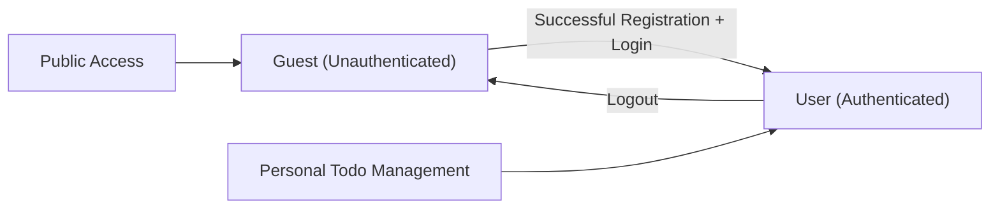
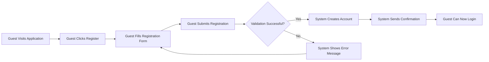
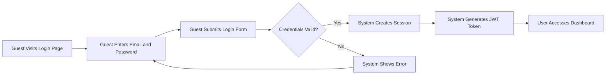
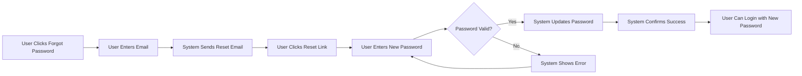
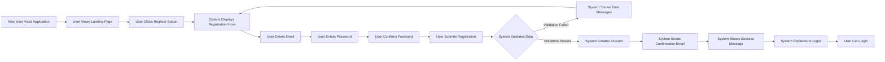
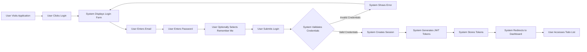
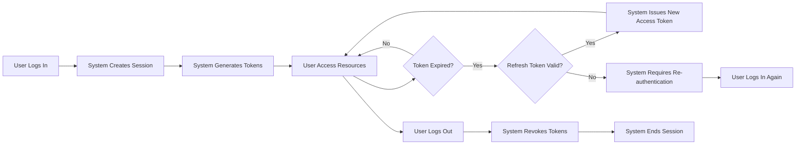

# User Actors and Authentication Requirements

## Document Overview

This document defines the complete user authentication and authorization foundation for the Todo list application. It establishes all user actor types, their permissions, and comprehensive authentication system requirements including registration, login, session management, password management, and security requirements.

This document describes **business requirements only** - all technical implementation decisions (architecture, API design, database schemas, encryption methods, etc.) are at the discretion of the development team.

## User Actor Definitions

The Todo list application supports two distinct user actor types, each with clearly defined permissions and capabilities.

### Guest Actor (Unauthenticated Users)

**Definition**: A Guest is any unauthenticated user who accesses the application without logging in.

**Capabilities**:
- Guests can view the application landing page
- Guests can access the user registration form
- Guests can access the login form
- Guests can submit registration requests to create a new account
- Guests can submit login requests to authenticate

**Restrictions**:
- Guests cannot create any todo items
- Guests cannot view any todo items
- Guests cannot access any user-specific functionality
- Guests cannot access the main todo management interface
- Guests have no persistent data or session beyond registration/login attempts

**Business Purpose**: The Guest actor exists to allow new users to discover the application and create accounts, while protecting all todo data from unauthorized access.

### User Actor (Authenticated Members)

**Definition**: A User is an authenticated member who has successfully registered and logged into the application.

**Capabilities**:
- Users can create new todo items in their personal list
- Users can view all their own todo items
- Users can update their own todo items (title, description, status, etc.)
- Users can delete their own todo items
- Users can mark their todo items as complete or incomplete
- Users can manage their account settings
- Users can change their password
- Users can log out to end their session
- Users can filter and organize their own todo items

**Restrictions**:
- Users cannot view other users' todo items
- Users cannot modify other users' todo items
- Users cannot delete other users' todo items
- Users cannot access other users' account information
- Users have complete data isolation - each user operates in their own isolated workspace

**Business Purpose**: The User actor represents the primary application user who manages their personal todo list with complete privacy and data isolation.

### Actor Hierarchy



**Actor Transition Rules**:
- WHEN a guest successfully registers and logs in, THE system SHALL transition them to User actor status
- WHEN a user logs out, THE system SHALL end their authenticated session and transition them to Guest actor status
- THE system SHALL maintain strict boundaries between Guest and User capabilities

## Complete Authentication System Requirements

### Core Authentication Functions

The authentication system provides essential identity management functions that users require to access and secure their accounts.

**User Registration**:
- Guests can register for a new account by providing required information
- THE system SHALL validate all registration information before creating an account
- WHEN registration is successful, THE system SHALL create a new user account
- WHEN registration fails validation, THE system SHALL provide clear error messages

**User Login**:
- Users can log in to access their account by providing credentials
- THE system SHALL validate user credentials against stored account information
- WHEN login is successful, THE system SHALL create an authenticated session
- WHEN login fails, THE system SHALL provide appropriate error messages without revealing security details

**User Logout**:
- Users can log out to end their authenticated session
- WHEN a user logs out, THE system SHALL immediately invalidate their current session
- WHEN a user logs out, THE system SHALL remove authentication tokens
- THE system SHALL ensure no user data remains accessible after logout

**Session Management**:
- THE system SHALL maintain user sessions securely after successful login
- THE system SHALL automatically expire sessions after a defined period of inactivity
- THE system SHALL allow users to have only one active session or multiple sessions based on security policy
- WHEN a session expires, THE system SHALL require re-authentication

### Registration Process Requirements

The registration process allows new users to create accounts and begin using the Todo list application.



**Registration Information Requirements**:
- THE system SHALL require an email address for registration
- THE system SHALL require a password for registration
- THE system SHALL require password confirmation to prevent typos
- THE system SHALL optionally collect a display name or username

**Registration Validation Requirements**:
- WHEN a guest submits registration, THE system SHALL validate the email format
- WHEN a guest submits registration, THE system SHALL check if the email is already registered
- WHEN a guest submits registration, THE system SHALL validate password strength
- WHEN a guest submits registration, THE system SHALL verify password and confirmation match
- IF the email is already registered, THEN THE system SHALL reject registration with an appropriate message
- IF validation fails, THEN THE system SHALL display specific error messages for each validation failure

**Email Validation Rules**:
- THE system SHALL accept only valid email address formats
- THE system SHALL treat email addresses as case-insensitive
- THE system SHALL trim whitespace from email addresses
- THE system SHALL reject email addresses exceeding 255 characters

**Password Validation Rules**:
- THE system SHALL require passwords to be at least 8 characters long
- THE system SHALL require passwords to contain at least one uppercase letter
- THE system SHALL require passwords to contain at least one lowercase letter
- THE system SHALL require passwords to contain at least one number
- THE system SHALL optionally require passwords to contain at least one special character
- THE system SHALL reject passwords exceeding 128 characters
- THE system SHALL not store passwords in plain text

**Registration Success Behavior**:
- WHEN registration is successful, THE system SHALL create a new user account
- WHEN registration is successful, THE system SHALL send a confirmation to the user's email
- WHEN registration is successful, THE system SHALL display a success message
- WHEN registration is successful, THE system SHALL direct the user to the login page
- THE system SHALL optionally verify the user's email before allowing login

**Registration Error Scenarios**:
- IF the email is already in use, THEN THE system SHALL display "This email is already registered"
- IF the email format is invalid, THEN THE system SHALL display "Please enter a valid email address"
- IF the password is too weak, THEN THE system SHALL display specific password requirements
- IF passwords do not match, THEN THE system SHALL display "Passwords do not match"
- IF required fields are missing, THEN THE system SHALL display "Please fill in all required fields"

### Login Process Requirements

The login process authenticates users and grants them access to their personal todo lists.



**Login Information Requirements**:
- THE system SHALL require an email address for login
- THE system SHALL require a password for login
- THE system SHALL provide a "Remember Me" option for extended sessions
- THE system SHALL provide a "Forgot Password" link for password recovery

**Login Validation Requirements**:
- WHEN a user submits login credentials, THE system SHALL validate the email format
- WHEN a user submits login credentials, THE system SHALL verify the email exists in the system
- WHEN a user submits login credentials, THE system SHALL verify the password matches the stored password
- WHEN login validation succeeds, THE system SHALL respond within 2 seconds
- WHEN login validation fails, THE system SHALL respond within 2 seconds to prevent timing attacks

**Login Success Behavior**:
- WHEN login is successful, THE system SHALL create an authenticated session
- WHEN login is successful, THE system SHALL generate a JWT access token
- WHEN login is successful, THE system SHALL generate a JWT refresh token
- WHEN login is successful, THE system SHALL redirect the user to their todo dashboard
- WHEN login is successful, THE system SHALL record the login timestamp
- IF "Remember Me" is selected, THEN THE system SHALL extend the session duration

**Login Error Scenarios**:
- IF credentials are invalid, THEN THE system SHALL display "Invalid email or password"
- IF the email is not registered, THEN THE system SHALL display "Invalid email or password"
- IF the password is incorrect, THEN THE system SHALL display "Invalid email or password"
- IF the account is locked or suspended, THEN THE system SHALL display "Account access is restricted"
- IF too many failed login attempts occur, THEN THE system SHALL temporarily lock the account
- THE system SHALL not reveal whether the email exists when login fails

**Security Requirements for Login**:
- THE system SHALL rate-limit login attempts to prevent brute force attacks
- THE system SHALL lock accounts after 5 consecutive failed login attempts within 15 minutes
- THE system SHALL unlock accounts automatically after 30 minutes or via password reset
- THE system SHALL log all login attempts for security monitoring
- THE system SHALL use secure password comparison methods that prevent timing attacks

### Logout Process Requirements

The logout process allows users to securely end their authenticated sessions.

**Logout Action**:
- Users can logout by clicking a logout button or link
- WHEN a user initiates logout, THE system SHALL immediately invalidate the current session
- WHEN a user initiates logout, THE system SHALL invalidate the current JWT access token
- WHEN a user initiates logout, THE system SHALL invalidate the current JWT refresh token
- WHEN a user initiates logout, THE system SHALL clear any client-side authentication data
- WHEN logout is complete, THE system SHALL redirect the user to the login page or landing page

**Logout Confirmation**:
- THE system SHALL optionally ask for logout confirmation if the user has unsaved work
- WHEN logout is successful, THE system SHALL display a confirmation message
- THE system SHALL ensure no user data remains accessible after logout

**Session Invalidation Requirements**:
- WHEN a user logs out, THE system SHALL immediately revoke all active tokens
- WHEN a user logs out, THE system SHALL prevent those tokens from being used again
- THE system SHALL maintain a token revocation list or equivalent mechanism
- THE system SHALL clear all server-side session data associated with the user

### Session Management Requirements

Session management ensures users remain authenticated during their interaction with the application while maintaining security.

**Session Creation**:
- WHEN a user successfully logs in, THE system SHALL create a new session
- WHEN a session is created, THE system SHALL generate a unique session identifier
- WHEN a session is created, THE system SHALL record the session start time
- WHEN a session is created, THE system SHALL associate the session with the user's account

**Session Duration**:
- THE system SHALL maintain sessions for 7 days with "Remember Me" enabled
- THE system SHALL maintain sessions for 24 hours without "Remember Me"
- THE system SHALL expire sessions after 30 minutes of inactivity
- WHEN a session expires, THE system SHALL require the user to log in again

**Session Activity**:
- WHEN a user performs any action, THE system SHALL update the last activity timestamp
- THE system SHALL consider sessions inactive when no actions occur within the timeout period
- THE system SHALL automatically extend sessions when users are actively using the application

**Session Termination**:
- WHEN a user logs out, THE system SHALL terminate the session immediately
- WHEN a session expires, THE system SHALL remove all session data
- WHEN a user changes their password, THE system SHALL terminate all other sessions
- THE system SHALL allow users to view and terminate active sessions from other devices

**Concurrent Session Handling**:
- THE system SHALL allow users to have multiple concurrent sessions from different devices
- THE system SHALL display active sessions to users in account settings
- THE system SHALL allow users to revoke specific sessions remotely
- WHEN a user selects "Logout from all devices", THE system SHALL terminate all active sessions

## Password Management Requirements

Password management provides users with secure methods to create, change, and recover their passwords.

### Password Creation and Strength Requirements

**Password Strength Validation**:
- THE system SHALL enforce minimum password length of 8 characters
- THE system SHALL require at least one uppercase letter (A-Z)
- THE system SHALL require at least one lowercase letter (a-z)
- THE system SHALL require at least one numeric digit (0-9)
- THE system SHALL optionally require at least one special character (!@#$%^&*)
- THE system SHALL reject passwords longer than 128 characters
- THE system SHALL reject commonly used passwords (e.g., "Password123", "12345678")

**Password Strength Feedback**:
- WHEN a user creates a password, THE system SHALL provide real-time strength feedback
- THE system SHALL display password requirements clearly during registration and password change
- THE system SHALL indicate which requirements are met and which are not
- THE system SHALL show password strength level (weak, medium, strong)

### Password Reset Flow

Users who forget their passwords can recover access through a secure password reset process.



**Password Reset Request**:
- Users can request password reset by providing their email address
- WHEN a user requests password reset, THE system SHALL validate the email format
- WHEN a user requests password reset, THE system SHALL send a reset link to the email if it exists
- WHEN a user requests password reset, THE system SHALL display a confirmation message regardless of email existence
- THE system SHALL not reveal whether an email exists in the system

**Password Reset Link Requirements**:
- THE system SHALL generate a unique, secure reset token for each request
- THE system SHALL include the reset token in the password reset email
- THE system SHALL expire reset tokens after 1 hour
- THE system SHALL invalidate reset tokens after they are used once
- THE system SHALL prevent reset token reuse or sharing

**Password Reset Email**:
- THE system SHALL send password reset emails within 2 minutes of the request
- THE system SHALL include a secure reset link in the email
- THE system SHALL include instructions for resetting the password
- THE system SHALL include a warning that the link expires in 1 hour
- THE system SHALL include a note to ignore the email if the user did not request it

**Password Reset Completion**:
- WHEN a user clicks the reset link, THE system SHALL validate the token
- WHEN a user clicks the reset link, THE system SHALL check if the token has expired
- IF the token is valid, THEN THE system SHALL display a password reset form
- IF the token is invalid or expired, THEN THE system SHALL display an error and offer to send a new reset link
- WHEN a user submits a new password, THE system SHALL validate password strength
- WHEN the new password is valid, THE system SHALL update the user's password
- WHEN the password is updated, THE system SHALL invalidate all existing sessions
- WHEN the password is updated, THE system SHALL send a confirmation email

**Password Reset Security**:
- THE system SHALL rate-limit password reset requests to 3 per hour per email
- THE system SHALL log all password reset attempts for security monitoring
- THE system SHALL notify users via email when their password is changed
- THE system SHALL require users to log in again after password reset

### Password Change Flow

Authenticated users can change their passwords from their account settings.

**Password Change Requirements**:
- Users can change their password while logged in
- WHEN a user requests password change, THE system SHALL require the current password
- WHEN a user requests password change, THE system SHALL require a new password
- WHEN a user requests password change, THE system SHALL require new password confirmation
- THE system SHALL validate the current password before allowing change

**Password Change Validation**:
- WHEN a user submits password change, THE system SHALL verify the current password is correct
- WHEN a user submits password change, THE system SHALL validate the new password meets strength requirements
- WHEN a user submits password change, THE system SHALL verify new password and confirmation match
- WHEN a user submits password change, THE system SHALL ensure new password differs from current password
- IF current password is incorrect, THEN THE system SHALL reject the change with appropriate error

**Password Change Success**:
- WHEN password change is successful, THE system SHALL update the stored password
- WHEN password change is successful, THE system SHALL send a confirmation email
- WHEN password change is successful, THE system SHALL optionally terminate other sessions
- WHEN password change is successful, THE system SHALL display a success message
- WHEN password change is successful, THE system SHALL log the password change event

## Token Management (JWT) Requirements

The application uses JSON Web Tokens (JWT) for secure, stateless authentication. Tokens carry user identity and permissions, enabling the system to verify authenticated requests.

### JWT Structure and Payload

**JWT Payload Requirements**:
- THE system SHALL include the user's unique identifier (userId) in the JWT payload
- THE system SHALL include the user's role or actor type in the JWT payload
- THE system SHALL include the user's email address in the JWT payload
- THE system SHALL include the token issue timestamp (iat) in the JWT payload
- THE system SHALL include the token expiration timestamp (exp) in the JWT payload
- THE system SHALL include a unique token identifier (jti) in the JWT payload for revocation tracking

**Example JWT Payload Structure**:
```
{
  "userId": "unique-user-identifier",
  "email": "user@example.com",
  "role": "user",
  "iat": 1678901234,
  "exp": 1678903034,
  "jti": "unique-token-id"
}
```

**JWT Security Requirements**:
- THE system SHALL sign all JWTs with a secure secret key
- THE system SHALL use a strong signing algorithm (e.g., HS256 or RS256)
- THE system SHALL validate JWT signatures on every request
- THE system SHALL reject JWTs with invalid signatures
- THE system SHALL reject expired JWTs
- THE system SHALL reject JWTs with missing required claims

### Access Token Specifications

Access tokens provide short-lived authentication for user requests.

**Access Token Properties**:
- THE system SHALL generate access tokens upon successful login
- THE system SHALL set access token expiration to 30 minutes
- THE system SHALL include user identity and permissions in access tokens
- WHEN an access token is used, THE system SHALL validate its signature and expiration
- WHEN an access token expires, THE system SHALL require refresh or re-authentication

**Access Token Usage**:
- Users must include the access token in requests to access protected resources
- WHEN a request includes an access token, THE system SHALL validate the token before processing
- WHEN a request includes an invalid access token, THE system SHALL reject the request with authentication error
- WHEN a request includes an expired access token, THE system SHALL reject the request and prompt for refresh

**Access Token Renewal**:
- WHEN an access token expires, THE system SHALL allow renewal using a valid refresh token
- THE system SHALL issue a new access token when a valid refresh token is provided
- THE system SHALL maintain the same user identity and permissions in the renewed token

### Refresh Token Specifications

Refresh tokens provide long-lived authentication renewal capability without requiring users to re-enter credentials frequently.

**Refresh Token Properties**:
- THE system SHALL generate refresh tokens upon successful login
- THE system SHALL set refresh token expiration to 7 days for standard sessions
- THE system SHALL set refresh token expiration to 30 days when "Remember Me" is enabled
- THE system SHALL store refresh tokens securely
- THE system SHALL allow refresh tokens to be used only for obtaining new access tokens

**Refresh Token Usage**:
- WHEN an access token expires, users can request a new access token using their refresh token
- WHEN a refresh token is used, THE system SHALL validate its signature and expiration
- WHEN a refresh token is valid, THE system SHALL issue a new access token
- WHEN a refresh token is valid, THE system SHALL optionally issue a new refresh token (token rotation)
- WHEN a refresh token is invalid or expired, THE system SHALL require full re-authentication

**Refresh Token Revocation**:
- WHEN a user logs out, THE system SHALL revoke the associated refresh token
- WHEN a user changes password, THE system SHALL revoke all refresh tokens for that user
- WHEN a user selects "Logout from all devices", THE system SHALL revoke all refresh tokens
- THE system SHALL maintain a revocation list to prevent revoked tokens from being used

**Refresh Token Security**:
- THE system SHALL implement token rotation (issue new refresh token with each use)
- THE system SHALL detect and prevent refresh token reuse attacks
- IF a revoked refresh token is used, THEN THE system SHALL log the security event
- THE system SHALL rate-limit refresh token requests to prevent abuse

### Token Storage and Security

**Client-Side Token Storage**:
- THE system SHALL store access tokens in browser localStorage or sessionStorage
- THE system SHALL optionally store refresh tokens in httpOnly cookies for enhanced security
- THE system SHALL never store tokens in plain text in URLs or logs
- THE system SHALL clear all tokens from storage upon logout

**Token Transmission Security**:
- THE system SHALL transmit tokens only over HTTPS connections
- THE system SHALL include tokens in HTTP Authorization headers (Bearer scheme)
- THE system SHALL never include tokens in URL query parameters
- THE system SHALL protect tokens from cross-site scripting (XSS) attacks

**Token Lifecycle Management**:
- THE system SHALL track all issued tokens for security auditing
- THE system SHALL allow administrators to revoke tokens if necessary
- THE system SHALL clean up expired tokens from storage regularly
- THE system SHALL provide users with visibility into active tokens/sessions

## Permission Matrix

The permission matrix defines exactly what actions each user actor can perform in the Todo list application.

### Complete Feature Access Control

| Feature / Action | Guest (Unauthenticated) | User (Authenticated) |
|-----------------|------------------------|---------------------|
| **Authentication & Account** |
| View landing page | ✅ Allowed | ✅ Allowed |
| Access registration form | ✅ Allowed | ✅ Allowed |
| Submit registration | ✅ Allowed | ✅ Allowed |
| Access login form | ✅ Allowed | ✅ Allowed |
| Submit login request | ✅ Allowed | ✅ Allowed |
| Logout | ❌ Not applicable | ✅ Allowed |
| Change password | ❌ Denied | ✅ Allowed (own account) |
| Reset password | ✅ Allowed (via email) | ✅ Allowed (via email) |
| View account settings | ❌ Denied | ✅ Allowed (own account) |
| **Todo Management** |
| View todo dashboard | ❌ Denied | ✅ Allowed (own todos only) |
| Create new todo | ❌ Denied | ✅ Allowed |
| View todo list | ❌ Denied | ✅ Allowed (own todos only) |
| View todo details | ❌ Denied | ✅ Allowed (own todos only) |
| Update todo | ❌ Denied | ✅ Allowed (own todos only) |
| Delete todo | ❌ Denied | ✅ Allowed (own todos only) |
| Mark todo complete | ❌ Denied | ✅ Allowed (own todos only) |
| Mark todo incomplete | ❌ Denied | ✅ Allowed (own todos only) |
| Filter todos | ❌ Denied | ✅ Allowed (own todos only) |
| Search todos | ❌ Denied | ✅ Allowed (own todos only) |
| **Data Access** |
| View own data | ❌ No data | ✅ Allowed |
| View other users' data | ❌ Denied | ❌ Denied |
| Modify own data | ❌ No data | ✅ Allowed |
| Modify other users' data | ❌ Denied | ❌ Denied |
| Delete own data | ❌ No data | ✅ Allowed |
| Delete other users' data | ❌ Denied | ❌ Denied |

### Actor-Based Access Rules

**Guest Actor Access Rules**:
- WHEN a guest attempts to access todo management features, THE system SHALL deny access and redirect to login
- WHEN a guest attempts to view todo data, THE system SHALL deny access and display authentication required message
- WHEN a guest attempts to create a todo, THE system SHALL deny access and prompt for login
- THE system SHALL allow guests to access only public pages and authentication forms

**User Actor Access Rules**:
- WHEN a user attempts to view todos, THE system SHALL return only that user's own todos
- WHEN a user attempts to modify a todo, THE system SHALL verify the todo belongs to that user
- WHEN a user attempts to delete a todo, THE system SHALL verify the todo belongs to that user
- IF a user attempts to access another user's todo, THEN THE system SHALL deny access with authorization error
- THE system SHALL enforce complete data isolation between users

**Data Isolation Requirements**:
- THE system SHALL never display one user's todos to another user
- THE system SHALL prevent users from accessing todo IDs that do not belong to them
- THE system SHALL filter all database queries by the authenticated user's ID
- IF a user guesses or constructs a URL to another user's todo, THEN THE system SHALL deny access
- THE system SHALL log unauthorized access attempts for security monitoring

## Authentication Workflows

These workflows describe the complete user journeys through authentication processes, showing the step-by-step interactions from the user's perspective.

### User Registration Journey

This workflow shows how a new user creates an account and gains access to the Todo list application.



**Registration Journey Steps**:
1. New user visits the application landing page
2. User views information about the Todo list application
3. User clicks the "Register" or "Sign Up" button
4. System displays the registration form with required fields
5. User enters their email address
6. User creates a password
7. User confirms the password by entering it again
8. User submits the registration form
9. System validates all entered information
10. If validation fails, system displays specific error messages and user corrects the information
11. If validation succeeds, system creates the new user account
12. System sends a confirmation email to the user's email address
13. System displays a success message confirming registration
14. System redirects the user to the login page
15. User can now log in with their new credentials

**Registration Error Handling**:
- IF email is invalid format, THEN system shows "Please enter a valid email address" and highlights the email field
- IF email is already registered, THEN system shows "This email is already registered" and suggests login instead
- IF password is too weak, THEN system shows specific requirements not met and highlights the password field
- IF passwords don't match, THEN system shows "Passwords do not match" and highlights the confirmation field
- IF required fields are empty, THEN system shows "Please fill in all required fields" and highlights empty fields

### User Login Journey

This workflow shows how existing users authenticate and access their todo lists.



**Login Journey Steps**:
1. User visits the application or clicks the login link
2. System displays the login form
3. User enters their registered email address
4. User enters their password
5. User optionally checks the "Remember Me" option for extended session
6. User submits the login form
7. System validates the provided credentials
8. If credentials are invalid, system displays error message and user tries again
9. If credentials are valid, system creates an authenticated session
10. System generates JWT access token and refresh token
11. System stores tokens securely (localStorage or httpOnly cookie)
12. System redirects user to their todo dashboard
13. User can now access and manage their todo list

**Login Error Handling**:
- IF credentials are invalid, THEN system shows "Invalid email or password" without specifying which is wrong
- IF account is locked, THEN system shows "Account is temporarily locked. Please try again later or reset your password"
- IF too many failed attempts, THEN system locks account and shows "Too many failed login attempts. Account locked for 30 minutes"
- IF email field is empty, THEN system shows "Please enter your email address"
- IF password field is empty, THEN system shows "Please enter your password"

### Password Recovery Journey

This workflow shows how users recover access when they forget their passwords.

```mermaid
graph LR
    A["User Clicks Forgot Password"] --> B["System Displays Email Form"]
    B --> C["User Enters Email"]
    C --> D["User Submits Request"]
    D --> E["System Sends Reset Email"]
    E --> F["User Checks Email"]
    F --> G["User Clicks Reset Link"]
    G --> H{"Token Valid?"}
    H -->|"Expired/Invalid"| I["System Shows Error"]
    I --> J["System Offers to Resend"]
    H -->|"Valid"| K["System Shows Password Form"]
    K --> L["User Enters New Password"]
    L --> M["User Confirms Password"]
    M --> N["User Submits"]
    N --> O{"Password Valid?"}
    O -->|"Invalid"| P["System Shows Requirements"]
    P --> K
    O -->|"Valid"| Q["System Updates Password"]
    Q --> R["System Sends Confirmation Email"]
    R --> S["System Shows Success"]
    S --> T["User Can Login"]
```



**Password Recovery Steps**:
1. User clicks "Forgot Password" link on login page
2. System displays email entry form
3. User enters their registered email address
4. User submits the password reset request
5. System sends password reset email with secure link (if email exists)
6. System displays confirmation message "If the email exists, a reset link has been sent"
7. User checks their email inbox
8. User clicks the password reset link in the email
9. System validates the reset token
10. If token is expired or invalid, system shows error and offers to send a new link
11. If token is valid, system displays password reset form
12. User enters their new password
13. User confirms the new password
14. User submits the new password
15. System validates password strength requirements
16. If password is invalid, system shows specific requirements and user corrects it
17. If password is valid, system updates the user's password
18. System sends confirmation email about password change
19. System displays success message
20. System redirects user to login page
21. User can now log in with the new password

**Password Recovery Security**:
- THE system SHALL expire reset links after 1 hour
- THE system SHALL invalidate reset links after one use
- THE system SHALL not reveal whether an email exists in the system
- THE system SHALL rate-limit password reset requests to prevent abuse
- THE system SHALL notify users via email when password is changed

### Session Lifecycle

This workflow shows how user sessions are created, maintained, and terminated.



**Session Lifecycle Steps**:
1. User successfully logs in
2. System creates a new session
3. System generates access token (30-minute expiration) and refresh token (7-30 day expiration)
4. User makes requests to access their todos using the access token
5. System validates the access token on each request
6. When access token expires, system checks if refresh token is valid
7. If refresh token is valid, system issues a new access token
8. User continues accessing resources with the new access token
9. If refresh token is invalid or expired, system requires full re-authentication
10. When user clicks logout, system revokes all tokens
11. System ends the session and clears all authentication data
12. User is redirected to login page

**Session Maintenance**:
- WHILE the user is active, THE system SHALL automatically extend session duration
- WHEN the user is inactive for 30 minutes, THE system SHALL expire the session
- WHEN the access token expires, THE system SHALL attempt automatic renewal using refresh token
- IF refresh token renewal fails, THEN THE system SHALL prompt user to log in again

## Security Requirements

Security requirements ensure user data protection, authentication integrity, and system safety from unauthorized access.

### Authentication Security

**Credential Protection**:
- THE system SHALL never store passwords in plain text
- THE system SHALL hash all passwords using secure, industry-standard algorithms
- THE system SHALL use unique salt values for each password hash
- THE system SHALL reject passwords that match common password lists
- THE system SHALL enforce password complexity requirements

**Brute Force Protection**:
- THE system SHALL rate-limit login attempts to prevent brute force attacks
- THE system SHALL limit failed login attempts to 5 per 15-minute period per account
- WHEN failed login attempts exceed the limit, THE system SHALL lock the account for 30 minutes
- THE system SHALL log all failed login attempts with timestamp and IP address
- THE system SHALL alert users via email when their account is locked

**Session Security**:
- THE system SHALL generate cryptographically secure session identifiers
- THE system SHALL ensure session identifiers are unpredictable and unique
- THE system SHALL invalidate sessions immediately upon logout
- THE system SHALL expire sessions after defined timeout periods
- THE system SHALL prevent session fixation attacks

### Data Isolation Requirements

**User Data Separation**:
- THE system SHALL ensure complete data isolation between users
- THE system SHALL never return one user's data to another user
- THE system SHALL filter all data queries by authenticated user ID
- THE system SHALL verify ownership before any data modification or deletion
- IF a user attempts to access another user's data, THEN THE system SHALL deny access and log the attempt

**Authorization Enforcement**:
- WHEN a user requests todo data, THE system SHALL verify the user owns the requested todos
- WHEN a user modifies todo data, THE system SHALL verify the user owns the todos being modified
- WHEN a user deletes todo data, THE system SHALL verify the user owns the todos being deleted
- IF authorization check fails, THEN THE system SHALL return authorization error without revealing data existence

**Data Access Controls**:
- THE system SHALL implement row-level security for all user data
- THE system SHALL prevent direct object reference vulnerabilities
- THE system SHALL use user-specific identifiers that cannot be guessed or enumerated
- THE system SHALL validate all user input to prevent injection attacks

### Token Security

**JWT Security Requirements**:
- THE system SHALL sign all JWTs with a strong, secret key
- THE system SHALL rotate signing keys periodically
- THE system SHALL validate JWT signatures on every request
- THE system SHALL reject JWTs with invalid or missing signatures
- THE system SHALL verify JWT expiration timestamps

**Token Transmission Security**:
- THE system SHALL transmit tokens only over HTTPS connections
- THE system SHALL never include tokens in URL parameters or query strings
- THE system SHALL include tokens in HTTP Authorization headers using Bearer scheme
- THE system SHALL protect tokens from cross-site scripting (XSS) attacks
- THE system SHALL implement Content Security Policy headers to prevent token theft

**Token Revocation**:
- THE system SHALL maintain a revocation list for invalidated tokens
- WHEN a token is revoked, THE system SHALL prevent its further use immediately
- THE system SHALL check token revocation status on every request
- THE system SHALL clean up expired tokens from revocation list regularly

### Password Security

**Password Storage Security**:
- THE system SHALL use strong hashing algorithms (bcrypt, scrypt, or Argon2)
- THE system SHALL configure hash algorithms with appropriate work factors
- THE system SHALL never log passwords or include them in error messages
- THE system SHALL prevent password exposure in system outputs or debugging information

**Password Transmission Security**:
- THE system SHALL accept passwords only over HTTPS connections
- THE system SHALL never transmit passwords in URLs or query parameters
- THE system SHALL clear password fields after submission failures
- THE system SHALL protect password input fields from keylogging and capture

**Password Change Security**:
- WHEN a password is changed, THE system SHALL require current password verification
- WHEN a password is changed, THE system SHALL send notification to user's email
- WHEN a password is changed, THE system SHALL optionally invalidate all existing sessions
- WHEN a password is changed, THE system SHALL revoke all existing tokens

## Error Handling for Authentication

This section defines all error scenarios that can occur during authentication processes and how the system should respond from the user's perspective.

### Registration Errors

**Email Validation Errors**:
- IF email format is invalid, THEN THE system SHALL display "Please enter a valid email address"
- IF email is already registered, THEN THE system SHALL display "This email is already registered. Please login instead."
- IF email exceeds 255 characters, THEN THE system SHALL display "Email address is too long"
- IF email field is empty, THEN THE system SHALL display "Email address is required"

**Password Validation Errors**:
- IF password is shorter than 8 characters, THEN THE system SHALL display "Password must be at least 8 characters long"
- IF password lacks uppercase letter, THEN THE system SHALL display "Password must contain at least one uppercase letter"
- IF password lacks lowercase letter, THEN THE system SHALL display "Password must contain at least one lowercase letter"
- IF password lacks numeric digit, THEN THE system SHALL display "Password must contain at least one number"
- IF password is too common, THEN THE system SHALL display "This password is too common. Please choose a stronger password"
- IF password exceeds 128 characters, THEN THE system SHALL display "Password is too long"

**Password Confirmation Errors**:
- IF passwords do not match, THEN THE system SHALL display "Passwords do not match. Please try again"
- IF confirmation field is empty, THEN THE system SHALL display "Please confirm your password"

**System Errors During Registration**:
- IF registration fails due to system error, THEN THE system SHALL display "Registration failed. Please try again later"
- IF email sending fails, THEN THE system SHALL still create the account and display "Account created, but confirmation email could not be sent"
- IF database is unavailable, THEN THE system SHALL display "Service temporarily unavailable. Please try again later"

### Login Errors

**Credential Validation Errors**:
- IF email or password is incorrect, THEN THE system SHALL display "Invalid email or password"
- IF email field is empty, THEN THE system SHALL display "Please enter your email address"
- IF password field is empty, THEN THE system SHALL display "Please enter your password"
- THE system SHALL use the same error message for wrong email and wrong password to prevent account enumeration

**Account Status Errors**:
- IF account is locked due to failed attempts, THEN THE system SHALL display "Account temporarily locked due to multiple failed login attempts. Please try again in 30 minutes or reset your password"
- IF account is suspended, THEN THE system SHALL display "Account access is restricted. Please contact support"
- IF account requires email verification, THEN THE system SHALL display "Please verify your email address before logging in"

**Rate Limiting Errors**:
- IF too many login attempts from same IP, THEN THE system SHALL display "Too many login attempts. Please wait before trying again"
- IF account reaches failed attempt limit, THEN THE system SHALL lock account and display lockout message
- THE system SHALL log all rate-limiting events for security monitoring

**System Errors During Login**:
- IF authentication service is unavailable, THEN THE system SHALL display "Login service temporarily unavailable. Please try again later"
- IF token generation fails, THEN THE system SHALL display "Login failed. Please try again"
- IF session creation fails, THEN THE system SHALL display "Unable to create session. Please try again"

### Token Errors

**Access Token Errors**:
- IF access token is missing, THEN THE system SHALL return "Authentication required. Please log in"
- IF access token is expired, THEN THE system SHALL return "Session expired. Please refresh or log in again"
- IF access token signature is invalid, THEN THE system SHALL return "Invalid authentication token. Please log in again"
- IF access token is malformed, THEN THE system SHALL return "Invalid authentication. Please log in again"

**Refresh Token Errors**:
- IF refresh token is missing, THEN THE system SHALL require full re-authentication
- IF refresh token is expired, THEN THE system SHALL return "Session expired. Please log in again"
- IF refresh token is invalid, THEN THE system SHALL return "Invalid session. Please log in again"
- IF refresh token has been revoked, THEN THE system SHALL return "Session invalidated. Please log in again"
- IF refresh token reuse is detected, THEN THE system SHALL revoke all tokens and require re-authentication

**Token Renewal Errors**:
- IF token renewal fails, THEN THE system SHALL prompt user to log in again
- IF token refresh service is unavailable, THEN THE system SHALL display "Unable to refresh session. Please log in again"

### Session Errors

**Session Validation Errors**:
- IF session is expired, THEN THE system SHALL redirect to login and display "Your session has expired. Please log in again"
- IF session is invalid, THEN THE system SHALL redirect to login and display "Invalid session. Please log in again"
- IF session does not exist, THEN THE system SHALL redirect to login and display "Please log in to continue"

**Session Timeout Errors**:
- WHEN session timeout is approaching, THE system SHALL optionally warn user "Your session will expire in 5 minutes"
- WHEN session expires due to inactivity, THE system SHALL display "Session expired due to inactivity. Please log in again"

**Concurrent Session Errors**:
- IF session limit is reached, THEN THE system SHALL optionally display "Maximum sessions reached. Please log out from another device"
- IF user's session is terminated remotely, THEN THE system SHALL display "Your session was ended. Please log in again"

---

> *Developer Note: This document defines **business requirements only**. All technical implementations (authentication architecture, API design, database schemas, encryption algorithms, token storage mechanisms, etc.) are at the discretion of the development team.*