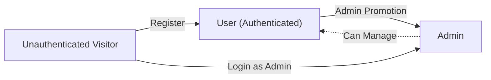
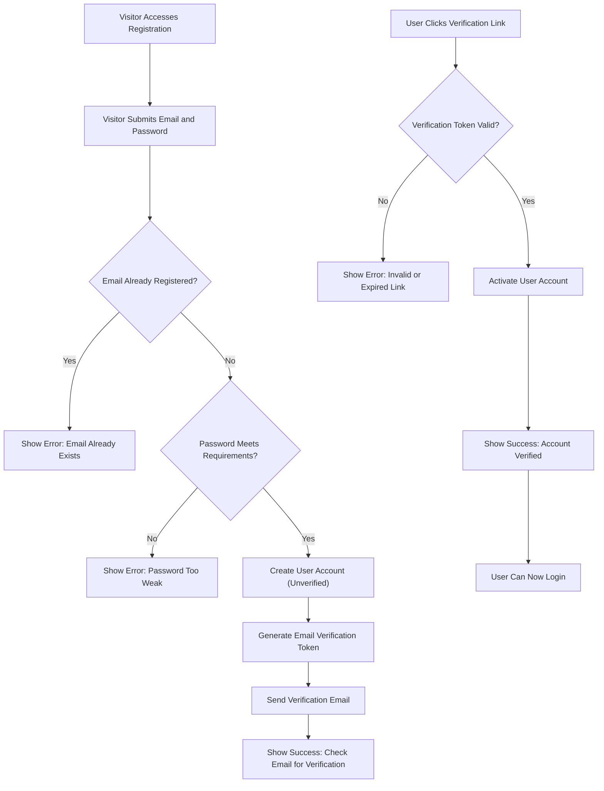
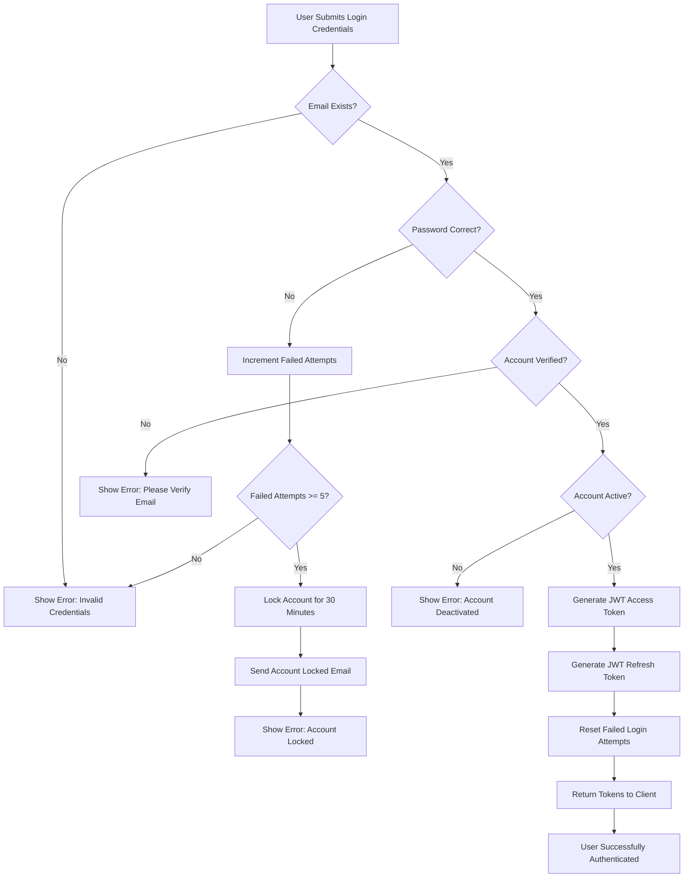
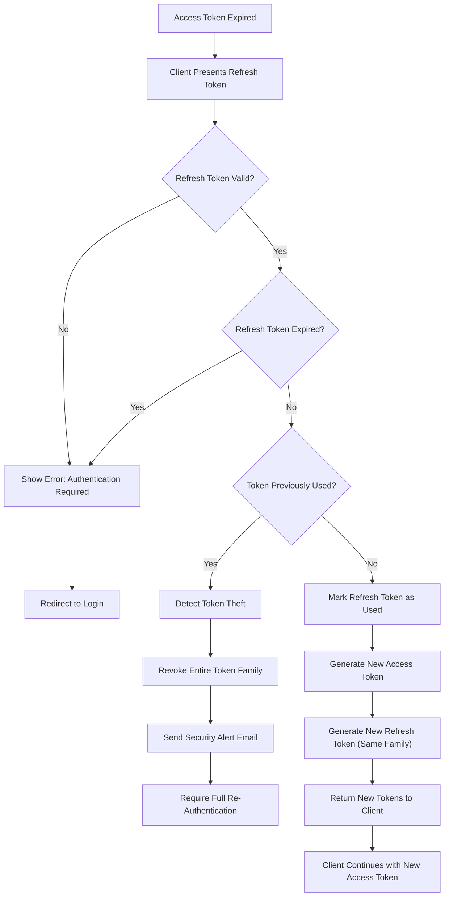
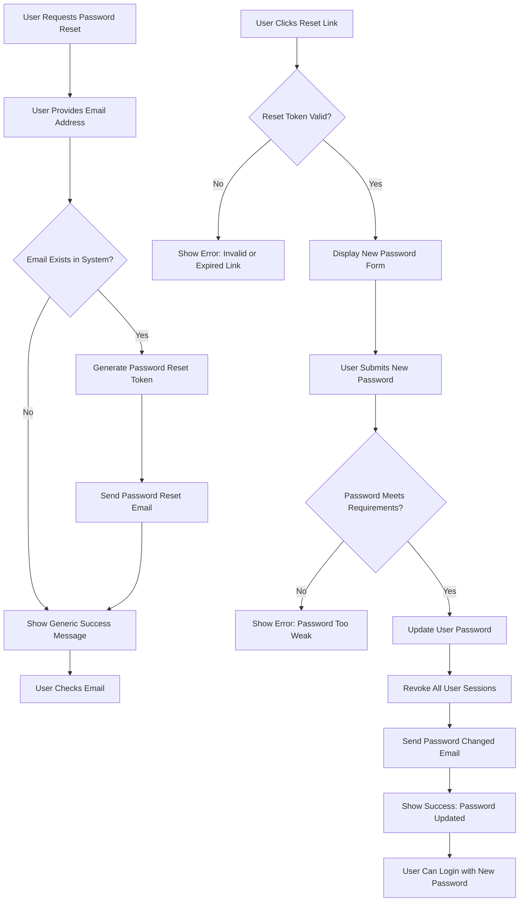

# User Actors and Authentication Requirements

## Introduction and Overview

This document defines all user actors in the Todo list application and establishes comprehensive authentication requirements. It serves as the foundation for the security model and permission structure that governs all system interactions.

The Todo list application implements a JWT-based authentication system supporting two distinct user actor types. This document specifies the business requirements for user authentication, authorization, and permission management from a functional perspective.

**Document Scope**: This document focuses on business requirements for authentication and user actors. All technical implementation details, including API endpoint design, database schema structure, cryptographic algorithm selection, and security implementation approaches, are at the discretion of the development team.

**Authentication Strategy**: The system uses JSON Web Tokens (JWT) for stateless authentication, enabling secure, scalable user session management without server-side session storage. This approach allows the application to scale horizontally without session affinity requirements while maintaining strong security guarantees.

## User Actor Definitions

The Todo list application supports two distinct user actor types, each with specific roles, responsibilities, and permissions. These actors represent the complete set of personas who will interact with the system.

### Actor Hierarchy



### User Actor (Authenticated Member)

**Actor Name**: User

**Actor Type**: Authenticated Member

**Business Role**: Regular authenticated user who manages their personal todo list independently

**Core Responsibilities**:
- Manage personal account lifecycle (register, login, logout)
- Create and organize personal todo items
- View only their own todo items with complete data isolation
- Mark their own todos as complete or incomplete to track progress
- Delete their own todo items when no longer needed
- Update account credentials for security maintenance

**Data Isolation Requirement**: WHEN a user accesses the system, THE system SHALL ensure they can access ONLY their own todo items and account information. Users SHALL NOT have visibility into other users' data under any circumstances. This strict data isolation is fundamental to user privacy and security.

**Account Lifecycle**: Users can self-register through the public registration flow, manage their own accounts independently, and use the service without administrative intervention for normal operations. The self-service model ensures users have autonomy while administrators focus on system-level concerns.

**Typical User Journey**: A typical user registers an account, verifies their email address, logs in to access their personal todo list, creates and manages todo items throughout their daily workflow, and may periodically update their password or account settings for security purposes.

### Admin Actor (System Administrator)

**Actor Name**: Admin

**Actor Type**: System Administrator

**Business Role**: System administrator with elevated privileges for user management, system oversight, and user support operations

**Core Responsibilities**:
- Perform all operations available to regular users for their own personal todos
- View and manage all user accounts across the entire system
- Access system-wide statistics, reporting, and analytics
- Monitor system health, usage patterns, and performance metrics
- Support users by viewing their data when necessary for troubleshooting
- Deactivate or delete user accounts when required by policy or compliance
- Promote regular users to admin status when organizational needs change
- Maintain audit trails for compliance and security purposes

**Elevated Access**: WHEN an admin performs administrative functions, THE system SHALL grant them the ability to view and manage all users' data while maintaining comprehensive audit trails of administrative actions. This elevated access enables effective user support and system management while ensuring accountability.

**Administrative Scope**: Admins have system-wide access but should use elevated privileges responsibly for legitimate administrative and support purposes only. The system logs all administrative actions to ensure transparency and enable security auditing.

**Administrative Use Cases**: Admins typically handle user support requests, investigate reported issues by examining user data, manage user lifecycle events such as account closures, generate system reports for business stakeholders, and ensure system health through monitoring and maintenance activities.

## Authentication Requirements

### Core Authentication Functions

The system must provide complete user authentication capabilities covering the entire user lifecycle from initial registration through daily access and account maintenance.

#### User Registration

**Business Purpose**: Enable new users to create accounts and begin using the Todo list application independently without administrative approval or intervention.

**Primary Requirement**: THE system SHALL provide user registration functionality allowing new users to create accounts with email address and password credentials.

**Registration Process Requirements**:

- WHEN a visitor submits registration information, THE system SHALL validate the email format using standard RFC 5322 email address pattern matching.
- WHEN a visitor submits registration information, THE system SHALL validate the password meets defined strength requirements before accepting registration.
- WHEN a visitor submits an email address that is already registered, THE system SHALL reject the registration attempt with error message "This email address is already registered".
- WHEN registration data passes all validation checks, THE system SHALL create a new user account in an unverified state that requires email verification before login.
- WHEN a new user account is created, THE system SHALL generate a time-limited email verification token valid for 24 hours.
- WHEN an email verification token is generated, THE system SHALL send a verification email to the registered email address containing a clickable verification link.
- WHEN the verification email is sent successfully, THE system SHALL provide clear feedback to the user: "Registration successful. Please check your email for a verification link to activate your account".
- WHEN a user attempts to login with an unverified account, THE system SHALL prevent login and display message "Please verify your email address before logging in. Check your inbox for the verification link".

**Email Verification Requirements**:

- WHEN a user clicks the email verification link, THE system SHALL validate the verification token for authenticity and expiration.
- WHEN the verification token is valid and not expired, THE system SHALL activate the user account and mark the email address as verified.
- WHEN email verification succeeds, THE system SHALL display success message "Your email has been verified. You can now log in to your account".
- WHEN the verification token is invalid or expired, THE system SHALL display error message "This verification link is invalid or has expired. Please request a new verification email".
- WHEN a user's verification token has expired, THE system SHALL allow the user to request a new verification email.
- WHEN a user requests a new verification email, THE system SHALL generate a fresh verification token and send a new verification email.
- WHILE a user account remains unverified, THE system SHALL prevent all login attempts for that account with appropriate messaging explaining the verification requirement.

**Registration Security Considerations**:

- THE system SHALL implement rate limiting on registration endpoint to prevent automated account creation attacks.
- THE system SHALL validate email addresses to prevent malformed or malicious email input.
- THE system SHALL implement CAPTCHA or similar protection if automated registration abuse is detected.

#### User Login

**Business Purpose**: Authenticate users with their email and password credentials to establish secure sessions that enable access to their personal todo list and account management features.

**Primary Requirement**: THE system SHALL authenticate users with email address and password credentials and establish secure sessions using JWT tokens.

**Login Process Requirements**:

- WHEN a user submits login credentials, THE system SHALL validate the email address format before attempting authentication.
- WHEN a user submits login credentials, THE system SHALL verify the email and password combination against stored account credentials.
- WHEN the provided credentials match a valid account, THE system SHALL generate a JWT access token with 30-minute expiration time.
- WHEN authentication succeeds, THE system SHALL generate a JWT refresh token with 30-day expiration time.
- WHEN authentication tokens are generated, THE system SHALL return both access token and refresh token to the client application.
- WHEN login request processing completes, THE system SHALL respond within 2 seconds under normal system load.
- WHEN the provided credentials do not match any account, THE system SHALL return a generic authentication error "Invalid email or password" without revealing which credential was incorrect.
- WHEN authentication succeeds, THE system SHALL reset the failed login attempt counter for that account to zero.

**Account Status Validation**:

- WHEN a user attempts login, THE system SHALL verify the account email address has been verified.
- WHEN a user attempts login with an unverified account, THE system SHALL prevent authentication and display message "Please verify your email address before logging in".
- WHEN a user attempts login, THE system SHALL verify the account is in active status and not deactivated by administrators.
- WHEN a user attempts login with a deactivated account, THE system SHALL prevent authentication and display message "This account has been deactivated. Please contact support for assistance".

**Account Lockout Protection Requirements**:

- WHEN a user fails login authentication, THE system SHALL increment the failed login attempt counter for that email address.
- WHEN the failed login attempt counter reaches 5 failed attempts within a 15-minute sliding window, THE system SHALL temporarily lock the account for 30 minutes.
- WHEN an account is locked due to failed login attempts, THE system SHALL send an email notification to the registered email address informing the user of the account lockout and when access will be restored.
- WHEN an account is locked, THE system SHALL display error message "Your account has been temporarily locked due to multiple failed login attempts. Please try again in 30 minutes or contact support".
- WHEN the 30-minute lockout period expires, THE system SHALL automatically unlock the account and reset the failed attempt counter.
- WHEN an admin manually unlocks a locked account, THE system SHALL immediately restore access and reset the failed attempt counter.
- WHEN a successful login occurs, THE system SHALL reset the failed login attempt counter to zero regardless of previous failed attempts.

**Login Security Requirements**:

- THE system SHALL never reveal whether a failed login was due to incorrect email or incorrect password to prevent account enumeration.
- THE system SHALL implement rate limiting on login endpoint to prevent brute force attacks even before account lockout threshold.
- THE system SHALL log all login attempts (successful and failed) for security auditing purposes.

#### User Logout

**Business Purpose**: Provide users the ability to terminate their authenticated session and invalidate their access tokens, particularly important when using shared or public computers.

**Primary Requirement**: THE system SHALL provide logout functionality to terminate user sessions and invalidate authentication tokens.

**Logout Process Requirements**:

- WHEN a user initiates logout, THE system SHALL invalidate the current session by revoking the refresh token.
- WHEN a user initiates logout, THE system SHALL instruct the client application to clear authentication tokens from client-side storage.
- WHEN logout processing completes, THE system SHALL return confirmation of successful logout to the client.
- WHEN logout completes, THE system SHALL display success message "You have been logged out successfully".

**Token Invalidation Strategy**:

- WHEN a refresh token is revoked during logout, THE system SHALL mark that specific refresh token as invalid in the token revocation tracking system.
- WHEN a client attempts to use a revoked refresh token, THE system SHALL reject the token refresh request with authentication error.
- THE system SHALL allow access tokens to remain valid until their natural expiration (30 minutes) as they cannot be revoked in a stateless JWT system without maintaining server-side state.
- THE system SHALL rely on short access token lifetime (30 minutes) to minimize the window of vulnerability after logout.

**Logout from All Devices**:

- THE system SHALL provide users the ability to revoke all sessions across all devices simultaneously.
- WHEN a user requests logout from all devices, THE system SHALL revoke all refresh tokens associated with that user account.
- WHEN all refresh tokens are revoked, THE system SHALL send email notification to the user confirming the security action.

#### Password Management

**Business Purpose**: Enable users to maintain account security by changing passwords regularly and recover access when passwords are forgotten through secure password reset flows.

**Change Password Requirements**:

- WHEN an authenticated user requests password change, THE system SHALL require entry of the current password for identity verification.
- WHEN a user submits password change request, THE system SHALL validate the current password matches the stored password.
- WHEN a user submits password change request, THE system SHALL validate the new password meets all password strength requirements.
- WHEN the current password is incorrect, THE system SHALL reject the password change with error message "Current password is incorrect".
- WHEN the new password fails strength requirements, THE system SHALL display specific error message indicating which requirements are not met.
- WHEN password change is successful, THE system SHALL update the user's password in the system.
- WHEN password is successfully changed, THE system SHALL invalidate all existing refresh tokens except the current session's refresh token to allow the user to remain logged in.
- WHEN password is successfully changed, THE system SHALL send email notification to the registered email address confirming the password change.
- WHEN password change email is sent, THE system SHALL include timestamp and originating IP address to help users detect unauthorized changes.

**Forgot Password / Password Reset Requirements**:

**Reset Request Process**:

- WHEN a user requests password reset, THE system SHALL prompt for the email address associated with the account.
- WHEN a user submits email address for password reset, THE system SHALL display generic success message "If an account exists with that email address, you will receive password reset instructions" regardless of whether the email exists.
- WHEN the submitted email address exists in the system, THE system SHALL generate a time-limited password reset token valid for 1 hour.
- WHEN a password reset token is generated, THE system SHALL send a password reset email containing a clickable reset link to the registered email address.
- WHEN a password reset email is sent, THE system SHALL include clear instructions and expiration time information.
- THE system SHALL accept password reset requests for non-existent email addresses but provide generic confirmation messages to prevent email enumeration attacks.

**Password Reset Completion Process**:

- WHEN a user clicks the password reset link, THE system SHALL validate the reset token for authenticity and expiration.
- WHEN the reset token is valid and not expired, THE system SHALL display a password change form allowing the user to set a new password.
- WHEN the reset token is invalid or expired, THE system SHALL display error message "This password reset link is invalid or has expired. Please request a new password reset".
- WHEN a user submits new password through reset form, THE system SHALL validate the new password meets all strength requirements without requiring the old password.
- WHEN the new password fails strength requirements, THE system SHALL display specific error messages indicating which requirements are not met.
- WHEN the new password is valid, THE system SHALL update the user's password in the system.
- WHEN password reset is successful, THE system SHALL invalidate all existing refresh tokens for that user to terminate all sessions.
- WHEN password reset is successful, THE system SHALL send email confirmation to the registered email address confirming the password was reset.
- WHEN password reset completes, THE system SHALL display success message "Your password has been reset successfully. Please log in with your new password".
- WHEN password reset completes, THE system SHALL require the user to authenticate with the new password to access the system.

**Password Reset Security Requirements**:

- THE system SHALL expire password reset links after 1 hour from generation.
- THE system SHALL allow only one-time use of password reset tokens.
- WHEN a password reset token is used successfully, THE system SHALL immediately invalidate that token to prevent reuse.
- THE system SHALL implement rate limiting on password reset requests to prevent email flooding attacks.
- THE system SHALL never reveal whether an email address is registered when processing password reset requests.

#### Session Revocation

**Business Purpose**: Provide users with security control to revoke access from all devices and sessions simultaneously, particularly useful when a device is lost or account compromise is suspected.

**Primary Requirement**: THE system SHALL allow users to revoke access from all devices and sessions in a single action.

**Revocation Process Requirements**:

- WHEN a user requests session revocation from all devices, THE system SHALL invalidate all refresh tokens associated with that user account.
- WHEN all refresh tokens are revoked, THE system SHALL prevent any further token refresh requests using those tokens.
- WHEN session revocation completes, THE system SHALL require re-authentication for all devices and applications attempting to access the user's account.
- WHEN session revocation is successful, THE system SHALL send email notification to the user confirming the security action was taken.
- WHEN session revocation email is sent, THE system SHALL include timestamp and originating IP address of the revocation request.

**Use Case Examples**:

- User suspects unauthorized access to their account
- User loses a device (phone, tablet, laptop) that was logged into the application
- User wants to force logout from all locations before password change
- User leaves a device logged in at a public location and wants to immediately revoke access

### Password Security Requirements

**Business Purpose**: Establish password strength standards that balance security with usability, ensuring user accounts are protected against common attack vectors while remaining accessible to legitimate users.

**Password Strength Policy Requirements**:

- THE system SHALL require passwords to be at least 8 characters in length to provide baseline security.
- THE system SHALL require passwords to contain at least one uppercase letter (A-Z).
- THE system SHALL require passwords to contain at least one lowercase letter (a-z).
- THE system SHALL require passwords to contain at least one numeric digit (0-9).
- THE system SHALL require passwords to contain at least one special character from the set: !@#$%^&*()_+-=[]{}|;:,.<>?
- THE system SHALL reject passwords that appear in common password lists or known breach databases.
- THE system SHALL reject passwords that are dictionary words in common languages.
- THE system SHALL provide real-time feedback during password creation showing which requirements have been met and which remain.
- WHEN a user types a password, THE system SHALL display visual indicators (checkmarks or color coding) showing which strength requirements are satisfied.

**Password Storage Security Requirements**:

- THE system SHALL never store passwords in plain text format under any circumstances.
- THE system SHALL use industry-standard password hashing algorithms with computational cost factors to resist brute force attacks.
- THE system SHALL use unique cryptographic salts for each password to prevent rainbow table attacks.
- THE system SHALL never transmit passwords in plain text over any communication channel.
- THE system SHALL never include passwords or password hashes in application logs, error messages, or debugging output.
- THE system SHALL never display passwords to users, admins, or support staff under any circumstances.

**Password Validation and Feedback**:

- WHEN a user enters a password that is too short, THE system SHALL display error "Password must be at least 8 characters long".
- WHEN a user enters a password missing required character types, THE system SHALL display specific error indicating which character types are missing.
- WHEN a user enters a commonly-used password, THE system SHALL display error "This password is too common. Please choose a more unique password".
- WHEN password meets all requirements, THE system SHALL display confirmation "Password meets all security requirements".

## JWT Token Management

### Token Architecture

The system implements JWT (JSON Web Tokens) for authentication with a dual-token architecture: short-lived access tokens for API authorization and long-lived refresh tokens for obtaining new access tokens without repeated user authentication.

**Architectural Benefits**:

- **Stateless Authentication**: Access tokens are self-contained and can be validated without database queries, enabling horizontal scalability.
- **Security**: Short-lived access tokens minimize exposure window while long-lived refresh tokens reduce authentication friction.
- **Flexibility**: Refresh token revocation provides logout and session management capabilities while maintaining stateless access token benefits.

### JWT Access Token Specification

**Token Purpose**: Short-lived token used to authorize API requests and prove user identity for resource access

**Token Lifetime Requirement**: THE system SHALL set access token expiration to 30 minutes from issuance timestamp.

**Lifetime Rationale**: The 30-minute lifetime balances security (limiting exposure if token is compromised) with user experience (reducing frequency of token refresh operations). This duration is appropriate for interactive web applications where users maintain active sessions.

**Token Payload Structure**:

The access token JWT payload SHALL include the following claims:

```json
{
  "userId": "unique user identifier",
  "email": "user email address",
  "role": "user or admin",
  "permissions": ["array of specific permissions"],
  "iat": "issued at timestamp",
  "exp": "expiration timestamp"
}
```

**Required Claims**:
- **userId**: Unique identifier for the user account, used to associate requests with specific user records
- **email**: User's registered email address, provided for display purposes and logging
- **role**: User actor type ("user" or "admin"), used for high-level authorization decisions
- **permissions**: Array of specific permission strings granted to this actor, enabling fine-grained access control
- **iat**: Token issuance timestamp in Unix epoch format (standard JWT claim)
- **exp**: Token expiration timestamp in Unix epoch format (standard JWT claim)

**Token Usage Requirements**:

- WHEN a client makes an API request to a protected endpoint, THE client SHALL include the access token in the Authorization header using Bearer scheme.
- WHEN the system receives a request with an access token, THE system SHALL validate the token signature using the configured secret key or public key.
- WHEN the system receives a request with an access token, THE system SHALL validate the token expiration timestamp to ensure the token has not expired.
- WHEN an access token is expired, THE system SHALL reject the request with HTTP 401 Unauthorized status and error message "Access token has expired. Please refresh your token".
- WHEN an access token signature is invalid, THE system SHALL reject the request with HTTP 401 Unauthorized status and error message "Invalid access token".
- WHEN an access token is valid, THE system SHALL extract user identity and permissions from the token claims for authorization decisions.

**Token Refresh Requirement**:

- WHEN an access token expires, THE client application SHALL use the refresh token to obtain a new access token without prompting the user for credentials.
- THE system SHALL support seamless token refresh to maintain continuous user sessions without authentication interruptions.

### JWT Refresh Token Specification

**Token Purpose**: Long-lived token used exclusively to obtain new access tokens without requiring the user to re-authenticate with email and password

**Token Lifetime Requirement**: THE system SHALL set refresh token expiration to 30 days from issuance timestamp.

**Lifetime Rationale**: The 30-day lifetime provides a balance between security and user convenience. Users remain logged in for a month without re-authentication, but compromised tokens have a limited window of validity. This duration is typical for consumer web applications.

**Token Payload Structure**:

The refresh token JWT payload SHALL include:

```json
{
  "userId": "unique user identifier",
  "tokenFamily": "unique token family identifier",
  "iat": "issued at timestamp",
  "exp": "expiration timestamp"
}
```

**Required Claims**:
- **userId**: Unique identifier for the user account
- **tokenFamily**: Unique identifier for this token family, used to detect token reuse and prevent token theft
- **iat**: Token issuance timestamp in Unix epoch format (standard JWT claim)
- **exp**: Token expiration timestamp in Unix epoch format (standard JWT claim)

**Token Family Concept**:

- THE system SHALL use token families to detect token reuse attacks and prevent token theft.
- WHEN a refresh token is first issued during login, THE system SHALL generate a unique token family identifier.
- WHEN a refresh token is used to obtain new tokens, THE system SHALL issue a new refresh token with the same family ID.
- WHEN a refresh token is used, THE system SHALL mark that specific token as consumed to prevent reuse.
- WHEN a previously-consumed refresh token is presented again, THE system SHALL detect this as potential token theft.
- WHEN token theft is detected through reuse of consumed token, THE system SHALL revoke the entire token family to protect the user account.

**Token Usage Requirements**:

- WHEN an access token expires, THE client SHALL present the refresh token to the token refresh endpoint.
- WHEN the system receives a refresh token, THE system SHALL validate the token signature and expiration.
- WHEN a refresh token is valid and not previously used, THE system SHALL mark the token as consumed.
- WHEN a refresh token is valid, THE system SHALL generate a new access token with 30-minute expiration.
- WHEN a refresh token is valid, THE system SHALL generate a new refresh token with the same family ID and 30-day expiration.
- WHEN new tokens are generated, THE system SHALL return both new access token and new refresh token to the client.
- WHEN a refresh token is expired, THE system SHALL reject the token refresh request and require full user re-authentication.
- WHEN a refresh token is invalid or has been revoked, THE system SHALL reject the token refresh request and require full user re-authentication.

### Token Storage Strategy

**Client-Side Storage Requirements**:

- FOR web applications, THE system SHALL recommend storing access tokens in memory (JavaScript variables) to prevent XSS token theft.
- FOR web applications, THE system SHALL recommend storing refresh tokens in httpOnly cookies to prevent XSS access while allowing automatic transmission.
- FOR mobile applications, THE system SHALL support secure device storage mechanisms such as iOS Keychain or Android Keystore.
- FOR single-page applications, THE system SHALL support storing refresh tokens in httpOnly, Secure, SameSite cookies.

**Storage Security Considerations**:

- Access tokens stored in memory are lost on page reload but provide maximum XSS protection
- Refresh tokens in httpOnly cookies are inaccessible to JavaScript, preventing XSS theft
- Secure flag ensures cookies are only transmitted over HTTPS
- SameSite flag prevents CSRF attacks

**Token Transmission Requirements**:

- THE system SHALL require all token transmission to occur exclusively over HTTPS encrypted connections.
- THE system SHALL include access tokens in the Authorization header using the format: `Authorization: Bearer <access_token>`.
- THE system SHALL never expose tokens in URL query parameters, which may be logged by proxies and browsers.
- THE system SHALL never log token values in application logs, error logs, or debugging output.
- THE system SHALL never transmit tokens in plain text over unencrypted HTTP connections.

### Token Lifecycle Management

**Token Issuance Requirements**:

- WHEN a user successfully authenticates through login, THE system SHALL generate both access token and refresh token.
- WHEN tokens are generated, THE system SHALL include all required claims in the token payload.
- WHEN tokens are generated, THE system SHALL sign tokens using the configured secret key or private key.
- WHEN tokens are generated, THE system SHALL return both tokens securely to the client application.

**Token Refresh Flow Requirements**:

- WHEN a client requests token refresh, THE system SHALL require presentation of a valid refresh token.
- WHEN a valid refresh token is received, THE system SHALL validate the token signature and expiration.
- WHEN the refresh token is valid, THE system SHALL verify the token has not been previously consumed.
- WHEN validation succeeds, THE system SHALL mark the old refresh token as consumed.
- WHEN validation succeeds, THE system SHALL generate a new access token with 30-minute expiration.
- WHEN validation succeeds, THE system SHALL generate a new refresh token with same family ID and 30-day expiration.
- WHEN new tokens are generated, THE system SHALL return both new access token and new refresh token to the client.
- THE system SHALL complete token refresh operations within 1 second under normal load.

**Token Refresh Failure Scenarios**:

- WHEN the refresh token is expired, THE system SHALL reject refresh request with error "Refresh token has expired. Please log in again".
- WHEN the refresh token signature is invalid, THE system SHALL reject refresh request with error "Invalid refresh token. Please log in again".
- WHEN the refresh token has been revoked, THE system SHALL reject refresh request with error "Refresh token has been revoked. Please log in again".
- WHEN a consumed refresh token is presented (token reuse detected), THE system SHALL revoke entire token family and require full re-authentication.

**Token Revocation Requirements**:

- WHEN a user logs out, THE system SHALL revoke the current refresh token to prevent future token refresh.
- WHEN a user changes password, THE system SHALL revoke all refresh tokens except the current session to maintain user's active session.
- WHEN a user requests "logout from all devices", THE system SHALL revoke all refresh tokens for that user across all sessions.
- WHEN an admin deactivates a user account, THE system SHALL revoke all refresh tokens for that user immediately.
- WHEN token theft is detected through token reuse, THE system SHALL revoke all tokens in the affected token family.

### Token Security Requirements

**Token Signing Requirements**:

- THE system SHALL sign all JWT tokens using a cryptographically secure algorithm (RS256 with RSA keys or HS256 with strong secret).
- WHEN using symmetric signing (HS256), THE system SHALL use a secret key of at least 256 bits (32 bytes) of random data.
- WHEN using asymmetric signing (RS256), THE system SHALL use RSA key pairs of at least 2048 bits.
- THE system SHALL protect signing keys with appropriate access controls and never expose them in source code or configuration files.
- THE system SHALL implement periodic key rotation for enhanced security, rotating signing keys at least annually.

**Token Validation Requirements**:

- WHEN receiving a JWT token, THE system SHALL validate the token signature matches the expected signature computed with the signing key.
- WHEN receiving a JWT token, THE system SHALL validate the expiration time (exp claim) has not passed.
- WHEN receiving a JWT token, THE system SHALL validate the token has not been revoked by checking against the revocation list.
- WHEN receiving a JWT token, THE system SHALL validate all required claims are present in the payload.
- WHEN any validation check fails, THE system SHALL reject the token and deny the request with appropriate error.

**Token Theft Detection and Prevention**:

- THE system SHALL implement token family tracking for all refresh tokens to enable theft detection.
- WHEN a refresh token is used more than once, THE system SHALL treat this as potential token theft.
- WHEN token theft is detected, THE system SHALL revoke all tokens in that token family to protect the user account.
- WHEN token theft is detected, THE system SHALL send email notification to the user alerting them of suspicious activity.
- THE system SHALL log all token theft detection events for security monitoring and investigation.

**Token Transmission Security**:

- THE system SHALL reject any token transmission over unencrypted HTTP connections.
- THE system SHALL enforce HTTPS for all API endpoints that accept authentication tokens.
- THE system SHALL configure HTTP Strict Transport Security (HSTS) headers to prevent protocol downgrade attacks.

## Permission Matrix

The following table defines exact permissions for each user actor across all system features. This matrix serves as the definitive authorization reference for developers implementing access control.

| Feature / Action | Unauthenticated Visitor | User (Authenticated) | Admin |
|-----------------|------------------------|---------------------|-------|
| **Account Management** | | | |
| Register new account | ✅ | ❌ | ❌ |
| Login to account | ✅ | ✅ | ✅ |
| Logout from account | ❌ | ✅ | ✅ |
| View own profile | ❌ | ✅ | ✅ |
| Change own password | ❌ | ✅ | ✅ |
| Reset forgotten password | ✅ | ✅ | ✅ |
| Verify email address | ✅ | ✅ | ✅ |
| Revoke all sessions | ❌ | ✅ | ✅ |
| Delete own account | ❌ | ✅ | ✅ |
| **Todo Item Management** | | | |
| Create todo item | ❌ | ✅ (own only) | ✅ (own only) |
| View todo list | ❌ | ✅ (own only) | ✅ (all users) |
| View single todo item | ❌ | ✅ (own only) | ✅ (any user) |
| Mark todo as complete | ❌ | ✅ (own only) | ✅ (own only) |
| Mark todo as incomplete | ❌ | ✅ (own only) | ✅ (own only) |
| Delete todo item | ❌ | ✅ (own only) | ✅ (any user) |
| **User Management** | | | |
| View all users list | ❌ | ❌ | ✅ |
| View any user profile | ❌ | ❌ | ✅ |
| Deactivate user account | ❌ | ❌ | ✅ |
| Delete user account | ❌ | ❌ | ✅ |
| Promote user to admin | ❌ | ❌ | ✅ |
| Reset any user password | ❌ | ❌ | ✅ |
| **System Administration** | | | |
| View system statistics | ❌ | ❌ | ✅ |
| Monitor system health | ❌ | ❌ | ✅ |
| Access admin dashboard | ❌ | ❌ | ✅ |
| View audit logs | ❌ | ❌ | ✅ |

### Permission Enforcement Rules

**Data Isolation for Users**:

- WHEN a user requests their todo list, THE system SHALL return ONLY todo items they created, filtering by user ID.
- WHEN a user attempts to view a specific todo item, THE system SHALL verify the todo item belongs to the requesting user before returning data.
- WHEN a user attempts to modify a todo item, THE system SHALL verify ownership before allowing modification.
- WHEN a user attempts to delete a todo item, THE system SHALL verify ownership before allowing deletion.
- WHEN a user attempts to access another user's todo item, THE system SHALL deny access with HTTP 403 Forbidden status and error message "You do not have permission to access this resource".

**Admin Elevated Access**:

- WHEN an admin views the todo list, THE system SHALL support filtering by user ID or viewing all todos across the entire system.
- WHEN an admin views a specific todo item, THE system SHALL allow access to any todo item regardless of ownership.
- WHEN an admin deletes a todo item, THE system SHALL allow deletion of any user's todo item.
- WHEN an admin performs actions affecting other users' data, THE system SHALL log the action including admin user ID, target user ID, action type, and timestamp.
- WHEN an admin views user data for support purposes, THE system SHALL log the data access for audit trail.

**Unauthenticated Access Restrictions**:

- THE system SHALL require authentication (valid access token) for all todo management operations.
- THE system SHALL allow registration, login, email verification, and password reset operations for unauthenticated visitors.
- WHEN an unauthenticated visitor attempts any protected operation, THE system SHALL return HTTP 401 Unauthorized status with error message "Authentication required. Please log in to access this resource".
- THE system SHALL not reveal any user data or system information to unauthenticated visitors.

**Permission Check Process**:

- WHEN any API request is received, THE system SHALL first validate the access token is present and valid.
- WHEN the access token is valid, THE system SHALL extract the user ID and role from token claims.
- WHEN processing a resource request, THE system SHALL verify the user has permission to perform the requested action on the specified resource.
- WHEN permission check fails, THE system SHALL deny the request with appropriate error message.
- THE system SHALL enforce permission checks before executing any business logic or database operations.

## Authentication Flows

### User Registration Flow

The following diagram illustrates the complete user registration process from initial sign-up through email verification and first login.



**Registration Business Requirements**:

- WHEN a visitor accesses the registration page, THE system SHALL display a form requesting email address and password.
- WHEN a visitor submits registration information, THE system SHALL validate email format using standard RFC 5322 email address pattern matching.
- WHEN a visitor submits registration information, THE system SHALL validate the password meets all strength requirements (length, character types, not common password).
- WHEN the submitted email is already registered in the system, THE system SHALL reject registration with HTTP 409 Conflict status and error message "This email address is already registered. Please use a different email or try logging in".
- WHEN registration data passes all validation, THE system SHALL create a new user account in unverified state with verified flag set to false.
- WHEN a user account is created, THE system SHALL generate a cryptographically random email verification token valid for 24 hours.
- WHEN an email verification token is generated, THE system SHALL send a verification email to the registered email address.
- WHEN verification email is sent, THE email SHALL contain a clickable verification link with the verification token as parameter.
- WHEN verification email is sent, THE system SHALL display success message "Registration successful! Please check your email for a verification link to activate your account".
- WHEN a user clicks the verification link, THE system SHALL validate the token for authenticity, expiration, and that it matches an unverified user account.
- WHEN the verification token is valid, THE system SHALL update the user account to set verified flag to true.
- WHEN account verification succeeds, THE system SHALL display success message "Your email has been verified successfully! You can now log in to your account".
- WHEN the verification token is invalid or expired, THE system SHALL display error message "This verification link is invalid or has expired. Please request a new verification email".
- WHEN a verification token has expired, THE system SHALL provide functionality to request a new verification email.

**Registration Flow Edge Cases**:

- WHEN a user with unverified account tries to register again with the same email, THE system SHALL provide option to resend verification email rather than creating duplicate account.
- WHEN verification email fails to send due to invalid email address, THE system SHALL log the error but still show success message to prevent email validation abuse.
- WHEN a user verifies their account multiple times using the same valid token, THE system SHALL accept the verification idempotently without error.

### Login Authentication Flow

The following diagram shows the authentication process when users login and how JWT tokens are issued and used.



**Login Business Requirements**:

- WHEN a user accesses the login page, THE system SHALL display a form requesting email address and password.
- WHEN a user submits login credentials, THE system SHALL validate both email format and that password field is not empty.
- WHEN a user submits login credentials, THE system SHALL query the database to verify the email exists.
- WHEN the submitted email does not exist in the system, THE system SHALL return HTTP 401 Unauthorized with generic error message "Invalid email or password".
- WHEN the email exists, THE system SHALL verify the submitted password matches the stored password hash.
- WHEN the password is incorrect, THE system SHALL increment the failed login attempt counter for that email address.
- WHEN the password is incorrect, THE system SHALL return HTTP 401 Unauthorized with generic error message "Invalid email or password".
- WHEN failed login attempts for an email reach 5 attempts within a 15-minute sliding window, THE system SHALL lock that account for 30 minutes.
- WHEN an account is locked, THE system SHALL send email notification to the registered address with message "Your account has been temporarily locked due to multiple failed login attempts. Access will be restored in 30 minutes".
- WHEN an account is locked, THE system SHALL return HTTP 403 Forbidden with error message "Your account has been temporarily locked due to multiple failed login attempts. Please try again in 30 minutes or contact support".
- WHEN credentials are correct, THE system SHALL verify the account's email has been verified (verified flag is true).
- WHEN the account is unverified, THE system SHALL return HTTP 403 Forbidden with error message "Please verify your email address before logging in. Check your inbox for the verification link".
- WHEN the account is verified, THE system SHALL check if the account is active (not deactivated by admin).
- WHEN the account is deactivated, THE system SHALL return HTTP 403 Forbidden with error message "This account has been deactivated. Please contact support for assistance".
- WHEN all checks pass (credentials valid, account verified, account active), THE system SHALL generate a JWT access token containing user ID, email, role, and permissions with 30-minute expiration.
- WHEN authentication succeeds, THE system SHALL generate a JWT refresh token containing user ID and new token family ID with 30-day expiration.
- WHEN authentication succeeds, THE system SHALL reset the failed login attempt counter to zero for that email.
- WHEN tokens are generated, THE system SHALL return both access token and refresh token to the client with HTTP 200 OK status.
- THE system SHALL complete the entire login process within 2 seconds under normal system load.

**Login Security Considerations**:

- THE system SHALL use constant-time password comparison to prevent timing attacks.
- THE system SHALL never reveal whether login failure was due to incorrect email or incorrect password.
- THE system SHALL rate limit login attempts from the same IP address to prevent distributed brute force attacks.
- THE system SHALL log all login attempts (successful and failed) including timestamp, IP address, user agent for security monitoring.

### Token Refresh Flow

The following diagram illustrates how clients obtain new access tokens using refresh tokens without requiring full re-authentication.



**Token Refresh Business Requirements**:

- WHEN an access token expires during active user session, THE client application SHALL automatically request new access token using the refresh token.
- WHEN the client requests token refresh, THE client SHALL present the refresh token to the token refresh endpoint.
- WHEN the system receives a refresh token, THE system SHALL validate the token signature using the configured signing key.
- WHEN the token signature is invalid, THE system SHALL reject the request with HTTP 401 Unauthorized and error message "Invalid refresh token. Please log in again".
- WHEN the token signature is valid, THE system SHALL validate the token expiration timestamp.
- WHEN the refresh token is expired, THE system SHALL reject the request with HTTP 401 Unauthorized and error message "Refresh token has expired. Please log in again".
- WHEN the refresh token is valid and not expired, THE system SHALL check if this token has been previously used (consumed).
- WHEN a previously-consumed refresh token is presented, THE system SHALL detect this as potential token theft.
- WHEN token theft is detected, THE system SHALL revoke all refresh tokens in the same token family to protect the user account.
- WHEN token theft is detected, THE system SHALL send email security alert to the user notifying them of suspicious activity.
- WHEN token theft is detected, THE system SHALL reject the request and require full user re-authentication.
- WHEN the refresh token is valid and has not been previously used, THE system SHALL mark the token as consumed to prevent future reuse.
- WHEN validation succeeds, THE system SHALL generate a new JWT access token with 30-minute expiration containing user ID, email, role, and permissions.
- WHEN validation succeeds, THE system SHALL generate a new JWT refresh token with the same token family ID and 30-day expiration.
- WHEN new tokens are generated, THE system SHALL return both new access token and new refresh token to the client with HTTP 200 OK status.
- THE system SHALL complete token refresh operations within 1 second under normal system load to minimize user experience interruption.

**Token Refresh Edge Cases**:

- WHEN a user's account is deactivated by admin, THE system SHALL reject token refresh attempts for that user.
- WHEN a user changes their password, previously-issued refresh tokens SHALL be revoked and token refresh SHALL fail.
- WHEN a user logs out from all devices, all refresh tokens SHALL be revoked and token refresh SHALL fail.

### Password Reset Flow

The following diagram shows the password reset process for users who have forgotten their passwords.



**Password Reset Business Requirements**:

**Reset Request Phase**:

- WHEN a user accesses the password reset page, THE system SHALL display a form requesting email address.
- WHEN a user submits email address for password reset, THE system SHALL validate the email format.
- WHEN email format is invalid, THE system SHALL display error "Please enter a valid email address".
- WHEN email format is valid, THE system SHALL check if the email exists in the user database.
- WHEN the email exists in the system, THE system SHALL generate a cryptographically random password reset token valid for 1 hour.
- WHEN a reset token is generated, THE system SHALL store the token associated with the user account with expiration timestamp.
- WHEN a reset token is generated, THE system SHALL send password reset email to the registered email address.
- WHEN reset email is sent, THE email SHALL contain a clickable password reset link with the token as parameter.
- WHEN reset email is sent, THE email SHALL include clear instructions and expiration time information (1 hour).
- WHEN a password reset request is submitted, THE system SHALL always display generic success message "If an account exists with that email address, you will receive password reset instructions" regardless of whether email exists.
- THE system SHALL never reveal whether an email address is registered to prevent account enumeration attacks.

**Password Reset Completion Phase**:

- WHEN a user clicks the password reset link, THE system SHALL extract and validate the reset token from the URL parameter.
- WHEN the reset token is validated, THE system SHALL check token signature, expiration, and that it matches a valid user account.
- WHEN the reset token is invalid or does not match any user account, THE system SHALL display error "This password reset link is invalid or has expired. Please request a new password reset".
- WHEN the reset token is expired (more than 1 hour old), THE system SHALL display error "This password reset link has expired. Password reset links are valid for 1 hour. Please request a new password reset".
- WHEN the reset token is valid and not expired, THE system SHALL display a password change form allowing the user to enter a new password.
- WHEN the user submits new password through the reset form, THE system SHALL validate the new password meets all password strength requirements.
- WHEN the new password fails strength requirements, THE system SHALL display specific error messages indicating which requirements are not met (minimum length, required character types, etc.).
- WHEN the new password meets all requirements, THE system SHALL update the user's password in the database with proper hashing and salting.
- WHEN the password is successfully updated, THE system SHALL mark the reset token as used to prevent reuse.
- WHEN the password is successfully updated, THE system SHALL revoke all existing refresh tokens for that user to terminate all active sessions.
- WHEN the password is successfully updated, THE system SHALL send confirmation email to the user's registered email address.
- WHEN password change confirmation email is sent, THE email SHALL include timestamp and originating IP address of the password change.
- WHEN the password reset is complete, THE system SHALL display success message "Your password has been reset successfully. Please log in with your new password".
- WHEN password reset completes, THE system SHALL redirect the user to the login page.

**Password Reset Security Requirements**:

- THE system SHALL expire password reset tokens after 1 hour from generation.
- THE system SHALL allow only one-time use of password reset tokens.
- WHEN a password reset token is successfully used, THE system SHALL immediately mark it as consumed to prevent reuse.
- THE system SHALL implement rate limiting on password reset requests to prevent email flooding (maximum 5 requests per email address per hour).
- THE system SHALL log all password reset requests and completions for security auditing.

## Actor-Specific Business Requirements

### User Actor Business Requirements

**Account Self-Management Capabilities**:

- THE system SHALL allow any visitor to register a new user account without requiring administrative approval or intervention.
- THE system SHALL allow users to login and logout independently without administrative assistance.
- THE system SHALL allow users to view and update their own account profile information.
- THE system SHALL allow users to change their own passwords after verifying their current password.
- THE system SHALL allow users to reset forgotten passwords through email verification without contacting administrators.
- THE system SHALL allow users to request new email verification if the original verification email is lost or expired.
- THE system SHALL allow users to delete their own accounts, which permanently removes their account and all associated data.

**Todo Item Ownership and Isolation**:

- WHEN a user creates a todo item, THE system SHALL assign exclusive ownership of that item to the creating user.
- WHEN a user creates a todo item, THE system SHALL store the user ID with the todo item to track ownership.
- WHEN a user views their todo list, THE system SHALL display ONLY todo items where the user ID matches the authenticated user's ID.
- WHEN a user requests a specific todo item, THE system SHALL verify the todo item's user ID matches the authenticated user before returning data.
- THE system SHALL prevent users from viewing any other user's todo items through any interface or API.
- THE system SHALL prevent users from modifying any other user's todo items through any interface or API.
- THE system SHALL prevent users from deleting any other user's todo items through any interface or API.
- WHEN a user attempts to access another user's todo item, THE system SHALL return HTTP 403 Forbidden error.

**Todo Item Operations**:

- THE system SHALL allow users to create unlimited todo items for their personal use.
- THE system SHALL allow users to view a complete list of all their own todo items.
- THE system SHALL allow users to view detailed information for any of their own todo items.
- THE system SHALL allow users to mark their own todo items as complete to track task completion.
- THE system SHALL allow users to mark their own previously-completed todo items as incomplete if status changes.
- THE system SHALL allow users to delete their own todo items when no longer needed.
- THE system SHALL immediately reflect todo item changes (create, update, delete) in the user's todo list.

**User Data Privacy**:

- THE system SHALL ensure users cannot discover other users' email addresses through any interface or API.
- THE system SHALL ensure users cannot view other users' account information or profile details.
- THE system SHALL ensure users cannot determine how many other users exist in the system.
- THE system SHALL ensure users cannot determine what todo items other users have created.
- THE system SHALL isolate user data completely from other users at the application and database level.
- THE system SHALL never expose user identifiers or user count information to regular users.

**Account Deletion**:

- WHEN a user requests account deletion, THE system SHALL permanently delete the user account from the database.
- WHEN a user account is deleted, THE system SHALL also permanently delete all todo items belonging to that user.
- WHEN a user account is deleted, THE system SHALL revoke all authentication tokens for that user.
- WHEN a user account is deleted, THE system SHALL send confirmation email to the user's email address.
- THE system SHALL make account deletion irreversible - deleted accounts and data cannot be recovered.

### Admin Actor Business Requirements

**Inherited User Capabilities**:

- THE system SHALL grant admins all capabilities available to regular users for managing their own personal todo items.
- WHEN an admin creates a todo item for themselves, THE system SHALL assign it to the admin's personal user account.
- WHEN an admin views their own todo list, THE system SHALL display their personal todo items like a regular user.
- THE system SHALL allow admins to manage their own personal todo list using the same interfaces available to regular users.
- Admins SHALL experience the same todo item creation, viewing, completion, and deletion flows as regular users for their own items.

**User Management Capabilities**:

- THE system SHALL allow admins to view a paginated list of all registered users in the system.
- WHEN an admin views the user list, THE system SHALL display user email addresses, registration dates, account status, and role for each user.
- THE system SHALL allow admins to view detailed information for any user account including profile data and account metadata.
- THE system SHALL allow admins to deactivate user accounts to prevent login while preserving user data.
- WHEN an admin deactivates a user account, THE system SHALL prevent that user from logging in.
- WHEN an admin deactivates a user account, THE system SHALL revoke all active authentication tokens for that user.
- THE system SHALL allow admins to reactivate previously deactivated user accounts to restore login access.
- THE system SHALL allow admins to permanently delete user accounts from the system.
- WHEN an admin deletes a user account, THE system SHALL also delete all todo items belonging to that user.
- WHEN an admin deletes a user account, THE system SHALL revoke all authentication tokens for that user.
- THE system SHALL allow admins to promote regular user accounts to admin status.
- WHEN an admin promotes a user to admin, THE system SHALL update the user's role to "admin" and grant all admin permissions.
- THE system SHALL allow admins to reset any user's password without requiring the current password.
- WHEN an admin resets a user's password, THE system SHALL send email notification to that user.

**Cross-User Data Access**:

- THE system SHALL allow admins to view any user's todo list by specifying the user ID.
- WHEN an admin views another user's todo list, THE system SHALL display all todo items belonging to that user.
- THE system SHALL allow admins to view detailed information for any user's todo items.
- THE system SHALL allow admins to delete any user's todo items when necessary for content moderation or user support.
- WHEN an admin deletes another user's todo item, THE system SHALL remove the item immediately.
- THE system SHALL NOT allow admins to modify or complete other users' todo items - only view and delete.
- WHEN an admin performs any action on another user's data, THE system SHALL log the action for audit purposes.

**System Oversight Capabilities**:

- THE system SHALL allow admins to view system-wide statistics including total registered users, total active users, and total todo items.
- THE system SHALL allow admins to access a dashboard displaying system health metrics and usage patterns.
- THE system SHALL allow admins to monitor user activity and system performance.
- THE system SHALL provide admins with reporting capabilities for business intelligence and system management.
- THE system SHALL allow admins to view and search audit logs of administrative actions.

**Admin Audit Trail Requirements**:

- WHEN an admin views another user's account details, THE system SHALL log the access with timestamp, admin user ID, and viewed user ID.
- WHEN an admin views another user's todo list, THE system SHALL log the access with timestamp, admin user ID, and viewed user ID.
- WHEN an admin modifies another user's account (deactivate, delete, role change), THE system SHALL log the action with timestamp, admin user ID, target user ID, and action type.
- WHEN an admin deletes another user's todo item, THE system SHALL log the action with timestamp, admin user ID, todo item ID, and owning user ID.
- THE system SHALL maintain audit logs for compliance, security monitoring, and accountability.
- THE system SHALL allow admins to review audit logs to investigate user reports or security incidents.
- THE system SHALL retain audit logs for a sufficient period to support compliance requirements (at least 90 days).

**Admin Account Security**:

- THE system SHALL require admins to use the same strong password requirements as regular users.
- THE system SHALL subject admin accounts to the same account lockout protection as regular users.
- THE system SHALL send email notifications to admins for critical account events (password changes, role changes).
- THE system SHALL log all admin authentication events for security monitoring.

## Security Requirements

### Account Security Measures

**Password Protection Requirements**:

- THE system SHALL never store passwords in plain text format under any circumstances.
- THE system SHALL use cryptographic hashing algorithms (such as bcrypt, scrypt, or Argon2) with appropriate computational cost factors for password storage.
- THE system SHALL use unique cryptographic salts for each password to prevent rainbow table attacks.
- THE system SHALL never transmit passwords in plain text over any communication channel.
- THE system SHALL require all password transmission to occur over HTTPS encrypted connections only.
- THE system SHALL never log passwords, password hashes, or password-related data in application logs, error logs, or debugging output.
- THE system SHALL never display passwords to users, admins, or support staff in any interface.
- THE system SHALL never include passwords in email communications or notifications.

**Brute Force Protection Requirements**:

- WHEN a user fails login authentication, THE system SHALL increment a failed login attempt counter associated with that email address.
- WHEN the failed login attempt counter reaches 5 attempts within a 15-minute sliding time window, THE system SHALL temporarily lock the account for 30 minutes.
- WHEN an account is locked due to failed login attempts, THE system SHALL send email notification to the registered email address.
- WHEN account lockout email is sent, THE email SHALL include information about when access will be automatically restored (30 minutes).
- WHEN an account is locked, THE system SHALL prevent all login attempts for that account until the lockout period expires.
- WHEN the 30-minute lockout period expires, THE system SHALL automatically unlock the account and reset the failed attempt counter.
- THE system SHALL allow admins to manually unlock user accounts before the automatic unlock time if needed.
- WHEN an admin manually unlocks an account, THE system SHALL immediately restore access and reset the failed attempt counter.
- WHEN a successful login occurs, THE system SHALL reset the failed login attempt counter to zero.
- THE system SHALL track failed login attempts using a sliding time window to prevent circumvention by spacing out attempts.

**Session Security Requirements**:

- THE system SHALL enforce JWT access token expiration after 30 minutes from issuance.
- THE system SHALL enforce JWT refresh token expiration after 30 days from issuance.
- THE system SHALL not allow use of expired tokens for any purpose.
- WHEN a user changes their password, THE system SHALL invalidate all existing refresh tokens except the current session.
- WHEN a user requests logout from all devices, THE system SHALL invalidate all refresh tokens for that user.
- THE system SHALL provide users the ability to view and revoke individual sessions if multiple device session management is implemented.
- WHEN an admin deactivates a user account, THE system SHALL immediately invalidate all tokens for that user.

### Token Security Requirements

**Token Transmission Security Requirements**:

- THE system SHALL require all authentication token transmission to occur exclusively over HTTPS encrypted connections.
- THE system SHALL reject any requests containing authentication tokens over unencrypted HTTP connections.
- THE system SHALL never include authentication tokens in URL query parameters where they may be logged by proxies, browsers, or web servers.
- THE system SHALL transmit access tokens in the HTTP Authorization header using Bearer authentication scheme.
- THE system SHALL never log token values (access tokens or refresh tokens) in application logs, error logs, web server logs, or debugging output.
- THE system SHALL configure web servers and proxies to exclude Authorization headers from access logs.

**Token Validation Security Requirements**:

- WHEN the system receives a JWT token, THE system SHALL validate the cryptographic signature matches the expected signature computed with the signing key.
- WHEN the system receives a JWT token, THE system SHALL validate the token has not expired by checking the exp claim against current timestamp.
- WHEN the system receives a refresh token, THE system SHALL validate the token has not been revoked by checking against the token revocation list.
- WHEN the system receives a JWT token, THE system SHALL validate all required claims (userId, email, role, etc.) are present in the token payload.
- WHEN any token validation check fails, THE system SHALL reject the token and deny the request with appropriate HTTP status code and error message.
- THE system SHALL perform all token validation checks before executing any business logic or database operations.

**Token Theft Prevention Requirements**:

- THE system SHALL implement token family tracking for all refresh tokens to enable detection of token reuse.
- WHEN a refresh token is first issued during login, THE system SHALL generate a unique token family identifier.
- WHEN a refresh token is used to obtain new tokens, THE system SHALL mark that token as consumed.
- WHEN a previously-consumed refresh token is presented for token refresh, THE system SHALL treat this as potential token theft.
- WHEN token theft is detected through refresh token reuse, THE system SHALL revoke all tokens in that token family.
- WHEN token theft is detected, THE system SHALL send email security alert to the user notifying them of suspicious activity.
- WHEN token theft is detected, THE system SHALL log the security event including IP addresses, user agents, and timestamps for investigation.
- WHEN token theft is detected, THE system SHALL require full re-authentication (email and password) to restore access.

### Email Security Requirements

**Email Verification Requirements**:

- THE system SHALL require email verification before allowing users to login to their accounts.
- THE system SHALL generate cryptographically random email verification tokens that cannot be guessed or predicted.
- THE system SHALL expire email verification tokens after 24 hours from generation.
- THE system SHALL allow users to request new verification emails if the original is lost or expired.
- WHEN verification email is sent, THE system SHALL include clear instructions and a clickable verification link.
- THE system SHALL validate email addresses to prevent invalid or malicious email formats from being registered.

**Email Communication Security Requirements**:

- THE system SHALL send email notifications for critical security events including password changes, password resets, account lockouts, and suspicious activity.
- THE system SHALL never include sensitive information such as passwords, password hashes, or full authentication tokens in emails.
- THE system SHALL use time-limited tokens for password reset links and email verification links.
- THE system SHALL validate email format and structure to prevent email injection attacks.
- WHEN sending emails, THE system SHALL use authenticated SMTP connections to prevent email spoofing.
- WHEN sending emails, THE system SHALL implement SPF, DKIM, and DMARC records to verify email authenticity.

### Data Privacy and Protection Requirements

**Personal Data Protection Requirements**:

- THE system SHALL encrypt sensitive user data at rest in the database.
- THE system SHALL encrypt all data in transit using TLS/HTTPS with strong cipher suites.
- THE system SHALL isolate user data to prevent unauthorized cross-user access at both application and database levels.
- THE system SHALL provide users the ability to permanently delete their accounts and all associated data.
- WHEN a user deletes their account, THE system SHALL permanently remove all personal data including profile information and todo items.
- THE system SHALL implement data retention policies that define how long deleted data is retained in backups.

**Admin Access Controls Requirements**:

- THE system SHALL require admin authentication using the same JWT token mechanism as regular users.
- THE system SHALL validate admin role and permissions before allowing access to administrative operations.
- THE system SHALL log all admin access to user data for accountability and compliance.
- WHEN an admin accesses user data, THE system SHALL record which admin user accessed what data at what time.
- THE system SHALL prevent privilege escalation attacks where regular users attempt to gain admin privileges.
- THE system SHALL validate user role from trusted source (JWT token claims) rather than client-supplied data.

### Application Security Best Practices

**Input Validation Requirements**:

- THE system SHALL validate and sanitize all user input before processing to prevent injection attacks (SQL injection, NoSQL injection, XSS).
- THE system SHALL enforce input length limits to prevent buffer overflow and denial of service attacks.
- THE system SHALL validate data types and formats match expected values before processing.
- THE system SHALL reject input containing potentially malicious patterns or characters.
- THE system SHALL use parameterized queries or ORM frameworks to prevent SQL injection.

**Error Handling Requirements**:

- THE system SHALL never expose sensitive system information in error messages shown to users.
- THE system SHALL provide generic error messages for authentication failures that do not reveal whether email or password was incorrect.
- THE system SHALL log detailed error information securely on the server for debugging while showing user-friendly messages to clients.
- THE system SHALL never expose stack traces, database errors, or internal system details in API responses.
- THE system SHALL implement global exception handling to catch unexpected errors and return safe error messages.

**Rate Limiting Requirements**:

- THE system SHALL implement rate limiting on authentication endpoints (login, registration, password reset) to prevent abuse.
- THE system SHALL limit login attempts to prevent brute force attacks (maximum 10 attempts per IP address per minute).
- THE system SHALL limit registration attempts to prevent automated account creation (maximum 5 registrations per IP address per hour).
- THE system SHALL limit password reset requests to prevent email flooding (maximum 5 requests per email address per hour).
- THE system SHALL implement rate limiting on API endpoints to prevent denial of service attacks.
- WHEN rate limits are exceeded, THE system SHALL return HTTP 429 Too Many Requests status with appropriate retry-after information.

## Conclusion and Developer Autonomy

This document provides comprehensive business requirements for user actors and authentication in the Todo list application. It defines two user actor types (User and Admin), specifies complete authentication flows using JWT tokens, establishes a detailed permission matrix, and outlines security requirements from a business and functional perspective.

The document describes WHAT the authentication system must accomplish from the user's perspective and HOW users will experience authentication, authorization, and account management. It specifies business rules, security requirements, and user workflows that the system must support.

All technical implementation decisions—including specific API endpoint design, HTTP methods and request/response formats, database schema and table structures, ORM configuration, token storage mechanisms in database, cryptographic algorithm selection, password hashing library choice, JWT signing algorithm, email service provider selection, and security implementation approaches—are at the full discretion of the development team.

Backend developers should use this specification to understand business requirements, user expectations, and security standards, then apply their technical expertise and best practices to implement a secure, scalable, production-ready authentication system that meets these requirements using NestJS, Prisma, and other appropriate technologies.