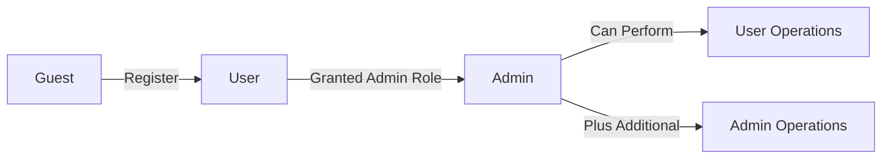
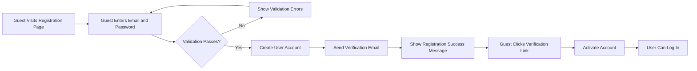
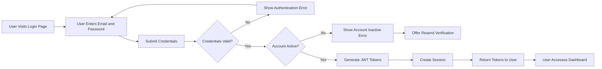
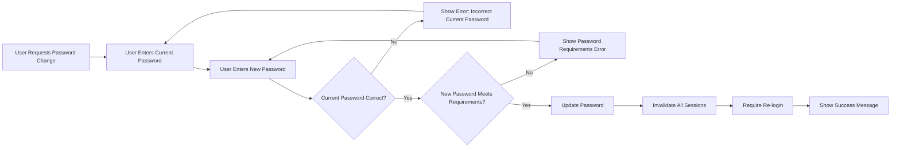
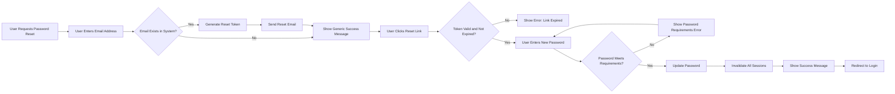
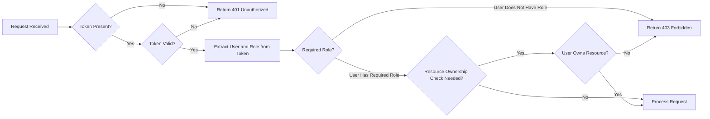
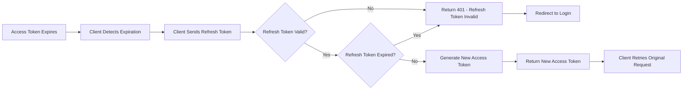

# User Actors and Authentication Requirements

## 1. Introduction

This document defines the complete authentication and authorization system for the Todo list application. It specifies all user actors, their permissions, authentication flows, JWT token management, and security requirements. This documentation provides backend developers with clear business requirements for implementing secure access control without prescribing specific technical implementation details.

### Document Scope

This document covers:
- User actor definitions and hierarchy
- Authentication system requirements in business terms
- JWT-based token management specifications
- Registration and login workflows
- Password management requirements
- Comprehensive permission matrix
- Authorization rules from user perspective
- Security requirements and error handling

### Security Philosophy

The Todo list application follows these security principles:
- User data privacy: Each user can only access their own todo items
- Secure authentication: JWT tokens for stateless, secure authentication
- Minimal permissions: Users receive only the permissions necessary for their role
- Clear access boundaries: Explicit rules for who can perform what actions

## 2. User Actor Definitions

The Todo list application supports three distinct user actors, each with specific capabilities and access levels.

### 2.1 Guest (Unauthenticated Visitor)

**Description**: Unauthenticated visitors who can view public information about the service and access registration and login pages.

**Capabilities**:
- View public landing pages and service information
- Access registration page to create new account
- Access login page to authenticate
- View password reset request page

**Restrictions**:
- Cannot create todo items
- Cannot view any todo items
- Cannot access user dashboard
- Cannot modify any application data
- Cannot access any authenticated features

### 2.2 User (Authenticated Member)

**Description**: Authenticated members who can create, read, update, delete, and complete their personal todo items. Each user has access only to their own todo lists.

**Capabilities**:
- Create new todo items
- View their own todo items
- Update their own todo items
- Delete their own todo items
- Mark their own todos as complete or incomplete
- Filter, sort, and search their own todos
- Manage their account settings
- Update their profile information
- Change their password
- Log out from their account

**Restrictions**:
- Cannot view other users' todo items
- Cannot modify other users' todo items
- Cannot access administrative functions
- Cannot view system-wide statistics
- Cannot manage other user accounts
- Cannot delete other users' data

### 2.3 Admin (System Administrator)

**Description**: System administrators with elevated permissions to manage user accounts, monitor system health, and perform administrative operations.

**Capabilities**:
- View system-wide statistics
- Manage user accounts (create, suspend, delete)
- Monitor system health and performance
- View user list and account information
- Reset user passwords for support purposes
- Access system logs and audit trails
- Configure system settings
- Perform all user-level operations on their own account

**Restrictions**:
- Should not access individual users' private todo items except for support purposes
- Cannot modify user data without audit logging
- Administrative actions must be traceable

### 2.4 Actor Hierarchy

## 3. Authentication System Requirements

### 3.1 Core Authentication Functions

THE system SHALL provide the following authentication capabilities:

**Registration**:
- WHEN a guest submits valid registration information, THE system SHALL create a new user account
- THE registration process SHALL require email address and password
- THE system SHALL send email verification to new registrations
- WHEN email verification is completed, THE system SHALL activate the user account

**Login**:
- WHEN a user submits valid login credentials, THE system SHALL authenticate and issue JWT tokens
- THE system SHALL validate credentials against stored user data
- WHEN authentication succeeds, THE system SHALL generate access and refresh tokens
- THE system SHALL respond to successful login within 2 seconds

**Logout**:
- WHEN a user requests logout, THE system SHALL invalidate the current session
- THE system SHALL provide logout capability from single device
- THE user SHALL be able to log out from all devices simultaneously

**Email Verification**:
- THE system SHALL send verification email within 1 minute of registration
- WHEN a user clicks verification link, THE system SHALL activate the account
- THE verification link SHALL expire after 24 hours

**Password Management**:
- THE system SHALL allow users to change their password
- THE system SHALL provide password reset functionality for forgotten passwords
- WHEN a user requests password reset, THE system SHALL send reset instructions via email
- THE password reset link SHALL expire after 1 hour

### 3.2 Session Management Requirements

**Session Creation**:
- WHEN a user logs in successfully, THE system SHALL create a new session
- THE system SHALL track active sessions per user
- THE system SHALL allow multiple concurrent sessions from different devices

**Session Expiration**:
- THE access token SHALL expire after 30 minutes of issuance
- THE refresh token SHALL expire after 7 days of issuance
- WHEN an access token expires, THE system SHALL require refresh token to obtain new access token
- WHEN a refresh token expires, THE system SHALL require the user to log in again

**Session Termination**:
- WHEN a user logs out, THE system SHALL terminate the current session
- WHEN a user selects "log out from all devices", THE system SHALL terminate all active sessions
- WHEN an admin resets a user password, THE system SHALL terminate all user sessions

## 4. JWT Token Management

### 4.1 Token Strategy

THE system SHALL use JWT (JSON Web Tokens) for authentication and authorization.

**Token Types**:
1. **Access Token**: Short-lived token for API authentication
2. **Refresh Token**: Long-lived token for obtaining new access tokens

### 4.2 Access Token Specifications

**Expiration**:
- THE access token SHALL expire 30 minutes after issuance
- WHEN an access token expires, THE system SHALL reject requests with expired token
- THE system SHALL return token expiration error with HTTP 401 status

**Payload Structure**:
THE access token payload SHALL include the following claims:
- `userId`: Unique identifier of the authenticated user
- `email`: User's email address
- `role`: User actor type ("user" or "admin")
- `iat`: Token issued-at timestamp
- `exp`: Token expiration timestamp

**Usage**:
- THE user SHALL include access token in request headers for authentication
- THE system SHALL validate access token signature before processing requests
- THE system SHALL verify token expiration before granting access

### 4.3 Refresh Token Specifications

**Expiration**:
- THE refresh token SHALL expire 7 days after issuance
- THE refresh token SHALL be used to obtain new access tokens
- WHEN a refresh token expires, THE user SHALL log in again

**Payload Structure**:
THE refresh token payload SHALL include:
- `userId`: Unique identifier of the authenticated user
- `tokenId`: Unique identifier for this refresh token
- `iat`: Token issued-at timestamp
- `exp`: Token expiration timestamp

**Token Renewal Process**:
- WHEN a user submits valid refresh token, THE system SHALL issue new access token
- THE refresh token SHALL remain valid for its original expiration period
- THE system SHALL validate refresh token before issuing new access token

### 4.4 Token Security Requirements

**Token Generation**:
- THE system SHALL sign all JWT tokens with secure secret key
- THE secret key SHALL be at least 256 bits in length
- THE system SHALL use HS256 or RS256 algorithm for token signing

**Token Storage**:
- THE access token SHOULD be stored in browser localStorage or httpOnly cookie
- THE refresh token SHOULD be stored securely (httpOnly cookie recommended)
- THE system SHALL never expose secret keys in client-side code

**Token Validation**:
- WHEN processing any authenticated request, THE system SHALL validate token signature
- THE system SHALL verify token expiration timestamp
- THE system SHALL reject tampered or invalid tokens with appropriate error

## 5. Registration Flow

### 5.1 Registration Process

### 5.2 Registration Requirements

**Guest Submits Registration**:
- WHEN a guest submits registration form, THE system SHALL validate all input fields
- THE email address SHALL be unique across all users
- THE password SHALL meet minimum security requirements
- WHEN validation fails, THE system SHALL display specific error messages

**Account Creation**:
- WHEN validation passes, THE system SHALL create new user account in inactive state
- THE system SHALL hash the password before storage
- THE system SHALL assign "user" role to new accounts
- THE newly created account SHALL be inactive until email verification

**Email Verification**:
- WHEN account is created, THE system SHALL send verification email within 1 minute
- THE verification email SHALL contain unique verification link
- WHEN user clicks verification link, THE system SHALL activate the account
- WHEN verification link is expired, THE system SHALL allow user to request new verification email

**Registration Validation Rules**:
- THE email address SHALL be valid email format
- THE email address SHALL not already exist in the system
- THE password SHALL be at least 8 characters long
- THE password SHALL contain at least one uppercase letter, one lowercase letter, and one number

### 5.3 Registration Error Scenarios

**Email Already Exists**:
- WHEN a guest attempts registration with existing email, THE system SHALL reject registration
- THE system SHALL display message "An account with this email already exists"
- THE system SHALL suggest login or password reset

**Invalid Email Format**:
- WHEN a guest enters invalid email format, THE system SHALL reject the input
- THE system SHALL display message "Please enter a valid email address"

**Weak Password**:
- WHEN a guest enters password not meeting requirements, THE system SHALL reject the password
- THE system SHALL display specific requirements not met
- THE system SHALL provide clear password requirements

## 6. Login Flow

### 6.1 Login Process

### 6.2 Login Requirements

**Credential Validation**:
- WHEN a user submits login credentials, THE system SHALL validate email and password
- THE system SHALL verify email exists in the system
- THE system SHALL compare submitted password with stored hash
- WHEN credentials are invalid, THE system SHALL reject login with error message

**Account Status Check**:
- WHEN credentials are valid, THE system SHALL verify account is active
- IF account is inactive, THE system SHALL reject login
- THE system SHALL offer to resend verification email for inactive accounts

**Token Generation**:
- WHEN authentication succeeds, THE system SHALL generate access token
- THE system SHALL generate refresh token
- THE system SHALL include user information in token payload (userId, email, role)

**Session Creation**:
- WHEN tokens are generated, THE system SHALL create session record
- THE system SHALL track session device and IP address
- THE system SHALL record login timestamp

**Response to User**:
- WHEN login succeeds, THE system SHALL return both access and refresh tokens
- THE system SHALL return user profile information
- THE system SHALL redirect user to dashboard or home page

### 6.3 Login Error Scenarios

**Invalid Credentials**:
- WHEN email or password is incorrect, THE system SHALL display message "Invalid email or password"
- THE system SHALL not reveal whether email exists in the system
- THE system SHALL log failed login attempts

**Inactive Account**:
- WHEN user attempts login with unverified account, THE system SHALL display message "Please verify your email address"
- THE system SHALL offer option to resend verification email

**Account Suspended**:
- WHEN user account is suspended by admin, THE system SHALL display message "Your account has been suspended"
- THE system SHALL provide contact information for support

**Too Many Failed Attempts**:
- WHEN user exceeds 5 failed login attempts within 15 minutes, THE system SHALL temporarily lock the account
- THE system SHALL display message "Too many failed attempts. Please try again in 15 minutes"
- THE account lock SHALL automatically expire after 15 minutes

## 7. Password Management

### 7.1 Password Requirements

**Password Strength Rules**:
- THE password SHALL be at least 8 characters in length
- THE password SHALL contain at least one uppercase letter (A-Z)
- THE password SHALL contain at least one lowercase letter (a-z)
- THE password SHALL contain at least one number (0-9)
- THE password SHOULD contain at least one special character for enhanced security

**Password Storage**:
- THE system SHALL hash all passwords before storage
- THE system SHALL never store passwords in plain text
- THE system SHALL use bcrypt or similar secure hashing algorithm
- THE system SHALL use unique salt for each password

### 7.2 Password Change Flow

**Password Change Requirements**:
- WHEN a user requests password change, THE system SHALL require current password verification
- THE user SHALL enter current password for authentication
- THE user SHALL enter new password meeting security requirements
- WHEN current password is incorrect, THE system SHALL reject the change
- WHEN new password is valid, THE system SHALL update the password
- WHEN password is changed, THE system SHALL terminate all active sessions
- WHEN sessions are terminated, THE system SHALL require user to log in again with new password

### 7.3 Password Reset Flow

**Password Reset Requirements**:
- WHEN a user requests password reset, THE system SHALL ask for email address
- WHEN email is submitted, THE system SHALL generate unique reset token
- THE system SHALL send password reset email to the address
- THE system SHALL show success message regardless of whether email exists (security measure)
- THE reset token SHALL expire after 1 hour
- THE reset email SHALL contain link with reset token

**Reset Link Usage**:
- WHEN user clicks reset link, THE system SHALL validate token
- WHEN token is valid, THE system SHALL display password reset form
- WHEN token is expired, THE system SHALL display error and offer to send new reset link
- WHEN user submits new password, THE system SHALL validate password requirements
- WHEN password is valid, THE system SHALL update the password
- WHEN password is reset, THE system SHALL terminate all active sessions
- THE system SHALL display success message and redirect to login page

### 7.4 Password Security Measures

**Brute Force Protection**:
- WHEN user fails 5 consecutive login attempts, THE system SHALL temporarily lock the account for 15 minutes
- WHEN user fails 3 consecutive password reset attempts, THE system SHALL rate-limit reset requests

**Password History**:
- THE system SHOULD prevent reuse of last 3 passwords
- WHEN user attempts to reuse recent password, THE system SHALL reject with appropriate message

## 8. Permission Matrix

The following table defines exactly what each actor can and cannot do in the Todo list application.

### 8.1 Comprehensive Permission Table

| Feature/Action | Guest | User | Admin |
|---|---|---|---|
| **Authentication** |
| View registration page | ✅ | ✅ | ✅ |
| Register new account | ✅ | ❌ | ❌ |
| View login page | ✅ | ✅ | ✅ |
| Log in to account | ✅ | ✅ | ✅ |
| Log out from account | ❌ | ✅ | ✅ |
| Request password reset | ✅ | ✅ | ✅ |
| Change own password | ❌ | ✅ | ✅ |
| Verify email address | ✅ | ✅ | ✅ |
| **Todo Management** |
| Create todo item | ❌ | ✅ | ✅ |
| View own todos | ❌ | ✅ | ✅ |
| Update own todos | ❌ | ✅ | ✅ |
| Delete own todos | ❌ | ✅ | ✅ |
| Complete own todos | ❌ | ✅ | ✅ |
| Filter own todos | ❌ | ✅ | ✅ |
| Sort own todos | ❌ | ✅ | ✅ |
| Search own todos | ❌ | ✅ | ✅ |
| View other users' todos | ❌ | ❌ | ❌* |
| Modify other users' todos | ❌ | ❌ | ❌ |
| **Account Management** |
| View own profile | ❌ | ✅ | ✅ |
| Update own profile | ❌ | ✅ | ✅ |
| Delete own account | ❌ | ✅ | ✅ |
| View account settings | ❌ | ✅ | ✅ |
| Update account settings | ❌ | ✅ | ✅ |
| **Administrative Functions** |
| View user list | ❌ | ❌ | ✅ |
| View user details | ❌ | ❌ | ✅ |
| Create user account | ❌ | ❌ | ✅ |
| Suspend user account | ❌ | ❌ | ✅ |
| Activate user account | ❌ | ❌ | ✅ |
| Delete user account | ❌ | ❌ | ✅ |
| Reset user password | ❌ | ❌ | ✅ |
| View system statistics | ❌ | ❌ | ✅ |
| View system logs | ❌ | ❌ | ✅ |
| Configure system settings | ❌ | ❌ | ✅ |

*Admins should not access individual users' private todo items except for legitimate support purposes with audit logging.

### 8.2 Permission Rules

**Data Ownership Principle**:
- WHEN a user creates a todo item, THE todo item SHALL be owned by that user
- THE user SHALL have full control over their owned todo items
- THE system SHALL prevent access to todo items not owned by the requesting user

**Role-Based Access Control**:
- WHEN a guest attempts any authenticated action, THE system SHALL deny access
- WHEN a user attempts administrative action, THE system SHALL deny access
- WHEN an admin performs administrative action, THE system SHALL log the action

**Authorization Enforcement**:
- THE system SHALL verify user authentication before processing any protected request
- THE system SHALL verify user authorization before allowing resource access
- WHEN authorization fails, THE system SHALL return HTTP 403 Forbidden error

## 9. Authorization Requirements

### 9.1 Resource Ownership Verification

**Todo Item Access Control**:
- WHEN a user requests to view a todo item, THE system SHALL verify the user owns the todo
- WHEN a user requests to update a todo item, THE system SHALL verify ownership before allowing modification
- WHEN a user requests to delete a todo item, THE system SHALL verify ownership before deletion
- WHEN ownership verification fails, THE system SHALL deny access with error message "You do not have permission to access this resource"

**Profile Access Control**:
- THE user SHALL only access and modify their own profile
- WHEN a user attempts to view another user's profile, THE system SHALL deny access
- WHEN a user attempts to modify another user's profile, THE system SHALL deny access

### 9.2 Role-Based Authorization Rules

**User Role Permissions**:
- THE user with "user" role SHALL access only user-level features
- WHEN a user attempts admin-only action, THE system SHALL deny with message "Administrative privileges required"

**Admin Role Permissions**:
- THE user with "admin" role SHALL access all administrative features
- THE admin SHALL be able to perform user-level actions on their own account
- THE admin SHALL log all administrative actions for audit purposes

### 9.3 Permission Enforcement Process

## 10. Security Requirements

### 10.1 Authentication Security

**Credential Protection**:
- THE system SHALL hash all passwords using bcrypt or similar secure algorithm
- THE system SHALL use unique salt for each password
- THE system SHALL never log passwords in plain text
- THE system SHALL transmit credentials only over HTTPS

**Token Security**:
- THE system SHALL sign all JWT tokens with secure secret key
- THE secret key SHALL be stored securely and never exposed to clients
- THE system SHALL validate token signature on every authenticated request
- THE system SHALL reject expired, invalid, or tampered tokens

**Session Security**:
- THE system SHALL implement session timeout after 30 minutes of inactivity for access tokens
- THE system SHALL provide secure logout that invalidates tokens
- THE system SHALL prevent token theft by validating token claims

### 10.2 Rate Limiting

**Login Rate Limiting**:
- WHEN a user attempts more than 5 failed logins within 15 minutes, THE system SHALL temporarily lock the account
- THE account lock SHALL automatically expire after 15 minutes
- THE system SHALL notify user of temporary lock with time remaining

**Password Reset Rate Limiting**:
- WHEN a user requests more than 3 password resets within 1 hour, THE system SHALL rate-limit further requests
- THE system SHALL display message "Too many password reset requests. Please try again later"

**API Rate Limiting**:
- THE system SHALL limit requests to 100 requests per minute per user
- WHEN rate limit is exceeded, THE system SHALL return HTTP 429 Too Many Requests
- THE system SHALL include retry-after header in rate limit responses

### 10.3 Account Protection

**Account Lockout**:
- WHEN an account is locked due to failed login attempts, THE system SHALL send notification email
- THE user SHALL be able to unlock account via email verification
- THE admin SHALL be able to manually unlock user accounts

**Suspicious Activity Detection**:
- THE system SHOULD detect and log suspicious login patterns
- THE system SHOULD notify users of logins from new devices or locations
- THE system SHOULD allow users to review active sessions and terminate suspicious ones

## 11. Error Handling for Authentication

### 11.1 Authentication Error Scenarios

**Invalid Credentials Error**:
- WHEN user enters wrong email or password, THE system SHALL display "Invalid email or password"
- THE system SHALL not indicate whether email exists
- THE system SHALL log failed attempt for security monitoring

**Expired Token Error**:
- WHEN access token expires, THE system SHALL return HTTP 401 with error code "TOKEN_EXPIRED"
- THE system SHALL include message "Your session has expired. Please log in again"
- THE client application SHOULD attempt token refresh automatically

**Invalid Token Error**:
- WHEN token signature is invalid, THE system SHALL return HTTP 401 with error code "INVALID_TOKEN"
- THE system SHALL include message "Authentication failed. Please log in again"
- THE system SHALL log potential security incident

**Missing Token Error**:
- WHEN authenticated endpoint is accessed without token, THE system SHALL return HTTP 401 with error code "NO_TOKEN"
- THE system SHALL include message "Authentication required. Please log in"

### 11.2 Authorization Error Scenarios

**Insufficient Permissions Error**:
- WHEN user attempts action without required role, THE system SHALL return HTTP 403 with error code "INSUFFICIENT_PERMISSIONS"
- THE system SHALL include message "You do not have permission to perform this action"

**Resource Access Denied Error**:
- WHEN user attempts to access resource they don't own, THE system SHALL return HTTP 403 with error code "ACCESS_DENIED"
- THE system SHALL include message "You do not have permission to access this resource"

**Account Inactive Error**:
- WHEN inactive user attempts login, THE system SHALL return error code "ACCOUNT_INACTIVE"
- THE system SHALL include message "Please verify your email address to activate your account"
- THE system SHALL offer option to resend verification email

**Account Suspended Error**:
- WHEN suspended user attempts login, THE system SHALL return error code "ACCOUNT_SUSPENDED"
- THE system SHALL include message "Your account has been suspended. Please contact support"

### 11.3 Registration and Password Error Scenarios

**Email Already Exists Error**:
- WHEN registration attempted with existing email, THE system SHALL return error code "EMAIL_EXISTS"
- THE system SHALL include message "An account with this email already exists"
- THE system SHALL suggest login or password reset

**Weak Password Error**:
- WHEN password doesn't meet requirements, THE system SHALL return error code "WEAK_PASSWORD"
- THE system SHALL include specific requirements not met
- THE system SHALL display message with password requirements

**Password Reset Token Expired Error**:
- WHEN expired reset token is used, THE system SHALL return error code "RESET_TOKEN_EXPIRED"
- THE system SHALL include message "This password reset link has expired. Please request a new one"
- THE system SHALL offer option to request new reset link

**Incorrect Current Password Error**:
- WHEN password change attempted with wrong current password, THE system SHALL return error code "INCORRECT_PASSWORD"
- THE system SHALL include message "Current password is incorrect"

## 12. Token Refresh Flow

### 12.1 Token Refresh Process

### 12.2 Token Refresh Requirements

**Automatic Token Refresh**:
- WHEN access token expires during user activity, THE client application SHOULD automatically request new access token
- THE client SHALL use refresh token to obtain new access token
- WHEN refresh succeeds, THE client SHALL retry the original failed request
- THE user SHOULD NOT be interrupted by token expiration during active usage

**Refresh Token Validation**:
- WHEN refresh token is submitted, THE system SHALL validate token signature
- THE system SHALL verify refresh token has not expired
- THE system SHALL verify refresh token belongs to requesting user
- WHEN validation fails, THE system SHALL require full re-authentication

**New Access Token Issuance**:
- WHEN refresh token is valid, THE system SHALL generate new access token
- THE new access token SHALL have fresh 30-minute expiration
- THE refresh token SHALL remain valid for its original expiration period
- THE system SHALL return new access token to client

## 13. Multi-Device Session Management

### 13.1 Concurrent Session Support

**Multiple Device Login**:
- THE system SHALL allow users to be logged in from multiple devices simultaneously
- THE system SHALL track each session separately with unique session identifier
- THE user SHALL be able to view all active sessions
- THE user SHALL be able to terminate individual sessions remotely

**Session Information**:
- WHEN a user views active sessions, THE system SHALL display device information
- THE system SHALL display login timestamp for each session
- THE system SHALL display IP address or location for each session
- THE system SHALL indicate current session to the user

**Session Termination**:
- WHEN a user logs out, THE system SHALL terminate only the current session
- WHEN a user selects "log out from all devices", THE system SHALL terminate all sessions
- WHEN a user terminates specific session, THE system SHALL invalidate that session's tokens
- WHEN password is changed or reset, THE system SHALL terminate all sessions for security

## 14. Admin Authentication Features

### 14.1 Admin-Specific Authentication

**Admin Account Creation**:
- THE admin accounts SHALL be created by existing admins only
- WHEN creating admin account, THE system SHALL require elevated authentication
- THE system SHALL log all admin account creation actions
- THE newly created admin SHALL receive invitation email

**Admin Password Reset**:
- THE admin SHALL be able to reset user passwords for support purposes
- WHEN admin resets user password, THE system SHALL terminate all user sessions
- THE system SHALL log admin password reset actions with reason
- THE affected user SHALL receive notification email

**Admin Session Monitoring**:
- THE system SHALL track all admin sessions separately
- THE system SHALL log all administrative actions with timestamp and admin identifier
- THE system SHALL maintain audit trail of admin activities

### 14.2 Admin Audit Requirements

**Action Logging**:
- WHEN admin performs administrative action, THE system SHALL log the action
- THE log SHALL include admin identifier, action type, timestamp, and affected resource
- THE logs SHALL be immutable and tamper-proof
- THE admin SHALL be able to view audit logs

**Accountability**:
- THE system SHALL attribute all administrative actions to specific admin
- THE system SHALL maintain full audit trail for compliance
- THE admin actions SHALL be reviewable by other admins

> *Developer Note: This document defines **business requirements only**. All technical implementations (architecture, APIs, database design, token storage mechanisms, hashing algorithms, etc.) are at the discretion of the development team.*
