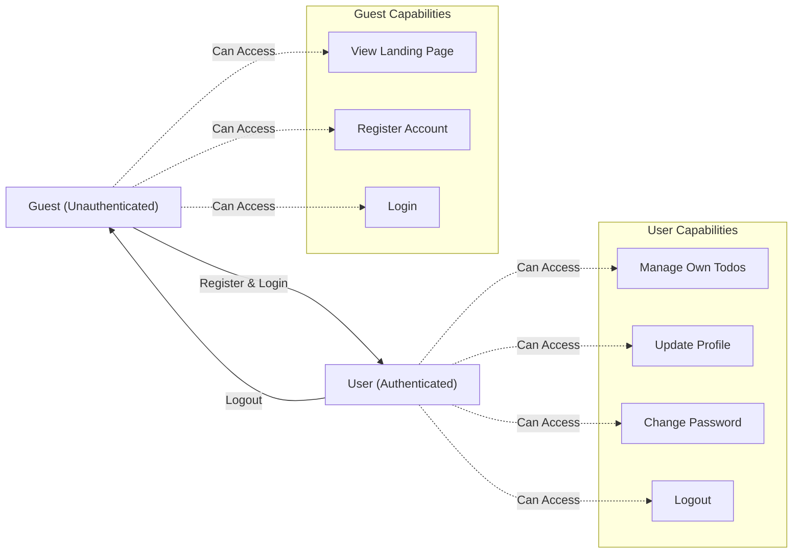
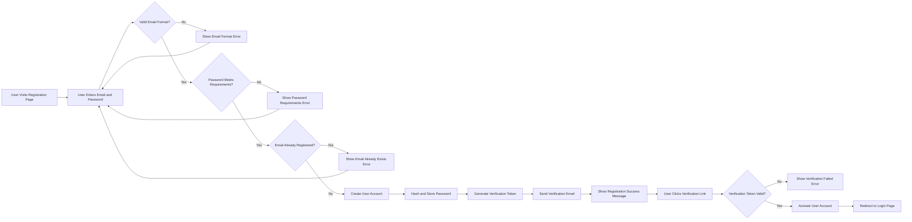
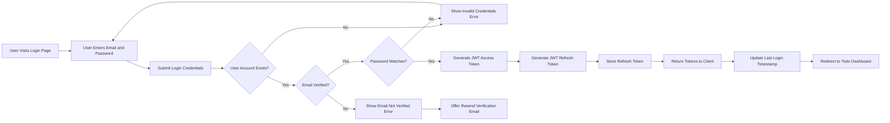
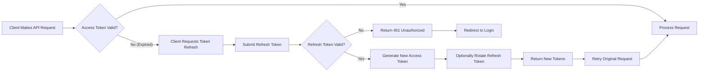

# User Roles and Authentication

## Authentication System Overview

The Todo list application implements a secure, token-based authentication system to enable users to maintain their personal todo lists with complete privacy and data isolation. The authentication architecture is designed with simplicity and security in mind, supporting only the essential user roles needed for a minimal yet functional todo management service.

### Authentication Philosophy

THE system SHALL implement a lightweight authentication mechanism that balances security with ease of use. WHEN users interact with the application, THE system SHALL ensure that each user accesses only their own todo items, maintaining strict data isolation between users. The authentication approach prioritizes:

- **Simplicity**: Minimal registration requirements with email and password only
- **Security**: Industry-standard JWT-based authentication with secure password storage
- **Privacy**: Complete isolation of user data - users can only see and manage their own todos
- **Stateless Operation**: Token-based authentication enabling scalable backend architecture
- **User Experience**: Fast login/logout with persistent sessions for convenience

### Why JWT (JSON Web Tokens)?

THE system SHALL use JWT for authentication tokens because:

1. **Stateless Authentication**: JWTs contain all necessary user information, eliminating the need for server-side session storage
2. **Scalability**: Stateless tokens enable horizontal scaling without session synchronization
3. **Security**: Cryptographically signed tokens prevent tampering and unauthorized access
4. **Industry Standard**: JWT is widely adopted with robust library support across programming languages
5. **Mobile-Friendly**: Tokens work seamlessly across web and future mobile implementations
6. **Performance**: Token validation is fast and doesn't require database lookups on every request

### System Scope

This authentication system supports:
- User registration with email verification
- Secure login and logout
- Session management with automatic token refresh
- Password reset functionality
- Role-based access control (guest vs authenticated user)

This authentication system does NOT support:
- Social login (OAuth) in the minimal version
- Multi-factor authentication (future enhancement)
- Single sign-on (SSO)
- Role hierarchy beyond guest and authenticated user
- Team or shared todo lists

## User Roles and Hierarchy

THE system SHALL implement exactly two user roles to maintain simplicity while ensuring proper access control.

### Role Definitions

#### 1. Guest (Unauthenticated User)

**Description**: Unauthenticated users who can only access the registration and login pages. They cannot create or manage todos until they register and authenticate.

**Role Characteristics**:
- **Kind**: `guest`
- **Authentication Status**: Not authenticated
- **Data Access**: No access to any todo data
- **Session**: No session or token

**Capabilities**:
- View public landing page
- Access registration page
- Access login page
- Submit registration form
- Submit login credentials

**Restrictions**:
- WHEN a guest attempts to access todo management features, THE system SHALL deny access and redirect to login page
- WHEN a guest attempts to create, view, edit, or delete todos, THE system SHALL return HTTP 401 Unauthorized
- THE system SHALL NOT allow guests to access any user-specific data

#### 2. User (Authenticated Standard User)

**Description**: Authenticated standard users who can create, view, edit, complete, and delete their own todo items. Each user has access only to their personal todo list and cannot see or modify other users' todos.

**Role Characteristics**:
- **Kind**: `member`
- **Authentication Status**: Authenticated with valid JWT
- **Data Access**: Full access to their own todos only
- **Session**: Active session with JWT access and refresh tokens

**Capabilities**:
- Create new todo items in their personal list
- View all their own todo items
- Edit their own todo items (title, description, completion status)
- Mark their todos as complete or incomplete
- Delete their own todo items
- Update their own profile information
- Change their password
- Log out and invalidate their session

**Restrictions**:
- WHEN a user attempts to access another user's todos, THE system SHALL deny access and return HTTP 403 Forbidden
- WHEN a user attempts to view all users' data, THE system SHALL deny access
- THE system SHALL NOT allow users to perform administrative functions
- THE system SHALL NOT allow users to delete their account (future enhancement)

### Role Hierarchy



## Authentication Requirements

THE system SHALL provide comprehensive authentication functionality to support user registration, login, session management, and account security.

### Core Authentication Functions

#### User Registration

- **REQ-AUTH-001**: THE system SHALL allow new users to register with a valid email address and password
- **REQ-AUTH-002**: WHEN a user submits registration information, THE system SHALL validate email format and password strength before creating the account
- **REQ-AUTH-003**: THE system SHALL send a verification email to the registered email address immediately after successful registration
- **REQ-AUTH-004**: WHEN a user attempts to register with an already-registered email, THE system SHALL reject the registration and return an error message indicating the email is already in use
- **REQ-AUTH-005**: THE system SHALL require email verification before allowing full account access
- **REQ-AUTH-006**: WHEN a user completes email verification, THE system SHALL activate their account and allow login

#### User Login

- **REQ-AUTH-007**: THE system SHALL allow users to log in with their registered email and password
- **REQ-AUTH-008**: WHEN a user submits valid login credentials, THE system SHALL authenticate the user and issue a JWT access token and refresh token
- **REQ-AUTH-009**: WHEN a user submits invalid login credentials, THE system SHALL reject the login attempt and return an error message without revealing whether the email or password was incorrect
- **REQ-AUTH-010**: THE system SHALL respond to login requests within 2 seconds under normal load conditions
- **REQ-AUTH-011**: IF a user has not verified their email, THEN THE system SHALL prevent login and prompt email verification

#### User Logout

- **REQ-AUTH-012**: THE system SHALL allow authenticated users to log out from their account
- **REQ-AUTH-013**: WHEN a user logs out, THE system SHALL invalidate their current refresh token
- **REQ-AUTH-014**: WHEN a user logs out, THE system SHALL clear the user's session data on the client side
- **REQ-AUTH-015**: THE system SHALL provide a logout option accessible from any page when the user is authenticated

#### Session Maintenance

- **REQ-AUTH-016**: THE system SHALL maintain user sessions using JWT access tokens with 30-minute expiration
- **REQ-AUTH-017**: THE system SHALL provide refresh tokens with 30-day expiration for session renewal
- **REQ-AUTH-018**: WHEN an access token expires, THE system SHALL allow the user to refresh their session using a valid refresh token
- **REQ-AUTH-019**: WHEN a refresh token expires, THE system SHALL require the user to log in again
- **REQ-AUTH-020**: THE system SHALL allow users to remain logged in across browser sessions if they choose

#### Password Management

- **REQ-AUTH-021**: THE system SHALL allow users to change their password while authenticated
- **REQ-AUTH-022**: WHEN a user changes their password, THE system SHALL require the current password for verification
- **REQ-AUTH-023**: THE system SHALL allow users to request a password reset if they forget their password
- **REQ-AUTH-024**: WHEN a user requests a password reset, THE system SHALL send a time-limited reset link to their registered email address
- **REQ-AUTH-025**: THE system SHALL expire password reset links after 1 hour for security
- **REQ-AUTH-026**: WHEN a user successfully resets their password, THE system SHALL invalidate all existing sessions for that user

#### Account Security

- **REQ-AUTH-027**: THE system SHALL allow users to view their active sessions
- **REQ-AUTH-028**: THE system SHALL allow users to revoke access from all devices by logging out from all sessions
- **REQ-AUTH-029**: WHEN a user logs out from all sessions, THE system SHALL invalidate all refresh tokens for that user
- **REQ-AUTH-030**: THE system SHALL record the last login timestamp for each user

## User Registration Flow

The registration flow enables new users to create an account and gain access to the todo management system.

### Registration Process



### Registration Requirements

#### Input Validation

- **REQ-REG-001**: WHEN a user submits registration data, THE system SHALL validate that the email address follows standard email format (contains @ symbol and valid domain)
- **REQ-REG-002**: WHEN a user submits registration data, THE system SHALL validate that the password is at least 8 characters long
- **REQ-REG-003**: WHEN a user submits registration data, THE system SHALL validate that the password contains at least one uppercase letter, one lowercase letter, and one number
- **REQ-REG-004**: IF the email format is invalid, THEN THE system SHALL reject the registration and display message "Please enter a valid email address"
- **REQ-REG-005**: IF the password does not meet requirements, THEN THE system SHALL reject the registration and display message "Password must be at least 8 characters with uppercase, lowercase, and number"

#### Account Creation

- **REQ-REG-006**: WHEN creating a new user account, THE system SHALL check if the email is already registered before proceeding
- **REQ-REG-007**: IF the email is already registered, THEN THE system SHALL reject the registration and display message "An account with this email already exists"
- **REQ-REG-008**: WHEN creating a new user account, THE system SHALL hash the password using bcrypt with minimum cost factor of 10
- **REQ-REG-009**: THE system SHALL NOT store passwords in plain text under any circumstances
- **REQ-REG-010**: WHEN a new account is created, THE system SHALL set the account status to "unverified"
- **REQ-REG-011**: WHEN a new account is created, THE system SHALL record the registration timestamp

#### Email Verification

- **REQ-REG-012**: WHEN a user registers successfully, THE system SHALL generate a unique verification token
- **REQ-REG-013**: THE system SHALL send a verification email to the registered email address within 5 seconds of registration
- **REQ-REG-014**: THE verification email SHALL contain a link with the verification token that directs to the verification endpoint
- **REQ-REG-015**: THE verification token SHALL expire after 24 hours
- **REQ-REG-016**: WHEN a user clicks the verification link with a valid token, THE system SHALL activate the account
- **REQ-REG-017**: WHEN a user clicks the verification link with an expired or invalid token, THE system SHALL display an error and offer to resend verification email
- **REQ-REG-018**: THE system SHALL allow users to request a new verification email if the original expires

#### Post-Registration

- **REQ-REG-019**: WHEN registration is successful, THE system SHALL display message "Registration successful! Please check your email to verify your account"
- **REQ-REG-020**: WHEN email verification is complete, THE system SHALL redirect the user to the login page
- **REQ-REG-021**: THE system SHALL display message "Email verified successfully! You can now log in"

## User Login Flow

The login flow authenticates existing users and establishes secure sessions for todo management.

### Login Process



### Login Requirements

#### Credential Validation

- **REQ-LOGIN-001**: WHEN a user submits login credentials, THE system SHALL validate that both email and password fields are provided
- **REQ-LOGIN-002**: IF either email or password is missing, THEN THE system SHALL return error message "Email and password are required"
- **REQ-LOGIN-003**: WHEN a user submits login credentials, THE system SHALL lookup the user account by email address
- **REQ-LOGIN-004**: WHEN a user submits login credentials, THE system SHALL verify the password against the stored hash using bcrypt comparison
- **REQ-LOGIN-005**: IF the email does not exist or password does not match, THEN THE system SHALL return error message "Invalid email or password" without revealing which field was incorrect
- **REQ-LOGIN-006**: IF the user account is not verified, THEN THE system SHALL return error message "Please verify your email address before logging in" and offer to resend verification email

#### Token Generation

- **REQ-LOGIN-007**: WHEN login credentials are valid and verified, THE system SHALL generate a JWT access token
- **REQ-LOGIN-008**: THE access token SHALL contain the following payload: userId, email, role (set to "user"), and issued-at timestamp
- **REQ-LOGIN-009**: THE access token SHALL expire after 30 minutes from issuance
- **REQ-LOGIN-010**: WHEN login credentials are valid, THE system SHALL generate a JWT refresh token
- **REQ-LOGIN-011**: THE refresh token SHALL contain the following payload: userId, token type (set to "refresh"), and issued-at timestamp
- **REQ-LOGIN-012**: THE refresh token SHALL expire after 30 days from issuance
- **REQ-LOGIN-013**: THE system SHALL sign both access and refresh tokens using a secure secret key stored in environment configuration

#### Session Establishment

- **REQ-LOGIN-014**: WHEN tokens are generated, THE system SHALL store the refresh token in the database associated with the user account
- **REQ-LOGIN-015**: THE system SHALL return both access token and refresh token to the client in the login response
- **REQ-LOGIN-016**: WHEN login is successful, THE system SHALL update the user's last login timestamp
- **REQ-LOGIN-017**: THE system SHALL return user profile information (userId, email, account creation date) along with tokens
- **REQ-LOGIN-018**: WHEN login is successful, THE system SHALL respond within 2 seconds under normal load conditions

#### Login Security

- **REQ-LOGIN-019**: THE system SHALL implement rate limiting to prevent brute force attacks, allowing maximum 5 failed login attempts per email per 15-minute window
- **REQ-LOGIN-020**: WHEN rate limit is exceeded, THE system SHALL temporarily block login attempts for that email and return error message "Too many failed login attempts. Please try again in 15 minutes"
- **REQ-LOGIN-021**: THE system SHALL log all login attempts (successful and failed) for security monitoring
- **REQ-LOGIN-022**: THE system SHALL NOT reveal whether an email exists in the system during failed login attempts

## Session Management

The session management system maintains authenticated user state using JWT tokens with automatic refresh capabilities.

### Session Architecture

THE system SHALL implement a dual-token approach:
- **Access Token**: Short-lived token (30 minutes) used for authenticating API requests
- **Refresh Token**: Long-lived token (30 days) used to obtain new access tokens without re-login

### Access Token Management

- **REQ-SESSION-001**: WHEN a user makes an authenticated request, THE system SHALL require a valid access token in the Authorization header
- **REQ-SESSION-002**: THE system SHALL validate the access token signature before processing the request
- **REQ-SESSION-003**: THE system SHALL validate that the access token has not expired
- **REQ-SESSION-004**: IF the access token is expired, THEN THE system SHALL return HTTP 401 Unauthorized with error code "TOKEN_EXPIRED"
- **REQ-SESSION-005**: IF the access token signature is invalid, THEN THE system SHALL return HTTP 401 Unauthorized with error code "TOKEN_INVALID"
- **REQ-SESSION-006**: WHEN the access token is valid, THE system SHALL extract userId from the token payload for request authorization

### Refresh Token Management

- **REQ-SESSION-007**: WHEN an access token expires, THE client SHALL request a new access token using the refresh token
- **REQ-SESSION-008**: WHEN a refresh token is submitted, THE system SHALL validate the refresh token signature and expiration
- **REQ-SESSION-009**: WHEN a refresh token is submitted, THE system SHALL verify that the refresh token exists in the database and has not been revoked
- **REQ-SESSION-010**: IF the refresh token is valid, THEN THE system SHALL generate a new access token with fresh 30-minute expiration
- **REQ-SESSION-011**: IF the refresh token is expired or invalid, THEN THE system SHALL return HTTP 401 Unauthorized and require the user to log in again
- **REQ-SESSION-012**: THE system SHALL allow refresh token rotation: WHEN a refresh token is used, THE system SHALL issue a new refresh token and invalidate the old one
- **REQ-SESSION-013**: THE system SHALL store only the most recent refresh token per user session in the database

### Session Persistence

- **REQ-SESSION-014**: THE client application SHALL store the access token in memory or localStorage for convenience
- **REQ-SESSION-015**: THE client application SHALL store the refresh token in httpOnly cookie or secure localStorage
- **REQ-SESSION-016**: WHEN the browser is closed and reopened, THE system SHALL allow session restoration using the refresh token if still valid
- **REQ-SESSION-017**: THE system SHALL support multiple concurrent sessions per user (e.g., logged in on multiple devices)

### Session Termination

- **REQ-SESSION-018**: WHEN a user logs out, THE system SHALL invalidate the user's refresh token in the database
- **REQ-SESSION-019**: WHEN a user logs out, THE client SHALL delete both access token and refresh token from storage
- **REQ-SESSION-020**: WHEN a user requests "logout from all devices", THE system SHALL invalidate all refresh tokens associated with that user
- **REQ-SESSION-021**: WHEN a user changes their password, THE system SHALL invalidate all refresh tokens to force re-login on all devices
- **REQ-SESSION-022**: WHEN a refresh token is used after being invalidated, THE system SHALL reject it and return error message "Session expired. Please log in again"

### Session Security

- **REQ-SESSION-023**: THE system SHALL use secure, randomly-generated secret keys for JWT signing
- **REQ-SESSION-024**: THE system SHALL use HTTPS for all authentication and session management requests to protect tokens in transit
- **REQ-SESSION-025**: THE system SHALL include token issued-at timestamp to prevent replay attacks with old tokens
- **REQ-SESSION-026**: THE system SHALL validate that token timestamps are reasonable (not from future or too far in past)

## Permission Matrix

The following matrix defines exactly what each user role can and cannot do within the system. This table provides clear authorization rules for all operations.

| Operation | Guest (Unauthenticated) | User (Authenticated) | Notes |
|-----------|------------------------|---------------------|-------|
| **Public Access** | | | |
| View landing page | ✅ | ✅ | Public information |
| View registration page | ✅ | ✅ | Account creation |
| View login page | ✅ | ❌ | Redirected to dashboard if authenticated |
| **Account Operations** | | | |
| Register new account | ✅ | ❌ | Can't register when already authenticated |
| Verify email address | ✅ | ✅ | Using verification token |
| Log in | ✅ | ❌ | Already logged in |
| Log out | ❌ | ✅ | Requires active session |
| Change password | ❌ | ✅ | Must be authenticated |
| Request password reset | ✅ | ✅ | Available to all |
| Reset password with token | ✅ | ✅ | Using reset token |
| View own profile | ❌ | ✅ | Requires authentication |
| Update own profile | ❌ | ✅ | Requires authentication |
| **Todo Operations** | | | |
| View todo dashboard | ❌ | ✅ | Requires authentication |
| Create new todo | ❌ | ✅ | Only own todos |
| View own todos | ❌ | ✅ | Only own todos |
| Edit own todo | ❌ | ✅ | Only own todos |
| Mark own todo complete/incomplete | ❌ | ✅ | Only own todos |
| Delete own todo | ❌ | ✅ | Only own todos |
| View other users' todos | ❌ | ❌ | Complete data isolation |
| Edit other users' todos | ❌ | ❌ | Complete data isolation |
| Delete other users' todos | ❌ | ❌ | Complete data isolation |
| View all users' todos | ❌ | ❌ | No administrative access |
| **Session Management** | | | |
| Refresh access token | ❌ | ✅ | Using valid refresh token |
| View active sessions | ❌ | ✅ | Own sessions only |
| Revoke session | ❌ | ✅ | Own sessions only |
| Logout from all devices | ❌ | ✅ | Invalidate all own sessions |

### Authorization Rules

- **REQ-PERM-001**: WHEN a guest attempts to access any todo operation, THE system SHALL return HTTP 401 Unauthorized with message "Authentication required"
- **REQ-PERM-002**: WHEN an authenticated user attempts to access another user's todos, THE system SHALL return HTTP 403 Forbidden with message "You do not have permission to access this resource"
- **REQ-PERM-003**: WHEN an authenticated user performs operations on their own todos, THE system SHALL verify userId from JWT token matches the todo owner
- **REQ-PERM-004**: THE system SHALL enforce authorization checks on every protected endpoint before processing the request
- **REQ-PERM-005**: THE system SHALL deny access by default and explicitly grant access only for permitted operations

## Security Requirements

The authentication system must implement robust security measures to protect user accounts and data.

### Password Security

- **REQ-SEC-001**: THE system SHALL hash all passwords using bcrypt algorithm with minimum cost factor of 10
- **REQ-SEC-002**: THE system SHALL NEVER store passwords in plain text or reversible encryption
- **REQ-SEC-003**: THE system SHALL NEVER transmit passwords in plain text - only over HTTPS
- **REQ-SEC-004**: THE system SHALL enforce minimum password requirements: 8 characters, at least one uppercase, one lowercase, and one number
- **REQ-SEC-005**: THE system SHALL reject commonly used weak passwords (e.g., "Password123", "12345678")
- **REQ-SEC-006**: WHEN a password is changed or reset, THE system SHALL require the new password to be different from the old password
- **REQ-SEC-007**: THE system SHALL allow passwords up to 128 characters in length to support passphrases

### Token Security

- **REQ-SEC-008**: THE system SHALL generate JWT tokens using a cryptographically secure secret key of at least 256 bits
- **REQ-SEC-009**: THE system SHALL store the JWT secret key in secure environment configuration, never in source code
- **REQ-SEC-010**: THE system SHALL use different secret keys for development, staging, and production environments
- **REQ-SEC-011**: THE system SHALL include token expiration times in all JWT tokens
- **REQ-SEC-012**: THE system SHALL validate token signature before trusting any token payload
- **REQ-SEC-013**: THE system SHALL reject tokens with tampered or invalid signatures
- **REQ-SEC-014**: THE system SHALL implement token rotation for refresh tokens to limit exposure window

### Communication Security

- **REQ-SEC-015**: THE system SHALL require HTTPS for all authentication endpoints in production
- **REQ-SEC-016**: THE system SHALL reject authentication requests over unencrypted HTTP in production
- **REQ-SEC-017**: THE system SHALL include secure, httpOnly, and SameSite flags on authentication cookies if using cookie-based token storage
- **REQ-SEC-018**: THE system SHALL implement CORS (Cross-Origin Resource Sharing) policies to restrict which domains can make authenticated requests

### Attack Prevention

- **REQ-SEC-019**: THE system SHALL implement rate limiting on authentication endpoints: maximum 5 login attempts per email per 15 minutes
- **REQ-SEC-020**: THE system SHALL implement rate limiting on registration: maximum 3 registration attempts per IP address per hour
- **REQ-SEC-021**: THE system SHALL implement rate limiting on password reset requests: maximum 3 requests per email per hour
- **REQ-SEC-022**: WHEN rate limits are exceeded, THE system SHALL temporarily block the operation and log the incident
- **REQ-SEC-023**: THE system SHALL sanitize all user input to prevent SQL injection, XSS, and other injection attacks
- **REQ-SEC-024**: THE system SHALL validate and sanitize email addresses before processing
- **REQ-SEC-025**: THE system SHALL prevent timing attacks by using constant-time comparison for passwords and tokens

### Session Security

- **REQ-SEC-026**: THE system SHALL automatically invalidate sessions after 30 days of inactivity (refresh token expiration)
- **REQ-SEC-027**: THE system SHALL allow users to view active sessions and logout from specific devices
- **REQ-SEC-028**: WHEN a user changes their password, THE system SHALL invalidate all sessions to force re-login
- **REQ-SEC-029**: THE system SHALL log all authentication events (login, logout, failed attempts) for security auditing
- **REQ-SEC-030**: THE system SHALL alert users via email when their password is changed

### Data Protection

- **REQ-SEC-031**: THE system SHALL ensure that user passwords are never included in API responses
- **REQ-SEC-032**: THE system SHALL ensure that JWT secret keys are never exposed in API responses or logs
- **REQ-SEC-033**: THE system SHALL sanitize error messages to prevent information leakage about user accounts
- **REQ-SEC-034**: WHEN login fails, THE system SHALL NOT reveal whether the email exists or the password was wrong

## Token Management (JWT)

This section defines the complete JWT token structure, lifecycle, and management strategy for the Todo list application.

### JWT Access Token Structure

THE access token SHALL have the following structure:

**Header:**
```json
{
  "alg": "HS256",
  "typ": "JWT"
}
```

**Payload:**
```json
{
  "userId": "unique-user-identifier",
  "email": "user@example.com",
  "role": "user",
  "iat": 1234567890,
  "exp": 1234569690
}
```

**Signature:**
- Signed using HMAC-SHA256 algorithm with secure secret key

#### Access Token Requirements

- **REQ-JWT-001**: THE access token payload SHALL include userId field containing the unique user identifier
- **REQ-JWT-002**: THE access token payload SHALL include email field containing the user's email address
- **REQ-JWT-003**: THE access token payload SHALL include role field set to "user" for authenticated users
- **REQ-JWT-004**: THE access token payload SHALL include iat (issued at) timestamp in Unix epoch format
- **REQ-JWT-005**: THE access token payload SHALL include exp (expiration) timestamp set to 30 minutes after iat
- **REQ-JWT-006**: THE access token SHALL be signed using HS256 (HMAC-SHA256) algorithm
- **REQ-JWT-007**: THE access token SHALL NOT include sensitive information like passwords or refresh tokens

### JWT Refresh Token Structure

THE refresh token SHALL have the following structure:

**Header:**
```json
{
  "alg": "HS256",
  "typ": "JWT"
}
```

**Payload:**
```json
{
  "userId": "unique-user-identifier",
  "tokenType": "refresh",
  "iat": 1234567890,
  "exp": 1237159890
}
```

#### Refresh Token Requirements

- **REQ-JWT-008**: THE refresh token payload SHALL include userId field containing the unique user identifier
- **REQ-JWT-009**: THE refresh token payload SHALL include tokenType field set to "refresh"
- **REQ-JWT-010**: THE refresh token payload SHALL include iat (issued at) timestamp in Unix epoch format
- **REQ-JWT-011**: THE refresh token payload SHALL include exp (expiration) timestamp set to 30 days after iat
- **REQ-JWT-012**: THE refresh token SHALL be signed using HS256 (HMAC-SHA256) algorithm
- **REQ-JWT-013**: THE refresh token SHALL be stored in the database associated with the user for validation

### Token Expiration Policy

- **REQ-JWT-014**: THE access token SHALL expire after 30 minutes from issuance
- **REQ-JWT-015**: THE refresh token SHALL expire after 30 days from issuance
- **REQ-JWT-016**: WHEN an access token expires, THE system SHALL accept a valid refresh token to issue a new access token
- **REQ-JWT-017**: WHEN a refresh token expires, THE system SHALL require the user to log in again
- **REQ-JWT-018**: THE system SHALL validate token expiration on every request before processing
- **REQ-JWT-019**: THE system SHALL reject expired tokens with HTTP 401 Unauthorized and error code "TOKEN_EXPIRED"

### Token Storage Strategy

#### Client-Side Storage

- **REQ-JWT-020**: THE client application SHOULD store the access token in memory or localStorage for quick access
- **REQ-JWT-021**: THE client application SHOULD store the refresh token in httpOnly secure cookie OR secure localStorage
- **REQ-JWT-022**: IF using localStorage, THE client SHALL implement XSS protection measures
- **REQ-JWT-023**: IF using cookies, THE system SHALL set httpOnly, secure, and SameSite=Strict flags

#### Server-Side Storage

- **REQ-JWT-024**: THE system SHALL store refresh tokens in the database with the following information: tokenId, userId, token hash, issued at timestamp, expiration timestamp
- **REQ-JWT-025**: THE system SHALL NOT store access tokens on the server (stateless validation)
- **REQ-JWT-026**: WHEN a refresh token is used, THE system SHALL verify it exists in the database before issuing a new access token
- **REQ-JWT-027**: WHEN a user logs out, THE system SHALL delete the refresh token from the database

### Token Refresh Flow



#### Token Refresh Requirements

- **REQ-JWT-028**: WHEN a client receives HTTP 401 with error code "TOKEN_EXPIRED", THE client SHALL automatically request a token refresh
- **REQ-JWT-029**: WHEN the refresh token endpoint receives a request, THE system SHALL validate the refresh token signature and expiration
- **REQ-JWT-030**: WHEN the refresh token is valid, THE system SHALL generate a new access token with fresh 30-minute expiration
- **REQ-JWT-031**: THE system SHALL implement refresh token rotation: issue a new refresh token and invalidate the old one for enhanced security
- **REQ-JWT-032**: IF refresh token rotation is enabled, THE response SHALL include both new access token and new refresh token
- **REQ-JWT-033**: WHEN the refresh token is invalid or expired, THE system SHALL return HTTP 401 and require re-login

### Token Revocation

- **REQ-JWT-034**: WHEN a user logs out, THE system SHALL revoke the refresh token by deleting it from the database
- **REQ-JWT-035**: WHEN a user requests "logout from all devices", THE system SHALL revoke all refresh tokens associated with that user
- **REQ-JWT-036**: WHEN a user changes their password, THE system SHALL revoke all refresh tokens to force re-login
- **REQ-JWT-037**: THE system SHALL provide an endpoint for administrators to revoke specific tokens in case of security incidents
- **REQ-JWT-038**: WHEN a refresh token is revoked, THE system SHALL immediately prevent its use for obtaining new access tokens

### Token Security Best Practices

- **REQ-JWT-039**: THE JWT secret key SHALL be at least 256 bits (32 bytes) in length
- **REQ-JWT-040**: THE JWT secret key SHALL be stored in environment variables, never in source code
- **REQ-JWT-041**: THE system SHALL use different secret keys for different environments (development, staging, production)
- **REQ-JWT-042**: THE system SHALL rotate JWT secret keys periodically (recommended: every 90 days)
- **REQ-JWT-043**: WHEN rotating secret keys, THE system SHALL support a grace period where both old and new keys are valid for smooth transition
- **REQ-JWT-044**: THE system SHALL validate token signature before trusting any payload data
- **REQ-JWT-045**: THE system SHALL reject tokens with tampered signatures immediately

## Authentication Error Scenarios

This section defines all error scenarios related to authentication and how the system should handle them from the user's perspective.

### Registration Errors

- **ERR-REG-001**: IF a user submits registration with an invalid email format, THEN THE system SHALL return HTTP 400 Bad Request with message "Please enter a valid email address"
- **ERR-REG-002**: IF a user submits registration with password shorter than 8 characters, THEN THE system SHALL return HTTP 400 Bad Request with message "Password must be at least 8 characters long"
- **ERR-REG-003**: IF a user submits registration with password missing required characters, THEN THE system SHALL return HTTP 400 Bad Request with message "Password must contain uppercase, lowercase, and number"
- **ERR-REG-004**: IF a user attempts to register with an email that is already registered, THEN THE system SHALL return HTTP 409 Conflict with message "An account with this email already exists"
- **ERR-REG-005**: IF email verification fails due to expired token, THEN THE system SHALL return HTTP 400 Bad Request with message "Verification link has expired. Please request a new verification email"
- **ERR-REG-006**: IF email verification fails due to invalid token, THEN THE system SHALL return HTTP 400 Bad Request with message "Invalid verification link. Please request a new verification email"
- **ERR-REG-007**: IF the verification email fails to send, THEN THE system SHALL log the error and display message "Account created, but verification email failed to send. Please contact support"

### Login Errors

- **ERR-LOGIN-001**: IF a user submits login without email or password, THEN THE system SHALL return HTTP 400 Bad Request with message "Email and password are required"
- **ERR-LOGIN-002**: IF a user submits login with non-existent email, THEN THE system SHALL return HTTP 401 Unauthorized with message "Invalid email or password"
- **ERR-LOGIN-003**: IF a user submits login with incorrect password, THEN THE system SHALL return HTTP 401 Unauthorized with message "Invalid email or password"
- **ERR-LOGIN-004**: IF a user attempts to login with unverified email, THEN THE system SHALL return HTTP 403 Forbidden with message "Please verify your email address before logging in" and provide option to resend verification email
- **ERR-LOGIN-005**: IF a user exceeds rate limit (5 failed attempts in 15 minutes), THEN THE system SHALL return HTTP 429 Too Many Requests with message "Too many failed login attempts. Please try again in 15 minutes"
- **ERR-LOGIN-006**: IF a user's account is suspended or disabled, THEN THE system SHALL return HTTP 403 Forbidden with message "Your account has been suspended. Please contact support"

### Token Errors

- **ERR-TOKEN-001**: IF a request includes an expired access token, THEN THE system SHALL return HTTP 401 Unauthorized with error code "TOKEN_EXPIRED" and message "Your session has expired. Please refresh your token"
- **ERR-TOKEN-002**: IF a request includes an invalid or tampered access token, THEN THE system SHALL return HTTP 401 Unauthorized with error code "TOKEN_INVALID" and message "Invalid authentication token"
- **ERR-TOKEN-003**: IF a request includes a malformed access token, THEN THE system SHALL return HTTP 401 Unauthorized with error code "TOKEN_MALFORMED" and message "Invalid token format"
- **ERR-TOKEN-004**: IF a refresh token request includes an expired refresh token, THEN THE system SHALL return HTTP 401 Unauthorized with error code "REFRESH_TOKEN_EXPIRED" and message "Your session has expired. Please log in again"
- **ERR-TOKEN-005**: IF a refresh token request includes a revoked refresh token, THEN THE system SHALL return HTTP 401 Unauthorized with error code "REFRESH_TOKEN_REVOKED" and message "Session has been terminated. Please log in again"
- **ERR-TOKEN-006**: IF a refresh token is not found in the database, THEN THE system SHALL return HTTP 401 Unauthorized with error code "REFRESH_TOKEN_NOT_FOUND" and message "Invalid session. Please log in again"
- **ERR-TOKEN-007**: IF no authentication token is provided for a protected endpoint, THEN THE system SHALL return HTTP 401 Unauthorized with message "Authentication required"

### Password Management Errors

- **ERR-PWD-001**: IF a password change request includes incorrect current password, THEN THE system SHALL return HTTP 401 Unauthorized with message "Current password is incorrect"
- **ERR-PWD-002**: IF a password change request includes new password that doesn't meet requirements, THEN THE system SHALL return HTTP 400 Bad Request with message "New password must be at least 8 characters with uppercase, lowercase, and number"
- **ERR-PWD-003**: IF a password change request includes new password identical to old password, THEN THE system SHALL return HTTP 400 Bad Request with message "New password must be different from current password"
- **ERR-PWD-004**: IF a password reset request is made for non-existent email, THEN THE system SHALL return HTTP 200 OK with generic message "If the email exists, a reset link has been sent" (to prevent email enumeration)
- **ERR-PWD-005**: IF a password reset token is expired, THEN THE system SHALL return HTTP 400 Bad Request with message "Password reset link has expired. Please request a new one"
- **ERR-PWD-006**: IF a password reset token is invalid, THEN THE system SHALL return HTTP 400 Bad Request with message "Invalid password reset link. Please request a new one"
- **ERR-PWD-007**: IF password reset email fails to send, THEN THE system SHALL log the error internally but return success to user to prevent email enumeration

### Authorization Errors

- **ERR-AUTH-001**: IF a guest user attempts to access a protected todo endpoint, THEN THE system SHALL return HTTP 401 Unauthorized with message "Authentication required. Please log in"
- **ERR-AUTH-002**: IF an authenticated user attempts to access another user's todo, THEN THE system SHALL return HTTP 403 Forbidden with message "You do not have permission to access this resource"
- **ERR-AUTH-003**: IF an authenticated user attempts to perform an unauthorized action, THEN THE system SHALL return HTTP 403 Forbidden with message "You do not have permission to perform this action"

### Session Errors

- **ERR-SESSION-001**: IF a user's session expires during activity, THEN THE system SHALL return HTTP 401 Unauthorized and prompt for token refresh or re-login
- **ERR-SESSION-002**: IF a user attempts to use a token after logout, THEN THE system SHALL return HTTP 401 Unauthorized with message "Session has been terminated. Please log in again"
- **ERR-SESSION-003**: IF a user attempts to use a token after password change, THEN THE system SHALL return HTTP 401 Unauthorized with message "Session has been terminated due to password change. Please log in again"

### System Errors

- **ERR-SYS-001**: IF the authentication service is unavailable, THEN THE system SHALL return HTTP 503 Service Unavailable with message "Authentication service is temporarily unavailable. Please try again later"
- **ERR-SYS-002**: IF database connection fails during authentication, THEN THE system SHALL return HTTP 500 Internal Server Error with message "An error occurred. Please try again later"
- **ERR-SYS-003**: IF token generation fails, THEN THE system SHALL return HTTP 500 Internal Server Error with message "An error occurred during login. Please try again"
- **ERR-SYS-004**: IF email service is unavailable, THEN THE system SHALL log the error and queue the email for retry, displaying message "Your request is being processed. You should receive an email shortly"

### Error Recovery Guidance

- **ERR-RECOVERY-001**: WHEN an authentication error occurs, THE system SHALL provide clear next steps for the user
- **ERR-RECOVERY-002**: WHEN token expiration occurs, THE system SHALL automatically attempt token refresh before prompting re-login
- **ERR-RECOVERY-003**: WHEN verification email is not received, THE system SHALL provide a "Resend verification email" option
- **ERR-RECOVERY-004**: WHEN password reset fails, THE system SHALL provide a "Request new reset link" option
- **ERR-RECOVERY-005**: WHEN rate limits are hit, THE system SHALL display the time remaining until retry is allowed

---

## Document Summary

This document provides comprehensive authentication and authorization requirements for the minimal Todo list application. The authentication system is designed with the following principles:

**Security First**: Industry-standard JWT tokens, bcrypt password hashing, rate limiting, and comprehensive security measures

**Simplicity**: Only two user roles (guest and authenticated user) with clear permission boundaries

**User Experience**: Fast login/logout, persistent sessions with token refresh, and clear error messages

**Privacy**: Complete data isolation - users can only access their own todos

**Scalability**: Stateless JWT authentication enables horizontal scaling

The authentication system serves as the foundation for the entire Todo list application, ensuring that each user has secure, private access to their personal todo items while maintaining simplicity and ease of use.

Backend developers can use this document to implement a complete, production-ready authentication system that balances security with user convenience.