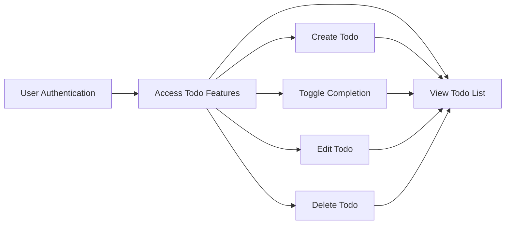
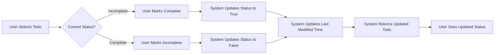
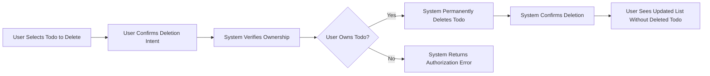
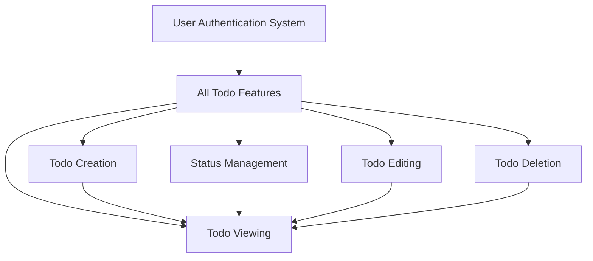

# Core Features

## Feature Overview

This document defines the core features of the Todo list application, focusing exclusively on essential todo management operations. The feature set is intentionally minimal, designed to provide users with a straightforward, distraction-free task management experience.

### Feature Philosophy

The Todo list application embraces simplicity as its core value. Every feature included serves a direct, essential purpose in helping users manage their tasks. This minimal approach ensures:

- **Ease of Use**: Users can immediately understand and use the application without training
- **Focus**: No feature bloat or distractions from core task management
- **Reliability**: Fewer features mean fewer points of failure and easier maintenance
- **Speed**: Streamlined functionality enables fast, responsive user interactions

### Core Feature Set

The application provides five essential capabilities:

1. **Todo Creation**: Users can add new tasks to their list
2. **Todo Viewing**: Users can see all their tasks in an organized list
3. **Todo Completion Management**: Users can mark tasks as complete or incomplete
4. **Todo Editing**: Users can modify existing task details
5. **Todo Deletion**: Users can remove tasks they no longer need

All features are scoped to authenticated users only. Each user has access exclusively to their own todos, ensuring complete privacy and data isolation.

### Feature Relationships

All todo management features depend on successful user authentication. After any create, edit, delete, or status change operation, the updated todo list is available for viewing.

## Todo Data Structure

### Todo Item Properties

Each todo item in the system contains the following information:

**Unique Identifier**
- Purpose: Uniquely identifies each todo across the entire system
- Type: UUID (Universally Unique Identifier)
- Generation: System-generated upon todo creation
- Immutability: Never changes after creation
- Usage: Used for all operations targeting specific todos (edit, delete, status toggle)

**Title**
- Purpose: The main text describing the task
- Type: Text string
- Required: Yes, cannot be empty
- Length constraints: Minimum 1 character, maximum 200 characters
- Validation: Must contain at least one non-whitespace character
- Usage: Primary display text in todo lists

**Description**
- Purpose: Optional detailed information about the task
- Type: Text string
- Required: No, can be empty or null
- Length constraints: Maximum 2000 characters when provided
- Usage: Provides additional context for complex tasks

**Completion Status**
- Purpose: Indicates whether the task is complete
- Type: Boolean (true/false)
- Required: Yes
- Default value: false (incomplete) for newly created todos
- Values: 
  - false = incomplete/pending task
  - true = completed task
- Usage: Determines visual presentation and filtering

**Owner**
- Purpose: Links the todo to the user who created it
- Type: User identifier reference
- Required: Yes
- Immutability: Never changes after creation
- Usage: Enforces data isolation between users

**Creation Timestamp**
- Purpose: Records when the todo was created
- Type: ISO 8601 date-time format
- Required: Yes
- Generation: System-generated upon todo creation
- Immutability: Never changes after creation
- Usage: Enables chronological sorting and audit trails

**Last Modified Timestamp**
- Purpose: Records when the todo was last updated
- Type: ISO 8601 date-time format
- Required: Yes
- Generation: System-generated upon creation and updated on every modification
- Updates: Changed whenever title, description, or completion status changes
- Usage: Enables sorting by recent activity

### Data Structure Summary Table

| Property | Type | Required | Mutable | Default | Max Length |
|----------|------|----------|---------|---------|------------|
| Unique Identifier | UUID | Yes | No | System-generated | N/A |
| Title | String | Yes | Yes | None | 200 chars |
| Description | String | No | Yes | null | 2000 chars |
| Completion Status | Boolean | Yes | Yes | false | N/A |
| Owner | User ID | Yes | No | Current user | N/A |
| Creation Timestamp | DateTime | Yes | No | System-generated | N/A |
| Last Modified Timestamp | DateTime | Yes | System-managed | System-generated | N/A |

## Todo Creation Feature

### Feature Description

Users can create new todo items to add tasks to their personal todo list. This is the entry point for all task management activities.

### User Capability

Authenticated users can add new todos to their personal list by providing a task title and optionally a detailed description.

### Functional Requirements

**FR-CREATE-001: Todo Creation Capability**
WHEN an authenticated user submits a new todo with a valid title, THE system SHALL create a new todo item and add it to the user's personal todo list.

**FR-CREATE-002: Title Requirement**
THE system SHALL require a title for every new todo creation request.

**FR-CREATE-003: Title Length Validation**
WHEN a user submits a todo title, THE system SHALL validate that the title contains between 1 and 200 characters.

**FR-CREATE-004: Title Content Validation**
WHEN a user submits a todo title, THE system SHALL validate that the title contains at least one non-whitespace character.

**FR-CREATE-005: Description Optional**
THE system SHALL allow users to create todos without providing a description.

**FR-CREATE-006: Description Length Validation**
IF a user provides a description, THEN THE system SHALL validate that the description does not exceed 2000 characters.

**FR-CREATE-007: Default Completion Status**
WHEN the system creates a new todo, THE system SHALL set the completion status to false (incomplete).

**FR-CREATE-008: Automatic Owner Assignment**
WHEN the system creates a new todo, THE system SHALL automatically assign the currently authenticated user as the owner.

**FR-CREATE-009: Automatic Identifier Generation**
WHEN the system creates a new todo, THE system SHALL generate a unique UUID identifier for the todo.

**FR-CREATE-010: Automatic Timestamp Generation**
WHEN the system creates a new todo, THE system SHALL record the current date and time as both the creation timestamp and last modified timestamp.

**FR-CREATE-011: Immediate Availability**
WHEN the system successfully creates a new todo, THE system SHALL immediately make the todo available in the user's todo list.

**FR-CREATE-012: Creation Confirmation**
WHEN the system successfully creates a new todo, THE system SHALL return the complete todo details including the system-generated identifier and timestamps.

**FR-CREATE-013: Creation Failure on Invalid Title**
IF a user submits a todo creation request with an invalid title, THEN THE system SHALL reject the request and return a validation error without creating a todo.

**FR-CREATE-014: Creation Failure on Invalid Description**
IF a user submits a todo creation request with a description exceeding 2000 characters, THEN THE system SHALL reject the request and return a validation error without creating a todo.

**FR-CREATE-015: Guest User Restriction**
IF an unauthenticated guest attempts to create a todo, THEN THE system SHALL deny the request and return an authentication error.

### Input Validation Rules

**Title Validation:**
- Must be present (not null, not empty string)
- Must contain at least one non-whitespace character
- Length: 1-200 characters
- Leading and trailing whitespace should be trimmed before validation
- Example valid titles: "Buy groceries", "Call dentist at 3pm", "Review project proposal"
- Example invalid titles: "", "   " (only whitespace), (201+ character string)

**Description Validation:**
- Optional field (null or empty string is acceptable)
- Maximum length: 2000 characters when provided
- No minimum length requirement
- Example valid descriptions: null, "", "Remember to buy milk, eggs, and bread", (detailed multi-line text up to 2000 chars)
- Example invalid descriptions: (2001+ character string)

### Response Time Requirements

**FR-CREATE-016: Creation Response Time**
WHEN a user submits a valid todo creation request, THE system SHALL complete the operation and respond within 2 seconds.

### Business Rules

- Each user can create an unlimited number of todos
- Todos are completely isolated between users - no user can see another user's todos
- Todo titles must be meaningful (contain non-whitespace content)
- System-managed fields (ID, timestamps, owner) cannot be specified by users

## Todo Viewing and Listing Feature

### Feature Description

Users can view all their todo items in an organized list. This is the primary interface for understanding current tasks and their status.

### User Capability

Authenticated users can retrieve and view their complete personal todo list, seeing all tasks with their current status and details.

### Functional Requirements

**FR-VIEW-001: List All User Todos**
WHEN an authenticated user requests their todo list, THE system SHALL return all todos owned by that user.

**FR-VIEW-002: User Data Isolation**
THE system SHALL ensure users can only view todos they own and never see todos belonging to other users.

**FR-VIEW-003: Complete Todo Information**
WHEN the system returns a todo list, THE system SHALL include all todo properties for each item: identifier, title, description, completion status, owner, creation timestamp, and last modified timestamp.

**FR-VIEW-004: Default Sorting Order**
WHEN the system returns a todo list, THE system SHALL sort todos by creation timestamp with newest todos first.

**FR-VIEW-005: Empty List Handling**
IF a user has no todos, THEN THE system SHALL return an empty list without errors.

**FR-VIEW-006: Completion Status Display**
WHEN the system returns a todo list, THE system SHALL clearly indicate the completion status of each todo.

**FR-VIEW-007: List Response Time**
WHEN a user requests their todo list, THE system SHALL retrieve and return the list within 2 seconds.

**FR-VIEW-008: Large List Performance**
WHEN a user has up to 10,000 todos, THE system SHALL return the complete list within 3 seconds.

**FR-VIEW-009: Single Todo Retrieval**
WHEN a user requests details for a specific todo by identifier, THE system SHALL return the complete todo information if it exists and belongs to the user.

**FR-VIEW-010: Non-Existent Todo Handling**
IF a user requests a todo that does not exist, THEN THE system SHALL return a not-found error.

**FR-VIEW-011: Unauthorized Access Prevention**
IF a user requests a todo owned by another user, THEN THE system SHALL deny access and return an authorization error.

**FR-VIEW-012: Guest User Restriction**
IF an unauthenticated guest attempts to view todos, THEN THE system SHALL deny the request and return an authentication error.

### Display Requirements

**Sorting Logic:**
- Primary sort: Creation timestamp, descending (newest first)
- This ensures recently added tasks appear at the top
- No secondary sorting criteria needed for minimal functionality

**Todo List Presentation:**
Each todo in the list must include:
- Visual indicator of completion status (complete vs incomplete)
- Full title text
- Description when available
- Creation date in user-friendly format
- All information needed to identify and manage the todo

**Visual Status Indicators:**
- Incomplete todos: Standard display with completion status = false
- Complete todos: Clearly marked display with completion status = true
- Users should immediately recognize which tasks are done and which remain

### Business Rules

- All todos in a user's list belong exclusively to that user
- Empty todo lists are valid and should display gracefully
- Todos cannot be hidden or archived in this minimal version - all todos are always visible
- The newest todo always appears first in the list

## Todo Completion Status Management

### Feature Description

Users can mark todos as complete when tasks are finished, and mark them as incomplete if tasks need to be reopened. This provides a simple workflow for tracking task progress.

### User Capability

Authenticated users can toggle the completion status of their todos between complete and incomplete states.

### Functional Requirements

**FR-STATUS-001: Mark Todo Complete**
WHEN an authenticated user marks an incomplete todo as complete, THE system SHALL update the todo's completion status to true.

**FR-STATUS-002: Mark Todo Incomplete**
WHEN an authenticated user marks a complete todo as incomplete, THE system SHALL update the todo's completion status to false.

**FR-STATUS-003: Status Toggle Capability**
THE system SHALL allow users to toggle completion status between true and false unlimited times for any todo.

**FR-STATUS-004: Timestamp Update on Status Change**
WHEN the system updates a todo's completion status, THE system SHALL update the last modified timestamp to the current date and time.

**FR-STATUS-005: Ownership Verification**
WHEN a user attempts to change a todo's status, THE system SHALL verify the user owns the todo before allowing the change.

**FR-STATUS-006: Non-Existent Todo Handling**
IF a user attempts to change the status of a non-existent todo, THEN THE system SHALL return a not-found error without making any changes.

**FR-STATUS-007: Unauthorized Status Change Prevention**
IF a user attempts to change the status of a todo owned by another user, THEN THE system SHALL deny the request and return an authorization error.

**FR-STATUS-008: Status Change Confirmation**
WHEN the system successfully updates a todo's completion status, THE system SHALL return the updated todo with the new completion status and modified timestamp.

**FR-STATUS-009: Immediate Status Reflection**
WHEN the system updates a todo's completion status, THE system SHALL immediately reflect the change in the user's todo list.

**FR-STATUS-010: Status Change Response Time**
WHEN a user submits a valid status change request, THE system SHALL complete the operation and respond within 2 seconds.

**FR-STATUS-011: Idempotent Status Changes**
IF a user marks a todo as complete when it is already complete, THEN THE system SHALL accept the request without error and update the last modified timestamp.

**FR-STATUS-012: Guest User Restriction**
IF an unauthenticated guest attempts to change a todo's status, THEN THE system SHALL deny the request and return an authentication error.

### Status Change Workflow

### Business Rules

- Completion status changes do not affect any other todo properties except last modified timestamp
- Users can change status as many times as needed - there are no restrictions on status toggling
- Marking an already-complete todo as complete is allowed (idempotent operation)
- Marking an already-incomplete todo as incomplete is allowed (idempotent operation)
- Status changes are immediate and permanent (no undo feature in minimal version)

### Status Change Scenarios

**Scenario 1: Completing a Task**
- User has an incomplete todo: "Buy groceries"
- User marks it as complete
- System sets completion status to true
- System updates last modified timestamp
- Todo appears as complete in user's list

**Scenario 2: Reopening a Task**
- User has a complete todo: "Review document"
- User realizes the task needs more work
- User marks it as incomplete
- System sets completion status to false
- System updates last modified timestamp
- Todo appears as incomplete in user's list

**Scenario 3: Repeated Status Changes**
- User creates todo: "Call dentist"
- User marks complete (status = true)
- User marks incomplete (status = false)
- User marks complete again (status = true)
- All changes are accepted and reflected immediately

## Todo Editing Feature

### Feature Description

Users can modify existing todo details to update task information as needs change. This allows users to correct mistakes, add details, or update task descriptions.

### User Capability

Authenticated users can edit the title and description of their existing todos while preserving the todo's identity and history.

### Functional Requirements

**FR-EDIT-001: Edit Todo Title**
WHEN an authenticated user updates a todo's title with a valid value, THE system SHALL save the new title.

**FR-EDIT-002: Edit Todo Description**
WHEN an authenticated user updates a todo's description with a valid value, THE system SHALL save the new description.

**FR-EDIT-003: Edit Multiple Fields**
WHEN an authenticated user updates both title and description in a single edit operation, THE system SHALL save both changes.

**FR-EDIT-004: Title Validation on Edit**
WHEN a user attempts to edit a todo's title, THE system SHALL validate that the new title contains between 1 and 200 characters and includes at least one non-whitespace character.

**FR-EDIT-005: Description Validation on Edit**
IF a user provides a new description during edit, THEN THE system SHALL validate that the description does not exceed 2000 characters.

**FR-EDIT-006: Clear Description**
WHEN a user edits a todo and sets the description to null or empty string, THE system SHALL accept the change and clear the description.

**FR-EDIT-007: Timestamp Update on Edit**
WHEN the system saves any edit to a todo, THE system SHALL update the last modified timestamp to the current date and time.

**FR-EDIT-008: Preserve Immutable Fields**
WHEN a user edits a todo, THE system SHALL preserve the todo's identifier, owner, creation timestamp, and completion status unchanged.

**FR-EDIT-009: Ownership Verification**
WHEN a user attempts to edit a todo, THE system SHALL verify the user owns the todo before allowing any changes.

**FR-EDIT-010: Non-Existent Todo Handling**
IF a user attempts to edit a non-existent todo, THEN THE system SHALL return a not-found error without making any changes.

**FR-EDIT-011: Unauthorized Edit Prevention**
IF a user attempts to edit a todo owned by another user, THEN THE system SHALL deny the request and return an authorization error.

**FR-EDIT-012: Edit Failure on Invalid Title**
IF a user attempts to edit a todo with an invalid title, THEN THE system SHALL reject the request and return a validation error without making any changes.

**FR-EDIT-013: Edit Failure on Invalid Description**
IF a user attempts to edit a todo with a description exceeding 2000 characters, THEN THE system SHALL reject the request and return a validation error without making any changes.

**FR-EDIT-014: Edit Confirmation**
WHEN the system successfully edits a todo, THE system SHALL return the complete updated todo with all current values.

**FR-EDIT-015: Immediate Edit Reflection**
WHEN the system successfully edits a todo, THE system SHALL immediately reflect the changes in the user's todo list.

**FR-EDIT-016: Edit Response Time**
WHEN a user submits a valid edit request, THE system SHALL complete the operation and respond within 2 seconds.

**FR-EDIT-017: Guest User Restriction**
IF an unauthenticated guest attempts to edit a todo, THEN THE system SHALL deny the request and return an authentication error.

### Editable vs Non-Editable Fields

**Editable Fields:**
- Title (required, must meet validation rules)
- Description (optional, must meet validation rules when provided)

**Non-Editable Fields:**
- Unique identifier (immutable)
- Owner (immutable)
- Creation timestamp (immutable)
- Completion status (changed via separate status toggle feature, not edit)
- Last modified timestamp (system-managed, updated automatically)

### Edit Validation Rules

**Title Editing Validation:**
- Same rules as todo creation
- Must be present (not null, not empty string)
- Must contain at least one non-whitespace character
- Length: 1-200 characters
- Leading and trailing whitespace should be trimmed before validation

**Description Editing Validation:**
- Same rules as todo creation
- Optional field (null or empty string is acceptable)
- Maximum length: 2000 characters when provided
- Users can clear description by setting it to null or empty string

### Business Rules

- Editing a todo does not change its completion status (status and editing are independent operations)
- Editing does not change the todo's position in the creation-date-sorted list
- Users can edit todos regardless of completion status (both complete and incomplete todos are editable)
- All edits are immediate and permanent (no undo feature in minimal version)
- The system tracks when a todo was last modified but does not track edit history

### Edit Scenarios

**Scenario 1: Correcting a Typo**
- User created todo with title: "Buy groseries"
- User edits title to: "Buy groceries"
- System saves new title and updates last modified timestamp
- Description and other fields remain unchanged

**Scenario 2: Adding Details**
- User has todo with title: "Doctor appointment" and no description
- User edits and adds description: "Annual checkup at 3pm, bring insurance card"
- System saves new description and updates last modified timestamp
- Title and other fields remain unchanged

**Scenario 3: Complete Rewrite**
- User has todo: "Research topic" with description: "Look into data structures"
- User decides to repurpose the todo
- User edits title to: "Prepare presentation" and description to: "Create slides for Monday meeting"
- System saves both changes and updates last modified timestamp
- Todo identifier and creation date remain the same

**Scenario 4: Clearing Description**
- User has todo with title and detailed description
- User decides description is no longer needed
- User edits and clears description (sets to empty)
- System saves empty description and updates last modified timestamp
- Title remains unchanged

## Todo Deletion Feature

### Feature Description

Users can permanently remove todos they no longer need. This provides a way to clean up completed tasks or remove tasks that are no longer relevant.

### User Capability

Authenticated users can delete any of their own todos, permanently removing them from the system.

### Functional Requirements

**FR-DELETE-001: Delete Todo Capability**
WHEN an authenticated user requests to delete a todo they own, THE system SHALL permanently remove the todo from the system.

**FR-DELETE-002: Permanent Deletion**
WHEN the system deletes a todo, THE system SHALL ensure the todo is completely removed and cannot be recovered.

**FR-DELETE-003: Ownership Verification**
WHEN a user attempts to delete a todo, THE system SHALL verify the user owns the todo before allowing deletion.

**FR-DELETE-004: Non-Existent Todo Handling**
IF a user attempts to delete a non-existent todo, THEN THE system SHALL return a not-found error.

**FR-DELETE-005: Unauthorized Deletion Prevention**
IF a user attempts to delete a todo owned by another user, THEN THE system SHALL deny the request and return an authorization error.

**FR-DELETE-006: Deletion Confirmation**
WHEN the system successfully deletes a todo, THE system SHALL confirm the deletion was successful.

**FR-DELETE-007: Immediate List Update**
WHEN the system successfully deletes a todo, THE system SHALL immediately remove the todo from the user's todo list.

**FR-DELETE-008: Delete Any Status**
THE system SHALL allow users to delete todos regardless of their completion status (both complete and incomplete todos can be deleted).

**FR-DELETE-009: Deletion Response Time**
WHEN a user submits a valid deletion request, THE system SHALL complete the operation and respond within 2 seconds.

**FR-DELETE-010: Idempotent Deletion**
IF a user attempts to delete an already-deleted todo, THEN THE system SHALL return a not-found error without causing any system errors.

**FR-DELETE-011: Guest User Restriction**
IF an unauthenticated guest attempts to delete a todo, THEN THE system SHALL deny the request and return an authentication error.

### Deletion Workflow

### Business Rules

- Deletion is permanent and irreversible (no undo or restore in minimal version)
- All data associated with the deleted todo is completely removed
- Deletion does not affect any other todos
- Users can delete any number of their own todos
- Deleted todo identifiers may be reused by the system or may remain permanently retired (implementation decision)

### Deletion Scenarios

**Scenario 1: Deleting a Completed Task**
- User has completed todo: "Buy groceries" (status = true)
- User no longer needs this todo in the list
- User deletes the todo
- System permanently removes the todo
- Todo no longer appears in user's list

**Scenario 2: Deleting an Outdated Task**
- User has incomplete todo: "Register for conference" (status = false)
- Conference registration deadline has passed
- User deletes the todo
- System permanently removes the todo
- Todo no longer appears in user's list

**Scenario 3: Cleaning Up Old Todos**
- User has 50 completed todos from past months
- User selects and deletes 20 old completed todos
- System removes all 20 todos permanently
- User's list now contains 30 todos

**Scenario 4: Mistaken Deletion Attempt**
- User attempts to delete todo with ID "abc-123"
- Todo "abc-123" does not exist (already deleted or never existed)
- System returns not-found error
- No changes occur to user's todo list

### User Confirmation Expectations

While the backend system handles deletion requests immediately upon receipt, best practices suggest:

- Users should have some form of confirmation mechanism before deletion (user interface concern)
- The system assumes that any deletion request received represents confirmed user intent
- No additional backend-level confirmation process is required
- If accidental deletion occurs, user must recreate the todo (no recovery mechanism in minimal version)

## Feature Priorities

### Critical Features (Must Have)

These features are absolutely essential for the application to function as a todo list:

1. **Todo Creation** - Priority: Critical
   - Without this, users cannot add tasks
   - Core functionality requirement
   - Must be implemented first

2. **Todo Viewing** - Priority: Critical
   - Without this, users cannot see their tasks
   - Core functionality requirement
   - Must be implemented immediately after creation

3. **Todo Completion Status Management** - Priority: Critical
   - Without this, users cannot track task progress
   - Defines the primary workflow of a todo list
   - Must be implemented for minimal viable product

### Important Features (Should Have)

These features significantly enhance usability but the application could technically function without them:

4. **Todo Deletion** - Priority: Important
   - Users need to remove unwanted tasks
   - Without this, lists become cluttered
   - Should be implemented early

5. **Todo Editing** - Priority: Important
   - Users need to correct mistakes and update details
   - Without this, users must delete and recreate todos
   - Should be implemented for user convenience

### Implementation Order Recommendation

**Phase 1: Minimal Viable Product**
1. User authentication system (prerequisite)
2. Todo creation
3. Todo viewing and listing
4. Todo completion status toggle

**Phase 2: Enhanced Usability**
5. Todo deletion
6. Todo editing

### Feature Completeness

All five features are required for the complete minimal todo list application as designed. However, if resources are extremely limited, the application can launch with Phase 1 features only, with Phase 2 following shortly after based on user feedback.

### Feature Interdependencies

All todo management features depend on authentication. Creation, status changes, edits, and deletions all result in updated views, making the viewing feature central to user experience.

### Success Metrics

The features will be considered successful when:

- Users can create todos in under 5 seconds
- Users can view their complete list instantly
- Users can mark todos complete/incomplete with a single action
- Users can edit any todo detail within 10 seconds
- Users can delete unwanted todos in under 5 seconds
- The system handles all operations reliably without data loss
- Users report the application is simple and easy to use
