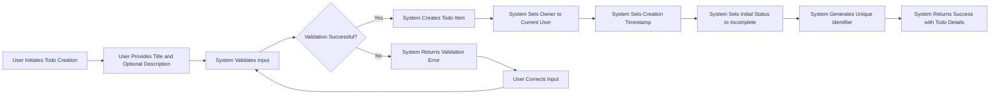
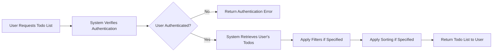
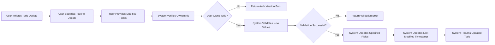
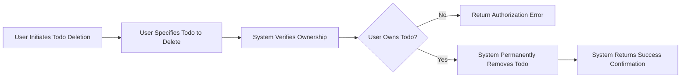
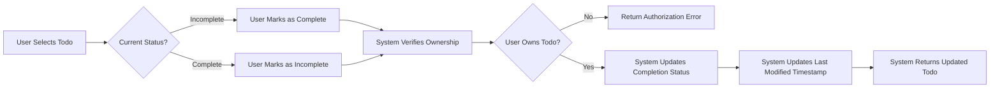
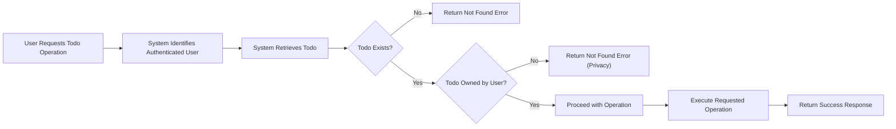

# Core Todo Features and Functional Requirements

## Overview and Purpose

This document defines the core functionality of the Todo list application, specifying all essential features that enable users to create, manage, and organize their personal tasks. This document provides complete business requirements for backend developers to implement a minimal but fully functional Todo system.

The Todo application is designed with simplicity in mind, providing only the essential features needed for effective task management without overwhelming users with unnecessary complexity. Every requirement in this document has been carefully considered to ensure it serves a genuine user need while maintaining the minimal feature set.

### Document Scope

This document covers:
- Complete Todo item data structure and field definitions
- All CRUD (Create, Read, Update, Delete) operations for Todo items
- Task completion and status management
- Basic organization features (filtering and sorting)
- Data ownership and privacy enforcement
- User interaction patterns and expected behaviors
- Performance expectations from the user perspective

This document does NOT cover:
- Technical API specifications or database schemas
- Frontend UI/UX implementation details
- Advanced features like sharing, collaboration, or recurring tasks
- Integration with external systems or third-party services

### Business Context

The Todo list application serves users who need a simple, reliable way to track their personal tasks and responsibilities. Users expect to quickly add tasks, mark them complete, and review what needs to be done. The system must be fast, intuitive, and respect user privacy by ensuring each user sees only their own tasks.

## Todo Item Data Structure

### Core Fields

Every Todo item in the system consists of the following fields:

**Unique Identifier**
- Each todo item has a unique system-generated identifier
- This identifier never changes throughout the todo's lifecycle
- Users do not see or interact with this identifier directly
- The system uses this identifier to track and reference specific todos

**Title**
- The primary description of the task
- This is the main text users see in their todo list
- Users must provide a title when creating a todo
- Users can update the title at any time
- Title must contain meaningful text (not empty or whitespace only)

**Detailed Description**
- Optional additional information about the task
- Users can provide more context, notes, or instructions
- This field can be empty if the title is self-explanatory
- Users can add, update, or remove the description at any time

**Completion Status**
- Indicates whether the task is completed or not
- Every todo starts as incomplete when created
- Users can mark todos as complete or revert them back to incomplete
- The system tracks this as a simple binary state: complete or incomplete

**Creation Timestamp**
- The exact date and time when the todo was created
- System automatically records this when a user creates a todo
- Users cannot modify this timestamp
- Displayed to users to show when they added the task

**Last Modified Timestamp**
- The exact date and time when the todo was last updated
- System automatically updates this whenever any field changes
- Users cannot modify this timestamp directly
- Helps users identify recently changed tasks

**Owner Reference**
- Identifies which user owns this todo item
- System automatically sets this to the authenticated user who created the todo
- This field never changes after creation
- Used to enforce data privacy and access control

### Field Validation Rules

WHEN a user creates or updates a todo item, THE system SHALL validate all input according to business rules.

**Title Validation:**
- THE title SHALL contain at least 1 character after trimming whitespace
- THE title SHALL not exceed 200 characters in length
- THE system SHALL reject titles that are empty or contain only whitespace
- THE system SHALL trim leading and trailing whitespace from titles before storage

**Description Validation:**
- THE description MAY be empty or null
- WHERE a description is provided, THE description SHALL not exceed 2000 characters in length
- THE system SHALL preserve whitespace and formatting in descriptions

### Data Field Behavior

**Immutable Fields:**
- THE unique identifier SHALL never change after creation
- THE creation timestamp SHALL never change after creation
- THE owner reference SHALL never change after creation

**User-Modifiable Fields:**
- THE user SHALL be able to update the title at any time
- THE user SHALL be able to update the description at any time
- THE user SHALL be able to toggle the completion status at any time

**System-Managed Fields:**
- WHEN any user-modifiable field changes, THE system SHALL automatically update the last modified timestamp
- THE system SHALL automatically set the creation timestamp when creating a new todo
- THE system SHALL automatically set the owner reference to the authenticated user when creating a new todo

## Create Todo Functionality

### Todo Creation Overview

Users create new todo items to track tasks they need to complete. The creation process must be simple and quick, allowing users to capture tasks with minimal friction while ensuring data quality through validation.

### Creation Process Flow

### Functional Requirements for Todo Creation

**User Authentication Requirement:**
WHEN a guest attempts to create a todo, THE system SHALL deny the request and return an authentication error.

WHEN an authenticated user (user or admin role) requests to create a todo, THE system SHALL proceed with the creation process.

**Input Requirements:**
THE user SHALL provide a title when creating a todo.

THE user MAY optionally provide a description when creating a todo.

WHERE no description is provided, THE system SHALL create the todo with an empty or null description.

**Validation During Creation:**
WHEN a user submits a todo creation request, THE system SHALL validate the title is not empty and does not exceed 200 characters.

IF the title validation fails, THEN THE system SHALL reject the creation request and return a specific error message indicating the validation failure.

WHEN a user provides a description, THE system SHALL validate the description does not exceed 2000 characters.

IF the description validation fails, THEN THE system SHALL reject the creation request and return a specific error message indicating the description is too long.

**Automatic Field Population:**
WHEN the system creates a new todo, THE system SHALL automatically set the owner to the currently authenticated user.

WHEN the system creates a new todo, THE system SHALL automatically set the creation timestamp to the current date and time.

WHEN the system creates a new todo, THE system SHALL automatically set the last modified timestamp to the current date and time.

WHEN the system creates a new todo, THE system SHALL automatically set the completion status to incomplete.

WHEN the system creates a new todo, THE system SHALL generate a unique identifier for the todo item.

**Success Response:**
WHEN a todo is successfully created, THE system SHALL return the complete todo item including all fields.

WHEN a todo is successfully created, THE system SHALL return a success status to the user within 2 seconds.

**Creation Limits:**
THE system SHALL allow users to create an unlimited number of todo items.

THE system SHALL process todo creation requests instantly for typical usage patterns.

### User Experience for Todo Creation

**Immediate Feedback:**
WHEN a user creates a todo, THE system SHALL respond within 2 seconds under normal conditions.

WHEN a todo is successfully created, THE system SHALL confirm the action to the user with the new todo details.

**Error Communication:**
IF validation fails during todo creation, THEN THE system SHALL provide a clear, specific error message explaining what needs to be corrected.

THE system SHALL use user-friendly language in error messages, avoiding technical jargon.

**Data Persistence:**
WHEN a todo is successfully created, THE system SHALL immediately persist the data.

THE system SHALL ensure created todos are available for retrieval immediately after creation.

## Read and List Todos

### Overview of Reading Functionality

Users need to view their todo items to understand what tasks they need to complete. The system provides functionality to retrieve individual todos and list multiple todos with various organization options.

### Reading Individual Todos

**Single Todo Retrieval:**
WHEN an authenticated user requests a specific todo by its identifier, THE system SHALL return the complete todo item if it exists and belongs to the user.

IF a user requests a todo that does not exist, THEN THE system SHALL return an error indicating the todo was not found.

IF a user requests a todo that belongs to another user, THEN THE system SHALL return an error indicating the todo was not found (maintaining privacy).

**Admin Access:**
WHEN an admin requests a specific todo for support purposes, THE system SHALL return the todo item if it exists, regardless of ownership.

### Listing Multiple Todos

Users need to view their todo list to see all their tasks and understand what needs to be done.

**Basic List Retrieval:**
WHEN an authenticated user requests their todo list, THE system SHALL return all todos owned by that user.

THE system SHALL return todos in a consistent order when no specific sorting is requested.

**Default Behavior:**
WHERE no filters are applied, THE system SHALL return all of the user's todos regardless of completion status.

WHERE no sorting is specified, THE system SHALL return todos ordered by creation timestamp with newest first.

### Filtering Todos

**Completion Status Filtering:**
WHEN a user requests to see only incomplete todos, THE system SHALL return only todos where the completion status is incomplete.

WHEN a user requests to see only completed todos, THE system SHALL return only todos where the completion status is complete.

WHEN a user requests to see all todos, THE system SHALL return todos regardless of completion status.

**Filter Combination:**
THE system SHALL support filtering by completion status.

THE system SHALL apply all specified filters together when multiple filters are requested.

### Sorting Todos

**Supported Sorting Options:**
THE system SHALL support sorting todos by creation date.

THE system SHALL support sorting todos by last modified date.

THE system SHALL support sorting todos alphabetically by title.

**Sort Order:**
WHEN sorting by date fields, THE system SHALL support both ascending (oldest first) and descending (newest first) order.

WHEN sorting alphabetically, THE system SHALL support both ascending (A-Z) and descending (Z-A) order.

**Default Sort Behavior:**
WHERE no sort order is specified, THE system SHALL default to descending order (newest first for dates, Z-A for alphabetical).

### Performance Requirements for List Retrieval

**Response Time:**
WHEN a user requests their todo list, THE system SHALL return results within 2 seconds under normal conditions.

WHEN a user has a large number of todos (1000+), THE system SHALL still return results within 5 seconds.

**List Size Handling:**
THE system SHALL handle users with up to 10,000 todos without performance degradation.

WHERE a user has an extremely large number of todos, THE system SHALL consider pagination to maintain performance.

### Data Privacy in List Operations

**Ownership Enforcement:**
THE system SHALL ensure users only see their own todos in list results.

THE system SHALL never include another user's todos in a user's todo list, even if filters or sorting might logically include them.

**Admin List Access:**
WHEN an admin requests todo lists for system monitoring, THE system SHALL provide appropriate access while maintaining user privacy standards.

## Update Todo Functionality

### Overview of Update Operations

Users need to modify their existing todos to correct mistakes, add information, or update task details as circumstances change. The system must allow users to update their own todos while maintaining data integrity and ownership rules.

### Updateable Fields

Users can update the following fields on their todo items:
- Title
- Description
- Completion status (covered separately in the Complete/Uncomplete section)

Users cannot update system-managed fields:
- Unique identifier
- Creation timestamp
- Owner reference

### Update Process Flow

### Functional Requirements for Updates

**Authentication and Authorization:**
WHEN a guest attempts to update a todo, THE system SHALL deny the request and return an authentication error.

WHEN an authenticated user attempts to update a todo they own, THE system SHALL proceed with the update process.

WHEN an authenticated user attempts to update a todo they do not own, THE system SHALL deny the request and return an authorization error.

**Field Update Behavior:**
WHEN a user updates a todo, THE system SHALL only modify the fields explicitly provided in the update request.

THE system SHALL preserve all other fields that are not included in the update request.

**Title Updates:**
WHEN a user updates the title, THE system SHALL validate the new title is not empty and does not exceed 200 characters.

IF the title validation fails, THEN THE system SHALL reject the update request and return a specific validation error.

WHEN a valid title update is provided, THE system SHALL replace the existing title with the new title.

**Description Updates:**
WHEN a user updates the description, THE system SHALL validate the new description does not exceed 2000 characters.

WHEN a user provides an empty description, THE system SHALL replace the existing description with an empty or null value.

WHEN a valid description update is provided, THE system SHALL replace the existing description with the new description.

**Automatic Timestamp Update:**
WHEN any field of a todo is successfully updated, THE system SHALL automatically set the last modified timestamp to the current date and time.

THE system SHALL update the last modified timestamp even if the new value is identical to the existing value.

**Immutable Field Protection:**
IF a user attempts to update the unique identifier, THEN THE system SHALL ignore the attempt and proceed with other valid updates.

IF a user attempts to update the creation timestamp, THEN THE system SHALL ignore the attempt and proceed with other valid updates.

IF a user attempts to update the owner reference, THEN THE system SHALL ignore the attempt and proceed with other valid updates.

**Success Response:**
WHEN a todo is successfully updated, THE system SHALL return the complete updated todo item including all fields.

WHEN a todo is successfully updated, THE system SHALL return a success status within 2 seconds.

**Non-Existent Todo Handling:**
IF a user attempts to update a todo that does not exist, THEN THE system SHALL return an error indicating the todo was not found.

### Partial Updates

**Selective Field Updates:**
THE system SHALL support updating only the title without modifying the description.

THE system SHALL support updating only the description without modifying the title.

THE system SHALL support updating both title and description in a single request.

**Update Validation:**
WHEN a user provides multiple field updates in a single request, THE system SHALL validate each field independently.

IF any field validation fails, THEN THE system SHALL reject the entire update request and return all validation errors.

### User Experience for Updates

**Immediate Feedback:**
WHEN a user updates a todo, THE system SHALL respond within 2 seconds under normal conditions.

**Error Communication:**
IF validation fails during update, THEN THE system SHALL provide clear, specific error messages explaining what needs to be corrected.

IF authorization fails, THEN THE system SHALL return an error message indicating the user does not have permission to modify the todo.

**Data Consistency:**
WHEN a todo is successfully updated, THE system SHALL immediately persist the changes.

THE system SHALL ensure updated todos reflect the new values in subsequent retrieval operations.

## Delete Todo Functionality

### Overview of Deletion

Users need the ability to remove todos they no longer need, such as tasks that are no longer relevant or were created by mistake. Deletion is permanent and cannot be undone, so the system must ensure proper authorization and clear communication.

### Delete Process Flow

### Functional Requirements for Deletion

**Authentication and Authorization:**
WHEN a guest attempts to delete a todo, THE system SHALL deny the request and return an authentication error.

WHEN an authenticated user attempts to delete a todo they own, THE system SHALL proceed with the deletion.

WHEN an authenticated user attempts to delete a todo they do not own, THE system SHALL deny the request and return an authorization error.

**Deletion Behavior:**
WHEN a user successfully deletes a todo, THE system SHALL permanently remove the todo from the system.

WHEN a todo is deleted, THE system SHALL remove all associated data for that todo item.

**Permanent Deletion:**
THE system SHALL NOT provide an undo function for deletion.

THE system SHALL NOT provide a trash or recycle bin for deleted todos.

WHEN a todo is deleted, THE system SHALL ensure it cannot be retrieved or restored through any user-facing functionality.

**Success Response:**
WHEN a todo is successfully deleted, THE system SHALL return a success confirmation within 2 seconds.

THE system SHALL indicate which todo was deleted in the success response.

**Non-Existent Todo Handling:**
IF a user attempts to delete a todo that does not exist, THEN THE system SHALL return an error indicating the todo was not found.

IF a user attempts to delete a todo that has already been deleted, THEN THE system SHALL return an error indicating the todo was not found.

### Deletion Edge Cases

**Completed vs Incomplete Todos:**
THE system SHALL allow deletion of both completed and incomplete todos without distinction.

THE system SHALL apply the same deletion rules regardless of the todo's completion status.

**Batch Deletion:**
WHEN a user deletes multiple todos, THE system SHALL process each deletion independently.

IF any deletion in a batch fails, THEN THE system SHALL report which deletions succeeded and which failed.

### User Experience for Deletion

**Response Time:**
WHEN a user deletes a todo, THE system SHALL respond within 2 seconds under normal conditions.

**Confirmation:**
WHEN a todo is successfully deleted, THE system SHALL provide clear confirmation that the deletion was successful.

**Error Communication:**
IF a user attempts to delete a non-existent todo, THEN THE system SHALL provide a clear error message.

IF authorization fails, THEN THE system SHALL provide a clear error message indicating insufficient permissions.

**Data Consistency:**
WHEN a todo is deleted, THE system SHALL immediately remove it from all list and retrieval operations.

IF a user requests their todo list immediately after deletion, THEN THE deleted todo SHALL NOT appear in the results.

## Complete and Uncomplete Todos

### Overview of Completion Management

The core purpose of a todo application is tracking task completion. Users mark tasks as complete when finished and may occasionally need to mark them as incomplete again if the task needs to be redone or was marked complete by mistake.

### Completion States

Every todo exists in one of two completion states:
- **Incomplete**: The task has not been finished (default state for new todos)
- **Complete**: The task has been finished

### Completion Toggle Flow

### Functional Requirements for Marking Complete

**Authentication and Authorization:**
WHEN a guest attempts to mark a todo as complete, THE system SHALL deny the request and return an authentication error.

WHEN an authenticated user attempts to mark their own todo as complete, THE system SHALL proceed with the status update.

WHEN an authenticated user attempts to mark another user's todo as complete, THE system SHALL deny the request and return an authorization error.

**Marking Todo Complete:**
WHEN a user marks an incomplete todo as complete, THE system SHALL update the completion status to complete.

WHEN a user marks a todo that is already complete as complete, THE system SHALL accept the request without error and maintain the complete status.

**Automatic Timestamp Update:**
WHEN a todo's completion status changes, THE system SHALL automatically update the last modified timestamp to the current date and time.

**Success Response:**
WHEN a todo is successfully marked as complete, THE system SHALL return the updated todo with completion status set to complete.

WHEN a todo is successfully marked as complete, THE system SHALL respond within 2 seconds.

### Functional Requirements for Marking Incomplete

**Reverting to Incomplete:**
WHEN a user marks a complete todo as incomplete, THE system SHALL update the completion status to incomplete.

WHEN a user marks a todo that is already incomplete as incomplete, THE system SHALL accept the request without error and maintain the incomplete status.

**No Completion History:**
THE system SHALL NOT track completion history or how many times a todo has been marked complete and incomplete.

THE system SHALL only maintain the current completion state.

### Completion Status in List Views

**Filtering by Status:**
WHEN a user requests incomplete todos, THE system SHALL return only todos where completion status is incomplete.

WHEN a user requests complete todos, THE system SHALL return only todos where completion status is complete.

**Visual Organization:**
THE system SHALL allow users to organize their todo list view by completion status.

THE system SHALL support viewing all todos, only incomplete todos, or only completed todos.

### User Experience for Completion

**Quick Toggle:**
THE system SHALL allow users to quickly toggle completion status without complex workflows.

THE system SHALL process completion status changes within 1 second under normal conditions.

**Immediate Feedback:**
WHEN a user marks a todo as complete, THE system SHALL immediately confirm the status change.

WHEN a user marks a todo as incomplete, THE system SHALL immediately confirm the status change.

**Clear Status Indication:**
THE system SHALL clearly indicate which todos are complete and which are incomplete in list views.

### Business Rules for Completion

**No Restrictions on Completion:**
THE system SHALL allow users to mark any of their todos as complete regardless of other field values.

THE system SHALL allow users to mark complete todos back to incomplete without restrictions.

**Completion Independence:**
THE completion status SHALL be independent of other todo fields.

THE system SHALL allow users to update title, description, or other fields on completed todos.

**Completion and Deletion:**
THE system SHALL allow deletion of both complete and incomplete todos.

THE completion status SHALL NOT affect the ability to delete a todo.

## Todo Organization and Filtering

### Overview of Organization Features

While the application focuses on minimal essential functionality, users need basic ways to organize and view their todos effectively. This section defines simple but useful organization capabilities.

### Supported Organization Methods

The system provides organization through:
- Filtering by completion status
- Sorting by various fields
- Simple list retrieval with applied filters and sorting

### Filtering Capabilities

**Completion Status Filter:**
WHEN a user applies a completion status filter, THE system SHALL return only todos matching the specified status.

THE system SHALL support three filter options for completion status: all todos, incomplete only, or complete only.

**Filter Application:**
WHERE no filter is specified, THE system SHALL default to showing all todos regardless of completion status.

WHEN a filter is applied, THE system SHALL return results within 2 seconds.

**Filter Accuracy:**
THE system SHALL apply filters accurately with no false positives or false negatives.

WHEN filters are applied, THE system SHALL still enforce ownership rules ensuring users only see their own todos.

### Sorting Capabilities

**Sort by Creation Date:**
WHEN a user sorts by creation date, THE system SHALL order todos based on when they were created.

THE system SHALL support both ascending (oldest first) and descending (newest first) order for creation date.

**Sort by Last Modified Date:**
WHEN a user sorts by last modified date, THE system SHALL order todos based on when they were last updated.

THE system SHALL support both ascending (least recently modified first) and descending (most recently modified first) order.

**Sort by Title:**
WHEN a user sorts alphabetically by title, THE system SHALL order todos based on alphabetical comparison of title text.

THE system SHALL support both ascending (A-Z) and descending (Z-A) alphabetical order.

THE system SHALL use case-insensitive alphabetical sorting.

**Default Sort Order:**
WHERE no sort is specified, THE system SHALL default to sorting by creation date in descending order (newest first).

### Combining Filters and Sorting

**Combined Operations:**
THE system SHALL support applying both filters and sorting in a single request.

WHEN both filter and sort are specified, THE system SHALL first filter the todos then sort the filtered results.

**Performance with Combined Operations:**
WHEN filters and sorting are applied together, THE system SHALL return results within 2 seconds under normal conditions.

### Simple List Views

**Incomplete Todos View:**
WHEN a user requests to see their incomplete todos, THE system SHALL return all incomplete todos sorted by creation date with newest first.

This is the most common view for users to see what tasks remain to be done.

**Completed Todos View:**
WHEN a user requests to see their completed todos, THE system SHALL return all completed todos sorted by completion time with most recently completed first.

This allows users to review recently finished tasks.

**All Todos View:**
WHEN a user requests to see all todos, THE system SHALL return all todos regardless of status, sorted by creation date with newest first.

### User Experience for Organization

**Quick Access to Common Views:**
THE system SHALL provide quick access to view incomplete todos (the most common use case).

THE system SHALL provide quick access to view all todos.

**Instant Filtering:**
WHEN a user changes filter or sort options, THE system SHALL apply the new organization instantly (within 1 second).

**Consistent Results:**
WHEN the same filters and sorting are applied multiple times, THE system SHALL return results in the same order each time.

### Organization Limitations

**No Advanced Filtering:**
THE system SHALL NOT support filtering by date ranges in the minimal version.

THE system SHALL NOT support filtering by text search in the minimal version.

THE system SHALL NOT support custom categories or tags in the minimal version.

**No Grouping:**
THE system SHALL NOT provide automatic grouping of todos by date, status, or other criteria.

Users receive a simple sorted and filtered list rather than grouped views.

## Data Ownership and Privacy Rules

### Overview of Ownership Model

The Todo application follows a strict personal ownership model where each user has complete control over their own todos and cannot access other users' data. This ensures privacy and data security while keeping the system simple and predictable.

### Fundamental Ownership Principles

**Personal Ownership:**
WHEN a user creates a todo, THE system SHALL assign ownership of that todo exclusively to the creating user.

THE ownership of a todo SHALL never change after creation.

THE system SHALL NOT support transferring todo ownership between users.

**Privacy by Default:**
THE system SHALL ensure users can only see, modify, or delete their own todos.

THE system SHALL never expose one user's todos to another user through any functionality.

### Authorization Rules for Todo Operations

**Create Authorization:**
WHEN a user creates a todo, THE system SHALL automatically set the owner to the authenticated user.

Guests (unauthenticated users) SHALL NOT be able to create todos.

**Read Authorization:**
WHEN a user requests to view a specific todo, THE system SHALL only return the todo if it belongs to the requesting user.

IF a user requests a todo owned by another user, THEN THE system SHALL return an error as if the todo does not exist (preventing ownership information leakage).

WHEN a user requests their todo list, THE system SHALL only include todos owned by that user.

**Update Authorization:**
WHEN a user attempts to update a todo, THE system SHALL only allow the update if the user owns the todo.

IF a user attempts to update a todo owned by another user, THEN THE system SHALL return an authorization error.

**Delete Authorization:**
WHEN a user attempts to delete a todo, THE system SHALL only allow the deletion if the user owns the todo.

IF a user attempts to delete a todo owned by another user, THEN THE system SHALL return an authorization error.

**Completion Status Authorization:**
WHEN a user attempts to mark a todo as complete or incomplete, THE system SHALL only allow the status change if the user owns the todo.

### Admin Access Rules

**Admin Viewing Rights:**
WHEN an admin needs to view todos for support or monitoring purposes, THE system SHALL provide appropriate access while logging such access for accountability.

Admins SHALL NOT routinely access individual users' private todo items without legitimate business need.

**Admin Modification Restrictions:**
THE system SHOULD restrict admin modification of user todos to exceptional support scenarios only.

Any admin access to user todos SHALL be logged for security and privacy compliance.

### Data Isolation

**Query Isolation:**
WHEN the system retrieves todos, THE system SHALL automatically filter results to only include todos owned by the requesting user.

THE system SHALL enforce ownership filtering at the data access layer to prevent accidental exposure.

**Operation Isolation:**
THE system SHALL ensure all todo operations (create, read, update, delete, complete) respect ownership boundaries.

THE system SHALL implement ownership checks before executing any operation on a todo.

### Ownership Verification Flow

### Privacy Error Handling

**Consistent Error Messages:**
WHEN a user attempts to access a todo that does not exist, THE system SHALL return a "not found" error.

WHEN a user attempts to access a todo owned by another user, THE system SHALL return the same "not found" error (preventing ownership information disclosure).

THE system SHALL NOT reveal whether a todo exists if the user does not own it.

### Data Privacy Expectations

**No Sharing Functionality:**
THE system SHALL NOT provide functionality for users to share todos with other users.

THE system SHALL NOT provide functionality to make todos public or visible to other users.

**No Cross-User Visibility:**
THE system SHALL ensure users never see other users' todo counts, lists, or details through any interface.

THE system SHALL maintain complete separation of user data.

### Ownership and Account Deletion

**User Account Deletion Impact:**
WHEN a user account is deleted, THE system SHALL also delete all todos owned by that user.

THE system SHALL ensure deleted user todos are permanently removed and not accessible to other users.

## Performance and Scalability Expectations

### User-Facing Performance Requirements

**Response Time for Individual Operations:**
WHEN a user creates a todo, THE system SHALL respond with confirmation within 2 seconds under normal conditions.

WHEN a user retrieves their todo list, THE system SHALL return results within 2 seconds for typical todo counts (up to 1000 items).

WHEN a user updates a todo, THE system SHALL respond with the updated todo within 2 seconds.

WHEN a user deletes a todo, THE system SHALL confirm deletion within 2 seconds.

WHEN a user marks a todo as complete or incomplete, THE system SHALL respond within 1 second.

**List Retrieval Performance:**
WHEN a user has fewer than 100 todos, THE system SHALL return their todo list instantly (under 500 milliseconds).

WHEN a user has 1000+ todos, THE system SHALL return results within 5 seconds even with filters and sorting applied.

**Concurrent User Support:**
THE system SHALL support multiple users performing todo operations simultaneously without performance degradation.

THE system SHALL ensure one user's operations do not negatively impact another user's response times.

### Data Volume Expectations

**Per-User Todo Capacity:**
THE system SHALL handle users with up to 10,000 todos without performance degradation.

THE system SHALL maintain consistent performance as users accumulate more todos over time.

**System-Wide Capacity:**
THE system SHALL be designed to support thousands of concurrent users.

THE system SHALL scale to handle millions of total todos across all users.

### Reliability Requirements

**Data Persistence:**
WHEN a user successfully creates or updates a todo, THE system SHALL ensure the data is durably persisted immediately.

THE system SHALL NOT lose todo data due to temporary system issues or restarts.

**Consistency:**
WHEN a user performs an operation, THE system SHALL ensure the results are immediately reflected in subsequent operations.

THE system SHALL maintain data consistency even under concurrent access by the same user.

**Availability:**
THE system SHALL strive for high availability with minimal downtime.

WHEN the system is unavailable, THE system SHALL return appropriate error messages rather than failing silently or corrupting data.

### Scalability Considerations

**Horizontal Scalability:**
THE system design SHALL support horizontal scaling to handle increased user load.

THE system SHALL allow adding more resources to improve performance as user base grows.

**Data Growth:**
THE system SHALL handle continuous data growth as users create more todos over time.

THE system SHALL maintain performance even as the total number of todos in the system grows.

### User Experience Performance Expectations

**Perceived Performance:**
WHEN a user interacts with the todo application, THE system SHALL respond quickly enough that the application feels responsive and immediate.

THE system SHALL avoid delays that frustrate users or interrupt their workflow.

**Loading States:**
WHERE operations take longer than 500 milliseconds, THE system SHALL communicate progress to users.

THE system SHALL provide feedback that operations are in progress rather than appearing frozen.

### Performance Degradation Handling

**Graceful Degradation:**
IF the system experiences high load, THEN THE system SHALL continue operating with potentially slower response times rather than failing completely.

THE system SHALL prioritize core functionality (create, read, update, delete, complete) even under stress.

**Error Communication:**
IF performance requirements cannot be met due to system conditions, THEN THE system SHALL communicate delays or issues to users clearly.

---

> *Developer Note: This document defines business requirements and expected system behaviors in natural language. All technical implementation decisions including architecture, database design, API structure, and technology choices are at the full discretion of the development team. This document specifies WHAT the system should do from a business and user perspective, not HOW to build it technically.*