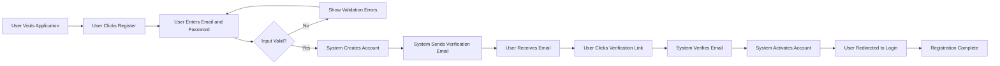
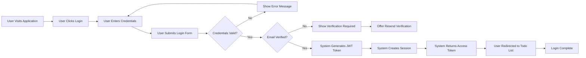
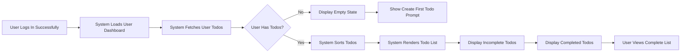
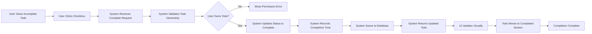
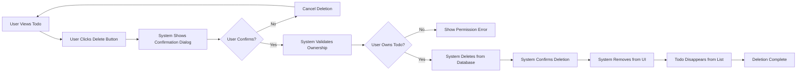
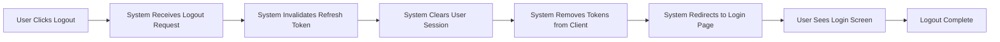

# Core User Scenarios

## Introduction

This document provides comprehensive descriptions of the primary user journeys and workflows in the Todo list application. Each scenario is documented from the user's perspective, detailing step-by-step interactions, system responses, and business rules that govern the user experience.

### Purpose of This Document

The core user scenarios serve as the foundation for understanding how users interact with the Todo list system to accomplish their goals. These scenarios guide backend developers in implementing business logic, help product managers understand the user experience, and provide QA engineers with test case foundations.

### How to Read This Document

Each scenario is structured with:
- **User Goal**: What the user wants to accomplish
- **Preconditions**: What must be true before the scenario begins
- **Step-by-Step Workflow**: Detailed user actions and system responses
- **Business Rules**: Requirements enforced during the scenario (in EARS format)
- **Success Criteria**: How users know they've accomplished their goal
- **Error Scenarios**: What can go wrong and how it's handled

### Relationship to Other Documents

This document builds upon the [Service Overview](./01-service-overview.md) which establishes the business context, and the [User Actors and Authentication](./02-user-actors-and-authentication.md) document which defines user types and permissions. The scenarios described here are implemented through detailed requirements in the [Functional Requirements](./04-functional-requirements.md) document, with error handling detailed in [Error Handling and Edge Cases](./06-error-handling-and-edge-cases.md).

## User Registration and Onboarding

### User Goal
A new user wants to create an account to start managing their todo list.

### Preconditions
- User has access to the application
- User does not have an existing account
- User has a valid email address

### Step-by-Step Workflow

#### Detailed Registration Steps

1. **User Initiates Registration**
   - User navigates to the application homepage
   - User identifies the registration option
   - User clicks on "Create Account" or "Sign Up" button
   - System displays registration form

2. **User Provides Registration Information**
   - User enters email address in email field
   - User enters password in password field
   - User enters password confirmation in confirmation field
   - User reviews entered information

3. **User Submits Registration**
   - User clicks "Register" or "Create Account" button
   - System validates all input fields
   - System checks if email is already registered

4. **System Processes Registration**
   - System creates new user account with pending status
   - System generates unique verification token
   - System sends verification email to provided address
   - System displays confirmation message to user

5. **User Verifies Email Address**
   - User checks their email inbox
   - User opens verification email from Todo list application
   - User clicks verification link in email
   - System receives verification request

6. **System Completes Verification**
   - System validates verification token
   - System activates user account
   - System displays success message
   - User is directed to login page

### Business Rules for Registration

**WHEN a user submits registration information, THE system SHALL validate that the email address follows standard email format (contains @ symbol, valid domain structure).**

**WHEN a user submits registration information, THE system SHALL validate that the password is at least 8 characters long.**

**WHEN a user submits registration information, THE system SHALL validate that the password and password confirmation fields match exactly.**

**WHEN a user attempts to register with an email already in the system, THE system SHALL reject the registration and display message "An account with this email already exists".**

**WHEN the system creates a new user account, THE system SHALL set the account status to "pending verification" until email is verified.**

**WHEN the system sends a verification email, THE system SHALL include a unique verification link that expires after 24 hours.**

**WHEN a user clicks an expired verification link, THE system SHALL display an error message and offer to resend verification email.**

**WHEN a user successfully verifies their email, THE system SHALL change account status from "pending verification" to "active".**

### Success Criteria

- User receives confirmation that account was created
- User receives verification email within 2 minutes
- User successfully verifies email address
- User account status changes to active
- User can proceed to login

### Error Scenarios

- Invalid email format: System displays "Please enter a valid email address"
- Password too short: System displays "Password must be at least 8 characters long"
- Passwords don't match: System displays "Passwords do not match"
- Email already exists: System displays "An account with this email already exists"
- Verification link expired: System displays error and offers to resend verification

## User Login Flow

### User Goal
An existing user wants to access their todo list by logging into their account.

### Preconditions
- User has a registered and verified account
- User knows their email and password
- User is not currently logged in

### Step-by-Step Workflow

#### Detailed Login Steps

1. **User Initiates Login**
   - User navigates to application
   - User clicks "Login" or "Sign In" button
   - System displays login form
   - Form shows email and password fields

2. **User Provides Credentials**
   - User enters registered email address
   - User enters account password
   - User optionally checks "Remember Me" option
   - User reviews entered information

3. **User Submits Login Request**
   - User clicks "Login" button
   - System receives login credentials
   - System begins authentication process

4. **System Authenticates User**
   - System looks up user account by email
   - System verifies account exists
   - System checks account verification status
   - System validates password against stored hash
   - System confirms account is active

5. **System Creates Session**
   - System generates JWT access token (15-minute expiration)
   - System generates JWT refresh token (7-day expiration)
   - System includes user ID and role in token payload
   - System stores refresh token securely

6. **User Gains Access**
   - System returns access token to user
   - User's browser stores tokens securely
   - System redirects user to todo list view
   - User sees their personalized todo list

### Business Rules for Login

**WHEN a user submits login credentials, THE system SHALL validate that both email and password fields are not empty.**

**WHEN a user submits login credentials, THE system SHALL verify the email exists in the user database.**

**WHEN a user submits valid email but incorrect password, THE system SHALL reject login and display "Invalid email or password".**

**WHEN a user submits credentials for an unverified account, THE system SHALL reject login and display "Please verify your email address to login".**

**WHEN a user with unverified account attempts login, THE system SHALL offer option to resend verification email.**

**WHEN the system authenticates a user successfully, THE system SHALL generate a JWT access token with 15-minute expiration time.**

**WHEN the system authenticates a user successfully, THE system SHALL generate a JWT refresh token with 7-day expiration time.**

**WHEN the system generates JWT tokens, THE system SHALL include user ID and user role in the token payload.**

**WHEN a user selects "Remember Me" option, THE system SHALL extend refresh token expiration to 30 days.**

**WHEN login fails due to invalid credentials, THE system SHALL respond within 2 seconds to prevent enumeration attacks.**

**WHEN a user fails login 5 times consecutively, THE system SHALL temporarily lock the account for 15 minutes.**

### Success Criteria

- User receives valid JWT access token
- User receives valid JWT refresh token
- User is redirected to their todo list
- User session is established
- User can perform authenticated operations

### Error Scenarios

- Empty email or password: System displays "Please enter both email and password"
- Invalid credentials: System displays "Invalid email or password"
- Unverified account: System displays "Please verify your email address to login" with resend option
- Account locked: System displays "Too many failed attempts. Please try again in 15 minutes"
- System error: System displays "Login failed. Please try again later"

## Creating a Todo Item

### User Goal
A logged-in user wants to add a new task to their todo list.

### Preconditions
- User is authenticated with valid session
- User has access to todo creation interface
- User has a task they want to track

### Step-by-Step Workflow

```mermaid
graph LR
    A["User Views Todo List"] --> B["User Clicks Add Todo"]
    B --> C["System Shows Todo Input Form"]
    C --> D["User Enters Todo Title"]
    D --> E["User Submits Form"]
    E --> F{"Title Valid?"}
    F -->|"No"| G["Show Validation Error"]
    G --> D
    F -->|"Yes"| H["System Creates Todo"]
    H --> I["System Assigns Created Timestamp"]
    I --> J["System Sets Status to Incomplete"]
    J --> K["System Saves Todo to Database"]
    K --> L["System Returns Todo to User"]
    L --> M["System Updates Todo List Display"]
    M --> N["User Sees New Todo in List"]
    N --> O["Creation Complete"]
```

#### Detailed Creation Steps

1. **User Initiates Todo Creation**
   - User is viewing their todo list
   - User locates "Add Todo" or "New Task" button
   - User clicks the add button
   - System displays todo input form or field

2. **User Enters Todo Information**
   - User sees input field labeled "What needs to be done?" or similar
   - User types the task description or title
   - User reviews the entered text
   - Input field may show character count

3. **User Submits Todo**
   - User presses Enter key or clicks "Add" button
   - System receives todo creation request
   - System validates input

4. **System Creates Todo Item**
   - System checks that title is not empty
   - System checks that title length is within limits
   - System creates new todo object
   - System assigns unique identifier to todo
   - System sets owner to current authenticated user
   - System records current timestamp as creation time
   - System sets completion status to false (incomplete)

5. **System Saves and Returns Todo**
   - System saves todo to database
   - System confirms successful save
   - System returns complete todo object to user
   - System updates user interface

6. **User Sees New Todo**
   - New todo appears in the todo list
   - Todo shows with incomplete status
   - Todo displays at top of list (newest first)
   - Input field clears for next entry
   - User receives visual confirmation of success

### Business Rules for Creating Todos

**WHEN a user submits a new todo, THE system SHALL validate that the title field is not empty.**

**WHEN a user submits a new todo, THE system SHALL validate that the title contains at least 1 non-whitespace character.**

**WHEN a user submits a new todo, THE system SHALL validate that the title does not exceed 500 characters.**

**WHEN a user submits a new todo with whitespace at beginning or end, THE system SHALL trim the whitespace before saving.**

**WHEN the system creates a new todo, THE system SHALL assign the current authenticated user as the owner.**

**WHEN the system creates a new todo, THE system SHALL record the current server timestamp as the creation time.**

**WHEN the system creates a new todo, THE system SHALL set the completion status to false (incomplete).**

**WHEN the system creates a new todo, THE system SHALL generate a unique identifier for the todo item.**

**WHEN the system saves a new todo successfully, THE system SHALL return the complete todo object including ID, title, creation time, and completion status.**

**WHEN the system creates a new todo, THE system SHALL complete the operation and display the new todo within 1 second.**

**THE system SHALL allow users to create unlimited todos (no quota limit).**

### Success Criteria

- Todo is saved to database with unique ID
- Todo appears in user's todo list immediately
- Todo shows correct title as entered by user
- Todo displays with incomplete status
- Todo shows current timestamp
- User can immediately create another todo

### Error Scenarios

- Empty title: System displays "Please enter a task description"
- Title too long: System displays "Task description cannot exceed 500 characters"
- Whitespace only: System displays "Please enter a valid task description"
- Database error: System displays "Failed to create todo. Please try again"
- Authentication expired: System prompts user to log in again

## Viewing Todo List

### User Goal
A logged-in user wants to see all their todo items to track what needs to be done.

### Preconditions
- User is authenticated with valid session
- User has navigated to the application

### Step-by-Step Workflow

#### Detailed Viewing Steps

1. **User Accesses Todo List**
   - User completes login process
   - System redirects to main todo list view
   - System displays loading indicator briefly

2. **System Retrieves User Todos**
   - System queries database for todos belonging to current user
   - System filters todos by user ownership
   - System retrieves all todo attributes (ID, title, status, creation time)

3. **System Organizes Todos**
   - System separates incomplete and completed todos
   - System sorts incomplete todos by creation time (newest first)
   - System sorts completed todos by creation time (newest first)
   - System prepares display data

4. **System Displays Todos**
   - System renders incomplete todos section first
   - Each todo shows checkbox (unchecked), title, and creation time
   - System renders completed todos section below incomplete
   - Each completed todo shows checkbox (checked), title (may show strikethrough), and creation time
   - System displays total count of todos

5. **User Interacts with List**
   - User scrolls through todos if list is long
   - User can see all todo details at a glance
   - User can identify which tasks are pending
   - User can see their task completion history

### Business Rules for Viewing Todos

**WHEN a user accesses their todo list, THE system SHALL display only todos that belong to that specific user.**

**WHEN the system displays todos, THE system SHALL separate incomplete and completed todos into distinct sections.**

**WHEN the system displays todos, THE system SHALL sort incomplete todos with newest created first.**

**WHEN the system displays todos, THE system SHALL sort completed todos with newest completed first.**

**WHEN a user has no todos, THE system SHALL display an empty state message "You have no todos yet. Create your first task to get started!"**

**WHEN the system displays a todo item, THE system SHALL show the title, completion status, and creation timestamp.**

**WHEN the system displays completed todos, THE system SHALL visually differentiate them from incomplete todos (such as with strikethrough text or different styling).**

**WHEN the system loads the todo list, THE system SHALL complete the operation and display todos within 2 seconds.**

**THE system SHALL display the total count of todos (incomplete and completed) to the user.**

**WHEN the todo list exceeds 50 items, THE system SHALL implement pagination or infinite scroll to maintain performance.**

### Success Criteria

- User sees all their todos and only their todos
- Incomplete todos appear in their own section
- Completed todos appear separately
- Todos are sorted with newest first
- Each todo displays all relevant information
- Empty state appears when user has no todos
- List loads within 2 seconds

### Error Scenarios

- Database connection error: System displays "Unable to load todos. Please refresh the page"
- No todos found: System displays empty state with helpful message
- Authentication expired: System redirects to login page
- Network error: System displays "Connection error. Please check your internet connection"

## Completing a Todo Item

### User Goal
A logged-in user wants to mark a task as complete to indicate it has been finished.

### Preconditions
- User is authenticated with valid session
- User is viewing their todo list
- At least one incomplete todo exists

### Step-by-Step Workflow

#### Detailed Completion Steps

1. **User Identifies Todo to Complete**
   - User reviews their incomplete todos
   - User finds a task they have finished
   - User locates the checkbox next to the todo title
   - User prepares to mark it complete

2. **User Marks Todo as Complete**
   - User clicks or taps the checkbox next to the todo
   - Checkbox shows visual feedback (hover effect)
   - User confirms their action visually

3. **System Receives Completion Request**
   - System captures the complete action
   - System identifies which todo is being completed
   - System verifies user authentication
   - System validates user owns the todo

4. **System Updates Todo Status**
   - System changes completion status from false to true
   - System records current timestamp as completion time
   - System updates the todo in database
   - System confirms successful update

5. **System Updates User Interface**
   - Checkbox fills with checkmark
   - Todo title may show strikethrough styling
   - Todo visually transitions to completed appearance
   - Todo moves from incomplete section to completed section
   - Incomplete todo count decrements by one
   - Completed todo count increments by one

6. **User Sees Updated State**
   - User sees the todo marked as complete
   - User sees visual confirmation of completion
   - User can continue working with other todos
   - User's todo list reflects current progress

### Business Rules for Completing Todos

**WHEN a user attempts to complete a todo, THE system SHALL verify that the user owns that todo item.**

**WHEN a user attempts to complete a todo they do not own, THE system SHALL reject the request and return a permission error.**

**WHEN a user marks a todo as complete, THE system SHALL update the completion status to true.**

**WHEN a user marks a todo as complete, THE system SHALL record the current server timestamp as the completion time.**

**WHEN the system updates a todo to complete status, THE system SHALL move the todo from the incomplete section to the completed section in the display.**

**WHEN the system completes a todo, THE system SHALL apply visual styling to indicate completion (such as strikethrough text, checkmark icon, or dimmed appearance).**

**WHEN a user completes a todo, THE system SHALL update the display within 1 second to provide immediate feedback.**

**WHEN the system updates a todo status, THE system SHALL return the updated todo object with new status and completion timestamp.**

### Success Criteria

- Todo completion status changes to true
- Completion timestamp is recorded
- Todo moves to completed section
- Visual styling indicates completion
- Todo count updates correctly
- Change happens within 1 second
- User receives visual confirmation

### Error Scenarios

- User tries to complete another user's todo: System displays "You can only complete your own todos"
- Database update fails: System displays "Failed to update todo. Please try again"
- Todo already completed: System ignores duplicate request (idempotent operation)
- Authentication expired: System prompts user to log in again
- Network error: System displays error and reverts checkbox state

## Deleting a Todo Item

### User Goal
A logged-in user wants to permanently remove a todo item from their list.

### Preconditions
- User is authenticated with valid session
- User is viewing their todo list
- At least one todo exists (completed or incomplete)

### Step-by-Step Workflow

#### Detailed Deletion Steps

1. **User Identifies Todo to Delete**
   - User reviews their todo list
   - User finds a todo they want to remove
   - User may delete incomplete or completed todos
   - User locates the delete button or icon next to the todo

2. **User Initiates Deletion**
   - User clicks or taps the delete button (trash icon or "Delete" text)
   - System captures the delete action
   - System identifies which todo is being deleted

3. **System Requests Confirmation**
   - System displays confirmation dialog
   - Dialog message: "Are you sure you want to delete this todo? This action cannot be undone."
   - Dialog shows two options: "Cancel" and "Delete"
   - User reviews the confirmation message

4. **User Confirms Deletion**
   - User clicks "Delete" button in confirmation dialog
   - System proceeds with deletion process
   - (If user clicks "Cancel", system closes dialog and returns to list)

5. **System Validates and Deletes**
   - System verifies user authentication
   - System confirms user owns the todo being deleted
   - System removes todo from database permanently
   - System confirms successful deletion

6. **System Updates User Interface**
   - Confirmation dialog closes
   - Todo fades out with animation
   - Todo disappears from the list
   - Todo count updates (decrements by one)
   - Remaining todos adjust position to fill space
   - User sees updated list without deleted item

### Business Rules for Deleting Todos

**WHEN a user attempts to delete a todo, THE system SHALL verify that the user owns that todo item.**

**WHEN a user attempts to delete a todo they do not own, THE system SHALL reject the request and return a permission error.**

**WHEN a user initiates todo deletion, THE system SHALL display a confirmation dialog before permanently deleting.**

**WHEN the system shows deletion confirmation, THE system SHALL clearly state that the action cannot be undone.**

**WHEN a user confirms deletion, THE system SHALL permanently remove the todo from the database.**

**WHEN the system deletes a todo, THE system SHALL remove it from the user interface immediately after database confirmation.**

**WHEN a user deletes a todo, THE system SHALL complete the operation within 2 seconds.**

**WHEN the system deletes a todo, THE system SHALL update the todo count to reflect the deletion.**

**IF a user cancels the deletion confirmation, THEN THE system SHALL close the dialog without deleting the todo.**

**WHEN a todo is deleted, THE system SHALL ensure it cannot be recovered (permanent deletion, no trash/archive).**

### Success Criteria

- Confirmation dialog appears before deletion
- User can cancel deletion if desired
- Todo is permanently removed from database
- Todo disappears from user interface
- Todo count updates correctly
- Deletion completes within 2 seconds
- User receives visual confirmation

### Error Scenarios

- User tries to delete another user's todo: System displays "You can only delete your own todos"
- Database deletion fails: System displays "Failed to delete todo. Please try again"
- Todo already deleted: System displays "This todo no longer exists" and refreshes list
- Authentication expired: System prompts user to log in again
- Network error: System displays "Connection error. Please try again"

## User Logout

### User Goal
A logged-in user wants to end their session and sign out of the application.

### Preconditions
- User is authenticated with valid session
- User has active access and refresh tokens

### Step-by-Step Workflow

#### Detailed Logout Steps

1. **User Initiates Logout**
   - User is viewing their todo list or any authenticated page
   - User locates "Logout" or "Sign Out" button (typically in header or menu)
   - User clicks the logout button
   - System receives logout request

2. **System Processes Logout**
   - System identifies current user session
   - System retrieves user's refresh token
   - System marks refresh token as invalid in database
   - System prevents future use of this refresh token

3. **System Clears Client Data**
   - System instructs browser to remove access token
   - System instructs browser to remove refresh token
   - System clears any session storage data
   - System clears any local storage authentication data

4. **System Redirects User**
   - System redirects user to login page or public homepage
   - System displays confirmation message: "You have been logged out successfully"
   - User sees login form
   - User is in unauthenticated state

5. **User Confirms Logout**
   - User sees they are no longer logged in
   - User cannot access authenticated features
   - User would need to login again to access todo list
   - Session has ended cleanly

### Business Rules for Logout

**WHEN a user initiates logout, THE system SHALL invalidate the user's refresh token in the database.**

**WHEN a user logs out, THE system SHALL remove both access token and refresh token from the client browser.**

**WHEN the system processes logout, THE system SHALL clear all session data associated with the user.**

**WHEN a user logs out, THE system SHALL redirect the user to the login page or public homepage.**

**WHEN the system completes logout, THE system SHALL display a confirmation message "You have been logged out successfully".**

**WHEN a user logs out, THE system SHALL prevent access to authenticated features until the user logs in again.**

**WHEN a user's refresh token is invalidated, THE system SHALL reject any future token refresh attempts using that token.**

**WHEN the system processes logout, THE system SHALL complete the operation within 1 second.**

**IF a user's session has already expired, THEN THE system SHALL allow logout to proceed without errors.**

### Success Criteria

- Refresh token is invalidated in database
- Access and refresh tokens are removed from client
- Session data is cleared
- User is redirected to login page
- User cannot access authenticated features
- Logout completes within 1 second
- User receives confirmation message

### Error Scenarios

- Token already invalid: System proceeds with logout without error (idempotent operation)
- Database error during token invalidation: System still clears client tokens and redirects
- Network error: System clears client-side tokens and redirects (best effort)
- User already logged out: System redirects to login page without error

---

## Conclusion

These core user scenarios represent the complete user journey through the Todo list application, from initial registration to daily todo management operations. Each scenario has been documented with detailed step-by-step workflows, business rules in EARS format, success criteria, and error handling considerations.

### Scenario Summary

1. **User Registration and Onboarding**: New users create accounts with email verification
2. **User Login Flow**: Existing users authenticate and establish sessions with JWT tokens
3. **Creating a Todo Item**: Users add new tasks to their todo list
4. **Viewing Todo List**: Users see all their todos organized by completion status
5. **Completing a Todo Item**: Users mark tasks as finished
6. **Deleting a Todo Item**: Users permanently remove tasks from their list
7. **User Logout**: Users end their session securely

### Key Principles Applied

- **User Ownership**: All todos belong to specific users; users can only manage their own todos
- **Immediate Feedback**: All operations provide visual confirmation within 1-2 seconds
- **Error Prevention**: Validation and confirmation dialogs prevent user mistakes
- **Security**: JWT-based authentication with proper token management
- **Simplicity**: Minimal, focused functionality for core todo management

### Implementation Guidance for Developers

Backend developers implementing these scenarios should:
- Enforce user ownership validation on all todo operations
- Implement all business rules as specified in EARS format
- Ensure response times meet specified performance requirements
- Handle all documented error scenarios gracefully
- Follow the authentication and authorization patterns described
- Maintain data integrity through proper validation

For technical implementation details, refer to:
- [Functional Requirements](./04-functional-requirements.md) for detailed technical specifications
- [Data Requirements](./05-data-requirements.md) for data structure and validation
- [Error Handling and Edge Cases](./06-error-handling-and-edge-cases.md) for comprehensive error scenarios
- [User Actors and Authentication](./02-user-actors-and-authentication.md) for authentication implementation