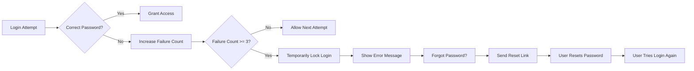
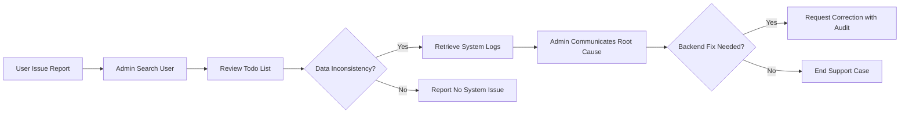

# Todo List Application - Minimum Requirements Analysis

## 1. Introduction 
A Todo list application is designed to help individual users manage, track, and organize their personal tasks in an efficient, private, and reliable way. The app aims for minimal but robust features: user registration, secure authentication, personal Todo management, and an admin panel for oversight and support. The purpose is to enable end-users to track their daily activities in a self-contained workspace, with strong user privacy and straightforward error handling.

## 2. Actors & Roles
### Registered User ("user")
- WHEN a person wants to manage private Todos, THE user SHALL register and authenticate with unique credentials.
- WHEN authenticated, THE user SHALL create, view, update, complete, and delete their own Todos only.
- WHEN performing any action, THE user SHALL not be able to access or view another user's data under any circumstance.

### Administrator ("admin")
- WHEN platform oversight is required, THE admin SHALL authenticate with elevated credentials and access a compliance audit panel.
- WHEN reviewing users, THE admin SHALL have read-only access to all users’ profiles and Todos unless acting on compliance/support requests, in which case they SHALL act only as business-critical intervention dictates.
- WHEN an admin attempts unauthorized edit/delete of user data, THE system SHALL deny the action and log it for audit.

## 3. User Stories and Journeys

### 3.1 Registration & Account Management
- WHEN a visitor chooses to register, THE system SHALL require a valid email and password and SHALL send an email verification link before account activation.
- WHEN a user confirms via email, THE system SHALL permit access to all authenticated functions.
- WHEN a user wishes to update their account information (e.g., password change), THE system SHALL require proof of identity via current password.
- WHEN a user requests account deletion, THE system SHALL require explicit confirmation and, after a mandatory waiting period (e.g., 3 days), SHALL permanently revoke account and related data.

### 3.2 Authentication Workflows
- WHEN a user submits login credentials, THE system SHALL verify and, if correct, authenticate to user workspace. If incorrect, THE system SHALL deny access and display an error.
- WHEN invalid credentials are entered three times in succession, THE system SHALL temporarily lock login for 60 seconds and show a warning.
- WHEN a "Forgot Password" request is made, THE system SHALL send a secure email with a password reset link.

### 3.3 Personal Todo Management
- WHEN a user is authenticated, THE system SHALL display all current Todos, sorted by most recent.
- WHEN adding a Todo, THE system SHALL require task text and allow an optional due date; only valid entries SHALL be accepted.
- WHEN editing or completing a Todo, THE system SHALL ensure the user is owner of the Todo, apply the update, and reflect the completion state clearly.
- WHEN a user deletes a Todo, THE system SHALL always ask for confirmation before permanent removal.

### 3.4 Admin Operations
- WHEN an admin logs in, THE system SHALL provide an audit panel with visibility across all user accounts and Todo items.
- WHEN an admin reviews a user’s Todos, THE system SHALL default to read-only view unless acting on a support or compliance basis.
- WHEN a support investigation is active, THE system SHALL grant temporary admin access to the relevant user data only for necessary duration and log all actions.
- WHEN an admin attempts to alter user data outside allowed support/compliance scenarios, THE system SHALL prohibit, notify the admin, and record for audit.

## 4. Error and Security Scenarios
- WHEN a user attempts to access another user's Todos, THE system SHALL deny and log the attempt.
- WHEN required inputs are missing or invalid while submitting Todos, THE system SHALL block the action and highlight errors.
- WHEN a session expires, THE system SHALL require re-authentication for further activity.
- WHEN system/network errors prevent a successful operation, THE system SHALL alert the user with a clear, actionable message and preserve data integrity.
- WHEN a user attempts any action forbidden by their role (e.g., admin attempting unauthorized deletion), THE system SHALL log, prevent, and surface errors as specified.

## 5. Business & Functional Requirements (EARS)
- WHEN a user is authenticated, THE system SHALL display an up-to-date, complete list of their own Todo items, sorted by recency.
- WHEN a new Todo is created, THE system SHALL validate and append it to the user’s list immediately.
- WHEN a Todo is edited, THE system SHALL update only the selected Todo and enforce ownership.
- WHEN a Todo is marked as complete, THE system SHALL update its status, store completion timestamp, and flag as completed.
- WHEN a Todo is deleted, THE system SHALL prompt for confirmation and, after confirmation, remove the item from storage.
- WHEN an admin needs read-only access to user data, THE system SHALL provide it for audit/support purposes only, logging all access.
- WHEN any unauthorized access attempt is made, THE system SHALL block, log the action, and audit for compliance.
- WHEN invalid login attempts exceed three times, THE system SHALL lock the account temporarily and require additional wait or recovery.
- WHEN account/data deletion is requested, THE system SHALL enforce a waiting period and confirm irreversible action.

## 6. Audit and Compliance Expectations
- All sensitive actions (login, data changes, admin access, deletions) SHALL be logged for audit.
- Admin activity SHALL be visible to system owner for compliance review.
- User data SHALL always remain private except for audit/support; all admin actions beyond read-only SHALL require justification and log entry.
- Deletion of user accounts or Todos SHALL follow strict confirmation and waiting period policies for GDPR/data protection compliance.

## 7. Mermaid Flow Diagrams

### Registration, Login, and Todo Management

```mermaid
graph LR
  A["Visitor Registration"] --> B["Email & Password Submission"]
  B --> C["Verification Email Sent"]
  C --> D["User Clicks Confirmation"]
  D --> E["Account Activated"]
  E --> F["User Logs In"]
  F --> G["Display Empty Todo List"]
  G --> H["Add Todo"]
  H --> I["Validate & Append Todo"]
  I --> J["Mark Todo as Complete"]
  J --> K["Show as Completed"]
  K --> L["Delete Todo"]
  L --> M["Confirm Deletion"]
  M --> N["Todo Permanently Removed"]
```

### Login Failure & Password Recovery

### Admin Support/Audit Path

## 8. Conclusion: Business Value & Success Criteria
A Todo list application optimized for minimal, private, and efficient user flow enables individuals to track, complete, and remove tasks securely while preserving privacy. Success is measured by:
- 100% of user operations staying in personal scope (no access to other users' data)
- Reliable registration, authentication, and Todo CRUD (create/read/update/delete) flows
- All admin interventions logged, read-only by default, with escalation/audit mechanisms
- Elegant, measurable error handling and clear end-to-end flows for both happy and error paths
- Immediate actionable readiness for backend development with all requirements, rules, and edge cases fully laid out in business language
