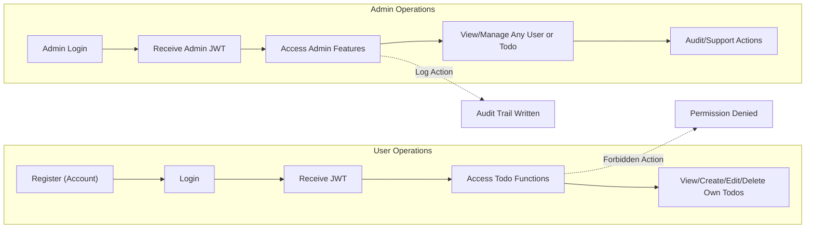

# Todo List Application: Requirements Analysis

## Actor Definitions

### User ("user")
- WHEN a person completes registration, THE system SHALL establish a "user" actor account that can manage only their own Todo records.
- WHILE authenticated as a user, THE actor SHALL be able to create, view, modify, mark complete/incomplete, and delete only Todos belonging to themselves.
- THE user actor SHALL NOT read or modify any Todo or data belonging to other users, under any circumstance.
- THE system SHALL require authentication for all user operations, except registration and login.

### Administrator ("admin")
- WHEN an administrator authenticates, THE admin actor SHALL have access to all user and Todo data in the system, including the ability to view, update, or delete any user's Todos and user accounts, strictly for the purposes of support, moderation, or audit.
- THE admin actor SHALL NOT impersonate user sessions or perform direct actions as if they were another user.
- All admin operations SHALL be traceable and logged with timestamp, actor role, and target entity information.

## Core Business Requirements (EARS Format)

- WHEN a user attempts to register using an email, THE system SHALL validate that the email is unique; IF not unique, THEN THE system SHALL respond with a clear conflict error message.
- WHEN registration is successful, THE system SHALL enable the user to log in using their credentials.
- WHEN valid credentials are provided, THE system SHALL issue a JWT token encoding user ID and role; this SHALL enable authenticated session access.
- WHEN a user or admin attempts access to any endpoint except registration or login, THE system SHALL require a valid, non-expired JWT access token; IF missing or invalid, THE system SHALL deny access and provide an explanatory error.
- WHEN an access token is expired, THE system SHALL require the user or admin to re-authenticate, optionally supporting refresh tokens for session continuity (recommended: access token expiry 15-30 minutes, refresh token up to 30 days).
- WHEN a user accesses, creates, updates, or deletes Todo items, THE system SHALL ensure these operations apply solely to the authenticated user’s own records.
- IF an admin performs moderation, support, or audit, THE system SHALL allow visibility and update rights for all users' Todos and user accounts but SHALL log all such actions for auditability (userId, adminId, action, timestamp).
- IF any actor attempts to operate outside their designated permissions, THE system SHALL return a permission-denied error and SHALL never reveal or alter unauthorized data.
- WHEN a user logs out, THE system SHALL invalidate the session and require authentication for further protected operations.

## Authentication & Authorization

- THE system SHALL enforce business-only, API-driven authentication and role-based access for every operation except public registration and login.
- Email uniqueness is strictly enforced for registration.
- JWT tokens SHALL encode user identity and role; all backend operations extract these fields to enforce permissions.
- Access token expiry and optional refresh token handling follows security best practices (15-30 minutes for access, 30 days for refresh if used).
- All attempted unauthorized actions by any user SHALL be logged as security events for review.
- THE system SHALL maintain a complete audit trail for all admin operations involving user or Todo record access.

## Permission Matrix

| Action                              | user | admin |
|-------------------------------------|:----:|:-----:|
| Register account                    |  ✅  |  ✅   |
| Login                               |  ✅  |  ✅   |
| Logout                              |  ✅  |  ✅   |
| View own Todo items                 |  ✅  |  ✅   |
| Create/Edit/Delete own Todo items   |  ✅  |  ✅   |
| View/Manage any user's Todos        |  ❌  |  ✅   |
| View/Manage any user's account info |  ❌  |  ✅   |
| Access user operations after session|  ❌  |  ❌   |
| Access system if not authenticated  |  ❌  |  ❌   |
| Perform support/audit actions       |  ❌  |  ✅   |

- Only admin actors may view or modify any user's Todos or account records.
- Regular users can never access or act on data not owned by themselves.
- All permission violations generate logged audit events.

## Capabilities and Restrictions

- THE system SHALL enforce that regular users cannot operate on any record not their own, with all attempted violations generating permission-denied errors and audit logs.
- WHEN an admin reviews or modifies any user or Todo data, THE system SHALL log the operation—including userId, adminId, action, and timestamp—to an audit record.
- WHEN unauthorized access is detected (user acting on other users’ data, any non-authenticated actor requesting protected resource), THE system SHALL deny the action and provide a descriptive message stating the requirement for authentication or correct permissions.
- THE system SHALL never expose private Todo or user data outside the authorized user or admin context in any response.

## Error Handling and Permission Violation Experience

- WHEN any actor attempts an API operation outside of their role’s permissions, THE system SHALL provide a clear permission-denied message, including the rationale for denial (e.g., "users can only modify their own Todos").
- WHEN registration or login fails due to invalid or duplicate data, THE system SHALL provide actionable errors (e.g., "email already exists").
- WHEN authentication is missing, expired, or invalid, THE system SHALL prompt for re-authentication or login.
- All unauthorized actions, failed authentications, or permission denials SHALL be traceable in security logs with a timestamp, actor role, attempted action, and affected resource identifiers.

## Visual Business Process Overview (Mermaid)

## Summary

The Todo List Application provides two distinct roles: users (who may only manage their own data) and admins (who may audit and moderate system-wide data, but only in a traceable, auditable way). All authentication, authorization, and error flows are business-focused, actionable in natural language, and fully enforce API and session security. Requirements are stated in EARS format and cover all processes from registration through operation to error and audit handling. No user ever accesses data outside their scope, all permissions are explicit, and all admin interactions are logged per security and audit best practices.