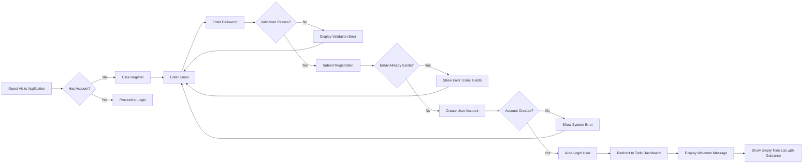
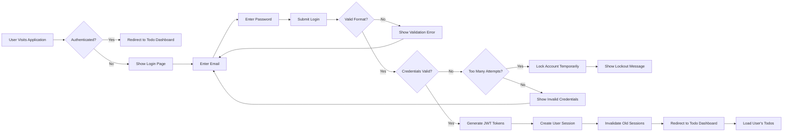
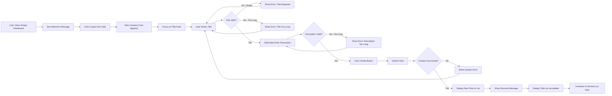
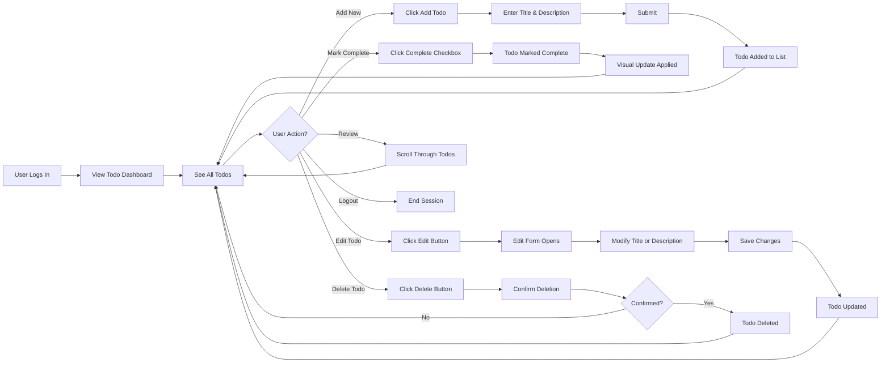
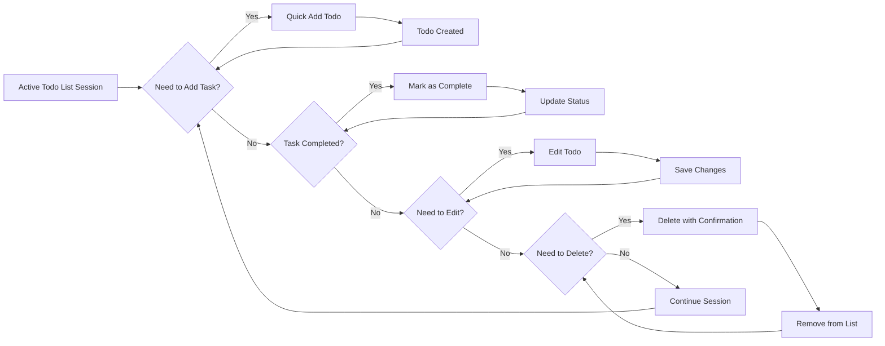
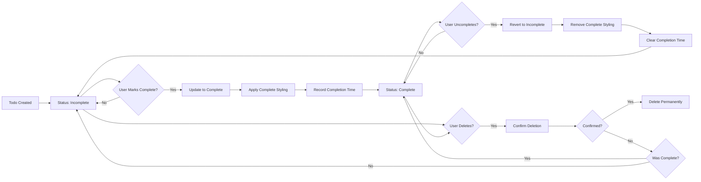
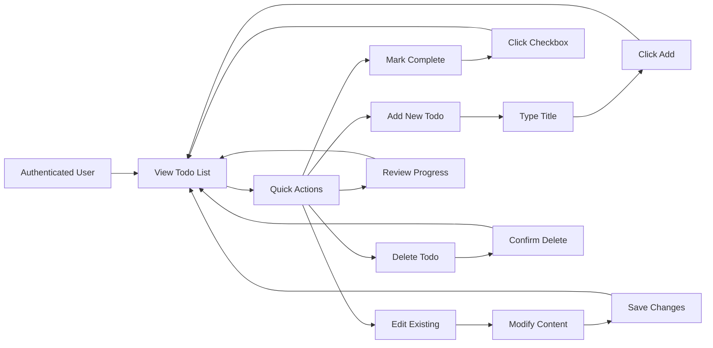
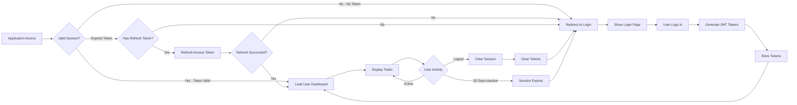

# User Workflows and Journeys

## User Journey Overview

This document describes the primary user journeys and workflows for the Todo List application. It illustrates how users interact with the system from their first visit through daily todo management activities. Each workflow is described from the user's perspective, focusing on business processes and user interactions rather than technical implementation.

The Todo List application supports two primary user experiences:

1. **Guest Journey**: Unauthenticated visitors who need to register or log in to access todo management features
2. **Authenticated User Journey**: Registered users who create, manage, and complete their personal todo items

All workflows are designed with simplicity as the core principle, ensuring that users can accomplish their todo management goals with minimal friction and cognitive load.

### Workflow Categories

The user experience is organized into the following workflow categories:

- **Onboarding Workflows**: Registration and first-time login
- **Authentication Workflows**: Login and session management
- **Core Todo Management Workflows**: Creating, viewing, editing, completing, and deleting todos
- **Daily Usage Workflows**: Typical day-to-day interaction patterns

Each workflow section includes:
- Step-by-step user interactions in natural language
- Business logic and validation requirements
- Visual flow diagrams using Mermaid
- Error scenarios and recovery processes
- Performance expectations from user perspective

---

## New User Registration Journey

### Registration Workflow Overview

THE system SHALL provide a registration process that allows new users to create an account and begin managing their todos within minutes.

WHEN a guest user visits the application for the first time, THE system SHALL present clear options to either register a new account or log in to an existing account.

### Step-by-Step Registration Process

#### Step 1: Accessing Registration

**User Action**: Guest visits the application homepage or directly accesses the registration page.

**System Response**: 
- THE system SHALL display a registration form with clearly labeled input fields
- THE system SHALL provide visual distinction between registration and login options
- THE system SHALL display welcoming messaging that explains the service value

#### Step 2: Entering Registration Information

**User Action**: User enters their email address and password.

**Business Requirements**:
- WHEN a user enters an email address, THE system SHALL validate that the email format is correct before submission
- WHEN a user enters a password, THE system SHALL validate that the password meets minimum security requirements (at least 8 characters, containing letters and numbers)
- THE system SHALL display real-time validation feedback as users type
- THE system SHALL clearly indicate which fields are required

**Validation Rules**:
- Email must be a valid email format (e.g., user@example.com)
- Email must be unique (not already registered)
- Password must be at least 8 characters long
- Password must contain at least one letter and one number
- Both fields are mandatory

#### Step 3: Submitting Registration

**User Action**: User clicks the registration button to submit their information.

**Business Process**:
- WHEN a user submits valid registration information, THE system SHALL create a new user account within 2 seconds
- WHEN account creation succeeds, THE system SHALL automatically log the user in
- WHEN account creation succeeds, THE system SHALL redirect the user to their empty todo list dashboard
- WHEN account creation succeeds, THE system SHALL display a welcome message encouraging the user to create their first todo

**Success Criteria**:
- User account is created
- User is authenticated with a valid session
- User can immediately begin creating todos

#### Step 4: First-Time User Experience

**User Action**: New user views their empty todo list for the first time.

**Business Requirements**:
- THE system SHALL display helpful guidance for new users with empty todo lists
- THE system SHALL provide a clear call-to-action to create the first todo
- THE system SHALL display user's email or username to confirm successful login

### Registration Error Scenarios

#### Email Already Registered

IF a user attempts to register with an email that already exists in the system, THEN THE system SHALL:
- Display a clear error message: "This email is already registered. Please log in or use a different email."
- Provide a direct link to the login page
- Keep the email field populated with the entered value
- Clear the password field for security

#### Invalid Email Format

IF a user enters an invalid email format, THEN THE system SHALL:
- Display an error message: "Please enter a valid email address (e.g., yourname@example.com)"
- Highlight the email input field
- Prevent form submission until corrected

#### Weak Password

IF a user enters a password that doesn't meet security requirements, THEN THE system SHALL:
- Display specific feedback: "Password must be at least 8 characters and contain both letters and numbers"
- Show password strength indicator
- Prevent form submission until requirements are met

#### Network or System Error

IF registration fails due to a system error, THEN THE system SHALL:
- Display a user-friendly error message: "We're having trouble creating your account. Please try again in a moment."
- Keep the user's entered information (except password) for retry
- Log the error for system monitoring

### Registration Workflow Diagram

### Registration Performance Requirements

- WHEN a user submits valid registration data, THE system SHALL respond within 2 seconds
- WHEN validation errors occur, THE system SHALL display error messages instantly (within 500 milliseconds)
- THE system SHALL provide real-time email format validation as the user types

---

## User Login Journey

### Login Workflow Overview

THE system SHALL provide a secure login process that allows registered users to access their personal todo lists quickly and reliably.

WHEN a registered user visits the application, THE system SHALL provide a clear path to authenticate and access their todos.

### Step-by-Step Login Process

#### Step 1: Accessing Login

**User Action**: User navigates to the login page from the application homepage or is redirected to login when attempting to access protected features.

**System Response**:
- THE system SHALL display a login form with email and password fields
- THE system SHALL provide a link to registration for users without accounts
- THE system SHALL provide a "Forgot Password" option for password recovery

#### Step 2: Entering Credentials

**User Action**: User enters their registered email address and password.

**Business Requirements**:
- WHEN a user enters credentials, THE system SHALL validate input format before submission
- THE system SHALL not reveal whether an email is registered or not until after submission (security measure)
- THE system SHALL allow users to view their entered password temporarily if desired (show/hide password toggle)

**Input Validation**:
- Email field must contain a valid email format
- Password field must not be empty
- Both fields are required

#### Step 3: Submitting Login

**User Action**: User clicks the login button to authenticate.

**Business Process**:
- WHEN a user submits login credentials, THE system SHALL validate the credentials against stored user data
- WHEN credentials are valid, THE system SHALL create a user session with JWT token
- WHEN credentials are valid, THE system SHALL redirect the user to their personal todo list
- WHEN login succeeds, THE system SHALL remember the user's session for 30 days (unless user logs out)

**JWT Token Management**:
- Access token expires after 30 minutes
- Refresh token expires after 30 days
- Token payload includes: userId, role (user), permissions array
- Token stored in localStorage for convenience

#### Step 4: Accessing Todo Dashboard

**User Action**: Successfully authenticated user views their todo list.

**Business Requirements**:
- THE system SHALL display all of the user's todos in their current states
- THE system SHALL display the user's email or username to confirm identity
- THE system SHALL provide immediate access to all todo management features
- THE system SHALL load the user's todos within 2 seconds

### Login Error Scenarios

#### Invalid Credentials

IF a user enters incorrect email or password, THEN THE system SHALL:
- Display a generic error message: "Invalid email or password. Please try again."
- Not reveal which field is incorrect (security best practice)
- Clear the password field
- Keep the email field populated
- Provide a link to password recovery

#### Account Not Found

IF a user enters an email that doesn't exist in the system, THEN THE system SHALL:
- Display the same error message as invalid credentials: "Invalid email or password. Please try again."
- Suggest registration: "Don't have an account? Register here."
- Not confirm whether the email exists (security measure)

#### Too Many Failed Attempts

IF a user fails to log in 5 times within 15 minutes, THEN THE system SHALL:
- Temporarily lock login attempts from that email for 15 minutes
- Display message: "Too many login attempts. Please try again in 15 minutes or use password recovery."
- Provide direct access to password recovery

#### Session Already Active

WHEN a user logs in successfully, THE system SHALL:
- Invalidate any previous sessions from other devices (single session policy for simplicity)
- Create a new session with fresh JWT tokens
- Log the user into their todo dashboard

#### Network or System Error

IF login fails due to a system error, THEN THE system SHALL:
- Display error message: "We're having trouble logging you in. Please try again in a moment."
- Keep the email field populated for retry
- Log the error for system monitoring

### Login Workflow Diagram

### Login Performance Requirements

- WHEN a user submits valid credentials, THE system SHALL authenticate and respond within 2 seconds
- WHEN a user's session is active, THE system SHALL load their todo dashboard within 2 seconds
- THE system SHALL validate input format instantly (within 500 milliseconds)

---

## Creating First Todo Journey

### First Todo Creation Overview

THE system SHALL guide new users through creating their first todo item with clear instructions and encouraging feedback.

WHEN a new user accesses their empty todo list, THE system SHALL provide an intuitive path to create their first todo within seconds.

### Step-by-Step First Todo Creation

#### Step 1: Empty Dashboard View

**User Action**: New user views their empty todo list after registration or login.

**System Response**:
- THE system SHALL display welcoming empty-state messaging
- THE system SHALL show a prominent "Create Your First Todo" call-to-action button
- THE system SHALL provide helpful examples of what todos might include (e.g., "Buy groceries", "Finish project report", "Call dentist")

#### Step 2: Initiating Todo Creation

**User Action**: User clicks the create todo button or input field.

**Business Requirements**:
- WHEN a user initiates todo creation, THE system SHALL display a todo creation interface
- THE system SHALL focus on the todo title input field automatically
- THE system SHALL provide clear guidance on what to enter

**Interface Requirements**:
- Todo title input field prominently displayed
- Optional description field available
- Clear submit button labeled "Create Todo" or "Add Todo"
- Cancel option to exit creation mode

#### Step 3: Entering Todo Information

**User Action**: User types the todo title and optionally adds a description.

**Business Requirements**:
- WHEN a user enters a todo title, THE system SHALL validate that the title is not empty and not longer than 200 characters
- THE system SHALL allow the description field to remain empty (optional)
- WHEN a description is provided, THE system SHALL limit it to 1000 characters
- THE system SHALL show character count for both fields
- THE system SHALL provide real-time validation feedback

**Validation Rules**:
- Title is required (1-200 characters)
- Description is optional (0-1000 characters)
- Title must not be only whitespace
- Both fields trim leading and trailing whitespace

#### Step 4: Submitting First Todo

**User Action**: User clicks the create button to save their first todo.

**Business Process**:
- WHEN a user submits a valid todo, THE system SHALL create the todo item within 1 second
- WHEN todo creation succeeds, THE system SHALL display the new todo in the list
- WHEN the first todo is created, THE system SHALL display encouraging feedback: "Great! You've created your first todo!"
- THE system SHALL automatically mark new todos as incomplete/not completed
- THE system SHALL display the creation timestamp

#### Step 5: Post-Creation Experience

**User Action**: User views their first todo in the list.

**Business Requirements**:
- THE system SHALL display the todo with clear visual status (incomplete)
- THE system SHALL provide obvious options to: mark complete, edit, or delete
- THE system SHALL encourage creating additional todos if desired
- THE system SHALL transition from empty-state guidance to normal todo list view

### First Todo Creation Error Scenarios

#### Empty Title Submitted

IF a user attempts to create a todo with an empty title, THEN THE system SHALL:
- Display error message: "Please enter a todo title"
- Highlight the title input field
- Keep focus on the title field
- Prevent todo creation until title is provided

#### Title Too Long

IF a user enters a title exceeding 200 characters, THEN THE system SHALL:
- Display error message: "Title must be 200 characters or less (currently X characters)"
- Show character count in real-time
- Prevent submission until within limit
- Allow editing to reduce character count

#### Description Too Long

IF a user enters a description exceeding 1000 characters, THEN THE system SHALL:
- Display error message: "Description must be 1000 characters or less (currently X characters)"
- Show character count in real-time
- Prevent submission until within limit

#### System Error During Creation

IF todo creation fails due to a system error, THEN THE system SHALL:
- Display error message: "We couldn't save your todo. Please try again."
- Keep the entered title and description for retry
- Log the error for system monitoring
- Allow the user to retry submission

### First Todo Creation Workflow Diagram

### First Todo Creation Performance Requirements

- WHEN a user submits a valid todo, THE system SHALL create and display it within 1 second
- THE system SHALL provide real-time character count updates as users type
- THE system SHALL validate input instantly (within 300 milliseconds)

---

## Daily Todo Management Workflow

### Daily Usage Overview

THE system SHALL support efficient daily todo management workflows that allow users to quickly add, review, complete, and manage their todo items throughout the day.

WHEN users access the application during their daily routine, THE system SHALL provide instant access to all todo management features with minimal clicks and cognitive load.

### Typical Daily Workflow

#### Morning Review Workflow

**User Action**: User logs in to review their todos for the day.

**Business Process**:
- WHEN a user logs in, THE system SHALL display all existing todos immediately
- THE system SHALL display todos with clear visual distinction between completed and incomplete items
- THE system SHALL show todos in chronological order (newest first by default)
- THE system SHALL display the total count of incomplete todos prominently

**Display Requirements**:
- Incomplete todos shown with unchecked checkbox
- Completed todos shown with checked checkbox and strikethrough or muted styling
- Each todo displays: title, description (if present), completion status, creation timestamp
- Quick action buttons visible for: complete/uncomplete, edit, delete

#### Adding New Todos During the Day

**User Action**: User adds new todos as tasks arise throughout the day.

**Business Requirements**:
- WHEN a user is viewing their todo list, THE system SHALL provide a persistent "Add Todo" button or input field
- WHEN a user creates a new todo, THE system SHALL add it to the list without page refresh
- THE system SHALL maintain the user's position in the list when adding new todos
- THE system SHALL allow rapid todo creation (submit and immediately create another)

**Quick Add Features**:
- Single-click access to create new todo
- Auto-focus on title field when creating
- Keyboard shortcut support (Enter to submit, Escape to cancel)
- Immediate feedback when todo is added

#### Completing Todos

**User Action**: User marks todos as complete as they finish tasks.

**Business Process**:
- WHEN a user clicks the complete checkbox on an incomplete todo, THE system SHALL mark the todo as completed within 1 second
- WHEN a todo is marked complete, THE system SHALL update its visual appearance to show completion
- WHEN a todo is marked complete, THE system SHALL record the completion timestamp
- THE system SHALL allow users to unmark completed todos if they need to reopen tasks

**Completion Behavior**:
- Single-click toggle between complete and incomplete states
- Visual feedback is immediate (optimistic UI update)
- Completed todos remain visible in the list
- No confirmation required for marking complete/incomplete

#### Editing Todos

**User Action**: User edits a todo to update its title or description.

**Business Process**:
- WHEN a user clicks edit on a todo, THE system SHALL display an edit interface with current todo data pre-populated
- WHEN a user updates a todo, THE system SHALL save changes within 1 second
- WHEN changes are saved, THE system SHALL update the todo display immediately
- THE system SHALL allow users to cancel editing without saving changes

**Edit Requirements**:
- Edit button clearly visible for each todo
- Edit interface shows current title and description
- Same validation rules apply as creation (title 1-200 chars, description 0-1000 chars)
- Save and Cancel buttons clearly labeled

#### Deleting Todos

**User Action**: User deletes completed or unwanted todos.

**Business Process**:
- WHEN a user clicks delete on a todo, THE system SHALL request confirmation before permanent deletion
- WHEN deletion is confirmed, THE system SHALL remove the todo within 1 second
- WHEN a todo is deleted, THE system SHALL remove it from the list immediately
- THE system SHALL display confirmation: "Todo deleted successfully"

**Deletion Safety**:
- Confirmation dialog: "Are you sure you want to delete this todo? This action cannot be undone."
- Clear Yes/No or Delete/Cancel options
- Deletion is permanent (no undo for simplicity)

#### Evening Review Workflow

**User Action**: User reviews completed tasks at end of day.

**Business Requirements**:
- THE system SHALL allow users to view both completed and incomplete todos
- THE system SHALL display completion timestamps for completed todos
- THE system SHALL allow filtering or toggling between complete/incomplete views (optional enhancement)
- THE system SHALL show daily accomplishment summary (e.g., "You completed 5 todos today!")

### Daily Management Workflow Diagram

### Multi-Operation Workflow Diagram

### Daily Management Performance Requirements

- WHEN a user performs any todo operation (create, complete, edit, delete), THE system SHALL respond within 1 second
- WHEN a user loads their todo list, THE system SHALL display all todos within 2 seconds
- THE system SHALL support smooth, responsive interactions without noticeable lag
- THE system SHALL handle rapid successive operations without performance degradation

---

## Completing and Organizing Todos

### Todo Lifecycle Management

THE system SHALL support the complete lifecycle of a todo item from creation through completion or deletion, with clear state transitions and user feedback.

### Todo States and Transitions

#### Todo States

Each todo exists in one of two primary states:

1. **Incomplete (Active)**: Todo has been created but not yet marked as done
2. **Complete (Done)**: Todo has been marked as finished by the user

**State Indicators**:
- Incomplete: Unchecked checkbox, normal text styling, full opacity
- Complete: Checked checkbox, strikethrough text or muted styling, reduced opacity

#### State Transitions

**Transition: Incomplete → Complete**

WHEN a user clicks the complete checkbox on an incomplete todo, THE system SHALL:
- Update the todo status to complete immediately
- Apply completed visual styling
- Record the completion timestamp
- Maintain the todo's position in the list
- Provide subtle success feedback (e.g., brief animation or color change)

**Transition: Complete → Incomplete**

WHEN a user unchecks a completed todo, THE system SHALL:
- Revert the todo status to incomplete
- Remove completed visual styling
- Clear the completion timestamp
- Return the todo to active appearance
- Allow the user to complete it again later

### Organizing Completed Todos

#### Viewing Options

**Mixed View (Default)**:
- THE system SHALL display both incomplete and completed todos in the same list by default
- THE system SHALL visually distinguish completed todos with styling
- THE system SHALL order todos by creation date (newest first)

**Organization Principles**:
- Completed todos remain visible for user satisfaction and reference
- Users can easily see what they've accomplished
- Simple, single-list view keeps complexity minimal

#### Cleaning Up Old Todos

**Manual Deletion**:

WHEN a user wants to remove completed todos, THE system SHALL:
- Allow individual deletion of any todo (complete or incomplete)
- Require confirmation before permanent deletion
- Provide clear feedback when todos are deleted

**Bulk Operations (Future Consideration)**:
- While not in minimal scope, the system could support "Delete All Completed" in future iterations
- Current version requires individual deletion for simplicity and user control

### Todo Information Display

#### What Users See for Each Todo

**Incomplete Todo Display**:
- Checkbox (unchecked)
- Todo title (prominent)
- Description (if present, displayed below title)
- Creation timestamp (e.g., "Created 2 hours ago")
- Action buttons: Edit, Delete

**Completed Todo Display**:
- Checkbox (checked)
- Todo title (strikethrough or muted)
- Description (if present, muted styling)
- Completion timestamp (e.g., "Completed 1 hour ago")
- Action buttons: Edit, Delete, Uncomplete

#### Timestamp Display Requirements

- THE system SHALL display relative timestamps for recent todos (e.g., "2 minutes ago", "5 hours ago", "yesterday")
- THE system SHALL display absolute dates for older todos (e.g., "Jan 15, 2024")
- THE system SHALL show creation time for incomplete todos
- THE system SHALL show completion time for completed todos

### Todo Completion Workflow Diagram

### Organization Best Practices for Users

While the system keeps organization simple, users can follow these patterns:

**Daily Workflow**:
1. Morning: Review incomplete todos
2. Throughout day: Add new todos as tasks arise
3. Throughout day: Mark todos complete as finished
4. Evening: Review completed todos for satisfaction
5. Periodically: Delete old completed todos to keep list manageable

**List Hygiene**:
- Delete completed todos after a few days when no longer needed for reference
- Edit todos to update changing requirements rather than creating duplicates
- Keep todo titles concise and action-oriented for quick scanning

### Completion and Organization Performance Requirements

- WHEN a user marks a todo complete or incomplete, THE system SHALL update the status within 500 milliseconds
- THE system SHALL display visual state changes instantly with optimistic UI updates
- THE system SHALL handle status transitions smoothly without page refresh or jarring updates

---

## Complete User Workflow Diagram

### End-to-End User Journey

This comprehensive diagram shows the complete user journey from first visit through active daily usage of the Todo List application.

```mermaid
graph LR
    Start["New Visitor"] --> Auth{"Has Account?"}
    
    Auth -->|"No"| Reg["Registration Flow"]
    Reg --> RegForm["Enter Email & Password"]
    RegForm --> RegVal{"Valid?"}
    RegVal -->|"No"| RegErr["Show Errors"]
    RegErr --> RegForm
    RegVal -->|"Yes"| RegSubmit["Create Account"]
    RegSubmit --> RegSuccess{"Success?"}
    RegSuccess -->|"No"| RegSysErr["System Error"]
    RegSysErr --> RegForm
    RegSuccess -->|"Yes"| AutoLogin["Auto-Login"]
    
    Auth -->|"Yes"| Login["Login Flow"]
    Login --> LoginForm["Enter Credentials"]
    LoginForm --> LoginVal{"Valid Credentials?"}
    LoginVal -->|"No"| LoginErr["Show Error"]
    LoginErr --> LoginForm
    LoginVal -->|"Yes"| CreateSession["Create Session"]
    
    AutoLogin --> Dashboard["Todo Dashboard"]
    CreateSession --> Dashboard
    
    Dashboard --> TodoList{"Has Todos?"}
    
    TodoList -->|"No - Empty"| FirstTodo["Create First Todo"]
    FirstTodo --> TodoForm1["Enter Title & Description"]
    TodoForm1 --> TodoVal1{"Valid?"}
    TodoVal1 -->|"No"| TodoErr1["Show Validation Error"]
    TodoErr1 --> TodoForm1
    TodoVal1 -->|"Yes"| TodoCreate1["Create Todo"]
    TodoCreate1 --> ShowFirst["Display First Todo"]
    ShowFirst --> ActiveList["Active Todo List"]
    
    TodoList -->|"Yes - Has Todos"| ActiveList
    
    ActiveList --> Actions{"User Action?"}
    
    Actions -->|"Add Todo"| AddFlow["Create New Todo"]
    AddFlow --> TodoFormN["Enter Details"]
    TodoFormN --> TodoValN{"Valid?"}
    TodoValN -->|"No"| TodoErrN["Show Error"]
    TodoErrN --> TodoFormN
    TodoValN -->|"Yes"| TodoCreateN["Save Todo"]
    TodoCreateN --> ActiveList
    
    Actions -->|"Complete Todo"| CompleteFlow["Toggle Complete Status"]
    CompleteFlow --> UpdateStatus["Update Todo Status"]
    UpdateStatus --> ActiveList
    
    Actions -->|"Edit Todo"| EditFlow["Open Edit Form"]
    EditFlow --> EditFormFill["Modify Title/Description"]
    EditFormFill --> EditVal{"Valid?"}
    EditVal -->|"No"| EditErr["Show Error"]
    EditErr --> EditFormFill
    EditVal -->|"Yes"| SaveEdit["Save Changes"]
    SaveEdit --> ActiveList
    
    Actions -->|"Delete Todo"| DeleteFlow["Click Delete"]
    DeleteFlow --> DeleteConfirm{"Confirm?"}
    DeleteConfirm -->|"No"| ActiveList
    DeleteConfirm -->|"Yes"| DeleteTodo["Remove Todo"]
    DeleteTodo --> ActiveList
    
    Actions -->|"Logout"| LogoutFlow["End Session"]
    LogoutFlow --> Start
    
    Actions -->|"Continue Using"| ActiveList
```

### Simplified Daily Usage Loop

This diagram focuses on the core daily workflow after authentication:

### User Session Flow

This diagram illustrates session management and authentication states:

---

## Workflow Summary and Key Principles

### Core User Experience Principles

The Todo List application workflows are designed around these key principles:

1. **Simplicity First**: Every workflow minimizes steps and cognitive load
2. **Immediate Feedback**: Users receive instant visual confirmation of actions
3. **Error Prevention**: Validation prevents errors before they occur
4. **Clear Recovery**: When errors happen, users know exactly how to fix them
5. **Consistent Patterns**: All operations follow similar interaction patterns

### Workflow Performance Summary

All user workflows must meet these performance expectations:

- **Authentication**: Login/registration completes within 2 seconds
- **Todo Operations**: Create, edit, complete, delete within 1 second
- **Page Loads**: Dashboard and todo list load within 2 seconds
- **Validation**: Real-time feedback within 300-500 milliseconds
- **Visual Updates**: Optimistic UI updates appear instantly

### User Journey Success Criteria

A successful user journey is characterized by:

- New users can register and create their first todo within 2 minutes
- Existing users can log in and access their todos within 10 seconds
- Daily todo management requires minimal clicks (1-2 clicks per operation)
- Users can complete common tasks without documentation or guidance
- Error scenarios provide clear paths to resolution without frustration

### Workflow Error Handling Philosophy

All workflows include comprehensive error handling:

- **Validation Errors**: Caught before submission with helpful guidance
- **Business Logic Errors**: Explained in user-friendly language
- **System Errors**: Gracefully handled with retry options
- **Network Errors**: Detected and communicated with clear next steps

### Future Workflow Enhancements

While maintaining minimal scope, these workflow enhancements could be considered:

- **Bulk Operations**: Select and complete/delete multiple todos at once
- **Filtering**: View only complete or incomplete todos
- **Sorting**: Reorder todos by different criteria
- **Search**: Find specific todos by title or description
- **Categories**: Organize todos into lists or categories
- **Due Dates**: Add time-based prioritization

These enhancements would build upon the core workflows without disrupting the simple, focused user experience.

---

## Workflow Documentation Conclusion

This document has provided comprehensive coverage of all primary user workflows in the Todo List application. Each workflow has been described from the user's perspective, focusing on business processes, user interactions, and expected system behavior rather than technical implementation details.

The workflows ensure that users can:
- Easily register and authenticate
- Quickly create and manage their todos
- Efficiently track task completion
- Maintain their todo list with minimal effort

All workflows are designed to support the core mission of the Todo List application: providing a simple, reliable, and efficient todo management experience.
