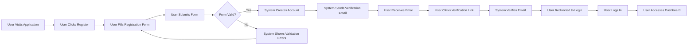
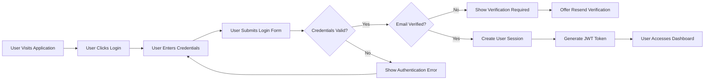
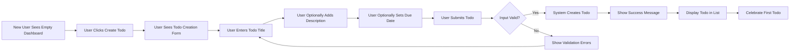
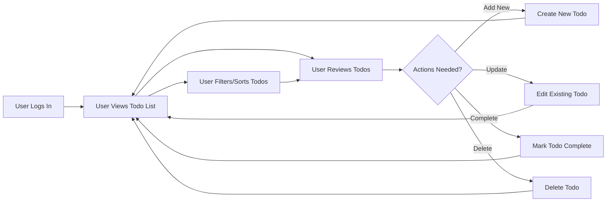
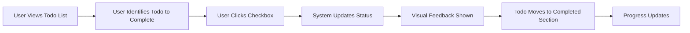
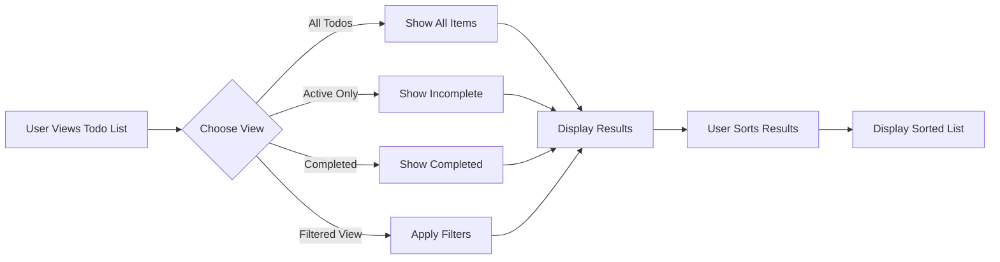
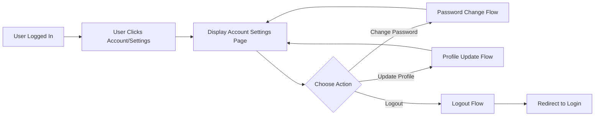

# User Workflows and Journeys

## Introduction

This document provides comprehensive user workflow documentation for the Todo list application. It describes step-by-step journeys that users take when interacting with the system, from initial registration through daily todo management activities.

### Purpose of This Document

This document serves to:
- Provide clear, sequential descriptions of how users interact with the Todo list application
- Help developers understand the complete user experience and context for each feature
- Define expected user behaviors and system responses in natural language
- Establish the business logic flow for all major user interactions
- Serve as a reference for understanding user needs and pain points

### How to Read This Document

Each workflow section describes:
- **User actions**: What the user does at each step
- **System responses**: How the system reacts to user actions
- **Business rules**: Validation and logic applied during the workflow
- **Success criteria**: What constitutes successful completion
- **Error scenarios**: What happens when things go wrong
- **Recovery processes**: How users can recover from errors

All workflows are written from the user's perspective in natural language, focusing on what users want to accomplish and how the system helps them achieve their goals.

### Relationship to Other Documentation

This document connects closely with:
- [User Actors and Authentication](./02-user-actors-and-authentication.md) - For authentication context and user roles
- [Todo Management Requirements](./03-todo-management-requirements.md) - For detailed feature specifications
- [Error Handling and Edge Cases](./06-error-handling-and-edge-cases.md) - For comprehensive error scenario coverage
- [Business Rules and Validation](./05-business-rules-and-validation.md) - For validation rules applied during workflows

---

## New User Registration Journey

### Overview

The registration journey represents a new user's first interaction with the Todo list application. This workflow takes a prospective user from discovering the application through successfully creating an account and being ready to use the system.

### Registration Workflow Steps

```mermaid
graph LR
    A["User Visits Application"] --> B["User Clicks Register"]
    B --> C["User Fills Registration Form"]
    C --> D["User Submits Form"]
    D --> E{"Form Valid?"}
    E -->|"Yes"| F["System Creates Account"]
    E -->|"No"| G["System Shows Validation Errors"]
    G --> C
    F --> H["System Sends Verification Email"]
    H --> I["User Receives Email"]
    I --> J["User Clicks Verification Link"]
    J --> K["System Verifies Email"]
    K --> L["User Redirected to Login"]
    L --> M["User Logs In"]
    M --> N["User Accesses Dashboard"]
```

### Detailed Step-by-Step Process

#### Step 1: Initial Access
WHEN a prospective user first visits the Todo list application, THE system SHALL display a landing page with clear options to either log in or register a new account.

**User Experience**:
- The user sees a welcoming interface introducing the Todo list application
- Clear "Register" and "Login" options are prominently displayed
- The value proposition is immediately apparent

#### Step 2: Accessing Registration Form
WHEN the user clicks the "Register" button, THE system SHALL display the registration form with all required fields.

**Required Information**:
- Email address (used as unique identifier and login credential)
- Password (must meet security requirements)
- Password confirmation (must match the password)
- Full name (for personalization)

**User Experience**:
- The form is clean and uncluttered with only essential fields
- Each field has clear labels and helpful placeholder text
- Password requirements are displayed near the password field
- Real-time validation feedback appears as users type

#### Step 3: Form Completion
WHEN the user fills in the registration form, THE system SHALL provide real-time validation feedback for each field.

**Validation During Input**:
- Email format validation occurs when the user leaves the email field
- Password strength indicator updates as the user types their password
- Password confirmation match validation occurs when the user leaves the confirmation field
- All validation messages are clear and actionable

**Business Rules Applied**:
- Email must be a valid email format
- Email must not already exist in the system
- Password must be at least 8 characters long
- Password must contain at least one uppercase letter, one lowercase letter, and one number
- Password and password confirmation must match exactly
- Full name must be provided and cannot be empty

#### Step 4: Form Submission
WHEN the user clicks the "Create Account" button, THE system SHALL validate all input and either create the account or display error messages.

**Success Path**:
IF all validation passes, THEN THE system SHALL:
1. Create a new user account in the system
2. Set the account status to "pending email verification"
3. Generate a unique email verification token
4. Send a verification email to the provided email address
5. Display a success message: "Account created successfully! Please check your email to verify your account."
6. Redirect the user to a "Verification Pending" page

**Error Path**:
IF validation fails, THEN THE system SHALL:
1. Display specific error messages for each field that failed validation
2. Preserve all valid input so the user doesn't have to re-enter everything
3. Focus on the first field with an error
4. Allow the user to correct errors and resubmit

#### Step 5: Email Verification
WHEN the verification email is sent, THE system SHALL include a verification link that remains valid for 24 hours.

**Email Contents**:
- Welcome message with the user's name
- Clear explanation that email verification is required
- Prominent verification link button
- Plain text version of the verification URL
- Expiration notice (link valid for 24 hours)
- Support contact information

**User Experience**:
- User receives the email within seconds of registration
- The verification link is clearly visible and easy to click
- Clicking the link opens a new browser tab

#### Step 6: Verification Link Click
WHEN the user clicks the verification link, THE system SHALL validate the token and verify the email address.

**Success Scenario**:
IF the token is valid and not expired, THEN THE system SHALL:
1. Mark the user's email as verified
2. Activate the user account
3. Display a success message: "Email verified successfully! You can now log in."
4. Provide a prominent "Go to Login" button
5. Automatically log the user in (optional enhanced experience)

**Error Scenarios**:

WHEN the verification token is expired, THE system SHALL:
- Display a message: "This verification link has expired."
- Provide a "Resend Verification Email" button
- Send a new verification email when the user clicks the button

WHEN the verification token is invalid, THE system SHALL:
- Display a message: "Invalid verification link."
- Provide a "Go to Login" button
- Suggest contacting support if the user continues to have issues

WHEN the email is already verified, THE system SHALL:
- Display a message: "This email has already been verified."
- Provide a "Go to Login" button

#### Step 7: First Login After Verification
WHEN the user logs in for the first time after verification, THE system SHALL provide a welcoming first-time experience.

**First Login Experience**:
- Display a welcome message with the user's name
- Show an empty todo list with helpful guidance
- Provide a prominent "Create Your First Todo" call-to-action
- Offer a brief tutorial or tour (optional)

### Alternative Registration Scenarios

#### Duplicate Email Registration Attempt
WHEN a user attempts to register with an email that already exists, THE system SHALL:
1. Detect the duplicate email during validation
2. Display an error message: "An account with this email already exists."
3. Provide a "Login Instead" link
4. Provide a "Forgot Password?" link for users who may have forgotten they already registered

#### Registration Form Abandonment
WHEN a user starts filling the registration form but leaves without submitting, THE system SHALL:
- Not save any partial registration data
- Not send any emails
- Allow the user to return and start fresh

#### Network Failure During Registration
IF registration submission fails due to network issues, THEN THE system SHALL:
- Display a user-friendly error message: "Unable to complete registration. Please check your connection and try again."
- Preserve all entered form data
- Allow the user to retry submission
- Log the error for monitoring purposes

### Registration Success Criteria

A successful registration is complete when:
- User account is created in the system
- Email verification is completed
- User successfully logs in for the first time
- User can access their personal todo list dashboard

### Performance Expectations

- Registration form should load instantly
- Form validation should provide feedback within 500 milliseconds
- Account creation should complete within 2 seconds
- Verification email should be sent within 5 seconds
- Email verification token validation should be instant

---

## User Login Journey

### Overview

The login journey represents how authenticated users access their accounts and begin using the Todo list application. This workflow covers standard login, session management, and password recovery.

### Standard Login Workflow

```mermaid
graph LR
    A["User Visits Application"] --> B["User Clicks Login"]
    B --> C["User Enters Credentials"]
    C --> D["User Submits Login Form"]
    D --> E{"Credentials Valid?"}
    E -->|"Yes"| F{"Email Verified?"}
    E -->|"No"| G["Show Authentication Error"]
    F -->|"Yes"| H["Create User Session"]
    F -->|"No"| I["Show Verification Required"]
    G --> C
    I --> J["Offer Resend Verification"]
    H --> K["Generate JWT Token"]
    K --> L["User Accesses Dashboard"]
```

### Detailed Login Process

#### Step 1: Accessing Login Form
WHEN a user visits the application and clicks "Login", THE system SHALL display the login form with email and password fields.

**Login Form Elements**:
- Email address field
- Password field (masked input)
- "Remember Me" checkbox
- "Login" submit button
- "Forgot Password?" link
- "Don't have an account? Register" link

**User Experience**:
- Form is clean and focused on essential login elements
- Password field provides option to show/hide password
- Clear error messaging area above the form
- Loading indicator appears during login processing

#### Step 2: Entering Credentials
WHEN the user enters their email and password, THE system SHALL provide appropriate visual feedback.

**Input Behavior**:
- Email field accepts standard email format input
- Password field masks characters for security
- Form validates that both fields are filled before enabling submit button
- "Remember Me" checkbox is unchecked by default

#### Step 3: Credential Submission
WHEN the user clicks the "Login" button, THE system SHALL validate credentials and create a session if valid.

**Validation Process**:
1. System checks if email exists in the database
2. System verifies the password matches the stored hash
3. System checks if the email is verified
4. System checks if the account is active (not suspended or deleted)

**Success Path**:
IF credentials are valid AND email is verified AND account is active, THEN THE system SHALL:
1. Generate a JWT access token (valid for 15 minutes)
2. Generate a JWT refresh token (valid for 7 days)
3. Create a session record in the system
4. Return tokens to the client
5. Redirect the user to their todo list dashboard

**Authentication Failure Scenarios**:

WHEN credentials are invalid (email doesn't exist OR password doesn't match), THE system SHALL:
- Display a generic error message: "Invalid email or password."
- Not specify whether email or password was incorrect (security best practice)
- Clear the password field
- Keep the email field populated
- Allow unlimited retry attempts (with rate limiting for security)

WHEN email is not verified, THE system SHALL:
- Display a message: "Please verify your email address before logging in."
- Show the verification pending status
- Provide a "Resend Verification Email" button
- Send a new verification email when requested

WHEN account is inactive or suspended, THE system SHALL:
- Display a message: "This account is currently inactive. Please contact support."
- Provide support contact information
- Log the login attempt for security monitoring

#### Step 4: Session Creation and Token Management
WHEN login is successful, THE system SHALL create a secure session with JWT tokens.

**JWT Access Token Contents**:
- User ID (unique identifier)
- User role (always "user" for authenticated users)
- Email address
- Token expiration timestamp (15 minutes from issue)
- Token issue timestamp

**JWT Refresh Token Contents**:
- User ID
- Session ID (unique session identifier)
- Token expiration timestamp (7 days from issue)
- Token issue timestamp

**Session Management**:
- Access token stored in memory or sessionStorage for maximum security
- Refresh token stored in httpOnly cookie to prevent XSS attacks
- Session persists across browser tabs
- Session expires after 7 days of inactivity

#### Step 5: Remember Me Functionality
IF the user checks the "Remember Me" option, THEN THE system SHALL extend the refresh token validity to 30 days instead of 7 days.

**Remember Me Behavior**:
- Checkbox clearly labeled "Keep me logged in for 30 days"
- Extended refresh token validity to 30 days
- User remains logged in across browser sessions
- User can still manually log out to end the session

#### Step 6: Successful Login Redirect
WHEN login completes successfully, THE system SHALL redirect the user to their todo list dashboard.

**Dashboard Access**:
- User sees their personalized todo list
- Welcome message displays the user's name
- All user's todos are loaded and displayed
- User can immediately begin managing todos

### Forgot Password Workflow

```mermaid
graph LR
    A["User Clicks Forgot Password"] --> B["User Enters Email"]
    B --> C["User Submits Request"]
    C --> D{"Email Exists?"}
    D -->|"Yes"| E["Send Password Reset Email"]
    D -->|"No"| F["Show Generic Success Message"]
    E --> F
    F --> G["User Checks Email"]
    G --> H["User Clicks Reset Link"]
    H --> I{"Token Valid?"}
    I -->|"Yes"| J["Show New Password Form"]
    I -->|"No"| K["Show Token Invalid Error"]
    J --> L["User Enters New Password"]
    L --> M["User Submits New Password"]
    M --> N["System Updates Password"]
    N --> O["User Redirected to Login"]
```

#### Forgot Password Step-by-Step

**Step 1: Initiating Password Reset**
WHEN a user clicks "Forgot Password?" on the login page, THE system SHALL display the password reset request form.

**Reset Request Form**:
- Email address field
- Clear instructions: "Enter your email address and we'll send you a link to reset your password."
- "Send Reset Link" button
- "Back to Login" link

**Step 2: Submitting Reset Request**
WHEN the user enters their email and submits the form, THE system SHALL process the reset request.

**Security Consideration**:
IF the email exists in the system, THEN THE system SHALL:
1. Generate a unique password reset token (valid for 1 hour)
2. Send a password reset email to the address
3. Display a generic success message

IF the email does NOT exist in the system, THEN THE system SHALL:
1. Still display the same generic success message
2. Not reveal that the email doesn't exist (security best practice)
3. Not send any email

**Generic Success Message**: "If an account exists with that email, you will receive a password reset link shortly."

**Step 3: Password Reset Email**
WHEN the password reset email is sent, THE system SHALL include a reset link valid for 1 hour.

**Email Contents**:
- Clear subject line: "Reset Your Password - Todo List App"
- Personalized greeting with user's name
- Explanation that a password reset was requested
- Prominent "Reset Password" button with the reset link
- Plain text version of the reset URL
- Expiration notice (link valid for 1 hour)
- Security note: "If you didn't request this, you can safely ignore this email."

**Step 4: Clicking Reset Link**
WHEN the user clicks the password reset link, THE system SHALL validate the token and display the new password form.

**Token Validation**:
IF the token is valid and not expired, THEN THE system SHALL:
- Display the new password form
- Show the email address associated with the reset (for confirmation)
- Require new password and password confirmation

IF the token is invalid or expired, THEN THE system SHALL:
- Display an error message: "This password reset link is invalid or has expired."
- Provide a "Request New Reset Link" button
- Allow the user to restart the password reset process

**Step 5: Setting New Password**
WHEN the user enters and submits a new password, THE system SHALL validate and update the password.

**New Password Requirements**:
- Must be at least 8 characters long
- Must contain at least one uppercase letter, one lowercase letter, and one number
- Must match the password confirmation field
- Cannot be the same as the current password

**Success Path**:
IF the new password meets all requirements, THEN THE system SHALL:
1. Update the user's password in the database
2. Invalidate the reset token
3. Invalidate all existing user sessions (force re-login on all devices)
4. Display a success message: "Password updated successfully! Please log in with your new password."
5. Redirect to the login page after 3 seconds

### Session Management from User Perspective

#### Active Session Behavior
WHILE a user has an active session, THE system SHALL:
- Automatically refresh the access token when it expires (using the refresh token)
- Maintain the user's logged-in state across browser tabs
- Allow the user to perform all authenticated actions
- Track session activity for security purposes

#### Session Expiration
WHEN the refresh token expires (7 days for standard, 30 days for "Remember Me"), THE system SHALL:
- Automatically log the user out
- Display a message: "Your session has expired. Please log in again."
- Redirect to the login page
- Preserve the page the user was trying to access for post-login redirect

#### Manual Logout
WHEN the user clicks the "Logout" button, THE system SHALL:
1. Invalidate the current session and tokens
2. Clear all authentication data from the browser
3. Display a confirmation message: "You have been logged out successfully."
4. Redirect to the landing page or login page

### Login Performance Expectations

- Login form should load instantly
- Credential validation should complete within 1 second
- Dashboard should load within 2 seconds of successful login
- Password reset email should be sent within 5 seconds
- Token validation should be instant

### Login Error Recovery

**Network Failure During Login**:
IF login submission fails due to network issues, THEN THE system SHALL:
- Display an error message: "Unable to connect. Please check your connection and try again."
- Preserve entered credentials (except password for security)
- Allow the user to retry immediately

**Server Error During Login**:
IF login fails due to server error, THEN THE system SHALL:
- Display an error message: "Something went wrong. Please try again."
- Log the error for investigation
- Preserve entered email address
- Clear the password field
- Allow the user to retry

---

## Creating First Todo Journey

### Overview

The first todo creation experience is critical for new users to understand the value of the application and become engaged. This workflow focuses on making the first todo creation smooth, intuitive, and rewarding.

### First Todo Creation Workflow

```mermaid
graph LR
    A["New User Sees Empty Dashboard"] --> B["User Clicks Create Todo"]
    B --> C["User Sees Todo Creation Form"]
    C --> D["User Enters Todo Title"]
    D --> E["User Optionally Adds Description"]
    E --> F["User Optionally Sets Due Date"]
    F --> G["User Submits Todo"]
    G --> H{"Input Valid?"}
    H -->|"Yes"| I["System Creates Todo"]
    H -->|"No"| J["Show Validation Errors"]
    J --> D
    I --> K["Show Success Message"]
    K --> L["Display Todo in List"]
    L --> M["Celebrate First Todo"]
```

### Detailed First Todo Creation Process

#### Step 1: Empty Dashboard Experience
WHEN a new user logs in for the first time and sees an empty todo list, THE system SHALL display an encouraging empty state.

**Empty State Elements**:
- Friendly illustration or icon representing an empty todo list
- Welcoming message: "Welcome! You don't have any todos yet."
- Encouraging subtext: "Create your first todo to get started and stay organized."
- Prominent "Create Your First Todo" button
- Optional: Brief explanation of what todos are and how they help

**User Experience**:
- The empty state is visually appealing and not intimidating
- The call-to-action is clear and inviting
- User feels guided and supported rather than lost

#### Step 2: Opening Todo Creation Form
WHEN the user clicks "Create Your First Todo", THE system SHALL display the todo creation form.

**Form Presentation**:
- Form can appear as a modal overlay, slide-in panel, or inline expansion
- Form is focused and uncluttered
- Clear heading: "Create New Todo"
- Essential fields are prominently displayed
- Optional fields are clearly marked as optional

**Form Fields**:
1. **Todo Title** (required)
   - Single-line text input
   - Placeholder: "What do you need to do?"
   - Maximum 200 characters
   - Clear character counter appears when approaching limit

2. **Description** (optional)
   - Multi-line text area
   - Placeholder: "Add any details or notes..."
   - Maximum 1000 characters
   - Expandable text area

3. **Due Date** (optional)
   - Date picker interface
   - Defaults to no due date
   - Can select any future date
   - Clear selected date option

4. **Action Buttons**:
   - "Create Todo" primary button
   - "Cancel" secondary button

#### Step 3: Entering Todo Title
WHEN the user types in the todo title field, THE system SHALL provide real-time feedback.

**Title Input Behavior**:
- Auto-focus on the title field when form opens
- Character counter appears when user starts typing
- Visual indication when approaching or exceeding character limit
- Title field cannot be left empty (required field validation)

**Business Rules**:
- Title must be at least 1 character (cannot be empty)
- Title must not exceed 200 characters
- Leading and trailing whitespace is automatically trimmed
- Title is required for todo creation

#### Step 4: Adding Optional Description
IF the user chooses to add a description, THEN THE system SHALL provide a comfortable text input experience.

**Description Input Behavior**:
- Text area expands vertically as user types
- Character counter shows remaining characters out of 1000
- Supports line breaks and basic text formatting
- Description is entirely optional

**Business Rules**:
- Description can be empty (optional field)
- Description maximum length is 1000 characters
- Leading and trailing whitespace is automatically trimmed
- Empty description is stored as null, not empty string

#### Step 5: Setting Due Date (Optional)
IF the user chooses to set a due date, THEN THE system SHALL provide an intuitive date selection interface.

**Due Date Picker Behavior**:
- Date picker opens when user clicks the due date field
- Calendar view shows current month by default
- User can navigate to future months
- Selecting a date populates the field with a readable format (e.g., "January 15, 2025")
- "Clear" option removes the selected due date
- Past dates can optionally be disabled or allowed with warning

**Business Rules**:
- Due date is optional
- Due date can be any date (past dates allowed but may trigger a warning)
- No due date is represented as null
- Due dates are stored in ISO 8601 format

#### Step 6: Submitting the Todo
WHEN the user clicks "Create Todo", THE system SHALL validate the input and create the todo item.

**Validation Process**:
1. Check that title is not empty
2. Check that title does not exceed 200 characters
3. Check that description (if provided) does not exceed 1000 characters
4. Validate due date format if provided

**Success Path**:
IF all validation passes, THEN THE system SHALL:
1. Create the todo item in the database
2. Associate the todo with the current user
3. Set initial status to "incomplete"
4. Set creation timestamp to current time
5. Close the creation form
6. Display a success message: "Todo created successfully!"
7. Add the new todo to the user's todo list
8. Highlight or animate the new todo to draw attention

**First Todo Celebration**:
WHEN a user creates their very first todo, THE system SHALL:
- Display a special congratulatory message: "🎉 Congratulations on creating your first todo!"
- Briefly explain next steps: "You can mark it complete when done, edit it, or create more todos."
- Provide a subtle animation or visual celebration
- Encourage continued engagement

#### Step 7: Viewing the Created Todo
WHEN the first todo is successfully created, THE system SHALL display it in the todo list.

**Todo Display**:
- Todo appears at the top or in the appropriate sorted position
- Title is prominently displayed
- Description is shown (if provided) or hidden gracefully if empty
- Due date is displayed with appropriate formatting and visual indicators
- Checkbox for marking complete/incomplete is visible
- Edit and delete actions are accessible
- Visual styling makes the todo easy to read and interact with

### Validation Error Scenarios

**Empty Title Error**:
WHEN the user attempts to create a todo with an empty title, THE system SHALL:
- Prevent form submission
- Display an error message near the title field: "Title is required"
- Focus on the title field
- Keep all other entered data intact

**Title Too Long Error**:
WHEN the user enters a title exceeding 200 characters, THE system SHALL:
- Display an error message: "Title cannot exceed 200 characters"
- Show the current character count
- Prevent form submission until corrected
- Allow the user to edit and shorten the title

**Description Too Long Error**:
WHEN the user enters a description exceeding 1000 characters, THE system SHALL:
- Display an error message: "Description cannot exceed 1000 characters"
- Show the current character count
- Prevent form submission until corrected
- Allow the user to edit and shorten the description

### Form Cancellation
WHEN the user clicks "Cancel" while creating a todo, THE system SHALL:
- Close the creation form without saving
- Discard all entered data
- Return to the previous view (empty state or todo list)
- Optionally: Show a confirmation dialog if significant text was entered

### First Todo Creation Performance

- Creation form should open instantly
- Real-time validation feedback should appear within 200 milliseconds
- Todo creation should complete within 1 second
- New todo should appear in the list immediately after creation
- Success message should be visible for 3-5 seconds

---

## Daily Todo Management Workflow

### Overview

Daily todo management represents the core recurring workflow that users perform regularly. This includes checking todos, adding new items, updating existing todos, and marking tasks complete throughout the day.

### Typical Daily Workflow

```mermaid
graph LR
    A["User Logs In"] --> B["User Views Todo List"]
    B --> C["User Reviews Todos"]
    C --> D{"Actions Needed?"}
    D -->|"Add New"| E["Create New Todo"]
    D -->|"Update"| F["Edit Existing Todo"]
    D -->|"Complete"| G["Mark Todo Complete"]
    D -->|"Delete"| H["Delete Todo"]
    E --> B
    F --> B
    G --> B
    H --> B
    B --> I["User Filters/Sorts Todos"]
    I --> C
```

### Morning Routine: Checking Todos

#### Step 1: Logging In to Start the Day
WHEN a user logs in at the start of their day, THE system SHALL immediately display their todo list.

**Dashboard View**:
- All user's todos are loaded and displayed
- Todos are sorted with incomplete todos first, ordered by due date (soonest first)
- Overdue todos are visually highlighted (if due date is in the past)
- Completed todos may be hidden by default or shown in a separate section
- Clear count of incomplete vs. completed todos

**User Experience**:
- Quick overview of what needs to be done today
- Visual priority indicators for overdue or due-soon items
- Sense of accomplishment from seeing completed todos

#### Step 2: Reviewing the Todo List
WHEN the user reviews their todo list, THE system SHALL provide clear visual organization and status information.

**Visual Organization**:
- Each todo is displayed as a distinct card or list item
- Todo title is prominently displayed in readable font
- Due date (if set) is shown with contextual formatting:
  - Overdue: Red or urgent styling (e.g., "2 days overdue")
  - Due today: Orange or attention styling (e.g., "Due today")
  - Due soon: Yellow or reminder styling (e.g., "Due tomorrow")
  - Due later: Normal styling (e.g., "Due in 5 days")
  - No due date: No date display or "No due date" text
- Completion status is immediately visible via checkbox state
- Description preview shown if available (truncated with "Read more" if long)

**Interactive Elements on Each Todo**:
- Checkbox to mark complete/incomplete
- Edit button or icon
- Delete button or icon
- Expand/collapse to view full description

### Adding New Todos Throughout the Day

#### Step 1: Quick Todo Addition
WHEN a user wants to add a new todo during the day, THE system SHALL provide quick access to todo creation.

**Quick Add Options**:
- Persistent "Add Todo" or "+" button visible at all times
- Keyboard shortcut (optional: Ctrl/Cmd + N) for power users
- Quick add inline form (optional simplified version)

**Quick Add Behavior**:
WHEN the user clicks "Add Todo", THE system SHALL:
- Open the todo creation form
- Auto-focus on the title field
- Pre-fill due date to today (optional default)
- Allow immediate typing and creation

#### Step 2: Creating Multiple Todos
WHEN a user has multiple tasks to add, THE system SHALL support efficient batch creation.

**Batch Creation Support**:
- After creating a todo, option to "Add Another" keeps the form open
- Success message appears briefly but doesn't interrupt workflow
- Previous todo appears in the list immediately
- Form resets for next todo entry

### Updating Existing Todos

#### Step 1: Accessing Todo Edit Mode
WHEN a user wants to edit an existing todo, THE system SHALL provide easy access to editing.

**Edit Access Methods**:
- Click on the todo title to enter edit mode
- Click an explicit "Edit" button or icon
- Right-click context menu with "Edit" option
- Double-click the todo item

#### Step 2: Editing Todo Properties
WHEN a user enters edit mode for a todo, THE system SHALL display an editable form with current values pre-filled.

**Edit Form Presentation**:
- Similar to creation form but pre-populated with existing values
- Title field contains current title
- Description field contains current description (or empty if none)
- Due date field shows current due date (or empty if none)
- "Save Changes" and "Cancel" buttons

**Editing Workflow**:
WHEN the user modifies any fields and clicks "Save Changes", THE system SHALL:
1. Validate the updated values (same rules as creation)
2. Update the todo in the database
3. Update the last modified timestamp
4. Close the edit form
5. Display the updated todo in the list
6. Show a success message: "Todo updated successfully!"

**Edit Cancellation**:
WHEN the user clicks "Cancel" during editing, THE system SHALL:
- Discard all changes
- Restore the original todo values
- Close the edit form
- Optionally: Confirm before discarding if significant changes were made

### Marking Todos Complete

#### Step 1: Completing a Todo
WHEN a user marks a todo as complete, THE system SHALL provide immediate visual feedback and update the status.

**Completion Interaction**:
WHEN the user clicks the checkbox next to an incomplete todo, THE system SHALL:
1. Update the todo status to "completed"
2. Set the completion timestamp to current time
3. Apply visual styling to indicate completion:
   - Checkbox shows checkmark
   - Todo title may have strikethrough styling
   - Todo may fade or move to completed section
4. Display a brief success indicator
5. Update todo counts (e.g., "5 of 10 completed")

**Completion Visual Feedback**:
- Checkbox animates to checked state
- Todo item may have a brief success animation (e.g., green flash)
- Completed todo moves to the bottom of the list or to a "Completed" section
- Overall progress indicator updates

#### Step 2: Uncompleting a Todo
WHEN a user unchecks a completed todo, THE system SHALL restore it to incomplete status.

**Uncompletion Interaction**:
WHEN the user clicks the checkbox next to a completed todo, THE system SHALL:
1. Update the todo status back to "incomplete"
2. Clear the completion timestamp
3. Remove completion styling
4. Move the todo back to the incomplete section
5. Update todo counts

**Use Case for Uncompleting**:
- User accidentally marked a todo as complete
- Task needs to be done again (recurring task)
- User wants to track a todo that was prematurely marked complete

### Deleting Todos

#### Step 1: Initiating Todo Deletion
WHEN a user wants to delete a todo, THE system SHALL provide a delete action with confirmation.

**Delete Access**:
- Delete button or icon on each todo
- Right-click context menu with "Delete" option
- Keyboard shortcut (e.g., Delete key when todo is selected)

**Delete Confirmation**:
WHEN the user clicks "Delete", THE system SHALL:
- Display a confirmation dialog: "Are you sure you want to delete this todo?"
- Show the todo title in the confirmation for context
- Provide "Delete" and "Cancel" options
- Prevent accidental deletion

#### Step 2: Confirming Deletion
WHEN the user confirms deletion, THE system SHALL permanently remove the todo.

**Deletion Process**:
IF the user confirms deletion, THEN THE system SHALL:
1. Remove the todo from the database
2. Remove the todo from the displayed list with animation
3. Display a success message: "Todo deleted successfully"
4. Update todo counts
5. Optionally: Provide "Undo" option for brief period (5 seconds)

**Undo Deletion (Optional Enhancement)**:
IF the system provides an undo option and the user clicks "Undo", THEN THE system SHALL:
- Restore the deleted todo
- Re-insert it into the list
- Display a message: "Todo restored"

### Todo List Management Throughout the Day

#### Filtering Todos
WHEN a user wants to focus on specific todos, THE system SHALL provide filtering options.

**Available Filters**:
- "All Todos" - Shows everything
- "Incomplete" - Shows only incomplete todos (default view)
- "Completed" - Shows only completed todos
- "Due Today" - Shows todos due today
- "Overdue" - Shows todos past their due date
- "No Due Date" - Shows todos without a due date

**Filter Behavior**:
WHEN a user selects a filter, THE system SHALL:
- Immediately update the list to show only matching todos
- Display the count of visible todos
- Maintain the filter selection across page refreshes
- Clearly indicate which filter is active

#### Sorting Todos
WHEN a user wants to organize their view, THE system SHALL provide sorting options.

**Available Sort Options**:
- "Due Date" (earliest first) - Default
- "Created Date" (newest first)
- "Alphabetical" (A-Z)
- "Completion Status" (incomplete first)

**Sort Behavior**:
WHEN a user selects a sort option, THE system SHALL:
- Reorder the todo list according to the selected criteria
- Maintain the sort preference for the session
- Combine sorting with any active filters

### End of Day Review

#### Reviewing Accomplishments
WHEN a user reviews their todos at the end of the day, THE system SHALL help them see their progress.

**Progress Visualization**:
- Clear count of completed todos for the day
- Percentage of completion (e.g., "You completed 7 of 10 todos today!")
- Visual progress bar or indicator
- List of completed todos for sense of accomplishment

#### Preparing for Tomorrow
WHEN a user prepares for the next day, THE system SHALL support planning activities.

**Tomorrow Preparation**:
- Review incomplete todos and assess urgency
- Add new todos for tomorrow's tasks
- Update due dates on existing todos
- Mark todos as complete that were finished

### Daily Workflow Performance Expectations

- Todo list should load within 1 second of login
- Todo creation should complete within 1 second
- Marking complete/incomplete should update instantly (optimistic UI)
- Editing should save within 1 second
- Deleting should remove from view instantly
- Filtering and sorting should be instant (client-side operations)

---

## Completing Todos Workflow

### Overview

Marking todos as complete or incomplete is one of the most frequent interactions users have with the application. This workflow focuses on making completion tracking smooth, satisfying, and reliable.

### Standard Completion Workflow

```mermaid
graph LR
    A["User Views Todo List"] --> B["User Identifies Todo to Complete"]
    B --> C["User Clicks Checkbox"]
    C --> D["System Updates Status"]
    D --> E["Visual Feedback Shown"]
    E --> F["Todo Moves to Completed Section"]
    F --> G["Progress Updates"]
```

### Detailed Completion Process

#### Step 1: Identifying Todos to Complete
WHEN a user has finished a task and wants to mark it complete, THE system SHALL make the completion action obvious and accessible.

**Visual Indicators**:
- Each todo has a prominent checkbox on the left side
- Incomplete todos show an empty checkbox
- Hovering over the checkbox highlights it for interaction
- Checkbox is large enough for easy clicking (minimum 20px × 20px)

#### Step 2: Marking a Todo Complete
WHEN the user clicks the checkbox of an incomplete todo, THE system SHALL immediately update the todo to completed status.

**Immediate Actions**:
WHEN a todo is marked complete, THE system SHALL:
1. Send the completion request to the server
2. Optimistically update the UI before server confirmation (for instant feedback)
3. Apply the checkmark to the checkbox with a smooth animation
4. Apply completion styling to the todo item:
   - Add checkmark icon to checkbox
   - Apply strikethrough to the title (optional)
   - Reduce opacity slightly (e.g., 70%)
   - Add "Completed" label or timestamp
5. Record the completion timestamp
6. Update the overall progress indicator

**Visual Feedback**:
- Checkbox animates from empty to checked
- Brief success animation (e.g., green pulse or checkmark bounce)
- Todo may slide or fade to completed section
- Completion sound effect (optional)

#### Step 3: Handling Completion Confirmation
WHEN the server confirms the completion, THE system SHALL ensure data consistency.

**Success Confirmation**:
IF server successfully processes the completion, THEN THE system SHALL:
- Maintain the completed visual state
- Update any server-returned data (e.g., completion timestamp)
- Ensure the change persists across page refreshes

**Error Handling**:
IF server fails to process the completion, THEN THE system SHALL:
- Revert the optimistic UI update
- Display an error message: "Unable to mark todo as complete. Please try again."
- Log the error for investigation
- Allow the user to retry

#### Step 4: Moving Completed Todos
WHEN a todo is marked complete, THE system SHALL organize it appropriately in the list.

**Completed Todo Organization Options**:

**Option 1: Move to Bottom**
- Completed todo animates to the bottom of the list
- Keeps focus on incomplete todos at the top
- Maintains all todos in one unified list

**Option 2: Separate Completed Section**
- Completed todos move to a distinct "Completed" section below incomplete todos
- Section can be collapsed/expanded
- Clear visual separation between incomplete and completed

**Option 3: Hide Completed**
- Completed todos are hidden from the default view
- "Show Completed" toggle reveals them
- Keeps the list focused on what needs to be done

THE system SHALL support at least one of these organization patterns, with clear user preference if multiple options are available.

#### Step 5: Updating Progress Indicators
WHEN a todo is marked complete, THE system SHALL update all relevant progress indicators.

**Progress Updates**:
- Todo count updates (e.g., "4 of 10 completed" becomes "5 of 10 completed")
- Progress percentage updates (e.g., "40%" becomes "50%")
- Progress bar fills proportionally
- Dashboard statistics update if applicable

### Uncompleting Todos

#### Step 1: Identifying Need to Uncomplete
WHEN a user realizes a todo was marked complete by mistake or needs to be done again, THE system SHALL allow reversing the completion.

**Uncompletion Access**:
- User can click the checkbox of a completed todo
- Completed todos remain accessible for unchecking
- No confirmation dialog required (reversible action)

#### Step 2: Unmarking a Todo
WHEN the user clicks the checkbox of a completed todo, THE system SHALL restore it to incomplete status.

**Uncompletion Actions**:
WHEN a todo is unmarked, THE system SHALL:
1. Send the uncompletion request to the server
2. Optimistically update the UI immediately
3. Remove the checkmark from the checkbox
4. Remove completion styling:
   - Clear checkbox
   - Remove strikethrough
   - Restore full opacity
   - Remove "Completed" label
5. Clear the completion timestamp
6. Move the todo back to the incomplete section
7. Update progress indicators (decrement completion count)

**Visual Feedback**:
- Checkbox animates from checked to empty
- Todo slides back to incomplete section
- Progress indicators update accordingly

### Batch Completion Operations

#### Selecting Multiple Todos
WHEN a user wants to mark multiple todos as complete at once, THE system SHALL support batch operations.

**Multi-Select Functionality**:
- User can select multiple todos via checkboxes or Shift+Click
- "Mark All Selected as Complete" button appears when items are selected
- "Select All" option for bulk completion
- Clear visual indication of selected items

#### Batch Completion
WHEN the user triggers batch completion, THE system SHALL process all selected todos.

**Batch Completion Process**:
WHEN multiple todos are marked complete together, THE system SHALL:
1. Update all selected todos to completed status
2. Apply completion styling to all selected items
3. Record completion timestamps for all
4. Update progress indicators for the batch
5. Display success message: "X todos marked as complete"
6. Move all completed todos to the appropriate section

### Completion Analytics and Insights

#### Daily Completion Summary
WHEN a user completes todos throughout the day, THE system SHALL provide a sense of progress and accomplishment.

**Progress Insights**:
- Running count of todos completed today
- Completion percentage for the day
- Comparison to previous days (optional)
- Motivational messages based on progress (e.g., "Great job! 80% of today's todos completed!")

#### Completion Timestamps
WHEN a todo is marked complete, THE system SHALL record when it was completed.

**Timestamp Information**:
- Exact timestamp of completion stored
- Display relative time (e.g., "Completed 2 hours ago")
- Show completion date for older completed todos
- Track completion within timeframe relative to due date (on time vs. late)

### Completion Performance and Reliability

#### Performance Expectations
- Marking complete should update UI instantly (optimistic update)
- Server confirmation should complete within 500 milliseconds
- Batch operations should process within 1-2 seconds regardless of count
- Progress indicators should update within 100 milliseconds

#### Reliability and Data Consistency
WHEN network issues occur during completion, THE system SHALL handle gracefully:

**Offline Completion**:
IF the user is offline when marking a todo complete, THEN THE system SHALL:
- Update the UI optimistically
- Queue the completion request
- Display an indicator that changes are pending sync
- Automatically sync when connection is restored
- Notify user if sync fails persistently

**Conflict Resolution**:
IF the same todo is modified on different devices, THEN THE system SHALL:
- Use "last write wins" strategy (most recent timestamp)
- Sync completion status across all devices
- Ensure consistency when user accesses from different devices

### Celebrating Achievements

#### Completion Celebrations
WHEN a user completes significant milestones, THE system SHALL provide positive reinforcement.

**Celebration Triggers**:
- First todo completed ever
- All todos for the day completed
- X number of todos completed in a day (e.g., 10, 20, 50)
- Completion streak (e.g., completing todos every day for a week)

**Celebration Elements**:
- Congratulatory message
- Visual animation (confetti, celebration icon)
- Achievement badge or milestone notification
- Encouragement to keep going

---

## Organizing and Filtering Todos

### Overview

As users accumulate todos, organizing and filtering becomes essential for maintaining productivity. This workflow covers viewing options, filtering capabilities, and search functionality.

### Viewing Options Workflow

```mermaid
graph LR
    A["User Views Todo List"] --> B{"Choose View"}
    B -->|"All Todos"| C["Show All Items"]
    B -->|"Active Only"| D["Show Incomplete"]
    B -->|"Completed"| E["Show Completed"]
    B -->|"Filtered View"| F["Apply Filters"]
    C --> G["Display Results"]
    D --> G
    E --> G
    F --> G
    G --> H["User Sorts Results"]
    H --> I["Display Sorted List"]
```

### Viewing All Todos

#### Default View Configuration
WHEN a user first accesses their todo list, THE system SHALL display todos in a default organized view.

**Default View Settings**:
- Shows all incomplete todos first
- Sorted by due date (earliest first)
- Completed todos shown below or in collapsed section
- Clear visual separation between incomplete and completed

#### All Todos View
WHEN the user selects "All Todos" view, THE system SHALL display every todo regardless of completion status.

**All Todos Display**:
- Incomplete todos displayed first
- Completed todos displayed below
- Clear count: "Showing X todos (Y incomplete, Z completed)"
- Maintains selected sort order
- Visual distinction between incomplete and completed items

### Filtering by Completion Status

#### Active (Incomplete) Todos Only
WHEN the user selects "Active" or "Incomplete" filter, THE system SHALL show only unfinished todos.

**Active Todos Filter**:
WHEN "Active" filter is applied, THE system SHALL:
- Display only todos with incomplete status
- Hide all completed todos
- Update count display: "Showing X active todos"
- Maintain this filter across page refreshes
- Highlight the active filter in the UI

**Use Case**:
- User wants to focus on what needs to be done
- Completed todos are distracting
- Planning the day's work

#### Completed Todos Only
WHEN the user selects "Completed" filter, THE system SHALL show only finished todos.

**Completed Todos Filter**:
WHEN "Completed" filter is applied, THE system SHALL:
- Display only todos with completed status
- Hide all incomplete todos
- Update count display: "Showing X completed todos"
- Show completion timestamps
- Allow uncompleting from this view

**Use Case**:
- User wants to review what they've accomplished
- Checking if a task was already completed
- End-of-day or end-of-week review

### Filtering by Due Date

#### Due Today Filter
WHEN the user selects "Due Today" filter, THE system SHALL show only todos due on the current date.

**Due Today Filter Behavior**:
WHEN "Due Today" filter is applied, THE system SHALL:
- Display todos where due date equals today's date
- Include both completed and incomplete todos due today (with option to combine with status filter)
- Highlight urgency visually
- Update count: "X todos due today"

**Business Logic**:
- Todo is "due today" if due_date equals current date
- Timezone is considered based on user's locale
- Updates automatically at midnight to reflect new "today"

#### Overdue Filter
WHEN the user selects "Overdue" filter, THE system SHALL show only todos past their due date.

**Overdue Filter Behavior**:
WHEN "Overdue" filter is applied, THE system SHALL:
- Display incomplete todos where due date is before today's date
- Sort by how overdue (most overdue first)
- Show "X days overdue" indicator
- Apply urgent visual styling (e.g., red accent)

**Business Logic**:
- Todo is "overdue" if due_date < current_date AND status = incomplete
- Completed todos are not considered overdue
- Calculate overdue duration in days

#### Upcoming Filter
WHEN the user selects "Upcoming" filter, THE system SHALL show todos due soon.

**Upcoming Filter Behavior**:
WHEN "Upcoming" filter is applied, THE system SHALL:
- Display todos due within the next 7 days
- Exclude overdue and due today todos
- Sort by due date (soonest first)
- Show "Due in X days" indicator

#### No Due Date Filter
WHEN the user selects "No Due Date" filter, THE system SHALL show todos without a due date set.

**No Due Date Filter Behavior**:
WHEN "No Due Date" filter is applied, THE system SHALL:
- Display todos where due_date is null
- Include both complete and incomplete
- Help users identify todos that need due dates

### Advanced Filtering

#### Combining Multiple Filters
WHEN a user applies multiple filters, THE system SHALL combine them with AND logic.

**Multi-Filter Behavior**:
WHEN multiple filters are selected, THE system SHALL:
- Show only todos matching ALL selected criteria
- Display active filters clearly
- Update count to reflect filtered results
- Provide "Clear All Filters" option

**Example Combinations**:
- "Incomplete" + "Due Today" = Incomplete todos due today
- "Overdue" + specific search term = Overdue todos matching search
- "Completed" + date range = Completed todos in date range

### Sorting Options

#### Sort by Due Date
WHEN the user selects "Sort by Due Date", THE system SHALL order todos by their due dates.

**Due Date Sort Logic**:
- Todos with due dates appear first, sorted earliest to latest
- Todos without due dates appear at the end
- Overdue todos can optionally be grouped at the top
- Ties are broken by creation date

#### Sort by Creation Date
WHEN the user selects "Sort by Created Date", THE system SHALL order todos by when they were created.

**Creation Date Sort Logic**:
- Newest todos first (most recently created at top)
- Or oldest first (earliest created at top) - user preference
- Helpful for finding recently added todos
- Shows todo addition chronology

#### Sort by Title (Alphabetical)
WHEN the user selects "Sort Alphabetically", THE system SHALL order todos by title.

**Alphabetical Sort Logic**:
- A-Z ascending order
- Case-insensitive sorting
- Special characters and numbers sorted logically
- Useful for finding todos by name

#### Sort by Completion Status
WHEN the user selects "Sort by Status", THE system SHALL group todos by completion state.

**Status Sort Logic**:
- All incomplete todos first
- All completed todos second
- Within each group, maintain secondary sort (e.g., due date)

### Search Functionality

#### Searching Todo Titles and Descriptions
WHEN a user wants to find specific todos, THE system SHALL provide search functionality.

**Search Input**:
- Search box prominently placed in the interface
- Placeholder text: "Search todos..."
- Real-time search as user types (debounced)
- Clear button to reset search

#### Search Behavior
WHEN the user enters a search query, THE system SHALL filter todos matching the search term.

**Search Logic**:
WHEN a search query is entered, THE system SHALL:
- Match against todo titles (case-insensitive)
- Match against todo descriptions (case-insensitive)
- Display only todos containing the search term
- Highlight matching text in results
- Update count: "Found X todos matching 'search term'"
- Show "No results found" if no matches

**Search Performance**:
- Search results update within 200 milliseconds of typing
- Debounce search to avoid excessive queries (300ms delay)
- Search is performed client-side for instant results (or server-side if list is very large)

#### Combining Search with Filters
WHEN a user applies both search and filters, THE system SHALL combine them.

**Combined Search and Filter**:
- Search applies to the filtered set of todos
- Filters apply to the searched set of todos
- Both active search and active filters are clearly displayed
- User can clear search independently of filters
- User can clear filters independently of search

### Filter and Sort Persistence

#### Remembering User Preferences
WHEN a user applies filters or sorts, THE system SHALL remember their preferences.

**Preference Persistence**:
- Filter and sort selections persist across page refreshes
- Preferences stored per user
- Default view restored if user explicitly resets
- Clear "Reset to Default View" option available

### Filter and Sort User Interface

#### Visual Filter Indicators
WHEN filters are active, THE system SHALL clearly indicate which filters are applied.

**Active Filter Display**:
- Filter pills or tags showing active filters
- Each filter pill has a remove (×) button
- "Clear All Filters" button when multiple filters are active
- Result count updates with each filter change

#### Sort Direction Indicators
WHEN a sort is applied, THE system SHALL show the current sort order.

**Sort Display**:
- Active sort option highlighted in the UI
- Sort direction indicator (▲ ascending, ▼ descending)
- Click to toggle sort direction
- Visual feedback when sort changes

### Performance Expectations for Filtering and Sorting

- Filters should apply instantly (< 100ms for client-side)
- Sorting should be instant (< 100ms)
- Search results should appear within 200-300ms of typing
- Combined filter and sort operations should complete within 200ms
- Large lists (1000+ todos) may require server-side filtering with loading indicators

---

## Account Management Journey

### Overview

Account management workflows cover user profile updates, password changes, session management, and logout processes. These are less frequent but critical user journeys.

### Account Settings Access

```mermaid
graph LR
    A["User Logged In"] --> B["User Clicks Account/Settings"]
    B --> C["Display Account Settings Page"]
    C --> D{"Choose Action"}
    D -->|"Change Password"| E["Password Change Flow"]
    D -->|"Update Profile"| F["Profile Update Flow"]
    D -->|"Logout"| G["Logout Flow"]
    E --> C
    F --> C
    G --> H["Redirect to Login"]
```

### Accessing Account Settings

#### Step 1: Opening Account Settings
WHEN a user wants to manage their account, THE system SHALL provide clear access to account settings.

**Settings Access Points**:
- Account menu in the header/navigation (user name or avatar)
- Dropdown menu with "Account Settings" option
- Direct link to settings page
- Keyboard shortcut (optional)

**Settings Page Display**:
WHEN the user opens account settings, THE system SHALL display all account management options:
- User profile information
- Password management
- Session management
- Account preferences
- Logout option

### Changing Password

#### Step 1: Accessing Password Change
WHEN a user wants to change their password, THE system SHALL provide a secure password change interface.

**Password Change Form**:
- Current password field (for verification)
- New password field
- Confirm new password field
- Password requirements displayed
- "Change Password" button
- "Cancel" button

#### Step 2: Entering Current Password
WHEN the user enters their current password, THE system SHALL verify it before allowing a change.

**Current Password Validation**:
WHEN the user submits the password change form, THE system SHALL:
1. Verify the current password is correct
2. If incorrect, display error: "Current password is incorrect"
3. If correct, proceed with validation of new password

#### Step 3: Setting New Password
WHEN the user enters a new password, THE system SHALL validate it meets security requirements.

**New Password Requirements**:
- Must be at least 8 characters long
- Must contain at least one uppercase letter
- Must contain at least one lowercase letter
- Must contain at least one number
- Must not be the same as the current password
- Must match the confirmation field

**Real-Time Validation**:
- Password strength indicator updates as user types
- Requirements checklist shows which criteria are met
- Confirmation field validates match on blur

#### Step 4: Confirming Password Change
WHEN the user submits a valid new password, THE system SHALL update the password and invalidate existing sessions.

**Password Change Process**:
IF all validation passes, THEN THE system SHALL:
1. Update the password in the database
2. Invalidate all existing sessions except the current one
3. Send a password change confirmation email
4. Display success message: "Password changed successfully"
5. Keep the user logged in on current device
6. Force re-login on all other devices

**Security Measures**:
- Password change confirmation email sent to user's email
- Email includes timestamp and device information
- Provides "I didn't make this change" alert option
- Logs password change event for security auditing

### Updating Profile Information

#### Step 1: Viewing Profile
WHEN a user accesses their profile, THE system SHALL display current profile information.

**Profile Information Displayed**:
- Full name
- Email address (non-editable, used for login)
- Account creation date
- Last login timestamp
- Profile picture (if implemented)

#### Step 2: Editing Profile
WHEN the user wants to update their profile, THE system SHALL allow editing specific fields.

**Editable Profile Fields**:
- Full name (required, 1-100 characters)
- Profile picture (optional, if feature is implemented)

**Email Address Handling**:
- Email address is displayed but not editable in basic version
- Changing email requires additional verification flow (future consideration)

#### Step 3: Saving Profile Changes
WHEN the user updates their profile and saves, THE system SHALL validate and save changes.

**Profile Update Process**:
IF validation passes, THEN THE system SHALL:
1. Update the user's profile information
2. Display success message: "Profile updated successfully"
3. Reflect changes immediately in the UI
4. Update display name throughout the application

### Session Management

#### Viewing Active Sessions
WHEN a user wants to see where they're logged in, THE system SHALL display active sessions.

**Session Information Display**:
- List of active sessions
- For each session:
  - Device type and browser
  - Location (if available)
  - Last activity timestamp
  - "Current session" indicator
  - "Revoke" button for other sessions

#### Revoking Sessions
WHEN a user wants to log out of other devices, THE system SHALL allow session revocation.

**Session Revocation**:
WHEN the user clicks "Revoke" on a session, THE system SHALL:
1. Display confirmation: "Are you sure you want to revoke this session?"
2. If confirmed, invalidate that specific session
3. Force logout on that device
4. Display success message: "Session revoked successfully"
5. Remove the session from the active sessions list

**Revoke All Sessions**:
WHEN the user clicks "Revoke All Other Sessions", THE system SHALL:
1. Display confirmation: "This will log you out on all other devices"
2. If confirmed, invalidate all sessions except the current one
3. Display success message: "All other sessions have been revoked"
4. Send security notification email

### Logout Process

#### Step 1: Initiating Logout
WHEN a user wants to log out, THE system SHALL provide clear logout access.

**Logout Access Points**:
- Logout button in account menu
- Logout option in settings page
- Keyboard shortcut (optional)

#### Step 2: Confirming Logout
WHEN the user clicks logout, THE system SHALL optionally confirm before logging out.

**Logout Confirmation** (Optional):
- For quick logout: No confirmation needed
- For cautious approach: "Are you sure you want to log out?"
- Remember preference if user selects "Don't ask again"

#### Step 3: Performing Logout
WHEN logout is confirmed, THE system SHALL securely end the user's session.

**Logout Process**:
WHEN the user logs out, THE system SHALL:
1. Invalidate the current session and tokens
2. Clear authentication data from browser (tokens, cookies)
3. Clear any cached user data
4. Redirect to the login page or landing page
5. Display confirmation: "You have been logged out successfully"
6. Prevent browser back button from accessing protected pages

**Post-Logout State**:
- User is completely logged out
- No authentication tokens remain
- Attempting to access protected pages redirects to login
- Login page shows logout confirmation message

### Security Notifications

#### Password Change Notification
WHEN a user's password is changed, THE system SHALL send a security notification email.

**Email Contents**:
- Subject: "Your Todo List Password Was Changed"
- Notification that password was changed
- Timestamp of the change
- Device and location information (if available)
- "I didn't make this change" alert link
- Instructions if the change was unauthorized

#### Session Revocation Notification
WHEN sessions are revoked in bulk, THE system SHALL notify the user.

**Notification Trigger**:
WHEN "Revoke All Sessions" is used, THE system SHALL:
- Send email notification
- Confirm the action was taken
- Provide timestamp and device information
- Offer support contact if action was unauthorized

### Account Management Performance

- Settings page should load within 1 second
- Password change should complete within 1-2 seconds
- Profile updates should save within 1 second
- Session revocation should be instant
- Logout should complete within 500 milliseconds

### Account Management Error Handling

**Network Failures**:
IF account management operations fail due to network issues, THEN THE system SHALL:
- Display error message: "Unable to save changes. Please check your connection and try again."
- Preserve user input
- Allow retry without re-entering information

**Server Errors**:
IF operations fail due to server errors, THEN THE system SHALL:
- Display error message: "Something went wrong. Please try again."
- Log error for investigation
- Provide support contact information for persistent issues

**Validation Errors**:
IF input fails validation, THEN THE system SHALL:
- Display specific, actionable error messages
- Highlight fields with errors
- Preserve valid input
- Allow correction and resubmission

---

## Conclusion

This document has provided comprehensive user workflow documentation for the Todo list application, covering all major user journeys from registration through daily todo management and account settings.

### Key Workflow Principles

Throughout all user workflows, the system adheres to these principles:

1. **User-Centric Design**: Every workflow prioritizes user needs and ease of use
2. **Immediate Feedback**: Users receive instant visual and textual feedback for all actions
3. **Error Prevention**: Validation and guidance prevent errors before they occur
4. **Error Recovery**: Clear error messages and recovery paths when issues arise
5. **Data Consistency**: All workflows ensure data integrity and consistency across devices
6. **Performance**: All interactions complete within user-acceptable timeframes
7. **Security**: Authentication and authorization are enforced throughout all workflows

### Workflow Integration

These workflows integrate seamlessly with:
- **Authentication System**: All workflows require proper authentication and enforce user-specific data access
- **Business Rules**: All workflows enforce validation rules and business logic
- **Error Handling**: All workflows have well-defined error scenarios and recovery processes
- **Performance Requirements**: All workflows meet defined performance expectations

### Developer Guidance

For backend developers implementing these workflows:

1. **Focus on Business Logic**: Implement the business rules and validation described in each workflow
2. **User Data Isolation**: Ensure all todos and user data are properly isolated per user
3. **Error Responses**: Provide clear, user-friendly error messages as specified
4. **Performance**: Optimize for the performance expectations outlined in each workflow
5. **Security**: Enforce authentication and authorization at every step

### Next Steps

This workflow documentation should be read in conjunction with:
- [User Actors and Authentication](./02-user-actors-and-authentication.md) - For authentication implementation details
- [Todo Management Requirements](./03-todo-management-requirements.md) - For detailed functional specifications
- [Business Rules and Validation](./05-business-rules-and-validation.md) - For validation rule details
- [Error Handling and Edge Cases](./06-error-handling-and-edge-cases.md) - For comprehensive error handling