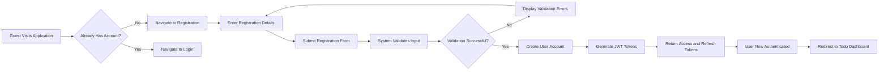
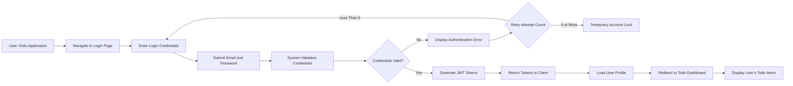
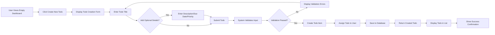
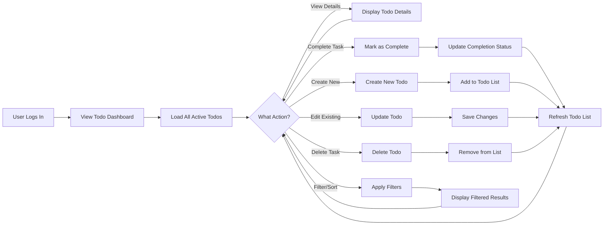
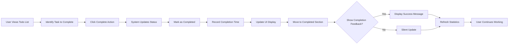
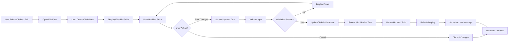
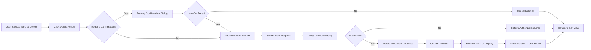
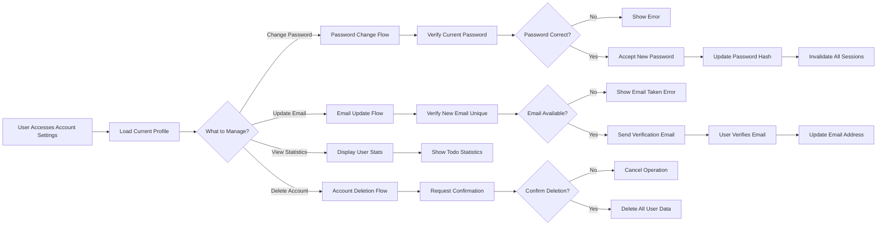

# User Workflows and Journey Documentation

## Document Overview

This document describes complete user journeys and workflows for the Todo list application. It provides detailed step-by-step descriptions of how users interact with the system from initial registration through daily task management activities. Each workflow includes business process flows, user interactions, system responses, and error handling scenarios.

**Purpose**: Enable backend developers and product managers to understand the complete end-to-end user experience and implement features that support natural, intuitive workflows.

**Scope**: Covers all major user journeys including registration, authentication, todo creation, management, completion, modification, and account management.

**Related Documentation**:
- [User Actors and Authentication](./02-user-actors-authentication.md) - Authentication system details
- [Core Todo Features](./03-core-todo-features.md) - Todo feature specifications

## New User Registration Journey

### Registration Process Overview

The registration journey transforms a guest visitor into an authenticated user capable of managing todo items. This is the critical first step in user onboarding and must be simple, secure, and clear.

```mermaid
graph LR
    A["Guest Visits Application"] --> B{"Already Has Account?"}
    B -->|"No"| C["Navigate to Registration"]
    B -->|"Yes"| D["Navigate to Login"]
    C --> E["Enter Registration Details"]
    E --> F["Submit Registration Form"]
    F --> G["System Validates Input"]
    G --> H{"Validation Successful?"}
    H -->|"No"| I["Display Validation Errors"]
    I --> E
    H -->|"Yes"| J["Create User Account"]
    J --> K["Generate JWT Tokens"]
    K --> L["Return Access and Refresh Tokens"]
    L --> M["User Now Authenticated"]
    M --> N["Redirect to Todo Dashboard"]
```

### Registration Workflow Requirements

**WHEN a guest accesses the registration page, THE system SHALL display a registration form requesting email address and password.**

**WHEN a guest submits registration information, THE system SHALL validate the following business rules**:
- Email address must be in valid email format
- Email address must not already exist in the system
- Password must be at least 8 characters long
- Password must contain at least one uppercase letter, one lowercase letter, one number, and one special character

**IF email validation fails, THEN THE system SHALL return a clear error message indicating the specific validation failure.**

**IF the email address already exists, THEN THE system SHALL return an error message stating that an account with this email already exists.**

**WHEN all validation passes, THE system SHALL create a new user account with the following properties**:
- Unique user identifier
- Email address as the primary login credential
- Securely hashed password
- User role set to "user" (authenticated member)
- Account creation timestamp
- Initial account status as active

**WHEN the user account is successfully created, THE system SHALL generate JWT authentication tokens**:
- Access token with 30-minute expiration
- Refresh token with 30-day expiration
- JWT payload containing userId, email, and role

**WHEN JWT tokens are generated, THE system SHALL return both tokens to the client application.**

**WHEN registration completes successfully, THE system SHALL authenticate the user immediately without requiring a separate login.**

### Registration Error Scenarios

**IF the registration request contains malformed data, THEN THE system SHALL return HTTP 400 with specific validation error details.**

**IF the system experiences a technical error during registration, THEN THE system SHALL return HTTP 500 with a user-friendly error message instructing the user to try again later.**

**WHEN validation errors occur, THE system SHALL provide specific, actionable error messages for each field that failed validation.**

### First-Time User Experience

**WHEN a newly registered user is authenticated, THE system SHALL redirect them to an empty todo dashboard.**

**WHEN a user with zero todo items views their dashboard, THE system SHALL display a welcome message encouraging them to create their first todo item.**

## User Login Journey

### Login Process Overview

The login journey authenticates returning users and establishes a secure session for accessing their todo lists.

```mermaid
graph LR
    A["User Visits Application"] --> B["Navigate to Login Page"]
    B --> C["Enter Login Credentials"]
    C --> D["Submit Email and Password"]
    D --> E["System Validates Credentials"]
    E --> F{"Credentials Valid?"}
    F -->|"No"| G["Display Authentication Error"]
    G --> H{"Retry Attempt Count"}
    H -->|"Less Than 5"| C
    H -->|"5 or More"| I["Temporary Account Lock"]
    F -->|"Yes"| J["Generate JWT Tokens"]
    J --> K["Return Tokens to Client"]
    K --> L["Load User Profile"]
    L --> M["Redirect to Todo Dashboard"]
    M --> N["Display User's Todo Items"]
```

### Login Workflow Requirements

**WHEN a user accesses the login page, THE system SHALL display a login form requesting email address and password.**

**WHEN a user submits login credentials, THE system SHALL validate that both email and password fields are provided.**

**IF either email or password is missing, THEN THE system SHALL return an error message indicating that both fields are required.**

**WHEN login credentials are submitted, THE system SHALL verify the email address exists in the user database.**

**IF the email address does not exist, THEN THE system SHALL return a generic authentication failure message for security purposes.**

**WHEN the email exists, THE system SHALL compare the submitted password against the stored password hash.**

**IF the password does not match, THEN THE system SHALL return a generic authentication failure message and increment the failed login attempt counter.**

**WHEN a user has 5 or more consecutive failed login attempts within 15 minutes, THE system SHALL temporarily lock the account for 15 minutes.**

**IF an account is temporarily locked, THEN THE system SHALL return an error message indicating the account is locked and when it will be unlocked.**

**WHEN login credentials are valid, THE system SHALL generate new JWT tokens**:
- Fresh access token with 30-minute expiration
- Fresh refresh token with 30-day expiration
- JWT payload containing userId, email, and role

**WHEN authentication succeeds, THE system SHALL reset the failed login attempt counter to zero.**

**WHEN JWT tokens are generated, THE system SHALL return both tokens to the client application.**

**WHEN login completes successfully, THE system SHALL load the user's profile information and redirect to the todo dashboard.**

### Token Refresh Workflow

**WHEN an access token expires, THE system SHALL reject API requests with HTTP 401 unauthorized status.**

**WHEN the client detects an expired access token, THE client SHALL use the refresh token to request a new access token.**

**IF the refresh token is valid and not expired, THEN THE system SHALL issue a new access token.**

**IF the refresh token is expired or invalid, THEN THE system SHALL require the user to login again.**

### Logout Workflow

**WHEN a user initiates logout, THE client application SHALL discard all stored JWT tokens.**

**WHEN a user logs out, THE system SHALL invalidate the current refresh token to prevent reuse.**

**WHEN logout completes, THE system SHALL redirect the user to the login page.**

## First-Time Todo Creation Experience

### Initial Todo Creation Journey

The first todo creation experience is critical for user onboarding and establishing the value proposition of the application.

```mermaid
graph LR
    A["User Views Empty Dashboard"] --> B["Click Create New Todo"]
    B --> C["Display Todo Creation Form"]
    C --> D["Enter Todo Title"]
    D --> E{"Add Optional Details?"}
    E -->|"Yes"| F["Enter Description/Due Date/Priority"]
    E -->|"No"| G["Submit Todo"]
    F --> G
    G --> H["System Validates Input"]
    H --> I{"Validation Passed?"}
    I -->|"No"| J["Display Validation Errors"]
    J --> D
    I -->|"Yes"| K["Create Todo Item"]
    K --> L["Assign Todo to User"]
    L --> M["Save to Database"]
    M --> N["Return Created Todo"]
    N --> O["Display Todo in List"]
    O --> P["Show Success Confirmation"]
```

### First Todo Creation Requirements

**WHEN a new user accesses their todo dashboard, THE system SHALL display an empty state with a prominent call-to-action to create their first todo.**

**WHEN a user clicks the create todo button, THE system SHALL display a todo creation form with the following fields**:
- Title (required)
- Description (optional)
- Due date (optional)
- Priority level (optional)
- Category or tag (optional)

**WHEN a user submits a new todo, THE system SHALL validate that the title field is not empty.**

**IF the title is empty or contains only whitespace, THEN THE system SHALL return an error message indicating that a title is required.**

**WHEN validation passes, THE system SHALL create a new todo item with the following properties**:
- Unique todo identifier
- User ID of the creator (from JWT token)
- Title as provided by user
- Description (if provided, otherwise null)
- Due date (if provided, otherwise null)
- Priority level (if provided, otherwise default to "medium")
- Completion status set to false (not completed)
- Creation timestamp
- Last updated timestamp

**WHEN a todo item is created, THE system SHALL associate it exclusively with the authenticated user.**

**WHEN the todo is successfully saved, THE system SHALL return the complete todo item to the client.**

**WHEN the client receives the created todo, THE system SHALL display the new todo in the user's todo list.**

**WHEN the first todo is created, THE system SHALL display a success message confirming the todo was created.**

### First Todo Creation Validation

**THE todo title SHALL have a maximum length of 200 characters.**

**THE todo description SHALL have a maximum length of 2000 characters.**

**IF a due date is provided, THEN THE system SHALL validate it is in valid ISO 8601 date-time format.**

**IF priority is provided, THEN THE system SHALL validate it is one of the allowed values**: "low", "medium", "high", or "urgent".

**WHEN a user creates their first todo, THE system SHALL track this milestone for user engagement metrics.**

## Daily Todo Management Workflow

### Typical Daily Usage Pattern

This workflow describes how users interact with their todo lists during normal daily usage.

```mermaid
graph LR
    A["User Logs In"] --> B["View Todo Dashboard"]
    B --> C["Load All Active Todos"]
    C --> D{"What Action?"}
    D -->|"View Details"| E["Display Todo Details"]
    D -->|"Complete Task"| F["Mark as Complete"]
    D -->|"Create New"| G["Create New Todo"]
    D -->|"Edit Existing"| H["Update Todo"]
    D -->|"Delete Task"| I["Delete Todo"]
    D -->|"Filter/Sort"| J["Apply Filters"]
    E --> D
    F --> K["Update Completion Status"]
    K --> L["Refresh Todo List"]
    L --> D
    G --> M["Add to Todo List"]
    M --> L
    H --> N["Save Changes"]
    N --> L
    I --> O["Remove from List"]
    O --> L
    J --> P["Display Filtered Results"]
    P --> D
```

### Daily Workflow Requirements

**WHEN a user logs into the application, THE system SHALL load and display all of the user's todo items.**

**THE system SHALL display todos in reverse chronological order by creation date by default (newest first).**

**WHEN displaying the todo list, THE system SHALL show the following information for each todo**:
- Title
- Completion status (completed or not)
- Due date (if set)
- Priority level (if set)
- Creation date

**WHEN a user views their todo list, THE system SHALL separate completed and incomplete todos visually.**

**WHEN a user clicks on a todo item, THE system SHALL display the complete todo details including description and all metadata.**

### Quick Actions Requirements

**WHEN a user marks a todo as complete, THE system SHALL update the completion status to true and record the completion timestamp.**

**WHEN a todo is marked complete, THE system SHALL provide immediate visual feedback indicating the status change.**

**WHEN a user marks a completed todo as incomplete, THE system SHALL update the completion status to false and clear the completion timestamp.**

**WHEN a user modifies any todo property, THE system SHALL update the last modified timestamp.**

**THE system SHALL respond to todo status changes within 1 second to provide instant user feedback.**

### List Management Requirements

**WHEN a user has more than 50 todos, THE system SHALL implement pagination with 50 items per page.**

**WHEN the user scrolls to the bottom of the todo list, THE system SHALL load the next page of results automatically.**

**WHEN loading additional todos, THE system SHALL display a loading indicator to inform the user.**

**THE system SHALL allow users to filter todos by the following criteria**:
- Completion status (all, completed, incomplete)
- Priority level
- Due date range
- Creation date range
- Category or tag (if implemented)

**THE system SHALL allow users to sort todos by**:
- Creation date (newest or oldest first)
- Due date (soonest or latest first)
- Priority level (highest or lowest first)
- Title (alphabetically)
- Completion status

**WHEN a user applies filters or sorting, THE system SHALL update the todo list display immediately.**

**WHEN filters are active, THE system SHALL display an indicator showing which filters are currently applied.**

## Todo Completion Workflow

### Task Completion Journey

```mermaid
graph LR
    A["User Views Todo List"] --> B["Identify Task to Complete"]
    B --> C["Click Complete Action"]
    C --> D["System Updates Status"]
    D --> E["Mark as Completed"]
    E --> F["Record Completion Time"]
    F --> G["Update UI Display"]
    G --> H["Move to Completed Section"]
    H --> I{"Show Completion Feedback?"}
    I -->|"Yes"| J["Display Success Message"]
    I -->|"No"| K["Silent Update"]
    J --> L["Refresh Statistics"]
    K --> L
    L --> M["User Continues Working"]
```

### Completion Workflow Requirements

**WHEN a user marks a todo as complete, THE system SHALL update the todo item with the following changes**:
- Set completion status to true
- Record the current timestamp as completion time
- Update the last modified timestamp

**WHEN a todo is marked complete, THE system SHALL save the changes to the database immediately.**

**WHEN the completion is saved successfully, THE system SHALL return the updated todo item to the client.**

**WHEN the client receives the update confirmation, THE system SHALL update the visual display to show the todo as completed.**

**THE system SHALL visually distinguish completed todos from incomplete todos through styling differences.**

**WHEN a user views completed todos, THE system SHALL display the completion timestamp.**

**WHEN a user uncompletes a previously completed todo, THE system SHALL**:
- Set completion status to false
- Clear the completion timestamp
- Update the last modified timestamp
- Move the todo back to the active/incomplete section

### Bulk Completion Requirements

**WHERE the application supports bulk operations, THE system SHALL allow users to select multiple todos for batch completion.**

**WHEN a user selects multiple todos for bulk completion, THE system SHALL mark all selected todos as completed in a single operation.**

**WHEN bulk operations are performed, THE system SHALL provide feedback indicating how many todos were updated.**

**IF any todo fails to update during bulk operations, THEN THE system SHALL report which specific todos failed and why.**

## Todo Update and Modification Journey

### Update Process Workflow

```mermaid
graph LR
    A["User Selects Todo to Edit"] --> B["Open Edit Form"]
    B --> C["Load Current Todo Data"]
    C --> D["Display Editable Fields"]
    D --> E["User Modifies Fields"]
    E --> F{"User Action?"}
    F -->|"Save Changes"| G["Submit Updated Data"]
    F -->|"Cancel"| H["Discard Changes"]
    G --> I["Validate Input"]
    I --> J{"Validation Passed?"}
    J -->|"No"| K["Display Errors"]
    K --> E
    J -->|"Yes"| L["Update Todo in Database"]
    L --> M["Record Modification Time"]
    M --> N["Return Updated Todo"]
    N --> O["Refresh Display"]
    O --> P["Show Success Message"]
    H --> Q["Return to List View"]
    P --> Q
```

### Update Workflow Requirements

**WHEN a user selects a todo to edit, THE system SHALL display an edit form pre-populated with the current todo data.**

**THE edit form SHALL allow modification of the following fields**:
- Title
- Description
- Due date
- Priority level
- Category or tags

**THE system SHALL NOT allow users to modify the following system-managed fields**:
- Todo ID
- Owner user ID
- Creation timestamp
- Completion timestamp (except through complete/uncomplete actions)

**WHEN a user submits updated todo data, THE system SHALL validate all fields using the same validation rules as todo creation.**

**IF validation fails, THEN THE system SHALL display specific error messages for each invalid field.**

**WHEN validation passes, THE system SHALL update the todo item with the new values.**

**WHEN a todo is updated, THE system SHALL set the last modified timestamp to the current time.**

**WHEN the update is saved successfully, THE system SHALL return the complete updated todo item.**

**WHEN the client receives the updated todo, THE system SHALL refresh the display to show the new values.**

**WHEN updates are successful, THE system SHALL display a confirmation message to the user.**

### Concurrent Update Handling

**IF a todo has been modified by another session since it was loaded for editing, THEN THE system SHALL detect the conflict.**

**WHEN a concurrent modification conflict is detected, THE system SHALL notify the user that the todo has been changed.**

**WHEN conflicts occur, THE system SHALL allow the user to review the current version before deciding whether to overwrite.**

### Partial Update Requirements

**THE system SHALL support partial updates allowing users to modify individual fields without providing all todo data.**

**WHEN a partial update is submitted, THE system SHALL only update the fields that were provided.**

**THE system SHALL preserve all non-updated fields with their existing values.**

## Todo Deletion Process

### Deletion Workflow

```mermaid
graph LR
    A["User Selects Todo to Delete"] --> B["Click Delete Action"]
    B --> C{"Require Confirmation?"}
    C -->|"Yes"| D["Display Confirmation Dialog"]
    C -->|"No"| E["Proceed with Deletion"]
    D --> F{"User Confirms?"}
    F -->|"No"| G["Cancel Deletion"]
    F -->|"Yes"| E
    E --> H["Send Delete Request"]
    H --> I["Verify User Ownership"]
    I --> J{"Authorized?"}
    J -->|"No"| K["Return Authorization Error"]
    J -->|"Yes"| L["Delete Todo from Database"]
    L --> M["Confirm Deletion"]
    M --> N["Remove from UI Display"]
    N --> O["Show Deletion Confirmation"]
    G --> P["Return to List View"]
    K --> P
    O --> P
```

### Deletion Workflow Requirements

**WHEN a user initiates todo deletion, THE system SHALL display a confirmation dialog asking the user to confirm the deletion action.**

**THE confirmation dialog SHALL clearly state which todo will be deleted (showing the title).**

**WHEN the user confirms deletion, THE system SHALL verify the user owns the todo being deleted.**

**IF the user does not own the todo, THEN THE system SHALL return HTTP 403 Forbidden and prevent the deletion.**

**WHEN ownership is verified, THE system SHALL permanently delete the todo from the database.**

**WHEN deletion is successful, THE system SHALL return a success confirmation.**

**WHEN the client receives deletion confirmation, THE system SHALL remove the todo from the displayed list.**

**WHEN a todo is deleted, THE system SHALL display a confirmation message indicating successful deletion.**

### Deletion Safety Requirements

**THE system SHALL NOT provide an undo function for deleted todos (permanent deletion).**

**WHEN displaying the deletion confirmation dialog, THE system SHALL make the consequences of deletion clear to the user.**

**THE system SHALL log all deletion operations for audit purposes including**:
- User ID who performed deletion
- Todo ID that was deleted
- Timestamp of deletion

### Bulk Deletion Requirements

**WHERE bulk operations are supported, THE system SHALL allow users to select multiple todos for deletion.**

**WHEN bulk deletion is initiated, THE system SHALL display a confirmation dialog indicating how many todos will be deleted.**

**WHEN a user confirms bulk deletion, THE system SHALL delete all selected todos in a single transaction.**

**IF any todo in a bulk deletion fails, THEN THE system SHALL report which specific deletions failed while completing successful ones.**

## Account Management Workflow

### Account Settings Journey

```mermaid
graph LR
    A["User Accesses Account Settings"] --> B["Load Current Profile"]
    B --> C{"What to Manage?"}
    C -->|"Change Password"| D["Password Change Flow"]
    C -->|"Update Email"| E["Email Update Flow"]
    C -->|"View Statistics"| F["Display User Stats"]
    C -->|"Delete Account"| G["Account Deletion Flow"]
    D --> H["Verify Current Password"]
    H --> I{"Password Correct?"}
    I -->|"No"| J["Show Error"]
    I -->|"Yes"| K["Accept New Password"]
    K --> L["Update Password Hash"]
    L --> M["Invalidate All Sessions"]
    E --> N["Verify New Email Unique"]
    N --> O{"Email Available?"}
    O -->|"No"| P["Show Email Taken Error"]
    O -->|"Yes"| Q["Send Verification Email"]
    Q --> R["User Verifies Email"]
    R --> S["Update Email Address"]
    F --> T["Show Todo Statistics"]
    G --> U["Request Confirmation"]
    U --> V{"Confirm Deletion?"}
    V -->|"No"| W["Cancel Operation"]
    V -->|"Yes"| X["Delete All User Data"]
```

### Password Change Requirements

**WHEN a user requests to change their password, THE system SHALL require the user to provide their current password.**

**WHEN the current password is submitted, THE system SHALL verify it matches the stored password hash.**

**IF the current password is incorrect, THEN THE system SHALL return an error and prevent the password change.**

**WHEN the current password is verified, THE system SHALL accept the new password.**

**THE new password SHALL meet the same validation requirements as registration**:
- Minimum 8 characters
- At least one uppercase letter
- At least one lowercase letter
- At least one number
- At least one special character

**IF the new password fails validation, THEN THE system SHALL return specific validation error messages.**

**WHEN the new password is valid, THE system SHALL hash the password and update the user's password.**

**WHEN the password is successfully changed, THE system SHALL invalidate all existing refresh tokens to force re-login on all devices.**

**WHEN password change completes, THE system SHALL send a notification email to the user's email address confirming the password was changed.**

### Email Address Update Requirements

**WHEN a user requests to update their email address, THE system SHALL verify the new email address is not already in use.**

**IF the new email is already registered, THEN THE system SHALL return an error indicating the email is already in use.**

**WHEN the new email is available, THE system SHALL send a verification email to the new email address.**

**THE verification email SHALL contain a unique verification link valid for 24 hours.**

**WHEN the user clicks the verification link, THE system SHALL verify the link is valid and not expired.**

**IF the verification link is valid, THEN THE system SHALL update the user's email address.**

**WHEN the email is updated, THE system SHALL send a confirmation email to both the old and new email addresses.**

### User Statistics Requirements

**WHEN a user views their account statistics, THE system SHALL display the following information**:
- Total number of todos created
- Number of completed todos
- Number of active (incomplete) todos
- Completion rate percentage
- Account creation date
- Date of last login

**THE statistics SHALL be calculated in real-time based on current user data.**

**WHEN displaying statistics, THE system SHALL present the information in a clear, easy-to-understand format.**

### Account Deletion Requirements

**WHEN a user requests to delete their account, THE system SHALL display a warning explaining that all data will be permanently deleted.**

**THE system SHALL require the user to confirm account deletion by entering their password.**

**IF the password is incorrect, THEN THE system SHALL prevent account deletion.**

**WHEN account deletion is confirmed, THE system SHALL permanently delete**:
- The user account
- All todo items owned by the user
- All user sessions and tokens
- All user-related metadata

**WHEN account deletion completes, THE system SHALL log the deletion for audit purposes.**

**WHEN the account is deleted, THE system SHALL redirect to a confirmation page and prevent any further access.**

**THE account deletion SHALL be permanent and irreversible.**

### Session Management Requirements

**WHEN a user views active sessions, THE system SHALL display all devices/sessions where the user is currently logged in.**

**THE system SHALL allow users to revoke access from individual sessions or all sessions.**

**WHEN a user revokes a session, THE system SHALL invalidate the refresh token associated with that session.**

**WHEN all sessions are revoked, THE system SHALL log out the user from all devices including the current device.**

---

> *This document provides complete user journey descriptions from the user's perspective. All technical implementation details including API endpoints, database schemas, and architecture decisions are at the discretion of the development team.*