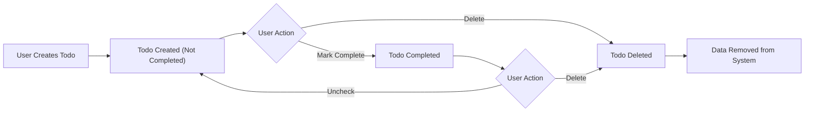
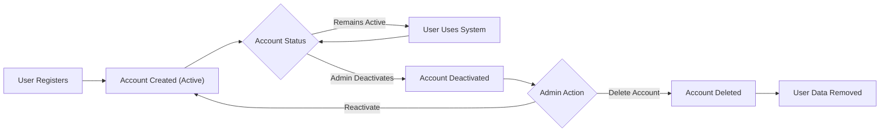
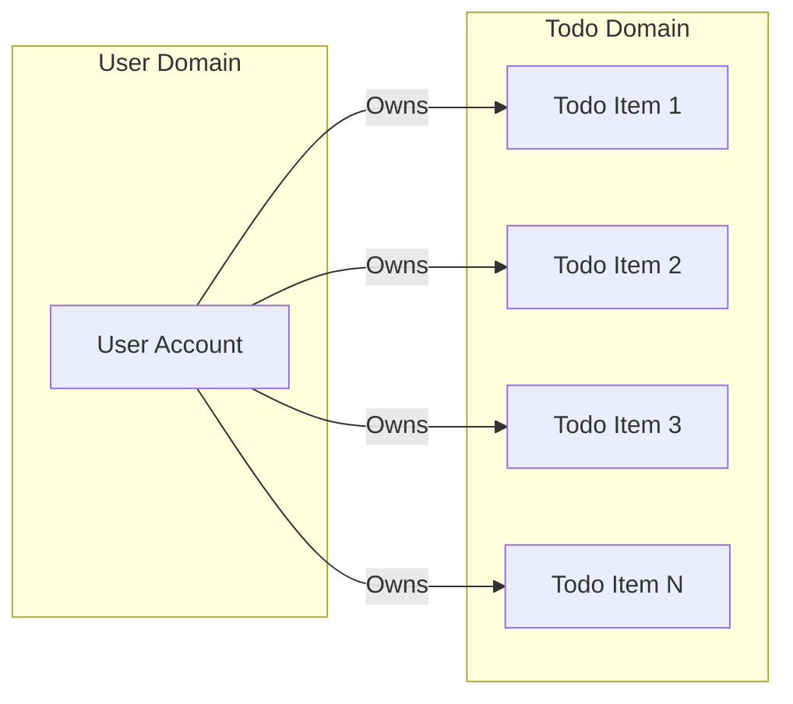
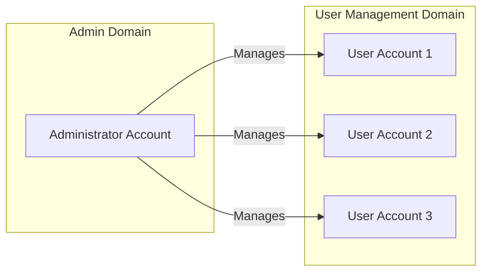

# Data Requirements Specification

## Introduction and Overview

This document defines the complete data requirements for the Todo list application from a business perspective. It specifies what information the system must store, how that data should be validated, the relationships between different data entities, and the lifecycle management rules that govern data operations.

The requirements in this document establish the business foundation for the data layer of the application. While developers have full autonomy over technical implementation details such as database schema design, table structures, indexing strategies, and storage technologies, this document defines **what data must be managed** and **the business rules governing that data**.

This document directly supports the functional requirements defined in the [Functional Requirements Document](./04-functional-requirements.md) and provides the data foundation needed to implement the user scenarios described in the [Core User Scenarios Document](./03-core-user-scenarios.md).

### Document Scope

This document covers:
- All business data that must be stored and managed
- Validation rules for every data attribute
- Business rules governing data operations
- Data relationships and ownership models
- Data lifecycle management from creation to deletion
- Data constraints from a business perspective

This document does NOT specify:
- Database schema designs or table structures
- SQL queries or database implementation details
- Storage technologies or database systems to use
- Indexing strategies or query optimization
- Technical architecture of the data layer

## Todo Item Data Requirements

### Core Todo Item Attributes

The system must store and manage todo items with the following business-critical information:

#### Todo Title

**Business Requirement**: THE system SHALL store a title for each todo item that describes the task.

**Validation Rules**:
- WHEN a user creates or updates a todo item, THE system SHALL require a non-empty title
- THE title SHALL support a minimum length of 1 character
- THE title SHALL support a maximum length of 500 characters
- THE title SHALL accept alphanumeric characters, spaces, and common punctuation marks
- THE title SHALL preserve user-entered formatting including leading/trailing spaces

**Business Justification**: The title is the primary identifier for users to understand what task needs to be completed. Without a title, the todo item has no meaning.

#### Completion Status

**Business Requirement**: THE system SHALL track whether each todo item is completed or not completed.

**Validation Rules**:
- THE completion status SHALL be represented as a binary state (completed/not completed)
- WHEN a todo item is created, THE system SHALL set the initial status to "not completed"
- THE system SHALL allow users to change status from "not completed" to "completed"
- THE system SHALL allow users to change status from "completed" back to "not completed" (uncomplete a task)

**Allowed Values**:
| Status Value | Business Meaning | Initial State |
|--------------|------------------|---------------|
| Not Completed | Task is pending and needs to be done | Yes |
| Completed | Task has been finished | No |

#### Creation Timestamp

**Business Requirement**: THE system SHALL record when each todo item was created.

**Validation Rules**:
- WHEN a user creates a todo item, THE system SHALL automatically capture the creation timestamp
- THE creation timestamp SHALL represent the exact date and time of creation
- THE creation timestamp SHALL be immutable after initial creation
- THE creation timestamp SHALL be stored with timezone information to ensure accuracy across different user locations

**Business Justification**: Creation timestamps allow users to understand when tasks were added and enable chronological ordering of todo items.

#### Completion Timestamp

**Business Requirement**: THE system SHALL record when each todo item was marked as completed.

**Validation Rules**:
- WHEN a user marks a todo item as completed, THE system SHALL automatically capture the completion timestamp
- THE completion timestamp SHALL be null for todo items that are not completed
- WHEN a user uncompletes a todo item, THE system SHALL clear the completion timestamp
- THE completion timestamp SHALL represent the exact date and time when status changed to completed
- THE completion timestamp SHALL be stored with timezone information

**Business Justification**: Completion timestamps provide users with historical information about when tasks were finished, enabling productivity tracking and historical analysis.

#### User Ownership

**Business Requirement**: THE system SHALL associate each todo item with the user who created it.

**Validation Rules**:
- WHEN a user creates a todo item, THE system SHALL automatically assign ownership to that user
- THE ownership SHALL be immutable after creation (todo items cannot be transferred between users)
- THE system SHALL use the ownership information to enforce access control (users can only access their own todos)

**Business Justification**: User ownership is critical for multi-user environments where each user must have an isolated, private todo list.

### Todo Item Business Rules

**BR-TODO-001: Title Required**
- THE system SHALL NOT allow creation of todo items without a valid title
- IF a user attempts to create a todo item with an empty or whitespace-only title, THEN THE system SHALL reject the operation and inform the user that a title is required

**BR-TODO-002: Immutable Ownership**
- THE ownership of a todo item SHALL NOT change after creation
- Todo items belong permanently to the user who created them

**BR-TODO-003: Automatic Timestamps**
- THE system SHALL automatically manage all timestamp fields without user input
- Users cannot manually set or modify timestamps

**BR-TODO-004: Status Transitions**
- THE system SHALL support toggling between completed and not completed states
- There are no restrictions on how many times a todo item status can be changed

**BR-TODO-005: Data Isolation**
- WHEN querying todo items, THE system SHALL return ONLY the todo items owned by the authenticated user
- THE system SHALL NOT allow users to access, view, modify, or delete todo items owned by other users

### Todo Item Constraints and Limits

| Constraint | Requirement | Business Justification |
|------------|-------------|------------------------|
| Maximum title length | 500 characters | Prevents database abuse while allowing detailed task descriptions |
| Minimum title length | 1 character | Ensures every todo has meaningful content |
| Ownership immutability | Cannot be changed | Maintains data integrity and security boundaries |
| User isolation | Users see only their own todos | Privacy and data security requirement |
| Timestamp automation | System-controlled | Ensures data accuracy and prevents user manipulation |

## User Account Data Requirements

### Core User Account Attributes

The system must store and manage user account information with the following business-critical data:

#### User Email Address

**Business Requirement**: THE system SHALL store a unique email address for each user account.

**Validation Rules**:
- WHEN a user registers, THE system SHALL require a valid email address
- THE email address SHALL follow standard email format (local-part@domain)
- THE email address SHALL be unique across all user accounts
- THE email address SHALL be case-insensitive for uniqueness validation (user@example.com equals USER@EXAMPLE.COM)
- THE email address SHALL support a maximum length of 320 characters (per RFC standards)
- THE email address SHALL be stored in lowercase format for consistency

**Business Justification**: Email addresses serve as the unique identifier for user accounts and are used for authentication and user communication.

**Email Format Requirements**:
- Must contain exactly one @ symbol
- Local part (before @) must be 1-64 characters
- Domain part (after @) must be valid domain format
- Must not contain spaces or special characters except allowed email characters (., -, _, +)

#### User Password

**Business Requirement**: THE system SHALL store secure password credentials for each user account.

**Validation Rules**:
- WHEN a user registers or changes password, THE system SHALL require a password meeting security criteria
- THE password SHALL have a minimum length of 8 characters
- THE password SHALL have a maximum length of 128 characters
- THE password SHALL require at least one numeric digit
- THE password SHALL require at least one alphabetic character
- THE system SHALL store passwords in hashed format (NOT plain text)
- THE system SHALL NOT expose original passwords to users or administrators

**Business Justification**: Strong password requirements protect user accounts from unauthorized access while password hashing ensures security even if data is compromised.

#### User Unique Identifier

**Business Requirement**: THE system SHALL assign a unique, immutable identifier to each user account.

**Validation Rules**:
- WHEN a user account is created, THE system SHALL generate a globally unique identifier
- THE identifier SHALL be immutable throughout the account lifecycle
- THE identifier SHALL be used for all internal references and relationships
- THE identifier format SHALL ensure uniqueness across all users

**Business Justification**: Unique identifiers provide stable references for user accounts independent of mutable attributes like email addresses.

#### Account Creation Timestamp

**Business Requirement**: THE system SHALL record when each user account was created.

**Validation Rules**:
- WHEN a user account is created, THE system SHALL automatically capture the creation timestamp
- THE creation timestamp SHALL be immutable after initial creation
- THE creation timestamp SHALL include timezone information

**Business Justification**: Account creation timestamps support administrative functions, user support, and compliance requirements.

#### Account Status

**Business Requirement**: THE system SHALL track the status of each user account.

**Validation Rules**:
- THE account status SHALL indicate whether the account is active or deactivated
- WHEN a user account is created, THE system SHALL set status to "active"
- THE system SHALL prevent login for deactivated accounts
- Administrator actors can change account status

**Allowed Account Status Values**:
| Status Value | Business Meaning | User Can Login |
|--------------|------------------|----------------|
| Active | Account is operational and user can use the system | Yes |
| Deactivated | Account is disabled and user cannot access system | No |

#### User Role

**Business Requirement**: THE system SHALL assign a role to each user account defining their permission level.

**Validation Rules**:
- THE role SHALL be one of the defined system roles (user or admin)
- WHEN a regular user account is created, THE system SHALL assign "user" role
- Administrator accounts SHALL have "admin" role
- THE role SHALL determine what operations the account can perform

**Allowed Role Values**:
| Role Value | Business Meaning | Capabilities |
|------------|------------------|--------------|
| user | Standard user account | Can manage own todo items only |
| admin | Administrator account | Can perform administrative functions and access system management features |

### User Account Business Rules

**BR-USER-001: Email Uniqueness**
- THE system SHALL NOT allow registration of duplicate email addresses
- IF a user attempts to register with an email already in use, THEN THE system SHALL reject the registration and inform the user that the email is already registered

**BR-USER-002: Password Security**
- THE system SHALL enforce password complexity requirements at registration and password change
- IF a user provides a password that doesn't meet requirements, THEN THE system SHALL reject it and explain the requirements

**BR-USER-003: Account Immutability**
- THE user unique identifier SHALL NOT change throughout the account lifecycle
- Account creation timestamp SHALL NOT be modified

**BR-USER-004: Default Role Assignment**
- WHEN a user registers through normal registration flow, THE system SHALL assign "user" role
- Administrator accounts are created through separate administrative processes

**BR-USER-005: Status-Based Access Control**
- WHEN a user attempts to login, THE system SHALL verify account status is "active"
- IF account status is "deactivated", THEN THE system SHALL deny login and inform the user their account is deactivated

**BR-USER-006: Case-Insensitive Email**
- THE system SHALL treat email addresses as case-insensitive for all operations
- User@Example.com, user@example.com, and USER@EXAMPLE.COM SHALL be treated as the same account

## Data Validation Rules

This section consolidates all data validation requirements across the system, providing a comprehensive reference for input validation and data integrity.

### Todo Item Validation Rules Summary

| Data Field | Validation Requirement | Error Condition |
|------------|------------------------|-----------------|
| Title | Required, 1-500 characters | Empty string, null, or exceeds 500 characters |
| Completion Status | Must be valid boolean state | Invalid status value |
| Creation Timestamp | System-generated, required | Missing timestamp |
| Completion Timestamp | Optional, null when not completed | Invalid timestamp format |
| User Ownership | Required, valid user reference | Missing or invalid user reference |

### User Account Validation Rules Summary

| Data Field | Validation Requirement | Error Condition |
|------------|------------------------|-----------------|
| Email | Required, valid email format, unique, max 320 chars | Invalid format, duplicate email, too long |
| Password | Required, 8-128 characters, alphanumeric mix | Too short, too long, insufficient complexity |
| User ID | System-generated, required, unique | Missing or duplicate identifier |
| Account Status | Required, valid status value | Invalid status |
| Role | Required, valid role value | Invalid role |
| Creation Timestamp | System-generated, required | Missing timestamp |

### Input Validation Requirements

**VR-001: Required Field Validation**
- WHEN a user submits data for creation or update, THE system SHALL validate that all required fields are present
- IF any required field is missing, THEN THE system SHALL reject the operation and specify which fields are required

**VR-002: Data Type Validation**
- THE system SHALL validate that each field contains data of the expected type
- IF data type is incorrect, THEN THE system SHALL reject the operation and specify the expected data type

**VR-003: Length Validation**
- THE system SHALL validate that text fields do not exceed maximum length constraints
- THE system SHALL validate that text fields meet minimum length requirements
- IF length constraints are violated, THEN THE system SHALL reject the operation and specify the length requirements

**VR-004: Format Validation**
- THE system SHALL validate that email addresses conform to standard email format
- THE system SHALL validate that timestamps are in valid date-time format
- IF format is invalid, THEN THE system SHALL reject the operation and specify the required format

**VR-005: Uniqueness Validation**
- THE system SHALL validate that email addresses are unique during registration
- IF uniqueness constraint is violated, THEN THE system SHALL reject the operation and inform the user of the duplicate

**VR-006: Business Rule Validation**
- THE system SHALL enforce all business rules during data operations
- IF a business rule is violated, THEN THE system SHALL reject the operation and explain which business rule was violated

### Data Integrity Requirements

**DI-001: Referential Integrity**
- THE system SHALL ensure that all todo items reference valid user accounts
- WHEN a todo item is created, THE system SHALL verify the associated user exists
- THE system SHALL maintain referential integrity between users and their todo items

**DI-002: Status Consistency**
- THE system SHALL maintain consistency between completion status and completion timestamp
- WHEN completion status is "not completed", THE completion timestamp SHALL be null
- WHEN completion status is "completed", THE completion timestamp SHALL have a valid value

**DI-003: Timestamp Ordering**
- THE system SHALL ensure completion timestamp is never earlier than creation timestamp
- IF a data inconsistency is detected, THE system SHALL reject the operation

**DI-004: User Isolation Integrity**
- THE system SHALL enforce data isolation between users
- THE system SHALL prevent any operation that would violate user data ownership boundaries

## Data Lifecycle Management

This section defines how data moves through its lifecycle from creation to deletion, including all state transitions and business rules governing data lifecycle events.

### Todo Item Lifecycle

#### Todo Creation Requirements

**LC-TODO-001: Creation Process**
- WHEN a user creates a todo item, THE system SHALL capture the title provided by the user
- THE system SHALL automatically set completion status to "not completed"
- THE system SHALL automatically capture creation timestamp with current date and time
- THE system SHALL automatically assign ownership to the authenticated user
- THE system SHALL set completion timestamp to null

**LC-TODO-002: Creation Validation**
- WHEN a user attempts to create a todo item, THE system SHALL validate the title meets all validation requirements
- IF validation fails, THEN THE system SHALL reject creation and inform the user of validation errors

#### Todo Update Requirements

**LC-TODO-003: Status Update Process**
- WHEN a user marks a todo item as completed, THE system SHALL change completion status to "completed"
- THE system SHALL automatically capture completion timestamp with current date and time
- WHEN a user marks a todo item as not completed, THE system SHALL change completion status to "not completed"
- THE system SHALL set completion timestamp to null

**LC-TODO-004: Update Authorization**
- WHEN a user attempts to update a todo item, THE system SHALL verify the user is the owner
- IF the user is not the owner, THEN THE system SHALL deny the operation

#### Todo Deletion Requirements

**LC-TODO-005: Deletion Process**
- WHEN a user deletes a todo item, THE system SHALL permanently remove the todo item and all associated data
- THE deletion SHALL be immediate and irreversible
- THE system SHALL NOT maintain deleted todo items in any recoverable form

**LC-TODO-006: Deletion Authorization**
- WHEN a user attempts to delete a todo item, THE system SHALL verify the user is the owner
- IF the user is not the owner, THEN THE system SHALL deny the operation

**LC-TODO-007: Cascade Behavior**
- THE system SHALL define behavior when a user account is deleted
- All todo items owned by a deleted user account should be handled according to data retention policies

### User Account Lifecycle

#### Account Creation Requirements

**LC-USER-001: Registration Process**
- WHEN a user registers, THE system SHALL capture email and password provided by the user
- THE system SHALL validate email uniqueness before creation
- THE system SHALL hash the password before storage
- THE system SHALL generate a unique user identifier
- THE system SHALL set account status to "active"
- THE system SHALL assign role as "user"
- THE system SHALL capture account creation timestamp

**LC-USER-002: Registration Validation**
- WHEN a user attempts to register, THE system SHALL validate all required fields are present
- THE system SHALL validate email format and password complexity
- IF validation fails, THEN THE system SHALL reject registration and explain validation errors

#### Account Status Management Requirements

**LC-USER-003: Deactivation Process**
- WHEN an administrator deactivates a user account, THE system SHALL change account status to "deactivated"
- THE system SHALL prevent login for deactivated accounts
- THE system SHALL preserve all user data including todo items
- Deactivated accounts can be reactivated by administrators

**LC-USER-004: Reactivation Process**
- WHEN an administrator reactivates a user account, THE system SHALL change account status to "active"
- THE user SHALL regain access to all their previous data including todo items
- THE user can immediately login after reactivation

#### Account Deletion Requirements

**LC-USER-005: Account Deletion Process**
- WHEN an administrator deletes a user account, THE system SHALL permanently remove the user account
- THE system SHALL handle associated todo items according to cascade deletion policy
- Account deletion SHALL be permanent and irreversible

**LC-USER-006: Data Cleanup on Deletion**
- WHEN a user account is deleted, THE system SHALL remove all personally identifiable information
- THE system SHALL ensure deleted user data cannot be recovered
- The specific handling of todo items (delete or anonymize) should be defined based on business requirements

### Data Retention Requirements

**DR-001: Active Data Retention**
- THE system SHALL retain all active user accounts and their todo items indefinitely
- Users maintain access to their complete todo history

**DR-002: Deleted Data Handling**
- WHEN data is deleted, THE system SHALL remove it immediately and permanently
- THE system SHALL NOT maintain soft-deleted or archived copies of user-deleted data

**DR-003: Deactivated Account Data**
- WHEN a user account is deactivated, THE system SHALL retain all account data and todo items
- Deactivated account data SHALL be preserved to support reactivation

## Data Relationships

This section defines how different data entities relate to each other from a business perspective, including ownership models, access control relationships, and data dependencies.

### User-to-Todo Relationship

**Relationship Description**: Each user account owns zero or more todo items. Each todo item is owned by exactly one user account.

#### Ownership Business Rules

**REL-001: One-to-Many Ownership**
- THE system SHALL support a one-to-many relationship between users and todo items
- A user can own zero, one, or many todo items
- A todo item must be owned by exactly one user

**REL-002: Ownership Assignment**
- WHEN a todo item is created, THE system SHALL automatically assign ownership to the authenticated user who created it
- THE ownership SHALL be immutable throughout the todo item lifecycle

**REL-003: Ownership-Based Access Control**
- THE system SHALL enforce that users can ONLY access todo items they own
- WHEN a user requests todo items, THE system SHALL return ONLY their owned items
- WHEN a user attempts to modify or delete a todo item, THE system SHALL verify ownership before allowing the operation

**REL-004: Cross-User Access Prevention**
- THE system SHALL prevent users from viewing todo items owned by other users
- THE system SHALL prevent users from modifying todo items owned by other users
- THE system SHALL prevent users from deleting todo items owned by other users
- IF a user attempts unauthorized access, THEN THE system SHALL deny the operation and inform the user they don't have permission

### Administrator-to-User Relationship

**Relationship Description**: Administrator accounts have management authority over user accounts but follow specific access rules for user data.

#### Administrative Access Rules

**REL-005: Administrative User Management**
- Administrator accounts SHALL have authority to view user account information
- Administrator accounts SHALL have authority to deactivate user accounts
- Administrator accounts SHALL have authority to reactivate user accounts
- Administrator accounts SHALL have authority to delete user accounts

**REL-006: Administrative Todo Access**
- Administrator accounts MAY have limited access to user todo items for support purposes
- The specific scope of administrative todo access should be defined based on privacy requirements
- Administrative access to todos should be logged and auditable

### Data Dependency Rules

**DEP-001: User Account Dependency**
- Todo items depend on user accounts existing
- THE system SHALL NOT allow creation of todo items without a valid user account
- THE system SHALL enforce referential integrity between todo items and user accounts

**DEP-002: Authentication Dependency**
- All data operations require authenticated user context
- THE system SHALL verify user authentication before any data operation
- THE system SHALL use authentication context to determine data access permissions

**DEP-003: Status-Timestamp Dependency**
- Completion timestamp depends on completion status
- WHEN completion status is "not completed", THE completion timestamp SHALL be null
- WHEN completion status is "completed", THE completion timestamp SHALL have a valid value

## Data Constraints and Business Rules

This section consolidates all data constraints from a business perspective, including required versus optional data, uniqueness requirements, and dependencies.

### Required Data Fields

The following data fields are absolutely required and cannot be null or empty:

**Todo Item Required Fields**:
| Field | Requirement | Rationale |
|-------|-------------|-----------|
| Title | Must be 1-500 characters | Todo items without titles have no meaning |
| Completion Status | Must be valid boolean state | System must know if task is complete or not |
| Creation Timestamp | Must be valid timestamp | Provides chronological context |
| User Ownership | Must reference valid user | Enforces data isolation and security |

**User Account Required Fields**:
| Field | Requirement | Rationale |
|-------|-------------|-----------|
| Email | Must be valid, unique email | Primary user identifier for authentication |
| Password | Must meet complexity requirements | Security requirement for account protection |
| User ID | Must be unique identifier | System-level user reference |
| Account Status | Must be valid status value | Controls account access |
| Role | Must be valid role value | Determines user permissions |
| Creation Timestamp | Must be valid timestamp | Account lifecycle tracking |

### Optional Data Fields

The following data fields may be null or absent under certain conditions:

**Todo Item Optional Fields**:
| Field | Optional Condition | Business Rule |
|-------|-------------------|---------------|
| Completion Timestamp | When status is "not completed" | Only populated when todo is marked complete |

**Note**: The minimal data model means very few fields are optional. Most data is required for proper system operation.

### Data Uniqueness Requirements

**UNIQUE-001: Email Uniqueness**
- Email addresses SHALL be unique across all user accounts
- THE system SHALL enforce email uniqueness at account creation and email change operations
- Email uniqueness SHALL be case-insensitive (john@example.com equals JOHN@EXAMPLE.COM)

**UNIQUE-002: User ID Uniqueness**
- User identifiers SHALL be globally unique across all user accounts
- THE system SHALL ensure no two users can have the same identifier

**UNIQUE-003: Todo Item Uniqueness**
- Todo items do NOT have uniqueness constraints on title (users can create multiple todos with same title)
- Todo item identifiers SHALL be unique within the scope of all todo items

### Data Performance Constraints

**PERF-001: Response Time for Data Operations**
- WHEN a user creates a todo item, THE system SHALL complete the operation and respond within 2 seconds
- WHEN a user retrieves their todo list, THE system SHALL return results within 2 seconds
- WHEN a user updates a todo item, THE system SHALL complete the operation within 2 seconds
- WHEN a user deletes a todo item, THE system SHALL complete the operation within 2 seconds

**PERF-002: Data Volume Support**
- THE system SHALL support each user having up to 10,000 todo items without performance degradation
- THE system SHALL support up to 100,000 total user accounts without performance degradation

**PERF-003: Concurrent Access**
- THE system SHALL support multiple users accessing their own data concurrently without data corruption
- THE system SHALL ensure data consistency when users perform simultaneous operations on their own todo items

### Business Rule Constraints

**BRC-001: Title Content Rules**
- Todo titles can contain any printable characters including special characters and emojis
- Todo titles SHALL preserve original user input including spacing and formatting
- THE system SHALL NOT automatically modify or sanitize title content beyond basic security validation

**BRC-002: Password Security Rules**
- Passwords SHALL be hashed before storage using industry-standard hashing algorithms
- THE system SHALL NEVER store or transmit passwords in plain text
- THE system SHALL NOT display password hints or partial passwords to users or administrators

**BRC-003: Data Isolation Rules**
- User data SHALL be completely isolated from other users
- THE system SHALL enforce strict data access boundaries based on user ownership
- No user can access, view, modify, or delete data owned by another user
- Administrators may have special access rules defined separately

**BRC-004: Timestamp Accuracy**
- All timestamps SHALL reflect the actual system time when the event occurred
- THE system SHALL use consistent timezone handling across all timestamps
- Users cannot manually set or modify system-managed timestamps

**BRC-005: Status Transition Rules**
- Todo items can transition from "not completed" to "completed" any number of times
- Todo items can transition from "completed" to "not completed" any number of times
- There are no restrictions on status change frequency or patterns

### Data Consistency Requirements

**CONS-001: Atomic Operations**
- Data creation, update, and deletion operations SHALL be atomic
- IF any part of a data operation fails, THEN THE system SHALL roll back all changes
- THE system SHALL NOT leave data in inconsistent states

**CONS-002: Relationship Consistency**
- THE system SHALL maintain consistent relationships between users and todo items
- THE system SHALL prevent orphaned todo items (todos without valid user owners)
- THE system SHALL enforce referential integrity at all times

**CONS-003: Status-Timestamp Consistency**
- THE system SHALL maintain consistency between completion status and completion timestamp
- WHEN status changes, THE corresponding timestamp SHALL be updated immediately
- THE system SHALL prevent status and timestamp from becoming inconsistent

## Data Access Patterns

This section describes common data access patterns from a business perspective to ensure the system can efficiently support typical usage scenarios.

### User Authentication Data Access

**ACCESS-001: Login Verification**
- WHEN a user attempts to login, THE system SHALL retrieve user account data by email address
- THE system SHALL verify the provided password against stored hashed password
- THE system SHALL check account status to determine if login is allowed
- This operation should complete within 1 second

### Todo List Retrieval Patterns

**ACCESS-002: User Todo List Retrieval**
- WHEN a user requests their todo list, THE system SHALL retrieve all todo items owned by that user
- THE system SHALL order results by creation timestamp (newest first) by default
- THE system SHALL include all todo item attributes in the response
- This operation should complete within 2 seconds even for users with thousands of todos

**ACCESS-003: Completed vs Incomplete Filtering**
- Users may want to view only completed todos or only incomplete todos
- THE system SHALL support filtering todo lists by completion status
- Filtered results should maintain chronological ordering

### Todo Item Individual Operations

**ACCESS-004: Single Todo Retrieval**
- WHEN a user requests a specific todo item, THE system SHALL retrieve that todo by its unique identifier
- THE system SHALL verify the requesting user is the owner before returning data
- This operation should complete within 1 second

**ACCESS-005: Todo Status Update**
- WHEN a user changes todo completion status, THE system SHALL update both status and timestamp fields
- THE system SHALL verify ownership before allowing the update
- This operation should complete within 2 seconds

**ACCESS-006: Todo Deletion**
- WHEN a user deletes a todo item, THE system SHALL remove the todo data permanently
- THE system SHALL verify ownership before allowing deletion
- This operation should complete within 2 seconds

### Administrative Access Patterns

**ACCESS-007: User Account Management**
- WHEN an administrator views user accounts, THE system SHALL retrieve user account information
- THE system SHALL NOT include password hashes in administrative views
- THE system MAY include summary statistics such as todo item counts

**ACCESS-008: Account Status Changes**
- WHEN an administrator changes account status, THE system SHALL update the status field immediately
- THE system SHALL log administrative actions for audit purposes

## Summary and Implementation Guidance

This document has defined all business data requirements for the Todo list application. The key data entities are:

1. **Todo Items**: User tasks with title, completion status, timestamps, and ownership
2. **User Accounts**: User credentials, profile information, and account management data

### Critical Data Requirements Summary

**Todo Item Data**:
- Title (1-500 characters, required)
- Completion Status (boolean, required, defaults to not completed)
- Creation Timestamp (automatic, required, immutable)
- Completion Timestamp (automatic, nullable, depends on status)
- User Ownership (required, immutable, references user account)

**User Account Data**:
- Email (unique, required, max 320 characters, case-insensitive)
- Password (hashed, 8-128 characters, complexity required)
- User ID (unique, system-generated, immutable)
- Account Status (active/deactivated, required)
- Role (user/admin, required)
- Creation Timestamp (automatic, required, immutable)

### Key Business Rules

1. **User Isolation**: Each user's data is completely isolated from other users
2. **Ownership Immutability**: Todo items cannot be transferred between users
3. **Automatic Timestamps**: All timestamps are system-managed and cannot be manipulated by users
4. **Email Uniqueness**: Each email can only be associated with one account (case-insensitive)
5. **Status-Timestamp Consistency**: Completion timestamp is null when not completed, populated when completed
6. **Password Security**: Passwords must be hashed and never stored or transmitted in plain text

### Data Validation Priorities

The highest priority validations that must be enforced:
1. Email format and uniqueness validation
2. Password complexity validation
3. Title presence and length validation
4. User ownership verification for all todo operations
5. Account status verification for authentication

### Performance Expectations

- All data operations should respond within 2 seconds
- System should support 10,000 todos per user
- System should support 100,000 total user accounts
- Concurrent user access should not cause data corruption

### Implementation Notes

Backend developers have full autonomy to implement the data layer using appropriate:
- Database systems (SQL, NoSQL, etc.)
- Schema designs and table structures
- Indexing strategies for performance
- Query optimization techniques
- Caching strategies
- Storage technologies

The requirements in this document define **what** data must be managed and **the business rules** governing that data, while leaving **how** to implement it to the development team's expertise.

> *Developer Note: This document defines **business data requirements only**. All technical implementation decisions (database selection, schema design, indexing, storage architecture, etc.) are at the discretion of the development team.*