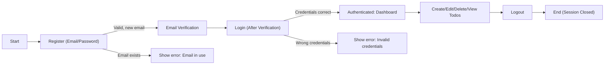
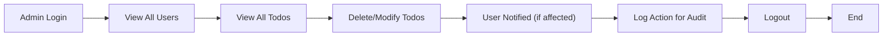
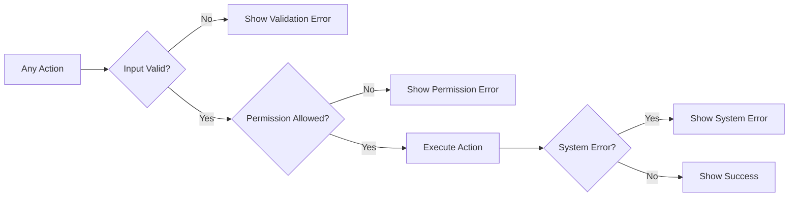

# Todo List Application: User Flows and Business Requirements

## Business States and Actors
- **Unauthenticated Visitor:** No login session; has access only to registration and login forms, no Todo data visible.
- **Authenticated User:** Logged-in standard user; can manage their own Todos.
- **Admin:** Logged-in administrator; can view and manage all users/Todos for operational needs, with audit logging for actions.

---

## 1. User Registration and Authentication

### Registration (Sign Up)
- WHEN a person provides a new (unused) email and a secure password THEN THE system SHALL create a new user account and send an email verification link.
- WHEN the submitted email already exists THEN THE system SHALL return an error stating the email is already registered.
- WHEN registration succeeds THEN THE user SHALL be required to verify their email address before gaining login access.

### Email Verification
- WHEN a user follows the email verification process THEN THE system SHALL activate full feature access for that account.
- WHEN email verification is incomplete THEN THE system SHALL restrict all access to authenticated endpoints and inform the user.

### Login
- WHEN a verified user submits correct credentials THEN THE system SHALL log them in and issue a session or JWT token.
- WHEN login credentials are incorrect THEN THE system SHALL show an authentication error and suggest password recovery if failed more than once.

### Logout
- WHEN an authenticated user requests logout THEN THE system SHALL immediately invalidate the session/JWT and present the login form.

---

## 2. Core Todo Flows (User Perspective)

### Create Todo
- WHEN an authenticated user submits valid, non-empty text for a new Todo THEN THE system SHALL create a Todo item assigned to that user.
- WHEN input is empty or invalid THEN THE system SHALL return a validation error specifying correction steps.

### View Todos
- WHEN an authenticated user requests their Todo list THEN THE system SHALL return only their own Todos (active and completed), ordered by most recent update.

### Edit Todo
- WHEN a user edits their own Todo with valid data THEN THE system SHALL update the item and confirm the change.
- WHEN invalid data is provided or the Todo is not found THEN THE system SHALL return an error with actionable details.

### Delete Todo
- WHEN a user deletes their own Todo THEN THE system SHALL remove it from the visible list but retain audit info for compliance where relevant.
- WHEN removing a nonexistent or unowned Todo THEN THE system SHALL return a permission error.

### Mark/Unmark Complete
- WHEN a user marks a Todo as complete THEN THE system SHALL update the status and completion time and leave it visible to the user.
- WHEN attempting to change a Todo already marked as complete THEN THE system SHALL block duplicate action and show a clarifying message.

### Filter Completed Todos
- WHEN filtering for completed Todos THEN THE system SHALL return only tasks marked complete, belonging to the user.

---

## 3. Administrative Flows

### View/Manage Users & Todos
- WHEN an admin accesses management views THEN THE system SHALL display all users and all Todos for audit and operational review.

### Moderation & Audit
- WHEN deleting or editing any Todo as admin THEN THE action SHALL be logged for audit, and if user data is affected, the user SHALL be notified appropriately.

### Manage User Accounts
- WHEN disabling a user account THEN THE system SHALL prevent login and Todo access for that user until explicitly re-enabled.
- WHEN resetting a user's password as admin THEN THE system SHALL initiate a secure reset process and email the affected user.

---

## 4. Error and Exception Handling

### User Errors
- WHEN a login fails due to bad credentials THEN THE system SHALL show an authentication error and allow password recovery.
- WHEN registration uses an existing email THEN THE system SHALL prompt login instead.
- WHEN trying to access another user’s Todo THEN THE system SHALL deny with a clear forbidden message.
- WHEN invalid Todo data is submitted THEN THE system SHALL return a validation error with specific correction guidance.

### System or Edge Errors
- WHEN an internal error or downtime is encountered THEN THE system SHALL display an error and guidance to try later.
- WHEN a session/JWT expires THEN THE system SHALL require re-authentication before any further operation.
- WHEN a forbidden action is attempted THEN THE system SHALL show a permission-denied message referencing role limitations.

### Admin Edge Cases
- WHEN an admin attempts an unsupported action THEN THE system SHALL inform them with specific error messages and refer to technical support if necessary.
- WHEN admin privileges are downgraded THEN THE user experience SHALL immediately reflect new access levels.

---

## 5. Visual User and Admin Flows (Mermaid)

### User Registration, Login, Todo CRUD

### Admin Management Flow

### Error and Exception Flow

---

## 6. Key Flow Summary Table

| Flow                  | Actor      | Key Steps                                | Error Handling                                |
|-----------------------|------------|------------------------------------------|------------------------------------------------|
| Register/Login        | User       | Register → Verify → Login → Access       | Email in use, invalid credentials, unverified  |
| Todo Management       | User       | Create/Edit/Delete/Complete/Filter/View  | Validation error, permission error, not found  |
| Admin User Manage     | Admin      | Login → List Users → Edit/Disable/Reset  | Forbidden, not found, audit required          |
| Admin Todo Moderation | Admin      | List Todos → Edit/Delete                 | Audit submission, notification error           |

---

## 7. Developer Guidance and Caveats
- Requirements are expressed in EARS format and strictly business-contextual.
- No implementation, architectural, database, or API details appear in this file.
- Permissions/enforcement aligns with role-based actor definition: regular users manage only their data, admins observe global scope with logged actions.
- All requirements are designed for back-end developer clarity, testability, and completeness.
- Authentication and access control details are fully specified for business processes only, omitting all implementation suggestions.
