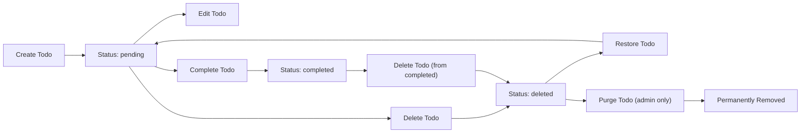
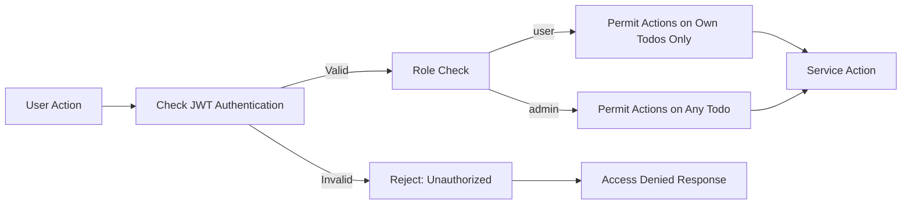
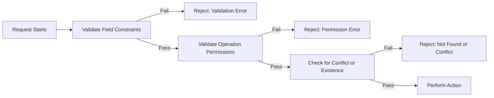

# Todo List Application – Business and Validation Requirements

## 1. Introduction
The Todo List Application enables users to manage daily tasks with clear business rules ensuring ease of use, data integrity, user privacy, and secure operations. These requirements define all allowed operations, constraints, permissions, workflows, error scenarios, and security behaviors, focused on minimum-viable, production-ready functionality.

## 2. Todo Validation Rules
### 2.1 Core Field Constraints (EARS)
- THE Todo item SHALL require a non-empty title, limited to 100 characters maximum.
- THE Todo item SHALL allow an optional description field, limited to 500 characters maximum.
- THE Todo item SHALL allow a status field which MUST be one of: "pending", "completed", or "deleted"; all other values SHALL be rejected.
- THE application SHALL assign a unique identifier and creation timestamp (ISO8601) to every Todo on creation.
- THE application SHALL update the last modified timestamp (ISO8601) upon any change to a Todo.

### 2.2 Business Validation for Operations (EARS)
- WHEN a Todo is created, THE system SHALL ensure the title is present and valid before proceeding.
- WHEN a Todo is edited, THE system SHALL only allow changes to the title, description, or marking the status as "completed".
- WHEN a Todo is marked as "deleted", THE system SHALL perform a soft-delete, preserving data but preventing user access or modification (except for restore or admin purge).
- WHEN a Todo is restored from "deleted", THE system SHALL set its status to "pending" and clear the completion timestamp if present.
- WHEN a Todo is marked as "completed", THE system SHALL record the completion timestamp.
- IF a Todo is deleted, THEN further modifications SHALL only be permitted for restoration or, if performed by admin, permanent purge.

### 2.3 Metadata and Data Integrity Rules (EARS)
- THE system SHALL ensure each Todo belongs to exactly one user and is invisible to all other users except admins.
- THE system SHALL log creation, modification, completion, deletion, and restoration events for each Todo for audit and troubleshooting.
- WHEN importing or syncing data, THE system SHALL reject duplicate Todo identifiers.

### 2.4 Allowed Value Constraints
- THE system SHALL trim leading/trailing whitespace from title and description before use or storage.
- THE status field SHALL strictly accept only the three allowed values; all others SHALL be rejected.
- THE system SHALL reject creation or update requests if values exceed specified length limits.

## 3. User Operation Constraints
### 3.1 User Role-Based Permissions (EARS)
| Action                         | user | admin |
|--------------------------------|------|-------|
| Create own Todo                | ✅   | ✅    |
| View own Todos                 | ✅   | ✅    |
| Update own Todos               | ✅   | ✅    |
| Complete own Todos             | ✅   | ✅    |
| Delete own Todos               | ✅   | ✅    |
| Restore own deleted Todos      | ✅   | ✅    |
| View all users' Todos          | ❌   | ✅    |
| Update others' Todos           | ❌   | ✅    |
| Delete others' Todos           | ❌   | ✅    |
| Audit all system actions       | ❌   | ✅    |

- THE user SHALL only be permitted to perform actions (create, view, update, complete, delete, restore) on their own Todos.
- WHEN the actor is an admin, THE system SHALL permit that actor to view, update, delete, restore, or audit any user's Todos.
- IF a user attempts to access or act on a Todo they do not own, THEN THE system SHALL deny the action and log an access violation event.

### 3.2 Operation Limits and Edge Cases
- THE system SHALL prevent more than 100 active (non-deleted) Todos per user account.
- IF a user attempts to exceed this limit, THEN THE system SHALL return a clear error message and disallow the creation.
- THE system SHALL allow up to 20 Todos to be completed or deleted in one request (bulk operation).
- THE system SHALL reject any operation referencing a non-existent or already-deleted Todo with an appropriate error message.

### 3.3 Concurrency and Ownership Rules
- WHILE a user has multiple sessions or devices, THE system SHALL prevent conflicting changes via atomic operations.
- IF two simultaneous edits collide, THEN THE system SHALL accept the first write and reject subsequent ones, returning an error for concurrent modification.

## 4. Access and Security Rules
### 4.1 Data Access Boundaries (EARS)
- THE user SHALL never have access to any other user's data.
- WHEN the actor is an admin, THE system SHALL allow that actor access to any Todo for support, moderation, or auditing.
- WHEN a user account is deactivated or deleted, THE system SHALL mark that user's Todos as "orphaned" and restrict future access to admin actors only.
- THE system SHALL never expose internal system metadata (IDs, logs, audit trails) to non-admin users.

### 4.2 Security Enforcement (EARS)
- THE system SHALL enforce all API or UI access controls by requiring authentication via JWT tokens, validated on every request.
- WHEN a request is made, THE system SHALL verify the user's identity and role from the token before allowing any operation.
- WHEN authentication is missing, expired, or invalid, THE system SHALL reject the request and require user login.
- THE system SHALL rate-limit API mutation calls to a maximum of 10 write operations per minute per user.

## 5. Mermaid Diagrams
### 5.1 Todo State Lifecycle

### 5.2 Access Control Flow

### 5.3 Operation Error Handling

## 6. Conclusion
All backend and user-facing logic for the Todo List Application MUST strictly follow these business rules and process requirements. No deviation is acceptable except where business priorities are formally updated and re-approved. Every step – creation, update, completion, deletion, restoration, and access – is controlled by clear, objective, and audit-ready rules to protect user privacy, data security, and operational integrity. These requirements form the single source of business truth for all future system implementation and testing of the Todo List Application.
