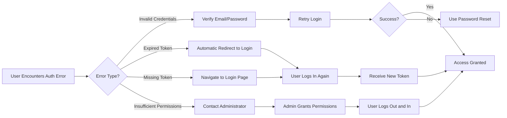
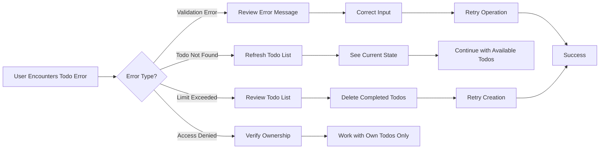
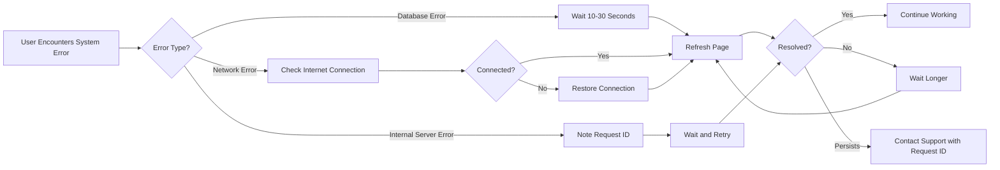
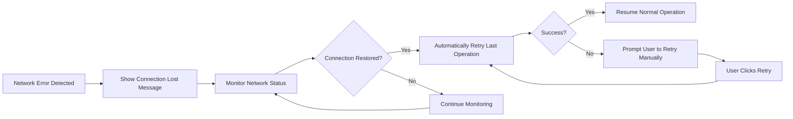

# Error Handling and Edge Cases

## Document Overview

This document defines comprehensive error handling requirements and edge case scenarios for the Todo list application from the user's perspective. Error handling is a critical aspect of user experience - when things go wrong, users need clear feedback and obvious paths to recovery.

### Error Handling Philosophy

The Todo list application follows these error handling principles:

- **User-Friendly Messages**: All error messages must be written in plain language that non-technical users can understand
- **Actionable Guidance**: Error messages should tell users what to do next, not just what went wrong
- **Graceful Degradation**: When errors occur, the system maintains stability and preserves user data
- **Immediate Feedback**: Users receive error feedback instantly, within 1-2 seconds of the triggering action
- **Consistent Format**: All errors follow a standardized response structure for predictable handling
- **Security Awareness**: Error messages never expose sensitive system information or security vulnerabilities

### Error Categories

This document organizes errors into six major categories:

1. **Authentication and Authorization Errors** - Login, registration, token, and permission failures
2. **Todo Operation Errors** - Failures specific to todo management operations
3. **Data Validation Errors** - Input validation and data constraint violations
4. **System and Technical Errors** - Server failures, database issues, infrastructure problems
5. **Edge Case Scenarios** - Unusual but valid situations requiring special handling
6. **Concurrent Operation Conflicts** - Race conditions and simultaneous user actions

## Authentication and Authorization Errors

### User Registration Errors

#### Duplicate Email Error

**WHEN** a user attempts to register with an email address that already exists in the system, **THE** system **SHALL** reject the registration and display error message "This email address is already registered. Please use a different email or try logging in."

- **Error Code**: `AUTH_EMAIL_ALREADY_EXISTS`
- **HTTP Status**: 409 Conflict
- **Recovery Process**: User should try logging in with existing credentials or use password reset if they forgot their password

#### Invalid Email Format Error

**WHEN** a user submits a registration form with an email that doesn't match valid email format, **THE** system **SHALL** reject the registration and display error message "Please enter a valid email address (e.g., user@example.com)."

- **Error Code**: `VALIDATION_INVALID_EMAIL_FORMAT`
- **HTTP Status**: 400 Bad Request
- **Recovery Process**: User should correct the email format and resubmit

#### Weak Password Error

**WHEN** a user attempts to register with a password shorter than 8 characters, **THE** system **SHALL** reject the registration and display error message "Password must be at least 8 characters long."

- **Error Code**: `VALIDATION_PASSWORD_TOO_SHORT`
- **HTTP Status**: 400 Bad Request
- **Recovery Process**: User should create a stronger password meeting minimum requirements

#### Empty Name Field Error

**WHEN** a user submits registration without providing a name, **THE** system **SHALL** reject the registration and display error message "Please enter your name."

- **Error Code**: `VALIDATION_NAME_REQUIRED`
- **HTTP Status**: 400 Bad Request
- **Recovery Process**: User should fill in the name field and resubmit

### User Login Errors

#### Invalid Credentials Error

**WHEN** a user attempts to log in with incorrect email or password, **THE** system **SHALL** reject the login and display error message "Invalid email or password. Please try again."

- **Error Code**: `AUTH_INVALID_CREDENTIALS`
- **HTTP Status**: 401 Unauthorized
- **Recovery Process**: User should verify credentials and retry, or use password reset feature
- **Security Note**: Message intentionally does not specify whether email or password was incorrect

#### Account Not Found Error

**WHEN** a user attempts to log in with an email that doesn't exist in the system, **THE** system **SHALL** reject the login and display error message "Invalid email or password. Please try again."

- **Error Code**: `AUTH_INVALID_CREDENTIALS`
- **HTTP Status**: 401 Unauthorized
- **Recovery Process**: User should verify email address or register for a new account
- **Security Note**: Same generic message as invalid password to prevent email enumeration attacks

#### Missing Login Credentials Error

**WHEN** a user submits login form without email or password, **THE** system **SHALL** reject the login and display error message "Please enter both email and password."

- **Error Code**: `VALIDATION_MISSING_CREDENTIALS`
- **HTTP Status**: 400 Bad Request
- **Recovery Process**: User should fill in all required fields

### Session and Token Errors

#### Expired Token Error

**WHEN** a user attempts to access the system with an expired JWT token, **THE** system **SHALL** reject the request and display error message "Your session has expired. Please log in again."

- **Error Code**: `AUTH_TOKEN_EXPIRED`
- **HTTP Status**: 401 Unauthorized
- **Recovery Process**: User should log in again to obtain a new token
- **User Experience**: System should automatically redirect to login page

#### Invalid Token Error

**WHEN** a user attempts to access the system with a malformed or tampered JWT token, **THE** system **SHALL** reject the request and display error message "Invalid authentication. Please log in again."

- **Error Code**: `AUTH_TOKEN_INVALID`
- **HTTP Status**: 401 Unauthorized
- **Recovery Process**: User should log in again
- **Security Note**: System should log this event as potential security incident

#### Missing Token Error

**WHEN** a user attempts to access protected resources without providing an authentication token, **THE** system **SHALL** reject the request and display error message "Please log in to access this feature."

- **Error Code**: `AUTH_TOKEN_MISSING`
- **HTTP Status**: 401 Unauthorized
- **Recovery Process**: User should navigate to login page and authenticate

### Authorization Errors

#### Insufficient Permissions Error

**WHEN** a regular user attempts to access admin-only features, **THE** system **SHALL** reject the request and display error message "You don't have permission to perform this action."

- **Error Code**: `AUTH_INSUFFICIENT_PERMISSIONS`
- **HTTP Status**: 403 Forbidden
- **Recovery Process**: User should contact administrator if they believe they should have access

#### Access to Other User's Todos Error

**WHEN** a user attempts to view, modify, or delete another user's todo items, **THE** system **SHALL** reject the request and display error message "You can only access your own todo items."

- **Error Code**: `AUTH_ACCESS_DENIED`
- **HTTP Status**: 403 Forbidden
- **Recovery Process**: User should only work with their own todos
- **Security Note**: This should never happen in normal UI flow; indicates potential security probe

## Todo Operation Errors

### Create Todo Errors

#### Empty Todo Title Error

**WHEN** a user attempts to create a todo without providing a title, **THE** system **SHALL** reject the creation and display error message "Please enter a title for your todo item."

- **Error Code**: `VALIDATION_TODO_TITLE_REQUIRED`
- **HTTP Status**: 400 Bad Request
- **Recovery Process**: User should enter a title and retry

#### Todo Title Too Long Error

**WHEN** a user attempts to create a todo with a title exceeding 200 characters, **THE** system **SHALL** reject the creation and display error message "Todo title must be 200 characters or less. Current length: {actual_length} characters."

- **Error Code**: `VALIDATION_TODO_TITLE_TOO_LONG`
- **HTTP Status**: 400 Bad Request
- **Recovery Process**: User should shorten the title to meet length requirement
- **User Experience**: Show character counter in real-time as user types

#### Todo Title Only Whitespace Error

**WHEN** a user attempts to create a todo with a title containing only whitespace characters, **THE** system **SHALL** reject the creation and display error message "Todo title cannot be empty or contain only spaces."

- **Error Code**: `VALIDATION_TODO_TITLE_INVALID`
- **HTTP Status**: 400 Bad Request
- **Recovery Process**: User should enter meaningful text for the title

#### Maximum Todo Limit Reached Error

**WHEN** a user attempts to create a todo but has already reached the maximum limit of 1,000 active todos, **THE** system **SHALL** reject the creation and display error message "You've reached the maximum limit of 1,000 todos. Please delete some completed todos before creating new ones."

- **Error Code**: `TODO_LIMIT_EXCEEDED`
- **HTTP Status**: 429 Too Many Requests
- **Recovery Process**: User should delete completed or unnecessary todos to free up space

### View Todos Errors

#### No Todos Found Scenario

**WHEN** a user views their todo list and has no todos created yet, **THE** system **SHALL** display a helpful message "You don't have any todos yet. Create your first todo to get started!"

- **Error Code**: None (not an error, informational message)
- **HTTP Status**: 200 OK with empty array
- **User Experience**: This is a valid empty state, not an error condition

#### Database Connection Error During Retrieval

**IF** the database connection fails **WHEN** a user attempts to view their todos, **THEN** **THE** system **SHALL** display error message "Unable to load your todos right now. Please try again in a moment."

- **Error Code**: `SYSTEM_DATABASE_ERROR`
- **HTTP Status**: 503 Service Unavailable
- **Recovery Process**: User should wait a moment and refresh the page
- **System Behavior**: Automatically retry connection in background

### Complete Todo Errors

#### Todo Not Found Error

**WHEN** a user attempts to mark a todo as complete but the todo no longer exists, **THE** system **SHALL** reject the request and display error message "This todo item no longer exists. It may have been deleted."

- **Error Code**: `TODO_NOT_FOUND`
- **HTTP Status**: 404 Not Found
- **Recovery Process**: User should refresh their todo list to see current state

#### Todo Already Completed Error

**WHEN** a user attempts to mark a todo as complete but it's already marked as complete, **THE** system **SHALL** accept the request (idempotent operation) and display success message "Todo is already marked as complete."

- **Error Code**: None (successful idempotent operation)
- **HTTP Status**: 200 OK
- **User Experience**: No visual change needed; maintains data consistency

#### Invalid Todo ID Format Error

**WHEN** a user attempts to complete a todo with an invalid ID format, **THE** system **SHALL** reject the request and display error message "Invalid todo identifier. Please try again."

- **Error Code**: `VALIDATION_INVALID_TODO_ID`
- **HTTP Status**: 400 Bad Request
- **Recovery Process**: User should refresh the page to get valid todo IDs

### Delete Todo Errors

#### Todo Not Found During Deletion

**WHEN** a user attempts to delete a todo that doesn't exist, **THE** system **SHALL** accept the request (idempotent operation) and display message "Todo item removed."

- **Error Code**: None (successful idempotent operation)
- **HTTP Status**: 200 OK
- **User Experience**: Deletion is idempotent - same result whether todo exists or not

#### Cannot Delete Other User's Todo

**WHEN** a user attempts to delete a todo that belongs to another user, **THE** system **SHALL** reject the request and display error message "You can only delete your own todo items."

- **Error Code**: `AUTH_ACCESS_DENIED`
- **HTTP Status**: 403 Forbidden
- **Recovery Process**: User should only delete their own todos
- **Security Note**: Should never happen in normal UI; indicates security issue

## Data Validation Errors

### General Validation Errors

#### Malformed JSON Request Error

**WHEN** a user submits a request with malformed JSON data, **THE** system **SHALL** reject the request and display error message "Invalid request format. Please try again."

- **Error Code**: `VALIDATION_MALFORMED_REQUEST`
- **HTTP Status**: 400 Bad Request
- **Recovery Process**: User should retry the operation; may indicate client-side bug

#### Missing Required Fields Error

**WHEN** a user submits a request missing required fields, **THE** system **SHALL** reject the request and display error message "Required fields are missing: {field_names}."

- **Error Code**: `VALIDATION_MISSING_FIELDS`
- **HTTP Status**: 400 Bad Request
- **Recovery Process**: User should fill in all required fields listed in the error message

#### Invalid Data Type Error

**WHEN** a user submits data with incorrect types (e.g., string where number expected), **THE** system **SHALL** reject the request and display error message "Invalid data format for field: {field_name}. Expected {expected_type}."

- **Error Code**: `VALIDATION_INVALID_DATA_TYPE`
- **HTTP Status**: 400 Bad Request
- **Recovery Process**: User should correct the data format and retry

### Field-Specific Validation Errors

#### Email Validation Errors

**THE** system **SHALL** validate email addresses using standard RFC 5322 format and reject emails that:
- Don't contain @ symbol
- Have multiple @ symbols
- Have invalid characters
- Exceed 254 characters total length
- Have domain part exceeding 253 characters
- Have local part exceeding 64 characters

Error Message: "Please enter a valid email address in format: user@example.com"

#### Name Validation Errors

**THE** system **SHALL** validate user names and reject names that:
- Are empty or contain only whitespace
- Exceed 100 characters in length
- Contain special characters that could indicate code injection attempts

Error Messages:
- "Please enter your name" (if empty)
- "Name must be 100 characters or less" (if too long)
- "Name contains invalid characters" (if special characters detected)

#### Password Validation Errors

**THE** system **SHALL** validate passwords and reject passwords that:
- Are shorter than 8 characters
- Exceed 128 characters
- Contain only whitespace

Error Messages:
- "Password must be at least 8 characters long"
- "Password must be 128 characters or less"
- "Password cannot contain only whitespace characters"

## System and Technical Errors

### Server Errors

#### Internal Server Error

**IF** an unexpected server error occurs during any operation, **THEN** **THE** system **SHALL** display error message "Something went wrong on our end. Please try again in a moment."

- **Error Code**: `SYSTEM_INTERNAL_ERROR`
- **HTTP Status**: 500 Internal Server Error
- **Recovery Process**: User should wait a moment and retry the operation
- **System Behavior**: Error should be logged with full stack trace for debugging

#### Service Unavailable Error

**IF** the system is undergoing maintenance or experiencing high load, **THEN** **THE** system **SHALL** display error message "The service is temporarily unavailable. Please try again shortly."

- **Error Code**: `SYSTEM_SERVICE_UNAVAILABLE`
- **HTTP Status**: 503 Service Unavailable
- **Recovery Process**: User should wait and retry after a few minutes
- **User Experience**: Display estimated time when service will be available if known

### Database Errors

#### Database Connection Failure

**IF** the system cannot establish connection to the database, **THEN** **THE** system **SHALL** display error message "Unable to connect to the service. Please check your internet connection and try again."

- **Error Code**: `SYSTEM_DATABASE_CONNECTION_FAILED`
- **HTTP Status**: 503 Service Unavailable
- **Recovery Process**: User should check internet connection and retry
- **System Behavior**: Automatically attempt to reconnect to database

#### Database Query Timeout

**IF** a database query takes longer than 30 seconds to execute, **THEN** **THE** system **SHALL** cancel the query and display error message "This operation is taking longer than expected. Please try again."

- **Error Code**: `SYSTEM_DATABASE_TIMEOUT`
- **HTTP Status**: 504 Gateway Timeout
- **Recovery Process**: User should retry the operation
- **System Behavior**: Log slow query for performance analysis

#### Database Constraint Violation

**IF** a database operation violates data integrity constraints, **THEN** **THE** system **SHALL** reject the operation and display appropriate user-friendly error message based on the constraint type.

- **Error Code**: `SYSTEM_DATA_INTEGRITY_ERROR`
- **HTTP Status**: 409 Conflict
- **Recovery Process**: Depends on specific constraint violated
- **User Experience**: Translate technical constraint errors into user-friendly messages

### Network Errors

#### Request Timeout Error

**IF** a user request doesn't complete within 60 seconds, **THEN** **THE** system **SHALL** cancel the request and display error message "The request timed out. Please check your internet connection and try again."

- **Error Code**: `NETWORK_REQUEST_TIMEOUT`
- **HTTP Status**: 408 Request Timeout
- **Recovery Process**: User should verify internet connection and retry

#### Network Connection Lost

**IF** the client loses network connection during an operation, **THEN** **THE** system **SHALL** display error message "Connection lost. Please check your internet connection."

- **Error Code**: `NETWORK_CONNECTION_LOST`
- **HTTP Status**: 0 (no response)
- **Recovery Process**: User should restore internet connection and refresh the page
- **User Experience**: Automatically retry when connection is restored

## Edge Case Scenarios

### Concurrent Operation Scenarios

#### Simultaneous Todo Deletion

**WHEN** two browser tabs attempt to delete the same todo simultaneously, **THE** system **SHALL** process the first request successfully and return "todo already deleted" status for the second request without error.

- **Expected Behavior**: Idempotent deletion - both operations appear successful to users
- **User Experience**: Both tabs show todo as deleted
- **Data Consistency**: Todo is deleted exactly once

#### Race Condition: Create While Viewing

**WHEN** a user creates a new todo in one browser tab while viewing the todo list in another tab, **THE** new todo **SHALL** not appear in the other tab's list until the user refreshes.

- **Expected Behavior**: Eventually consistent view across tabs
- **User Experience**: Refresh button or auto-refresh mechanism to see latest todos
- **Not an Error**: This is acceptable eventual consistency

#### Simultaneous Complete Operations

**WHEN** the same todo is marked as complete from multiple browser tabs simultaneously, **THE** system **SHALL** accept all requests (idempotent operation) and ensure the todo is marked complete exactly once.

- **Expected Behavior**: All requests succeed; final state is "completed"
- **Data Consistency**: Completion status set once with timestamp from first request
- **User Experience**: All tabs show todo as completed

### Boundary Value Scenarios

#### Exactly Maximum Title Length

**WHEN** a user creates a todo with exactly 200 characters in the title, **THE** system **SHALL** accept the todo successfully.

- **Expected Behavior**: Valid input at boundary condition
- **Validation**: Title length ≤ 200 characters (inclusive)

#### Zero Active Todos

**WHEN** a user has zero todos in their list, **THE** system **SHALL** display empty state message and allow todo creation.

- **Expected Behavior**: Valid empty state
- **User Experience**: Helpful prompt to create first todo

#### Maximum Todos Boundary

**WHEN** a user has exactly 1,000 active todos, **THE** system **SHALL** prevent creation of additional todos until some are deleted.

- **Expected Behavior**: Hard limit enforced at boundary
- **Error Handling**: Clear message about limit and how to proceed

### Special Character Scenarios

#### Todo Title with Unicode Characters

**WHEN** a user creates a todo with Unicode characters (emoji, non-Latin scripts, special symbols), **THE** system **SHALL** accept and store the title correctly.

- **Expected Behavior**: Full Unicode support (UTF-8 encoding)
- **Examples**: "🎯 Complete project", "日本語のタスク", "Café meeting"
- **Validation**: Character count applies to Unicode characters, not bytes

#### Todo Title with HTML/Script Tags

**WHEN** a user creates a todo title containing HTML tags or script tags, **THE** system **SHALL** treat them as plain text and store them safely without executing.

- **Expected Behavior**: All input sanitized; no script execution
- **Security**: HTML entities escaped when displayed
- **Example**: "<script>alert('test')</script>" stored and displayed as plain text

#### Leading and Trailing Whitespace

**WHEN** a user creates a todo with leading or trailing whitespace in the title, **THE** system **SHALL** automatically trim the whitespace before storing.

- **Expected Behavior**: Whitespace normalized automatically
- **Example**: "  My Todo  " becomes "My Todo"
- **User Experience**: Invisible to user; improves data quality

### Time-Related Edge Cases

#### Token Expiration During Operation

**IF** a user's JWT token expires while they are in the middle of creating or completing a todo, **THEN** **THE** system **SHALL** reject the operation and prompt the user to log in again.

- **Expected Behavior**: Operation fails; user must re-authenticate
- **User Experience**: Preserve form data if possible; allow retry after login
- **Error Message**: "Your session has expired. Please log in again to continue."

#### Clock Skew Scenarios

**IF** a user's device clock is significantly different from server time, **THE** system **SHALL** use server time for all timestamps and token validation.

- **Expected Behavior**: Server time is authoritative
- **Token Validation**: Allow small clock skew (±5 minutes) for token expiration checks
- **Timestamps**: All creation timestamps based on server time

### Data Consistency Edge Cases

#### Orphaned Todo References

**IF** a todo is deleted but still referenced in client-side cache, **THEN** **THE** system **SHALL** return 404 error when attempting to access the deleted todo.

- **Expected Behavior**: Client should refresh to get current state
- **Error Handling**: Graceful handling with appropriate error message
- **User Experience**: Automatic list refresh after failed operation

#### Duplicate Simultaneous Creation

**WHEN** a user double-clicks the "Create Todo" button, triggering two identical creation requests, **THE** system **SHALL** create two separate todo items (if both requests are valid).

- **Expected Behavior**: Both requests processed independently
- **User Experience**: Implement client-side debouncing to prevent accidental duplicates
- **Not an Error**: System correctly processes both valid requests

## Error Response Format

### Standardized Error Response Structure

**THE** system **SHALL** return all errors in a consistent JSON format with the following structure:

```json
{
  "success": false,
  "error": {
    "code": "ERROR_CODE",
    "message": "User-friendly error message",
    "details": {
      "field": "field_name",
      "value": "submitted_value",
      "constraint": "constraint_description"
    },
    "timestamp": "2025-11-18T08:44:10.986Z",
    "requestId": "unique-request-identifier"
  }
}
```

### Error Response Fields

- **success**: Always `false` for error responses
- **error.code**: Machine-readable error code for client-side handling
- **error.message**: Human-readable message for display to user
- **error.details**: Optional object with additional context (field validation errors, constraints violated, etc.)
- **error.timestamp**: ISO 8601 timestamp when error occurred
- **error.requestId**: Unique identifier for this request (useful for support and debugging)

### HTTP Status Code Guidelines

**THE** system **SHALL** use appropriate HTTP status codes for all error responses:

- **400 Bad Request**: Client sent invalid data (validation errors, malformed requests)
- **401 Unauthorized**: Authentication required or failed (invalid credentials, expired token)
- **403 Forbidden**: User lacks permission for requested operation
- **404 Not Found**: Requested resource doesn't exist
- **409 Conflict**: Request conflicts with current state (duplicate email, constraint violation)
- **429 Too Many Requests**: Rate limit or quota exceeded
- **500 Internal Server Error**: Unexpected server-side error
- **503 Service Unavailable**: Service temporarily unavailable (maintenance, overload)
- **504 Gateway Timeout**: Operation exceeded time limit

## Error Recovery Processes

### Authentication Error Recovery Flow



### Todo Operation Error Recovery Flow



### System Error Recovery Flow



### Network Error Recovery Flow



## User-Facing Error Messages

### Authentication Error Messages

| Error Scenario | User-Facing Message | Technical Details |
|----------------|---------------------|-------------------|
| Invalid login credentials | "Invalid email or password. Please try again." | Generic message prevents user enumeration |
| Expired session token | "Your session has expired. Please log in again." | Token TTL exceeded |
| Missing authentication | "Please log in to access this feature." | No token provided |
| Insufficient permissions | "You don't have permission to perform this action." | User lacks required role |
| Email already registered | "This email address is already registered. Please use a different email or try logging in." | Duplicate email during registration |
| Invalid email format | "Please enter a valid email address (e.g., user@example.com)." | Email format validation failed |
| Weak password | "Password must be at least 8 characters long." | Password too short |
| Name field empty | "Please enter your name." | Required field missing |

### Todo Operation Error Messages

| Error Scenario | User-Facing Message | Technical Details |
|----------------|---------------------|-------------------|
| Empty todo title | "Please enter a title for your todo item." | Title field is required |
| Title too long | "Todo title must be 200 characters or less. Current length: {count} characters." | Exceeds maximum length |
| Title only whitespace | "Todo title cannot be empty or contain only spaces." | Invalid whitespace-only input |
| Maximum todos reached | "You've reached the maximum limit of 1,000 todos. Please delete some completed todos before creating new ones." | User quota exceeded |
| Todo not found | "This todo item no longer exists. It may have been deleted." | 404 - Resource not found |
| Invalid todo ID | "Invalid todo identifier. Please try again." | Malformed ID parameter |
| Access to other user's todo | "You can only access your own todo items." | Authorization failure |

### System Error Messages

| Error Scenario | User-Facing Message | Technical Details |
|----------------|---------------------|-------------------|
| Database connection failure | "Unable to connect to the service. Please check your internet connection and try again." | Database unavailable |
| Database query timeout | "This operation is taking longer than expected. Please try again." | Query exceeded time limit |
| Internal server error | "Something went wrong on our end. Please try again in a moment." | Unexpected server exception |
| Service unavailable | "The service is temporarily unavailable. Please try again shortly." | Maintenance or overload |
| Request timeout | "The request timed out. Please check your internet connection and try again." | Network timeout |
| Connection lost | "Connection lost. Please check your internet connection." | Client-side network failure |

### Validation Error Messages

| Error Scenario | User-Facing Message | Technical Details |
|----------------|---------------------|-------------------|
| Malformed request | "Invalid request format. Please try again." | JSON parsing error |
| Missing required fields | "Required fields are missing: {field_names}." | Required fields omitted |
| Invalid data type | "Invalid data format for field: {field_name}. Expected {expected_type}." | Type mismatch |
| Name too long | "Name must be 100 characters or less." | Exceeds maximum length |
| Invalid characters in name | "Name contains invalid characters." | Potential security threat detected |
| Password too long | "Password must be 128 characters or less." | Exceeds maximum length |
| Password only whitespace | "Password cannot contain only whitespace characters." | Invalid password format |

## Edge Case Handling Requirements

### Empty State Handling

**WHEN** a user views their todo list and has no todos, **THE** system **SHALL** display an encouraging empty state message: "You don't have any todos yet. Create your first todo to get started!"

- **User Experience**: Include prominent "Create Todo" button in empty state
- **Design**: Empty state should be visually distinct from error states
- **Not an Error**: This is a valid system state, not a failure condition

### Idempotent Operations

**THE** system **SHALL** implement idempotent handling for these operations:

- **Delete Todo**: Deleting an already-deleted todo returns success
- **Complete Todo**: Marking completed todo as complete again returns success
- **User Benefit**: Users can safely retry operations without side effects

### Unicode and Special Character Handling

**THE** system **SHALL** support full UTF-8 character encoding for all text fields, including:

- Emoji characters (🎯, 📝, ✅, etc.)
- Non-Latin scripts (Chinese, Japanese, Korean, Arabic, Cyrillic, etc.)
- Mathematical symbols and special characters
- Right-to-left text support

**THE** system **SHALL** sanitize all user input to prevent:
- HTML injection
- Script injection
- SQL injection
- Command injection

### Whitespace Normalization

**THE** system **SHALL** automatically normalize whitespace in text fields:

- Trim leading and trailing whitespace from todo titles and user names
- Preserve internal whitespace within text
- Reject input that becomes empty after trimming

### Clock Skew Tolerance

**THE** system **SHALL** tolerate clock skew of up to 5 minutes when validating JWT token expiration times to accommodate minor differences between client and server clocks.

### Concurrent Session Handling

**WHEN** a user is logged in from multiple devices or browser tabs, **THE** system **SHALL** allow all sessions to remain active simultaneously.

- **Data Consistency**: Each session operates independently
- **Updates**: Changes made in one session require refresh to appear in other sessions
- **Token Management**: Each session maintains its own JWT token
- **Logout**: Logging out in one session does not affect other sessions

## Success Criteria for Error Handling

### User Experience Success Metrics

**THE** error handling system **SHALL** be considered successful when:

- Users can understand what went wrong from error messages alone
- Error messages provide clear next steps for recovery
- 95% of users successfully recover from errors without contacting support
- Average time to recover from errors is under 30 seconds
- Users report feeling informed and in control when errors occur

### Technical Success Metrics

**THE** error handling implementation **SHALL** meet these technical criteria:

- 100% of errors return standardized response format
- All HTTP status codes correctly reflect error types
- Error logging captures all necessary debugging information
- No sensitive information exposed in error messages
- Error responses delivered within 1-2 seconds
- All edge cases handled gracefully without crashes

### Security Success Criteria

**THE** error handling **SHALL** maintain security by:

- Never exposing database structure or internal system details
- Preventing user enumeration through generic authentication error messages
- Sanitizing all error details before sending to client
- Logging security-relevant errors for monitoring
- Rate-limiting error responses to prevent abuse

## Error Monitoring and Logging

### Error Logging Requirements

**THE** system **SHALL** log all errors with the following information:

- Error code and type
- User ID (if authenticated) or session identifier
- Request ID for correlation
- Timestamp with timezone
- Request details (method, endpoint, parameters)
- Stack trace for server errors
- Client information (user agent, IP address)

### Error Categories for Monitoring

**THE** system **SHALL** categorize errors for monitoring purposes:

- **Critical Errors**: System failures, database outages, security incidents
- **High Priority**: Authentication failures, data integrity violations
- **Medium Priority**: Validation errors, resource not found
- **Low Priority**: User input errors, expected edge cases

### Alert Thresholds

**THE** system **SHALL** trigger alerts when:

- Error rate exceeds 5% of total requests
- Same error occurs more than 100 times in 5 minutes
- Any critical error occurs
- Database connection failures persist for more than 1 minute
- Authentication failure rate exceeds 20% (potential attack)

## Future Error Handling Considerations

### Planned Enhancements

Future versions of the system may include:

- Automatic error recovery mechanisms for transient failures
- Client-side retry logic with exponential backoff
- Offline mode with request queuing
- More granular permission error messages
- Internationalization of error messages
- Context-sensitive help links in error messages
- Error pattern analytics for proactive issue detection

### Extensibility Requirements

**THE** error handling system **SHALL** be designed to easily accommodate:

- New error types as features are added
- Custom error messages per user locale
- Integration with external monitoring and alerting systems
- A/B testing of error message variations
- Error recovery workflow customization