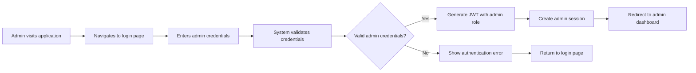
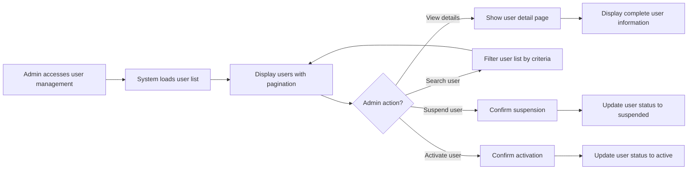
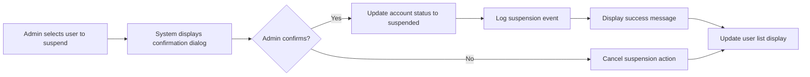
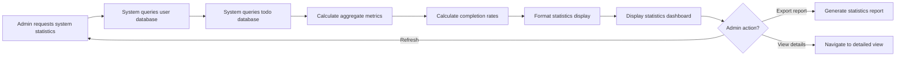
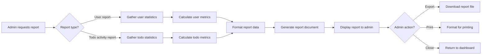

# Administrative Scenarios and Workflows

## Document Overview

This document defines all administrative scenarios, workflows, and capabilities for the Todo list application. It describes how system administrators interact with the system to manage users, monitor system health, support end users, and maintain the application. These scenarios represent the administrative perspective of the system and define what administrative operations must be supported.

## Admin Actor Context

As defined in the User Actors and Authentication document, the **Admin** actor is a system administrator who:
- Can manage user accounts and view user information
- Has access to system-wide statistics and monitoring capabilities
- Can perform administrative operations across all user data
- Has elevated permissions beyond regular users
- Is responsible for system maintenance and user support

Admins authenticate using the same JWT-based authentication system as regular users, but their JWT token includes elevated permissions that grant access to administrative endpoints and capabilities.

## Admin Login and Access

### Admin Authentication Flow

The admin authentication process follows the same technical flow as regular users but grants different permissions based on the admin role.

**WHEN an admin submits login credentials, THE system SHALL validate the email and password against the user database.**

**IF the credentials are valid AND the user account has admin role, THEN THE system SHALL generate a JWT token containing:**
- User ID
- Role: "admin"
- Permissions array including administrative capabilities
- Token expiration timestamp (15-30 minutes for access token)

**WHEN an admin successfully authenticates, THE system SHALL create a session and redirect the admin to the administrative dashboard.**

**IF authentication fails due to invalid credentials, THEN THE system SHALL display an error message "Invalid email or password" and allow the admin to retry.**

**IF authentication fails due to account not having admin role, THEN THE system SHALL display an error message "Access denied - administrative privileges required" and deny access to admin features.**

### Admin Session Management

**THE system SHALL maintain admin sessions using JWT tokens with the same expiration policy as regular users (access token: 15-30 minutes, refresh token: 7-30 days).**

**WHEN an admin's access token expires, THE system SHALL use the refresh token to obtain a new access token without requiring re-authentication.**

**WHEN an admin explicitly logs out, THE system SHALL invalidate the current session and clear all authentication tokens.**

**THE system SHALL enforce the same security measures for admin sessions as regular user sessions, including secure token storage and transmission.**

### Admin Dashboard Access

**WHEN an authenticated admin accesses the admin dashboard, THE system SHALL display:**
- System-wide statistics summary
- Recent user activity overview
- Quick access links to user management
- Quick access links to system monitoring
- Navigation to all administrative functions

**THE admin dashboard SHALL provide a clear overview of system health and user base at a glance.**

**THE system SHALL verify admin permissions before displaying any administrative dashboard content.**

## User Management Scenarios

### Viewing All Users

**WHEN an admin requests to view all users, THE system SHALL display a list containing:**
- User email address
- Account creation date
- User role (user/admin)
- Account status (active/suspended)
- Total number of todos created by each user
- Last login timestamp

**THE system SHALL support pagination when displaying users, showing 20 users per page.**

**THE system SHALL allow admins to sort the user list by:**
- Email address (alphabetically)
- Creation date (newest first or oldest first)
- Last login date (most recent first)
- Todo count (highest to lowest)

**WHEN an admin searches for a specific user, THE system SHALL support search by:**
- Email address (partial match)
- User ID (exact match)

### Viewing User Details

**WHEN an admin selects a specific user to view details, THE system SHALL display:**
- Complete user profile information (email, user ID, role)
- Account creation timestamp
- Last login timestamp
- Account status (active/suspended)
- Total count of todos created
- Complete list of all todos belonging to the user
- User activity summary

**WHEN viewing a user's todo list as admin, THE system SHALL display:**
- Todo title
- Completion status (complete/incomplete)
- Creation timestamp
- Todo ID

**THE system SHALL allow admins to view any user's complete todo list for support and monitoring purposes.**

### Suspending User Accounts

**WHEN an admin initiates suspension of a user account, THE system SHALL request confirmation before proceeding.**

**IF the admin confirms the suspension action, THEN THE system SHALL:**
- Update the user account status to "suspended"
- Prevent the user from logging in with an error message "Your account has been suspended. Please contact support."
- Retain all user data including todos
- Log the suspension action with admin ID and timestamp

**THE system SHALL NOT delete any user data when suspending an account.**

**WHEN a suspended user attempts to log in, THE system SHALL display the suspension message and deny access.**

### Reactivating Suspended Accounts

**WHEN an admin initiates reactivation of a suspended account, THE system SHALL request confirmation before proceeding.**

**IF the admin confirms the reactivation action, THEN THE system SHALL:**
- Update the user account status to "active"
- Restore full login access for the user
- Log the reactivation action with admin ID and timestamp

**WHEN a previously suspended user logs in after reactivation, THE system SHALL allow normal access to all user features.**

### Deleting User Accounts

**WHEN an admin initiates permanent deletion of a user account, THE system SHALL display a warning message: "This action cannot be undone. All user data including todos will be permanently deleted."**

**IF the admin confirms the deletion action, THEN THE system SHALL:**
- Permanently delete the user account
- Permanently delete all todos created by the user
- Remove all session tokens for the user
- Log the deletion action with admin ID and timestamp
- Display confirmation message "User account and all associated data have been permanently deleted"

**THE system SHALL NOT allow recovery of deleted accounts or their data.**

**IF the admin attempts to delete their own admin account, THE system SHALL prevent the action and display an error message "Cannot delete your own admin account while logged in."**

## System Monitoring

### System-Wide Statistics

**WHEN an admin accesses system statistics, THE system SHALL display:**
- Total number of registered users
- Total number of active users (logged in within last 30 days)
- Total number of suspended users
- Total number of todos created across all users
- Total number of completed todos
- Total number of incomplete todos
- System uptime information

**THE system SHALL update statistics in real-time as users create, complete, or delete todos.**

**THE system SHALL calculate the completion rate as: (completed todos / total todos) × 100.**

### User Activity Monitoring

**WHEN an admin views user activity, THE system SHALL display:**
- Recent user registrations (last 10 users)
- Recent user logins (last 20 login events)
- Recent todo creation activity (last 20 todos created)
- Recent todo completion activity (last 20 todos completed)

**THE system SHALL display activity timestamps in a clear, human-readable format.**

**THE system SHALL allow admins to filter activity by:**
- Time range (last 24 hours, last 7 days, last 30 days, custom range)
- Activity type (registrations, logins, todo creation, todo completion)
- Specific user (filter to show one user's activity)

**WHEN viewing activity for a specific time range, THE system SHALL display all matching events sorted by timestamp (most recent first).**

### Todo Statistics and Trends

**WHEN an admin views todo statistics, THE system SHALL display:**
- Total todos created today
- Total todos created this week
- Total todos created this month
- Average todos per user
- Most active users (by todo creation count)
- Completion rate trends over time

**THE system SHALL visualize trends to show:**
- Todo creation rate over time
- Todo completion rate over time
- User growth over time

**THE system SHALL allow admins to export statistics reports for analysis purposes.**

## User Support Operations

### Accessing User Accounts for Support

**WHEN an admin needs to support a user with an issue, THE system SHALL allow the admin to:**
- Search for the user by email or user ID
- View the user's complete account information
- View the user's complete todo list
- Review the user's recent activity

**THE system SHALL log all admin access to user accounts for audit purposes, recording:**
- Admin user ID who accessed the account
- Target user ID that was accessed
- Timestamp of access
- Reason for access (if provided)

**THE admin SHALL NOT be able to modify a user's todos directly, but can view them for support purposes.**

### Helping Users with Account Issues

**WHEN a user reports login problems, THE admin SHALL be able to:**
- Verify the user account exists in the system
- Check if the account is suspended
- Verify the user's email address is correct
- Confirm account creation date and last login

**IF a user's account is suspended in error, THE admin SHALL reactivate the account following the standard reactivation process.**

**IF a user has forgotten their email address, THE admin SHALL be able to search by partial information to locate the account.**

### Supporting Data-Related Issues

**WHEN a user reports missing todos, THE admin SHALL be able to:**
- View the user's complete todo list to verify what exists
- Check if todos are marked as completed when user expects them incomplete
- Verify todo creation timestamps to confirm when items were added

**THE admin SHALL communicate findings to the user but SHALL NOT modify todo data on behalf of the user.**

**IF a user requests account deletion, THE admin SHALL follow the account deletion process with appropriate warnings about data permanence.**

## Administrative Reporting

### User Report Generation

**WHEN an admin requests a user report, THE system SHALL generate a report containing:**
- Total registered users count
- Active users count (defined as logged in within last 30 days)
- Inactive users count (not logged in for 30+ days)
- Suspended users count
- User growth statistics (new users per day/week/month)
- User registration trend data

**THE system SHALL allow admins to export user reports in a downloadable format.**

**THE report SHALL include generation timestamp and the admin who generated it.**

### Todo Activity Report Generation

**WHEN an admin requests a todo activity report, THE system SHALL generate a report containing:**
- Total todos created (all time)
- Total completed todos
- Total incomplete todos
- Completion rate percentage
- Average todos per user
- Todo creation trend (daily, weekly, monthly)
- Most active users by todo creation
- Todo completion trend over time

**THE system SHALL allow admins to specify the time range for todo activity reports (e.g., last 7 days, last 30 days, last 90 days, all time).**

**THE report SHALL clearly indicate the time range covered and generation timestamp.**

### System Health Reports

**WHEN an admin requests a system health report, THE system SHALL provide:**
- System uptime duration
- Total API requests processed (if tracked)
- Error rate statistics (if tracked)
- Database performance metrics (if tracked)
- Current system status (operational/degraded/down)

**THE system SHALL indicate if any system health metrics are unavailable or not tracked.**

## Admin Error Scenarios

### Admin Authentication Errors

**IF an admin provides invalid credentials, THE system SHALL display an error message "Invalid email or password" and allow retry.**

**IF a user with non-admin role attempts to access admin functions, THE system SHALL deny access and display "Access denied - administrative privileges required."**

**IF an admin's session expires while performing an administrative action, THE system SHALL redirect to login and preserve the intended action to resume after re-authentication.**

### Admin Operation Errors

**IF an admin attempts to suspend a user account that is already suspended, THE system SHALL display "This user account is already suspended" and take no action.**

**IF an admin attempts to activate a user account that is already active, THE system SHALL display "This user account is already active" and take no action.**

**IF an admin attempts to delete a user account that does not exist, THE system SHALL display "User account not found" error.**

**IF an admin attempts to view details for a non-existent user, THE system SHALL display "User not found" error.**

**IF system statistics cannot be calculated due to database errors, THE system SHALL display "Unable to load statistics at this time. Please try again later."**

### Report Generation Errors

**IF report generation fails due to system errors, THE system SHALL display "Report generation failed. Please try again later."**

**IF an admin requests a report with invalid date range parameters, THE system SHALL display "Invalid date range specified" and request valid dates.**

**IF export functionality is unavailable, THE system SHALL inform the admin "Export feature is temporarily unavailable" and allow viewing the report on screen.**

## Admin Permission Boundaries

### What Admins CAN Do

Admins have permission to:
- View all user accounts and their information
- View any user's complete todo list
- Suspend and reactivate user accounts
- Delete user accounts permanently
- Access system-wide statistics and monitoring
- Generate reports about users and system activity
- Search and filter users
- Support users by viewing their data

### What Admins CANNOT Do

Admins do NOT have permission to:
- Modify a user's todos (create, complete, delete on behalf of user)
- Change a user's password directly (users must use password reset)
- Modify a user's email address
- Create new user accounts without proper registration flow
- Access user passwords (passwords are hashed and not viewable)
- Modify system configuration settings beyond defined admin capabilities
- Grant or revoke admin privileges (this requires higher-level system access)

**THE system SHALL enforce these permission boundaries through access control checks on all administrative operations.**

**IF an admin attempts an unauthorized operation, THE system SHALL deny the request and log the attempted access.**

## Admin Activity Logging

**THE system SHALL log all administrative actions including:**
- Admin login and logout events
- User account suspension and reactivation
- User account deletion
- Access to user account details
- Report generation
- Admin search and filter operations

**THE activity log SHALL record:**
- Timestamp of action
- Admin user ID who performed the action
- Action type
- Target user ID (if applicable)
- Action outcome (success/failure)

**THE system SHALL retain admin activity logs for audit and security purposes.**

**THE system SHALL allow senior admins to review admin activity logs to monitor administrative operations.**

## Admin User Experience Expectations

**WHEN an admin performs any administrative operation, THE system SHALL provide immediate visual feedback indicating:**
- Operation in progress (loading indicator)
- Operation success (success message with confirmation)
- Operation failure (error message with explanation)

**THE admin interface SHALL be responsive and perform operations within 2 seconds for standard actions.**

**THE system SHALL display clear, actionable error messages that help admins understand and resolve issues.**

**THE admin dashboard and all administrative pages SHALL be intuitive and require minimal training to use effectively.**

## Future Administrative Considerations

While not part of the minimum viable product, future admin capabilities might include:
- Bulk user operations (suspend/activate/delete multiple users)
- Advanced reporting with custom filters and visualizations
- Email notification capabilities to users
- System configuration management through admin interface
- Role-based admin permissions (e.g., support admin vs. system admin)
- Audit log viewing and searching capabilities
- User impersonation for support purposes (with strict logging)

These future features are noted for context but are explicitly out of scope for the initial implementation.

---

> *This document defines administrative workflows and business requirements only. All technical implementations (API design, database operations, UI implementation, etc.) are at the discretion of the development team.*