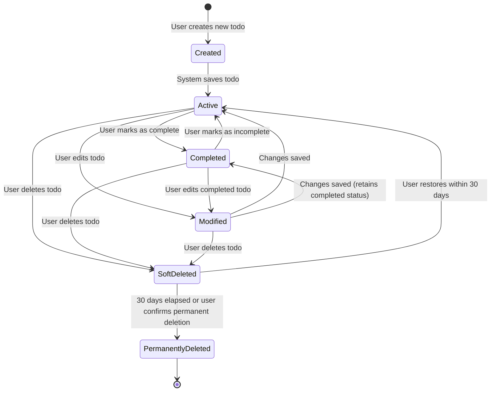
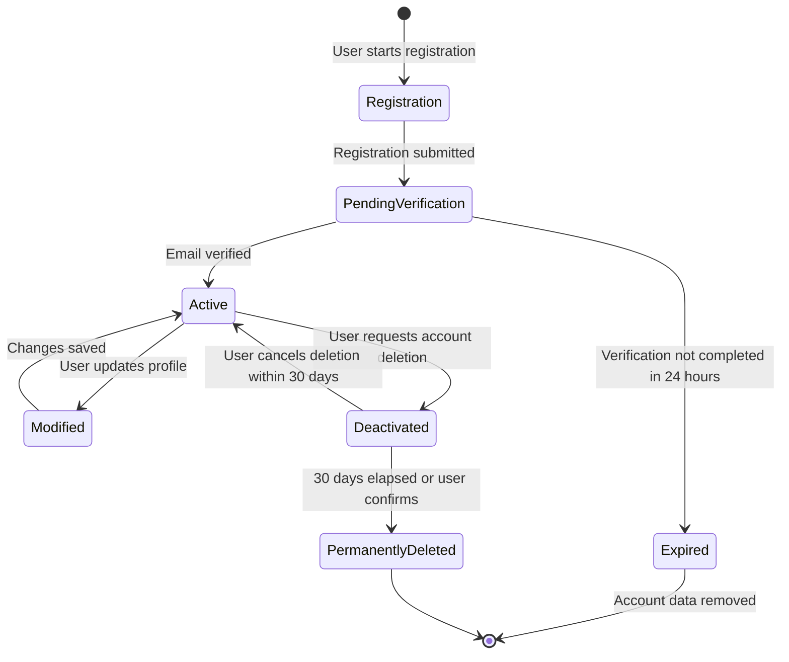

# Data Lifecycle and Persistence Requirements

## Document Overview

This document defines the complete lifecycle of data in the Todo list application, from creation through deletion. It establishes business requirements for how data flows through different states, how long data is retained, and how data modifications are tracked. These requirements focus on user expectations and business rules rather than technical implementation details.

The Todo list application manages two primary types of data:
- **Todo Items**: The core content created and managed by users
- **User Accounts**: User profile and authentication data

Understanding the complete lifecycle of this data ensures proper handling, retention, and deletion according to business needs and user expectations.

## Todo Item Lifecycle

### Lifecycle States

A todo item progresses through several distinct states during its lifetime. Each state represents a specific business condition with defined transitions.

### Todo Item Creation

**WHEN a user submits a new todo item, THE system SHALL create the todo in "Created" state with the following initial data:**
- Title as provided by user
- Description (if provided)
- Due date (if provided)
- Priority level (default to "medium" if not specified)
- Status set to "incomplete"
- Creation timestamp
- Owner user ID
- Last modified timestamp (same as creation timestamp)

**THE system SHALL transition the todo from "Created" to "Active" state immediately after successful validation and storage.**

**WHEN a todo enters "Active" state, THE system SHALL make it visible to the owner user in their todo list.**

### Todo Item Active State

**WHILE a todo is in "Active" state, THE system SHALL allow the owner to:**
- View the todo item and all its details
- Edit any todo properties (title, description, due date, priority)
- Mark the todo as completed
- Delete the todo

**WHEN a user edits an active todo, THE system SHALL:**
- Transition the todo to "Modified" state temporarily
- Update the last modified timestamp
- Validate all changes according to business rules
- Return the todo to "Active" state after successful update

**THE system SHALL preserve all todo data while in "Active" state indefinitely until the user takes action to change it.**

### Todo Item Completion

**WHEN a user marks an active todo as complete, THE system SHALL:**
- Change the todo status from "incomplete" to "complete"
- Transition the todo to "Completed" state
- Record the completion timestamp
- Update the last modified timestamp
- Keep the todo visible in the user's todo list with completion indicator

**WHEN a user marks a completed todo as incomplete, THE system SHALL:**
- Change the todo status from "complete" to "incomplete"
- Transition the todo back to "Active" state
- Clear the completion timestamp
- Update the last modified timestamp

**WHILE a todo is in "Completed" state, THE system SHALL allow the owner to:**
- View the todo with completion status
- Mark it as incomplete (returning to Active state)
- Edit any todo properties while maintaining completed status
- Delete the todo

**THE system SHALL retain completed todos indefinitely unless explicitly deleted by the user.**

### Todo Item Modification

**WHEN a user updates any todo property, THE system SHALL:**
- Record the modification timestamp
- Update only the specified properties
- Preserve all other properties unchanged
- Maintain the current completion status unless explicitly changed
- Keep the todo in its current lifecycle state (Active or Completed)

**THE system SHALL track the following modification metadata for each todo:**
- Last modified timestamp (when any property was last changed)
- Last modified by user ID (for audit purposes)

**THE system SHALL NOT maintain detailed modification history or version control for todo items.** Only the current state and last modification timestamp are required.

### Todo Item Deletion

**WHEN a user deletes a todo item, THE system SHALL:**
- Transition the todo to "SoftDeleted" state
- Remove the todo from the user's visible todo list
- Preserve all todo data including content and metadata
- Record the deletion timestamp
- Set a permanent deletion date 30 days from deletion

**WHILE a todo is in "SoftDeleted" state, THE system SHALL:**
- Hide the todo from normal todo list views
- Retain all todo data for potential recovery
- Allow the owner to restore the todo within 30 days
- Automatically schedule permanent deletion after 30 days

**WHEN a user restores a soft-deleted todo, THE system SHALL:**
- Transition the todo back to its previous state (Active or Completed based on status before deletion)
- Make the todo visible in the user's todo list again
- Clear the deletion timestamp and permanent deletion date
- Update the last modified timestamp

**WHEN 30 days have elapsed since soft deletion, THE system SHALL:**
- Transition the todo to "PermanentlyDeleted" state
- Remove all todo data permanently and irreversibly
- Free all associated storage

**IF a user requests immediate permanent deletion, THE system SHALL:**
- Require explicit confirmation from the user
- Transition the todo directly to "PermanentlyDeleted" state
- Remove all todo data immediately and irreversibly

**THE system SHALL NOT allow recovery of permanently deleted todos under any circumstances.**

## User Account Lifecycle

### Account States

User accounts progress through defined states from creation to potential deletion.

### Account Creation and Registration

**WHEN a user submits registration information, THE system SHALL:**
- Create account in "Registration" state
- Store email address, hashed password, and registration timestamp
- Generate email verification token
- Send verification email to provided address
- Transition account to "PendingVerification" state

**WHILE an account is in "PendingVerification" state, THE system SHALL:**
- Not allow login
- Wait for email verification
- Keep verification token valid for 24 hours

**WHEN a user verifies their email within 24 hours, THE system SHALL:**
- Transition account to "Active" state
- Enable login functionality
- Initialize empty todo list for the user

**IF email verification is not completed within 24 hours, THE system SHALL:**
- Transition account to "Expired" state
- Delete all registration data
- Allow the email to be used for new registration

### Active Account State

**WHILE an account is in "Active" state, THE system SHALL allow the user to:**
- Log in and access the application
- Create and manage todo items
- Update profile information (email, password)
- Request account deletion

**WHEN a user updates profile information, THE system SHALL:**
- Temporarily transition to "Modified" state during update
- Validate new information according to business rules
- Update last modified timestamp
- Return to "Active" state after successful update

**IF a user changes their email address, THE system SHALL:**
- Require verification of the new email address
- Keep the old email active until new email is verified
- Update to new email only after verification

**THE system SHALL maintain active accounts indefinitely while users continue to use them.**

### Account Deactivation and Deletion

**WHEN a user requests account deletion, THE system SHALL:**
- Transition account to "Deactivated" state
- Prevent login from this point forward
- Set permanent deletion date 30 days in the future
- Send confirmation email about pending deletion
- Provide instructions for cancellation

**WHILE an account is in "Deactivated" state, THE system SHALL:**
- Prevent all login attempts
- Retain all user data and todos
- Allow account recovery if user requests within 30 days
- Display message about pending deletion on login attempts

**WHEN a user requests account recovery within 30 days, THE system SHALL:**
- Transition account back to "Active" state
- Restore full login functionality
- Clear deletion timestamp
- Send confirmation email about restoration

**WHEN 30 days have elapsed since deactivation, THE system SHALL:**
- Transition account to "PermanentlyDeleted" state
- Delete all user data including email and password
- Delete all associated todo items permanently
- Free all associated storage
- Remove all traces of the account

**IF a user requests immediate permanent deletion, THE system SHALL:**
- Require explicit confirmation with password re-entry
- Transition account directly to "PermanentlyDeleted" state
- Delete all data immediately and irreversibly

**THE system SHALL NOT allow recovery of permanently deleted accounts under any circumstances.**

## Data Persistence Requirements

### Save and Storage Requirements

**WHEN a user creates or modifies any data, THE system SHALL:**
- Save changes immediately to persistent storage
- Confirm successful save before showing success to user
- Return error if save operation fails

**THE system SHALL ensure data is persisted such that:**
- Data survives application restarts
- Data survives server restarts
- Data is available immediately after save operation completes

**IF a save operation fails, THE system SHALL:**
- Not show success to the user
- Preserve previous data state
- Display clear error message
- Allow user to retry the operation

### Data Availability Requirements

**THE system SHALL make user data available such that:**
- When a user logs in, all their active todos are immediately accessible
- Completed todos remain accessible indefinitely
- Todo data reflects the most recent saved state
- No data loss occurs during normal system operation

**WHEN a user creates a todo, THE system SHALL:**
- Make the todo visible in their todo list within 2 seconds
- Ensure the todo appears on all devices/sessions for that user
- Persist the todo so it remains after logout and re-login

**WHEN a user modifies a todo, THE system SHALL:**
- Update the todo data immediately upon save
- Reflect changes in all views where the todo appears
- Ensure changes persist across sessions

### Data Consistency Requirements

**THE system SHALL maintain data consistency such that:**
- Each todo belongs to exactly one user
- Todo status accurately reflects user actions
- Timestamps accurately reflect when actions occurred
- No todo can exist without a valid owner

**IF data inconsistency is detected, THE system SHALL:**
- Prevent access to inconsistent data
- Log the error for investigation
- Display appropriate error message to user
- Not corrupt or lose user data in the process

### System Failure Recovery

**IF the system crashes or restarts unexpectedly, THE system SHALL:**
- Preserve all data that was successfully saved before the failure
- Not show unsaved changes to users
- Return to stable state upon restart
- Allow users to continue from last saved state

**THE system SHALL NOT require users to:**
- Manually save their data
- Worry about data backup
- Take any special action to protect their data

## Data Retention Policies

### Todo Item Retention

**THE system SHALL retain active todos indefinitely** until one of the following occurs:
- User deletes the todo
- User deletes their account
- User explicitly archives or removes the todo

**THE system SHALL retain completed todos indefinitely** with the same retention policy as active todos. Completion status does not trigger automatic deletion.

**THE system SHALL retain soft-deleted todos for exactly 30 days** from the deletion timestamp, after which permanent deletion occurs automatically.

**THE system SHALL permanently delete todos immediately** when:
- The soft-delete 30-day period expires
- User explicitly confirms immediate permanent deletion
- The owning user account is permanently deleted

### User Account Retention

**THE system SHALL retain user account data indefinitely** while the account remains in "Active" state and the user continues using the service.

**THE system SHALL retain unverified accounts (in "PendingVerification" state) for exactly 24 hours**, after which all registration data is permanently deleted.

**THE system SHALL retain deactivated accounts for exactly 30 days** from deactivation timestamp, allowing for account recovery.

**THE system SHALL permanently delete account data immediately** when:
- The deactivation 30-day period expires
- User explicitly confirms immediate permanent deletion
- Account verification period of 24 hours expires without verification

### Authentication Data Retention

**THE system SHALL retain JWT tokens according to these timeframes:**
- Access tokens: Valid for 30 minutes from issuance
- Refresh tokens: Valid for 30 days from issuance

**WHEN tokens expire, THE system SHALL:**
- Reject any requests using expired tokens
- Require user to re-authenticate (for expired refresh tokens)
- Allow automatic token refresh (for expired access tokens with valid refresh token)

**THE system SHALL NOT retain:**
- Expired tokens beyond their expiration time
- Login session history beyond current active sessions
- Failed login attempts beyond 24 hours

### Data Cleanup Policies

**THE system SHALL automatically clean up expired data** according to this schedule:
- Soft-deleted todos older than 30 days: Permanent deletion
- Deactivated accounts older than 30 days: Permanent deletion
- Unverified accounts older than 24 hours: Complete removal
- Expired tokens: Removal upon first detection

**THE system SHALL run automatic cleanup processes** at least once daily to remove expired data.

**THE system SHALL NOT notify users** about automatic cleanup of:
- Expired soft-deleted items (30-day period communicated at deletion time)
- Expired unverified accounts
- Expired tokens

## Data Modification Tracking

### Tracked Modifications

**THE system SHALL track the following timestamps for each todo item:**
- Creation timestamp (when the todo was first created)
- Last modified timestamp (when any property was last changed)
- Completion timestamp (when the todo was marked complete, if applicable)
- Deletion timestamp (when the todo was deleted, if soft-deleted)

**THE system SHALL track the following timestamps for each user account:**
- Registration timestamp (when the account was created)
- Last login timestamp (when the user last successfully logged in)
- Last modified timestamp (when profile information was last updated)
- Email verification timestamp (when email was verified)
- Deactivation timestamp (when account deletion was requested, if applicable)

### Modification Metadata Requirements

**WHEN any todo property is modified, THE system SHALL:**
- Update the last modified timestamp to current time
- Record which user made the modification (should always be the owner)
- Not maintain detailed change history or previous values

**WHEN user profile is modified, THE system SHALL:**
- Update the last modified timestamp to current time
- Record the type of change (email change, password change, etc.)
- Not maintain previous values except where explicitly required (like old email during verification)

### User-Visible Modification Information

**THE system SHALL display to users:**
- When each todo was created (creation timestamp)
- When each todo was last modified (last modified timestamp)
- When a todo was completed (completion timestamp, if completed)
- How long ago these events occurred in human-friendly format (e.g., "2 hours ago", "3 days ago")

**THE system SHALL display to users about their account:**
- When they registered
- When they last logged in
- When they last modified their profile

### Audit Trail Requirements

**THE system SHALL maintain minimal audit trail** consisting only of:
- Current state timestamps (creation, modification, completion)
- User ownership information
- Critical state changes (account verification, account deactivation)

**THE system SHALL NOT maintain:**
- Detailed change history of todo content
- Version control of todo items
- Complete audit log of all user actions
- Historical values of modified fields

**THE minimal audit trail is sufficient for:**
- Displaying modification dates to users
- Basic accountability (who owns what data)
- Data lifecycle management (when to delete expired items)

## Soft Delete vs Hard Delete

### Soft Delete Strategy

**THE system SHALL use soft delete for:**
- Todo items deleted by users
- User accounts when deletion is requested

**Soft delete means:**
- Data is marked as deleted but not physically removed
- Data becomes invisible to the user immediately
- Data is retained for a recovery period
- Data can be restored during the recovery period
- Data is permanently deleted after recovery period expires

### Soft Delete Business Rules for Todos

**WHEN a user deletes a todo, THE system SHALL:**
- Implement soft delete by default
- Set deleted flag to true
- Record deletion timestamp
- Remove todo from user's visible list immediately
- Schedule permanent deletion 30 days later

**WHILE a todo is soft-deleted, THE system SHALL:**
- Keep it invisible in all normal todo views
- Prevent any modifications
- Allow restoration to previous state
- Count it toward user's total storage (if limits exist)

**THE system SHALL allow users to:**
- View soft-deleted todos in a separate "Trash" or "Deleted Items" view
- Restore individual soft-deleted todos
- Permanently delete soft-deleted todos immediately with confirmation
- See how many days remain until automatic permanent deletion

### Hard Delete Strategy

**THE system SHALL use hard delete (permanent deletion) for:**
- Soft-deleted items after 30-day recovery period
- Soft-deleted items when user confirms immediate permanent deletion
- All user data when account is permanently deleted
- Unverified accounts after 24-hour verification period
- Any data that has exceeded its retention period

**Hard delete means:**
- Data is physically and permanently removed
- No recovery is possible after hard delete
- All associated metadata is also removed
- Storage is freed immediately

### Hard Delete Business Rules

**WHEN hard delete occurs, THE system SHALL:**
- Remove all data permanently and irreversibly
- Free associated storage
- Remove all references to the deleted data
- Clear all metadata and timestamps

**THE system SHALL NOT:**
- Maintain any backup or recovery mechanism for hard-deleted data
- Allow any form of data restoration after hard delete
- Keep any traces of hard-deleted data

**WHEN a user account is hard-deleted, THE system SHALL:**
- Hard delete all associated todo items (including soft-deleted ones)
- Remove all user profile data
- Remove all authentication credentials
- Free the email address for future registration
- Remove all session tokens

### User Confirmation for Immediate Permanent Deletion

**IF a user requests immediate permanent deletion of a todo, THE system SHALL:**
- Display warning about irreversible action
- Require explicit confirmation (e.g., "Delete Permanently" button)
- Explain that recovery will not be possible
- Proceed with hard delete only after confirmation

**IF a user requests immediate account deletion, THE system SHALL:**
- Display warning about irreversible action and data loss
- Require password re-entry for security
- Require explicit confirmation
- List what data will be deleted (all todos, account info, etc.)
- Proceed with hard delete only after all confirmations

## Data Recovery Requirements

### User-Initiated Recovery

**THE system SHALL allow users to recover soft-deleted todos** through the following process:
- User accesses "Trash" or "Deleted Items" view
- User selects todo(s) to restore
- User confirms restoration
- System restores todo to previous state (Active or Completed)

**WHEN a user restores a soft-deleted todo, THE system SHALL:**
- Make the todo visible in normal todo list immediately
- Restore all original properties (title, description, due date, priority, status)
- Clear deletion timestamp
- Update last modified timestamp
- Remove from trash/deleted items view

**THE system SHALL display in the trash view:**
- All soft-deleted todos
- How many days remain until permanent deletion for each item
- Original todo information (title, due date, etc.) to help user identify items
- Batch restore and batch permanent delete options

### Recovery Time Limits

**THE system SHALL enforce a 30-day recovery period for:**
- Soft-deleted todo items
- Deactivated user accounts

**WHEN the recovery period expires, THE system SHALL:**
- Automatically perform hard delete
- Make recovery impossible
- Free all associated storage

**THE system SHALL warn users about recovery deadlines:**
- At the time of deletion (e.g., "You have 30 days to restore this item")
- When viewing deleted items (e.g., "7 days remaining until permanent deletion")
- Before automatic permanent deletion occurs (optional email notification)

### Recovery Limitations

**THE system SHALL NOT allow recovery of:**
- Hard-deleted data (permanently deleted items)
- Data deleted as part of account permanent deletion
- Expired unverified accounts
- Data beyond the 30-day recovery period

**THE system SHALL NOT maintain:**
- Backups for user-initiated recovery beyond the 30-day soft delete period
- Version history for reverting modifications
- Undo functionality for edits to todo content

### System Failure Recovery

**IF system failure occurs, THE system SHALL:**
- Preserve all data that was successfully persisted before failure
- Return to last known consistent state
- Not corrupt existing data during recovery
- Allow users to access all previously saved data

**THE system SHALL NOT provide:**
- Automatic backup recovery for user errors (like accidental deletion beyond recovery period)
- Point-in-time recovery for individual user actions
- Rollback of user-initiated changes

## Data Archival Considerations

### Long-Term Data Management

**THE system SHALL manage long-term data** with these principles:
- Active user data is retained indefinitely
- Inactive accounts (no login for extended period) may be subject to future archival policies
- Completed todos are treated the same as active todos (no automatic archival)

**THE system SHALL NOT implement automatic archival** in the minimum viable version for:
- Old completed todos
- Inactive user accounts
- Historical data

### Future Archival Preparation

**THE system design SHOULD accommodate future archival features** such as:
- User-initiated archival of old todos
- Automatic suggestions to archive very old completed items
- Separate archive storage for historical data
- Compressed storage for archived items

**THE system SHALL maintain data structures** that allow for:
- Easy identification of archival candidates (using timestamps)
- Separation of active and archived data in future
- Migration of old data to archival storage

### No Current Archival Requirements

**For the minimal viable product, THE system SHALL NOT:**
- Automatically archive old data
- Move completed todos to separate storage
- Compress or optimize storage for old items
- Limit the number of todos users can maintain

**All data management SHALL focus on:**
- Active data that users are currently using
- Soft-deleted data in recovery period
- Permanent deletion after recovery period
- No intermediate archival states

---

*Developer Note: This document defines business requirements for data lifecycle and persistence only. All technical implementation decisions (database design, storage mechanisms, backup strategies, etc.) are at the discretion of the development team.*