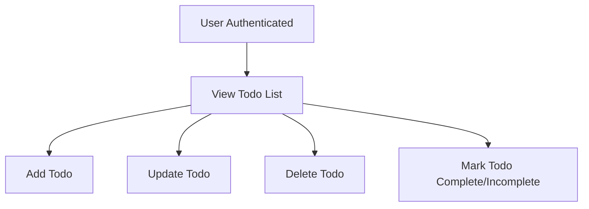

# Todo List Application Requirements

## 1. Introduction and Scope
The Todo list application provides a simple task management solution with the absolute minimum set of features for a functioning Todo app. Its purpose is to allow users to manage personal tasks in a clear, easy-to-use way. The system is intended for everyday users with no programming experience and designed for quick onboarding and minimal training.

The requirements outlined here are strictly limited to the essential features required by a Todo list. No extended functions (such as task sharing, notification scheduling, or subtasks) are included in this phase. All specifications avoid programming jargon and technical APIs, using plain language and focusing on business needs and user experience.

## 2. Functional Requirements (EARS Format)

- WHEN a user is authenticated, THE system SHALL allow the user to create a new Todo item with a title and optional description.
- WHEN a user is authenticated, THE system SHALL allow the user to view their list of Todo items.
- WHEN a user is authenticated, THE system SHALL allow the user to update the title and description of their own Todo items.
- WHEN a user is authenticated, THE system SHALL allow the user to mark any of their own Todo items as complete or incomplete.
- WHEN a user is authenticated, THE system SHALL allow the user to delete their own Todo items.
- IF a user is not authenticated, THEN THE system SHALL prevent all access to Todo management features and require login.
- WHERE a user tries to interact with a Todo item that does not exist, THE system SHALL respond with a clear 'not found' error.
- WHERE a user attempts to modify or delete a Todo item not owned by them, THE system SHALL reject the action with an ownership error.

## 3. Error Handling and User Notifications

Error handling requirements are essential to ensure a smooth, predictable, and user-friendly experience. The following rules govern how errors and recovery situations must be managed in the Todo list system:

- WHEN a user provides invalid login credentials, THE system SHALL reject the attempt and display an easy-to-understand error message explaining the problem.
- IF a user's authentication has expired or is invalid, THEN THE system SHALL require re-authentication and inform the user.
- IF an unauthenticated user tries to access any Todo function, THEN THE system SHALL block the action and ask them to log in first.
- WHEN a user tries to update, complete, or delete a Todo item that does not exist, THE system SHALL return a specific error stating the item can't be found.
- IF a Todo operation request is missing required information, THE system SHALL respond with a list of missing or invalid fields.
- IF user's request fails validation per business logic, THEN THE system SHALL return a detailed error message and guidance for correction.
- WHEN a backend error or service disruption occurs (including timeouts or database outages), THE system SHALL inform the user with a general error message and suggest retrying the operation.
- WHERE possible, THE system SHALL attempt automatic retries for recoverable backend errors and queue the request for later processing if feasible.
- WHERE repeated login failures occur, THE system SHALL block additional attempts for a cooldown period and prompt the user for password reset if necessary.

All user-facing error messages MUST:
  - Be clear, concise, and explain what went wrong
  - Never reveal internal system or technical details
  - Provide guidance for resolving the issue when actionable
  - Respond within 1 second under typical system load

## 4. Authentication and Authorization

- WHEN a user signs up or logs in, THE system SHALL authenticate using a secure username/password or approved third-party method.
- THE system SHALL create a unique session token for each successfully authenticated user.
- THE system SHALL restrict all Todo CRUD (create, read, update, delete) operations to the authenticated user’s own Todo items.
- IF a user tries to access or modify other users’ Todos, THEN THE system SHALL deny the operation and display an appropriate permission error.
- THE system SHALL enforce session expiry for security and require users to log in again after token expiry or logout.

## 5. Business Process Overview

- WHEN a user opens the Todo list application, THE system SHALL require them to authenticate before accessing any personal task data.
- WHEN authenticated, THE user SHALL be able to add new Todos by providing at least a title; description is optional.
- Completed Todos SHALL remain visible in the user’s list but should be visually distinguished from incomplete ones.
- The user SHALL be able to edit or delete only their own Todos.
- WHEN an operation fails, THE system SHALL provide clear instructions for correcting the problem or recovering (e.g., trying again after a connectivity issue).

## 6. Quality and Clarity Requirements

- All requirements in this document SHALL be testable by observing user-visible behaviors, not by reading technical logs.
- Requirements SHALL be interpreted strictly: ambiguous or open-ended features are not considered implemented.
- The system SHALL respond to user actions within 1 second under normal operational conditions for all CRUD actions.
- All feedback SHALL be provided in plain language suitable for users unfamiliar with technical terms.

## 7. Visual Representation of Minimum Workflow

## 8. References and Cross-Links

- Error handling requirements are fully aligned with [07-error-handling-and-recovery.md](./07-error-handling-and-recovery.md) and MUST be implemented as described in that document.
- Access control, authentication, and business process rules are to be implemented according to the permissions and scenarios listed in this requirements analysis.
