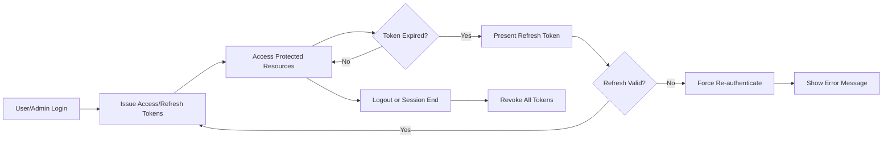

# Security and Compliance Requirements for Todo List Application

## Authentication and Authorization Expectations

### Actor Boundaries and Access Control
WHEN a user attempts to authenticate through the API, THE system SHALL establish a session utilizing secure authentication credentials, specifically issuing both access and refresh JWT tokens to the actor.

WHEN an API request is made to a protected endpoint without valid authentication, THE system SHALL deny access and return an error code explicitly indicating the lack of authorization.

WHEN a user (actor: user) accesses the application, THE system SHALL restrict access exclusively to that user's resources, including all created Todo items and account information. Access to resources belonging to other users SHALL be categorically denied.

WHEN an admin authenticates, THE system SHALL permit visibility and management of all user accounts and Todo lists within the actor's moderation authorization scope.

WHEN an authenticated actor attempts to access or modify a Todo item or account not owned by them, THE system SHALL reject the request with an explicit unauthorized response.

THE system SHALL log all failed authentication and authorization attempts, storing timestamps and associated actor metadata for later auditing and incident response.

#### Permission Enforcement Table

| Action                                   | User | Admin |
|------------------------------------------|:----:|:-----:|
| Authenticate (login/logout)              | ✅   | ✅    |
| Register new account                     | ✅   | ✅    |
| View/manage own Todo items               | ✅   | ✅    |
| View all Todo items                      | ❌   | ✅    |
| Modify/delete other users' Todo items    | ❌   | ✅    |
| View all user accounts                   | ❌   | ✅    |
| Audit and moderate user activity         | ❌   | ✅    |

## Privacy and Data Protection

### Data Handling Principles
THE system SHALL store only the minimum data necessary for Todo list functionality, which includes username, email, hashed password, and Todo items consisting of title, description, completion status, and timestamps.

THE system SHALL encrypt all user passwords at rest using strong, industry-standard hashing algorithms (e.g., bcrypt, Argon2) and SHALL never store or transmit plaintext passwords under any circumstance.

WHEN a request for data via API is made, THE system SHALL return only the data needed for that operation, omitting sensitive or irrelevant fields such as password hashes or security tokens.

WHERE a user requests the deletion of their account, THE system SHALL promptly remove or render inaccessible all personally identifiable information (PII) and Todo data for that user, except where legal retention is mandatory.

THE system SHALL permit users to request a copy or erasure of their data and SHALL provide a clear and documented process for such requests.

WHERE future integration with third-party services is enabled, THE system SHALL require explicit user consent before transmitting any personal data to external entities, and SHALL log all such transfers for transparency and compliance.

### Data Retention and Minimization
WHEN user account data or Todo items are no longer necessary for the provision of service or for regulatory compliance, THE system SHALL ensure they are purged from all production systems within 30 days.

THE system SHALL refrain from using user content for advertising, profiling, or business purposes beyond those necessary for core Todo list functionality unless explicit user consent is obtained.

### Privacy Breach Notification
IF a data breach involving user PII is detected, THEN THE system SHALL notify all affected users within 72 hours, clearly stating the nature and severity of compromised data and providing recommended steps for mitigation.

## Session Management and Token Expiry

WHEN a user or admin successfully logs in, THE system SHALL issue a short-lived access token (valid for 15-30 minutes) and a refresh token (valid for 7-30 days), each following security best practices.

WHEN an access token has expired, THE system SHALL require presentation of a valid refresh token to issue a new access token and SHALL reject expired or invalid refresh tokens with clear error messages and denied access.

WHERE a user or admin logs out or changes their password, THE system SHALL immediately revoke all access and refresh tokens—across all devices—and invalidate any existing sessions.

WHEN suspicious authentication or authorization activity is detected (for example, token reuse or repeated invalid login attempts), THE system SHALL require the actor to re-authenticate, terminate suspicious sessions, and log relevant details for admin review.

THE system SHALL store all cryptographic secrets and token signing keys securely, ensuring they are protected in transit and at rest and never exposed to unauthorized personnel.

### Session Timeout and Revocation
THE system SHALL terminate inactive sessions following 30 days of inactivity or sooner if required and SHALL log all session expiry events for auditability.

WHERE a user or admin requests the revocation of all device sessions, THE system SHALL forcefully terminate all outstanding sessions and prevent token reuse issued prior to revocation.

## Regulatory Compliance

### Legal and Jurisdictional Requirements
WHERE regulations such as GDPR, CCPA, or regional data protection laws apply, THE system SHALL allow users to:
- Obtain a copy of their personal data in a commonly used format upon request
- Exercise their right to request erasure of their data ("right to be forgotten") within 30 days unless legal exceptions are applicable
- Limit processing of their data to documented business purposes only

THE system SHALL provide and maintain an up-to-date privacy policy and terms of service, explaining all data handling practices and user rights and detailing processes for requests pertaining to privacy or data access.

WHEN a user submits a formal privacy or data access request, THE system SHALL acknowledge the request within 7 days and fulfill valid requests within 30 days, creating an audit trail for each request and response.

IF required by local law, THE system SHALL appoint a data protection officer and provide documentation for any personal data processing activities.

### Cookie and Consent Management
IF cookies or similar tracking tools are introduced, THE system SHALL disclose these to the user and obtain affirmative consent before setting non-essential cookies.

### Incident Response and Auditing
WHEN a significant security or privacy incident occurs, THE system SHALL log a full record of the incident, containment and mitigation steps taken, and all communications with affected actors and authorities as required by law.

### Data Portability and Export
WHEN a user requests data export, THE system SHALL produce all account and Todo data in a structured, widely supported format (e.g., JSON or CSV) within 30 days.

---

## Visual Diagram: Security and Session Flow

---

This requirements specification focuses strictly on business expectations for security, privacy, and compliance and intentionally avoids technical implementation detail to ensure clarity for backend engineering teams building the minimal Todo list application.