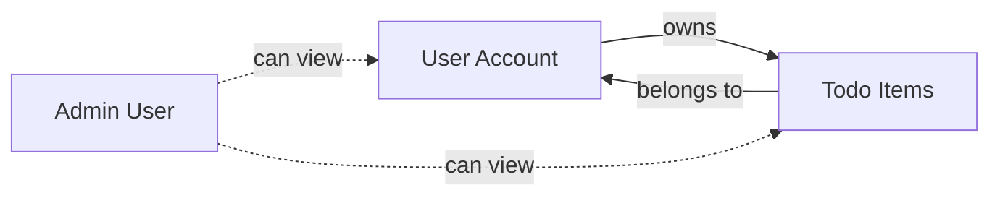
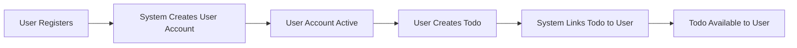

# Data Management Requirements

## Introduction

This document defines the data management requirements for the Todo list application from a business perspective. It describes what data exists in the system, how different data entities relate to each other, and how data should be managed throughout its lifecycle.

This document provides **business requirements only** - it describes the data the system must manage and the rules governing that data. All technical decisions about how to store, structure, and implement this data (database design, schema structure, indexing strategies, etc.) are at the discretion of the development team.

### Document Scope

This document covers:
- Business data entities and their purpose
- Relationships between data entities
- Data lifecycle from creation to deletion
- Business rules for data integrity
- Data retention and cleanup policies
- User data management requirements

### Out of Scope

This document does NOT include:
- Database schema designs or table structures
- API endpoint specifications
- Technical implementation details
- Database technology choices
- Performance optimization strategies

## Data Entities Overview

The Todo list application manages two primary types of business data:

### User Account Data
Represents the people who use the Todo list application. User accounts enable authentication, personalization, and ownership of todo items. Each user account is unique and isolated from other users.

**Purpose**: 
- Enable secure user authentication
- Establish ownership of todo items
- Provide personalized todo list experience
- Support administrative functions

### Todo Item Data
Represents individual tasks or items that users want to track and manage. Todo items are the core content of the application, containing the information about what needs to be done.

**Purpose**:
- Store user tasks and reminders
- Track completion status
- Organize user responsibilities
- Provide task management capability

### Data Relationship Overview

## User Account Data Entity

### User Account Information

THE system SHALL maintain the following information for each user account:

**Identity Information**:
- Unique user identifier (automatically assigned by system)
- Email address (used for login and communication)
- Account creation timestamp
- Last login timestamp
- Account status (active, suspended, deleted)

**Authentication Information**:
- Password (stored securely, never in plain text)
- Password last changed date
- Failed login attempt counter
- Account verification status

**User Profile Information**:
- Display name or username (optional)
- User preferences (optional)
- User role (user or admin)

**Account Metadata**:
- Total number of todo items created
- Number of active todo items
- Number of completed todo items
- Account activity statistics

### User Account Business Rules

WHEN a user registers, THE system SHALL create a unique user account with:
- A unique system-generated identifier
- The provided email address (validated for format)
- The provided password (securely hashed)
- Account creation timestamp set to current time
- Account status set to active
- Initial counters set to zero

WHEN a user logs in successfully, THE system SHALL update the last login timestamp to the current time.

THE system SHALL enforce email address uniqueness - no two users can have the same email address.

IF a user enters an incorrect password, THE system SHALL increment the failed login attempt counter.

WHEN a user successfully logs in, THE system SHALL reset the failed login attempt counter to zero.

## Todo Item Data Entity

### Todo Item Structure

THE system SHALL maintain the following information for each todo item:

**Core Todo Information**:
- Unique todo item identifier (automatically assigned)
- Todo title or description (the main text of the task)
- Completion status (complete or incomplete)
- Priority level (optional: low, medium, high)
- Due date (optional)

**Ownership Information**:
- Owner user identifier (links todo to specific user)
- Created by user identifier (tracks who created it)

**Temporal Information**:
- Creation timestamp (when the todo was created)
- Last modified timestamp (when the todo was last updated)
- Completion timestamp (when the todo was marked complete, if applicable)

**Metadata**:
- Todo category or tags (optional)
- Notes or additional details (optional)

### Todo Item Business Rules

WHEN a user creates a todo item, THE system SHALL:
- Generate a unique todo item identifier
- Set the owner to the creating user
- Set the created by user to the creating user
- Set creation timestamp to current time
- Set last modified timestamp to current time
- Set completion status to incomplete
- Set completion timestamp to null

WHEN a user updates a todo item, THE system SHALL update the last modified timestamp to current time.

WHEN a user marks a todo as complete, THE system SHALL:
- Update completion status to complete
- Set completion timestamp to current time
- Update last modified timestamp to current time

WHEN a user marks a completed todo as incomplete, THE system SHALL:
- Update completion status to incomplete
- Clear the completion timestamp (set to null)
- Update last modified timestamp to current time

THE system SHALL require todo title to be non-empty (at least 1 character).

THE system SHALL limit todo title length to a reasonable maximum (e.g., 500 characters).

IF a todo has a due date, THE system SHALL ensure the due date is a valid date/time value.

## Data Relationships

### User-Todo Ownership Relationship

**Fundamental Relationship**: Each todo item belongs to exactly one user. Each user can own zero or more todo items.

THE system SHALL establish ownership when a todo item is created, linking it permanently to the creating user.

THE system SHALL enforce that users can only access, view, modify, or delete their own todo items.

THE system SHALL prevent users from accessing todo items owned by other users.

WHERE a user has admin role, THE system SHALL allow viewing of all users' todo items for administrative purposes.

THE system SHALL NOT allow admins to modify or delete other users' todo items without proper authorization justification.

### Data Isolation Requirements

WHEN a user requests their todo list, THE system SHALL return only todo items where the owner matches the requesting user's identifier.

WHEN a user attempts to update a todo item, THE system SHALL verify the user is the owner before allowing the modification.

WHEN a user attempts to delete a todo item, THE system SHALL verify the user is the owner before allowing the deletion.

THE system SHALL maintain strict data isolation between different users' todo items.

## Data Lifecycle Management

### Data Creation Flow

**User Account Creation**:

WHEN a new user registers, THE system SHALL:
1. Validate the provided email address format
2. Check email address is not already registered
3. Validate password meets security requirements
4. Create new user account with provided information
5. Set account status to active
6. Initialize all counters and timestamps

**Todo Item Creation**:

WHEN a user creates a todo item, THE system SHALL:
1. Validate todo title is non-empty
2. Validate optional fields if provided (due date, priority)
3. Create new todo item linked to the user
4. Set initial status to incomplete
5. Set all timestamps appropriately
6. Increment user's todo item counter

### Data Update Patterns

**User Account Updates**:

WHEN a user updates their profile information, THE system SHALL:
- Validate new information for correctness
- Update only the changed fields
- Maintain audit trail of changes (update timestamps)
- Preserve user identifier and core authentication data

WHEN a user changes their password, THE system SHALL:
- Validate new password meets security requirements
- Update password hash securely
- Update password last changed date
- Optionally invalidate existing sessions

**Todo Item Updates**:

WHEN a user updates a todo item, THE system SHALL:
- Verify user ownership before allowing update
- Validate new information for correctness
- Update only the changed fields
- Update last modified timestamp
- Update completion timestamp if status changed to complete

### Data Deletion Procedures

**Todo Item Deletion**:

WHEN a user deletes a todo item, THE system SHALL:
- Verify user ownership
- Remove the todo item from the system
- Decrement user's todo item counters appropriately
- Make the todo item inaccessible to all users

THE system SHALL support permanent deletion of todo items - deleted todos are not recoverable.

**User Account Deletion**:

WHEN a user account is deleted, THE system SHALL follow this cascade deletion process:
1. Mark user account as deleted
2. Delete or anonymize all todo items owned by the user
3. Remove user authentication credentials
4. Clear user personal information
5. Retain minimal audit information if required by business policy

IF a user account is deleted, THE system SHALL ensure all associated todo items are also deleted to maintain data integrity.

THE system SHALL prevent orphaned todo items (todos without a valid owner).

### Data Archival Considerations

WHILE a user account is active, THE system SHALL maintain all associated todo items regardless of completion status.

THE system SHALL allow users to keep completed todo items indefinitely - there is no automatic archival or deletion of old completed todos.

WHERE administrative policies require data cleanup, THE system SHALL support bulk operations to remove old completed todos based on configurable time periods.

## Data Integrity Requirements

### Consistency Rules

THE system SHALL maintain data consistency across all operations:

**Referential Consistency**:
- Every todo item MUST have a valid owner (user who exists in the system)
- User account counters MUST accurately reflect the actual number of todo items
- Completion status MUST align with completion timestamp (complete = has timestamp, incomplete = null timestamp)

**Transactional Consistency**:

WHEN creating a todo item, THE system SHALL ensure atomic operation - either the todo is fully created and linked to user, or the operation fails completely.

WHEN deleting a user account, THE system SHALL ensure all associated todos are deleted in the same transaction.

IF any part of a multi-step data operation fails, THE system SHALL roll back all changes to maintain consistency.

### Concurrent Access Handling

WHEN multiple updates to the same todo item occur simultaneously, THE system SHALL ensure data integrity by:
- Preventing lost updates (one update overwriting another)
- Maintaining correct last modified timestamps
- Ensuring completion status changes are not lost

WHEN a user is deleted while another process is accessing their todos, THE system SHALL handle the conflict gracefully:
- Either complete the access operation then delete
- Or prevent deletion until access operations complete
- Never leave the system in an inconsistent state

### Data Validation at Business Level

THE system SHALL validate all data before accepting it:

**User Account Validation**:
- Email address must be valid format (contains @, valid domain structure)
- Email address must be unique across all users
- Password must meet minimum security requirements (length, complexity)
- User role must be a valid role type (user or admin)

**Todo Item Validation**:
- Todo title must not be empty
- Todo title must not exceed maximum length
- If due date provided, must be valid date/time
- If priority provided, must be valid priority value (low, medium, high)
- Owner must be a valid, active user
- Completion status must be valid (complete or incomplete)

WHEN validation fails, THE system SHALL reject the operation and provide clear error information.

## Data Retention Policies

### Active Data Retention

WHILE a user account is active, THE system SHALL retain all user data indefinitely:
- User account information remains available
- All todo items (complete and incomplete) remain accessible
- User can access their complete todo history

THE system SHALL NOT automatically delete or archive data from active user accounts.

### Deleted User Data Handling

WHEN a user account is deleted, THE system SHALL:
- Immediately remove all todo items owned by that user
- Remove user personal information (email, password, profile data)
- Clear user authentication credentials
- Mark the account as permanently deleted

THE system SHALL NOT retain deleted user's todo items - they are permanently removed.

IF business requirements mandate audit trail, THE system SHALL retain minimal information (user ID, deletion timestamp) but no personal data or todo content.

WHEN a user account deletion is requested, THE system SHALL complete the deletion within a reasonable timeframe (e.g., immediately or within 24 hours).

### Completed Todo Retention

THE system SHALL retain completed todo items until:
- The user explicitly deletes them, OR
- The user's account is deleted, OR
- Administrative cleanup policies trigger removal (if configured)

Users can maintain completed todos indefinitely for historical reference.

WHEN a user deletes a completed todo, THE system SHALL remove it permanently.

### System Cleanup Requirements

THE system SHALL support administrative cleanup operations:

WHERE cleanup policies are configured, THE system SHALL support:
- Removing completed todos older than a specified period
- Cleaning up orphaned data (if any inconsistencies exist)
- Removing deleted user account remnants after retention period

WHEN performing bulk cleanup, THE system SHALL:
- Respect user data ownership (only cleanup where policy allows)
- Maintain data integrity during cleanup operations
- Log cleanup activities for audit purposes

## User Data Management

### User Data Ownership

THE system SHALL recognize that users own their data:
- Users own all todo items they create
- Users control access to their todo items
- Users can view all their own data at any time
- Users can modify or delete their own data

WHEN a user requests access to their data, THE system SHALL provide complete access to:
- Their user account information
- All their todo items (complete and incomplete)
- Their account statistics and metadata

### User Data Export Capabilities

THE system SHALL support users exporting their data:

WHEN a user requests data export, THE system SHALL provide:
- All todo items with complete information (title, status, dates, notes)
- User account information (excluding password hash)
- Data in a readable, structured format

THE system SHALL allow users to export their data at any time.

### User Data Deletion Rights

THE system SHALL respect user data deletion rights:

WHEN a user requests account deletion, THE system SHALL:
- Confirm the deletion request with the user
- Delete all user todo items
- Remove user personal information
- Deactivate user authentication credentials
- Complete deletion in a timely manner

THE system SHALL make account deletion irreversible - deleted accounts cannot be recovered.

WHEN a user deletes individual todo items, THE system SHALL remove them permanently and immediately.

### Data Privacy Requirements

THE system SHALL protect user privacy:

**Data Access Control**:
- Users can only access their own data
- Admins can view user data only for legitimate administrative purposes
- No user can access another user's todo items without authorization

**Data Isolation**:

THE system SHALL maintain strict boundaries between users' data:
- User A cannot see User B's todos
- User search or listing operations only return the requesting user's data
- Data queries are automatically filtered by ownership

**Privacy by Design**:

THE system SHALL minimize data collection - only collect data necessary for todo list functionality.

THE system SHALL avoid collecting unnecessary personal information.

THE system SHALL protect sensitive data (passwords) using industry-standard security measures.

## Data Security and Privacy

### Sensitive Data Protection

THE system SHALL classify and protect sensitive data:

**Highly Sensitive Data** (maximum protection):
- User passwords (must never be stored in plain text)
- Authentication tokens
- User credentials

**Personal Data** (protected):
- Email addresses
- User profile information
- User activity data

**User Content** (user-owned, private by default):
- Todo item titles and descriptions
- Todo notes and details
- User-created metadata

### Access Control Requirements

THE system SHALL enforce access control at the data level:

WHEN any operation accesses user data, THE system SHALL verify:
- The requesting user is authenticated
- The requesting user has permission to access the specific data
- The operation type is allowed for the user's role

WHEN a user attempts to access a todo item, THE system SHALL verify ownership before granting access.

WHERE admin access is required, THE system SHALL verify admin role before allowing access to other users' data.

### Data Isolation Enforcement

THE system SHALL prevent data leakage between users:

**Query Isolation**:
- All data queries must be scoped to the requesting user
- Search operations only return the user's own data
- Listing operations automatically filter by ownership

**Update Isolation**:
- Users can only update their own data
- Update operations verify ownership before proceeding
- Cross-user modifications are prohibited

**Delete Isolation**:
- Users can only delete their own data
- Deletion operations verify ownership
- Cascade deletions respect ownership boundaries

### Privacy Compliance

THE system SHALL follow privacy best practices:

**Data Minimization**:
- Collect only necessary data for todo list functionality
- Avoid collecting excessive personal information
- Don't retain data longer than necessary

**User Control**:
- Users can view their data
- Users can export their data
- Users can delete their data
- Users control their account status

**Transparency**:
- Users understand what data is collected
- Users know how their data is used
- Users can access their complete data set

## Success Criteria

### Data Integrity Measures

The data management system is successful when:

✅ **Zero Data Inconsistencies**: No orphaned todos, accurate counters, consistent relationships

✅ **Perfect User Isolation**: Users can only access their own data, no unauthorized data access

✅ **Referential Integrity**: All todo items have valid owners, all relationships are consistent

✅ **Accurate Metadata**: Timestamps, counters, and status fields accurately reflect reality

### Performance Expectations

Data operations should meet these user experience goals:

✅ **Instant Todo Access**: Users can view their todo list instantly (feels immediate)

✅ **Immediate Updates**: Changes to todos appear instantly to the user

✅ **Fast Creation**: Creating new todos completes in under 1 second

✅ **Quick Deletion**: Deleting todos completes immediately from user perspective

### Compliance Requirements

✅ **Privacy Protection**: User data is isolated and protected from unauthorized access

✅ **Data Security**: Sensitive data (passwords) is never stored in recoverable form

✅ **User Rights**: Users can export and delete their data as required

✅ **Data Retention**: Deleted user data is removed completely and promptly

---

> *Developer Note: This document defines **data management requirements from a business perspective**. All technical implementations (database design, schema structure, indexing, query optimization, storage technology, etc.) are at the discretion of the development team. This document describes WHAT data must be managed and the business rules governing it, not HOW to implement the storage and retrieval mechanisms.*