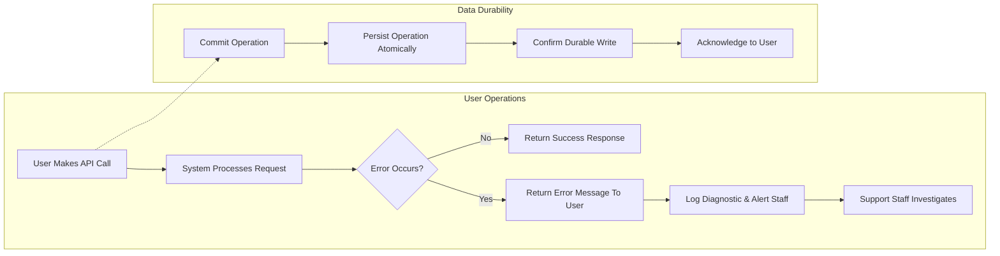

# Quality and Performance Requirements for Todo List Application

## Performance Expectations

WHEN a user requests to view their Todo list, THE system SHALL deliver a complete response, including all items, within 2 seconds for lists of up to 100 Todos.

WHEN a user creates, edits, completes, or deletes a Todo, THE system SHALL acknowledge completion of the operation within 1 second.

WHERE network latency is typical (domestic broadband), THE system SHALL ensure end-to-end operation times remain within the expected duration specified above.

THE system SHALL remain responsive for up to 1,000 concurrent standard users without degradation of the above performance guarantees.

WHEN admin users access aggregate or bulk user data, THE system SHALL deliver results within 5 seconds for workloads involving up to 1,000 users or 50,000 Todos.

WHEN an operation cannot be fulfilled within the target response time, THEN THE system SHALL present an error indicating a temporary performance issue and encourage retrying after 10 seconds.

WHEN an operation performance falls below service guarantees, THE system SHALL send an alert to system operators for investigation within 1 minute.

THE system SHALL maintain logs and aggregated metrics of operation response times for audit and continuous improvement, and SHALL be instrumented to measure all endpoints and major functional workflows.

## Usability and Accessibility

WHEN a user accesses their Todo list, THE system SHALL allow them to view, create, update, complete, and delete only their own Todos, preventing access to other users' data.

WHEN a user attempts to perform an unsupported operation (e.g., updating another user's Todo), THEN THE system SHALL present a clear error message about lack of permission.

WHEN a user performs any supported operation, THE system SHALL respond with confirmatory feedback including the operation status and relevant Todo details.

WHERE an operation fails or is invalid, THE system SHALL provide a clear business error code and message in the en-US locale.

WHEN localization is applicable, THE system SHALL always use "en-US" for business-facing communications unless otherwise localized in future enhancements.

WHEN a user interacts with the system using any client (web, mobile, etc.), THE business rules, operation availability, and backend behaviors SHALL be consistent and without functional discrimination.

## Support and Reliability

THE service SHALL be available 24 hours per day, 7 days per week, with a guaranteed minimum monthly uptime of 99.5% excluding planned maintenance windows announced at least 48 hours in advance to stakeholders.

WHEN a system-level error occurs, THEN THE system SHALL return a clear, actionable error to the user and log diagnostic details for support staff.

WHEN a transient failure occurs, THE system SHALL allow clients to retry any idempotent operation after a proper error code.

THE system SHALL guarantee durability for all committed Todo operations against system restarts, ensuring no confirmed user action is lost.

THE system SHALL retain audit logs of all user and admin operations for a minimum of 180 days for troubleshooting, compliance, and monitoring.

WHERE required, THE system SHALL provide support staff with secure access to business data needed for investigation within privacy constraints.

### Reliability Flows

## Scalability Considerations

THE system SHALL seamlessly support at least 10,000 user accounts and 1,000,000 total Todos without any change to business processes or user workflows.

WHEN system capacity reaches 80% of recommended service thresholds, THE system SHALL automatically issue internal alerts so that further capacity can be provisioned in advance of actual demand.

THE system SHALL be horizontally scalable, supporting the addition of new API or backend nodes as needed for performance, resilience, or expansion.

SHOULD future growth require, THE system SHALL allow for partitioning or sharding of data, maintaining transparent business operation and consistent user experience regardless of logical data location.

WHEN user or Todo numbers exceed baseline expectations, THE system SHALL continue to meet all documented requirements for performance, reliability, and usability via business-driven scaling mechanisms.

## Service Guarantees and SLAs

THE system SHALL provide a documented uptime SLA of 99.5% (excluding planned maintenance) published for all stakeholders.

THE system SHALL fulfil average operation response times as specified under performance expectations, and record and publish any deviations as service incidents for business review.

WHEN planned maintenance impacts SLA targets, THE system SHALL notify all business stakeholders at least 48 hours before the maintenance window.

## Summary Table: Key Targets

| Category                      | Requirement                                                               |
|-------------------------------|----------------------------------------------------------------------------|
| Max List Fetch Latency        | 2 seconds for ≤100 Todos                                                    |
| CRUD Operation Latency        | 1 second per create/update/complete/delete                                  |
| Admin Bulk Ops Latency        | 5 seconds for ≤1,000 users or 50,000 Todos                                 |
| Normal User Concurrency       | 1,000 concurrent standard users                                            |
| Uptime Guarantee              | 99.5% per month (excludes planned maintenance)                              |
| Data Retention                | 180 days audit logs                                                        |
| Supported Growth              | 10,000 users, 1,000,000 Todos (seamless business scaling)                  |
| Localization/Language         | All business operations in en-US                                            |

## Quality Measurement and Success Criteria

WHEN 99% of all user operations meet documented latency and accuracy targets per calendar month, THE system SHALL be considered to meet performance quality requirements.

WHEN audit logs prove all committed user and admin operations are never lost and reliable uptime exceeds 99.5% over rolling 30-day intervals, THE system SHALL be considered to meet business reliability expectations.

WHEN error logs, performance metrics, or user feedback indicate improvement opportunities, THE system SHALL undergo monthly quality review to ensure continuous improvement toward these requirements.

---
