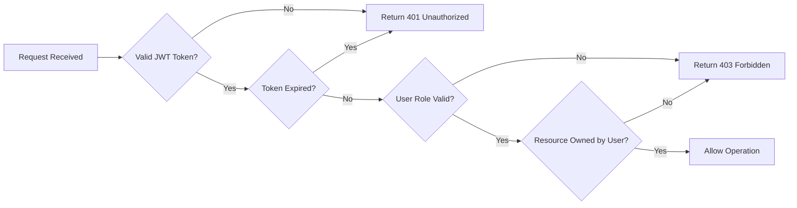

# Security and Compliance Requirements

## Security Overview

### Security Philosophy

This Todo list application follows a **security-first approach** while maintaining simplicity. Even though the application has minimal features, user data protection and privacy are paramount. The security model is designed to:

- **Protect user credentials and personal information** from unauthorized access
- **Ensure data privacy** so users can only access their own todos
- **Prevent common web security vulnerabilities** through industry-standard practices
- **Maintain transparency** about data collection and usage
- **Balance security with usability** to provide a safe yet simple user experience

### Security Principles

1. **Defense in Depth**: Multiple layers of security controls protect user data
2. **Least Privilege**: Users and systems have only the minimum access necessary
3. **Privacy by Design**: Privacy considerations are built into every feature
4. **Security by Default**: Secure configurations are the default state
5. **Transparency**: Users understand what data is collected and how it's used

### Scope of Security Measures

The security requirements cover:
- User authentication and session management
- Data protection during storage and transmission
- Access control and authorization
- Protection against common web vulnerabilities
- Privacy and compliance with data protection principles

---

## Authentication Security

### Password Security Requirements

**Password Strength Requirements:**

- WHEN a user registers or changes their password, THE system SHALL enforce a minimum password length of 8 characters.
- WHEN a user creates a password, THE system SHALL require at least one uppercase letter, one lowercase letter, one number, and one special character.
- THE system SHALL reject commonly used passwords (e.g., "password123", "12345678") using a known weak password list.
- WHEN a user attempts to set a weak password, THE system SHALL return a clear error message explaining the password requirements.

**Password Storage Security:**

- THE system SHALL NEVER store passwords in plain text.
- THE system SHALL hash all passwords using bcrypt or Argon2 with appropriate salt before storage.
- THE system SHALL use a minimum cost factor of 12 for bcrypt hashing to ensure computational difficulty.
- IF password hashing fails, THEN THE system SHALL abort the registration/password change process and return an error.

**Password Change Security:**

- WHEN a user requests to change their password, THE system SHALL require the current password for verification.
- WHEN a password is successfully changed, THE system SHALL invalidate all existing sessions and tokens for that user.
- THE system SHALL send a notification email when a password is changed successfully.

### JWT Token Security

**Token Generation and Structure:**

- THE system SHALL use JWT (JSON Web Tokens) for session management.
- THE system SHALL include userId, role, and permissions in the JWT payload.
- THE system SHALL sign all JWT tokens using a strong secret key (minimum 256 bits).
- THE system SHALL use HS256 (HMAC with SHA-256) or RS256 (RSA with SHA-256) algorithm for token signing.

**Token Expiration:**

- THE system SHALL set access token expiration to 30 minutes.
- THE system SHALL set refresh token expiration to 7 days.
- WHEN an access token expires, THE system SHALL require the user to obtain a new token using their refresh token.
- WHEN a refresh token expires, THE system SHALL require the user to log in again.

**Token Storage and Transmission:**

- THE system SHALL transmit tokens only over HTTPS connections.
- WHEN returning tokens to the client, THE system SHALL include security recommendations for token storage.
- THE system SHALL validate token signature on every authenticated request.
- IF token signature validation fails, THEN THE system SHALL return HTTP 401 Unauthorized.

### Session Security Measures

**Session Management:**

- THE system SHALL create a new session only after successful authentication.
- THE system SHALL associate each session with exactly one user.
- WHEN a user logs out, THE system SHALL invalidate their current session immediately.
- THE system SHALL provide a "logout from all devices" feature that invalidates all sessions for a user.

**Session Validation:**

- WHEN processing an authenticated request, THE system SHALL validate the token has not expired.
- WHEN processing an authenticated request, THE system SHALL verify the user account is still active.
- IF a session token is invalid or expired, THEN THE system SHALL return HTTP 401 Unauthorized with error code AUTH_SESSION_INVALID.

### Login Attempt Management

**Brute Force Protection:**

- THE system SHALL track failed login attempts per user account.
- WHEN a user has 5 consecutive failed login attempts, THE system SHALL temporarily lock the account for 15 minutes.
- WHEN an account is locked, THE system SHALL return HTTP 429 Too Many Requests with error code AUTH_ACCOUNT_LOCKED.
- WHEN the lockout period expires, THE system SHALL automatically unlock the account.
- THE system SHALL reset the failed login attempt counter after a successful login.

**Login Monitoring:**

- THE system SHALL log all login attempts (successful and failed) with timestamp, IP address, and user agent.
- WHEN a successful login occurs from a new device or location, THE system SHALL send a notification email to the user.
- THE system SHALL provide users access to their recent login activity.

### Account Security Features

**Email Verification:**

- WHEN a user registers, THE system SHALL send a verification email with a unique token.
- THE system SHALL require email verification before allowing full account access.
- THE system SHALL set email verification tokens to expire after 24 hours.
- IF an expired verification token is used, THEN THE system SHALL allow the user to request a new verification email.

**Password Recovery:**

- WHEN a user requests password reset, THE system SHALL send a password reset link to their registered email.
- THE system SHALL generate unique, single-use password reset tokens.
- THE system SHALL set password reset tokens to expire after 1 hour.
- WHEN a password reset token is used, THE system SHALL invalidate it immediately.
- THE system SHALL invalidate all password reset tokens when a password is successfully changed.

---

## Data Protection Requirements

### User Data Encryption Requirements

**Data at Rest:**

- THE system SHALL encrypt sensitive user data (email, personal information) at rest in the database.
- THE system SHALL use AES-256 encryption for sensitive data storage.
- THE system SHALL manage encryption keys securely and separately from encrypted data.
- THE system SHALL NEVER log or display encryption keys in application logs or error messages.

**Data in Transit:**

- THE system SHALL use HTTPS (TLS 1.2 or higher) for all client-server communications.
- THE system SHALL reject all HTTP requests and redirect to HTTPS.
- THE system SHALL use secure cipher suites for TLS connections.
- THE system SHALL implement HTTP Strict Transport Security (HSTS) headers.

### Password Storage Security

- THE system SHALL NEVER store passwords in reversible encryption.
- THE system SHALL NEVER include passwords in API responses, logs, or error messages.
- THE system SHALL NEVER send passwords via email or any other communication channel.
- WHEN a user forgets their password, THE system SHALL provide password reset functionality, not password retrieval.

### Personal Information Protection

**Data Minimization:**

- THE system SHALL collect only essential user information: email and password.
- THE system SHALL NOT collect unnecessary personal information.
- THE system SHALL allow users to use the service with minimal personal data disclosure.

**Data Access Controls:**

- THE system SHALL ensure users can access only their own todo items.
- THE system SHALL enforce authorization checks on every data access request.
- IF a user attempts to access another user's data, THEN THE system SHALL return HTTP 403 Forbidden with error code ACCESS_DENIED.

### Data Transmission Security

**API Security:**

- THE system SHALL validate all input data before processing.
- THE system SHALL sanitize all user input to prevent injection attacks.
- THE system SHALL return error messages that do not expose sensitive system information.
- THE system SHALL include security headers in all HTTP responses.

**Content Security:**

- THE system SHALL implement Content Security Policy (CSP) headers.
- THE system SHALL set X-Content-Type-Options: nosniff header.
- THE system SHALL set X-Frame-Options: DENY header to prevent clickjacking.
- THE system SHALL set X-XSS-Protection: 1; mode=block header.

---

## Privacy Requirements

### User Privacy Principles

The application is designed with privacy as a core value:

1. **Data Ownership**: Users own their todo data and have full control over it
2. **Data Minimization**: Only essential data is collected
3. **Purpose Limitation**: Data is used only for providing todo list functionality
4. **Transparency**: Users know what data is collected and how it's used
5. **User Control**: Users can export, modify, and delete their data

### Data Collection Transparency

**What Data is Collected:**

- THE system SHALL collect and store user email addresses for authentication purposes.
- THE system SHALL collect and store user passwords in hashed form for authentication.
- THE system SHALL collect and store todo items created by users.
- THE system SHALL collect and store timestamps for user registration, login activity, and todo operations.

**How Data is Used:**

- THE system SHALL use email addresses solely for authentication and account-related notifications.
- THE system SHALL use passwords solely for authentication verification.
- THE system SHALL use todo data solely to provide todo list management functionality.
- THE system SHALL NEVER sell, rent, or share user data with third parties.
- THE system SHALL NEVER use user data for advertising or marketing purposes without explicit consent.

### User Data Ownership

**Data Access Rights:**

- THE system SHALL allow users to view all their personal data at any time.
- THE system SHALL provide users with the ability to export their todo data in JSON format.
- WHEN a user requests data export, THE system SHALL generate a complete export within 24 hours.

**Data Modification Rights:**

- THE system SHALL allow users to update their email address.
- THE system SHALL allow users to change their password.
- THE system SHALL allow users to edit or delete any of their todo items.

**Data Deletion Rights:**

- THE system SHALL provide users with the ability to delete their account.
- WHEN a user deletes their account, THE system SHALL permanently delete all associated data within 30 days.
- WHEN a user deletes their account, THE system SHALL send a confirmation email.
- THE system SHALL allow a 7-day grace period during which account deletion can be cancelled.

### Privacy by Design Approach

**Default Privacy Settings:**

- THE system SHALL make all user todos private by default (not shared with other users).
- THE system SHALL NOT enable any data sharing features without explicit user action.
- THE system SHALL implement strong authentication by default.

**Data Retention:**

- THE system SHALL retain user data only while the account is active.
- WHEN an account is deleted, THE system SHALL remove all personal data within 30 days.
- THE system SHALL retain only anonymous usage statistics after account deletion, if any.

### User Consent Requirements

**Account Creation Consent:**

- WHEN a user registers, THE system SHALL present clear terms of service and privacy policy.
- THE system SHALL require explicit acceptance of terms before account creation.
- THE system SHALL provide links to privacy policy and terms of service on registration page.

**Communication Consent:**

- THE system SHALL send only essential transactional emails (verification, password reset, security alerts).
- THE system SHALL NOT send marketing emails unless user explicitly opts in.
- THE system SHALL provide clear unsubscribe options for non-essential communications.

---

## Access Control

### Authorization Mechanisms

**Role-Based Access Control:**

- THE system SHALL implement role-based access control (RBAC) with two roles: guest and user.
- THE system SHALL enforce role permissions on every API request.
- WHEN a guest attempts to access user-only resources, THE system SHALL return HTTP 401 Unauthorized.
- WHEN an authenticated user attempts unauthorized actions, THE system SHALL return HTTP 403 Forbidden.

**Permission Validation:**

- THE system SHALL validate user permissions before executing any data operation.
- THE system SHALL verify JWT token validity and role claims for all protected endpoints.
- IF token validation fails, THEN THE system SHALL reject the request with appropriate error code.

### Resource Access Controls

**Todo Access Control:**

- THE system SHALL allow users to access only their own todo items.
- WHEN retrieving todos, THE system SHALL filter results to include only todos owned by the requesting user.
- WHEN updating a todo, THE system SHALL verify the todo belongs to the requesting user.
- WHEN deleting a todo, THE system SHALL verify the todo belongs to the requesting user.
- IF a user attempts to access another user's todo, THEN THE system SHALL return HTTP 403 Forbidden with error code RESOURCE_NOT_OWNED.

**User Data Access Control:**

- THE system SHALL allow users to view and modify only their own profile information.
- THE system SHALL prevent users from viewing or modifying other users' account information.
- THE system SHALL enforce user data isolation at the application layer.

### User Data Isolation

**Data Segregation:**

- THE system SHALL maintain strict data separation between different user accounts.
- THE system SHALL use userId as the primary isolation mechanism for all user-generated content.
- THE system SHALL validate userId matches the authenticated user on all data access operations.

**Query-Level Isolation:**

- WHEN querying todos, THE system SHALL include userId in the WHERE clause to ensure data isolation.
- THE system SHALL implement prepared statements or parameterized queries to prevent SQL injection.
- THE system SHALL validate all query parameters before execution.

### Permission Enforcement

**API Endpoint Protection:**

- THE system SHALL protect all user-specific endpoints with authentication middleware.
- THE system SHALL reject requests without valid JWT tokens to protected endpoints.
- THE system SHALL implement consistent authorization checks across all endpoints.

**Operation-Level Permissions:**

---

## Security Best Practices

### Input Validation and Sanitization

**Input Validation Requirements:**

- THE system SHALL validate all user input before processing.
- THE system SHALL enforce data type validation for all input fields.
- THE system SHALL enforce length limits on all text input fields.
- THE system SHALL reject requests with invalid or malformed data.

**Email Validation:**

- WHEN a user provides an email address, THE system SHALL validate it matches standard email format.
- THE system SHALL reject email addresses with invalid characters or format.
- THE system SHALL normalize email addresses to lowercase before storage.

**Todo Content Validation:**

- WHEN a user creates or updates a todo, THE system SHALL validate title is not empty.
- THE system SHALL enforce maximum length of 200 characters for todo titles.
- THE system SHALL enforce maximum length of 2000 characters for todo descriptions.
- THE system SHALL reject todo submissions exceeding length limits.

**Sanitization:**

- THE system SHALL sanitize all user input to remove potentially dangerous content.
- THE system SHALL escape HTML special characters in user-generated content.
- THE system SHALL prevent script injection through todo titles and descriptions.

### Protection Against Common Vulnerabilities

**SQL Injection Prevention:**

- THE system SHALL use parameterized queries or prepared statements for all database operations.
- THE system SHALL NEVER construct SQL queries using string concatenation with user input.
- THE system SHALL validate and sanitize all input before database operations.

**Cross-Site Scripting (XSS) Prevention:**

- THE system SHALL encode all user-generated content before rendering.
- THE system SHALL implement Content Security Policy headers to prevent inline script execution.
- THE system SHALL sanitize HTML input and remove potentially dangerous tags and attributes.

**Cross-Site Request Forgery (CSRF) Prevention:**

- THE system SHALL implement CSRF protection for state-changing operations.
- THE system SHALL validate request origin headers for sensitive operations.
- WHEN using cookies for authentication, THE system SHALL set SameSite attribute to Strict or Lax.

**Directory Traversal Prevention:**

- THE system SHALL validate all file paths and prevent directory traversal attempts.
- THE system SHALL reject input containing path traversal sequences (../, ..\\).
- THE system SHALL use whitelisting for allowed file operations.

**Injection Attack Prevention:**

- THE system SHALL validate and sanitize all user input to prevent command injection.
- THE system SHALL avoid executing system commands with user-provided input.
- THE system SHALL use secure coding practices to prevent NoSQL injection if using NoSQL databases.

### Security Headers and Configurations

**Required Security Headers:**

- THE system SHALL include the following security headers in all HTTP responses:
  - `Strict-Transport-Security: max-age=31536000; includeSubDomains`
  - `X-Content-Type-Options: nosniff`
  - `X-Frame-Options: DENY`
  - `X-XSS-Protection: 1; mode=block`
  - `Content-Security-Policy: default-src 'self'`
  - `Referrer-Policy: strict-origin-when-cross-origin`

**Cookie Security:**

- IF using cookies for tokens, THE system SHALL set HttpOnly flag to prevent JavaScript access.
- IF using cookies for tokens, THE system SHALL set Secure flag to ensure HTTPS-only transmission.
- IF using cookies for tokens, THE system SHALL set SameSite attribute to prevent CSRF attacks.

### Audit Logging Requirements

**Security Event Logging:**

- THE system SHALL log all authentication events (login, logout, registration, password changes).
- THE system SHALL log all failed authentication attempts with timestamp and IP address.
- THE system SHALL log all account security events (email verification, password reset).
- THE system SHALL log all authorization failures with requested resource and user ID.

**Log Content Requirements:**

- THE system SHALL include timestamp, user ID (if applicable), IP address, and event type in all logs.
- THE system SHALL NEVER log sensitive information (passwords, tokens, encryption keys).
- THE system SHALL log only the outcome of operations, not the sensitive data involved.

**Log Security:**

- THE system SHALL protect log files from unauthorized access.
- THE system SHALL implement log rotation to prevent disk space exhaustion.
- THE system SHALL retain security logs for at least 90 days.

### Security Monitoring

**Anomaly Detection:**

- THE system SHOULD monitor for unusual patterns indicating security threats:
  - Multiple failed login attempts from same IP
  - Rapid account creation from same IP
  - Unusual API request patterns
  - Multiple password reset requests

**Alerting:**

- WHEN suspicious activity is detected, THE system SHOULD generate alerts for review.
- WHEN account lockout occurs, THE system SHALL notify the user via email.
- WHEN password is changed, THE system SHALL send confirmation email to the user.

---

## Compliance Considerations

### General Data Protection Principles

While this is a minimal application, it follows fundamental data protection principles aligned with modern privacy regulations:

**Lawfulness and Transparency:**

- THE system SHALL process user data only for legitimate purposes (providing todo list functionality).
- THE system SHALL clearly inform users about data collection and usage through a privacy policy.
- THE system SHALL obtain user consent before processing personal data.

**Purpose Limitation:**

- THE system SHALL use collected data only for the purposes disclosed to users.
- THE system SHALL NOT repurpose user data without obtaining new consent.
- THE system SHALL limit data collection to what is necessary for service functionality.

**Data Minimization:**

- THE system SHALL collect only the minimum data necessary: email and password for authentication, todo content for functionality.
- THE system SHALL NOT request unnecessary personal information.
- THE system SHALL avoid collecting sensitive personal data categories unless absolutely necessary.

**Accuracy:**

- THE system SHALL provide users with mechanisms to update their personal information.
- THE system SHALL allow users to correct inaccurate data.

**Storage Limitation:**

- THE system SHALL retain personal data only while user accounts are active.
- WHEN an account is deleted, THE system SHALL remove personal data within 30 days.

**Integrity and Confidentiality:**

- THE system SHALL implement appropriate security measures to protect personal data.
- THE system SHALL encrypt sensitive data in transit and at rest.
- THE system SHALL implement access controls to prevent unauthorized data access.

### Privacy Regulation Awareness

**GDPR Considerations (if serving EU users):**

The application design considers GDPR principles:

- **Right to Access**: Users can view all their data
- **Right to Rectification**: Users can update their information
- **Right to Erasure**: Users can delete their account and all data
- **Right to Data Portability**: Users can export their data in JSON format
- **Right to Object**: Users can opt out of non-essential communications

**CCPA Considerations (if serving California users):**

The application design considers CCPA principles:

- Users can access their personal information
- Users can delete their personal information
- Users are informed about data collection practices
- User data is not sold to third parties

**General Privacy Best Practices:**

- THE system SHALL provide a clear and accessible privacy policy.
- THE system SHALL update users about any material changes to privacy practices.
- THE system SHALL implement reasonable security measures for user data protection.
- THE system SHALL respond to user privacy requests within reasonable timeframes.

### User Rights and Data Subject Rights

**Access Requests:**

- THE system SHALL provide users with access to their personal data within 30 days of request.
- THE system SHALL provide data in a structured, commonly used format (JSON).

**Deletion Requests:**

- THE system SHALL process account deletion requests within 7 days.
- THE system SHALL complete data deletion within 30 days of account deletion.
- THE system SHALL send confirmation when deletion is complete.

**Rectification Requests:**

- THE system SHALL allow users to update their email address and password immediately.
- THE system SHALL allow users to edit their todo items at any time.

**Data Portability:**

- THE system SHALL provide users with data export functionality.
- THE system SHALL export data in JSON format for easy portability.
- THE system SHALL include all user todos and account information in exports.

### Compliance Best Practices

**Privacy Policy:**

- THE system SHALL maintain an up-to-date privacy policy accessible to all users.
- THE system SHALL present the privacy policy during account registration.
- THE system SHALL notify users of material privacy policy changes.

**Terms of Service:**

- THE system SHALL maintain clear terms of service outlining user and service provider responsibilities.
- THE system SHALL require acceptance of terms before account creation.

**Security Incident Response:**

- THE system SHALL have a plan for responding to security incidents and data breaches.
- IF a data breach occurs affecting user data, THEN THE system SHALL notify affected users within 72 hours.
- THE system SHALL document security incidents and response actions.

**Regular Security Reviews:**

- The development team SHOULD conduct regular security reviews and updates.
- The development team SHOULD stay informed about emerging security threats and vulnerabilities.
- The development team SHOULD apply security patches and updates promptly.

---

## Summary

This security and compliance document establishes comprehensive protection measures for the Todo list application. Despite being a minimal application, security is never compromised. The requirements ensure:

- **Strong authentication** with password security and JWT token management
- **Robust data protection** through encryption and access controls
- **User privacy** through data minimization and transparency
- **Protection against common vulnerabilities** through security best practices
- **Compliance readiness** with modern privacy regulations

All security requirements are designed to be practical, implementable, and appropriate for a minimal todo application while maintaining professional-grade security standards. Backend developers have full autonomy to implement these requirements using appropriate technologies and architectures of their choice.