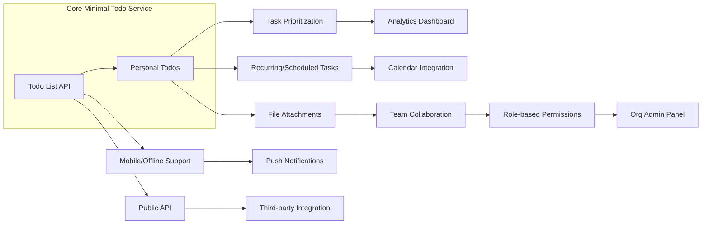

# Future Considerations and Opportunities for the Todo List Application

## 1. Optional and Nice-to-Have Features

The roadmap for the Todo list application includes optional and non-mandatory features to significantly increase user value, retention, and differentiation. These features are not included in the initial minimum deployment, but are future possibilities to expand user scenarios, address market gaps, and strengthen competitiveness.

### 1.1 Recurring and Scheduled Todos
- WHEN a user wants to automate task repetition, THE system SHALL enable recurring Todos with user-defined intervals (e.g., daily, weekly, monthly, custom).
- WHEN users add due dates to Todo items, THE system SHALL deliver reminders ahead of deadlines using configurable channels (such as email, push notifications, SMS, or integrations).

### 1.2 Task Prioritization and Categorization
- WHEN users wish to self-organize, THE system SHALL allow assigning priorities (e.g., high, medium, low) to each Todo for better visual sorting and filtering.
- WHEN users need better overview, THE system SHALL enable tagging or categorizing Todos, supporting customized views and improved navigation.

### 1.3 Task Sharing and Collaboration
- WHEN multiple users want to collaborate, THE system SHALL facilitate the sharing of individual Todos or entire lists, with permissions for viewing, editing, assigning, or completing tasks collaboratively.
- WHEN a shared task is updated, THE system SHALL instantly synchronize changes across collaborators, maintaining a single source of truth.

### 1.4 File Attachments and Notes
- WHEN users need rich context for tasks, THE system SHALL provide file attachment functionality (e.g., images, documents, links) and allow adding formatted notes to individual Todos.

### 1.5 Smart Reminders and Intelligent Suggestions
- WHEN a Todo’s deadline approaches, THE system SHALL proactively remind users, leveraging chosen notification methods.
- WHEN behavior patterns are detected (e.g., similar tasks completed on specific days), THE system SHALL recommend optimized recurring schedules or next action suggestions.

### 1.6 Integration With Other Services
- WHEN productivity improvements are possible through other tools, THE system SHALL provide calendar integrations (e.g., Google Calendar, Outlook), team messaging connections, and sync or import/export features using common industry standards (CSV, iCal, Webhooks).
- WHEN exporting or importing Todos, THE system SHALL ensure data accuracy and seamless user experience across platforms.

### 1.7 Advanced Search and Filtering
- WHEN users manage high volumes of tasks, THE system SHALL offer advanced search, filtering, and batch editing tools (e.g., by status, assignee, due date, priority, tag).

### 1.8 Mobile and Offline Features
- WHEN users access the service on mobile or have unstable networks, THE system SHALL deliver a responsive interface with offline access and auto-sync upon reconnection.

## 2. Scalability and Integration Opportunities

Further architectural and business model developments may enable the Todo list application to grow well beyond personal task management, unlocking value for enterprise and new markets.

### 2.1 Multi-Tenancy and Organizational Management
- WHEN organizations require collaborative productivity, THE system SHALL support multi-tenant workspaces, allowing admins to manage members, permissions, and analytics across teams.

### 2.2 Localization and Accessibility
- WHEN addressing global users, THE system SHALL support multiple languages, local date/time formatting, and prioritize compliance with accessibility standards (such as WCAG) for maximum inclusivity.

### 2.3 Analytics and Reporting
- WHEN usage data is available and users want to track progress, THE system SHALL offer personal and organization-wide dashboards with productivity metrics, trend analysis, and exportable reports.

### 2.4 API and Platform Extension
- WHEN developer extensibility is required, THE system SHALL expose a comprehensive API for integration with third-party services and support platform extensions such as plugins, automation scripts, or bots, with robust documentation and example use cases.

#### Mermaid Diagram: Possible Future Integration and Expansion Paths

## 3. Planned Improvements

The team is committed to continuous enhancement of the Todo list system, ensuring sustainable growth, robust usability, and security as the product evolves.

### 3.1 User Feedback and Iterative Development
- WHEN user feedback is collected by surveys, in-app forms, or support requests, THE team SHALL review and prioritize findings to guide future feature releases and improvements.

### 3.2 Enhanced Onboarding and Support
- WHEN complexity increases, THE system SHALL include guided onboarding flows, updated knowledge bases, tutorial videos, and responsive support channels.

### 3.3 Security and Privacy Enhancements
- WHEN new integrations and features are released, THE system SHALL regularly update and test security policies and privacy controls to comply with emerging regulations and best practices.

### 3.4 Performance and Reliability Upgrades
- WHEN traffic or data growth exceeds current thresholds, THE system SHALL adopt scalable infrastructure strategies to maintain speed, reliability, and high availability, including disaster recovery solutions.

---

By setting these future considerations, the Todo list application’s product team secures a roadmap for ongoing innovation, ensuring flexibility and competitiveness as user needs grow and evolve.