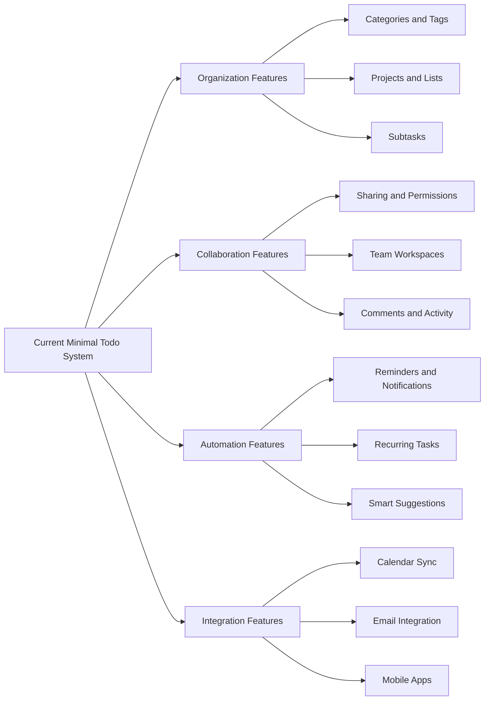
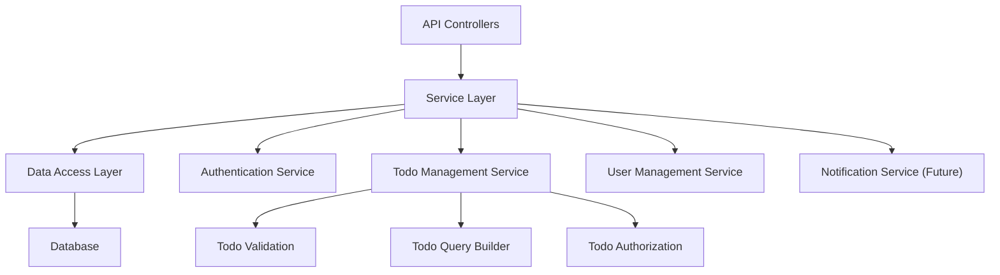

# Future Considerations and Scalability Planning

## Introduction

### Purpose of This Document

This document outlines potential future enhancements, scalability considerations, and architectural guidance for the Todo list application. While the initial version focuses on minimal essential functionality, this document helps the development team make informed decisions that support future growth without over-engineering the current solution.

The goal is to build a simple, working application today while avoiding architectural decisions that would require complete rewrites when new features are needed tomorrow.

### Balance Between Minimal MVP and Future Readiness

THE system SHALL be built with minimal features in the initial version while maintaining architectural patterns that support future enhancements. The development team should prioritize shipping a working product quickly over building for hypothetical future needs, but should avoid design choices that create unnecessary technical debt.

**Core Principle**: Build the simplest thing that works, but build it in a way that doesn't block obvious future improvements.

### How to Use This Document

Development teams should reference this document when:
- Making architectural decisions about data models, API design, or system structure
- Evaluating trade-offs between simple immediate solutions and flexible future-ready approaches
- Prioritizing which design patterns to implement in the initial version
- Identifying which hard-coded limitations to avoid

This document provides guidance, not requirements. Features listed here are possibilities, not commitments.

## Potential Future Features

### Overview of Feature Categories

The following sections describe features that users commonly request in task management applications. These represent natural evolution paths for the Todo list application based on user needs and market trends.

### Categorization and Organization

**Categories and Tags**

WHEN users accumulate many todo items, THE system SHALL support organizing todos into categories or applying multiple tags for better organization. Users might want to separate "Work", "Personal", "Shopping", "Health" or apply tags like "urgent", "quick-win", "waiting-on-others".

**Business Value**: Users can find and focus on relevant todos more easily, reducing cognitive load and improving productivity.

**Architectural Consideration**: The current data model should allow for optional category or tag relationships without requiring them. Consider whether a todo can belong to multiple categories or if tags provide more flexibility.

**Projects and Lists**

Users may want to group related todos into projects or separate lists. For example, "Website Redesign Project" might contain 15 related todo items, or users might maintain separate lists like "Daily Habits", "Long-term Goals", "Ideas".

**Business Value**: Provides context and structure for complex multi-step goals, helping users see progress on larger initiatives.

**Architectural Consideration**: THE system architecture SHOULD support hierarchical or grouped organization without requiring it in the minimal version.

**Subtasks and Hierarchical Todos**

WHEN a todo item is complex, THE system SHALL allow users to break it down into smaller subtasks. For example, "Plan vacation" might include subtasks: "Research destinations", "Book flights", "Reserve hotel", "Create itinerary".

**Business Value**: Large tasks become less overwhelming when broken into actionable steps. Users gain satisfaction from completing subtasks, maintaining momentum.

**Architectural Consideration**: The data model should theoretically support parent-child relationships between todo items. The API should be designed so that fetching a todo could optionally include its subtasks without breaking existing functionality.

### Collaboration and Sharing

**Sharing Individual Todos**

Users might want to share specific todo items with family members, roommates, or colleagues. For example, sharing a grocery list or delegating a task to a team member.

**Business Value**: Extends the application's usefulness beyond individual productivity to household and team coordination.

**Architectural Consideration**: THE system SHALL enforce todo ownership and isolation in the current version, but the permission model SHOULD be designed to potentially support granular sharing permissions in the future.

**Team Workspaces**

WHEN organizations adopt the application, THE system SHALL support team workspaces where multiple users collaborate on shared todo lists with different permission levels (viewer, contributor, admin).

**Business Value**: Transforms the application from personal productivity tool to team collaboration platform, significantly expanding the addressable market.

**Architectural Consideration**: The current single-user architecture should use patterns that could extend to multi-user scenarios. User isolation should be enforced through permission checks rather than hard-coded single-user assumptions.

**Comments and Activity Tracking**

Collaborative todos would benefit from comment threads and activity logs showing who completed what and when.

**Business Value**: Provides context and communication around shared tasks, reducing the need for separate messaging about task status.

**Architectural Consideration**: Consider whether the data model could support timestamped events or comments associated with todo items.

### Automation and Smart Features

**Reminders and Notifications**

WHEN a todo has a due date approaching, THE system SHALL send reminders via email, push notification, or in-app notification. Users might want reminders 1 day before, 1 hour before, or custom intervals.

**Business Value**: Prevents users from forgetting time-sensitive tasks, increasing the application's value for deadline-driven work.

**Architectural Consideration**: The current system should store due dates in a format that supports future time-based queries. Consider how the backend could trigger time-based events without requiring polling.

**Potential Future Requirements**:
- WHEN a todo has a due date within 24 hours, THE system SHALL send a reminder notification to the user
- WHEN a todo becomes overdue, THE system SHALL highlight it visually and optionally send a notification
- THE system SHALL allow users to customize reminder preferences (timing, channels, frequency)

**Recurring Tasks**

Users often have tasks that repeat daily, weekly, monthly, or on custom schedules (e.g., "Take vitamins" daily, "Pay rent" monthly, "Quarterly tax payment").

**Business Value**: Saves users time by automatically recreating routine tasks, ensuring regular responsibilities aren't forgotten.

**Architectural Consideration**: Consider whether completed todos should be preserved or if recurring todos are templates that generate new instances.

**Smart Suggestions and AI Features**

Future versions might use AI to:
- Suggest task priorities based on due dates and user behavior
- Auto-categorize todos based on content
- Estimate task duration based on historical data
- Suggest optimal times to work on specific tasks
- Identify forgotten or stale todos

**Business Value**: Reduces manual organization effort and provides intelligent assistance for productivity optimization.

**Architectural Consideration**: Ensure user data and todo metadata are structured in ways that could support machine learning analysis while respecting privacy requirements.

### Platform Expansion

**Mobile Applications**

WHEN users are away from their computers, THE system SHALL provide native mobile applications (iOS and Android) with full todo management capabilities.

**Business Value**: Todos are captured and checked anywhere, making the application more useful for on-the-go users.

**Architectural Consideration**: THE current API design SHOULD use RESTful principles or GraphQL that work equally well for web and mobile clients. Authentication should use tokens (JWT) that mobile apps can securely store.

**Offline Support**

Mobile users often lose connectivity. THE system SHALL allow users to view, create, and modify todos while offline, with automatic synchronization when connection is restored.

**Business Value**: Ensures the application remains useful regardless of network conditions, critical for mobile users.

**Architectural Consideration**: Consider eventual consistency models and conflict resolution strategies. The API should support batch operations and timestamp-based synchronization.

**Progressive Web App (PWA)**

As an alternative or complement to native mobile apps, a progressive web app would provide installable, offline-capable web experience.

**Business Value**: Provides mobile-like experience with lower development cost than native apps, works across all platforms.

**Architectural Consideration**: The frontend architecture should support service workers and offline storage mechanisms.

### Integration Capabilities

**Calendar Integration**

WHEN todos have due dates, THE system SHALL synchronize with calendar applications (Google Calendar, Outlook, Apple Calendar) so users see todos alongside meetings and events.

**Business Value**: Provides unified view of time commitments, helping users plan realistically.

**Architectural Consideration**: THE system SHOULD expose todo data through standard APIs that calendar applications can consume, or integrate with calendar APIs to push todo information.

**Email Integration**

Users might want to:
- Create todos by forwarding emails to a special address
- Receive daily summaries of todos
- Get todo notifications via email
- Convert emails into todos automatically

**Business Value**: Meets users where they already work (email), reducing friction in task capture.

**Architectural Consideration**: The system should support webhook-style incoming data and email delivery mechanisms.

**Third-Party API**

WHEN the application gains traction, THE system SHALL provide a public API allowing third-party developers to build integrations and extensions.

**Business Value**: Creates ecosystem around the application, increasing stickiness and addressing niche use cases without internal development.

**Architectural Consideration**: THE current API SHOULD be designed with clear versioning, comprehensive documentation, and authentication suitable for third-party access (OAuth 2.0).

## Scalability Considerations

### User Growth Projections

The minimal version should easily support 1,000 concurrent users and 100,000 total users without architectural changes. However, the system should be built with patterns that allow scaling to:

- **Short-term (Year 1)**: 10,000 concurrent users, 500,000 total users
- **Medium-term (Year 2-3)**: 50,000 concurrent users, 5 million total users
- **Long-term (Year 5+)**: 500,000 concurrent users, 50 million total users

**Business Implication**: THE system architecture SHOULD avoid hard-coded limits that would require rewrites when user growth exceeds initial expectations.

### Data Volume Growth

**Todo Item Volume**

IF users create an average of 50 todos per user over their lifetime, THEN the system SHOULD efficiently handle:
- Year 1: 25 million todo items
- Year 3: 250 million todo items
- Year 5: 2.5 billion todo items

**Performance Requirement**: WHEN querying a user's todos (typical 20-100 items), THE system SHALL respond within 500 milliseconds regardless of total system todo count.

**Architectural Consideration**: Database indexing strategies, query optimization, and potentially data partitioning should be considered. The data model should support efficient user-scoped queries.

### Performance Scaling Strategies

**Horizontal Scaling**

THE application architecture SHOULD support horizontal scaling by adding more server instances behind a load balancer. This means avoiding server-side session state and using stateless authentication (JWT tokens).

**Current Decision**: Use JWT-based authentication rather than server-side sessions, enabling any server instance to handle any request.

**Database Scaling**

**Read Replicas**: WHEN read traffic grows, THE system SHALL support database read replicas to distribute query load while maintaining a single write master.

**Sharding**: IF the application reaches tens of millions of users, THE system SHALL support database sharding (partitioning users across multiple database instances).

**Architectural Consideration**: User data isolation (each user only sees their own todos) naturally supports sharding by user ID. The current design should avoid cross-user queries that would complicate future sharding.

**Caching Strategies**

WHEN the application serves thousands of concurrent users, THE system SHALL implement caching to reduce database load:

- **User session caching**: Cache user authentication state
- **Todo list caching**: Cache frequently accessed todo lists
- **Query result caching**: Cache common query results

**Architectural Consideration**: THE system SHOULD use cache-friendly patterns (e.g., versioned cache keys, cache invalidation on updates) even if caching isn't implemented in version 1.

### Infrastructure Scalability

**Content Delivery Network (CDN)**

WHEN the application serves global users, THE system SHALL use CDN for static assets (JavaScript, CSS, images) to reduce latency.

**Current Consideration**: Structure frontend assets to be CDN-compatible (fingerprinted filenames, cache headers).

**Geographic Distribution**

IF the application gains significant international usage, THE system SHALL support deploying application servers and database replicas in multiple geographic regions to reduce latency.

**Architectural Consideration**: Design APIs to be region-agnostic, avoiding hard-coded regional assumptions.

## Integration Opportunities

### Communication Integrations

**Slack Integration**

Users might want to create todos from Slack messages or receive todo notifications in Slack channels.

**Business Value**: Captures tasks where team communication happens, particularly valuable for work-related todos.

**Microsoft Teams Integration**

Similar to Slack, integrating with Microsoft Teams would serve enterprise users who standardize on Microsoft ecosystem.

**Business Value**: Expands addressability to enterprise market segment.

### Productivity Tool Integrations

**Project Management Tools**

Integration with tools like Jira, Asana, or Trello could allow:
- Syncing todos with project management tasks
- Converting todos into formal project tasks
- Viewing project tasks as personal todos

**Business Value**: Bridges personal productivity and team project management, serving users who work in both contexts.

**Time Tracking Integration**

Integration with time tracking tools (Toggl, Harvest, Clockify) could allow users to track time spent on todos.

**Business Value**: Provides insights into time usage and supports billing for professional users.

### Automation Platforms

**Zapier/Make Integration**

WHEN users want to automate todo creation or actions, THE system SHALL integrate with automation platforms like Zapier or Make, enabling workflows like:
- Create todo when email arrives with specific subject
- Add todo to spreadsheet when completed
- Create calendar event when todo is assigned due date

**Business Value**: Enables unlimited custom integrations without building each one internally.

**IFTTT Integration**

Consumer-focused automation enabling simple triggers like:
- Create todo when location is detected (arrive at grocery store)
- Complete todo when smart home device is activated
- Create todo from voice assistant command

**Business Value**: Serves consumer market with IoT and smart home integration.

### Cloud Storage Integration

**File Attachment from Cloud Storage**

WHEN todo items need supporting documents, THE system SHALL allow attaching files from Dropbox, Google Drive, OneDrive, or other cloud storage services.

**Business Value**: Provides context for todos without requiring separate file upload infrastructure.

**Architectural Consideration**: Store file references/links rather than hosting files, reducing storage and infrastructure costs.

## Enhancement Possibilities

### Advanced Filtering and Search

**Powerful Search Capabilities**

WHEN users have hundreds of todos, THE system SHALL provide advanced search including:
- Full-text search across todo titles and descriptions
- Filter by due date ranges
- Filter by completion status
- Filter by multiple categories or tags simultaneously
- Search with boolean operators (AND, OR, NOT)
- Save custom filter views

**Business Value**: Users can quickly find specific todos or focus on relevant subsets, maintaining productivity as todo count grows.

**Performance Requirement**: WHEN searching across thousands of todos, THE system SHALL return results within 1 second.

**Architectural Consideration**: Consider full-text search engines (Elasticsearch, Algolia) for large-scale search. Database indexes should support common filter queries efficiently.

### Analytics and Insights

**Personal Productivity Analytics**

THE system SHALL provide users with insights about their productivity patterns:
- Completion rate over time
- Most productive days/times
- Average time to complete todos
- Category distribution analysis
- Overdue task trends

**Business Value**: Helps users understand their productivity patterns and identify improvement opportunities, increasing engagement and perceived value.

**Team Analytics (Future)**

For team workspaces, provide:
- Team completion rates
- Workload distribution across team members
- Bottleneck identification
- Velocity tracking

**Business Value**: Provides management insights for team productivity optimization.

**Architectural Consideration**: THE system SHOULD track creation timestamps, completion timestamps, and modification history to support analytics without requiring schema changes.

### Customization and Personalization

**Themes and Visual Customization**

THE system SHALL allow users to customize visual appearance with:
- Light and dark themes
- Color scheme options
- Font size preferences
- Layout density options

**Business Value**: Improves accessibility and user satisfaction through personalization.

**Custom Fields**

Advanced users might want custom metadata fields on todos (e.g., "Energy Level Required", "Context", "Estimated Duration").

**Business Value**: Serves power users with specialized workflows without cluttering the interface for casual users.

**Architectural Consideration**: Consider extensible data models that support optional metadata without requiring schema migrations.

### Import and Export Capabilities

**Data Export**

THE system SHALL allow users to export their todo data in standard formats:
- CSV export for spreadsheet analysis
- JSON export for backup and data portability
- Integration with backup services

**Business Value**: Gives users confidence in data ownership and prevents lock-in concerns.

**Data Import**

THE system SHALL allow users to import todos from:
- CSV files
- Competitor applications (migration tools)
- Standard formats (iCalendar for tasks)

**Business Value**: Reduces friction when users switch from competing solutions, lowering acquisition barriers.

**Architectural Consideration**: Design stable data formats that support forward compatibility as features evolve.

## Architecture Future-Proofing

### API Design Principles for Extensibility

**RESTful API Design**

THE current API SHOULD follow RESTful principles:
- Resource-based URLs (e.g., `/api/todos`, `/api/users`)
- Standard HTTP methods (GET, POST, PUT, DELETE, PATCH)
- Consistent response formats
- Proper HTTP status codes

**Versioning Strategy**

THE API SHOULD implement versioning from the start (e.g., `/api/v1/todos`) to allow future breaking changes without disrupting existing clients.

**Business Requirement**: WHEN API changes are needed, THE system SHALL maintain backward compatibility for at least one major version, giving clients time to migrate.

**Pagination and Filtering**

THE API SHOULD support pagination parameters even if initial todo counts don't require it:
- `?page=1&limit=20` or cursor-based pagination
- `?filter[status]=incomplete`
- `?sort=-createdAt` (descending by creation date)

**Future-Proofing**: Early clients that implement pagination won't break when todo lists grow large.

**Partial Responses**

THE API SHOULD support field selection to allow clients to request only needed data:
- `?fields=id,title,status` returns minimal todo representation
- `?fields=*` returns complete todo with all metadata

**Business Value**: Reduces bandwidth and improves mobile performance without requiring separate API endpoints.

### Database Schema Flexibility

**Nullable Columns for Future Features**

WHEN designing database schema, THE system SHOULD use nullable columns for fields that might be added in future versions rather than requiring schema migrations.

**Example**: If todos might eventually have `categoryId`, `priority`, or `estimatedDuration`, design the schema to accept these as nullable initially.

**Extensible JSON Metadata**

THE database schema SHOULD include a `metadata` or `extra` JSONB column for storing optional, unstructured data that doesn't warrant dedicated columns.

**Use Case**: Custom fields, integration-specific data, or experimental features can be stored without schema changes.

**Soft Deletes**

THE system SHOULD implement soft deletes (marking records as deleted rather than removing them) for todos and potentially users:
- Enables "undo delete" functionality
- Preserves data for analytics and recovery
- Supports audit requirements

**Architectural Consideration**: Add `deletedAt` timestamp column, default null. Include `WHERE deletedAt IS NULL` in all queries for active records.

### Authentication System Extensibility

**OAuth 2.0 for Third-Party Login**

WHILE the initial version might only support email/password authentication, THE system architecture SHOULD support adding OAuth 2.0 providers (Google, GitHub, Microsoft) without major refactoring.

**Architectural Pattern**: Separate authentication strategy from user identity management. Users have accounts; authentication methods are pluggable.

**Multi-Factor Authentication (MFA)**

THE authentication system SHOULD be designed to support adding MFA later:
- TOTP (Time-based One-Time Passwords)
- SMS codes
- Biometric authentication for mobile

**Architectural Consideration**: Authentication flow should support multi-step verification processes rather than assuming single-step password validation.

**Single Sign-On (SSO)**

Enterprise customers might require SAML or OpenID Connect SSO integration.

**Architectural Consideration**: Design user provisioning and authentication to separate identity verification from user account management.

### Modular Code Organization

**Service Layer Architecture**

THE codebase SHOULD organize business logic into service modules rather than placing everything in controllers:

**Business Value**: New features (notifications, analytics, integrations) can be added as new services without modifying existing code extensively.

**Domain-Driven Design Principles**

THE code structure SHOULD group related functionality by domain concepts (Todo domain, User domain, Authentication domain) rather than by technical layers.

**Benefit**: Makes the codebase easier to understand and modify as complexity grows. Supports future microservices architecture if needed.

### Event-Driven Architecture Possibilities

**Internal Event System**

THE application SHOULD implement an internal event system where actions trigger events that other parts of the system can react to:

**Example Events**:
- `TodoCreated`
- `TodoCompleted`
- `TodoDeleted`
- `UserRegistered`

**Future Extensibility**: 
- Notification system subscribes to `TodoCompleted` events
- Analytics system subscribes to all todo events
- Integration webhooks subscribe to relevant events
- Audit logging subscribes to all events

**Architectural Consideration**: Even if initially handled synchronously, structure the code as event publishers and subscribers to allow future async processing.

**Message Queue Integration**

WHEN the application needs background processing or async operations, THE architecture SHOULD support message queues (RabbitMQ, Redis, AWS SQS) without requiring major refactoring.

**Use Cases**:
- Sending email notifications asynchronously
- Processing bulk imports in background
- Triggering webhooks for integrations
- Generating analytics reports

**Current Decision**: Structure code so that operations can be easily moved from synchronous to asynchronous execution.

## What to Avoid for Future Flexibility

### Hard-Coded Limitations to Avoid

**Avoid Fixed Array Sizes or Limits**

❌ **DO NOT**: Hard-code limits like "users can have maximum 100 todos" or "todo title maximum 50 characters" unless there's a genuine technical or business reason.

✅ **DO**: Use reasonable database column sizes (VARCHAR(500) for titles) but don't enforce arbitrary business limits in application code unless required.

**Reason**: These limits are frustrating to remove later and create support burden as users hit them.

**Avoid Single-User Assumptions**

❌ **DO NOT**: Write queries or logic that assume todos are globally accessible or that there's only one user in the system.

✅ **DO**: Always scope queries by user ID and enforce ownership checks, even when it seems unnecessary in a single-user system.

**Reason**: Enables future sharing and collaboration features without rewriting security model.

**Avoid Tightly Coupled Code**

❌ **DO NOT**: Place business logic directly in API controllers or mix database queries with business rules.

✅ **DO**: Use service layers, dependency injection, and clear separation between layers.

**Reason**: Enables testing, reuse, and modification without breaking dependent code.

### Anti-Patterns That Block Growth

**Avoid Global State and Singletons**

❌ **DO NOT**: Use global variables or singleton patterns for user context, configuration, or application state.

✅ **DO**: Pass context explicitly through function parameters or use request-scoped dependency injection.

**Reason**: Global state prevents horizontal scaling and makes testing difficult.

**Avoid Synchronous External Calls in Request Path**

❌ **DO NOT**: Make synchronous calls to external services (email, notifications, webhooks) during API request processing.

✅ **DO**: Queue external operations for background processing or use async patterns.

**Reason**: External service latency or failures shouldn't block user requests. This pattern enables future scalability.

**Avoid Rigid Data Models**

❌ **DO NOT**: Create database schemas that require migrations for every new optional field.

✅ **DO**: Use JSON columns for extensible metadata, nullable columns for optional fields, and polymorphic patterns for varying data types.

**Reason**: Reduces deployment friction and enables faster feature iteration.

### Technical Debt to Prevent

**Avoid Skipping Input Validation**

THE initial version SHALL implement comprehensive input validation even when it seems unnecessary for minimal features.

**Reason**: Validation requirements only grow stricter over time. Retrofitting validation is harder than building it from the start and creates security vulnerabilities.

**Avoid Skipping Automated Tests**

THE development team SHALL write automated tests (unit tests, integration tests) for core business logic from the beginning.

**Reason**: Test coverage becomes exponentially harder to add later. Early tests enable confident refactoring as requirements evolve.

**Avoid Monolithic Controllers**

❌ **DO NOT**: Create controller methods with hundreds of lines combining validation, business logic, and data access.

✅ **DO**: Keep controllers thin, delegating to well-named service methods.

**Reason**: Monolithic controllers become unmaintainable as features grow. Refactoring later is expensive and risky.

### Design Decisions That Limit Extensibility

**Avoid Proprietary Data Formats**

THE system SHALL use standard data formats (JSON, ISO 8601 dates, standard HTTP codes) rather than inventing custom formats.

**Reason**: Standard formats enable integrations and tooling. Custom formats create lock-in and integration friction.

**Avoid Assuming Specific Deployment Environment**

❌ **DO NOT**: Hard-code assumptions about file paths, ports, server names, or deployment topology.

✅ **DO**: Use environment variables and configuration files for environment-specific values.

**Reason**: Enables deployment flexibility (cloud vs. on-premise, different cloud providers, containerization).

**Avoid Database-Specific Features in Business Logic**

THE application code SHOULD avoid using database-specific features (PostgreSQL-specific syntax, MySQL procedures) in core business logic when standard SQL would work.

**Reason**: Maintains portability and enables future database changes if needed. Use database-specific features only for performance-critical optimizations.

## Prioritization Framework for Future Features

### How to Decide What to Build Next

WHEN considering which future features to implement, THE product team SHALL evaluate based on:

1. **User Demand**: Features requested by multiple users or identified through usage analytics
2. **Strategic Value**: Features that differentiate from competitors or expand addressable market
3. **Technical Foundation**: Features that enable multiple other features (e.g., notification system enables many notification-based features)
4. **Development Effort**: Balance value against implementation complexity
5. **Maintenance Burden**: Consider long-term support cost, not just initial development

### Feature Evolution Stages

**Stage 1: Minimal Viable (Current)**
- User registration and authentication
- Create, read, update, delete todos
- Mark todos as complete/incomplete
- Basic todo listing

**Stage 2: Enhanced Individual Productivity**
- Due dates and reminders
- Categories or tags
- Search and filtering
- Recurring tasks
- Mobile application

**Stage 3: Collaboration and Sharing**
- Share individual todos
- Team workspaces
- Comments and activity tracking
- Permissions and roles

**Stage 4: Platform and Ecosystem**
- Public API for third parties
- Integration marketplace
- Advanced analytics
- Enterprise features (SSO, admin controls)

### Metrics to Guide Decisions

THE product team SHOULD track metrics that inform feature prioritization:

- **User Engagement**: Daily active users, session frequency, retention rates
- **Feature Requests**: Categorized user feedback and feature request volume
- **Competitive Analysis**: Feature gaps compared to major competitors
- **Conversion Metrics**: Trial-to-paid conversion for monetized features
- **Performance Metrics**: API response times, error rates, scalability indicators

## Conclusion

### Building for Today, Planning for Tomorrow

The Todo list application should launch with minimal essential features that deliver immediate user value. However, the architectural foundation should avoid decisions that would require complete rewrites when natural feature evolution occurs.

**Key Principles**:

1. **Ship the minimal version quickly** - Don't delay launch to build for hypothetical future needs
2. **Use proven patterns** - Follow industry-standard architectural patterns that support growth
3. **Avoid artificial limits** - Don't impose restrictions that frustrate users and require removal later
4. **Enable extensibility** - Design APIs, data models, and code structure for extension without modification
5. **Monitor and learn** - Use real user data to guide which future features to prioritize

### Flexibility Without Over-Engineering

THE development team SHALL balance two competing goals:
- Build the simplest thing that solves today's problem
- Avoid design choices that create expensive future technical debt

**When in Doubt**: Choose the simpler implementation if both approaches have similar complexity, but choose the more flexible approach if it requires only marginally more effort.

### Continuous Evolution

This document represents potential futures, not commitments. THE product roadmap SHALL evolve based on:
- Actual user behavior and feedback
- Market opportunities and competitive dynamics
- Business model validation and revenue metrics
- Technical learnings from production operation

The goal is not to build all these features, but to ensure that building any of these features remains feasible when business needs justify them.