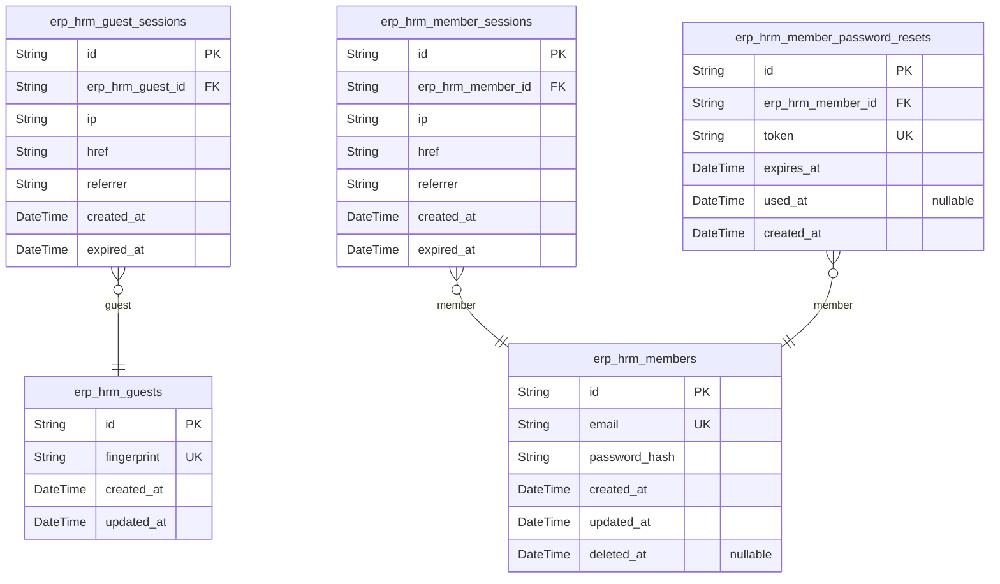
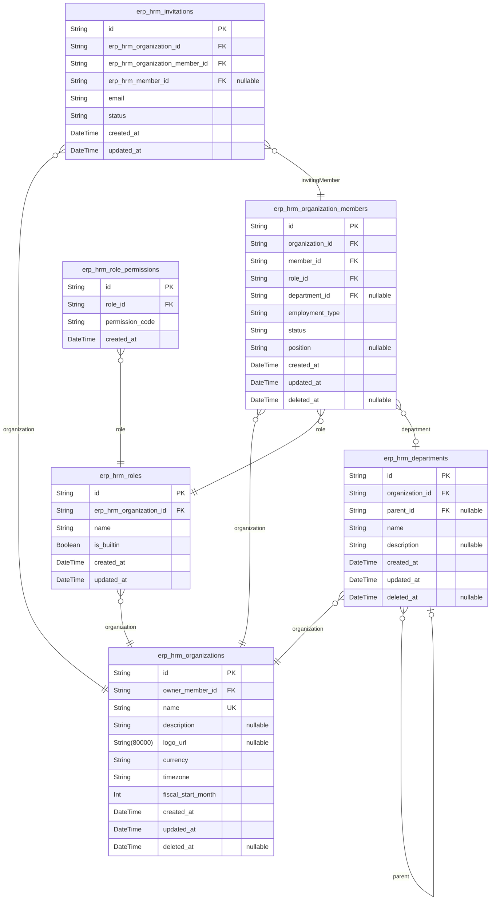
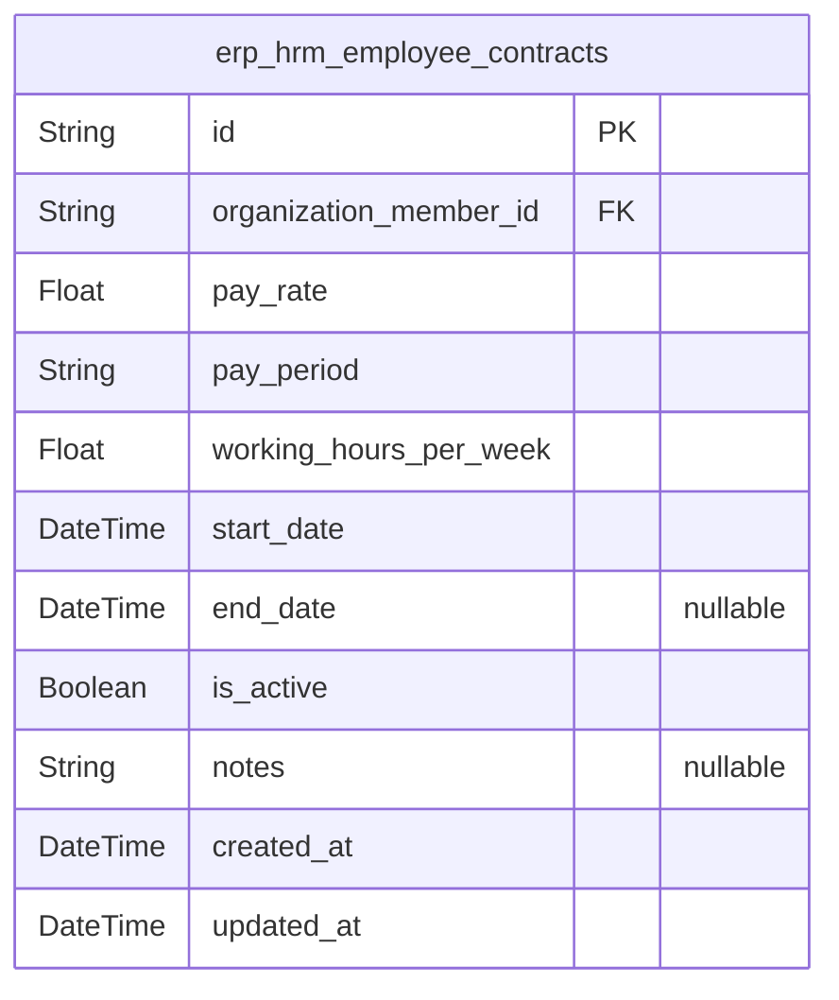
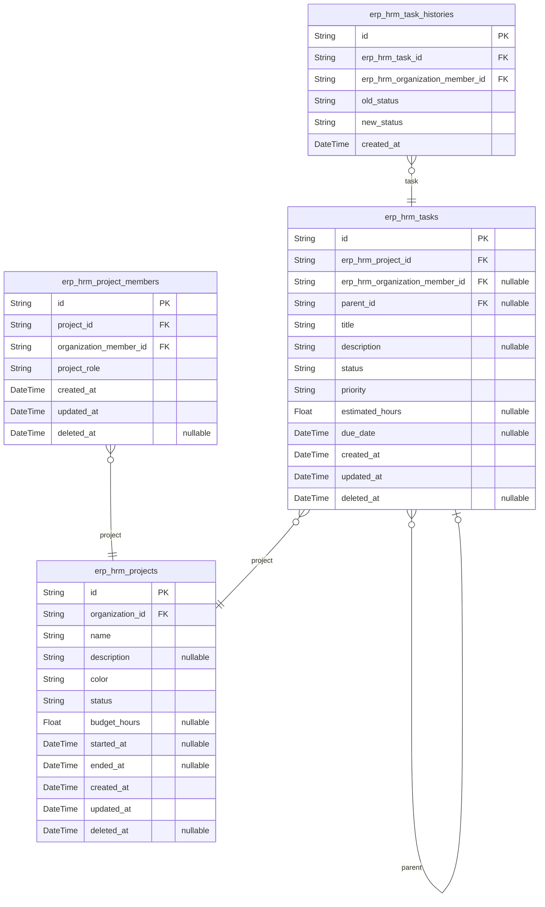
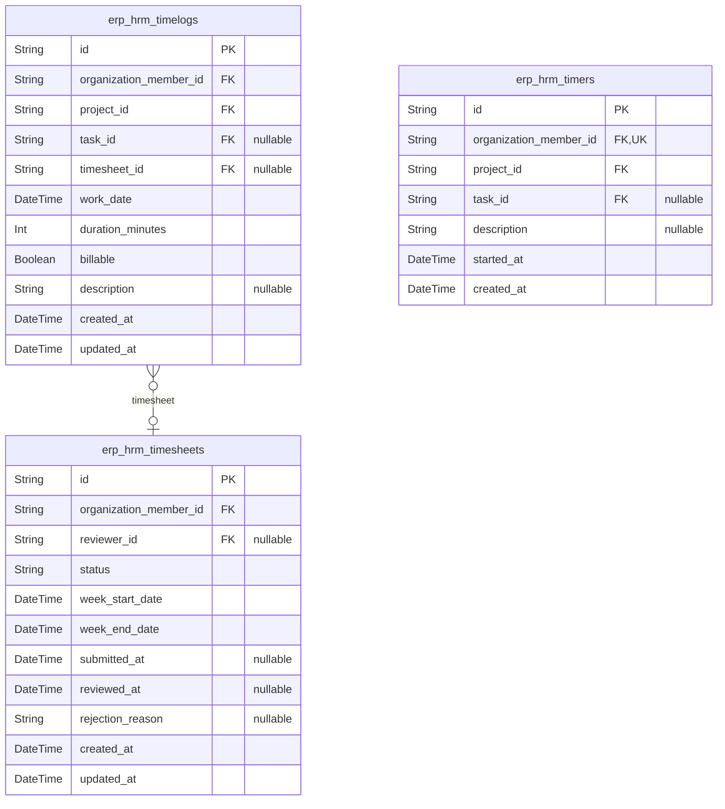
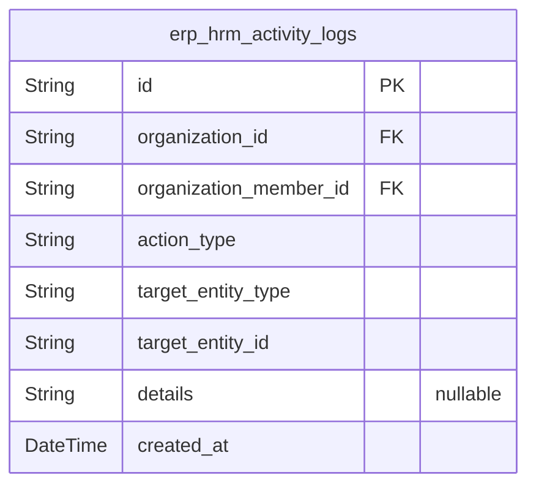

# Prisma Markdown

> Generated by [`prisma-markdown`](https://github.com/samchon/prisma-markdown)

- [Actors](#actors)
- [Organizations](#organizations)
- [Employment](#employment)
- [Projects](#projects)
- [TimeTracking](#timetracking)
- [ActivityLogs](#activitylogs)

## Actors

### `erp_hrm_guests`

Temporary guest records used to track unauthenticated visitors before
they register or log in.

Each record represents a single guest connection identified by a device
fingerprint or client-generated identifier. Guests hold no credentials
and confer no permissions within the system. This table serves as the
anchor for [erp_hrm_guest_sessions](#erp_hrm_guest_sessions) during the pre-authentication
flow.

Once a guest completes registration or login, they transition to a {@link
erp_hrm_members} record and their guest context is no longer used.

Properties as follows:

- `id`: Primary Key.
- `fingerprint`
  > Device fingerprint or client-generated identifier used to uniquely
  > identify the unauthenticated visitor across sessions. Used to correlate
  > guest activity before account creation or login.
- `created_at`: Timestamp when the guest record was first created.
- `updated_at`: Timestamp when the guest record was last updated.

### `erp_hrm_guest_sessions`

Short-lived session records for guest actors, providing a temporary
session context during the sign-up or login flow before the guest
transitions to an authenticated member.

Each record captures the network connection metadata (IP address,
referring URL, current href) and a fixed expiry timestamp so that expired
tokens can be detected without additional computation. Sessions are
append-only and are never updated after creation; they are simply
discarded once expired or superseded.

Related entity: [erp_hrm_guests](#erp_hrm_guests).

Properties as follows:

- `id`: Primary Key.
- `erp_hrm_guest_id`
  > The guest actor this session belongs to. References {@link
  > erp_hrm_guests.id}.
- `ip`: IP address of the client that initiated this guest session.
- `href`: Full URL (href) of the page the guest was on when the session was created.
- `referrer`
  > HTTP referrer URL indicating the origin page that led the guest to this
  > session entry point.
- `created_at`: Timestamp when this guest session was created.
- `expired_at`
  > Timestamp when this guest session expires. After this point the session
  > is considered invalid and the guest must re-initiate.

### `erp_hrm_members`

Registered user accounts serving as the global platform-level identity
for authenticated members across all organizations they belong to.

Each member is uniquely identified by their email address and
authenticates using a hashed password. A member may belong to multiple
organizations through [erp_hrm_organization_members](#erp_hrm_organization_members), but their
core identity and credentials are stored here, shared across all
organizational contexts.

Session records are tracked in [erp_hrm_member_sessions](#erp_hrm_member_sessions) and
password reset tokens in [erp_hrm_member_password_resets](#erp_hrm_member_password_resets). Soft
deletion via `deleted_at` supports account lifecycle management without
permanently discarding historical references.

Properties as follows:

- `id`: Primary Key.
- `email`
  > Unique email address used as the member's login identifier across all
  > organizations. Must be unique at the platform level.
- `password_hash`
  > Hashed password for authenticating the member. Stored as a secure hash
  > (e.g., bcrypt). Never stored in plaintext.
- `created_at`: Timestamp when the member account was created (registration date).
- `updated_at`
  > Timestamp when the member account was last updated (e.g., password
  > change, email update).
- `deleted_at`
  > Timestamp when the member account was soft-deleted. Null if the account
  > is active. When set, the account is considered deactivated and access is
  > denied.

### `erp_hrm_member_sessions`

JWT session records for authenticated members, supporting stateful
session management and secure logout across multiple devices.

Each row represents a single login session for a [erp_hrm_members](#erp_hrm_members)
actor, recording the connection context (IP address, page URL, referrer)
at the time of login. Sessions expire at the timestamp stored in
`expired_at`, and all sessions for a member can be queried to support
multi-device logout flows.

This table is append-only from the authentication flow's perspective;
logout or expiry is handled by checking `expired_at` rather than deleting
rows, allowing full audit history of login events.

Properties as follows:

- `id`: Primary Key.
- `erp_hrm_member_id`: The authenticated member who owns this session. [erp_hrm_members.id](#erp_hrm_members)
- `ip`
  > IP address of the client at the time this session was created. Used for
  > audit and security monitoring.
- `href`
  > Full URL of the page from which the login request originated. Used for
  > audit and analytics.
- `referrer`
  > HTTP Referrer header value at the time of login, indicating the page that
  > linked to the login endpoint. May be empty string if not provided.
- `created_at`: Timestamp when this session was created (i.e., when the member logged in).
- `expired_at`
  > Timestamp when this session expires or was explicitly invalidated. Used
  > to determine session validity and to support logout without deleting
  > records.

### `erp_hrm_member_password_resets`

One-time expiring password reset tokens issued to members who request a
password recovery flow.

Each record represents a single password reset request, storing a unique
token that is sent to the member's registered email address. The token is
valid until the `expires_at` timestamp has passed or until it has been
consumed (indicated by a non-null `used_at` value). A member may
accumulate multiple historical reset records over time; however, only the
most recent unexpired, unused token is considered valid at any given
moment.

This table is managed exclusively through the authentication flow and is
never directly created, modified, or deleted by users through normal API
operations. It references [erp_hrm_members](#erp_hrm_members) as the owning actor.

Properties as follows:

- `id`: Primary Key.
- `erp_hrm_member_id`
  > The member who requested the password reset. References {@link
  > erp_hrm_members.id}.
- `token`
  > The unique one-time-use reset token value sent to the member's email
  > address. Must be cryptographically random and treated as a secret
  > credential. Invalidated once used_at is set or expires_at has passed.
- `expires_at`
  > The datetime after which this token is no longer valid regardless of
  > whether it has been used. Typically set to a short window (e.g., 1 hour)
  > after creation to limit the attack surface.
- `used_at`
  > The datetime when this token was successfully consumed to complete a
  > password reset. Null indicates the token has not yet been used. Once set,
  > the token cannot be reused.
- `created_at`
  > The datetime when the password reset request was created and the token
  > was issued.

## Organizations

### `erp_hrm_organizations`

Top-level scope container (tenant) for all domain entities in the ERP/HRM
platform.

Every piece of data in the system — members, departments, projects,
tasks, timelogs, timesheets, contracts, and activity logs — belongs to
exactly one organization. Organizations operate in complete isolation
from each other; there is no cross-organization data visibility.

Each organization carries identity settings (name, description, logo),
financial context (default currency), temporal context (timezone), and
fiscal reporting context (fiscal start month). These settings govern how
data within the organization is interpreted and displayed.

Each organization has an owner, represented by a reference to the
platform-level member account ([erp_hrm_members.id](#erp_hrm_members)). The owner
holds the highest authority within the organization and is the only actor
who may initiate organization deletion. Ownership may be transferred, but
the organization must always have at least one owner.

Soft deletion is supported via [deleted_at](#deleted_at). An organization can
only be deleted after all pending timesheets are resolved and there are
no active employee contracts.

Properties as follows:

- `id`: Primary Key.
- `owner_member_id`
  > The platform-level member account who owns this organization. References
  > [erp_hrm_members.id](#erp_hrm_members). The owner holds the highest authority and is
  > the only actor who may initiate organization deletion.
- `name`
  > The display name of the organization. Must be provided and serves as the
  > primary human-readable identifier for the organization within the
  > platform.
- `description`
  > An optional description providing additional context about the
  > organization's purpose or structure.
- `logo_url`
  > An optional URI pointing to the organization's logo image, used for
  > branding purposes across the platform.
- `currency`
  > The default currency code (e.g., USD, EUR, KRW) for the organization.
  > Establishes the unit of measurement for all financial figures such as
  > employee pay rates and contract values. Does not perform currency
  > conversion.
- `timezone`
  > The IANA timezone identifier (e.g., Asia/Seoul, America/New_York)
  > governing how all time-related data is interpreted within the
  > organization, including workday boundaries, timesheet week boundaries,
  > and report date ranges.
- `fiscal_start_month`
  > The month number (1–12) indicating when the organization's fiscal year
  > begins. For example, 1 for a calendar-year organization (January) or 4
  > for a UK-style fiscal year (April). Influences boundaries of financial
  > and time reporting periods.
- `created_at`: Timestamp when the organization was created.
- `updated_at`: Timestamp when the organization record was last updated.
- `deleted_at`
  > Timestamp when the organization was soft-deleted. Null indicates an
  > active organization. When set, the organization and all its scoped data
  > are considered deleted and inaccessible.

### `erp_hrm_organization_members`

Per-organization identity record linking a platform-level user account
([erp_hrm_members](#erp_hrm_members)) to a specific organization ({@link
erp_hrm_organizations}).

While [erp_hrm_members](#erp_hrm_members) represents the global authentication
identity of a user, an OrganizationMember is the organizational persona
through which all work is performed within a single organization. A user
may have multiple OrganizationMember records — one per organization —
each entirely independent with its own employment classification, status,
role, and department assignment.

Every organizational activity — time logging, project assignment,
timesheet submission, task assignment, and contract history — is
associated with this record rather than the global member account,
enforcing strict per-organization data isolation.

The employment type classifies the nature of engagement (full-time,
part-time, contractor, intern). The status indicates whether the member
is currently active or deactivated within the organization. A deactivated
member retains all historical records but cannot initiate new work. The
position field is an optional free-text descriptor of the member's
functional title (e.g., "Senior Engineer").

Each OrganizationMember is assigned exactly one [erp_hrm_roles](#erp_hrm_roles)
role at a time, determining their permission boundaries. They may
optionally be placed within a [erp_hrm_departments](#erp_hrm_departments) department; if
the department is deleted, this field is cleared to null rather than
cascading deletion.

Properties as follows:

- `id`: Primary Key.
- `organization_id`
  > The organization this member record belongs to. {@link
  > erp_hrm_organizations.id}
- `member_id`
  > The platform-level user account this organizational identity is linked
  > to. [erp_hrm_members.id](#erp_hrm_members)
- `role_id`
  > The single role assigned to this member within the organization,
  > governing their permission boundaries. [erp_hrm_roles.id](#erp_hrm_roles)
- `department_id`
  > The optional department this member is placed within. Cleared to null if
  > the department is deleted. [erp_hrm_departments.id](#erp_hrm_departments)
- `employment_type`
  > Classifies the nature of the member's engagement with the organization.
  > Allowed values: 'full-time', 'part-time', 'contractor', 'intern'.
- `status`
  > Reflects the member's current operational status within the organization.
  > Allowed values: 'active' (can participate in all role-permitted
  > activities), 'deactivated' (cannot initiate new work; historical data is
  > preserved).
- `position`
  > Optional free-text descriptor of the member's functional title or
  > position within the organization, such as 'Senior Engineer' or 'Project
  > Coordinator'. Purely descriptive and distinct from the permission Role.
- `created_at`
  > Timestamp when this organizational member record was created (i.e., when
  > the user joined or was added to the organization).
- `updated_at`
  > Timestamp of the most recent update to this member record, such as a role
  > change, status change, or department reassignment.
- `deleted_at`
  > Soft-delete timestamp. When set, the member record is considered
  > logically deleted while historical data is preserved for audit and
  > reporting purposes.

### `erp_hrm_roles`

Named permission sets scoped to a single organization, defining what
actions organization members are allowed to perform.

Every organization contains exactly three built-in roles created
automatically — Owner, Manager, and Employee — identified by the
`is_builtin` flag. Built-in roles cannot be deleted or fundamentally
altered. Organization owners may additionally define custom roles with a
tailored combination of permission codes to express access patterns not
covered by the built-in roles.

Each [erp_hrm_organization_members](#erp_hrm_organization_members) record is assigned exactly one
role at any given time, and that role's permissions serve as the member's
complete access control boundary. Individual permission codes are stored
in the child table [erp_hrm_role_permissions](#erp_hrm_role_permissions) in a normalized
one-to-many relationship.

Custom roles can be edited (name and permission codes) and deleted when
no organization members are currently assigned to them. Role assignments
take effect immediately upon change.

Properties as follows:

- `id`: Primary Key.
- `erp_hrm_organization_id`
  > The organization this role belongs to. References {@link
  > erp_hrm_organizations.id}. Roles are scoped exclusively to one
  > organization and are never shared across organizations.
- `name`
  > The display name of the role within the organization. Must be unique per
  > organization. Built-in role names are 'Owner', 'Manager', and 'Employee'.
  > Custom role names are defined by the organization owner.
- `is_builtin`
  > Indicates whether this role is a system-defined built-in role (true) or a
  > custom role created by the organization owner (false). Built-in roles
  > cannot be deleted or reassigned away from their fundamental designation.
  > Custom roles can be edited and deleted when no members are assigned.
- `created_at`: The timestamp when this role record was created.
- `updated_at`
  > The timestamp when this role record was last updated, reflecting changes
  > to the role name or its permission codes.

### `erp_hrm_role_permissions`

Individual permission code entries assigned to a role within an
organization.

This table normalizes the permission assignment relationship for {@link
erp_hrm_roles}, storing each discrete permission code as a separate row.
A role may hold any combination of the available permission codes:
`org:manage`, `employee:manage`, `employee:view`, `project:manage`,
`project:view`, `time:manage`, `time:approve`, `time:view_all`, and
`report:view`.

Each row represents a single permission grant from a role. The
combination of `role_id` and `permission_code` is unique, preventing
duplicate grants. Adding or removing a permission is accomplished by
inserting or deleting rows in this table.

This table is managed through the parent [erp_hrm_roles](#erp_hrm_roles) entity and
has no independent lifecycle.

Properties as follows:

- `id`: Primary Key.
- `role_id`
  > The role to which this permission code is assigned. References {@link
  > erp_hrm_roles.id}.
- `permission_code`
  > The discrete permission code granted by this entry. One of: `org:manage`,
  > `employee:manage`, `employee:view`, `project:manage`, `project:view`,
  > `time:manage`, `time:approve`, `time:view_all`, `report:view`. Each code
  > unlocks a specific category of actions within the organization.
- `created_at`: Timestamp recording when this permission code was granted to the role.

### `erp_hrm_departments`

Organizational units that group members within an organization by
functional area, team, or business unit.

Each department belongs to exactly one {@link erp_hrm_organizations
organization} and cannot be shared across organizations. A department has
a required name that must be unique within its organization, and an
optional description providing additional context about its purpose or
scope.

Departments support a simple two-tier hierarchy through an optional
self-referencing parent relationship. A department may designate one
other department within the same organization as its parent, creating a
parent-child structure limited to one level of nesting. This ensures the
hierarchy remains shallow and manageable.

Department assignment to an {@link erp_hrm_organization_members
organization member} is descriptive only — it does not grant or restrict
permissions, control project access, or affect any system behavior beyond
categorization. Permissions are governed entirely by the member's
assigned role.

When a department is soft-deleted (deleted_at is set), all organization
members who were assigned to it lose their department association at the
application layer. Their records remain intact within the organization.

Properties as follows:

- `id`: Primary Key.
- `organization_id`
  > The organization this department belongs to. References {@link
  > erp_hrm_organizations.id}.
- `parent_id`
  > Optional reference to the parent department for one-level hierarchical
  > nesting. References [erp_hrm_departments.id](#erp_hrm_departments). Null if this is a
  > top-level department.
- `name`
  > The display name of the department, unique within the organization. Used
  > to identify and reference the department in the UI and reports.
- `description`
  > Optional description providing additional context about the department's
  > purpose, scope, or responsibilities.
- `created_at`: Timestamp when the department was created.
- `updated_at`: Timestamp when the department record was last updated.
- `deleted_at`
  > Soft-delete timestamp. When set, the department is considered removed
  > from the organization. Members previously assigned to this department
  > lose their department association.

### `erp_hrm_invitations`

Pending onboarding records representing formal invitations to bring new
people into an organization as employees.

An Invitation is created when a user with the appropriate permission
wants to add someone to the organization by email. It captures the intent
to onboard a specific individual and holds that intent in an open state
until the invitation is fulfilled or otherwise resolved.

Each invitation is scoped to exactly one [erp_hrm_organizations](#erp_hrm_organizations)
and was issued by one [erp_hrm_organization_members](#erp_hrm_organization_members). When the
invitee registers using the invited email address, the system
automatically links their [erp_hrm_members](#erp_hrm_members) account to the
invitation and transitions the status to accepted.

The status lifecycle follows: pending → accepted (normal flow), or may
transition to rejected, expired, or cancelled depending on administrative
actions. The same email address cannot have two pending invitations for
the same organization simultaneously — this uniqueness is enforced at the
application layer as a partial constraint on status=pending.

The invitation does not carry role assignment or employment details
directly — those are established when the employee record is fully
created upon acceptance.

Properties as follows:

- `id`: Primary Key.
- `erp_hrm_organization_id`
  > The organization to which this invitation belongs. References {@link
  > erp_hrm_organizations.id}.
- `erp_hrm_organization_member_id`
  > The organization member who issued this invitation. References {@link
  > erp_hrm_organization_members.id}.
- `erp_hrm_member_id`
  > The registered user account linked to this invitation. Null while the
  > invitation is pending; set when the invitee registers or is matched to an
  > existing account. References [erp_hrm_members.id](#erp_hrm_members).
- `email`
  > The email address to which the invitation is directed. This is the
  > primary identifier linking the invitation to a specific prospective
  > employee. The same email cannot have two pending invitations for the same
  > organization simultaneously.
- `status`
  > The current state of the invitation. Allowed values: 'pending'
  > (invitation issued, awaiting registration), 'accepted' (invitee has
  > registered and been linked to the organization), 'rejected' (invitation
  > was declined), 'expired' (invitation exceeded its validity period),
  > 'cancelled' (invitation was revoked by the issuing member or an admin).
- `created_at`
  > The exact date and time at which the invitation was issued. Serves as the
  > invitation timestamp and provides an audit trail for onboarding
  > activities.
- `updated_at`
  > The date and time when this invitation record was last updated,
  > reflecting status transitions or other modifications.

## Employment

### `erp_hrm_employee_contracts`

Formal employment contract records for each organization member within
the ERP HRM system.

Each record captures the agreed-upon employment terms at a specific point
in time: the pay rate, pay period granularity (e.g., hourly, monthly),
contracted working hours per week, contract start date, optional end
date, and any supplementary notes. Only one contract per {@link
erp_hrm_organization_members} member can be marked active at a time; all
past contracts are preserved as an immutable historical audit trail for
payroll processing and HR reporting.

Contracts are never deleted or modified after creation. When employment
terms change, the current active contract is deactivated and a new
contract record is created, preserving the full history of employment
agreements.

Properties as follows:

- `id`: Primary Key.
- `organization_member_id`
  > The organization member this contract belongs to. References {@link
  > erp_hrm_organization_members.id}.
- `pay_rate`
  > The agreed monetary compensation amount per pay period unit. Represents
  > the raw numeric value in the organization's base currency.
- `pay_period`
  > The frequency or granularity of payment. Valid values are: 'hourly',
  > 'daily', 'weekly', 'bi_weekly', 'monthly', 'annually'. Determines how
  > pay_rate is interpreted for payroll calculations.
- `working_hours_per_week`
  > The contracted number of working hours per week for this employment
  > agreement. Used for calculating full-time equivalence and tracking
  > overtime.
- `start_date`
  > The date on which this employment contract becomes effective. Marks the
  > beginning of the employment terms defined in this record.
- `end_date`
  > The date on which this employment contract expires or is terminated. Null
  > indicates the contract is open-ended with no predetermined end date.
- `is_active`
  > Indicates whether this contract is currently the active employment
  > agreement for the member. At most one contract per organization member
  > may be active at a time. When a new contract is created, the previous
  > active contract must be deactivated.
- `notes`
  > Optional supplementary notes or remarks about this employment contract,
  > such as special conditions, benefits, or HR comments.
- `created_at`
  > Timestamp when this contract record was created. Since contracts are
  > immutable, this also represents the effective record date.
- `updated_at`
  > Timestamp of the most recent update to this contract record. Typically
  > changes only when the is_active flag is toggled during contract
  > transitions.

## Projects

### `erp_hrm_projects`

A defined body of work scoped to a single organization, serving as the
primary organizational unit for grouping tasks and timelogs.

Every project belongs to exactly one {@link erp_hrm_organizations
organization} and is never shared across organizations. It carries a
required name and an optional description. A required color code is used
solely for visual identification in the user interface and carries no
business logic. Projects may optionally specify a planned start date and
end date as planning reference points, and an optional budget hours value
representing the estimated total effort, enabling comparison against
actual logged hours for project health monitoring.

Each project has a lifecycle status: active (work is ongoing), archived
(suspended or put on hold), or completed (work has been finished). The
project may be soft-deleted via the deleted_at timestamp.

Related entities: [erp_hrm_project_members](#erp_hrm_project_members), [erp_hrm_tasks](#erp_hrm_tasks),
[erp_hrm_timelogs](#erp_hrm_timelogs).

Properties as follows:

- `id`: Primary Key.
- `organization_id`
  > The organization this project belongs to. References {@link
  > erp_hrm_organizations.id}.
- `name`
  > The display name of the project, required and unique enough to identify
  > the project within its organization. Used for search and listing.
- `description`
  > An optional narrative description that elaborates on the project's
  > purpose, scope, or goals.
- `color`
  > A required color code (e.g., hex color string such as '#FF5733') assigned
  > to the project for visual identification in the UI. Carries no business
  > logic beyond visual differentiation.
- `status`
  > Lifecycle status of the project. Allowed values: 'active' (work is
  > ongoing), 'archived' (suspended or on hold), 'completed' (work has been
  > finished).
- `budget_hours`
  > Optional numeric estimate of the total effort (in hours) expected to be
  > invested in the project. Enables comparison against actual logged hours
  > for project health monitoring and reporting.
- `started_at`
  > Optional planned start date of the project, serving as a planning
  > reference point. Does not enforce any business constraint on when work
  > may actually begin.
- `ended_at`
  > Optional planned end date of the project, serving as a planning reference
  > point. Does not enforce any business constraint on when work must
  > actually finish.
- `created_at`: Timestamp when the project record was created.
- `updated_at`: Timestamp when the project record was last updated.
- `deleted_at`
  > Soft-delete timestamp. Null indicates the project is active (not
  > deleted). When set, the project is treated as deleted and excluded from
  > normal queries.

### `erp_hrm_project_members`

Assignment records that formally link an organization member to a project
within the ERP HRM system.

Each record grants an {@link erp_hrm_organization_members organization
member} participation rights within a specific {@link erp_hrm_projects
project}, assigning them one of two project-scoped roles: `member` (a
regular contributor) or `project-lead` (a project manager with task
management authority).

A member may belong to multiple projects simultaneously, but each
membership is represented by a distinct, independent record. The same
member cannot be assigned to the same project more than once (enforced by
a unique constraint). Project membership is the prerequisite for time
logging against a project and for visibility into project tasks.

Soft deletion via `deleted_at` preserves historical records when a member
is removed from a project, maintaining an audit trail of past
participation without physically destroying the record.

Properties as follows:

- `id`: Primary Key.
- `project_id`
  > The project this assignment belongs to. References {@link
  > erp_hrm_projects.id}.
- `organization_member_id`
  > The organization member being assigned to the project. References {@link
  > erp_hrm_organization_members.id}.
- `project_role`
  > The role of this member within the project. Allowed values: `member`
  > (regular contributor) or `project-lead` (project manager with task
  > management authority over other members).
- `created_at`: Timestamp when this project membership assignment was created.
- `updated_at`: Timestamp when this project membership record was last updated.
- `deleted_at`
  > Soft-deletion timestamp. When set, the member has been removed from the
  > project but the historical record is preserved for audit purposes.

### `erp_hrm_tasks`

Units of work within a project in the ERP HRM system. Each task belongs
to exactly one project and carries a status (open, in-progress,
completed, closed), a priority (low, medium, high, urgent), and optional
metadata including title, description, estimated hours, and due date.

Tasks support a one-level subtask hierarchy via a self-referencing parent
FK. A task that already has a parent (i.e., is itself a subtask) cannot
be designated as a parent for another task — only one level of nesting is
permitted. Subtasks are otherwise independent, each having their own
status, priority, assignee, estimated hours, and due date.

The optional assignee field references an {@link
erp_hrm_organization_members} record, but business logic enforces that
the assignee must also be an active project member of the same project
(verified at the service layer via [erp_hrm_project_members](#erp_hrm_project_members)).

Every status change on a task is automatically captured as an immutable
audit entry in [erp_hrm_task_histories](#erp_hrm_task_histories). Soft deletion is supported
via the deleted_at field.

Properties as follows:

- `id`: Primary Key.
- `erp_hrm_project_id`: The project this task belongs to. References [erp_hrm_projects.id](#erp_hrm_projects).
- `erp_hrm_organization_member_id`
  > The organization member assigned to this task. Must be an active project
  > member of the same project. Nullable when the task is unassigned.
  > References [erp_hrm_organization_members.id](#erp_hrm_organization_members).
- `parent_id`
  > Self-referencing foreign key pointing to the parent task, making this
  > task a subtask. Only one level of nesting is permitted — a task that is
  > already a subtask cannot be a parent. Null for top-level tasks.
  > References [erp_hrm_tasks.id](#erp_hrm_tasks).
- `title`
  > The title or name of the task. Required at creation time. Used as the
  > primary identifier for the task in list views and detail pages.
- `description`
  > Optional detailed description of the task, providing additional context,
  > acceptance criteria, or notes for the assignee.
- `status`
  > Current status of the task. Valid values: open, in-progress, completed,
  > closed. Defaults to 'open' at creation. Every change to this field
  > automatically generates an immutable entry in erp_hrm_task_histories.
- `priority`
  > Priority level of the task. Valid values: low, medium, high, urgent.
  > Defaults to 'medium' at creation. Used for sorting and filtering tasks.
- `estimated_hours`
  > Optional estimate of the number of hours required to complete the task.
  > Used for project planning and workload tracking.
- `due_date`
  > Optional target completion date for the task. Does not need to fall
  > within the project's own date range but must be a valid calendar date.
- `created_at`: Timestamp when the task was created.
- `updated_at`: Timestamp when the task was last updated.
- `deleted_at`
  > Timestamp when the task was soft-deleted. Null if the task is still
  > active.

### `erp_hrm_task_histories`

Immutable audit trail records that capture each status change event on a
task within the ERP HRM system.

Every time a task transitions from one status to another, the system
automatically creates a new TaskHistory entry documenting that specific
transition. Each entry records the old status (before the change), the
new status (after the change), the exact timestamp of the event, and the
organization member who performed the change.

TaskHistory entries are strictly system-generated and append-only. Once
created, they cannot be modified or deleted, ensuring the integrity and
trustworthiness of the audit record over time. The complete set of
history entries for a given task forms a chronological audit trail that
allows authorized viewers to reconstruct the full lifecycle of the task.

Valid status values for both old_status and new_status are: 'open',
'in_progress', 'completed', 'closed' — as defined in the {@link
erp_hrm_tasks} status field.

Related entities: [erp_hrm_tasks](#erp_hrm_tasks) (parent task), {@link
erp_hrm_organization_members} (recorder).

Properties as follows:

- `id`: Primary Key.
- `erp_hrm_task_id`: The parent task whose status changed. References [erp_hrm_tasks.id](#erp_hrm_tasks).
- `erp_hrm_organization_member_id`
  > The organization member who performed the status change and is
  > responsible for this history entry. References {@link
  > erp_hrm_organization_members.id}.
- `old_status`
  > The task status immediately before this transition. One of: 'open',
  > 'in_progress', 'completed', 'closed'.
- `new_status`
  > The task status immediately after this transition. One of: 'open',
  > 'in_progress', 'completed', 'closed'.
- `created_at`
  > The exact timestamp when the status change occurred and this history
  > entry was created. This is the authoritative record of when the
  > transition happened.

## TimeTracking

### `erp_hrm_timelogs`

Records individual completed work sessions owned by an organization member.

Each timelog captures a discrete block of work performed by an {@link
erp_hrm_organization_members OrganizationMember} on a specific date,
associated with a [Project](#erp_hrm_projects) and optionally a
[Task](#erp_hrm_tasks). The duration is stored in minutes to allow
precise time accounting without floating-point rounding issues.

A timelog may be optionally linked to a {@link erp_hrm_timesheets
Timesheet} once the member includes it in a weekly submission for manager
review. The billable flag indicates whether the recorded work is billable
to a client or project budget. An optional description provides free-text
context about the work performed.

Timelogs serve as the atomic source data for timesheet aggregations,
payroll calculations, and project time reports.

Properties as follows:

- `id`: Primary Key.
- `organization_member_id`
  > The organization member who owns this timelog. References {@link
  > erp_hrm_organization_members.id}.
- `project_id`
  > The project under which this work session was performed. References
  > [erp_hrm_projects.id](#erp_hrm_projects).
- `task_id`
  > The optional task this work session relates to. When set, the task must
  > belong to the same project. References [erp_hrm_tasks.id](#erp_hrm_tasks).
- `timesheet_id`
  > The weekly timesheet collection this timelog has been included in. Null
  > when the timelog has not yet been submitted in any timesheet. References
  > [erp_hrm_timesheets.id](#erp_hrm_timesheets).
- `work_date`
  > The calendar date on which the work session was performed. Stored as a
  > date-only timestamp (midnight UTC) to support date-range filtering and
  > weekly timesheet grouping.
- `duration_minutes`
  > Duration of the work session in whole minutes. Must be a positive
  > integer. Stored in minutes to avoid floating-point precision issues when
  > summing across multiple timelogs.
- `billable`
  > Whether this work session is billable to a client or counts against a
  > project budget. Defaults to false when not specified.
- `description`
  > Optional free-text description of the work performed during this session.
  > Supports full-text search for filtering timelogs by content.
- `created_at`: Timestamp when this timelog record was created.
- `updated_at`: Timestamp when this timelog record was last updated.

### `erp_hrm_timesheets`

Weekly (Monday–Sunday) timesheet records owned by an organization member
and submitted for managerial review and approval.

Each timesheet represents exactly one calendar week, identified by its
`week_start_date` (always a Monday) and `week_end_date` (always the
following Sunday). No two timesheets for the same owner may cover the
same week simultaneously.

The total hours figure is not stored here; it is computed from the
durations of all [erp_hrm_timelogs](#erp_hrm_timelogs) associated with this timesheet.

The status lifecycle progresses as follows: **draft** → **submitted** →
**approved** or **rejected**. A rejected timesheet returns to draft so
the employee can revise and resubmit.

When a reviewer acts on a submitted timesheet, the reviewing {@link
erp_hrm_organization_members} identity, the `reviewed_at` timestamp, and
(if rejected) a mandatory `rejection_reason` are all recorded to provide
a clear audit trail.

Properties as follows:

- `id`: Primary Key.
- `organization_member_id`
  > The organization member who owns this timesheet. References {@link
  > erp_hrm_organization_members.id}.
- `reviewer_id`
  > The organization member who reviewed (approved or rejected) this
  > timesheet. Null when the timesheet has not yet been reviewed. References
  > [erp_hrm_organization_members.id](#erp_hrm_organization_members).
- `status`
  > Current status of the timesheet in the review lifecycle. Allowed values:
  > 'draft' (created but not submitted), 'submitted' (awaiting review),
  > 'approved' (reviewer accepted), 'rejected' (reviewer declined; timesheet
  > returns to draft for revision).
- `week_start_date`
  > The Monday that begins the calendar week this timesheet covers. Together
  > with `week_end_date` this uniquely identifies the covered week per owner.
- `week_end_date`: The Sunday that ends the calendar week this timesheet covers.
- `submitted_at`
  > Timestamp recording when the employee formally submitted this timesheet
  > for review. Null while the timesheet remains in draft status.
- `reviewed_at`
  > Timestamp recording when the reviewer approved or rejected this
  > timesheet. Null until a review action has been taken.
- `rejection_reason`
  > Textual explanation provided by the reviewer when rejecting the
  > timesheet. Required when status is 'rejected'; null otherwise. Allows the
  > employee to understand what must be corrected before resubmission.
- `created_at`: Timestamp when this timesheet record was first created.
- `updated_at`: Timestamp when this timesheet record was last updated.

### `erp_hrm_timers`

Stores the single active real-time tracking session for an organization
member.

Each record represents a live timer started by an {@link
erp_hrm_organization_members OrganizationMember} to track time spent on a
[Project](#erp_hrm_projects) and optionally a specific {@link
erp_hrm_tasks Task}. The unique constraint on `organization_member_id`
enforces the business rule that at most one active timer may exist per
member at any given time.

When the member stops the timer, the service converts it into a {@link
erp_hrm_timelogs Timelog} entry and deletes this record. Timer records
are therefore transient and do not undergo soft deletion; no `deleted_at`
or `updated_at` columns are required.

Properties as follows:

- `id`: Primary Key.
- `organization_member_id`
  > The organization member who owns this active timer. {@link
  > erp_hrm_organization_members.id} Enforced as unique to guarantee at most
  > one active timer per member.
- `project_id`
  > The project against which this timer session is being tracked. {@link
  > erp_hrm_projects.id}
- `task_id`
  > The optional task within the project that this timer session is focused
  > on. Null when tracking is at the project level only. {@link
  > erp_hrm_tasks.id}
- `description`
  > An optional free-text note entered by the member describing what they are
  > currently working on during this tracking session.
- `started_at`
  > The exact timestamp when the member started this timer session. Used to
  > compute elapsed duration when the timer is stopped and a Timelog is
  > created.
- `created_at`
  > Timestamp when this timer record was created, which is effectively the
  > same as started_at. Retained for auditing consistency.

## ActivityLogs

### `erp_hrm_activity_logs`

Immutable organizational audit trail entries recording all significant
business events within an organization.

Each entry is created automatically by the system in response to a
meaningful business action; users cannot manually create, edit, or delete
activity log entries. Once written, an entry is permanent and immutable,
ensuring the historical record accurately reflects what happened and
cannot be altered after the fact.

The audit log is scoped strictly to a single organization via {@link
erp_hrm_organizations.id}. Each entry references the {@link
erp_hrm_organization_members.id} who performed the action (recorded at
the time of the action and never updated), a categorized action type
drawn from a fixed set of recognized business events, the type and ID of
the target entity that was affected, and an optional details field
carrying supplementary context.

Covered action types include employee lifecycle events (invited,
deactivated, reactivated), contract events (created, edited), project
events (created, archived, completed, deleted), task events (status
changed), timesheet events (submitted, approved, rejected), and role
events (assigned or changed). Only actions within this defined set
generate activity log entries.

Because entries are append-only and never modified or deleted
individually, this table has only a created_at timestamp and no
updated_at or deleted_at columns.

Properties as follows:

- `id`: Primary Key.
- `organization_id`
  > The organization this audit log entry belongs to. References {@link
  > erp_hrm_organizations.id}. Each organization maintains its own
  > independent audit history.
- `organization_member_id`
  > The organization member who performed the logged action. References
  > [erp_hrm_organization_members.id](#erp_hrm_organization_members). Recorded at the moment the
  > action occurs and never updated even if the member's profile changes
  > later.
- `action_type`
  > Categorized label identifying the kind of business event that occurred.
  > Drawn from a fixed set of recognized action types: 'employee_invited',
  > 'employee_deactivated', 'employee_reactivated', 'contract_created',
  > 'contract_edited', 'project_created', 'project_archived',
  > 'project_completed', 'project_deleted', 'task_status_changed',
  > 'timesheet_submitted', 'timesheet_approved', 'timesheet_rejected',
  > 'role_assigned_or_changed'. The set is fixed and not configurable by
  > organizations.
- `target_entity_type`
  > The type of business entity that was affected by the action. Indicates
  > which domain object the target_entity_id refers to. Possible values
  > include 'member', 'contract', 'project', 'task', 'timesheet', 'role'.
  > Used together with target_entity_id to identify the specific object acted
  > upon.
- `target_entity_id`
  > The UUID of the specific business entity that was affected by the action.
  > Used in conjunction with target_entity_type to form a polymorphic
  > reference to the target object (e.g., a specific project, task, contract,
  > or member record). Stored as a plain UUID field rather than a typed
  > foreign key because the target can be any of several different entity
  > types.
- `details`
  > Optional supplementary context relevant to the specific action. For
  > example, a role change entry might include the name of the old role and
  > the new role; a timesheet rejection entry might include the rejection
  > reason. This field is informational and supplements the action type
  > without replacing it. Null when no additional context is needed.
- `created_at`
  > The exact moment the action occurred, recorded by the system at the time
  > the event is processed. Establishes the precise chronological position of
  > the entry within the organization's audit history. This is the only
  > timestamp field because entries are immutable and never updated or
  > deleted.
