**erpHrm — Business concepts, relationships, and states from user perspective**

Business concepts, relationships, and states from user perspective

# Domain Concepts

Describe what each concept means in the business domain and its key attributes.

## Organization Concept

An Organization is the top-level entity in the platform, representing an independent business or team that uses the ERP system. Each organization operates as a fully isolated tenant, meaning its employees, projects, tasks, timelogs, and timesheets are completely separate from those of other organizations. An organization is identified by a unique name and may carry an optional description and logo image for branding purposes. Each organization declares a default currency (such as USD, EUR, or KRW) that contextualizes financial data like pay rates. The organization also carries a timezone setting that governs how time-related data — such as timesheet weeks and report date ranges — is interpreted. A fiscal start month defines when the organization's financial year begins, which can influence reporting boundaries. The organization concept is the foundational scope container: all other domain entities belong to exactly one organization. Every user who interacts with the platform does so within the context of a specific organization. The owner of the organization holds the highest level of authority within that tenant.

### Organization Identity and Settings

An Organization is the top-level tenant in the platform, representing an independent business or team. Every user interaction and every piece of data belongs to exactly one organization, making the organization the fundamental boundary of the system.

Each organization is identified by a required name that distinguishes it within the platform. An optional description may be provided to give additional context about the organization's purpose or structure. A logo image may be uploaded for branding purposes, giving the organization a recognizable visual identity across the platform.

Every organization declares a default currency (such as USD, EUR, or KRW) that provides financial context for data like employee pay rates and contract values. This currency setting does not perform conversion but establishes the unit of measurement for all financial figures within the organization.

An organization carries a timezone setting that governs how all time-related data is interpreted — including when a workday starts and ends, how timesheet weeks are bounded, and how report date ranges are applied. All time-scoped operations within the organization reference this timezone.

A fiscal start month defines when the organization's financial year begins (for example, January for a calendar-year organization, or April for a UK-style fiscal year). This setting influences the boundaries of financial and time reporting periods within the organization.

### Organization as Scope Container and Data Isolation

The organization acts as the scope container for all domain entities in the platform. Every employee (organization member), department, role, project, task, timelog, timesheet, timer, contract, and activity log belongs to exactly one organization. No entity exists outside of an organizational context.

Each organization operates in complete isolation from all other organizations. Employees in one organization have no visibility into — and no ability to access — the data of any other organization. Even users who belong to multiple organizations see only the data of their currently selected organization at any given time.

This isolation applies universally: employee records, project and task data, time tracking entries, timesheets, contracts, departments, roles, and activity logs are all strictly scoped to the organization they belong to. There is no sharing or cross-referencing of data between organizations.

When a user is active within a specific organization context, all their actions — creating records, viewing lists, submitting timesheets, logging time — are automatically associated with that organization. The organization context is the lens through which all platform functionality is experienced.

### Organization Owner Authority

Each organization has an owner, who holds the highest level of authority within that organization's tenant. The owner role is a built-in role that cannot be deleted or removed from the organization.

The owner has full access to all features and settings within the organization, including the ability to edit organization-level settings such as name, description, logo, currency, timezone, and fiscal start month. The owner can manage all roles — including creating, editing, and deleting custom roles — and can assign or reassign roles to any organization member.

The owner is the only actor who may initiate deletion of the organization itself, subject to the conditions described in the business rules (defined in 04-business-rules.md). Ownership may be transferred to another member, but the organization must always have at least one owner. If a user is the sole owner of an organization, they must transfer ownership or delete the organization before they can delete their own account.

## User Concept

A User represents a real person who has registered an account on the platform using an email address and password. The email address is globally unique across the entire platform, making it the primary identifier for a user account. A user's account exists independently of any particular organization, meaning a single user can be a member of multiple organizations simultaneously. The user account carries a status — either active or deactivated — which reflects whether the account is currently usable across the platform. A deactivated user account, for instance when a user deletes their account, results in their employee records within other organizations being marked accordingly. The user concept is global and cross-organizational, while the user's participation in a specific organization is captured through the OrganizationMember concept. Authentication credentials (email and password) are owned by the User entity at the platform level.

### User as Platform-Level Account Holder

A User represents a real person who has registered an account on the platform. The user exists at the platform level — independent of any particular organization — and serves as the single source of authentication identity across the entire system.

The email address is the primary identifier for a user account and must be globally unique across the entire platform. No two users may share the same email address. The email address is used to authenticate the user at login and to locate the account during invitation flows.

Authentication is password-based. The user's password is a credential held at the platform level, not scoped to any individual organization. A user authenticates once with their email and password, then selects the organization context they wish to work in for that session.

Each user account carries a status: either **active** or **deactivated**. An active account can authenticate and participate in organizations. A deactivated account results from the user deleting their own account; a deactivated user can no longer log in or perform any actions across the platform. The deactivation of a user account does not erase organizational records — the user's employee records within each organization are marked accordingly, preserving historical data.

### User Identity Across Organizations

A single user account may belong to multiple organizations simultaneously. Membership in each organization is a separate, independent record (the OrganizationMember concept), meaning the same user can hold different roles, departments, and statuses in different organizations.

The User concept is deliberately distinct from the OrganizationMember concept. The User represents the global, cross-organizational identity — the person behind the account, with a unique email, password credential, and platform-wide status. The OrganizationMember, by contrast, represents that same person's specific participation within a single organization, capturing organization-scoped attributes such as employment type, role, department, and active/deactivated status within that context.

This separation means that deactivating a user's membership within one organization (OrganizationMember status = deactivated) does not affect the user's account or their membership in other organizations. Conversely, deactivating the user account itself (User status = deactivated) renders the user inactive across all organizations at once.

The user's personal profile — display name, avatar image, and phone number — is maintained as a separate UserProfile entity and is shared across all organizations the user belongs to (defined in the UserProfile Concept section).

When a user authenticates, they must select an organization context to work in. All subsequent actions are scoped to that selected organization, enforcing data isolation between organizations. Users may switch their active organization context without logging out.

## UserProfile Concept

A UserProfile represents the personal, human-facing identity information attached to a user account. Unlike the user account itself which handles authentication, the UserProfile captures how a person is presented to others across the platform. Every user has exactly one profile, and that profile is shared across all organizations the user belongs to — it is global, not per-organization. The profile includes a display name, which is the human-readable name shown to other users. An optional avatar image allows for visual identification within the platform. An optional phone number may also be recorded as a contact detail. Because the profile is cross-organizational, changes made to a display name or avatar are reflected everywhere the user participates.

### User Profile as Global Personal Identity

A UserProfile represents the human-facing identity of a person on the platform. While the user account (defined in the User Concept) handles authentication — email address and password — the UserProfile captures how that person is presented to others. These two concerns are kept separate: the user account is about verifying who someone is, while the UserProfile is about how they appear to colleagues and collaborators.

Every user account has exactly one UserProfile. There is no situation where a user exists without a profile, and no user can have more than one. The profile is global — it exists at the platform level, not within any individual organization. Because users can belong to multiple organizations, their profile is shared across all of them. When a user updates their display name or avatar, that change is immediately reflected in every organization they are a member of. There is no per-organization variant of a profile.

### Profile Attributes

A UserProfile contains three pieces of information that describe the person behind the account:

- **Display name**: A human-readable name used to identify the person throughout the platform. This is what other users see when viewing employee lists, timelog entries, task assignments, timesheet reviews, and activity logs. The display name is required — every profile must have one.

- **Avatar image**: An optional image that provides visual identification. When present, the avatar appears alongside the display name in interfaces where the user's identity is shown. When absent, the platform shows a default placeholder.

- **Phone number**: An optional contact detail. It is recorded on the profile for informational purposes. It is not used for authentication or system notifications — it serves purely as a human contact reference visible within the platform context.

Because the profile is shared across all organizations (described above), all three of these attributes — display name, avatar, and phone number — are the same regardless of which organization context a user is currently working in.

## OrganizationMember Concept

An OrganizationMember represents the relationship between a User and a specific Organization, capturing all the context relevant to that person's participation within that organization. It is the organizational identity of a user — while a User is a global entity, the OrganizationMember is always scoped to one organization. Each member record carries an employment type, which classifies how the person is engaged: full-time, part-time, contractor, or intern. A member also has a status of either active or deactivated, reflecting whether they are currently participating in the organization. Optional attributes include department assignment and a position or title describing the employee's role within the organization's structure. Each OrganizationMember is assigned exactly one Role within the organization, which governs what actions they are permitted to perform. The OrganizationMember is the entity through which time tracking, project assignments, and other organizational activities are conducted.

### OrganizationMember as Per-Organization Identity

An OrganizationMember is the organizational identity a user holds within a specific organization. While a User is a global platform-level account (defined in the User Concept), an OrganizationMember is always scoped to exactly one organization and represents how that user participates in that organization's operations.

A single user may have multiple OrganizationMember records — one for each organization they belong to — but each record is entirely independent and isolated. Attributes such as employment type, status, department, position, and role are specific to the member's context within that organization and do not carry over to other organizations the user may belong to.

The OrganizationMember record is the primary actor through which all organizational activities are performed. Time tracking, project assignments, contract history, and timesheet submissions are all associated with the OrganizationMember, not directly with the global User account. This design ensures that data remains strictly isolated per organization.

An OrganizationMember record is created when a user accepts an invitation to join an organization or when the organization owner creates the initial member record during organization setup.

### Employment Classification, Status, and Organizational Placement

Each OrganizationMember carries attributes that describe how they are engaged with the organization and where they sit within its structure.

**Employment Type** classifies the nature of the member's engagement. The four allowed values are:
- **Full-time**: a permanent employee working standard hours
- **Part-time**: an employee working reduced hours
- **Contractor**: an external party engaged on a contract basis
- **Intern**: a trainee or apprentice engaged temporarily

**Status** reflects whether the member is currently active within the organization. The two allowed values are:
- **Active**: the member can participate in all activities permitted by their role
- **Deactivated**: the member can no longer log time, submit timesheets, or participate in new work; their historical data — timelogs, timesheets, contracts — is preserved and remains accessible to authorized users

**Department** is an optional attribute that places the member within an organizational grouping. The department must be one that exists within the same organization (departments are defined in the Department Concept). If the member's department is deleted, the department field is cleared and becomes unset rather than the member being deleted.

**Position or Title** is an optional free-text attribute describing the member's functional role within the organization, such as "Senior Engineer" or "Project Coordinator". This is distinct from the member's permission Role and is purely descriptive.

### Single Role Assignment per Organization

Each OrganizationMember is assigned exactly one Role within their organization at any given time. This role determines what the member is permitted to do within that organization. Roles are defined and scoped per organization (described in the Role Concept).

A member may hold different roles in different organizations — for example, a user could be an Owner in one organization and an Employee in another. The role applies only within the organization in which the OrganizationMember record exists.

The role assignment can be updated by users who hold the employee management permission, changing which permissions the member has going forward. There is no concept of a member holding multiple roles simultaneously within the same organization; the assignment is always singular and unambiguous.

### OrganizationMember as the Subject of Organizational Work

The OrganizationMember is the central entity through which all work-related activity within an organization is conducted. Every significant operation is associated with a member record rather than the global user account, reinforcing the organization-scoped data model.

The following organizational activities are all attributed to the OrganizationMember:

- **Project membership**: members are assigned to projects through ProjectMember records, which also carry a project-specific role (member or project-lead). A member can be assigned to multiple projects simultaneously.
- **Time logging**: every timelog is owned by an OrganizationMember and must reference a project the member is assigned to. Duration, date, and billability are recorded against the member.
- **Timesheets**: weekly timesheet submissions are made by and attributed to an OrganizationMember, grouping their timelogs for a specific week for approval.
- **Live timer**: each OrganizationMember may have at most one active timer running at a time, tracking real-time work against a project.
- **Contracts**: employment contracts are attached to the OrganizationMember record, capturing the terms of engagement over time.
- **Task assignments**: tasks within a project may be assigned to an OrganizationMember, provided that member is a project member.

Only active OrganizationMembers can initiate new time tracking or submit timesheets. Deactivated members retain their historical records but cannot create new work entries.

## Role Concept

A Role defines a named set of permissions that governs what an organization member is allowed to do within the organization. Roles are always scoped to a single organization and are not shared across organizations. There are three built-in roles — Owner, Manager, and Employee — which exist in every organization by default and cannot be deleted. The Owner role grants full access to all features and the ability to manage roles and members. The Manager role covers employee management, project oversight, timesheet approval, and report viewing. The Employee role covers personal time tracking, timesheet submission, and viewing one's own data. In addition to built-in roles, organization owners can define custom roles with a name and a tailored set of permissions. Permissions are discrete capability codes such as the ability to manage employees, view projects, approve timesheets, or view reports. Each organization member is assigned exactly one role at a time, and that assignment determines the full scope of their access.

### Role as Named Permission Set

A Role is a named grouping of permission codes that collectively define what an organization member is allowed to do within the organization. Every role belongs exclusively to a single organization and is never shared across organizations — two organizations may have roles with the same name but they are entirely independent of one another.

Each organization member is assigned exactly one role at any given time. That single role assignment serves as the complete access control boundary for the member: any action they attempt is evaluated against the permissions held by their assigned role. There is no concept of inheriting or combining multiple roles.

Roles carry a built-in flag indicating whether they are system-defined. Built-in roles exist in every organization by default and cannot be removed. Organization owners may additionally define custom roles to express permission sets that the three built-in roles do not cover.

### Built-In Roles: Owner, Manager, and Employee

Every organization contains exactly three built-in roles that are created automatically and cannot be deleted:

**Owner** — The Owner role grants unrestricted access to all features within the organization. An owner can manage organization settings, handle all aspects of employee and contract management, oversee projects and tasks, approve or reject timesheets, view all reports, and administer roles and role assignments. There must always be at least one member holding the Owner role in an active organization.

**Manager** — The Manager role is designed for operational oversight. Managers can manage employees and their records, oversee projects and tasks, approve or reject timesheets, and view organization-wide reports. Managers cannot modify organization-level settings or administer role definitions.

**Employee** — The Employee role covers the day-to-day work experience of a regular staff member. Employees can log their own time, manage their timelogs, submit timesheets for approval, and view their own data including assigned tasks and project memberships. Employees do not have visibility into other members' data unless granted additional permissions through a custom role.

Because these three roles are built-in, they cannot be edited in terms of their core designation or deleted, regardless of how many members are currently assigned to them.

### Permission Codes and What They Govern

Permissions are discrete capability codes assigned to a role. Each code unlocks a specific category of actions within the organization. The full set of available permission codes is:

| Permission Code | What It Governs |
|---|---|
| `org:manage` | Editing organization settings such as name, currency, timezone, and managing departments |
| `employee:manage` | Inviting, editing, deactivating, and reactivating employees; creating and editing contracts; assigning roles |
| `employee:view` | Viewing the employee list, individual employee records, and contract history |
| `project:manage` | Creating, editing, archiving, completing, and deleting projects; managing project members and tasks |
| `project:view` | Viewing all projects, their details, and associated tasks |
| `time:manage` | Editing or deleting any employee's timelogs regardless of ownership |
| `time:approve` | Viewing submitted timesheets and approving or rejecting them |
| `time:view_all` | Viewing timelogs and timesheets belonging to all employees across the organization |
| `report:view` | Accessing organization-level reports including time reports, project budget reports, and weekly summaries |

A custom role may be assigned any combination of these codes. A role with no permission codes grants the member no special capabilities beyond viewing their own personal data. Permissions are additive — each code independently unlocks its respective category without dependency on other codes.

### Custom Roles and Member Assignment

Beyond the three built-in roles, organization owners can define custom roles to represent access patterns specific to their organization's structure. A custom role has a name and a tailored set of permission codes chosen from the available permission catalogue (defined above).

Custom roles belong to the organization in which they are created and are not transferable to other organizations. Unlike built-in roles, custom roles can be edited — their name and permission codes may be updated — and they can be deleted provided no organization members are currently assigned to them.

Every organization member, whether assigned a built-in or custom role, holds exactly one role at a time. Role assignment is changeable over the course of a member's tenure in the organization, but at no point may a member exist without a role assignment. When a member's role is changed, the new role's permissions take effect immediately and the old role's permissions no longer apply to that member.

## Invitation Concept

An Invitation represents a pending request to bring a new person into an organization as an employee. It is created when an authorized user wants to add someone to the organization by email, but that email address does not yet correspond to a registered user account. The invitation is associated with a specific email address and captures the timestamp at which the invitation was issued. An invitation carries a status — either pending or accepted — reflecting whether the prospective employee has completed the sign-up process. A pending invitation remains in an open state until the person registers an account using the invited email address, at which point it transitions to accepted and the user is automatically linked to the organization. If the invited email already has an existing account, the invitation flow is bypassed and the user is added directly. The Invitation concept captures the asynchronous nature of onboarding people who are not yet on the platform.

### Invitation as a Pending Organizational Onboarding Record

An Invitation is a formal, system-tracked record representing a pending request to bring a new person into an organization as an employee. It is created when a user with the appropriate permission wants to add someone to the organization by email, but the prospective employee has not yet registered on the platform. The invitation exists as an independent record within the organization's data scope, capturing the intent to onboard a specific individual and holding that intent in an open state until the person completes registration.

Each invitation is associated with exactly one organization and was issued by the organization member who initiated it. The invitation record persists until the invited person signs up, at which point it transitions to the accepted state and the new user is automatically linked to the organization as an employee.

The invitation mechanism supports asynchronous onboarding: the organization does not need to wait for an immediate response, and the prospective employee can register at any time after the invitation is issued. This makes the process robust to situations where the invitee is not yet a platform user.

### Invitation Attributes

Each Invitation record carries the following attributes:

- **Target email address**: The email address to which the invitation is directed. This is the primary identifier linking the invitation to a specific prospective employee. The target email must be unique within the organization at any given time — the same email cannot have two pending invitations for the same organization simultaneously.
- **Invitation timestamp**: The exact date and time at which the invitation was issued. This records when the inviting member created the invitation and provides an audit trail for onboarding activities.
- **Status**: The current state of the invitation, either pending or accepted. A pending status means the invitee has not yet registered or been linked. An accepted status means the invitation has been fulfilled and the user is now a member of the organization.
- **Issuing member**: A reference to the organization member who created the invitation, providing accountability for who initiated the onboarding request.

The invitation does not carry a role assignment or employment details directly — those are established when the employee record is fully created upon acceptance.

### Invitation Status Lifecycle

An invitation moves through a simple two-state lifecycle:

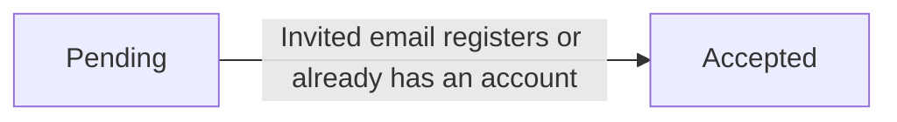

- **Pending**: The invitation has been issued and the target email address does not yet correspond to a registered user account. The invitation remains in this state indefinitely until the person registers.
- **Accepted**: The target person has registered a user account using the invited email address, or was already a registered user at the time of invitation. The user is now linked to the organization as an employee.

There is no rejected, cancelled, or expired state defined for invitations. A pending invitation remains open until it is accepted.

### Invitation for Users Not Yet Registered

The invitation concept is specifically designed to handle the case where the prospective employee does not yet have a user account on the platform. When an invitation is created for an email address that has no corresponding registered account, the system holds the invitation in the pending state.

When a person later registers using that email address, the system automatically checks whether any pending invitations exist for that email. If one or more pending invitations are found, the newly created user is automatically linked to each corresponding organization as an employee, and the invitations are marked as accepted. This automatic linkage removes the need for any manual follow-up by the inviting organization.

This asynchronous mechanism means that an organization can issue invitations in advance, and employees will be seamlessly onboarded the moment they create their account — without requiring any additional action from either the organization or the new user.

### Direct Addition for Existing Users

When the invited email address already belongs to a registered user account at the time the invitation is issued, the invitation flow is bypassed entirely. The user is added directly to the organization as an employee without creating a pending invitation record. This distinction ensures that the invitation concept is reserved for capturing the asynchronous onboarding of prospective employees who are not yet on the platform, while existing users are onboarded immediately and synchronously.

## Department Concept

A Department represents an organizational grouping used to structure employees within an organization. Each department belongs to a single organization and provides a way to categorize employees by functional area, team, or business unit. A department has a required name and an optional description that provides additional context about its purpose. Departments can be nested one level deep: a department may optionally reference another department as its parent, enabling a simple two-tier hierarchy such as a division containing sub-departments. An employee's department assignment is optional — not all organization members must belong to a department. Departments are a static structural concept; they do not directly control permissions or project access. When a department is removed from the organization, employees who belonged to that department simply lose their department association rather than being removed from the organization.

### Department

A Department is an organizational grouping used to classify employees within a single organization by functional area, team, or business unit. Each department belongs to exactly one organization and cannot be shared across organizations.

Every department has a required name that identifies it within the organization, and an optional description that provides additional context about its purpose or scope.

Departments support a simple two-tier hierarchy through an optional parent-department relationship. A department may designate one other department within the same organization as its parent, creating a parent-child structure. This nesting is limited to one level — a department cannot itself be the parent of another department that already has children, ensuring the hierarchy remains shallow and manageable.

Assigning an employee to a department is optional. An organization member may belong to exactly one department at a time, or to no department at all. Department assignment is a descriptive classification only — it does not grant or restrict permissions, control project access, or affect any system behavior beyond categorization. Permissions are governed entirely by the employee's assigned role (defined in the Role Concept section).

When a department is removed from the organization, all employees who were assigned to that department lose their department association. Their records remain intact within the organization; only the department reference is cleared. The removal of a department does not affect the employee's role, status, contracts, or any other organizational data.

## EmployeeContract Concept

An EmployeeContract represents a formal employment agreement between an organization and one of its members, capturing the financial and scheduling terms under which that member works. Each contract belongs to a specific organization member and records a start date, an optional end date (where the absence of an end date indicates an ongoing contract), and a pay rate expressed as a numeric value. The pay period classifies how the pay rate is applied — options include hourly, daily, weekly, or monthly. Working hours per week is a required attribute that defines the expected weekly commitment. An optional notes field allows for additional context or remarks about the contract terms. An employee can have multiple contracts over time, forming a historical record of how their terms have changed. At any given moment, only one contract can be considered active for an employee. Past contracts are immutable records preserved for historical accuracy.

### Employee Contract as a Formal Employment Agreement

An employee contract is the formal record of the employment terms agreed between an organization and one of its members. Each contract belongs to exactly one organization member and captures the financial and scheduling conditions that govern that member's engagement with the organization.

Every contract carries a start date, which marks when the agreed terms take effect. An end date is optional — its absence indicates that the contract is ongoing and currently in force. When an end date is present, it marks the day the contract's terms ceased to apply.

The pay rate is a required numeric value that expresses the employee's compensation. It is interpreted together with the pay period, which defines the time unit to which the pay rate applies. The supported pay periods are hourly, daily, weekly, and monthly. Together, pay rate and pay period give a complete picture of how the employee is compensated.

Working hours per week is a required attribute that records the expected weekly time commitment for the employee under this contract. This value reflects the agreed-upon schedule and is used to contextualize the employee's time logs relative to their contracted obligations.

An optional notes field is available to capture any additional remarks, special conditions, or contextual information relevant to the contract terms. This field has no structural impact on system behavior but provides a space for human-readable clarifications.

### Contract History, Active Status, and Immutability

An organization member can accumulate multiple contracts over time. Each new contract typically reflects a change in employment terms — such as a pay rate adjustment, a change in employment type, or a shift from a fixed-term to an ongoing arrangement. Together, these contracts form a chronological historical record of how the member's working conditions have evolved within the organization.

At any given moment, only one contract may be considered active for an employee. The active contract is the one currently governing the employee's engagement — it has a start date that has already passed and either no end date (ongoing) or an end date that has not yet been reached. The concept of an active contract is central to understanding an employee's current financial and scheduling terms.

Once a contract becomes a past contract — meaning it has been superseded by a newer one or its end date has passed — it becomes immutable. Past contracts cannot be modified. This immutability ensures that the historical record accurately reflects the terms that were in effect during any given period, preserving integrity for payroll, reporting, and audit purposes.

The active contract, by contrast, may be edited to reflect agreed corrections or adjustments to current terms. However, any change that effectively introduces a new set of terms is represented by creating a new contract rather than overwriting the existing one, so that no historical record is lost.

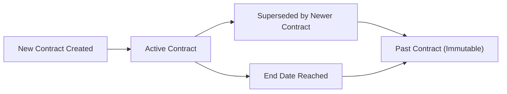

## Project Concept

A Project represents a defined body of work within an organization that employees can be assigned to and log time against. Each project is scoped to a single organization and carries a required name and an optional description. A color code is a required visual attribute used to distinguish the project in the user interface. Projects have a lifecycle status — active, archived, or completed — that reflects their current operational state. Optional attributes include budget hours (an estimate of total expected effort), as well as optional start and end dates that define the project's intended time boundaries. Projects serve as the primary grouping for tasks and timelogs, providing context for how work time is categorized and reported. An archived or completed project preserves its historical data but no longer accepts new time entries.

### Project as an Organizational Body of Work

A Project represents a defined body of work that exists within a single organization. It serves as the primary organizational unit for grouping tasks and timelogs, giving context to how employee effort is categorized, tracked, and reported. Every project is exclusively scoped to its parent organization and is never shared across organizations.

Each project carries a required name that identifies it within the organization, and an optional description that elaborates on its purpose or scope. A color code is a required visual attribute assigned to every project; it is used to distinguish projects from one another in the user interface and carries no business logic beyond visual identification.

In addition to its core identity attributes, a project may optionally specify a start date and an end date, which represent the intended time boundaries of the work. These dates serve as planning reference points. A project may also carry an optional budget hours value — a numeric estimate of the total effort expected to be invested. Budget hours enable comparison against actual hours logged, supporting project health monitoring and reporting.

### Project Status and Lifecycle

Every project exists in one of three statuses at any given time: active, archived, or completed. These statuses reflect the current operational state of the project and govern what actions can be taken against it.

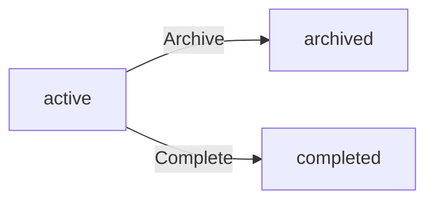

An **active** project is in its normal operating state. Employees assigned to an active project can log time against it, and new tasks can be created within it.

An **archived** project has been set aside but retains all its historical data. An archived project no longer accepts new time entries. All existing timelogs and tasks associated with the project are preserved in full.

A **completed** project has reached the end of its intended scope. Like an archived project, a completed project does not accept new timelogs. All historical timelogs, tasks, and associated data remain intact and accessible for reporting and audit purposes.

Once a project moves to the archived or completed status, its historical records — including all timelogs and tasks — are fully preserved and remain queryable. The project's budget hours, actual logged hours, and task history continue to be available for reference.

## ProjectMember Concept

A ProjectMember represents the assignment of an organization member to a specific project, capturing both the participation relationship and the role that member plays within the project. Each ProjectMember record links one employee to one project and carries a project role — either member or project-lead. Employees assigned as project-lead have elevated authority within the project, including the ability to manage tasks. Employees assigned as regular members can participate in the project and log time against it. A single employee can be a member of multiple projects simultaneously. The ProjectMember concept is distinct from the organization-level Role: the project role governs project-specific authority, while the organization role governs broader platform access.

### ProjectMember as Employee-to-Project Assignment

A ProjectMember record represents the formal assignment of a single organization member to a single project. It is the binding relationship that grants an employee participation rights within a project, serving as the entry point for project-level activity such as time logging and task visibility.

Each ProjectMember record is uniquely scoped to one employee and one project — the same employee can appear as a project member on multiple projects, but each such participation is a separate, independent record. There is no upper limit on how many projects an employee may be assigned to simultaneously.

Project membership is created explicitly by users with project management authority; employees do not become members of a project automatically by virtue of their organization membership.

### Project Role: Member and Project-Lead

Every ProjectMember record carries a project role that describes the authority that employee holds within the specific project. There are exactly two project roles available:

- **Member**: A regular participant in the project. Members can log time against the project and view tasks assigned to them within the project.
- **Project-Lead**: An elevated role within the project. Project leads hold all the rights of a regular member and additionally have authority to create, edit, and manage tasks within their assigned project.

The project role is assigned when the employee is added to the project and can be changed by users with project management authority. A single employee may hold the project-lead role on one project and the member role on another simultaneously, as each project membership is independent.

### Project-Lead Authority Within the Project

The project-lead role confers project-scoped task management authority. A project lead can create tasks within the project, edit existing tasks, and update task statuses — capabilities that regular project members do not possess.

Project-lead authority is strictly limited to the projects where the employee holds that role. Being a project lead on one project confers no elevated rights on any other project. The project-lead designation does not affect the employee's access to organization-wide features; those remain governed by the organization-level role (defined in the Role Concept section).

### Project Role Distinct from Organization Role

The project role (member or project-lead) is entirely separate from the organization-level role (Owner, Manager, Employee, or custom roles). The two role systems operate independently and serve different purposes:

- The **organization role** governs broad platform access across the entire organization — permissions such as approving timesheets, managing employees, or viewing reports.
- The **project role** governs project-specific authority — specifically, whether the employee can manage tasks within a given project.

An employee with the organization-level Employee role may be a project lead on a project, giving them task management rights within that project. Conversely, an employee with a high-level organization role still requires explicit project membership to log time against a project. Neither role system is a superset of the other; they must be read together to understand a user's full scope of access.

### Project Membership as Prerequisite for Time Logging

Active project membership is a prerequisite for an employee to log time against a project. An employee who is not a member of a project cannot create timelogs associated with that project, regardless of their organization-level role.

Similarly, when logging time against a task, the task must belong to a project the employee is a member of. Project membership therefore serves as the gateway controlling which projects and tasks appear as valid targets for an employee's time entries. When an employee is removed from a project, they lose the ability to log new time against it, though existing timelogs they have previously submitted remain associated with the project and are preserved.

## Task Concept

A Task represents a discrete unit of work within a project that can be tracked, assigned, and prioritized. Each task belongs to exactly one project and has a required title along with an optional description. Tasks have a status — open, in-progress, completed, or closed — that reflects their current state in the work lifecycle. A priority level — low, medium, high, or urgent — indicates the relative importance of the task. Optional attributes include estimated hours for effort planning, a due date for deadline tracking, and an assigned employee who must be a project member. Tasks can have a parent task, enabling a simple one-level subtask hierarchy within a project. The assigned employee and the due date together help teams coordinate who is doing what and by when.

### Task as a Unit of Work

A Task represents a discrete, trackable unit of work within a project. Every task belongs to exactly one project; it cannot exist independently or be shared across multiple projects.

Each task has a required title that identifies the work to be done, and an optional description that provides additional context or instructions. Together, these two attributes communicate the nature and scope of the work to team members.

A task may optionally reference a parent task, creating a simple one-level subtask hierarchy within the same project. A subtask belongs to the same project as its parent and cannot itself serve as a parent task, ensuring the hierarchy remains a single level deep. This nesting allows a larger piece of work to be broken into smaller, independently trackable items without introducing complex tree structures.

An optional assigned employee links the task to the team member responsible for completing it. The assigned employee must be a current member of the project to which the task belongs; a task cannot be assigned to someone outside the project.

### Task Status and Priority

Every task carries a status that reflects where it stands in the work lifecycle. The four possible statuses are:

- **Open** — the task has been created but work has not yet started.
- **In-Progress** — work on the task is actively underway.
- **Completed** — the work has been finished.
- **Closed** — the task has been formally closed, whether completed or cancelled, and is no longer active.

Status progresses as work advances, and each change is recorded in the task's history (see TaskHistory Concept). The status gives the team a shared view of where each item stands at any point in time.

Every task also carries a priority level that communicates its relative importance to other tasks in the project. The four priority levels are:

- **Low** — the task is non-urgent and can be addressed when bandwidth allows.
- **Medium** — the task is moderately important and should be addressed in normal course.
- **High** — the task is important and should be prioritized over medium and low items.
- **Urgent** — the task demands immediate attention above all others.

Priority helps teams sequence their work, especially when multiple tasks are in-progress or open simultaneously.

### Task Planning Attributes

Beyond its core identity, a task can carry optional planning attributes that support effort estimation and deadline management.

**Estimated hours** represent the anticipated effort required to complete the task, expressed as a numeric hour value. This figure is used for planning purposes — comparing estimated effort against actual time logged helps teams refine future estimates and identify scope changes early. Estimated hours are entirely optional; tasks without an estimate can still be tracked and completed.

**Due date** marks the deadline by which the task should be completed. Teams use the due date to sequence work, communicate expectations, and surface tasks at risk of being late. Like estimated hours, a due date is optional; not all tasks require a hard deadline.

Together, the assigned employee, estimated hours, and due date form the coordination layer of a task — answering who is responsible, how much effort is expected, and by when the work should be done.

## TaskHistory Concept

A TaskHistory entry is an immutable record that captures a status change event on a specific task. Every time a task transitions from one status to another, a new history entry is created to preserve that change permanently. Each entry records the exact timestamp when the change occurred, the previous status before the change, the new status after the change, and the identity of the user who made the change. TaskHistory provides a complete, chronological audit trail of how a task has progressed through its lifecycle. Because entries are immutable records of past events, they cannot be modified after creation. The TaskHistory concept is always associated with a parent Task and represents the full change history for that task.

### TaskHistory as an Immutable Status Change Record

A TaskHistory entry is a permanent, system-generated record that captures a single status change event on a task. Every time a task transitions from one status to another — for example, from open to in-progress, or from in-progress to completed — the system automatically creates a new TaskHistory entry to document that specific transition.

Each TaskHistory entry carries four essential pieces of information:

- **Timestamp**: The exact moment when the status change occurred, providing a precise point in time for the event.
- **Old status**: The status the task held immediately before the change was made (for example, open, in-progress, completed, or closed — as defined in the Task Concept).
- **New status**: The status the task transitioned to as a result of the change.
- **Responsible user**: The identity of the organization member who performed the status change.

Because TaskHistory entries represent facts about past events, they are immutable by design. Once a history entry is created, it cannot be modified or deleted. This immutability ensures the integrity and trustworthiness of the audit record over time.

### Chronological Audit Trail and Link to Parent Task

Every TaskHistory entry belongs to exactly one parent task. The complete set of history entries for a given task forms a chronological audit trail that documents the full lifecycle of that task from its earliest recorded status change through to its most recent one.

This audit trail allows any authorized viewer to reconstruct the progression of a task over time — understanding when it moved between statuses, in what order those transitions occurred, and who was responsible for each change. The history is ordered by timestamp, so the sequence of events is always clear and unambiguous.

The audit trail is comprehensive: no status change on a task can occur without a corresponding history entry being generated. As a result, the TaskHistory for a task provides a complete and reliable account of how work progressed, making it useful for accountability, performance review, and retrospective analysis within a project.

## Timelog Concept

A Timelog is the fundamental unit of time tracking in the platform, representing a single recorded work session by an employee on a given day. Each timelog is owned by a specific organization member and belongs to a particular project that the employee is assigned to. A timelog records the date on which the work occurred and the duration of that work expressed in minutes. Optionally, a specific task within the project can be referenced to provide more granular context for what was worked on. An optional description field allows the employee to note what was accomplished during that session. A billable flag indicates whether the time recorded should be counted as billable to a client or stakeholder, defaulting to true. Timelogs form the foundational data from which timesheets, reports, and budget utilization are calculated.

### Timelog as a Recorded Work Session

A Timelog is the fundamental unit of time tracking in the platform. It represents a single, discrete work session completed by an organization member on a specific day. Each timelog is owned by exactly one organization member and is always scoped to the organization that member belongs to.

Every timelog captures:
- **Date of work** — the calendar day on which the work occurred, not when the timelog was entered. This allows employees to log work retroactively for a given day.
- **Duration** — the length of the work session, expressed in whole minutes. Duration is a required value and represents the core measured output of a timelog.
- **Project** — the project against which the work is recorded. The project must be one that the owning employee is actively assigned to as a project member. A timelog cannot exist without a project association.
- **Task** (optional) — a specific task within the selected project, providing more granular context for the work performed. If specified, the task must belong to the same project as the timelog.
- **Description** (optional) — a free-text field where the employee can describe what was accomplished during the session.
- **Billable flag** — a boolean indicator of whether the time should be counted as billable toward a client or stakeholder. The billable flag defaults to true for all new timelogs but can be set to false when the work is non-billable in nature.

A timelog is always associated with a single day; it does not span across multiple days. The combination of owner, date, project, and duration forms the core identity of each work record.

### Timelog as Source Data for Timesheets and Reports

Timelogs are the foundational data layer from which higher-level organizational insights are derived. They serve two primary downstream purposes:

**Timesheets** — A timesheet for a given week aggregates the timelogs belonging to its owner that fall within that week's Monday-to-Sunday range. The total hours shown on a timesheet are calculated directly from the duration values of its included timelogs. When a timesheet is approved, all timelogs associated with it become locked and can no longer be modified or removed.

**Reports** — Organization-level reports (such as the Time Report, Project Budget Report, and Weekly Summary Report) are all computed from timelog data. The billable flag on each timelog determines how hours are categorized in billable versus non-billable breakdowns within reports. Project budget utilization is measured by comparing a project's budget hours against the total duration of all timelogs logged against that project.

Because timelogs are the authoritative source of recorded work, their integrity directly affects the accuracy of approvals, payroll-relevant records, and organizational reporting. Timelogs that have been included in a submitted or approved timesheet are subject to protection rules (defined in 04-business-rules.md) that prevent modification or deletion.

## Timesheet Concept

A Timesheet is a weekly collection of timelogs submitted by an employee for managerial review and approval. Each timesheet is owned by a specific organization member and covers exactly one calendar week, defined as Monday through Sunday. The week start date (Monday) and week end date (Sunday) together uniquely identify the period the timesheet covers. A timesheet carries a status — draft, submitted, approved, or rejected — that represents where it stands in the approval lifecycle. The total hours attribute is a calculated value derived from all timelogs included in the timesheet. A submitted-at timestamp records when the employee formally submitted the timesheet for review. When a reviewer acts on the timesheet, a reviewed-at timestamp and the identity of the reviewer are recorded. If a timesheet is rejected, a rejection reason is required to inform the employee of what needs correction. An approved timesheet locks all its included timelogs, preventing further edits.

### Timesheet as a Weekly Collection

A timesheet is a formal record that groups an employee's timelogs for a single calendar week, submitted for managerial review and approval. Each timesheet is owned by exactly one organization member — the employee whose work time the timesheet represents.

The calendar week is strictly defined as Monday through Sunday. A timesheet's week start date is always a Monday, and its week end date is always the following Sunday. Together, these two dates uniquely identify which week the timesheet covers. No two timesheets for the same employee in the same organization may cover the same week while either is in an active state.

The total hours attribute of a timesheet is a calculated value derived from the sum of the durations of all timelogs included in it. This value reflects the actual logged work and is not entered manually by the employee.

### Timesheet Status Lifecycle

Every timesheet carries a status that indicates where it stands in the review and approval process. The four possible statuses are:

- **Draft**: The timesheet has been created but not yet submitted. The employee may add or remove timelogs and make changes freely.
- **Submitted**: The employee has formally submitted the timesheet for managerial review. The timelogs included at the time of submission are under review.
- **Approved**: A reviewer with approval authority has accepted the timesheet. All timelogs included in an approved timesheet become locked and can no longer be edited or deleted by anyone, preserving the integrity of the historical record.
- **Rejected**: A reviewer has declined the timesheet and provided a reason for rejection. A rejected timesheet returns to draft status, allowing the employee to revise and resubmit it.

The diagram below illustrates the status transitions a timesheet undergoes:

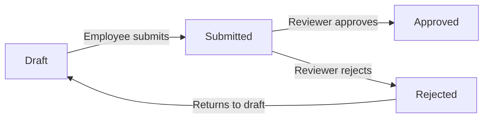

### Timestamps, Reviewer Identity, and Rejection Reason

A timesheet records key temporal and identity information as it moves through its lifecycle.

When an employee formally submits a timesheet, the system records a submitted-at timestamp capturing the exact moment of submission.

When a reviewer acts on a submitted timesheet — whether approving or rejecting it — the system records a reviewed-at timestamp to capture when the decision was made. The identity of the reviewer (the organization member who performed the approval or rejection) is also stored alongside this timestamp, providing a clear audit trail of who reviewed the timesheet.

If a timesheet is rejected, a rejection reason is required. The reviewer must provide a textual explanation so the employee understands what needs to be corrected before resubmitting. A rejection without a stated reason is not permitted.

## Timer Concept

A Timer represents an active, real-time tracking session initiated by an employee to measure work duration as it happens. Unlike a Timelog which records a completed work session, a Timer is a live in-progress record that continuously accumulates time from the moment it is started. Each timer is owned by exactly one organization member, and each member can have at most one active timer at any given moment. A timer records a start timestamp that marks when the session began. It references a project (required) and optionally a task within that project, establishing the work context for the session. An optional description field captures what the employee is working on during the session. The active status of the timer indicates whether it is currently running. When stopped, the elapsed duration is used to create a corresponding Timelog. A timer that is never stopped continues running indefinitely and does not create a timelog unless the employee explicitly acts on it.

### Timer as a Live Real-Time Tracking Session

A Timer represents an active, in-progress work session that an organization member initiates to measure time as it elapses in real-time. It is fundamentally distinct from a Timelog: while a Timelog is a completed, historical record of work already done, a Timer is a live record that is still accumulating duration. A Timer exists only while an employee is actively tracking an ongoing activity — it has not yet produced a finalized time entry.

Each Timer is owned by exactly one organization member. At any given moment, each member may have at most one active Timer. Starting a new Timer is not possible if the member already has an active Timer running.

The Timer captures a start timestamp — the precise moment the employee initiated the tracking session. This timestamp serves as the anchor from which the elapsed duration is calculated at any point in time.

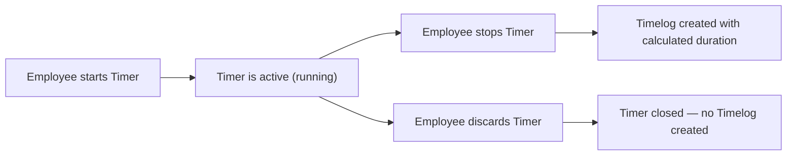

### Timer Attributes and Work Context

A Timer carries a small set of attributes that define the context of the ongoing work session:

- **Start timestamp**: The exact date and time when the employee started the Timer. This is required and immutable once the Timer is running.
- **Project**: A reference to the project the employee is working on. This is required — a Timer cannot exist without being linked to a project. The project must be one that the employee is an active member of.
- **Task**: An optional reference to a specific task within the selected project. If provided, the task must belong to the linked project. The task may be left unspecified if the work is not associated with a particular task.
- **Description**: An optional free-text field where the employee can capture what they are currently working on during the session. This description can be updated while the Timer is running.
- **Active status**: A flag indicating whether the Timer is currently running. A Timer is active from the moment it is started until it is either stopped or discarded. Each employee can have at most one Timer in the active state at any given time.

### Timer Lifecycle and Relationship to Timelog

The lifecycle of a Timer spans from when an employee starts it to when the employee explicitly acts on it. A Timer does not stop automatically — if the employee forgets to stop it, it continues running indefinitely. There is no automatic timeout or system-triggered termination.

The Timer resolves in one of two ways:

- **Stopped**: The employee explicitly stops the Timer. At the moment of stopping, the system calculates the total elapsed duration from the start timestamp to the stop moment. The duration is rounded to the nearest minute. A new Timelog is then automatically created using this calculated duration, along with the project, task, and description captured by the Timer. The Timer is no longer active after this point.
- **Discarded**: The employee explicitly discards the Timer. No Timelog is created, and the tracked time is permanently abandoned. The Timer is no longer active after this point.

The key distinction between a Timer and a Timelog is completion and finality. A Timer is transient — it exists only to facilitate real-time tracking and will either produce a Timelog or be discarded. A Timelog is a permanent, historical record that becomes part of the employee's time history and may be included in a Timesheet. Once a Timer produces a Timelog (upon stopping), that Timelog follows its own lifecycle and is fully independent of the Timer that created it.

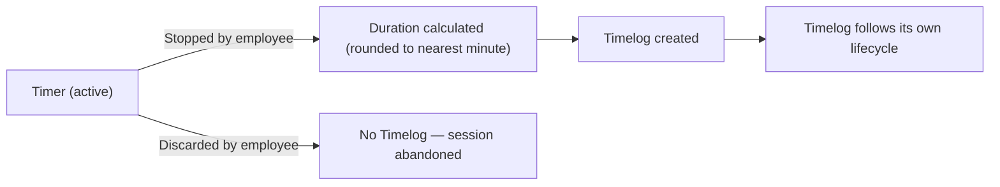

## ActivityLog Concept

An ActivityLog entry is a system-generated, immutable record that captures a significant action taken within an organization. It serves as an organizational audit trail, providing visibility into who did what and when across key business events. Each entry records the exact timestamp when the action occurred, the user who performed it, a categorized action type, and the target entity that was affected. Action types cover events such as an employee being invited or deactivated, a contract being created or edited, a project being archived or completed or deleted, a task status being changed, a timesheet being submitted, approved, or rejected, and a role being assigned or changed. The details field may carry additional context relevant to the specific action. Activity log entries are never modified after creation, ensuring the integrity of the historical record. The activity log is scoped to a single organization, so each organization maintains its own audit history.

### ActivityLog as Organizational Audit Trail

An ActivityLog is a system-generated record that forms the organizational audit trail — a chronological, tamper-proof history of significant events that have occurred within an organization. Every ActivityLog entry is created automatically by the system in response to a meaningful business action; users cannot manually create, edit, or delete activity log entries. Once written, an entry is permanent and immutable, ensuring that the historical record accurately reflects what happened and cannot be altered after the fact.

The activity log is scoped strictly to a single organization. Each organization maintains its own independent audit history, and entries from one organization are never visible to members of another. This scoping ensures that the audit trail reflects only actions relevant to the organization it belongs to, and upholds the data isolation model that governs the entire platform.

The primary purpose of the activity log is to give authorized users — specifically those with `org:manage` permission — visibility into who did what and when across key business events, supporting oversight, accountability, and organizational governance.

### ActivityLog Entry Attributes

Each ActivityLog entry captures the following information:

- **Timestamp**: The exact moment the action occurred, recorded at the time the system processes the event. This establishes the precise chronological position of the entry within the organization's history.
- **Performing user**: The organization member who carried out the action. Every logged action is tied to a specific member, establishing accountability. The performing user is recorded at the time of the action and is not updated if the member's profile changes later.
- **Action type**: A categorized label that identifies the kind of event that occurred. Action types are drawn from a fixed set of recognized business events (described in the section below). The action type enables filtering and grouping of the audit log.
- **Target entity**: The specific business object that was affected by the action — for example, a particular employee record, contract, project, task, timesheet, or role. The target entity gives context to the action type, identifying what was acted upon.
- **Details**: An optional field carrying additional context relevant to the specific action. For example, a role change entry might include the name of the old role and the new role; a rejection entry might include the rejection reason. Details are informational and supplement the action type without replacing it.

All attributes are captured at the moment the action occurs. No attribute of an existing entry is ever updated or overwritten after creation.

### Covered Action Types

The activity log records a defined set of business events. Only actions within this set generate activity log entries. The recognized action types are:

**Employee lifecycle events**
- Employee invited — recorded when a new employee invitation is sent to an email address within the organization.
- Employee deactivated — recorded when an active organization member's status is changed to deactivated.
- Employee reactivated — recorded when a previously deactivated member is restored to active status.

**Contract events**
- Contract created — recorded when a new employment contract is created for an employee.
- Contract edited — recorded when the current active contract of an employee is modified.

**Project events**
- Project created — recorded when a new project is added to the organization.
- Project archived — recorded when a project's status is changed to archived.
- Project completed — recorded when a project's status is changed to completed.
- Project deleted — recorded when a project is permanently removed from the organization.

**Task events**
- Task status changed — recorded when a task transitions from one status to another. This captures the organization-level audit perspective, complementing the task-specific history tracked in TaskHistory (defined in the TaskHistory Concept section).

**Timesheet events**
- Timesheet submitted — recorded when an employee submits a draft timesheet for approval.
- Timesheet approved — recorded when an authorized reviewer approves a submitted timesheet.
- Timesheet rejected — recorded when an authorized reviewer rejects a submitted timesheet.

**Role events**
- Role assigned or changed — recorded when an organization member's role is assigned for the first time or changed from one role to another.

Actions outside this defined set do not generate activity log entries. The set of covered actions is fixed and not configurable by organizations.

# Domain Relationships

Describe how concepts relate to each other from a business perspective.

## Conceptual Relationships

Describe how concepts relate to each other in business terms.

### Platform-Level Ownership and Organizational Belonging

A User is the top-level account holder on the platform and may belong to multiple Organizations simultaneously. Each Organization operates as a fully independent tenant and owns all data created within it — employees, projects, tasks, timelogs, timesheets, departments, roles, and activity logs. A User's relationship to an Organization is always mediated through an OrganizationMember record, which is the per-organization identity of that user. One User may therefore have multiple OrganizationMember records, one for each Organization they have joined.

An Organization is owned by exactly one OrganizationMember who holds the built-in Owner role. Ownership carries full administrative authority over the organization and its settings. An Organization also holds many Roles, many Departments, many Projects, and many ActivityLog entries, all of which are exclusively scoped to that Organization and are not visible or accessible from any other Organization context.

### User and Profile Associations

Each User has exactly one UserProfile, which stores the user's display name, avatar image, and optional phone number. The UserProfile is a global record — it is not scoped to any single Organization and is shared across every Organization the user belongs to. When a User joins a new Organization, their existing UserProfile is automatically visible within that Organization context through the OrganizationMember association.

A User also has many Invitations associated by email address. When a user registers with an email that has one or more pending Invitations, those Invitations are resolved and the user is automatically added to the corresponding Organizations as OrganizationMembers.

### OrganizationMember and Its Owned Records

An OrganizationMember belongs to exactly one Organization and exactly one User. Within that Organization, the OrganizationMember is assigned to exactly one Role, which determines what actions they may perform. An OrganizationMember may also belong to one Department (optional) and hold an optional position title.

The OrganizationMember is the central ownership anchor for work-related records within an Organization:

- An OrganizationMember has many EmployeeContracts, representing their historical employment agreements within the Organization. Only one contract may be active at any given time.
- An OrganizationMember has many ProjectMembers, representing the set of Projects they are assigned to.
- An OrganizationMember has many Timelogs, representing every work session they have recorded.
- An OrganizationMember has many Timesheets, representing their weekly approval submissions.
- An OrganizationMember has at most one active Timer at any given time.

All of these records are owned exclusively by the OrganizationMember within their Organization and are not shared across other Organizations.

### Project, Task, and Work Hierarchy

A Project belongs to exactly one Organization and is the container for all task and time-tracking work within that scope. A Project has many ProjectMembers, which are the employees assigned to collaborate on that project. A Project also has many Tasks and many Timelogs.

A ProjectMember record represents the association between an OrganizationMember and a Project. Each ProjectMember carries a project role — either member or project-lead — which governs task management authority within that project. An OrganizationMember must be a ProjectMember of a Project before they can log time against it.

A Task belongs to exactly one Project. A Task may optionally be assigned to an OrganizationMember, who must also be a ProjectMember of the same Project. A Task may optionally have one parent Task, enabling one level of subtask nesting. A Task has many TaskHistory entries, each of which records a single status change event, including the timestamp, old status, new status, and the OrganizationMember who made the change.

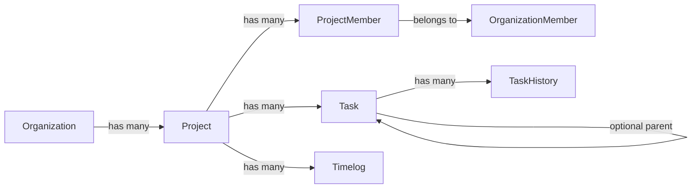

### Time Tracking Associations

A Timelog belongs to one OrganizationMember (its owner), one Project, and optionally one Task. A Timelog may also belong to one Timesheet; a Timelog without a Timesheet association is considered unsubmitted. A Timelog may only reference a Project that the OrganizationMember is currently a ProjectMember of, and may only reference a Task that belongs to that same Project.

A Timesheet belongs to one OrganizationMember and has many Timelogs. The Timelogs included in a Timesheet are the ones the employee explicitly associates with the weekly submission. A Timesheet may also be reviewed by another OrganizationMember (the approver), creating a reviewer association that is recorded alongside the approval or rejection outcome.

A Timer belongs to one OrganizationMember and references one Project and optionally one Task, using the same membership and project-task containment rules as Timelogs. When a Timer is stopped, it produces a new Timelog that inherits the project, task, and description recorded on the Timer.

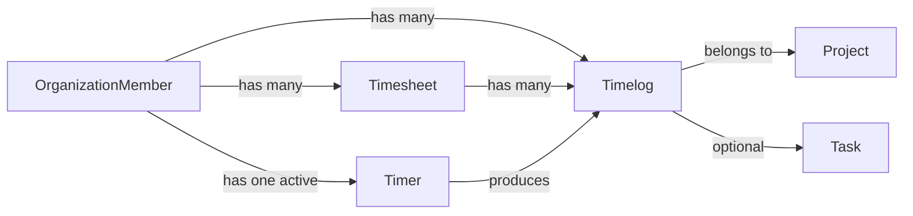

### Department and Role Associations

A Department belongs to one Organization. A Department may optionally have one parent Department, allowing one level of hierarchical grouping. An OrganizationMember may be assigned to one Department; this assignment is optional and does not affect permissions.

A Role belongs to one Organization. Each OrganizationMember within that Organization is assigned exactly one Role. Built-in roles (Owner, Manager, Employee) exist in every Organization by default. Custom roles are created within an Organization and may be assigned to any number of OrganizationMembers. A Role that has no OrganizationMembers assigned to it may be deleted; a Role with assigned members cannot be deleted.

### Activity Log and Invitation Associations

An ActivityLog entry belongs to one Organization and is associated with the OrganizationMember who performed the action. Activity log entries reference a target entity (such as a Project, Task, Timesheet, or OrganizationMember) and describe what occurred. Activity logs are system-generated and cannot be edited or deleted.

An Invitation belongs to one Organization and is issued by one OrganizationMember. An Invitation targets an email address. If a User account exists for that email, the Invitation resolves immediately and creates an OrganizationMember record. If no account exists, the Invitation remains pending until a User registers with that email address, at which point the pending Invitation is automatically accepted and the OrganizationMember relationship is established.

## Lifecycle and Retention

Describe concept lifecycle states and transitions only. Detailed retention/recovery policies belong in 05-non-functional. Operation details belong in 03-functional-requirements.

### User and Member Lifecycle

A user account begins in the active state upon successful registration and remains active unless the user chooses to delete their account or an administrator action triggers deactivation.

When a user deletes their own account, their employee records across all organizations they belong to are transitioned to the deactivated status. The user account itself is removed, but the historical employee records are preserved within each organization to maintain the integrity of past timelogs, timesheets, contracts, and activity logs attributed to that person.

An organization member (employee) can be in one of two states: active or deactivated. An active member may log time, submit timesheets, and participate in projects. A deactivated member loses the ability to perform any of these actions but their historical records — including timelogs, timesheets, and contracts — remain intact within the organization.

Deactivated members can be reactivated, returning them to the active state with the same role and organizational association they previously held. No historical data is lost during deactivation or reactivation.

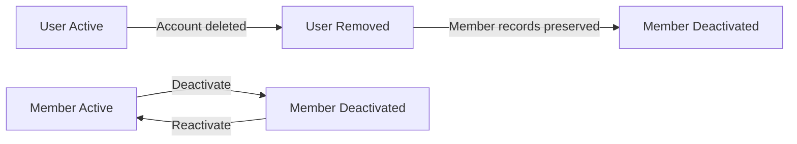

### Invitation Lifecycle

An invitation begins in the pending state at the moment it is issued to an email address by an authorized member of the organization. An invitation remains pending until the invited person accepts it by signing into the platform with the matching email address.

If the invited email address already belongs to an existing user account, that user is added directly to the organization upon acceptance, and the invitation transitions to the accepted state. If the invited email has no existing account, the invitation remains pending until the person registers with that email, at which point the system automatically adds them to the organization and the invitation transitions to the accepted state.

An invitation does not expire automatically. It remains pending indefinitely until accepted. Once accepted, an invitation cannot be reused or reissued for the same membership it established.

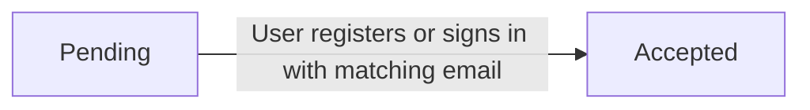

### Project and Task Lifecycle

A project begins in the active state when created and may transition to either archived or completed. Both archived and completed are terminal states in the sense that they prevent new time from being logged against the project. Existing timelogs recorded against an archived or completed project are preserved in full.

A project in the active state can be moved to archived or completed by authorized users. There is no transition back from archived or completed to active described in the domain; these states represent the end of a project's operational life.

A project can only be permanently deleted when it has no timelogs associated with it. Once timelogs exist, the project cannot be deleted — it can only be archived or completed.

A task follows its own lifecycle independent of, but constrained by, the parent project. A task starts in the open state and may progress through in-progress, completed, and closed states. Each status change is recorded in the task history as an immutable event, capturing the old status, new status, the timestamp, and the user who made the change. Task history entries are never modified or deleted.

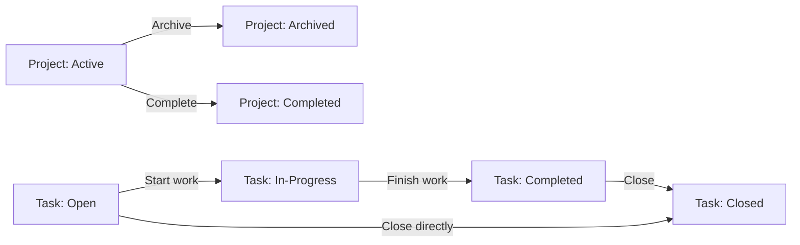

### Timesheet and Timelog Lifecycle

A timelog is created as a standalone record belonging to an employee. It exists independently until it is associated with a timesheet. Once included in a submitted or approved timesheet, the timelog becomes subject to restrictions: it cannot be edited while part of a submitted timesheet, and it cannot be deleted once included in any submitted or approved timesheet.

When a timesheet is approved, all timelogs included in that timesheet are permanently locked — they cannot be edited or deleted by anyone, preserving the integrity of the approved record.

A timesheet begins in the draft state. An employee assembles timelogs into a draft and may submit it for approval, transitioning the timesheet to the submitted state. From the submitted state, a user with approval authority may either approve the timesheet — moving it to the approved state — or reject it with a written reason, returning it to the draft state.

Once returned to draft after rejection, the employee may modify the included timelogs and resubmit. A timesheet that is approved cannot subsequently be moved to any other state; it represents the final, locked record of that week's work.

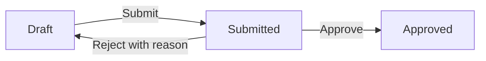

### Organization Deletion and Cascading Data Policies

An organization can only be deleted after satisfying two preconditions: all pending timesheets must be resolved (each must be either approved or rejected), and there must be no active employee contracts. These preconditions prevent data loss on records that are still operationally relevant.

When an organization is deleted, all data scoped to that organization is permanently removed. This includes all organization members, departments, roles, projects, tasks, task histories, timelogs, timesheets, timers, invitations, employee contracts, and activity logs associated with that organization. This deletion is irreversible.

The user account belonging to the organization owner is not deleted when the organization is deleted. The owner's account remains on the platform, no longer associated with the deleted organization, and may continue to participate in other organizations or create a new one.

For custom roles within an organization, a role can only be deleted if no employees are currently assigned to it. This prevents orphaned member records with no role assignment.

For departments, deleting a department does not delete the employees within it. Instead, those employees' department assignment is set to none, and they remain active members of the organization.

For projects, deletion is only possible when the project has no associated timelogs. If timelogs exist, the project must be archived or completed instead of deleted, ensuring that time records are never orphaned or lost.

### Timer and Contract Lifecycle

A timer exists in either an active or inactive state. Each employee may have at most one active timer at any given time. The timer becomes active when the employee starts it and transitions to inactive when the employee either stops it or discards it.

Stopping a timer creates a new timelog record with the calculated duration (rounded to the nearest minute) and then terminates the timer session. Discarding a timer terminates the session without creating any timelog. A timer that is neither stopped nor discarded continues running indefinitely; the system does not automatically stop or discard timers.

An employee contract follows a sequential historical lifecycle. Only one contract may be active at a time per employee. When a new contract is created for an employee who already has an active contract, the previous contract's end date is automatically set to the day before the new contract's start date, transitioning it to a historical (closed) state. Past contracts are immutable — once superseded, they cannot be edited and serve as a permanent historical record of employment terms.

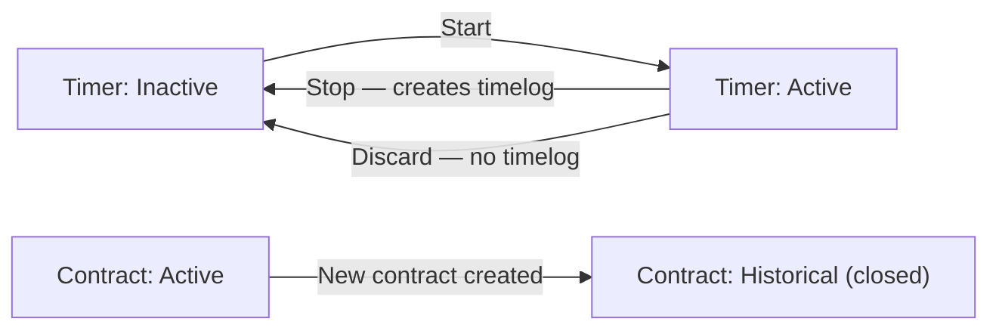

# Business Categories and State Flows

Business category classifications and state flow definitions.

## Business Category Definitions

Define all business category classifications with their allowed values and descriptions.

### Employment and Membership Classifications

The platform uses a set of fixed classification values to categorize the employment relationship and participation status of individuals within an organization.

**Employment Type** classifies how an organization member is engaged:
- **Full-time**: A member working regular, full working hours under a standard employment arrangement.
- **Part-time**: A member working fewer hours than full-time, typically under a defined schedule.
- **Contractor**: A member engaged on a contractual basis, not as a permanent employee.
- **Intern**: A member in a temporary, often trainee-level capacity.

Every organization member must be assigned exactly one employment type. Employment type can be changed by users with the `employee:manage` permission.

**Member Status** reflects whether an organization member is currently active within the organization:
- **Active**: The member can log time, submit timesheets, and perform actions within the organization according to their role.
- **Deactivated**: The member cannot log time, submit timesheets, or take new actions. Their historical data — timelogs, timesheets, contracts — is fully preserved and remains accessible.

Members can be deactivated and subsequently reactivated. Deactivated members cannot be assigned to new tasks, but existing assignments are retained in historical records.

**Invitation Status** classifies the state of an email-based onboarding invitation:
- **Pending**: The invitation has been issued but the invited email has not yet joined the organization.
- **Accepted**: The invited user has signed up (or was already registered) and has been added to the organization.

An invitation moves from pending to accepted only once. Accepted invitations are not reversible through the invitation mechanism.

### Project and Task Status Classifications

Projects and tasks each carry their own set of status values that govern what actions can be taken on them.

**Project Status** defines the operational state of a project:
- **Active**: The project is ongoing and accepts new timelogs. Employees can be assigned and tasks can be created.
- **Archived**: The project is paused or deprioritized. No new timelogs can be added. Existing timelogs and memberships are preserved.
- **Completed**: The project has reached its conclusion. No new timelogs can be added. All historical data is preserved.

Transitions between project statuses are controlled by users with `project:manage` permission. Both archived and completed projects are non-editable in terms of time logging, though their existing data remains intact.

**Task Status** reflects the progress of a discrete unit of work:
- **Open**: The task has been created and is awaiting action.
- **In-progress**: Work on the task has begun.
- **Completed**: The task has been finished.
- **Closed**: The task is no longer active, either by resolution or administrative closure, without necessarily being completed.

Every task status change is automatically recorded in the task's history, capturing the old status, new status, timestamp, and the user who made the change.

**Task Priority** indicates the urgency and importance of a task:
- **Low**: The task is not time-sensitive.
- **Medium**: The task has moderate importance.
- **High**: The task requires prompt attention.
- **Urgent**: The task demands immediate action.

Priority is set at task creation and can be updated by project leads or users with `project:manage` permission.

**Project Role** classifies the level of responsibility an organization member holds within a specific project:
- **Member**: A standard project participant who can log time against the project.
- **Project-lead**: An elevated participant who can manage tasks within the project in addition to logging time.

Each project membership carries exactly one project role. A single employee may hold different project roles across different projects.

### Contract Pay Period and Timesheet Status Classifications

Financial and time-reporting workflows rely on additional classification types that define how pay is calculated and how weekly time submissions progress through approval.

**Pay Period** defines the cycle in which an employee's pay rate is applied under an employee contract:
- **Hourly**: The pay rate applies per hour worked.
- **Daily**: The pay rate applies per day worked.
- **Weekly**: The pay rate applies per week.
- **Monthly**: The pay rate applies per calendar month.

Every active employee contract must specify exactly one pay period. The pay period, together with the pay rate, defines the full financial terms of the engagement.

**Timesheet Status** tracks the lifecycle of a weekly time submission from creation through final approval or rejection:
- **Draft**: The timesheet has been created but not yet submitted for review. The employee can add or remove timelogs and modify the timesheet freely.
- **Submitted**: The employee has submitted the timesheet for approval. The timelogs included are locked against editing or deletion by the employee.
- **Approved**: A user with `time:approve` permission has approved the timesheet. All included timelogs become permanently locked and cannot be modified or deleted by anyone.
- **Rejected**: A user with `time:approve` permission has rejected the timesheet, providing a mandatory rejection reason. The timesheet returns to draft status, allowing the employee to revise and resubmit.

Only one timesheet per employee per week can exist in submitted or approved status at any given time.

**Billable Classification** applies to individual timelogs and indicates whether the logged time is intended to be billed to a client or project:
- **Billable**: The time entry counts toward billable hours in reports.
- **Non-billable**: The time entry is excluded from billable hour calculations.

The billable flag defaults to billable (true) when a timelog is created. Employees can override this value at the time of entry. Reports present a breakdown of total hours, billable hours, and non-billable hours separately.

## State Transitions

Define valid state transition paths for stateful concepts.

### Project Status State Flow

A project follows a lifecycle that governs whether it can accept new work. Projects begin in the **active** state when first created. From active, a project may be transitioned to either **archived** or **completed** by users with project management permission. Once a project is archived or completed, it cannot receive new timelogs, though all existing timelogs are preserved. There is no path from archived or completed back to active — these transitions are final.

- A newly created project is always placed in the **active** state.
- Only a project in the **active** state can transition to **archived** or **completed**.
- An archived or completed project is considered closed for time entry purposes.
- The distinction between archived and completed is semantic: archived projects are suspended indefinitely, while completed projects represent finished work.
- A project can only be permanently deleted if it has never had any timelogs recorded against it, regardless of its status.

### Task Status State Flow

Tasks progress through a defined sequence of states that reflect the progress of work. A task starts in the **open** state when created. It can be moved to **in-progress** when work begins, back to **open** if work is paused, advanced to **completed** when the work is done, or closed outright via the **closed** state. Every status change is recorded in the task's history, capturing the old state, the new state, the timestamp, and the user who made the change.

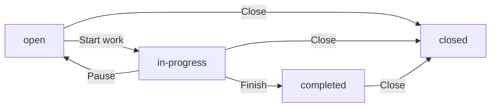

- A task begins in the **open** state upon creation.
- An **open** task can transition to **in-progress** when work is actively started.
- An **in-progress** task can revert to **open** if work is paused or reassigned.
- An **in-progress** task can advance to **completed** when work is finished.
- Tasks in **open**, **in-progress**, or **completed** states can be moved to **closed** to indicate the task is no longer relevant or has been formally closed.
- The **closed** state is terminal — no further transitions are defined from it.
- Every transition generates an immutable task history entry (defined in the TaskHistory Concept section).

### Timesheet Status State Flow

A timesheet moves through a multi-step approval workflow that ensures time records are reviewed before being locked. A timesheet begins as a **draft**, which an employee assembles by adding timelogs. Once ready, the employee submits it, changing status to **submitted**. A reviewer with approval permission then either approves or rejects the submission. An approved timesheet locks its timelogs. A rejected timesheet returns to **draft** so the employee can revise and resubmit.

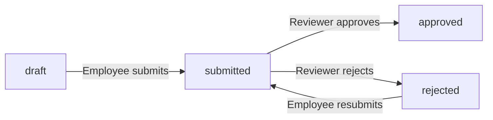

- An employee creates a timesheet in the **draft** state for a specific week.
- While in **draft**, the employee may freely add or remove timelogs.
- A **draft** timesheet with no timelogs cannot be submitted.
- Submitting a draft transitions the timesheet to **submitted** and records the submission timestamp.
- Only one submitted or approved timesheet may exist per employee per week. A second submission for the same week is blocked.
- From **submitted**, a reviewer can transition it to **approved**, recording the reviewer and the review timestamp. All timelogs included in the timesheet become locked upon approval.
- From **submitted**, a reviewer can transition it to **rejected** by providing a mandatory rejection reason, recording the reviewer and review timestamp.
- A **rejected** timesheet returns to a **draft**-like editable state, allowing the employee to modify timelogs and resubmit, transitioning it back to **submitted**.
- The **approved** state is terminal — an approved timesheet cannot be reversed, edited, or deleted.

### Invitation Status State Flow

An invitation tracks whether a prospective employee has accepted their onboarding into an organization. When a user with employee management permission invites an email address, an invitation is created in the **pending** state. Once the invitee registers or logs in with that email and accepts the membership, the invitation transitions to **accepted** and the user is added to the organization.

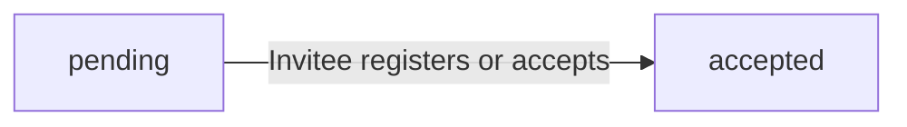

- An invitation is created in the **pending** state when an employee is invited by email.
- If the email already belongs to an existing user account, the user is added to the organization immediately and the invitation is considered accepted.
- If the email has no existing account, the invitation remains **pending** until the user signs up with that email.
- Upon sign-up with a matching email, the system automatically locates all pending invitations for that address and transitions them to **accepted**, adding the new user to the corresponding organizations.
- Once **accepted**, an invitation record is immutable and serves as a historical record of when and by whom the member was originally invited.

### OrganizationMember and User Status State Flow

Both user accounts and organization member records carry their own status that governs access and activity. These two status concepts are related but independent.

**User Account Status**

A user account is **active** upon successful registration. It becomes **deactivated** if the user deletes their own account. A deactivated user's employee records in organizations they belonged to are also marked deactivated.

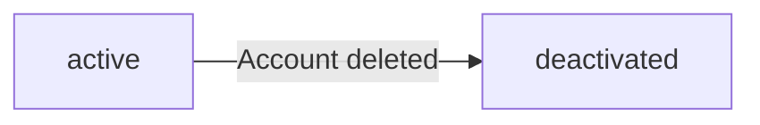

**OrganizationMember Status**

An organization member record begins as **active** when the employee joins the organization. A user with employee management permission can deactivate the member, setting the status to **deactivated**. A deactivated member can be reactivated, returning to **active**.

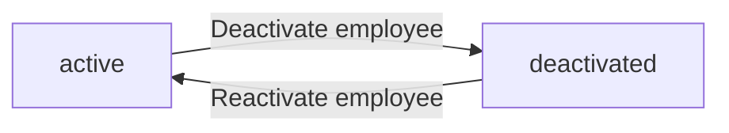

- A **deactivated** organization member cannot log time, start timers, or submit timesheets.
- A **deactivated** member's historical timelogs and timesheets remain fully preserved.
- A **deactivated** member can be reactivated at any time, restoring their ability to perform employee actions.
- A **deactivated** user account (from self-deletion) results in the member's records across all organizations being marked as deactivated; these records cannot be reactivated since the underlying account no longer exists.
- The **active** and **deactivated** states for an OrganizationMember are independent of the project membership — a deactivated employee may still appear in project member lists as historical context, but they cannot perform active work.

### Timer Active State Flow

A timer represents a live, real-time tracking session and follows a simple two-state workflow. An employee starts the timer, which becomes **active**, and then either stops it to produce a timelog or discards it without creating any record.

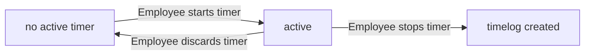

- Each employee may have at most one **active** timer at any given moment.
- When stopped, the timer calculates the elapsed duration (rounded to the nearest minute) and automatically creates a timelog with the recorded project, task, and description.
- When discarded, the timer is removed and no timelog is generated.
- While **active**, the employee may update the timer's description, project, or task without affecting the start timestamp.
- An active timer continues running indefinitely until the employee explicitly stops or discards it — there is no automatic timeout or expiry.