**erpHrm — What operations users can perform, use cases, business workflows**

What operations users can perform, use cases, business workflows

# Core Business Operations

What the system must do for each business concept.

## Organization Operations

An organization is the top-level container for all ERP data, and every user must belong to at least one organization to perform any meaningful work. During initial sign-up, a user creates an organization by providing a name, optional description, optional logo image, currency, timezone, and fiscal start month — all of which define how the organization operates. The founding user automatically becomes the organization owner with full access to every feature. Organization owners can update any of these settings at any time to reflect changes in business configuration. When viewing an organization, members see its name, description, logo, currency, and timezone as context for all subsequent actions. Owners may delete their organization, but only after all pending timesheets have been resolved (approved or rejected) and no active employee contracts remain in force. Deleting an organization permanently removes all associated employees, projects, tasks, timelogs, and timesheets, while the owner's user account is preserved but detached from the deleted organization. The system enforces that these two preconditions are fully satisfied before any deletion request is accepted. Multiple organizations can exist on the platform simultaneously, and each one is fully isolated from the others in terms of data and access. Users who belong to multiple organizations always operate within exactly one organization context at a time.

### Organization Creation During Sign-Up

When a new user completes sign-up, the system shall prompt them to create an organization before they can access any ERP features.

THE system SHALL require the user to provide an organization name (required), description (optional), logo image (optional), currency (required), timezone (required), and fiscal start month (required) during organization creation.

WHEN the user submits the organization creation form with all required fields, THE system SHALL create the organization and automatically assign the creating user as its Owner with full access to all features.

WHEN an organization is successfully created, THE system SHALL immediately set it as the user's active organization context, allowing them to begin work without any additional steps.

THE system SHALL allow a single user account to own or belong to multiple organizations, each created independently through the same sign-up or invitation flow.

WHEN organization creation fails due to missing required fields, THE system SHALL reject the request and indicate which required fields are missing, as defined in the error scenarios in 04-business-rules.

### Organization Settings

THE system SHALL maintain the following configurable settings for each organization: name, description, logo image, currency, timezone, and fiscal start month.

The organization name serves as the primary identifier displayed throughout the platform for all members. The description provides optional context about the organization's purpose. The logo image is an optional visual brand asset shown in the organization context. The currency setting defines the monetary unit used for pay rates and budget reporting. The timezone setting determines how dates and times are interpreted for timesheets and timelogs. The fiscal start month defines when the organization's financial year begins, used for reporting periods.

WHEN members view the organization, THE system SHALL display the organization name, description, logo, currency, and timezone as contextual information available to all members within that organization.

THE system SHALL apply the organization's timezone to all date-sensitive operations — including timesheet week boundaries and timelog dates — performed within that organization's context.

THE system SHALL apply the fiscal start month when computing period-based aggregations in reports for that organization.

### Editing Organization Settings

WHILE a user holds the Owner role in an organization, THE system SHALL allow them to update any organization setting at any time, including name, description, logo image, currency, timezone, and fiscal start month.

WHEN an organization owner submits updated settings, THE system SHALL apply the changes immediately and reflect them across all active sessions belonging to members of that organization.

IF a user without the Owner role (or without the `org:manage` permission on a custom role) attempts to edit organization settings, THEN THE system SHALL deny the request, as defined in the permission rules in 01-actors-and-auth.

WHEN the organization logo image is updated, THE system SHALL replace the previous logo and make the new logo visible to all organization members.

WHEN the currency or timezone is changed, THE system SHALL apply the new value to all future operations within the organization; historical records (timelogs, contracts, timesheets) retain their original values as recorded.

### Organization Deletion Preconditions

WHEN an organization owner requests to delete their organization, THE system SHALL verify that all preconditions are fully satisfied before accepting the deletion request.

THE system SHALL block organization deletion if any timesheet within the organization has a status of "submitted" (pending approval or rejection). All timesheets must be in an "approved" or "rejected" state before deletion is permitted.

THE system SHALL block organization deletion if any employee has an active contract — meaning a contract with no end date, or a contract whose end date has not yet passed. All employee contracts must be ended or expired before deletion is permitted.

IF either precondition is not met, THEN THE system SHALL reject the deletion request and clearly communicate which condition is blocking the deletion, as specified in 04-business-rules.

Only a user holding the Owner role within the organization may request deletion of that organization. Any other user, regardless of permissions, shall be denied the ability to delete the organization.

THE system SHALL re-evaluate both preconditions at the moment the deletion request is received to prevent race conditions where timesheets are submitted or contracts activated between the owner's check and the actual deletion.

### Permanent Deletion of Organization Data and Owner Account Preservation

WHEN all deletion preconditions are satisfied and the owner confirms deletion, THE system SHALL permanently and irreversibly remove all data associated with the organization.

THE system SHALL permanently delete the following data as part of organization deletion: all organization member records, all departments, all projects, all tasks and task histories, all timelogs, all timesheets, all timers, all employee contracts, all roles (including custom roles), all invitations, and all activity log entries belonging to that organization.

WHEN an organization is deleted, THE system SHALL preserve the owner's user account in its entirety, including their global profile, email address, and membership in any other organizations they belong to. The owner's account is simply detached from the deleted organization.

WHEN a non-owner member's employee record is deleted as part of organization deletion, THE system SHALL also preserve those users' accounts and their memberships in any other organizations they belong to.

THE system SHALL NOT allow partial deletion or soft-deletion of an organization; once the deletion is confirmed and preconditions are met, all associated data is permanently removed with no recovery path, as defined in 05-non-functional.

WHEN the deletion is complete, THE system SHALL remove the organization from the owner's list of available organizations. If the owner belongs to other organizations, they can continue using those; if they belong to no other organizations, they must create or join a new one to continue using the platform.

### Multi-Tenancy Isolation and Organization Context

THE system SHALL operate as a multi-tenant platform where each organization's data is fully and strictly isolated from all other organizations.

WHILE a user is operating within an organization context, THE system SHALL ensure that all data they can view, create, edit, or delete belongs exclusively to that organization. No data from other organizations shall be accessible.

WHEN a user who belongs to multiple organizations logs in, THE system SHALL require them to select which organization they wish to work in before proceeding. This selection establishes the organization context for all subsequent actions in that session.

THE system SHALL allow users to switch their active organization context at any time without logging out. Upon switching, all subsequent actions are scoped to the newly selected organization.

WHEN a user switches organization context, THE system SHALL discard any in-memory state from the previous organization and load the data, roles, and permissions applicable to the newly selected organization.

THE system SHALL enforce organization context on every operation, ensuring that no action — whether data retrieval, modification, or deletion — can cross organization boundaries, even for users who belong to multiple organizations.

## User Operations

Users register on the platform by providing an email address and password, and the email must be unique across the entire platform. After registration, users log in with their email and password and then select which organization they wish to work in, establishing an organization context for all subsequent actions. A user can belong to multiple organizations simultaneously, allowing them to switch between organizations without logging out. Users can change their own password at any time while authenticated. When a user decides to delete their account, the system first checks whether they are the sole owner of any organization; if so, they must transfer ownership to another member or delete that organization before proceeding. Upon account deletion, the user's employee records in other organizations are marked as deactivated rather than removed, preserving historical data integrity. Deactivated employee records retain all historical timelogs and timesheets but prevent any further time tracking or timesheet submission. The platform ensures that every action a logged-in user performs is scoped to their currently selected organization, enforcing strict data isolation.

### User Registration

A guest registers on the platform by providing an email address and a password. The email address must be unique across the entire platform — no two user accounts may share the same email. Upon successful registration, the system creates a new user account and an associated global user profile. If the user was invited to an organization with their email address before registering, the system automatically associates the new account with all pending invitations for that email and adds the user to the corresponding organizations. Registration does not require an existing organization; however, the system guides new users to create their first organization as the next step after signing up.

### User Login and Organization Context Selection

A registered user logs in with their email address and password. After successful authentication, the system presents the user with a list of organizations they belong to. The user selects which organization they wish to work in, and the system establishes an organization context for the session. All subsequent actions — viewing employees, projects, timelogs, timesheets, and reports — are scoped to the selected organization. If the user belongs to only one organization, the system may automatically select it as the active context. If the user belongs to no organization, they are prompted to create one.

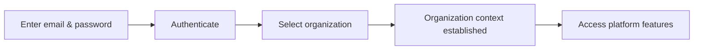

### Switching Organizations

A user who belongs to multiple organizations can switch their active organization context at any time without logging out. When the user initiates an organization switch, the system replaces the current organization context with the newly selected one. All data displayed and all actions performed after the switch are scoped exclusively to the newly selected organization. No data from the previous organization context is carried over or remains visible after switching. The user's authentication session remains active throughout the switch.

### Changing Password

An authenticated user can change their own password at any time. To do so, the user provides their current password and a new password. The system verifies that the current password is correct before applying the change. Once the new password is saved, it takes effect immediately for all future logins. Error conditions for this operation are defined in the User Error Scenarios section of the business rules.

### Account Deletion

An authenticated user can request deletion of their own account. Before the system processes the deletion, it checks whether the user is the sole owner of any organization. If the user is the sole owner of one or more organizations, they must first resolve that situation — either by transferring ownership of each such organization to another member or by deleting the organization entirely — before account deletion can proceed.

Once all sole-ownership conflicts are resolved, the system permanently deletes the user account and the associated global profile. The user is immediately logged out and can no longer access the platform.

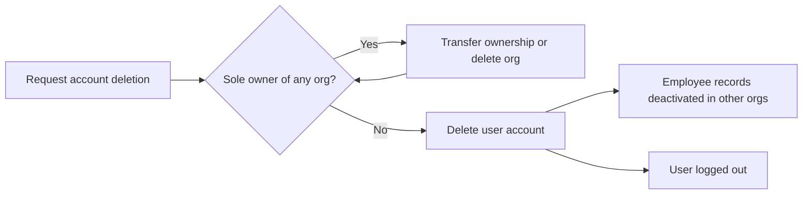

### Ownership Transfer Before Account Deletion

When a user is the sole owner of an organization and wishes to delete their account, they must transfer the owner role to another active member of that organization before proceeding. The system allows the user to select an existing active member and assign them the Owner role. Once the transfer is complete, the requesting user is no longer the sole owner and the account deletion check is satisfied for that organization. If an organization has no other active members, the user must delete the organization entirely rather than transfer ownership.

### Employee Record Deactivation on Account Deletion

When a user's account is deleted, the system does not remove their employee records from other organizations. Instead, each employee record associated with the deleted account is automatically marked as deactivated. Deactivated employee records retain all historical data — including timelogs, timesheets, and contracts — to preserve the integrity of organizational records. Deactivated records prevent any further time tracking or timesheet submission under that employee identity. These records can be viewed by users with the appropriate permission within each organization, as defined in the permissions section.

### Organization Context Enforcement

Every action performed by a logged-in user is enforced within the scope of their currently selected organization. The system ensures that employees, projects, tasks, timelogs, timesheets, and all other data visible to the user belong exclusively to the active organization. A user cannot access or modify data from an organization they have not selected as their current context, even if they are a member of that organization. Switching organizations is the only mechanism to change the scope of visible and actionable data.

### Multi-Organization Membership

A single user account can belong to multiple organizations simultaneously. Membership in each organization is independent — the user may hold different roles, departments, and positions across organizations. The user's global profile (display name, avatar, phone number) is shared across all organizations, but all organizational data such as role, employment type, and time records are specific to each organization. A user can be active in one organization and deactivated in another at the same time, and these statuses do not affect each other.

## UserProfile Operations

Every user has a single global profile that is shared across all organizations they belong to, meaning changes to the profile are immediately reflected in every organizational context. A profile consists of a display name, an optional avatar image, and an optional phone number. The profile is automatically created when a user registers and cannot be independently deleted — it exists as long as the user account exists. Users can edit their display name, avatar image, and phone number at any time. Because the profile is global, it is not tied to any single organization; other members within an organization see the user's display name and avatar as part of their identity. The profile serves as the human-readable identity layer on top of the technical user account credentials.

### Global User Profile

Every user account has exactly one global profile that persists for the lifetime of the account. The profile is automatically created when a user completes registration and cannot be independently deleted — it is removed only when the user's account is deleted.

The profile carries three pieces of identity information:
- **Display name** (required): the human-readable name shown to others throughout the platform.
- **Avatar image** (optional): a photo or image representing the user.
- **Phone number** (optional): a contact number for the user.

Because the profile is global, it is not scoped to or owned by any single organization. A user who belongs to multiple organizations has one profile whose information is the same in every organization context. There is no per-organization variant of the profile, and no organization can customize or override a member's profile data.

### Editing Profile Information

A user can update their own profile at any time regardless of which organization context they are currently operating in. The following fields can be changed:
- Display name (must not be left empty after editing).
- Avatar image (can be uploaded to replace the current image, or removed entirely).
- Phone number (can be set, changed, or cleared).

A user can only edit their own profile. No other user, regardless of role or permissions, can modify another user's profile on their behalf.

Because the profile is global, any change takes effect immediately and is reflected across every organization the user belongs to. There is no need to update the profile separately for each organization.

### Profile Visibility to Organization Members

Within an organization, any member can see the display name and avatar image of other members as part of their organizational identity. The phone number is part of the user's profile but its visibility to other organization members is limited to the profile owner — other members see the display name and avatar used to identify the person in lists, task assignments, timelog entries, timesheet reviews, and other collaborative contexts.

Because the profile is shared globally, a member's display name and avatar are consistent regardless of which organization is viewing them. There is no separate in-organization alias or display identity — what a user sets on their profile is what all organizations see.

## OrganizationMember Operations

An organization member record links a user account to a specific organization and captures the employment context within that organization. Each member record stores the assigned role, an optional department, an optional position or title, an employment type (full-time, part-time, contractor, or intern), and a status of either active or deactivated. Users with the employee management permission can edit a member's department, position, and employment type to reflect organizational changes. The same permission holders can deactivate a member, which prevents that member from logging time or submitting timesheets while preserving all their historical records. Deactivated members can be reactivated, restoring their ability to track time and submit timesheets. The employee list is paginated and can be filtered by department, employment type, and status, and can be searched by name, enabling managers to quickly find specific members in large organizations. Users with the employee view permission can browse the full employee list and view individual member details. Role assignment within an organization is managed as part of the member record and can be changed by anyone with the employee management permission.

### Member Record and Employment Context

An organization member record is created when a user joins an organization, either through accepting an invitation or through automatic association at sign-up. The record permanently links a user account to a specific organization and captures the employment context for that user within the organization.

Each member record stores the following employment details at the time of joining:

- **Employment type**: one of full-time, part-time, contractor, or intern, reflecting the nature of the working arrangement
- **Department**: the organizational unit the member belongs to (optional; a member may exist without a department assignment)
- **Position or title**: a free-form label describing the member's role or job title within the organization (optional)
- **Status**: either active or deactivated, determining whether the member can perform time-tracking activities
- **Assigned role**: exactly one role drawn from the organization's role list, governing what the member is permitted to do within the organization

A member record is specific to one organization. Users who belong to multiple organizations have a separate member record for each organization, each with its own employment type, department, position, status, and role assignment. The user account and profile remain shared and global across all organizations.

### Editing Member Information

Users who hold the employee management permission within an organization can update the employment details of any active member record. The editable fields are:

- Department (can be changed to a different department, or cleared to indicate no department)
- Position or title (can be updated or cleared)
- Employment type (can be changed to any of the four valid values: full-time, part-time, contractor, or intern)

Editing a member's information does not affect the member's status, role assignment, or any historical records such as timelogs, timesheets, or contracts. Changes take effect immediately and are reflected in the member list and member detail views. The activity log records significant member record changes (as defined in the Activity Log section).

The assigned role is managed separately through the role assignment operation and is not part of the general member edit operation.

### Deactivating and Reactivating Members

Users who hold the employee management permission can deactivate an active member. Deactivation changes the member's status from active to deactivated.

A deactivated member:

- Cannot create new timelogs or edit existing ones
- Cannot create, submit, or modify timesheets
- Cannot start or stop a timer
- Remains visible in the employee list and can be found through search and filtering
- Retains all historical records: all previously created timelogs, timesheets, contracts, and task assignments are fully preserved and remain accessible to users with appropriate permissions
- Retains their user account, which continues to be valid for other organizations they belong to

Deactivation is recorded in the activity log.

Users who hold the employee management permission can reactivate a deactivated member. Reactivation changes the member's status from deactivated back to active, immediately restoring all time-tracking and timesheet capabilities. The member's department, position, employment type, and role assignment are unchanged by deactivation or reactivation. Reactivation is also recorded in the activity log.

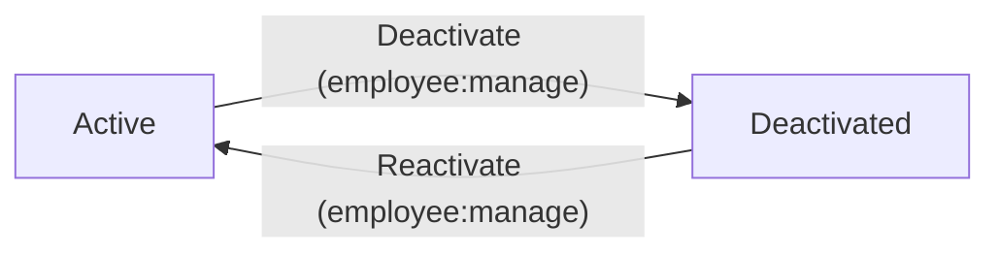

### Browsing the Employee List

Users who hold the employee view permission can browse the complete list of organization members, regardless of whether those members are active or deactivated. The employee list is paginated so that large organizations with many members can be navigated efficiently.

The list supports the following filtering options, which can be applied individually or in combination:

- **By department**: show only members belonging to a specific department
- **By employment type**: show only members of a specific employment type (full-time, part-time, contractor, or intern)
- **By status**: show only active members, only deactivated members, or all members

In addition to filtering, users can search the employee list by name. The search matches against the display name of the linked user account and returns only members whose name contains the search term.

When no filters or search terms are applied, the full paginated list of all organization members is returned. Each entry in the list displays the member's display name, employment type, department, position, status, and assigned role.

Users can also view the full detail of an individual member record, including their current role assignment, employment details, and contract summary.

### Role Assignment per Organization Member

Each member of an organization is assigned exactly one role at all times. The role determines the set of permissions the member holds within that organization. Role assignment is part of the member record and is specific to the organization.

Users who hold the employee management permission can change the role assigned to any member. The new role must be one of the organization's valid roles (built-in or custom). A member's role can be changed at any time regardless of their current status.

When a role is assigned or changed, the change takes effect immediately. The member's permissions are updated accordingly, meaning they gain or lose access to features in real time based on the new role's permission set. The role change is recorded in the activity log.

An organization must have at least one active member with the Owner role at all times. Attempting to remove the Owner role from the last remaining owner must be handled as defined in the Role Operations section.

## Role Operations

Each organization maintains its own set of roles that control what members are allowed to do within that organization. There are three built-in roles — Owner, Manager, and Employee — that cannot be deleted because they form the foundation of the permission model. The Owner has full access to all features including role and member management. The Manager can manage employees, projects, approve timesheets, and view reports. The Employee role allows time tracking, timesheet submission, and viewing of personal data. Organization owners can create custom roles by specifying a name and selecting a combination of available permissions: managing or viewing organization settings, managing or viewing employees, managing or viewing projects, managing time entries, approving timesheets, viewing all timelogs, and viewing reports. Owners can edit custom roles to adjust their name or permission set at any time. A custom role can only be deleted if no employees are currently assigned to it, protecting against accidental loss of access control. Every organization member is assigned exactly one role, and that assignment can be changed by anyone with the employee management permission.

### Built-in Roles and Their Capabilities

Each organization comes with three built-in roles that are permanently fixed and cannot be deleted or renamed.

THE system SHALL provide an Owner built-in role with full access to all features within the organization, including creating, editing, and deleting custom roles, managing all members, and performing all actions available to any other role.

THE system SHALL provide a Manager built-in role that grants the ability to manage employees, manage projects, approve or reject timesheets, and view organization reports.

THE system SHALL provide an Employee built-in role that grants the ability to log time, submit timesheets, and view the member's own timelogs, timesheets, and assigned tasks.

WHEN any user attempts to delete a built-in role (Owner, Manager, or Employee), THE system SHALL reject the request and preserve the role intact.

WHEN any user attempts to rename a built-in role, THE system SHALL reject the request and preserve the original name.

THE system SHALL automatically assign built-in permission sets to each built-in role: the Owner role carries all available permissions, the Manager role carries employee:manage, employee:view, project:manage, project:view, time:approve, time:view_all, and report:view, and the Employee role carries project:view and time tracking capabilities for personal data.

THE system SHALL display all three built-in roles in the organization's role list alongside any custom roles.

### Custom Role Creation

Organization owners can extend the role system by creating custom roles tailored to the organization's needs.

WHEN an organization owner creates a custom role, THE system SHALL require a unique name for the role within the organization.

WHEN an organization owner creates a custom role, THE system SHALL allow the owner to select any combination of the following permissions to associate with the role:
- **org:manage** — edit organization settings such as name, description, logo, currency, timezone, and fiscal start month
- **employee:manage** — add, edit, deactivate, and reactivate employee records
- **employee:view** — view the employee list and individual employee details
- **project:manage** — create, edit, archive, complete, and delete projects and their tasks
- **project:view** — view the list of projects and project details
- **time:manage** — edit or delete any employee's timelogs
- **time:approve** — approve or reject submitted timesheets
- **time:view_all** — view all employees' timelogs and timesheets
- **report:view** — access organization-level reports

THE system SHALL save the new custom role and make it immediately available for assignment to organization members.

WHEN a custom role is successfully created, THE system SHALL record the action in the organization's activity log.

THE system SHALL allow an organization to have multiple custom roles, each with its own distinct name and permission set.

### Custom Role Editing and Deletion

Organization owners can modify or remove custom roles as the organization's needs evolve.

WHEN an organization owner edits a custom role, THE system SHALL allow the owner to update the role's name, its permission set, or both.

WHEN a custom role's permissions are updated, THE system SHALL apply the new permission set immediately to all organization members currently assigned that role.

WHEN an organization owner requests to delete a custom role that has no members currently assigned to it, THE system SHALL permanently remove the role from the organization.

WHEN an organization owner requests to delete a custom role that still has one or more members assigned to it, THE system SHALL reject the deletion request and preserve the role. Error conditions for this scenario are defined in the business rules.

WHEN a custom role is successfully edited or deleted, THE system SHALL record the action in the organization's activity log.

THE system SHALL ensure that only organization owners can create, edit, or delete custom roles; users with other roles or permissions cannot perform these operations.

### Role Assignment and Reassignment

Every organization member is assigned exactly one role at all times, and that assignment can be changed by authorized users.

THE system SHALL require that every organization member is assigned exactly one role — either a built-in role or a custom role — at the time they are added to the organization.

WHEN a new member is added to the organization through invitation acceptance, THE system SHALL assign that member a role as part of the onboarding process.

WHEN a user with the employee:manage permission changes the role assignment of an organization member, THE system SHALL update the member's role immediately and apply the new permission set to all subsequent actions by that member.

THE system SHALL allow users with the employee:manage permission to reassign any member's role to any available role in the organization, including both built-in and custom roles.

WHEN the role of an organization member is changed, THE system SHALL record the role change in the organization's activity log, capturing who made the change and what role the member was moved to.

THE system SHALL prevent an organization member from having more than one role at the same time; assigning a new role replaces the previous role entirely.

THE system SHALL list all available roles — built-in and custom — when a user with employee:manage permission is selecting a role to assign to a member.

## Invitation Operations

Invitations are the mechanism by which new members are added to an organization. Users with the employee management permission initiate an invitation by providing an email address. If the email already belongs to an existing platform account, that user is immediately added to the organization as a member without requiring a separate acceptance step. If the email is not yet registered, the system creates a pending invitation linked to that email address. When a new user later registers with the matching email, the system automatically associates them with all organizations that have a pending invitation for that email, seamlessly onboarding them into the correct organizations. A pending invitation records the email, the organization it belongs to, the timestamp it was created, and its status (pending or accepted). Invitations transition to accepted status once the user is successfully added to the organization. The invitation system ensures that employee growth is controlled and traceable, with each invitation linked to the inviting user for accountability.

### Sending an Invitation

Users with the employee management permission can invite new people to join the organization by providing an email address. The invitation is initiated from within the organization context, meaning every invitation is scoped to a specific organization.

When an invitation is sent, the system first checks whether the provided email address belongs to an existing platform account:

- If the email is already registered, the system immediately adds that user to the organization as a member without creating a pending invitation. The inviting user does not need to take any further action, and the invited user does not need to accept separately — they are added directly.
- If the email is not yet registered, the system creates a pending invitation record for that email address within the organization. The invitation remains in pending status until the user registers with that email.

Only users with the employee management permission may send invitations. Users without this permission cannot initiate the invitation flow.

### Pending Invitation for Unregistered Emails

When an invitation is created for an email address that does not yet have a platform account, the system stores a pending invitation record. This record captures:

- The email address that was invited
- The organization the invitation belongs to
- The timestamp at which the invitation was created
- The current status of the invitation (pending or accepted)
- The organization member who sent the invitation

The pending invitation remains in the system until the invited person registers with the matching email address, at which point it transitions to accepted status and the new user is automatically added to the organization.

### Automatic Organization Association on Sign-Up

When a new user completes registration using an email address that has one or more pending invitations, the system automatically associates the newly created user account with all organizations that have a pending invitation for that email address.

This means:

- The user is added as a member to each of those organizations at the moment of account creation
- No additional acceptance step is required from the user
- All matching pending invitations are transitioned to accepted status
- The user immediately gains access to those organizations upon their first login

This automatic association ensures that users who were invited before they had an account are seamlessly onboarded into the correct organizations without any manual intervention.

### Invitation Status Lifecycle

Every invitation has a status that reflects its current state in the onboarding process. The two possible statuses are:

- **Pending**: The invitation has been sent, but the invited person has not yet joined the organization. This applies only to invitations sent to email addresses that were not registered at the time of the invitation.
- **Accepted**: The invited user has been successfully added to the organization. This status is set either immediately (when the invited email already had an account) or automatically upon the new user's registration (when the email was not yet registered).

Invitations do not have a rejected or expired status — they remain pending until the user registers. Users with the employee management permission can view all invitations for their organization, including their current status.

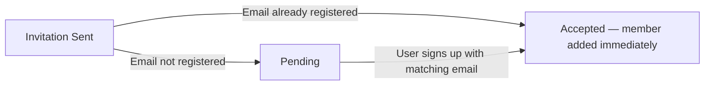

### Invitation Traceability

Each invitation record retains a reference to the organization member who sent it, providing full traceability of the employee onboarding process. This allows authorized users to:

- Identify who invited a given member to the organization
- Review the timestamp at which the invitation was created
- Determine the current status of any outstanding invitation

The inviting member's identity is recorded at the moment the invitation is created and is immutable — it cannot be changed after the fact. This accountability trail supports auditing and oversight of how the organization's membership has grown over time.

Invitations are also linked to the activity log: when an invitation is sent, an entry is recorded in the organization's activity log noting the inviting member and the target email address (as defined in the ActivityLog Operations section).

## Department Operations

Departments provide an optional organizational grouping for employees within an organization. Each department has a required name, an optional description, and an optional parent department, supporting one level of hierarchical nesting (a department can belong to another department, but sub-departments cannot have their own sub-departments). Users with the organization management permission can create, edit, and delete departments. When a department is deleted, employees who were assigned to it have their department set to null rather than being deleted themselves, ensuring no employee data is lost. All members of the organization can view the department list, which helps them understand the organizational structure. Departments are scoped to a single organization and are not shared across organizations.

### Department Creation

Users with the organization management permission can create a new department within their organization. A department requires a name, and an optional description may be provided to clarify its purpose. When creating a department, the user may also designate an optional parent department to place the new department one level below an existing department, establishing a hierarchical grouping within the organization. A department being created as a sub-department must reference an existing department as its parent; that parent department cannot itself already be a sub-department, ensuring only one level of nesting is allowed. The newly created department is immediately visible to all members of the organization. Departments are scoped to the organization in which they are created and are not accessible or visible to members of other organizations. Error conditions for invalid creation inputs are defined in the business rules.

### Optional Parent Department and One-Level Nesting

When creating or editing a department, a user with organization management permission may optionally assign a parent department. This enables a single level of hierarchical structure — a department may belong to another department, but a department that is itself a sub-department cannot be designated as a parent for yet another department. This constraint ensures the department hierarchy never exceeds one level of nesting. If no parent department is selected, the department is treated as a top-level department within the organization. The parent department assignment can be set at creation time or changed during an edit. Attempting to set a sub-department as the parent of another department is rejected; the business rules governing this constraint are defined in the business rules document.

### Editing Departments

Users with the organization management permission can edit an existing department's name and description. The department's parent department assignment can also be changed during an edit, subject to the one-level nesting constraint. The updated information takes effect immediately and is reflected for all organization members viewing the department list. Only users with the organization management permission may perform edits; attempts by users without this permission are rejected, as described in the business rules.

### Deleting Departments

Users with the organization management permission can delete a department from the organization. When a department is deleted, all employees who were assigned to that department have their department field set to null — they remain active members of the organization and no employee records are removed. This ensures that deleting a department does not cause any loss of employee data or disrupt employment records in any way. If the deleted department was acting as a parent to any sub-departments, those sub-departments also have their parent reference cleared, leaving them as top-level departments. The deletion is permanent and cannot be undone. Validation rules and error conditions for department deletion are defined in the business rules document.

### Viewing the Department List

All members of the organization — regardless of their role or permission level — can view the list of departments within their organization. The department list presents each department's name, description, and parent department relationship, allowing members to understand the organizational structure. Viewing is restricted to the organization the member currently belongs to; departments from other organizations are never visible. The department list is useful when filtering the employee list by department, assigning employees to departments, or navigating the organizational hierarchy.

## EmployeeContract Operations

Employee contracts capture the formal employment terms for each member within an organization, maintaining a full historical record over time. Each contract specifies a required start date, an optional end date (where null indicates an ongoing contract), a required pay rate, a pay period (hourly, daily, weekly, or monthly), required working hours per week, and optional notes. Only one contract can be active for a given employee at any time. Users with the employee management permission can create a new contract for an employee, and doing so automatically ends the previously active contract by setting its end date to the day before the new contract's start date. The same permission holders can edit the currently active contract to correct terms; however, past contracts are immutable historical records and cannot be changed. Employees can view their own contracts at any time, giving them visibility into their current and historical terms. Users with the employee view permission can view any employee's contracts, supporting oversight and audit needs. There is no standalone deletion operation for contracts — the historical record is preserved permanently.

### Contract Terms and Structure

Each employee contract captures the formal employment terms agreed upon between the organization and the employee at a specific point in time. A contract requires a start date, which marks when the terms take effect. An end date is optional; when no end date is set, the contract is considered ongoing and remains active until a new contract is created or the employee is deactivated. A contract also requires a pay rate — a numeric value representing the agreed compensation — and a pay period that determines how that rate is applied. The available pay periods are hourly, daily, weekly, and monthly. Each contract must specify the number of working hours per week, which defines the employee's expected weekly commitment. Optionally, a contract may include notes that record any supplemental context or agreement details relevant to that employment period, such as probation terms or special arrangements. These fields together form the complete record of an employee's employment terms at any given time.

### Active Contract Constraint and Continuity

At any given moment, only one contract can be active for an employee. An active contract is one whose start date has been reached and whose end date is either null (ongoing) or has not yet passed. This constraint ensures a clear, unambiguous view of an employee's current employment terms at all times. When a user with employee management permission creates a new contract for an employee who already has an active contract, the system automatically ends the previous contract by setting its end date to the day immediately before the new contract's start date. This transition happens automatically without requiring the user to manually close the existing contract. The new contract then becomes the sole active contract going forward. This mechanism ensures the historical chain of contracts remains intact and logically consistent, with no gaps or overlaps in the employment record.

### Creating an Employee Contract

Users with the employee management permission can create a new contract for any employee within their organization. When creating a contract, the user must provide the start date, pay rate, pay period, and working hours per week. The end date and notes fields are optional and may be left unset. If the employee currently has an active contract, the system automatically closes it by adjusting its end date as described in the active contract constraint section above. Once created, the contract becomes the employee's current active contract and governs their employment terms from the specified start date onward. The creation of a contract is recorded in the organization's activity log as a significant action.

### Editing the Active Contract

Users with the employee management permission can edit the currently active contract for an employee. Editable fields on an active contract include the pay rate, pay period, working hours per week, end date, and notes. Editing the active contract allows the organization to correct errors or reflect mutually agreed changes to the employment terms without the need to create a wholly new contract entry. Any change made to an active contract is recorded in the organization's activity log, preserving an audit trail of when and by whom the terms were adjusted.

### Immutability of Past Contracts

Contracts that have ended — those with an end date that has passed — are considered historical records and cannot be modified. Once a contract has been superseded by a new contract or its end date has elapsed, none of its fields can be changed. This immutability guarantees the integrity of the organization's employment history, ensuring that the record of what terms were in place during any past period remains accurate and auditable. Past contracts serve as a permanent reference for payroll reconciliation, compliance review, and dispute resolution purposes.

### Viewing Contracts as an Employee

Employees can view all contracts associated with their own employee record at any time. This includes the currently active contract as well as all past contracts in chronological order. Viewing their own contracts gives employees transparency into their current employment terms — including their pay rate, pay period, working hours per week, and any notes — as well as a clear history of how those terms have changed over time. No special permission beyond being the employee in question is required to view one's own contracts.

### Viewing Any Employee's Contracts

Users with the employee view permission can view the full contract history of any employee in the organization, not just their own. This includes all active and historical contracts, showing the progression of employment terms over time for any given employee. This capability supports managerial oversight, payroll auditing, and HR reporting needs. The list of contracts for an employee is presented in chronological order, allowing reviewers to trace the complete contractual history from earliest to most recent.

## Project Operations

Projects are the primary work containers that group timelogs and tasks within an organization. Users with the project management permission can create a project by providing a required name, an optional description, a required color code for UI identification, and optional budget hours, start date, and end date. Every project has a status — active, archived, or completed — and new projects start as active. Project managers can edit any of these fields after creation. Projects can be archived or marked as completed, after which they no longer accept new timelogs, though existing timelogs on those projects remain intact. A project can only be deleted if it has no timelogs associated with it, preventing accidental loss of time tracking history. Users with the project view permission can view all projects in the organization. The project list is paginated and can be filtered by status to help users focus on relevant projects.

### Creating a Project

WHEN a user with the project management permission submits a project creation request, THE system SHALL create a new project associated with the current organization.

THE system SHALL require a name and a color code when creating a project.

THE system SHALL allow an optional description to be provided during project creation.

THE system SHALL allow optional budget hours, a start date, and an end date to be specified at creation time.

WHEN a new project is created, THE system SHALL automatically set its status to active.

WHEN a project is successfully created, THE system SHALL record an activity log entry capturing the creating user, the timestamp, and the project details.

IF a user without the project management permission attempts to create a project, THEN THE system SHALL deny the request.

IF the project name is not provided, THEN THE system SHALL reject the creation request.

IF the color code is not provided, THEN THE system SHALL reject the creation request.

### Editing Project Details

WHEN a user with the project management permission submits an update to an existing project, THE system SHALL apply the changes to the project record.

THE system SHALL allow the following fields to be edited after creation: name, description, color code, budget hours, start date, and end date.

IF a user without the project management permission attempts to edit a project, THEN THE system SHALL deny the request.

IF the project to be edited does not exist within the current organization context, THEN THE system SHALL reject the request.

### Project Status Lifecycle

THE system SHALL support three project statuses: active, archived, and completed.

WHEN a project is first created, THE system SHALL assign it the active status.

WHILE a project is active, THE system SHALL allow new timelogs to be associated with it.

WHEN a project is archived, THE system SHALL transition its status from active to archived.

WHEN a project is completed, THE system SHALL transition its status from active to completed.

WHILE a project has an archived or completed status, THE system SHALL prevent any new timelogs from being associated with it.

WHEN a project is archived or completed, THE system SHALL preserve all existing timelogs already associated with that project without modification.

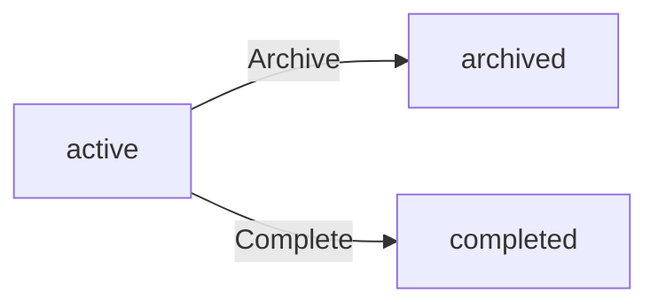

### Archiving and Completing a Project

WHEN a user with the project management permission requests to archive a project, THE system SHALL change that project's status to archived.

WHEN a user with the project management permission requests to mark a project as completed, THE system SHALL change that project's status to completed.

WHEN a project is archived or completed, THE system SHALL record an activity log entry capturing the acting user, the timestamp, the project, and the status change.

IF a user without the project management permission attempts to archive or complete a project, THEN THE system SHALL deny the request.

IF the project is already in an archived or completed status, THEN THE system SHALL reject further archive or completion requests.

### Deleting a Project

WHEN a user with the project management permission requests to delete a project, THE system SHALL permanently remove the project and all associated data from the organization.

IF a project has one or more timelogs associated with it, THEN THE system SHALL reject the deletion request to prevent loss of time tracking history.

IF a user without the project management permission attempts to delete a project, THEN THE system SHALL deny the request.

WHEN a project is successfully deleted, THE system SHALL record an activity log entry capturing the acting user, the timestamp, and the deleted project details.

### Viewing and Listing Projects

WHEN a user with the project view permission requests the project list for the current organization, THE system SHALL return all projects belonging to that organization.

THE system SHALL return the project list in a paginated format, presenting a subset of results per page.

WHEN a user applies a status filter when browsing the project list, THE system SHALL return only projects whose status matches the selected filter value.

IF a user without the project view permission attempts to list or view projects, THEN THE system SHALL deny the request.

WHEN a user requests the details of a specific project, THE system SHALL return the full project record including name, description, color code, status, budget hours, start date, and end date.

## ProjectMember Operations

Project membership controls which employees can log time against a project and participate in its tasks. Users with the project management permission can assign employees to a project, creating a project membership record that includes the employee, the project, and a project role of either member or project lead. An employee can be assigned to multiple projects simultaneously. Project leads hold additional authority within their project, specifically the ability to manage tasks without needing the broader project management permission. Users with the project management permission can remove an employee from a project at any time. Employees can view the list of projects they are assigned to, giving them clarity on where they are expected to contribute. Project membership is scoped to a single organization, meaning an employee from one organization cannot appear as a member of another organization's project.

### Assigning Employees to Projects

Users with the project management permission can assign an active employee to a project within the same organization. The assignment creates a project membership record that links the employee and the project and designates a project role of either member or project lead.

An employee may be assigned to multiple projects simultaneously; there is no limit on how many projects a single employee can belong to.

Only employees who belong to the same organization as the project may be assigned. An employee from one organization cannot be added as a project member of another organization's project.

A deactivated employee cannot be assigned to a project. If an employee is deactivated after being assigned, their existing project memberships remain but they can no longer log time against those projects.

If an employee is already a member of the project, a duplicate assignment cannot be created. Error conditions for these scenarios are defined in the business rules (04-business-rules.md).

### Project Roles: Member and Project Lead

When assigning an employee to a project, the assigning user selects one of two project roles:

- **Member**: The standard role for employees participating in a project. Members can log time against the project and view tasks within it.
- **Project Lead**: An elevated role within the project. Project leads can create, edit, and manage tasks inside their project without needing the broader project management permission.

Users with the project management permission can update a project membership to change an employee's project role between member and project lead at any time.

The project role applies only within the context of that specific project. An employee who is a project lead on one project holds no elevated authority on other projects unless separately designated.

### Project Lead Task Management Authority

Project leads hold the authority to manage tasks within the specific project where they hold the project lead role. This includes creating tasks, editing task details, changing task status, and assigning tasks to other project members.

This authority is limited to the project in which the employee is a project lead. A project lead cannot manage tasks in projects where they are assigned only as a member.

Task assignment within a project is restricted to employees who are project members of that project. Project leads may only assign tasks to employees who are already members of the same project.

Detailed task management operations and their constraints are described in the Task Operations section of this document.

### Removing an Employee from a Project

Users with the project management permission can remove an employee from a project at any time, regardless of the employee's project role.

When an employee is removed from a project:
- Their project membership record is deleted.
- Timelogs they previously submitted for that project are preserved and remain associated with the project.
- Any tasks assigned to the removed employee within the project have their assignment cleared.

After removal, the employee can no longer log time against the project and can no longer view tasks within it.

### Employees Viewing Their Own Project Assignments

Any active employee can view the list of projects they are currently assigned to within their current organization context. This allows employees to understand where they are expected to contribute and which projects they can log time against.

The list of project assignments shown to an employee includes only projects within the organization the employee is currently working in. Projects from other organizations are not visible.

Employees can also view their project role (member or project lead) for each assigned project.

Employees cannot view the full list of all organization projects unless they also have the project view permission.

## Task Operations

Tasks represent units of work within a project and provide granular tracking for time and progress. Project leads or users with the project management permission can create tasks within a project, providing a required title, optional description, status (open, in-progress, completed, or closed), priority (low, medium, high, or urgent), optional estimated hours, optional due date, an optional assigned employee (who must be a project member), and an optional parent task for one level of subtask nesting. Project leads can edit tasks within their project, while users with the project management permission can edit any task in any project. Every time a task's status changes, the system automatically records a task history entry capturing the old status, new status, the timestamp, and who made the change. Employees can view tasks in any project they are assigned to. Tasks can be filtered by status, priority, and assigned employee, and can be sorted by due date, priority, or creation date to help teams manage their workload effectively.

### Task Creation Within a Project

Project leads or users with the project management permission can create tasks within a project. When creating a task, the creator must provide a title. The following fields are optional: description, estimated hours, due date, assigned employee, and parent task.

A task is given a status at creation time; if no status is specified, it defaults to open. Valid status values are open, in-progress, completed, and closed. A task is also given a priority at creation; if no priority is specified, it defaults to medium. Valid priority values are low, medium, high, and urgent.

The assigned employee, if specified, must be an active project member of the same project. A parent task, if specified, must itself belong to the same project and must not already be a subtask — only one level of nesting is permitted. The due date, if provided, does not have to follow a specific relationship to the project's own dates but must be a valid calendar date.

Once submitted, the system creates the task under the specified project, applies all supplied values, and makes the task immediately visible to eligible viewers.

### Editing Tasks

A project lead can edit any task that belongs to their project. A user with the project management permission can edit any task in any project across the organization.

Editable fields include: title, description, status, priority, estimated hours, due date, assigned employee, and parent task. The same constraints that apply during creation continue to apply during edits — the assigned employee must be a project member, and the parent task must belong to the same project and cannot itself be a subtask.

When the status field is changed during an edit, the system automatically records a task history entry capturing the old status, the new status, the timestamp of the change, and the identity of the user who made the change. This recording is system-generated and requires no additional action from the editor. If a status value is submitted that is identical to the current status, no history entry is created.

Employees who do not hold the project lead role for the project and do not have the project management permission cannot edit tasks, regardless of whether a task is assigned to them.

### Subtask Nesting

A task may optionally reference another task in the same project as its parent task, making it a subtask. Only one level of nesting is supported: a task that is already a subtask (i.e., already has a parent task) cannot itself be designated as a parent task for another task.

A parent task and its subtasks are otherwise independent: each subtask has its own status, priority, assigned employee, estimated hours, and due date. Completing or closing a parent task does not automatically close its subtasks, and vice versa.

When viewing tasks, subtasks are associated with and visible alongside their parent task for users who have access to the project.

### Viewing Tasks in Assigned Projects

An employee can view all tasks that belong to projects they are currently assigned to as a project member. This includes both top-level tasks and subtasks within those projects.

For each task, the employee can see the title, description, status, priority, estimated hours, due date, assigned employee, parent task (if any), and the task history of status changes.

Employees who are not assigned to a project cannot view any tasks within that project. Users with the project management permission can view tasks across all projects in the organization, regardless of whether they are listed as a project member.

### Filtering and Sorting Tasks

When viewing the task list within a project, users can narrow results by applying filters. The available filters are:

- Status — show only tasks with a specific status (open, in-progress, completed, or closed)
- Priority — show only tasks with a specific priority (low, medium, high, or urgent)
- Assigned employee — show only tasks assigned to a particular project member

Filters can be combined; for example, a user can request all high-priority, in-progress tasks assigned to a specific employee.

Users can also control the order in which tasks are presented. The available sort options are:

- Due date — tasks ordered by their due date, earliest first; tasks without a due date appear last
- Priority — tasks ordered by priority severity (urgent first, then high, medium, low)
- Creation date — tasks ordered by the date and time they were created, most recent first or oldest first

Filtering and sorting apply independently and can be used together. Pagination rules for task lists are defined in the business rules document.

## TaskHistory Operations

Task history entries provide an immutable audit trail of every status change made to a task throughout its lifecycle. Each history entry is automatically created by the system whenever a task's status is updated, recording the exact timestamp of the change, the previous status, the new status, and the identity of the user who made the change. Task history is never manually created, edited, or deleted by users — it is a system-generated record that ensures full accountability and traceability. Users who can view a task can also view its complete history, allowing team members and managers to understand how work progressed over time. The history is read-only from a user perspective.

### Automatic Task History Entry on Status Change

Whenever a task's status is changed, the system automatically creates a task history entry without any user action required. The history entry is generated at the exact moment the status transition occurs and is permanently attached to the task.

Each history entry captures four pieces of information:
- The previous status of the task before the change
- The new status assigned to the task
- The exact timestamp when the change occurred
- The identity of the organization member who performed the change

History entries are created for every status transition, including changes between any combination of the statuses open, in-progress, completed, and closed. If a task's status is set to the same value it already holds, no history entry is created — only genuine transitions are recorded.

### System-Generated and Immutable Nature of Task History

Task history entries are exclusively created by the system as a direct result of status change operations. No user — regardless of their role or permissions — can manually create a task history entry.

Once a history entry has been created, it cannot be modified or deleted by any user. The recorded old status, new status, timestamp, and responsible member are permanently fixed at the moment of creation. This immutability guarantees that the history reflects exactly what occurred and cannot be altered after the fact.

Because history entries are tied to the task's lifecycle, they are permanently removed only when the task itself is deleted (as part of project deletion). In all other circumstances, the history is preserved alongside the task.

### Viewing Task History

Any user who has permission to view a task can also view the complete history of status changes for that task. This includes:
- Employees who are assigned to the project the task belongs to
- Project leads for the relevant project
- Users with the project manage permission

The history is presented in chronological order, showing the full progression of status changes from the task's creation to its current state. Users can see every transition that has taken place, along with when each change happened and who was responsible.

Task history is strictly read-only from every user's perspective. There are no operations available to add, modify, or remove history entries through any user interface or workflow.

### Audit Trail for Task Status Progression

The cumulative set of history entries for a task forms a complete audit trail that documents the full lifecycle of the task's status progression. This audit trail serves the following business purposes:

- Team members can understand how work on a task evolved over time, including how many times a task moved between statuses such as open, in-progress, completed, and closed.
- Managers and project leads can verify accountability by identifying exactly who made each status change and at what time.
- In cases of dispute or review, the audit trail provides an objective, tamper-proof record of task activity.
- The history of who changed what and when supports full traceability, ensuring that no status transition goes unrecorded or unattributed.

Because the history is system-generated and immutable, it can be relied upon as an authoritative record for any review or reporting purpose related to task management within the organization.

## Timelog Operations

Timelogs are the fundamental records of work performed by employees, capturing how time was spent on projects and tasks. Employees can create timelogs for themselves only, specifying a required date, a required duration in minutes, a required project (which must be one they are assigned to), an optional task (which must belong to the selected project), an optional description of the work done, and a billable flag that defaults to true. Employees can edit their own timelogs as long as the timelog is not part of an approved timesheet. Employees can delete their own timelogs as long as the timelog is not part of any submitted or approved timesheet. Users with the time management permission can edit or delete any employee's timelog regardless of timesheet status, giving administrators the ability to correct errors. Users with the time view all permission can view every employee's timelogs across the organization. Employees can view their own timelogs at all times. The timelog list is paginated and can be filtered by date range, project, task, and billable status to support detailed time analysis.

### Creating Timelogs

WHEN an employee creates a timelog, THE system SHALL require a date and a duration expressed in minutes as mandatory fields.

WHEN an employee creates a timelog, THE system SHALL require the employee to select a project from the projects they are currently assigned to.

WHEN an employee creates a timelog, THE system SHALL allow the employee to optionally select a task, provided the task belongs to the selected project.

WHEN an employee creates a timelog, THE system SHALL allow the employee to optionally enter a description of the work performed.

WHEN an employee creates a timelog and does not explicitly set the billable flag, THE system SHALL default the billable flag to true.

THE system SHALL restrict timelog creation so that an employee may only log time on their own behalf.

WHEN an employee creates a timelog, THE system SHALL associate the timelog with the creating employee as the owner.

### Editing Own Timelogs

WHILE a timelog is not part of an approved timesheet, THE system SHALL allow the owning employee to edit the date, duration, project, task, description, and billable flag of that timelog.

IF a timelog is included in an approved timesheet, THEN THE system SHALL prevent the owning employee from editing that timelog.

WHEN an employee edits their own timelog, THE system SHALL enforce all the same field constraints that apply during creation, including requiring the project to be one the employee is assigned to and requiring any selected task to belong to the selected project.

### Deleting Own Timelogs

WHILE a timelog is not part of any submitted or approved timesheet, THE system SHALL allow the owning employee to delete that timelog.

IF a timelog is included in a submitted timesheet, THEN THE system SHALL prevent the owning employee from deleting that timelog.

IF a timelog is included in an approved timesheet, THEN THE system SHALL prevent the owning employee from deleting that timelog.

### Administrative Timelog Management

WHERE the time management permission is granted, THE system SHALL allow users to edit any employee's timelog regardless of the timelog's timesheet association status.

WHERE the time management permission is granted, THE system SHALL allow users to delete any employee's timelog regardless of the timelog's timesheet association status.

WHEN a user with the time management permission edits a timelog belonging to another employee, THE system SHALL apply the same field validation rules that govern employee self-editing, including project assignment and task-project consistency checks.

### Viewing Timelogs

THE system SHALL allow each employee to view their own timelogs at any time.

WHERE the time view all permission is granted, THE system SHALL allow users to view all timelogs across every employee in the organization.

THE system SHALL present timelog lists in a paginated format, returning a defined number of entries per page and allowing navigation through additional pages.

THE system SHALL allow users to filter their accessible timelog list by date range, selecting a start date and end date to restrict results.

THE system SHALL allow users to filter their accessible timelog list by project, showing only timelogs associated with the selected project.

THE system SHALL allow users to filter their accessible timelog list by task, showing only timelogs associated with the selected task.

THE system SHALL allow users to filter their accessible timelog list by billable status, showing only billable or only non-billable timelogs according to the selected filter.

WHILE an employee is deactivated, THE system SHALL preserve all historical timelogs belonging to that employee and continue to make those timelogs visible to users with the time view all permission.

## Timesheet Operations

Timesheets aggregate an employee's timelogs for a specific week (Monday to Sunday) into a reviewable submission for approval. Employees create a draft timesheet for a given week, and the system automatically includes all their timelogs for that week. Employees can add or remove timelogs from a draft timesheet before submitting. A timesheet cannot be submitted if it contains no timelogs, and only one timesheet per employee per week can be in submitted or approved status at a time. Once submitted, users with the time approval permission can approve or reject the timesheet. Approval locks all included timelogs so they can no longer be edited or deleted. Rejection requires a written reason and returns the timesheet to draft status, allowing the employee to modify and resubmit. Employees can view their own timesheets at all times. Users with the time approval permission can view all submitted timesheets across the organization. The timesheet list is paginated and can be filtered by status and date range.

### Timesheet Creation and Draft Management

THE system SHALL define a timesheet as covering exactly one calendar week from Monday to Sunday, identified by the week start date (Monday) and week end date (Sunday).

WHEN an employee creates a new timesheet for a given week, THE system SHALL automatically set the status to draft and include all of that employee's timelogs whose date falls within that Monday-to-Sunday range.

WHILE a timesheet is in draft status, THE system SHALL allow the owning employee to add timelogs to the timesheet, provided the timelog belongs to that employee and falls within the timesheet's week range.

WHILE a timesheet is in draft status, THE system SHALL allow the owning employee to remove individual timelogs from the timesheet without deleting those timelogs.

WHILE a timesheet is in draft status, THE system SHALL recalculate and update the total hours whenever a timelog is added or removed.

THE system SHALL allow each employee to have at most one timesheet record per week; attempting to create a second timesheet for the same employee and week is governed by the rules defined in 04-business-rules.

THE system SHALL record the timesheet's week start date and week end date at creation time and SHALL NOT allow them to be changed afterward.

### Timesheet Submission

WHEN an employee submits a draft timesheet, THE system SHALL transition the timesheet status from draft to submitted and record the submission timestamp.

IF a draft timesheet contains no timelogs at the time of submission, THEN THE system SHALL reject the submission and keep the timesheet in draft status.

IF the employee already has another timesheet for the same week in submitted or approved status, THEN THE system SHALL reject the new submission request.

WHEN a timesheet is successfully submitted, THE system SHALL make it visible to all users who hold the time approval permission within the same organization.

THE system SHALL prevent employees from editing or deleting timelogs that belong to a submitted timesheet; editing restrictions on timelogs are further detailed in the Timelog Operations section.

### Timesheet Review — Approval and Rejection

THE system SHALL grant users with the time approval permission the ability to view all submitted timesheets across the organization.

WHEN a user with the time approval permission approves a submitted timesheet, THE system SHALL transition the timesheet status to approved, record the approving user as the reviewer, and record the date and time of the approval as the review timestamp.

WHEN a timesheet is approved, THE system SHALL lock all timelogs included in that timesheet so that no user — including users with the time management permission — may edit or delete them.

WHEN a user with the time approval permission rejects a submitted timesheet, THE system SHALL require a written rejection reason before completing the rejection.

IF a rejection is attempted without providing a written reason, THEN THE system SHALL reject the action and keep the timesheet in submitted status.

WHEN a timesheet is successfully rejected, THE system SHALL record the rejecting user as the reviewer, record the date and time of the rejection as the review timestamp, store the written rejection reason, and return the timesheet status to draft.

WHEN a rejected timesheet returns to draft status, THE system SHALL unlock its included timelogs so the employee may edit them and SHALL allow the employee to add or remove timelogs before resubmitting.

THE system SHALL allow an employee to resubmit a previously rejected timesheet after modification, following the same submission rules defined in the Timesheet Submission section above.

### Timesheet Status Lifecycle

THE system SHALL support four timesheet statuses: draft, submitted, approved, and rejected.

THE system SHALL enforce the following status transitions:

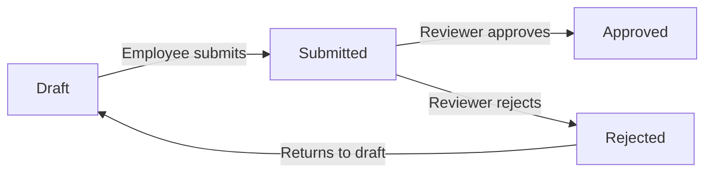

WHILE a timesheet is in draft status, THE system SHALL allow the owning employee to modify its timelog composition and to submit it.

WHILE a timesheet is in submitted status, THE system SHALL allow only users with the time approval permission to act on it (approve or reject); the owning employee may only view it.

WHILE a timesheet is in approved status, THE system SHALL prevent any further status changes and SHALL keep all included timelogs permanently locked.

WHEN a timesheet transitions to rejected status, THE system SHALL immediately revert it to draft and treat it according to the draft rules defined in the Timesheet Creation and Draft Management section.

### Viewing and Browsing Timesheets

THE system SHALL allow an employee to view all timesheets that belong to them, regardless of status.

THE system SHALL allow users with the time approval permission to view all timesheets across the organization, regardless of status.

THE system SHALL present timesheet lists in a paginated format, returning a bounded set of results per page.

THE system SHALL allow timesheet lists to be filtered by status, restricting results to timesheets matching one of the four statuses: draft, submitted, approved, or rejected.

THE system SHALL allow timesheet lists to be filtered by date range, restricting results to timesheets whose week falls within the specified start and end boundaries.

WHEN both a status filter and a date range filter are applied simultaneously, THE system SHALL return only timesheets satisfying both criteria.

THE system SHALL display the reviewer identity and review timestamp on any timesheet that has been approved or rejected, allowing employees and reviewers to see who acted on the timesheet and when.

## Timer Operations

The timer feature enables employees to track time in real-time without manually entering durations. An employee starts a timer by selecting a required project and an optional task; the system records the start timestamp and the employee can optionally add a description. Each employee can have at most one active timer running at any given time. While the timer is running, the employee can edit the description and change the project or task being tracked. When the employee stops the timer, the system calculates the elapsed duration, rounds it to the nearest minute, and automatically creates a timelog with that duration. Alternatively, the employee can discard the timer, which stops it without creating any timelog. The employee can view their currently active timer at any time. If an employee forgets to stop the timer, it continues running indefinitely without any automatic stop or timeout.

### Starting a Timer

An employee can start a timer to begin real-time time tracking. Starting a timer requires selecting a project, which must be one the employee is currently assigned to. Selecting a task is optional; if provided, the task must belong to the selected project. The employee may optionally provide a description of what they are working on at the time of starting. When the timer is started, the system records the exact start timestamp. Because each employee may have at most one active timer at any given time, starting a new timer is only allowed when the employee has no other timer currently running. If the employee already has an active timer, the request to start a new one is rejected. Error conditions for invalid project or task selections are defined in the Timer Error Scenarios section.

### Viewing the Active Timer

An employee can view their currently active timer at any time. The timer view shows the project and optional task being tracked, the start timestamp, the elapsed time since the timer started, and the current description. If no timer is active, the system indicates that no timer is running. Only the employee who owns the timer can view it. The employee's personal dashboard also surfaces the active timer status, as defined in the Dashboard section.

### Editing a Running Timer

While a timer is active, the employee who owns it can update the description at any time without stopping the timer. The employee can also change the project being tracked while the timer is running; the replacement project must be one the employee is currently assigned to. If the project is changed, any previously selected task is cleared, and the employee may optionally select a new task that belongs to the newly selected project. All edits to the timer take effect immediately and do not reset or interrupt the running timer.

### Stopping a Timer and Creating a Timelog

An employee can stop their active timer at any time. When the timer is stopped, the system calculates the total elapsed time from the recorded start timestamp to the moment the stop action is taken. The calculated duration is rounded to the nearest minute. The system then automatically creates a timelog on behalf of the employee, using the rounded duration, the project, the optional task, and the description that were set on the timer at the time of stopping. The timelog is created with the date corresponding to when the timer was stopped. The newly created timelog follows all timelog rules defined in the Timelog Operations section, including the billable flag defaulting to true.

### Discarding a Timer

An employee can choose to discard their active timer instead of stopping it. Discarding the timer ends it immediately without creating any timelog. No record of the elapsed time is preserved after a timer is discarded. This allows an employee to cancel accidental or unwanted timer sessions.

### Timer Persistence and Indefinite Running

Once started, a timer continues running indefinitely until the employee explicitly stops or discards it. The system does not automatically stop, pause, or time out a running timer regardless of how long it has been active. If an employee forgets to stop their timer, it remains active and accumulates elapsed time continuously. There is no system-imposed maximum duration for a running timer.

## ActivityLog Operations

The activity log provides a comprehensive audit trail of significant actions taken within an organization. The system automatically generates activity log entries whenever key events occur — including when an employee is invited, deactivated, or reactivated; when a contract is created or edited; when a project is created, archived, completed, or deleted; when a task's status changes; when a timesheet is submitted, approved, or rejected; and when a role is assigned or changed. Each entry captures the timestamp of the event, the user who performed the action, the action type, the target entity affected, and relevant details about what changed. Activity log entries are system-generated and cannot be created, edited, or deleted by users — they are strictly read-only. Users with the organization management permission can view the full activity log. The log is paginated and can be filtered by action type, the user who performed the action, and date range, enabling efficient auditing and compliance review.

### Automatic Activity Log Generation

The system automatically generates an activity log entry whenever a significant action occurs within an organization. No user manually creates activity log entries — the system is solely responsible for producing them in response to qualifying events. Each entry is generated at the moment the action completes successfully, ensuring the log is an accurate, real-time record of what happened and when.

Activity log entries are strictly read-only. No user, regardless of their role or permissions, can create, edit, or delete activity log entries. The log represents an immutable audit trail of organizational events.

The system generates activity log entries in the context of the organization where the action took place. Activity logs are scoped to their organization and are not visible across organizational boundaries.

### Logged Actions — Employee Lifecycle

The system records activity log entries for the following employee-related actions:

- **Employee invited**: When a user with employee management permission sends an invitation to a new member, the system logs the action with the inviting user, the invited email address, and the organization context.
- **Employee deactivated**: When a user with employee management permission deactivates an active member, the system logs the action with the acting user and the affected employee record as the target entity.
- **Employee reactivated**: When a previously deactivated employee is reactivated by a user with employee management permission, the system logs the action with the acting user and the affected employee record.

These entries capture the full context of who performed each action and which employee record was affected, enabling administrators to trace the complete lifecycle of any member in the organization.

### Logged Actions — Contract and Role Changes

The system records activity log entries for the following contract and role-related actions:

- **Contract created**: When a user with employee management permission creates a new contract for an employee, the system logs the action identifying the acting user and the new contract as the target entity.
- **Contract edited**: When a user with employee management permission edits the currently active contract for an employee, the system logs the action with the acting user and the modified contract as the target entity. Edits to past contracts are not permitted, so no log entry is generated for historical contracts.
- **Role assigned or changed**: When a user with employee management permission assigns a role to an employee or changes an employee's existing role assignment, the system logs the action with the acting user, the affected employee, and the new role as relevant details.

### Logged Actions — Project Lifecycle

The system records activity log entries for the following project-related actions:

- **Project created**: When a user with project management permission creates a new project, the system logs the action with the acting user and the new project as the target entity.
- **Project archived**: When a user with project management permission changes a project's status to archived, the system logs the action with the acting user and the affected project.
- **Project completed**: When a user with project management permission marks a project as completed, the system logs the action with the acting user and the affected project.
- **Project deleted**: When a user with project management permission deletes a project (only permitted when no timelogs exist), the system logs the action with the acting user and the deleted project's details captured at the time of deletion.

### Logged Actions — Task Status Changes

The system records an activity log entry whenever a task's status changes within a project. This applies regardless of who makes the change — a project lead editing a task in their project, or a user with project management permission editing any task.

The activity log entry for a task status change includes the acting user, the affected task as the target entity, and relevant details about which project the task belongs to. The detailed record of old and new status values is maintained in the task's own history (as defined in Task History Operations); the activity log entry serves as the organization-wide audit record that a status change event occurred.

### Logged Actions — Timesheet Workflow

The system records activity log entries for the following timesheet-related actions:

- **Timesheet submitted**: When an employee submits a draft timesheet for approval, the system logs the action with the submitting employee and the submitted timesheet as the target entity, including the week covered.
- **Timesheet approved**: When a user with time approval permission approves a submitted timesheet, the system logs the action with the approving user and the approved timesheet as the target entity.
- **Timesheet rejected**: When a user with time approval permission rejects a submitted timesheet, the system logs the action with the rejecting user, the rejected timesheet as the target entity, and the rejection reason in the details.

These entries provide a complete audit trail for the timesheet review process, ensuring accountability for both employees submitting time and managers approving it.

### Activity Log Entry Structure

Every activity log entry captures the following information:

- **Timestamp**: The exact date and time when the action occurred, recorded at the moment the system processes the event.
- **User who performed the action**: The organization member who triggered the event. For system-initiated actions, this is attributed to the user whose request caused the event.
- **Action type**: A categorized label identifying the type of event (for example: employee invited, contract created, project archived, timesheet approved, role changed). The action type determines how the entry is categorized and enables filtering.
- **Target entity**: The primary organizational record that was affected by the action — for example, the specific employee record, contract, project, task, or timesheet that was acted upon.
- **Details**: Contextual information relevant to the action, such as the new role assigned, the rejection reason for a timesheet, or the previous and new status for relevant changes.

Once created, none of these fields can be altered. If the target entity is subsequently deleted, the activity log entry is preserved with the entity's details captured at the time of the action, ensuring the historical record remains intact.

### Viewing the Activity Log

Users with the organization management permission (`org:manage`) can view the full activity log for their organization. This includes all entries across all action types and all employees.

The activity log is presented in paginated form, allowing users to browse through large volumes of entries without retrieving the entire log at once. Each page displays a consistent number of entries ordered by timestamp, with the most recent entries appearing first.

Users can filter the activity log by the following criteria to locate relevant entries efficiently:

- **Action type**: Narrow the log to entries of a specific category, such as viewing only timesheet approvals or only project deletions.
- **User who performed the action**: Filter entries to those carried out by a specific organization member, enabling review of a particular user's actions over time.
- **Date range**: Restrict entries to those occurring within a specified start and end date, supporting targeted audits for specific periods.

Filters can be applied individually or in combination. The activity log view respects the organization context — users can only view the activity log of the organization they are currently working in.

# Error Scenarios and Edge Cases

Business-level error scenarios, edge case coverage, and expected system behaviors for exceptional conditions.

## Organization Error Scenarios

An organization cannot be deleted if it still has active employee contracts, and the system blocks deletion with a clear message indicating that all active contracts must be terminated first. Deletion is also blocked when one or more timesheets remain in a submitted (pending) state that has not yet been approved or rejected. Only the organization owner is permitted to delete the organization; any other user who attempts deletion is denied. When an owner tries to edit organization settings without the required ownership status, the operation is rejected. If a user attempts to create an organization with a name that conflicts with internal system constraints, the system rejects the input. If an invalid currency code or unsupported timezone is provided during organization setup or update, the system rejects the value and requires a valid selection. If a fiscal start month falls outside the range of valid months, the submission is rejected. When an organization is successfully deleted, all associated employees, projects, tasks, timelogs, and timesheets are permanently removed, but the owner's user account is preserved and simply unlinked from the organization. A user who is the sole owner must not be allowed to delete their account without first transferring ownership or deleting the organization.

### Organization Deletion Blocked by Active Contracts

IF an organization has one or more active employee contracts at the time of a deletion request, THEN THE system SHALL block the deletion and inform the requestor that all active employee contracts must be terminated before the organization can be deleted.

WHEN a deletion request is received, THE system SHALL check whether any organization member holds a currently active contract (a contract with no end date, or an end date that has not yet passed).

IF even a single active contract exists across any member of the organization, THEN THE system SHALL reject the deletion request without performing any destructive operations.

THE system SHALL present the blocking reason clearly, identifying that active contracts must be resolved, so the owner knows which precondition remains unmet.

### Organization Deletion Blocked by Pending Timesheets

IF an organization has one or more timesheets in the submitted (pending) state that have not yet been approved or rejected, THEN THE system SHALL block the deletion request and indicate that all pending timesheets must be resolved first.

WHEN a deletion request is received, THE system SHALL verify that no timesheet across any employee in the organization is in the submitted state awaiting review.

IF any submitted timesheet remains unresolved, THEN THE system SHALL reject the deletion request without removing any data.

THE system SHALL treat timesheets in draft, approved, or rejected status as resolved and not count them as blockers for deletion.

IF both active contracts and pending timesheets are present simultaneously, THEN THE system SHALL report both blocking conditions to the owner.

### Non-Owner Denied Organization Deletion

WHEN a user who is not the organization owner attempts to delete the organization, THE system SHALL deny the request and return a permission-denied response.

THE system SHALL enforce that only the designated organization owner role has the authority to initiate an organization deletion, regardless of any other permissions the requesting user may hold.

IF a user with the Manager role or any custom role — even one with the `org:manage` permission — attempts to delete the organization, THEN THE system SHALL reject the request.

WHEN the deletion attempt is denied, THE system SHALL not perform any partial operations or data modifications.

### Organization Settings Edit Denied for Non-Owners

WHEN a user who is not the organization owner attempts to edit organization settings, THE system SHALL deny the request.

THE system SHALL restrict editing of organization-level settings — including name, description, logo, currency, timezone, and fiscal start month — exclusively to the organization owner.

IF a user with the `org:manage` permission but without owner status attempts to modify organization settings, THEN THE system SHALL reject the request.

THE system SHALL not apply any partial changes if the requesting user lacks the required owner status.

### Invalid Currency Code Rejection

WHEN a user submits an organization creation or update request with a currency value, THE system SHALL validate that the provided currency code is a recognized and supported currency identifier.

IF the submitted currency code is not among the supported currency options (such as USD, EUR, KRW, and other recognized codes), THEN THE system SHALL reject the request and require the user to provide a valid currency selection.

THE system SHALL not apply any other changes from the submission if the currency code is invalid.

THE system SHALL present an informative message indicating that the supplied currency is not supported and prompt the user to select a valid option.

### Unsupported Timezone Rejection

WHEN a user submits an organization creation or update request with a timezone value, THE system SHALL validate that the provided timezone corresponds to a recognized and supported timezone.

IF the submitted timezone is not recognized as a valid timezone (for example, a misspelled or entirely fabricated timezone identifier), THEN THE system SHALL reject the request and require a valid timezone selection.

THE system SHALL not persist any portion of the submission when the timezone value fails validation.

THE system SHALL notify the user that the supplied timezone is unsupported and prompt them to choose from available options.

### Invalid Fiscal Start Month Rejection

WHEN a user submits an organization creation or update request with a fiscal start month value, THE system SHALL validate that the value corresponds to a valid calendar month.

IF the fiscal start month falls outside the range of valid months (January through December, represented as month numbers 1 through 12), THEN THE system SHALL reject the request.

THE system SHALL not persist any changes if the fiscal start month is invalid.

THE system SHALL return an informative error indicating that the fiscal start month must be a valid calendar month.

### Permanent Data Removal on Organization Deletion

WHEN an organization is successfully deleted after all preconditions are satisfied, THE system SHALL permanently and irreversibly remove all data associated with that organization.

THE system SHALL delete all of the following upon organization deletion: all organization member records, all department records, all project records, all task records and their histories, all timelog records, all timesheet records, all timer records, all role records, all invitation records, and all activity log entries belonging to the organization.

THE system SHALL perform the deletion as an atomic operation such that either all associated data is removed or none of it is, with no partial state left behind.

IF any part of the deletion process fails, THEN THE system SHALL abort the entire operation and preserve the organization and all its data in its prior state.

THE system SHALL not provide any recovery mechanism for data deleted as part of an organization deletion, as the removal is permanent.

### Owner Account Preserved After Organization Deletion

WHEN an organization is successfully deleted, THE system SHALL preserve the user account of the organization owner without modification.

THE system SHALL disassociate the owner's user account from the deleted organization, meaning the owner no longer appears as a member of or affiliated with that organization.

IF the owner belongs to other organizations, THEN THE system SHALL ensure those memberships remain intact and unaffected by the deletion.

THE system SHALL not deactivate, suspend, or alter the owner's global user profile or authentication credentials as a result of the organization deletion.

WHEN the owner logs in after the organization has been deleted, THE system SHALL reflect that the deleted organization is no longer available in their organization list.

### Sole Owner Account Deletion Restriction

WHEN a user who is the sole owner of one or more organizations attempts to delete their own account, THE system SHALL block the account deletion request.

THE system SHALL require the sole owner to either transfer ownership of each such organization to another member or permanently delete those organizations before account deletion is permitted.

IF the user has transferred ownership of all sole-owned organizations or deleted them, THEN THE system SHALL allow the account deletion to proceed.

WHEN a user is an owner in multiple organizations but is not the sole owner in any of them, THE system SHALL allow account deletion to proceed without requiring ownership transfer or organization deletion.

THE system SHALL clearly communicate to the user which organizations they are the sole owner of, so they can take the necessary steps to resolve the blocking condition.

## User Error Scenarios

A user cannot sign up with an email address that is already registered in the system, and the system rejects the attempt without revealing whether the email belongs to an active or deactivated account. When a user submits the wrong password during login, the system denies access. If a user attempts to change their password but provides an incorrect current password, the change is rejected. A user who is the sole owner of one or more organizations cannot delete their account until they either transfer ownership of each organization to another member or delete those organizations. When a user's account is deleted, their employee records in other organizations are marked as deactivated rather than removed, preserving historical data. A deactivated employee cannot log in and perform actions within that organization context. If a user tries to switch to an organization they are no longer a member of, the system denies the context switch. Users can belong to multiple organizations, but each session context must be scoped to exactly one organization at a time. Attempting to access resources belonging to an organization the user has not joined is denied.

### Duplicate Email Registration Rejection

When a guest attempts to sign up with an email address that is already associated with an existing user account, the system rejects the registration attempt. The rejection does not reveal whether the matching account is active or deactivated — the system responds with a generic message indicating the email cannot be used, so that no information about existing accounts is disclosed. The guest must use a different email address to proceed with registration.

### Wrong Password Login Denial

When a user submits an email and password combination where the password does not match the stored credentials for that email, the system denies access and does not create a session. The system does not indicate whether the failure was due to an unrecognized email or an incorrect password, preventing enumeration of registered accounts. The user must retry with valid credentials to gain access.

### Incorrect Current Password on Password Change

When a logged-in user attempts to change their password, the user must provide their current password along with the new password. If the current password provided does not match the user's actual current password, the system rejects the change request and the password remains unchanged. The user must supply the correct current password to successfully update their credentials.

### Sole Owner Cannot Delete Account

A user who is the sole owner of one or more organizations cannot delete their own account until each such organization is handled. Before account deletion is allowed, the user must either transfer ownership of every affected organization to another member or delete those organizations entirely. If the user attempts to delete their account while still being the sole owner of any organization, the system denies the deletion and informs the user of the blocking condition. Once all sole-ownership obligations are resolved, the account deletion may proceed.

### Account Deletion Preserves Employee Records as Deactivated

When a user successfully deletes their account, any employee records that the user held in other organizations are not removed. Instead, those employee records are marked as deactivated, preserving all historical data such as timelogs, timesheets, and contracts associated with those records. The user's account itself is removed from the platform, but the deactivated employee records remain within each respective organization's data for historical continuity. Other members of those organizations retain access to the historical records tied to the deactivated employee.

### Deactivated Employee Cannot Perform Actions

An employee whose membership status within an organization is deactivated cannot perform any operational actions within that organization. Specifically, a deactivated employee cannot log time entries, submit or modify timesheets, or access organization features that require an active membership. If a user whose employee record is deactivated attempts to act within that organization's context, the system denies the action. Viewing historical data that was already recorded prior to deactivation is governed by role permissions but action-based operations — such as time logging and timesheet submission — are blocked entirely for deactivated employees.

### Switching to an Unjoined Organization Denied

When a user attempts to switch their active session context to an organization they are not currently a member of, the system denies the context switch. This applies regardless of whether the user was previously a member of that organization or was never associated with it. A user can only switch into organizations for which they have an active or accessible membership. If the switch is denied, the user's current organization context remains unchanged.

### Session Scoped to a Single Organization

At any given time, a user's active session operates within the context of exactly one organization. All actions taken during that session — viewing employees, projects, tasks, timelogs, timesheets, and other resources — are scoped to the selected organization. The user may switch organizations without logging out, but after switching, all subsequent actions are scoped to the newly selected organization. There is no mechanism to perform cross-organization operations within a single session context.

### Access to Foreign Organization Data Denied

A user cannot access any data belonging to an organization they have not joined. Attempting to view or interact with employees, projects, tasks, timelogs, timesheets, departments, roles, or any other resources of an organization the user is not a member of is denied by the system. This restriction is enforced on every request regardless of how the request is formed. Data isolation between organizations is absolute — membership in one organization never grants visibility into another organization's data.

## UserProfile Error Scenarios

A user profile must always have a display name; submitting a profile update with an empty display name is rejected by the system. If a user attempts to upload an avatar image in an unsupported format or that exceeds acceptable size, the upload is rejected and the existing avatar is retained. Profile edits are only permitted for the authenticated user who owns the profile; no other user or role can modify another user's global profile. Since the profile is shared across all organizations the user belongs to, changes immediately affect the user's appearance in every organization without any additional confirmation step. If a profile update request contains no changed fields, the system may accept it as a no-op without error or return a validation notice, but existing profile data is never corrupted. Attempting to set a phone number with an invalid format is rejected with a validation message.

### Display Name and Phone Number Validation

A user profile update that submits an empty or blank display name is rejected by the system. The existing display name is preserved unchanged, and the user receives a validation message indicating that a display name is required.

If a user attempts to update their phone number with a value that does not conform to a recognized phone number format, the update is rejected. The existing phone number on the profile is preserved unchanged, and the user receives a validation message indicating the phone number format is invalid.

Partial profile updates that change only the phone number or only the display name are evaluated against their respective validation rules independently. A valid change to one field is not blocked by an invalid value in another field if the system processes fields individually; however, if the submission contains any invalid field, the entire update is rejected and no changes are applied.

### Avatar Image Upload Error Handling

When a user submits an avatar image in an unsupported file format, the upload is rejected. The system retains the user's existing avatar image without modification. The user receives a message indicating that the submitted format is not supported.

If an avatar image upload fails for any reason — including unsupported format or any other processing error — the user's currently stored avatar image is never overwritten or removed. The failure is entirely non-destructive: the profile remains in its previous valid state.

A user may remove their avatar image by explicitly clearing it, which sets the avatar to none. This is a deliberate user action distinct from a failed upload and does not result in an error.

### Profile Edit Access Control

A user may only edit their own global profile. No other user, regardless of their role or permissions within any organization, may modify another user's global profile. Attempts by any party other than the profile owner to submit a profile update are rejected.

This restriction applies universally: organization owners, managers, and users with elevated permissions within an organization have no authority over another user's global profile. Role-based permissions govern organization-scoped data only; the global user profile is governed solely by account ownership.

A user must be authenticated to edit their own profile. Unauthenticated access to profile editing is rejected.

### Cross-Organization Profile Change Propagation

Because the user profile is global and shared across all organizations the user belongs to, any accepted profile update takes effect immediately across every organization context the user is associated with. There is no per-organization confirmation or synchronization step required.

If a user belongs to multiple organizations and updates their display name or avatar, the updated information is visible to all members of all those organizations without delay. No organization-specific override of the global profile is supported.

If a profile update is rejected due to a validation error (such as an empty display name or invalid phone number), the rejection applies at the point of submission and no propagation occurs. The profile data visible across all organizations remains the last successfully saved version.

### No-Op Profile Update Handling

If a user submits a profile update where all submitted values are identical to the current stored values — resulting in no actual change — the system accepts the request without error. The profile data is not corrupted or altered in any way.

Alternatively, the system may return a notice indicating that no changes were detected, but in either case the existing profile data is fully preserved. The outcome of a no-op update is always non-destructive.

A no-op update does not trigger cross-organization propagation events, as no data has actually changed. The system treats a true no-op as a benign operation.

## OrganizationMember Error Scenarios

A deactivated employee cannot log time, submit timesheets, or perform any active work within the organization, and any attempt to do so is rejected with a message explaining their deactivated status. Reactivating a previously deactivated employee is allowed, but only by users with the employee manage permission. Editing an employee's department, position, or employment type is restricted to users who hold the employee manage permission; unauthorized attempts are denied. Deactivating an employee does not remove their historical timelogs, timesheets, or contracts; all historical records are preserved. If a user attempts to assign an employment type not in the accepted list (full-time, part-time, contractor, intern), the submission is rejected. When filtering or searching the employee list, an empty result set is returned normally without error if no employees match the criteria. A user cannot be added to an organization as an employee if they are not yet registered and no invitation exists; the system requires an invitation flow. An employee cannot be assigned to a role that does not exist within the organization.

### Deactivated Employee Restrictions on Time Activities

WHEN a deactivated employee attempts to create a timelog, THE system SHALL reject the request and inform the employee that their account is deactivated and they are not permitted to log time.

WHEN a deactivated employee attempts to start a live timer, THE system SHALL reject the request and inform the employee that their account is deactivated.

WHEN a deactivated employee attempts to create or submit a timesheet, THE system SHALL reject the request and inform the employee that their deactivated status prevents timesheet operations.

WHILE an employee is in a deactivated status, THE system SHALL deny any attempt by that employee to add timelogs to or remove timelogs from a draft timesheet.

WHILE an employee is in a deactivated status, THE system SHALL deny any attempt by that employee to edit or delete their own timelogs, regardless of the timelogs' association with a timesheet.

IF a timer belonging to an employee is still running at the time of their deactivation, THEN THE system SHALL preserve the timer record but prevent the employee from stopping, editing, or discarding it while deactivated.

### Reactivation of Deactivated Employees

WHEN a user with the employee manage permission reactivates a deactivated employee, THE system SHALL restore the employee's status to active and allow them to resume time tracking and timesheet submission.

WHEN a user without the employee manage permission attempts to reactivate a deactivated employee, THE system SHALL reject the request and inform the user that they do not have permission to reactivate employees.

WHEN an employee is reactivated, THE system SHALL restore their ability to log time, start timers, and submit timesheets without requiring any additional setup.

THE system SHALL allow the same employee record to be deactivated and reactivated multiple times over time, preserving all historical data across each status transition.

### Unauthorized Employee Record Edit Denied

WHEN a user without the employee manage permission attempts to edit an employee's department, position, or employment type, THE system SHALL reject the request and inform the user that they lack the required permission.

WHEN a user without the employee manage permission attempts to deactivate an employee, THE system SHALL reject the request and inform the user that they lack the required permission.

WHEN a user without the employee manage permission attempts to change an employee's assigned role, THE system SHALL reject the request and inform the user that they lack the required permission.

IF an employee attempts to edit another employee's record without the employee manage permission, THEN THE system SHALL deny the request regardless of the requesting employee's seniority or department membership.

THE system SHALL treat any unauthorized attempt to modify an employee record as a denied operation, returning a clear message that identifies the missing permission.

### Historical Data Preserved on Deactivation

WHEN an employee is deactivated, THE system SHALL retain all of that employee's timelogs, timesheets, and contracts in their entirety without modification or deletion.

WHILE an employee is in a deactivated status, THE system SHALL continue to display the employee's historical timelogs and timesheets to users who have the time view all permission.

WHILE an employee is in a deactivated status, THE system SHALL continue to display the employee's contract history to users who have the employee view permission.

WHEN an employee is deactivated, THE system SHALL preserve their association with any projects and tasks they were previously assigned to, so that historical records remain complete and accurate.

THE system SHALL ensure that reports referencing a deactivated employee's historical time entries continue to reflect accurate totals for past periods.

### Invalid Employment Type Rejection

WHEN a user submits a request to create or edit an employee record with an employment type that is not one of the accepted values — full-time, part-time, contractor, or intern — THE system SHALL reject the request and inform the user of the valid employment type options.

IF the employment type field is omitted entirely when creating a new employee record, THEN THE system SHALL reject the submission and require the user to provide a valid employment type before the record can be saved.

THE system SHALL not accept partial matches, abbreviations, or alternate spellings of employment types; only the exact accepted values are valid.

### Assigning a Nonexistent Role Denied

WHEN a user with the employee manage permission attempts to assign an employee to a role that does not exist within the organization, THE system SHALL reject the request and inform the user that the specified role could not be found.

WHEN a user attempts to assign an employee to a role from a different organization, THE system SHALL reject the request, as roles are scoped to a single organization and are not transferable.

IF a custom role is deleted while employees are assigned to it, THE system SHALL prevent the deletion (as defined in the Role Error Scenarios section) and therefore this scenario does not result in employees holding references to nonexistent roles.

THE system SHALL validate that the target role exists within the current organization context before processing any role assignment change for an employee.

### Empty Employee List on No Match

WHEN a user applies filters — such as department, employment type, or status — or performs a name search that matches no employees, THE system SHALL return an empty result set without raising an error.

WHEN the employee list search or filter returns no results, THE system SHALL present the empty state clearly to the user, indicating that no employees match the given criteria.

THE system SHALL treat an empty filtered or searched employee list as a valid, normal response and SHALL NOT interpret it as a system failure or missing data condition.

### Employee Addition Requires Invitation Flow

WHEN a user with the employee manage permission attempts to add a person to the organization who has no existing account and for whom no pending invitation has been sent, THE system SHALL reject the direct addition and require the invitation flow to be used instead.

WHEN an invitation is sent to an email address that is not yet registered, THE system SHALL create a pending invitation record and SHALL NOT create an employee record until the invited person completes registration.

WHEN a person completes sign-up using an email address that has a pending invitation, THE system SHALL automatically associate the new account with the inviting organization and create the corresponding employee record.

IF a user attempts to add a person to an organization by any means other than the invitation flow — such as directly specifying a user identifier — THE system SHALL reject the request and direct the user to use the invitation process.

THE system SHALL ensure that every employee record in an organization is traceable to either a direct invitation acceptance or an automatic sign-up association triggered by a pending invitation.

## Role Error Scenarios

The three built-in roles — Owner, Manager, and Employee — cannot be deleted under any circumstances, and any deletion attempt is rejected with a message stating they are system-protected roles. A custom role cannot be deleted if any employee is currently assigned to it; the system blocks the deletion and informs the user that assignments must be changed first. Only organization owners are permitted to create, edit, or delete custom roles; users without this authority are denied. Attempting to create a custom role with a name that duplicates an existing role within the same organization is rejected. A custom role must have at least one valid permission assigned; submitting a role with no permissions is rejected. When a permission code that does not exist in the defined set is submitted, the system rejects the input. If an organization owner attempts to remove or modify built-in role permissions, the system denies the action. Role assignment changes can only be made by users with the employee manage permission; unauthorized attempts are blocked.

### Built-In Role Deletion Denied

The system includes three built-in roles — Owner, Manager, and Employee — that are permanently protected and cannot be removed under any circumstances.

WHEN a user attempts to delete a built-in role (Owner, Manager, or Employee), THE system SHALL reject the request and inform the user that the role is system-protected and cannot be deleted.

THE system SHALL prevent any deletion request targeting a built-in role regardless of the requesting user's permission level, including organization owners.

WHEN a deletion attempt is made on a built-in role, THE system SHALL leave the role and all its current assignments fully intact.

### Custom Role Deletion Blocked by Existing Assignments

A custom role that is currently assigned to one or more employees cannot be deleted until all assignments are removed.

WHEN a user attempts to delete a custom role that has at least one employee currently assigned to it, THE system SHALL block the deletion and notify the user that the role is still in use and all assignments must be changed before deletion can proceed.

THE system SHALL not perform a partial deletion or cascade-remove assignments automatically; the user must explicitly reassign or deactivate the affected employees first.

WHEN a custom role has no current employee assignments, THE system SHALL permit the deletion to proceed, provided the requesting user is an organization owner.

### Only Organization Owner Can Manage Custom Roles

The authority to create, edit, and delete custom roles is exclusively reserved for organization owners.

WHEN a user who is not an organization owner attempts to create a custom role, THE system SHALL deny the request and inform the user that only organization owners are permitted to perform this action.

WHEN a user who is not an organization owner attempts to edit an existing custom role's name or permissions, THE system SHALL deny the request.

WHEN a user who is not an organization owner attempts to delete a custom role, THE system SHALL deny the request.

IF a user holds a custom role with broad permissions but is not an organization owner, THEN THE system SHALL still deny any attempt to create, edit, or delete custom roles.

### Duplicate Custom Role Name Rejection

Each custom role within an organization must have a unique name. Names are matched within the scope of the same organization.

WHEN an organization owner attempts to create a custom role with a name that already exists in the organization (whether built-in or custom), THE system SHALL reject the request and indicate that a role with that name already exists.

WHEN an organization owner attempts to rename an existing custom role to a name that is already in use by another role in the same organization, THE system SHALL reject the update.

IF the duplicate name matches a built-in role name (Owner, Manager, or Employee), THEN THE system SHALL also reject the creation or rename request.

THE system SHALL treat role names as case-insensitive for the purpose of duplicate detection within the same organization.

### Custom Role With No Permissions Rejected

A custom role must have at least one valid permission assigned before it can be created or saved.

WHEN an organization owner submits a request to create a custom role with an empty set of permissions, THE system SHALL reject the request and inform the user that at least one permission must be selected.

WHEN an organization owner attempts to edit an existing custom role and removes all permissions, leaving the permission set empty, THE system SHALL reject the update and require at least one permission to remain.

THE system SHALL not create or persist a custom role record unless it contains at least one recognized permission from the defined permission set.

### Invalid Permission Code Rejection

Only permission codes from the officially defined permission set are accepted when creating or editing custom roles.

The valid permission codes are: org:manage, employee:manage, employee:view, project:manage, project:view, time:manage, time:approve, time:view_all, and report:view.

WHEN an organization owner submits a custom role with one or more permission codes that are not in the defined set, THE system SHALL reject the entire request and indicate which permission codes are unrecognized.

IF a submitted permission set contains a mix of valid and invalid codes, THEN THE system SHALL reject the request without partially saving the valid codes.

THE system SHALL not allow permission codes to be entered as free-text values that bypass the defined set.

### Built-In Role Permission Modification Denied

The permissions associated with the three built-in roles — Owner, Manager, and Employee — are fixed by the system and cannot be altered.

WHEN a user attempts to add, remove, or change any permission on a built-in role, THE system SHALL deny the action and inform the user that built-in role permissions are system-defined and immutable.

THE system SHALL reject permission modification requests for built-in roles regardless of whether the requesting user is an organization owner.

IF an organization owner attempts to modify a built-in role's name or permission set through any means, THEN THE system SHALL deny the request and preserve the built-in role in its original state.

### Role Assignment Change Requires Employee Manage Permission

Changing the role assigned to an employee is a privileged operation that requires the employee manage permission.

WHEN a user without the employee:manage permission attempts to change the role assignment of any employee in the organization, THE system SHALL deny the request and inform the user that the employee manage permission is required.

WHEN a user with the employee:manage permission submits a role change for an employee, THE system SHALL update the employee's role assignment to the specified role.

IF the target role for assignment is a built-in or custom role that does not exist in the organization, THEN THE system SHALL reject the assignment request.

THE system SHALL not allow an employee to be left without any role assignment; every active employee must be assigned to exactly one role at all times.

## Invitation Error Scenarios

If a user with the employee manage permission attempts to invite an email address that is already an active member of the organization, the system rejects the invitation as a duplicate. If an invitation is sent to an email that already has a pending invitation for the same organization, a second invitation should not be created; the system should indicate that a pending invitation already exists. When a user signs up with an email that has a pending invitation, the system automatically adds them to the pending organization without requiring a manual acceptance step. If an invited user already has an account, they are added directly to the organization without going through the pending invitation state. Only users with the employee manage permission can send invitations; unauthorized attempts are denied. An invitation cannot be sent to an email address that belongs to a deactivated employee who is already associated with the organization. If the organization is deleted before a pending invitation is accepted, the invitation becomes void and the signing-up user is not added to any organization.

### Duplicate Invitation for Existing Member Rejected

When a user with the employee manage permission attempts to invite an email address that already belongs to an active member of the organization, the system rejects the invitation and does not create a new invitation record. The system identifies the email as already associated with an active member of the current organization and informs the inviting user accordingly. This check applies regardless of whether the existing member's account is in active or any other membership state within that organization — if they are already a member, the invitation is not permitted. The inviting user is notified that the email address is already associated with a member of the organization, and no duplicate record is created.

### Duplicate Pending Invitation for Same Organization

If an invitation is sent to an email address that already has a pending invitation for the same organization, the system does not create a second invitation record. The system detects the existing pending invitation for the same email and organization combination and informs the inviting user that a pending invitation already exists for that address. The original pending invitation remains unchanged and continues to be valid. No duplicate pending invitation is stored in the system. The inviting user must wait for the original invitation to be accepted or take other corrective action before a new invitation can be issued to the same address for the same organization.

### Automatic Organization Join on Sign-Up with Pending Invitation

When a new user completes registration using an email address that has one or more pending invitations, the system automatically associates the newly created account with all organizations for which a pending invitation exists under that email. The user does not need to manually accept each pending invitation — the association is established automatically as part of the sign-up process. Each pending invitation is then marked as accepted and the user becomes an active member of each corresponding organization. If multiple organizations have pending invitations for the same email, the user is added to all of them simultaneously upon sign-up. The user can then select their active organization context upon first login.

### Existing Account Added Directly Without Pending State

When an invitation is sent to an email address that is already registered in the platform, the system immediately adds the user to the organization without creating a pending invitation record. The user is added as an active member of the organization, assigned the default or specified role, and can begin using the organization context without any additional acceptance step. No pending invitation record is stored in this case. The inviting user is informed that the existing account holder has been directly added to the organization. The added user gains access to the organization on their next login or organization context switch.

### Invitation Requires Employee Manage Permission

Only users who hold the employee manage permission within the organization are authorized to send invitations to new members. Any attempt by a user without this permission to invite a new member is denied by the system. The system checks the permission of the acting user against the organization context before processing the invitation request. If the user lacks the employee manage permission, the invitation is not created and the user is informed that they are not authorized to perform this action. This permission check is enforced uniformly regardless of the invited email address or the current membership state of the invitee.

### Invitation to Deactivated Employee Email Denied

If an invitation is sent to an email address that belongs to a user who is already associated with the organization as a deactivated employee, the system rejects the invitation. A deactivated employee is still considered to be associated with the organization — their membership record exists but is in a deactivated state. Sending a new invitation to their email would create an ambiguous or conflicting membership state, so the system prevents this. The inviting user is informed that the email address belongs to a deactivated member of the organization. To restore access for a deactivated employee, the authorized user must use the reactivation flow rather than the invitation flow.

### Invitation Voided When Organization Is Deleted

If an organization is deleted while one or more pending invitations for that organization are still outstanding, all pending invitations associated with the deleted organization become void immediately. If a user who had a pending invitation for the deleted organization subsequently signs up using the invited email address, the system does not add them to the deleted organization, as it no longer exists. The sign-up proceeds normally as a standard new account registration without any automatic organization association from the voided invitation. No error is shown to the signing-up user related to the voided invitation — they simply join the platform without a pre-associated organization. Voided invitations are not re-activated or recoverable after organization deletion.

## Department Error Scenarios

Only users with the organization manage permission can create, edit, or delete departments; any unauthorized attempt is rejected. A department cannot be created with a name that duplicates an existing department within the same organization. The system only supports one level of parent-child nesting for departments; assigning a department as the parent of another department that is itself already a child department is not allowed. Deleting a department does not delete or deactivate any employees assigned to it; instead, those employees' department field is set to none (null). If a department deletion is attempted but the department does not exist, the system returns an appropriate not-found error. Attempting to set a department's parent to itself creates a circular reference and is rejected. If an employee's department is deleted while the employee is active, their department assignment silently becomes unset without disrupting any other data.

### Department Management Permission Enforcement

Only users who hold the organization manage permission may create, edit, or delete departments within an organization. Any attempt by a user who lacks this permission — including users with only employee view or project manage permissions — is rejected and no change is made to department data. This restriction applies uniformly to all department operations: creating a new department, renaming an existing one, changing a department's parent, updating its description, and deleting it. Users without the organization manage permission may still view the list of departments, as viewing is available to all organization members.

### Duplicate Department Name Rejection

Within a single organization, all department names must be unique. When a user attempts to create a new department with a name that already exists in the same organization, the request is rejected and no new department is created. Similarly, when a user attempts to rename an existing department to a name that another department in the same organization already uses, the request is rejected and the department's name remains unchanged. Name uniqueness is evaluated in a case-insensitive manner so that, for example, "Engineering" and "engineering" are treated as duplicates. Department names are unique only within their own organization; the same name may be used in different organizations without conflict.

### One-Level Nesting Limit for Departments

The system supports exactly one level of parent-child nesting for departments. A department may be designated as the parent of other departments, making those departments its children. However, a department that is already a child of another department cannot itself be assigned as a parent of a third department. If a user attempts to set a child department as the parent of another department, the request is rejected and the nesting structure remains unchanged. This rule is enforced on both department creation and department editing. A top-level department (one with no parent) may freely be set as a parent, but once a department has a parent it may no longer serve as a parent to others.

### Circular Parent Department Reference Rejection

A department cannot be set as its own parent under any circumstances. If a user attempts to assign a department's parent to itself, the request is rejected immediately as a circular reference, and the department's parent assignment remains unchanged. This check is applied during both department creation and department editing. Because the system only supports one level of nesting, the circular reference validation is straightforward: setting a department's parent to itself is the only form of direct circular reference possible, and it is always rejected.

### Department Deletion and Employee Department Assignment

When a department is deleted, the system does not delete, deactivate, or otherwise disrupt any employee records associated with that department. Instead, the department field of every employee who was assigned to the deleted department is automatically set to none (null), leaving all other employee information — including their role, status, employment type, position, and historical records — entirely intact. Active employees whose department is cleared in this way remain fully active and may continue to log time, submit timesheets, and perform all other operations without interruption. The clearing of the department assignment is applied silently; no separate notification or confirmation is required beyond the successful deletion of the department itself.

### Deleting a Nonexistent Department

If a user with the organization manage permission attempts to delete a department that does not exist in the organization — either because it was never created or because it has already been deleted — the system returns a not-found error and no action is taken. The same not-found error applies when attempting to edit a department that does not exist. The not-found error is returned regardless of whether the user holds the appropriate permission; the system first confirms the department exists before evaluating other conditions.

### Active Employee Continuity After Department Deletion

Deleting a department has no effect on the operational status of any employee previously assigned to it. Active employees whose department assignment is cleared as a result of the deletion remain active and retain all their capabilities: they can continue to log time, submit and resubmit timesheets, be assigned to projects, and be managed by users with the appropriate permissions. Their historical timelogs, timesheets, and contracts are fully preserved and unaffected. The absence of a department assignment is a valid state for an employee; the department field is optional, and employees without a department continue to appear in the employee list and operate normally within the organization.

## EmployeeContract Error Scenarios

Only one contract can be active at a time per employee; creating a new contract automatically closes the current active contract by setting its end date to the day before the new contract's start date. If a new contract's start date is set to a date that would make the previous contract's end date fall before its start date (a logical impossibility), the system must reject the new contract. Past contracts — those with an end date in the past — are immutable and cannot be edited; any attempt to modify them is rejected. Only users with the employee manage permission can create or edit contracts; unauthorized attempts are denied. Employees can view their own contracts but cannot create or edit them. Users with the employee view permission can view any employee's contracts but cannot modify them. Creating a contract without a start date or without a pay rate is rejected. If an invalid pay period (one not in the list of hourly, daily, weekly, monthly) is submitted, the system rejects the input. Working hours per week cannot be zero or negative; such values are rejected.

### Active Contract Enforcement and Auto-Closure

THE system SHALL enforce that each employee has at most one active contract at any point in time.

WHEN a user with employee manage permission creates a new contract for an employee who already has an active contract, THE system SHALL automatically set the end date of the existing active contract to the day immediately before the new contract's start date.

WHEN the new contract's start date is the same as or earlier than the existing active contract's start date, THE system SHALL reject the new contract, because auto-closure would produce an end date that falls before or on the existing contract's own start date — an invalid chronological state.

WHEN the system detects that auto-closing the previous contract would result in its end date being earlier than its start date, THE system SHALL reject the new contract creation request and preserve the existing active contract unchanged.

THE system SHALL display a clear error indicating why the new contract was rejected when an invalid start date conflict is detected.

### Past Contract Immutability

WHILE a contract's end date is in the past, THE system SHALL treat that contract as a historical record and prevent any modifications to it.

WHEN a user attempts to edit a contract whose end date has already passed, THE system SHALL reject the edit request regardless of the user's permission level.

THE system SHALL preserve all past contracts as immutable historical records, including their start date, end date, pay rate, pay period, working hours per week, and notes.

IF a user with employee manage permission submits an edit request targeting a past contract, THEN THE system SHALL deny the request and indicate that past contracts cannot be modified.

### Contract Permission and Viewing Controls

WHEN a user without the employee manage permission attempts to create a contract for any employee, THE system SHALL deny the request.

WHEN a user without the employee manage permission attempts to edit the current active contract of any employee, THE system SHALL deny the request.

WHEN an employee attempts to create or edit a contract — including their own — THE system SHALL deny the request, because viewing is the only contract operation available to the employee role.

THE system SHALL allow employees to view their own contracts, including all historical and the current active contract.

IF an employee attempts to view another employee's contracts, THEN THE system SHALL deny access.

THE system SHALL allow users with the employee view permission to view any employee's full contract history, including all past and the current active contract.

IF a user with only employee view permission attempts to create or edit a contract, THEN THE system SHALL deny the request.

### Contract Creation Validation — Required Fields and Valid Values

WHEN a contract creation request is submitted without a start date, THE system SHALL reject the request and indicate that start date is required.

WHEN a contract creation request is submitted without a pay rate, THE system SHALL reject the request and indicate that pay rate is required.

IF both the start date and pay rate are absent from the contract creation request, THEN THE system SHALL reject the request and report all missing required fields together.

WHEN a contract creation request includes a pay period value that is not one of the accepted values — hourly, daily, weekly, or monthly — THE system SHALL reject the request and indicate that the pay period value is invalid.

WHEN a contract creation request specifies working hours per week as zero, THE system SHALL reject the request and indicate that working hours per week must be a positive value.

WHEN a contract creation request specifies a negative number for working hours per week, THE system SHALL reject the request and indicate that working hours per week must be a positive value.

THE system SHALL reject contract creation requests with a non-numeric or missing value for working hours per week.

IF a contract creation request passes all required-field and value validations, THEN THE system SHALL proceed to check active-contract conflict rules (defined in "Active Contract Enforcement and Auto-Closure") before finalizing the contract.

## Project Error Scenarios

A project cannot be deleted if it has any timelogs associated with it; the system blocks the deletion and informs the user that timelogs must be removed or the project cannot be deleted. Archived or completed projects cannot receive new timelogs; any attempt by an employee to log time against such a project is rejected. Only users with the project manage permission can create, edit, archive, complete, or delete projects; unauthorized attempts are denied. Creating a project without a required name or color code is rejected. If an invalid status transition is attempted (for example, moving directly from archived back to active when not permitted), the system rejects the change. A project with a budget hours value of zero or a negative number should be rejected as an invalid budget. Projects can be filtered by status, and filtering by a status value not in the accepted list (active, archived, completed) is rejected. When a project is deleted, all associated tasks are also permanently removed, but only if there are no timelogs; since deletion is blocked when timelogs exist, tasks are always removed together with the project.

### Project Deletion Blocked by Existing Timelogs

When a user with the project manage permission attempts to delete a project that has one or more timelogs associated with it, the system blocks the deletion and informs the user that the project cannot be removed while timelogs exist. The user must either remove all associated timelogs before retrying the deletion, or accept that the project cannot be deleted in its current state. The system does not perform a partial deletion; either the entire project is removed or nothing is removed. This rule exists regardless of whether the project is active, archived, or completed — the presence of any timelog is sufficient to block deletion.

### Archived or Completed Project Cannot Receive New Timelogs

When an employee attempts to log time against a project whose status is archived or completed, the system rejects the request and informs the employee that time cannot be logged on a project that is no longer active. This applies equally to direct timelog creation and to timer stop events that would create a timelog on behalf of the employee. Existing timelogs that were recorded before the project was archived or completed are preserved and remain visible and reportable. Only projects with an active status are eligible to receive new timelogs.

### Project Management Operations Require Project Manage Permission

Creating, editing, archiving, completing, or deleting a project requires the user to hold the project manage permission within the organization. Any attempt by a user who lacks this permission to perform any of these operations is denied, and the system informs the user that they do not have the required authorization. Viewing projects and their details is governed by the project view permission (defined in 01-actors-and-auth.md) and is separate from management operations. Project leads can manage tasks within their assigned project, but they cannot create, edit, archive, complete, or delete projects unless they also hold the project manage permission.

### Project Creation Rejected When Required Fields Are Missing

A project cannot be created if the name or color code field is absent or empty. The name is required to identify the project meaningfully within the organization, and the color code is required for visual distinction in the interface. If either field is missing at the time of submission, the system rejects the creation request and indicates which required fields are absent. The project record is not saved in any partial or draft state; creation either succeeds with all required fields present or is rejected entirely. Optional fields such as description, budget hours, start date, and end date may be omitted without affecting the validity of the creation request.

### Invalid Project Status Transition Rejected

Projects follow a defined set of allowed status transitions. A project may move from active to archived, from active to completed, or from archived back to active. Transitions that are not part of the allowed set — such as moving directly from archived to completed, or from completed back to active — are rejected by the system, which informs the user that the requested status change is not permitted. The system enforces these transitions to maintain a consistent and meaningful project lifecycle. Any attempt to set a status value that is not one of the accepted values (active, archived, completed) is also rejected as an unrecognized status.

### Negative or Zero Budget Hours Rejected

When creating or editing a project, if the user provides a budget hours value that is zero or negative, the system rejects the request and informs the user that budget hours must be a positive number. A budget of zero hours is not considered a valid budget because it would immediately render the project over-budget before any work is performed. Budget hours are optional; if a user does not wish to set a budget, the field should be left empty rather than set to zero. Only positive numeric values are accepted as valid budget hour inputs.

### Invalid Project Status Filter Value Rejected

When browsing the project list, users may filter results by project status. The accepted filter values are limited to the defined project statuses: active, archived, and completed. If a user submits a filter request using a status value that does not belong to this set, the system rejects the filter request and informs the user that the provided status value is not recognized. The system does not silently ignore invalid filter values or return unfiltered results; it explicitly rejects the request so that the user is aware the filter was not applied. Valid filtering and pagination behavior is further described in 04-business-rules.md.

### Project Deletion Cascades to Associated Tasks

When a project is successfully deleted — meaning it has no associated timelogs and the user holds the project manage permission — all tasks belonging to that project are permanently removed as part of the same deletion operation. This includes subtasks nested under parent tasks within the project. Task histories associated with those tasks are also removed. Because project deletion is blocked whenever timelogs exist, cascading task removal only occurs when the project is confirmed to have no timelogs, ensuring that the deletion is always complete and consistent. No orphaned task records remain after a project is deleted.

## ProjectMember Error Scenarios

An employee can only be assigned to a project if they are an active member of the organization; deactivated employees cannot be added to projects. Only users with the project manage permission can assign or remove employees from projects; unauthorized attempts are denied. An employee cannot be assigned to the same project more than once; duplicate membership attempts are rejected. When removing an employee from a project, any timelogs they have already submitted for that project are preserved and remain associated with the project. If a task is assigned to an employee who is then removed from the project, the task assignment should be cleared or flagged, as the assignee is no longer a project member. Project leads can manage tasks within their project, but they do not have full project manage permission; they cannot add or remove project members. Assigning a project role that is not either member or project-lead is rejected by the system. An employee cannot log time on a project they are not a member of.

### Deactivated Employee Cannot Be Added to a Project

Only active organization members may be assigned to a project. If a user with project management permission attempts to assign a deactivated employee to a project, the system rejects the request and does not create a project membership record. Deactivated employees already assigned to a project at the time of their deactivation retain their membership records, but they cannot log new time against those projects while in a deactivated state. Reactivating an employee restores their ability to log time on projects they remain assigned to. If the deactivated employee had already been removed from a project before deactivation, reassigning them requires reactivation first.

### Project Member Management Requires Project Manage Permission

Only users who hold the project manage permission may add employees to a project or remove employees from a project. Any attempt by a user who lacks this permission to assign or remove project members is denied by the system. This restriction applies regardless of the requesting user's other roles or organizational seniority. Project leads are explicitly excluded from this authority: although project leads can manage tasks within their project, they do not have the ability to add new members to the project or remove existing members. An attempt by a project lead (who does not also hold the project manage permission) to modify project membership is rejected.

### Duplicate Project Membership Rejected

Each employee may be assigned to a given project at most once. If a user with project manage permission attempts to assign an employee to a project that the employee is already a member of, the system rejects the request. The existing membership record remains unchanged. The system does not create a second membership record for the same employee–project combination. This constraint applies regardless of the project role being assigned; even if the intended role differs from the employee's current role, the duplicate assignment request is still rejected, and the user must update the existing membership role instead.

### Timelogs Preserved When Employee Is Removed from a Project

When an employee is removed from a project, all timelog entries they previously submitted against that project are preserved. Removing a project member does not delete, hide, or modify any of the historical timelogs associated with that employee and project. These timelogs continue to be counted in project reports and remain visible to users with the appropriate time viewing or reporting permissions. The removed employee loses the ability to log new time on the project from the moment they are removed, but their historical contributions remain intact and are not retroactively affected.

### Task Assignment Cleared When Member Is Removed

When an employee is removed from a project, any tasks within that project that were assigned to them must be cleared of that assignment. A task cannot remain assigned to an employee who is no longer a member of the project, since task assignees must always be current project members. Upon removal of the employee from the project, the system automatically clears the assignee field on all such tasks. The tasks themselves are not deleted; they continue to exist within the project with their existing status, priority, and other attributes. Users with project manage permission or project leads may subsequently reassign those tasks to other active project members.

### Project Lead Cannot Manage Project Membership

The project lead role grants the ability to manage tasks within the project but does not confer the authority to add or remove project members. A project lead who does not separately hold the project manage permission cannot invite employees to join the project or remove employees from the project. If a project lead attempts to perform a membership management action, the system denies the request. This separation ensures that membership control remains exclusively with users who hold the project manage permission, while project leads retain operational task management authority within the project.

### Invalid Project Role Assignment Rejected

When assigning an employee to a project, the system accepts only two valid project roles: member and project lead. Any attempt to assign a project role other than these two defined values is rejected. The system does not create a membership record when an invalid role is specified. This validation applies both when adding a new project member and when updating the project role of an existing member. The requesting user must specify one of the two accepted values; the system does not apply a default role silently when an invalid value is provided.

### Non-Member Cannot Log Time on a Project

An employee may only log time against projects they are currently assigned to as a member. If an employee attempts to create a timelog referencing a project they are not a member of, the system rejects the request. This restriction also applies when an employee is removed from a project after having previously been a member: they lose the ability to log new time on that project immediately upon removal, even though their historical timelogs remain preserved. Similarly, a running timer referencing a project from which the employee has since been removed cannot be stopped and converted into a new timelog for that project; the employee must update the timer to reference a project they are still assigned to before stopping it.

## Task Error Scenarios

A task cannot be created without a title; submissions missing a title are rejected. Only project leads or users with the project manage permission can create tasks; regular project members who are neither leads nor permission holders are denied. A task can only be assigned to an employee who is a current member of the project; attempting to assign a task to a non-member is rejected. The system supports only one level of parent-child nesting for tasks; a subtask cannot itself have subtasks, and any attempt to create such a nested structure is rejected. Editing a task is restricted to project leads (for tasks in their project) and users with the project manage permission; unauthorized edits are denied. An invalid status value (one not in open, in-progress, completed, closed) or priority value (one not in low, medium, high, urgent) is rejected. Filtering tasks by an invalid status, priority, or unassigned employee reference is rejected or returns an empty result. When sorting tasks, only the supported sort fields (due date, priority, creation date) are accepted; unsupported sort fields are rejected.

### Task Creation Validation

A task cannot be created without a title. If a user submits a task creation request without providing a title, the system rejects the request. No task record is created, and the user receives a message indicating that the title is required.

Only project leads (for tasks within their project) or users with the project manage permission may create tasks. A project member who holds neither the project lead role nor the project manage permission is denied the ability to create tasks, even if they are a member of the project. The system enforces this restriction regardless of the member's general role within the organization.

If a task creation request specifies a status value that is not one of the accepted values — open, in-progress, completed, or closed — the request is rejected. Similarly, if the priority field contains a value that is not one of low, medium, high, or urgent, the request is rejected. In both cases, the task is not created and the user is informed that the provided value is not valid.

### Task Assignment to Non-Project Members

A task can only be assigned to an employee who is currently a member of the project to which the task belongs. If a user attempts to assign a task to an employee who is not a member of the project, the assignment is rejected and the task remains unassigned or retains its previous assignee.

When filtering the list of tasks by assigned employee, if the referenced employee is not a member of the project, the filter either returns an empty result or is rejected. The system does not surface tasks assigned to employees who are outside the project's membership.

This restriction applies both at the time of task creation and when editing an existing task's assignee. If a previously assigned employee is later removed from the project, the task's assignment remains as recorded but new assignments to that employee are no longer permitted for that project.

### Subtask Nesting Limit

The system supports exactly one level of parent-child nesting for tasks. A task may reference another task as its parent, making it a subtask of that parent. However, a task that is already a subtask (i.e., it has a parent task) cannot itself be designated as a parent task for another task.

If a user attempts to create or edit a task so that it becomes a child of a task that is already a subtask, the request is rejected. The system treats any attempt to create a second level of nesting as an invalid operation and returns an error indicating that only one level of subtask nesting is supported.

This limit applies both when creating a new task with a parent and when editing an existing task to assign it a parent.

### Unauthorized Task Edit Denied

Editing a task is restricted to authorized users. A project lead may edit tasks within their own project. A user with the project manage permission may edit any task within the organization's projects. All other users — including regular project members who are not project leads — are denied the ability to edit tasks.

If an unauthorized user attempts to edit a task, the request is rejected. The task remains unchanged, and the user is informed that they do not have permission to perform the edit. This restriction applies to all editable fields of a task, including title, description, status, priority, estimated hours, due date, assignee, and parent task.

### Invalid Status and Priority Values

When updating a task's status, only the defined status values are accepted: open, in-progress, completed, and closed. Any request that provides a status value outside this set is rejected, and the task's current status is preserved.

When setting or updating a task's priority, only the defined priority values are accepted: low, medium, high, and urgent. Any request that provides a priority value outside this set is rejected, and the task's current priority is preserved.

These validations apply to both task creation requests and task edit requests. The system does not attempt to interpret or coerce unrecognized values; it rejects them outright.

### Unsupported Task Sort Fields and Invalid Filters

Tasks can be sorted by the following supported fields: due date, priority, and creation date. If a request specifies a sort field that is not in this supported set, the request is rejected. The system does not fall back to a default sort order silently; instead, it informs the caller that the requested sort field is not supported.

Tasks can be filtered by status, priority, and assigned employee. If a filter is submitted with an invalid status or priority value (one not in the accepted sets), the request is rejected or returns an empty result. If the filter references an employee who is not a member of the project, the filter returns an empty result rather than an error, since the absence of matching tasks is a valid outcome.

Filters and sort options are validated before the query is executed. If multiple filter or sort parameters are invalid simultaneously, the system reports the issue without partially executing the query.

## TaskHistory Error Scenarios

Task history entries are automatically created by the system whenever a task status changes; they cannot be manually created, edited, or deleted by any user. If a task status change attempt does not actually result in a status change (for example, setting a task to its current status), no history entry should be recorded. Task history is read-only for all users who have the right to view the task; no modification of history records is permitted. Users who do not have access to a project or task cannot view the task history for that task. If a task is deleted as part of a project deletion, its associated task history entries are also permanently removed. Any attempt to query task history for a task that does not exist returns a not-found error.

### Task History Is System-Generated Only

WHEN a task's status changes to a different status value, THE system SHALL automatically create a task history entry recording the old status, new status, timestamp, and the identity of the user who performed the change.

THE system SHALL NOT provide any mechanism for users to manually create, insert, or submit task history entries.

THE system SHALL NOT allow any user — including users with `project:manage` permission or organization owners — to directly trigger the creation of a task history entry without an accompanying real status change on the task.

IF a request attempts to directly manipulate or fabricate task history entries, THEN THE system SHALL reject the request.

WHEN a task's status is updated, THE system SHALL create exactly one history entry per status change event, with no duplicates.

### No History Entry for No-Op Status Change

WHEN a task status update request is received where the new status value is identical to the current status value of the task, THE system SHALL NOT create a task history entry.

IF a user submits a status change that results in no actual change to the task's status, THEN THE system SHALL treat the operation as a no-op and produce no history record for that action.

THE system SHALL only record task history when the task's status genuinely transitions from one distinct status value to a different status value (e.g., from open to in-progress, or from in-progress to completed).

WHEN a no-op status update is processed, THE system SHALL still return a successful response to the caller but SHALL leave the task history unchanged.

### Task History Is Read-Only for All Users

THE system SHALL treat all task history entries as immutable records once they are created.

THE system SHALL NOT allow any user — regardless of role, permission level, or organization membership — to edit, modify, or delete individual task history entries through any user-facing operation.

WHILE a task history entry exists, THE system SHALL preserve its recorded old status, new status, timestamp, and the identity of the user who made the change without alteration.

IF a request attempts to update or delete a specific task history entry, THEN THE system SHALL reject the request.

Users with access to a task may read its history entries, but reading is the only permitted operation on existing history records.

### Unauthorized Users Cannot View Task History

WHEN a user requests the task history for a given task, THE system SHALL verify that the user has access to the project to which the task belongs before returning any history data.

IF a user does not have access to the project containing the task, THEN THE system SHALL deny the task history request and return a not-found or unauthorized response.

IF a user is not an active member of the organization that owns the project, THEN THE system SHALL deny access to any task history entries within that organization.

THE system SHALL apply the same access rules to task history as it applies to viewing the task itself: a user who can view the task may view its history, and a user who cannot view the task cannot view its history.

WHILE an employee is deactivated, THE system SHALL continue to deny them access to task history for tasks in projects they are no longer active in, consistent with their overall access restrictions.

### Task History Deleted with Task on Project Deletion

WHEN an organization is deleted, THE system SHALL permanently delete all task history entries associated with every task belonging to every project in that organization.

WHEN a project is deleted (permitted only when the project has no associated timelogs, as defined in Project Error Scenarios), THE system SHALL permanently delete all tasks belonging to that project along with all task history entries for those tasks.

THE system SHALL NOT retain orphaned task history entries after their parent task has been removed as part of a project deletion.

IF a task is deleted as part of a cascading project or organization deletion, THEN THE system SHALL ensure all task history entries for that task are also permanently removed in the same operation.

THE system SHALL NOT provide any means to recover task history entries once they have been permanently deleted through a project or organization deletion.

### Task History Query for Nonexistent Task Returns Not Found

WHEN a user requests the task history for a task identifier that does not exist in the system, THE system SHALL return a not-found response.

IF the specified task was previously deleted (e.g., as part of a project deletion), THEN THE system SHALL return a not-found response for any task history query referencing that task identifier.

THE system SHALL NOT return partial or cached history data for tasks that no longer exist.

IF the specified task exists but belongs to a different organization than the user's current organization context, THEN THE system SHALL return a not-found response rather than revealing the existence of the task in another organization.

WHEN a task history query is made with an invalid or malformed task reference, THE system SHALL return a not-found response to the caller.

## Timelog Error Scenarios

An employee cannot log time on a project they are not assigned to; such attempts are rejected with a message indicating they are not a project member. If an employee selects a task that does not belong to the chosen project, the timelog submission is rejected. A timelog cannot be created without a required date or duration; such submissions are rejected. An employee can only create timelogs for themselves; attempting to create a timelog on behalf of another employee without the time manage permission is denied. An employee cannot edit a timelog that is part of an approved timesheet; the system blocks the edit and informs the user the timelog is locked. An employee cannot delete a timelog that is part of a submitted or approved timesheet; the deletion is blocked. Users with the time manage permission can edit or delete any employee's timelog regardless of timesheet status. Logging time against an archived or completed project is not permitted. Filtering timelogs by an invalid date range or unsupported filter value is rejected.

### Timelog on Unassigned or Inactive Project Rejected

When an employee attempts to create a timelog referencing a project they are not assigned to, the system rejects the submission and informs the employee that they are not a member of that project. The project field in a timelog must correspond to an active project membership for the submitting employee.

When an employee attempts to log time against a project whose status is archived or completed, the system rejects the timelog and notifies the employee that the project is no longer accepting time entries. This restriction applies regardless of whether the employee is a project member. Existing timelogs associated with archived or completed projects are preserved and unaffected by this rule.

If an employee has been removed from a project after previously logging time there, they cannot create new timelogs for that project. Their historical timelogs from the period of active membership remain intact.

### Task Mismatch Rejection

When an employee selects a task that does not belong to the project specified in the timelog, the system rejects the timelog submission and informs the employee that the selected task is not part of the chosen project. The task field is optional, but when provided, it must be a task that belongs to the same project indicated on the timelog.

If the employee selects a valid task but then changes the project field to a different project, the task selection becomes invalid and the system rejects the submission. The employee must either clear the task selection or choose a task that belongs to the updated project.

### Missing Required Timelog Fields Rejected

A timelog cannot be created without a date and a duration. If either the date or the duration in minutes is absent from the submission, the system rejects the timelog and indicates which required fields are missing.

A timelog also requires a project reference. If no project is specified, the submission is rejected. The duration must be a positive value; a duration of zero or a negative number is not accepted. The date field must represent a valid calendar date; submissions with a malformed or unrecognized date value are rejected.

### Employee Cannot Log Time on Behalf of Others

An employee is only permitted to create timelogs for themselves. If an employee attempts to submit a timelog attributed to a different employee, the system denies the request and informs the user that they do not have permission to log time on behalf of another employee.

This restriction applies to timelog creation only. Users who hold the time manage permission are authorized to edit or delete timelogs belonging to any employee, as described in the section on time manage permission authority below.

### Editing Timelog Blocked by Approved Timesheet

An employee cannot edit a timelog that is included in an approved timesheet. When such an edit is attempted, the system blocks the operation and informs the employee that the timelog is locked because it belongs to an approved timesheet.

This lock applies to all fields of the timelog: date, duration, project, task, description, and billable status. The timelog remains locked for as long as the enclosing timesheet retains its approved status. If the timesheet is subsequently rejected and returns to draft status, the timelog lock is lifted and the employee may edit it again.

### Deleting Timelog Blocked by Submitted or Approved Timesheet

An employee cannot delete a timelog that is part of a timesheet in submitted or approved status. When a deletion is attempted for such a timelog, the system blocks the operation and informs the employee that the timelog cannot be removed while it is part of an active or approved timesheet.

If the timesheet is in draft status, the employee may remove timelogs from it and subsequently delete them. If the timesheet was rejected and returned to draft, timelogs within it become eligible for deletion again, subject to the draft timesheet rules defined in the Timesheet Operations section.

### Time Manage Permission Grants Full Timelog Edit and Delete Authority

Users holding the time manage permission can edit or delete any employee's timelog within the organization, regardless of the timesheet status that timelog is associated with. This includes timelogs locked inside approved timesheets. The time manage permission overrides the standard employee-level restrictions on editing and deleting locked timelogs.

When a user with time manage permission edits a timelog that is part of an approved timesheet, the system applies the change and records it. The timesheet's total hours are recalculated to reflect the updated timelog. This authority does not extend to creating timelogs on behalf of others; the time manage permission covers only editing and deletion.

### Invalid Timelog Filter Values Rejected

When an employee or authorized user requests a filtered view of timelogs using an unsupported or malformed filter value, the system rejects the filter and returns an error indicating that the provided filter value is not valid. Supported timelog filters are: date range, project, task, and billable status, as defined in the Timelog Operations section.

A date range filter where the start date is later than the end date is considered invalid and the request is rejected. A project or task filter referencing an entity that does not exist in the current organization context is also rejected. Billable status filters must use one of the recognized values; unrecognized values cause the request to be rejected.

## Timesheet Error Scenarios

A timesheet cannot be submitted for approval if it contains no timelogs; the system requires at least one timelog to be included before submission. A timesheet for a given week cannot be submitted if another timesheet for the same week is already in a submitted or approved state; the system rejects the duplicate submission. Only users with the time approve permission can approve or reject timesheets; unauthorized access is denied. A submitted timesheet that is approved locks all of its included timelogs, preventing any further edits or deletions. A rejected timesheet returns to draft status, allowing the employee to modify it and resubmit; attempting to resubmit without making any changes is technically allowed but the same business rules apply. A rejection must include a reason; rejections submitted without a reason are not accepted. An employee cannot approve or reject their own timesheet. Employees can view only their own timesheets; accessing another employee's timesheet without the time approve or time view all permission is denied. Adding a timelog to a draft timesheet that belongs to a different week than the timesheet's week is not permitted.

### Timesheet Submission Rejected When No Timelogs Are Included

An employee cannot submit a timesheet for approval if the timesheet contains no timelogs. Before processing a submission request, the system verifies that at least one timelog is attached to the timesheet. If the timesheet is empty at the time of submission, the request is rejected and the timesheet remains in draft status. The employee must add at least one timelog to the draft before attempting to submit again. This rule applies to both initial submissions and resubmissions of previously rejected timesheets.

### Duplicate Timesheet for the Same Week Rejected

An employee cannot have more than one timesheet per week in a submitted or approved state. When an employee attempts to submit a draft timesheet, the system checks whether another timesheet exists for the same employee and the same week that is currently in submitted or approved status. If such a timesheet already exists, the new submission is rejected and the draft remains in draft status. The employee must wait until the existing submitted timesheet is either approved or rejected before submitting another timesheet for the same week. A rejected timesheet does not block a new submission because a rejected timesheet returns to draft status and is no longer in a blocking state.

### Timesheet Approval and Rejection Require the Time Approve Permission

Only users who hold the time approve permission within the organization are allowed to approve or reject timesheets. When a user without this permission attempts to approve or reject any timesheet, the request is denied. This restriction applies regardless of the user's role or any other permissions they may hold. The permission check is enforced on every approval and rejection action. Employees cannot approve or reject their own timesheets even if they were somehow granted the time approve permission — see the self-approval restriction defined in the section below.

### Employee Cannot Approve or Reject Their Own Timesheet

Even when an employee holds the time approve permission, they are not permitted to approve or reject a timesheet that they own. The system compares the identity of the user performing the approval or rejection action with the owner of the timesheet. If they are the same person, the action is denied. This rule exists to ensure that no employee can unilaterally approve their own hours. The employee must have another authorized user with the time approve permission review and act on the timesheet.

### Approved Timesheet Locks All Included Timelogs

When a timesheet is approved, all timelogs that are part of that timesheet become locked immediately. A locked timelog cannot be edited or deleted by the employee who owns it. However, users who hold the time manage permission retain the authority to edit or delete any timelog regardless of the timesheet status, including timelogs that belong to an approved timesheet. The lock therefore applies only to employees acting without the time manage permission. Attempts by a non-time-manage user to edit or delete a locked timelog are rejected. The system identifies a timelog as locked based on its association with an approved timesheet.

### Rejected Timesheet Returns to Draft for Resubmission

When an authorized user rejects a submitted timesheet, the timesheet status changes back to draft. The employee who owns the timesheet can then modify it — adding or removing timelogs — and resubmit it for approval. Resubmission follows the same rules as the original submission: the timesheet must contain at least one timelog and no other submitted or approved timesheet may exist for the same week. The employee is not required to make changes before resubmitting, but the same validation rules apply. The rejection reason provided by the reviewer remains visible to the employee on the rejected timesheet.

### Rejection Without a Reason Is Not Accepted

When a user with the time approve permission attempts to reject a timesheet, a rejection reason must be provided. If no reason is supplied, the rejection request is denied and the timesheet remains in submitted status. The reason is recorded on the timesheet and is visible to the employee who owns the timesheet. This requirement ensures that employees understand why their timesheet was not approved and what they may need to correct before resubmitting.

### Viewing Another Employee's Timesheet Requires Permission

Employees can only view their own timesheets. Attempting to access or list timesheets belonging to another employee without the appropriate permission is denied. Users with the time approve permission can view all submitted timesheets across the organization in order to perform approval and rejection actions. Users with the time view all permission can view all employees' timesheets regardless of status. Any access attempt by a user who lacks both of these permissions and is not the timesheet owner is rejected.

### Adding a Timelog from a Different Week to a Timesheet Is Rejected

A draft timesheet covers exactly one calendar week, defined as Monday through Sunday. When an employee attempts to add a timelog to a draft timesheet, the system verifies that the timelog's date falls within the week covered by that timesheet. If the timelog's date is outside the timesheet's week — either before the Monday start date or after the Sunday end date — the addition is rejected. The timelog is not added to the timesheet, and the timesheet's contents remain unchanged. The employee must use the correct draft timesheet that corresponds to the week of the timelog they wish to include.

## Timer Error Scenarios

Each employee can have at most one active timer at a time; attempting to start a new timer while one is already running is rejected, and the employee must stop or discard the existing timer first. A timer cannot be started without selecting a project; the project field is required when starting a timer. The selected project must be one the employee is assigned to; starting a timer on an unassigned project is rejected. If the task provided when starting or editing a timer does not belong to the selected project, the action is rejected. An employee can only interact with their own timer; no other user can stop, discard, or edit another employee's timer unless they have the time manage permission. When a timer is stopped, the system creates a timelog with the calculated duration rounded to the nearest minute; if the resulting duration is zero minutes (for an extremely brief timer), the behavior must be handled gracefully. Discarding a timer does not create any timelog; this action is irreversible. Editing the project of a running timer to a project the employee is not assigned to is rejected.

### Concurrent Timer Restriction

WHEN an employee attempts to start a new timer while they already have an active timer running, THE system SHALL reject the request and notify the employee that a timer is already active.

THE system SHALL enforce that each employee has at most one active timer at any given time, regardless of which project or task is selected.

WHEN the system rejects a second timer start, THE system SHALL indicate that the employee must either stop or discard the existing timer before a new one can be started.

THE system SHALL NOT automatically stop or discard an existing timer when a second timer start is attempted; the employee must take explicit action to resolve the conflict.

### Timer Start Validation — Required Project

WHEN an employee attempts to start a timer without selecting a project, THE system SHALL reject the request and indicate that a project is required to start a timer.

THE system SHALL require a project selection as a mandatory field when starting a timer; the timer cannot be initiated in a project-less state.

IF the project specified when starting a timer is not one the employee is currently assigned to, THEN THE system SHALL reject the timer start and indicate that the employee is not a member of the selected project.

THE system SHALL only allow an employee to start a timer for a project to which they hold an active project membership.

### Timer Task Validation

IF the task specified when starting a timer does not belong to the selected project, THEN THE system SHALL reject the timer start and indicate that the task does not belong to the chosen project.

WHEN an employee provides a task while starting a timer, THE system SHALL verify that the task is associated with the selected project before creating the timer.

IF the task specified when editing a running timer does not belong to the timer's currently selected project, THEN THE system SHALL reject the edit and leave the timer unchanged.

THE system SHALL treat a task selection as optional when starting or editing a timer; only when a task is provided must it pass project-membership validation.

### Timer Ownership and Access Control

WHEN an employee attempts to stop, discard, or edit a timer that belongs to another employee, THE system SHALL reject the action and indicate that the employee can only manage their own timer.

THE system SHALL permit only the owner of a timer to stop, discard, or edit it, unless the acting user holds the time management permission.

WHERE a user has the time management permission, THE system SHALL allow that user to stop, discard, or edit any employee's active timer.

IF an employee without the time management permission attempts to interact with another employee's timer, THEN THE system SHALL reject all such interactions regardless of the action type (stop, discard, or edit).

### Timer Stop — Timelog Creation and Duration Rounding

WHEN an employee stops their active timer, THE system SHALL calculate the elapsed duration from the recorded start timestamp to the moment of the stop action.

THE system SHALL round the calculated duration to the nearest whole minute when creating the resulting timelog.

WHEN the calculated duration, after rounding to the nearest minute, results in zero minutes because the timer was stopped almost immediately after starting, THE system SHALL handle this gracefully without creating a zero-duration timelog; the system SHALL notify the employee that the duration was too short to record and treat the action as equivalent to discarding the timer.

THE system SHALL create a timelog inheriting the timer's project, task, and description upon a successful stop; the employee may not be left with a stopped timer that generates no record unless the duration rounds to zero.

IF the duration rounds to zero minutes, THEN THE system SHALL NOT create a timelog and SHALL inform the employee that the elapsed time was insufficient to record.

### Timer Discard — Irreversibility and No Timelog

WHEN an employee discards their active timer, THE system SHALL permanently remove the timer without creating any timelog.

THE system SHALL treat the discard action as irreversible; once a timer is discarded, neither the timer record nor the elapsed time can be recovered.

IF an employee attempts to undo a timer discard after the action has been confirmed, THEN THE system SHALL reject the undo attempt, as no recovery mechanism exists for discarded timers.

### Timer Edit — Project Change Validation

WHEN an employee edits a running timer and changes the selected project to a project they are not assigned to, THE system SHALL reject the edit and leave the timer's project unchanged.

IF the new project selected during a timer edit is not in the employee's list of active project memberships, THEN THE system SHALL reject the edit and indicate that the employee is not a member of the target project.

WHEN the project of a running timer is successfully changed, THE system SHALL automatically clear the task selection if the previously selected task does not belong to the new project.

THE system SHALL validate the combination of project and task on every edit to a running timer, ensuring that the task always belongs to the currently selected project after any modification.

## ActivityLog Error Scenarios

Only users with the organization manage permission can view the full activity log; any user without this permission who attempts to access the activity log is denied. Activity log entries are system-generated and immutable; no user can create, edit, or delete activity log entries manually. Filtering the activity log by an action type that does not exist in the defined set of loggable actions is rejected or returns an empty result. Filtering the activity log by a user who does not belong to the organization returns an appropriate error or empty result. If an activity log entry references a deleted entity (for example, a project that has since been deleted), the entry is preserved but the target entity may display as unavailable or removed. The activity log is paginated; requesting a page number beyond the available range returns an empty result set without error. Filtering by a date range where the start date is after the end date is rejected as an invalid range.

### Activity Log Access Control

Only users who hold the organization manage permission within the currently selected organization may view that organization's activity log. Any user who attempts to access the activity log without the organization manage permission is denied, and the system returns an appropriate access-denied response. This restriction applies regardless of any other permissions the user may hold; for example, a user with the report view permission but without the organization manage permission cannot view the activity log. Users who belong to multiple organizations may only view the activity log for their currently selected organization context; switching organizations changes which log is accessible.

### Immutability and System-Generated Nature of Log Entries

Every activity log entry is created automatically by the system in response to a significant action. No user, including the organization owner, may manually create, edit, or delete an activity log entry. Any attempt to insert, modify, or remove an activity log entry through any means is rejected. The recorded fields — timestamp, performing user, action type, target entity, and details — are fixed at the moment the entry is created and cannot be altered after the fact. This immutability ensures the activity log serves as a reliable and tamper-proof audit trail.

### Filtering by Action Type

When an authorized user filters the activity log by action type, the requested action type must belong to the defined set of loggable action types (such as employee invited, contract created, project archived, timesheet approved, and similar actions established in the system). If the user supplies an action type value that does not exist in this defined set, the system either rejects the request as invalid or returns an empty result set, ensuring no misleading data is presented. The system does not infer or approximate the intended action type; only exact matches from the defined set are accepted.

### Filtering by User Who Is Not an Organization Member

When an authorized user filters the activity log by a specific performer, the specified user must be or have been a member of the organization. If the specified user has never belonged to the organization, the system returns an appropriate error or an empty result set. The system does not expose any information about users from other organizations. If the specified user once belonged to the organization but has since had their account deleted or their membership removed, the system returns an empty result for that filter because no log entries referencing that user as a current active member will match — however, existing log entries that were recorded while the user was a member remain present and are returned when the filter matches their recorded identity.

### Log Entries Referencing Deleted Entities

When an activity log entry was recorded against an entity that has since been deleted — for example, a project that was removed after the log entry was written — the log entry itself is preserved and remains visible in the activity log. The entry continues to display the recorded action type, timestamp, and details as they were captured at the time of the action. However, the target entity may no longer be accessible; in such cases, the system indicates that the referenced entity is no longer available or has been removed, rather than failing to display the log entry. This behavior guarantees the historical completeness of the audit trail even when underlying data has been deleted.

### Pagination Beyond Available Range

The activity log is presented in paginated form to accommodate potentially large volumes of entries. When a user requests a page number that exceeds the total number of available pages — for example, requesting page ten when only three pages of log entries exist — the system returns an empty result set without raising an error. The response clearly indicates that no entries were found for the requested page, allowing the requesting client to recognize that the end of the log has been reached.

### Invalid Date Range Filter

When filtering the activity log by a date range, the provided start date must not be later than the provided end date. If a user supplies a date range in which the start date is after the end date, the system rejects the request and returns an appropriate error indicating that the date range is invalid. The system does not attempt to swap or auto-correct the dates; the user must supply a valid range to proceed. A date range where start and end are the same date is considered valid and will return all log entries recorded on that single day.

# End-to-End User Scenarios

Cross-domain user scenarios that span multiple concepts, describing complete user journeys.

## Cross-Domain User Scenarios

Define end-to-end user scenarios that span multiple concepts, describing complete user journeys from start to finish.

### New Employee Onboarding Journey

This scenario describes the complete journey from inviting a new employee into the organization through to the employee logging their first time entry against a project.

A user with employee management permission initiates the journey by sending an invitation to the new employee's email address. If the email is not yet registered on the platform, a pending invitation is created and the onboarding pauses until the invitee signs up. Once the new employee registers with that email address, the system automatically associates them with the pending organization and creates their member record in the organization.

After the employee record is created, a user with employee management permission assigns the new employee to the appropriate department and position, sets their employment type, and creates their first contract with a start date, pay rate, pay period, and working hours per week. If an active contract already exists for another employee, creating the new employee's contract follows the standard rule of ending any prior active contract.

Next, a user with project management permission assigns the new employee to the relevant projects, setting their project role as either member or project lead. Once assigned to a project, the employee can view the project's tasks.

With project membership in place, the new employee can log their first timelog by selecting the project they are assigned to, providing a date, a duration in minutes, and optionally a task and description. Alternatively, the employee may start a live timer by selecting the project (and optionally a task), work through the day, and stop the timer to automatically create a timelog with the calculated duration.

At the end of the week, the employee creates a draft timesheet that automatically collects all timelogs for that week. The employee reviews the included timelogs, adds or removes entries as needed, and submits the timesheet for approval. A user with time approval permission reviews the submission and either approves it — locking all included timelogs — or rejects it with a reason, returning it to draft for revision.

The activity log records key events throughout this journey: the employee invitation, the contract creation, and the project assignment.

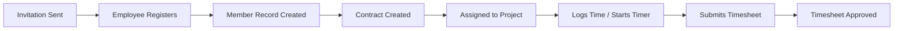

### Weekly Time Tracking and Approval Journey

This scenario describes the complete end-to-end journey an employee takes each week from capturing time worked to having that time officially approved by a manager.

At the start of a working day, the employee may either start a live timer or directly log individual time entries. When using the live timer, the employee selects a project they are assigned to and optionally a task, then starts the timer. Throughout the day the employee can update the timer's description or change the project and task as work evolves. At the end of the work session, the employee stops the timer, which creates a timelog with the duration rounded to the nearest minute. If the employee realizes the timer was left running unintentionally, they may discard it without creating any timelog.

Over the course of the week (Monday through Sunday), the employee accumulates multiple timelogs across one or more projects and tasks. The employee's personal dashboard shows hours logged today, hours logged this week, and the active timer status, giving a continuous view of progress.

On Friday or any time before the submission deadline the employee considers appropriate, the employee creates a draft timesheet for the current week. The system automatically includes all timelogs belonging to that employee for that week's Monday-to-Sunday range. The employee reviews the draft, removes any timelogs that should not be included (for example, a personal errand entered by mistake), and verifies the total hours. The employee then submits the timesheet. The system rejects the submission if there are no timelogs in the timesheet or if another submitted or approved timesheet already exists for the same week.

Once submitted, a user with time approval permission sees the timesheet appear in the pending approval queue. The approver reviews the included timelogs, checking dates, durations, projects, and descriptions. The approver may approve the timesheet — which locks all included timelogs against further edits or deletions — or reject it with a mandatory written reason. A rejected timesheet returns to draft status, and the employee receives the rejection reason, makes corrections (editing timelogs, adjusting entries, or adding missing ones), and resubmits.

The activity log records the submission, approval, or rejection event with a timestamp and the identity of the approver.

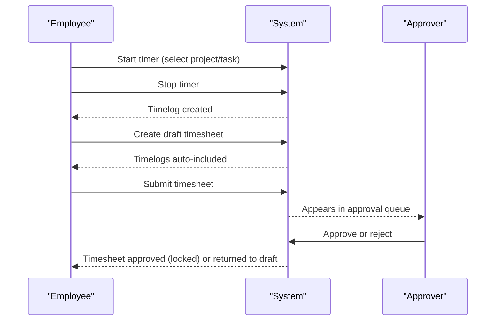

### Project Lifecycle Journey

This scenario describes the full lifecycle of a project from creation through active use to its eventual completion or archiving, spanning project management, task management, team membership, time tracking, and reporting.

A user with project management permission creates a new project by providing a name, a color code, and optionally a description, start date, end date, and budget hours. The project starts in active status.

The project manager then assigns employees to the project, setting each employee's role as either member or project lead. Project leads gain the ability to create and manage tasks within the project. The project manager or a project lead creates tasks, setting titles, priorities, estimated hours, due dates, and optionally assigning each task to a project member. As work progresses, task status transitions from open to in-progress and eventually to completed or closed; each status change is recorded as an immutable task history entry capturing the old status, new status, timestamp, and who made the change.

During the active project period, employees assigned to the project log timelogs referencing the project and optionally specific tasks. Users with report viewing permission can access the Project Budget Report to see how actual logged hours compare to the project's budget hours and what percentage of the budget has been consumed.

When the project work concludes, a user with project management permission marks the project as completed (or archives it if it is being put on hold). Once the project reaches archived or completed status, no new timelogs can be logged against it, though all existing timelogs and task history are preserved for reporting and audit purposes.

If the project needs to be permanently removed and has no associated timelogs, a user with project management permission may delete it entirely. Deletion removes the project, its tasks, task histories, and project memberships; the activity log records the deletion event.

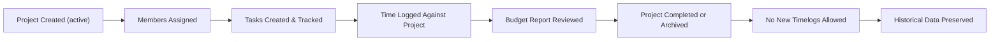

### Employee Offboarding and Account Deletion Journey

This scenario describes the multi-step process of removing an employee from an organization and, if desired, deleting the user's account entirely, while preserving historical records.

When an employee leaves the organization, a user with employee management permission deactivates the employee's member record. Deactivation immediately prevents the employee from logging time, running timers, or submitting timesheets. The employee's historical timelogs, timesheets, contracts, and task assignments remain intact and accessible to users with the appropriate permissions.

Before the employee is deactivated, any currently active contracts remain visible as historical records. If the organization intends to eventually delete itself, it must ensure all employee contracts are no longer active (no ongoing contracts) and all timesheets are resolved — approved or rejected — since an organization cannot be deleted while active contracts or pending timesheets exist.

If the departing user also wishes to delete their own platform account, they must first ensure they are not the sole owner of any organization. If they are the sole owner, they must either transfer ownership to another member or delete the organization entirely (subject to the deletion preconditions above). Once these prerequisites are satisfied, the user deletes their account. The user's global profile and authentication credentials are removed, while their employee member records in any other organizations they belonged to are marked as deactivated, preserving the historical integrity of those organizations' data.

The activity log records the deactivation event at the time the employee record is deactivated, capturing who performed the action and when.

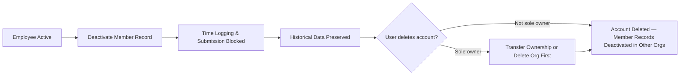

### Organization Setup and Configuration Journey

This scenario describes the end-to-end journey of establishing a fully operational organization, from the initial sign-up through role configuration, department structure, and employee onboarding readiness.

A new user begins by signing up with an email address and password. During the sign-up flow, the user creates the first organization by providing a name, currency, and timezone. The user automatically becomes the organization's Owner. Optionally, the owner may also provide a description, a logo image, and a fiscal start month at setup time.

With the organization created, the Owner configures the organizational structure. First, the Owner may create departments to reflect the company's structure, optionally nesting sub-departments one level deep under parent departments. Each department is given a name and an optional description.

Next, the Owner reviews the built-in roles — Owner, Manager, and Employee — and determines whether additional custom roles are needed. For specialized needs, the Owner creates custom roles by specifying a name and selecting the appropriate set of permissions from the available permission codes. These custom roles allow fine-grained access control beyond what the three built-in roles provide.

With departments and roles ready, the Owner or a user with employee management permission begins inviting employees to the organization by email. Invited users who already have accounts are immediately added as organization members and assigned roles; invited users who do not yet have accounts receive pending invitations that resolve automatically when they register.

For each newly joined employee, a contract is created to record the employment terms: start date, pay rate, pay period, and working hours per week. Projects are created by users with project management permission, and employees are assigned to projects as needed.

Once employees, contracts, departments, roles, and projects are all configured, the organization is fully operational and employees can begin tracking time. The Owner can revisit and update organization settings at any time by editing the name, description, logo, currency, timezone, or fiscal start month.

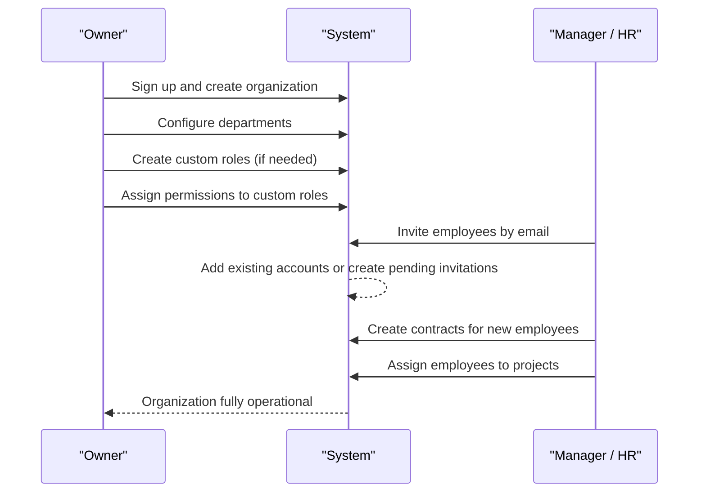

# Real-time Events

WebSocket/SSE event definitions and subscription specifications.

## Organization Events

The system emits real-time events whenever organization-level data changes so that connected clients can reflect updates without manual page refreshes. When an organization owner updates the organization's name, description, logo, currency, timezone, or fiscal start month, an organization-updated event is broadcast to all members currently active in that organization's context. When an organization is deleted, an organization-deleted event is sent to all connected members, prompting clients to remove the organization from their available context list and redirect users as appropriate. Only members who are currently connected and scoped to the affected organization receive these events, enforcing data isolation across tenants. The organization-updated event carries enough detail for the client to refresh displayed organization settings without a separate data fetch. These events help managers and employees see consistent organization metadata across all open sessions in real time.

### Organization Settings Updated Event

WHEN an organization owner saves changes to the organization's name, description, logo image, currency, timezone, or fiscal start month, THE system SHALL emit an organization-updated event to all members who are currently connected and scoped to that organization's context.

THE organization-updated event SHALL carry sufficient detail about the changed settings so that connected clients can immediately refresh displayed organization metadata without issuing a separate data request.

WHEN the organization-updated event is emitted, THE system SHALL include the updated values for all organization-level fields — name, description, logo reference, currency, timezone, and fiscal start month — so the receiving client has a complete and consistent view of the organization's current state.

WHERE a member is connected to multiple sessions simultaneously, THE system SHALL deliver the organization-updated event to all active sessions belonging to that member that are scoped to the affected organization.

THE organization-updated event SHALL be attributed to the owner who triggered the change, so that event consumers can identify the actor responsible for the settings modification.

### Organization Deleted Event

WHEN an organization owner deletes an organization, THE system SHALL emit an organization-deleted event to all members who are currently connected and scoped to that organization's context.

THE organization-deleted event SHALL carry the identifier of the deleted organization so that connected clients can unambiguously determine which organization has been removed and update their available organization context list accordingly.

WHEN a connected member receives the organization-deleted event, THE system SHALL signal the client to remove the deleted organization from the member's list of available organizations and redirect the member away from the deleted organization's context.

WHERE a member who receives the organization-deleted event belongs to other organizations, THE system SHALL allow the client to redirect the member to one of their remaining organizations rather than forcing a full logout.

WHERE a member who receives the organization-deleted event has no remaining organizations, THE system SHALL signal the client to redirect the member to a state where no organization context is active.

THE organization-deleted event SHALL be emitted only after the deletion operation has been fully completed and all associated data has been permanently removed, ensuring clients do not receive a deletion signal for a partially deleted organization.

### Broadcast to All Active Organization Members

THE system SHALL broadcast organization-level events to every member who is currently connected and has selected the affected organization as their active context at the time the event is emitted.

WHEN an organization event is triggered, THE system SHALL deliver the event in real time to all qualifying connected members without requiring those members to manually poll or refresh their session.

THE broadcast SHALL include members holding any role within the organization — Owner, Manager, Employee, or any custom role — as long as they are actively scoped to the organization at the moment of the event.

WHEN a member connects or switches into an organization's context after an event has already been emitted, THE system SHALL NOT retroactively deliver past organization events to that member; the member's client will reflect current state through its normal data loading process instead.

### Organization Context Scoping for Event Delivery

THE system SHALL deliver organization events exclusively to members whose active session context matches the organization that generated the event.

WHEN a member is connected but has not selected any organization context, THE system SHALL NOT deliver organization-scoped events to that member's session.

WHEN a member has selected a different organization as their active context, THE system SHALL NOT deliver events from other organizations to that session, even if the member belongs to multiple organizations.

WHEN a member switches their active organization context during a session, THE system SHALL update the event subscription scope so that the member begins receiving events for the newly selected organization and stops receiving events for the previously selected organization.

THE system SHALL enforce context scoping at the point of event delivery, ensuring that no organization event reaches a session that is not currently operating within that organization's context.

### Multi-Tenancy Event Isolation

THE system SHALL guarantee that real-time events generated by one organization are never delivered to members of a different organization, preserving strict data isolation across all tenants.

WHEN multiple organizations are active simultaneously on the platform, THE system SHALL process and route their respective events independently so that high event volume in one organization does not affect the delivery of events to another organization's members.

THE system SHALL treat each organization as an isolated event domain, meaning that an organization-updated or organization-deleted event from Organization A can never appear in the event stream of a member whose active context is Organization B, regardless of whether that member also belongs to Organization A.

WHERE a single user belongs to multiple organizations and has concurrent sessions open for different organizations, THE system SHALL deliver events to each session according to that session's active organization context, maintaining full isolation between the sessions.

### Real-Time Organization Metadata Refresh

WHEN a connected member receives an organization-updated event, THE system SHALL provide enough data within the event payload for the client to update all displayed organization settings — including name, description, logo, currency, timezone, and fiscal start month — without requiring an additional data fetch.

THE system SHALL ensure that the organization metadata reflected in a connected member's active session becomes consistent with the latest saved state immediately upon receipt of the organization-updated event.

WHEN the organization logo image is updated, THE organization-updated event SHALL include a reference that allows the client to retrieve and display the new logo.

THE real-time metadata refresh applies to all organization-level settings that an owner is permitted to edit, as defined in the organization settings operations. No additional settings outside that defined scope are included in the event payload.

## User Events

Real-time user events notify relevant parties when a user's account state changes in ways that affect their access or visibility within the platform. When a user changes their password, a user-password-changed event may be emitted to any administrative session that needs to be aware of credential updates. When a user deletes their account, a user-deleted event is emitted so that all organization sessions associated with that user can be invalidated and employee records marked as deactivated in real time. Clients subscribed to user events within an organization context only receive events relevant to members of that organization, preserving data isolation. These events allow the system to reactively update UI state — for example, removing a deleted user from member lists — without requiring a full data reload. The subscription scope for user events is limited to users who share at least one common organization context.

### User Account Deleted Event

When a user deletes their account, the system emits a user-deleted event to all organizations that the user belongs to. This event signals that the user's membership across those organizations has ended and that their employee records have been marked as deactivated.

The user-deleted event payload includes the identity of the deleted user, the list of organizations they were a member of, and the timestamp of the deletion. Each organization that receives this event can use it to immediately reflect the change — removing the user from active member lists in real time and preventing any further actions from being attributed to that account.

Clients actively viewing member lists or dashboards within an affected organization receive this event and update their displayed data without requiring a full page reload. Any session that belonged to the deleted user is invalidated as part of this event flow, ensuring the user cannot continue interacting with any organization context after their account has been removed.

### Session Invalidation on Account Deletion

When a user account is deleted, all active sessions associated with that user are immediately invalidated across every organization context they were logged into. The user-deleted event triggers session termination so that any client — whether currently viewing an organization dashboard, a timesheet, or a project — is logged out without delay.

Any client that receives the session invalidation signal is redirected to the login screen or otherwise prevented from making further requests under that user identity. This applies regardless of which organization context the session was operating in at the time of deletion. The invalidation is propagated in real time to all connected clients that hold an active session for the deleted user, ensuring no stale sessions remain active after account removal.

### User Password Changed Event

When a user successfully changes their password, the system emits a user-password-changed event. This event is scoped to the user's own sessions and to any administrative contexts that need to be aware of credential updates within a shared organization.

The user-password-changed event payload includes the identity of the user whose password was changed and the timestamp of the change. The event does not include the new password or any credential material. Upon receiving this event, all other active sessions belonging to the same user — across any organization context — are notified that a credential change has occurred. Clients may use this signal to prompt re-authentication or to invalidate concurrent sessions depending on the platform's session policy.

Organization members with appropriate administrative access who are subscribed to user events within a shared organization context may also receive this notification, allowing them to be aware that a member's credentials have been updated.

### Employee Record Deactivation Notification

When a user account is deleted, the system deactivates the user's employee records across all organizations they belonged to. For each affected organization, a member-deactivated event is emitted to notify other members that the employee is no longer active.

The employee record deactivation notification carries the employee's identity within the organization, the organization identifier, and the reason for deactivation — in this case, account deletion. Clients subscribed to member events within the affected organization receive this notification and update the member list and any assignment views in real time. Task assignment panels, project member lists, and timesheet review queues that referenced the deactivated employee reflect the updated status without requiring a manual refresh.

This deactivation event is distinct from a voluntary deactivation performed by a manager; the event payload includes a flag indicating that deactivation was triggered by account deletion, allowing the UI to display an appropriate message to other members.

### Organization-Scoped User Event Delivery

User events are delivered exclusively within the scope of shared organization contexts. When a user-deleted or user-password-changed event is emitted, it is routed only to clients that share at least one organization with the affected user. Clients that have no organizational relationship with the affected user do not receive any user events related to that user.

Within each organization, only members who are currently connected and subscribed to that organization's event stream receive user events. Members who are offline or not currently viewing the organization do not receive the event in real time; their data is updated the next time they load or refresh the relevant view.

This scoping mechanism preserves data isolation: a user's account changes are never broadcast to organizations they do not belong to. The event delivery system uses the organization context established at session start to determine which event streams a connected client is eligible to receive.

### Real-Time Member List Update

When a user account is deleted, clients displaying the organization's member list receive a real-time update that removes the deleted user from the list without requiring a page reload. The update is driven by the user-deleted event propagated to all connected clients within the affected organization's event stream.

The member list update reflects both the removal of the user's entry and the deactivated status of their employee record. If the member list is currently filtered to show only active members, the deleted user's entry disappears from the list. If the list is filtered to include deactivated members, the entry remains visible but is marked as deactivated with an indication that the underlying account no longer exists.

Other real-time views that reference the user — such as project member panels, task assignment dropdowns, and timesheet reviewer views — similarly update in real time when the user-deleted event is received, ensuring consistency across all parts of the interface.

### Shared Organization Context Subscription Rule

A client may subscribe to user events for a specific user only if that client belongs to at least one organization that the target user is also a member of. This shared organization context rule is enforced by the event delivery system before any user event is dispatched to a subscriber.

When a client establishes a connection and selects an organization context, the system records which organizations that client is eligible to receive events for. User events emitted within an organization are then delivered only to clients whose active organization context matches the organization where the event originated.

If a user is a member of multiple organizations, user events for that user are delivered separately to each organization's subscriber pool. Subscribers in organization A do not receive user events originating from organization B, even if the same user is a member of both. This ensures that each organization's event stream remains isolated and that no cross-organization data leakage occurs through the real-time event system.

## UserProfile Events

User profile events are emitted whenever a user updates their global profile information, including display name, avatar image, or phone number. Because a user profile is shared across all organizations the user belongs to, a profile-updated event must be delivered to all organization contexts where that user is an active member. This ensures that other employees see the correct display name and avatar immediately after a change, without needing to reload the page. The profile-updated event payload includes the updated display name and avatar reference so clients can update rendered names and profile pictures in member lists, task assignments, timelog entries, and chat-like surfaces. Subscription to profile events is automatically established for any user who shares an organization with the profile owner. The system must ensure that profile change events do not leak to organizations where the user is not a member, maintaining cross-tenant data isolation.

### Profile Updated Event

Whenever a user successfully saves changes to their global profile, the system emits a profile-updated event. This event is triggered by any change to the profile — whether the display name, avatar image, or phone number is modified — as long as the save operation completes successfully. The event is not emitted when a profile edit attempt fails validation or is rejected. The profile-updated event carries the following information in its payload: the identifier of the user whose profile changed, the updated display name, a reference to the updated avatar image (or null if no avatar is set), and the updated phone number. The payload contains only the current state of the profile after the change, not the previous values. Clients that receive this event must update any cached or rendered representation of that user's profile using the data provided in the payload.

### Display Name and Avatar Image Change Notifications

The profile-updated event communicates both display name changes and avatar image changes within the same event payload. Clients must inspect the payload and refresh any UI surface that renders the user's display name or avatar image. Surfaces that must be updated include: the member list within the organization, task assignment labels showing the assigned employee's name and avatar, timelog entries attributed to that user, timesheet reviewer and submitter labels, and any activity log entries that display the acting user's name. Because the avatar is a file reference, the client should reload the avatar image using the updated reference from the payload rather than relying on a previously cached version. If the avatar reference in the payload is null, the client must replace the displayed avatar with a default placeholder.

### Cross-Organization Profile Event Broadcast

Because a user profile is shared across all organizations the user belongs to, the system must broadcast the profile-updated event to every organization context in which that user holds an active membership. When the user saves their profile, the system identifies all organizations where that user is an active member and delivers the profile-updated event to each of those organization channels simultaneously. The broadcast is performed regardless of which organization context the user was in when they made the profile change. Organizations where the user was formerly a member but has since been deactivated do not receive the event. Organizations the user has never joined do not receive the event. The cross-organization broadcast ensures that all co-members across all shared organizations see the updated name and avatar without delay.

### Profile Event Delivery to Co-Members Only

Profile-updated events must only be delivered to users who share at least one active organization membership with the profile owner. For each organization where the broadcast is sent, the event is delivered only to the active members of that organization. A user who is connected to an organization's real-time channel receives the profile-updated event if and only if the profile owner is also an active member of that same organization. Users who belong to none of the same organizations as the profile owner must not receive any profile-updated event from that owner. This restriction enforces cross-tenant data isolation: knowledge that a particular user exists and what their profile looks like must not leak to unrelated organizations. The system must evaluate membership at the time of event delivery, so if a user was removed from an organization between the time the profile was saved and the time the event is dispatched, that organization's channel must not receive the event for that user's changes.

### Shared Profile Real-Time Sync

The profile-updated event enables all connected clients across all relevant organization contexts to maintain an up-to-date view of user profile data without requiring a page reload. When a client receives a profile-updated event, it must apply the new display name and avatar reference immediately to all currently rendered views that reference that user. This includes member directory listings, task detail panels showing the assignee, timelog lists showing the logging employee, timesheet views showing the submitter or reviewer, and any other surface displaying the user's identity. The synchronization must be applied in-place so that currently visible views reflect the change instantly. Clients that are not currently rendering any view referencing the changed user may store the updated profile data in their local cache for use when such a view is next rendered. If a client is temporarily disconnected and reconnects after a profile change occurred, it must fetch the current profile state from the server on reconnect rather than relying on missed real-time events.

## OrganizationMember Events

Organization member events capture real-time changes to an employee's membership record within an organization, helping managers and teammates stay informed about workforce changes. When a new employee is added to the organization — whether through invitation acceptance or direct addition — a member-added event is broadcast to all members with sufficient permission to view employees. When an employee's record is updated (department, position, employment type, or role), a member-updated event is sent so that role-aware UI elements such as permission checks and assignment dropdowns reflect the latest state. When an employee is deactivated, a member-deactivated event is emitted, allowing clients to remove that employee from active selection lists and restrict their interactions. When a deactivated employee is reactivated, a member-reactivated event restores their presence in active member lists. All member events are scoped strictly to the organization where the change occurred, preventing cross-tenant data leakage. Users with `employee:view` permission receive the full member detail payload, while other members receive minimal identifying information.

### Member Added Event

WHEN a new employee is added to an organization — either because an invited user accepted a pending invitation or because an existing registered user was directly added — THE system SHALL broadcast a member-added event to all currently connected clients subscribed to that organization's member event stream.

WHEN the member-added event is emitted, THE system SHALL include in the event payload the new member's identifier, display name, employment type, department (if assigned), position (if assigned), role name, and membership status.

WHEN a pending invitation is accepted and the member-added event is generated, THE system SHALL treat the event as originating from the invitation acceptance action and mark the event source accordingly so that subscriber clients can distinguish direct additions from invitation-driven additions.

THE system SHALL emit the member-added event only after the new employee record has been fully persisted, ensuring that clients receiving the event can immediately query the member's complete record without encountering an inconsistent state.

IF the new employee's email was associated with a pending invitation in multiple organizations, THEN THE system SHALL emit a separate member-added event for each organization independently, scoped to that organization's subscriber set.

### Member Record Updated Event

WHEN an authorized user edits an employee's department, position, or employment type, THE system SHALL broadcast a member-updated event to all currently connected clients subscribed to that organization's member event stream.

WHEN a department change is saved, THE system SHALL include in the member-updated event the affected member's identifier, the previous department value, and the new department value, allowing clients to refresh department-based filters and assignment dropdowns in real time.

WHEN a position change is saved, THE system SHALL include the previous position title and the new position title in the member-updated event payload.

WHEN an employment type change is saved — for example, a change from part-time to full-time or from contractor to employee — THE system SHALL include the previous employment type and the new employment type in the member-updated event payload.

WHEN a member-updated event is emitted for any field change, THE system SHALL also include a timestamp indicating when the change occurred and the identifier of the user who performed the edit, so that subscriber clients can display accurate audit context.

THE system SHALL emit a single member-updated event per edit operation even when multiple fields (such as department and position) are changed simultaneously, consolidating all changed fields into one event payload rather than emitting one event per field.

### Role Assignment Change Notification

WHEN a user with employee management permission changes the role assigned to an organization member, THE system SHALL broadcast a role-assignment-changed event to all currently connected clients subscribed to that organization's member event stream.

WHEN the role-assignment-changed event is emitted, THE system SHALL include in the payload: the affected member's identifier, the name and permission set of the previous role, and the name and permission set of the newly assigned role.

WHEN a client receives a role-assignment-changed event for the currently authenticated user's own member record, THE system SHALL prompt that client to re-evaluate the user's effective permissions and refresh any permission-dependent UI elements, such as navigation menus, action buttons, and data access scopes, without requiring a full page reload or re-login.

WHEN a role-assignment-changed event is emitted and the affected member's new role grants or revokes the ability to view other employees, THE system SHALL ensure that subsequent event subscriptions for that member reflect the updated permission level, so the member no longer receives or begins receiving payloads they are not authorized to see.

IF a role assignment change results in the affected member losing access to a resource they were previously subscribed to, THEN THE system SHALL send a subscription-invalidated signal to that member's client so the client can unsubscribe from disallowed event streams gracefully.

### Member Deactivated Event

WHEN an authorized user deactivates an organization member, THE system SHALL broadcast a member-deactivated event to all currently connected clients subscribed to that organization's member event stream.

WHEN the member-deactivated event is emitted, THE system SHALL include the deactivated member's identifier, display name, and the timestamp of deactivation, so that subscriber clients can immediately remove the member from active selection lists, task assignment dropdowns, and project member pickers.

WHEN a client belonging to the deactivated employee receives the member-deactivated event for their own record, THE system SHALL terminate that employee's active subscriptions to time-tracking and timesheet event streams, reflecting that deactivated employees can no longer log time or submit timesheets.

WHEN the member-deactivated event is delivered, THE system SHALL NOT remove historical data references from prior event payloads; only forward-looking interactive elements should be affected on the client side.

IF the deactivated member currently has an active timer running, THE system SHALL include a flag in the member-deactivated event payload indicating that an unresolved active timer exists, so that clients and administrators are aware of the orphaned timer state.

### Member Reactivated Event

WHEN an authorized user reactivates a previously deactivated organization member, THE system SHALL broadcast a member-reactivated event to all currently connected clients subscribed to that organization's member event stream.

WHEN the member-reactivated event is emitted, THE system SHALL include the reactivated member's identifier, display name, current role, department (if assigned), position (if assigned), and employment type, so that subscriber clients can restore the member's presence in active selection lists and assignment interfaces.

WHEN a client belonging to the reactivated employee receives the member-reactivated event for their own record, THE system SHALL restore that employee's access to time-tracking and timesheet event streams, enabling them to receive timelog and timesheet-related real-time updates once again.

THE system SHALL emit the member-reactivated event only after the employee record has been fully updated to active status in persistent storage, ensuring that any client querying the member's full record after receiving the event retrieves consistent, up-to-date data.

### Permission-Gated Event Payload

WHILE a connected client has a session with a member who holds the employee:view permission, THE system SHALL deliver member event payloads (member-added, member-updated, member-deactivated, member-reactivated, role-assignment-changed) that include the full detail set: identifier, display name, employment type, department, position, role name, permission set summary, and status.

WHILE a connected client has a session with a member who does not hold the employee:view permission, THE system SHALL deliver member event payloads that contain only minimal identifying information — specifically the member's identifier and display name — omitting sensitive employment details, role permission sets, and contractual information.

WHEN the system evaluates which payload variant to send, THE system SHALL assess the receiving subscriber's current effective permissions at the moment of event delivery, not at the time the event was generated, so that recent role changes are reflected in event access levels without delay.

IF a subscriber's permission level changes between two member events such that their access tier shifts from full-detail to minimal, THEN THE system SHALL apply the reduced payload format immediately on the next emitted event without requiring the subscriber to reconnect.

THE system SHALL never include raw pay rate, contract terms, or other financially sensitive contract data in any member event payload, regardless of the subscriber's permission level, as contract details are accessed through dedicated contract operations rather than broadcast events.

### Organization-Scoped Member Event Delivery

THE system SHALL scope all member events strictly to the organization in which the change occurred, ensuring that subscribers connected under a different organization context do not receive member events from organizations they are not currently operating in.

WHEN a user is a member of multiple organizations and is currently operating in one organization context, THE system SHALL deliver member events only for that active organization context, suppressing events from other organizations the user belongs to until the user switches organization context.

WHEN a user switches their active organization context, THE system SHALL unsubscribe the client from the previous organization's member event stream and subscribe it to the new organization's member event stream without requiring a full reconnect cycle.

THE system SHALL authenticate and authorize each member event subscription request against the organization context, rejecting subscription attempts by users who are not active members of the requested organization.

IF an organization is deleted, THE system SHALL immediately terminate all active member event subscriptions for that organization and notify connected clients that the organization context is no longer available, preventing further delivery of stale or orphaned member events.

THE system SHALL ensure that no member event payload contains references to data belonging to a different organization, enforcing strict tenant isolation at the event emission layer.

## Role Events

Role events notify organization members in real time when the role structure of their organization changes, which is critical because role changes directly affect what features and data users can access. When an organization owner creates a new custom role, a role-created event is broadcast to all connected members so that role management interfaces and assignment dropdowns update immediately. When a custom role's name or permissions are edited, a role-updated event is emitted, and clients should re-evaluate any permission-dependent UI elements for members assigned to that role. When a custom role is deleted, a role-deleted event is sent so that the deleted role is removed from all selection interfaces. Built-in roles (Owner, Manager, Employee) cannot be deleted, so role-deleted events only apply to custom roles. All role events are scoped to the organization in which the role change occurred. Only users with appropriate permissions, such as organization owners managing roles, and members affected by role changes, need to act on these events.

### Custom Role Created Event

WHEN an organization owner creates a new custom role, THE system SHALL emit a role-created event to all currently connected members of that organization.

THE system SHALL include in the role-created event payload: the new role's identifier, name, and the full set of permissions assigned to it, along with the organization identifier and the timestamp of creation.

WHEN a role-created event is received by a connected client, THE system SHALL update all role assignment dropdowns and role selection interfaces to include the newly created role as an available option.

WHEN a role-created event is received, THE system SHALL make the new role immediately selectable for assignment to organization members without requiring a manual page refresh.

THE system SHALL deliver the role-created event only to clients operating within the same organization context in which the role was created.

### Custom Role Updated Event and Permission Set Change Notification

WHEN an organization owner edits a custom role's name or permission set, THE system SHALL emit a role-updated event to all currently connected members of that organization.

THE system SHALL include in the role-updated event payload: the role identifier, the updated role name, the updated full permission set, and the timestamp of the change.

WHEN a role-updated event is received and the updated role carries a changed permission set, THE system SHALL treat the event as a permission set change notification and signal connected clients to re-evaluate all permission-dependent interface elements for members assigned to that role.

WHEN a permission set change notification is processed by a client, THE system SHALL trigger re-evaluation of any features, menu items, action buttons, or data views whose visibility depends on the permissions carried by the changed role.

WHEN a member is currently logged in and assigned to the role that was updated, THE system SHALL apply the revised permissions to that member's active session so that newly granted or revoked permissions take effect without requiring a logout and login cycle.

WHEN a role-updated event updates the role's name, THE system SHALL refresh all role display labels across assignment dropdowns, member detail views, and any other surfaces that display the role name, so that stale names are not shown to connected users.

### Custom Role Deleted Event and Role Assignment Dropdown Refresh

WHEN an organization owner deletes a custom role, THE system SHALL emit a role-deleted event to all currently connected members of that organization.

THE system SHALL include in the role-deleted event payload: the identifier of the deleted role, the organization identifier, and the timestamp of deletion.

WHEN a role-deleted event is received by a connected client, THE system SHALL immediately remove the deleted role from all role assignment dropdowns, role selection interfaces, and role filter options so that the deleted role can no longer be selected for new assignments.

IF a role-deleted event references a role that is currently displayed as a selected value in any open form or interface, THEN THE system SHALL clear that selection and prompt the user to choose a valid role before proceeding.

THE system SHALL ensure that role-deleted events are only emitted for custom roles; built-in roles (Owner, Manager, and Employee) cannot be deleted and therefore never produce a role-deleted event.

WHEN a role-deleted event is received, THE system SHALL not disrupt existing member sessions or access for members whose role assignment was already resolved prior to the deletion, as role reassignment is handled through member update flows rather than through the deletion event itself.

### Built-in Role Immutability in Events and Organization-Scoped Role Event Delivery

THE system SHALL never emit role-created, role-updated, or role-deleted events for the built-in roles Owner, Manager, and Employee, as these roles are immutable and cannot be created, modified, or removed through any organizational action.

WHEN a connected client processes incoming role events, THE system SHALL treat the absence of built-in roles from role-created and role-deleted event streams as the expected and correct behavior, and clients SHALL NOT attempt to add or remove built-in roles from their interfaces based on these events.

IF a client receives a role event that references a built-in role identifier, THEN THE system SHALL discard that event as invalid without applying any interface changes.

THE system SHALL scope all role events — role-created, role-updated, and role-deleted — strictly to the organization in which the role change occurred, and SHALL NOT deliver those events to members connected under a different organization context.

WHEN a member is connected to the platform under a specific organization context, THE system SHALL deliver only the role events that belong to that organization, ensuring complete isolation between organizations sharing the multi-tenant platform.

WHEN a member switches their active organization context, THE system SHALL resubscribe that member's client to the role event stream of the newly selected organization and unsubscribe from the previous organization's role event stream.

THE system SHALL ensure that users with appropriate permissions — specifically organization owners who manage roles, and any member whose assigned role is affected by a change — receive timely role events so that both administrative role management interfaces and individual member permission-dependent views remain accurate and up to date in real time.

## Invitation Events

Invitation events provide real-time feedback on the lifecycle of employee invitations within an organization. When a user with `employee:manage` permission sends an invitation to an email address, an invitation-created event is emitted to managers and owners so they can see the pending invitation in their management interfaces without refreshing. When an invited user accepts the invitation and joins the organization, an invitation-accepted event is broadcast, which also triggers a corresponding member-added event so the new employee appears in the member list immediately. If an invitation is for an email address that already has an account, the system adds the user directly and emits the appropriate member and invitation events simultaneously. Invitation events are scoped to the organization where the invitation was issued, and only users with `employee:manage` or `employee:view` permissions receive the full invitation details. These events allow managers to monitor the onboarding pipeline in real time.

### Invitation Created Event

When a user with `employee:manage` permission successfully sends an invitation to an email address, the system emits an invitation created event to all connected clients in the same organization who hold `employee:manage` or `employee:view` permissions.

The event payload includes the invited email address, the status of the invitation (pending), the timestamp when the invitation was issued, and the identity of the organization member who sent the invitation.

This event allows managers and owners to see newly issued invitations appear in their invitation management interfaces without requiring a manual page refresh. The invitation created event is strictly scoped to the organization in which the invitation was issued; no other organization receives this event.

If the invitation fails (for example, because the email is already a member or a pending invitation already exists for that address), no event is emitted. Only successful invitation creations produce an event.

### Invitation Accepted Event and New Member Added Notification

When an invited user accepts an invitation and joins the organization, the system emits two coordinated real-time events in sequence:

1. An invitation accepted event, which signals that the previously pending invitation has transitioned to accepted status. The payload includes the invitation details, the accepting user's identity, and the acceptance timestamp.
2. A member added event, which signals that a new organization member record has been created for the accepted user. The payload includes the new member's profile information, assigned role, employment type, and the organization they joined.

Both events are delivered together so that management interfaces can update the pending invitation list and the active member list simultaneously. Recipients of both events are determined by the subscription rules described in the Subscription Rules section below.

The member added event emitted here is consistent with the member added event described in the OrganizationMember Events unit. Clients do not need to treat these as different event types — the same member added event type is used in both cases.

### Existing Account Direct-Add Notification

When a user with `employee:manage` permission invites an email address that is already registered in the platform, the system does not create a pending invitation. Instead, it adds the existing user directly to the organization as a new member.

In this scenario, the system emits the following events:

- An invitation accepted event, indicating that the process completed immediately without a pending phase. The payload reflects that the invitation was issued and accepted in the same action, and the accepted timestamp matches the invitation timestamp.
- A member added event, notifying all eligible subscribers that the user now appears as an active member in the organization.

This direct-add flow ensures that managers observing the invitation pipeline in real time see consistent feedback regardless of whether the invited email was new or already registered. The events produced are functionally equivalent to those produced by the standard acceptance flow, allowing client interfaces to handle both paths with the same event handlers.

### Pending Invitation Status Updates

Between the time an invitation is created and the time it is accepted, the invitation remains in pending status. The system emits a pending invitation status update event whenever the state of a pending invitation changes in any way that is observable to authorized users.

Currently, the only status transitions that produce a status update event are:

- Pending → Accepted: triggered when the invited user signs up and is automatically associated with the pending organization, or when an existing user accepts the invitation directly.

The status update event payload includes the invitation identifier, the previous status, the new status, and the timestamp of the transition. This allows management interfaces to move invitation entries from the pending section to the completed or member-added section in real time without polling.

If the invitation status remains unchanged (for example, the user has not yet signed up), no status update event is emitted. Only actual transitions produce events.

### Subscription Rules and Organization-Scoped Event Delivery

All invitation events are organization-scoped: they are delivered only to users who are currently operating within the organization context where the invitation was issued. Users connected to a different organization context do not receive these events, even if they are members of both organizations.

Within the organization, subscription eligibility is determined by permission level:

- Users with `employee:manage` permission receive the full payload of all invitation events, including the invited email address, the issuing member's identity, and status transition details. This allows them to actively manage the onboarding pipeline.
- Users with `employee:view` permission receive invitation events with sufficient detail to display the pending invitation list, but without sensitive operational details reserved for managers.
- Users with neither `employee:manage` nor `employee:view` permissions do not receive invitation events.

When a user's permissions change during an active session (for example, their role is updated), their subscription eligibility is re-evaluated immediately. If they lose the required permission, they stop receiving invitation events for the remainder of their session.

### Invitation Pipeline Real-Time Monitoring

Users with `employee:manage` permission can monitor the full lifecycle of the organization's invitation pipeline in real time using the stream of invitation events.

The pipeline view reflects the following states as they occur:

- Newly issued invitations appear immediately when an invitation created event is received.
- Pending invitations update their status when a pending invitation status update event is received.
- Accepted invitations are removed from the pending section and trigger a corresponding member added notification when an invitation accepted event is received.
- Direct-add completions (for existing accounts) are surfaced immediately through the simultaneous invitation accepted and member added events, ensuring the pipeline view is never out of sync.

This real-time monitoring capability eliminates the need for manual refresh when managing employee onboarding. Managers can observe the progress of outstanding invitations and see new hires appear in the member list the moment they join, without any additional interaction.

## Department Events

Department events keep all organization members informed of structural changes to the department hierarchy in real time. When a user with `org:manage` permission creates a new department, a department-created event is broadcast to all connected members of the organization so that department filter dropdowns and employee assignment interfaces reflect the new department immediately. When a department is edited — such as a name or description change, or a parent department reassignment — a department-updated event is emitted with the updated details. When a department is deleted, a department-deleted event is sent, and clients should update any employee records that displayed that department to show no department (null), since deletion does not remove employees. All department events include the department identifier and updated fields so clients can perform targeted updates rather than full reloads. Department events are scoped to the organization and visible to all members, since employees can view the department list.

### Department Created Event

When a user with `org:manage` permission successfully creates a new department, the system emits a department-created event to all currently connected members of the same organization. The event payload includes the new department's identifier, name, description, and parent department reference (if one was assigned). Upon receiving this event, clients refresh any department filter dropdowns and employee assignment interfaces so that the newly added department is immediately selectable without requiring a manual page reload. All connected members of the organization receive this event regardless of their role, because all employees can view the department list.

### Department Updated Event

When a user with `org:manage` permission edits an existing department — changing its name, description, or parent department assignment — the system emits a department-updated event to all currently connected members of the organization. The event payload includes the department identifier along with the specific fields that changed, allowing clients to perform targeted, in-place updates rather than reloading the full department list. When the parent department is reassigned, the event payload explicitly reflects the new parent department reference so that clients can correctly re-render the department hierarchy. All connected organization members receive the department-updated event, enabling consistent display of the current department structure across all active sessions.

### Department Deleted Event

When a user with `org:manage` permission deletes a department, the system emits a department-deleted event to all currently connected members of the organization. The event payload includes the identifier of the deleted department. Upon receiving this event, clients remove the department from all department filter dropdowns and selection lists. Any employee records that were previously displaying the deleted department should be updated in the client view to show no department, reflecting the server-side behavior where deletion sets affected employees' department field to null rather than removing the employees. The department-deleted event is organization-scoped, ensuring that only members of the relevant organization receive the notification.

### Organization-Scoped Department Event Delivery

All department events — created, updated, and deleted — are strictly scoped to the organization in which the department change occurred. Members connected to a different organization context do not receive department events from other organizations, maintaining full data isolation between tenants. Event delivery targets only the connected sessions belonging to the affected organization, regardless of whether a user belongs to multiple organizations. All members within the organization, at every role level, are subscribed to department events because the department list is visible to all employees. Clients use the department identifier included in every event payload to apply precise updates to local state, avoiding unnecessary full data fetches.

## EmployeeContract Events

Employee contract events notify relevant parties when contract records are created or modified, which is important for keeping compensation and work-hour data current. When a user with `employee:manage` permission creates a new contract for an employee, a contract-created event is emitted, and if a previous active contract was automatically ended, a contract-ended event is also emitted for that previous contract. When the current active contract is edited, a contract-updated event is sent with the changed fields. Past contracts cannot be edited, so contract-updated events only occur for the currently active contract. The employee who owns the contract receives contract events so they can see their own current contract details update in real time. Users with `employee:view` permission also receive contract events for any employee in the organization. These events allow both managers and employees to stay informed about compensation changes without polling.

### Contract Created Event and Previous Active Contract Ended Event

When a user with `employee:manage` permission successfully creates a new contract for an employee, the system emits a contract-created event scoped to the organization in which the contract was created. This event carries the full details of the newly created contract, including the employee it belongs to, the start date, pay rate, pay period, and working hours per week.

If the employee already had an active contract at the time the new contract was created, the system automatically ends the previous contract by setting its end date to the day before the new contract's start date. Immediately after this automatic closure, the system emits a separate contract-ended event for the previous contract. This event conveys the identity of the contract that was ended, the employee it belonged to, and the effective end date that was assigned. The contract-ended event is always emitted in conjunction with the contract-created event whenever an automatic end-date assignment occurs; if there was no previously active contract, no contract-ended event is emitted.

Both events are delivered only to subscribers within the same organization. Subscribers outside the affected organization do not receive either event.

### Contract Updated Event and Active Contract Change Notification

When a user with `employee:manage` permission edits the currently active contract of an employee, the system emits a contract-updated event. This event is triggered only for the currently active contract; past contracts are immutable and therefore never produce a contract-updated event.

The contract-updated event payload identifies the contract and the employee it belongs to, and includes only the fields that changed. Key changes that trigger this event include:

- A change to the pay rate, which constitutes a pay rate change notification embedded within the event.
- A change to the working hours per week, which constitutes a working hours per week change notification embedded within the event.
- A change to the pay period, notes, or end date of the active contract.

Subscribers receive the updated values for all changed fields in a single event, rather than separate events per field. The event is scoped to the organization and is not delivered to subscribers in other organizations. Clients that display the employee's current contract details are expected to refresh those details upon receiving this event.

### Employee Self-Contract Update Notification

The employee who owns the contract is always included as a subscriber to contract events that concern their own record. When a contract-created event, contract-ended event, or contract-updated event is emitted for a given employee, that employee receives the event directly regardless of their own permission level.

This allows the employee to see their own current contract details update in real time without needing to poll for changes. For example, when their pay rate or working hours per week is modified by a manager, the employee's client interface is notified immediately through the contract-updated event. Similarly, when a new contract is created for them, the employee receives the contract-created event and, if applicable, the contract-ended event for their previous contract.

The employee receives only events related to their own contracts. They do not receive contract events for other employees in the organization through this subscription rule.

### Employee View Permission Contract Subscription and Organization-Scoped Delivery

Users who hold the `employee:view` permission within an organization are subscribed to contract events for all employees in that organization. This means that when any employee's contract is created, ended, or updated, users with `employee:view` permission receive the corresponding event and can reflect the updated contract state in their view without manual refresh.

All contract events — contract-created, contract-ended, and contract-updated — are strictly scoped to the organization in which the contract exists. A user who belongs to multiple organizations only receives contract events for the organization they are currently operating in. Events are never broadcast across organization boundaries, ensuring that compensation and work-hour data remains isolated per organization.

The organization context is enforced at the point of event delivery: the system checks the subscriber's active organization context before dispatching any contract event, and discards the event for subscribers whose active context does not match the organization in which the event originated.

## Project Events

Project events enable real-time synchronization of project state across all members of an organization who have visibility into projects. When a user with `project:manage` permission creates a new project, a project-created event is broadcast to all members with `project:view` permission so the project appears in their lists immediately. When a project is edited — including name, description, color code, budget hours, or dates — a project-updated event is emitted. When a project is archived or marked as completed, a project-archived or project-completed event is sent, allowing clients to visually update the project status and prevent new timelog creation on those projects in the UI. When a project is deleted, a project-deleted event is emitted so it is removed from all project lists and related views. All project events are scoped to the organization context. Employees assigned to a project also receive project events for their assigned projects even without the broader `project:view` permission, since they need to know which projects they can log time to.

### Project Created Event

When a user with project management permission successfully creates a new project within an organization, the system emits a project-created event. This event is broadcast in real time to all members of the organization who hold project view permission, so that the newly created project appears immediately in their project lists without requiring a manual page refresh.

The event payload includes the full project details: the project name, description, color code, status (which begins as active), budget hours if provided, start date, end date, and the identity of the member who created the project.

Members who are already assigned to the project at the moment of creation also receive this event, even if they do not hold the broader project view permission. All event delivery is scoped strictly to the organization in which the project was created; members of other organizations do not receive this event.

### Project Updated Event

When a user with project management permission edits a project's details, the system emits a project-updated event. This event is triggered by any change to the project's attributes, including its name, description, color code, budget hours, start date, or end date.

The event payload includes the project identifier, all updated field values, and the identity of the member who performed the edit. Recipients can use this payload to update their locally displayed project information in real time.

The project-updated event is delivered to all organization members who hold project view permission, as well as to all employees currently assigned to the project as project members, regardless of whether they hold the broader project view permission. The event is scoped to the organization context.

### Project Status Change Events

The system emits distinct events when a project undergoes a status transition. Three status change events are defined:

**Project Archived Event**: When a user with project management permission archives a project, a project-archived event is emitted. Upon receiving this event, clients update the project's displayed status to archived and disable the ability to create new timelogs against that project in the user interface. Existing timelogs associated with the project are preserved and remain visible.

**Project Completed Event**: When a user with project management permission marks a project as completed, a project-completed event is emitted. Similar to the archived event, clients update the project status display to completed and prevent the creation of new timelogs against the project. All historical timelogs on the project remain intact.

**Project Deleted Event**: When a user with project management permission deletes a project (only permitted when no timelogs are associated), a project-deleted event is emitted. Clients that receive this event remove the project from all project lists and from any related views such as timelog creation forms and task boards.

All three status change events include the project identifier, the new status, and the identity of the member who performed the action. These events are organization-scoped and delivered to all members holding project view permission as well as all employees assigned to the project.

### Project Event Subscription Rules

Project events are organized around two subscription rules that determine which organization members receive each event:

**Project View Permission Subscription**: Any active organization member who holds the project view permission is subscribed to all project events within the organization. This includes project-created, project-updated, project-archived, project-completed, and project-deleted events. These members receive events for all projects in the organization, enabling them to maintain a complete and current view of the project landscape.

**Assigned Employee Subscription**: Any active organization member who is assigned to a project as a project member receives all project events for that specific project, even if they do not hold the organization-wide project view permission. This ensures that employees who need to log time against a project are immediately notified of status changes — particularly archival or completion — so that they understand why new timelog creation is no longer permitted on those projects. When a project-deleted event is received, assigned employees' clients remove the project from their available project selections in timelog and timer workflows.

**Organization Scope Enforcement**: All project events are scoped to the organization in which the project exists. Members of one organization never receive project events from another organization, even if the same user account belongs to multiple organizations. Event delivery respects the active organization context of each connected client session.

## ProjectMember Events

Project member events reflect changes to which employees are assigned to projects and what roles they hold within those projects. When a user with `project:manage` permission assigns an employee to a project, a project-member-added event is emitted so that project participant lists and task assignment dropdowns update in real time. When an employee is removed from a project, a project-member-removed event is sent, which also affects which employees can log time to that project. When an employee's project role changes — for example, from member to project lead — a project-member-role-updated event is emitted, allowing the system to update task management permissions in the UI immediately. The employee who is added or removed from a project receives these events directly so their own project list updates without a reload. Users with `project:manage` permission receive all project member events within the organization. Events are scoped to the organization and the relevant project.

### Project Member Added Event

When a user with `project:manage` permission assigns an employee to a project, the system emits a project-member-added event to all relevant subscribers within the organization.

The event payload includes the organization identifier, the project identifier and name, the newly added employee's identity and display name, and the role assigned to them within the project (member or project lead).

Upon receiving this event, clients update the project's participant list in real time so that any open project detail view reflects the new member without requiring a page reload. Task assignment dropdowns within the affected project are also refreshed to include the newly added employee as a valid assignee option, ensuring that users creating or editing tasks can immediately select the new project member.

The employee who has been added to the project receives this event directly so that their own project list updates without a reload, and they can immediately see the project in their assigned project list and begin logging time against it.

### Project Member Removed Event

When a user with `project:manage` permission removes an employee from a project, the system emits a project-member-removed event to all relevant subscribers within the organization.

The event payload includes the organization identifier, the project identifier and name, and the identity of the removed employee.

Upon receiving this event, clients remove the employee from the project's participant list display in real time. Task assignment dropdowns within the affected project are refreshed to exclude the removed employee, preventing new task assignments to a non-member. Any tasks within the project currently assigned to the removed employee retain their assignment as a historical record; however, the system reflects that the employee is no longer an active project member.

The removal also signals a change in timelog eligibility: the removed employee is no longer permitted to log time against that project going forward. Clients receiving this event update the project selection list available to the removed employee when creating new timelogs, removing the project from their eligible project options.

The employee who has been removed from the project receives this event directly so that their own project list updates immediately, and the project no longer appears as an option when they start a timer or create a timelog.

### Project Member Role Updated Event

When a user with `project:manage` permission changes an employee's role within a project — for example, from member to project lead or from project lead back to member — the system emits a project-member-role-updated event to all relevant subscribers within the organization.

The event payload includes the organization identifier, the project identifier and name, the affected employee's identity and display name, the previous project role, and the newly assigned project role.

When an employee is elevated to project lead, the system emits this event as a project lead assignment notification. Clients receiving this event update the task management interface in real time: the newly appointed project lead gains the ability to create and edit tasks within the project immediately, without requiring a session refresh. Conversely, when a project lead is demoted to member, clients update the interface to remove task management controls for that employee.

Task assignment dropdowns that display project lead indicators or group employees by role are refreshed upon receipt of this event so that all participants viewing the project see accurate role information. The affected employee receives this event directly so that their own permissions and available actions within the project update immediately without a reload.

### Subscription Rules for Project Member Events

All project member events — project-member-added, project-member-removed, and project-member-role-updated — are scoped to the organization. Only users who are active members of the same organization as the affected project receive these events.

Users with `project:manage` permission within the organization subscribe to all project member events across every project in that organization. This ensures that users responsible for managing project membership have a complete and up-to-date view of all assignment changes without needing to manually refresh.

Employees who are current members of a given project subscribe to project member events for that specific project, allowing them to see changes in their project team in real time. This includes receiving notifications when new members join their project or when a colleague is removed.

The employee who is directly affected by a membership change — whether added, removed, or assigned a new role — always receives the corresponding event regardless of their current project subscriptions, ensuring their own project list and available actions are immediately accurate.

Events are never delivered across organization boundaries. A user who belongs to multiple organizations only receives project member events that belong to their currently active organization context.

## Task Events

Task events keep project members informed about task creation, updates, and status progression in real time. When a project lead or a user with `project:manage` permission creates a task within a project, a task-created event is broadcast to all members assigned to that project so they see the new task without refreshing. When a task is edited — including title, description, priority, estimated hours, due date, assigned employee, or parent task — a task-updated event is emitted with the changed fields. When a task's status changes (open, in-progress, completed, closed), a task-status-changed event is sent as a specific signal that also prompts a task history entry to be recorded. Employees assigned to a task receive task events directly, ensuring they are immediately notified of changes to their work items. Tasks can include subtasks (one level of nesting), and events for parent and subtask changes are each emitted independently. Task events are scoped to the project and organization context, and only members assigned to the relevant project receive them.

### Task Created Event

WHEN a project lead or a user with `project:manage` permission creates a task within a project, THE system SHALL broadcast a task-created event to all members currently assigned to that project.

THE task-created event SHALL include the task title, description, status (open), priority, estimated hours, due date, assigned employee, parent task reference (if applicable), and the identity of the user who created the task.

WHEN a task-created event is broadcast, THE system SHALL deliver it only to organization members who are currently assigned to the project in which the task was created.

WHEN a task is created as a subtask (with a parent task), THE system SHALL include the parent task reference in the task-created event payload so recipients can identify where the subtask belongs in the task hierarchy.

THE system SHALL emit the task-created event independently for both parent tasks and subtasks, treating each creation as a separate event.

### Task Updated Event

WHEN a task's editable fields are modified — including title, description, priority, estimated hours, due date, assigned employee, or parent task reference — THE system SHALL emit a task-updated event to all members assigned to the relevant project.

THE task-updated event SHALL include only the fields that changed, along with the task identifier, the project context, and the identity of the user who performed the update.

WHEN a task's priority changes, THE system SHALL include the old priority value and the new priority value in the task-updated event payload so that recipients can distinguish priority-specific changes from other field modifications.

WHEN a task's due date changes, THE system SHALL include the previous due date and the new due date in the task-updated event payload, enabling recipients to track deadline shifts in real time.

WHEN the assigned employee of a task changes, THE system SHALL include the previously assigned employee and the newly assigned employee in the task-updated event payload so that both the outgoing and incoming assignees are immediately notified.

IF a task update results in no actual change to any field, THEN THE system SHALL NOT emit a task-updated event for that operation.

### Task Status Changed Event

WHEN a task's status transitions from one state to another (open, in-progress, completed, or closed), THE system SHALL emit a task-status-changed event as a distinct, dedicated event separate from the general task-updated event.

THE task-status-changed event SHALL include the task identifier, the old status, the new status, the timestamp of the change, the project context, and the identity of the user who made the change.

WHEN a task-status-changed event is emitted, THE system SHALL also trigger the creation of a task history entry recording the same status transition, ensuring that the real-time event and the persistent audit record are consistent.

WHEN the task-status-changed event is emitted, THE system SHALL deliver it to all members assigned to the project that contains the task, including the employee currently assigned to the task.

IF a status update is submitted with the same status the task already holds, THEN THE system SHALL NOT emit a task-status-changed event and SHALL NOT create a task history entry for that no-op operation.

### Task Priority and Due Date Change Notifications

WHEN a task's priority changes, THE system SHALL emit a notification — included within the task-updated event — that specifically highlights the priority change, so that project members can immediately identify that a task's urgency level has been adjusted.

THE priority change notification SHALL include the task identifier, the project context, the previous priority level, the new priority level, and the user who made the change.

WHEN a task's due date is added, changed, or removed, THE system SHALL emit a notification — included within the task-updated event — that specifically highlights the due date change, so that the assigned employee and project members are immediately aware of the deadline modification.

THE due date change notification SHALL include the task identifier, the project context, the previous due date (or null if there was no prior due date), the new due date (or null if the due date was removed), and the user who made the change.

WHERE an employee is assigned to a task, THE system SHALL ensure that due date and priority change notifications are delivered to that employee as a direct recipient, in addition to all other project members.

### Task Assigned Employee Change Notification

WHEN the assigned employee of a task changes, THE system SHALL emit an assigned-employee-changed notification included within the task-updated event, identifying the employee newly responsible for the task.

THE assigned employee change notification SHALL include the task identifier, the project context, the identity of the previously assigned employee (or null if the task was previously unassigned), the identity of the newly assigned employee (or null if the assignment is removed), and the user who performed the change.

WHEN an employee is assigned to a task, THE system SHALL deliver the task-updated event to that employee directly so they are immediately notified of their new task assignment.

WHEN an employee is removed from a task assignment, THE system SHALL deliver the task-updated event to that employee so they are notified that they are no longer responsible for the task.

IF an assignment change targets an employee who is not currently a member of the project, THEN THE system SHALL reject the assignment operation, and no event SHALL be emitted.

### Subtask Created or Updated Event

WHEN a subtask is created under a parent task, THE system SHALL emit a task-created event for the subtask independently, including the parent task reference in the event payload so that subscribers can identify the subtask relationship.

WHEN a subtask is updated — including changes to its title, description, priority, due date, assigned employee, or status — THE system SHALL emit a task-updated or task-status-changed event for the subtask independently, separate from any events related to the parent task.

THE system SHALL treat parent task events and subtask events as independent signals; a change to a subtask SHALL NOT automatically generate an additional event on the parent task.

WHERE a task has a parent task (making it a subtask), THE system SHALL include the parent task identifier in all task events emitted for that subtask, allowing recipients to contextually associate the subtask with its parent.

THE system SHALL NOT support more than one level of nesting; tasks that are themselves subtasks cannot have subtasks created beneath them, and the system SHALL reject such operations without emitting any event.

### Project Member Task Event Subscription

THE system SHALL subscribe all active organization members assigned to a project to receive task events for all tasks within that project.

WHEN an employee is added to a project, THE system SHALL immediately include them in the task event subscription for that project, ensuring they receive all subsequent task events from that point forward.

WHEN an employee is removed from a project, THE system SHALL remove them from the task event subscription for that project, so they no longer receive task events after their removal.

WHILE an employee is deactivated, THE system SHALL NOT deliver task events to that employee, even if they remain technically associated with project records.

THE system SHALL scope task event subscriptions to the organization context, ensuring that a member of one organization does not receive task events from another organization, even if they belong to multiple organizations.

WHEN a user switches to a different organization context, THE system SHALL update their active event subscriptions to reflect the newly selected organization, delivering only task events relevant to that organization.

### Project Lead Task Management Notification

WHEN a project lead creates, updates, or changes the status of a task within their project, THE system SHALL broadcast the corresponding task event to all project members, ensuring the team is immediately informed of the project lead's actions.

WHEN a task is assigned to or reassigned by a project lead, THE system SHALL deliver the assigned-employee-changed notification (defined in "Task Assigned Employee Change Notification") to both the project lead's organization-scoped subscription and the directly affected employees.

WHERE an employee holds the project-lead role on a project, THE system SHALL deliver task-created and task-updated events to that project lead for all tasks in their project, including tasks created or updated by users with `project:manage` permission, so the project lead maintains full situational awareness.

WHEN any user with `project:manage` permission makes a change to a task in a project, THE system SHALL ensure that project leads assigned to that project receive the same task events as all other project members, with no special suppression or filtering applied.

### Organization-Scoped Task Event Delivery

THE system SHALL scope all task events to the organization in which the task resides, ensuring that task events are never delivered across organization boundaries.

WHEN delivering a task event, THE system SHALL verify that the recipient is an active member of the same organization that owns the project containing the task before delivering the event.

IF a user belongs to multiple organizations, THE system SHALL deliver task events only for the organization currently selected as the active organization context for that user's session.

THE task event payload SHALL include the organization context identifier so that client applications can confirm the event belongs to the currently active organization and discard events that do not match.

WHEN an organization is deleted, THE system SHALL immediately terminate all task event subscriptions for members of that organization and cease emitting task events for any of its projects or tasks.

THE system SHALL ensure that all task events — task-created, task-updated, task-status-changed, and subtask events — are filtered through organization-level access control before delivery, preventing any cross-organization data exposure.

## TaskHistory Events

Task history events are emitted whenever a task status change is recorded, providing an audit trail that updates in real time for members reviewing task progression. Each time a task transitions from one status to another, a task-history-entry-created event is emitted alongside the task-status-changed event, carrying the timestamp, the previous status, the new status, and the identity of the user who made the change. This allows project members and managers to see an up-to-date history log without reloading the page. Task history events are scoped to the same audience as task events — members assigned to the project in question. Because task history is immutable (entries are only created, never edited or deleted), only creation events exist for this entity. These events support real-time transparency into who changed task statuses and when, which is valuable for project leads auditing team activity.

### Task History Entry Created Event

Whenever a task transitions from one status to another, the system emits a task-history-entry-created event in real time. This event fires immediately after the status change is persisted and is always paired with the task-status-changed event so that subscribers receive both the updated task state and the corresponding history record in a single interaction cycle.

Because task history entries are immutable records — they are created once by the system and can never be edited or deleted — only a creation event exists for this entity. There are no task-history-entry-updated or task-history-entry-deleted events. The creation event is the sole mechanism through which task history is communicated over the real-time channel.

The event is emitted for every qualifying status transition: from open to in-progress, from in-progress to completed, from any status to closed, and any other valid status change defined in the task lifecycle. No-op status changes — where the new status is identical to the existing status — do not produce a history entry and therefore do not produce a creation event.

### Status Transition Audit Event Payload

The task-history-entry-created event payload carries all information needed to render an accurate, up-to-date history entry without requiring the subscriber to fetch additional data. The payload includes:

- **Task identifier** — which task the history entry belongs to, allowing subscribers to route the event to the correct task detail view.
- **Project identifier** — the project that contains the task, used for subscription scoping (defined in the project member subscription section below).
- **Timestamp** — the exact moment the status change was recorded, enabling chronologically ordered display of the audit trail.
- **Old status** — the status the task held immediately before the change (e.g., open, in-progress, completed, closed).
- **New status** — the status the task holds after the change.
- **Changed by** — the identity of the organization member who performed the status change, including their display name so that subscribers can attribute the action without an additional lookup.

The combination of old status, new status, timestamp, and the identity of the actor constitutes the complete audit record for one status transition. Subscribers can append this payload directly to a locally maintained history list, achieving a real-time audit trail without polling.

### Project Member Task History Subscription and Organization Scoping

Task history events follow the same subscription rules as task events. Only organization members who are assigned to the project containing the task receive task-history-entry-created events for tasks within that project. Members who hold the project:manage permission receive events for all tasks across all projects in the organization, mirroring their ability to view and edit any task.

All task history events are strictly scoped to the organization in which the task resides. A member who belongs to multiple organizations only receives task history events for the organization they are currently operating in. Events from other organizations are never delivered, regardless of whether the member has an active session in those organizations.

When a subscriber connects and registers for task history updates on a specific project, the system validates that the subscriber is an active member of that project (or holds project:manage permission) before establishing the subscription. If the member is removed from the project or deactivated in the organization, their subscription is revoked and no further task history events are delivered.

This scoping ensures that the real-time task audit trail — showing who changed task statuses and when — is visible only to the members with a legitimate need to monitor project activity, supporting transparency for project leads and managers while preserving data isolation across organizations.

## Timelog Events

Timelog events notify relevant parties when time entries are created, updated, or deleted, supporting real-time visibility into time tracking activity. When an employee creates a timelog, a timelog-created event is emitted to the employee themselves and to users with `time:view_all` permission, allowing managers to see new time entries appear in their views immediately. When an employee edits their own timelog (or a user with `time:manage` permission edits any timelog), a timelog-updated event is sent with the changed fields. When a timelog is deleted, a timelog-deleted event is emitted so it disappears from all relevant views without a page reload. Timelogs that are part of an approved timesheet are locked from editing, and any attempt that is blocked does not generate an update event. The employee who owns the timelog always receives timelog events for their own entries. Users with `time:view_all` permission receive timelog events for all employees in the organization. Timelog events are scoped to the organization context.

### Timelog Created Event

When an employee successfully creates a timelog, the system emits a timelog-created event. The event payload includes the timelog's date, duration in minutes, associated project, associated task (if any), description (if any), billable flag, and the identity of the employee who owns the timelog.

The timelog-created event is delivered to the following recipients within the same organization context:

- The employee who created the timelog (the owner), so their own time tracking view updates immediately without a page reload.
- All active organization members who hold the `time:view_all` permission, so managers and authorized users see the new entry appear in real time across their timelog list and reporting views.

The event is not delivered to employees who do not own the timelog and do not hold the `time:view_all` permission. No timelog-created event is emitted if the creation attempt fails (for example, when the referenced project is not one the employee is assigned to, or when required fields are missing).

### Timelog Updated Event

When a timelog is successfully edited, the system emits a timelog-updated event. The payload includes the full updated state of the timelog — including date, duration, project, task, description, and billable flag — along with the identity of the user who performed the edit and a timestamp of when the change occurred.

A timelog-updated event is emitted in two distinct scenarios:

1. An employee edits their own timelog (permitted only when the timelog is not part of an approved timesheet).
2. A user with the `time:manage` permission edits any employee's timelog on their behalf.

In both cases, the event is delivered to the timelog owner and to all active members holding `time:view_all` permission within the organization.

If the edit changes the billable flag — toggling a timelog from billable to non-billable or vice versa — the timelog-updated event explicitly reflects the new billable status in its payload. Recipients subscribed to timelog events will observe the billable status change in real time, enabling immediate updates to billing summaries and reports.

If a user with `time:manage` permission edits another employee's timelog, the affected employee (the timelog owner) receives the timelog-updated event regardless of their own permission level, ensuring the owner is always informed when their own entries are modified by another user.

No timelog-updated event is emitted if the edit attempt fails validation or is blocked by business rules. Specifically, if an edit attempt is made on a timelog that belongs to an approved timesheet, the attempt is rejected and no event is emitted.

### Timelog Deleted Event

When a timelog is successfully deleted, the system emits a timelog-deleted event. The payload includes the identifier of the deleted timelog, the project it was associated with, and the identity of the user who performed the deletion.

A timelog-deleted event is emitted in two scenarios:

1. An employee deletes their own timelog (permitted only when the timelog is not part of any submitted or approved timesheet).
2. A user with the `time:manage` permission deletes any employee's timelog.

The event is delivered to the timelog owner and to all active members holding `time:view_all` permission within the organization. This allows the deleted entry to disappear from all relevant views — including timelog lists, weekly summaries, and reporting interfaces — without requiring a manual page reload.

No timelog-deleted event is emitted if the deletion is blocked (for example, when the timelog is part of a submitted or approved timesheet). In that case, the timelog remains in place and no event is generated.

### Approved Timesheet Lock — No Update Event

When a timelog is included in an approved timesheet, it becomes locked and cannot be edited or deleted. Any attempt to modify or remove a locked timelog is rejected by the system before processing.

Because the operation does not succeed, no timelog-updated or timelog-deleted event is emitted for a locked timelog. Clients and subscribers will not receive any real-time notification for rejected edit or delete attempts on approved-timesheet timelogs. This behavior ensures that the event stream only reflects actual state changes and does not propagate failed or blocked operations.

All participants who are subscribed to timelog events — including the timelog owner and users with `time:view_all` permission — should rely on the absence of an update or delete event as confirmation that a locked timelog remains unchanged.

### Employee Self-Timelog Event Delivery

Every employee who owns a timelog is automatically subscribed to timelog events for their own entries. This subscription is implicit and does not require any explicit opt-in action.

An employee receives the following events for their own timelogs regardless of their role or permission set:

- timelog-created: when they successfully log a new time entry.
- timelog-updated: when their timelog is modified, whether by themselves or by a user with `time:manage` permission acting on their behalf.
- timelog-deleted: when their timelog is removed, whether by themselves or by a user with `time:manage` permission.

This guarantees that an employee's personal time tracking view remains consistent in real time with the actual state of their records, even when changes are made by another user on their behalf.

### Time:view_all Permission Subscription Rule

Active organization members who hold the `time:view_all` permission are subscribed to timelog events for all employees within their organization. This subscription covers timelog-created, timelog-updated, and timelog-deleted events regardless of which employee owns the timelog.

This broad subscription enables managers and authorized users to maintain a live view of organization-wide time tracking activity without manually refreshing their interfaces. When any employee in the organization creates, updates, or deletes a timelog, the event is automatically delivered to every member currently holding `time:view_all`.

If a member's `time:view_all` permission is revoked — for example, due to a role change — they cease to receive timelog events for other employees' entries from that point forward. They continue to receive events only for their own timelogs as a self-timelog subscriber (defined in Employee Self-Timelog Event Delivery).

Conversely, when a member is newly granted `time:view_all` permission, they begin receiving organization-wide timelog events from that point forward. Historical events that occurred before the permission was granted are not replayed.

### Time:manage Permission Edit Notification

When a user with `time:manage` permission edits or deletes another employee's timelog, the resulting timelog-updated or timelog-deleted event carries the identity of the acting user (the one with `time:manage` permission) as the editor, not the timelog owner.

This distinction in the event payload allows recipients to distinguish between self-edits made by the timelog owner and administrative edits made by authorized personnel. The timelog owner (the employee whose entry was changed) receives the event and can see that the change was made by another user.

All members with `time:view_all` permission also receive this event with the same payload, maintaining a consistent and transparent record of who made each change across the organization's real-time event stream.

### Billable Status Change Notification

Changing the billable flag of a timelog — from billable to non-billable or from non-billable to billable — is treated as a timelog update and triggers a timelog-updated event. The event payload explicitly includes the updated billable flag value so that recipients can immediately reflect the billing classification change in their views.

This real-time notification is relevant for financial and reporting purposes: users viewing billing summaries or project budget breakdowns will see the classification update without needing to reload their reports. The event is delivered to the timelog owner and to all members with `time:view_all` permission, consistent with the general timelog-updated event delivery rules (defined in Timelog Updated Event).

### Organization-Scoped Timelog Event

All timelog events — timelog-created, timelog-updated, and timelog-deleted — are strictly scoped to the organization in which the timelog exists. An event generated by a timelog belonging to Organization A is never delivered to members of Organization B, even if the same user account belongs to both organizations.

Event delivery is determined by the recipient's currently active organization context. If a member switches their active organization context, they will receive timelog events only for the organization they have switched into. Events from their previously active organization are not delivered during the current session in the new context.

This scoping ensures complete data isolation between organizations and prevents cross-organization information leakage through the real-time event channel.

## Timesheet Events

Timesheet events provide real-time updates on the approval workflow lifecycle, enabling both employees and approvers to react to status changes immediately. When an employee submits a draft timesheet for approval, a timesheet-submitted event is broadcast to users with `time:approve` permission so the new submission appears in their approval queue without delay. When a timesheet is approved, a timesheet-approved event is sent to the employee who owns the timesheet, notifying them that their logged hours are locked and finalized. When a timesheet is rejected, a timesheet-rejected event is sent to the owning employee along with the rejection reason, so they can revise and resubmit. When a rejected timesheet is resubmitted after modification, a timesheet-resubmitted event is again sent to approvers. Employees receive events for their own timesheets only, while users with `time:approve` permission receive events for all timesheets in the organization. The timesheet events also carry enough context (week start and end dates, status, total hours) for clients to update their displays without additional requests. All timesheet events are organization-scoped.

### Timesheet Submitted Event

When an employee submits a draft timesheet for approval, the system broadcasts a timesheet-submitted event to all users in the organization who hold the `time:approve` permission. This event enables approvers to see the new submission appear in their approval queue in real time without needing to refresh their view.

The timesheet-submitted event payload carries the following context:
- The identity of the employee who submitted the timesheet
- The week start date (Monday) and week end date (Sunday) covered by the timesheet
- The total hours calculated from the included timelogs
- The new status of the timesheet (submitted)
- The timestamp at which submission occurred

This event is not delivered to other employees in the organization who lack `time:approve` permission. The submitting employee does not receive this event back as a notification — the submission action itself serves as confirmation.

All timesheet-submitted events are strictly scoped to the organization in which the timesheet resides. Approvers in other organizations do not receive this event even if they hold `time:approve` permission in those organizations.

### Timesheet Approved Event

When a user with `time:approve` permission approves a submitted timesheet, the system broadcasts a timesheet-approved event to the employee who owns the timesheet. This event notifies the employee that their logged hours for the covered week have been reviewed and finalized.

The timesheet-approved event payload carries:
- The identity of the reviewer who approved the timesheet
- The week start date and week end date covered by the timesheet
- The total approved hours
- The new status of the timesheet (approved)
- The timestamp at which the approval was recorded

The timesheet-approved event also serves as the notification that all timelogs included in the approved timesheet are now locked. Upon receiving this event, the employee's interface should reflect that the constituent timelogs can no longer be edited or deleted. No separate timelog-lock event is issued; the timelog lock status is communicated through this single approval event.

The timesheet-approved event is delivered only to the employee who owns the timesheet. Other employees in the organization do not receive this event. The event is organization-scoped and is not visible outside the organization context.

### Timesheet Rejected Event

When a user with `time:approve` permission rejects a submitted timesheet, the system broadcasts a timesheet-rejected event to the employee who owns the timesheet. This event notifies the employee that their timesheet requires revision before it can be approved.

The timesheet-rejected event payload carries:
- The identity of the reviewer who rejected the timesheet
- The week start date and week end date covered by the timesheet
- The new status of the timesheet (rejected, which returns the timesheet to draft)
- The rejection reason text provided by the approver at the time of rejection
- The timestamp at which the rejection was recorded

The rejection reason is included directly in the event payload so the employee can immediately understand why their timesheet was declined without making an additional data request. Including the rejection reason in the payload eliminates the need for a follow-up fetch to display the reviewer's feedback.

Upon receiving the timesheet-rejected event, the employee's interface should reflect that the timesheet is back in draft status and available for modification and resubmission. The timesheet-rejected event is delivered only to the owning employee. The event is organization-scoped.

### Timesheet Resubmitted Event

When an employee modifies a previously rejected timesheet and submits it again for approval, the system broadcasts a timesheet-resubmitted event to all users in the organization who hold the `time:approve` permission. This event functions analogously to the timesheet-submitted event but specifically signals that the submission is a revised version of a previously rejected timesheet.

The timesheet-resubmitted event payload carries:
- The identity of the employee who resubmitted the timesheet
- The week start date and week end date covered by the timesheet
- The total hours calculated from the current set of included timelogs
- The new status of the timesheet (submitted)
- The timestamp at which resubmission occurred

Approvers receive this event in their approval queue the same way they receive an initial submission event, ensuring that revised timesheets surface immediately without manual queue refresh. The event allows approvers to distinguish a resubmission from a fresh submission so they can give appropriate attention to the revised content.

The timesheet-resubmitted event is delivered exclusively to users with `time:approve` permission in the same organization. The submitting employee does not receive the event back. The event is organization-scoped.

### Subscription Rules and Organization Scoping

All timesheet events are organization-scoped, meaning a client connection is only eligible to receive events pertaining to the organization the user has currently selected as their active context. If a user belongs to multiple organizations, events from one organization are never delivered to that user while they are operating in a different organization context.

Subscription eligibility for timesheet events is determined by two rules:

**Approver subscription**: A connected user receives timesheet-submitted and timesheet-resubmitted events if and only if they hold the `time:approve` permission in the currently active organization. This subscription covers all timesheets in the organization, not only those belonging to specific employees.

**Employee self-subscription**: A connected employee automatically receives timesheet-approved and timesheet-rejected events for their own timesheets. This subscription requires no special permission beyond being an active member of the organization. An employee does not receive these events for other employees' timesheets.

These two subscription rules are mutually exclusive only in terms of scope — a user who both owns a timesheet and holds `time:approve` permission receives all relevant events according to both rules. For example, if a manager submits their own timesheet and another approver acts on it, the manager receives the approved or rejected event as the timesheet owner, while simultaneously receiving submitted and resubmitted events from other employees as an approver.

The system does not deliver duplicate events to the same connection. Each event is dispatched once per eligible subscriber within the organization scope.

## Timer Events

Timer events enable real-time synchronization of live time tracking state, which is especially important for the personal dashboard that shows active timer status. When an employee starts a timer, a timer-started event is emitted so that the employee's own connected sessions (e.g., open browser tabs) all reflect the running timer immediately. When an employee stops their timer and a timelog is automatically created, a timer-stopped event is emitted alongside a timelog-created event so both the timer state and the new timelog appear in sync. When an employee discards their timer without creating a timelog, a timer-discarded event is sent so the running timer indicator is cleared. When an employee edits the description, project, or task on a running timer, a timer-updated event is emitted with the changed fields. Since each employee can have at most one active timer at a time, these events are personal in scope — the employee's own sessions receive them. Users with `time:view_all` permission may also receive timer events for all employees to support the organization dashboard's active timer visibility.

### Timer Started Event

When an employee starts a timer, the system emits a timer-started event to all connected sessions belonging to that employee. The event payload includes the timer's start timestamp, the selected project, the optional task, and the optional description. This event allows every open browser tab or device session of the same employee to immediately reflect the running timer state without requiring a manual page refresh. Because each employee can have at most one active timer at a time (defined in Timer Operations), the timer-started event also implicitly signals the single active timer constraint — any session that was previously showing no active timer switches to showing the running timer upon receiving this event. The event is personal in scope: only sessions authenticated as the same employee receive the timer-started event.

### Timer Stopped Event and Timelog Created Notification

When an employee stops their running timer, the system simultaneously emits two real-time events to the employee's connected sessions: a timer-stopped event and a timelog-created event. The timer-stopped event signals that the active timer has ended, so all sessions clear the running timer indicator on the personal dashboard and any timer display. The timelog-created event carries the details of the newly created timelog — including date, duration in minutes (rounded to the nearest minute), project, optional task, optional description, and billable flag — so all sessions can immediately display the new timelog in the recent timelogs list without a manual refresh. Delivering both events together ensures that the timer state and the new timelog appear in sync across all sessions of the employee. Neither event is delivered to other employees' sessions unless they hold the `time:view_all` permission (described in the Time View All Permission Timer Subscription section).

### Timer Discarded Event

When an employee discards their running timer without saving a timelog, the system emits a timer-discarded event to all connected sessions of that employee. The event signals that the active timer has been abandoned and no timelog was created. Upon receiving this event, all sessions clear the running timer indicator from the personal dashboard and any timer display. The event payload identifies the discarded timer so sessions can confirm it matches the currently shown active timer before clearing the display. No timelog-created event is emitted alongside a timer-discarded event because discarding explicitly produces no timelog.

### Timer Updated Event

When an employee edits their running timer — changing the description, the project, or the task — the system emits a timer-updated event to all connected sessions of that employee. The event payload includes the fields that changed: the new description, the new project reference, and/or the new task reference. Sessions that receive this event refresh their timer display to show the updated values immediately. This keeps all of the employee's open sessions consistent with the latest timer state without requiring a page reload. The timer-updated event is emitted only when an actual change is made; no event is emitted if the submitted values are identical to the current timer state.

### Single Active Timer Constraint Enforcement via Events

Because each employee is allowed at most one active timer at a time, the real-time event system reinforces this constraint across sessions. When a timer-started event is received by one of the employee's sessions, that session treats the event as authoritative: if the session was showing an already running timer (which should not normally exist), it replaces the stale timer display with the newly started one. This prevents split-brain scenarios where different browser tabs show conflicting timer states. The constraint is enforced server-side before any event is emitted; the events serve to propagate the authoritative server state to all client sessions. Sessions do not need to independently query the server to reconcile timer state after receiving any timer event.

### Personal Dashboard Timer Status Synchronization

The personal dashboard shows the employee's active timer status as one of its key indicators. All four timer events — timer-started, timer-stopped, timer-discarded, and timer-updated — are delivered to every connected session of the employee so the dashboard stays current in real time. When a timer-started event arrives, the dashboard switches from showing no active timer to showing the running timer with the elapsed time ticking. When a timer-stopped or timer-discarded event arrives, the dashboard returns to showing no active timer. When a timer-updated event arrives, the dashboard refreshes the displayed project, task, and description without resetting the elapsed time. This synchronization means that an employee who starts a timer on one device will see the running timer immediately on another device or browser tab.

### Multi-Session Timer State Synchronization

An employee may have multiple sessions open simultaneously — for example, multiple browser tabs or a desktop client and a mobile browser. All timer events are delivered to every active session of the employee so that each session reflects the same timer state. When the employee starts a timer in one session, every other session receives the timer-started event and updates its display. When the timer is stopped or discarded in any session, all sessions receive the corresponding event and clear the timer display. When the timer's description, project, or task is edited, all sessions receive the timer-updated event and refresh accordingly. This ensures that the employee always sees a consistent timer state regardless of which session they interact with, and eliminates the need to manually refresh to see updates made in another tab.

### Time View All Permission Timer Subscription

Users with the `time:view_all` permission can subscribe to timer events for all employees within the organization, not just their own. This subscription supports visibility into who in the organization currently has an active timer, which is relevant to the organization dashboard's active timer display. When any employee's timer starts, stops, is discarded, or is updated, the system emits the corresponding event to users subscribed with `time:view_all` permission in the same organization. The event payload for these subscribers includes the identity of the employee whose timer changed, in addition to the timer details. Employees without `time:view_all` permission only receive timer events for their own timers and are not exposed to timer events of other employees.

### Organization-Scoped Timer Event Delivery

All timer events are scoped to a single organization. An employee who belongs to multiple organizations only receives timer events from the organization they are currently working in. Timer events are not broadcast across organization boundaries. Users with `time:view_all` permission receive timer events only for employees within the same organization where they hold that permission. This ensures that data from one organization is never exposed to members of another organization through the real-time event channel, consistent with the platform's strict data isolation policy. When a user switches their active organization context, the event subscription is updated so they receive events for the newly selected organization and stop receiving events from the previous one.

## ActivityLog Events

Activity log events deliver real-time notifications of significant system actions to administrators who are monitoring organizational activity. Each time the system records an activity log entry — such as an employee being invited or deactivated, a contract being created or edited, a project being created, archived, completed, or deleted, a task status changing, a timesheet being submitted, approved, or rejected, or a role being assigned or changed — an activity-log-entry-created event is emitted. This event is delivered to users with `org:manage` permission who are currently viewing the activity log, so the log updates live without requiring a page refresh. The event payload includes the timestamp, the user who performed the action, the action type, the target entity reference, and any relevant details. The activity log is paginated, and real-time events append new entries to the top of the visible log for connected clients. Activity log events are strictly organization-scoped and only delivered to users with `org:manage` permission, ensuring sensitive audit information is not leaked to general employees.

### Activity Log Entry Created Event

Each time the system records a new activity log entry, an activity-log-entry-created event is emitted in real time. This event signals that a significant organizational action has just occurred and the audit log has been updated. The event payload carries the full details of the new log entry, including the timestamp of the action, the identity of the user who performed it, the action type (such as employee invited, contract created, project archived, task status changed, timesheet approved, or role changed), a reference to the target entity affected by the action, and any relevant contextual details specific to the action type.

This event is the single real-time notification mechanism for all activity log updates. Rather than emitting separate event channels per action type, every logged action produces one instance of this common event, differentiated by its action type field. Consumers receiving the event can inspect the action type to determine how to display or handle the entry in the audit interface.

### Action-Specific Notification Coverage

The activity-log-entry-created event is emitted for each of the following tracked actions, providing real-time notification to connected administrators:

**Employee actions**: When an employee is invited to the organization, the event payload identifies the invited email and the member who performed the invitation. When an employee is deactivated, the payload identifies the affected member and the actor who performed the deactivation. When an employee is reactivated, the same pattern applies.

**Contract actions**: When a contract is created for an employee, the event payload references the affected employee and indicates the contract start date and pay period. When the current active contract is edited, an event is emitted with the updated contract details and the actor who made the change.

**Project lifecycle actions**: When a project is created, archived, marked as completed, or deleted, an event is emitted for each transition. The payload identifies the project and the actor responsible for the state change. Each of these transitions — creation, archival, completion, and deletion — produces a distinct event instance with the corresponding action type.

**Task status change actions**: When a task's status changes (for example, from open to in-progress, or from in-progress to completed), an event is emitted. The payload includes the task reference, the old status, the new status, and the actor who made the change.

**Timesheet workflow actions**: When a timesheet is submitted by an employee, approved by a reviewer, or rejected by a reviewer, an event is emitted. For rejection events, the payload includes the rejection reason. For approval and rejection events, the payload identifies the reviewer.

**Role actions**: When a role is assigned to an employee or changed from one role to another, an event is emitted. The payload identifies the affected employee, the previous role, the new role, and the actor who made the change.

### Org:Manage Permission Subscription and Live Audit Log Append

Only users with the org:manage permission are eligible to subscribe to activity log events for the organization. When such a user is actively viewing the activity log interface, they are connected as a subscriber and receive activity-log-entry-created events in real time.

When a new event is received, the system appends the new log entry to the top of the visible audit log without requiring the administrator to refresh the page. This live-append behavior ensures that the activity log always reflects the most current organizational activity during an active session. If the administrator is viewing a paginated page other than the first, the live-append behavior still occurs at the top of the full log, and the administrator can navigate to the first page to see the latest entries.

Subscription is established when the user opens the activity log view and is torn down when they navigate away or their session ends. Users who do not have the org:manage permission do not receive any activity log events, even if they attempt to subscribe.

### Organization-Scoped Activity Log Event Delivery

Activity log events are strictly scoped to the organization in which the action occurred. An event generated within one organization is delivered only to subscribers who are currently operating in that same organization context. Users who belong to multiple organizations and have switched to a different organization context do not receive activity log events from their other organizations.

The event delivery system enforces this organization boundary at the subscription level: when a subscriber connects, their subscription is bound to the currently active organization context. If the user switches organization context, the previous subscription is terminated and a new subscription is established for the newly selected organization.

This scoping ensures that sensitive audit information — such as employee actions, contract changes, and timesheet decisions — is never leaked across organizational boundaries, maintaining the strict data isolation that governs all platform operations.

# File Storage

File upload capabilities, media processing, and storage requirements.

## File Upload and Management

Define file upload capabilities, supported formats, processing requirements, and access control for stored files.

### File Upload Operations

The system supports file uploads for two specific use cases: organization logo images and user profile avatar images.

Organization owners can upload a logo image when creating or editing their organization. The logo image is optional and can be removed or replaced at any time by the organization owner.

Users can upload an avatar image as part of their global profile. The avatar image is optional and can be replaced or removed at any time by the user who owns the profile.

Each file upload is associated with a specific entity — either an organization or a user profile — and replaces any previously stored file for that entity. Only one logo image can be active per organization at a time, and only one avatar image can be active per user profile at a time.

If a file upload fails for any reason, the previously stored file is retained and remains unchanged. The user is informed that the upload was unsuccessful.

### Supported Media Types

The system accepts image files for both organization logos and user profile avatars. These are the only media types the platform handles for file upload purposes.

Organization logo images are displayed within the organization context — visible to members of that organization when interacting with organization-level screens.

User profile avatar images are displayed as part of the user's global profile, which is shared across all organizations the user belongs to. Changes to the avatar image are reflected across every organization the user is a member of.

No other media types — such as documents, videos, or audio files — are supported for upload in the current scope of the platform.

### Storage and Entity Association

Uploaded files are stored and linked to their respective entities: organization logo images are associated with the organization record, and avatar images are associated with the user profile record.

When an organization is deleted, all associated data including the organization logo image is permanently removed as part of the deletion process.

When a user deletes their account, their profile — including any uploaded avatar image — is also removed. However, if the user's employee records in other organizations are marked as deactivated rather than deleted, the profile information including the avatar is preserved for historical reference until the account is fully deleted.

Replacing a file (uploading a new logo or avatar) removes the previously stored file and replaces it with the newly uploaded one. There is no version history maintained for uploaded files.

### Attachment Access Control

Access to uploaded files follows the same permission model as the entities they are attached to.

Organization logo images are accessible to all members of the organization. Members of other organizations cannot access the logo image of an organization they do not belong to, consistent with the platform's data isolation policy.

User profile avatar images are accessible to any user who can view that user's profile within a shared organization context. Since user profiles are shared across organizations, the avatar image may be visible to members of any organization the user belongs to.

Guests who are not authenticated cannot access any uploaded files. All file access is subject to the user being authenticated and operating within a valid organization context.