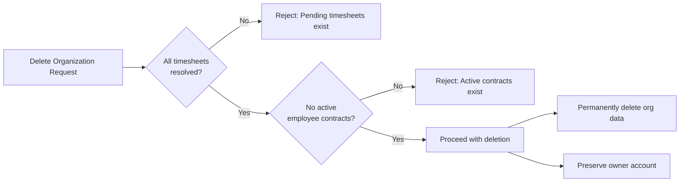
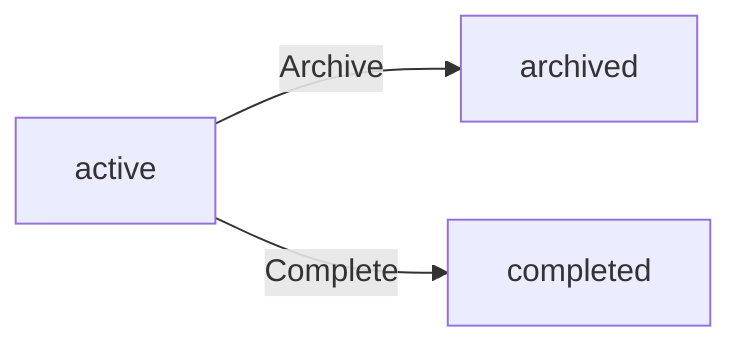
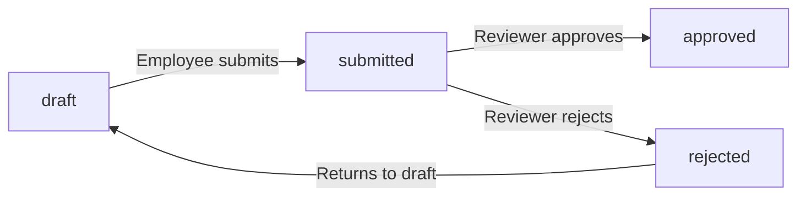

**erpHrm — Business rules, validation constraints, data browsing expectations, error scenarios**

Business rules, validation constraints, data browsing expectations, error scenarios

# Domain Business Rules

Per-concept business rules, validation logic, and domain constraints.

## Organization Rules

An organization must have a name, which is required at the time of creation. The description and logo image are optional fields. Each organization must specify a currency (such as USD, EUR, or KRW) and a timezone, both of which are required configuration values. The fiscal start month is a required setting that determines the beginning of the organization's financial year. Only the organization owner has permission to edit organization settings, including name, description, logo, currency, timezone, and fiscal start month. An organization can only be deleted if all pending timesheets have been resolved (either approved or rejected) and there are no active employee contracts. These two preconditions must both be satisfied before deletion is permitted. The organization's currency and timezone settings apply uniformly to all data within that organization. A user who creates an organization automatically becomes its owner.

### Organization Required and Optional Fields

THE system SHALL require an organization name at the time of creation; a creation request without a name SHALL be rejected.

THE system SHALL require a currency value (such as USD, EUR, or KRW) when creating or saving an organization; a request without a currency SHALL be rejected.

THE system SHALL require a timezone when creating or saving an organization; a request without a timezone SHALL be rejected.

THE system SHALL require a fiscal start month when creating or saving an organization; a request without a fiscal start month SHALL be rejected. The fiscal start month determines the beginning of the organization's financial year and governs how annual financial periods are calculated within the organization.

THE system SHALL treat the organization description as optional; an organization MAY be created or saved without a description.

THE system SHALL treat the logo image as optional; an organization MAY be created or saved without a logo image.

THE system SHALL apply the organization's currency and timezone uniformly to all data and calculations within that organization.

IF an organization's currency or timezone is changed, THEN THE system SHALL apply the updated values to all subsequent data entries and calculations within that organization.

### Organization Ownership and Settings Permissions

WHEN a user creates an organization, THE system SHALL automatically assign that user the Owner role for the newly created organization.

THE system SHALL restrict editing of organization settings — including name, description, logo image, currency, timezone, and fiscal start month — exclusively to users holding the Owner role in that organization.

IF a user without the Owner role attempts to edit organization settings, THEN THE system SHALL reject the request.

THE system SHALL allow only one Owner role assignment per organization at a time; ownership may be transferred by the current Owner to another member.

IF an Owner transfers ownership to another member, THEN THE system SHALL reassign the Owner role to the designated member and demote the previous Owner to a non-Owner role as specified during the transfer.

### Organization Deletion Preconditions

THE system SHALL enforce two preconditions that must both be satisfied before an organization may be deleted:

1. All timesheets within the organization must be in a resolved state — meaning every timesheet must have a status of either approved or rejected. No timesheet may remain in a draft or submitted status.
2. There must be no active employee contracts within the organization. An active contract is defined as one that has a start date on or before the current date and either has no end date or has an end date that is in the future.

IF either precondition is not satisfied at the time of a deletion request, THEN THE system SHALL reject the deletion request and indicate which precondition has not been met.

WHEN both preconditions are satisfied and an organization is deleted, THE system SHALL permanently delete all associated data including employees, departments, projects, tasks, timelogs, timesheets, roles, invitations, and activity logs belonging to that organization.

WHEN an organization is deleted, THE system SHALL preserve the owner's user account and dissociate it from the deleted organization without deleting the account.

IF a user who deletes an organization belongs to other organizations, THEN THE system SHALL retain that user's membership and data in those other organizations.

THE system SHALL restrict the ability to initiate organization deletion exclusively to users holding the Owner role in that organization.

IF a non-Owner attempts to delete an organization, THEN THE system SHALL reject the request.

## User Rules

A user account requires a unique email address and a password. Email addresses must be unique across the entire platform, as they serve as the primary identifier for authentication. Users authenticate using their email and password. A user can belong to multiple organizations simultaneously, each with an independent role and status within each organization. When a user logs in, they must select an active organization context to work within. Users can change their own password. A user who is the sole owner of an organization cannot delete their account until they either transfer ownership to another member or delete the organization entirely. If a user deletes their account, their employee records in organizations where they are not the sole owner are marked as deactivated, preserving historical data. The platform does not support changing a user's email address as stated in the requirements.

### Email Identity and Uniqueness Rules

THE system SHALL treat a user's email address as the primary and sole identifier for authentication across the entire platform.

THE system SHALL enforce that each email address is registered to at most one user account across all organizations.

WHEN a new user attempts to sign up, THE system SHALL reject the registration if the provided email address is already associated with an existing account.

THE system SHALL not allow a user to change their email address after registration.

THE system SHALL use the email address to match pending invitations at the time of sign-up; if a pending invitation exists for the registered email, the user is automatically associated with the inviting organization.

IF a sign-up request is submitted without an email address, THEN THE system SHALL reject the request.

### Password Requirements and Change Rules

THE system SHALL require a password to be provided at the time of account registration; sign-up without a password is not permitted.

THE system SHALL authenticate users using the combination of their email address and password.

IF a login attempt is made with an email address that does not exist in the system, THEN THE system SHALL reject the attempt without revealing whether the email exists.

IF a login attempt is made with an incorrect password, THEN THE system SHALL reject the attempt.

THE system SHALL allow an authenticated user to change their own password.

WHEN a user requests a password change, THE system SHALL require the user to provide their current password before the new password is accepted.

IF the current password provided during a password change request does not match the stored credential, THEN THE system SHALL reject the change request.

### Multi-Organization Membership Rules

THE system SHALL allow a single user account to belong to multiple organizations simultaneously.

THE system SHALL maintain an independent role, status, and employee record for the user within each organization they belong to.

WHEN a user belongs to multiple organizations, THE system SHALL require the user to select one organization as the active context upon login before any organization-scoped actions may be performed.

WHILE a user is authenticated, THE system SHALL scope all data access and actions to the currently selected organization context.

THE system SHALL allow a user to switch their active organization context to any other organization they belong to without requiring them to log out and log back in.

IF a user attempts to access data belonging to an organization that is not their currently selected context, THEN THE system SHALL deny the request.

WHEN switching organization context, THE system SHALL apply the user's role and permissions as defined within the newly selected organization.

### Account Deletion Rules

WHEN a user requests to delete their account, THE system SHALL verify that the user is not the sole owner of any organization before proceeding.

IF the user is the sole owner of one or more organizations, THEN THE system SHALL reject the account deletion request until the user either transfers ownership of each such organization to another member or deletes those organizations entirely.

IF the user co-owns an organization with at least one other owner, THEN THE system SHALL allow account deletion to proceed for that organization without requiring ownership transfer.

WHEN a user's account is deleted, THE system SHALL mark the user's employee records in all organizations where they were a non-sole-owner member as deactivated, preserving all historical data including timelogs, timesheets, and contracts associated with those records.

WHEN a user's account is deleted, THE system SHALL not delete any organization, project, task, timelog, or timesheet data that the user contributed to.

IF a user's employee record is marked as deactivated as a result of account deletion, THEN THE system SHALL treat that record as permanently deactivated; the record cannot be reactivated because the underlying user account no longer exists.

WHEN an account deletion is completed, THE system SHALL remove the user's ability to log in or access any organization context.

## UserProfile Rules

Every user has a single global profile that is shared across all organizations they belong to. The profile requires a display name, which is the name visible to other members within any organization. An avatar image is optional and can be uploaded by the user. A phone number is optional on the profile. Because the profile is global, any changes a user makes to their display name, avatar, or phone number are reflected across all organizations immediately. Users can edit their own profile at any time. There is no organization-specific override for a user's profile — the same profile data is presented in every organizational context the user is part of.

### Profile Identity and Required Fields

THE system SHALL maintain exactly one global profile per user account, shared across every organization that user belongs to.

THE system SHALL require a display name on every user profile.

IF a user attempts to save their profile without providing a display name, THEN THE system SHALL reject the request.

THE system SHALL allow an avatar image to be optionally provided on a user profile.

THE system SHALL allow a phone number to be optionally provided on a user profile.

IF a user does not supply an avatar image, THEN THE system SHALL accept the profile without one.

IF a user does not supply a phone number, THEN THE system SHALL accept the profile without one.

### Profile Ownership and Edit Rights

THE system SHALL allow a user to edit their own profile at any time, regardless of which organization context they are currently operating in.

IF a user attempts to edit the profile of another user, THEN THE system SHALL reject the request.

THE system SHALL allow a user to update their display name, avatar image, and phone number independently in a single edit operation.

### Global Propagation of Profile Changes

WHEN a user updates any field on their profile, THE system SHALL immediately reflect the updated values across all organizations that user is a member of.

THE system SHALL NOT maintain organization-specific overrides for any profile field; the same display name, avatar image, and phone number are presented in every organizational context.

WHEN a user removes their avatar image or phone number, THE system SHALL propagate the removal across all organizations immediately.

THE system SHALL NOT require a user to update their profile separately per organization.

## OrganizationMember Rules

Each employee record within an organization references a user account and captures organization-specific information about that user. Every employee must be assigned exactly one role within the organization at all times. Employment type is a required field and must be one of: full-time, part-time, contractor, or intern. Department and position/title are optional fields on the employee record. Only users with the employee management permission can edit employee records, including department, position, and employment type. A deactivated employee cannot log time or submit timesheets, but their historical timelogs and timesheets are preserved and remain accessible. Reactivating a deactivated employee restores their ability to log time and submit timesheets. An employee's role assignment can be changed only by users who have the employee management permission. The system does not allow an employee to exist in an organization without a role assignment.

### Role Assignment Constraints

THE system SHALL require that every employee record within an organization is assigned exactly one role at all times.

THE system SHALL NOT allow an employee record to exist in an organization without a role assignment.

WHEN a new employee is added to an organization, THE system SHALL require that a role is selected and assigned before the employee record is created.

WHEN a role reassignment is requested, THE system SHALL require that the requesting user holds the employee management permission (`employee:manage`).

THE system SHALL NOT permit an employee's role to be unset or left empty during a role change — the new role must be specified as part of the same operation.

IF a user attempts to change a role assignment without the employee management permission, THEN THE system SHALL reject the request.

IF a user attempts to remove a role from an employee without supplying a replacement role, THEN THE system SHALL reject the request.

### Required and Optional Fields on Employee Records

THE system SHALL require that employment type is specified when creating an employee record.

THE system SHALL only accept the following values for employment type: full-time, part-time, contractor, or intern. Any other value is invalid.

IF a user attempts to create or update an employee record with an employment type outside the accepted values, THEN THE system SHALL reject the request.

THE system SHALL treat department as an optional field on the employee record. An employee record may exist without any department assignment.

THE system SHALL treat position or title as an optional field on the employee record. An employee record may exist without a position or title.

WHEN a department is deleted from the organization, THE system SHALL set the department field on all affected employee records to empty rather than deleting those employee records.

WHEN an employee record is updated, THE system SHALL allow department and position to be cleared (set to empty) without restriction.

### Edit Permission Requirements

THE system SHALL require the employee management permission (`employee:manage`) for any user who edits an employee record.

Editable fields on an employee record include: department, position or title, and employment type.

IF a user without the employee management permission attempts to edit any field on an employee record (other than their own profile, which is governed separately), THEN THE system SHALL reject the request.

WHEN a user with the employee management permission edits an employee record, THE system SHALL apply the changes immediately.

THE system SHALL NOT allow an employee to edit their own organization-specific record fields (department, position, employment type, or role) without holding the employee management permission.

### Deactivation Rules and Restrictions

THE system SHALL require the employee management permission (`employee:manage`) to deactivate an employee.

WHEN an employee is deactivated, THE system SHALL immediately prevent that employee from creating new timelogs.

WHEN an employee is deactivated, THE system SHALL immediately prevent that employee from submitting timesheets.

WHILE an employee is in the deactivated status, THE system SHALL NOT allow any timelog to be created on their behalf, including by users with the time management permission.

WHILE an employee is in the deactivated status, THE system SHALL NOT allow any timesheet to be submitted on their behalf.

IF a deactivated employee attempts to start a timer, THE system SHALL reject the request.

WHEN an employee is deactivated, THE system SHALL preserve all existing timelogs, timesheets, and contracts associated with that employee. No historical data is deleted upon deactivation.

WHILE an employee is deactivated, THE system SHALL continue to display their historical timelogs and timesheets to users who have the appropriate view permissions.

THE system SHALL NOT allow deactivating the sole owner of the organization through the employee deactivation flow — ownership must be transferred first.

### Reactivation Rules

THE system SHALL require the employee management permission (`employee:manage`) to reactivate a deactivated employee.

WHEN a deactivated employee is reactivated, THE system SHALL restore their ability to create timelogs and submit timesheets.

WHEN a deactivated employee is reactivated, THE system SHALL retain all previously preserved historical data (timelogs, timesheets, contracts) without modification.

WHEN a deactivated employee is reactivated, THE system SHALL reinstate their existing role assignment in the organization. The role is not changed or reset during reactivation.

IF a user without the employee management permission attempts to reactivate a deactivated employee, THEN THE system SHALL reject the request.

## Role Rules

Each organization has three built-in roles — Owner, Manager, and Employee — which cannot be deleted or renamed. The Owner role grants full access to all features, including the ability to manage roles and members. The Manager role permits managing employees and projects, approving timesheets, and viewing reports. The Employee role is restricted to tracking time, submitting timesheets, and viewing one's own data. Organization owners can create custom roles with a name and a specific set of permissions drawn from the defined permission codes. The available permissions are: org:manage, employee:manage, employee:view, project:manage, project:view, time:manage, time:approve, time:view_all, and report:view. A custom role can only be deleted if no employees are currently assigned to it. Each employee in an organization holds exactly one role at any given time. Role assignments can only be changed by users with the employee management permission. Custom roles can be edited by the organization owner.

### Built-In Role Constraints

THE system SHALL maintain exactly three built-in roles in every organization: Owner, Manager, and Employee.

THE system SHALL prevent any user from deleting the Owner, Manager, or Employee built-in roles.

THE system SHALL prevent any user from renaming the Owner, Manager, or Employee built-in roles.

THE system SHALL grant the Owner role full access to all features of the organization, including the ability to manage roles, members, and organization settings.

THE system SHALL grant the Manager role the ability to manage employees, manage projects, approve or reject timesheets, and view organization reports.

THE system SHALL restrict the Employee role to tracking time, submitting timesheets, and viewing only the employee's own data.

WHEN an organization is created, THE system SHALL automatically create the three built-in roles (Owner, Manager, Employee) for that organization.

IF a request is made to delete a built-in role, THEN THE system SHALL reject the request regardless of the requester's permissions.

### Custom Role Creation and Permission Assignment

THE system SHALL allow only organization owners to create custom roles within their organization.

THE system SHALL require that every custom role has a name upon creation.

THE system SHALL require that every custom role is assigned at least one permission from the defined set of permission codes.

THE system SHALL restrict the available permission codes for custom roles to the following set:

- **org:manage** — edit organization settings
- **employee:manage** — add, edit, and deactivate employees
- **employee:view** — view the employee list and employee details
- **project:manage** — create, edit, and delete projects and tasks
- **project:view** — view projects and tasks
- **time:manage** — edit or delete any employee's timelogs
- **time:approve** — approve or reject timesheets
- **time:view_all** — view all employees' timelogs and timesheets
- **report:view** — view organization reports

IF a request to create a custom role includes a permission code that is not in the defined set, THEN THE system SHALL reject the request.

IF a request to create a custom role is made by a user who is not the organization owner, THEN THE system SHALL reject the request.

THE system SHALL allow organization owners to edit the name and permission set of any existing custom role within their organization.

WHEN a custom role's permission set is updated, THE system SHALL apply the updated permissions to all employees currently assigned to that role immediately.

### Custom Role Deletion and Employee Role Assignment

THE system SHALL allow a custom role to be deleted only if no employees are currently assigned to that role.

IF a request to delete a custom role is made while one or more employees are assigned to it, THEN THE system SHALL reject the deletion request.

THE system SHALL ensure that each employee in an organization holds exactly one role at any given time.

THE system SHALL not allow an employee to be assigned more than one role simultaneously within the same organization.

THE system SHALL not allow an employee to have no role assigned within an organization.

WHEN an employee is added to an organization, THE system SHALL require that a role be assigned to the employee at the time of addition.

THE system SHALL allow role reassignment for an employee only if the requesting user has the employee management permission (employee:manage).

IF a user without the employee management permission attempts to change another employee's role, THEN THE system SHALL reject the request.

WHEN an employee's role is changed, THE system SHALL immediately apply the permissions associated with the new role to that employee's subsequent actions.

WHEN an employee's role is changed, THE system SHALL record the change in the activity log as defined in the Activity Log rules.

## Invitation Rules

Invitations are sent by email and require the employee management permission to issue. If the invited email already corresponds to an existing user account, the user is added to the organization immediately. If the invited email has no associated account, a pending invitation record is created for that email address. When a new user signs up with an email address that matches a pending invitation, they are automatically added to the organizations that have pending invitations for that email. An invitation is tied to a specific email address and organization. The invitation status transitions from pending to accepted once the user joins the organization. The invited user must be assigned a role upon joining the organization.

### Invitation Permission and Issuance

THE system SHALL require the `employee:manage` permission to send an invitation to join an organization.

THE system SHALL send an invitation by specifying the target email address; no other contact method is used.

THE system SHALL associate each invitation with exactly one organization, so that accepting an invitation grants membership only in that specific organization.

IF a user without `employee:manage` permission attempts to issue an invitation, THEN THE system SHALL reject the request.

IF the email address being invited already belongs to an active member of the same organization, THEN THE system SHALL reject the invitation request.

### Immediate Addition for Existing Accounts

WHEN an invitation is issued and the provided email address matches an existing user account, THE system SHALL immediately add that user to the organization without creating a pending invitation record.

WHEN a user is immediately added to an organization via invitation, THE system SHALL assign them a role at the time of invitation issuance.

IF no role is specified when issuing an invitation to an existing user, THEN THE system SHALL reject the invitation request.

WHEN an existing user is added immediately upon invitation, THE system SHALL record an activity log entry for the employee being invited, as defined in the ActivityLog Rules.

### Pending Invitation for Unregistered Email

WHEN an invitation is issued and the provided email address does not match any existing user account, THE system SHALL create a pending invitation record for that email address and organization.

THE system SHALL retain a pending invitation record until the invited user signs up and joins the organization, at which point the record transitions to accepted status.

IF a pending invitation already exists for the same email address and organization, THEN THE system SHALL reject a duplicate invitation request for that same email and organization combination.

THE invitation status SHALL be either pending (awaiting user sign-up or acceptance) or accepted (user has joined the organization).

Pending invitation records SHALL NOT grant any access or permissions to the platform until the invited user completes sign-up.

### Auto-Join on Sign-Up for Pending Invitations

WHEN a new user completes sign-up with an email address that matches one or more pending invitation records, THE system SHALL automatically add the new user to all organizations that have pending invitations for that email address.

WHEN auto-join is triggered upon sign-up, THE system SHALL transition the matching pending invitation status from pending to accepted.

WHEN auto-join is triggered, THE system SHALL assign the new user the role that was designated at the time the invitation was issued.

IF the role designated on a pending invitation no longer exists at the time the user signs up, THEN THE system SHALL reject the auto-join for that specific invitation and preserve the pending record for administrator resolution.

THE system SHALL apply auto-join for all matching pending invitations across all organizations, not only the first match found.

### Role Assignment Requirement on Invitation

THE system SHALL require that a role be specified for every invitation, whether the invitee is an existing user or will be a new user.

IF no role is designated for the invitee at the time the invitation is issued, THEN THE system SHALL reject the invitation request.

THE role designated in the invitation SHALL be applied to the resulting organization member record upon the user joining the organization.

IF the designated role does not exist within the inviting organization at the time of invitation, THEN THE system SHALL reject the invitation request.

THE invited user's role assignment within the organization MAY be changed after joining by users with `employee:manage` permission, as defined in the Role Rules.

## Department Rules

Each department belongs to a single organization and requires a name. A description is optional. Departments support one level of nesting, meaning a department can have an optional parent department, but a parent department cannot itself have a parent — the hierarchy is limited to a single level of nesting. Creating, editing, and deleting departments requires the org:manage permission. When a department is deleted, employees who were assigned to that department have their department field set to null; the employees themselves are not deleted. Departments are organization-scoped, and all employees within the organization can view the department list.

### Department Field Validation

THE system SHALL require a name when creating or editing a department.

IF a department creation or edit request is submitted without a name, THEN THE system SHALL reject the request.

THE system SHALL accept an optional description for a department.

IF no description is provided when creating a department, THEN THE system SHALL create the department without a description.

THE system SHALL allow a department's description to be updated or cleared at any time by a user with the org:manage permission.

### Department Hierarchy Constraints

THE system SHALL allow a department to optionally reference another department within the same organization as its parent department.

THE system SHALL enforce a maximum of one level of nesting, meaning a department may have a parent department, but that parent department must not itself have a parent.

IF a user attempts to assign a parent department that already has a parent department, THEN THE system SHALL reject the request.

IF a user attempts to assign a department as its own parent, THEN THE system SHALL reject the request.

THE system SHALL restrict parent department selection to departments within the same organization.

### Department Management Permissions

WHEN a user attempts to create a department, THE system SHALL verify the user holds the org:manage permission.

IF a user without the org:manage permission attempts to create a department, THEN THE system SHALL reject the request.

WHEN a user attempts to edit a department's name, description, or parent department, THE system SHALL verify the user holds the org:manage permission.

IF a user without the org:manage permission attempts to edit a department, THEN THE system SHALL reject the request.

WHEN a user attempts to delete a department, THE system SHALL verify the user holds the org:manage permission.

IF a user without the org:manage permission attempts to delete a department, THEN THE system SHALL reject the request.

### Department Deletion Behavior

WHEN a department is deleted, THE system SHALL set the department field of all employees previously assigned to that department to null.

WHEN a department is deleted, THE system SHALL NOT delete the employees who were assigned to that department.

WHEN a department is deleted, THE system SHALL preserve all other employee record data, including role, position, employment type, status, contracts, timelogs, and timesheets.

IF a department that serves as a parent department is deleted, THEN THE system SHALL also set the parent department reference of any child departments to null, leaving those child departments as top-level departments.

THE system SHALL complete the deletion of a department without requiring any employees to be reassigned or transferred beforehand.

### Department Visibility

THE system SHALL allow any employee within the organization to view the list of departments.

THE system SHALL restrict the department list to only departments belonging to the employee's currently selected organization.

WHILE an employee is operating within an organization context, THE system SHALL display only departments that belong to that organization.

IF a user is not authenticated or does not belong to the organization, THEN THE system SHALL deny access to the organization's department list.

## EmployeeContract Rules

Each employee can have multiple contracts, which serve as an immutable historical record of employment terms. Only one contract can be active at a time per employee. A contract requires a start date, a pay rate (numeric value), a pay period (hourly, daily, weekly, or monthly), and working hours per week. The end date is optional; a null end date means the contract is ongoing. When a new contract is created for an employee who already has an active contract, the system automatically sets the previous contract's end date to the day before the new contract's start date. Past contracts (those with an end date in the past) cannot be edited, preserving the integrity of the historical record. Only the current active contract can be edited by users with the employee management permission. Notes on a contract are optional. Employees can view their own contracts, and users with the employee view permission can view any employee's contracts.

### Contract Required Fields and Validation

THE system SHALL require a start date when creating an employee contract.

THE system SHALL require a pay rate when creating an employee contract.

IF the pay rate provided is not a numeric value, THEN THE system SHALL reject the contract creation or edit request.

THE system SHALL require a pay period when creating an employee contract; the accepted values are hourly, daily, weekly, and monthly.

IF a pay period value other than hourly, daily, weekly, or monthly is submitted, THEN THE system SHALL reject the request.

THE system SHALL require working hours per week when creating an employee contract.

IF working hours per week is not provided, THEN THE system SHALL reject the contract creation request.

THE system SHALL treat the end date on a contract as optional; when the end date is null (not set), the contract is considered ongoing with no defined termination date.

THE system SHALL treat notes on a contract as optional; a contract may be created or edited without notes.

### Active Contract Constraint and Auto-Ending

THE system SHALL allow at most one active contract per employee at any given time; a contract is active when its start date is on or before the current date and its end date is either null (ongoing) or on or after the current date.

WHEN a new contract is created for an employee who already has an active contract, THE system SHALL automatically set the previous active contract's end date to the day immediately before the new contract's start date.

IF the new contract's start date is the same as or earlier than the previous active contract's start date, THEN THE system SHALL reject the new contract creation request, as this would produce an invalid or zero-length historical record for the previous contract.

THE system SHALL ensure that after auto-ending a previous contract, the previous contract's end date is always exactly one calendar day before the new contract's start date.

WHEN an employee has no existing active contract, THE system SHALL create the new contract without modifying any prior records.

### Immutability of Past Contracts and Edit Restrictions

THE system SHALL treat all past contracts — those whose end date is set and falls before the current date — as immutable historical records that cannot be modified.

IF a user attempts to edit a past contract, THEN THE system SHALL reject the request regardless of the user's permission level.

THE system SHALL permit editing only of the currently active contract (the contract with a null end date or an end date on or after the current date).

IF an employee has no active contract, THEN THE system SHALL not permit editing any existing contract, as all are part of the immutable historical record.

THE system SHALL preserve the complete, unaltered history of past contracts to maintain the integrity of the employment record.

### Contract Access and Permission Rules

THE system SHALL require the employee management permission to create a contract for any employee.

IF a user without the employee management permission attempts to create a contract, THEN THE system SHALL reject the request.

THE system SHALL require the employee management permission to edit the currently active contract.

IF a user without the employee management permission attempts to edit a contract, THEN THE system SHALL reject the request.

WHILE an employee is viewing their own profile, THE system SHALL allow them to view all of their own contracts, including both active and past contracts.

WHILE a user holds the employee view permission, THE system SHALL allow them to view all contracts — active and historical — belonging to any employee within the organization.

IF a user does not hold the employee view permission and is not the employee whose contracts are being accessed, THEN THE system SHALL deny access to the contract records.

## Project Rules

A project requires a name and a color code for UI display; these are mandatory fields. Description, budget hours, start date, and end date are all optional. A project's status must be one of: active, archived, or completed. Only users with the project management permission can create, edit, archive, complete, or delete projects. Archived and completed projects cannot accept new timelogs, but existing timelogs associated with those projects are preserved. A project can only be deleted if it has no timelogs associated with it. The project list is available to all users with the project view permission. Projects can be filtered by status and the list is paginated.

### Project Field Validation

THE system SHALL require a project name when creating or editing a project.

THE system SHALL require a color code when creating or editing a project, as it is used for UI display purposes.

IF a project creation or edit request does not include a name, THEN THE system SHALL reject the request.

IF a project creation or edit request does not include a color code, THEN THE system SHALL reject the request.

THE system SHALL accept an optional description for a project; if not provided, the description remains empty.

THE system SHALL accept an optional budget hours value for a project; if not provided, the project has no budget constraint.

THE system SHALL accept optional start and end dates for a project; neither field is mandatory.

IF a project is given both a start date and an end date, and the end date is earlier than the start date, THEN THE system SHALL reject the request.

THE system SHALL restrict a project's status to one of three values: active, archived, or completed.

### Project Status Rules

WHEN a project is created, THE system SHALL set its initial status to active.

WHILE a project's status is archived or completed, THE system SHALL reject any attempt to add a new timelog to that project.

WHEN a project is transitioned to archived or completed status, THE system SHALL preserve all existing timelogs associated with that project without modification.

IF an employee attempts to log time against an archived or completed project, THEN THE system SHALL reject the request.

THE system SHALL allow a project to move from active to archived status.

THE system SHALL allow a project to move from active to completed status.

IF a user with project management permission attempts to set a project's status to a value other than active, archived, or completed, THEN THE system SHALL reject the request.

### Project Deletion Rules

THE system SHALL allow deletion of a project only if no timelogs are associated with that project.

IF a user with project management permission attempts to delete a project that has one or more timelogs associated with it, THEN THE system SHALL reject the deletion request.

IF a project is successfully deleted, THE system SHALL permanently remove all project data, including project memberships and tasks, from the organization.

IF a project has tasks but no timelogs, THE system SHALL permit deletion of the project.

### Project Permission Rules

THE system SHALL require the project management permission for a user to create a project.

THE system SHALL require the project management permission for a user to edit a project's name, description, color code, budget hours, start date, or end date.

THE system SHALL require the project management permission for a user to change a project's status to archived or completed.

THE system SHALL require the project management permission for a user to delete a project.

THE system SHALL require the project view permission for a user to access the project list and view project details.

IF a user without the project management permission attempts to create, edit, archive, complete, or delete a project, THEN THE system SHALL reject the request.

IF a user without the project view permission attempts to view the project list or project details, THEN THE system SHALL reject the request.

THE system SHALL enforce that all project operations apply only within the user's currently selected organization context.

### Project List Browsing

THE system SHALL return the project list in paginated form, delivering a defined subset of results per page.

THE system SHALL allow users with the project view permission to filter the project list by status, restricting results to projects with the selected status value (active, archived, or completed).

WHEN no status filter is applied, THE system SHALL include projects of all statuses in the paginated results.

THE system SHALL scope all project list results to the user's currently selected organization, excluding projects from other organizations.

## ProjectMember Rules

An employee can be assigned to multiple projects simultaneously. Each project membership record links an employee to a project and assigns them a project role, which must be either member or project-lead. Only users with the project management permission can assign or remove employees from projects. A project lead has additional authority to manage tasks within their assigned project, including creating and editing tasks. An employee must be a member of a project before they can log time against it or be assigned tasks within it. Employees can view the list of projects they are currently assigned to.

### Project Membership Assignment and Role Rules

THE system SHALL allow an employee to be assigned to multiple projects simultaneously within the same organization.

THE system SHALL enforce that every project membership record carries exactly one project role, which must be either "member" or "project-lead".

IF a project membership is created or updated without specifying a valid project role, THEN THE system SHALL reject the operation.

WHEN a user with the `project:manage` permission assigns an employee to a project, THE system SHALL create a project membership record linking that employee to the project with the designated project role.

IF a user without the `project:manage` permission attempts to assign an employee to a project, THEN THE system SHALL reject the operation.

WHEN a user with the `project:manage` permission removes an employee from a project, THE system SHALL delete the corresponding project membership record.

IF a user without the `project:manage` permission attempts to remove an employee from a project, THEN THE system SHALL reject the operation.

IF an employee is already assigned to a given project, THEN THE system SHALL reject a second assignment attempt for the same employee and project combination.

WHEN an employee is deactivated, THE system SHALL retain their existing project membership records as historical data but prevent them from logging time or being assigned new tasks.

### Project Lead Authority Over Tasks

WHILE an employee holds the "project-lead" role in a project, THE system SHALL permit that employee to create tasks within that project.

WHILE an employee holds the "project-lead" role in a project, THE system SHALL permit that employee to edit any task within that project.

WHILE an employee holds the "project-lead" role in a project, THE system SHALL permit that employee to change the status of any task within that project.

IF an employee is a "member" (not a "project-lead") in a project, THEN THE system SHALL NOT grant that employee task creation or task editing authority based solely on their project membership.

WHERE a user also holds the `project:manage` permission, THE system SHALL grant that user task management authority across all projects regardless of their project-level role.

IF an employee's project role is changed from "project-lead" to "member", THEN THE system SHALL immediately revoke the task management authority derived from the project-lead role for that project.

### Project Membership as Prerequisite for Time Logging and Task Assignment

WHEN an employee attempts to log time against a project, THE system SHALL verify that the employee holds an active project membership for that project.

IF an employee is not a member of the selected project, THEN THE system SHALL reject the timelog creation request.

WHEN an employee attempts to log time and selects a task, THE system SHALL verify that the task belongs to the project already selected for the timelog.

IF the selected task does not belong to the selected project, THEN THE system SHALL reject the timelog creation request.

WHEN a task is being assigned to an employee, THE system SHALL verify that the employee is a member of the project that owns the task.

IF the employee to be assigned to a task is not a project member of that task's project, THEN THE system SHALL reject the task assignment.

WHEN an employee is removed from a project, THE system SHALL retain all timelogs that employee previously logged against that project as immutable historical records.

IF an employee is removed from a project, THEN THE system SHALL prevent that employee from logging further time against that project until they are reassigned.

### Employee Visibility of Own Project Memberships

THE system SHALL allow every employee to view the list of projects they are currently assigned to within the active organization context.

THE system SHALL include the project role (member or project-lead) in each project membership entry visible to the employee.

IF an employee is not assigned to any project, THEN THE system SHALL return an empty membership list for that employee rather than an error.

WHILE an employee is active in the organization, THE system SHALL restrict the employee's project membership view to only the projects they are personally assigned to, unless the employee holds `project:view` or `project:manage` permission which entitles them to view all projects.

IF an employee's membership in a project is removed, THEN THE system SHALL no longer include that project in the employee's project membership list.

## Task Rules

A task requires a title; description, estimated hours, due date, and assigned employee are all optional. Task status must be one of: open, in-progress, completed, or closed. Task priority must be one of: low, medium, high, or urgent. An assigned employee must be a member of the project the task belongs to. Tasks support one level of subtask nesting via a parent task reference; a parent task cannot itself be a subtask. Tasks can only be created within projects by project leads or users with the project management permission. Project leads can edit tasks in their own project, and users with the project management permission can edit any task. Employees can view tasks in projects they are assigned to. Tasks can be filtered by status, priority, and assigned employee, and sorted by due date, priority, or creation date.

### Task Field Validation

THE system SHALL require a title for every task; if the title is absent, the creation or update request SHALL be rejected.

THE system SHALL accept an optional description, optional estimated hours, optional due date, and optional assigned employee on a task.

THE system SHALL enforce that the task status is one of the following values: open, in-progress, completed, or closed. IF a status value outside this set is provided, THEN THE system SHALL reject the request.

THE system SHALL enforce that the task priority is one of the following values: low, medium, high, or urgent. IF a priority value outside this set is provided, THEN THE system SHALL reject the request.

WHEN a task is created, THE system SHALL set its status to open and its priority to the value provided by the creator; if no priority is specified, THE system SHALL default to medium.

IF a due date is provided and estimated hours are provided, THEN THE system SHALL store both values independently without cross-validation between them.

### Assigned Employee Constraint

THE system SHALL require that any employee assigned to a task is an active member of the project the task belongs to.

IF an employee is assigned to a task and that employee is subsequently removed from the project, THEN THE system SHALL retain the existing assignment on the task but SHALL prevent new tasks from being assigned to that employee within the same project until they are re-added as a project member.

IF a request attempts to assign a task to an employee who is not a member of the task's project, THEN THE system SHALL reject the request.

WHEN an employee is deactivated, THE system SHALL preserve their existing task assignments as a historical record but SHALL prevent new tasks from being assigned to that deactivated employee.

### Subtask Nesting Rules

THE system SHALL support one level of subtask nesting by allowing a task to reference another task as its parent.

IF a task already has a parent task (i.e., it is itself a subtask), THEN THE system SHALL reject any request that attempts to set that task as the parent of another task.

IF a request attempts to create or update a task by setting its parent to a task that already has a parent, THEN THE system SHALL reject the request.

THE system SHALL ensure that a task cannot be set as its own parent; IF such a self-referential parent is provided, THEN THE system SHALL reject the request.

WHEN a parent task is deleted, THE system SHALL require that all its subtasks be handled (reassigned or deleted) before the parent can be removed; IF subtasks remain, THE system SHALL reject the deletion of the parent task.

### Task Creation and Edit Permissions

THE system SHALL allow a task to be created within a project only by a user who is a project lead for that project or who holds the project management permission.

IF a user who is neither a project lead for the project nor holds the project management permission attempts to create a task, THEN THE system SHALL reject the request.

THE system SHALL allow a project lead to edit any task that belongs to their own project, including changes to title, description, status, priority, estimated hours, due date, and assigned employee.

THE system SHALL allow a user with the project management permission to edit any task across all projects in the organization.

IF a user attempts to edit a task in a project where they are not a project lead and do not hold the project management permission, THEN THE system SHALL reject the request.

WHEN a task's status is changed, THE system SHALL create a task history entry recording the old status, new status, the timestamp of the change, and the user who made the change, as defined in the TaskHistory rules.

### Task Filtering and Sorting

THE system SHALL allow tasks within a project to be filtered by the following criteria independently or in combination: status (open, in-progress, completed, closed), priority (low, medium, high, urgent), and assigned employee.

IF a filter value for status or priority is not one of the accepted values, THEN THE system SHALL reject the filter request.

THE system SHALL allow tasks within a project to be sorted by the following fields: due date, priority, or creation date. THE system SHALL support both ascending and descending sort order for each field.

WHEN no sort order is specified, THE system SHALL return tasks ordered by creation date in descending order by default.

THE system SHALL allow an employee to view and filter tasks only within projects they are currently assigned to; IF an employee attempts to view tasks in a project they are not a member of, THEN THE system SHALL reject the request.

THE system SHALL allow a user with the project management permission or a project lead to view, filter, and sort tasks across all projects for which they have access.

## TaskHistory Rules

A task history entry is automatically created whenever a task's status changes. Each entry is immutable and records the exact timestamp of the change, the previous status, the new status, and the identity of the user who made the change. Task history entries cannot be manually created, edited, or deleted by any user — they are system-generated records. The history entries provide an auditable trail of status transitions for every task.

### Automatic Creation on Every Status Change

WHEN a task's status changes, THE system SHALL automatically create a task history entry capturing the full context of the transition.

THE system SHALL record the following in every task history entry:
- The exact timestamp at which the status change occurred
- The previous (old) status of the task before the change
- The new status of the task after the change
- The identity of the organization member who triggered the status change

THE system SHALL create a task history entry for every status transition, including transitions initiated by project leads, users with project management permission, or any other authorized actor.

IF a task status update is attempted but fails (e.g., due to a validation error), THE system SHALL NOT create a task history entry for that failed attempt.

THE system SHALL preserve the association between each history entry and the task it belongs to, ensuring the full chronological sequence of status changes is always accessible for that task.

The auditable trail covers all valid status transitions among the statuses: open, in-progress, completed, and closed (as defined in the Task Rules section).

### Immutability and System-Only Generation

THE system SHALL treat all task history entries as immutable records — no field within an existing entry may be modified after the entry has been created.

THE system SHALL prohibit any user, regardless of role or permission level, from manually creating a task history entry. Task history entries are exclusively generated by the system as a side effect of a task status change.

THE system SHALL prohibit any user, regardless of role or permission level, from deleting a task history entry. Entries persist for the lifetime of their parent task.

IF a request is made to manually create, edit, or delete a task history entry, THE system SHALL reject that request.

THE system SHALL ensure the task history serves as a reliable and tamper-proof audit trail of all task status transitions within the organization.

WHILE a task exists, THE system SHALL retain all associated task history entries to guarantee a complete and unbroken record of every status change the task has undergone.

## Timelog Rules

A timelog requires a date, a duration in minutes, and a project. The project must be one the employee is actively assigned to. The task is optional but, if provided, must belong to the selected project. Description is optional. The billable flag defaults to true and must always have a value. Employees can only create timelogs for themselves, not for other employees. An employee can edit their own timelog only if it is not part of an approved timesheet. An employee can delete their own timelog only if it is not part of any submitted or approved timesheet. Users with the time management permission can edit or delete any employee's timelog regardless of timesheet status. Once a timelog is part of an approved timesheet, it is locked and cannot be modified or deleted by the owning employee.

### Timelog Field Validation

THE system SHALL require a date on every timelog; WHEN a timelog is submitted without a date, THE system SHALL reject the request.

THE system SHALL require a duration expressed in whole minutes on every timelog; WHEN a timelog is submitted without a duration, THE system SHALL reject the request; WHEN a timelog is submitted with a duration of zero or a negative value, THE system SHALL reject the request.

THE system SHALL require a project on every timelog; WHEN a timelog is submitted without a project, THE system SHALL reject the request.

WHERE a task is provided on a timelog, THE system SHALL verify that the task belongs to the selected project; IF the provided task does not belong to the selected project, THEN THE system SHALL reject the request.

THE system SHALL set the billable flag to true by default when a new timelog is created without an explicit billable value; THE system SHALL require the billable flag to always carry a value (true or false) and SHALL NOT permit it to be absent or null.

### Timelog Project Assignment Constraint

THE system SHALL require that the project referenced in a timelog is a project to which the creating employee is actively assigned as a project member.

WHEN an employee attempts to create a timelog referencing a project they are not assigned to, THE system SHALL reject the request.

WHEN an employee attempts to create a timelog referencing a project with a status of archived or completed, THE system SHALL reject the request, because archived and completed projects cannot receive new timelogs.

WHILE a task is specified on a timelog, THE system SHALL verify the task belongs to the project selected on the same timelog; IF the task belongs to a different project, THEN THE system SHALL reject the request.

### Timelog Ownership and Self-Logging Rule

THE system SHALL restrict timelog creation so that an employee may only create timelogs that record time for themselves; WHEN an employee attempts to create a timelog on behalf of another employee, THE system SHALL reject the request.

THE system SHALL associate every timelog with the authenticated employee who created it at the time of creation; this association cannot be changed after creation.

IF an employee who is deactivated attempts to create a timelog, THEN THE system SHALL reject the request.

### Employee Edit and Delete Constraints on Own Timelogs

WHEN an employee attempts to edit their own timelog, THE system SHALL verify that the timelog is not part of an approved timesheet; IF the timelog is part of an approved timesheet, THEN THE system SHALL reject the edit request.

WHEN an employee attempts to delete their own timelog, THE system SHALL verify that the timelog is not part of a submitted or approved timesheet; IF the timelog is part of a submitted timesheet, THEN THE system SHALL reject the delete request; IF the timelog is part of an approved timesheet, THEN THE system SHALL reject the delete request.

WHILE a timelog is in draft timesheet status or not yet associated with any timesheet, THE system SHALL allow the owning employee to edit or delete it.

WHEN an employee edits their own timelog that is in a rejected timesheet (which reverts to draft status), THE system SHALL allow the edit because rejected timesheets return to draft status and their timelogs are no longer locked.

### Time Management Permission Override

WHILE a user holds the time management permission (time:manage), THE system SHALL allow that user to edit any employee's timelog regardless of the timelog's current timesheet association status.

WHILE a user holds the time management permission (time:manage), THE system SHALL allow that user to delete any employee's timelog regardless of the timelog's current timesheet association status.

IF a user with time management permission edits or deletes a timelog that is part of an approved timesheet, THE system SHALL permit the operation, overriding the standard employee-level lock.

The time management permission override applies across all employees in the organization; it does not grant cross-organization access.

### Approved Timesheet Lock on Timelogs

WHEN a timesheet is approved, THE system SHALL lock all timelogs included in that timesheet against modification or deletion by the owning employee.

WHILE a timelog is locked due to inclusion in an approved timesheet, THE system SHALL reject any edit or delete attempt made by the owning employee.

IF a timelog is locked, THEN only users with the time management permission may modify or remove it.

THE system SHALL maintain the locked state of a timelog as long as the parent timesheet remains in approved status; the lock is not reversible by the owning employee through normal operations.

## Timesheet Rules

A timesheet covers exactly one calendar week, defined as Monday through Sunday. Each timesheet is owned by a single employee and has a status of draft, submitted, approved, or rejected. A timesheet cannot be submitted if it contains no timelogs. A timesheet cannot be submitted if another timesheet for the same week is already in submitted or approved status for that employee. Only one active timesheet per week per employee is permitted. When a timesheet is approved, all timelogs included in it are locked and cannot be edited or deleted by the owning employee. When a timesheet is rejected, it returns to draft status and the rejection reason (required text) is recorded; the employee may then modify and resubmit it. The total hours on a timesheet are calculated from the sum of durations of included timelogs. Timesheets require the reviewer identity and review timestamp to be recorded when approved or rejected. Users with the time approval permission can approve or reject submitted timesheets.

### Timesheet Week Definition and Uniqueness

THE system SHALL define each timesheet as covering exactly one calendar week, where the week starts on Monday and ends on the following Sunday.

THE system SHALL associate every timesheet with exactly one employee (the owner) and exactly one calendar week.

THE system SHALL enforce that no more than one active timesheet per calendar week exists per employee at any given time. An active timesheet is one whose status is draft, submitted, or approved.

IF an employee already has a timesheet in draft, submitted, or approved status for a given calendar week, THEN THE system SHALL prevent the creation of a second timesheet for that same week for that employee.

THE system SHALL record the week start date (Monday) and week end date (Sunday) on each timesheet at the time of creation, and these dates SHALL NOT be modifiable after creation.

### Timesheet Status Lifecycle

THE system SHALL maintain a status for each timesheet with the following permitted values: draft, submitted, approved, and rejected.

THE system SHALL set the status of a newly created timesheet to draft.

WHEN an employee submits a draft timesheet, THE system SHALL transition its status from draft to submitted.

WHEN a reviewer approves a submitted timesheet, THE system SHALL transition its status from submitted to approved.

WHEN a reviewer rejects a submitted timesheet, THE system SHALL transition its status from submitted to rejected.

WHEN a timesheet is rejected, THE system SHALL return its status to draft, allowing the employee to modify and resubmit it.

THE system SHALL NOT permit status transitions outside the defined lifecycle (e.g., a draft timesheet cannot be directly approved, nor can an approved timesheet be reverted to draft).

### Submission Validation Rules

WHEN an employee attempts to submit a timesheet, THE system SHALL verify that the timesheet contains at least one timelog. IF the timesheet contains no timelogs, THEN THE system SHALL reject the submission.

WHEN an employee attempts to submit a timesheet, THE system SHALL check whether another timesheet for the same calendar week and the same employee already has a status of submitted or approved. IF such a timesheet exists, THEN THE system SHALL reject the submission.

THE system SHALL only permit an employee to submit their own timesheet; employees cannot submit timesheets on behalf of other employees.

IF a timelog included in a draft timesheet belongs to a week other than the timesheet's defined week, THEN THE system SHALL reject the submission.

WHILE a timesheet is in submitted status, THE system SHALL prevent the employee from adding or removing timelogs from it.

### Approval and Rejection Rules

THE system SHALL require that only users with the time approval permission can approve or reject submitted timesheets.

WHEN a reviewer approves a submitted timesheet, THE system SHALL record the identity of the reviewer and the timestamp of the approval on the timesheet.

WHEN a reviewer rejects a submitted timesheet, THE system SHALL record the identity of the reviewer and the timestamp of the rejection on the timesheet.

WHEN a reviewer rejects a submitted timesheet, THE system SHALL require a rejection reason (a non-empty text explanation). IF a rejection reason is not provided, THEN THE system SHALL prevent the rejection from being recorded.

THE system SHALL store the rejection reason on the timesheet so the employee can view the reason for rejection.

WHEN a timesheet is rejected and returned to draft status, THE system SHALL permit the employee to modify the timesheet's timelogs and resubmit it.

IF a timesheet is not in submitted status, THEN THE system SHALL prevent any approval or rejection action from being applied to it.

### Timelog Locking and Total Hours Calculation

WHEN a timesheet is approved, THE system SHALL lock all timelogs included in that timesheet. Locked timelogs cannot be edited or deleted by the owning employee.

WHILE a timelog is locked due to inclusion in an approved timesheet, THE system SHALL prevent the employee who owns the timelog from editing or deleting it, even if the timelog is viewed or accessed outside the timesheet context.

Users with the time management permission remain able to edit or delete locked timelogs on behalf of the organization, but this does not affect the approved timesheet status.

THE system SHALL calculate the total hours displayed on a timesheet as the sum of the durations of all timelogs included in that timesheet. This value SHALL be updated automatically whenever a timelog is added to or removed from the timesheet while it is in draft status.

THE system SHALL express total hours as derived from duration values stored in minutes, converting to hours for display purposes.

IF a timelog is removed from a draft timesheet, THE system SHALL recalculate and update the timesheet's total hours accordingly.

THE system SHALL NOT allow a timelog that is part of an approved timesheet to be removed from that timesheet.

## Timer Rules

Each employee can have at most one active timer running at any given time. Starting a timer requires selecting a project; the task is optional. The timer records the start timestamp, selected project, optional task, and an optional description. When an employee stops their timer, a timelog is automatically created using the calculated duration rounded to the nearest minute. If an employee discards the timer, no timelog is created. An employee can edit the description and the project or task of a running timer without stopping it. The timer runs indefinitely if the employee does not stop it — there is no automatic timeout or stop mechanism. Employees can only manage their own timer.

### Timer Activation Constraints

Each employee is permitted to have at most one active timer running at any given time. If an employee already has an active timer, they cannot start a second timer until the existing one is stopped or discarded.

Starting a timer requires the employee to select a project. The selected project must be one to which the employee is currently assigned. A timer cannot be started without a valid project selection.

Selecting a task when starting a timer is optional. If a task is provided, it must belong to the project selected for the timer. A task that does not belong to the selected project cannot be associated with the timer.

When a timer is started, the system records the exact start timestamp. This timestamp is used to calculate the duration when the timer is later stopped. The start timestamp is set at the moment the employee initiates the timer and cannot be modified after the timer has begun.

### Timer Stop and Discard Behavior

When an employee stops their active timer, the system automatically creates a timelog on their behalf. The timelog uses the duration calculated from the start timestamp to the stop timestamp. This calculated duration is rounded to the nearest minute — for example, a duration of 7 minutes and 29 seconds rounds down to 7 minutes, while a duration of 7 minutes and 30 seconds rounds up to 8 minutes.

The automatically created timelog inherits the project, task (if any), and description from the timer at the moment it was stopped. The timelog is created as a regular timelog associated with the employee and is subject to all standard timelog rules (defined in the Timelog Rules section).

When an employee discards their active timer, no timelog is created. All recorded information from that timer session — including the start timestamp, project, task, and description — is permanently discarded. The discard action cannot be undone.

If an employee stops or discards a timer that is not currently running, the request is rejected.

### In-Flight Timer Editing and Lifecycle

An employee may update the description or the associated project and task of their active running timer without stopping it. Changing the project on a running timer requires the new project to be one the employee is assigned to. If a new project is selected, any previously selected task is cleared unless the task also belongs to the new project. If a task is provided during editing, it must belong to the currently selected project.

The timer runs indefinitely from the moment it is started. There is no automatic timeout, automatic stop, or system-enforced duration limit. The timer continues running until the employee explicitly stops or discards it.

An employee can only manage their own timer. An employee cannot start, stop, discard, or edit another employee's timer. Users with time management permission can edit or delete timelogs that have already been created from timers, but they cannot directly operate another employee's active timer.

## ActivityLog Rules

Activity log entries are system-generated and cannot be created, edited, or deleted by any user. Each entry records a timestamp, the user who performed the action, the action type, the target entity, and additional details about the action. The defined action types that must be logged include: employee invited, employee deactivated, employee reactivated, contract created, contract edited, project created, project archived, project completed, project deleted, task status changed, timesheet submitted, timesheet approved, timesheet rejected, role assigned, and role changed. Only users with the org:manage permission can view the full activity log. The activity log is paginated and can be filtered by action type, user, and date range.

### System-Generated and Immutable Entries

THE system SHALL generate activity log entries automatically whenever a qualifying action occurs within an organization.

THE system SHALL NOT allow any user — regardless of role or permission — to manually create, edit, or delete an activity log entry.

THE system SHALL record each activity log entry with the following fields at the moment the action occurs:
- **Timestamp**: the exact date and time the action took place
- **Actor**: the organization member who performed the action
- **Action type**: a defined code identifying what happened (see Defined Loggable Actions below)
- **Target entity**: the specific entity affected by the action (e.g., the employee record, the project, or the timesheet)
- **Details**: additional context about the action relevant to the action type

IF an activity log entry fails to be recorded due to a system error, THEN THE system SHALL NOT silently suppress the failure — the triggering operation still completes but the logging failure is noted internally.

THE system SHALL preserve all activity log entries permanently for the lifetime of the organization; entries are never automatically purged or overwritten.

### Defined Loggable Actions — Employee and Contract

THE system SHALL create an activity log entry whenever any of the following employee-related or contract-related actions occur:

**Employee actions:**
- **Employee invited**: recorded when an invitation is sent to an email address to join the organization; the target entity is the invitation record, and details include the invited email address.
- **Employee deactivated**: recorded when an active organization member's status is changed to deactivated; the target entity is the organization member record.
- **Employee reactivated**: recorded when a deactivated organization member's status is restored to active; the target entity is the organization member record.

**Contract actions:**
- **Contract created**: recorded when a new employee contract is created for an organization member; the target entity is the newly created contract, and details include the contract start date and pay period.
- **Contract edited**: recorded when the current active contract of an organization member is modified; the target entity is the contract record, and details capture which fields were changed.

IF any of the above actions are performed, THEN THE system SHALL generate the corresponding log entry within the same operation, so the log reflects the true history of each employee's lifecycle and compensation.

### Defined Loggable Actions — Project, Task, Timesheet, and Role

THE system SHALL create an activity log entry whenever any of the following project, task, timesheet, or role-related actions occur:

**Project actions:**
- **Project created**: recorded when a new project is added to the organization; the target entity is the project, and details include the project name.
- **Project archived**: recorded when a project's status is changed to archived; the target entity is the project.
- **Project completed**: recorded when a project's status is changed to completed; the target entity is the project.
- **Project deleted**: recorded when a project is permanently removed from the organization; the target entity is identified by the project name at the time of deletion.

**Task actions:**
- **Task status changed**: recorded whenever a task's status transitions from one state to another (e.g., open → in-progress, in-progress → completed); the target entity is the task, and details include the old status and the new status.

**Timesheet actions:**
- **Timesheet submitted**: recorded when an employee submits a draft timesheet for approval; the target entity is the timesheet, and details include the covered week.
- **Timesheet approved**: recorded when a user with time approval permission approves a submitted timesheet; the target entity is the timesheet.
- **Timesheet rejected**: recorded when a user with time approval permission rejects a submitted timesheet; the target entity is the timesheet, and details include the rejection reason.

**Role actions:**
- **Role assigned**: recorded when an organization member is assigned a role for the first time upon joining or when initially set; the target entity is the organization member record, and details include the assigned role name.
- **Role changed**: recorded when an organization member's existing role is changed to a different role; the target entity is the organization member record, and details include the previous role name and the new role name.

IF any of the above actions are performed, THEN THE system SHALL generate the corresponding log entry as part of the same operation to ensure completeness and accuracy of the audit trail.

### Access, Pagination, and Filtering Rules

WHILE a user does not have the `org:manage` permission in the current organization context, THE system SHALL deny access to the organization's activity log and return an appropriate rejection.

WHEN a user with `org:manage` permission requests the activity log, THE system SHALL return entries belonging exclusively to the currently selected organization, enforcing data isolation.

THE system SHALL paginate activity log results, returning a fixed number of entries per page and providing navigation to subsequent pages.

THE system SHALL support filtering the activity log by the following criteria, individually or in combination:
- **Action type**: limits results to entries of a specific action type (e.g., only "timesheet approved" entries)
- **Actor (user)**: limits results to entries where the specified organization member performed the action
- **Date range**: limits results to entries whose timestamp falls within a specified start date and end date (inclusive)

IF a filter combination produces no matching entries, THEN THE system SHALL return an empty result set rather than an error.

THE system SHALL return activity log entries in reverse chronological order by default (most recent first).

IF a requested page number exceeds the total number of available pages given the current filters, THEN THE system SHALL return an empty result set for that page rather than an error.

# Data Browsing Expectations

Business expectations for how users browse, find, and navigate through lists of data.

## List Browsing Expectations

Define business expectations for how users find, filter, and browse lists.

### Pagination Expectations

THE system SHALL paginate all list views so that large data sets are returned in discrete pages rather than all at once.

THE system SHALL apply pagination to the following lists: employee list, employee contract list, project list, task list, timelog list, timesheet list, and activity log list.

WHEN a user requests a paginated list, THE system SHALL return a consistent page of results along with the total count of matching records, enabling the user to determine how many pages exist.

THE system SHALL allow the user to specify which page to retrieve and how many records to include per page.

WHEN no page or page-size preference is specified, THE system SHALL apply a default page size so that the response remains bounded.

THE system SHALL preserve the current filter and sort context across page navigations so that moving to the next page does not reset the user's search criteria.

IF the requested page number exceeds the total number of available pages, THEN THE system SHALL return an empty result set rather than an error.

### Filtering Expectations

THE system SHALL support filtering on each list view according to the filter dimensions defined for that entity.

**Employee List Filtering**
THE system SHALL allow the employee list to be filtered by department, employment type (full-time, part-time, contractor, intern), and status (active, deactivated).
THE system SHALL allow the employee list to be searched by the employee's display name as a free-text search.
WHEN multiple filters are applied simultaneously, THE system SHALL return only employees that satisfy all active filter conditions.

**Project List Filtering**
THE system SHALL allow the project list to be filtered by project status (active, archived, completed).
WHEN no status filter is specified, THE system SHALL return projects of all statuses.

**Task List Filtering**
THE system SHALL allow the task list to be filtered by status (open, in-progress, completed, closed), priority (low, medium, high, urgent), and assigned employee.
WHEN multiple task filters are combined, THE system SHALL return only tasks satisfying all applied conditions.

**Timelog List Filtering**
THE system SHALL allow the timelog list to be filtered by date range, project, task, and billable status.
WHEN a date range filter is applied, THE system SHALL include only timelogs whose date falls within the specified start and end dates (inclusive).

**Timesheet List Filtering**
THE system SHALL allow the timesheet list to be filtered by status (draft, submitted, approved, rejected) and date range based on the timesheet's week.

**Activity Log Filtering**
THE system SHALL allow the activity log to be filtered by action type, the user who performed the action, and date range.
WHEN a date range filter is applied to the activity log, THE system SHALL include only entries whose timestamp falls within the specified range.

**Report Filtering**
THE Time Report SHALL support filtering by date range, employee, project, and billable status.
THE Weekly Summary Report SHALL support filtering by project.
IF a filter value references an entity that does not exist or is not accessible to the user, THEN THE system SHALL reject the filter and inform the user that the filter value is invalid.

### Sorting Expectations

THE system SHALL support sorting on list views according to the sort dimensions defined for each entity.

**Task List Sorting**
THE system SHALL allow tasks to be sorted by due date, priority, and creation date.
WHEN sorting by priority, THE system SHALL order tasks from highest priority (urgent) to lowest (low) in descending order, and from lowest to highest in ascending order.
WHEN sorting by due date, tasks without a due date SHALL be placed at the end of the sorted result regardless of sort direction.

**Timelog List Sorting**
THE system SHALL present timelogs in a consistent order, with the most recently dated timelogs appearing first by default.

**Timesheet List Sorting**
THE system SHALL present timesheets ordered by week start date, with the most recent week appearing first by default.

**Activity Log Sorting**
THE system SHALL present activity log entries ordered by timestamp, with the most recent entries appearing first.

**Employee List Sorting**
THE system SHALL present the employee list in a consistent default order (by display name) when no explicit sort is requested.

WHEN a user applies a sort, THE system SHALL maintain that sort order across all pages of results.
IF no explicit sort order is provided by the user, THE system SHALL apply a defined default sort order for that list so that results remain predictable and consistent across requests.

# Error Conditions

Business error scenarios and how the system should respond.

## Error Scenarios

Describe error conditions and expected system responses in natural language.

### Authentication and Account Error Scenarios

If a user attempts to log in with an email that does not exist in the system, the request is rejected and no indication is given as to whether the email or the password is incorrect.

If a user attempts to log in with a correct email but an incorrect password, the request is rejected.

If a user attempts to sign up with an email address already registered in the system, the request is rejected.

If a user attempts to delete their account while they are the sole owner of one or more organizations, the request is rejected. The user must either transfer ownership to another member or delete those organizations before account deletion can proceed.

If a user attempts to change their password but provides an incorrect current password, the request is rejected.

If a user who has been deactivated as an employee in an organization attempts to perform employee-restricted actions (logging time, submitting timesheets) within that organization, the request is rejected.

### Organization and Membership Error Scenarios

If a user attempts to delete an organization that still has one or more timesheets in submitted (pending) status, the request is rejected. All pending timesheets must be resolved — either approved or rejected — before the organization can be deleted.

If a user attempts to delete an organization that has one or more employees with active contracts (no end date), the request is rejected. All active contracts must be terminated before deletion can proceed.

If a user without the `org:manage` permission attempts to edit organization settings, the request is rejected.

If a user without the `employee:manage` permission attempts to invite, edit, deactivate, or reactivate an employee, the request is rejected.

If a user without the `employee:view` permission attempts to view the employee list or employee details, the request is rejected.

If a user attempts to delete a built-in role (Owner, Manager, or Employee), the request is rejected regardless of the requester's permissions.

If a user attempts to delete a custom role that is currently assigned to one or more employees, the request is rejected. The role must first be reassigned or employees must be moved to another role.

If a user attempts to assign an employee to a role using a role that does not belong to the same organization, the request is rejected.

If a user without `employee:manage` permission attempts to change an employee's role assignment, the request is rejected.

### Department and Contract Error Scenarios

If a user without `org:manage` permission attempts to create, edit, or delete a department, the request is rejected.

If a user attempts to set a department's parent to a department that already has a parent (i.e., the parent is itself a child department), the request is rejected. Only one level of nesting is allowed.

If a user attempts to create an employee contract with a start date that overlaps or conflicts with the current active contract in a way that would violate data integrity, the system automatically ends the previous contract on the day before the new contract's start date. If the new contract's start date is earlier than or equal to the previous contract's start date, the request is rejected.

If a user attempts to edit a past (historical) contract that is no longer active, the request is rejected. Only the currently active contract may be edited.

If a user without `employee:manage` permission attempts to create or edit a contract, the request is rejected.

If an employee attempts to view another employee's contracts without the `employee:view` permission, the request is rejected.

### Project and Task Error Scenarios

If a user without `project:manage` permission attempts to create, edit, archive, complete, or delete a project, the request is rejected.

If a user attempts to delete a project that has one or more timelogs associated with it, the request is rejected. The project must have no recorded timelogs before it can be deleted.

If a user attempts to create a timelog on an archived or completed project, the request is rejected.

If a user without `project:manage` permission (and who is not a project lead for the relevant project) attempts to create or edit a task, the request is rejected.

If a user attempts to assign a task to an employee who is not a member of the project the task belongs to, the request is rejected.

If a user attempts to assign a task a parent task that already has a parent (i.e., creating a second level of nesting), the request is rejected. Only one level of subtasks is allowed.

If a user without `project:view` permission attempts to view the project list or project details, the request is rejected.

If a user attempts to assign a project member to a project using a project role value other than "member" or "project-lead", the request is rejected.

### Timelog Error Scenarios

If an employee attempts to create a timelog for a project they are not assigned to, the request is rejected.

If an employee attempts to create a timelog with a task that does not belong to the selected project, the request is rejected.

If an employee attempts to create a timelog on behalf of another employee (i.e., specifying a different employee as the owner), the request is rejected. Employees may only log time for themselves. Users with `time:manage` permission may edit existing timelogs for any employee but may not create timelogs on behalf of others.

If an employee attempts to edit their own timelog that is already part of an approved timesheet, the request is rejected. Approved timesheets lock all associated timelogs.

If an employee attempts to delete their own timelog that is already part of a submitted or approved timesheet, the request is rejected.

If a deactivated employee attempts to create or edit a timelog, the request is rejected.

If a user without `time:view_all` permission attempts to view another employee's timelogs, the request is rejected.

If a user without `time:manage` permission attempts to edit or delete another employee's timelog, the request is rejected.

### Timesheet Submission and Approval Error Scenarios

If an employee attempts to submit a timesheet that contains no timelogs, the request is rejected. A timesheet must include at least one timelog before it can be submitted.

If an employee attempts to submit a timesheet for a week that already has another timesheet in submitted or approved status for the same employee, the request is rejected. Only one non-draft timesheet per employee per week is permitted.

If a user without `time:approve` permission attempts to approve or reject a timesheet, the request is rejected.

If a user with `time:approve` permission attempts to approve a timesheet that is not in submitted status (e.g., it is still a draft, already approved, or already rejected), the request is rejected.

If a user attempts to reject a timesheet without providing a rejection reason, the request is rejected. A written reason is required for all rejections.

If an employee attempts to resubmit a timesheet that has not been rejected (i.e., it is in submitted or approved status), the request is rejected.

If an employee attempts to add or remove timelogs from a timesheet that is not in draft status, the request is rejected. Only draft timesheets can be modified.

If a deactivated employee attempts to submit a timesheet, the request is rejected.

### Timer Error Scenarios

If an employee attempts to start a new timer while they already have an active timer running, the request is rejected. Each employee can have at most one active timer at a time.

If an employee attempts to start a timer without selecting a project, the request is rejected. A project is required to start a timer.

If an employee attempts to start a timer for a project they are not assigned to, the request is rejected.

If an employee attempts to stop or discard a timer when they have no active timer, the request is rejected.

If an employee attempts to update the project or task on a running timer to a project they are not assigned to, the request is rejected.

If an employee attempts to update the task on a running timer to a task that does not belong to the currently selected project, the request is rejected.

If a deactivated employee attempts to start a timer, the request is rejected.

### Report and Activity Log Access Error Scenarios

If a user without `report:view` permission attempts to access any organization report (Time Report, Project Budget Report, or Weekly Summary Report), the request is rejected.

If a user without `org:manage` permission attempts to view the activity log, the request is rejected.

If a user attempts to access reports or activity log data belonging to an organization they are not a member of, the request is rejected.

If a user attempts to access data from an organization that is not their currently selected organization context, the request is rejected. All data access is strictly scoped to the active organization context.

If a user attempts to view the Project Budget Report and a project has no budget hours set, that project is excluded from the report rather than causing an error. No failure is reported; the project is silently omitted from the results.

### Data Isolation and Cross-Organization Access Failures

If an employee attempts to reference an entity (project, department, role, task, employee) that belongs to a different organization, the request is rejected as if the entity does not exist.

If a user switches organization context and attempts to perform an action referencing an entity from their previously selected organization, the request is rejected.

If a user who belongs to multiple organizations attempts to access data without a valid organization context selected, the request is rejected.

If a request is made to access or modify organization data but the requesting user is not a member of that organization, the request is rejected and the organization's existence is not confirmed or denied.

# File Validation Rules

Validation rules and policies for file uploads and storage.

## File Validation and Policies

Define file type restrictions, virus scanning requirements, content validation, and retention policies for uploaded files.

### File Upload Contexts

File uploads in the platform are limited to two specific contexts:

- **Organization logo**: An optional image file attached to an organization's profile, uploaded by users with `org:manage` permission.
- **User avatar**: An optional image file attached to a user's global profile, uploaded by the user themselves.

No other entities in the platform accept file attachments. All file uploads are associated with their owning entity — either an organization or a user — and are replaced when a new file is uploaded in the same context. Only one file may be stored per upload context at any time; uploading a new file replaces the previous one.

### Accepted Content Types and File Validation

Only image files are accepted for both the organization logo and user avatar upload contexts. If a non-image file is submitted, the upload is rejected and the existing file (if any) remains unchanged.

Uploaded files are validated before they are accepted and stored. Validation includes confirming that the file's actual content matches an accepted image format. If the submitted file does not conform to an accepted image format, the request is rejected.

If a file upload request is submitted without a file body, the request is rejected. If a file upload request exceeds the system-permitted size, the request is rejected and the user is informed that the file is too large.

The platform does not accept executable files, archives, documents, or any non-image content in file upload fields. Any upload that does not resolve to a valid image is rejected at intake.

### File Retention and Deletion Policies

File retention is governed by the lifecycle of the owning entity:

- **Organization logo**: The logo file is retained for as long as the organization exists. When an organization is permanently deleted, the associated logo file is also permanently deleted.
- **User avatar**: The avatar file is retained for as long as the user account exists. When a user deletes their account, their avatar file is permanently deleted.

When a user replaces an existing logo or avatar by uploading a new file, the previous file is permanently deleted and replaced by the new one. There is no version history maintained for uploaded files.

Deactivated employees retain access to their user profile and avatar; the avatar file is not deleted upon employee deactivation. The file is only deleted when the user account itself is deleted.

Organization logos are not transferred or retained after organization deletion, even if the owner's user account remains active.