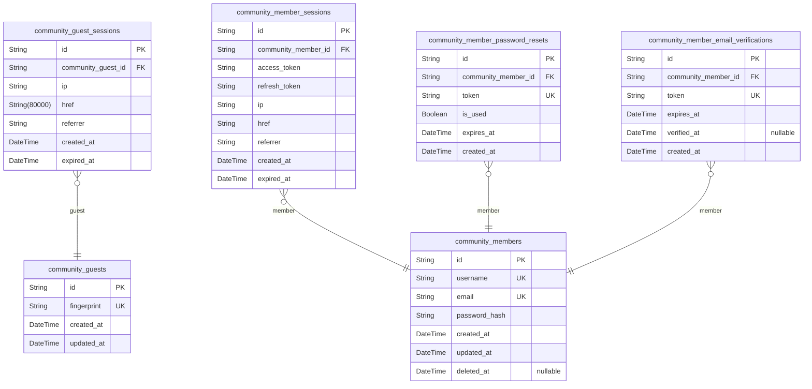
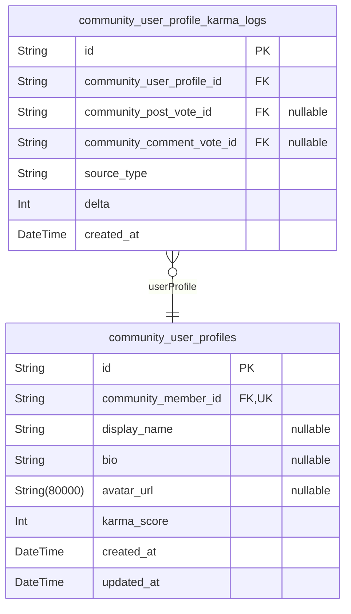
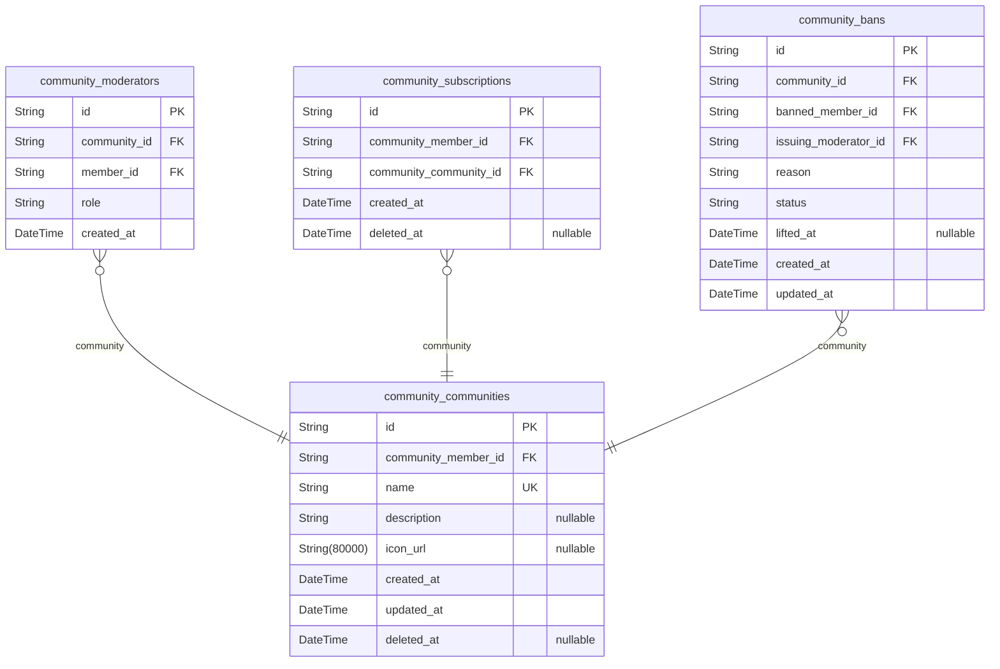
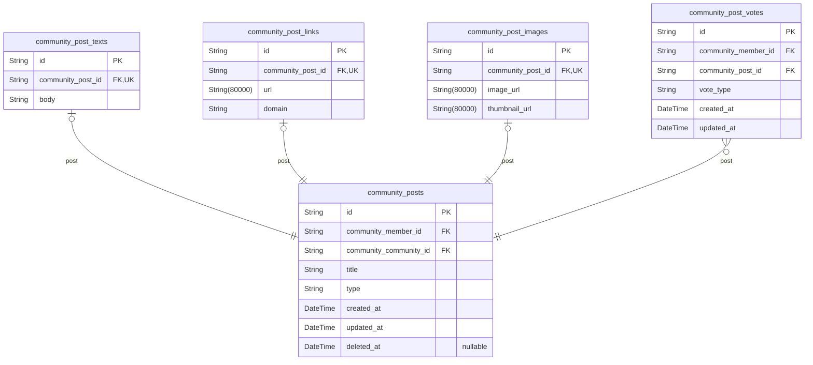
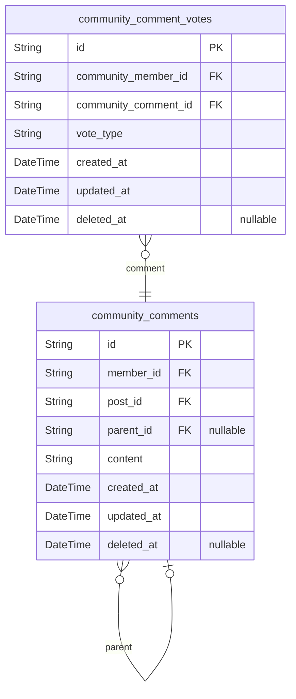
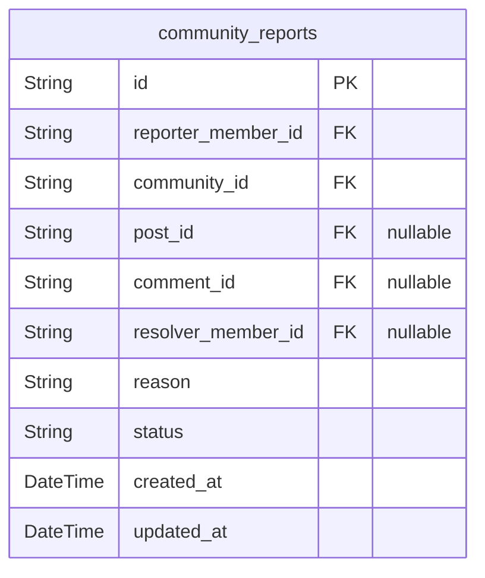

# Prisma Markdown

> Generated by [`prisma-markdown`](https://github.com/samchon/prisma-markdown)

- [Actors](#actors)
- [Profiles](#profiles)
- [Communities](#communities)
- [Posts](#posts)
- [Comments](#comments)
- [Reports](#reports)

## Actors

### `community_guests`

Temporary guest identity records for unauthenticated visitors accessing
the platform.

Each guest record is keyed by a device fingerprint or anonymous
identifier, enabling minimal session continuity for unauthenticated
visitors as they browse public content such as community feeds, posts,
and comments. A guest has no account, no persistent identity, and no
stored preferences — the record exists solely to anchor one or more guest
sessions.

Once a visitor registers and logs in, they transition to a {@link
community_members} record and their guest identity is no longer used.
Guest session tokens are stored in the separate {@link
community_guest_sessions} table.

Properties as follows:

- `id`: Primary Key.
- `fingerprint`
  > Device fingerprint or anonymous identifier that uniquely identifies this
  > guest's browsing context. Used to associate guest sessions with a
  > consistent temporary identity across requests.
- `created_at`: Timestamp when the guest identity record was first created.
- `updated_at`: Timestamp when the guest identity record was last updated.

### `community_guest_sessions`

Session records for guest actors, enabling temporary access tracking for
unauthenticated visitors browsing public content.

Each record captures a short-lived session token issued to a guest, along
with connection metadata (IP address, page URL, referrer) for security
auditing and access tracking purposes. Sessions expire after a defined
period via the `expired_at` timestamp.

This table is append-only — guest sessions are never updated or
soft-deleted. It references [community_guests](#community_guests) as the parent actor
identity.

Properties as follows:

- `id`: Primary Key.
- `community_guest_id`: Belonged guest actor's [community_guests.id](#community_guests).
- `ip`
  > IP address of the client that initiated this guest session. Used for
  > security monitoring and access pattern analysis.
- `href`
  > Full URL of the page the guest was visiting when the session was created.
  > Captures the entry point for the session.
- `referrer`
  > HTTP Referrer header value at the time of session creation, indicating
  > the source from which the guest arrived. May be empty if no referrer was
  > provided.
- `created_at`: Timestamp when this guest session was created.
- `expired_at`
  > Timestamp when this guest session expires. After this point the session
  > token is no longer valid.

### `community_members`

Core identity and authentication record for registered members of the
platform.

Each row represents a unique registered user account with immutable
credentials. The username serves as the public handle and is permanently
fixed at registration. Email is the primary contact and login identifier
and must remain unique across the platform.

This table is the root actor entity; all other domain entities (posts,
comments, votes, subscriptions, bans, reports) reference this table to
associate content with its author or actor. Sessions, password reset
tokens, and email verification tokens are stored in dedicated child
tables that reference this table.

Soft deletion via [community_members.deleted_at](#community_members) preserves
referential integrity while marking accounts as inactive. Deleted
accounts retain their username reservation to prevent re-registration of
the same handle.

Properties as follows:

- `id`: Primary Key.
- `username`
  > Unique, immutable public handle chosen at registration. Used as the
  > display name in content authorship and community contexts. Cannot be
  > changed after account creation.
- `email`
  > Unique email address used for login authentication and account recovery
  > communications. Must be verified via the email verification flow before
  > full platform access is granted.
- `password_hash`
  > Bcrypt or Argon2 hashed representation of the member's password. Never
  > stored in plaintext. Used during login credential validation.
- `created_at`: Timestamp when the member account was created (i.e., registration time).
- `updated_at`
  > Timestamp of the most recent update to this account record (e.g.,
  > password change, email update).
- `deleted_at`
  > Timestamp when the account was soft-deleted. Null indicates the account
  > is active. When set, the member can no longer authenticate or perform any
  > platform actions, but their username and email are retained to prevent
  > re-registration.

### `community_member_sessions`

Stores JWT access and refresh tokens for authenticated member sessions,
supporting persistent login state and secure session lifecycle
management.

Each session record is created upon successful member login and links to
the [community_members](#community_members) actor record. It captures connection
metadata (IP address, request URL, referrer) for security auditing
alongside the issued JWT access and refresh tokens. The `expired_at`
field marks when the session becomes invalid, enabling secure token
lifecycle management and forced logout scenarios.

Properties as follows:

- `id`: Primary Key.
- `community_member_id`
  > The authenticated member who owns this session. References {@link
  > community_members.id}.
- `access_token`
  > JWT access token issued to the member for authenticating API requests.
  > Short-lived credential used in request Authorization headers.
- `refresh_token`
  > JWT refresh token issued alongside the access token, allowing the member
  > to obtain a new access token without re-authenticating. Longer-lived than
  > the access token.
- `ip`
  > IP address of the client at the time of login, recorded for security
  > auditing and anomaly detection.
- `href`
  > Full URL (href) of the page from which the login request was initiated,
  > captured for session context and audit trails.
- `referrer`
  > HTTP Referrer header value at the time of login, providing context about
  > the navigation origin for security auditing.
- `created_at`: Timestamp when this session was created (i.e., when the member logged in).
- `expired_at`
  > Timestamp when this session expires or was explicitly invalidated. Once
  > this time is reached or set to a past value, the session is considered
  > inactive. Not nullable for security enforcement.

### `community_member_password_resets`

Stores time-limited password reset tokens issued to members who have
requested account recovery via their registered email address.

Each record represents a single password reset request. The token is a
cryptographically secure random string sent to the member's email. Tokens
are single-use and expire after a short validity window defined by {@link
expires_at}. Once consumed, [is_used](#is_used) is set to true and the token
cannot be reused.

This table is append-only from the authentication flow perspective;
tokens are never updated after creation, only marked as used. Old tokens
(expired or used) may be cleaned up by a background job but are not
soft-deleted by users.

Properties as follows:

- `id`: Primary Key.
- `community_member_id`
  > The member who requested the password reset. References {@link
  > community_members.id}.
- `token`
  > Cryptographically secure random token sent to the member's email address.
  > Used as a one-time secret to authenticate the password reset request.
  > Must be unique across all active and historical reset records.
- `is_used`
  > Whether this reset token has already been consumed. Set to true
  > immediately after the member successfully uses the token to change their
  > password. Prevents token reuse even if the expiry window has not yet
  > elapsed.
- `expires_at`
  > The datetime after which this token is no longer valid. Tokens must be
  > rejected if the current time is past this value, regardless of the
  > is_used state.
- `created_at`
  > The datetime when the password reset token was issued and the reset email
  > was sent.

### `community_member_email_verifications`

Stores email verification tokens generated during member registration,
ensuring members confirm ownership of their email address before gaining
full platform access.

Each record is linked to a [community_members](#community_members) record and contains
a unique, time-limited token that the member must present (typically via
a link sent to their email) to activate their account. Once verified, the
`verified_at` timestamp is recorded and the token is considered consumed.

Multiple records may exist per member if the member requests re-sending
the verification email after the previous token has expired. Tokens that
are expired and unverified are considered invalid and should not grant
access.

Properties as follows:

- `id`: Primary Key.
- `community_member_id`
  > The member account awaiting email verification. References {@link
  > community_members.id}.
- `token`
  > Unique, cryptographically random token sent to the member's email
  > address. The member must present this token to confirm email ownership
  > and activate full platform access.
- `expires_at`
  > Timestamp at which this verification token becomes invalid. Tokens
  > presented after this time must be rejected, requiring the member to
  > request a new verification email.
- `verified_at`
  > Timestamp at which the member successfully verified their email by
  > presenting the correct token before expiry. Null indicates the token has
  > not yet been used.
- `created_at`
  > Timestamp at which this email verification token was generated and the
  > verification email was dispatched.

## Profiles

### `community_user_profiles`

Public-facing profile information for each registered member of the
platform.

Each profile is automatically created when a new member account is
registered and maintains a 1:1 relationship with {@link
community_members}. It holds the publicly visible identity data that
other users see when browsing content: an optional display name, a short
bio, and an avatar image URL.

The `karma_score` field is a denormalized aggregate updated whenever the
member receives or loses karma through post and comment vote events.
Individual karma delta events are recorded in {@link
community_user_profile_karma_logs} for audit and recalculation purposes.

Profiles are never independently deleted; their lifecycle follows the
parent member account.

Properties as follows:

- `id`: Primary Key.
- `community_member_id`
  > The owning member account's [community_members.id](#community_members). Enforces a
  > strict 1:1 relationship — every member has exactly one profile.
- `display_name`
  > Optional public display name chosen by the member. Shown in place of the
  > username when set. May be updated at any time by the member.
- `bio`
  > Optional short biography or self-description entered by the member.
  > Displayed on the public profile page.
- `avatar_url`
  > Optional URL pointing to the member's uploaded avatar image. Null when no
  > avatar has been set.
- `karma_score`
  > Denormalized total karma score for this member, aggregated from all
  > upvotes and downvotes received on their posts and comments. Updated
  > incrementally as vote events occur. Starts at 0 upon profile creation.
- `created_at`
  > Timestamp indicating when this profile was created, which coincides with
  > the member's registration time.
- `updated_at`
  > Timestamp of the most recent update to any profile field, including karma
  > score changes.

### `community_user_profile_karma_logs`

Records individual karma-affecting events for each registered user,
forming an immutable audit trail that enables karma score recalculation
and transparency.

Each row represents a single karma delta event triggered by a vote action
on a post or comment authored by the user. The source event is identified
by a `source_type` discriminator string and optionally linked to the
originating [community_post_votes](#community_post_votes) or {@link
community_comment_votes} record via nullable foreign keys.

This table is append-only: rows are inserted when a vote is cast,
updated, or removed, but existing rows are never mutated or deleted. The
`delta` field carries the signed integer change to karma (e.g., +1 for an
upvote received, -1 for a downvote received, or reversal values when
votes are changed or retracted).

The sum of all `delta` values for a given user profile should equal the
denormalized `karma_score` stored on [community_user_profiles](#community_user_profiles).

Properties as follows:

- `id`: Primary Key.
- `community_user_profile_id`
  > The user profile whose karma is being affected. References {@link
  > community_user_profiles.id}.
- `community_post_vote_id`
  > The post vote event that triggered this karma change, if the source is a
  > post vote. Null when the source is a comment vote. References {@link
  > community_post_votes.id}.
- `community_comment_vote_id`
  > The comment vote event that triggered this karma change, if the source is
  > a comment vote. Null when the source is a post vote. References {@link
  > community_comment_votes.id}.
- `source_type`
  > Discriminator string describing the type of karma event. Examples:
  > 'post_upvote_received', 'post_downvote_received', 'post_vote_removed',
  > 'comment_upvote_received', 'comment_downvote_received',
  > 'comment_vote_removed'. Used to categorize karma changes for display and
  > filtering.
- `delta`
  > The signed integer karma change applied to the user's total karma score.
  > Positive values increase karma (e.g., +1 for an upvote received),
  > negative values decrease karma (e.g., -1 for a downvote received or a
  > retracted upvote).
- `created_at`
  > Timestamp of when this karma event was recorded. Append-only; rows are
  > never updated after insertion.

## Communities

### `community_communities`

Core community entities representing topical spaces on the platform.

Each community is a named, publicly discoverable space where members can
post content, comment, and engage with each other. Communities have a
unique name that serves as their identifier and is searchable by all
users including guests.

A community is created and owned by a [community_members](#community_members) actor,
who holds the highest authority role. The owner reference here tracks the
founding member; moderation authority hierarchy is managed separately
through [community_moderators](#community_moderators).

Related entities include [community_moderators](#community_moderators) for elevated role
assignments, [community_subscriptions](#community_subscriptions) for member membership,
[community_bans](#community_bans) for community-scoped enforcement, {@link
community_posts} for content submissions, and [community_reports](#community_reports)
for moderation reports.

Properties as follows:

- `id`: Primary Key.
- `community_member_id`
  > The owning member's [community_members.id](#community_members). Represents the founding
  > member who created this community and holds the highest authority.
- `name`
  > Unique name of the community used as its public identifier. Must be
  > unique across the platform. Searchable by all users including guests.
- `description`
  > Optional text description of the community's purpose, rules, or topic.
  > Displayed on the community's public page.
- `icon_url`
  > Optional URL pointing to the community's icon image. Used for visual
  > identification in feeds and community listings.
- `created_at`: Timestamp when the community was created.
- `updated_at`
  > Timestamp when the community was last updated (name, description, or icon
  > changed).
- `deleted_at`
  > Timestamp when the community was soft-deleted. Null if the community is
  > still active.

### `community_moderators`

Elevated role assignments within a community, linking a registered member
to a community with a specific moderation role.

Each record represents a single member's authority within a given
community, classified as either 'owner' (the community creator with
highest authority) or 'moderator' (a secondary role assigned by the
owner). A member may hold at most one role per community, enforced by a
unique constraint on (community_id, member_id).

Moderator records are append-only in practice — when a role changes, the
old record is removed and a new one is created. The created_at timestamp
captures when the role was assigned, providing an audit trail of
moderation authority history.

References [community_communities.id](#community_communities) and {@link
community_members.id}.

Properties as follows:

- `id`: Primary Key.
- `community_id`
  > The community this moderation role belongs to. References {@link
  > community_communities.id}.
- `member_id`
  > The member who holds this moderation role. References {@link
  > community_members.id}.
- `role`
  > The moderation role assigned to the member within this community. Allowed
  > values: 'owner' (the community creator with the highest authority, can
  > assign/remove moderators) or 'moderator' (a secondary role with content
  > moderation authority). Each community always has exactly one owner.
- `created_at`
  > Timestamp when this moderation role was assigned. Serves as an audit
  > trail for role assignment history.

### `community_subscriptions`

Active membership relationships between members and communities they
subscribe to.

Each record represents a member's subscription to a specific community.
Subscriptions drive the home feed content for the subscribing member and
contribute to the community's subscriber count aggregation. A member may
subscribe to any publicly discoverable community, and unsubscription is
recorded via soft-delete (deleted_at) to preserve the historical record.

A unique constraint on (community_member_id, community_community_id)
ensures no duplicate active subscriptions exist. The created_at field
records the exact moment the subscription was established, while
deleted_at tracks when it was cancelled.

Related entities: [community_members](#community_members), [community_communities](#community_communities).

Properties as follows:

- `id`: Primary Key.
- `community_member_id`: The subscribing member's [community_members.id](#community_members).
- `community_community_id`
  > The community being subscribed to. References {@link
  > community_communities.id}.
- `created_at`
  > Timestamp when the subscription was created (i.e., when the member joined
  > the community).
- `deleted_at`
  > Timestamp when the subscription was cancelled (unsubscribed). Null means
  > the subscription is currently active.

### `community_bans`

Community-scoped enforcement actions that restrict a member's ability to
participate in a specific community.

Each ban record captures the community where the restriction applies, the
member who is banned, the moderator who issued the ban, a written reason
for the enforcement action, and the current status of the ban (active or
lifted). When a ban is lifted, the `lifted_at` timestamp is recorded for
audit purposes.

This table is the authoritative record for whether a given member is
currently banned in a given community. Multiple ban records for the same
member in the same community are allowed over time, reflecting re-ban
scenarios after a previous ban was lifted.

Related models: [community_communities](#community_communities), [community_members](#community_members),
[community_moderators](#community_moderators).

Properties as follows:

- `id`: Primary Key.
- `community_id`
  > The community in which this ban applies. References {@link
  > community_communities.id}.
- `banned_member_id`
  > The member who is being banned from the community. References {@link
  > community_members.id}.
- `issuing_moderator_id`
  > The moderator who issued this ban. References {@link
  > community_members.id}.
- `reason`
  > The written reason provided by the moderator explaining why the member
  > was banned. Required for audit and transparency purposes.
- `status`
  > Current status of the ban. One of 'active' (ban is in effect) or 'lifted'
  > (ban has been reversed and member may participate again).
- `lifted_at`
  > Timestamp of when the ban was lifted. Null if the ban is still active.
  > Set when a moderator or owner reverses the ban.
- `created_at`: Timestamp of when the ban was issued.
- `updated_at`
  > Timestamp of when the ban record was last updated (e.g., when the ban was
  > lifted).

## Posts

### `community_posts`

Core post entity representing a member-authored submission within a
specific community.

Each post belongs to exactly one community ({@link
community_communities}) and one author ([community_members](#community_members)). The
`type` field acts as a discriminator identifying whether the post carries
text body, a submitted URL, or an uploaded image — with the type-specific
payload stored in dedicated 1:1 child tables ({@link
community_post_texts}, [community_post_links](#community_post_links), {@link
community_post_images}).

Posts support soft deletion via `deleted_at`; a non-null value indicates
the post has been removed by its author or a community moderator. Net
vote scores and comment counts are computed at query time from {@link
community_post_votes} and [community_comments](#community_comments) respectively and are
never stored here.

Properties as follows:

- `id`: Primary Key.
- `community_member_id`: The author of this post. References [community_members.id](#community_members).
- `community_community_id`
  > The community this post was submitted to. References {@link
  > community_communities.id}.
- `title`
  > The title of the post as entered by the author. Displayed in feed
  > previews and on the post detail page. Searchable via full-text GIN index.
- `type`
  > Post type discriminator. One of 'text', 'link', or 'image'. Determines
  > which 1:1 child table holds the type-specific payload:
  > community_post_texts, community_post_links, or community_post_images
  > respectively.
- `created_at`: Timestamp when the post was originally submitted.
- `updated_at`
  > Timestamp when the post record was last modified (e.g., title or content
  > edited).
- `deleted_at`
  > Soft-deletion timestamp. Null when the post is active. Set to the
  > deletion time when the post is removed by its author or a community
  > moderator.

### `community_post_texts`

Type-specific payload table for text-type posts, holding the full body
content of a text post.

This table exists in a strict 1:1 relationship with {@link
community_posts} where the post type discriminator is 'text'. It is
always created alongside its parent post and shares the same lifecycle.
The body field contains the full user-authored text content submitted as
the post body.

Because all lifecycle management (soft delete, authorship, community
scope, and timestamps) is handled by the parent [community_posts](#community_posts)
record, this table stores only the type-specific payload without
redundant temporal or ownership fields.

Properties as follows:

- `id`: Primary Key.
- `community_post_id`
  > The parent text post's [community_posts.id](#community_posts). Unique constraint
  > enforces the 1:1 relationship between this payload record and its owning
  > post.
- `body`
  > The full text body content authored by the member for this text post.
  > Contains the main prose content submitted by the user.

### `community_post_links`

Type-specific payload for link-type posts, in a strict 1:1 relationship
with [community_posts](#community_posts).

This table stores the URL submitted by the author and the extracted
domain name used for feed preview display. A record in this table exists
if and only if the parent post has type 'link'. The lifecycle of this
record is fully controlled by its parent post — when a post is deleted,
this record is cascade-deleted as well.

The domain field is denormalized from the URL for efficient feed
rendering without repeated string parsing at query time.

Properties as follows:

- `id`: Primary Key.
- `community_post_id`
  > The parent link post's [community_posts.id](#community_posts). Enforces a 1:1
  > relationship ensuring each post has at most one link payload.
- `url`
  > The URL submitted by the member as the link post's primary content. Must
  > be a valid URI.
- `domain`
  > The extracted domain name from the submitted URL, stored for efficient
  > feed preview display (e.g., 'github.com', 'bbc.co.uk'). Populated at
  > creation time and not updated thereafter.

### `community_post_images`

Type-specific payload for image posts, storing the uploaded image file
URL and the thumbnail URL used for feed preview display.

This table has a strict 1:1 relationship with [community_posts](#community_posts)
where the post type is 'image'. Every image post must have exactly one
corresponding record here, enforced by the unique constraint on
`community_post_id`.

The `image_url` field holds the full-resolution image reference, while
`thumbnail_url` holds the smaller preview image shown in community feed
listings. Both URLs are required for image posts to render correctly
across all views.

Properties as follows:

- `id`: Primary Key.
- `community_post_id`
  > The parent post's [community_posts.id](#community_posts). Must reference a post with
  > type='image'. Unique constraint enforces the 1:1 relationship.
- `image_url`
  > The URL of the full-resolution uploaded image file associated with this
  > image post.
- `thumbnail_url`
  > The URL of the thumbnail image used for compact feed preview display of
  > this image post.

### `community_post_votes`

Records individual upvote or downvote actions cast by members on posts.

Each row represents a single member's current vote on a specific post.
The unique constraint on (community_member_id, community_post_id)
enforces that each member may cast at most one active vote per post at
any given time. When a member changes their vote direction, the existing
row is updated in place; when a vote is retracted, the row is deleted.

This table is the authoritative source for computing the net vote score
of a post (upvotes minus downvotes) used for ranking, and for triggering
karma adjustments on the post author's [community_user_profiles](#community_user_profiles)
karma score.

Properties as follows:

- `id`: Primary Key.
- `community_member_id`: The member who cast this vote. References [community_members.id](#community_members).
- `community_post_id`: The post that received this vote. References [community_posts.id](#community_posts).
- `vote_type`
  > The direction of the vote. Allowed values: 'upvote' or 'downvote'. An
  > upvote increases the post's net score and positively contributes to the
  > author's karma; a downvote decreases the net score and negatively impacts
  > karma.
- `created_at`: Timestamp when the vote was originally cast.
- `updated_at`
  > Timestamp when the vote was last updated (e.g., when the member changed
  > direction from upvote to downvote or vice versa).

## Comments

### `community_comments`

Stores comments and nested replies authored by members on posts within
the community platform.

Each comment belongs to exactly one post ([community_posts](#community_posts)) and
one author ([community_members](#community_members)). Comments may optionally reference
another comment as their parent via the nullable `parent_id` field,
enabling unlimited nesting depth for threaded reply chains. Top-level
comments (direct responses to a post) have a null `parent_id`.

A comment must always contain text content; empty comments are not
permitted. The `deleted_at` field enables soft deletion, allowing the
system to mark a comment as deleted by its author or a community
moderator while preserving the record for referential integrity with
nested replies and vote records.

Comment vote scores are tracked via the related {@link
community_comment_votes} table. Karma effects from votes are reflected in
[community_user_profiles](#community_user_profiles) karma logs.

Properties as follows:

- `id`: Primary Key.
- `member_id`
  > The member who authored this comment. References {@link
  > community_members.id}.
- `post_id`
  > The post this comment belongs to, regardless of nesting depth. All
  > replies in a thread share the same post reference. References {@link
  > community_posts.id}.
- `parent_id`
  > Optional reference to the parent comment when this comment is a reply.
  > Null indicates a top-level comment directly on the post. References
  > [community_comments.id](#community_comments).
- `content`
  > The text body of the comment. Must be non-empty; a comment without
  > content is not valid and cannot be created.
- `created_at`
  > Timestamp when the comment was created. Serves as the basis for
  > chronological ordering and is displayed to readers alongside the comment.
- `updated_at`
  > Timestamp when the comment was last updated (e.g., after editing the
  > content).
- `deleted_at`
  > Timestamp when the comment was soft-deleted by its author or a community
  > moderator. Null indicates the comment is still active and visible.

### `community_comment_votes`

Records each member's upvote or downvote on a comment within the
community platform.

This table enforces a strict one-vote-per-user-per-comment constraint via
a composite unique index on (community_member_id, community_comment_id).
A member may cast either an upvote or a downvote, and may subsequently
change the direction or retract the vote entirely (soft-deleted via
deleted_at).

Vote records feed into two downstream computations: the net vote score on
[community_comments](#community_comments) used for best/controversial comment sorting,
and the karma delta applied to the comment author's profile in {@link
community_user_profiles}.

Properties as follows:

- `id`: Primary Key.
- `community_member_id`: The member who cast this vote. References [community_members.id](#community_members).
- `community_comment_id`
  > The comment that received this vote. References {@link
  > community_comments.id}.
- `vote_type`
  > The direction of the vote cast by the member. Allowed values: 'up' for an
  > upvote, 'down' for a downvote.
- `created_at`: Timestamp when the vote was originally cast.
- `updated_at`
  > Timestamp when the vote direction was last changed. Equals created_at if
  > never changed.
- `deleted_at`
  > Timestamp when the vote was retracted (soft-deleted). Null if the vote is
  > still active.

## Reports

### `community_reports`

Stores content reports submitted by members against posts or comments
within a community.

Each report is submitted by a reporting member ({@link
community_members}) and targets either a post ([community_posts](#community_posts))
or a comment ([community_comments](#community_comments)) within a specific community
([community_communities](#community_communities)). Exactly one of the two nullable target
FKs (post or comment) should be populated per report.

Reports follow a one-way status lifecycle: they start as 'pending' and
transition to either 'approved' (moderator confirms the content violates
rules, typically followed by content removal) or 'dismissed' (moderator
finds the report unwarranted). The moderator who resolves the report is
recorded via the nullable resolver FK.

Moderators use this table to triage and act on reported content. The
free-text reason field provides context about why the content was
reported.

Properties as follows:

- `id`: Primary Key.
- `reporter_member_id`
  > The member who submitted this report. References {@link
  > community_members.id}.
- `community_id`
  > The community in which the reported content resides. References {@link
  > community_communities.id}.
- `post_id`
  > The post being reported, if this report targets a post. Null when
  > reporting a comment. References [community_posts.id](#community_posts).
- `comment_id`
  > The comment being reported, if this report targets a comment. Null when
  > reporting a post. References [community_comments.id](#community_comments).
- `resolver_member_id`
  > The moderator who resolved (approved or dismissed) this report. Null
  > while the report is still pending. References {@link
  > community_members.id}.
- `reason`
  > Free-text explanation provided by the reporter describing why the content
  > violates community rules.
- `status`
  > Current lifecycle status of the report. One of: 'pending' (awaiting
  > moderator review), 'approved' (moderator confirmed rule violation),
  > 'dismissed' (moderator found report unwarranted). Transitions are one-way
  > and terminal after leaving 'pending'.
- `created_at`: Timestamp when the report was submitted.
- `updated_at`
  > Timestamp when the report record was last updated (e.g., when status
  > changed).
