**community — Business concepts, relationships, and states from user perspective**

Business concepts, relationships, and states from user perspective

# Domain Concepts

Describe what each concept means in the business domain and its key attributes.

## User Concept

A User is the fundamental identity within the platform, representing any individual who has registered and holds an account. Each User is uniquely identified by both their email address and their chosen username, making both globally unique across the entire platform. The email serves as the primary contact credential used for authentication, while the username is the public-facing identity visible to other community members. A User's password is stored in a secured form and is never exposed in its original form. Users accumulate a karma score over time as a reflection of the community's reception of their contributions. A User can be the author of posts and comments, a member of communities through subscriptions, and a holder of moderation privileges in one or more communities. Deleting a User account also removes all content they have created, including posts and comments, from the platform. The User concept anchors all other domain entities, since nearly every meaningful action or relationship on the platform is tied back to a specific User.

### User Identity and Credentials

A User is the foundational identity on the platform, representing any individual who has completed registration and holds an active account.

Every User must have an email address that is unique across the entire platform. The email address serves as the private credential used during authentication and is not visible to other users in normal platform interactions.

Every User must also choose a username that is unique across the entire platform. The username is the public-facing identity that appears wherever the user's contributions are displayed — on posts, comments, profiles, and vote attributions. Other users recognize and reference one another exclusively by username.

A User's password is stored in a secured form. The original password is never retrievable or exposed by the system. Authentication requires the user to provide their email address and password, which the system validates against the secured credential on record.

A User who has successfully authenticated is considered an authenticated platform member and gains access to actions that guests cannot perform, such as creating posts, voting, subscribing to communities, and managing their own content.

### Karma Score

Every User holds a single karma score, which is a whole number representing the cumulative reception of their contributions by the community. The karma score starts at zero when an account is created and can grow or shrink over time based on votes received on the user's posts and comments.

The karma score can be negative if the user's contributions have received more downvotes than upvotes in total. There is no floor or ceiling on how high or low the karma score can go.

The karma score is a read-only aggregate from the user's perspective — users do not set or adjust it directly. It is recalculated as votes are cast, changed, or removed by other users. The details of how individual votes affect the karma score are defined in the PostVote and CommentVote concepts.

### Authorship and Account Lifecycle

A User is the author of every post and comment they create. Authorship is permanently attributed to the creating user and cannot be transferred to another user. When viewing a post or comment, the author's username is displayed alongside the content.

A User's account may be deleted. Deleting an account is a permanent and irreversible action. When a user's account is deleted, all content they have authored — including every post and every comment they have written — is also permanently removed from the platform. This cascading removal ensures that no orphaned content remains associated with a deleted identity.

While an account is active, the user is the sole owner of their credentials and profile information. They may change their password and update their profile at any time, as described in the UserProfile concept.

## UserProfile Concept

A UserProfile is the public-facing representation of a User, providing descriptive and visual information that other members of the platform can view. Every User has exactly one associated profile, and the profile exists as a distinct concept to separate identity credentials from presentational information. The profile includes a display name, which is a human-friendly name that may differ from the username and is optional. It also includes a bio, a free-form text field where the user can describe themselves in their own words. An avatar image is an optional visual element that personalizes the profile and makes the user recognizable in community interactions. The UserProfile also surfaces aggregated information such as the user's total karma score and a browsable history of all posts and comments they have authored. Viewing another user's profile is an open activity accessible to anyone on the platform. The UserProfile concept captures how a User presents themselves to the broader community and what summary information the community can see about them.

### UserProfile as Public Self-Presentation

Every User has exactly one UserProfile, which serves as the public-facing representation of that user within the platform. While the username is a unique, immutable identifier used for authentication and mentions (defined in the User Concept), the display name is a separate, optional human-friendly label that the user chooses to present themselves to the community. A user may set a display name that differs entirely from their username, or may leave it blank. The display name is what other members see in social contexts such as on the profile page itself.

The bio is an optional free-form text field in which a user can describe themselves in their own words. It may contain any text the user wishes to share and has no prescribed structure. A user who does not wish to provide a bio may leave this field empty.

The avatar image is an optional visual element — an uploaded image file — that personalizes the profile and makes the user visually recognizable in community interactions. A user may choose not to set an avatar, in which case no image is shown.

A UserProfile is publicly viewable: any visitor to the platform, whether logged in or not, can view any user's profile page. The profile presents the user's chosen self-presentation information — display name, bio, and avatar — to the broader community.

### Aggregated Activity Information on the Profile

In addition to self-presentation fields, a UserProfile surfaces aggregated information that reflects the user's standing and activity history on the platform.

**Total karma score**: The profile displays the user's current karma score as a single integer. Karma accumulates from votes received on the user's posts and comments across the entire platform (the karma rules are defined in the PostVote and CommentVote concepts). Karma can be zero, positive, or negative. The score shown on the profile always reflects the current live total.

**Authored posts history**: The profile includes a browsable list of all posts the user has created across any community on the platform. This list is visible to any visitor and reflects the user's complete post history.

**Authored comments history**: The profile also includes a browsable list of all comments the user has written across any post and community on the platform. This list is equally visible to any visitor and reflects the user's full comment history.

These aggregated elements together give the community a transparent view of a user's contributions and reputation, enabling members to make informed judgments about the user's standing within the platform.

## Community Concept

A Community is a named, topical space on the platform where users gather to share and discuss content around a common interest. Every Community has a name that is globally unique across the platform, ensuring no two communities can be mistaken for one another. A Community may optionally have a description text that explains its purpose or rules to prospective subscribers. An icon image can also be associated with a Community to give it a visual identity in listings and feeds. The User who creates a Community automatically becomes its owner, establishing a clear line of authority and responsibility from the moment of creation. Communities are browsable by all users, including those who are not logged in, and can be discovered through a platform-wide listing or by searching by name. Each Community displays a subscriber count reflecting how many users are currently subscribed to it. The Community concept is the organizational backbone of the platform, grouping posts and moderators under a coherent thematic identity.

### Community Identity and Attributes

A Community is a named, topical space on the platform where users gather to share and discuss content around a shared interest or theme. It serves as the primary organizational unit of the platform, grouping related posts, contributors, and moderators under a single coherent identity.

Every Community has a name that is globally unique across the entire platform. No two communities may share the same name, ensuring that each community can be unambiguously identified and referenced by its name alone.

A Community may optionally include a description text that explains its purpose, topic, or rules to prospective subscribers and visitors. This description is visible to all users browsing or viewing the community.

A Community may optionally have an icon image associated with it, providing a visual identity that appears in community listings and feeds. If no icon is provided, the community is still fully functional.

Each Community maintains a subscriber count, which reflects the number of users who are currently actively subscribed to it. This count is visible to all users, including those who are not logged in, and gives a quick indication of the community's size and activity level.

### Community Ownership and Creation

When a user creates a Community, that user automatically becomes its owner. Ownership is established at the moment of creation and grants the highest level of authority within the community. The owner role is a specific governance position defined further in the CommunityModerator concept (defined in Module 1 > CommunityModerator Concept).

The creator-becomes-owner relationship ensures that every Community has a responsible party from its inception. The owner is the only member who holds the top-tier authority position and cannot be removed from that position by other moderators.

### Community Discoverability

Communities are discoverable by all users on the platform, including visitors who are not logged in. The platform provides a browsable listing of all communities, allowing any user to explore the full range of available topical spaces.

Users can also search for communities by name, enabling direct lookup of a specific community when its name is known or partially known. Search results return communities whose names match the search query.

Every community has a dedicated page that displays its name, description, icon image, and subscriber count, as well as the posts submitted within it. This page is publicly accessible to everyone, supporting open discovery of content and communities across the platform.

## CommunityModerator Concept

A CommunityModerator represents the trust relationship between a User and a Community, indicating that the User holds an elevated authority role within that Community. There are two distinct roles: owner and moderator. The owner role is the highest authority and is automatically assigned to the User who created the Community. The moderator role is a secondary authority level that can be granted by the owner or by existing moderators. A CommunityModerator record captures which User holds the role, which Community it applies to, and the role type itself. The timestamp of when the role was assigned is also part of this concept, providing an audit trail of moderation appointments. Owners and moderators share the ability to take enforcement actions within the community, but the owner holds exclusive powers over the moderator roster. The CommunityModerator concept formalizes the governance structure of a Community and defines who is empowered to act on behalf of the community.

### CommunityModerator Role Definition

A CommunityModerator represents the formal trust relationship between a User and a Community, declaring that the User holds an elevated authority role within that Community. This concept is the foundation of the governance structure of any community on the platform — it defines who is empowered to act on behalf of the community and to what degree.

There are exactly two distinct role types within this concept:

- **Owner**: The highest authority role in a community. The owner has full control over the moderator roster, including the ability to grant and revoke moderator status for any other user. No other role can override or remove the owner.
- **Moderator**: A secondary authority role granted by the owner or by existing moderators. Moderators share enforcement powers within the community but do not hold authority over the moderator roster itself. A moderator cannot remove other moderators or remove the owner.

The distinction between owner and moderator is not merely a label — it defines the boundaries of what each role can do. Both roles share the ability to take enforcement actions against content and users within their community, but only the owner holds exclusive powers over the composition of the moderation team.

A CommunityModerator record exists for every User who holds any elevated role in a given Community, and each record carries exactly one role type at any given time.

### Role Assignment and Authority Audit

When a User creates a Community, that User is automatically and immediately assigned the owner role within that Community. This assignment happens as part of community creation and requires no additional action. The owner role cannot be unassigned from the creator by any other party.

Beyond the creator-to-owner automatic assignment, all subsequent role appointments are explicit actions taken by authorized parties:

- The owner can grant the moderator role to any User.
- Existing moderators can also grant the moderator role to other Users.
- Only the owner can revoke a moderator's role.
- Moderators cannot revoke each other's roles.
- No one can revoke the owner's role.

Each CommunityModerator record captures the timestamp at which the role was assigned. This assignment timestamp serves as an audit trail, recording when a particular User was entrusted with authority over the community. The timestamp is set at the moment the role is granted and does not change thereafter.

The combination of role type and assignment timestamp provides a clear historical record of the governance structure of a community — showing who has authority, at what level, and since when. This audit trail supports accountability and transparency in community moderation.

## Subscription Concept

A Subscription represents the relationship between a User and a Community, indicating that the User has chosen to follow and engage with that Community. Each Subscription records when the User subscribed, giving a temporal context to the membership. A Subscription has an active status, which is true by default when created, indicating the user is currently a member of that community. The Subscription concept is significant beyond mere preference — it serves as a prerequisite for a User to create posts in the subscribed community. Users can be subscribers of many communities simultaneously, and the set of their active subscriptions determines the content of their personal home feed. The subscriber count displayed on a Community is derived from the number of active Subscriptions. The Subscription concept models the membership layer of the platform and establishes who belongs to which community.

### Subscription as Community Membership

A Subscription is the formal bond between a User and a Community, representing the User's voluntary decision to become a member of and follow that Community. It is the primary mechanism through which the platform knows which communities a given user belongs to.

Each Subscription records the exact moment the User chose to join the Community, providing a temporal record of when the membership began. This timestamp is part of the Subscription itself and is set at the moment the user subscribes.

A Subscription carries an active status, which is set to active by default when the membership is first created. An active Subscription means the User is currently a recognized member of the Community. When a User unsubscribes, the membership is no longer considered active. A User can subscribe again after having previously unsubscribed.

A single User may hold Subscriptions to any number of Communities simultaneously. There is no cap on how many communities a user can be subscribed to at one time. This means a user's set of memberships can span the entire breadth of the platform's communities.

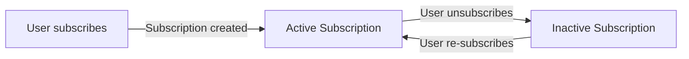

### Subscription as a Business Prerequisite and Feed Driver

The Subscription concept carries significant business meaning beyond simple preference tracking. It acts as a gatekeeper and a personalization engine within the platform.

**Prerequisite for Posting**: An active Subscription to a Community is required before a User may create a post in that Community. A User who is not actively subscribed to a Community cannot publish content there. This rule enforces that only engaged, opted-in members can contribute content to a given community.

**Home Feed Membership Basis**: The personal home feed that a logged-in User sees is composed exclusively of posts drawn from the communities to which that user holds active Subscriptions. The set of a User's active Subscriptions therefore defines the entire scope of their personalized content stream. If a User has no active Subscriptions, their home feed contains no posts.

**Subscriber Count Source**: The subscriber count displayed on a Community's profile is a direct count of the number of active Subscriptions associated with that Community. As users subscribe and unsubscribe, this count changes accordingly. It serves as a public signal of a community's size and reach.

**Community Belonging**: Through their collection of active Subscriptions, a User establishes their identity and presence across the platform's communities. The Subscription is the authoritative record of community belonging — it determines where a user may post, what content fills their feed, and which communities claim them as members.

## Post Concept

A Post is the primary unit of content shared within a Community, authored by a subscribed User and visible to the broader platform. Every Post has a title, which is a required field and the first thing readers see in any feed or listing. A Post belongs to exactly one Community and is attributed to exactly one author. Posts come in three distinct types: text posts, which carry a body of written content; link posts, which reference an external URL; and image posts, which feature an uploaded image. The post type determines what supplementary content is associated with the post. A Post accumulates a vote score based on upvotes and downvotes it receives from other users. Each Post also maintains a count of comments that have been written in response to it. The creation time of a Post is a core attribute used for sorting and display. In feeds, text posts show a preview of their content, image posts show a thumbnail, and link posts display the domain name of their URL. The Post concept is the central content artifact of the platform around which voting, commenting, and community activity revolve.

### Post Identity, Authorship, and Scope

A Post is the primary unit of shareable content on the platform. Every Post carries a title, which is a required attribute and the first piece of information readers encounter in any feed or listing. Without a title, a Post cannot exist.

Every Post is attributed to exactly one author — the member who created it. This attribution is permanent and publicly visible; readers can always see who wrote a Post. The author identity links the Post to the User concept (defined in User Concept).

Every Post belongs to exactly one Community, making it community-scoped content. A Post created inside a Community is permanently associated with that Community and does not move between Communities. The Community association determines which moderators govern the Post and which subscribers see it in their home feed.

The moment a Post is created, its creation time is recorded. This timestamp is a core attribute used for sorting Posts in feeds (by recency), for displaying how long ago a Post was made (e.g., "3 hours ago"), and for time-based filtering in Top sorting.

### Post Types: Text, Link, and Image

Every Post must be one of three types. The type is chosen at creation and cannot be changed afterward. The type determines what supplementary content the Post carries beyond its title.

**Text Post**: A text post carries a body of written content. This body text is the main substance of the post and can be read in full when viewing the Post directly. In feed listings, only a preview of the first portion of the body is shown (defined in Post Preview in Feed).

**Link Post**: A link post references an external URL. The URL points to a resource outside the platform, such as an article, video, or website. The domain name portion of the URL is extracted for display purposes in feed listings. The full URL is accessible when viewing the Post.

**Image Post**: An image post features a single uploaded image provided by the author at the time of creation. The image is hosted by the platform. In feed listings, a thumbnail of the image is displayed. The full image is viewable when viewing the Post directly.

A Post may only carry the content appropriate for its type: text posts have body text, link posts have a URL, and image posts have an uploaded image. The supplementary fields for the other two types do not apply.

### Post Metrics and Feed Preview

A Post accumulates two key metrics that reflect community engagement:

**Vote Score**: The vote score is the net result of all upvotes and downvotes the Post has received from other users. It equals the total number of upvotes minus the total number of downvotes. The vote score can be positive, zero, or negative. It is a live value that changes as users cast, change, or remove their votes. The mechanics of individual votes are defined in the PostVote Concept.

**Comment Count**: A Post maintains a running count of all comments that have been written in response to it, including nested replies at any depth. This count is displayed in feed listings and on the Post detail view to indicate how much discussion the Post has generated. The comment structure itself is defined in the Comment Concept.

**Feed Preview Representation**: When a Post appears in a feed listing (Home Feed, Popular Feed, or Community Feed), it is not shown in full. Instead, the listing shows the title, author username, community name, vote score, comment count, and time since posting for all post types. Additionally, each post type provides a type-specific preview element:
- Text posts show the first 200 characters of their body content.
- Image posts show a thumbnail of their uploaded image.
- Link posts show the domain name extracted from their URL (e.g., "youtube.com").

Full post content — complete body text, the full image, or the complete URL — is only visible when a user navigates to the Post's detail view.

## PostVote Concept

A PostVote represents a single User's evaluative reaction to a specific Post, expressed as either an upvote or a downvote. Each PostVote is uniquely tied to one User and one Post, meaning a User can hold at most one vote record per Post at any given time. The vote type, either upvote or downvote, captures the direction of the User's opinion. The timestamp of when the vote was cast is recorded as part of the concept. Upvotes contribute positively to the Post's vote score, while downvotes subtract from it. The aggregate of all PostVotes on a Post determines its net vote score, calculated as total upvotes minus total downvotes. PostVotes also have an indirect effect on the author's karma score, since each upvote increases the author's karma by one and each downvote decreases it by one. The PostVote concept models the community's collective judgment of a post's value and drives both content ranking and user reputation.

### PostVote Definition and Vote Direction

A PostVote represents a single user's evaluative reaction to a specific post. Each PostVote carries a direction: either an upvote, expressing approval, or a downvote, expressing disapproval. These are the only two possible vote directions; there is no neutral or abstain vote type.

A user may hold at most one PostVote record per post at any given time. This means the same user cannot cast both an upvote and a downvote on the same post simultaneously, nor can they cast multiple upvotes to amplify their opinion. The one-vote-per-user-per-post constraint is a fundamental property of the concept itself.

Each PostVote records the point in time at which it was cast. This creation timestamp is an intrinsic attribute of the vote and is set when the user first votes on a post. If a user changes their vote direction (for example, switching from upvote to downvote), the existing PostVote record is updated to reflect the new direction; if they remove their vote entirely, the PostVote record is removed. The timestamp captures when the vote was originally placed.

### Net Vote Score, Karma Impact, and Post Ranking

The aggregate of all PostVotes on a post determines the post's net vote score. The net vote score is calculated as the total number of upvotes on that post minus the total number of downvotes. This single number summarizes the community's collective judgment of the post's value at any given moment.

PostVotes have a direct effect on the karma score of the post's author. Each upvote cast on a post increases the author's karma by one, and each downvote decreases it by one. When a vote is removed or changed, the author's karma adjusts accordingly — reflecting only the current, active votes. Karma can become negative if a user's posts receive more downvotes than upvotes.

The net vote score derived from PostVotes is a primary input to the content ranking algorithms used across all post feeds. Posts with a higher net vote score are surfaced more prominently under certain sorting modes, such as the "Top" sort. The combination of vote score and recency also influences "Hot" and "Controversial" sorting, where controversial posts are those that have attracted many votes but whose net score is close to zero — indicating a divided community opinion. In this way, PostVotes collectively govern which posts gain visibility across the platform and serve as the community's mechanism for surfacing quality content.

## Comment Concept

A Comment is a textual response authored by a User in reaction to a Post or to another Comment, enabling threaded discussion within the platform. Every Comment has a required content field holding the text of the response. A Comment is always associated with exactly one Post, even when it is a reply to another Comment, maintaining clear content hierarchy. Comments can be nested to any depth, as a reply can itself receive replies without any structural limit, enabling rich conversational threads. Each Comment has a vote score that starts at zero and changes as users cast votes on it. The creation timestamp of a Comment establishes its position in chronological sorting and is displayed to readers. Comments are attributed to their author, and the author's identity is visible alongside the content. The Comment concept is the discussion layer of the platform, allowing the community to elaborate on, critique, or react to posted content.

### Comment

A Comment is a textual contribution authored by a User in response to a Post or to another Comment. Every Comment must contain content text; a Comment without text is not valid and cannot be created.

Each Comment is permanently associated with exactly one Post, regardless of whether it is a direct response to that Post or a reply to another Comment nested within it. This association ensures that all discussion generated around a Post remains traceable to that Post as its root.

A Comment records the timestamp at which it was created. This timestamp is visible to readers and serves as the basis for chronological ordering of comments.

A Comment is attributed to the User who authored it. The author's identity is displayed alongside the comment content so that other users know who wrote it.

Each Comment carries a vote score that reflects the cumulative result of upvotes and downvotes cast on it by other users. The vote score starts at zero when the Comment is created and changes over time as users vote. The specific voting mechanics are described in the CommentVote concept (defined in Module 1 > CommentVote Concept).

### Threaded Discussion Structure

Comments support two levels of attachment: a Comment can be a direct reply to a Post, or it can be a reply to another Comment. When a Comment replies to a Post, it is considered a top-level comment in that Post's discussion. When a Comment replies to another Comment, it forms a nested reply within the thread.

Nesting has no structural depth limit. A reply can itself receive replies, those replies can receive further replies, and this chain can continue indefinitely. This allows conversations to branch and deepen organically without any artificial constraint on how deep a discussion thread may go.

The parent-child relationship between Comments — where one Comment points to another as its parent — is what forms the threaded discussion structure. A Comment that has no parent Comment is a top-level comment; a Comment that has a parent Comment is a nested reply. Together, these relationships create a tree of discussion anchored to a single Post.

The hierarchy of nested replies is preserved and presented to readers so that the context of each reply — which comment it is responding to — is clear. Readers can follow a conversation thread through multiple levels of nesting.

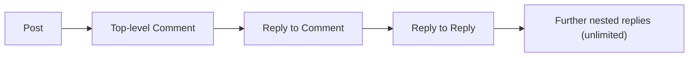

## CommentVote Concept

A CommentVote represents a single User's evaluative reaction to a specific Comment, expressed as either an upvote or a downvote. Just as with posts, each CommentVote is uniquely tied to one User and one Comment, ensuring a User can hold at most one vote per Comment at any time. The vote type records whether the User's reaction is positive or negative. The timestamp of when the vote was cast is part of the concept. Upvotes increase the Comment's vote score by one, while downvotes decrease it by one. The net vote score of a Comment is derived from all CommentVotes cast on it, calculated as total upvotes minus total downvotes. CommentVotes also affect the author's karma in the same way as PostVotes — each upvote increases the comment author's karma by one and each downvote decreases it. The CommentVote concept mirrors the PostVote concept and applies the same community evaluation mechanism to the discussion layer.

### CommentVote Definition and Vote Direction

A CommentVote represents a single user's evaluative reaction to a specific comment, recorded as either an upvote or a downvote. The vote direction captures whether the user's reaction is positive (upvote) or negative (downvote). Each CommentVote is uniquely bound to one user and one comment, meaning a user may hold at most one vote on any given comment at any point in time. The moment a vote is cast is recorded as the vote's timestamp, capturing when the user's reaction was registered.

The one-vote-per-user-per-comment constraint ensures that no user can cast multiple simultaneous votes on the same comment. A user may change the direction of their vote — switching from upvote to downvote or vice versa — at which point the existing vote direction is replaced and the vote timestamp is updated. A user may also remove their vote entirely, at which point the CommentVote no longer exists for that user-comment pair.

CommentVote mirrors the PostVote concept and applies the same community evaluation mechanism to the discussion layer of the platform, enabling the community to express collective judgment on individual comments.

### Net Vote Score, Karma Effect, and Comment Ranking

The net vote score of a comment is derived from all CommentVotes cast on it, calculated as the total number of upvotes minus the total number of downvotes. This score represents the community's aggregate evaluation of the comment and may be zero, positive, or negative.

Each CommentVote directly affects the karma score of the comment's author:
- When a user casts an upvote on a comment, the comment author's karma increases by one.
- When a user casts a downvote on a comment, the comment author's karma decreases by one.
- When a user changes their vote direction, the karma adjusts accordingly: the prior vote's karma effect is reversed and the new vote's effect is applied.
- When a user removes their vote, the karma effect of the removed vote is reversed.

The net vote score of a comment also influences how the comment is ranked and displayed within a post's comment section. Sorting modes such as "Best" and "Controversial" depend on the vote score derived from CommentVotes — higher-scoring comments surface first under "Best", while comments with many votes but a score close to zero surface under "Controversial". This makes CommentVotes the primary mechanism by which the community shapes the visibility and order of discussion.

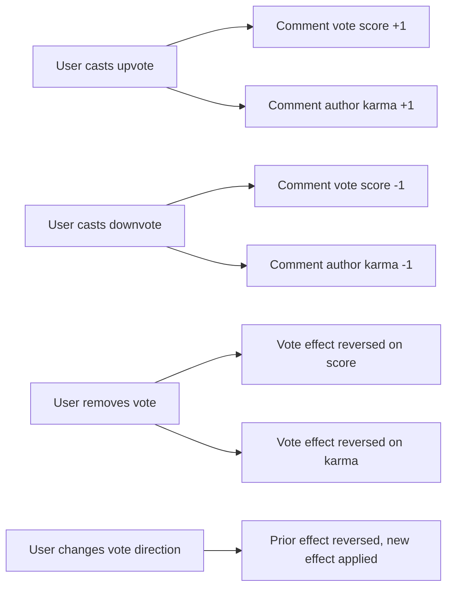

## Ban Concept

A Ban represents an enforcement action taken by a moderator of a Community against a specific User, restricting that User's ability to participate in the Community. A Ban is always scoped to a specific Community, meaning it does not affect the User's standing in other communities or on the platform at large. An optional reason field allows the moderator to document why the User was banned, providing transparency and accountability. The timestamp of when the ban was issued is recorded. A banned User retains the ability to view content within the Community but loses the right to create posts or comments there. The Ban concept represents the moderation tool that enforces community standards by excluding disruptive members from active participation. A ban can be reversed by a moderator, restoring the User's ability to post and comment in the community.

### Ban as a Community-Scoped Enforcement Action

A Ban is a moderation action taken by a community moderator or owner against a specific member, restricting that member's ability to actively participate within a single community. Because a Ban is always scoped to the community in which it is issued, it has no effect on the targeted user's standing in any other community or on the platform as a whole. The same user may be banned in one community while participating freely in others.

A Ban is issued by an individual who holds a moderator or owner role within the community at the time of the action. The identity of the issuing moderator is recorded alongside the Ban, providing accountability for the enforcement decision.

The moment a Ban is created, its timestamp is recorded. This timestamp documents exactly when the restriction took effect and serves as a permanent audit record of the enforcement action. An optional reason may be provided by the issuing moderator to explain the grounds for the ban, offering transparency to other moderators and, where applicable, to the affected user.

### Restricted and Permitted Activities for a Banned User

A banned user experiences a partial restriction within the community where the ban applies. The restriction is limited to active participation: a banned user cannot create new posts in that community, and cannot write comments on any post within that community.

Despite this restriction, a banned user retains full read access to the community. They can continue to view posts, read comments, and browse all content within the community. The ban does not render the community invisible to the banned user; it only prevents them from contributing new content.

This distinction — restricting creation while preserving viewing — reflects the platform's design intention: community moderation manages participation and contribution, not access to public information.

### Ban Reversal and Restoration of Participation

A Ban is not necessarily permanent. A moderator or owner of the same community may reverse an existing ban, which restores the previously banned user's ability to create posts and comments within that community.

When a ban is reversed, the user's participation rights within the community are fully restored. The reversal does not retroactively alter historical records of the ban or the original reason for it; the audit trail of the enforcement action remains intact.

A ban and its reversal together represent the lifecycle of a community enforcement action: from the moment a restriction is imposed to the point at which it is lifted. The community maintains a list of currently active bans, allowing moderators to review who is currently restricted and to manage those restrictions over time.

## Report Concept

A Report is a formal complaint submitted by a User against a specific piece of content — either a Post or a Comment — that the User believes violates community standards. Every Report requires a reason, which is a text field where the reporting User explains their concern. A Report identifies the type of content being reported, distinguishing between posts and comments as the target. Reports have a status that progresses through the moderation workflow: pending when first submitted, approved when the moderator acts to remove the content, or dismissed when the moderator decides the content is acceptable. Pending reports are visible to community moderators in a dedicated moderation queue. Each Report records who submitted it, allowing moderators to understand the source of the complaint. The Report concept provides the formal mechanism by which community members flag problematic content and moderators adjudicate those flags. Dismissed reports are removed from the active moderation view, while approved reports result in the deletion of the reported content.

### Report

A Report is a formal complaint submitted by a community member against a specific piece of content — either a Post or a Comment — that the member believes violates community standards. Every Report records:

- **Reporter identity**: The User who submitted the report is always recorded, allowing moderators to understand the source of each complaint.
- **Required reason**: Every Report must include a reason, which is a free-text field where the reporting User explains their concern. A Report without a reason cannot be submitted.
- **Target type**: Each Report identifies whether the flagged content is a Post or a Comment, enabling moderators to locate the correct content during review.
- **Community scope**: A Report is associated with the Community in which the flagged content exists, so it appears in the correct community's moderation queue.

Any authenticated community member (not necessarily a subscriber) may flag content they believe is problematic. One member can submit multiple reports against different pieces of content, but the identity behind each report is always preserved.

### Report Status and Moderation Lifecycle

Every Report passes through a status-based lifecycle that reflects where it stands in the moderation process.

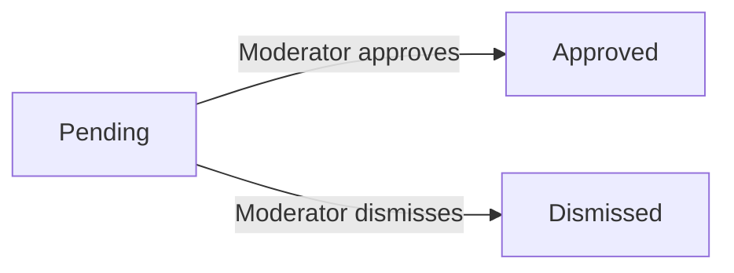

**Pending** — A Report begins in the pending state as soon as a community member submits it. Pending reports are visible to the moderators of the relevant community in a dedicated moderation review queue. Moderators can see the reported content, the reporter's identity, and the stated reason for the report.

**Approved** — When a moderator decides the reported content violates community standards, they approve the report. Approving a report causes the flagged Post or Comment to be deleted from the community. An approved report reflects a completed moderation action.

**Dismissed** — When a moderator decides the reported content is acceptable and does not warrant removal, they dismiss the report. A dismissed report is removed from the active moderation queue and no longer appears to moderators. The flagged content remains intact.

Only pending reports are visible in the moderation queue. Once a report is either approved or dismissed, it no longer occupies the active review list, keeping the queue focused on content that still requires moderator attention.

# Domain Relationships

Describe how concepts relate to each other from a business perspective.

## Conceptual Relationships

Describe how concepts relate to each other in business terms.

### User Associations

A User is the central actor in the platform and participates in relationships with nearly every other domain concept.

- A User has one UserProfile, which stores their publicly visible display name, bio, and avatar. The profile is created alongside the user account and cannot exist independently.
- A User owns zero or more Communities. The user who created a community is its owner, and that ownership is recorded through a CommunityModerator entry with the owner role.
- A User holds zero or more active Subscriptions to Communities. Each Subscription represents a current membership in a specific community.
- A User authors zero or more Posts across any communities they are subscribed to.
- A User authors zero or more Comments across any posts on the platform.
- A User casts zero or more PostVotes, with at most one vote per post at any given time.
- A User casts zero or more CommentVotes, with at most one vote per comment at any given time.
- A User may serve as a CommunityModerator in zero or more communities, either as an owner or as a moderator.
- A User may be the subject of zero or more Bans, each scoped to a specific community.
- A User may file zero or more Reports against posts or comments across the platform.
- All content and associations belonging to a User are removed when that user deletes their account.

### Community Associations

A Community is the organizational container for posts, members, moderators, and moderation actions.

- A Community belongs to exactly one User as its owner. This ownership is expressed via a CommunityModerator record with the owner role and cannot be transferred or removed.
- A Community has many CommunityModerators, each of whom is a User assigned either the owner or moderator role. Every community has exactly one owner at all times.
- A Community has many Subscriptions, each representing a User who has chosen to join that community. The number of active subscriptions constitutes the community's subscriber count.
- A Community has many Posts created by its subscribed members.
- A Community has many Bans, each recording a User who has been prohibited from participating in that community.
- A Community has many Reports filed against posts or comments that belong to that community. A report is always scoped to the community where the reported content resides.
- A Community does not belong to any higher-level grouping; all communities exist at the same level within the platform.

### Post and Comment Content Hierarchy

Posts and Comments form the primary content hierarchy of the platform, organized within communities and nested within each other.

- A Post belongs to exactly one Community and exactly one User as its author. A post cannot exist outside a community or without an author.
- A Post has many Comments, representing all top-level replies and their descendants written in response to that post.
- A Post has many PostVotes, each cast by a distinct User. The net vote score is derived from the count of upvotes minus downvotes among these associations.
- A Post may have many Reports filed against it, all scoped to its parent community.
- A Comment belongs to exactly one Post, anchoring it to a specific piece of content. A comment cannot exist without its parent post.
- A Comment optionally belongs to another Comment as its parent. When a parent comment exists, the comment is a reply; when no parent exists, it is a top-level comment on the post.
- A Comment has many Comments as its replies, with no restriction on how many levels of nesting may occur. This recursive belongs-to relationship enables unlimited reply depth.
- A Comment has many CommentVotes, each cast by a distinct User. The net vote score is calculated the same way as for posts.
- A Comment may have many Reports filed against it, all scoped to the community of its parent post.

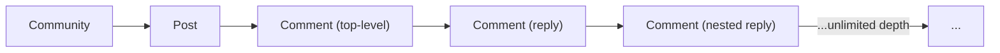

### Ownership and Moderator Authority Chains

Ownership and moderation authority are expressed through the CommunityModerator association, which links Users to Communities in a hierarchical governance structure.

- The User who creates a community is automatically associated with it as an owner through a CommunityModerator record. This owner relationship is established at the moment of community creation.
- The owner may associate additional Users with the community as moderators by creating CommunityModerator records with the moderator role.
- Moderators may also associate further Users as moderators, expanding the moderation team.
- The owner-to-community association is permanent and cannot be removed by any other moderator. Only the owner role can remove moderator associations.
- A moderator association can only be dissolved by the owner; moderators cannot remove each other's associations.
- Bans are associated with both the community (the scope of the ban) and the issuing moderator (the User who created the ban). This dual association records both where the ban applies and who authorized it.
- The Ban association also records the User who is subject to the ban, establishing a three-way relationship between the banned user, the community, and the issuing moderator.
- A Report is associated with the filing User (the reporter), the target Community, and either a target Post or a target Comment — but never both simultaneously. This association preserves the full context needed for moderator review.

## Lifecycle and Retention

Describe concept lifecycle states and transitions only. Detailed retention/recovery policies belong in 05-non-functional. Operation details belong in 03-functional-requirements.

### Entity Lifecycle States and Transitions

Each major domain entity passes through a defined set of states during its existence on the platform.

**User Account**
A user account begins in an active state upon successful registration. It remains active until the user explicitly chooses to delete it. There is no suspended or deactivated intermediate state; the account transitions directly from active to deleted. Once deleted, the account is no longer accessible.

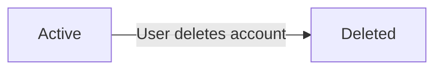

**Post**
A post is created in a published (active) state and is immediately visible to other users. It remains active until it is deleted by the author or by a community moderator. There is no draft or archived state; posts are either live or deleted.

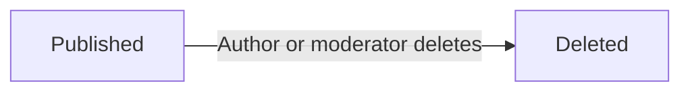

**Comment**
A comment is created in an active state and is immediately visible on its parent post. It remains active until deleted by the author or by a community moderator. Like posts, comments have no intermediate or archived state.

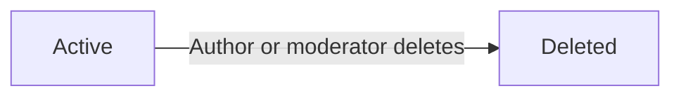

**Subscription**
A subscription begins when a user subscribes to a community and is initially active. When a user unsubscribes, the subscription transitions to an inactive state. A user may re-subscribe, which reactivates their membership in that community.

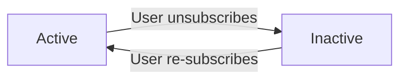

**Ban**
A ban is issued by a moderator and immediately takes effect, placing the targeted user in a banned state within that community. A moderator may lift the ban at any time, returning the user to an unbanned state within the community.

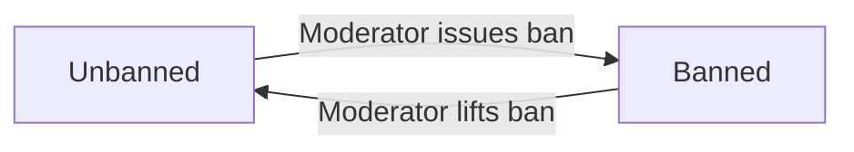

**Report**
A report is created in a pending state when a user submits it. A community moderator then reviews the report and either approves it (which results in the reported content being deleted) or dismisses it (which removes the report from the review queue). Approved and dismissed reports are the only terminal states.

### Deletion Policy and Content Cascading

The platform defines clear rules for how deletion of one entity affects related entities.

**Account Deletion Cascade**
When a user deletes their account, all content they have created is also permanently deleted. This includes all of their posts, all of their comments, and all votes they have cast. The cascade is total — no content authored by a deleted account is retained on the platform.

**Post Deletion**
When a post is deleted (by its author or by a community moderator), the post and all comments associated with it are removed. Votes cast on the post are also removed. The deletion is permanent and content is not moved to an archive.

**Comment Deletion**
When a comment is deleted (by its author or by a community moderator), the comment and all of its nested replies are removed along with any votes cast on the deleted comment or its replies.

**Report-Driven Deletion**
When a moderator approves a report, the reported post or comment is deleted following the same rules as a direct moderator deletion. Dismissed reports do not affect the content and are removed from the moderator review queue.

**Retention**
Content is retained on the platform in its active state indefinitely until an explicit deletion action occurs. There is no time-based automatic expiration for posts, comments, or communities. Detailed data retention and privacy policies are defined in the non-functional requirements document.

**Archival and Recovery**
The platform does not define an archival state for any entity. Deletion is permanent — there is no recovery mechanism for deleted accounts, posts, or comments described in the system requirements. Detailed recovery policies, if any, are addressed in the non-functional requirements document.

# Business Categories and State Flows

Business category classifications and state flow definitions.

## Business Category Definitions

Define all business category classifications with their allowed values and descriptions.

### Post Type Classification

Every post in the platform belongs to exactly one of three mutually exclusive types, which determines what kind of content the post carries.

| Type | Allowed Value | Description |
|------|--------------|-------------|
| Text Post | `text` | The post body is a block of written text. |
| Link Post | `link` | The post body is an external URL pointing to a resource outside the platform. |
| Image Post | `image` | The post body is an image file uploaded by the author. |

- The type of a post is set at creation time and cannot be changed afterward.
- Each type is mutually exclusive: a post cannot be both a text post and a link post, for example.
- When displaying posts in a feed, the post type determines what supplementary preview is shown (text excerpt, URL domain, or image thumbnail).
- A post with the text type must carry written content. A post with the link type must carry a URL. A post with the image type must carry an uploaded image file.

### Vote Type Classification

Votes on posts and comments are classified into two distinct types that express the direction of a user's sentiment.

| Type | Allowed Value | Description |
|------|--------------|-------------|
| Upvote | `upvote` | The user positively endorses the content. Adds 1 to the vote score. |
| Downvote | `downvote` | The user negatively rates the content. Subtracts 1 from the vote score. |

- This classification applies uniformly to both post votes and comment votes.
- A single vote record always carries exactly one of these two values at any point in time.
- A user may change their vote type on a given piece of content (e.g., switch from upvote to downvote), which replaces the previously recorded type.
- A user may also remove their vote entirely, which eliminates the vote record altogether rather than setting a neutral type.

### Moderator Role Classification

Within a community, each moderator holds exactly one role that defines their level of authority in governing the community.

| Role | Allowed Value | Description |
|------|--------------|-------------|
| Owner | `owner` | The highest authority in the community. Automatically assigned to the community creator. |
| Moderator | `moderator` | A trusted community manager with moderation privileges, appointed by the owner or another moderator. |

- These two roles form a strict hierarchy: the owner role holds greater authority than the moderator role.
- Each community has exactly one owner at any time — the original creator.
- A community may have zero or more moderators in addition to the owner.
- The role a moderator holds determines which management actions they may perform (see actor permissions in 01-actors-and-auth.md for the full permission matrix).

### Report Status Classification

Every report submitted against a post or comment moves through a defined set of status values that track its current state in the moderation review queue.

| Status | Allowed Value | Description |
|--------|--------------|-------------|
| Pending | `pending` | The report has been submitted and is awaiting moderator review. |
| Approved | `approved` | A moderator has reviewed the report and determined the content violates community standards; the reported content is deleted. |
| Dismissed | `dismissed` | A moderator has reviewed the report and determined the content does not require action; the report is removed from the active queue. |

- Every newly created report starts in the `pending` status.
- A report transitions from `pending` to either `approved` or `dismissed` once a moderator takes action; it cannot return to `pending` after that.
- Only two terminal statuses exist — `approved` and `dismissed` — and both are final.
- Dismissed reports are no longer visible in the moderation report list once dismissed.

### Report Target Type Classification

A report is always directed at a specific type of community content. The target type classifies what kind of content is being reported.

| Target | Allowed Value | Description |
|--------|--------------|-------------|
| Post | `post` | The report is filed against a post created within the community. |
| Comment | `comment` | The report is filed against a comment (including a nested reply) within the community. |

- The target type is set at the moment the report is submitted and does not change.
- Exactly one target type is recorded per report.
- The target type determines which piece of content is deleted if a moderator approves the report.
- Both target types are always visible to moderators in the community report list, regardless of target type.

## State Transitions

Define valid state transition paths for stateful concepts.

### Subscription State Flow

A subscription represents a user's membership in a community and can be in one of two states: active or inactive.

When a user subscribes to a community, the subscription is created in the active state. When the user unsubscribes, the subscription transitions to the inactive state. A user may re-subscribe to the same community, which transitions the subscription back to active. The system records the timestamp of the most recent subscription action.

While a subscription is active, the user's home feed includes posts from that community and the user is eligible to create posts in that community. While a subscription is inactive, neither of these privileges applies.

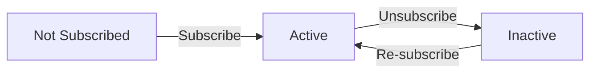

### Vote State Flow

Vote state transitions apply equally to post votes and comment votes. Each user starts in a no-vote state relative to any given post or comment.

From the no-vote state, a user may cast an upvote or a downvote, moving the relationship to the upvoted or downvoted state respectively. From the upvoted state, the user may switch directly to downvoted, or remove the vote entirely to return to no-vote. From the downvoted state, the user may switch directly to upvoted, or remove the vote to return to no-vote.

Each transition immediately adjusts the vote score of the target content and the karma score of the content's author. Specifically:
- Casting an upvote increases the author's karma by 1.
- Casting a downvote decreases the author's karma by 1.
- Switching from upvote to downvote decreases the author's karma by 2 (one upvote removed, one downvote added).
- Switching from downvote to upvote increases the author's karma by 2.
- Removing an upvote decreases the author's karma by 1.
- Removing a downvote increases the author's karma by 1.

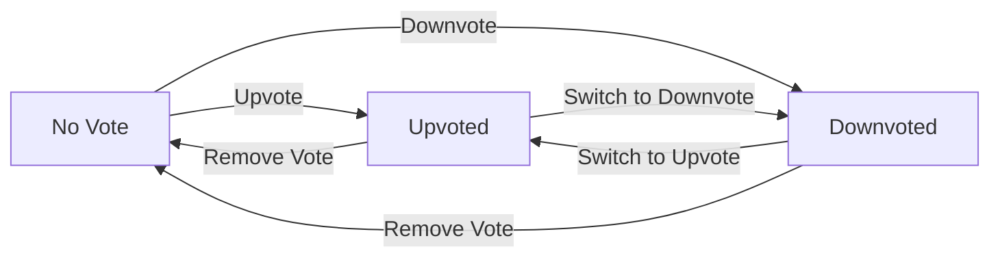

### Report Status Workflow

A report follows a linear workflow from creation through moderator resolution. Reports are scoped to the community in which the reported content appears.

When a member submits a report against a post or comment, the report enters the pending state and appears in the moderator review queue for that community. The report remains pending until a moderator takes action.

A moderator may approve the report, which causes the reported content to be deleted and transitions the report to the approved state. Alternatively, a moderator may dismiss the report, which leaves the content intact and transitions the report to the dismissed state. Dismissed reports are removed from the active review queue.

Once a report reaches either the approved or dismissed state, no further transitions are possible. Both states are terminal.

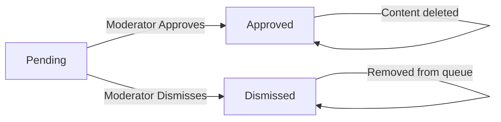

### Moderator Role Transition Workflow

The moderation governance of a community evolves through role assignments and removals. Each community has exactly one owner (the creator) and may have zero or more moderators.

When a community is created, the creator's role is automatically set to owner. This is the initial and permanent state for that user in that community — the owner role cannot be removed or transferred.

The owner may promote any subscribed member to the moderator role by adding them as a moderator. A moderator may also add other members as moderators. Only the owner may remove a moderator from their role. Moderators cannot remove each other, and no one may remove the owner.

When a moderator is removed, their role entry is deleted and they revert to being a regular member of the community. Being a moderator does not affect their subscription status.

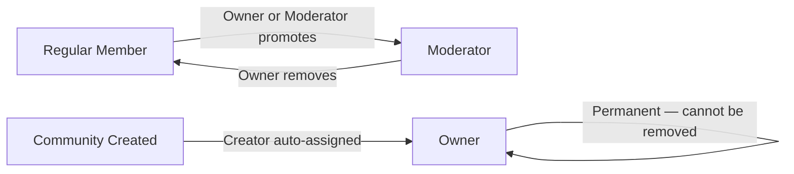

### Ban Status Change Workflow

A ban records the exclusion of a specific user from a specific community. A user is either unbanned (the default state) or banned within a given community.

A moderator may ban any non-moderator member of the community, transitioning that user to the banned state for that community. The ban records the issuing moderator, the timestamp, and an optional reason.

A moderator may also lift an existing ban, transitioning the user back to the unbanned state. Once unbanned, the user regains the ability to create posts and comments in that community (provided they are still subscribed and have not been re-banned).

A banned user may still view all content within the community — only the ability to post and comment is restricted. Bans are community-scoped and do not affect the user's standing in any other community.

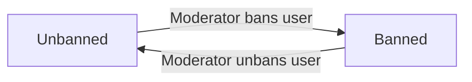