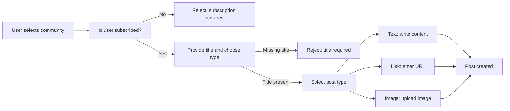
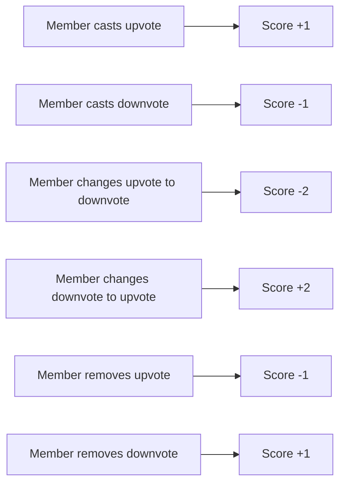
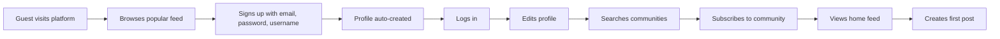
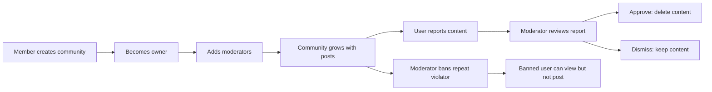
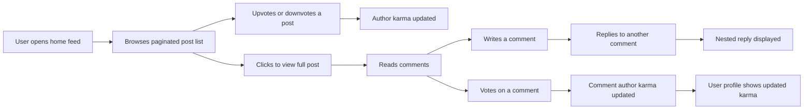
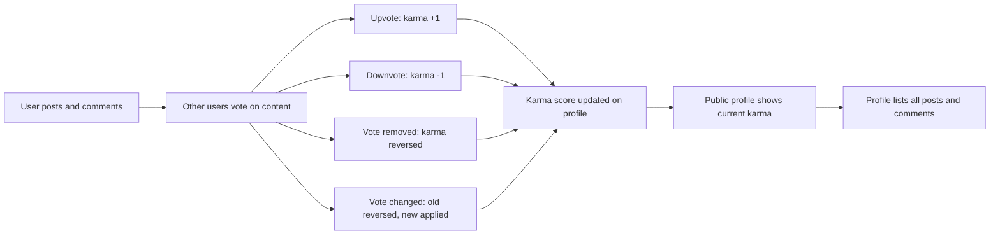
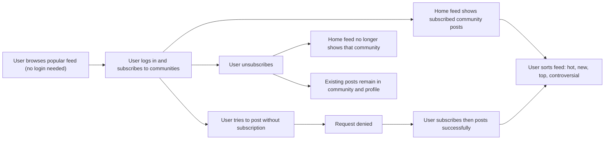

**community — What operations users can perform, use cases, business workflows**

What operations users can perform, use cases, business workflows

# Core Business Operations

What the system must do for each business concept.

## User Operations

Any visitor can register a new account by providing a unique email address, a password, and a unique username. The system ensures that no two accounts share the same email or the same username. Once registered, a user can log in using their email and password to access authenticated features of the platform. Authenticated users can change their password at any time. A user may permanently delete their own account, which also removes all posts and comments they have ever created across the platform. The system does not allow a user to delete another user's account. Login credentials are validated before granting access, and incorrect credentials result in a failed login without exposing which field was wrong.

### User Registration

Any visitor can register a new account by providing an email address, a password, and a username.

- THE system SHALL require an email address, a password, and a username to complete registration.
- THE system SHALL verify that the provided email address is not already associated with an existing account before creating the new account.
- THE system SHALL verify that the provided username is not already taken by another account before creating the new account.
- WHEN a visitor submits a registration request with all required fields, THE system SHALL create a new user account and make it immediately available for login.
- WHEN registration succeeds, THE system SHALL initialize a karma score of zero for the new user.
- WHEN registration succeeds, THE system SHALL automatically create a profile for the new user (as defined in UserProfile Operations).
- IF the provided email address is already in use by another account, THEN THE system SHALL reject the registration request.
- IF the provided username is already taken by another account, THEN THE system SHALL reject the registration request.
- IF any required field (email, password, or username) is missing from the registration request, THEN THE system SHALL reject the registration request.

### User Login and Credential Validation

Registered users can log in to the platform using their email address and password.

- THE system SHALL require both an email address and a password to authenticate a user.
- WHEN a user submits a login request, THE system SHALL verify that the provided email address corresponds to an existing account.
- WHEN a user submits a login request, THE system SHALL verify that the provided password matches the stored credentials for that account.
- WHEN both the email and password are valid and match an existing account, THE system SHALL grant the user an authenticated session.
- IF the provided email address does not correspond to any existing account, THEN THE system SHALL reject the login request without indicating which specific field was incorrect.
- IF the provided password does not match the account associated with the given email, THEN THE system SHALL reject the login request without indicating which specific field was incorrect.
- IF either the email or password field is missing from the login request, THEN THE system SHALL reject the login request.
- WHILE a user has an active authenticated session, THE system SHALL permit access to member-only operations such as creating posts, voting, commenting, and managing their account.
- WHILE a user is not authenticated, THE system SHALL deny access to all operations that require authentication, including but not limited to: creating posts, voting, managing subscriptions, and modifying account details.

### Password Change

Authenticated users can update their account password at any time.

- WHILE a user is authenticated, THE system SHALL allow that user to change their own password.
- THE system SHALL require the user to provide their current password before accepting a new password, to confirm account ownership.
- WHEN the current password is verified and a new password is provided, THE system SHALL replace the stored password with the new one.
- IF the provided current password does not match the user's existing password, THEN THE system SHALL reject the password change request.
- IF a user is not authenticated, THEN THE system SHALL deny the password change request.

### Account Deletion and Cascading Removal

Authenticated users can permanently delete their own account from the platform.

- WHILE a user is authenticated, THE system SHALL allow that user to permanently delete their own account.
- WHEN a user's account is deleted, THE system SHALL permanently remove all posts that user has ever created across all communities.
- WHEN a user's account is deleted, THE system SHALL permanently remove all comments that user has ever written across all posts.
- WHEN a user's account is deleted, THE system SHALL remove the account record along with all associated profile information.
- WHEN a user's account is deleted, THE system SHALL remove all votes cast by that user on posts and comments.
- WHEN a user's account is deleted, THE system SHALL remove all subscriptions held by that user.
- THE system SHALL NOT allow one user to delete another user's account.
- IF a user is not authenticated, THEN THE system SHALL deny the account deletion request.
- Account deletion is permanent and cannot be undone. The system does not support account recovery after deletion.

## UserProfile Operations

Every user automatically has a profile associated with their account upon registration. A profile includes a display name, a bio text, and an avatar image, all of which are optional and can be left blank. Users can edit their own display name, bio, and avatar at any time. No user can edit another user's profile. Any visitor — including users who are not logged in — can view another user's profile page. A profile page displays the user's display name, bio, avatar, total karma score, a list of all posts they have created, and a list of all comments they have written. The karma score shown on the profile reflects the cumulative effect of all upvotes and downvotes received on that user's posts and comments.

### Profile Creation on Registration

Every user account is automatically assigned a profile at the moment of registration. No separate action is required from the user to create a profile. The profile is initialized with all optional fields — display name, bio, and avatar image — left empty. The profile is permanently linked to the user account and cannot exist independently of one.

### Viewing a User Profile

Any visitor — whether logged in or not — can view any user's profile page by navigating to that user's public profile. The profile page displays the following information:

- The user's display name (if set), or their username as a fallback
- The user's bio text (if set)
- The user's avatar image (if set)
- The user's total karma score, which reflects all upvotes and downvotes received across their posts and comments
- A list of all posts the user has created, across all communities
- A list of all comments the user has written, across all posts

The karma score displayed is always the current cumulative score and updates as votes are cast or removed on the user's content. The post and comment lists are read from the full history of the user's contributions.

### Editing Profile Information

A logged-in user can edit their own profile at any time. The fields available for editing are:

- **Display name**: The user may set or update their display name. This field is optional and can be left blank.
- **Bio**: The user may set or update their bio text. This field is optional and can be left blank.
- **Avatar image**: The user may upload a new image to serve as their avatar, or update their existing one. Uploading a new avatar replaces the previous one.

Only the profile owner may edit their own profile. No other user — regardless of any role they hold in any community — may modify another user's profile information. If a user attempts to edit another user's profile, the request is denied. Error conditions for invalid file types or permission violations are defined in the business rules.

## Community Operations

Any authenticated user can create a new community by providing a unique community name, an optional description, and an optional icon image. The community name must be unique across the platform. The user who creates a community automatically becomes its owner. All visitors, including those not logged in, can browse a paginated list of all communities on the platform. Users can also search for communities by name to find specific groups. Each community in the list displays its subscriber count so users can gauge its popularity. Communities serve as the central organizing structure around which posts, subscriptions, moderators, and bans are grouped.

### Community Creation

Any authenticated member can create a new community by providing a community name, an optional description, and an optional icon image.

The community name is required and must be unique across the entire platform. No two communities may share the same name. If the submitted name is already taken by an existing community, the creation request is rejected.

The community name is the primary identifier for the community and is used to distinguish it from all others on the platform.

The description is a free-form text field that community creators use to explain the purpose, topic, or rules of the community. It is optional and may be left blank at the time of creation.

The icon image is an optional visual identifier for the community. It may be uploaded at the time of creation or left unset.

Upon successful creation, the system automatically assigns the creating user as the community owner. This ownership role is the highest level of authority within the community. The owner's responsibilities and privileges are defined in the CommunityModerator Operations section.

Guests who are not logged in cannot create communities. Any community creation attempt from an unauthenticated session is rejected.

Once a community is created, it immediately becomes visible to all users and guests on the platform.

### Browsing and Discovering Communities

All visitors to the platform — including guests who are not logged in — can browse the full list of communities available on the platform.

The community list is paginated, allowing users to navigate through communities page by page.

Each community entry in the list displays the following information:
- The community name
- The community description (if set)
- The community icon image (if set)
- The current subscriber count, showing how many users are actively subscribed to the community

The subscriber count is visible to all users, including guests, so that anyone can gauge the size and popularity of a community before subscribing.

Users can search for communities by name. The search matches communities whose names contain or correspond to the entered search term. If no communities match the search term, the system returns an empty result set without an error.

Search results follow the same display format as the general community list, including the subscriber count for each result.

Searching and browsing communities does not require authentication. Both guests and members can access these features.

### Community as Organizing Container

A community serves as the central organizing structure of the platform. All posts are created within a specific community, and all community-specific activity — including subscriptions, moderation, bans, and reports — is scoped to a single community.

Each community independently maintains:
- Its own collection of posts submitted by subscribed members
- Its own list of subscribers (users who have chosen to follow the community)
- Its own moderation team, consisting of the owner and any assigned moderators
- Its own list of banned users
- Its own list of reported content pending moderator review

When a user views a community, they see the community's name, description, icon image, and subscriber count, along with the feed of posts belonging to that community.

The community feed is available to all visitors, including guests who are not logged in. However, to create posts within a community, a user must be an active subscriber of that community, as defined in the Subscription Operations section.

Because all posts, members, moderators, bans, and reports are organized under individual communities, a community's lifecycle directly affects the content and users grouped beneath it.

## CommunityModerator Operations

The community owner holds the highest level of authority within a community. The owner can add other users as moderators and can remove any moderator from the community. Moderators can also add other users as moderators, expanding the moderation team. However, moderators cannot remove the community owner, and moderators cannot remove each other — only the owner has the authority to remove moderators. This hierarchy ensures the owner always retains final control. Moderator status grants users the ability to delete posts and comments within the community, ban users, unban users, and review reports. The moderation role is specific to a single community, so a moderator in one community has no special authority in another.

### Moderation Hierarchy and Owner Authority

Each community has a single owner — the user who originally created it. The owner holds the highest level of authority within the community and cannot be demoted or removed from that position by any other user.

The moderation hierarchy has two tiers:
- **Owner**: The community creator. Has all moderator capabilities plus the exclusive ability to add and remove moderators. The owner role cannot be transferred or stripped.
- **Moderator**: A user explicitly granted moderation rights by the owner or another moderator. Has the ability to delete posts and comments, ban and unban users, and review reports within the community.

The owner's authority supersedes that of any moderator. No action taken by a moderator can affect the owner's standing in the community. The hierarchy is enforced at every moderation operation — the system always distinguishes between owner-level actions and moderator-level actions before permitting them.

Users who hold no moderation role in a community are ordinary members and have no moderation capabilities in that community, regardless of any role they may hold in other communities.

### Adding Moderators

The owner of a community can assign any existing platform member as a moderator for that community. When a user is assigned as moderator, they immediately gain moderation capabilities within that community.

Moderators can also add other users as moderators, expanding the moderation team without requiring the owner's direct involvement. A moderator who adds another moderator does not grant that new moderator any authority over themselves — all moderators share the same level of authority relative to each other.

A user who is already a moderator or the owner of the community cannot be added again. The assignment is community-specific: granting moderator status in one community has no effect on the user's standing in any other community.

When viewing the moderation team, the owner is listed separately from moderators to clearly reflect the hierarchy. The date and time of each moderator assignment is recorded.

### Removing Moderators

Only the owner can remove a moderator from the community. No moderator has the ability to remove another moderator, and no moderator can remove the owner. Attempting either of these actions is denied by the system.

When the owner removes a moderator, that user immediately loses all moderation capabilities within the community. Their existing posts, comments, and other contributions remain unaffected — only their moderation role is revoked.

The owner cannot be removed by any action available within the community. The owner role persists until the community itself is deleted or the owning user account is deleted. There is no mechanism for an owner to voluntarily transfer ownership to another user.

After removal, the former moderator retains their subscription and can continue using the community as a regular member, subject to the same rules as any other member.

### Moderator Role Scope and Community Authority

Moderator authority is strictly scoped to the community in which the role was granted. A user who is a moderator in one community has no elevated permissions in any other community, even if those communities share the same owner.

Within their community, moderators are authorized to perform the following actions:
- Delete any post published in the community, regardless of who authored it.
- Delete any comment posted in the community, regardless of who authored it.
- Ban a user from the community, preventing them from creating posts or comments.
- Unban a previously banned user, restoring their ability to participate.
- View the full list of currently banned users in the community.
- View and act on all pending reports submitted for content in the community.

These capabilities apply uniformly to all moderators in the community. The owner possesses the same capabilities as moderators, in addition to the exclusive power to manage the moderator roster.

When a moderator performs an action (such as banning a user or deleting a post), the action is attributed to that moderator. The community's moderation log reflects who performed each action and when.

## Subscription Operations

Authenticated users can subscribe to any community on the platform to follow its content. A user can also unsubscribe from any community they have previously subscribed to. Subscription is required before a user can create posts within a community — non-subscribed users cannot post in a community. Subscribing does not restrict content viewing; anyone can view a community's content regardless of subscription status. Users can view a list of all communities they are currently subscribed to, which helps them navigate back to their preferred communities. The subscriber count of a community reflects the current number of active subscriptions and is visible to all users.

### Subscribing to a Community

WHEN an authenticated member requests to subscribe to a community, THE system SHALL record the subscription and associate that community with the member's subscribed communities list.

THE system SHALL allow a member to subscribe to any community on the platform, including communities they did not create.

WHEN a member subscribes to a community, THE system SHALL increment that community's subscriber count by one.

IF a guest (unauthenticated user) attempts to subscribe to a community, THEN THE system SHALL deny the request, as subscribing requires authentication.

IF a member is already subscribed to the community, THEN THE system SHALL reject a duplicate subscription request. (Error handling defined in Subscription Error Scenarios.)

### Unsubscribing from a Community

WHEN an authenticated member requests to unsubscribe from a community they are currently subscribed to, THE system SHALL remove the active subscription and disassociate that community from the member's subscribed communities list.

WHEN a member unsubscribes from a community, THE system SHALL decrement that community's subscriber count by one.

WHEN a member unsubscribes from a community, THE system SHALL NOT delete any posts or comments that the member has previously created in that community. Existing contributions remain intact.

WHEN a member unsubscribes from a community, THE system SHALL revoke the member's ability to create new posts in that community until they re-subscribe.

IF a member attempts to unsubscribe from a community they are not currently subscribed to, THEN THE system SHALL reject the request. (Error handling defined in Subscription Error Scenarios.)

### Subscription Requirement for Posting

WHILE a member is subscribed to a community, THE system SHALL allow that member to create posts within that community.

IF a member who is not subscribed to a community attempts to create a post in that community, THEN THE system SHALL deny the post creation request and indicate that subscription is required.

THE system SHALL NOT require subscription in order to view a community's posts, comments, or other content. Any user — including guests — may browse community content regardless of subscription status.

IF a member is banned from a community, THE system SHALL deny post creation in that community even if the member holds an active subscription. (Ban rules defined in Ban Operations.)

### Viewing Subscribed Communities List

WHEN an authenticated member requests their subscribed communities list, THE system SHALL return all communities to which the member currently holds an active subscription.

THE system SHALL display each community in the subscribed communities list with its name, icon image, and current subscriber count.

IF a guest attempts to view a subscribed communities list, THEN THE system SHALL deny the request, as this list is personal to an authenticated member.

WHEN a member subscribes to or unsubscribes from a community, THE system SHALL reflect the change immediately in the subscribed communities list.

THE system SHALL display the subscriber count for every community to all users, including guests, wherever communities are shown — whether in the community list, search results, community page, or subscribed communities list.

### Home Feed Powered by Subscriptions

WHEN an authenticated member accesses the home feed, THE system SHALL display posts exclusively from communities to which that member is currently subscribed.

THE system SHALL support the same sorting options in the home feed as in other post feeds: Hot, New, Top (with time filter), and Controversial. (Sorting and feed rules defined in Post Feeds.)

THE system SHALL paginate the home feed results. (Pagination rules defined in Post Feeds.)

IF a member is not subscribed to any community, THE system SHALL present an empty home feed and may indicate that subscribing to communities will populate the feed.

IF a guest attempts to access the home feed, THEN THE system SHALL deny access, as the home feed is available only to authenticated members.

WHEN a member subscribes to a new community, THE system SHALL include posts from that community in the home feed immediately. WHEN a member unsubscribes from a community, THE system SHALL exclude that community's posts from the home feed immediately.

## Post Operations

A subscribed user can create a post in any community they are subscribed to. Every post requires a title, and the post must be one of three types: a text post containing written content, a link post containing a URL, or an image post containing an uploaded image. The post type determines what additional content is attached, and a post must have only one type. Users can edit their own posts after creation. Users can delete their own posts at any time. Moderators of the community can also delete any post within their community. When viewing a single post, users see the title, full content, author username, community name, vote score, comment count, and when it was posted. In feeds, each post shows a preview: for text posts the first 200 characters, for image posts a thumbnail, and for link posts the domain name of the URL.

### Post Creation

A user may create a post only in a community to which they are currently subscribed. A post must have a title, which is required and cannot be empty. Every post must also belong to exactly one of three types: text, link, or image. The post type is set at creation and cannot be changed afterward.

For a text post, the user provides written content as the body of the post. For a link post, the user provides a URL pointing to an external resource. For an image post, the user uploads an image file. A post of one type cannot simultaneously carry the content of another type — for example, a link post cannot also have text content or an uploaded image.

The post is automatically associated with the creating user as its author and with the selected community. If the user is not subscribed to the community, the post creation is rejected. If the title is missing, the post creation is rejected. If no valid post type is selected, the post creation is rejected.

### Post Editing and Deletion

A user can edit a post they have authored. Editing allows the user to update the content of the post — for a text post, the written content may be changed; for a link post, the URL may be changed; for an image post, the image may be replaced. The title may also be updated at any time after creation. The post type cannot be changed during editing.

A user can delete a post they have authored. Deleting a post permanently removes it and all associated comments from the platform.

A community moderator (including the community owner) can delete any post within their community, regardless of who authored it. Moderator deletion has the same effect as author deletion — the post and all its comments are permanently removed.

If a user attempts to edit or delete a post they did not author, and they are not a moderator of that community, the action is rejected. A moderator may only delete posts — moderators cannot edit a post authored by another user.

### Full Post Detail View

Any user — including guests who are not logged in — can view the full detail page of a single post. The full post detail view displays the following information:

- The post title
- The full content of the post (the complete text for a text post, the full URL for a link post, or the full-size image for an image post)
- The username of the author who created the post
- The name of the community the post belongs to
- The current vote score (total upvotes minus total downvotes)
- The total number of comments on the post
- The time elapsed since the post was created (e.g., "3 hours ago")

The full post detail view also includes the post's complete comment thread, sorted according to the user's selected comment sorting preference.

### Post Feed Previews

When posts are displayed in any feed (home, popular, or community feed), each post shows a condensed preview rather than the full content. The preview information shown for every post regardless of type includes: the post title, the author's username, the community name, the current vote score, the total comment count, and the time elapsed since the post was created.

The content preview portion of a post listing varies by post type:

- **Text post**: The first 200 characters of the written content are shown as a preview snippet. If the full content is 200 characters or fewer, the entire content is shown.
- **Image post**: A thumbnail version of the uploaded image is displayed alongside the post listing.
- **Link post**: The domain name extracted from the URL is shown (for example, a link to a YouTube video shows "youtube.com").

This preview format applies uniformly across all three feed types and all sorting options.

## PostVote Operations

Authenticated users can cast a vote on any post — either an upvote or a downvote. Each user is limited to one vote per post at any given time. A user can change their vote from an upvote to a downvote or vice versa without casting a second vote. A user can also remove their vote entirely, returning the post's score to what it was before their vote. The vote score of a post is calculated as the total number of upvotes minus the total number of downvotes. Voting on a post also affects the author's karma score: an upvote increases the author's karma by 1, and a downvote decreases it by 1. When a vote is removed, the karma adjustment is reversed accordingly.

### Casting a Vote on a Post

WHEN an authenticated user casts a vote on a post, THE system SHALL record either an upvote or a downvote for that user on that post.

WHEN an authenticated user upvotes a post, THE system SHALL increase the post's vote score by 1.

WHEN an authenticated user downvotes a post, THE system SHALL decrease the post's vote score by 1.

THE system SHALL enforce that each user may hold at most one active vote per post at any given time.

WHEN a user submits a vote on a post they have not previously voted on, THE system SHALL record the new vote and apply the corresponding score and karma changes.

IF an unauthenticated user (guest) attempts to vote on any post, THEN THE system SHALL deny the action and require the user to be logged in.

IF a user attempts to vote on their own post, THEN THE system SHALL deny the action, as defined in the Post Vote Error Scenarios.

### Changing a Post Vote

WHEN an authenticated user who has already cast an upvote on a post submits a downvote on the same post, THE system SHALL replace the existing upvote with a downvote without creating a duplicate vote record.

WHEN an authenticated user who has already cast a downvote on a post submits an upvote on the same post, THE system SHALL replace the existing downvote with an upvote without creating a duplicate vote record.

WHEN a user changes their vote from upvote to downvote on a post, THE system SHALL decrease the post's vote score by 2 (removing +1 and applying −1).

WHEN a user changes their vote from downvote to upvote on a post, THE system SHALL increase the post's vote score by 2 (removing −1 and applying +1).

WHEN a user changes their vote from upvote to downvote on a post, THE system SHALL decrease the post author's karma score by 2 (reversing the +1 upvote effect and applying the −1 downvote effect).

WHEN a user changes their vote from downvote to upvote on a post, THE system SHALL increase the post author's karma score by 2 (reversing the −1 downvote effect and applying the +1 upvote effect).

IF a user submits the same vote type they have already cast on a post (e.g., upvote when already upvoted), THEN THE system SHALL reject the action, as defined in the Post Vote Error Scenarios.

### Removing a Vote from a Post

WHEN an authenticated user removes their vote from a post, THE system SHALL delete their vote record for that post.

WHEN a user removes an upvote from a post, THE system SHALL decrease the post's vote score by 1, returning it to the value it held before the upvote was cast.

WHEN a user removes a downvote from a post, THE system SHALL increase the post's vote score by 1, returning it to the value it held before the downvote was cast.

WHEN a user removes an upvote from a post, THE system SHALL decrease the post author's karma score by 1, reversing the karma increase that was applied when the upvote was originally cast.

WHEN a user removes a downvote from a post, THE system SHALL increase the post author's karma score by 1, reversing the karma decrease that was applied when the downvote was originally cast.

IF a user who has not voted on a post attempts to remove a vote from it, THEN THE system SHALL deny the action, as defined in the Post Vote Error Scenarios.

AFTER a user removes their vote, THE system SHALL allow that user to cast a new upvote or downvote on the same post at a later time.

### Post Vote Score Calculation and Karma Impact

THE system SHALL calculate the vote score of a post as the total number of upvotes cast on that post minus the total number of downvotes cast on that post.

THE system SHALL display the current vote score on the post at all times, reflecting all active votes.

WHEN any user casts an upvote on a post, THE system SHALL increase the karma score of the post's author by 1.

WHEN any user casts a downvote on a post, THE system SHALL decrease the karma score of the post's author by 1.

WHEN a vote is changed or removed, THE system SHALL apply the corresponding karma adjustment to the post author's karma score so that the author's karma always reflects the current state of all active votes on their posts.

THE system SHALL allow a post author's karma score to become negative as a result of accumulated downvotes, with no lower bound enforced.

## Comment Operations

Any authenticated user can write a comment on any post. Users can also reply directly to an existing comment, creating threaded conversations. Replies to comments can themselves have replies, with no limit on nesting depth. Users can edit their own comments at any time after posting. Users can delete their own comments. Moderators of the community where the post resides can also delete any comment in their community. Each comment displays the author's username, the comment content, the vote score, how long ago it was posted, and any nested replies. Comments on a post can be sorted by best (highest vote score first), newest first, or controversial (many votes but a score close to zero).

### Comment Creation on a Post

Any authenticated user can write a comment on any post, regardless of whether they are subscribed to the community where the post resides.

WHEN an authenticated user submits a comment on a post, THE system SHALL record the comment with the author's identity, the content of the comment, the post it belongs to, and the time it was submitted.

THE system SHALL require comment content to be non-empty; if the content is blank, the submission is rejected.

WHEN a comment is successfully created, THE system SHALL set the initial vote score of the comment to zero.

IF the target post does not exist, THEN THE system SHALL reject the comment submission.

IF the user has been banned from the community where the post resides, THEN THE system SHALL reject the comment submission. (Ban rules are defined in Ban Operations.)

### Replying to an Existing Comment

Any authenticated user can reply directly to an existing comment, creating a threaded conversation beneath it.

WHEN an authenticated user submits a reply to a comment, THE system SHALL record the reply as a child of the target comment, associating it with the same post and community as the parent comment.

THE system SHALL allow replies to any comment at any level of nesting, with no restriction on how deeply a thread may go. A reply to a reply is treated by the system in the same manner as a top-level comment — it has its own content, author, vote score, and timestamp.

IF the target comment does not exist, THEN THE system SHALL reject the reply submission.

IF the user has been banned from the community where the post resides, THEN THE system SHALL reject the reply submission.

### Unlimited Nesting Depth for Replies

THE system SHALL impose no limit on the depth at which replies can be nested. A user may reply to a reply, and another user may reply to that reply, continuing indefinitely.

WHEN a reply is created at any nesting depth, THE system SHALL correctly associate it with its immediate parent comment, the post, and the community.

THE system SHALL maintain the full parent–child chain for any comment thread, regardless of how many levels deep the thread extends.

Each reply at every nesting level is treated as a comment in its own right and inherits the same capabilities: it can be voted on, replied to, edited by its author, and deleted by its author or a community moderator.

### Comment Editing by Author

A user who authored a comment may edit its content at any time after posting.

WHEN the author of a comment submits an edit, THE system SHALL replace the comment's content with the new content and record that the comment has been updated.

THE system SHALL require the edited content to be non-empty; if the new content is blank, the edit is rejected.

IF a user who is not the author of the comment attempts to edit it, THEN THE system SHALL deny the request.

IF the comment no longer exists, THEN THE system SHALL reject the edit request.

Editing a comment does not affect its vote score, its position in any thread, or its relationship to any replies it has received.

### Comment Deletion by Author

A user who authored a comment may delete it at any time.

WHEN the author of a comment requests deletion, THE system SHALL remove the comment from the post's thread.

IF the comment no longer exists, THEN THE system SHALL reject the deletion request.

IF a user who is not the author attempts to delete the comment via the author deletion path, THEN THE system SHALL deny the request.

WHEN a comment is deleted by its author, THE system SHALL also remove any votes cast on that comment and adjust the karma of the author accordingly. (Account deletion cascading behavior is defined in 05-non-functional.md.)

### Comment Deletion by Community Moderator

A moderator of the community where a post resides may delete any comment on that post, regardless of who authored it.

WHEN a moderator deletes a comment, THE system SHALL remove the comment from the post's thread in the same manner as an author deletion.

IF the user attempting moderation deletion is not a moderator or owner of the relevant community, THEN THE system SHALL deny the request.

IF the comment does not exist, THEN THE system SHALL reject the deletion request.

A moderator may delete comments at any nesting depth within their community. Deleting a parent comment via moderator action follows the same rules as author deletion with respect to the affected content. (Moderator roles and authority are defined in CommunityModerator Operations.)

### Comment Display — Author, Content, and Vote Score

WHEN a user views a post, THE system SHALL display each comment with the following information:

- The username of the comment's author
- The full text content of the comment
- The current vote score (total upvotes minus total downvotes)
- The time elapsed since the comment was posted (for example, "2 hours ago")
- Any nested replies belonging to that comment

THE system SHALL display the vote score as a single integer that reflects all upvotes and downvotes cast on the comment at the time of viewing.

WHILE a user is viewing a comment thread, THE system SHALL present each comment's information in a consistent format so that authors, scores, and timestamps are clearly visible.

### Nested Replies Displayed Under Comments

WHEN a user views a post's comment section, THE system SHALL render replies indented beneath their parent comment, visually reflecting the nesting hierarchy.

THE system SHALL display the full reply tree for each top-level comment, showing all levels of nested replies without truncating any depth of the thread.

Each nested reply SHALL display the same information as a top-level comment: author username, content, vote score, and time since posted.

The display order of replies within a given nesting level follows the sorting option selected for the overall comment section (defined in the sorting sections below).

### Comment Sorting by Best

WHEN a user requests comments sorted by best, THE system SHALL order comments so that those with the highest vote score appear first at each level of the thread hierarchy.

THE system SHALL apply the best sort independently at each nesting level, so that the top reply to a comment is also the reply with the highest score within that set of siblings.

The best sort is applied consistently across all nesting levels within the comment tree.

### Comment Sorting by Newest

WHEN a user requests comments sorted by newest, THE system SHALL order comments so that the most recently posted comments appear first at each level of the thread hierarchy.

THE system SHALL apply the newest sort independently at each nesting level, so that the most recent reply to a comment appears first among that comment's replies.

The newest sort reflects the time at which each comment was originally created.

### Comment Sorting by Controversial

WHEN a user requests comments sorted by controversial, THE system SHALL order comments so that those with a high total number of votes but a score close to zero appear first at each level of the thread hierarchy.

A comment is considered controversial when it has received many votes (both upvotes and downvotes) yet the net score remains near zero, indicating a highly divided audience response.

THE system SHALL apply the controversial sort independently at each nesting level, so that the most controversial reply to a comment appears first among that comment's siblings.

Comments with very few votes are not ranked as controversial regardless of their score.

## CommentVote Operations

Authenticated users can upvote or downvote any comment on the platform. Each user is restricted to one vote per comment at any given time. A user can change their existing vote on a comment from an upvote to a downvote or from a downvote to an upvote. A user can also remove their vote on a comment entirely. The vote score of a comment equals total upvotes minus total downvotes. Voting on a comment affects the comment author's karma in the same way as post votes: an upvote adds 1 to karma, a downvote subtracts 1, and removing a vote reverses the karma adjustment.

### Casting a Vote on a Comment

Any authenticated member can cast a vote on any comment on the platform. A member may either upvote a comment, which adds 1 to that comment's vote score, or downvote a comment, which subtracts 1 from that comment's vote score.

Each member is restricted to one active vote per comment at any given time. Once a member has voted on a comment, they cannot cast an additional vote of the same type on the same comment without first changing or removing their existing vote.

Guests who are not logged in cannot vote on any comment. Only authenticated members are permitted to perform voting actions.

### Changing or Removing a Comment Vote

A member who has already voted on a comment may change their vote or remove it entirely.

**Changing a vote**: A member can switch their existing upvote to a downvote, or switch their existing downvote to an upvote. When a vote is changed, the comment's vote score is updated to reflect the new vote direction, and the comment author's karma is adjusted accordingly.

**Removing a vote**: A member can retract their vote from a comment entirely. When a vote is removed, the member's vote on that comment is deleted and the comment's vote score reverts as if that vote was never cast. The karma adjustment previously applied to the comment author due to that vote is also reversed.

### Comment Vote Score Calculation

The vote score of a comment equals the total number of upvotes the comment has received minus the total number of downvotes. The score is recalculated automatically whenever a vote is cast, changed, or removed.

The vote score is visible to all users — both authenticated members and guests — when viewing a comment.

### Comment Voting and Author Karma

Every vote action on a comment directly affects the karma score of the comment's author.

When a member upvotes a comment, the comment author's karma increases by 1. When a member downvotes a comment, the comment author's karma decreases by 1.

When a member changes their vote on a comment, the karma adjustment reflects the full direction change. For example, switching from an upvote to a downvote reduces the author's karma by 2 (reversing the +1 from the upvote and applying the -1 from the downvote).

When a member removes their vote from a comment, the karma adjustment that was previously applied due to that vote is reversed. If the removed vote was an upvote, the author's karma decreases by 1. If the removed vote was a downvote, the author's karma increases by 1.

Karma adjustments from comment votes follow the same rules as those from post votes. A comment author cannot vote on their own comment to gain or lose karma through self-voting — that restriction is defined in the error scenarios. Karma can go negative as a result of accumulated downvotes.

## Ban Operations

Community moderators can ban any user from their community, optionally providing a reason for the ban. A banned user is prohibited from creating posts or comments in that community. However, a banned user can still view the community's content and read posts and comments. Moderators can unban a previously banned user, restoring their ability to post and comment in the community. Moderators can view the list of all currently banned users in their community, including the reason for the ban where one was provided. The ban is community-specific: being banned from one community does not affect a user's standing in any other community.

### Banning a User from a Community

Moderators of a community can ban any member from that community. The ban action requires selecting the target user and optionally providing a written reason for the ban. If no reason is provided, the ban is still applied without one. Once the ban is recorded, it takes effect immediately — the banned user loses the ability to create posts or write comments in that community from that point forward.

The ban is community-specific. Being banned from one community has no effect on the user's standing or privileges in any other community. The banned user's account remains active and fully functional across the rest of the platform.

Only users with the moderator or owner role in the community may issue a ban. The ban is associated with the moderator who issued it, and the time at which the ban was applied is recorded.

### Effects of a Ban on a Banned User

A user who has been banned from a community is restricted from the following actions within that community:

- The banned user cannot create new posts in the community.
- The banned user cannot write comments on any post within the community.
- The banned user cannot reply to any existing comment within the community.

Despite these restrictions, the banned user retains full read access to the community. They can still:

- View the community's profile, description, and subscriber count.
- Browse the community's post feed and read individual posts.
- Read all comments and replies on any post in the community.

The ban does not remove or alter any posts or comments the user had previously made in the community. Their existing content remains visible unless separately removed by a moderator. Error handling for when a banned user attempts to post or comment is defined in the Ban Error Scenarios section.

### Unbanning a User

Moderators of a community can lift an active ban on a previously banned user. The unban action restores the user's ability to create posts and write comments in that community, subject to all other standard requirements (such as being subscribed to post).

Only users with the moderator or owner role in the community may perform an unban. Once unbanned, the user is removed from the community's banned users list. The unban takes effect immediately. Error conditions for unbanning a user who is not currently banned are defined in the Ban Error Scenarios section.

### Viewing the List of Banned Users

Moderators of a community can view the complete list of all currently banned users in that community. Each entry in the banned users list shows:

- The banned user's username.
- The reason for the ban, if one was provided at the time of banning.
- The date and time the ban was issued.
- The moderator who issued the ban.

This list is restricted to moderators and the owner of the community. Guests and regular members (including those who are themselves banned) cannot access this list. The list reflects only active bans; unbanned users no longer appear.

## Report Operations

Any authenticated user can report a post or comment they believe violates community standards. When submitting a report, the user must provide a reason as text describing the concern. Each report is associated with the reported content, the reporting user, and the reason provided. Moderators of the community where the content exists can view all pending reports for their community. Each report in the moderation view shows the reported content, who reported it, and the reason given. Moderators can approve a report, which results in the reported content being deleted. Moderators can dismiss a report, which keeps the content intact and removes the report from the pending list. Dismissed reports no longer appear in the moderation queue.

### Submitting a Report

Any authenticated member can report a post or a comment that they believe violates community standards. To submit a report, the member must select the specific content they wish to report — either a post or a comment — and provide a written reason describing their concern. The reason is required; a report cannot be submitted without it. Once submitted, the report is recorded and linked to the reported content, the reporting user, and the community where the content exists. The report also records whether the target is a post or a comment so that moderators can identify and locate the content directly from the report. A single piece of content may receive multiple reports from different users.

### Moderator Access to Pending Reports

Only moderators of a community — including the owner — can view reports for that community. Access to the report list is restricted exclusively to the community's own moderators; moderators of other communities cannot view or act on reports outside their own communities. Guests and ordinary members who are not moderators cannot access the report queue at all. When a moderator opens the report queue for their community, they see only reports that are currently in a pending state. Each entry in the pending report list displays the reported content in full, the username of the member who submitted the report, and the reason the reporter provided. Reports are presented so that moderators have all the information needed to make a moderation decision without leaving the report queue.

### Approving a Report

A moderator can approve a pending report when they determine that the reported content violates community standards. Approving a report causes the reported content — whether a post or a comment — to be permanently deleted from the community. After the content is deleted, the report is resolved and no longer appears in the pending report queue. Only moderators of the community where the content was posted can approve reports targeting that community's content.

### Dismissing a Report

A moderator can dismiss a pending report when they determine that the reported content does not warrant removal. Dismissing a report keeps the reported content intact and visible in the community; the content is not affected in any way. Once dismissed, the report is resolved and removed from the pending report queue. Dismissed reports no longer appear in the moderation view, keeping the queue focused on actionable, unresolved reports. Only moderators of the relevant community can dismiss reports for that community.

# Error Scenarios and Edge Cases

Business-level error scenarios, edge case coverage, and expected system behaviors for exceptional conditions.

## User Error Scenarios

When a user attempts to sign up with an email address that is already registered, the system rejects the registration and informs the user that the email is already in use. Similarly, if a chosen username is already taken by another account, the user must select a different unique username before proceeding. A user who tries to log in with an incorrect password or unregistered email is denied access without revealing which specific piece of information was wrong. If a user attempts to change their password but provides an incorrect current password, the change is rejected. When a user deletes their account, all posts and comments they have authored are also permanently removed from the platform. A user cannot delete another user's account, as account deletion is strictly limited to the account owner. If the system receives a login request with a missing email or missing password, it rejects the attempt and prompts the user to supply all required credentials. Username and email are both immutable once set, so any attempt to change them is not permitted.

### Registration Conflict Errors

WHEN a user submits a sign-up request with an email address that is already associated with an existing account, THE system SHALL reject the registration and inform the user that the email address is already in use.

WHEN a user submits a sign-up request with a username that is already taken by another account, THE system SHALL reject the registration and inform the user that the username is unavailable.

IF a sign-up request is missing the email address, password, or username, THEN THE system SHALL reject the registration and indicate which required fields are absent.

IF a sign-up request provides all three required fields but the email is already registered, THEN THE system SHALL reject the request without creating any partial account record.

IF a sign-up request provides all three required fields but the username is already taken, THEN THE system SHALL reject the request without creating any partial account record.

WHEN two users submit sign-up requests simultaneously with the same username, THE system SHALL allow only one registration to succeed and reject the other with a username conflict message.

THE system SHALL treat email addresses as case-insensitive during uniqueness checks, so that an attempt to register with a differently cased version of an existing email is rejected as a duplicate.

THE system SHALL treat usernames as case-insensitive during uniqueness checks, so that an attempt to register with a differently cased version of an existing username is rejected as unavailable.

IF a sign-up request omits the password field, THEN THE system SHALL reject the registration and prompt the user to provide a password, without disclosing whether the supplied email or username is already in use.

### Login Failure Scenarios

WHEN a user submits a login request with an email address that does not correspond to any registered account, THE system SHALL deny access and return a generic authentication failure message without revealing whether the email is registered.

WHEN a user submits a login request with a registered email address but an incorrect password, THE system SHALL deny access and return the same generic authentication failure message, without distinguishing between an unrecognized email and a wrong password.

IF a login request is missing the email address field, THEN THE system SHALL reject the request and prompt the user to supply all required credentials.

IF a login request is missing the password field, THEN THE system SHALL reject the request and prompt the user to supply all required credentials.

IF a login request is missing both the email address and password fields, THEN THE system SHALL reject the request and prompt the user to supply all required credentials.

THE system SHALL NOT reveal, through any response message or timing difference, which specific field caused a login failure, in order to prevent account enumeration.

### Password Change Failure Scenarios

WHEN an authenticated user submits a password change request with a current password that does not match their actual current password, THE system SHALL reject the change and inform the user that the current password provided is incorrect.

IF the new password field is absent from a password change request, THEN THE system SHALL reject the request and prompt the user to provide the new password.

IF the current password field is absent from a password change request, THEN THE system SHALL reject the request and prompt the user to provide their current password.

THE system SHALL NOT apply the new password to the account until the correct current password has been verified, ensuring that the account remains protected even if a partial request is received.

### Account Deletion Cascade and Authorization

WHEN an authenticated user successfully deletes their own account, THE system SHALL permanently remove all posts the user has authored across every community.

WHEN an authenticated user successfully deletes their own account, THE system SHALL permanently remove all comments the user has authored across every post.

WHEN an account deletion is performed, THE system SHALL remove the deleted user's votes, subscriptions, moderator roles, and ban records associated with that account.

IF an authenticated user submits a deletion request targeting another user's account, THEN THE system SHALL deny the request and inform the user that they are not authorized to delete another account.

IF an unauthenticated request is made to delete any user account, THEN THE system SHALL deny the request without processing any deletion.

THE system SHALL enforce that account deletion is strictly limited to the account owner acting on their own account; no other actor, including community moderators, may delete a user's account.

WHEN an account is deleted, THE system SHALL ensure the deletion of all associated content is completed as part of the same operation, so that no orphaned posts or comments remain attributed to the deleted account.

## UserProfile Error Scenarios

A user can only edit their own profile; attempting to modify another user's display name, bio, or avatar results in the action being denied. If a user submits a profile update with no changes, the system may accept it as a no-op or reflect the same values without error. When a user uploads an avatar image, only valid image files are accepted; submitting a non-image file type is rejected. Viewing another user's profile is available to all users, including those who are not logged in. If a user requests the profile of a username that does not exist, the system returns a not-found response. The karma score shown on a profile is always calculated from the current state of all upvotes and downvotes on the user's posts and comments, meaning it is never manually editable by anyone. All profile fields — display name, bio, and avatar — are optional, so a profile with none of these fields set is still valid.

### Unauthorized Profile Edit Attempt

WHEN a member attempts to edit the display name, bio, or avatar of another user's profile, THE system SHALL deny the request and leave the target profile unchanged.

IF the requesting member is not the owner of the profile being modified, THEN THE system SHALL reject the edit operation.

THE system SHALL allow only the profile's own user to perform any update to their own display name, bio, or avatar.

IF a guest (unauthenticated user) attempts to submit a profile edit request for any user, THEN THE system SHALL deny the request.

WHEN an unauthorized edit attempt is made, THE system SHALL not expose any information about whether the edit would have succeeded had the requester been the profile owner.

### Viewing a Non-Existent User Profile

WHEN a user requests the profile page of a username that does not exist on the platform, THE system SHALL return a not-found response.

IF the requested username has never been registered, THEN THE system SHALL indicate that no such profile exists.

IF a user account was deleted and a visitor requests that former user's profile, THEN THE system SHALL treat the profile as not found, since the account and all associated data are removed upon deletion.

THE system SHALL apply the not-found behavior consistently regardless of whether the requester is a guest or a logged-in member.

### Avatar Upload with Invalid File Type

WHEN a member submits a file for their avatar that is not a valid image file type, THE system SHALL reject the upload and retain the existing avatar without change.

IF the uploaded file is not recognized as a valid image format, THEN THE system SHALL deny the avatar update and inform the user that only image files are accepted.

THE system SHALL not partially store or process an invalid file before rejecting it.

WHEN an avatar upload is rejected due to an invalid file type, THE system SHALL preserve the member's previously set avatar (or the empty avatar state if none was set).

### Karma Score Immutability

THE system SHALL not expose any operation that allows a user, moderator, or any actor to directly set or modify another user's karma score.

THE system SHALL calculate and display a user's karma score exclusively from the current state of all upvotes and downvotes received on that user's posts and comments.

IF any request attempts to manually assign or adjust the karma score independently of vote actions, THEN THE system SHALL deny the request.

WHEN votes are cast, changed, or removed on posts or comments, THE system SHALL automatically update the affected user's karma score to reflect the current vote totals, without requiring any manual intervention.

### Profile with All Optional Fields Empty

THE system SHALL accept a user profile in which none of the optional fields — display name, bio, and avatar — have been set.

WHEN a profile has no display name, bio, or avatar defined, THE system SHALL still treat the profile as valid and display it normally to any visitor.

IF a user has never set any optional profile fields, THEN THE system SHALL present their profile with those fields absent or blank, alongside their username and karma score.

THE system SHALL allow a profile to exist indefinitely with all optional fields empty, without prompting or requiring the user to fill them in.

### Profile Visibility for Logged-Out Users

THE system SHALL make every user's profile page publicly accessible, meaning guests who are not logged in may view any profile.

WHEN a guest navigates to a user's profile page, THE system SHALL display the profile's display name, bio, avatar, karma score, list of posts, and list of comments without requiring authentication.

IF a guest attempts to view a profile, THE system SHALL not redirect them to a login page or restrict access based on authentication status.

THE system SHALL apply the same not-found behavior for guests as for authenticated members when the requested profile username does not exist (see "Viewing a Non-Existent User Profile").

### No-Change Profile Update Behavior

WHEN a member submits a profile update request in which all provided values are identical to the current profile values, THE system SHALL accept the request without error.

IF a profile update contains no effective changes to any field, THEN THE system SHALL treat the operation as a valid no-op and reflect the same existing values back to the user.

THE system SHALL not reject a profile update solely on the grounds that the submitted values match the current stored values.

WHEN a no-change update is processed, THE system SHALL not alter any profile data or produce any unintended side effects such as clearing fields that were not included in the request.

## Community Error Scenarios

When a user tries to create a community with a name that is already taken, the system rejects the creation and requires a unique name. Community names are unique across the entire platform, so no two communities can share the same name. If a user attempts to create a community while not logged in, the action is denied. Browsing all communities and searching by name are available to all users including guests, but creating a community requires authentication. If a user searches for a community name that does not match any existing community, the system returns an empty result set rather than an error. The community description and icon image are optional, so a community can be created with only its name. Attempting to create a community without providing a name is rejected since the name is required.

### Community Name Uniqueness and Duplicate Creation

WHEN a member submits a request to create a community using a name that is already in use by an existing community, THE system SHALL reject the creation request and inform the user that the community name is already taken.

THE system SHALL enforce community name uniqueness across the entire platform so that no two communities can share the same name at any point in time.

WHEN a community name conflict is detected, THE system SHALL not create a partial or duplicate community record and SHALL leave the existing community unchanged.

IF the submitted community name differs only in letter casing from an existing community name, THE system SHALL treat it as a duplicate and reject the creation request.

WHEN a creation attempt fails due to a duplicate name, THE system SHALL prompt the member to choose a different, unique name before resubmitting.

### Unauthenticated Community Creation Denied

WHEN a guest attempts to create a community, THE system SHALL deny the request and require the user to be logged in before proceeding.

WHILE a user is not authenticated, THE system SHALL not allow any community creation action to be initiated or completed.

IF a community creation request is received without a valid authenticated session, THE system SHALL reject the request without creating any community record.

### Browsing Communities as a Guest

THE system SHALL allow all users, including guests who are not logged in, to browse the full list of all communities on the platform.

WHILE a user is not authenticated, THE system SHALL display the community list with each community's name, description, subscriber count, and icon image without restriction.

THE system SHALL allow all users, including guests, to search for communities by name without requiring authentication.

WHEN a guest views the community list or search results, THE system SHALL present the same community information visible to authenticated members, including subscriber count and community description.

### Community Creation with Missing or Invalid Name

WHEN a member submits a community creation request without providing a community name, THE system SHALL reject the request and require a name before the community can be created.

IF the community name field is empty or contains only whitespace, THE system SHALL treat the request as missing a required name and deny creation.

THE system SHALL not create a community in any state (draft, partial, or complete) when the required name field is absent.

### Optional Description and Icon on Community Creation

THE system SHALL allow a member to create a community by providing only the community name, without requiring a description or icon image.

WHEN a community is created without a description, THE system SHALL store the community with no description text and display it as having no description to other users.

WHEN a community is created without an icon image, THE system SHALL store the community without an icon and display it without an image to other users.

IF a member provides a description or icon image during creation, THE system SHALL include those optional fields in the newly created community record.

THE system SHALL treat the community description and icon image as independently optional, so that either, both, or neither may be provided at creation time.

### Community Not Found on Direct Lookup

WHEN a user attempts to view a specific community that does not exist on the platform, THE system SHALL inform the user that the community could not be found.

IF a user navigates directly to a community using a name or identifier that does not correspond to any existing community, THE system SHALL return a not-found response rather than displaying an empty community page.

THE system SHALL handle direct community lookups for both authenticated members and guests, returning a not-found result in either case when the community does not exist.

WHEN a community name is used for a direct lookup and the community was previously deleted, THE system SHALL treat it as not found and respond accordingly.

### Community Search Returning Empty Results

WHEN a user searches for communities using a name or keyword that does not match any existing community, THE system SHALL return an empty result set without treating the outcome as an error.

THE system SHALL display an empty list to the user when no communities match the search query, clearly indicating that no results were found.

IF a search query matches no communities, THE system SHALL not redirect the user or display an error message, but instead present the empty state within the normal search results view.

WHEN a search returns zero results, THE system SHALL allow the user to modify their search query and try again without any additional restrictions.

## CommunityModerator Error Scenarios

A moderator cannot remove the community owner from their position, and any attempt to do so is rejected. Moderators also cannot remove each other; only the community owner has the authority to remove a moderator. If a regular user who is not a moderator attempts to perform a moderation action — such as deleting a post or banning a user — the action is denied. If the owner attempts to add a user who is already a moderator, the system should handle this gracefully without creating a duplicate moderator entry. A user cannot be added as a moderator of a community they are not a member of unless the platform explicitly allows it, and any such edge case is handled without error to the owner. Moderators cannot exceed their authority by granting permissions beyond what the owner originally established. If a non-owner moderator attempts to remove another moderator, the action is denied since only the owner holds that authority.

### Moderator Attempting to Remove the Owner

A moderator cannot remove the community owner from their ownership position. If a moderator submits a request to demote or remove the owner, the system rejects the action entirely. The owner's position is protected from all other moderators, regardless of how many moderators exist in the community. The owner remains in their role until they choose to leave or delete the community. No moderator action — including those performed by other moderators who were added by the owner — can override this protection. Any attempt by a moderator to remove or reassign the owner is denied, and the owner's status remains unchanged.

### Moderator Attempting to Remove Another Moderator

Only the community owner holds the authority to remove a moderator. If a moderator (who is not the owner) attempts to remove another moderator from their role, the action is rejected. This restriction applies regardless of whether the moderator being targeted was assigned before or after the requesting moderator. Moderators can add other moderators but cannot remove them — removal is an owner-only privilege. If a non-owner moderator submits a removal request against another moderator, the system denies the request and no change is made to the target moderator's role.

### Owner-Only Privilege for Removing Moderators

Removing a moderator is an action exclusively reserved for the community owner. When the owner removes a moderator, that user's moderator role is revoked and they no longer have access to moderation actions within the community. The removed moderator retains their membership and subscription status in the community, but loses all moderator-level capabilities. No other role or user type can initiate this removal. Moderators who attempt to trigger this action receive a rejection, and the moderator list remains unchanged.

### Non-Moderator Performing Moderation Actions

Regular members and guests who are not assigned a moderator role in a community cannot perform moderation actions. Moderation actions include deleting another user's post, deleting another user's comment, banning a user from the community, unbanning a user, and viewing the community's report list. If a regular member attempts any of these actions, the system rejects the request and the action is not carried out. The fact that a user is a moderator in one community does not grant them moderation authority in any other community. Moderation privileges are community-scoped and apply only to the specific community where the role was assigned.

### Unauthorized Moderation Action by Regular User

A user who has no moderator role in a given community is considered a regular user with respect to that community. Such a user cannot delete posts or comments authored by others, cannot ban or unban community members, and cannot access or act on submitted reports. If a regular user constructs or submits a request to perform any of these actions, the system identifies the absence of a valid moderator role and denies the operation. The targeted content and user records remain unaffected by the rejected request.

### Duplicate Moderator Assignment and Adding an Existing Moderator Again

If the owner or a moderator attempts to add a user who is already assigned as a moderator in the community, the system detects the existing moderator record and does not create a duplicate entry. The request is handled gracefully — the system may acknowledge that the user is already a moderator — and no redundant role assignment is made. The existing moderator's role, assignment date, and permissions are left unchanged. This prevents the accumulation of conflicting or duplicate moderator records for the same user in the same community.

### Moderator Role Authority Boundary

Moderators operate within a defined boundary of authority that they cannot exceed. A moderator can add other moderators and perform content moderation actions such as deleting posts and comments, banning users, unbanning users, and managing reports within their community. However, moderators cannot remove other moderators, cannot remove the owner, and cannot grant permissions beyond those defined by the owner's original delegation. If a moderator attempts an action that falls outside this boundary — such as attempting to escalate another user to owner status or remove a peer moderator — the action is denied. The system enforces these boundaries consistently so that no moderator action can destabilize the community's authority structure.

## Subscription Error Scenarios

A user who is already subscribed to a community and attempts to subscribe again should receive an appropriate response indicating they are already subscribed, without creating a duplicate subscription. Similarly, a user who is not subscribed to a community and attempts to unsubscribe should be informed that no active subscription exists. A user must be subscribed to a community before they can create posts in it; attempting to post without a subscription is rejected with a message indicating subscription is required. Unsubscribing from a community does not delete any posts or comments the user has already created in that community. Viewing the list of communities a user is subscribed to requires the user to be logged in; guests cannot access this personal subscription list. If a user tries to subscribe to a community that does not exist, the system returns a not-found response.

### Duplicate Subscription Prevention

WHEN a member attempts to subscribe to a community they are already actively subscribed to, THE system SHALL reject the request and inform the user that they are already subscribed to that community.

THE system SHALL NOT create a duplicate subscription record when a member who has an existing active subscription submits another subscription request for the same community.

WHEN a member's subscription to a community is active and they submit a new subscription request for that same community, THE system SHALL return a response indicating the subscription already exists, without altering the existing subscription state.

THE system SHALL treat the already-subscribed state as unchanged after a rejected duplicate subscription attempt; the user remains subscribed as before.

### Unsubscribing Without an Active Subscription

WHEN a member attempts to unsubscribe from a community to which they do not have an active subscription, THE system SHALL reject the request and inform the user that no active subscription exists for that community.

IF a member has never subscribed to a community and attempts to unsubscribe from it, THEN THE system SHALL return a response indicating there is no subscription to remove.

IF a member previously unsubscribed from a community and attempts to unsubscribe again without having re-subscribed, THEN THE system SHALL reject the request and indicate that no active subscription exists.

### Subscription Required to Create Posts

WHEN a member attempts to create a post in a community to which they are not subscribed, THE system SHALL reject the post creation request and inform the user that a subscription to the community is required before posting.

THE system SHALL NOT allow post creation in any community unless the requesting member has an active subscription to that community.

IF a member was previously subscribed to a community, then unsubscribed, and attempts to create a new post in that community, THEN THE system SHALL reject the post creation request, as the subscription is no longer active.

WHEN a member is banned from a community but still has an active subscription, THE system SHALL reject post creation due to the ban; the subscription state does not override a ban. (Ban rules are defined in the Ban Operations section.)

### Unsubscribing Does Not Delete Existing Content

WHEN a member unsubscribes from a community, THE system SHALL retain all posts and comments that the member has previously created in that community; unsubscribing does not trigger deletion of existing content.

THE system SHALL continue to display the member's previously created posts and comments in the community after the member has unsubscribed.

IF a member unsubscribes from a community and later re-subscribes, THEN THE system SHALL preserve any posts and comments the member created during previous subscription periods; they are not removed at any point due to subscription changes.

### Guest Access to Subscription List Denied

WHEN a guest (unauthenticated user) attempts to view the list of communities a user is subscribed to, THE system SHALL deny the request and indicate that authentication is required.

THE system SHALL restrict access to the personal subscription list exclusively to authenticated members; no part of the subscription list shall be exposed to guests.

IF an unauthenticated request is made to retrieve a member's subscribed communities list, THEN THE system SHALL reject the request with a response indicating that login is required to access this information.

### Subscribing to a Non-Existent Community

WHEN a member attempts to subscribe to a community that does not exist on the platform, THE system SHALL reject the request and return a not-found response indicating that the specified community could not be located.

IF the community identifier provided in a subscription request does not match any existing community, THEN THE system SHALL NOT create a subscription record and SHALL inform the user that the community was not found.

THE system SHALL validate the existence of a community before processing any subscription or unsubscription request for it; a non-existent community always results in a not-found error regardless of the user's subscription intent.

## Post Error Scenarios

A post without a title is rejected because the title is a required field for all post types. Each post must be exactly one of the three types — text, link, or image — and submitting a post without specifying a type or with an invalid type is not allowed. A user who is not subscribed to a community cannot create a post there, even if the community exists and is publicly visible. Only the author of a post can edit or delete it; any other user attempting these actions is denied. If a user who is banned from a community tries to create a post in that community, the action is denied regardless of their subscription status. Deleting a post also removes all comments associated with that post. A user cannot edit the type of a post after creation; for example, a text post cannot be converted into a link post. If a user tries to view a post that has been deleted, the system returns a not-found or removed response. Moderators can delete any post in their community even if they did not author it.

### Post Creation Validation Errors

IF a user submits a post without a title, THEN THE system SHALL reject the request, as the title is a required field for every post type.

IF a user submits a post without specifying a post type, THEN THE system SHALL reject the request.

IF a user submits a post with a type value that is not one of the three recognized types — text, link, or image — THEN THE system SHALL reject the request.

IF a user submits a text post without any text content, THEN THE system SHALL still accept the post, because text content is optional within the text post type.

IF a user submits a link post without providing a URL, THEN THE system SHALL reject the request, as a URL is required for link posts.

IF a user submits an image post without uploading an image file, THEN THE system SHALL reject the request, as an image file is required for image posts.

IF a post submission fails validation for any required field, THEN THE system SHALL indicate which field caused the rejection so the user can correct the submission.

### Post Creation Access Restrictions

IF a user who is not subscribed to a community attempts to create a post in that community, THEN THE system SHALL deny the request, even if the community is publicly visible.

IF a user who is banned from a community attempts to create a post in that community, THEN THE system SHALL deny the request regardless of whether the user is subscribed to that community.

WHEN a user is banned from a community, THE system SHALL prevent them from creating posts in that community for the duration of the ban.

IF an unauthenticated guest attempts to create a post in any community, THEN THE system SHALL deny the request, as post creation requires an authenticated session.

IF a user attempts to create a post in a community that does not exist, THEN THE system SHALL deny the request with a not-found response.

### Post Ownership Enforcement

IF a user attempts to edit a post authored by another user, THEN THE system SHALL deny the request, as only the original author may edit their own post.

IF a user attempts to delete a post authored by another user, THEN THE system SHALL deny the request, unless the requesting user is a moderator or owner of the community where the post was created.

IF a user attempts to change the type of a post after it has been created — for example, converting a text post into a link post — THEN THE system SHALL deny the request, as the post type is fixed at the time of creation.

WHILE editing a post, THE system SHALL allow the author to modify the title and the type-specific content (text, URL, or image) but SHALL NOT allow changing the post type itself.

IF the post's author has deleted their account, THEN THE system SHALL still enforce ownership rules; no other regular user may edit or delete that post (moderation actions remain available to community moderators).

### Post Deletion and Cascading Effects

WHEN a post is deleted, THE system SHALL also delete all comments associated with that post, including all nested replies at any depth.

WHEN a post is deleted, THE system SHALL also remove all votes associated with that post, and adjust the author's karma score accordingly.

IF a user attempts to view a post that has been deleted, THEN THE system SHALL return a not-found or removed response indicating the post is no longer available.

IF a user attempts to vote on a post that has been deleted, THEN THE system SHALL deny the request.

IF a user attempts to comment on a post that has been deleted, THEN THE system SHALL deny the request.

IF a user attempts to edit a post that has already been deleted, THEN THE system SHALL deny the request with a not-found or removed response.

WHEN a user deletes their own account, THE system SHALL cascade and delete all posts they authored, and all comments associated with those posts shall also be removed as described above.

### Moderator Post Deletion Authority

WHEN a community moderator or owner deletes a post in their community, THE system SHALL permit the deletion regardless of who authored the post.

IF a moderator of one community attempts to delete a post in a different community where they hold no moderator role, THEN THE system SHALL deny the request.

WHEN a moderator deletes a post, THE system SHALL apply the same cascading deletion of all associated comments as when an author deletes their own post.

IF a moderator attempts to delete a post that has already been deleted, THEN THE system SHALL return a not-found or removed response.

THE system SHALL allow moderators to delete any post in their community without requiring the post author's consent or involvement.

## PostVote Error Scenarios

A user cannot vote on their own post; voting on one's own content is not permitted. Each user is limited to one vote per post; attempting to cast a second vote of the same type on the same post is rejected or treated as a no-op. When a user changes their vote from upvote to downvote or vice versa, the previous vote is replaced and the post score is adjusted accordingly, with the original post author's karma also updating to reflect the change. When a user removes their vote entirely, the post score decreases or increases to reflect the removal, and the author's karma is adjusted accordingly. A guest user who is not logged in cannot cast any vote. If a user attempts to vote on a post that does not exist or has been deleted, the action is rejected with a not-found response. Removing a vote when no vote was previously cast results in a response indicating there is nothing to remove.

### Voting on Your Own Post

A user cannot cast a vote (upvote or downvote) on a post they authored. When a member attempts to vote on their own post, the system rejects the action. The post score and the author's karma score remain unchanged. This restriction applies regardless of whether the user is the post author directly or through any other means of ownership.

### Duplicate Vote of the Same Type

Each user is permitted only one active vote per post at any time, as established by the one vote per user per post rule defined in PostVote Operations. When a user who has already cast an upvote attempts to upvote the same post again, the system rejects the action and treats it as a no-op. Similarly, when a user who has already cast a downvote attempts to downvote the same post again, the action is rejected. The existing vote remains unchanged, the post score is unaffected, and the post author's karma score is unaffected.

### Changing a Vote Updates Score and Karma

When a user changes their existing vote on a post — from upvote to downvote, or from downvote to upvote — the system replaces the previous vote with the new one in a single atomic operation. The post's vote score is adjusted to reflect the change: switching from upvote to downvote reduces the post score by 2 (removing the +1 and adding a −1), and switching from downvote to upvote increases the score by 2. The post author's karma score is adjusted by the same delta accordingly. No intermediate state is exposed; the system reflects only the final updated vote and score.

### Removing a Vote Adjusts Score and Karma

When a user removes their vote from a post they previously voted on, the system withdraws the previously cast vote. If the removed vote was an upvote, the post score decreases by 1 and the post author's karma decreases by 1. If the removed vote was a downvote, the post score increases by 1 and the post author's karma increases by 1. After removal, the user has no active vote on that post and may cast a new vote if they choose.

### Removing a Vote When No Vote Exists

When a user attempts to remove a vote from a post on which they have not previously cast any vote, the system rejects the action and informs the user that there is no existing vote to remove. The post score and the post author's karma score are not affected. The system does not treat this as a successful removal.

### Unauthenticated User Voting Denied

A guest user who is not logged in cannot cast, change, or remove any vote on any post. When an unauthenticated user attempts any voting action on a post, the system rejects the request. The post score and the post author's karma are not affected. The system indicates that authentication is required to perform voting actions.

### Voting on a Non-Existent or Deleted Post

When a user attempts to cast, change, or remove a vote on a post that does not exist or has already been deleted, the system rejects the action and responds with a not-found indication. No vote is recorded, no score is modified, and no karma change occurs. This applies equally to upvoting, downvoting, vote changes, and vote removal attempts targeting a non-existent or deleted post.

## Comment Error Scenarios

A comment without any content is rejected because comment text is required. Only the author of a comment can edit or delete it; other users attempting these actions are denied. Moderators can delete any comment in their community regardless of who authored it. If a user who is banned from a community attempts to write a comment on a post in that community, the action is rejected. A user can reply to any comment regardless of how deeply nested the thread is, since there is no depth limit on comment replies. If a user tries to reply to a comment that has been deleted, the action is rejected since the parent comment no longer exists. Deleting a comment that has replies may hide the comment content but preserve the reply chain, or remove the entire subtree depending on system behavior; in this platform, deleting a post removes all its comments. If a user attempts to edit a comment on a post that belongs to a community they are banned from, that action should also be denied.

### Comment Content Requirement

THE system SHALL require that every comment contains at least some text content before it is submitted.

WHEN a user submits a comment with empty or blank content, THE system SHALL reject the submission and notify the user that comment text is required.

WHEN a user submits a reply to an existing comment with empty or blank content, THE system SHALL reject the reply and notify the user that comment text is required.

IF a comment creation or reply request contains no content, THEN THE system SHALL not create the comment and shall return a message indicating that content is required.

THE system SHALL treat whitespace-only content as equivalent to empty content and reject it accordingly.

### Editing and Deleting Another User's Comment Denied

THE system SHALL allow only the original author of a comment to edit that comment.

WHEN a user attempts to edit a comment that was authored by a different user, THE system SHALL deny the action and inform the user that they can only edit their own comments.

THE system SHALL allow only the original author of a comment to delete that comment, unless the acting user is a moderator of the community where the post belongs.

WHEN a user attempts to delete a comment that was authored by a different user and the acting user holds no moderator role in that community, THE system SHALL deny the action and inform the user that they can only delete their own comments.

IF a guest (unauthenticated user) attempts to edit or delete any comment, THEN THE system SHALL deny the action, as editing and deleting require an authenticated session.

### Moderator Authority to Delete Any Comment

THE system SHALL allow a moderator of a community to delete any comment posted on any post within that community, regardless of who authored the comment.

WHEN a moderator deletes a comment in their community, THE system SHALL remove the comment and treat the deletion the same as an author-initiated deletion in terms of content removal and reply handling.

THE system SHALL recognize both the community owner and any assigned moderator as having the authority to delete comments within their community.

IF a user holds a moderator role in community A and attempts to delete a comment in community B where they hold no moderator role, THEN THE system SHALL deny the action, as moderator authority is community-scoped.

### Banned User Commenting and Editing Denied

THE system SHALL prevent a user who has been banned from a community from creating a new comment on any post within that community.

WHEN a banned user attempts to submit a comment on a post that belongs to the community they are banned from, THE system SHALL reject the action and inform the user that they are not permitted to comment in that community.

THE system SHALL prevent a banned user from submitting a reply to any existing comment on a post within the community from which they are banned.

WHEN a banned user attempts to edit an existing comment they had previously authored on a post in the community from which they are banned, THE system SHALL deny the edit action, as the ban restricts all active participation including editing their own content.

IF a user is banned from a community after having already posted comments, THEN THE system SHALL allow the banned user to view the community's content but deny any further comment creation, reply, or editing within that community.

THE system SHALL allow a banned user to continue reading posts and existing comments in the community; the restriction applies only to creating and modifying content.

### Unlimited Reply Nesting and Replying to a Deleted Comment

THE system SHALL impose no maximum depth limit on comment reply threads, allowing replies to replies at any level of nesting.

WHEN a user replies to a comment at any depth in a reply chain, THE system SHALL accept the reply as long as the parent comment still exists and the user is otherwise permitted to comment in that community.

IF a comment has been deleted, THEN THE system SHALL prevent any user from submitting a new reply to that deleted comment, as the parent no longer exists as a valid reply target.

WHEN a user attempts to reply to a comment that has already been deleted, THE system SHALL reject the action and inform the user that the parent comment no longer exists.

THE system SHALL allow existing replies to a deleted comment to remain visible within the thread, preserving the reply chain even after the parent comment is deleted.

IF a user's reply request references a comment identifier that does not exist in the system, THEN THE system SHALL reject the reply and notify the user that the target comment could not be found.

## CommentVote Error Scenarios

A user cannot vote on their own comment, consistent with the same rule applied to post voting. Each user may cast only one vote per comment; attempting to submit a second vote of the same type on a comment already voted on is rejected or treated as a no-op. When a user changes their vote on a comment from upvote to downvote or vice versa, the comment score and the comment author's karma are both updated to reflect the change. Removing a comment vote causes the comment score and the author's karma to be adjusted in the opposite direction of the removed vote. A guest who is not logged in cannot vote on any comment. If a user attempts to vote on a comment that has been deleted or does not exist, the system returns a not-found response. Removing a vote when none was previously cast is handled gracefully with a response indicating no vote was found to remove.

### Voting on Own Comment Denied

A member cannot cast a vote — either upvote or downvote — on a comment they authored. When a user attempts to vote on their own comment, the system rejects the request. This applies to both upvotes and downvotes, and no change is made to the comment's vote score or the user's karma as a result of the rejected attempt. This rule mirrors the same self-voting restriction that applies to posts (defined in PostVote Error Scenarios).

### One Vote Per User Per Comment — Duplicate Vote Rejected

Each member may hold at most one active vote per comment at any given time. If a user who has already cast an upvote on a comment attempts to submit another upvote on the same comment, the system rejects the request or treats it as a no-op, leaving the existing vote and the comment score unchanged. The same applies to a duplicate downvote. The system must distinguish between a duplicate vote of the same type — which is rejected — and a vote change to the opposite type, which is a valid operation described separately below.

### Changing a Comment Vote Updates Score and Karma

A member who has already voted on a comment may change their vote from upvote to downvote, or from downvote to upvote. When a vote is changed, the comment's vote score is updated to reflect the removal of the previous vote and the addition of the new vote — resulting in a net change of two in the relevant direction. At the same time, the comment author's karma score is adjusted to reflect the change: if the vote changes from upvote to downvote, the author's karma decreases by two; if from downvote to upvote, it increases by two. A user cannot change their vote on their own comment, consistent with the self-voting restriction.

### Removing a Comment Vote Adjusts Score and Karma

A member may remove their existing vote from a comment at any time. When an upvote is removed, the comment's vote score decreases by one, and the comment author's karma decreases by one. When a downvote is removed, the comment's vote score increases by one, and the comment author's karma increases by one. After the vote is removed, the user has no active vote on that comment and may cast a new vote later if desired.

### Unauthenticated User Comment Voting Denied

A guest who is not logged in cannot vote on any comment. Any attempt by a guest to upvote or downvote a comment is denied by the system. No changes are made to the comment score or the comment author's karma. The guest must register and log in as a member to participate in comment voting.

### Voting on a Deleted or Non-Existent Comment

If a user attempts to vote on a comment that has been deleted or does not exist, the system returns a not-found response. No vote is recorded, and no changes are made to any karma score. This handles both cases where the comment never existed and where it was deleted — by the author, a moderator, or as part of a cascading post deletion — before the vote was submitted.

### Removing a Comment Vote When None Exists

If a member attempts to remove their vote from a comment on which they have not previously cast any vote, the system handles the request gracefully by returning a response indicating that no active vote was found to remove. No changes are made to the comment's vote score or the comment author's karma. The system does not treat this as a critical error but communicates clearly that the operation had no effect.

## Ban Error Scenarios

Only moderators and the community owner can ban users from a community; regular users do not have this authority. If a moderator attempts to ban another moderator or the community owner, the action should be denied or restricted based on role hierarchy. A user who is already banned from a community cannot be banned again; the system handles such a request gracefully by indicating the ban already exists. Banning a user prevents them from creating posts or comments in that community, but they can still view all public content in the community. If a moderator attempts to ban a user who does not exist, the system returns a not-found response. Unbanning a user who is not currently banned in that community results in a response indicating no active ban exists. Moderators can view the full list of currently banned users in their community; this list is not accessible to regular users or guests. The community owner cannot be banned from their own community.

### Unauthorized Ban Attempts by Non-Moderators

WHEN a regular member who holds no moderator role in a community attempts to ban another user from that community, THE system SHALL deny the action and indicate the requesting user does not have moderator authority.

WHEN a guest (unauthenticated user) attempts to ban any user from any community, THE system SHALL deny the action.

THE system SHALL restrict all ban and unban actions exclusively to users who are either the community owner or an assigned moderator of that specific community. A member with no moderator role in a community has no authority to perform ban operations even if they are a moderator in a different community.

### Banning the Community Owner

IF a moderator or any other user attempts to ban the community owner from their own community, THEN THE system SHALL deny the action and indicate that the community owner cannot be banned.

THE system SHALL treat the community owner as permanently immune to bans within their own community. No moderator, including other moderators assigned by the owner, may initiate a ban against the owner. This restriction cannot be overridden by any role within the community.

### Banning Another Moderator

IF a moderator (non-owner) attempts to ban another moderator of the same community, THEN THE system SHALL deny the action and indicate that moderators cannot ban other moderators.

Only the community owner holds the authority to remove a moderator's role. Until a moderator's role is explicitly revoked by the owner, that user remains protected from being banned by peer moderators.

IF the community owner wishes to ban a moderator, THE system SHALL first require the owner to remove the moderator role before a ban can be applied, or the system SHALL allow the owner to perform the ban directly given the owner's higher authority level.

### Banning a Non-Existent User

IF a moderator attempts to ban a user who does not exist in the platform, THEN THE system SHALL return a not-found response indicating no such user could be located.

IF a moderator attempts to ban a user by providing an identifier that matches no registered account, THEN THE system SHALL deny the ban and not create any ban record.

THE system SHALL validate the target user's existence before processing any ban request. A ban cannot be created for a non-existent account.

### Banning a User Who Is Already Banned

IF a moderator attempts to ban a user who already has an active ban in that community, THEN THE system SHALL reject the duplicate ban request and indicate that the user is already banned from the community.

THE system SHALL NOT create a duplicate ban record when an active ban already exists for the same user in the same community. The existing ban remains unchanged, and no new ban entry is created.

### Unbanning a User Who Is Not Banned

IF a moderator attempts to unban a user who does not currently have an active ban in that community, THEN THE system SHALL reject the request and indicate that no active ban exists for the specified user in that community.

THE system SHALL NOT treat an unban attempt against a non-banned user as a success. The system SHALL clearly communicate to the moderator that the target user is not currently banned, and no changes are made to any ban records.

### Access Restrictions on the Banned User List

THE system SHALL restrict access to the list of banned users in a community exclusively to users who are the community owner or an assigned moderator of that community.

IF a regular member (non-moderator) attempts to view the banned user list for any community, THEN THE system SHALL deny the request and indicate they do not have the required authority.

IF a guest (unauthenticated user) attempts to view the banned user list for any community, THEN THE system SHALL deny the request.

THE system SHALL ensure the ban list is never exposed to public or non-moderator audiences, preserving the confidentiality of moderation actions within the community.

### Banned User Content Access and Participation Restrictions

WHILE a user has an active ban in a community, THE system SHALL prevent that user from creating new posts in that community.

WHILE a user has an active ban in a community, THE system SHALL prevent that user from creating new comments or replies on any post within that community.

IF a banned user attempts to submit a post or comment in a community where they are banned, THEN THE system SHALL deny the action and indicate the user is banned from participating in that community.

WHILE a user has an active ban in a community, THE system SHALL continue to allow that user to view all public content within the community, including posts, comments, and community information. A ban restricts participation only; it does not restrict read access to community content.

## Report Error Scenarios

A report submitted without a reason is rejected because providing a reason is required when reporting any post or comment. A user cannot report content that has already been deleted, as the target no longer exists. If a moderator attempts to approve or dismiss a report that has already been resolved, the system should handle it gracefully, indicating the report is no longer pending. Only moderators of the relevant community can view or act on reports; regular users and guests cannot access the report list. A dismissed report is removed from the moderator's report list and the reported content is left in place. When a moderator approves a report, the reported post or comment is deleted from the community. If a user attempts to report a post or comment that belongs to a different community than expected, the system must ensure the report is attributed to the correct community. Moderators cannot report content in their own community and then act on that report themselves without potential conflict; however, the system does not explicitly prevent a user from reporting and a different moderator from acting on it.

### Report Reason Requirement

Every report submission must include a reason provided by the reporting user. A report submitted without a reason is rejected immediately, and the content is not reported. The reason field is mandatory regardless of whether the target is a post or a comment. The system does not allow a report to be created in a pending state without an accompanying reason text. If the user attempts to submit the report form without filling in the reason, the action does not proceed and the user is informed that a reason is required.

### Reporting Already-Deleted Content

A user cannot submit a report against a post or comment that has already been deleted. If the target content no longer exists at the time of submission — whether it was deleted by its author, by a moderator, or as a result of a prior report approval — the report submission is rejected. The system must verify that the referenced post or comment is still present before creating the report record. If the content is not found, the user is informed that the report cannot be submitted because the content is no longer available.

### Acting on an Already-Resolved Report

A moderator can only act on reports that are currently in a pending state. If a moderator attempts to approve or dismiss a report that has already been approved or dismissed, the system must handle the request gracefully and indicate that the report has already been resolved. The moderator is not allowed to re-open or change the outcome of a resolved report. This prevents duplicate actions such as deleting content that was already deleted through a prior approval, or re-dismissing a report that was already dismissed.

### Non-Moderator and Guest Access to Report List and Actions Denied

The report list for a community is only accessible to moderators of that community, including the owner. Regular members who are not moderators of the community cannot view the report list, cannot approve reports, and cannot dismiss reports, even if they are subscribed to the community. Guests who are not logged in cannot view any report list and cannot submit or act on reports in any capacity. If a non-moderator or guest attempts to access the report list or perform a moderation action such as approving or dismissing a report, the request is denied. The ability to view, approve, or dismiss reports is strictly limited to users who hold a moderator or owner role within the specific community where the reported content resides.

### Outcome of Report Dismissal

When a moderator dismisses a report, the report is removed from the active report list for the community. The reported content — the post or comment that was reported — remains in place and is not affected by the dismissal. The dismissed report is no longer visible in the moderator's report queue, effectively closing the matter without taking action against the content. The dismissal is final and the report cannot be re-queued or revisited.

### Outcome of Report Approval

When a moderator approves a report, the reported content is permanently deleted from the community. If the report targets a post, that post is removed. If the report targets a comment, that comment is removed. The approval action both resolves the report and executes the content removal in a single step. After the content is deleted, the report is marked as resolved and no longer appears in the pending report list. Any other pending reports against the same content are also automatically resolved, since the content no longer exists.

### Report Community Attribution

Every report is attributed to the community where the reported content resides. When a post is reported, the report is linked to the community that the post belongs to. When a comment is reported, the report is linked to the community of the post that the comment was made on. The system must ensure that the community association of a report is determined by the content being reported, not by any user-provided community identifier. Moderators of a community can only view and act on reports that belong to their community; they cannot access reports from other communities. This ensures that report management remains scoped to the correct community and that moderation authority is not inadvertently applied across community boundaries.

# End-to-End User Scenarios

Cross-domain user scenarios that span multiple concepts, describing complete user journeys.

## Cross-Domain User Scenarios

Define end-to-end user scenarios that span multiple concepts, describing complete user journeys from start to finish.

### New Member Onboarding Journey

This scenario describes the complete journey a new user takes from first visiting the platform to publishing their first post.

WHEN a guest visits the platform for the first time, THE system SHALL display the popular feed showing posts from all communities, allowing the guest to explore content without signing in.

WHEN a guest decides to join, THE system SHALL accept their email address, chosen password, and a unique username to create their account.

WHEN registration succeeds, THE system SHALL automatically create a user profile associated with the new account, with all optional fields (display name, bio, avatar) initially empty.

WHEN the newly registered user first logs in, THE system SHALL authenticate them with their email and password and grant them access to member-only features.

WHEN the logged-in user wishes to personalize their profile, THE system SHALL allow them to set a display name, write a bio, and upload an avatar image before interacting with communities.

WHEN the user searches for communities of interest, THE system SHALL return matching communities by name so the user can review their descriptions, subscriber counts, and icons.

WHEN the user finds a community they wish to join, THE system SHALL allow them to subscribe to it, adding it to their subscribed communities list.

WHEN the user navigates to their home feed after subscribing, THE system SHALL display posts from the communities they have subscribed to.

WHEN the subscribed user wishes to contribute, THE system SHALL allow them to create a post in any community they are subscribed to by providing a required title and choosing a post type (text, link, or image).

WHEN the user successfully publishes their first post, THE system SHALL display the post within the community feed and the user's profile page under their list of created posts.

### Community Creation and Moderation Setup Journey

This scenario describes the multi-step journey of a member who creates a new community, establishes a moderation team, and begins managing the community.

WHEN a logged-in user decides to start a community, THE system SHALL allow them to provide a unique community name, an optional description, and an optional icon image to create the community.

WHEN the community is created, THE system SHALL automatically assign the creating user the owner role within that community, granting them the highest level of authority.

WHEN the owner wishes to share moderation responsibilities, THE system SHALL allow them to designate other members as moderators for the community.

WHEN a moderator is added by the owner, THE system SHALL grant that moderator the ability to delete posts, delete comments, ban users, unban users, and view reports within the community.

WHEN the owner's community begins to grow and attracts posts from subscribed members, THE system SHALL display the subscriber count on the community page, reflecting all active subscriptions.

WHEN a community member posts content that violates community standards, THE system SHALL allow any user to report that post or comment with a required reason text.

WHEN a report is submitted, THE system SHALL make it visible to all moderators of that community in the pending reports list, showing the reported content, the reporter's identity, and the stated reason.

WHEN a moderator reviews a pending report and finds it valid, THE system SHALL allow them to approve the report, which deletes the reported content from the community.

WHEN a moderator determines a report is unfounded, THE system SHALL allow them to dismiss it, which removes it from the pending reports list while keeping the reported content intact.

WHEN a moderator identifies a user who is repeatedly violating community standards, THE system SHALL allow them to ban that user from the community, optionally providing a reason for the ban.

WHEN a banned user attempts to create a post or comment in the community, THE system SHALL deny the action while still allowing the banned user to view the community's content.

### Content Discovery and Engagement Journey

This scenario describes the end-to-end journey of a member who discovers content through feeds, engages with posts through voting and comments, and participates in discussions through threaded replies.

WHEN a logged-in user opens the home feed, THE system SHALL display a paginated list of posts from all communities they are subscribed to, sorted by the chosen sort option (hot, new, top, or controversial).

WHEN the user browses the feed, THE system SHALL show for each post its title, author username, community name, vote score, comment count, time since posting, and a content preview appropriate to its type (text excerpt, image thumbnail, or link domain).

WHEN the user encounters a post they find valuable, THE system SHALL allow them to upvote it, increasing the post's vote score by one and increasing the post author's karma score by one.

WHEN the user encounters a post they dislike, THE system SHALL allow them to downvote it, decreasing the post's vote score by one and decreasing the post author's karma score by one.

WHEN the user clicks through to view a post in full, THE system SHALL display the complete title, full content, author, community, vote score, comment count, and time since posting, along with all comments sorted by the chosen sort option (best, new, or controversial).

WHEN the user wishes to contribute to the discussion, THE system SHALL allow them to write a comment on the post, which then appears in the comment section under the post.

WHEN the user wants to respond to an existing comment, THE system SHALL allow them to reply directly to that comment, creating a nested reply that is displayed beneath the parent comment.

WHEN another user replies to the user's comment, THE system SHALL display the reply nested under the user's comment, maintaining the thread's conversational structure regardless of nesting depth.

WHEN a comment in the discussion receives upvotes or downvotes from other users, THE system SHALL update the comment's vote score and adjust the comment author's karma score accordingly.

WHEN the user later returns to their profile page, THE system SHALL display their updated karma score reflecting all votes received on their posts and comments throughout their engagement journey.

### Karma Accumulation and Profile Visibility Journey

This scenario describes the end-to-end journey showing how a user's karma evolves as their content is voted on, and how their public profile reflects their overall contribution to the platform.

WHEN a user creates posts and comments across various communities, THE system SHALL associate each piece of content with that user as the author.

WHEN other members upvote the user's posts or comments, THE system SHALL increment the user's karma score by one for each upvote received.

WHEN other members downvote the user's posts or comments, THE system SHALL decrement the user's karma score by one for each downvote received.

WHEN a voter removes their previously cast vote from the user's post or comment, THE system SHALL adjust the user's karma score to reverse the effect of that vote.

WHEN a voter changes their vote on the user's post or comment from upvote to downvote or vice versa, THE system SHALL adjust the user's karma score to reflect the change, applying the reversal of the old vote and the effect of the new vote.

WHEN any visitor — whether a guest or a logged-in member — navigates to the user's profile page, THE system SHALL display the user's display name, bio, avatar, and current total karma score.

WHEN a visitor views the user's profile page, THE system SHALL also display a list of all posts created by that user and a list of all comments written by that user.

WHEN the user's account is deleted, THE system SHALL remove all of their posts and comments from the platform, and the karma effects of votes on those deleted items SHALL no longer apply.

### Subscription-Gated Posting and Feed Transition Journey

This scenario describes the end-to-end journey that demonstrates how subscription status gates posting privileges and shapes the content a user sees across different feed types.

WHEN a guest or logged-in user browses the popular feed, THE system SHALL display posts from all communities across the platform without requiring any subscription or authentication.

WHEN a logged-in user subscribes to a set of communities, THE system SHALL begin including posts from those communities in the user's home feed.

WHEN the user attempts to create a post in a community they are not subscribed to, THE system SHALL deny the request and indicate that a subscription to that community is required.

WHEN the user subscribes to the community and then attempts to create the post again, THE system SHALL allow the post to be submitted with the required title and the chosen post type.

WHEN the user unsubscribes from a community, THE system SHALL stop including that community's posts in the user's home feed going forward.

WHEN the user unsubscribes from a community, THE system SHALL NOT delete any posts the user has already created in that community; those posts remain visible in the community feed and in the user's profile.

WHEN a user views the community feed for a specific community, THE system SHALL display that community's posts regardless of whether the viewing user is subscribed or even logged in.

WHEN the user applies a sort option to any feed (home, popular, or community), THE system SHALL reorder the displayed posts according to the selected sort method — hot, new, top (with optional time filter), or controversial — and maintain pagination across the sorted results.

# File Storage

File upload capabilities, media processing, and storage requirements.

## File Upload and Management

Define file upload capabilities, supported formats, processing requirements, and access control for stored files.

### File Upload Process

The system supports file uploads in three contexts: user avatar images, community icon images, and image post attachments. In each context, the upload is initiated by the user as part of a create or edit operation — not as a standalone action.

When a user uploads a file, the system accepts the file and stores it so that it can be retrieved and displayed later. The uploaded file is associated with the entity it belongs to (a user profile, a community, or a post). Only image files are accepted for upload across all three contexts.

If a user replaces an existing image — for example, updating their avatar — the new file takes the place of the previous one. The previous file is no longer associated with that entity.

If a file upload fails or the file is invalid, the system rejects the upload and the entity retains its previous value. No partial saves occur.

### Media Attachment Contexts

There are three distinct contexts in which media files can be attached:

**User Avatar**: A member may attach an image to their profile as their avatar. The avatar is displayed on their public profile page and alongside their username in posts and comments. Only one avatar can be active per user at a time. The avatar is optional — a user may choose not to set one.

**Community Icon**: When creating or editing a community, the owner or moderators may attach an image as the community icon. The icon is displayed in community listings and on the community's page. Only one icon can be active per community at a time. The icon is optional.

**Image Post**: When creating a post of the image type, the author must attach an image as the post's content. The image is the primary content of the post and is displayed when viewing the post. A thumbnail of the image is shown in post list feeds. The image is required for image-type posts and cannot be substituted with text or a URL.

Each media attachment is scoped to its specific context and cannot be reused or shared across contexts.

### File Storage and Access

Once a file is successfully uploaded, the system stores it and makes it accessible for display wherever the associated entity appears. Stored files are accessible to anyone who can view the associated entity:

- Avatar images are visible to all users (guests and members) who view the profile page or see the user's posts and comments.
- Community icons are visible to all users who browse or view that community.
- Image post files are visible to all users who can view that post or its listing in a feed.

Stored files remain accessible as long as the entity they belong to exists. When an entity is deleted — such as a user account, a community, or a post — the associated media files are also removed from storage. Files are not retained after their associated entity is deleted.

If a user replaces their avatar or a community replaces its icon, the old file is no longer served and storage for it is released.