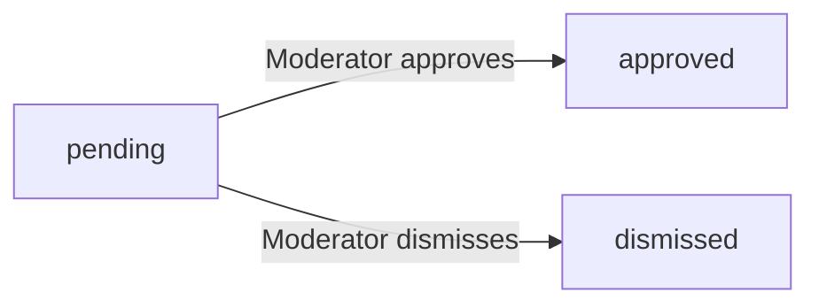

**community — Business rules, validation constraints, data browsing expectations, error scenarios**

Business rules, validation constraints, data browsing expectations, error scenarios

# Domain Business Rules

Per-concept business rules, validation logic, and domain constraints.

## User Rules

Every user account requires a unique email address and a unique username across the entire platform. Both the email and username must be provided at the time of sign-up and cannot be left blank. A username, once chosen, must remain unique so no two users can share the same identifier. The email address must also be unique, ensuring each account is tied to a distinct contact address. Users authenticate using their email and password combination. Users are allowed to change their own password after they are logged in. When a user deletes their account, all posts and comments they have created are also permanently deleted as part of that action. A user's karma score is a single numeric value that reflects cumulative votes received across all their posts and comments, and it can be negative. No user may vote on their own posts or comments — the system should only allow votes from other users. Users may only edit or delete content they themselves own, such as their own posts and comments.

### Account Identity and Sign-Up Constraints

THE system SHALL require a valid email address and a password at the time of account registration.

THE system SHALL require a username at the time of account registration.

THE system SHALL enforce uniqueness of email addresses across all user accounts on the platform, so that no two accounts may share the same email address.

THE system SHALL enforce uniqueness of usernames across all user accounts on the platform, so that no two accounts may share the same username.

IF a user attempts to register with an email address that is already associated with an existing account, THEN THE system SHALL reject the registration and indicate that the email address is already in use.

IF a user attempts to register with a username that is already taken by an existing account, THEN THE system SHALL reject the registration and indicate that the username is already taken.

IF a user submits a registration request without providing an email address, THEN THE system SHALL reject the request.

IF a user submits a registration request without providing a password, THEN THE system SHALL reject the request.

IF a user submits a registration request without providing a username, THEN THE system SHALL reject the request.

WHEN a user account is successfully created, THE system SHALL associate that account with the provided email address and username as permanent unique identifiers, where the username cannot be reassigned to another user.

### Password Change Rule

WHILE a user is logged in, THE system SHALL allow that user to change their own account password.

WHEN a logged-in user requests a password change, THE system SHALL require the user to provide their current password for verification before accepting the new password.

IF the current password provided during a password change request does not match the account's existing password, THEN THE system SHALL reject the change.

IF a user who is not logged in attempts to change a password, THEN THE system SHALL reject the request.

### Account Deletion and Content Cascade

WHILE a user is logged in, THE system SHALL allow that user to permanently delete their own account.

WHEN a user deletes their account, THE system SHALL permanently delete all posts that user has created across all communities.

WHEN a user deletes their account, THE system SHALL permanently delete all comments that user has written across all posts.

WHEN a user deletes their account, THE system SHALL remove all votes that user has cast on posts and comments, and THE system SHALL adjust the vote scores of affected posts and comments accordingly.

WHEN a user deletes their account, THE system SHALL also adjust the karma scores of other users whose content received votes from the deleted account, reversing those vote contributions.

IF a user who is not logged in attempts to delete an account, THEN THE system SHALL reject the request.

THE account deletion action is irreversible; once an account is deleted, all associated data is permanently removed and cannot be restored.

### Karma Score Rules

THE system SHALL maintain a single karma score for each user that represents the cumulative total of votes received on all of that user's posts and comments across the entire platform.

WHEN another user upvotes a post or comment authored by a given user, THE system SHALL increment that author's karma score by 1.

WHEN another user downvotes a post or comment authored by a given user, THE system SHALL decrement that author's karma score by 1.

WHEN a user who had previously voted on a post or comment removes their vote, THE system SHALL reverse the karma change that was applied when that vote was originally cast, adjusting the author's karma score accordingly.

WHEN a user changes their vote direction (e.g., from upvote to downvote), THE system SHALL reverse the previous karma effect and apply the new effect, resulting in a net change of 2 to the author's karma score.

THE system SHALL allow a user's karma score to be negative if the cumulative downvotes on their content exceed cumulative upvotes.

THE system SHALL display a user's current karma score as a single integer on their profile page.

### Content Ownership and Self-Voting Prohibition

THE system SHALL associate every post with the user who created it as that post's author, establishing content ownership.

THE system SHALL associate every comment with the user who wrote it as that comment's author, establishing content ownership.

WHILE a user is logged in, THE system SHALL allow that user to edit only content they themselves authored, including their own posts and their own comments.

WHILE a user is logged in, THE system SHALL allow that user to delete only content they themselves authored, including their own posts and their own comments.

IF a user attempts to edit a post or comment that was authored by a different user, THEN THE system SHALL reject the request.

IF a user attempts to delete a post or comment that was authored by a different user, THEN THE system SHALL reject the request, unless that user holds a moderator or owner role in the community where the content was posted.

IF a user attempts to vote on their own post, THEN THE system SHALL reject the vote and not apply any change to the vote score or karma.

IF a user attempts to vote on their own comment, THEN THE system SHALL reject the vote and not apply any change to the vote score or karma.

THE self-voting prohibition applies to both upvotes and downvotes; a user may never influence their own karma score through their own voting actions.

## UserProfile Rules

Every user automatically has a profile associated with their account. A user's profile may include a display name, a bio text, and an avatar image, all of which are optional fields. Users may edit only their own display name, bio, and avatar; they cannot modify another user's profile. A display name is distinct from the username and may be changed at any time. The bio is free-form text that the user can use to describe themselves. The avatar is an image file that represents the user visually on the platform. Any user — whether the profile owner or another logged-in user — can view any profile. A profile page publicly displays the user's display name, bio, avatar, total karma score, all posts they have created, and all comments they have written. The total karma score shown on the profile reflects the cumulative impact of all upvotes and downvotes received on both posts and comments.

### Profile Fields and Optionality

THE community system SHALL allow a user profile to exist with all three optional fields — display name, bio text, and avatar image — left empty.

WHEN a user creates an account, THE community system SHALL automatically initialize that user's profile with no display name, no bio text, and no avatar image set.

THE community system SHALL treat the display name as a separate, independent value from the username; changing the display name SHALL NOT affect the username, and changing the username is not permitted after account creation.

WHEN a user provides a display name, THE community system SHALL accept any non-empty text value as a valid display name.

WHEN a user provides bio text, THE community system SHALL accept it as free-form text with no required structure.

WHEN a user provides an avatar image, THE community system SHALL accept it as an image file upload.

IF a user submits a profile update with all fields left empty or cleared, THEN THE community system SHALL save the profile with all three fields unset, reflecting an empty profile state.

### Profile Editing Constraints

THE community system SHALL allow only the profile owner to edit their own display name, bio text, and avatar image.

WHEN a logged-in user attempts to edit a profile that belongs to another user, THE community system SHALL reject the request.

WHEN a guest (not logged in) attempts to edit any user profile, THE community system SHALL reject the request.

THE community system SHALL apply edits to the display name, bio text, and avatar image independently; a user may update any single field without being required to provide the others.

WHEN a user removes their avatar image, THE community system SHALL update the profile so that no avatar image is shown.

WHEN a user clears their display name, THE community system SHALL update the profile so that no display name is shown.

### Profile Visibility

THE community system SHALL allow any user — whether logged in or a guest — to view any other user's profile.

THE community system SHALL display the following information on a profile page: the user's display name (if set), bio text (if set), avatar image (if set), total karma score, all posts created by the user, and all comments written by the user.

WHEN a profile has no display name set, THE community system SHALL fall back to showing the username in contexts where a name identifier is needed.

IF a requested user profile does not exist (e.g., the username is not found), THEN THE community system SHALL reject the request and indicate the profile was not found.

### Karma Score Display on Profile

THE community system SHALL display the total karma score on a user's profile page as a single aggregated integer.

THE community system SHALL compute the displayed karma score as the cumulative sum of all upvotes minus all downvotes received on both posts and comments authored by that user.

THE community system SHALL reflect karma score changes in real time as votes are cast, changed, or removed on the user's posts and comments.

THE community system SHALL allow the displayed karma score to be a negative number when a user has received more downvotes than upvotes across their content.

### Post and Comment Lists on Profile

THE community system SHALL display a list of all posts created by the user on their profile page.

THE community system SHALL display a list of all comments written by the user on their profile page.

WHEN a user's post is deleted — whether by the author or by a community moderator — THE community system SHALL remove that post from the user's profile post list.

WHEN a user's comment is deleted — whether by the author or by a community moderator — THE community system SHALL remove that comment from the user's profile comment list.

WHEN a user deletes their account, THE community system SHALL remove all associated posts and comments, and those items SHALL no longer appear in any profile listing.

THE community system SHALL show post and comment lists on a profile to any viewer, including guests, consistent with the general profile visibility rule (defined in "Profile Visibility").

## Community Rules

Any logged-in user can create a community. Each community must have a unique name that does not conflict with any existing community name on the platform. A community name is required at creation and cannot be blank. A community may also have an optional description text and an optional icon image. The user who creates a community automatically becomes its owner. Each community displays its subscriber count, which reflects the number of users currently subscribed. Communities can be browsed by all users in a list, and users can search for communities by their name. Creating a post within a community requires the posting user to be an active subscriber of that community. A community's name uniqueness is enforced platform-wide, meaning no two communities may share the same name.

### Community Creation Eligibility and Ownership

WHEN a logged-in user submits a request to create a community, THE system SHALL permit the creation.

IF a guest (unauthenticated user) attempts to create a community, THEN THE system SHALL reject the request.

WHEN a community is successfully created, THE system SHALL automatically assign the creating user as the owner of that community.

WHEN ownership is assigned, THE system SHALL also record the creator as a moderator with the owner role, as defined in the CommunityModerator domain model.

THE system SHALL ensure that exactly one owner exists per community at all times and that the owner role cannot be transferred or left vacant.

### Community Name Requirements and Uniqueness

THE system SHALL require a community name to be provided when creating a community.

IF a community creation request is submitted without a name, or with a blank name, THEN THE system SHALL reject the request.

THE system SHALL enforce platform-wide uniqueness for community names, meaning no two communities may share the same name at any point in time.

IF a user attempts to create a community with a name that already exists on the platform, THEN THE system SHALL reject the request.

THE system SHALL apply name uniqueness checks in a case-insensitive manner so that names differing only in letter casing are treated as duplicates.

WHEN a community is successfully created, THE system SHALL record and display the community name exactly as provided by the creator.

### Optional Community Description and Icon Image

THE system SHALL allow a community to be created without a description; description is optional.

THE system SHALL allow a community to be created without an icon image; icon image is optional.

WHERE a description is provided, THE system SHALL store and display it on the community page.

WHERE an icon image is provided, THE system SHALL store and display it as the community's visual identifier.

IF no icon image is provided, THEN THE system SHALL display the community without a custom icon (e.g., using a default placeholder).

IF no description is provided, THEN THE system SHALL display the community without a description text.

### Subscriber Count Display

THE system SHALL maintain and display an accurate subscriber count for each community.

THE subscriber count SHALL reflect the number of users who currently have an active subscription to that community.

WHEN a user subscribes to a community, THE system SHALL increment that community's subscriber count by one.

WHEN a user unsubscribes from a community, THE system SHALL decrement that community's subscriber count by one.

THE system SHALL display the subscriber count to all users — both logged-in members and guests — when viewing community information.

### Subscription Requirement for Posting

WHILE a user is not an active subscriber of a community, THE system SHALL prevent that user from creating a post in that community.

IF a logged-in user who is not subscribed to a community attempts to create a post in it, THEN THE system SHALL reject the request.

IF a guest attempts to create a post in any community, THEN THE system SHALL reject the request.

WHEN a user subscribes to a community and their subscription becomes active, THE system SHALL immediately allow them to create posts in that community, subject to any ban restrictions (defined in Ban Rules).

IF a user is banned from a community, THEN THE system SHALL prevent them from creating posts or comments in that community regardless of their subscription status, as defined in Ban Rules.

### Community List Browsing and Search

THE system SHALL provide a browsable list of all communities on the platform, accessible to both logged-in members and guests.

THE community list SHALL display each community's name, description (if present), icon image (if present), and current subscriber count.

THE community list SHALL be paginated so that users can navigate through all available communities.

THE system SHALL provide a search function that allows users to find communities by name.

WHEN a user submits a search query for communities, THE system SHALL return all communities whose names match or contain the search term.

THE community search functionality SHALL be available to both logged-in members and guests.

IF a search query matches no community names, THEN THE system SHALL return an empty result set rather than an error.

## CommunityModerator Rules

The community owner holds the highest authority role within a community. The owner can add users as moderators and can also remove any moderator from their role. Moderators have the ability to add other users as moderators as well. However, moderators cannot remove each other — only the owner has the authority to remove a moderator. Moderators and the owner cannot remove the owner from their role. A user may hold either the owner role or the moderator role within a community, and these roles are mutually exclusive. The owner role is assigned automatically to the community creator and cannot be transferred through normal moderator management actions. Moderators can delete any post or comment within their community, ban users from the community, unban users, and view a list of all banned users. Moderators can also view and act on all reports submitted within their community.

### Role Hierarchy and Assignment

THE community platform SHALL recognize two distinct moderator roles within any community: owner and moderator.

THE community platform SHALL treat the owner role as the highest authority within a community, superseding all moderator privileges.

WHEN a user creates a community, THE community platform SHALL automatically assign that user the owner role for that community.

THE community platform SHALL enforce that a user may hold only one role within a given community — either owner or moderator, never both simultaneously.

THE community platform SHALL prevent the owner role from being transferred or reassigned through any moderator management action.

IF a user already holds the owner role in a community, THEN THE community platform SHALL reject any attempt to assign them the moderator role in that same community.

IF a user already holds the moderator role in a community, THEN THE community platform SHALL reject any attempt to assign them the owner role through standard moderator management.

### Moderator Management Rules

WHEN the owner requests to add a user as moderator in their community, THE community platform SHALL create a moderator role entry for that user in the community.

WHEN a moderator requests to add a user as moderator in their community, THE community platform SHALL create a moderator role entry for that user in the community.

IF the user being added as moderator already holds any role (owner or moderator) in that community, THEN THE community platform SHALL reject the add-moderator request.

WHEN the owner requests to remove a moderator from their community, THE community platform SHALL revoke the moderator role of the specified user.

IF a moderator attempts to remove another moderator from the community, THEN THE community platform SHALL reject the request, as only the owner may remove moderators.

IF a moderator attempts to remove the owner from the community, THEN THE community platform SHALL reject the request.

IF the owner attempts to remove themselves (the owner) from the moderator management system, THEN THE community platform SHALL reject the request, as the owner role cannot be relinquished through moderator management actions.

IF a non-moderator, non-owner user attempts to perform any moderator management action, THEN THE community platform SHALL reject the request.

### Content Moderation Actions

WHILE a user holds the owner or moderator role in a community, THE community platform SHALL allow that user to delete any post that belongs to that community.

WHEN a moderator or owner deletes a post, THE community platform SHALL remove the post and all its associated comments from the community's visible content.

WHILE a user holds the owner or moderator role in a community, THE community platform SHALL allow that user to delete any comment on any post within that community, regardless of comment nesting depth.

WHEN a moderator or owner deletes a comment, THE community platform SHALL remove that comment and all its nested replies from the visible content.

IF a user who is neither owner nor moderator of a community attempts to delete another user's post or comment in that community, THEN THE community platform SHALL reject the request.

IF a moderator attempts to moderate content (delete a post or comment) in a community where they do not hold a moderator or owner role, THEN THE community platform SHALL reject the request.

### User Ban Management

WHILE a user holds the owner or moderator role in a community, THE community platform SHALL allow that user to ban any member from that community.

WHEN a moderator or owner bans a user from a community, THE community platform SHALL prevent that user from creating posts or comments in that community.

IF a banned user attempts to create a post in the community where they are banned, THEN THE community platform SHALL reject the request.

IF a banned user attempts to write a comment on any post within the community where they are banned, THEN THE community platform SHALL reject the request.

THE community platform SHALL allow a banned user to continue viewing posts, comments, and other content within the community where they are banned.

WHILE a user holds the owner or moderator role in a community, THE community platform SHALL allow that user to unban a previously banned member.

WHEN a moderator or owner unbans a user, THE community platform SHALL restore that user's ability to post and comment in the community.

THE community platform SHALL allow moderators and the owner to view the complete list of currently banned users within their community.

IF a user who is neither owner nor moderator attempts to ban or unban another user in a community, THEN THE community platform SHALL reject the request.

THE community platform SHALL prevent the owner or moderators from being banned from their own community through the standard ban mechanism.

### Report Management

WHILE a user holds the owner or moderator role in a community, THE community platform SHALL allow that user to view all pending reports submitted against posts and comments within that community.

THE community platform SHALL display each report with the reported content, the identity of the reporter, and the reason provided by the reporter.

WHEN a moderator or owner approves a report, THE community platform SHALL delete the reported post or comment from the community.

WHEN a moderator or owner dismisses a report, THE community platform SHALL remove the report from the active report list without deleting the reported content.

IF a report has already been approved or dismissed, THEN THE community platform SHALL prevent further moderator action on that same report.

IF a user who is neither owner nor moderator of a community attempts to view, approve, or dismiss reports in that community, THEN THE community platform SHALL reject the request.

THE community platform SHALL restrict each moderator's report management access to only the communities in which they hold an owner or moderator role.

## Subscription Rules

Any logged-in user may subscribe to any community on the platform. A user can only hold one active subscription to a given community at a time — duplicate subscriptions to the same community are not allowed. Users can unsubscribe from any community they are currently subscribed to. Subscription is a prerequisite for creating posts within a community; users who are not subscribed to a community cannot post in it. Users can view the full list of communities they are currently subscribed to. Subscribing or unsubscribing does not affect a user's ability to view content in the community. A banned user's subscription status does not grant them the right to post in a community they are banned from.

### Subscription Eligibility and Uniqueness

Any logged-in member may subscribe to any community on the platform without restriction.

THE system SHALL allow a member to hold at most one active subscription to any given community at a time.

IF a member attempts to subscribe to a community they are already actively subscribed to, THEN THE system SHALL reject the request.

WHEN a member subscribes to a community, THE system SHALL record the subscription as active and associate it with both the member and the community.

A member's ability to subscribe to a community is not affected by whether they are a moderator, the owner, or an ordinary member of that community.

### Unsubscribing from a Community

A member may unsubscribe from any community they are currently subscribed to.

WHEN a member unsubscribes from a community, THE system SHALL deactivate their subscription to that community.

IF a member attempts to unsubscribe from a community they are not currently subscribed to, THEN THE system SHALL reject the request.

Unsubscribing from a community does not affect the member's ability to view content in that community; they retain full read access after unsubscribing.

### Subscription as a Prerequisite for Posting

An active subscription to a community is required before a member may create a post in that community.

IF a member attempts to create a post in a community they are not subscribed to, THEN THE system SHALL reject the request.

IF a member unsubscribes from a community after having posted in it, THEN THE system SHALL retain their existing posts in that community; only new post creation is blocked.

The subscription requirement applies regardless of the member's moderator status within the community — moderators and the owner must also be subscribed to post.

### View Access Independent of Subscription

Subscription status does not govern a user's ability to view community content.

WHILE a user is not subscribed to a community, THE system SHALL still allow them to view all posts and comments within that community.

Guests (non-logged-in users) may also view community content without any subscription.

Subscribing or unsubscribing from a community SHALL NOT alter any existing read permissions for that community's content.

### Banned User Posting Restriction Despite Subscription

An active subscription does not grant a banned user the right to create posts or comments in the community that banned them.

IF a member is banned from a community and attempts to create a post or comment in that community, THEN THE system SHALL reject the request, even if the member holds an active subscription to that community.

A ban takes precedence over subscription status for all content creation actions within the community.

A banned member's subscription record may remain, but it confers no posting or commenting privileges while the ban is in effect.

### Viewing Subscribed Communities

A logged-in member may view the full list of communities they are currently actively subscribed to.

THE system SHALL return only communities with an active subscription status when a member requests their subscribed communities list.

IF a member has no active subscriptions, THEN THE system SHALL return an empty list.

The subscribed communities list is private to the subscribing member and is not visible to other users.

## Post Rules

Every post must have a title, which is a required field and cannot be left blank. A post must belong to exactly one of three types: text post, link post, or image post. A text post requires text content as its body. A link post requires a URL to be provided. An image post requires an uploaded image file. A user may only create a post in a community they are actively subscribed to. Users can edit their own posts after creation. Users can delete their own posts. Moderators of the community where the post was made can also delete any post within that community. When a post is viewed individually, the displayed information includes the title, the full content, the author, the community it belongs to, the vote score, the comment count, and when it was posted. Deleting a user's account causes all of their posts to be deleted as well.

### Post Type and Content Validation

THE system SHALL require every post to have a non-empty title before it is accepted.

THE system SHALL require every post to be assigned exactly one of three types: text, link, or image. No post may be saved without a recognized type.

WHEN a post is submitted as a text post, THE system SHALL require that the text content body is present and non-empty. If the text content is absent or blank, the request is rejected.

WHEN a post is submitted as a link post, THE system SHALL require that a URL is provided. If the URL is absent or blank, the request is rejected.

WHEN a post is submitted as an image post, THE system SHALL require that an image file is uploaded. If no image file is attached, the request is rejected.

IF a post is submitted with a title that is absent or blank, THEN THE system SHALL reject the request.

IF a post is submitted with a type that does not match text, link, or image, THEN THE system SHALL reject the request.

IF a post is submitted with content that does not match its declared type (e.g., a URL provided for a text post, or text content provided for a link post), THEN THE system SHALL disregard the mismatched content and only accept content that corresponds to the declared post type.

THE system SHALL NOT allow a single post to carry content belonging to more than one post type simultaneously.

### Subscription Requirement for Posting

WHEN a member attempts to create a post in a community, THE system SHALL verify that the member has an active subscription to that community before accepting the post.

IF a member attempts to create a post in a community they are not subscribed to, THEN THE system SHALL reject the request.

IF a member's subscription to a community is cancelled or becomes inactive, THEN THE system SHALL prevent that member from creating new posts in that community until an active subscription is re-established.

THE system SHALL evaluate subscription status at the time the post creation request is made, not at any earlier point.

### Post Editing Rules

WHILE a post exists and has not been deleted, THE system SHALL allow the original author of the post to edit its content.

THE system SHALL allow the author to edit the text content of a text post.

THE system SHALL allow the author to edit the URL of a link post.

THE system SHALL allow the author to edit the image of an image post.

THE system SHALL allow the author to edit the title of a post.

IF a member attempts to edit a post they did not author, THEN THE system SHALL reject the request.

IF a guest (unauthenticated user) attempts to edit any post, THEN THE system SHALL reject the request.

THE system SHALL NOT allow changing the type of a post after it has been created (e.g., converting a text post into a link post is not permitted).

### Post Deletion Rules

THE system SHALL allow the original author of a post to delete their own post at any time.

THE system SHALL allow a community moderator (including the owner) to delete any post within the community they moderate.

IF a member attempts to delete a post they did not author and are not a moderator of the relevant community, THEN THE system SHALL reject the request.

IF a guest attempts to delete any post, THEN THE system SHALL reject the request.

WHEN a post is deleted, THE system SHALL also remove all comments associated with that post.

WHEN a post is deleted, THE system SHALL also remove all votes associated with that post, and adjust the karma scores of affected users accordingly.

WHEN a user's account is deleted, THE system SHALL automatically delete all posts that user has authored, along with their associated comments, votes, and reports, as defined in the User Rules.

### Post Display Requirements

WHEN a single post is viewed in detail, THE system SHALL display the following information: the post title, the full content appropriate to the post type (text body, URL, or image), the author's username, the community the post belongs to, the current vote score, the total number of comments, and the time at which the post was created.

THE system SHALL calculate the vote score of a post as the total number of upvotes minus the total number of downvotes at any given moment.

THE system SHALL calculate the comment count as the total number of all comments and replies associated with the post, regardless of nesting depth.

THE system SHALL reflect changes to vote score in real time as votes are cast, changed, or removed.

WHEN a post is viewed as part of a feed list, THE system SHALL display the title, author username, community name, vote score, comment count, and time since posting. For text posts, the first 200 characters of the text content shall also be shown. For image posts, a thumbnail of the uploaded image shall be shown. For link posts, the domain name extracted from the URL shall be shown.

## PostVote Rules

Each user may cast at most one vote per post at any given time. A vote can be either an upvote or a downvote. An upvote adds 1 to the post's vote score, while a downvote subtracts 1. A user who has already voted on a post may change their vote from upvote to downvote or from downvote to upvote. A user may also remove their vote entirely, returning the post's score to its state before their vote. The vote score of a post equals the total number of upvotes minus the total number of downvotes. When a user's vote is cast, changed, or removed, the karma of the post's author is adjusted by +1, -1, or the reversal of the previous vote effect accordingly. Users cannot vote on their own posts.

### Vote Uniqueness and Self-Vote Prohibition

Each user may hold at most one active vote on any given post at any point in time. If a user attempts to cast a second vote on a post they have already voted on without first changing or removing their existing vote, the request is rejected.

A user may not vote on their own post. If a user attempts to upvote or downvote a post they authored, the request is rejected.

A user must be logged in to cast, change, or remove a vote. If a guest attempts to vote on a post, the request is rejected.

### Vote Score Calculation

The vote score of a post equals the total number of upvotes received minus the total number of downvotes received. The score is calculated dynamically from all active votes at the time of viewing.

An upvote adds 1 to the post's vote score. A downvote subtracts 1 from the post's vote score. Vote scores may be negative if downvotes outnumber upvotes.

### Casting, Changing, and Removing a Vote

When a user casts a vote on a post, the vote is recorded as either an upvote or a downvote.

When a user who has already cast an upvote on a post wishes to change their vote to a downvote, the previous upvote is replaced by the downvote. The post's vote score changes by −2 (removing the +1 upvote and applying the −1 downvote).

When a user who has already cast a downvote on a post wishes to change their vote to an upvote, the previous downvote is replaced by the upvote. The post's vote score changes by +2 (removing the −1 downvote and applying the +1 upvote).

When a user removes their vote entirely, the previously recorded vote (upvote or downvote) is deleted. The post's vote score reverts to the value it held before that user's vote was originally cast. If the removed vote was an upvote, the score decreases by 1; if it was a downvote, the score increases by 1.

If a user attempts to remove a vote from a post they have not voted on, the request is rejected. If a user attempts to change a vote on a post they have not voted on, the request is rejected.

### Post Vote Effect on Author Karma

When a user casts an upvote on a post, the karma score of the post's author increases by 1.

When a user casts a downvote on a post, the karma score of the post's author decreases by 1.

When a user changes their vote from upvote to downvote on a post, the post author's karma decreases by 2 (the +1 from the original upvote is reversed and the −1 from the new downvote is applied).

When a user changes their vote from downvote to upvote on a post, the post author's karma increases by 2 (the −1 from the original downvote is reversed and the +1 from the new upvote is applied).

When a user removes an upvote from a post, the post author's karma decreases by 1 to reverse the previous upvote effect.

When a user removes a downvote from a post, the post author's karma increases by 1 to reverse the previous downvote effect.

Karma adjustments are applied immediately upon any vote action and may result in a negative karma score for the author. Self-votes are prohibited (defined in "Vote Uniqueness and Self-Vote Prohibition"), so a user's own karma is never affected by their own post votes.

## Comment Rules

Any logged-in user may write a comment on any post. A comment's content is required and cannot be blank. Users may reply to any existing comment, creating a threaded reply structure with no limit on nesting depth. Users can edit their own comments after posting. Users can delete their own comments. Moderators of the community where the comment was posted can also delete any comment within that community. Each comment displays the author, the content, the vote score, the time since it was posted, and any nested replies beneath it. Deleting a user's account causes all of their comments to be deleted as well. A banned user in a community cannot post new comments in that community.

### Comment Content and Eligibility Rules

Any logged-in member may write a comment on any post regardless of which community the post belongs to, with one exception: a user who has been banned from the community where the post was published cannot create new comments in that community (ban rules are defined in the Ban Rules section).

A comment's content is required. A comment with no content, or content that is blank (containing only whitespace), is rejected.

Users may reply to any existing comment, creating a threaded conversation. There is no limit on how deeply replies can be nested — a reply can itself receive replies, and those replies can receive further replies, continuing without restriction.

Each reply is attached to its parent comment. A reply inherits the same content requirement as a top-level comment: the reply's content must not be empty or blank.

Guest users (not logged in) cannot create comments or replies. Any attempt by a guest to submit a comment is rejected.

### Comment Editing and Deletion Rules

A comment's author may edit the content of their own comment after it has been posted. Editing is permitted at any time and any number of times. The edited content must still satisfy the content requirement — an edit that results in blank content is rejected.

A comment's author may delete their own comment at any time. Deleting a comment removes it from the community.

A moderator of the community where the comment was posted may delete any comment within that community, regardless of who authored it. Moderator deletion authority applies only within the communities they moderate.

When a user's account is deleted, all comments that user has written are also deleted. This applies to every comment across all communities, including both top-level comments and replies at any nesting depth.

Deleting a comment also removes all replies nested beneath it, at every level of depth. The deletion cascades through the entire reply chain rooted at the deleted comment.

A user who is not the comment's author, and who is not a moderator of the relevant community, cannot delete a comment authored by someone else. Such a request is rejected.

### Comment Display Rules

Each comment displays the following information: the author's username, the comment's content, the vote score (total upvotes minus total downvotes), and the time elapsed since the comment was posted.

All direct replies to a comment are displayed nested beneath it. Each reply follows the same display format as a top-level comment — author, content, vote score, time since posted — and in turn shows its own nested replies beneath it. This nesting continues for all levels of depth.

The vote score of a comment reflects the current state of all votes cast on it. Vote score calculation follows the same rule as for posts: upvotes increase the score by one each, and downvotes decrease it by one each. The detailed voting rules are defined in the CommentVote Rules section.

## CommentVote Rules

Each user may cast at most one vote per comment at any given time. A comment vote can be either an upvote or a downvote. An upvote adds 1 to the comment's vote score, while a downvote subtracts 1. Users who have already voted on a comment may change their vote from upvote to downvote or vice versa. Users may also remove their vote on a comment entirely, restoring the comment's score to its prior state. The vote score of a comment equals total upvotes minus total downvotes. When a comment vote is cast, changed, or removed, the karma of the comment's author is adjusted correspondingly. Users cannot vote on their own comments.

### One Vote Per User Per Comment

THE system SHALL allow each user to hold at most one active vote on any single comment at a given time.

WHEN a user attempts to cast a vote on a comment they have already voted on, THE system SHALL reject the duplicate vote submission and treat the action as a vote change request instead.

IF a user has no existing vote on a comment, THEN THE system SHALL accept a new upvote or downvote from that user.

IF a user has an existing vote on a comment, THEN THE system SHALL only allow that user to change or remove their existing vote, not add a second vote.

### No Self-Voting on Comments

WHEN a user attempts to vote on a comment they authored, THE system SHALL reject the request.

IF the requesting user is the same user who authored the comment, THEN THE system SHALL not record any vote and shall not alter the comment's vote score or the author's karma.

THE system SHALL apply the self-voting restriction regardless of vote type (upvote or downvote).

### Vote Score Calculation for Comments

THE system SHALL calculate a comment's vote score as the total number of upvotes minus the total number of downvotes received on that comment.

WHEN a user casts an upvote on a comment, THE system SHALL add 1 to that comment's vote score.

WHEN a user casts a downvote on a comment, THE system SHALL subtract 1 from that comment's vote score.

THE system SHALL allow a comment's vote score to be zero, positive, or negative.

THE system SHALL reflect the updated vote score immediately after a vote is cast, changed, or removed.

### Changing a Comment Vote

WHEN a user who has already cast an upvote on a comment submits a downvote on the same comment, THE system SHALL replace the existing upvote with a downvote and adjust the comment's vote score by subtracting 2 (removing the +1 from the prior upvote and applying the −1 from the new downvote).

WHEN a user who has already cast a downvote on a comment submits an upvote on the same comment, THE system SHALL replace the existing downvote with an upvote and adjust the comment's vote score by adding 2 (removing the −1 from the prior downvote and applying the +1 from the new upvote).

THE system SHALL ensure that at no point does a user hold both an upvote and a downvote on the same comment simultaneously.

### Removing a Comment Vote

WHEN a user removes their existing vote from a comment, THE system SHALL delete that vote record and restore the comment's vote score to the value it held before that vote was cast.

IF the removed vote was an upvote, THEN THE system SHALL subtract 1 from the comment's vote score.

IF the removed vote was a downvote, THEN THE system SHALL add 1 to the comment's vote score.

IF a user has no existing vote on a comment, THEN THE system SHALL reject a vote removal request for that comment.

### Comment Vote Effect on Author Karma

WHEN a user casts an upvote on a comment, THE system SHALL increase the karma score of the comment's author by 1.

WHEN a user casts a downvote on a comment, THE system SHALL decrease the karma score of the comment's author by 1.

WHEN a user changes their vote on a comment from upvote to downvote, THE system SHALL decrease the comment author's karma by 2 (reversing the prior +1 and applying a new −1).

WHEN a user changes their vote on a comment from downvote to upvote, THE system SHALL increase the comment author's karma by 2 (reversing the prior −1 and applying a new +1).

WHEN a user removes an upvote from a comment, THE system SHALL decrease the comment author's karma by 1.

WHEN a user removes a downvote from a comment, THE system SHALL increase the comment author's karma by 1.

THE system SHALL allow a comment author's karma to become or remain negative as a result of downvotes or vote removals.

## Ban Rules

Only moderators (including the owner) of a community can ban a user from that community. A ban is scoped to a specific community — being banned from one community does not affect a user's standing in any other community. A banned user may still view content in the community they are banned from, but they cannot create new posts or comments there. Moderators can unban a user, restoring their ability to post and comment in the community. The reason for a ban is optional and may be left blank by the moderator. Moderators can view the full list of currently banned users in their community. A user cannot be banned from a community they own, as the owner role supersedes moderation restrictions. A moderator should not be able to ban the community owner.

### Ban Authority and Scope

WHEN a moderator or owner issues a ban, THE system SHALL restrict the targeted user's ability to create posts or comments within that specific community only.

THE system SHALL scope every ban to a single community, such that a user banned from one community retains full posting and commenting privileges in all other communities.

IF the targeted user holds the owner role in the community where the ban is being issued, THEN THE system SHALL reject the ban request, as the owner role supersedes all moderation restrictions.

IF the requesting user is not a moderator or owner of the community, THEN THE system SHALL reject the ban request.

THE system SHALL allow a moderator to ban any regular member or any other moderator, but SHALL prevent a moderator from banning the community owner.

WHEN a ban is issued, THE system SHALL record which moderator issued the ban, along with the time the ban was applied.

### Banned User Restrictions and Viewing Access

WHILE a user is banned from a community, THE system SHALL prevent that user from creating new posts in that community.

WHILE a user is banned from a community, THE system SHALL prevent that user from creating new comments on any post within that community.

WHILE a user is banned from a community, THE system SHALL still allow that user to view all content within that community, including posts, comments, and community details.

IF a banned user attempts to create a post or comment in the community they are banned from, THEN THE system SHALL reject the request.

### Unbanning and Ban Reason

WHEN a moderator or owner issues an unban for a previously banned user, THE system SHALL restore that user's ability to create posts and comments in the community.

IF the requesting user is not a moderator or owner of the community, THEN THE system SHALL reject the unban request.

THE system SHALL accept a ban issued without a reason, as the reason field is optional.

WHERE a reason is provided, THE system SHALL record and display it as part of the ban record.

### Banned Users List

THE system SHALL provide moderators and the owner of a community with access to the full list of currently banned users in that community.

IF the requesting user is not a moderator or owner of the community, THEN THE system SHALL deny access to the banned users list.

THE system SHALL display, for each entry in the banned users list: the banned user's identity, the moderator who issued the ban, the time the ban was applied, and the ban reason if one was provided.

THE system SHALL include only currently active bans in the banned users list, excluding any users who have since been unbanned.

## Report Rules

Any user can report a post or a comment. When submitting a report, the reporting user must provide a reason, which is required and cannot be blank. A report targets either a post or a comment, but not both at the same time. Moderators of the relevant community can view all pending reports for content within their community. Each report record shows the reported content, the identity of who submitted the report, and the reason provided. Moderators can take one of two actions on a report: approve it, which deletes the reported content, or dismiss it, which keeps the content and removes the report from the active list. Dismissed reports are no longer visible in the moderator's report list. Approved reports result in the content being deleted from the platform. A report has a status that is one of: pending, approved, or dismissed.

### Report Submission Rules

THE system SHALL allow any logged-in member to submit a report against any post or comment visible on the platform.

WHEN a member submits a report, THE system SHALL require a non-blank reason text; if the reason is absent or contains only whitespace, THE system SHALL reject the report submission.

WHEN a report is submitted, THE system SHALL associate it with exactly one target: either a post or a comment, never both simultaneously. A single report record cannot reference both a post and a comment at the same time.

IF a member attempts to submit a report without specifying a target post or comment, THEN THE system SHALL reject the submission.

IF a member attempts to report content that does not exist or has already been deleted, THEN THE system SHALL reject the submission.

WHEN a report is successfully created, THE system SHALL assign it the initial status of "pending".

THE system SHALL record the identity of the reporting member at the time the report is submitted, and this attribution cannot be changed after submission.

### Report Visibility and Content Display for Moderators

WHILE a member holds the role of owner or moderator in a community, THE system SHALL allow that member to view all pending reports for posts and comments belonging to that community.

THE system SHALL scope the report list shown to a moderator strictly to content within their own community; a moderator cannot view reports from communities they do not moderate.

WHEN a moderator views the report list, THE system SHALL display for each report: the full content of the reported post or comment, the username of the member who submitted the report, and the reason text provided at submission time.

IF a guest (unauthenticated user) attempts to access the report list for any community, THEN THE system SHALL deny access.

IF a logged-in member who is not a moderator of the relevant community attempts to view its report list, THEN THE system SHALL deny access.

### Report Resolution: Approve and Dismiss

WHILE a member holds the role of owner or moderator in a community, THE system SHALL allow that moderator to take one of two resolution actions on any pending report in their community: approve or dismiss.

WHEN a moderator approves a report, THE system SHALL permanently delete the reported content (the post or comment) from the platform and transition the report status to "approved".

WHEN a moderator dismisses a report, THE system SHALL keep the reported content intact and transition the report status to "dismissed".

WHEN a report is dismissed, THE system SHALL remove it from the active (pending) report list so it is no longer visible in the moderator's report queue.

IF a moderator attempts to act on a report that is already in the "approved" or "dismissed" status, THEN THE system SHALL reject the action, as only pending reports may be resolved.

IF a non-moderator member attempts to approve or dismiss any report, THEN THE system SHALL deny the action.

### Report Status Lifecycle

THE system SHALL maintain a status for every report record, which must be exactly one of: "pending", "approved", or "dismissed".

WHEN a report is first created, THE system SHALL set its status to "pending".

WHEN a moderator approves a pending report, THE system SHALL transition its status to "approved".

WHEN a moderator dismisses a pending report, THE system SHALL transition its status to "dismissed".

THE system SHALL NOT allow a report status to transition from "approved" or "dismissed" back to "pending" or to any other status; report resolution is final.

Approved reports result in the associated content being permanently removed. Dismissed reports are excluded from the active moderator report list but their records are retained for audit purposes as defined in the data retention policy.

# Data Browsing Expectations

Business expectations for how users browse, find, and navigate through lists of data.

## List Browsing Expectations

Define business expectations for how users find, filter, and browse lists.

### Filtering

THE community platform SHALL provide three distinct post feed scopes: a Home Feed restricted to communities the authenticated user is subscribed to, a Popular Feed that spans all communities across the platform, and a Community Feed scoped to a single specific community.

WHEN a guest (unauthenticated) user accesses the platform, THE system SHALL make only the Popular Feed and Community Feed available; the Home Feed SHALL be accessible only to authenticated users.

WHEN a user browses the Community Feed, THE system SHALL display only posts that belong to the selected community.

WHEN a user browses the Home Feed, THE system SHALL display only posts from communities to which the user currently holds an active subscription.

WHEN a user searches for communities, THE system SHALL filter results to only those whose name contains the search term, matching regardless of letter case.

WHEN the Top sorting option is selected for any feed, THE system SHALL allow the user to apply a time-range filter, restricting results to posts created within: today, this week, this month, this year, or all time.

IF a user selects the Top sort without specifying a time-range filter, THEN THE system SHALL apply a default time range to the results.

WHILE a user browses any feed, THE system SHALL apply the active feed scope and sorting criteria together, so that only posts within the relevant scope appear in the sorted order.

### Sorting

THE community platform SHALL support four sorting modes for all post feeds (Home, Popular, and Community):

- **Hot**: Posts that are recent and have accumulated many upvotes appear first. Both recency and vote score are considered together.
- **New**: Posts are ordered strictly by their creation time, with the most recently created post appearing first.
- **Top**: Posts are ordered by their vote score (total upvotes minus total downvotes), highest first. A time-range filter (defined in the Filtering section) is applied to restrict which posts are considered.
- **Controversial**: Posts that have received many votes but whose net score is close to zero appear first, reflecting high disagreement among voters.

WHEN a user views comments on a post, THE system SHALL support three comment sorting modes:

- **Best**: Comments with the highest vote score appear first.
- **New**: Comments are ordered strictly by creation time, most recent first.
- **Controversial**: Comments with many votes but a net score close to zero appear first.

WHEN comment sorting is applied, THE system SHALL apply the selected sort order to the entire comment thread, including nested replies at every depth level.

IF no sorting preference is specified by the user when entering a feed, THEN THE system SHALL present posts in a default sorting order.

IF no sorting preference is specified when viewing comments, THEN THE system SHALL present comments in a default sorting order.

### Pagination

THE community platform SHALL paginate all post feed results (Home Feed, Popular Feed, and Community Feed), so that posts are delivered in discrete pages rather than as a single unbounded list.

THE community platform SHALL paginate the community browsing list, so that users can navigate through all communities across multiple pages.

THE community platform SHALL paginate the list of communities a user is subscribed to.

THE community platform SHALL paginate the list of posts displayed on a user's profile page.

THE community platform SHALL paginate the list of comments displayed on a user's profile page.

THE community platform SHALL paginate the list of reports visible to moderators within their community.

THE community platform SHALL paginate the list of banned users visible to moderators within their community.

WHEN a user navigates to a subsequent page of any paginated list, THE system SHALL apply the same active filtering and sorting criteria that were in effect on the first page, so that results remain consistent across pages.

IF a user reaches the last page of a paginated list, THEN THE system SHALL indicate that no further results are available.

# Error Conditions

Business error scenarios and how the system should respond.

## Error Scenarios

Describe error conditions and expected system responses in natural language.

### Authentication and Account Error Scenarios

WHEN a guest attempts to access a feature that requires a logged-in account (such as creating a post, submitting a comment, voting, subscribing, or reporting), THE system SHALL reject the request.

WHEN a user attempts to sign up with an email address that is already registered, THE system SHALL reject the registration request.

WHEN a user attempts to sign up with a username that is already taken by another account, THE system SHALL reject the registration request.

WHEN a user submits login credentials where the email does not match any registered account, THE system SHALL reject the login attempt without revealing whether the email or the password was incorrect.

WHEN a user submits login credentials where the password does not match the account associated with the given email, THE system SHALL reject the login attempt without revealing whether the email or the password was incorrect.

WHEN a logged-in user attempts to change their password but the current password provided does not match the one on record, THE system SHALL reject the password change request.

IF a user's session is no longer valid or has been terminated, THEN THE system SHALL reject any authenticated requests and treat the requester as a guest.

WHEN a user attempts to delete an account that does not belong to them, THE system SHALL reject the deletion request.

### Resource Not Found and Non-Existent Target Errors

WHEN a user requests to view, vote on, edit, delete, or report a post that does not exist, THE system SHALL reject the request.

WHEN a user requests to view, vote on, edit, delete, or report a comment that does not exist, THE system SHALL reject the request.

WHEN a user requests to view, subscribe to, or interact with a community that does not exist, THE system SHALL reject the request.

WHEN a user attempts to view the profile of a user account that does not exist, THE system SHALL reject the request.

WHEN a moderator attempts to act on a report that does not exist or has already been resolved, THE system SHALL reject the action.

WHEN a moderator attempts to unban a user who is not currently banned in their community, THE system SHALL reject the unban request.

WHEN a community owner attempts to remove a moderator who does not hold a moderator role in that community, THE system SHALL reject the request.

### Content Submission and Validation Rejection Scenarios

WHEN a user submits a post without a title, THE system SHALL reject the post creation request.

WHEN a user submits a text post without providing text content, THE system SHALL reject the post creation request.

WHEN a user submits a link post without providing a URL, THE system SHALL reject the post creation request.

WHEN a user submits an image post without attaching an image file, THE system SHALL reject the post creation request.

WHEN a user submits a post with a type that is not one of the three defined types (text, link, or image), THE system SHALL reject the post creation request.

WHEN a user submits a comment without any content, THE system SHALL reject the comment creation request.

WHEN a user submits a report without providing a reason, THE system SHALL reject the report submission.

WHEN a user attempts to create a community without providing a community name, THE system SHALL reject the request.

WHEN a user attempts to create a community with a name that is already in use by another community, THE system SHALL reject the request.

IF a submitted image file is not a recognized image format or is otherwise invalid, THEN THE system SHALL reject the upload and notify the user.

### Permission and Ownership Violation Failure Cases

WHEN a user attempts to edit a post that belongs to another user, THE system SHALL reject the edit request.

WHEN a user attempts to delete a post that belongs to another user and the user is not a moderator of that community, THE system SHALL reject the deletion request.

WHEN a user attempts to edit a comment that belongs to another user, THE system SHALL reject the edit request.

WHEN a user attempts to delete a comment that belongs to another user and the user is not a moderator of that community, THE system SHALL reject the deletion request.

WHEN a user attempts to edit another user's profile, THE system SHALL reject the request.

WHEN a non-moderator attempts to view the ban list for a community, THE system SHALL reject the request.

WHEN a non-moderator attempts to ban or unban a user from a community, THE system SHALL reject the request.

WHEN a non-moderator attempts to view the report list for a community, THE system SHALL reject the request.

WHEN a non-moderator attempts to approve or dismiss a report in a community, THE system SHALL reject the request.

WHEN a moderator (non-owner) attempts to remove another moderator from a community, THE system SHALL reject the request.

WHEN any user, including a moderator, attempts to remove the owner's moderator role, THE system SHALL reject the request.

WHEN a user who is neither the community owner nor an existing moderator in that community attempts to add a new moderator, THE system SHALL reject the request.

### Community Membership and Subscription Exception Scenarios

WHEN a user who is not subscribed to a community attempts to create a post in that community, THE system SHALL reject the post creation request.

WHEN a banned user attempts to create a post in the community from which they are banned, THE system SHALL reject the post creation request.

WHEN a banned user attempts to write a comment in the community from which they are banned, THE system SHALL reject the comment creation request.

IF a user who is already subscribed to a community attempts to subscribe again, THEN THE system SHALL reject the duplicate subscription request.

IF a user who is not subscribed to a community attempts to unsubscribe from it, THEN THE system SHALL reject the unsubscribe request.

IF a user attempts to ban a user who is already banned in that community, THEN THE system SHALL reject the duplicate ban request.

### Voting Conflict and Duplicate Vote Failure Cases

IF a user who has already voted on a post attempts to cast the same vote type again (e.g., upvoting a post they already upvoted), THEN THE system SHALL reject the duplicate vote request.

IF a user who has already voted on a comment attempts to cast the same vote type again, THEN THE system SHALL reject the duplicate vote request.

IF a user attempts to remove their vote from a post on which they have not previously voted, THEN THE system SHALL reject the request.

IF a user attempts to remove their vote from a comment on which they have not previously voted, THEN THE system SHALL reject the request.

WHEN a user attempts to vote on their own post or comment, THE system SHALL reject the vote. (Users cannot influence their own karma score through self-voting.)

IF a user casts a vote on a post or comment that no longer exists, THEN THE system SHALL reject the vote.

# File Validation Rules

Validation rules and policies for file uploads and storage.

## File Validation and Policies

Define file type restrictions, virus scanning requirements, content validation, and retention policies for uploaded files.

### Accepted File Types and Content Validation

The platform accepts image file uploads in three contexts: user avatar images, community icon images, and image post attachments.

When a file is submitted for upload, the system must verify that the file is a valid image. A file that is not a valid image must be rejected, and the associated action (profile update, community creation, or post creation) does not proceed.

A community icon image and a user avatar image are both optional. If no image file is provided for these fields, the system accepts the submission without an image. An image post, however, requires an uploaded image; if no image is provided, the post creation is rejected.

The file submitted must not be empty (zero bytes). An empty file upload is treated as invalid and rejected.

### File Retention and Lifecycle

Uploaded files are associated with the entity they belong to: an avatar image belongs to a user profile, a community icon image belongs to a community, and an image file belongs to an image post.

When a user replaces their avatar image, the previous avatar file is no longer referenced by the profile. When a community owner updates the community icon, the previous icon is no longer referenced by the community.

When an image post is deleted (by its author, a moderator, or as a result of account deletion or report approval), the associated image file is also removed from the platform.

When a user account is deleted, all files uploaded by that user — including their avatar, any community icons they uploaded, and all image post files — are removed along with the associated records, as defined by the account deletion cascade rules described in the User Rules section.

Detailed data retention and recovery policies are covered in 05-non-functional.md.