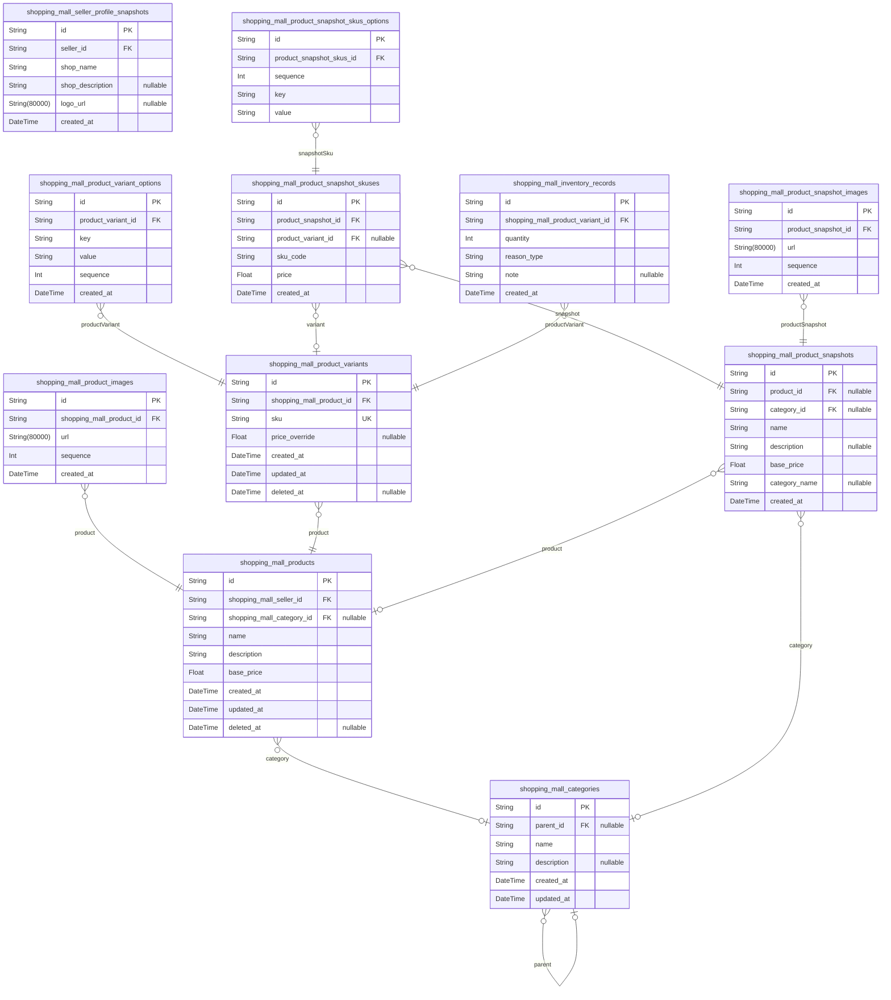
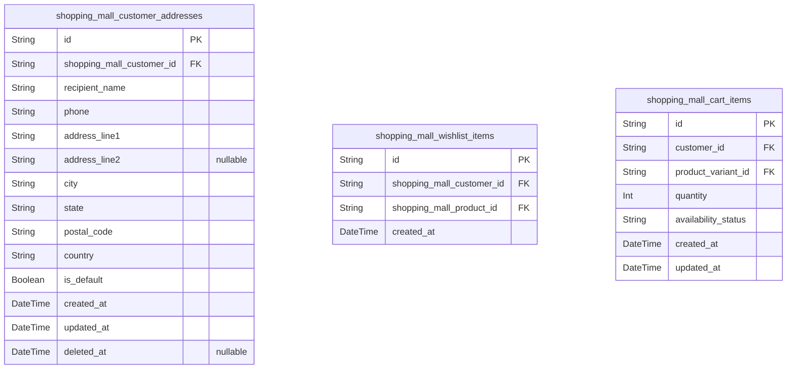
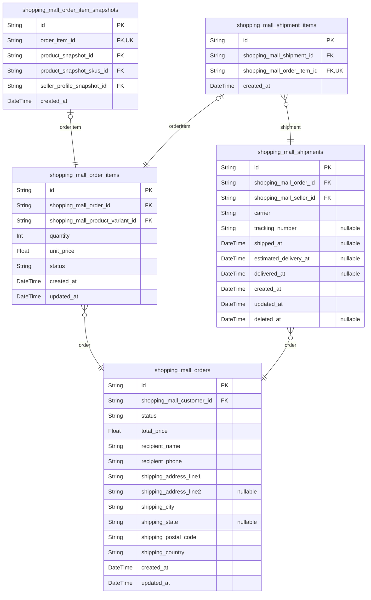
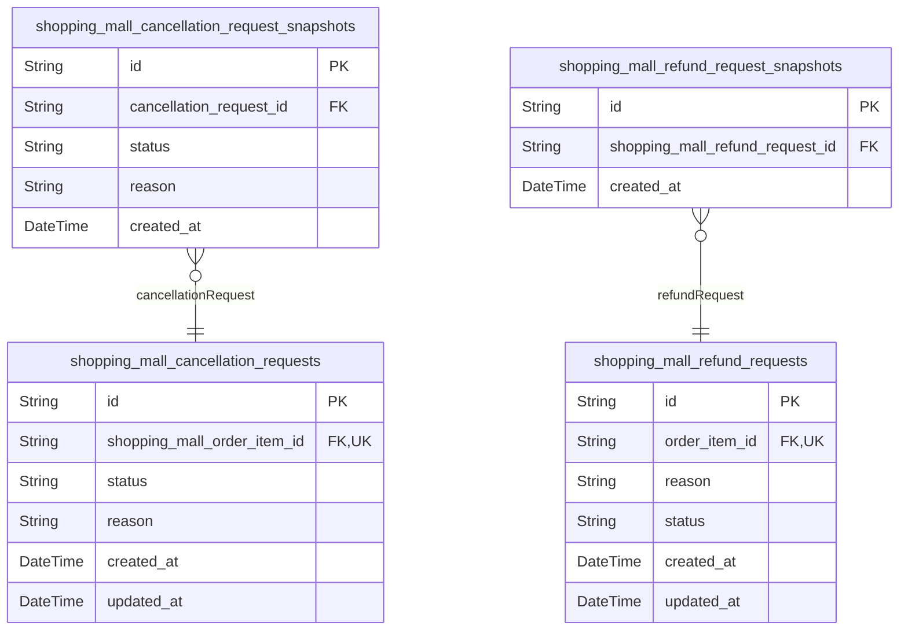
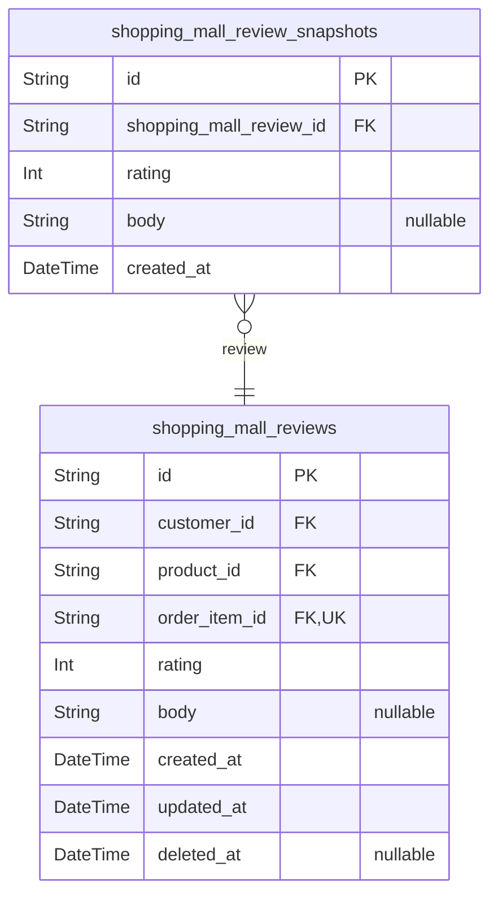

# Prisma Markdown

> Generated by [`prisma-markdown`](https://github.com/samchon/prisma-markdown)

- [Actors](#actors)
- [Catalog](#catalog)
- [Shopping](#shopping)
- [Orders](#orders)
- [PostSale](#postsale)
- [Reviews](#reviews)

## Actors

```mermaid
erDiagram
"shopping_mall_guests" {
  String id PK
  String token UK
  DateTime created_at
}
"shopping_mall_guest_sessions" {
  String id PK
  String shopping_mall_guest_id FK
  String ip
  String href
  String referrer
  DateTime created_at
  DateTime expired_at
}
"shopping_mall_customers" {
  String id PK
  String email UK
  String password_hash
  String nickname
  String phone "nullable"
  Boolean is_banned
  DateTime created_at
  DateTime updated_at
  DateTime deleted_at "nullable"
}
"shopping_mall_customer_sessions" {
  String id PK
  String shopping_mall_customer_id FK
  String access_token UK
  String refresh_token UK
  String ip
  String href
  String referrer
  DateTime created_at
  DateTime expired_at
}
"shopping_mall_sellers" {
  String id PK
  String email UK
  String password_hash
  String shop_name
  Boolean is_banned
  Boolean is_suspended
  DateTime created_at
  DateTime updated_at
  DateTime deleted_at "nullable"
}
"shopping_mall_seller_sessions" {
  String id PK
  String shopping_mall_seller_id FK
  String access_token UK
  String refresh_token UK
  String ip
  String(80000) href
  String referrer "nullable"
  DateTime created_at
  DateTime expired_at
}
"shopping_mall_admins" {
  String id PK
  String actor_type
  String email UK
  String password_hash
  DateTime created_at
  DateTime updated_at
  DateTime deleted_at "nullable"
}
"shopping_mall_admin_sessions" {
  String id PK
  String shopping_mall_admin_id FK
  String access_token UK
  String refresh_token UK
  String ip
  String href
  String referrer
  DateTime created_at
  DateTime expired_at
}
"shopping_mall_super_admins" {
  String id PK
  String email UK
  String password_hash
  DateTime created_at
  DateTime updated_at
  DateTime deleted_at "nullable"
}
"shopping_mall_super_admin_sessions" {
  String id PK
  String shopping_mall_super_admin_id FK
  String access_token UK
  String refresh_token UK
  String ip
  String href
  String referrer
  DateTime created_at
  DateTime expired_at
}
"shopping_mall_admin_of_customers" {
  String id PK
  String admin_id FK,UK
  String customer_id FK,UK
  DateTime created_at
}
"shopping_mall_admin_of_sellers" {
  String id PK
  String admin_id FK,UK
  String seller_id FK
  DateTime created_at
}
"shopping_mall_super_admin_of_customers" {
  String id PK
  String super_admin_id FK,UK
  String customer_id FK
  DateTime created_at
}
"shopping_mall_super_admin_of_sellers" {
  String id PK
  String super_admin_id FK,UK
  String seller_id FK,UK
  DateTime created_at
}
"shopping_mall_guest_sessions" }o--|| "shopping_mall_guests" : guest
"shopping_mall_customer_sessions" }o--|| "shopping_mall_customers" : customer
"shopping_mall_seller_sessions" }o--|| "shopping_mall_sellers" : seller
"shopping_mall_admin_sessions" }o--|| "shopping_mall_admins" : admin
"shopping_mall_super_admin_sessions" }o--|| "shopping_mall_super_admins" : superAdmin
"shopping_mall_admin_of_customers" |o--|| "shopping_mall_admins" : admin
"shopping_mall_admin_of_customers" |o--|| "shopping_mall_customers" : customer
"shopping_mall_admin_of_sellers" |o--|| "shopping_mall_admins" : admin
"shopping_mall_admin_of_sellers" }o--|| "shopping_mall_sellers" : seller
"shopping_mall_super_admin_of_customers" |o--|| "shopping_mall_super_admins" : superAdmin
"shopping_mall_super_admin_of_customers" }o--|| "shopping_mall_customers" : customer
"shopping_mall_super_admin_of_sellers" |o--|| "shopping_mall_super_admins" : superAdmin
"shopping_mall_super_admin_of_sellers" |o--|| "shopping_mall_sellers" : seller
```

### `shopping_mall_guests`

Temporary guest records for unauthenticated visitors to the shopping mall
platform.

Each record represents a unique device or browser session identified by a
fingerprint token, allowing the system to track the transient guest state
before the visitor registers as a customer or logs into an existing
account. Guest records serve as the identity anchor for anonymous
sessions and are referenced by [shopping_mall_guest_sessions](#shopping_mall_guest_sessions) for
session lifecycle management.

Guests have access only to public endpoints such as customer
registration, seller registration, and login flows. Once a visitor
registers or logs in, the guest record is superseded by the corresponding
actor account.

Properties as follows:

- `id`: Primary Key.
- `token`
  > Unique device or browser fingerprint token that identifies this guest
  > visitor. Used to associate anonymous sessions with a stable guest
  > identity across requests before registration or login.
- `created_at`
  > Timestamp when the guest record was first created, marking the beginning
  > of the guest's transient session lifecycle on the platform.

### `shopping_mall_guest_sessions`

Transient session tokens issued to guest visitors, enabling stateless
identification of anonymous users accessing only the registration and
login endpoints.

Each session record captures the guest's connection context (IP address,
page URL, referrer) at the time of the visit. Sessions expire after a
short window, as guests are transitional actors expected to either
register or log in. These records serve as the link between an anonymous
fingerprint ([shopping_mall_guests](#shopping_mall_guests)) and a specific browsing
session.

Properties as follows:

- `id`: Primary Key.
- `shopping_mall_guest_id`
  > The guest actor this session belongs to. References {@link
  > shopping_mall_guests.id}.
- `ip`
  > IP address of the guest visitor at the time the session was created. Used
  > for auditing and security tracking.
- `href`
  > Full URL (href) of the page the guest was accessing when the session was
  > initiated.
- `referrer`
  > HTTP referrer URL indicating the source from which the guest navigated to
  > the platform. May be empty string if no referrer was provided.
- `created_at`: Timestamp when the guest session was created.
- `expired_at`
  > Timestamp when this guest session expires. Sessions are short-lived as
  > guests are transient actors expected to register or log in.

### `shopping_mall_customers`

Registered customer accounts for the shopping mall platform.

Each record represents a unique customer identity used for authentication
and access control throughout the platform. Customers authenticate via
email and password, and may be banned by administrators to restrict
platform access.

This is the root actor entity for the customer role. Related session
records are stored in [shopping_mall_customer_sessions](#shopping_mall_customer_sessions), shipping
addresses in [shopping_mall_customer_addresses](#shopping_mall_customer_addresses), wishlist items in
[shopping_mall_wishlist_items](#shopping_mall_wishlist_items), cart items in {@link
shopping_mall_cart_items}, orders in [shopping_mall_orders](#shopping_mall_orders), and
reviews in [shopping_mall_reviews](#shopping_mall_reviews).

Properties as follows:

- `id`: Primary Key.
- `email`
  > Unique email address used as the customer's login identifier. Must be
  > unique across all customer accounts.
- `password_hash`
  > Bcrypt-hashed password for customer authentication. Raw passwords are
  > never stored.
- `nickname`
  > Display name shown to other users on the platform (e.g., in reviews).
  > Does not need to be unique.
- `phone`: Customer's contact phone number. Optional and may be null if not provided.
- `is_banned`
  > Indicates whether this customer account has been banned by an
  > administrator. Banned customers cannot log in or access member-only
  > features.
- `created_at`: Timestamp when the customer account was created.
- `updated_at`
  > Timestamp when the customer account was last updated (e.g., profile
  > changes, ban status changes).
- `deleted_at`
  > Soft-delete timestamp. When set, the customer account is considered
  > deleted. Null means the account is active.

### `shopping_mall_customer_sessions`

JWT session records for authenticated customers.

Each record represents a single device or browser session established
when a customer logs in. Stores the issued access token and refresh token
to support stateful session validation, concurrent multi-device logins,
and explicit per-session logout.

Sessions are invalidated by setting the [expired_at](#expired_at) timestamp. The
[shopping_mall_customers](#shopping_mall_customers) actor is referenced via {@link
shopping_mall_customer_id}.

Properties as follows:

- `id`: Primary Key.
- `shopping_mall_customer_id`
  > The customer this session belongs to. References {@link
  > shopping_mall_customers.id}.
- `access_token`
  > JWT access token issued to the customer upon login. Used to authenticate
  > API requests for this session.
- `refresh_token`
  > JWT refresh token issued alongside the access token. Used to obtain a new
  > access token without re-authentication when the current one expires.
- `ip`
  > IP address of the client that initiated this session, recorded for
  > security auditing.
- `href`
  > Full URL (href) of the page from which the login request was made, used
  > for connection context and auditing.
- `referrer`
  > HTTP Referer header value from the login request, providing context about
  > the navigation origin.
- `created_at`
  > Timestamp when this session was created (i.e., when the customer logged
  > in).
- `expired_at`
  > Timestamp when this session expires or was explicitly invalidated via
  > logout. A session is considered active if this value is in the future.

### `shopping_mall_sellers`

Registered seller accounts for the shopping mall platform.

Each record represents a seller's identity and authentication
credentials. Sellers can list products and manage inventory once approved
by an administrator; the approval workflow itself is tracked in a
separate SellerApproval entity.

Account states (banned and suspended) are stored directly on this table
and enforced during authentication. A banned seller cannot log in at all,
while a suspended seller's access may be restricted by platform policy.

Related entities:
- [shopping_mall_seller_sessions](#shopping_mall_seller_sessions) — login sessions belonging to
this seller
- [shopping_mall_seller_profile_snapshots](#shopping_mall_seller_profile_snapshots) — immutable snapshots of
this seller's shop profile captured at order time
- SellerApproval (in Catalog component) — approval workflow records
referencing this seller

Properties as follows:

- `id`: Primary Key.
- `email`
  > Unique email address used for seller authentication. Must be unique
  > across all sellers.
- `password_hash`
  > Bcrypt or equivalent hashed password for secure authentication. Never
  > stored in plaintext.
- `shop_name`
  > The display name of the seller's shop as shown to customers on the
  > platform. Mutable; historical snapshots are captured in
  > shopping_mall_seller_profile_snapshots.
- `is_banned`
  > Whether this seller account has been permanently banned by an
  > administrator. Banned sellers cannot log in and their products are hidden
  > from the platform.
- `is_suspended`
  > Whether this seller account is currently suspended by an administrator.
  > Suspended sellers have restricted access until the suspension is lifted.
- `created_at`: Timestamp when the seller account was registered.
- `updated_at`
  > Timestamp when the seller account was last updated (e.g., profile change,
  > state change).
- `deleted_at`
  > Soft-delete timestamp. When set, the seller account is considered deleted
  > and should be excluded from active queries. Historical data referencing
  > this seller is preserved.

### `shopping_mall_seller_sessions`

JWT session records for authenticated sellers, created upon each
successful seller login.

Each record represents a single device session and stores the issued JWT
access and refresh tokens along with connection context (IP address, page
URL, referrer). Multiple concurrent sessions per seller are supported to
allow multi-device logins.

Session expiration is enforced via the `expired_at` field. Ban or
suspension enforcement checks the seller's status on the referenced
[shopping_mall_sellers](#shopping_mall_sellers) record at token validation time. Sessions
are append-only audit records and are never soft-deleted.

Properties as follows:

- `id`: Primary Key.
- `shopping_mall_seller_id`
  > The seller account this session belongs to. References {@link
  > shopping_mall_sellers.id}.
- `access_token`
  > JWT access token issued to the seller for this session. Used for
  > authenticating API requests. Must be unique across all sessions.
- `refresh_token`
  > JWT refresh token issued to the seller for this session. Used to obtain a
  > new access token when the current one expires. Must be unique across all
  > sessions.
- `ip`
  > IP address of the client that initiated this session, recorded at login
  > time for security auditing.
- `href`
  > Full URL (href) of the page from which the seller performed the login
  > request, recorded for auditing and analytics.
- `referrer`
  > HTTP Referrer header value at the time of login, indicating the page that
  > linked to the login page. Nullable when no referrer is present.
- `created_at`: Timestamp when this session was created (i.e., when the seller logged in).
- `expired_at`
  > Timestamp when this session expires. After this time, the session is
  > considered invalid and the seller must re-authenticate.

### `shopping_mall_admins`

Regular administrator accounts for the shopping mall platform.

Each admin account is promoted from an existing {@link
shopping_mall_customers customer} or [seller](#shopping_mall_sellers)
account that successfully passed the admin request and approval process.
Because of this, the admin inherits the email address from the
originating account. The `actor_type` discriminator field indicates
whether the admin originated from a customer or seller account; the
actual FK reference to the originating account is stored in the
corresponding subtype table ([shopping_mall_admin_of_customers](#shopping_mall_admin_of_customers) or
[shopping_mall_admin_of_sellers](#shopping_mall_admin_of_sellers)).

Admins have platform-wide visibility and are not subject to ownership
restrictions — they can view all products, orders, customers, and sellers
on the platform. Regular admins can approve or reject seller
registrations, suspend or unsuspend sellers, manage categories, and
oversee all platform activity. Elevated actions such as promoting other
admins are reserved for super administrators.

An admin account may be soft-deleted via `deleted_at`, revoking platform
access while preserving the historical record.

Properties as follows:

- `id`: Primary Key.
- `actor_type`
  > Discriminator indicating whether this admin account originated from a
  > customer or a seller. Allowed values: 'customer', 'seller'. Used together
  > with the subtype tables (shopping_mall_admin_of_customers or
  > shopping_mall_admin_of_sellers) to resolve the polymorphic origin FK.
- `email`
  > Unique email address of the administrator, inherited from the originating
  > customer or seller account. Used as the login identifier for admin
  > authentication.
- `password_hash`
  > Bcrypt-hashed password for admin authentication. Stored as a one-way
  > hash; the plaintext password is never persisted.
- `created_at`
  > Timestamp indicating when the admin account was created (i.e., when the
  > admin promotion was granted).
- `updated_at`
  > Timestamp of the most recent update to this admin account record (e.g.,
  > password change or profile edit).
- `deleted_at`
  > Soft-deletion timestamp. When non-null, the admin account is considered
  > deactivated and login is denied. The historical record is preserved for
  > audit purposes.

### `shopping_mall_admin_sessions`

JWT session records for authenticated regular administrators.

Each record represents a single device/browser session established upon
successful administrator login. Stores JWT access and refresh tokens to
support concurrent multi-device sessions with independent per-session
logout capability.

Connection metadata (IP address, page URL, referrer URL) is recorded for
security auditing purposes. Sessions are expired via the `expired_at`
timestamp, enabling both explicit logout and automatic expiration
enforcement.

Properties as follows:

- `id`: Primary Key.
- `shopping_mall_admin_id`
  > The administrator account this session belongs to. {@link
  > shopping_mall_admins.id}
- `access_token`
  > JWT access token issued for this session, used to authenticate API
  > requests.
- `refresh_token`
  > JWT refresh token used to obtain a new access token when the current one
  > expires.
- `ip`
  > IP address of the client device that initiated this session, recorded for
  > security auditing.
- `href`: Full URL of the page from which the login request was made.
- `referrer`
  > HTTP Referer header value recorded at session creation for auditing
  > purposes.
- `created_at`
  > Timestamp when this session was created (i.e., when the administrator
  > logged in).
- `expired_at`
  > Timestamp when this session expires or was explicitly invalidated via
  > logout. A session is considered active if this value is in the future.

### `shopping_mall_super_admins`

Super administrator accounts representing the highest privilege tier in
the shopping mall platform.

Super administrators have all regular admin capabilities plus exclusive
authority to approve or reject administrator promotion requests, promote
or demote other administrators, and manage the overall admin hierarchy.
Each super admin account stores authentication credentials (email and
hashed password).

The originating account from which a super admin was promoted (either a
customer or seller) is tracked via separate subtype linkage tables:
[shopping_mall_super_admin_of_customers](#shopping_mall_super_admin_of_customers) and {@link
shopping_mall_super_admin_of_sellers}. Exactly one of these subtype
records will exist for each super admin.

Sessions for super admins are tracked separately in {@link
shopping_mall_super_admin_sessions}.

Properties as follows:

- `id`: Primary Key.
- `email`
  > Unique email address used as the login credential for the super
  > administrator account.
- `password_hash`
  > Bcrypt or argon2 hashed password for super administrator authentication.
  > Never stored in plain text.
- `created_at`: Timestamp when the super administrator account was created.
- `updated_at`: Timestamp when the super administrator account was last updated.
- `deleted_at`
  > Soft-delete timestamp. Null when the account is active; set to a non-null
  > value when the account has been deactivated.

### `shopping_mall_super_admin_sessions`

JWT session records for authenticated super administrators.

Each record represents a single device session created upon successful
super administrator login. Stores access and refresh tokens to support
concurrent multi-device sessions with the ability to explicitly
invalidate individual sessions on logout.

Connection metadata (IP address, page href, referrer) is captured at
session creation time for security auditing purposes. Session expiry is
tracked via [shopping_mall_super_admin_sessions.expired_at](#shopping_mall_super_admin_sessions).

Belongs to [shopping_mall_super_admins](#shopping_mall_super_admins).

Properties as follows:

- `id`: Primary Key.
- `shopping_mall_super_admin_id`
  > The super administrator who owns this session. {@link
  > shopping_mall_super_admins.id}
- `access_token`
  > JWT access token issued to the super administrator for authenticating API
  > requests during this session.
- `refresh_token`
  > JWT refresh token used to obtain a new access token when the current one
  > expires, without requiring re-authentication.
- `ip`
  > IP address of the client at the time of session creation, captured for
  > security auditing.
- `href`
  > Full URL (href) of the page from which the login request was initiated,
  > captured for session context and auditing.
- `referrer`
  > HTTP referrer header value at the time of login, captured for security
  > auditing and traffic analysis.
- `created_at`
  > Timestamp when the session was created (i.e., when the super
  > administrator logged in).
- `expired_at`
  > Timestamp when the session expires or was explicitly invalidated via
  > logout. Null-safe by design; a non-null value indicates the session is no
  > longer valid.

### `shopping_mall_admin_of_customers`

Subtype table that links a regular administrator account to the
originating customer account from which it was promoted.

Each record establishes a traceable 1:1 relationship between a {@link
shopping_mall_admins} record and the [shopping_mall_customers](#shopping_mall_customers)
record that was the source of the promotion. The unique constraint on
`admin_id` guarantees that each admin account corresponds to at most one
customer origin, and the unique constraint on `customer_id` ensures that
a single customer account cannot be promoted to admin more than once
through the customer pathway.

This table is part of the polymorphic admin origin pattern alongside
[shopping_mall_admin_of_sellers](#shopping_mall_admin_of_sellers), allowing the system to track
whether an admin was originally a customer or a seller while keeping the
core admin identity table clean.

Properties as follows:

- `id`: Primary Key.
- `admin_id`
  > The regular administrator account that originated from a customer.
  > References [shopping_mall_admins.id](#shopping_mall_admins).
- `customer_id`
  > The originating customer account from which the admin was promoted.
  > References [shopping_mall_customers.id](#shopping_mall_customers).
- `created_at`: Timestamp indicating when the admin promotion from customer was recorded.

### `shopping_mall_admin_of_sellers`

Subtype linkage table that records regular administrator accounts which
were promoted from a seller account.

Each record establishes a traceable 1:1 link between a {@link
shopping_mall_admins} record and the originating {@link
shopping_mall_sellers} row from which the administrator role was granted.
The unique constraint on `admin_id` enforces the one-to-one relationship:
each admin can only originate from a single seller account.

This table is part of a polymorphic subtype pattern alongside {@link
shopping_mall_admin_of_customers}, allowing the system to track the
provenance of administrator accounts regardless of whether they were
promoted from a customer or a seller role.

Properties as follows:

- `id`: Primary Key.
- `admin_id`
  > The regular administrator account that originated from a seller.
  > References [shopping_mall_admins.id](#shopping_mall_admins). Unique constraint enforces
  > the 1:1 relationship.
- `seller_id`
  > The originating seller account from which the administrator was promoted.
  > References [shopping_mall_sellers.id](#shopping_mall_sellers).
- `created_at`
  > Timestamp indicating when this admin-seller linkage was created, i.e.,
  > when the seller account was promoted to administrator.

### `shopping_mall_super_admin_of_customers`

Subtype linkage table that records super administrator accounts which
were promoted from a customer account.

Each record establishes a 1:1 relationship between a {@link
shopping_mall_super_admins super admin} and the originating {@link
shopping_mall_customers customer} account from which that super admin was
promoted. The unique constraint on `super_admin_id` enforces that each
super admin has at most one origin record of this type.

This table participates in the polymorphic actor origin pattern alongside
[shopping_mall_super_admin_of_sellers](#shopping_mall_super_admin_of_sellers), allowing the system to
trace every super admin account back to either a customer or seller
identity.

Properties as follows:

- `id`: Primary Key.
- `super_admin_id`
  > The super administrator account that was promoted from a customer.
  > References [shopping_mall_super_admins.id](#shopping_mall_super_admins).
- `customer_id`
  > The originating customer account from which the super admin was promoted.
  > References [shopping_mall_customers.id](#shopping_mall_customers).
- `created_at`
  > Timestamp recording when the super admin promotion from this customer
  > account was established.

### `shopping_mall_super_admin_of_sellers`

Subtype linkage table that records super administrator accounts which
were promoted from a seller account.

This table establishes a strict 1:1 relationship between a {@link
shopping_mall_super_admins} record and the originating {@link
shopping_mall_sellers} record from which the super administrator was
promoted. It preserves the traceable link between the super admin
identity and their original seller role, enabling auditing of the
promotion origin.

Both the `super_admin_id` and `seller_id` fields carry unique
constraints, ensuring that each super admin maps to exactly one
originating seller and that each seller account can only be the origin of
one super admin promotion.

Properties as follows:

- `id`: Primary Key.
- `super_admin_id`
  > The super administrator account that was promoted from a seller.
  > References [shopping_mall_super_admins.id](#shopping_mall_super_admins).
- `seller_id`
  > The originating seller account from which this super administrator was
  > promoted. References [shopping_mall_sellers.id](#shopping_mall_sellers).
- `created_at`
  > Timestamp recording when the super administrator promotion from the
  > seller account occurred.

## Catalog

### `shopping_mall_categories`

Organizational units that group related products together within the
platform's product catalog taxonomy.

This table supports a two-tier hierarchy: top-level parent categories and
their immediate subcategories. A category with a null `parent_id` is a
top-level category. A category with a non-null `parent_id` is a
subcategory belonging to exactly one parent. Subcategories cannot
themselves have children — the hierarchy is always exactly two tiers
deep.

Categories are exclusively created, edited, and deleted by administrators
to ensure a consistent and authoritative catalog structure. When a
category is deleted, products previously assigned to it become
uncategorized; they are not deleted.

Related models: [shopping_mall_products](#shopping_mall_products) (products assigned to a
category).

Properties as follows:

- `id`: Primary Key.
- `parent_id`
  > Optional reference to the parent category for subcategory nesting. Null
  > for top-level categories. [shopping_mall_categories.id](#shopping_mall_categories)
- `name`
  > The display name of the category shown to customers and administrators
  > when browsing the catalog hierarchy.
- `description`
  > Optional descriptive text providing additional context about the category
  > and the types of products it contains.
- `created_at`: Timestamp indicating when this category record was created.
- `updated_at`
  > Timestamp indicating the last time this category record was modified
  > (e.g., name or description edited).

### `shopping_mall_products`

Core product listing records owned by sellers and assigned to a category
within the platform's two-tier catalog.

Each product belongs to exactly one seller, who is solely responsible for
its content, pricing, and availability. The seller affiliation is
established at creation and never changes. Every product requires four
attributes: a human-readable name, a detailed description, a category
assignment within the platform's catalog hierarchy, and a base price that
serves as the default reference price for the product.

Products support soft deletion via the `deleted_at` field. When deleted,
a product is removed from all search results, category listings, and
wishlists, and its variants and inventory records are also removed.
However, previously created [shopping_mall_product_snapshots](#shopping_mall_product_snapshots)
remain intact and are never purged, preserving the historical record for
orders, audits, and dispute resolution.

A product's visibility may also be indirectly affected by the owning
seller's suspension status — suspended sellers' products are hidden from
listings without being deleted, and become visible again upon
unsuspension.

Child entities reference this table: {@link
shopping_mall_product_images}, [shopping_mall_product_variants](#shopping_mall_product_variants),
[shopping_mall_product_snapshots](#shopping_mall_product_snapshots).

Properties as follows:

- `id`: Primary Key.
- `shopping_mall_seller_id`
  > The seller who owns this product. References {@link
  > shopping_mall_sellers.id}. Established at product creation and immutable
  > thereafter.
- `shopping_mall_category_id`
  > The category to which this product is assigned. References {@link
  > shopping_mall_categories.id}. Required; a seller may assign a product to
  > a top-level category or a subcategory. Set to null when the category is
  > deleted (product becomes uncategorized).
- `name`
  > The human-readable title of the product displayed to customers in search
  > results, category pages, and the product detail page.
- `description`
  > A detailed description of the product's characteristics, intended use, or
  > any information the seller chooses to share with customers.
- `base_price`
  > The default reference price for the product as a whole. Displayed when no
  > variant-specific pricing applies. Individual variants may define their
  > own price which overrides this base price for that variant.
- `created_at`: Timestamp when the product listing was first created.
- `updated_at`: Timestamp of the most recent update to the product record.
- `deleted_at`
  > Timestamp when the product was soft-deleted. Null if the product is still
  > active. Once set, the product is removed from all customer-facing search
  > and category listings, and all associated variants and inventory records
  > are also removed.

### `shopping_mall_product_images`

Ordered visual image assets associated with a product in the shopping
mall catalog.

Each record belongs to exactly one [shopping_mall_products](#shopping_mall_products) and
stores the URL of the image along with a display sequence number that
controls the rendering order on the product detail page. Lower sequence
values appear first.

Images are managed as part of the product editing workflow and are not
independently created or deleted by users outside of that context. When a
product snapshot is taken, the image URLs at that moment are preserved as
part of the snapshot record rather than being stored in this table.

Properties as follows:

- `id`: Primary Key.
- `shopping_mall_product_id`
  > The product this image belongs to. References {@link
  > shopping_mall_products.id}.
- `url`
  > The URL of the image asset. Points to the stored image file (e.g., a CDN
  > or object storage URL).
- `sequence`
  > Display order of the image within the product's image gallery. Lower
  > values are displayed first. Used to control the presentation order on the
  > product detail page.
- `created_at`: Timestamp when this image record was created.

### `shopping_mall_product_variants`

Purchasable variant records within a product, each identified by a
platform-wide unique SKU code and a specific combination of option values
(e.g., color, size).

A ProductVariant represents one purchasable configuration of a product.
Its distinguishing attributes (option key-value pairs such as 'color:
red' or 'size: XL') are stored in the {@link
shopping_mall_product_variant_options} child table, allowing an arbitrary
number of option dimensions per variant.

Each variant may optionally set a price override that supersedes the
owning product's base price. When `price_override` is null, the product's
base price applies. This enables sellers to charge different amounts for
different configurations (e.g., larger sizes cost more).

Stock level is not stored directly on the variant; it is derived by
summing all [shopping_mall_inventory_records](#shopping_mall_inventory_records) for this variant. A
variant whose derived stock reaches zero is considered out of stock and
cannot be added to carts.

Variants support soft deletion via `deleted_at`. Deleted variants are
excluded from browsing and cart operations but remain accessible in
historical order snapshots.

Every edit to a variant's attributes triggers creation of a new {@link
shopping_mall_product_snapshots} record to preserve the immutable history
required for order accuracy and dispute resolution.

Properties as follows:

- `id`: Primary Key.
- `shopping_mall_product_id`: The product this variant belongs to. [shopping_mall_products.id](#shopping_mall_products)
- `sku`
  > Stock Keeping Unit code that uniquely identifies this variant across the
  > entire platform. No two variants from any seller may share the same SKU
  > code. Serves as the primary identifier when the variant appears in
  > orders, cart items, and inventory records.
- `price_override`
  > Optional price override for this variant, expressed in the platform's
  > base currency unit. When set, this price replaces the parent product's
  > base price for purchases of this variant. When null, the product's base
  > price applies. Allows sellers to price different configurations (e.g.,
  > larger sizes) at different amounts.
- `created_at`: Timestamp when this variant record was first created.
- `updated_at`
  > Timestamp of the most recent update to this variant record. Updated
  > whenever the seller edits SKU, option values, or price override.
- `deleted_at`
  > Soft-deletion timestamp. Null while the variant is active. Set to the
  > deletion timestamp when the seller removes this variant, excluding it
  > from browsing and cart operations while preserving its data for
  > historical order records.

### `shopping_mall_product_variant_options`

Individual option key-value pairs that define the purchasable
configuration of a product variant.

Each record represents a single dimension of a variant's identity — for
example, a 'color' option with value 'Red', or a 'size' option with value
'Large'. A variant may have multiple option records, and together they
form its complete configuration (e.g., 'Red / Large').

These records belong exclusively to a {@link
shopping_mall_product_variants} and are managed as part of the variant.
The combination of all option key-value pairs for a variant distinguishes
it from sibling variants under the same product. A unique constraint on
(product_variant_id, key) ensures that no variant has duplicate option
dimensions.

The sequence field controls the display order of option dimensions on the
product detail page.

Properties as follows:

- `id`: Primary Key.
- `product_variant_id`
  > The product variant this option belongs to. {@link
  > shopping_mall_product_variants.id}
- `key`
  > The option dimension name (e.g., 'color', 'size', 'material'). Combined
  > with value, it identifies one aspect of a variant's configuration.
- `value`
  > The option dimension value (e.g., 'Red', 'Large', 'Cotton'). Combined
  > with key, it forms one attribute of the variant's unique configuration.
- `sequence`
  > Display ordering sequence for option dimensions within a variant. Lower
  > values appear first when presenting the variant's options to customers.
- `created_at`: Timestamp when this option record was created.

### `shopping_mall_product_snapshots`

Immutable point-in-time snapshots of a product's complete state, created
automatically whenever a seller edits any editable field of a product or
when an order is placed.

Each snapshot preserves the product's name, description, base price, and
the category association at the exact moment the snapshot was taken. The
snapshot also serves as the parent record for {@link
shopping_mall_product_snapshot_skuses} (variant states) and {@link
shopping_mall_product_snapshot_images} (image states at that moment),
ensuring the full product picture — including all variants and media — is
permanently recorded.

Once created, a ProductSnapshot is immutable: it cannot be modified or
deleted by the seller, administrators, or any system process. Snapshots
are retained even after the owning product is deleted (the foreign key to
[shopping_mall_products](#shopping_mall_products) is nullable to support this). This
guarantees the integrity of the historical record for dispute resolution,
audit, and order history purposes.

Access is restricted: the owning seller can view all snapshots of their
products, and administrators can view snapshots of any product on the
platform.

Properties as follows:

- `id`: Primary Key.
- `product_id`
  > Reference to the product that this snapshot belongs to. {@link
  > shopping_mall_products.id}. Nullable because product snapshots must be
  > preserved even after the owning product is deleted.
- `category_id`
  > Reference to the category the product belonged to at the time this
  > snapshot was taken. [shopping_mall_categories.id](#shopping_mall_categories). Nullable because
  > a product may have no category, and because the category may later be
  > deleted.
- `name`
  > The product's name as it existed at the moment this snapshot was created.
  > Preserved immutably for historical order record integrity.
- `description`
  > The product's description as it existed at the moment this snapshot was
  > created. Nullable because a product may have no description at the time
  > of the snapshot.
- `base_price`
  > The product's base price at the time this snapshot was created. Preserved
  > immutably to ensure accurate historical pricing records for orders.
- `category_name`
  > The name of the category the product belonged to at the time of this
  > snapshot, captured as a text value for historical integrity. Nullable
  > because the product may not have been assigned to any category, or the
  > category name may not have existed.
- `created_at`
  > Timestamp of when this snapshot was created. Represents the exact moment
  > the product state was captured. Snapshots are append-only and have no
  > updated_at or deleted_at fields.

### `shopping_mall_product_snapshot_skuses`

Frozen, immutable records capturing the state of each product variant at
the exact moment a parent [shopping_mall_product_snapshots](#shopping_mall_product_snapshots) was
created.

Every time a ProductSnapshot is taken, one ProductSnapshotSKU record is
created for each variant that existed at that moment. Together they form
an authoritative, self-contained picture of the variant lineup as it
stood at a specific point in time.

Each record preserves:
- The variant's SKU code as it existed when the snapshot was taken.
- The variant's price at snapshot time (which may reflect either the
variant's own price override or the product's base price).
- A nullable reference back to the originating {@link
shopping_mall_product_variants} record for traceability (nullable because
the variant may be subsequently deleted).
- The complete set of option key-value pairs (e.g., color: red, size: XL)
stored in the child table {@link
shopping_mall_product_snapshot_skus_options}.

Once created, these records are never modified or deleted. Their
immutability guarantees that historical variant data embedded in order
items, used for dispute resolution, or reviewed by administrators always
reflects exactly what existed at the time the snapshot was taken.

Properties as follows:

- `id`: Primary Key.
- `product_snapshot_id`
  > The parent product snapshot this SKU record belongs to. References {@link
  > shopping_mall_product_snapshots.id}.
- `product_variant_id`
  > The originating product variant whose state is captured in this record.
  > Nullable because the variant may be deleted after the snapshot is
  > created. References [shopping_mall_product_variants.id](#shopping_mall_product_variants).
- `sku_code`
  > The unique SKU code of the product variant as it existed at the moment
  > this snapshot was created. Preserved verbatim regardless of any
  > subsequent changes or deletion of the source variant.
- `price`
  > The price of the variant at snapshot time. Reflects either the variant's
  > own price override or the product's base price if no override was set at
  > the time of snapshotting.
- `created_at`
  > Timestamp indicating when this snapshot SKU record was created. Coincides
  > with the creation of the parent product snapshot. No updated_at or
  > deleted_at fields exist because this record is immutable.

### `shopping_mall_seller_profile_snapshots`

Immutable point-in-time snapshots of a seller's public shop profile,
capturing the shop name, description, and logo URL as they existed at a
specific moment.

A new snapshot is created automatically each time a seller edits any part
of their profile (shop name, description, or logo). These records are
permanently preserved and can never be modified or deleted, forming a
tamper-proof chronological audit trail of all profile changes.

At the moment of order placement, each order item references the most
recent [shopping_mall_seller_profile_snapshots](#shopping_mall_seller_profile_snapshots) to embed the
seller's identity as experienced by the customer at purchase time. This
ensures that transaction history remains accurate even if the seller
subsequently updates their profile.

Referenced by [shopping_mall_order_item_snapshots](#shopping_mall_order_item_snapshots) in the Orders
domain to preserve seller identity for dispute resolution and historical
accuracy.

Properties as follows:

- `id`: Primary Key.
- `seller_id`
  > The seller whose shop profile this snapshot records. {@link
  > shopping_mall_sellers.id}
- `shop_name`
  > The name of the seller's shop as it appeared at the moment this snapshot
  > was taken.
- `shop_description`
  > The seller's shop description as written at the moment this snapshot was
  > taken. Nullable if the seller had not provided a description.
- `logo_url`
  > URL pointing to the seller's logo image that was active at the moment
  > this snapshot was taken. Nullable if no logo was set.
- `created_at`
  > Timestamp of when this snapshot was created. Immutable — never updated
  > after creation.

### `shopping_mall_inventory_records`

Append-only ledger of stock change events for each product variant.

Each record represents a single stock adjustment event — either created
automatically by the system in response to order lifecycle events (order
placement, approved cancellation, approved refund) or manually submitted
by a seller for restocking or operational corrections. The current stock
level of a variant is always derived by summing the `quantity` values of
all records for that variant.

Records are immutable once created; they cannot be edited or deleted,
ensuring a tamper-proof audit trail. No `updated_at` or `deleted_at`
fields are present because the append-only design makes modification
semantically invalid.

The `reason_type` field classifies the cause of the stock change into one
of five categories: `manual_restock` (seller adds stock),
`manual_adjustment` (seller corrects for loss or damage),
`order_placement` (automatic deduction when an order is placed),
`order_cancellation` (automatic restoration when a cancellation is
approved), or `order_refund` (automatic restoration when a refund is
approved). The `note` field stores the human-readable explanation
provided by the seller for manual adjustments; it is null for
automatically generated records.

Related entity: [shopping_mall_product_variants](#shopping_mall_product_variants).

Properties as follows:

- `id`: Primary Key.
- `shopping_mall_product_variant_id`
  > The product variant whose stock level this record adjusts. {@link
  > shopping_mall_product_variants.id}
- `quantity`
  > The stock quantity change represented by this record. Positive values
  > indicate a stock increase (restock, cancellation or refund restoration);
  > negative values indicate a stock decrease (order placement, manual
  > adjustment for loss). The sum of all quantity values for a given variant
  > equals the variant's current stock level.
- `reason_type`
  > Categorized classification of why this stock change occurred. One of:
  > 'manual_restock' (seller manually adds inventory), 'manual_adjustment'
  > (seller corrects for damage, loss, or operational reason),
  > 'order_placement' (automatic deduction when an order is placed),
  > 'order_cancellation' (automatic restoration when a cancellation request
  > is approved), 'order_refund' (automatic restoration when a refund request
  > is approved).
- `note`
  > Human-readable explanation provided by the seller for manual stock
  > adjustments (required for 'manual_restock' and 'manual_adjustment' reason
  > types). Null for automatically generated records (order_placement,
  > order_cancellation, order_refund) where the reason is captured entirely
  > by reason_type.
- `created_at`
  > Timestamp recording when this inventory record was created. Used to
  > present the inventory history in chronological order.

### `shopping_mall_product_snapshot_images`

Immutable ordered image records captured as part of a product snapshot,
preserving the complete set of product images and their display order at
the exact moment the snapshot was taken.

Each record belongs to one [shopping_mall_product_snapshots](#shopping_mall_product_snapshots) and
stores the image URL and a display sequence number that determines the
presentation order of images within that snapshot. These records are
created atomically with their parent snapshot and are never modified or
deleted, ensuring a permanent and faithful reproduction of the product's
visual presentation at the time of snapshotting.

This table is the snapshot-time counterpart of {@link
shopping_mall_product_images}, capturing the ordered image set as it
existed when the product was edited or when an order was placed.

Properties as follows:

- `id`: Primary Key.
- `product_snapshot_id`
  > The product snapshot this image record belongs to. References {@link
  > shopping_mall_product_snapshots.id}.
- `url`
  > The URL of the product image as captured at snapshot time. Preserves the
  > exact image reference that was associated with the product at the moment
  > the snapshot was created.
- `sequence`
  > Display sequence number determining the presentation order of images
  > within this product snapshot. Lower values appear first. Mirrors the
  > sequence from the source product image at snapshot creation time.
- `created_at`
  > Timestamp indicating when this snapshot image record was created.
  > Immutable once set; snapshot records are never updated or deleted.

### `shopping_mall_product_snapshot_skus_options`

Individual option key-value pairs (e.g., 'color: red', 'size: XL') that
describe a product variant's configuration as captured within a {@link
shopping_mall_product_snapshot_skuses} record.

Each record belongs to exactly one product snapshot SKU entry and
contributes to reconstructing the full variant option combination at
snapshot time. Together, all option records for a given snapshot SKU form
the complete set of dimension values that uniquely identified the variant
when the snapshot was taken.

These records are immutable historical data — they are created once when
the snapshot SKU is captured and are never modified or deleted, ensuring
the integrity of the historical order record.

Properties as follows:

- `id`: Primary Key.
- `product_snapshot_skus_id`
  > The parent product snapshot SKU record that this option belongs to.
  > [shopping_mall_product_snapshot_skuses.id](#shopping_mall_product_snapshot_skuses)
- `sequence`
  > Display order of this option within the snapshot SKU's full option
  > combination. Lower values appear first. Used to consistently reconstruct
  > and present the variant's option set in the correct order.
- `key`
  > The option dimension name as captured at snapshot time (e.g., 'color',
  > 'size', 'material'). Represents the attribute category of this option
  > entry.
- `value`
  > The option dimension value as captured at snapshot time (e.g., 'red',
  > 'XL', 'cotton'). Represents the specific attribute value selected for
  > this variant.

## Shopping

### `shopping_mall_customer_addresses`

Shipping addresses saved by customers for use during checkout.

Each record belongs to exactly one customer ({@link
shopping_mall_customers}) and represents a physical delivery address.
Customers may maintain multiple saved addresses and designate one as the
default shipping address, which is pre-selected at checkout.

Addresses support soft deletion via `deleted_at` so that historical order
records referencing a previously used address remain intact even after
the customer removes it from their active address book. The `is_default`
flag marks which address is currently selected as the customer's
preferred shipping destination; only one address per customer should
carry this flag at a time (enforced at the application layer).

Properties as follows:

- `id`: Primary Key.
- `shopping_mall_customer_id`
  > The customer who owns this address. References {@link
  > shopping_mall_customers.id}.
- `recipient_name`: Full name of the person to whom the shipment should be addressed.
- `phone`
  > Contact phone number for the recipient at this address, used by couriers
  > for delivery coordination.
- `address_line1`: Primary street address line (e.g., street number and name, building).
- `address_line2`
  > Secondary address line for apartment, suite, unit, floor, or other
  > sub-premises information. Optional.
- `city`: City or locality of the delivery address.
- `state`: State, province, or region of the delivery address.
- `postal_code`: ZIP or postal code of the delivery address.
- `country`
  > Country of the delivery address, stored as an ISO 3166-1 alpha-2 country
  > code (e.g., 'US', 'KR').
- `is_default`
  > Whether this address is the customer's default shipping address. Only one
  > address per customer should have this flag set to true at a time;
  > enforcement is handled at the application layer.
- `created_at`: Timestamp when this address record was created.
- `updated_at`: Timestamp when this address record was last updated.
- `deleted_at`
  > Timestamp when this address was soft-deleted by the customer. Null if the
  > address is still active. Soft deletion preserves the address record for
  > historical order reference integrity.

### `shopping_mall_wishlist_items`

Products saved by customers to their personal wishlist for future
purchase consideration.

Each record represents a single customer-to-product association,
recording which [product](#shopping_mall_products) a {@link
shopping_mall_customers customer} has saved. The relationship targets the
product itself rather than a specific variant, allowing customers to
express general interest before selecting options at purchase time.

A customer may not save the same product more than once; a composite
unique constraint enforces this. Wishlist items are created when the
customer adds a product and deleted when they remove it — there is no
intermediate state.

Properties as follows:

- `id`: Primary Key.
- `shopping_mall_customer_id`
  > The customer who saved this product to their wishlist. References {@link
  > shopping_mall_customers.id}.
- `shopping_mall_product_id`
  > The product saved to the wishlist. References {@link
  > shopping_mall_products.id}.
- `created_at`
  > Timestamp recording when the customer added this product to their
  > wishlist.

### `shopping_mall_cart_items`

Pre-checkout cart entries that link a customer to a specific product
variant with a desired purchase quantity.

Unlike a wishlist item which tracks interest at the product level, a
CartItem is always bound to a concrete product variant — the customer
must have selected a specific combination of options (such as color and
size) before an item can be added to the cart. Each customer may have at
most one cart entry per variant, enforced by a unique constraint on the
combination of customer and variant.

The `availability_status` field tracks whether the referenced variant is
still purchasable at the time of cart display. When a variant becomes
out-of-stock or is deleted by the seller, the cart item is flagged rather
than removed, allowing the customer to see what has changed before
deciding how to proceed. Possible values include 'available',
'out_of_stock', and 'variant_deleted'.

Related entities: [shopping_mall_customers](#shopping_mall_customers), {@link
shopping_mall_product_variants}.

Properties as follows:

- `id`: Primary Key.
- `customer_id`
  > The customer who owns this cart item. References {@link
  > shopping_mall_customers.id}.
- `product_variant_id`
  > The specific product variant the customer intends to purchase. References
  > [shopping_mall_product_variants.id](#shopping_mall_product_variants).
- `quantity`
  > The number of units of the selected variant the customer intends to
  > purchase. Must be a positive integer.
- `availability_status`
  > Current availability state of the referenced variant as seen from the
  > cart. Possible values: 'available' — variant is purchasable;
  > 'out_of_stock' — variant exists but has no inventory; 'variant_deleted' —
  > the variant has been removed by the seller. Items with non-available
  > statuses are flagged in the cart UI rather than silently removed.
- `created_at`: Timestamp when the cart item was first added by the customer.
- `updated_at`
  > Timestamp when the cart item was last modified (quantity change or
  > availability status update).

## Orders

### `shopping_mall_orders`

Formal purchase records created when a customer completes checkout on the
shopping mall platform.

Each order belongs to a single customer and groups one or more order
items (see [shopping_mall_order_items](#shopping_mall_order_items)) that may span multiple
sellers. The shipping address selected at checkout is captured inline as
a denormalized snapshot at the moment of order placement — this
guarantees the delivery destination is permanently recorded and cannot be
altered by subsequent changes to the customer's saved addresses.

The overall order status is a derived, cached value computed from the
aggregate statuses of all constituent order items (see {@link
shopping_mall_order_items}). Valid values are: `paid`, `shipped`,
`delivered`, `cancelled`, `refunded`, and `partially_completed`. The
field is updated whenever any child order item changes state.

Orders are permanent records and are not soft-deleted. Historical
integrity is maintained through immutable snapshots on child entities.

Properties as follows:

- `id`: Primary Key.
- `shopping_mall_customer_id`
  > The customer who placed this order. References {@link
  > shopping_mall_customers.id}.
- `status`
  > Derived overall status of the order, cached for query performance.
  > Computed from the aggregate statuses of all order items. Possible values:
  > 'paid', 'shipped', 'delivered', 'cancelled', 'refunded',
  > 'partially_completed'. Updated automatically whenever any child order
  > item changes its status.
- `total_price`
  > Total monetary amount of the order at the time of placement, calculated
  > as the sum of all order item prices (unit price × quantity for each
  > item). Stored in the platform's base currency.
- `recipient_name`
  > Full name of the shipping recipient as captured at the time of order
  > placement. This is a denormalized snapshot of the address data and cannot
  > be changed after the order is placed.
- `recipient_phone`
  > Phone number of the shipping recipient as captured at the time of order
  > placement. Snapshot value — immutable after placement.
- `shipping_address_line1`
  > Primary street address line of the shipping destination, captured as a
  > snapshot at order placement. Immutable after the order is placed.
- `shipping_address_line2`
  > Optional secondary street address line (e.g., apartment, suite, unit
  > number) of the shipping destination, captured as a snapshot at order
  > placement.
- `shipping_city`
  > City of the shipping destination, captured as a snapshot at order
  > placement. Immutable after the order is placed.
- `shipping_state`
  > State, province, or region of the shipping destination, captured as a
  > snapshot at order placement. May be null for countries that do not use
  > state-level divisions.
- `shipping_postal_code`
  > Postal or ZIP code of the shipping destination, captured as a snapshot at
  > order placement. Immutable after the order is placed.
- `shipping_country`
  > Country of the shipping destination (ISO 3166-1 alpha-2 or full country
  > name), captured as a snapshot at order placement. Immutable after the
  > order is placed.
- `created_at`
  > Timestamp when the order was created (i.e., when the customer completed
  > checkout and payment was confirmed).
- `updated_at`
  > Timestamp of the most recent update to this order record, typically when
  > the derived status field is recalculated due to a child order item status
  > change.

### `shopping_mall_order_items`

Individual line items within a customer order, each representing a
specific [shopping_mall_product_variants](#shopping_mall_product_variants) variant that was
purchased.

Every order item carries its own independent status lifecycle (pending →
paid → shipped → delivered, with cancellation and refund branches),
allowing different items in the same order to progress through
fulfillment at different rates.

The quantity and unit_price fields capture the purchase-time values. The
unit_price is recorded here as a snapshot of the agreed price at
checkout, while full product and seller profile details are preserved in
the associated [shopping_mall_order_item_snapshots](#shopping_mall_order_item_snapshots) record.

Shipment assignment is handled through the {@link
shopping_mall_shipment_items} junction table, so there is no direct
foreign key to shipments on this table. Post-sale workflows
(cancellation, refund) are tracked in the PostSale component tables that
reference this order item.

Properties as follows:

- `id`: Primary Key.
- `shopping_mall_order_id`
  > The parent order this line item belongs to. References {@link
  > shopping_mall_orders.id}.
- `shopping_mall_product_variant_id`
  > The specific product variant that was purchased in this line item.
  > References [shopping_mall_product_variants.id](#shopping_mall_product_variants).
- `quantity`
  > Number of units of the product variant purchased in this line item. Must
  > be a positive integer recorded at checkout time.
- `unit_price`
  > Price per unit of the product variant at the time of purchase, in the
  > platform's base currency. Recorded as an immutable snapshot of the agreed
  > price at checkout.
- `status`
  > Current lifecycle status of this individual order item. Valid values:
  > 'pending' (order placed, awaiting payment), 'paid' (payment confirmed),
  > 'shipped' (dispatched by seller), 'delivered' (received by customer),
  > 'cancelled' (cancellation approved), 'refunded' (refund processed). Each
  > item progresses independently.
- `created_at`
  > Timestamp when this order item was created, corresponding to when the
  > order was placed.
- `updated_at`
  > Timestamp of the most recent update to this order item, typically
  > reflecting status changes.

### `shopping_mall_order_item_snapshots`

Immutable historical records embedded in each order item, capturing the
exact product state, variant SKU, and seller profile as they existed at
the moment of purchase.

Each [shopping_mall_order_items](#shopping_mall_order_items) record has exactly one snapshot
(1:1 relationship), created at the time the order is placed and never
modified thereafter. The snapshot references the {@link
shopping_mall_product_snapshots} for the full product state, the {@link
shopping_mall_product_snapshot_skuses} for the specific variant and SKU
selected by the customer, and the {@link
shopping_mall_seller_profile_snapshots} for the seller's shop profile at
purchase time.

This ensures that all transaction records remain accurate and auditable
even if the product, variant, or seller profile is subsequently changed
or deleted.

Properties as follows:

- `id`: Primary Key.
- `order_item_id`
  > The order item this snapshot belongs to. {@link
  > shopping_mall_order_items.id}. Each order item has exactly one snapshot
  > (1:1 relationship).
- `product_snapshot_id`
  > The product snapshot at the time of purchase. {@link
  > shopping_mall_product_snapshots.id}. Preserves the product name and
  > description as they existed when the order was placed.
- `product_snapshot_skus_id`
  > The specific variant SKU snapshot selected by the customer at the time of
  > purchase. [shopping_mall_product_snapshot_skuses.id](#shopping_mall_product_snapshot_skuses). Preserves
  > variant options (e.g., color, size) and price as they existed at the
  > moment of the order.
- `seller_profile_snapshot_id`
  > The seller profile snapshot at the time of purchase. {@link
  > shopping_mall_seller_profile_snapshots.id}. Preserves the seller's shop
  > name and profile as they existed when the order was placed.
- `created_at`
  > Timestamp when this snapshot was created, i.e., when the order was
  > placed. Immutable — never updated after creation.

### `shopping_mall_shipments`

Logistics records that group one or more order items being shipped
together by a single seller.

A shipment is created by a seller to dispatch a set of order items from
the same order. It records the logistics carrier, tracking number, and a
chronological trail of timestamps (when shipped, estimated delivery, and
actual delivery). Multiple shipments may exist for one order when
different sellers fulfill different sets of items independently.

The association between a shipment and its grouped {@link
shopping_mall_order_items} is managed through the {@link
shopping_mall_shipment_items} junction table. The shipment belongs to
exactly one [shopping_mall_orders](#shopping_mall_orders) and exactly one {@link
shopping_mall_sellers}, enabling per-seller logistics management within a
multi-seller order.

Properties as follows:

- `id`: Primary Key.
- `shopping_mall_order_id`: The order this shipment belongs to. [shopping_mall_orders.id](#shopping_mall_orders)
- `shopping_mall_seller_id`
  > The seller responsible for dispatching this shipment. {@link
  > shopping_mall_sellers.id}
- `carrier`
  > Name of the logistics carrier used for this shipment (e.g., FedEx, UPS,
  > DHL). Provided by the seller at the time of shipment creation.
- `tracking_number`
  > Carrier-assigned tracking number for this shipment. May be null if not
  > yet assigned at the time the record is created. Customers use this to
  > track their delivery.
- `shipped_at`
  > Timestamp when the seller physically dispatched the shipment. Null until
  > the seller confirms dispatch.
- `estimated_delivery_at`
  > Estimated delivery date and time provided by the seller or carrier. Null
  > if no estimate has been provided.
- `delivered_at`
  > Actual delivery timestamp confirmed upon successful delivery. Null until
  > the delivery is confirmed.
- `created_at`: Timestamp when this shipment record was first created.
- `updated_at`
  > Timestamp when this shipment record was last updated (e.g., tracking
  > number added, delivery confirmed).
- `deleted_at`
  > Timestamp when this shipment record was soft-deleted. Null while the
  > record is active.

### `shopping_mall_shipment_items`

Junction table associating individual order items with their assigned
shipment.

Each record links one [shopping_mall_order_items](#shopping_mall_order_items) to one {@link
shopping_mall_shipments}, enabling a single shipment to group multiple
order items being delivered together by a seller. Because each order item
can belong to at most one shipment, a unique constraint is enforced on
the order item foreign key.

This table is managed indirectly through the shipment creation workflow
and provides the mechanism for tracking which order items are grouped in
each physical delivery.

Properties as follows:

- `id`: Primary Key.
- `shopping_mall_shipment_id`: The shipment this item belongs to. [shopping_mall_shipments.id](#shopping_mall_shipments)
- `shopping_mall_order_item_id`
  > The order item being shipped. Each order item can belong to at most one
  > shipment. [shopping_mall_order_items.id](#shopping_mall_order_items)
- `created_at`: Timestamp when this order item was assigned to the shipment.

## PostSale

### `shopping_mall_cancellation_requests`

Stores customer cancellation requests for individual order items that are
in 'paid' status.

Each order item may have at most one active cancellation request,
enforced by a unique constraint on the {@link
shopping_mall_order_items.id} foreign key. A cancellation request
captures the customer's stated reason and tracks the current resolution
status through its lifecycle: pending (awaiting seller or admin
decision), approved (cancellation accepted), or rejected (cancellation
denied).

The full audit trail of status changes and reviewer decisions is
preserved in the associated {@link
shopping_mall_cancellation_request_snapshots} records, which are appended
each time the request status changes. This table holds the current state
for efficient querying without traversing the snapshot history.

Properties as follows:

- `id`: Primary Key.
- `shopping_mall_order_item_id`
  > The order item for which this cancellation is being requested. References
  > [shopping_mall_order_items.id](#shopping_mall_order_items). Each order item may have at most
  > one cancellation request (unique constraint enforces 1:1 relationship).
- `status`
  > Current resolution status of the cancellation request. One of: 'pending'
  > (submitted by customer, awaiting seller or admin decision), 'approved'
  > (cancellation accepted; order item will be cancelled and refund
  > processed), 'rejected' (cancellation denied by seller or admin). The
  > status is updated each time a new snapshot is appended to the request
  > history.
- `reason`
  > The customer's stated reason for requesting the cancellation. Free-text
  > explanation provided at the time of submission.
- `created_at`
  > Timestamp when the cancellation request was first submitted by the
  > customer.
- `updated_at`
  > Timestamp when the cancellation request was last updated, typically
  > reflecting the most recent status change.

### `shopping_mall_cancellation_request_snapshots`

Immutable snapshot records capturing the state of a {@link
shopping_mall_cancellation_requests cancellation request} at the exact
moment a seller or administrator responds to it.

A new snapshot is appended each time a seller approves or rejects a
cancellation request, forming a chronological, tamper-proof audit trail
of every decision made on a given cancellation request. Because snapshots
are immutable and timestamped, they serve as the authoritative evidence
for dispute resolution, enabling administrators to reconstruct the full
decision history from submission through final resolution.

Each snapshot preserves three pieces of information: the status decision
(approved or rejected) made by the seller at that moment, the original
reason text submitted verbatim by the customer, and the timestamp of when
the snapshot was created. Once created, a snapshot cannot be modified or
deleted.

Properties as follows:

- `id`: Primary Key.
- `cancellation_request_id`
  > The parent cancellation request this snapshot belongs to. {@link
  > shopping_mall_cancellation_requests.id}
- `status`
  > The resolution decision recorded at the moment this snapshot was created.
  > One of 'approved' (the seller approved the cancellation, transitioning
  > the order item to cancelled) or 'rejected' (the seller rejected the
  > cancellation, keeping the order item in paid status).
- `reason`
  > The original cancellation reason text submitted verbatim by the customer
  > when filing the cancellation request. Preserved within each snapshot to
  > retain the full context of the request alongside the seller's decision.
- `created_at`
  > Timestamp of when this snapshot was created, corresponding to the exact
  > moment the seller or administrator responded to the cancellation request.
  > Used for chronological ordering of the decision audit trail.

### `shopping_mall_refund_requests`

Stores customer refund requests for individual order items that have been
delivered.

A RefundRequest is a formal post-delivery dispute mechanism that allows a
customer to seek a monetary refund for a specific order item. Each order
item may have at most one refund request, enforced by a unique constraint
on the order_item_id foreign key.

The request records the customer's written reason and the current
resolution status (pending, approved, or rejected). A 7-day eligibility
window applies from the moment the order item transitions to 'delivered'
status — requests submitted after this window are rejected at the service
layer.

When the seller (or an administrator) responds to the request, a {@link
shopping_mall_refund_request_snapshots} record is created to capture the
immutable audit trail of that decision. If approved, the associated order
item transitions to 'refunded' and stock is restored. If rejected, the
order item remains 'delivered'.

Properties as follows:

- `id`: Primary Key.
- `order_item_id`
  > The delivered order item this refund request pertains to. References
  > [shopping_mall_order_items.id](#shopping_mall_order_items). A unique constraint enforces that
  > each order item may have at most one refund request.
- `reason`
  > The customer's written explanation for why the refund is being requested.
  > Required at submission time and preserved verbatim for audit purposes.
- `status`
  > Current resolution status of the refund request. One of: 'pending'
  > (awaiting seller response), 'approved' (seller agreed to refund; order
  > item transitions to refunded), or 'rejected' (seller denied the refund;
  > order item remains delivered).
- `created_at`
  > Timestamp at which the customer submitted the refund request. Used as the
  > reference point for the 7-day eligibility window.
- `updated_at`
  > Timestamp of the most recent update to this refund request record,
  > reflecting status transitions after seller or administrator response.

### `shopping_mall_refund_request_snapshots`

Immutable history records capturing the state of a {@link
shopping_mall_refund_requests RefundRequest} at the exact moment a seller
responds to it.

A new snapshot is automatically appended each time a seller approves or
rejects a customer's refund request, preserving the full chronological
audit trail of every state change the request went through. Multiple
snapshots can accumulate for a single refund request if the request is
re-evaluated over time.

Snapshots are strictly append-only and can never be modified or deleted
after creation, ensuring that the historical record of refund decisions
remains trustworthy and tamper-proof.

These records are used by customers, sellers, and administrators for
dispute resolution and audit purposes whenever the handling of a refund
request needs to be reviewed.

Properties as follows:

- `id`: Primary Key.
- `shopping_mall_refund_request_id`
  > The refund request this snapshot belongs to. {@link
  > shopping_mall_refund_requests.id}
- `created_at`
  > The exact date and time at which this snapshot was created, corresponding
  > to the moment the seller's response was recorded. Establishes the
  > chronological position of this record within the refund request's full
  > history.

## Reviews

### `shopping_mall_reviews`

Purchase-verified customer reviews for products in the shopping mall
platform.

Each review is anchored to a specific [shopping_mall_order_items](#shopping_mall_order_items)
record, guaranteeing that only customers who have actually purchased and
received a product can submit a review. This 1:1 relationship between an
order item and a review enforces purchase verification at the database
level via a unique constraint.

A review also references the [shopping_mall_customers](#shopping_mall_customers) who wrote it
and the [shopping_mall_products](#shopping_mall_products) being reviewed, enabling efficient
querying of all reviews for a product or all reviews by a customer.

Reviews include a mandatory star rating (integer 1–5) and an optional
text body. Review content changes are tracked through {@link
shopping_mall_review_snapshots}, which capture immutable point-in-time
states of the review before each edit, providing a full audit trail.

Soft deletion is supported via the `deleted_at` timestamp, allowing
reviews to be hidden from public view while retaining the record for
audit and dispute resolution purposes.

Properties as follows:

- `id`: Primary Key.
- `customer_id`
  > The customer who authored this review. References {@link
  > shopping_mall_customers.id}.
- `product_id`: The product being reviewed. References [shopping_mall_products.id](#shopping_mall_products).
- `order_item_id`
  > The specific order item that qualifies this review as purchase-verified.
  > Enforces a 1:1 constraint: each order item may have at most one review.
  > References [shopping_mall_order_items.id](#shopping_mall_order_items).
- `rating`
  > Star rating given by the customer, expressed as an integer from 1 (worst)
  > to 5 (best). Required for all reviews.
- `body`
  > Optional free-text content of the review written by the customer. May be
  > null if the customer chose to leave only a star rating without written
  > feedback.
- `created_at`: Timestamp when the review was first created.
- `updated_at`
  > Timestamp of the most recent update to this review record, including
  > content edits.
- `deleted_at`
  > Soft-delete timestamp. When non-null, the review is considered deleted
  > and hidden from public view but retained for audit and dispute resolution
  > purposes.

### `shopping_mall_review_snapshots`

Immutable historical snapshots of a review's content captured before each
edit.

Each record preserves the exact rating and text content of a {@link
shopping_mall_reviews} at a specific point in time. A new snapshot is
appended whenever the customer edits their review, ensuring the full edit
history is retained for audit and dispute resolution purposes.

These records are append-only and are never modified or deleted after
creation.

Properties as follows:

- `id`: Primary Key.
- `shopping_mall_review_id`: The review this snapshot belongs to. [shopping_mall_reviews.id](#shopping_mall_reviews)
- `rating`
  > Star rating captured at the time of this snapshot. Integer value between
  > 1 and 5 inclusive, representing the customer's satisfaction level with
  > the product at this point in review history.
- `body`
  > Optional text content of the review captured at the time of this
  > snapshot. May be null if the customer submitted a rating-only review
  > without written feedback.
- `created_at`
  > Timestamp when this snapshot was created, corresponding to the moment the
  > review was edited or first submitted. Immutable after creation.
