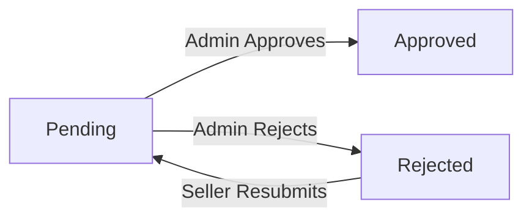
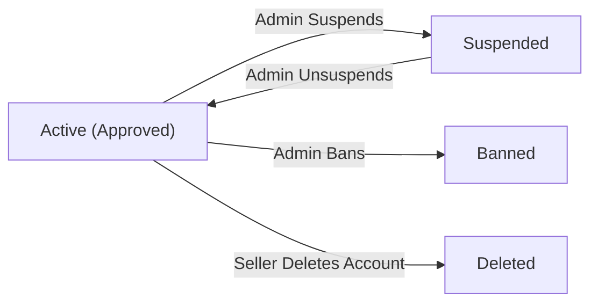

**shoppingMall — Actor definitions, permission matrix, authentication, session, account lifecycle**

Actor definitions, permission matrix, authentication, session, account lifecycle

# Actor Definitions

Define all user actor types with their identity, permissions, and access boundaries.

## guest Actor

A guest is any visitor who accesses the platform without being authenticated. This platform does not allow guest browsing — all features and content, including product listings, search, and seller profiles, require a registered and logged-in account. Guests are therefore the most restricted actor type on the platform, with no access to any functional area beyond the registration and login pages. The guest role exists solely as a transitional state before a visitor completes registration or signs in as a customer, seller, or administrator. Guests cannot add items to a cart, view product details, or interact with any commerce features. The only actions available to a guest are signing up for a new customer account, signing up for a new seller account, or logging in with an existing account.

### Guest Identity and Access Boundaries

A guest is any visitor who accesses the platform without being authenticated. Guests are the most restricted actor type on the platform and have no standing identity within the system — they hold no account, no session, and no persistent state.

This platform does not permit guest browsing. Every feature and piece of content on the platform — including product listings, product detail pages, search results, category pages, seller profiles, the shopping cart, and all commerce interactions — is restricted to registered and authenticated users only. Guests cannot view products, cannot search for items, cannot add anything to a cart, and cannot interact with any commerce feature.

The only pages or interactions available to a guest are:
- The customer account registration page
- The seller account registration page
- The login page for existing accounts

No other area of the platform is accessible without first completing registration and logging in.

### Guest as Transitional State and Registration Entry Points

The guest role exists solely as a transitional state. A visitor remains in the guest state until they either create a new account or sign in with an existing one. Once authenticated, the visitor transitions to one of the registered actor roles — customer, seller, or administrator — and gains the permissions associated with that role.

Guests have two registration entry points available to them:

**Customer Registration**: A guest can sign up for a new customer account by providing an email address and password. Upon successful registration, the guest becomes a customer and may immediately access all customer features.

**Seller Registration**: A guest can sign up for a new seller account by providing an email address and password. Upon submission, the seller account enters a pending approval state and must be reviewed by an administrator before the seller can access selling features. The guest-to-seller transition is immediate in terms of account creation, but the seller remains restricted from selling until approval is granted.

Guests who already have an account can log in using their registered email and password, transitioning directly to their respective actor role.

## customer Actor

A customer is a registered individual who has signed up with an email address and password and whose primary purpose on the platform is to discover, evaluate, and purchase products. Customers are the primary buyers on the platform and have access to the full range of shopping and account management features. Once logged in, a customer can browse product listings, search for products, view product detail pages, manage a wishlist, add items to a shopping cart, proceed through checkout, and place orders. Customers can manage their own profile information, including display name and phone number, and can maintain multiple shipping addresses for order delivery. After purchase, customers can track their order history, view shipment tracking information, confirm delivery of received shipments, and write reviews for products they have purchased. Customers can also request cancellations for unpaid or unshipped items and request refunds for delivered items within the allowed timeframe. A customer's access is limited to their own data — they cannot access other customers' orders, addresses, or account details. Customers cannot manage products, approve sellers, or perform any administrative functions. A banned customer loses the ability to log in and use any platform feature.

### Customer Identity

A customer is a registered individual buyer on the platform. Customers must create an account using a unique email address and a password before accessing any platform feature. There is no guest access — every person who wishes to browse products, shop, or interact with the platform must first register as a customer.

A customer's identity on the platform is defined by their email address, which serves as their unique login credential. Customers also maintain a profile consisting of a display name and a phone number, which they provide and may update after registration.

A customer account exists in one of two states:

| State | Description |
|-------|-------------|
| Active | The customer can log in and use all permitted platform features. |
| Banned | The customer cannot log in. Access to the platform is fully revoked. |

Customer accounts are entirely separate from seller and administrator accounts. A customer who wishes to become an administrator may submit a request (reviewed by super administrators), but the customer role itself carries no administrative authority.

### Shopping and Account Feature Access

Once logged in, a customer has access to the following categories of platform features:

**Profile and Address Management**
- Customers can view and edit their own display name and phone number.
- Customers can add, edit, and delete multiple shipping addresses.
- Customers can designate one of their addresses as the default shipping address.

**Product Discovery**
- Customers can browse product listings by category.
- Customers can search for products by name and apply filters (category, price range, in-stock status) and sorting options.
- Customers can view full product detail pages, including all images, variants, pricing, seller information, and reviews.
- Customers can view seller profiles.

**Wishlist and Cart**
- Customers can add products to their wishlist and remove them.
- Customers can view their paginated wishlist.
- Customers can add specific product variants to their shopping cart, change quantities, and remove items.
- Customers can view a running cart total and proceed to checkout.

**Order Placement and History**
- Customers can proceed through checkout by selecting a shipping address and reviewing the order summary before confirming.
- Customers can place orders through the payment process.
- Customers can view a paginated list of all their past orders, sorted by newest first.
- Customers can view the full details of any individual order they have placed, including item details, shipment tracking, and item statuses.

**Delivery Confirmation**
- Customers can confirm delivery for a shipment they have received, which marks all items in that shipment as delivered.
- If a customer does not manually confirm delivery, items automatically transition to delivered status after 14 days from the shipping date.

**Review Writing**
- Customers can write one review per product per order, but only after the corresponding order item has reached delivered status.
- Each review includes a star rating (1 to 5) and optional text content.
- Customers can edit their own reviews; every edit is recorded as a snapshot.
- Customers can delete their own reviews.

**Cancellation and Refund Requests**
- Customers can request cancellation for individual order items that are in paid status (not yet shipped), providing a reason.
- Customers can request a refund for individual order items that are in delivered status, providing a reason, within 7 days of delivery.
- Customers can view the status and outcome of their cancellation and refund requests.

### Access Boundaries and Banned State

**Data Isolation**
A customer's access is strictly limited to their own data. Customers can only view their own profile, addresses, cart, wishlist, orders, and reviews. They cannot access the account details, order history, addresses, or any private information belonging to other customers.

**No Seller or Administrative Functions**
Customers cannot perform any seller-specific actions. They cannot create, edit, or delete products, manage inventory, manage shipments, or respond to cancellation and refund requests as a seller. Customers cannot approve or reject seller registrations, manage categories, suspend accounts, ban users, view platform-wide data, or perform any other administrative function.

The following functions are explicitly outside the customer's permission scope:

| Restricted Area | Reason |
|-----------------|--------|
| Product management | Seller-only function |
| Order item shipping | Seller-only function |
| Seller approval / rejection | Administrator-only function |
| Category management | Administrator-only function |
| User banning / suspension | Administrator-only function |
| Platform-wide order oversight | Administrator-only function |

**Banned Customer State**
When an administrator bans a customer, that customer immediately loses the ability to log in to the platform. A banned customer cannot access any feature — shopping, account management, or otherwise — until an administrator removes the ban. Existing orders placed before the ban remain intact and are unaffected by the ban itself.

## seller Actor

A seller is a registered business entity or individual who has signed up with an email address and password with the intent to list and sell products on the platform. Unlike customers, sellers must receive administrator approval before they can actively sell — a newly registered seller starts in a pending approval state and cannot list products until approved. Sellers who are rejected can view the rejection reason and submit a new registration request. An approved seller can create and manage their own product listings, including uploading images, defining variants and stock levels, and setting prices. Sellers have access to a shop profile that includes a shop name, description, and logo, which is visible to customers. Approved sellers can view and process order items for their own products, ship items, and respond to cancellation and refund requests from customers. Sellers can also view a dashboard summarizing their shop's activity, including pending requests and order item counts. A seller's permissions are bounded by ownership — they can only manage their own products and orders, not those of other sellers. A suspended seller's products are hidden and they cannot create or edit products, though they may still process existing orders. A seller can delete their own account only when they have no pending orders or outstanding cancellation or refund requests. A banned seller loses the ability to log in entirely.

### Seller Identity and Registration

A seller is a registered business entity or individual who intends to list and sell products on the platform. Sellers sign up using an email address and a password. Each seller account is uniquely identified by its registered email address, and no two seller accounts may share the same email.

Upon sign-up, a seller provides their email address and password to create an account. The seller account is distinct from a customer account — a person who registers as a seller is not automatically a customer, and the two account types are managed separately. After sign-up, the seller must wait for administrator approval before gaining the ability to sell on the platform.

### Approval Process and States

Every newly registered seller account starts in a pending approval state. In this state, the seller can log in and view their approval status, but they cannot create products, manage listings, or perform any selling activities.

Administrators review pending seller registrations and can either approve or reject them. When a seller registration is rejected, the seller can view the reason provided by the administrator for the rejection.

A rejected seller may submit a new registration request after addressing the reasons for rejection. This new request re-enters the pending approval state and is reviewed by administrators again.

A seller account can exist in one of the following approval states:

- **Pending**: Newly registered or resubmitted sellers awaiting administrator review.
- **Approved**: Seller is authorized to list products and conduct sales on the platform.
- **Rejected**: Seller registration was denied; the seller can view the rejection reason and resubmit.

### Approved Seller Permissions

Once approved, a seller gains access to the following capabilities on the platform:

**Product Management**: An approved seller may create product listings, upload product images, define product variants with SKU codes and pricing, and manage stock levels through inventory records. Sellers may also edit and delete their own products, subject to business rule constraints defined in the business rules document.

**Shop Profile**: Each seller has a shop profile that includes a shop name, shop description, and a logo image. The shop profile is publicly visible to customers browsing the platform. Sellers may edit their shop profile at any time; every edit creates a snapshot to preserve the history of changes.

**Order Item Processing and Shipping**: Approved sellers may view all order items associated with their products. When items are ready to be dispatched, sellers can create shipments by selecting one or more of their order items and entering tracking information (carrier name and tracking number). All items in the same shipment share the same tracking details, and their status changes to "shipped" upon shipment creation.

**Cancellation and Refund Responses**: Sellers may respond to cancellation requests submitted by customers for paid items, and to refund requests for delivered items. Sellers can approve or reject these requests, and each response creates a snapshot of the request state.

**Seller Dashboard**: Approved sellers have access to a dashboard that summarizes their shop's activity, including the total number of products, total number of order items, number of pending cancellation requests, and number of pending refund requests.

**Ownership-Bounded Permissions**: All seller permissions are strictly bounded by ownership. A seller may only manage their own products, view their own order items, and respond to requests related to their own listings. Sellers have no access to the products, orders, or data of other sellers.

### Seller Restrictions and Account Lifecycle

Seller accounts may be subject to the following restrictions based on administrative actions or account conditions:

**Suspension**: An administrator may suspend a seller account. When suspended, all of that seller's products are hidden from search results and category listings and cannot be purchased by customers. A suspended seller cannot create new products or edit existing products. However, a suspended seller may still process existing orders — including shipping items and responding to cancellation and refund requests — to ensure customers are not adversely affected. Administrators may lift the suspension at any time, after which the seller's products become visible again.

**Account Deletion**: A seller may request to delete their own account. Account deletion is only permitted when the seller has no pending orders (that is, no order items with a status of paid or shipped) and no outstanding cancellation or refund requests. If either condition is not met, the deletion request is rejected. When a seller successfully deletes their account, their products are removed from listings and their shop profile is no longer active. However, all historical order records, order item snapshots, and the shop name associated with past orders are preserved for record-keeping purposes.

**Banning**: An administrator may ban a seller account. A banned seller loses the ability to log in to the platform entirely. Existing orders associated with the banned seller's products remain intact and are preserved for order history purposes.

## admin Actor

A regular administrator is a user (originally a customer or seller) who has been granted administrative access by a super administrator after submitting a request with a reason. Administrators operate at a platform-wide level and are not bound by the ownership rules that apply to customers and sellers. A regular administrator can view all products across all sellers, view all orders on the platform, manage product categories, and oversee seller approvals. Administrators can approve or reject seller registration requests, and when rejecting, must provide a reason. Administrators can suspend or unsuspend seller accounts and ban or unban customer accounts. Administrators can also force-cancel or force-refund order items regardless of which seller or customer is involved, restoring stock as appropriate. Administrators can delete any product that violates platform policy. Regular administrators cannot promote other administrators, demote super administrators, or modify their own grade — those actions are reserved for super administrators. Regular administrators cannot demote themselves or grant the super administrator grade to anyone.

### Administrator Identity and Promotion Path

A regular administrator is a platform actor who has been granted administrative access through a formal request-and-approval process. Any existing customer or seller account may submit an administrator request, providing a written reason for the application. Super administrators review these requests and may approve or reject them. Upon approval, the account is elevated to regular administrator status while retaining the underlying identity of the original customer or seller account.

Administrators do not register separately — there is no independent administrator sign-up flow. The administrator identity is always derived from a pre-existing customer or seller account that has successfully gone through the promotion process. As a result, every regular administrator has a traceable origin as either a customer or a seller on the platform.

### Platform-Wide Access and Ownership Independence

Unlike customers and sellers, who can only access data and resources they personally own or are a party to, a regular administrator operates at the platform level and is not subject to ownership restrictions. Customers may only view their own orders, and sellers may only manage their own products and order items — administrators are exempt from these boundaries.

Administrators can view all products listed on the platform, regardless of which seller created them. Administrators can view all orders placed on the platform, regardless of which customer placed them or which sellers are involved. This platform-wide visibility is essential for fulfilling oversight, dispute resolution, and policy enforcement responsibilities.

### Seller Oversight Permissions

Administrators are responsible for reviewing and acting on seller registration applications. When a seller completes registration, their account enters a pending state and cannot sell until an administrator reviews their application.

Administrators can approve a pending seller registration, immediately enabling that seller to create products and sell on the platform. Administrators can also reject a pending seller registration. When rejecting, the administrator must provide a written rejection reason. Rejected sellers are notified of the rejection reason so they understand why their application was denied. A rejected seller may submit a new registration request after being rejected.

Administrators can suspend an active seller account. When a seller is suspended, their products are hidden from search results and category listings, and their products cannot be purchased. The suspended seller can still process their existing orders — shipping items and responding to cancellation and refund requests — but cannot create new products or edit existing ones. Administrators can also unsuspend a suspended seller account, restoring the seller's products to visibility and their full selling privileges.

### Customer Management Permissions

Administrators can view all customer accounts registered on the platform. Administrators can ban a customer account. A banned customer is unable to log in to the platform. Administrators can also unban a previously banned customer, restoring their ability to log in and use the platform normally.

Banning a customer does not affect any orders the customer has already placed — existing order records are preserved and remain accessible to the relevant sellers and to administrators.

### Category Management Permissions

Administrators are solely responsible for the creation and maintenance of the product category structure on the platform. Customers and sellers cannot create, edit, or delete categories.

Administrators can create top-level categories and subcategories (one level of nesting only). Each category has a name and a description. Administrators can edit the name and description of any existing category. Administrators can delete a category; when a category is deleted, products that were assigned to it become uncategorized rather than being deleted themselves.

### Product Oversight and Order Intervention Permissions

Administrators can delete any product on the platform when it violates platform policy. Product deletion by an administrator follows the same structural rules as seller-initiated deletion — all variants and inventory records associated with the product are also removed, and the product no longer appears in search or category listings. Snapshots of the product are preserved.

Administrators can force-cancel individual order items or entire orders. When an administrator force-cancels an item, the customer is refunded for that item and the associated stock quantities are restored via an inventory record. Administrators can also force-refund individual order items or entire orders, providing relief to customers without requiring seller approval. These intervention powers allow administrators to resolve disputes and enforce platform policies regardless of the seller's or customer's action.

### Grade Limitations of Regular Administrators

A regular administrator has significant platform-wide authority, but the ability to manage administrator grades is explicitly reserved for super administrators only. Regular administrators cannot promote any account to the administrator role. Regular administrators cannot promote a regular administrator to super administrator. Regular administrators cannot demote a super administrator to regular administrator. Regular administrators cannot modify their own administrator grade in any way.

All actions relating to administrator grade changes — promotions, demotions, and approval of administrator requests — fall exclusively within the authority of super administrators, as defined in the super administrator actor section.

## superAdmin Actor

A super administrator is the highest-privilege actor on the platform, possessing all the permissions of a regular administrator plus exclusive authority over administrator grade management. Super administrators can view and process pending requests from users who wish to become administrators, approving or rejecting those requests. When a request is approved, the requesting user becomes a regular administrator. Super administrators can promote regular administrators to the super administrator grade and can demote other super administrators back to the regular administrator grade. However, a super administrator cannot demote themselves — this restriction prevents accidental loss of all super administrator access. Super administrators are responsible for maintaining the integrity of the administrator team and have ultimate oversight over the platform's operational governance. All other permissions held by regular administrators — such as seller management, category management, product oversight, order oversight, and user management — are also available to super administrators without restriction.

### Super Administrator Identity and Privilege Level

The super administrator is the highest-privilege actor on the platform. A super administrator account is created when a regular administrator is promoted by another super administrator. Super administrators hold all permissions available to regular administrators — including seller management, category management, product oversight, order oversight, and user management — without any restriction. In addition to these inherited permissions, super administrators possess exclusive authorities not available to regular administrators: reviewing administrator promotion requests, managing administrator grades, and maintaining the overall integrity of the administrator team. Super administrators are not bound by ownership or approval constraints when exercising their oversight duties across the platform.

### Administrator Request Review Authority

Super administrators are the sole actors authorized to review requests submitted by customers or sellers who wish to become administrators. Super administrators can view the full list of pending administrator promotion requests, including the reason provided by each applicant. Super administrators can approve a pending request, which causes the requesting user to become a regular administrator. Super administrators can reject a pending request, which leaves the requesting user in their current role. Only super administrators — not regular administrators — may act on these requests. This authority ensures that access to the administrator role is controlled exclusively at the super administrator level.

### Administrator Grade Management

Super administrators can promote a regular administrator to the super administrator grade. Super administrators can demote another super administrator back to the regular administrator grade. A super administrator cannot demote themselves — this restriction ensures that the platform always retains at least one super administrator who can perform grade management. Grade changes take effect immediately upon the super administrator's action. These grade management capabilities are exclusive to super administrators and are unavailable to regular administrators. Through this authority, super administrators are responsible for maintaining the composition and integrity of the administrator team.

# Authentication Flows

Registration, login, logout, and session management from a user perspective.

## Registration and Login

Define user registration and login flows including validation and error handling.

### Customer Registration

A guest who wishes to use the platform must register as a customer before accessing any features. No guest browsing is permitted; registration is required to view products, place orders, or use any other platform feature.

To register as a customer, the guest provides an email address and a password. The email address must be unique across all customer accounts on the platform. If the email address is already associated with an existing customer account, the registration request is rejected.

Upon successful registration, a customer account is created with active status and the guest transitions to an authenticated customer. The customer's display name and phone number are part of their profile and may be set after registration (see Account Management).

If the email address is already in use, the system informs the guest that registration cannot proceed with that email.

### Seller Registration

A guest who wishes to sell on the platform must register as a seller. Seller registration is separate from customer registration; a seller account is distinct from a customer account.

To register as a seller, the guest provides an email address and a password. The email address must be unique across all seller accounts on the platform. If the email address is already associated with an existing seller account, the registration request is rejected.

Upon successful registration, a seller account is created and a seller approval record is created with status "pending". The seller cannot list products, accept orders, or perform any selling activity until their account is approved by an administrator.

Sellers can view their own approval status (pending, approved, or rejected) after registering. If their registration was rejected, they can view the rejection reason provided by the administrator. Rejected sellers may submit a new registration request.

The seller approval workflow is managed by administrators and is described in the admin actor section.

### Customer Login

A registered customer logs in by providing their email address and password. The system verifies the email and password combination against the stored customer account.

If the credentials are correct and the account is active, the customer is authenticated and gains access to all customer features.

If the email address does not match any customer account, the login request is rejected. If the password does not match, the login request is rejected. The system does not distinguish between the two failure cases in its response (i.e., it does not reveal whether the email exists).

If the customer's account has been banned by an administrator, the login request is rejected and the customer cannot access the platform.

### Seller Login

A registered seller logs in by providing their email address and password. The system verifies the email and password combination against the stored seller account.

If the credentials are correct and the account is active, the seller is authenticated. An authenticated seller with approved status can access selling features such as product management and order processing. A seller with pending or rejected approval status can log in but cannot perform selling actions until approved.

If the email address does not match any seller account, the login request is rejected. If the password does not match, the login request is rejected. The system does not reveal whether the email exists in its response.

If the seller's account has been banned by an administrator, the login request is rejected and the seller cannot access the platform.

If the seller's account has been suspended by an administrator, the seller can still log in but is restricted from creating new products, editing existing products, or listing new items for sale. They may continue to process existing orders.

### Administrator Authentication

Administrators (both regular administrators and super administrators) log in using the email address and password associated with their linked account (original customer or seller account). Administrator status is an elevated role granted on top of an existing account.

Upon successful authentication, the system recognizes the administrator's grade (regular or super) and grants the corresponding level of platform-wide access.

If the credentials are incorrect or the underlying account is inactive, the login request is rejected. Administrators are subject to the same credential verification rules as customers and sellers.

Super administrators have all permissions of regular administrators plus the ability to review administrator promotion requests, approve or reject them, and manage administrator grades. Regular administrators can perform seller approvals, category management, product oversight, order oversight, and user management, but cannot manage administrator grades or review promotion requests.

## Session and Logout

Define session behavior and logout from a user perspective.

### Session Lifecycle

After a customer, seller, or administrator successfully logs in, the system establishes an authenticated session that grants access to the features permitted for that actor's role.

A session is created at the moment of successful authentication and remains active until the user explicitly logs out or the session is otherwise terminated.

Each session is bound to a single authenticated actor. Concurrent sessions across different devices or browsers may be maintained independently; logging out from one session does not automatically terminate sessions on other devices.

Guests do not have sessions. Any attempt to access protected features without an active session is rejected, and the actor is directed to log in.

Banned customers and banned sellers do not have active sessions. If a customer or seller is banned while a session is active, that session is invalidated and further requests are rejected.

Suspended sellers retain their session and may continue to access their account for the limited actions available to them (processing existing orders, responding to cancellation and refund requests), but cannot create products or access features restricted during suspension.

Seller accounts with pending or rejected approval status may log in to view their approval status but cannot access seller-specific features (such as creating products or managing inventory) until the account is approved.

### Logout

Any authenticated actor (customer, seller, or administrator) can log out of the platform at any time.

When a user logs out, the system immediately terminates their current session. Any further requests using that session are rejected.

After logging out, the user is returned to the guest state and must log in again to access any protected features.

Logging out does not affect any persistent data associated with the actor's account, such as profile information, cart contents, order history, or product listings. All account data is preserved across logout and login cycles.

The platform does not support a "log out from all devices" feature beyond what is defined here; each session is managed independently.

### Account Security Constraints

Access to all platform features beyond the registration and login pages requires an active authenticated session. Unauthenticated actors (guests) cannot browse products, view orders, manage accounts, or perform any other platform action.

Banned customers are prevented from logging in. If a login attempt is made by a banned customer, the system rejects the request. Existing sessions for banned customers are invalidated at the time of the ban.

Banned sellers are prevented from logging in. Existing sessions for banned sellers are invalidated at the time of the ban. Existing orders associated with banned sellers continue to exist and are preserved, but the banned seller cannot take further actions.

A customer or seller can only access their own account data. Actors cannot view or modify another actor's profile, orders, or account information, except as explicitly permitted by their role (for example, administrators can view all accounts).

Administrators access account management features exclusively through their administrator identity. Administrator accounts are linked to the original customer or seller account that was promoted, but administrator-level access is governed separately.

Password changes (defined in Account Management) immediately apply to future login attempts. Active sessions are not required to be terminated upon a password change, as the platform does not specify forced re-authentication after a password update.

# Account Lifecycle

Account creation, deletion, and password management.

## Account Management

Define how users create accounts, delete accounts, and change passwords.

### Account Creation

Customers create an account by providing an email address and a password. The email address must be unique across all customer accounts on the platform. Once the account is created, the customer can immediately log in and use all customer features.

Sellers create an account by providing an email address and a password. The email address must be unique across all seller accounts on the platform. A newly created seller account is placed in a pending approval state and cannot perform selling activities until an administrator approves the registration.

Both customer and seller accounts require an email address and a password at the time of registration. No personal profile details (display name, phone number, shop name, etc.) are required to complete initial account creation; those are managed separately through profile settings.

Any user (customer or seller) may submit a request to become an administrator. The request must include a reason text explaining why they are requesting the role. Super administrators review these requests and either approve or reject them. Upon approval, the user is granted the administrator role while retaining their original account identity.

No account creation is permitted for guests without going through the registration process. The platform does not support guest browsing or anonymous access to any features.

### Account Deletion

Customers may delete their own account at any time. When a customer account is deleted:

- The customer's profile information (display name, phone number) is permanently removed.
- All shipping addresses associated with the account are removed.
- The customer's cart and wishlist are removed.
- All orders and order history placed by the customer are preserved for seller records and legal purposes.
- All reviews written by the customer are preserved but are displayed as authored by a "deleted user" to other platform visitors.

Sellers may delete their own account only if both of the following conditions are met:

- The seller has no order items in "paid" or "shipped" status (no pending fulfillment obligations).
- The seller has no pending cancellation or refund requests awaiting their response.

If either condition is not met, the seller's account deletion request is rejected. The seller must resolve all pending obligations before account deletion is permitted.

When a seller account is deleted:

- All of the seller's products are removed from search results and category listings.
- All order history and order item snapshots associated with the seller are preserved.
- The seller's shop name as recorded in past order snapshots is preserved unchanged, so customers retain a complete historical record of their purchases.

Administrators cannot delete accounts through the standard account deletion flow; account termination for administrators is handled through the administrator management process.

### Password Change

Customers can change their password while logged in. To change their password, a customer must provide their current password for verification and then provide a new password. If the current password does not match, the password change is rejected.

Sellers can change their password while logged in. The same process applies: the seller must provide their current password for verification along with the desired new password. If the current password does not match, the password change is rejected.

Password changes apply only to the account of the user who initiates the request. No actor can change another user's password on their behalf through this flow. Administrators do not have a mechanism to directly set or override another user's password.