**shoppingMall — Business concepts, relationships, and states from user perspective**

Business concepts, relationships, and states from user perspective

# Domain Concepts

Describe what each concept means in the business domain and its key attributes.

## Customer Concept

A Customer is an individual who uses the platform to browse, discover, and purchase products from sellers. Customers must have a registered account to access any part of the platform — guest browsing is not permitted. Each customer is uniquely identified by their email address, which also serves as their login credential. A customer's profile includes a display name and phone number that help personalize their experience and facilitate delivery. Customers can maintain multiple shipping addresses for different delivery destinations. The customer account is the primary subject of shopping activities, including wishlists, shopping carts, orders, and reviews. When a customer deletes their account, their personal profile information is removed, but their order history and reviews remain in the system to preserve transactional integrity and seller records.

### Customer Identity and Account Access

A Customer is an individual who registers on the platform to browse, discover, and purchase products. Registration is mandatory — the platform does not support guest browsing. Without a registered and active account, no platform features are accessible.

Each customer is uniquely identified by their email address. The email address serves as the primary login credential and cannot be shared between accounts. Alongside their email, the customer sets a password at registration, which together form the authentication credentials for all subsequent logins.

A customer account carries an account status that reflects whether the account is active or has been banned by an administrator. Only customers with an active status can log in and use the platform.

### Customer Profile Attributes

A customer's profile consists of personal details that support the shopping experience and facilitate delivery:

- **Email address**: The unique identifier and login credential for the account.
- **Display name**: A human-readable name visible in the customer's profile and associated with their activity on the platform, such as reviews.
- **Phone number**: A contact number associated with the customer's account, used for delivery and communication purposes.

Customers can update their display name and phone number at any time. The email address is set at registration and serves as the immutable identifier for the account.

Each customer may also maintain multiple shipping addresses linked to their account. The address records capture delivery-specific details (recipient name, phone number, street address, city, state or province, postal code, and country) and are described fully in the CustomerAddress concept.

### Customer as Primary Shopper Identity

The customer account is the central identity around which all shopping activities are organized. All shopping-related entities on the platform are owned by and associated with a specific customer:

- **Wishlist**: A customer maintains a personal list of products they are interested in.
- **Shopping Cart**: A customer holds selected product variants in a cart prior to checkout.
- **Orders**: All purchase transactions are placed under a customer's account and belong to that customer.
- **Reviews**: Customers write reviews for products they have successfully received, and those reviews are attributed to their account.

This ownership model means that all shopping history, saved items, and transactional records are tied to the customer's account and accessible only to that customer (and authorized administrators).

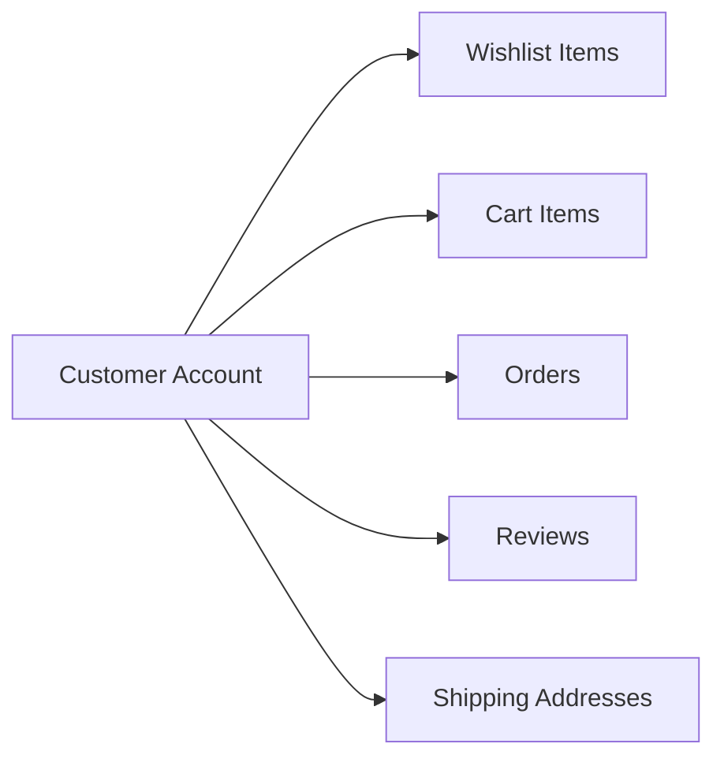

### Customer Account Lifecycle and Deletion Policy

A customer account progresses through the following states during its lifetime:

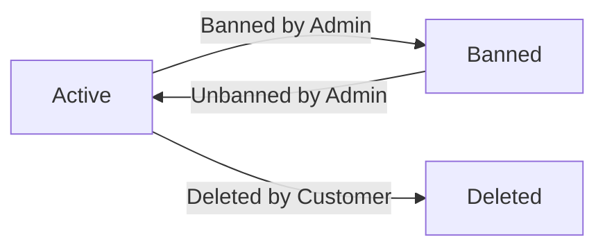

When a customer chooses to delete their account, the following rules govern what is removed and what is preserved:

**Removed upon deletion:**
- The customer's personal profile information (display name and phone number) is permanently removed.
- The customer's shipping addresses are removed.
- The customer's wishlist and cart items are removed.

**Preserved upon deletion:**
- All orders and order history remain intact in the system. This ensures that sellers retain accurate transactional records and that legal or financial records are not disrupted by a customer's account deletion.
- All reviews written by the deleted customer remain on the platform. However, reviews from a deleted account are displayed with the author identified as "deleted user" rather than by the customer's display name. This preserves the informational value of reviews for other shoppers and sellers while respecting that the account no longer exists.

This policy ensures that the removal of a customer's identity does not compromise the integrity of the platform's transactional and review history.

## Seller Concept

A Seller is a business participant on the platform who lists products for sale and fulfills orders placed by customers. Each seller account is identified by a unique email address and protected by a password. Sellers maintain a public-facing shop profile that includes a shop name, a shop description, and a logo image, which customers can view to learn about the seller. A seller account is not immediately active upon registration — it requires explicit approval from an administrator before the seller can list products or conduct sales. Sellers can hold different approval statuses: pending, approved, or rejected, and the current status determines their ability to operate on the platform. A seller who is rejected can see the reason for rejection provided by the administrator. When a seller deletes their account, their active product listings are removed, but all historical order data and shop name references in past orders are preserved for record-keeping purposes.

### Seller Identity and Credentials

A Seller is a business participant on the platform who lists products for sale, manages inventory, and fulfills orders placed by customers. Each seller account is uniquely identified by an email address and protected by a password. The email address serves as the primary login credential and must be unique across all seller accounts on the platform.

A seller account is a distinct account type from a customer account. Sellers operate their own storefronts and are responsible for the products they list, the orders they receive, and the fulfillment of those orders. The seller's identity ties together all of their product listings, order items, shipments, cancellation responses, and refund responses.

### Seller Shop Profile

Each seller maintains a public-facing shop profile that consists of three elements: a shop name, a shop description, and a logo image. The shop name is the name under which the seller operates and is the primary label customers see when browsing products or reviewing orders. The shop description allows the seller to communicate additional information about their business to customers. The logo image provides a visual identity for the shop.

Customers can view a seller's shop profile. The shop profile is editable by the seller at any time (subject to their account status). Every time the seller edits their shop profile, a snapshot of the previous state is captured and preserved (defined in the SellerProfileSnapshot Concept). This ensures that the historical state of a seller's profile can always be reconstructed for any point in time, supporting dispute resolution and order record integrity.

### Seller Approval Status

A newly registered seller account does not have the ability to list products or conduct sales immediately. Before a seller can operate on the platform, an administrator must explicitly review and approve the seller's registration. This approval requirement exists to ensure that only legitimate and vetted sellers participate in the marketplace.

At any given time, a seller account holds one of three approval statuses:

- **Pending**: The seller has submitted their registration and is awaiting administrator review. A seller in this status cannot list products or sell on the platform.
- **Approved**: The administrator has approved the seller's registration. The seller is permitted to create product listings and conduct sales.
- **Rejected**: The administrator has reviewed and rejected the seller's registration. The seller cannot operate on the platform. When a seller's registration is rejected, the rejection reason provided by the administrator is visible to the seller so they understand why their application was not accepted.

The full approval record — including submission date, review date, and the reviewer — is tracked by the SellerApproval entity (defined in the SellerApproval Concept). A rejected seller may submit a new registration request to seek reconsideration.

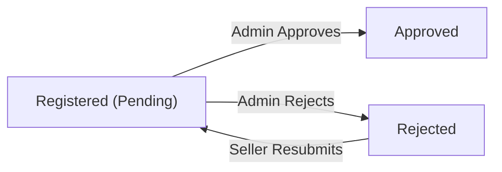

### Seller Account Deletion and Data Preservation

A seller may delete their own account under specific conditions defined in the business rules. When a seller account is deleted, the following data handling rules apply:

- All of the seller's active product listings are removed from the platform. Deleted products no longer appear in search results or category listings.
- All historical order data associated with the seller's products is preserved. Order items, order item snapshots, shipment records, and financial transaction histories remain intact for legal and record-keeping purposes.
- The seller's shop name as it appeared in past orders is preserved within those order records. Customers who placed orders with the seller can still see the shop name associated with their purchase, even after the seller account no longer exists.

This preservation policy ensures that customers retain a complete and accurate record of their past transactions, and that the platform maintains a trustworthy order history for all parties regardless of whether the seller account remains active.

## Admin Concept

An Admin is a privileged platform user responsible for overseeing and governing the marketplace. Administrators have authority over sellers, products, categories, orders, and other users, giving them platform-wide visibility and control. Each admin account is identified by a unique email address and protected by a password. Administrators are distinguished by their grade, which is either regular administrator or super administrator. Regular administrators can perform standard governance tasks such as approving sellers, managing categories, and overseeing products and orders. Super administrators hold the highest level of authority and can promote or demote other administrators between grades. A super administrator cannot demote themselves, ensuring that at least one super administrator always exists.

### Admin Identity and Credentials

An Admin is a privileged platform user who holds authority over the marketplace and its participants. Every admin account is identified by a unique email address and protected by a password. An admin account is not created independently — it is always derived from an existing Customer or Seller account that has been granted administrator status through the admin request and approval process.

Because an admin account originates from an existing member account, the admin inherits the email address of that originating account. The admin's identity on the platform remains tied to this original account, preserving a traceable link between the administrator and their original role on the platform.

Admins have platform-wide visibility, meaning they can access and review content, accounts, orders, products, categories, and requests across all sellers and customers on the platform — not limited to any single seller shop or customer account.

### Administrator Grade

Every admin account belongs to one of two grades: regular administrator or super administrator. The grade determines the scope of authority the admin holds within the platform.

**Regular Administrator** 
A regular administrator is responsible for standard governance tasks across the platform. This includes approving or rejecting seller registration requests, managing the product category hierarchy, reviewing and overseeing products, monitoring orders, and managing customer and seller accounts (such as banning or unbanning users, suspending or unsuspending sellers).

**Super Administrator** 
A super administrator holds the highest level of authority on the platform. In addition to all the capabilities of a regular administrator, a super administrator can approve or reject admin upgrade requests submitted by platform users, and can change the grade of other administrators — either promoting a regular administrator to super administrator or demoting another super administrator to regular administrator.

**Grade Promotion and Demotion** 
A super administrator may promote a regular administrator to super administrator status. A super administrator may also demote another super administrator to regular administrator status. However, a super administrator cannot demote themselves. This restriction ensures that the platform always retains at least one active super administrator capable of governing administrator-level operations.

Grade changes take effect immediately upon a super administrator's decision. The history of grade changes is traceable through the admin request records.

## AdminRequest Concept

An AdminRequest is a formal application submitted by any existing user — whether a customer or a seller — who wishes to become an administrator on the platform. The request captures the reason the applicant provides for wanting to join the administrator team. Each AdminRequest carries a status that reflects where it stands in the review process: pending, approved, or rejected. The timestamp of when the request was submitted is also recorded, providing a complete audit trail of the application. Super administrators are the only ones authorized to review and decide on these requests. An approved AdminRequest results in the requesting user gaining administrator access on the platform.

### AdminRequest

An AdminRequest is a formal application submitted by any existing platform user — whether a customer or a seller — who wishes to join the administrator team. The request exists to provide a structured, auditable pathway through which ordinary users can apply for elevated platform governance responsibilities.

Each AdminRequest carries the following attributes:

- **Applicant**: The customer or seller who submitted the request. Any registered user on the platform may submit an AdminRequest, regardless of their current role.
- **Reason text**: A written explanation provided by the applicant stating why they wish to become an administrator. This is a required field and forms the basis for the reviewing super administrator's decision.
- **Status**: Reflects the current state of the request in the review lifecycle. An AdminRequest is always in one of three states: pending (submitted but not yet reviewed), approved (the super administrator has granted the request), or rejected (the super administrator has declined the request).
- **Submission timestamp**: The exact date and time at which the request was submitted. This timestamp provides a complete audit trail of when the application entered the system and supports chronological ordering of requests for review.

An AdminRequest begins in the pending state immediately upon submission and remains there until a super administrator takes action on it.

### Review Authority and Outcome

Only super administrators are authorized to review AdminRequests. Regular administrators do not have the ability to approve or reject these applications.

When a super administrator reviews a pending AdminRequest, the outcome is one of the following:

- **Approved**: The applicant's status on the platform is elevated to administrator. The user gains administrator access and can perform governance tasks according to the regular administrator grade.
- **Rejected**: The application is declined. The request moves to the rejected state and no change in the user's existing role or permissions occurs.

The super administrator's decision is final for each submitted request. If a user's AdminRequest is rejected and they wish to reapply, the nature of that process is governed by platform policy (defined in 03-functional-requirements).

The AdminRequest serves as the permanent record of the application event, capturing who applied, why they applied, when they applied, and what decision was made — providing a transparent audit trail for all administrator appointments on the platform.

## SellerApproval Concept

A SellerApproval is the gating record that controls whether a seller is permitted to operate on the platform. Every seller registration is accompanied by a SellerApproval record, which tracks the review outcome of that registration. The approval record holds a status that can be pending, approved, or rejected, reflecting the current decision made by an administrator. When a seller is rejected, the rejection reason provided by the administrator is stored in the SellerApproval record so the seller can understand why their application was not accepted. The submission date is also captured, providing a chronological record of the seller's registration attempt. A rejected seller can submit a new registration request, which creates a fresh SellerApproval record for re-evaluation.

### SellerApproval as Gateway to Platform Access

A SellerApproval is the authoritative record that determines whether a seller is permitted to operate on the platform. Every seller registration automatically generates a SellerApproval record, which functions as the formal gate controlling whether that seller may list products, accept orders, and conduct commerce on the platform. Until a SellerApproval is granted, the seller account exists on the platform but cannot perform any selling activities.

The SellerApproval record captures the following:

- **Approval status**: Reflects the current administrative decision. The status begins as pending immediately upon seller registration, transitions to approved when an administrator grants access, or transitions to rejected when an administrator denies the registration.
- **Submission date**: Records when the seller submitted their registration request, establishing a chronological audit trail of the seller's application history.
- **Rejection reason**: When an administrator rejects a registration, a written reason is recorded in the SellerApproval record so the seller can understand the basis for the denial.
- **Review date**: Records when an administrator made their decision, providing a timestamp of the review action.

The lifecycle of a SellerApproval is tied directly to the administrator's review process. A pending record awaits an administrative decision. An approved record unlocks the seller's ability to operate. A rejected record closes that registration attempt but does not permanently bar the seller from the platform.

### Resubmission After Rejection

A seller whose registration has been rejected is not permanently excluded from the platform. After reviewing the rejection reason stored in their SellerApproval record, the seller may submit a new registration request. Each new submission creates a fresh SellerApproval record in pending status, independent of the prior rejected record. The previous rejected record is preserved as a historical artifact and is not overwritten or deleted.

This means a seller can have multiple SellerApproval records over time — one for each registration attempt. Administrators reviewing a new submission may refer to the history of prior attempts. The most recent SellerApproval record reflects the seller's current eligibility status on the platform.

At any given time, a seller has exactly one active (non-superseded) SellerApproval record that defines their current standing: either pending review, approved to sell, or rejected and eligible to reapply.

## CustomerAddress Concept

A CustomerAddress is a saved shipping destination that belongs to a specific customer account. Each address record contains all the information needed to deliver a package: the recipient's name, a contact phone number, the street address, city, state or province, postal code, and country. Customers can save multiple addresses to accommodate different delivery needs, such as home, work, or gift recipients. Among all saved addresses, a customer can designate one as the default shipping address, which is pre-selected during the checkout process. A CustomerAddress is an independent record that can be created, edited, or deleted by the customer who owns it. When an order is placed, the selected shipping address is captured as part of the order record and cannot be changed afterward.

### CustomerAddress

A CustomerAddress is a saved shipping destination that belongs exclusively to a single customer account. Customers may save multiple addresses to accommodate a variety of delivery needs — for example, a home address, a workplace, or a gift recipient's location.

Each address record contains all the information needed to route and deliver a package:

- **Recipient name**: the name of the person who will receive the delivery at this address
- **Phone number**: a contact number associated with the recipient
- **Street address**: the full street-level location of the destination
- **City**: the city or municipality of the destination
- **State or province**: the regional subdivision of the destination
- **Postal code**: the postal or ZIP code identifying the delivery zone
- **Country**: the country of the destination

Among all saved addresses, a customer may designate exactly one as the **default shipping address**. The default address is pre-selected for the customer during checkout, simplifying the ordering process. A customer may change which address is the default at any time. If no default has been set, the customer must manually select an address at checkout.

A CustomerAddress is fully owned by the customer who created it. The customer can create, edit, or delete their own addresses. Deleting an address removes it from the customer's saved list but does not affect any orders that were already placed using that address.

### Shipping Address at Order Time

When a customer places an order, the selected shipping address is captured and permanently recorded as part of the order record. This captured snapshot preserves the full address details — recipient name, phone number, street address, city, state or province, postal code, and country — exactly as they were at the moment the order was placed.

Because the address is captured at order placement, any subsequent edits or deletion of the original CustomerAddress record have no effect on existing orders. The delivery destination for a placed order is fixed and immutable; it cannot be changed after the order is created.

This ensures that sellers and logistics partners always see the correct delivery destination for a given order, regardless of any future changes the customer makes to their address book.

## Category Concept

A Category is an organizational concept that groups related products together to help customers discover and browse the catalog more easily. Each category has a name and a description that convey the type of products it contains. The platform supports one level of nesting, meaning a category can have subcategories, but subcategories cannot have their own children. This two-tier hierarchy allows meaningful product classification without over-complicating the browse structure. Categories are exclusively managed by administrators, ensuring consistent and authoritative catalog organization. Products are assigned to a category (which may be a subcategory) when they are created by sellers. If a category is deleted by an administrator, the products previously assigned to it become uncategorized rather than being deleted.

### Category Structure and Attributes

A Category is an organizational unit that groups related products together within the platform's catalog. Every category has a name that identifies the type of products it contains, and a description that provides additional context for customers browsing the catalog.

The platform supports exactly one level of subcategory nesting. A category may optionally have a parent category, in which case it is considered a subcategory. Subcategories cannot themselves have children — the hierarchy is always exactly two tiers: a top-level parent category and its immediate subcategories. This flat two-tier structure keeps catalog navigation simple and predictable for customers.

Categories are exclusively created, edited, and deleted by administrators. No other actor type can modify the category hierarchy. This centralized governance ensures that the catalog structure remains consistent and authoritative across the platform.

The relationship between parent categories and subcategories can be visualized as follows:

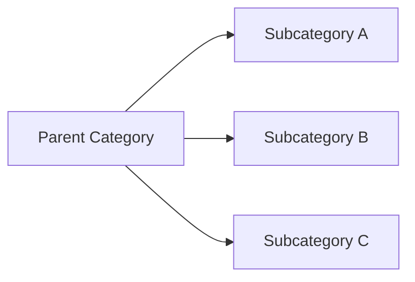

A subcategory belongs to exactly one parent category. A parent category can have multiple subcategories. Top-level categories do not belong to any parent.

### Category as Product Grouping and Catalog Organization

Products are assigned to a category at the time they are created by a seller. A product must be assigned to exactly one category, which may be either a top-level category or a subcategory. This assignment allows customers to discover and browse products by navigating the category hierarchy.

When customers browse the catalog, the category structure serves as the primary navigational framework. Customers can view the full list of all categories and drill into a specific category to see the products it contains. If a customer selects a top-level parent category, the products shown may include those assigned directly to that category as well as those in its subcategories, depending on how the platform presents the hierarchy.

If an administrator deletes a category, the products previously assigned to that category are not deleted. Instead, they become uncategorized — they remain on the platform and are still owned by their respective sellers, but they are no longer associated with any category. Uncategorized products may still appear in search results by name but will not appear under any category browsing path.

The category structure therefore serves two distinct purposes: it provides a browsing and discovery mechanism for customers, and it gives sellers a meaningful classification context when listing their products.

## Product Concept

A Product is a sellable item listed on the platform by a seller. Each product belongs to exactly one seller who is responsible for its information and availability. A product has a name, a description, a category assignment, and a base price — all of which are required attributes. The base price serves as the default reference price for the product, while individual variants may override it with their own pricing. Products are visible to customers in search results and category pages, and each product can have multiple images and multiple variants representing different options. A product must have at least one variant to be considered purchasable; products without variants are visible but shown as unavailable. When a product is deleted, it no longer appears in search or category listings, and all its variants and inventory records are also removed. Snapshots of the product are preserved even after deletion to support dispute resolution and order history integrity.

### Product Definition and Ownership

A Product is a sellable item listed on the platform by a seller. Every product belongs to exactly one seller, who is solely responsible for its content, pricing, and availability. The product's seller affiliation is established at creation and does not change over the product's lifetime.

Each product has four required attributes:

- **Name**: The human-readable title displayed to customers across all listings, search results, and the product detail page.
- **Description**: A detailed account of the product's characteristics, intended use, or any information the seller chooses to share.
- **Category**: A single category assignment that places the product within the platform's browsable hierarchy. A seller may assign a product to either a top-level category or a subcategory.
- **Base price**: The default reference price for the product as a whole. The base price is what customers see when no variant-specific pricing applies. Individual variants may define their own price, which overrides the base price for that variant. When variants carry different prices, the product listing may display a price range derived from those variant prices rather than the base price alone.

All four attributes are required; a product cannot exist without each of them being provided.

### Product Visibility and Purchasability States

A product's visibility and purchasability are governed by two independent dimensions: whether it has been deleted and whether it has at least one available variant.

**Visibility in search and category listings**
An active (non-deleted) product appears in platform-wide search results and in category browsing pages. Customers searching by name or filtering by category can discover the product through these surfaces.

**Purchasability requirement**
A product must have at least one variant defined in order for customers to add it to their cart. A product with no variants is still visible in search and category listings so customers can find it, but it is presented with an "unavailable" indicator, signaling that it cannot currently be purchased.

**Deleted product behavior**
When a product is deleted, it is immediately removed from all search results and category listings. Customers can no longer discover or view the product. All variants and inventory records associated with the deleted product are also removed. The deletion is permanent from the customer-facing perspective; the product does not return to any listing after deletion.

The table below summarizes the states:

| Condition | Visible to customers | Purchasable |
|---|---|---|
| Active, has variants | Yes | Yes |
| Active, no variants | Yes | No (shown as unavailable) |
| Deleted | No | No |

### Product Snapshot Preservation After Deletion

Whenever a product's information is edited, a product snapshot is created to record the complete state of the product at that moment. These snapshots are immutable and are never deleted — they outlive the product itself.

When a product is deleted, all previously created snapshots for that product remain intact and accessible to authorized parties (the owning seller and administrators). This ensures that the historical record of the product's details is available for dispute resolution, order history review, and audit purposes, even after the product ceases to exist as an active listing.

Order items that reference a deleted product retain their own order item snapshot, which independently preserves the product name, description, variant details, and seller information captured at the moment of purchase. This means a customer's order history accurately reflects what they bought regardless of whether the product was subsequently deleted.

The preservation of snapshots after deletion is unconditional — no actor can remove them.

## ProductImage Concept

A ProductImage is a visual asset attached to a product to help customers understand what they are purchasing. Each image is associated with a specific product and stored as a URL reference. Images have a display order that determines the sequence in which they appear on the product detail page. The image with the lowest display order is designated as the main or thumbnail image, which is shown in product listings and search results. A product can have multiple images, allowing sellers to showcase the product from different angles or configurations. Changes to product images — including additions, deletions, and reordering — are captured as part of product snapshots to preserve the visual state of the product at any given point in time.

### ProductImage as a Visual Asset

A ProductImage is a visual asset attached to a product to help customers understand what they are purchasing. Each ProductImage belongs to exactly one product and is stored as a URL reference pointing to the hosted image file. A product can have multiple images simultaneously, allowing sellers to showcase the product from different angles, configurations, or contexts.

Each ProductImage carries two key attributes:
- **Image URL**: The address where the image is stored and retrieved for display.
- **Display order**: A numeric position value that determines the sequence in which the image appears relative to other images on the same product.

The image with the lowest display order is designated as the main image, also referred to as the thumbnail. This thumbnail is the image shown in product listing views such as search results and category pages. All other images are shown in the full product detail view, presented in ascending order of their display order values.

Sellers may reorder images at any time, which changes the display order values of the affected images. When images are reordered, the image currently holding the lowest display order becomes the new main thumbnail. Sellers may also add new images or delete existing images from a product.

### Image Changes and Snapshot Inclusion

Because product images are part of the visual identity of a product at any given point in time, any change to a product's images — including additions, deletions, and reordering — is treated as a product edit and triggers the creation of a product snapshot.

A product snapshot (defined in the ProductSnapshot Concept section) captures the complete state of the product at the moment of the edit, including the full set of images and their display order at that time. This means the visual presentation of a product is preserved historically, just as its textual and pricing attributes are.

This inclusion of image state in snapshots is important for order integrity: when a customer purchases a product, the order item snapshot preserves the product's images as they appeared at the time of purchase. If the seller later changes the images, the historical snapshot remains unaffected, providing an accurate record of what was advertised to the customer at the time of the transaction.

## ProductVariant Concept

A ProductVariant represents a specific, purchasable configuration of a product defined by a unique combination of option values such as color and size. Each variant carries a SKU code that uniquely identifies it across the platform, along with the option values that distinguish it from other variants of the same product. A variant may have its own price that overrides the product's base price, allowing sellers to price different configurations differently. Each variant independently tracks its own stock quantity through inventory records, reflecting the number of units available for purchase. When a variant's stock reaches zero, it is shown as out of stock and cannot be added to a cart. A product must have at least one variant to be purchasable, and the collection of variants defines the full range of options customers can choose from.

### ProductVariant Identity and Configuration

A ProductVariant represents a specific, purchasable configuration of a product defined by a unique combination of option values. Each variant is identified by a SKU code that is unique across the entire platform — no two variants from any seller may share the same SKU code. The SKU code serves as the primary identifier for a variant when it appears in orders, inventory records, and cart items.

Each variant carries one or more option values that distinguish it from other variants of the same product. Option values describe the specific attributes that differentiate configurations, such as color (e.g., "Red", "Blue") or size (e.g., "Small", "Large"). A single product may have variants combining multiple option dimensions, for example "Red / Large" and "Blue / Small".

A variant belongs exclusively to the product it was created under. The collection of all variants for a product defines the complete range of purchasable configurations that customers can choose from. Products with no variants are visible in search and category listings but are shown as unavailable for purchase.

### Variant Pricing and Stock Status

Each variant may optionally define its own price that overrides the product's base price. When a variant price override is set, that price applies to purchases of that variant instead of the base price. If no override is set, the product's base price is used. This allows sellers to price different configurations differently — for example, charging more for a larger size.

Each variant independently tracks its own stock quantity. Stock is maintained through inventory records (described in the InventoryRecord Concept), and the current stock level is derived by summing all inventory changes associated with that variant. Because each variant has its own stock tracking, one configuration may be in stock while another is not.

When a variant's stock quantity reaches zero, that variant is considered out of stock. Out-of-stock variants are displayed with an out-of-stock indicator on the product detail page and cannot be added to a customer's cart. A variant with at least one unit in stock is considered available for purchase, provided the variant and its parent product have not been deleted.

A product must have at least one active, non-deleted variant before it can be purchased. A product with variants that are all deleted or unavailable is not purchasable.

### Variant Edit and Snapshot

Sellers may edit the attributes of a variant they own, including the SKU code, option values, and price override. Every time a variant is edited, a variant snapshot is created to preserve the state of the variant at the moment before the change. This snapshot captures the SKU code, option values, and price at that point in time.

Variant snapshots are embedded within product snapshots (described in the ProductSnapshot Concept) and are also associated with order items at the time of purchase via the ProductSnapshotSKU record. This ensures that the historical state of any variant is always recoverable, regardless of subsequent edits or deletions.

Variant snapshots are immutable and cannot be deleted. They serve as the authoritative record of what a variant looked like at any given point in time, supporting dispute resolution and order history accuracy.

## ProductSnapshot Concept

A ProductSnapshot is an immutable record that captures the complete state of a product at a specific point in time. It is created every time a product's editable fields are modified, preserving the values before and after the change. The snapshot includes all product-level fields: name, description, category, base price, and images. In addition to product-level fields, a ProductSnapshot also embeds snapshots of all variants that existed at the moment of the change, forming a complete picture of the product and its variants together. ProductSnapshots are immutable — once created, they cannot be modified or deleted. They serve as an authoritative historical record that can be consulted by the product owner or administrators for dispute resolution or audit purposes. Snapshots are preserved even after the product itself is deleted.

### ProductSnapshot as an Immutable Historical Record

A ProductSnapshot is an immutable record that captures the complete state of a product at a specific moment in time. It is created automatically every time a seller edits any editable field of a product, preserving the full product state at the moment before the change takes effect.

Each ProductSnapshot records:
- The product's name, description, category, and base price at the time of the snapshot
- The complete set of product images and their display order at that moment
- A snapshot of every variant (ProductSnapshotSKU) that existed when the snapshot was created, including each variant's SKU code, option values, and price

By bundling product-level fields and all variant states together, a single ProductSnapshot represents an authoritative, self-contained picture of the product and all of its variants at one point in time. Once created, a ProductSnapshot cannot be modified or deleted by anyone — not by the seller, and not by administrators. This immutability guarantees the integrity of the historical record.

ProductSnapshots are preserved even after the product itself is deleted. This means the full history of a product's evolution remains available for review regardless of whether the product is still active on the platform.

### ProductSnapshot Lifecycle and Access

A new ProductSnapshot is created each time a seller saves edits to a product. This includes changes to the product name, description, category, base price, images (additions, deletions, or reordering), or any of its variants. Every such edit triggers a fresh snapshot, building an ordered chain of historical states over the product's lifetime.

ProductSnapshots serve as the authoritative record for dispute resolution and audit purposes. When there is a disagreement about what a product looked like at the time of a purchase or at any other point in its history, the snapshots provide a verified, tamper-proof reference.

Access to ProductSnapshots is restricted to relevant parties:
- The seller who owns the product can view all snapshots of their own products, including snapshots created before or after any edits.
- Administrators can view snapshots of any product on the platform, regardless of which seller owns it.

Snapshots are also referenced by order items at purchase time. When a customer places an order, the order item records a reference to the ProductSnapshot and the specific ProductSnapshotSKU that represent the exact product and variant state at the moment of purchase, ensuring that the purchased state is preserved permanently for both the customer and the seller.

## ProductSnapshotSKU Concept

A ProductSnapshotSKU is a frozen record of a single product variant's state at the moment a product snapshot was taken. It is always created as part of a parent ProductSnapshot, never independently. Each ProductSnapshotSKU captures the SKU code, the option values, and the price of the variant as they existed at that specific point in time. This ensures that even if a variant is later edited or deleted, its historical state within any given snapshot remains accurate and intact. The collection of ProductSnapshotSKU records within a ProductSnapshot together represent the full variant lineup of the product at that moment. Like all snapshots, these records are immutable and cannot be changed after creation.

### ProductSnapshotSKU as a Child Record of a Product Snapshot

A ProductSnapshotSKU is a frozen record of a single product variant's state at the exact moment its parent ProductSnapshot was created. It exists exclusively as a child record of a ProductSnapshot and is never created independently. Every time a product snapshot is taken, one ProductSnapshotSKU is created for each variant that existed at that moment, collectively preserving the full variant lineup of the product as it appeared at that point in time.

Each ProductSnapshotSKU captures three pieces of information from the variant at snapshot time:

- **SKU code**: The unique identifier of the variant as it existed when the snapshot was taken.
- **Option values**: The descriptive combination of options (for example, color and size) that characterized the variant at that moment.
- **Price**: The variant's price at snapshot time, which may reflect either the variant's own price override or the product's base price if no override was set.

Because a product snapshot is created on every product edit, the collection of ProductSnapshotSKU records within each snapshot together represent a complete and accurate picture of the variant lineup as it stood at that specific point in history. This means that even if a variant is subsequently edited, deleted, or replaced, the ProductSnapshotSKU records within any previously taken snapshot remain unaffected and continue to reflect the original state.

ProductSnapshotSKU records are immutable. Once created as part of a product snapshot, they cannot be modified or deleted. This immutability ensures that historical variant data embedded in order items, used in dispute resolution, or reviewed by administrators or sellers always reflects exactly what existed at the time the snapshot was taken, not any later state of the variant.

## SellerProfileSnapshot Concept

A SellerProfileSnapshot is an immutable record of a seller's public profile at a specific point in time. It captures the shop name, shop description, and logo image URL as they existed when the snapshot was taken. Snapshots of a seller's profile are created every time the seller edits their profile information. Additionally, a SellerProfileSnapshot is embedded with each order item at the time of purchase to preserve the seller's identity as the customer experienced it. This ensures that even if a seller later changes their shop name or logo, the historical order record accurately reflects who the seller was at the time of the transaction. These records are immutable and cannot be deleted.

### SellerProfileSnapshot Definition and Attributes

A SellerProfileSnapshot is an immutable record that captures the exact state of a seller's public profile at a specific moment in time. It stores three pieces of information: the shop name as it appeared at the moment the snapshot was taken, the shop description as written by the seller at that time, and the logo image URL pointing to the logo that was active at that moment.

A new SellerProfileSnapshot is created automatically every time a seller edits any part of their profile — whether the shop name, description, or logo image. This means the full history of a seller's profile changes is preserved as an ordered series of snapshots, one per edit. These records are immutable: once created, a SellerProfileSnapshot cannot be modified or deleted, ensuring a reliable and tamper-proof audit trail of every profile change a seller has ever made.

### Role in Order Items and Transaction History

At the moment a customer's order is successfully placed, a SellerProfileSnapshot is embedded directly with each order item belonging to that seller. This snapshot records the seller's shop name and logo as they existed at the exact time of purchase — not as they may appear later if the seller updates their profile.

This embedding preserves the seller's identity as the customer experienced it during the transaction. If the seller subsequently renames their shop, changes their description, or replaces their logo, the historical order record remains accurate and unchanged, continuing to reflect the seller's identity at the time the customer made the purchase. This is essential for dispute resolution, as both customers and administrators can always refer back to the precise seller identity that was presented at the point of sale.

A SellerProfileSnapshot used in an order item context references the same snapshot structure (shop name, description, and logo image URL) as one created during a profile edit, ensuring consistency across all uses of seller profile history.

## InventoryRecord Concept

An InventoryRecord is a single entry in the stock history of a specific product variant, recording a quantity change and the reason for that change. The quantity change can be positive, representing a restock or return, or negative, representing a sale or an inventory adjustment for loss. Each record is timestamped, providing a chronological audit trail of all stock movements for a variant. The current stock level of a variant is not stored as a single value but is instead calculated by summing all inventory records associated with that variant. This approach ensures that every change to stock quantity is fully traceable and auditable. InventoryRecords are distinct from snapshots in that they are operational records rather than immutable state captures — they represent events rather than preserved states.

### InventoryRecord

An InventoryRecord is a single stock movement entry associated with a specific product variant. It represents one discrete event that changed the quantity of that variant — such as a restock, a sale, a customer return following a cancellation or refund, or a manual inventory adjustment for shrinkage or loss.

Every InventoryRecord carries three core pieces of information:

- **Quantity change**: A signed number representing how much stock changed. A positive value indicates that stock was added (e.g., a seller restocking or a cancelled/refunded item being returned to stock). A negative value indicates that stock was consumed or removed (e.g., a customer placing an order or a seller recording a loss adjustment).
- **Reason**: A human-readable explanation of why the stock changed. This may describe the nature of the event — for example, "restock delivery", "order fulfillment", "inventory adjustment — damaged goods", or "order cancellation — stock restored".
- **Timestamp**: The date and time at which the stock movement occurred, establishing the chronological position of this record within the variant's full history.

InventoryRecords are linked to exactly one product variant. A variant can have many InventoryRecords accumulated over its lifetime, each representing a distinct stock event.

The current stock level of a variant is not stored as a single value anywhere in the system. Instead, it is always derived by summing all quantity change values across every InventoryRecord associated with that variant. This means the live stock count at any moment is the running total of every addition and subtraction ever recorded for that variant. When the sum reaches zero, the variant is considered out of stock.

InventoryRecords are operational records, not snapshots. They are created continuously as stock events occur and form a chronological ledger of all stock movements. Unlike snapshots — which capture the full state of an entity at a point in time for historical preservation — InventoryRecords represent individual events in an ongoing sequence. They are used to compute current stock levels and to provide a complete, auditable history of every quantity change for a variant from its creation onward.

InventoryRecords are never deleted or modified after creation. Each record is permanent, ensuring that the full audit trail of stock movements remains intact regardless of other changes to the product or variant.

## WishlistItem Concept

A WishlistItem represents a product that a customer has saved for future reference or potential purchase. It captures the relationship between a customer and a product they are interested in, along with the timestamp of when the item was added to the wishlist. The wishlist operates at the product level, meaning customers save entire products rather than specific variants. Each WishlistItem is owned by a single customer and is private to that customer. If the product associated with a WishlistItem is deleted by the seller, the WishlistItem is automatically removed from the customer's wishlist to prevent stale references.

### WishlistItem

A WishlistItem represents a customer's expressed interest in a product, allowing them to save products they wish to consider for future purchase. The wishlist serves as a personal interest list maintained by each customer, separate from the shopping cart and orders.

Each WishlistItem captures:
- The product the customer has saved (the entire product, not a specific variant)
- The timestamp recording when the customer added the product to their wishlist
- The owning customer, to whom the WishlistItem exclusively belongs

The wishlist operates at the product level rather than the variant level. This means a customer saves a product as a whole, regardless of which variant (e.g., color, size) they may ultimately select at the time of purchase.

Each WishlistItem is owned by exactly one customer, and the wishlist is private — no other customer or party can view another customer's wishlist entries.

If the seller deletes the product associated with a WishlistItem, that WishlistItem is automatically removed from the customer's wishlist. This ensures the wishlist never contains references to products that no longer exist on the platform, preventing stale or broken entries.

Customers use the wishlist as a personal holding area for products they find interesting but are not yet ready to purchase. Saved products remain in the wishlist until the customer explicitly removes them or until the product is deleted.

## CartItem Concept

A CartItem represents a specific product variant that a customer intends to purchase, held in their shopping cart prior to checkout. Unlike a wishlist item, a CartItem is tied to a specific variant — the customer must choose a particular combination of options. Each CartItem records the quantity the customer wishes to purchase. If the customer adds the same variant to their cart again, the quantities are combined into a single CartItem rather than creating a duplicate entry. The cart is a transient holding area — items remain there until the customer checks out, removes them, or the variant becomes unavailable. The cart displays each item's product name, variant options, price, and quantity, along with a calculated subtotal. If a variant's available stock falls below the cart quantity, the item is flagged with a warning. If a variant is deleted or becomes out of stock, the CartItem is marked as unavailable.

### CartItem as a Variant-Specific Cart Entry

A CartItem represents a specific product variant that a customer intends to purchase before completing checkout. Unlike a wishlist item — which tracks interest at the product level — a CartItem is always tied to a particular variant. This means the customer must have selected a concrete combination of options (such as color and size) before an item can enter the cart. Each CartItem belongs to exactly one customer and references exactly one product variant. A customer's cart may contain CartItems from multiple sellers and multiple products simultaneously.

### Quantity Tracking and Quantity Consolidation

Each CartItem records the quantity the customer wishes to purchase for that variant. When a customer adds a variant to the cart that is already present, the system does not create a new CartItem entry. Instead, the quantity of the existing CartItem is increased by the amount just added. This consolidation ensures that each variant appears at most once in a given customer's cart, with its quantity reflecting the cumulative total the customer has selected.

### Cart as a Pre-Checkout Holding Area

The cart serves as a transient holding area where selected variants accumulate until the customer is ready to proceed to checkout. CartItems are not confirmed purchases — they represent intent. Items remain in the cart until the customer explicitly removes them, completes checkout, or until a variant's availability changes. Once an order is placed successfully, the corresponding CartItems are removed from the cart. Items that were not included in the order (for example, unavailable items excluded from checkout) remain in the cart.

### Unavailable CartItem State

A CartItem may become unavailable due to changes in the underlying variant's status. Specifically, a CartItem is marked as unavailable when the referenced product variant has been deleted by the seller, or when the variant's current stock has reached zero (out of stock). An unavailable CartItem remains visible in the customer's cart so the customer is aware of the change, but it cannot be included in a checkout. Customers are expected to remove unavailable items manually or they are excluded automatically at the point of checkout.

### Stock Warning on CartItem

Even when a variant is not fully out of stock, a CartItem may display a stock warning if the quantity the customer has selected exceeds the variant's currently available stock. For example, if the customer has 5 units of a variant in their cart but only 3 are currently available, the CartItem is flagged with a warning to alert the customer to the discrepancy. This warning does not automatically adjust the cart quantity — the customer decides how to respond. The warning is resolved if additional stock becomes available or if the customer reduces their cart quantity to match available stock.

### CartItem Subtotal

Each CartItem has an associated subtotal, which is calculated by multiplying the variant's current price by the cart quantity. If the variant has a price override set, that override price is used for the subtotal; otherwise, the product's base price applies. The cart also presents an aggregate total representing the sum of all CartItem subtotals. Because the subtotal reflects the variant's live price at the time the cart is viewed, it may change if the seller updates the variant's price before the customer completes checkout.

## Order Concept

An Order is the formal record of a successful purchase transaction between a customer and one or more sellers. Each order is assigned a unique order number for identification and reference. The order records the total price paid, reflecting the sum of all purchased items. The date and time when the order was placed is also recorded. An order is composed of one or more order items, each representing a specific purchased variant. Order items within a single order may belong to different sellers, making cross-seller orders possible. The overall status of an order is a derived concept calculated from the statuses of its constituent order items — it is not a directly stored value but a business-level representation of the order's collective state.

### Order as a Formal Purchase Record

An Order is the formal, immutable record created when a customer successfully completes a purchase transaction. It represents the culmination of the checkout and payment process and serves as the authoritative document of what was bought, when, and for how much.

Each order is assigned a unique order number at the moment of creation. This number is the primary identifier used by customers, sellers, and administrators to reference, look up, and discuss a specific transaction. The order number does not change after creation.

The order records the total price of all purchased items combined, reflecting the sum of prices paid across every order item in that order. This total is captured at the moment the order is placed and remains fixed — it does not change if item statuses change later (e.g., due to cancellations or refunds).

The order also records the exact date and time when the order was placed. This timestamp serves as the official reference point for the transaction and is used for sorting order history and auditing purposes.

An order is always associated with a single customer — the person who initiated and completed the purchase.

### Order Composition and Shipping Address

An order is composed of one or more order items. Each order item represents a specific purchased product variant at a specific quantity and price. A single order may contain items from multiple different sellers — the platform supports cross-seller purchases within a single order. There is no restriction requiring all items in an order to come from the same seller.

The shipping address selected at checkout is captured and stored with the order as a snapshot at the time of placement. This ensures the delivery destination is permanently recorded regardless of any future changes the customer may make to their saved addresses. The shipping address associated with an order cannot be changed after the order is placed.

Order items belonging to different sellers are fulfilled and shipped independently. Each seller is responsible only for the items that belong to their products. Items from different sellers are always grouped into separate shipments (defined in the Shipment Concept).

### Derived Order Status

The overall status of an order is not stored directly — it is a derived value calculated from the statuses of all its constituent order items. This derived status provides a high-level view of the order's collective progress.

The rules for deriving order status from item statuses are as follows:

- If all items carry the status "paid," the order status is "paid."
- If any item carries the status "shipped" and none have yet been delivered, the order status is "shipped."
- If all items carry the status "delivered," the order status is "delivered."
- If all items carry the status "cancelled," the order status is "cancelled."
- If all items carry the status "refunded," the order status is "refunded."
- If items carry a mix of different statuses (for example, some delivered and some refunded, or some cancelled and some delivered), the order status is "partially completed."

This derived approach means the order status automatically reflects the real state of the order as individual items progress through their own lifecycles. Customers, sellers, and administrators can always determine the overall state of an order by observing its derived status.

## OrderItem Concept

An OrderItem is the granular unit within an order that represents the purchase of a specific product variant. Each order item records the quantity purchased and the price at which the variant was sold at the time of purchase. Order items carry their own independent status — paid, shipped, delivered, cancelled, or refunded — allowing each item to progress through the fulfillment lifecycle independently. Multiple units of the same variant purchased together form a single order item with a corresponding quantity rather than multiple separate records. Each order item is associated with a specific seller, enabling seller-level order management. Order items can be individually cancelled or refunded without affecting other items in the same order. Each order item also carries a snapshot of the purchased product and variant, as well as a snapshot of the seller's profile at the time of purchase.

### OrderItem Definition and Core Attributes

An OrderItem is the fundamental unit of purchase within an order. It represents the customer's acquisition of a specific product variant in a particular quantity during a single transaction. Each order item records the exact price at which the variant was sold at the moment the order was placed — this captured price is immutable and does not change even if the seller later modifies the variant's price. The quantity attribute reflects how many units of the chosen variant the customer purchased in that transaction.

When a customer adds multiple units of the same variant and checks out, those units are consolidated into a single order item with a combined quantity, rather than appearing as separate line entries. This consolidation applies only within the same order — the same variant purchased in a different order would appear as a separate order item in that order.

Each order item is inherently tied to the specific seller who owns the purchased product, enabling seller-level management of fulfillment, cancellations, and refunds.

### Independent Item Status Lifecycle

Every order item carries its own independent status, which progresses through the fulfillment lifecycle without being tied to the statuses of other items in the same order. The possible statuses are:

- **Paid**: The order has been placed and payment has been collected. The item is awaiting shipment by the seller.
- **Shipped**: The seller has dispatched the item as part of a shipment with tracking information. The item is in transit.
- **Delivered**: The customer has confirmed receipt of the shipment containing this item, or the delivery window has elapsed automatically.
- **Cancelled**: The item's cancellation request was approved, or an administrator has force-cancelled the item. No further fulfillment action is taken.
- **Refunded**: The item's refund request was approved, or an administrator has force-refunded the item after delivery.

Because each order item has its own status, items from the same order can be in different stages simultaneously — for example, one item may be delivered while another is still in paid status awaiting shipment. The overall order status is derived from the combined statuses of all its items, as defined in the Order Concept.

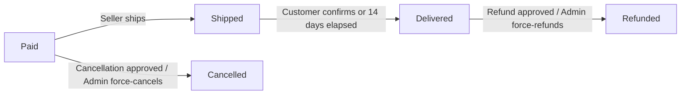

### Seller Association

Each order item is linked to the seller who owns the product that was purchased. This association determines which seller is responsible for fulfilling, shipping, and responding to cancellation or refund requests for that item. Since a single order can contain items from multiple sellers, each item's seller linkage ensures that order management responsibilities are correctly attributed. Sellers can only view and act upon order items that belong to their own products — they do not have visibility into items from other sellers within the same order.

### Embedded Snapshots per Order Item

At the moment an order is successfully created, each order item embeds two types of snapshots to permanently preserve the state of the purchase:

**Product and Variant Snapshot**: A snapshot of the purchased product — including its name, description, category, base price, and images — along with the specific variant's SKU code, option values, and price at the time of purchase is recorded and linked to the order item. This snapshot ensures that the order history accurately reflects what the customer bought, regardless of any future edits the seller makes to the product or its variants.

**Seller Profile Snapshot**: A snapshot of the seller's profile — including the shop name and logo image — at the time of purchase is also embedded with the order item. This ensures that the seller's identity as presented during the transaction is preserved, even if the seller later updates their shop name or logo.

Both snapshots are immutable once created and are retained permanently as part of the order record. They serve as the authoritative reference for dispute resolution, order history display, and audit purposes.

### Individual Cancellation and Refund Eligibility

Each order item is independently eligible for cancellation or refund based on its own status, without affecting the other items in the same order.

A cancellation request can be submitted for an individual order item while it is in **paid** status (before the seller has shipped it). The seller who owns that item reviews and responds to the cancellation request. If the cancellation is approved, only that item is cancelled; the remaining items in the order continue their normal fulfillment lifecycle.

A refund request can be submitted for an individual order item once its status is **delivered**, within a 7-day window from the delivery confirmation date. The seller who owns that item reviews and responds to the refund request. If the refund is approved, only that item is refunded; the other items remain unaffected.

When a cancellation or refund is approved, the stock quantity for the affected variant is restored through an inventory record. Cancellation and refund request details and their status changes are tracked via their own snapshot records (defined in CancellationRequestSnapshot and RefundRequestSnapshot concepts).

## OrderItemSnapshot Concept

An OrderItemSnapshot is the embedded historical record of a product and its variant as they existed at the moment an order item was created. It captures the product name, description, and variant options so that the customer's purchase record remains accurate even if the seller later edits or deletes the product. This snapshot is part of the order item and is created automatically when the order is placed. The OrderItemSnapshot ensures that the product the customer paid for is permanently documented in their order history, regardless of future changes to the product catalog. These records are immutable by nature, as they represent the state of a transaction at a specific moment in time.

### OrderItemSnapshot Definition and Purpose

An OrderItemSnapshot is an immutable record embedded directly within an order item at the moment an order is placed. Its purpose is to permanently document the exact state of the purchased product and its variant as they existed at the time of purchase, so that the customer's order history remains accurate and trustworthy regardless of any future changes to the product catalog.

The OrderItemSnapshot captures the following information at purchase time:

- **Product name**: the name of the product as it appeared when the customer bought it
- **Product description**: the full description of the product at the time of purchase
- **Variant options**: the specific combination of option values (for example, color and size) that identify the exact variant the customer selected
- **Price at purchase**: the price the customer paid for the variant, recorded as part of the order item
- **Seller shop name**: the name of the seller's shop at the time of purchase (sourced from the SellerProfileSnapshot, defined in the SellerProfileSnapshot Concept section)

The OrderItemSnapshot is created automatically by the system when an order is successfully placed. No manual action by the customer or seller is required to generate it. Once created, the snapshot is permanent and cannot be modified or deleted — it is a factual record of a completed transaction.

Because the snapshot is embedded in the order item, it remains associated with the specific purchase forever. Even if the seller later edits the product name, changes the description, restructures variant options, adjusts pricing, or deletes the product entirely, the snapshot preserves what the customer actually received and paid for at the time of their order.

### Relationship to ProductSnapshot and SellerProfileSnapshot

The OrderItemSnapshot does not store product and seller information in isolation — it references the broader snapshot records that are created when a product is edited or when a seller's profile is updated.

- The OrderItemSnapshot references the ProductSnapshot (defined in the ProductSnapshot Concept section) that corresponds to the product's state at purchase time. Through this reference, it inherits the full set of product field values including all images and the complete set of variant records captured in the ProductSnapshotSKU (defined in the ProductSnapshotSKU Concept section).
- The OrderItemSnapshot references the SellerProfileSnapshot (defined in the SellerProfileSnapshot Concept section) that corresponds to the seller's profile at purchase time, preserving the shop name and logo as the customer saw them.

This design ensures that the order item carries a complete, self-contained historical record: the customer can always look back at their order and see precisely what product they purchased, from which shop, with which options, and at what price — as those details existed on the day the order was placed.

The OrderItemSnapshot supports accurate order history display for customers viewing their past orders. It also serves as an authoritative reference for administrators and sellers when reviewing order details, resolving disputes, or processing cancellation and refund requests.

## Shipment Concept

A Shipment is a physical package dispatched by a seller that contains one or more order items. Each shipment is associated with a single seller, since different sellers always ship their items separately. A shipment carries tracking information including the carrier name and the tracking number, which customers can use to follow the delivery progress. The date and time the shipment was created is recorded to establish when the items were dispatched. All order items grouped within a single shipment share the same tracking information. A seller may choose to combine multiple of their order items into one shipment or ship them individually as separate shipments. The shipment concept is what connects ordered items to delivery tracking and the delivery confirmation process.

### Shipment Definition and Attributes

A Shipment is a physical package dispatched by a seller containing one or more order items. It represents the logistical unit that connects purchased items to their physical delivery journey.

Each Shipment has the following attributes:

- **Seller**: The seller who dispatched the shipment. A shipment is always linked to exactly one seller — items from different sellers are never combined into the same shipment.
- **Carrier name**: The name of the shipping carrier or courier service used to transport the package (e.g., FedEx, UPS, DHL).
- **Tracking number**: The unique identifier issued by the carrier that allows the shipment's delivery progress to be followed.
- **Dispatch date**: The date and time at which the shipment was created and the items were marked as dispatched. This timestamp establishes when the seller handed the items over for delivery.
- **Delivery date**: The date and time at which delivery was confirmed, either by the customer or automatically by the system after the designated waiting period.

All order items grouped within the same shipment share the same carrier name and tracking number. There is no concept of per-item tracking within a single shipment — tracking is managed at the shipment level.

### Seller Ownership and Multi-Seller Separation

A shipment belongs to exactly one seller. Because orders may contain items from multiple sellers, each seller is responsible for shipping their own items independently. Items from different sellers are always dispatched as separate shipments — they are never combined into a single cross-seller package.

This seller-to-shipment binding ensures that:

- Each seller controls when and how their items are shipped.
- Customers can track items from each seller separately through that seller's shipment.
- Cancellation and refund responsibility remains clearly associated with the originating seller.

Within a single seller's set of order items, the seller may choose to group some or all of their items into one shipment, or ship them as individual separate shipments. This grouping decision is made at the time of shipping.

### Item Grouping and Shared Tracking

A single shipment can contain one or more order items, all of which must belong to the same seller. When multiple items are grouped into one shipment, they share the same carrier name and tracking number — all grouped items are treated as a single package from a tracking perspective.

Because all items in a shipment share tracking information, delivery confirmation is also performed at the shipment level rather than the individual item level. When a customer confirms receipt of a shipment, all order items within that shipment transition to the delivered status simultaneously.

Similarly, automatic delivery confirmation (triggered after 14 days from the dispatch date) applies to all items within the shipment at once. This ensures that the tracking and delivery lifecycle remains consistent across all items traveling together.

### Shipment as the Delivery Tracking Unit

The Shipment is the primary unit through which delivery progress is communicated to customers. Customers view tracking information at the shipment level — each shipment presents its carrier name and tracking number, along with the list of order items it contains.

The shipment's dispatch date provides a reference point for the delivery timeline. Customers can use the tracking number with the named carrier to check real-time delivery status externally. Within the platform, the shipment record reflects whether items are in transit (shipped status) or have been confirmed as delivered (delivered status).

An order may have multiple shipments associated with it — one per seller involved in the order, or more if a seller chose to ship their items in separate packages. Each shipment is tracked independently, and the delivery status of individual shipments contributes to the overall order status derivation (as defined in the Order Concept and OrderItem Concept sections).

## CancellationRequest Concept

A CancellationRequest is a formal request submitted by a customer to cancel a specific order item that has been paid for but not yet shipped. Each request is tied to a single order item and includes a text reason explaining why the customer wants to cancel. The request carries a status of pending, approved, or rejected, indicating where it stands in the review process by the seller. The timestamp of submission is recorded to establish when the request was made. The seller of the relevant item is responsible for reviewing and responding to the request. A snapshot of the request's state is created each time the seller responds, preserving the history of the decision. If approved, the order item is cancelled and the customer receives a refund for that item.

### CancellationRequest

A CancellationRequest is a formal customer-initiated request to cancel a specific order item that has already been paid for but has not yet been shipped. Each CancellationRequest is tied to exactly one order item, meaning a customer who wishes to cancel multiple items must submit a separate request for each. Only order items currently in the "paid" status are eligible for cancellation — items that have already been shipped, delivered, cancelled, or refunded cannot be the subject of a new cancellation request.

Every CancellationRequest includes a reason, provided as free-form text by the customer at the time of submission, explaining why they wish to cancel. The request also records the date and time it was submitted, establishing a clear audit trail of when the customer initiated the action.

Each CancellationRequest carries a status that reflects where it stands in the review process:

- **Pending**: The request has been submitted by the customer and is awaiting review by the seller.
- **Approved**: The seller has reviewed and accepted the request. The associated order item is cancelled and the customer receives a refund for that item.
- **Rejected**: The seller has reviewed and declined the request. The order item continues processing normally.

The seller who owns the product associated with the order item is the party responsible for reviewing and responding to the request. When the seller responds — either approving or rejecting — a CancellationRequestSnapshot is created to preserve the state of the decision at that moment (defined in the CancellationRequestSnapshot Concept section).

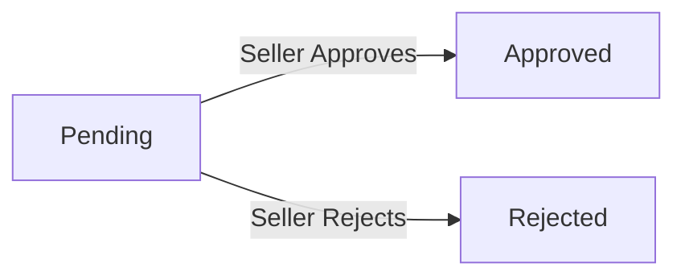

## CancellationRequestSnapshot Concept

A CancellationRequestSnapshot is an immutable record of the state of a CancellationRequest at the moment a seller responds to it. It captures the status of the request at that point in time, along with the reason provided by the customer and the timestamp of when the snapshot was taken. These snapshots form a chronological trail of decision-making for each cancellation request, enabling administrators and relevant parties to review how a request was handled. Because they are immutable, CancellationRequestSnapshots cannot be modified or deleted after creation. They serve as the authoritative record for dispute resolution related to order item cancellations.

### CancellationRequestSnapshot Definition and Attributes

A CancellationRequestSnapshot is an immutable record that captures the exact state of a CancellationRequest at the moment a seller provides a response to it. Each snapshot preserves three core pieces of information:

- **Status at the moment of the response**: the decision the seller made, which is either approved or rejected. This reflects the state of the cancellation request at the precise instant the seller acted on it.
- **Reason text**: the original reason the customer provided when submitting the cancellation request, preserved verbatim within the snapshot to ensure the full context of the request is retained alongside the seller's decision.
- **Timestamp of creation**: the exact date and time when the snapshot was taken, which corresponds to when the seller responded to the request.

A CancellationRequestSnapshot is created automatically each time a seller responds to a cancellation request. It belongs to the parent CancellationRequest and cannot be modified or deleted after it is created.

### Chronological Trail and Dispute Resolution

Because a cancellation request may go through multiple interactions — for example, a rejection followed by a subsequent resubmission — CancellationRequestSnapshots collectively form a chronological trail of every decision made on a given cancellation request. Each snapshot is timestamped and ordered by creation time, making it possible to review the full history of how a request was handled from start to finish.

This trail serves as the authoritative evidence for dispute resolution. When a customer or seller disputes the outcome of a cancellation — for example, claiming the request was not handled correctly — administrators can review the complete sequence of snapshots to reconstruct the decision history. Because snapshots are immutable and timestamped, they provide a tamper-proof record that supports fair and transparent resolution of disputes related to order item cancellations.

## RefundRequest Concept

A RefundRequest is a formal request submitted by a customer to obtain a refund for a specific order item that has already been delivered. Each request is tied to a single order item and includes a text reason explaining the grounds for the refund. The request carries a status of pending, approved, or rejected, and the submission timestamp is recorded. A refund can only be requested within 7 days of the item being delivered, establishing a time-limited window for post-delivery disputes. The seller of the relevant item reviews and responds to the request. A snapshot of the request's state is created each time the seller responds. If approved, the order item is refunded and the stock is restored.

### RefundRequest

A RefundRequest is a formal post-delivery dispute mechanism that allows a customer to seek a monetary refund for a specific order item that has already been delivered. Every RefundRequest is bound to exactly one order item, meaning the scope of a single refund request never extends to an entire order — each item is handled independently.

A RefundRequest carries the following attributes:

- **Reason text**: A written explanation provided by the customer describing why the refund is being sought. This is required when submitting the request.
- **Status**: Reflects the current state of the request — either pending (awaiting seller response), approved (seller has agreed to the refund), or rejected (seller has denied the request).
- **Submission timestamp**: The exact date and time at which the customer submitted the refund request, recorded for audit and dispute resolution purposes.

A RefundRequest is only applicable to order items whose status is "delivered" (as defined in the OrderItem Concept). An order item in any other status — such as paid, shipped, cancelled, or refunded — is not eligible for a refund request.

The 7-day eligibility window begins from the moment the order item's status transitions to "delivered". If a customer does not submit a refund request within this 7-day period, the item is no longer eligible for a refund through this mechanism.

The seller who originally sold the item is responsible for reviewing and responding to the refund request. Upon the seller's response — whether approval or rejection — a RefundRequestSnapshot is automatically created to preserve the state of the request at that moment (snapshot details are defined in the RefundRequestSnapshot Concept, covered in the sibling section).

If the seller approves the refund request, the associated order item's status changes to "refunded", and the previously sold stock quantity is restored via a new inventory record. If the seller rejects the request, the order item remains in the "delivered" status and no stock changes occur.

### RefundRequest Status Flow

A RefundRequest moves through a defined sequence of states from the moment it is submitted until the seller responds.

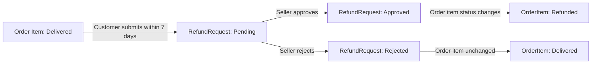

- **Pending**: The initial state when the customer first submits the request. The request awaits a response from the seller. No changes are made to the order item or stock at this stage.
- **Approved**: The seller agrees to the refund. The order item status transitions to "refunded" and stock is restored.
- **Rejected**: The seller denies the refund. The order item remains "delivered" and no further automated action is taken.

In all cases, each transition from pending to approved or rejected triggers the creation of an immutable RefundRequestSnapshot capturing the state at the time of the seller's response.

## RefundRequestSnapshot Concept

A RefundRequestSnapshot is an immutable record of the state of a RefundRequest at the moment a seller responds to it. It preserves the status of the request at that point in time, the reason text submitted by the customer, and the timestamp of snapshot creation. These snapshots provide an auditable history of how each refund request was handled, which can be consulted by administrators or the involved parties if a dispute arises. RefundRequestSnapshots are immutable and cannot be altered or removed after they are created. They mirror the structural role of CancellationRequestSnapshots but apply specifically to post-delivery refund scenarios.

### RefundRequestSnapshot

A RefundRequestSnapshot is an immutable record that captures the state of a RefundRequest at the precise moment a seller responds to it. It is created automatically whenever a seller approves or rejects a customer's refund request, preserving a snapshot of what the request looked like at the time of that decision.

Each RefundRequestSnapshot holds three core pieces of information:

- **Status at snapshot time**: The outcome of the seller's response — either approved or rejected — as it stood at the moment the snapshot was created.
- **Reason text**: The original reason text submitted by the customer when the refund request was filed, preserved verbatim within the snapshot.
- **Snapshot timestamp**: The exact date and time at which the snapshot was created, corresponding to when the seller's response was recorded.

Because multiple seller responses may occur over the lifetime of a single RefundRequest (for example, if a request is re-evaluated), a RefundRequest may accumulate multiple RefundRequestSnapshots over time. Taken together, these snapshots form a chronological trail of every state change the refund request went through, from initial submission to final resolution.

RefundRequestSnapshots are immutable: once created, neither the status, the reason text, nor the timestamp can be altered or deleted. This immutability ensures that the historical record of refund decisions remains trustworthy and tamper-proof. The snapshots can be consulted by the relevant customer, the seller, or an administrator whenever a dispute arises regarding how a refund request was handled, providing a reliable audit trail to support fair resolution.

Structurally, RefundRequestSnapshots mirror the role of CancellationRequestSnapshots (defined in the CancellationRequest Concept section) but apply exclusively to post-delivery refund scenarios, where the order item has already reached delivered status before the request is made.

## Review Concept

A Review is a customer's evaluation of a product they have purchased, submitted after the order item has been delivered. Each review is associated with a specific product and a specific order, ensuring that only verified purchasers can leave feedback. A review contains a rating from 1 to 5 stars, which is required, and an optional text comment providing more detailed feedback. A customer can write one review per product per order. Reviews are publicly visible on the product detail page and contribute to the product's average rating calculation. A review can be soft-deleted by the customer, meaning it is marked as deleted but its content is preserved in review snapshots. Deleted reviews are excluded from the average rating calculation. Every edit to a review's content creates a new review snapshot to preserve the history of changes.

### Review Definition and Attributes

A Review represents a verified customer's evaluation of a product they have purchased through the platform. Each review is anchored to both a specific product and a specific order item, ensuring that feedback comes exclusively from customers who have completed a transaction for that product.

Every review carries the following attributes:

- **Rating**: A numeric score from 1 to 5 stars. This field is required — a review cannot be submitted without a rating.
- **Text content**: A written comment providing more detail about the customer's experience. This field is optional; a review may consist of a rating alone.
- **Authorship**: The customer who submitted the review.
- **Associated product**: The product being evaluated.
- **Associated order item**: The specific order item that establishes purchase verification.
- **Submission timestamp**: When the review was originally created.
- **Last updated timestamp**: When the review content was most recently modified.
- **Deletion status**: Whether the review has been soft-deleted by the customer.

A customer may write one review per product per order. If the same customer purchased the same product across two separate orders, they may leave one review for each order, resulting in at most one review per order item.

### Review Eligibility

The ability to write a review is restricted to customers who have completed a verified purchase. Specifically, a customer may only submit a review for an order item whose status has reached "delivered." Items that are in any earlier status — paid, shipped — or in a terminal non-delivery status such as cancelled or refunded, do not qualify for a review.

This eligibility rule ensures that all reviews on the platform represent genuine purchase experiences. A customer cannot review a product they have not bought and received through the platform.

### Review Contribution to Product Rating

All non-deleted reviews for a product collectively determine that product's average rating. The average rating is calculated from the ratings of all active (non-deleted) reviews associated with the product, regardless of which order they originated from.

Deleted reviews are excluded from the average rating calculation entirely. Once a customer soft-deletes their review, that review's rating no longer contributes to the product's average score.

The product's average rating and total review count are displayed publicly on the product detail page, giving prospective buyers an aggregate measure of customer satisfaction.

### Review Soft Deletion and Snapshot Preservation

When a customer deletes their review, the review is not permanently removed from the system. Instead, it is marked as deleted — a soft deletion — while its data remains intact in the underlying record. This deleted review is excluded from the product's average rating and is no longer publicly visible on the product detail page.

Despite the deletion, all review snapshots that were created during the review's lifetime are permanently preserved and cannot be deleted. These snapshots maintain a complete audit trail of every state the review passed through, supporting dispute resolution processes.

Every time a customer edits their review — whether changing the rating, the text content, or both — a new review snapshot is created to capture the previous state before the edit is applied. This means the full history of a review's changes is always recoverable. Snapshot mechanics (what a snapshot contains and when it is created) are described in the ReviewSnapshot sibling section.

## ReviewSnapshot Concept

A ReviewSnapshot is an immutable record of a review's content at a specific point in time. It captures the rating and text content of the review as they existed when the snapshot was taken. A snapshot is created every time a customer edits their review, preserving the version before the edit. ReviewSnapshots are also preserved after a review is deleted, ensuring that the historical content of the review remains accessible for dispute resolution or audit purposes. Because they are immutable, ReviewSnapshots cannot be modified or removed after creation. They give administrators and relevant parties a complete history of how a review evolved over time.

### ReviewSnapshot

A ReviewSnapshot is an immutable record capturing the exact content of a customer review at a specific moment in time. Each snapshot preserves the review's rating (the star value from 1 to 5) and text content exactly as they existed at the time the snapshot was taken, along with a timestamp recording precisely when the snapshot was created.

A new ReviewSnapshot is created every time a customer edits their review. This means that before any edit takes effect, the previous version of the review — including its rating and text content — is frozen into a snapshot. Over the lifetime of a review that has been edited multiple times, a chronological chain of snapshots forms, together representing the complete revision history of that review.

ReviewSnapshots are also retained when a customer deletes their review. The deletion of a review does not remove any of its associated snapshots; those records persist independently, preserving the full history of the review's content even after the review itself is no longer visible to other users.

Because ReviewSnapshots are immutable, they cannot be edited, merged, or deleted by any actor — including administrators. This immutability guarantees the integrity of the historical record.

ReviewSnapshots serve as the authoritative source for dispute resolution and audit purposes. If a customer or seller disputes the content of a review — for example, claiming that a review was unfairly altered — administrators can examine the full sequence of snapshots to determine exactly what was written at each point in time, and when each version appeared. This audit trail ensures accountability and transparency across the review lifecycle.

# Domain Relationships

Describe how concepts relate to each other from a business perspective.

## Conceptual Relationships

Describe how concepts relate to each other in business terms.

### Customer-Centric Associations

The Customer is the central actor on the buying side of the platform. A customer owns all of the following: their shipping addresses, their shopping cart items, their wishlist items, their placed orders, and their written reviews.

- A customer has many shipping addresses. Each address belongs exclusively to the customer who created it. No address can be shared between customers.
- A customer has many cart items. Each cart item belongs to exactly one customer and references a specific product variant (not just a product).
- A customer has many wishlist items. Each wishlist item belongs to one customer and references a product (not a variant). Wishlist ownership is exclusive — another customer cannot see or interact with another's wishlist.
- A customer has many orders. Each order belongs to exactly one customer. Orders represent a historical record and remain associated with the customer even after account deletion.
- A customer has many reviews. Each review belongs to the customer who wrote it and is also linked to the specific order item that grants them the right to review.
- A customer may have at most one pending admin request at a time. If a customer's account is deleted, orders and reviews remain associated with the historical record but the customer's personal profile is removed.

### Seller-Centric Associations

The Seller is the central actor on the selling side of the platform. A seller owns the products they list and is responsible for fulfilling orders.

- A seller has many products. Each product belongs to exactly one seller. Ownership of a product cannot be transferred to another seller.
- A seller has many seller profile snapshots. Every time the seller edits their profile, a new snapshot is created and associated with that seller. Snapshots are immutable and remain permanently linked to the seller.
- A seller has many seller approvals over time (e.g., initial registration, resubmissions after rejection). Each approval record belongs to the seller it concerns.
- A seller has many shipments. Each shipment belongs to a single seller and contains only order items from that seller's products. Order items from different sellers are never grouped into the same shipment.
- A seller may have at most one pending admin request at a time.

### Product and Catalog Associations

Products exist within a catalog organized by categories, and each product is further broken down into variants.

- A product belongs to one category (which may be a subcategory). A category has many products. If a category is deleted, the association is removed and the product becomes uncategorized.
- A product has many images. Each image belongs to one product and has a display order. Images collectively represent the visual presentation of the product.
- A product has many variants. Each variant belongs to exactly one product and represents a unique purchasable combination of options (e.g., color and size). A product with no variants cannot be purchased.
- A product has many product snapshots. Each snapshot belongs to one product and is created whenever the product is edited. Snapshots persist even after the product is deleted.
- Each product snapshot has many product snapshot SKUs. A snapshot SKU belongs to exactly one product snapshot and represents the state of one variant at the moment the snapshot was taken.
- A product variant has many inventory records. Each inventory record belongs to one variant and contributes to the calculation of current stock. Inventory records are never deleted.
- A category may have many subcategories, but only one level of nesting is permitted. Each subcategory belongs to one parent category.

### Order and Fulfillment Associations

Orders represent the transactional relationship between customers, products, and sellers. The structure below reflects how individual line items are tracked, fulfilled, and resolved.

- An order belongs to one customer and has many order items. Each order item belongs to exactly one order.
- An order item is linked to one product variant (the specific variant purchased). However, the historical record is preserved through the order item snapshot, not by live reference to the variant.
- Each order item has exactly one order item snapshot. The snapshot captures the product name, description, variant options, price, and seller profile at the moment of purchase. The snapshot belongs to the order item and is immutable.
- An order item may have at most one cancellation request. The cancellation request belongs to the order item and has many cancellation request snapshots — each created when the seller responds.
- An order item may have at most one refund request. The refund request belongs to the order item and has many refund request snapshots — each created when the seller responds.
- An order has many shipments. Each shipment belongs to one order and one seller. A shipment has many order items — specifically, a subset of the order's items that the seller chose to ship together.
- An order item may belong to at most one shipment. Once included in a shipment, an item cannot be moved to a different shipment.
- An order item has at most one review (written by the customer after delivery). The review also belongs to the product the item represents, enabling the product's average rating to be calculated across all non-deleted reviews.

### Administrative and Governance Associations

The administrative layer oversees both sellers and platform content through a set of approval and oversight relationships.

- An admin request belongs to the user (customer or seller) who submitted it. It is reviewed and resolved by a super administrator. The request has no further sub-associations; its status and history are captured directly on the request record.
- A seller approval belongs to the seller whose registration it represents. It is reviewed and resolved by an administrator. When a seller resubmits after rejection, a new seller approval record is created — the previous record is retained.
- An admin account is linked to the original customer or seller account from which it was promoted. This linkage is for identity traceability only; the admin account operates independently in governance activities.
- Administrators and super administrators do not own products, orders, or reviews. Their association with platform content is one of oversight rather than ownership — they can view and manage content but do not hold business ownership of it.

## Lifecycle and Retention

Describe concept lifecycle states and transitions only. Detailed retention/recovery policies belong in 05-non-functional. Operation details belong in 03-functional-requirements.

### Account Lifecycle

The platform recognizes three types of accounts — customer, seller, and administrator — each following its own lifecycle.

**Customer Account Lifecycle**

A customer account begins in the active state immediately upon successful registration. From active, it can transition to banned (by an administrator) or to deleted (by the customer themselves). Banned customers cannot log in but their account data is retained. A deleted customer account removes personal profile information (display name, phone number), but the account record itself is preserved as an anchor for associated orders and reviews. Deleted customers cannot log in or use any platform features. There is no recovery path for a deleted customer account.

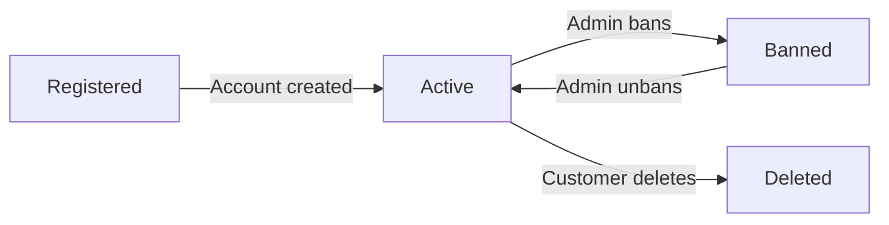

**Seller Account Lifecycle**

A seller account begins in the pending state after registration, awaiting administrator approval. From pending, it can be approved (transitioning to active) or rejected. A rejected seller may submit a new registration request, which creates a new pending approval record while the account remains in the rejected state. An approved seller can be suspended by an administrator, which hides their products and prevents new activity, though they may still process existing orders. A suspended seller can be unsuspended, returning to active. An approved seller may also delete their own account if no pending orders or requests exist, at which point their products are removed from listings and the account is permanently closed. There is no recovery path for a deleted seller account.

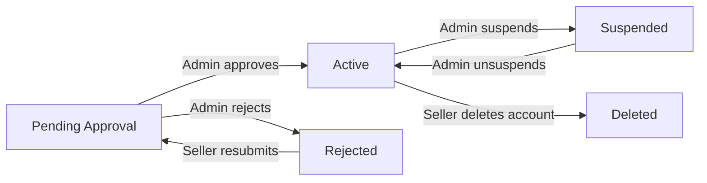

**Administrator Account Lifecycle**

An administrator account is created when a super administrator approves an admin request submitted by a customer or seller. A newly approved administrator begins as a regular administrator. A super administrator may promote a regular administrator to super administrator, or demote another super administrator back to regular. Super administrators cannot demote themselves. There is no deletion lifecycle defined for administrator accounts beyond what the original customer or seller account undergoes.

### Product and Variant Lifecycle

**Product Lifecycle**

A product is created by a seller and is immediately visible in search and category listings (provided the seller is active and approved). A product transitions to deleted when the seller removes it, provided no pending order items or open cancellation/refund requests exist for any of its variants. An administrator may also delete any product for policy violations without those preconditions. Once deleted, a product is removed from all search results, category listings, and wishlists. Deleted products are not recoverable.

A product's visibility may also be affected by seller suspension: when a seller is suspended, all their products are hidden from listings but not deleted. When the seller is unsuspended, the products become visible again.

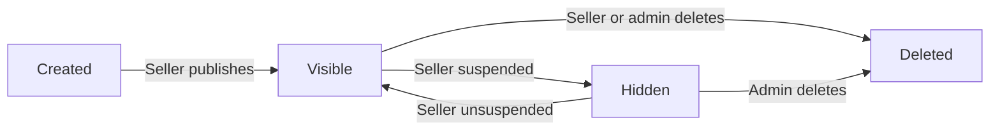

**Product Variant Lifecycle**

A variant is created under a product and is immediately active. A variant transitions to out-of-stock when its calculated stock quantity reaches zero; it returns to in-stock when inventory is restocked. A variant can be deleted by the seller if no pending order items or open cancellation/refund requests reference it. Deleting a product also deletes all of its variants. Deleted variants are not recoverable, but all associated inventory records and order item snapshots referencing that variant are retained.

### Order and Order Item Lifecycle

**Order Item Status Transitions**

Each order item has an independent status that follows a defined progression. An item begins in the paid state upon successful payment. The seller ships the item, moving it to shipped. The customer confirms delivery (or the system auto-confirms after 14 days), moving it to delivered. From paid, the customer may request cancellation; if approved by the seller, the item transitions to cancelled. From delivered, the customer may request a refund within 7 days; if approved by the seller, the item transitions to refunded.

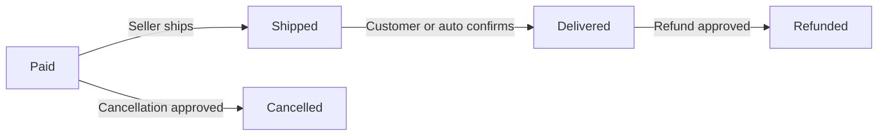

**Derived Order Status**

The overall order status is not stored independently but derived from the collective statuses of its order items. As item statuses change, the derived order status updates accordingly. An order never transitions backward; all status progressions are terminal or forward-moving only.

**Cancellation and Refund Request Lifecycle**

A cancellation request is created in the pending state when a customer submits it. The seller can approve or reject it; both transitions are terminal. Each seller response creates an immutable snapshot of the request state. Similarly, a refund request begins in pending and resolves to either approved or rejected, with a snapshot created at each seller response.

### Snapshot Archival and Retention

Snapshots serve as the platform's archival mechanism. They are created automatically at defined trigger points and are immutable — they can never be edited or deleted. Snapshots preserve the historical state of a record at the moment of change and remain accessible even after the source record is deleted.

The following entities generate snapshots upon modification:

- **Product snapshots**: created on every product edit; include all product fields and embedded variant (SKU) snapshots at that moment
- **Seller profile snapshots**: created on every seller profile edit; embedded with each order item at purchase time
- **Review snapshots**: created on every review edit; preserved after review deletion
- **Cancellation request snapshots**: created when a seller responds to a cancellation request
- **Refund request snapshots**: created when a seller responds to a refund request
- **Order item snapshots**: created at order placement; capture the product, variant, and seller profile state at time of purchase

Snapshots are retained indefinitely. There is no expiration or purge mechanism for snapshot data. Snapshots can be viewed by the relevant parties — record owners and administrators — for audit and dispute resolution purposes.

### Deletion Policy and Data Preservation

The platform applies different deletion policies depending on the type of data and the actor initiating deletion.

**Customer Account Deletion**

When a customer deletes their account, their personal profile data (display name, phone number) is removed. However, their orders, order history, and reviews are retained. Reviews authored by a deleted customer are shown as belonging to a "deleted user" rather than removed, preserving product rating integrity.

**Seller Account Deletion**

When a seller deletes their account, their products are removed from listings. However, all historical order records, order item snapshots, and the seller's shop name as recorded in past order snapshots are preserved. The shop name embedded in order item snapshots at purchase time remains unchanged.

**Product and Variant Deletion**

Deleting a product removes all of its variants and associated inventory records from active use. Product snapshots are retained even after the product is deleted. Wishlist entries referencing the deleted product are automatically removed.

**Review Deletion**

Customers may delete their own reviews. A deleted review no longer contributes to the product's average rating. However, all review snapshots (including the content of the review before any edits) are preserved and accessible to administrators.

**No Recovery**

The platform does not support recovery of deleted accounts, products, variants, or reviews. Once deleted, these records are permanently removed from the active system. Only snapshot and historical order data associated with deleted entities is retained, as described above.

# Business Categories and State Flows

Business category classifications and state flow definitions.

## Business Category Definitions

Define all business category classifications with their allowed values and descriptions.

### Account and Approval Status Classifications

The platform defines distinct status classifications governing whether accounts and approval requests are active, pending, or resolved.

**Customer Account Status**
A customer account carries one of two statuses:
- Active: the customer can log in and use all platform features.
- Banned: the customer cannot log in. All existing order records remain intact.

**Seller Account Status**
A seller account carries one of two statuses:
- Active: the seller can log in and operate normally (subject to approval status).
- Banned: the seller cannot log in, but existing orders remain and must still be processed by administrators.

**Seller Approval Status**
A seller's ability to sell products is governed by their approval status, which is one of:
- Pending: the seller has registered and is awaiting administrator review. They cannot create or sell products.
- Approved: the seller has been approved by an administrator and can list products for sale.
- Rejected: the seller's registration was denied. The rejection reason is recorded and visible to the seller. A rejected seller may submit a new registration request.

**Admin Request Status**
When any user submits a request to become an administrator, that request has one of:
- Pending: the request has been submitted and is awaiting super administrator review.
- Approved: the request was approved; the user is now a regular administrator.
- Rejected: the request was denied by a super administrator.

**Admin Grade Classification**
Administrators are classified into two grades:
- Regular Administrator: performs standard governance tasks such as approving sellers, managing categories, and overseeing products and orders.
- Super Administrator: holds the highest authority, including reviewing admin requests, promoting or demoting administrator grades, and all regular administrator functions.

### Order and Item Status Classifications

Order items and overall orders each carry status values that reflect the current stage of fulfillment. These statuses drive workflows for shipping, cancellation, refunds, and reviews.

**Order Item Status**
Each order item independently holds one of the following statuses:
- Paid: payment was successful; the item is waiting for the seller to ship.
- Shipped: the seller has dispatched the item and a shipment record with tracking information exists.
- Delivered: the customer has confirmed receipt, or 14 days have elapsed since the shipment date without customer confirmation.
- Cancelled: the cancellation request for this item was approved, or an administrator force-cancelled the item.
- Refunded: the refund request for this item was approved, or an administrator force-refunded the item.

**Derived Order Status**
The overall status of an order is not stored independently; it is derived from the statuses of all its items:
- Paid: every item in the order has status "paid."
- Shipped: at least one item is "shipped" and none are "delivered" yet.
- Delivered: every item in the order has status "delivered."
- Cancelled: every item in the order has status "cancelled."
- Refunded: every item in the order has status "refunded."
- Partially Completed: items have a mix of statuses that do not satisfy any of the above conditions (e.g., some delivered, some refunded).

### Request Status Classifications

Both cancellation requests and refund requests share the same three-value status classification, applied independently to each request.

**Cancellation Request Status**
A cancellation request (submitted by a customer for a paid order item) can be in one of:
- Pending: the request has been submitted and the seller has not yet responded.
- Approved: the seller approved the cancellation; the order item transitions to "cancelled" and stock is restored.
- Rejected: the seller rejected the cancellation; the order item remains in its previous status and processing continues normally.

A snapshot of the request state is created each time the seller responds, preserving the decision history immutably.

**Refund Request Status**
A refund request (submitted by a customer for a delivered order item within 7 days of delivery) can be in one of:
- Pending: the request has been submitted and the seller has not yet responded.
- Approved: the seller approved the refund; the order item transitions to "refunded" and stock is restored.
- Rejected: the seller rejected the refund; the order item remains "delivered."

A snapshot of the request state is created each time the seller responds, preserving the decision history immutably.

### Product and Variant Availability Classifications

Products and variants carry visibility and availability classifications that determine whether they appear in listings and can be purchased.

**Product Visibility**
A product can be in one of the following visibility states:
- Visible: the product appears in search results and category listings and can be purchased (subject to variant availability).
- Hidden: the product does not appear in search or category listings and cannot be purchased. This occurs when the owning seller is suspended by an administrator.
- Deleted: the product has been removed by the seller or an administrator. It no longer appears in any listing, but its snapshots are preserved for order history and dispute resolution.

**Variant Availability**
A specific product variant can be in one of the following states:
- Available: the variant has stock greater than zero and can be added to a cart and purchased.
- Out of Stock: the variant's current stock quantity is zero. It is shown on the product page but cannot be added to a cart.
- Deleted: the variant has been removed by the seller. It is marked as unavailable in any cart that contains it and cannot be purchased.

**Product Purchasability**
For a product to be purchasable, it must be visible, have at least one non-deleted variant, and that variant must have stock greater than zero. A product with no variants (or only deleted variants) is shown in search as "unavailable." A product whose only remaining variants are out of stock is shown but cannot result in a completed cart addition.

### Review Status Classification

Reviews carry a status that indicates whether they are active or have been removed by the customer.

**Review Active/Deleted Status**
A review is either:
- Active: the review is visible on the product detail page and contributes to the product's average rating calculation.
- Deleted: the customer has removed the review. The review no longer appears on the product page and is excluded from the average rating calculation. However, all review snapshots created during the review's lifetime are preserved immutably and remain accessible to relevant parties for dispute resolution.

When a customer who wrote reviews deletes their account, the reviews remain active but are attributed to a "deleted user" label rather than the customer's display name.

## State Transitions

Define valid state transition paths for stateful concepts.

### Order Item Status Flow

Each order item progresses through a defined lifecycle from the moment payment is confirmed to final resolution. The status of an order item drives both the overall order status and the eligibility for cancellation, refund, and review actions.

The valid status transitions for an order item are as follows:

- An item begins in the **paid** state immediately upon successful payment.
- From **paid**, the item transitions to **shipped** when the seller creates a shipment that includes that item.
- From **shipped**, the item transitions to **delivered** when the customer confirms delivery of the shipment, or automatically after 14 days from the shipment date.
- From **paid**, the item can transition to **cancelled** if the customer submits a cancellation request and the seller approves it, or if an administrator force-cancels the item.
- From **delivered**, the item can transition to **refunded** if the customer submits a refund request within 7 days and the seller approves it, or if an administrator force-refunds the item.
- An item in **shipped**, **delivered**, **cancelled**, or **refunded** status cannot re-enter a previous state.

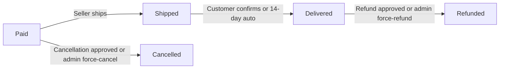

Only one terminal outcome is possible per item: an item that has been cancelled cannot later be refunded, and a refunded item cannot be cancelled.

### Overall Order Status Derivation Workflow

The overall status of an order is not independently set — it is derived from the collective statuses of all its order items. As items change status, the order's overall status is recalculated according to the following rules:

- If every item in the order is **paid**, the overall order status is **paid**.
- If at least one item is **shipped** and none have yet reached **delivered**, the overall order status is **shipped**.
- If every item is **delivered**, the overall order status is **delivered**.
- If every item is **cancelled**, the overall order status is **cancelled**.
- If every item is **refunded**, the overall order status is **refunded**.
- If items are in a mix of terminal states (for example, some delivered and some refunded, or some cancelled and some delivered), the overall order status is **partially completed**.

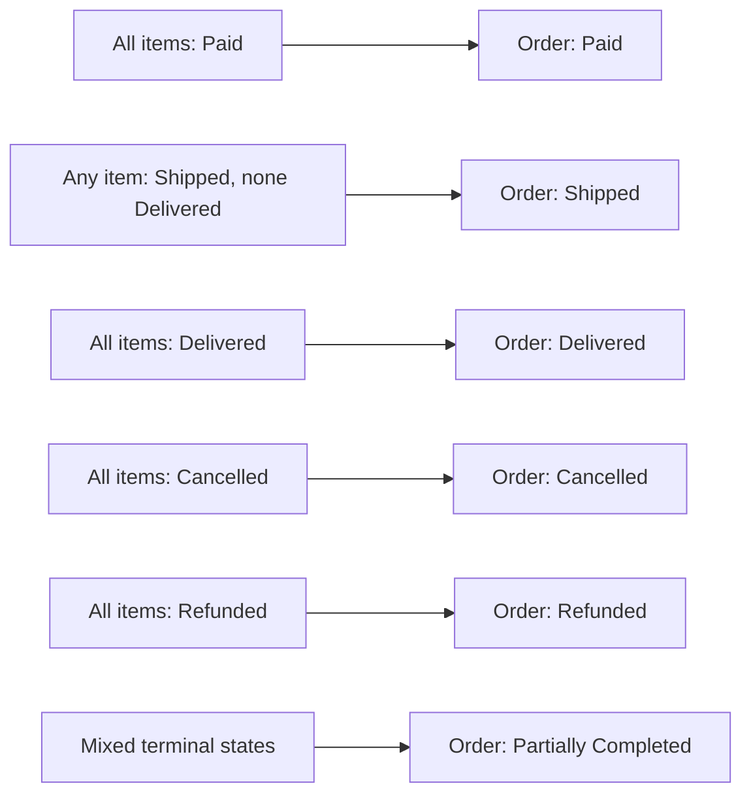

The overall order status is a read-only, computed view and cannot be set manually.

### Seller Approval Status Transitions

A seller's ability to operate on the platform is governed by their approval status. This status starts when a seller submits a registration request and progresses through administrator review.

The valid transitions for seller approval status are:

- A seller begins with a **pending** approval status upon first registration.
- From **pending**, an administrator can move the status to **approved** (the seller can now list products and sell) or **rejected** (the seller cannot sell).
- From **rejected**, the seller may submit a new registration request, which creates a fresh **pending** approval record. This resets the workflow for administrator review.
- An **approved** seller does not go back through the approval workflow unless suspended or banned by an administrator (see Account Status Transitions).

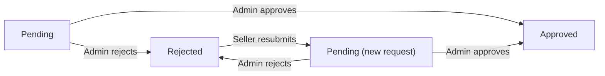

Each resubmission creates a new seller approval record; prior approval records are preserved for audit purposes.

### Cancellation and Refund Request Workflow

Cancellation requests and refund requests each follow a symmetric three-state lifecycle: pending, approved, or rejected. The workflow describes how each request moves from submission to resolution.

**Cancellation Request Flow:**
- A customer submits a cancellation request for a **paid** order item, placing the request in **pending** status.
- The seller who owns that item reviews the request and either approves or rejects it.
- When the seller responds (approve or reject), a snapshot of the request at that moment is created.
- If **approved**, the order item transitions to **cancelled** and stock is restored.
- If **rejected**, the order item remains in **paid** status and the customer's request is closed as rejected.
- An administrator may also force-cancel a paid item, bypassing the request workflow entirely.

**Refund Request Flow:**
- A customer submits a refund request for a **delivered** order item within 7 days of delivery, placing the request in **pending** status.
- The seller reviews the request and either approves or rejects it.
- When the seller responds, a snapshot of the request at that moment is created.
- If **approved**, the order item transitions to **refunded** and stock is restored.
- If **rejected**, the order item remains in **delivered** status and the request is closed as rejected.
- An administrator may also force-refund a delivered item, bypassing the request workflow.

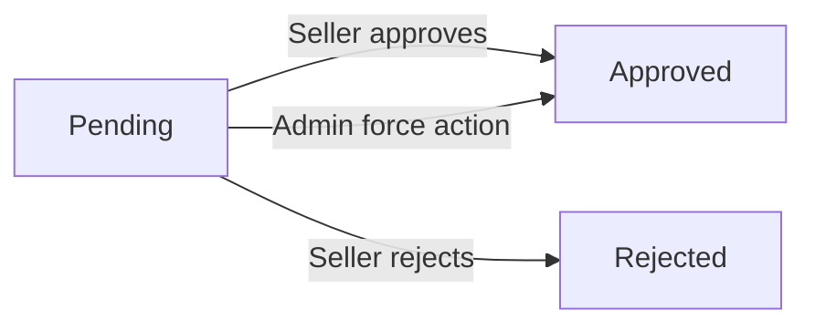

Neither a cancellation request nor a refund request can be reopened once it reaches an approved or rejected state.

### Admin Request Status Transitions

Any user (customer or seller) may apply to become an administrator by submitting an admin request. The request follows a simple pending-to-decision workflow reviewed exclusively by super administrators.

- Upon submission, the request enters **pending** status.
- A super administrator reviews the request and either approves or rejects it.
- If **approved**, the requesting user is granted the regular administrator grade and can begin performing administrative tasks.
- If **rejected**, the user's account remains unchanged (customer or seller) and the request is closed.
- A rejected user may submit a new admin request, creating a fresh pending record.

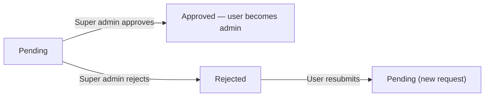

Approval history records are preserved after a decision is made.

### Account and Seller Visibility Status Transitions

Customer and seller accounts have their own status dimensions that control access and visibility independent of order or approval workflows.

**Customer Account Status:**
- A customer account is **active** upon registration.
- An administrator can **ban** an active customer account, preventing further login.
- An administrator can **unban** a banned customer account, restoring login access.
- A customer can **delete** their own account. Profile information is removed, but orders and reviews are preserved (deletion is permanent and irreversible from the customer's perspective).

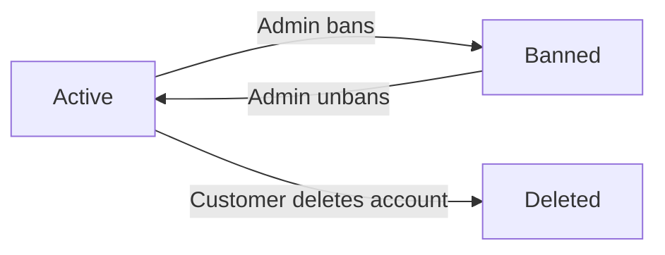

**Seller Account and Product Visibility:**
- An approved seller account is **active** and their products are visible.
- An administrator can **suspend** an active seller. Suspended sellers' products are hidden from search and listings; the seller cannot create new products or edit existing ones, but can still process existing orders.
- An administrator can **unsuspend** a seller, restoring product visibility and full seller capabilities.
- An administrator can **ban** a seller, preventing login. Existing orders remain intact.
- A seller can **delete** their own account if they have no pending orders or unresolved cancellation/refund requests. Upon deletion, their products are removed from listings, but order history is preserved.

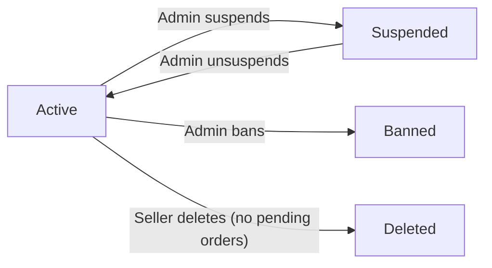

**Product Visibility Status:**
- A product is **visible** when created by an active, approved seller.
- A product becomes **hidden** when its seller is suspended by an administrator.
- A product is marked **deleted** when the seller deletes it (provided no pending orders or requests exist for any of its variants), or when an administrator removes it for policy violations. Deleted products do not appear in search or category listings, but all associated snapshots are preserved.

### Review Lifecycle Transitions

Reviews have a simpler lifecycle compared to orders and requests, but still follow defined state transitions that govern their visibility and snapshot behavior.

- A review is created in an **active** state once a customer with a delivered order item submits it. Only one review per product per order is permitted.
- The customer may **edit** their review at any time. Each edit creates a review snapshot preserving the previous rating and text content before the change is applied.
- The customer may **delete** their review. The review transitions to a **deleted** state; it no longer appears on the product detail page and no longer contributes to the product's average rating.
- All review snapshots created during edits are preserved even after the review is deleted.
- A deleted review is shown as authored by "deleted user" if the customer's account has been removed.
- A review in the **deleted** state cannot be restored.

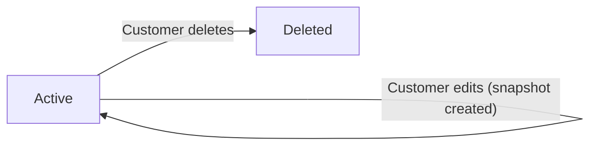