**shoppingMall — What operations users can perform, use cases, business workflows**

What operations users can perform, use cases, business workflows

# Core Business Operations

What the system must do for each business concept.

## Customer Operations

Customers register on the platform using their email address and a password, which is required to access any feature — no guest browsing is permitted. Upon successful registration, a customer account is created and the customer can immediately log in. Customers authenticate by providing their email and password, and the system verifies the credentials before granting access. Customers can change their password at any time while logged in. Customers can delete their own account, which permanently removes their profile information such as display name and phone number. However, account deletion does not erase order history or reviews, as these must be preserved for seller records and legal purposes. Reviews left by a deleted customer are shown as coming from a 'deleted user' rather than being removed. Customers can view and edit their profile details, including their display name and phone number. All platform features — browsing, purchasing, reviewing — require an active customer account in good standing.

### No Guest Browsing Policy

THE system SHALL require all users to have an active, authenticated customer account before accessing any platform feature, including product browsing, searching, and viewing product details.

WHEN an unauthenticated user attempts to access any platform feature, THE system SHALL redirect them to the registration or login page.

THE system SHALL not provide any browsing, searching, or purchasing capability to users who are not logged in.

### Customer Registration

THE system SHALL allow any visitor to register a new customer account by providing an email address and a password.

WHEN a visitor submits a registration request with a valid email and password, THE system SHALL create a new customer account and immediately allow the customer to log in.

IF the provided email address is already associated with an existing customer account, THEN THE system SHALL reject the registration request.

THE system SHALL associate the new account with the submitted email address as the unique identifier for that customer.

THE system SHALL record the submitted password in a protected form on the customer account.

Upon successful registration, THE system SHALL establish an authenticated session for the new customer so they can immediately use platform features without a separate login step.

### Customer Login

THE system SHALL allow registered customers to log in by providing their email address and password.

WHEN a customer submits valid login credentials, THE system SHALL verify the email and password combination and, upon success, establish an authenticated session granting access to all platform features.

IF the submitted email address does not match any registered customer account, THEN THE system SHALL reject the login attempt.

IF the submitted password does not match the password on record for the given email, THEN THE system SHALL reject the login attempt.

WHILE a customer account is in a banned state, THE system SHALL reject all login attempts for that account regardless of credential validity.

THE system SHALL not disclose whether a login failure was caused by an unrecognized email or an incorrect password.

### Changing Customer Password

WHILE a customer is logged in, THE system SHALL allow them to change their account password by submitting a new password.

WHEN a customer successfully submits a new password, THE system SHALL replace the previously stored password with the newly submitted one.

WHEN the password is changed, THE system SHALL require the customer to provide their current password to confirm the change.

IF the current password provided does not match the one on record, THEN THE system SHALL reject the password change request.

### Customer Profile Editing

WHILE a customer is logged in, THE system SHALL allow them to view their own profile, which includes their display name and phone number.

WHILE a customer is logged in, THE system SHALL allow them to update their display name.

WHILE a customer is logged in, THE system SHALL allow them to update their phone number.

WHEN a customer submits updated profile information, THE system SHALL immediately apply the changes to their customer profile.

THE system SHALL allow customers to update their display name and phone number independently or together in a single update.

### Customer Account Deletion

WHILE a customer is logged in, THE system SHALL allow them to delete their own account.

WHEN a customer account is deleted, THE system SHALL permanently remove the customer's profile information, including their display name and phone number, from the platform.

WHEN a customer account is deleted, THE system SHALL also remove all shipping addresses associated with that account.

WHEN a customer account is deleted, THE system SHALL preserve all orders and order history associated with that account, as these records are required for seller records and legal purposes.

WHEN a customer account is deleted, THE system SHALL preserve all reviews written by that customer but SHALL update the attribution of those reviews so they are displayed as coming from a 'deleted user' rather than the customer's former display name.

WHEN a customer account is deleted, THE system SHALL remove all items from that customer's wishlist and shopping cart.

After account deletion, THE system SHALL prevent login using the deleted account's credentials.

## Seller Operations

Sellers register on the platform using their email address and a password, similar to customer registration. After registering, a seller account enters a pending state and must receive administrator approval before the seller can list products or sell. Sellers can log in with their email and password and view their current approval status, which can be pending, approved, or rejected. If a seller's registration is rejected, they can view the rejection reason provided by the administrator and submit a new registration request. Once approved, sellers can manage their shop, create products, and fulfill orders. Sellers can change their password at any time. A seller can delete their account only when they have no pending orders (those with paid or shipped status) and no pending cancellation or refund requests, ensuring no open obligations remain. Upon account deletion, the seller's product listings are removed, but order history, order snapshots, and the shop name preserved in past orders remain intact for record-keeping purposes.

### Seller Registration

THE system SHALL allow any guest to submit a seller registration request by providing an email address and a password.

THE system SHALL require that the email address provided during seller registration is unique across all seller accounts.

WHEN a seller submits a registration request, THE system SHALL create a seller account with an initial approval status of "pending" and prevent the seller from listing or selling products until approval is granted.

WHEN a seller registration is submitted, THE system SHALL also require the seller to provide their shop name as part of the initial profile.

IF a seller attempts to register with an email address already associated with an existing seller account, THEN THE system SHALL reject the registration request.

### Seller Login

THE system SHALL allow a seller to log in using their registered email address and password.

WHEN a seller provides valid credentials, THE system SHALL grant access to the seller account regardless of the current approval status (pending, approved, or rejected).

IF a seller provides an incorrect password or a non-existent email address during login, THEN THE system SHALL deny access.

IF a seller account has been banned by an administrator, THEN THE system SHALL deny login to that seller.

### Administrator Approval Before Selling

WHILE a seller's approval status is "pending", THE system SHALL prevent that seller from creating products, editing products, or conducting any selling activities.

WHEN an administrator approves a seller's registration, THE system SHALL update the seller's approval status to "approved" and grant full selling privileges.

WHEN an administrator rejects a seller's registration, THE system SHALL update the seller's approval status to "rejected" and record the rejection reason provided by the administrator.

WHILE a seller's approval status is "approved", THE system SHALL allow the seller to create and manage product listings, process orders, and manage their shop profile.

### Seller Approval Status Visibility

THE system SHALL allow a seller to view their current approval status at any time after logging in.

THE system SHALL display one of the following statuses to the seller: pending, approved, or rejected.

WHILE a seller's status is "pending", THE system SHALL inform the seller that their account is awaiting administrator review.

WHEN a seller's status changes from "pending" to "approved" or "rejected", THE system SHALL make the updated status immediately visible to the seller upon their next login or status check.

### Rejection Reason Visibility

WHEN a seller's registration has been rejected, THE system SHALL display the rejection reason provided by the administrator to that seller.

THE system SHALL ensure that the rejection reason is accessible to the seller as long as the rejected registration record exists.

IF a seller views their approval status and the status is "rejected", THEN THE system SHALL present the rejection reason alongside the status.

### Resubmitting Seller Registration After Rejection

WHEN a seller's registration status is "rejected", THE system SHALL allow that seller to submit a new seller registration request.

WHEN a rejected seller submits a new registration request, THE system SHALL reset the approval status to "pending" and allow the seller to update their shop information as part of the new submission.

WHILE a seller's approval status is "pending", THE system SHALL prevent that seller from submitting another registration request.

IF a seller whose status is "approved" attempts to resubmit a registration, THEN THE system SHALL reject the resubmission request.

### Changing Seller Password

THE system SHALL allow an approved, pending, or rejected seller to change their password at any time while logged in.

THE system SHALL require the seller to provide their current password before setting a new password.

IF the current password provided does not match the seller's actual password, THEN THE system SHALL reject the password change request.

### Seller Account Deletion Conditions

THE system SHALL allow a seller to request deletion of their own account only when all of the following conditions are met: the seller has no order items in "paid" or "shipped" status for any of their products, and the seller has no pending cancellation or refund requests.

IF a seller attempts to delete their account while any of their order items have a status of "paid" or "shipped", THEN THE system SHALL reject the account deletion request.

IF a seller attempts to delete their account while any cancellation or refund request for their order items is in "pending" status, THEN THE system SHALL reject the account deletion request.

WHEN all conditions for deletion are satisfied and the seller confirms account deletion, THE system SHALL proceed with removing the seller account.

### Product Listings Removed on Seller Deletion

WHEN a seller account is deleted, THE system SHALL remove all of that seller's active product listings from search results and category listings.

WHEN a seller account is deleted, THE system SHALL also delete all product variants and inventory records associated with the seller's products.

WHEN a seller account is deleted, THE system SHALL remove the seller's shop profile information, including the shop name, description, and logo image.

WHEN a seller account is deleted, THE system SHALL remove any products that the seller owned from customer wishlists.

### Order History and Snapshots Preserved After Seller Deletion

WHEN a seller account is deleted, THE system SHALL preserve all historical order records and order item records associated with that seller's products.

WHEN a seller account is deleted, THE system SHALL preserve all order item snapshots that captured the seller's product and variant details at the time of purchase.

WHEN a seller account is deleted, THE system SHALL preserve all seller profile snapshots that were saved alongside order items, ensuring that the shop name and logo displayed in past orders remain intact.

WHEN a seller account is deleted, THE system SHALL preserve all product snapshots created during the lifetime of the seller's products, including snapshots taken before deletion.

THE system SHALL ensure that past orders continue to display the seller's shop name as it was recorded at the time of purchase, even after the seller account is deleted.

## Admin Operations

Administrators are users who have been promoted from customer or seller accounts via the admin request process. There are two grades of administrators: regular administrators and super administrators. Regular administrators can manage sellers, categories, products, and orders. Super administrators have all regular administrator capabilities plus the ability to approve admin requests, promote regular administrators to super administrator, and demote other super administrators to regular administrator — but a super administrator cannot demote themselves. Administrators can approve or reject seller registrations and must provide a rejection reason when rejecting. Administrators can suspend seller accounts, which hides the seller's products from listings and prevents new purchases, while still allowing the seller to process existing orders. Administrators can unsuspend sellers, restoring their product visibility. Administrators can ban customers or sellers to prevent login, and can unban them. Administrators can view all orders, all products, and all user accounts on the platform. Administrators can force-cancel or force-refund individual order items or entire orders.

### Administrator Grades

THE system SHALL recognize two administrator grades: regular administrator and super administrator.

THE system SHALL grant regular administrators the ability to manage sellers (approve, reject, suspend, unsuspend), manage categories, view all products and product snapshots, delete any product, view all orders, force-cancel order items or entire orders, force-refund order items or entire orders, ban and unban customers, and ban and unban sellers.

THE system SHALL grant super administrators all capabilities of regular administrators, plus the ability to view and action pending admin requests, promote regular administrators to super administrator, and demote other super administrators to regular administrator.

WHEN a user is promoted to administrator via an approved admin request, THE system SHALL assign them the regular administrator grade by default.

THE system SHALL display each administrator's current grade (regular or super) within the administrator management interface.

### Super Administrator Promotion and Demotion

WHEN a super administrator promotes a regular administrator, THE system SHALL change the target administrator's grade from regular to super administrator.

WHEN a super administrator demotes another super administrator, THE system SHALL change the target administrator's grade from super to regular administrator.

IF a super administrator attempts to demote themselves, THEN THE system SHALL reject the request and preserve the super administrator's existing grade.

THE system SHALL restrict all promotion and demotion actions to super administrators only; regular administrators cannot change any administrator's grade.

IF a regular administrator attempts to promote or demote any administrator, THEN THE system SHALL reject the request.

### Seller Approval and Rejection

THE system SHALL provide administrators with a list of all pending seller approval requests, showing the seller's registration details and submission date.

WHEN an administrator approves a seller registration, THE system SHALL change the seller's approval status to approved and allow that seller to begin listing products and conducting sales.

WHEN an administrator rejects a seller registration, THE system SHALL require the administrator to provide a rejection reason before the rejection is confirmed.

IF an administrator attempts to submit a seller rejection without providing a rejection reason, THEN THE system SHALL reject the submission and prompt the administrator to supply a reason.

WHEN a seller registration is rejected, THE system SHALL record the rejection reason and make it visible to the rejected seller when they view their approval status.

THE system SHALL allow a rejected seller to submit a new registration request, which creates a new approval record with pending status for administrator review.

THE system SHALL ensure that only one active approval request (pending) exists per seller at any time.

### Seller Account Suspension and Unsuspension

WHEN an administrator suspends a seller account, THE system SHALL immediately hide all of that seller's products from search results and category listings so that customers cannot discover or purchase them.

WHILE a seller account is suspended, THE system SHALL prevent customers from adding the suspended seller's products to their cart or placing new orders for those products.

WHILE a seller account is suspended, THE system SHALL still allow the suspended seller to process their existing orders, including creating shipments, and responding to pending cancellation and refund requests.

WHILE a seller account is suspended, THE system SHALL prevent the suspended seller from creating new products or editing existing products.

WHEN an administrator unsuspends a seller account, THE system SHALL restore the visibility of all of that seller's non-deleted products in search results and category listings, making them available for purchase again.

THE system SHALL record the suspension and unsuspension actions, including which administrator performed the action and when.

### Customer and Seller Banning and Unbanning

WHEN an administrator bans a customer, THE system SHALL immediately prevent that customer from logging into the platform.

IF a banned customer attempts to log in, THEN THE system SHALL reject the login attempt.

WHEN an administrator bans a seller, THE system SHALL immediately prevent that seller from logging into the platform.

IF a banned seller attempts to log in, THEN THE system SHALL reject the login attempt.

WHEN an administrator bans a seller, THE system SHALL preserve all existing orders associated with that seller so that order history and customer records remain intact.

WHEN an administrator unbans a customer, THE system SHALL restore the customer's ability to log in and use the platform normally.

WHEN an administrator unbans a seller, THE system SHALL restore the seller's ability to log in and access their account.

THE system SHALL provide administrators with the ability to view the current ban status of any customer or seller account.

### Platform-Wide Order and Product Oversight

THE system SHALL allow administrators to view all orders placed on the platform, regardless of which customer placed the order or which seller's products are included.

THE system SHALL allow administrators to view the full details of any order, including all order items, their statuses, shipment information, and the shipping address snapshot.

THE system SHALL allow administrators to view all products on the platform, including products from all sellers, deleted products, and products belonging to suspended sellers.

THE system SHALL allow administrators to view all product snapshots for any product on the platform.

THE system SHALL allow administrators to delete any product on the platform, including products from sellers other than the administrator's own account, for the purpose of policy enforcement.

WHEN an administrator deletes a product, THE system SHALL apply the same product deletion behavior as when a seller deletes their own product, including removal from listings and deletion of all associated variants and inventory records, subject to the same restrictions on pending order items.

### Force-Cancel and Force-Refund by Administrator

WHEN an administrator force-cancels an individual order item, THE system SHALL cancel that order item, process a refund for the customer for that item, and restore the stock quantity via an inventory record, regardless of whether the seller has approved a cancellation request.

WHEN an administrator force-cancels an entire order, THE system SHALL apply force-cancellation to all eligible order items within that order, processing refunds and restoring stock for each item.

WHEN an administrator force-refunds an individual order item, THE system SHALL mark that order item as refunded, process a refund for the customer for that item, and restore the stock quantity via an inventory record.

WHEN an administrator force-refunds an entire order, THE system SHALL apply force-refund to all eligible order items within that order.

THE system SHALL bypass the normal seller approval workflow when an administrator performs a force-cancel or force-refund action.

THE system SHALL record administrator force-cancel and force-refund actions, including which administrator performed the action and when, for audit and dispute resolution purposes.

## AdminRequest Operations

Any existing user — whether a customer or a seller — can submit a request to become an administrator. The request must include a reason explaining why the user wants to become an administrator. Once submitted, the request enters a pending state and awaits review by a super administrator. Super administrators can view the list of all pending admin requests and review the reasons provided. A super administrator can approve or reject each request. When a request is approved, the requesting user is granted regular administrator status. When a request is rejected, the user remains in their current role. Admin requests are immutable records once submitted and their status transitions (pending → approved or rejected) are tracked. A user can only have one active pending request at a time.

### Submitting an Admin Request

Any registered user — whether a customer or a seller — may submit a request to become an administrator.

THE system SHALL allow any authenticated customer or seller to submit a single admin request.

WHEN a user submits an admin request, THE system SHALL require a reason text explaining why the user wants to become an administrator.

WHEN an admin request is successfully submitted, THE system SHALL assign it a status of "pending" and record the submission timestamp.

WHEN a user submits an admin request, THE system SHALL associate the request with the submitting user so that reviewers can identify the requester.

WHILE a user has an existing pending admin request, THE system SHALL prevent that user from submitting another admin request.

### Reviewing and Deciding on Admin Requests

Super administrators are the exclusive reviewers of admin requests. Regular administrators do not have access to this workflow.

THE system SHALL allow super administrators to view the list of all pending admin requests.

WHEN a super administrator views the pending admin request list, THE system SHALL display the requester's identity and the reason text provided at submission.

THE system SHALL allow a super administrator to approve or reject any pending admin request.

WHEN a super administrator approves an admin request, THE system SHALL change the request status from "pending" to "approved" and grant the requesting user regular administrator status.

WHEN a super administrator rejects an admin request, THE system SHALL change the request status from "pending" to "rejected" and leave the requesting user's role unchanged.

WHEN an admin request status changes from "pending" to either "approved" or "rejected", THE system SHALL record the transition so that the history of the request is preserved.

ADMIN request records are immutable once submitted; only the status field transitions as the request moves through the review workflow.

## SellerApproval Operations

When a seller registers on the platform, a seller approval record is automatically created with a status of pending. This approval record tracks whether the seller has been cleared to operate on the platform. Administrators can view the list of all pending seller approvals and take action on each one. An administrator can approve a seller's registration, changing the approval status to approved and allowing the seller to start listing products and selling. An administrator can also reject a seller's registration, in which case the administrator must provide a written rejection reason. Rejected sellers can view this rejection reason on their account. Rejected sellers can submit a new registration request, which creates a new seller approval record in the pending state. The history of approval decisions is preserved for each seller for accountability purposes.

### Seller Approval Record Creation on Registration

When a seller completes the registration process, the platform automatically creates a seller approval record associated with that seller's account. This record is created with a status of pending, indicating that the seller's request to operate on the platform is awaiting review by an administrator.

Until the approval record transitions out of the pending state, the seller cannot perform selling operations such as listing products or accepting orders. The seller can view their own approval status at any time, so they know whether they are pending review, have been approved, or have been rejected.

The approval record captures the submission timestamp so the reviewing administrator can see when the request was made. Each registration attempt results in a new approval record, and the history of all approval records is preserved for accountability purposes.

### Administrator Review of Seller Registrations

Administrators can view the list of all seller approval records that are in the pending state. From this list, an administrator can open an individual approval record and take one of two actions: approve or reject the seller's registration.

When an administrator approves a seller's registration, the approval record status changes to approved and the seller becomes eligible to list products, manage inventory, and receive orders. The administrator who reviewed the request and the time of the decision are recorded on the approval record.

When an administrator rejects a seller's registration, the administrator must provide a written rejection reason explaining why the registration was denied. The approval record status changes to rejected, and the rejection reason is stored on the record. The seller can view this rejection reason from their account so they understand why their registration was not accepted and can address the issue before resubmitting. An administrator cannot reject a seller registration without supplying a rejection reason.

### Rejected Seller Resubmission

A seller whose registration has been rejected may submit a new registration request. When a rejected seller submits a new request, a new seller approval record is created in the pending state, following the same process as the initial registration.

A seller whose registration is still pending cannot submit a new registration request; they must wait for a decision on their current pending record before being eligible to resubmit. A seller whose registration has already been approved does not need to submit another request and cannot do so.

The new registration request is treated independently by administrators, who can again approve or reject it. The seller can repeat this process as many times as needed until they are approved.

### Approval History Preservation

The platform preserves the complete history of seller approval records for each seller account. This means all past approval decisions — including approvals, rejections, and their associated timestamps and rejection reasons — remain accessible and are never deleted.

This history is available to administrators for accountability and dispute resolution purposes. Sellers can view the status of their current approval record. The preserved history ensures that a record exists of every registration attempt and every administrative decision made in response to those attempts, even after the seller account is eventually approved or after subsequent resubmissions have occurred.

## CustomerAddress Operations

Customers can save multiple shipping addresses to their account for use during checkout. Each address stores the recipient's name, phone number, street address, city, state or province, postal code, and country. Customers can add new addresses at any time, edit existing addresses, and delete addresses they no longer need. Among all saved addresses, customers can designate exactly one address as their default shipping address, which is pre-selected during checkout. Customers can view the full list of their saved addresses. When a customer proceeds to checkout, they must select a shipping address from their saved list or use the pre-selected default. Once an order is placed, the shipping address associated with that order cannot be changed.

### Managing Multiple Shipping Addresses

Customers can save multiple shipping addresses to their account at any time. Each saved address stores the following information: the recipient's full name, the recipient's phone number, the street address, the city, the state or province, the postal code, and the country.

Customers can add a new shipping address by providing all of the above fields. The new address is saved to the customer's address list and becomes available for selection during checkout.

Customers can view the complete list of all their saved shipping addresses at any time. The list displays all address details for each saved entry, along with an indication of which address (if any) is currently designated as the default.

### Editing an Existing Shipping Address

Customers can edit any of their saved shipping addresses. Any combination of address fields may be updated: recipient name, phone number, street address, city, state or province, postal code, or country.

When an address is edited, the changes apply immediately to the customer's saved address list and will be reflected when the customer next selects that address during checkout.

Editing an address does not affect any orders that have already been placed. The shipping address recorded on a completed order remains unchanged regardless of subsequent edits to the saved address.

### Deleting a Shipping Address

Customers can delete any of their saved shipping addresses that they no longer need. Once deleted, the address is removed from the customer's saved address list and is no longer available for selection during checkout.

Deleting an address does not affect any previously placed orders. Orders that were placed using the deleted address continue to retain the address details that were captured at the time of order placement.

If the deleted address was the customer's designated default shipping address, no other address automatically becomes the default. The customer must manually designate a new default if they wish to have one.

### Setting the Default Shipping Address

Customers can designate exactly one of their saved shipping addresses as their default shipping address. A customer can change which address is the default at any time by selecting a different saved address as the new default.

Only one address can be the default at a time. When a new address is set as the default, the previous default is no longer designated as default.

Customers are not required to have a default address. A customer may choose not to designate any address as the default.

### Shipping Address Selection During Checkout

When a customer proceeds to checkout, they must select a shipping address for their order. If the customer has a designated default shipping address, that address is pre-selected automatically at the start of checkout.

Customers can change the pre-selected address to any other address in their saved list before placing the order. Customers can also select a non-default address as the shipping address for that order without changing their stored default setting.

Once the customer confirms and places the order, the selected shipping address is captured and locked with the order record. The locked address cannot be changed after the order is placed, regardless of any subsequent edits or deletions made to the customer's saved addresses.

## Category Operations

Categories provide the organizational structure for products on the platform. Each category has a name and a description. Categories can have subcategories, but only one level of nesting is supported — a subcategory cannot itself have subcategories. Only administrators can create, edit, or delete categories and subcategories. Customers can browse the full list of available categories and view all products within a specific category. Administrators can edit the name and description of any category. When a category is deleted, products that were assigned to that category become uncategorized rather than being deleted. Categories drive product discovery and must be kept organized to help customers find relevant products.

### Category Creation by Administrators

Only administrators (both regular and super administrators) can create categories and subcategories on the platform. Customers and sellers have no ability to create categories.

When creating a category, the administrator provides a name and an optional description. The name is required; a category without a name cannot be created.

Administrators can create a top-level category or a subcategory. To create a subcategory, the administrator selects an existing top-level category as its parent. Only one level of nesting is supported — a subcategory cannot itself serve as a parent for another subcategory.

Once created, a category becomes immediately available for sellers to assign to their products and for customers to browse.

### Category Name and Description

Each category has two descriptive fields: a name and a description.

The name uniquely identifies the category and is displayed throughout the platform — in category listings, product pages, and search filters. The name is required for both top-level categories and subcategories.

The description provides additional context about what kinds of products belong in the category. The description is optional and is displayed when customers browse category listings.

Both the name and description can be edited by administrators at any time after creation.

### Subcategory Support (One Level Deep)

The platform supports a single level of category nesting. A top-level category can have one or more subcategories beneath it, but a subcategory cannot have its own subcategories.

When an administrator creates a subcategory, they assign it to an existing top-level category as its parent. The subcategory inherits the organizational context of its parent but is listed and managed independently.

Products can be assigned to either a top-level category or a subcategory. When customers browse categories, they can see both top-level categories and their subcategories, allowing them to navigate to more specific product groupings.

Administrators can create, edit, and delete subcategories using the same operations available for top-level categories.

### Editing Category Name and Description

Administrators can edit the name and description of any category or subcategory at any time.

When editing, the administrator can update the name, the description, or both. The name must remain non-empty after editing.

Edits to a category take effect immediately. Products already assigned to the category continue to belong to it under the updated name and description. No historical snapshot of category changes is required — category edits are applied in place.

Customers browsing the platform will see the updated category name and description immediately after the edit is saved.

### Deleting a Category and Uncategorizing Products

Administrators can delete any category or subcategory from the platform.

When a top-level category that contains subcategories is deleted, the subcategories are also deleted as part of the operation.

When a category or subcategory is deleted, products that were assigned to that category are not deleted. Instead, those products become uncategorized — they lose their category assignment but remain active on the platform.

Uncategorized products are no longer discoverable through category browsing or category-based filtering. They may still appear in keyword search results. Sellers can reassign an uncategorized product to a different category by editing the product.

The deletion of a category does not affect order history, order item snapshots, or any other records that may have referenced the category at the time of purchase.

### Customers Browsing All Categories

Customers can view the full list of available categories on the platform without any restrictions. This operation is available to all authenticated customers.

The category listing displays all active top-level categories along with their subcategories, organized hierarchically. Each category entry shows its name and description.

Customers can use the category listing as a starting point for product discovery, selecting a category or subcategory to view the products it contains.

Deleted categories do not appear in the listing. Subcategories belonging to deleted parent categories are also not shown.

### Customers Viewing Products Within a Category

Customers can select any category or subcategory from the category listing to view all products assigned to it.

The product listing for a category displays all active, non-deleted products assigned to that category. For each product in the listing, the following information is shown: main image (thumbnail), product name, base price or price range (if variants have different prices), seller shop name, and average rating (if reviews exist).

Products belonging to suspended sellers are hidden from the category listing and are not purchasable.

Products that have been deleted by their seller or by an administrator do not appear in the category listing.

The product listing within a category is paginated to support large numbers of products. Customers can apply sorting and filtering options to narrow down results within the category.

## Product Operations

Sellers can create products on the platform, and each product must have a name, description, category, and base price — all of which are required. Products belong to the seller who created them, and only that seller can edit or delete their own products. Editing a product creates a snapshot to preserve the previous state, ensuring a complete audit trail. A product must have at least one variant to be purchasable; products with no variants are visible in search but shown as unavailable. Sellers can delete a product only when there are no pending order items (paid or shipped status) and no pending cancellation or refund requests for any variant of that product. Deleting a product also removes all its variants and inventory records. Deleted products no longer appear in search results or category listings. Administrators can view all products on the platform and can delete any product for policy violations. Customers can view products in search results, category pages, and product detail pages. When a seller is suspended, their products are hidden from all listings.

### Product Creation

THE system SHALL allow an approved, active seller to create a new product by providing a name, a description, a category, and a base price.

THE system SHALL associate the newly created product with the seller who submitted the creation request, establishing that seller as the product owner.

WHEN a seller submits a product creation request, THE system SHALL require that the name, description, category, and base price are all present before accepting the product.

IF a seller submits a product creation request while their account is not yet approved or is suspended, THEN THE system SHALL reject the request.

WHEN a product is created, THE system SHALL set the product's visibility to active so that it appears in search results and category listings once at least one purchasable variant is available.

THE system SHALL allow a seller to select any active category or active subcategory as the category for their product.

### Product Editing and Snapshots

THE system SHALL allow a seller to edit the name, description, category, and base price of any product they own.

IF a seller attempts to edit a product owned by a different seller, THEN THE system SHALL reject the request.

WHEN a seller submits an edit to any product field, THE system SHALL create a product snapshot before applying the changes, capturing the previous state of all product fields including images and all current variant states.

THE system SHALL ensure that each product snapshot is immutable and cannot be modified or deleted after it is created.

THE system SHALL allow a seller to view all snapshots of their own products.

THE system SHALL allow an administrator to view snapshots of any product on the platform.

WHILE a seller account is suspended, THE system SHALL prevent that seller from editing any of their products.

### Product Purchasability and Variant Requirements

THE system SHALL treat a product as purchasable only when it has at least one active, in-stock variant.

WHEN a product has no variants, THE system SHALL display that product in search results and category listings with an "unavailable" status to indicate it cannot be purchased.

IF a customer attempts to add a product with no active variants to their cart, THEN THE system SHALL prevent the action.

THE system SHALL show the purchasable status of a product based on the availability of its variants, as defined in the ProductVariant Operations section.

### Product Deletion by Seller

THE system SHALL allow a seller to delete a product they own only when no order items for any variant of that product have a status of "paid" or "shipped".

IF a seller attempts to delete a product that has pending order items with "paid" or "shipped" status, THEN THE system SHALL reject the deletion request.

IF a seller attempts to delete a product that has any pending cancellation or refund requests for any of its variants, THEN THE system SHALL reject the deletion request.

WHEN a seller deletes a product, THE system SHALL mark all variants of that product as deleted and remove all associated inventory records from active tracking.

WHEN a product is deleted, THE system SHALL immediately remove that product from search results and from all category listings so that it is no longer discoverable by customers.

WHEN a product is deleted, THE system SHALL automatically remove that product from all customer wishlists.

THE system SHALL preserve all product snapshots even after the product is deleted, ensuring the complete audit trail remains accessible to the seller and to administrators.

WHILE a seller account is suspended, THE system SHALL prevent that seller from deleting any of their products.

### Administrator Product Deletion

THE system SHALL allow an administrator to view all products on the platform regardless of seller ownership or product status.

THE system SHALL allow an administrator to delete any product on the platform for policy violations, applying the same effects as a seller deletion: all variants are deleted, inventory records are removed from active tracking, the product is removed from all search results and category listings, and the product is removed from all customer wishlists.

WHEN an administrator deletes a product, THE system SHALL preserve all product snapshots so that the historical record remains intact for dispute resolution.

THE system SHALL allow an administrator to view snapshots of any product, including products that have been deleted.

### Suspended Seller Product Visibility

WHEN a seller account is suspended by an administrator, THE system SHALL immediately hide all products belonging to that seller from search results and category listings.

WHILE a seller is suspended, THE system SHALL prevent customers from purchasing any product belonging to that seller.

WHILE a seller is suspended, THE system SHALL allow that seller to continue processing existing orders, including shipping items and responding to cancellation and refund requests.

WHILE a seller is suspended, THE system SHALL prevent that seller from creating new products or editing existing products.

WHEN an administrator unsuspends a seller account, THE system SHALL restore the visibility of all products belonging to that seller in search results and category listings.

## ProductImage Operations

Sellers can upload multiple images for each of their products to give customers a visual understanding of the item. The order of images can be rearranged by the seller, and the first image in the sequence serves as the main thumbnail displayed in search results and category listings. Sellers can delete images from their products when they are no longer needed or accurate. Any changes to product images — including additions, deletions, or reordering — are included in the product snapshot created at the time of the change, ensuring the visual state of the product is fully preserved at every edit point. Customers see product images on the product detail page and the thumbnail on listing pages.

### Uploading Multiple Product Images

Sellers can upload multiple images for any product they own. Each image upload associates the image with the product and adds it to the product's ordered image sequence. When a product has no images yet, the first uploaded image automatically becomes the primary image. Sellers can upload additional images at any time after the product is created, and each new upload appends the image to the end of the existing sequence. The upload operation is only available to the seller who owns the product. Uploading an image to a product counts as a product edit and triggers the creation of a product snapshot capturing the full image sequence at that moment, along with all other product fields and variant states.

### Reordering Product Images

Sellers can change the display order of images associated with their product at any time. The seller specifies a new arrangement of the existing images, and the system updates the sequence accordingly. The image placed first in the sequence becomes the main thumbnail for the product, which is the image displayed in search results, category listings, and other list views. All other images appear in the seller-specified order on the product detail page. Reordering images is treated as a product edit, so a new product snapshot is created immediately after the order is updated, preserving the new image sequence along with all other product fields and variant states at that moment.

### Deleting Product Images

Sellers can remove any individual image from a product they own. Once deleted, the image is no longer part of the product's image sequence. If the deleted image was in the first position, the next image in the sequence automatically takes the first position and becomes the new main thumbnail. If the last remaining image is deleted, the product has no images and therefore no thumbnail. Deleting an image is treated as a product edit and triggers the creation of a product snapshot that records the updated image sequence along with all other product fields and variant states. Images already preserved in prior snapshots remain intact and are not affected by the deletion.

### Image Changes Included in Product Snapshots

Any change to a product's images — whether adding new images, removing existing ones, or reordering the sequence — constitutes a product edit and results in the creation of a new product snapshot. The snapshot captures the complete image sequence as it exists at the moment of the change, in addition to all other product fields (name, description, category, base price) and the current state of all product variants. This ensures that the visual state of the product is fully preserved at every point in time and can be referenced for dispute resolution or historical review. Sellers can view the snapshots of their own products to verify historical image states, and administrators can view snapshots of any product on the platform.

### Thumbnail Display in Search and Category Listings

When a product appears in search results or category listing pages, its main thumbnail — the image in the first position of its image sequence — is displayed alongside the product name, base price or price range, seller shop name, and average rating. If a product has no images, no thumbnail is displayed for that product in listings. The thumbnail image reflects the most current first-position image as configured by the seller.

### All Images Displayed on Product Detail Page

When a customer views a product's detail page, all images associated with the product are shown in the order defined by the seller. The image in the first position is presented as the primary or featured image. Customers can view each image in the sequence to get a full visual understanding of the product. The images shown on the detail page always reflect the seller's current image configuration.

## ProductVariant Operations

A product can have multiple variants, where each variant represents a specific combination of options such as color and size. Each variant requires a unique SKU code and a stock quantity that starts at zero. Variants may also specify option values (like color: Red, size: Large) and optionally override the product's base price with a variant-specific price. Sellers can add variants to their products, edit variant details including the SKU code, option values, and price, and delete variants under the right conditions. Editing a variant creates a snapshot of its previous state. A variant can only be deleted if there are no pending order items (paid or shipped status) and no pending cancellation or refund requests for that variant. A product must retain at least one variant to be purchasable; otherwise it is shown as unavailable. Customers see all available variants with their prices and stock status on the product detail page.

### Variant as a Specific Option Combination

A product variant represents one unique combination of selectable options for a product. For example, a clothing product may have variants defined by color and size, producing combinations such as "Red / Large" or "Blue / Small". Each combination is treated as a distinct, independently managed variant.

Variants allow a single product listing to offer multiple purchasable configurations without creating separate product entries. Each variant has its own stock quantity, pricing, and availability status, making it independently trackable throughout the order lifecycle.

The set of option types (e.g., color, size, material) and their corresponding values are defined by the seller when creating or editing variants. The system does not enforce a fixed list of option types; sellers may use any meaningful attribute names and values relevant to their products.

### Variant SKU Code and Pricing

Each variant must be assigned a SKU code (Stock Keeping Unit) that uniquely identifies it among all variants belonging to the same product. The SKU code is required and must be provided when a variant is created.

Sellers may optionally assign a variant-specific price that overrides the product's base price for that particular variant. When a variant-specific price is set, it is used instead of the base price when displaying the variant to customers, adding it to a cart, and recording it in an order. When no variant-specific price is set, the product's base price applies to that variant.

On product listing pages, if multiple variants have different prices, the price range (lowest to highest) is shown rather than a single base price, giving customers an accurate preview of what they will pay.

### Stock Quantity and Availability

Every variant has a stock quantity that begins at zero when the variant is first created. Stock is not set directly; instead, it is determined by the cumulative sum of all inventory records associated with the variant. Sellers must explicitly add inventory to make a variant available for purchase.

When a variant's current stock quantity reaches zero, the variant is displayed to customers as "out of stock." Out-of-stock variants remain visible on the product detail page so customers can see the full range of options, but they cannot be added to a cart.

Stock quantity is automatically decreased when an order is placed and automatically increased when a cancellation or refund for that variant is approved. Sellers may also manually add or subtract stock through inventory management operations (described in the InventoryRecord Operations section).

### Seller Adding Variants to a Product

Sellers can add one or more variants to any product they own. When adding a variant, the seller must provide:
- A unique SKU code for the variant (within the product)
- One or more option values describing the combination (e.g., color: Red, size: Large)
- Optionally, a price that overrides the product's base price

The newly created variant starts with a stock quantity of zero. The variant becomes available for purchase only once the seller adds inventory to it and its stock quantity is greater than zero.

A product may have any number of variants. Sellers can continue adding variants to a product at any time, even after the product has been published and is visible to customers.

### Seller Editing Variants and Snapshot Creation

Sellers can edit any variant belonging to their own products. Editable fields include the SKU code, option values, and the variant-specific price override.

Every time a variant is edited and saved, the system automatically creates a snapshot of the variant's state before the change was applied. This snapshot is recorded as part of the product snapshot created at that moment, capturing the complete state of the product and all its variants. The snapshot is immutable and preserved permanently for audit and dispute resolution purposes.

After editing, the updated values take effect immediately and are reflected on the product detail page. Customers who view the product after the edit will see the new variant details.

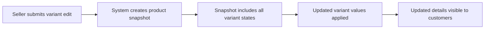

### Seller Deleting a Variant

Sellers can delete a variant from their product when the conditions for deletion are met. A variant can only be deleted if there are no order items with "paid" or "shipped" status referencing that variant, and there are no pending cancellation or refund requests associated with that variant.

When a variant is deleted:
- It is no longer shown on the product detail page or in search results.
- It can no longer be added to a customer's cart.
- Any existing cart entries referencing the deleted variant are marked as unavailable.
- Inventory records for the deleted variant are preserved for historical reference.
- Past order items that referenced the variant remain intact, with their snapshots preserving the variant's state at the time of purchase.

If the variant being deleted is the last remaining variant of the product, the product itself becomes unpurchasable and is displayed as "unavailable" to customers.

### Product Purchasability and the Minimum Variant Requirement

A product must have at least one active (non-deleted) variant to be considered purchasable. If a product has no variants — either because none have been added yet or all variants have been deleted — the product is displayed as "unavailable" on its detail page and in search results.

Customers can still view an unavailable product's name, description, images, and category, but cannot add it to a cart or proceed to checkout with it.

Sellers are responsible for ensuring their products have at least one active variant with sufficient stock before expecting customers to make purchases. The system does not prevent a product from being listed with zero variants, but it will clearly indicate to customers that the product cannot currently be purchased.

### Customer View of Variants on the Product Detail Page

When a customer views a product's detail page, all active (non-deleted) variants are displayed together in a structured list. For each variant, customers can see:
- The option values that define the variant (e.g., color: Blue, size: Medium)
- The variant's price (either the variant-specific price or the product's base price, as applicable)
- The variant's current stock status (available or out of stock)

Out-of-stock variants are shown but visually indicated as unavailable, allowing customers to see the full range of options even when some are temporarily unavailable.

Customers must select a specific variant before adding a product to their cart. Selecting a product without choosing a variant is not permitted at checkout. This ensures that every cart entry and order item is linked to a precise, trackable variant with its own SKU, pricing, and stock record.

## ProductSnapshot Operations

A product snapshot is automatically created every time a seller edits a product, capturing the complete state of the product at that moment. The snapshot includes all product fields such as name, description, category, base price, and images. Each product snapshot also includes snapshots of all the product's variants at that same moment, creating a full historical record of the product and its variants. Snapshots are immutable — they cannot be modified or deleted, even if the product itself is later deleted. Sellers can view snapshots of their own products to review the history of changes. Administrators can view snapshots of any product on the platform. Snapshots serve as the authoritative record for dispute resolution and accountability. When an order is placed, a snapshot is saved with each order item to preserve what the customer purchased.

### Automatic Snapshot Creation on Product Edit

WHEN a seller saves any edit to a product, THE system SHALL automatically create a new product snapshot capturing the complete state of the product at that moment.

THE system SHALL include the following fields in every product snapshot: product name, description, category, base price, and all associated images with their display order.

THE system SHALL include a snapshot of every variant belonging to the product at the time of the edit, capturing each variant's SKU code, option values, and price override within the same product snapshot.

WHEN a product snapshot is created, THE system SHALL record the timestamp at which the snapshot was taken.

THE system SHALL link each product snapshot to the product it was derived from, enabling a complete chronological history of all changes to that product.

WHEN a product has no variants at the time of an edit, THE system SHALL still create a product snapshot reflecting the product's current field values with an empty variant list.

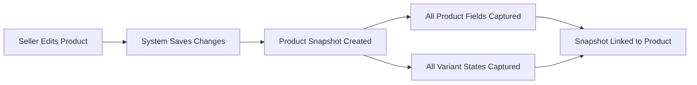

### Snapshot Immutability and Preservation

THE system SHALL treat every product snapshot as immutable once created — no party may modify or delete a product snapshot after it has been saved.

WHILE a product exists, THE system SHALL retain all of its historical snapshots in full, making the complete edit history available for review.

WHEN a seller deletes a product, THE system SHALL preserve all snapshots of that product and keep them accessible to authorized parties even though the product itself is no longer listed.

IF a product is deleted, THEN THE system SHALL NOT remove or alter any existing product snapshots associated with that product.

THE system SHALL ensure that snapshots created prior to a product deletion remain intact and retrievable for as long as they are required for order records and dispute resolution purposes.

### Seller Access to Product Snapshots

THE system SHALL allow a seller to view the list of all snapshots for any product they own.

WHEN a seller requests to view snapshots of their own product, THE system SHALL display the snapshots in reverse chronological order, with the most recent snapshot first.

THE system SHALL present each snapshot in the list with the timestamp of when the snapshot was taken, so the seller can identify the history of changes.

WHEN a seller selects a specific snapshot, THE system SHALL display the complete details of that snapshot, including all product fields and all variant states captured at that moment.

IF a seller attempts to view snapshots of a product that belongs to another seller, THEN THE system SHALL deny the request.

WHEN a seller's product has been deleted, THE system SHALL still allow that seller to view the historical snapshots of the deleted product.

### Administrator Access to Product Snapshots

THE system SHALL allow administrators to view the list of all snapshots for any product on the platform, regardless of which seller owns or owned the product.

WHEN an administrator requests snapshots for a product, THE system SHALL return the complete snapshot history for that product in reverse chronological order.

WHEN an administrator selects a specific snapshot, THE system SHALL display the full details of that snapshot including all captured product fields and all variant states.

THE system SHALL allow administrators to access snapshots of deleted products, enabling review of a product's full history even after it has been removed from the platform.

THE system SHALL allow administrators to use product snapshots as an authoritative reference when investigating seller behavior or resolving disputes between customers and sellers.

### Snapshots as the Authoritative Record for Dispute Resolution

THE system SHALL make product snapshots available to relevant parties — the owning seller and administrators — as the authoritative historical record for resolving disputes.

WHEN a dispute arises regarding a product's description, pricing, or options at a specific point in time, THE system SHALL enable authorized parties to retrieve the snapshot that was current at that moment.

THE system SHALL ensure that every snapshot contains sufficient detail — all product fields and all variant states — to reconstruct exactly what the product looked like at the time the snapshot was taken.

THE system SHALL prevent any retrospective alteration of snapshot data, ensuring that snapshots remain trustworthy as immutable historical records.

WHEN administrators access product snapshots for dispute resolution purposes, THE system SHALL surface the full chronological list so that the sequence of changes is clear.

### Snapshot Saved with Order Item at Purchase Time

WHEN a customer successfully places an order, THE system SHALL save a reference to the current product snapshot for each purchased variant at the moment of purchase, associating it with the corresponding order item.

THE system SHALL use the most recent product snapshot at the time of purchase as the authoritative record of what the customer received, preserving product name, description, category, base price, and images.

THE system SHALL also record the specific variant's state from within that product snapshot — including SKU code, option values, and price — as part of the order item record.

IF the product is later edited, deleted, or its variants are changed, THEN THE system SHALL NOT alter the snapshot that was saved with the order item, ensuring the purchase record remains accurate.

THE system SHALL make the snapshot saved with an order item accessible to the customer as part of their order details, so they can always review exactly what they purchased.

THE system SHALL make the order item snapshot accessible to the seller who fulfilled the item and to administrators, supporting post-purchase accountability and dispute resolution.

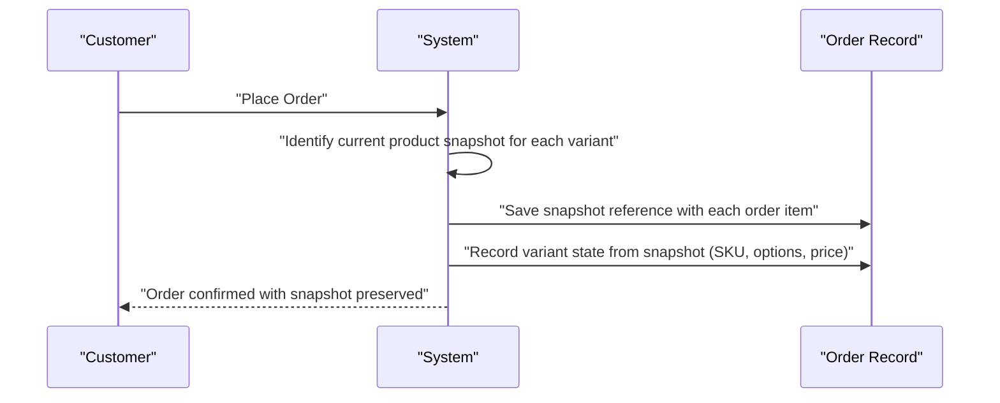

## ProductSnapshotSKU Operations

A product snapshot SKU is created as part of a product snapshot and captures the state of a single variant at the time the product snapshot was taken. It records the variant's SKU code, option values, and the price at that moment. Product snapshot SKUs are created automatically whenever a product snapshot is generated — they are not created independently. These records are immutable and cannot be modified or deleted. They ensure that for every product snapshot, the complete variant information is preserved, providing a comprehensive picture of what the product looked like at any given point in its history. Sellers and administrators can view product snapshot SKUs as part of viewing a product snapshot.

### Automatic Creation with Product Snapshot

A product snapshot SKU is created automatically every time a product snapshot is generated. Sellers and administrators do not create product snapshot SKUs independently — they are always produced as a direct consequence of a product snapshot being taken. When a product snapshot is created, the system captures the current state of every variant belonging to that product and produces one product snapshot SKU record per variant. If a product has three variants at the time a snapshot is taken, three product snapshot SKU records are created, each corresponding to one of those variants. Variants that have already been deleted before the snapshot is taken are not included in the new snapshot, but they remain preserved in all previously created snapshots where they existed.

### Variant State Captured at Snapshot Time

Each product snapshot SKU preserves the complete state of a single variant as it existed at the exact moment the parent product snapshot was created. The captured state includes the variant's SKU code, all option values (such as color and size), and the variant's price at that point in time. This ensures that for any product snapshot, the full picture of every variant — including its identifying code, the specific options it represented, and its price — is permanently recorded alongside the product-level information.

### SKU Code and Option Values Preserved

The product snapshot SKU records the variant's unique SKU code exactly as it was defined at the time the snapshot was taken. If the seller later modifies the SKU code on the live variant, previously created product snapshot SKUs retain the original SKU code and are not affected. Similarly, all option values associated with the variant — for example, the specific color name and size label — are recorded verbatim at the time of snapshot creation. Any subsequent changes to option values on the live variant do not alter historical product snapshot SKU records.

### Variant Price Preserved at Snapshot Time

The price captured in a product snapshot SKU reflects the variant's effective price at the exact moment the snapshot was created. If the variant has a price override set, that overridden price is recorded. If the variant relies on the product's base price, the base price at that moment is what is preserved. This guarantees that historical records — including order item snapshots that reference a product snapshot — can always show the precise price a customer would have seen for that variant at any point in the product's history.

### Immutability of Product Snapshot SKU Records

Product snapshot SKU records are immutable once created. No user — including sellers, administrators, or super administrators — can modify or delete a product snapshot SKU. The recorded SKU code, option values, and price remain fixed permanently. This immutability ensures that historical variant information can be relied upon for dispute resolution, order history accuracy, and audit purposes. Even if the parent product or its variants are subsequently deleted, all product snapshot SKU records remain intact and accessible as part of their parent product snapshot.

### Viewing Product Snapshot SKUs

Product snapshot SKUs are not viewed in isolation; they are always accessed as part of their parent product snapshot. When a seller views a snapshot of their own product, the snapshot display includes the list of all product snapshot SKU records that were captured at that time, showing the SKU code, option values, and price for each variant. When an administrator views any product snapshot on the platform, the same complete variant information is shown. Customers do not access product snapshot SKUs directly; however, the information preserved in these records is surfaced indirectly through order item snapshots, which reflect the product and variant state at the time of purchase.

## SellerProfileSnapshot Operations

A seller profile snapshot is automatically created every time a seller edits their shop profile, including changes to their shop name, shop description, or logo image. The snapshot records the previous state of the profile before the change was made. Additionally, when an order is placed, a snapshot of each relevant seller's profile is saved alongside each order item, preserving the shop name and logo image as they appeared at the time of purchase. This ensures that even if a seller later changes their shop name or deletes their account, the historical order records accurately reflect the seller's identity at the time of the transaction. Seller profile snapshots are immutable and cannot be deleted. Relevant parties, including administrators, can view these snapshots for dispute resolution purposes.

### Automatic Snapshot Creation on Profile Edit

WHEN a seller edits any field of their shop profile, THE system SHALL automatically create a new seller profile snapshot capturing the previous state of the profile before the change is applied.

THE system SHALL capture the following fields in every seller profile snapshot: shop name, shop description, and logo image.

WHEN a seller saves an update to their shop name, THE system SHALL record the old shop name in a new snapshot before replacing it with the new value.

WHEN a seller saves an update to their shop description, THE system SHALL record the old shop description in a new snapshot before replacing it with the new value.

WHEN a seller saves an update to their logo image, THE system SHALL record the previous logo image reference in a new snapshot before replacing it with the new image.

THE system SHALL record the timestamp of when each snapshot was created, enabling a complete chronological history of every profile change.

THE system SHALL maintain the full sequence of all seller profile snapshots so that any prior version of a seller's profile can be retrieved.

### Seller Profile Snapshot Saved at Order Placement

WHEN a customer successfully places an order, THE system SHALL save a seller profile snapshot alongside each order item, capturing the shop name and logo image of the relevant seller as they appear at the time of purchase.

THE system SHALL associate the saved seller profile snapshot directly with each order item so that the seller's identity at the time of purchase is permanently linked to that item.

THE system SHALL preserve the shop name recorded in the seller profile snapshot associated with each order item, ensuring that past orders always reflect the shop name as it was at the time of the transaction.

THE system SHALL preserve the logo image recorded in the seller profile snapshot associated with each order item, ensuring that past orders always reflect the seller's logo as it appeared at the time of purchase.

IF a seller later changes their shop name or logo after an order has been placed, THE system SHALL continue to display the original shop name and logo from the saved snapshot when showing historical order details for that order item.

IF a seller deletes their account after an order has been placed, THE system SHALL continue to display the shop name and logo from the saved snapshot when showing historical order details, so that order records remain accurate and attributable.

### Immutability and Preservation of Seller Profile Snapshots

THE system SHALL treat every seller profile snapshot as immutable once it has been created; no user, seller, or administrator may modify or delete a snapshot.

THE system SHALL preserve all seller profile snapshots indefinitely, regardless of subsequent changes to the seller's profile.

WHEN a seller deletes their account, THE system SHALL retain all seller profile snapshots that were previously created for that seller, ensuring that historical records linked to past orders remain intact.

THE system SHALL ensure that seller profile snapshots attached to order items continue to be accessible even after the associated seller account no longer exists.

THE system SHALL NOT allow any party to manually trigger the creation, modification, or deletion of a seller profile snapshot; snapshots are exclusively system-generated.

### Snapshot Access for Dispute Resolution

THE system SHALL make seller profile snapshots accessible to administrators so they can review the complete history of a seller's shop profile during dispute resolution.

WHEN an administrator reviews a dispute involving a past order, THE system SHALL allow the administrator to view the seller profile snapshot that was saved at the time the relevant order item was purchased.

THE system SHALL allow administrators to view the full chronological list of seller profile snapshots for any seller, including the timestamp and content of each snapshot.

THE system SHALL present the seller profile snapshot associated with each order item as part of the order item details, so that the seller's identity at the time of purchase is always verifiable.

IF there is a discrepancy between a seller's current profile and the details shown in a past order, THE system SHALL allow administrators to use the relevant seller profile snapshot to determine the accurate state of the profile at the time of the transaction.

## InventoryRecord Operations

Each product variant has its own stock quantity, which is managed through a log of inventory records rather than a single editable number. Each inventory record contains the quantity change (positive for restocking, negative for sales or adjustments), the reason for the change, and the timestamp. The current stock level of a variant is calculated by summing all inventory records for that variant. Sellers can add inventory by recording a positive quantity change with a reason, such as restocking new units. Sellers can subtract inventory by recording a negative quantity change with a reason, such as accounting for loss or adjustment. When an order is placed, a negative inventory record is automatically created for each purchased variant. When an order item is cancelled or refunded, a positive inventory record is automatically created to restore the stock. When the calculated stock reaches zero, the variant is shown as out of stock and cannot be added to the cart. Sellers can view the full inventory history for each of their variants.

### Inventory Ledger Model

Each product variant maintains its stock level through an append-only log of inventory records rather than a single editable number. Every change to a variant's stock — whether from restocking, sales, cancellations, refunds, or manual adjustments — is represented as a separate inventory record.

Each inventory record contains:
- The quantity change, expressed as a positive number for increases and a negative number for decreases
- A reason describing why the change occurred
- A timestamp recording when the change was made

The current stock level of a variant at any point in time is calculated by summing the quantity changes across all inventory records for that variant. This means the stock level is always derived from the complete history of changes, never stored as a standalone editable value.

Inventory records are append-only: once created, they cannot be edited or deleted. This ensures a complete and tamper-proof audit trail of all stock movements for each variant.

### Seller Manual Inventory Adjustments

Sellers can manually adjust the stock level of any variant belonging to their own products. Manual adjustments are recorded as inventory records in the variant's inventory history.

When restocking, a seller submits a positive quantity and a reason (such as receiving new units from a supplier). The system records a positive inventory record, which increases the variant's calculated stock level accordingly.

When subtracting inventory, a seller submits a negative quantity and a reason (such as accounting for damaged goods, loss, or operational adjustment). The system records a negative inventory record, which decreases the variant's calculated stock level accordingly.

Providing a reason is required for every manual adjustment. A reason without a quantity, or a quantity of zero, is not accepted. Sellers may only adjust inventory for variants that belong to their own products; they cannot adjust inventory for another seller's variants.

### Automatic Inventory Record Creation

The system automatically creates inventory records in response to certain order lifecycle events, without requiring any action from the seller or customer.

When an order is successfully placed, the system automatically creates a negative inventory record for each purchased variant, with the quantity equal to the number of units purchased. The reason is recorded as an order placement. This reduces the calculated stock level for each affected variant immediately upon order creation.

When an order item is cancelled and the cancellation is approved, the system automatically creates a positive inventory record for the corresponding variant, restoring the units that were reserved by that order item. The reason is recorded as an order cancellation.

When an order item is refunded and the refund is approved, the system automatically creates a positive inventory record for the corresponding variant, restoring the units that were part of that order item. The reason is recorded as an order refund.

These automatic records follow the same structure as manual records — quantity change, reason, and timestamp — and are equally immutable once created.

### Out of Stock Behavior

When the calculated stock level of a variant reaches zero — meaning the sum of all its inventory records equals zero or falls below zero — that variant is considered out of stock.

Out of stock variants are displayed with an out of stock indicator on the product detail page and in any listing where they appear. Customers browsing a product can see which variants are unavailable.

Customers cannot add an out of stock variant to their cart. If a customer attempts to do so, the request is rejected. This restriction applies at the moment of the add-to-cart action; if a variant becomes out of stock after it is already in a customer's cart, the cart reflects this by marking the item as unavailable (see CartItem Operations for cart unavailability behavior).

When stock is restored — through a manual restock, an approved cancellation, or an approved refund — and the calculated stock level rises above zero, the variant is no longer considered out of stock and becomes purchasable again.

### Seller Inventory History Viewing

Sellers can view the full inventory history for each variant belonging to their own products. The inventory history presents all inventory records for a given variant in chronological order, from the earliest to the most recent.

Each record in the history shows:
- The quantity change (positive or negative)
- The reason for the change
- The timestamp of the change

The history includes all record types — manual restocks, manual adjustments, automatic records from order placements, and automatic records from cancellations and refunds — presented together in a single unified log.

Sellers can use the inventory history to understand how stock levels have changed over time, verify that automatic records were created correctly for orders and returns, and resolve discrepancies. Sellers may only view inventory history for variants belonging to their own products; they cannot access the inventory history of another seller's variants.

## WishlistItem Operations

Customers can add products to their personal wishlist to save items they are interested in for future consideration. The wishlist tracks products as a whole, not specific variants. Customers can view their wishlist, which is paginated to handle large collections. Customers can remove any product from their wishlist at any time. If a seller deletes a product, it is automatically removed from all customers' wishlists, ensuring the wishlist only contains accessible products. Customers can use the wishlist as a way to track products they intend to purchase later.

### Adding a Product to the Wishlist

Customers can add any product to their personal wishlist to save it for future consideration. The wishlist tracks products as a whole — customers do not need to select a specific variant to add a product to their wishlist. A product can only appear once per customer's wishlist; adding a product that is already in the wishlist does not create a duplicate entry. Customers can add products to their wishlist from the product detail page or from product listing views. Only authenticated customers can add products to their wishlist; unauthenticated access is denied.

### Viewing the Wishlist

Customers can view their own wishlist at any time. The wishlist is paginated to accommodate large collections of saved products. Each entry in the wishlist displays the product information (as defined in the Product Listing section), including the main image, name, base price or price range, seller shop name, and average rating. Customers can only view their own wishlist; they cannot access another customer's wishlist.

### Removing a Product from the Wishlist

Customers can remove any product from their wishlist at any time. Removal is per product; once removed, the product no longer appears in the customer's wishlist. Customers can remove products individually. There is no batch removal operation described; each product is removed one at a time.

### Automatic Removal When a Product Is Deleted

When a seller deletes a product (or when an administrator deletes a product), the system automatically removes that product from all customers' wishlists. This ensures that the wishlist only ever contains products that are accessible on the platform. Customers are not required to take any action for this cleanup — it happens automatically as a result of product deletion. This behavior ensures the wishlist remains a reliable list of products the customer may wish to purchase in the future.

### Wishlist as a Future Purchase Tracker

The wishlist serves as a way for customers to keep track of products they are interested in but have not yet decided to purchase. Customers can use the wishlist to organize their shopping intent over time, returning to review saved products and adding them to the cart when ready. The wishlist does not reserve stock or affect inventory in any way; it is purely a personal reference list. Customers can move from the wishlist to the cart by selecting a specific variant of a wishlisted product and adding it to the cart through the normal cart flow.

## CartItem Operations

Customers can add product variants to their shopping cart by selecting a specific variant and specifying a quantity. If the same variant is already in the cart, the new quantity is combined with the existing quantity rather than creating a duplicate line item. Customers can view their cart, which shows each item with the product name, variant options, price, quantity, and subtotal, as well as the total price for all items. Customers can change the quantity of any item in their cart and can remove items entirely. If a variant's available stock is less than the quantity in the cart, a warning is displayed to the customer. If a variant is deleted by the seller or goes out of stock, the cart item is marked as unavailable. Unavailable cart items cannot be checked out and must be removed or resolved before proceeding. When an order is successfully placed, all purchased items are automatically removed from the cart.

### Adding a Variant to the Cart

Customers can add a product variant to their shopping cart. When adding to the cart, the customer must select a specific variant of the product — selecting only a product without a variant is not permitted. The customer also specifies the desired quantity at the time of adding.

If the selected variant does not already exist in the customer's cart, a new cart line item is created for that variant with the specified quantity.

If the same variant is already present in the customer's cart, the system combines quantities: the specified quantity is added to the existing quantity rather than creating a separate line item for the same variant.

Out-of-stock variants cannot be added to the cart. Variants that have been deleted by the seller also cannot be added to the cart.

### Viewing the Cart

Customers can view the full contents of their shopping cart at any time. The cart displays each line item with the following details: the product name, the selected variant's option values (such as color and size), the unit price for that variant, the quantity in the cart, and the subtotal for that line item (unit price multiplied by quantity).

The cart also displays the total price, which is the sum of all line item subtotals.

If a variant's available stock is less than the quantity currently in the cart, a stock warning is shown for that line item to alert the customer that they have more in the cart than is currently available.

If a variant has been deleted by the seller or is out of stock (stock quantity equals zero), the corresponding cart item is marked as unavailable and clearly distinguished from available items.

### Changing Item Quantity in the Cart

Customers can change the quantity of any item currently in their cart. The customer selects the cart item and specifies the new desired quantity.

After updating the quantity, the system recalculates the subtotal for that line item and updates the cart total accordingly.

If the new quantity exceeds the available stock for that variant, a stock warning is displayed for that line item, alerting the customer that the requested quantity may not be fully fulfilled.

### Removing an Item from the Cart

Customers can remove any item from their cart entirely. Once removed, the cart item is deleted and the cart total is recalculated without that item.

Customers can remove both available and unavailable cart items. Removing unavailable items allows the customer to clear items that can no longer be purchased.

### Unavailable Cart Items and Checkout Restriction

A cart item becomes unavailable when the associated variant has been deleted by the seller or when the variant's stock reaches zero (out of stock).

Unavailable cart items are visibly marked as unavailable in the cart view so the customer is aware before attempting checkout.

Unavailable cart items cannot be included in a checkout. If a customer attempts to proceed to checkout with unavailable items in their cart, the checkout is blocked for those items. The customer must remove or resolve unavailable items before those items can be checked out. Available items in the same cart are not blocked and can proceed to checkout independently.

### Cart Cleared After Order Placement

When a customer successfully places an order, all cart items that were part of that order are automatically removed from the customer's cart. This happens as part of the order creation process following successful payment.

Items that were in the cart but not included in the placed order (for example, items from a separate checkout session) remain in the cart.

If payment fails, the cart is not modified and all items remain so the customer can retry the checkout.

## Order Operations

An order is created when a customer successfully completes checkout and payment is confirmed by the external payment gateway. An order contains one or more order items, each representing a purchased product variant. The overall status of an order is derived from the statuses of its individual order items: if all items are paid, the order is paid; if all are delivered, the order is delivered; if all are cancelled, the order is cancelled; and mixed states result in a partially completed status. Customers can view a paginated list of all their orders, sorted by newest first, showing the order number, date, total price, and overall status. Customers can view the full details of any of their orders, including item details, shipping address, and shipment tracking information. Administrators can view all orders on the platform for oversight purposes. Orders cannot be created without a successful payment, and once placed, the shipping address cannot be changed.

### Order Creation on Successful Payment

WHEN a customer confirms their order and the external payment gateway reports a successful payment, THE system SHALL create a new order record containing all items the customer selected during checkout.

THE system SHALL assign a unique order number to each newly created order.

THE system SHALL record the total price of the order at the time of placement.

THE system SHALL save a snapshot of the selected shipping address with the order so that the address details are permanently preserved as they were at the moment of purchase.

WHEN an order is created, THE system SHALL record the date and time of placement.

WHEN payment fails or is declined by the external payment gateway, THE system SHALL NOT create an order record, and the customer's cart shall remain unchanged so they may retry.

THE system SHALL associate each created order with the customer who placed it.

WHEN an order is created, THE system SHALL remove the purchased items from the customer's cart.

WHEN an order is created, THE system SHALL decrease the stock quantity for each purchased variant by the quantity ordered, recording a negative inventory record for each.

### Order Structure and Contents

THE system SHALL allow an order to contain one or more order items, where each order item represents a specific product variant purchased at a specific quantity.

THE system SHALL record, for each order item, the quantity purchased and the price at the time of purchase.

THE system SHALL allow order items within a single order to belong to different sellers.

THE system SHALL assign each order item its own independent status, beginning with "paid" upon order creation.

THE system SHALL save an order item snapshot at the moment the order is created, capturing the product name, description, variant options, price, and the seller's shop name and logo as they existed at the time of purchase.

THE system SHALL preserve the order item snapshot even if the underlying product, variant, or seller account is subsequently deleted.

IF a customer purchases multiple units of the same variant in a single checkout, THE system SHALL represent them as one order item with the combined quantity rather than multiple separate order items.

WHEN an order is placed, THE system SHALL lock the shipping address so that it cannot be changed after the order is created.

### Overall Order Status Derivation

THE system SHALL derive the overall status of an order automatically from the statuses of all its order items.

WHEN all order items have the status "paid", THE system SHALL display the overall order status as "paid".

WHEN at least one order item has the status "shipped" and no items have yet reached "delivered", THE system SHALL display the overall order status as "shipped".

WHEN all order items have the status "delivered", THE system SHALL display the overall order status as "delivered".

WHEN all order items have the status "cancelled", THE system SHALL display the overall order status as "cancelled".

WHEN all order items have the status "refunded", THE system SHALL display the overall order status as "refunded".

WHEN order items have a mix of statuses (for example, some delivered and some refunded, or some cancelled and some shipped), THE system SHALL display the overall order status as "partially completed".

THE system SHALL update the derived order status automatically whenever any individual order item's status changes.

### Customer Order List

WHEN a logged-in customer requests their order history, THE system SHALL return a paginated list of all orders placed by that customer.

THE system SHALL sort the order list with the most recently placed orders appearing first.

THE system SHALL display, for each order in the list: the unique order number, the date the order was placed, the total price of the order, and the overall order status.

THE system SHALL allow customers to navigate between pages of their order list.

THE system SHALL only show a customer their own orders; orders placed by other customers shall not be accessible.

### Customer Order Detail View

WHEN a logged-in customer views the full details of one of their orders, THE system SHALL display the complete information for that order.

THE system SHALL show, within the order detail, the list of all order items including: product name, variant options, quantity purchased, price at time of purchase, and the current status of each item.

THE system SHALL show the shipping address as it was recorded at the time the order was placed.

THE system SHALL show all shipments associated with the order, including the carrier name, tracking number, and the list of order items included in each shipment.

THE system SHALL present the order item snapshot details (product name, variant, price) so the customer can see exactly what they purchased, even if the product has since been edited or deleted.

IF a customer attempts to view an order that does not belong to them, THE system SHALL deny access to that order's details.

### Administrator Order Oversight

WHEN an administrator accesses the order oversight section, THE system SHALL provide a view of all orders placed on the platform, regardless of which customer placed them or which sellers' products they contain.

THE system SHALL allow administrators to view the full details of any order, including all order items, shipment tracking information, and the shipping address snapshot.

THE system SHALL allow administrators to force-cancel individual order items or all items within an entire order, processing a refund for the customer and restoring stock quantities via inventory records.

THE system SHALL allow administrators to force-refund individual order items or all items within an entire order.

WHEN an administrator force-cancels or force-refunds items, THE system SHALL update the affected order item statuses accordingly and recalculate the overall order status.

## OrderItem Operations

Each order item represents a specific product variant purchased within an order, along with the quantity and the price at the time of purchase. Order items are created automatically when an order is placed. Each order item has its own individual status that progresses independently: starting at paid, then moving to shipped when the seller creates a shipment including that item, then to delivered when the customer confirms receipt or after 14 days. Customers can request cancellation of individual items that are in paid status, and can request refunds for individual items in delivered status. Sellers can view the order items for their products that require shipping action. Administrators can force-cancel or force-refund individual order items. A snapshot of the purchased product and variant is saved with each order item at the time of purchase. When a customer buys multiple units of the same variant, they appear as a single order item with the quantity reflecting the number of units.

### Order Item as a Purchased Variant Record

An order item is created automatically when an order is successfully placed and represents a specific product variant that was purchased within that order. Each order item captures the variant selected by the customer and the quantity of units purchased.

When a customer purchases multiple units of the same variant in a single order, the system consolidates them into one order item with a quantity reflecting the total number of units. Separate order items are not created for each unit. If a customer purchases different variants (even of the same product), each variant becomes its own distinct order item.

The price recorded on each order item is the price of the variant at the exact time of purchase. This price is immutable once the order is placed and does not change even if the seller later updates the variant's price. This ensures the customer and seller always have an accurate record of what was agreed upon at the time of the transaction.

A snapshot of the purchased product, its variant, and the seller's profile is saved alongside each order item at the moment of purchase. This snapshot preserves the product name, description, variant options, price, and seller shop name as they existed at purchase time. The details of this snapshot are described in the OrderItemSnapshot section.

### Individual Order Item Status and Progression

Each order item carries its own independent status that reflects the current stage of fulfillment for that specific item. Order items within the same order may have different statuses simultaneously, as each item progresses through the fulfillment lifecycle independently.

The status of an order item follows this progression:

- **Paid**: The initial status assigned immediately when the order is created after successful payment. This indicates the seller has been notified and the item is awaiting shipment.
- **Shipped**: The status assigned when the seller creates a shipment that includes this item and provides tracking information. All items included in the same shipment transition to this status at the same time.
- **Delivered**: The status assigned when the customer confirms receipt of the shipment containing this item, or automatically after 14 days from the date the item was shipped if the customer has not confirmed delivery.
- **Cancelled**: The status assigned when a cancellation request for this item has been approved by the seller, or when an administrator force-cancels the item.
- **Refunded**: The status assigned when a refund request for this item has been approved by the seller, or when an administrator force-refunds the item.

The overall status of the parent order is derived from the combined statuses of all its items, as described in the Order Operations section.

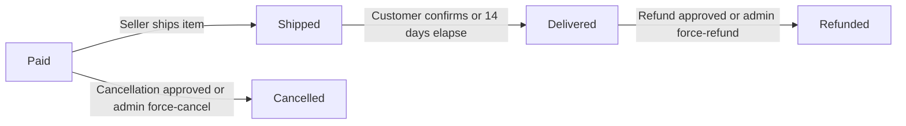

### Customer Requesting Cancellation of a Paid Item

Customers can request cancellation for individual order items that are currently in paid status. A cancellation request can only be submitted for items that have not yet been shipped. Customers must provide a reason when submitting the cancellation request.

Once a cancellation request is submitted, the seller of that item reviews and responds to it. The full details of the cancellation request lifecycle — including seller approval or rejection, snapshot creation on response, and stock restoration upon approval — are described in the CancellationRequest Operations section.

Customers cannot request cancellation for items that are in any status other than paid. If an item has already been shipped, delivered, cancelled, or refunded, the cancellation option is not available for that item.

### Customer Requesting a Refund for a Delivered Item

Customers can request a refund for individual order items that are currently in delivered status. A refund request can only be submitted within 7 days of the item's delivery date. Customers must provide a reason when submitting the refund request.

Once a refund request is submitted, the seller of that item reviews and responds to it. The full details of the refund request lifecycle — including seller approval or rejection, snapshot creation on response, and stock restoration upon approval — are described in the RefundRequest Operations section.

Customers cannot request a refund for items in any status other than delivered. Items that are in paid, shipped, cancelled, or refunded status are not eligible for refund requests. Additionally, refund requests submitted after the 7-day window from the delivery date are rejected.

### Seller Viewing Order Items Requiring Shipping Action

Sellers can view a list of all order items associated with their products that are currently in paid status and awaiting shipment. This view allows sellers to identify which items they need to act on by creating shipments.

Sellers can also view all order items associated with their products across all statuses, and can filter this list by item status to focus on items at a particular stage of fulfillment. For example, a seller can filter to see only paid items needing shipment, or only shipped items, or items with pending cancellation or refund requests.

Sellers can only view order items for their own products. They do not have visibility into order items belonging to other sellers, even if those items are part of the same order.

When a seller is ready to fulfill paid items, they proceed to create a shipment by selecting one or more of their paid items to include. The full shipment creation process is described in the Shipment Operations section.

### Administrator Force-Cancellation and Force-Refund of Order Items

Administrators can force-cancel or force-refund individual order items without requiring seller approval, overriding the normal seller-driven cancellation and refund workflows.

**Force-Cancellation**: An administrator can force-cancel an order item that is in paid status. This immediately changes the item status to cancelled, restores the stock quantity for the affected variant via an inventory record, and initiates a refund to the customer for that item. This action bypasses the need for the seller to approve a cancellation request.

**Force-Refund**: An administrator can force-refund an order item that is in delivered status. This immediately changes the item status to refunded, restores the stock quantity for the affected variant via an inventory record, and initiates a refund to the customer for that item. This action bypasses the 7-day refund window restriction and the need for seller approval.

Administrators can apply force-cancel or force-refund to all items within an entire order in a single action, or selectively to individual items. When a force action is applied, the remaining items in the order that were not affected continue to process normally.

These administrative actions are available for policy violation resolution or exceptional circumstances where the standard seller response process is not appropriate.

## OrderItemSnapshot Operations

An order item snapshot is automatically created when an order is placed, capturing the details of the purchased product and variant at that exact moment. The snapshot records the product name, description, variant options, and the price paid, ensuring that this information is permanently preserved even if the seller later edits or deletes the product. This snapshot is tightly linked to a specific order item and forms part of the permanent order record. Order item snapshots are immutable — they cannot be modified or deleted. Customers and sellers can view these snapshot details as part of viewing order information. Administrators can view order item snapshots as part of platform-wide order oversight. The snapshot protects both the customer's purchase record and the seller's transaction record.

### Automatic Snapshot Creation at Order Placement

When an order is successfully placed and payment is confirmed, the system automatically creates an order item snapshot for every order item in that order. This snapshot creation requires no action from the customer, seller, or administrator — it happens as an integral part of the order creation process.

The snapshot is created at the exact moment the order is placed, capturing the state of the purchased product and variant as they exist at that instant. This timing ensures that any subsequent edits made by the seller to the product or variant do not affect the historical record of what the customer actually purchased.

The snapshot is permanently bound to its specific order item. There is no mechanism for users to manually trigger snapshot creation for order items, and order items that already have a snapshot cannot receive a second one.

### Snapshot Content: Product and Variant Details

Each order item snapshot records the following information at the time of purchase:

- The product name, so the purchased item is always identifiable by name regardless of future edits
- The product description, preserving the exact description the customer saw when making the purchase
- The variant option values (such as color and size), clearly identifying which specific variant was purchased
- The price paid for that variant, establishing the authoritative record of the transaction amount
- A reference to the seller profile snapshot capturing the seller's shop name and logo at purchase time (defined in Seller Profile Snapshot Operations)

These fields collectively form the complete purchase record for that order item. The snapshot does not carry forward real-time product data — it is a fixed record of data at the moment of sale.

### Snapshot Preservation After Product or Seller Deletion

Order item snapshots are retained permanently, even if the underlying product or seller account is subsequently deleted.

If a seller deletes a product after an order has been placed, the order item snapshot for any purchases of that product continues to exist and remains accessible. Customers can still view the full details of their past purchase, and sellers retain a complete transaction record.

If a seller deletes their account, all order item snapshots associated with their products remain intact. The preserved shop name and logo from the snapshot continue to be displayed as part of the order record, ensuring that the order history is not corrupted by the account deletion.

This preservation behavior means that the order item snapshot serves as the authoritative source of truth for a purchase, independent of the current state of the product catalog or seller directory.

### Immutability of Order Item Snapshots

Order item snapshots are immutable once created. No user — including the customer who placed the order, the seller who sold the product, or any administrator — can modify or delete an order item snapshot.

The data recorded in the snapshot at the time of purchase is permanent. If a seller later changes the product name, updates the description, adjusts the variant price, or changes their shop name, none of these changes are reflected in existing order item snapshots. Each snapshot continues to display exactly what it recorded at the moment the order was placed.

Because snapshots cannot be deleted, they serve as an unalterable audit trail for every transaction on the platform. This immutability is essential for dispute resolution, as both parties can rely on the snapshot as an objective record of the purchase.

### Customer Access to Order Item Snapshots

Customers can view their order item snapshot details as part of viewing an order. When a customer opens an order detail page, the product name, description, variant options, and price shown for each order item are sourced from the order item snapshot, not from the current live product data.

This ensures that a customer always sees exactly what they purchased, even if the seller has since renamed the product, changed its description, or altered the variant pricing. The customer does not need to take any special action to view snapshot data — it is presented as the natural content of the order detail view.

Customers can only access snapshots that belong to their own orders. They cannot access order item snapshots from other customers' orders.

### Seller Access to Order Item Snapshots

Sellers can view order item snapshot details as part of reviewing their order items. When a seller views an order item for one of their products — whether through their order item list or a specific order detail — the product name, variant options, and price displayed are drawn from the order item snapshot recorded at purchase.

This gives sellers a reliable reference for what was sold and at what price, which is useful when handling shipping, responding to cancellation requests, or addressing refund requests. The seller sees the same snapshot data that the customer sees, ensuring a shared and consistent view of the transaction.

Sellers can only access snapshots associated with order items for their own products. They cannot access snapshots from other sellers' order items.

### Administrator Access to Order Item Snapshots

Administrators can view order item snapshots as part of their platform-wide order oversight responsibilities. When an administrator views any order on the platform, the order item details — including product name, description, variant options, and price — are presented from the corresponding order item snapshots.

This access supports administrators in investigating disputes, verifying transaction details, and making informed decisions when force-cancelling or force-refunding order items. Administrators do not need to contact the seller or customer to verify what was sold, as the snapshot provides an authoritative and immutable record.

Administrators have access to order item snapshots across all orders on the platform, regardless of which seller or customer is involved.

### Purchase Record Protection for Buyers and Sellers

The order item snapshot system exists to protect the interests of both the customer and the seller in every transaction.

For customers, the snapshot guarantees that the record of their purchase cannot be altered by the seller after the fact. If a seller edits or deletes a product, the customer's order history continues to accurately reflect what they paid for and at what price.

For sellers, the snapshot provides a permanent transaction record that documents what was sold, to whom, and under what terms. This is preserved even if the seller later deletes their account, ensuring that financial and operational records remain available for any post-sale matters such as disputes, audits, or legal inquiries.

For administrators, the snapshot provides the objective basis needed to adjudicate disputes and enforce platform policies without relying on the potentially conflicting recollections of buyers and sellers. The combination of immutability and permanence makes the order item snapshot the single most reliable record of any transaction on the platform.

## Shipment Operations

A shipment represents a physical package sent by a seller and can contain one or more order items from that seller. Sellers from different shops always ship separately, so a single shipment only contains items from one seller. When a seller is ready to ship, they select one or more of their paid order items and create a shipment by entering the carrier name and tracking number. All items included in the same shipment share the same tracking information and simultaneously transition to shipped status when the shipment is created. Customers can view the tracking information for each shipment on their order detail page. Customers confirm delivery per shipment rather than per individual item; when a customer confirms delivery, all items in that shipment are marked as delivered. If a customer does not manually confirm delivery, the items automatically change to delivered status 14 days after the shipment was created.

### Creating a Shipment

Sellers can create a shipment when they are ready to dispatch one or more of their paid order items. To create a shipment, the seller selects one or more order items from their pending-to-ship list, then provides a carrier name and a tracking number. Both the carrier name and the tracking number are required; a shipment cannot be created without them.

A single shipment may bundle multiple paid order items together, but all selected items must belong to the same seller's shop. Once the seller submits the shipment, the system records the shipment with the provided carrier name, tracking number, and the timestamp at which it was created.

All order items included in the shipment simultaneously change their status from paid to shipped at the moment the shipment is created. The shipment record and its tracking information are immediately associated with those order items.

Once a shipment is created, its details — including the carrier name, tracking number, and the list of included order items — are immutable and cannot be modified.

### Shipment Separation by Seller

Each shipment belongs to exactly one seller. Order items from different sellers must always be shipped in separate shipments; a seller cannot include order items that belong to another seller's products in their shipment.

When a customer places an order containing products from multiple sellers, each seller independently creates their own shipment(s) for their respective items. A seller may choose to ship all of their items in a single shipment or split them across multiple shipments, but cross-seller bundling is never allowed.

This separation ensures that each seller is solely responsible for the shipments they create, and that tracking information is accurate and isolated per seller.

### Customer Viewing Shipment Tracking Information

Customers can view the tracking information for each shipment associated with their orders. On the order detail page, each shipment is listed with its carrier name, tracking number, the date it was shipped, and the list of order items included in that shipment.

Customers can use the carrier name and tracking number to track the physical delivery of their package through the carrier's own service. The system displays this information as-is without integrating directly with carrier tracking systems.

Tracking information is visible as soon as the seller creates the shipment and the associated items transition to shipped status.

### Customer Confirming Delivery

Delivery confirmation is performed per shipment, not per individual order item. When a customer receives a shipment and wants to confirm its delivery, they confirm the entire shipment at once.

When the customer confirms delivery of a shipment, all order items in that shipment simultaneously change their status from shipped to delivered. Items within the same shipment cannot be individually confirmed — confirmation always applies to all items in the shipment together.

The remaining order items in the same order that belong to other shipments are not affected by this confirmation and continue their own status progression independently.

### Automatic Delivery Confirmation

If a customer does not manually confirm delivery within 14 days of the shipment being created, the system automatically changes all order items in that shipment from shipped to delivered status.

The 14-day period begins at the moment the shipment is created by the seller. This automatic confirmation ensures that order items do not remain in shipped status indefinitely when a customer fails to act.

Automatic confirmation behaves identically to manual confirmation: all items in the affected shipment transition to delivered status at the same time. This allows customers, sellers, and administrators to proceed with post-delivery actions such as reviews, refund requests, and seller dashboard updates.

## CancellationRequest Operations

Customers can request cancellation of individual order items that are currently in paid status — items that have not yet been shipped. The cancellation request must include a written reason explaining why the customer wants to cancel. The seller of the affected item reviews the request and can either approve or reject it. When the seller responds, a snapshot of the request state is created for the record. If the cancellation is approved, the order item is cancelled, a refund is processed for that item, and the stock quantity is restored through an inventory record. If the cancellation is rejected, the order item continues processing normally. Cancellation is handled per individual item, not for the entire order; the remaining items in the order are unaffected by the cancellation of one item. If all items in an order are cancelled, the overall order status becomes cancelled. Administrators can view pending cancellation requests and can force-cancel items on behalf of customers.

### Submitting a Cancellation Request

WHEN a customer selects a paid order item for cancellation, THE system SHALL allow the customer to submit a cancellation request for that individual item.

THE system SHALL require the customer to provide a written reason when submitting a cancellation request.

IF the customer attempts to submit a cancellation request without providing a reason, THEN THE system SHALL reject the submission.

IF the order item has a status other than paid (such as shipped, delivered, cancelled, or refunded), THEN THE system SHALL not allow a cancellation request to be submitted for that item.

WHEN a cancellation request is successfully submitted, THE system SHALL record the request with a pending status and associate it with the specific order item.

THE system SHALL allow only one active cancellation request per order item at a time.

THE system SHALL confirm to the customer that the cancellation request has been submitted and is awaiting seller review.

### Seller Review of Cancellation Request

THE system SHALL present each seller with the list of pending cancellation requests for their own order items.

THE system SHALL display the cancellation reason provided by the customer when showing a request to the seller.

WHEN a seller approves or rejects a cancellation request, THE system SHALL record the seller's decision and the time of the response.

WHEN a seller responds to a cancellation request, THE system SHALL automatically create a snapshot of the cancellation request capturing the current status, reason text, and timestamp of the response.

IF a seller attempts to respond to a cancellation request for an item that does not belong to their shop, THEN THE system SHALL deny the action.

THE system SHALL notify the customer of the seller's decision once the seller has responded to the request.

### Approved Cancellation — Refund and Stock Restoration

WHEN a seller approves a cancellation request, THE system SHALL change the status of the affected order item to cancelled.

WHEN an order item is cancelled following an approved cancellation request, THE system SHALL initiate a refund for the price paid for that item.

WHEN an order item is cancelled, THE system SHALL restore the stock quantity for the corresponding product variant by creating a positive inventory record reflecting the returned quantity.

THE system SHALL associate the inventory record with a reason that identifies it as resulting from an order cancellation, preserving the audit trail.

IF a cancellation request is rejected by the seller, THEN THE system SHALL leave the order item in its current paid status and the order item continues processing normally.

WHEN a cancellation is approved, THE system SHALL update the order item status immediately so that it no longer appears as pending to the seller.

### Per-Item Cancellation Scope and Order Status Impact

THE system SHALL treat cancellation as an operation on an individual order item, not on the entire order.

WHEN one order item is cancelled, THE system SHALL leave all other order items in the same order unaffected, allowing them to continue through their normal statuses.

THE system SHALL derive the overall order status from the combined statuses of all its items at all times.

WHEN all order items in an order reach cancelled status, THE system SHALL update the overall order status to cancelled.

WHILE some order items are cancelled and others remain in active statuses, THE system SHALL reflect the order as partially completed rather than cancelled.

THE system SHALL allow customers to view the individual status of each order item so they can track which cancellations have been approved or rejected independently.

### Administrator Force-Cancellation

THE system SHALL allow administrators to force-cancel individual order items regardless of the seller's involvement.

WHEN an administrator force-cancels an order item, THE system SHALL change the item status to cancelled, initiate a refund for the customer, and restore the stock quantity via a positive inventory record.

WHEN an administrator force-cancels an order item, THE system SHALL not require seller approval for the cancellation to take effect.

THE system SHALL allow administrators to force-cancel an entire order, which applies cancellation to each individual item within that order in sequence.

WHEN an administrator force-cancels all items in an order, THE system SHALL update the overall order status to cancelled.

THE system SHALL record that the cancellation was initiated by an administrator, distinguishing it from customer-initiated or seller-approved cancellations in the audit trail.

## CancellationRequestSnapshot Operations

A cancellation request snapshot is automatically created whenever the seller responds to a cancellation request, recording the state of the request at that moment. The snapshot preserves the request status at the time of the snapshot, the reason provided by the customer, and the timestamp of the event. These snapshots create an immutable audit trail of how each cancellation request was handled, which can be referenced in the event of a dispute. Cancellation request snapshots cannot be modified or deleted. They are viewable by the relevant customer, the seller, and administrators for transparency and accountability purposes.

### Automatic Snapshot Creation on Seller Response

When a seller responds to a cancellation request — whether approving or rejecting it — the system automatically creates a cancellation request snapshot recording the complete state of the request at that moment. This snapshot is created without any manual action from the seller or customer; it is triggered solely by the act of the seller submitting their response.

The snapshot captures the following information at the exact moment of the seller's response:
- The status of the cancellation request at the time of the response (either approved or rejected)
- The original reason text submitted by the customer when the cancellation was first requested
- The timestamp indicating precisely when the seller responded and the status changed

This automatic creation ensures that every seller decision regarding a cancellation request is recorded immediately and completely, preserving an accurate historical record of how the request was handled.

### Snapshot Content and Preserved Data

Each cancellation request snapshot preserves three core pieces of information that together describe the state of the request at the moment of the seller's response:

**Request Status at Snapshot Time**: The snapshot records whether the seller approved or rejected the cancellation request. This status reflects the decision made at the specific point in time the snapshot was created, not any subsequent changes.

**Customer Reason Text**: The reason text originally provided by the customer when submitting the cancellation request is preserved verbatim within the snapshot. This ensures the customer's stated justification for the cancellation is permanently on record alongside the seller's response, providing context for how the decision was reached.

**Timestamp of Status Change**: The snapshot records the precise date and time at which the seller's response was submitted, marking when the cancellation request transitioned from pending to either approved or rejected. This timestamp is part of the permanent record and cannot be altered.

### Immutability of Cancellation Request Snapshots

Once a cancellation request snapshot is created, it cannot be modified or deleted by any party — including the customer who submitted the cancellation request, the seller who responded to it, and administrators. The snapshot exists as a permanent, tamper-proof record of the events that took place.

No user-facing operation exists to edit a cancellation request snapshot's contents. The status, reason text, and timestamp recorded at the moment of snapshot creation remain exactly as captured, regardless of what happens to the underlying cancellation request or order afterward. Even if the associated order, order item, or seller account is later deleted, the snapshots for cancellation requests are retained as part of the permanent audit trail.

### Viewing Cancellation Request Snapshots

Cancellation request snapshots are accessible to the parties directly involved in the transaction and to administrators, ensuring transparency and accountability for all decisions made during the cancellation process.

**Customer Access**: The customer who placed the order can view the cancellation request snapshots for their own order items. This allows the customer to review the history of how their cancellation request was handled, including the seller's decision and the timestamp of the response.

**Seller Access**: The seller whose product is associated with the cancelled order item can view the cancellation request snapshots related to their products. This provides the seller with a clear record of the cancellation decisions they have made.

**Administrator Access**: Administrators can view cancellation request snapshots for any order item on the platform. This broad access supports oversight and enables administrators to investigate disputes or policy violations involving any seller or customer.

No other parties can access cancellation request snapshots. Customers cannot view cancellation snapshots for other customers' orders, and sellers cannot view cancellation snapshots for another seller's order items.

### Use of Snapshots for Dispute Resolution

Cancellation request snapshots serve as the authoritative reference when disputes arise regarding how a cancellation request was handled. Because the snapshot captures the request status, the customer's stated reason, and the exact timestamp of the seller's response, all parties — the customer, the seller, and administrators — can refer to the same immutable record when a disagreement occurs.

In the event of a dispute, administrators can access the full sequence of cancellation request snapshots to reconstruct the timeline of events. This allows them to determine whether the seller responded appropriately, whether the reason provided by the customer was recorded accurately, and exactly when each status change occurred.

Because snapshots are created automatically and cannot be edited or deleted, they provide a reliable basis for resolving disagreements without relying on the recollections of either party. The snapshot record is equally accessible to the customer and the seller, ensuring that neither party has an information advantage during a dispute.

## RefundRequest Operations

Customers can request a refund for individual order items that have been delivered, provided the request is submitted within 7 days of the item's delivery date. The refund request must include a written reason. The seller of the affected item reviews the request and can either approve or reject it. When the seller responds, a snapshot of the request state is created. If the refund is approved, the order item status changes to refunded, a refund is processed for that item, and the stock quantity is restored through an inventory record. If the refund is rejected, the item remains in its delivered status. Refund requests are handled per individual item; the other items in the order are not affected. If all items in an order are refunded, the overall order status becomes refunded. Administrators can view pending refund requests and can force-refund items.

### Submitting a Refund Request

Customers can request a refund for an individual order item after that item has reached the status of delivered. To submit a refund request, the customer must provide a written reason explaining why a refund is being sought. The refund request must be submitted within 7 days of the item's delivery date. Requests submitted after this 7-day window are rejected. Each refund request is tied to a single order item and is independent of any other items in the same order.

A customer cannot submit a refund request for an item that is not in the delivered status. Items in any other status — paid, shipped, cancelled, or refunded — are not eligible for refund requests. Only one active refund request may exist per order item at a time.

The following diagram illustrates the refund request submission flow:

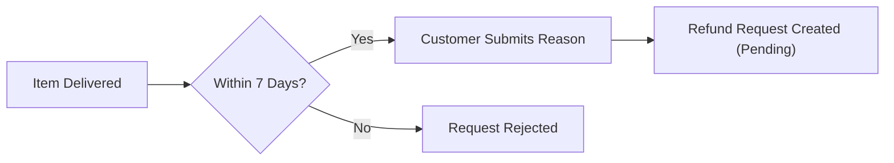

### Seller Review of Refund Request

The seller who owns the affected order item receives the refund request and can either approve or reject it. The seller must review each pending refund request and provide a decision.

When the seller submits their response — whether an approval or a rejection — a snapshot of the refund request is created at that moment, recording the request status, the reason text, and the timestamp of the response. This snapshot is immutable and is preserved for dispute resolution purposes (see RefundRequestSnapshot Operations in the sibling section).

If the seller approves the refund request:
- The order item's status changes to refunded.
- A refund is processed for that item.
- The stock quantity for the purchased variant is restored by creating a positive inventory record (see InventoryRecord Operations).

If the seller rejects the refund request:
- The order item remains in the delivered status.
- No inventory change occurs.
- The customer is informed that the request was rejected.

The following diagram illustrates the seller's decision flow:

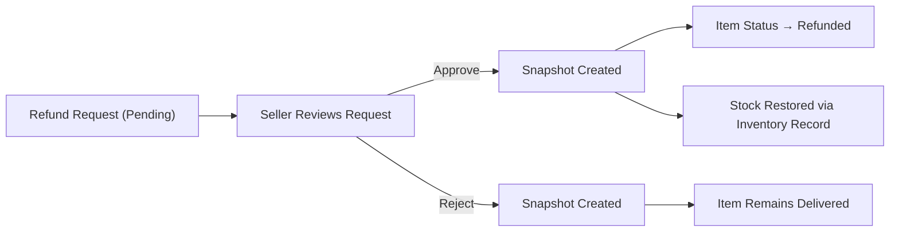

### Impact on Order Item and Order Status

Refund requests are handled on a per-item basis. When a refund request for one order item is approved or rejected, the other items in the same order are completely unaffected and continue to progress through their normal status lifecycle.

The overall order status is recalculated after each item status change. If every order item in an order reaches the status of refunded, the overall order status becomes refunded. If only some items are refunded while others are in different statuses, the overall order status reflects a mixed or partially completed state, as defined by the order status derivation rules (see Order Operations).

This per-item isolation ensures that a single disputed item does not disrupt the fulfillment or completion of other items purchased in the same order.

### Administrator Force-Refund

Administrators can force-refund individual order items or all items in an entire order without requiring seller approval. This capability is used to resolve disputes, policy violations, or situations where the seller is unresponsive.

When an administrator force-refunds an item:
- The item's status changes to refunded immediately.
- A refund is processed for that item.
- The stock quantity for the affected variant is restored through a positive inventory record.
- The remaining items in the order are unaffected unless the administrator explicitly force-refunds them as well.

If all items in an order are force-refunded, the overall order status becomes refunded. Administrators can also force-refund all items in an order at once, which changes the status of every item to refunded and updates the overall order status accordingly.

## RefundRequestSnapshot Operations

A refund request snapshot is automatically created whenever the seller responds to a refund request, capturing the state of the request at that moment. The snapshot records the request status at that point in time, the reason provided by the customer, and the timestamp of the change. These snapshots build an immutable audit trail for each refund request, ensuring all parties have access to a complete history of how the request was handled. Refund request snapshots cannot be modified or deleted. They are accessible to the relevant customer, the seller, and administrators to support transparency and dispute resolution.

### Automatic Snapshot Creation on Seller Response

When a seller responds to a refund request — either approving or rejecting it — the system automatically creates a refund request snapshot capturing the complete state of the request at that exact moment.

The snapshot is created without any manual action from the seller, customer, or administrator. It is triggered solely by the seller submitting their decision on the refund request.

Each snapshot preserves the following information:
- The status of the refund request at the time of the seller's response (approved or rejected)
- The original reason text submitted by the customer when the refund request was created
- The precise timestamp at which the status change occurred

The snapshot is permanently associated with its parent refund request. As sellers respond to a request over time (for example, if a request moves through multiple state changes), each response generates its own snapshot, building a sequential audit trail of every decision made on that request.

### Immutability and Preservation of Refund Request Snapshots

Once a refund request snapshot is created, it cannot be modified or deleted by any party — including the customer who submitted the request, the seller who responded, or an administrator.

Snapshots are preserved permanently regardless of subsequent actions affecting related records. Specifically:
- If the associated order or order item is later force-cancelled or force-refunded by an administrator, existing snapshots of the refund request remain intact.
- If the seller account is deleted, snapshots tied to that seller's refund request responses are retained.
- If the customer account is deleted, snapshots tied to their refund requests are retained.

No user-facing operation can remove or alter snapshot records. This permanent, append-only nature ensures the integrity of the historical record for every refund interaction.

### Snapshot Visibility and Dispute Resolution

Refund request snapshots are accessible to three parties: the customer who submitted the refund request, the seller who responded to it, and any administrator on the platform.

The customer can view all snapshots associated with their own refund requests, allowing them to review the full history of how each request was handled — including the timestamp and outcome of each seller response.

The seller can view all snapshots associated with refund requests on their own order items, giving them a complete record of the decisions they have made.

Administrators can view refund request snapshots for any order item on the platform, regardless of seller or customer.

The primary purpose of this visibility is to support dispute resolution. When a disagreement arises between a customer and a seller regarding a refund — for example, a dispute over whether a rejection was communicated correctly or whether a reason was accurately recorded — the snapshots provide an authoritative, tamper-proof record of every state the request passed through. All parties can refer to the same snapshot history to understand what occurred and when.

## Review Operations

Customers can write a review for a product they have purchased, but only after the corresponding order item has reached delivered status. Each customer can write one review per product per order, preventing duplicate reviews for the same purchase. A review consists of a star rating from 1 to 5 (required) and optional text content. Reviews are displayed on the product detail page, sorted by newest first. Customers can edit their own reviews, and every edit creates a snapshot of the previous review state. Customers can delete their own reviews, but the snapshots of past review states are preserved. A deleted review is excluded from the product's average rating calculation, which is based only on non-deleted reviews. Deleted reviews do not appear on the product page.

### Writing a Review

Customers can write a review for a product they have purchased, subject to the following conditions:

- A review can only be submitted after the corresponding order item has reached delivered status. Customers cannot review a product that is still paid, shipped, cancelled, or refunded.
- Each customer is limited to one review per product per order. If a customer purchased the same product in multiple separate orders, they may write one review per order.
- A review must include a star rating between 1 and 5 (inclusive). The rating is required; a review cannot be submitted without a rating.
- A review may optionally include text content describing the customer's experience. Text content is not required.
- When a review is successfully submitted, it is immediately associated with the customer, the product, and the specific order item that triggered eligibility.
- The review becomes visible on the product detail page as soon as it is created.

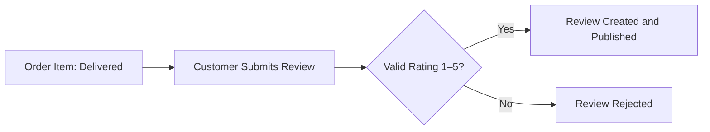

### Viewing Reviews on the Product Detail Page

All non-deleted reviews for a product are displayed on that product's detail page. The following rules govern how reviews are presented:

- Reviews are sorted by newest first, so the most recently written or edited review appears at the top.
- Each review displays the reviewer's display name, star rating, text content (if provided), and the date the review was written.
- If the customer who wrote a review has deleted their account, the review remains visible but the author is shown as "deleted user" instead of their display name.
- Deleted reviews are not displayed on the product detail page and are excluded from all visible review counts.
- The product detail page shows the total count of reviews (non-deleted only) alongside the average rating.

### Editing a Review

Customers can edit reviews they have previously written. The following rules apply to review edits:

- Only the customer who originally wrote the review may edit it.
- When a customer edits a review, they can update the star rating, the text content, or both.
- The star rating must remain between 1 and 5 after editing. Submitting an edit with an invalid rating is rejected.
- Every time a review is edited, a snapshot of the review's previous state is automatically created before the changes are saved. The snapshot captures the rating and text content at the time of the edit.
- After the edit is saved, the updated review replaces the previous version on the product detail page.
- The review's position in the sort order reflects the most recent edit date, so edited reviews appear at the top of the list sorted by newest first.
- Snapshots created during edits are immutable and cannot be modified or deleted. They are accessible to administrators for dispute resolution purposes.

### Deleting a Review

Customers can delete their own reviews at any time after writing them. The following rules govern review deletion:

- Only the customer who originally wrote the review may delete it.
- When a review is deleted, it is no longer displayed on the product detail page.
- A deleted review is excluded from the product's average rating calculation and from the displayed review count.
- Deleting a review does not remove any snapshots previously created by edits. All snapshots of the review's past states are preserved even after deletion.
- Administrators can still access the full history of a deleted review, including all its snapshots, for dispute resolution purposes.
- Once deleted, the review cannot be restored by the customer. The customer may write a new review only if they still meet the eligibility conditions (delivered order item, one review per product per order).

### Average Rating Calculation

A product's average rating is a derived value computed from its active reviews. The following rules define how it is calculated:

- Only non-deleted reviews contribute to the average rating. Deleted reviews are excluded from the calculation regardless of when they were deleted.
- The average rating is the arithmetic mean of all non-deleted star ratings for that product, rounded to a consistent precision for display.
- If a product has no non-deleted reviews, no average rating is shown on the product detail page or in product listings.
- When a review is deleted or edited, the average rating is recalculated immediately to reflect the current state of all non-deleted reviews.
- The average rating and total review count are shown on the product detail page and in product listing views (search results, category pages).

## ReviewSnapshot Operations

A review snapshot is automatically created every time a customer edits their review, capturing the rating and text content of the review as it was before the edit. These snapshots create a complete and immutable history of all changes made to a review over time. Review snapshots cannot be modified or deleted, even if the original review is later deleted by the customer. The snapshots are preserved as permanent records and can be viewed by relevant parties such as administrators for dispute resolution. They ensure accountability and transparency in the review system by recording every version of a review that has ever existed.

### Review Snapshot Creation on Edit

Every time a customer edits an existing review, the system automatically creates a review snapshot before applying the new changes. The snapshot captures the state of the review as it existed immediately prior to the edit, preserving the rating and text content from that version. The snapshot also records the timestamp at which the snapshot was created, providing a precise record of when the change occurred.

Review snapshots are created exclusively by the system in response to a customer editing their review. Customers and administrators cannot manually create, trigger, or request a review snapshot outside of the normal edit flow. Each edit of a review produces exactly one new snapshot, ensuring that every version of a review that has ever been saved is permanently recorded.

If a customer edits their review multiple times, each edit produces a separate snapshot. Over time, these snapshots collectively form a complete chronological history of all changes made to that review.

### Content Preserved in Each Snapshot

Each review snapshot captures the following information from the review as it existed before the edit was applied:

- The rating at that point in time (a value from 1 to 5 stars)
- The text content at that point in time (which may be empty if the customer had not provided text)
- The timestamp indicating when the snapshot was created

The snapshot is associated with the parent review so that the full sequence of changes can be reconstructed. The snapshot does not record who initiated the edit beyond the implicit association to the review owner, as the review itself already carries that relationship.

### Immutability of Review Snapshots

Once a review snapshot is created, it is permanently fixed and cannot be altered in any way. No actor — including the customer who wrote the review, sellers, administrators, or super administrators — may modify or delete a review snapshot. The content, rating, and timestamp recorded in the snapshot remain exactly as they were at the moment of creation.

This immutability is fundamental to the snapshot's purpose as a trustworthy audit record. Because the platform involves financial transactions, the integrity of review history must be guaranteed. Any attempt to update or remove a review snapshot is rejected by the system.

### Snapshot Preservation After Review Deletion

When a customer deletes their review, the review snapshots associated with that review are not removed. All previously created snapshots remain intact and accessible in the system even after the original review record is marked as deleted.

This ensures that the complete history of a review's content is preserved for accountability purposes, regardless of the customer's decision to remove the review. The platform treats review snapshots as permanent records that exist independently of the current state of the review they were derived from.

Similarly, if a customer deletes their account, the review snapshots they generated are retained. The customer's reviews may be displayed as belonging to a "deleted user," but the underlying snapshot history is preserved.

### Administrator Access for Dispute Resolution

Administrators can view the complete snapshot history of any review on the platform. This access supports dispute resolution when disagreements arise between customers, sellers, or other parties about the content or timing of a review.

When an administrator views a review's snapshot history, they can see each recorded version in chronological order, including the rating, text content, and timestamp of each snapshot. This allows administrators to determine what a review said at any point in its history, whether a review was edited after a specific event, and how many times a review has been modified.

Customers can access the snapshot history of their own reviews. Sellers can access snapshot histories for reviews on their own products. Administrators have unrestricted access to review snapshot histories across all products and customers.

### Complete History of Review Changes

The collection of review snapshots for a given review constitutes the complete and authoritative history of every change made to that review since it was first created. Together with the current state of the review, the snapshots allow any authorized party to reconstruct the full timeline of the review's content from its original submission through every subsequent edit.

Because every edit produces one snapshot capturing the pre-edit state, the first snapshot represents the original content of the review at the time it was first created and then later modified. The current review record represents the most recent version. No version of the review that was ever saved is lost.

This complete history is the primary mechanism for ensuring accountability and transparency in the review system, particularly in cases where a review's content is disputed or its timing relative to other events (such as order delivery or seller response) is relevant.

# Error Scenarios and Edge Cases

Business-level error scenarios, edge case coverage, and expected system behaviors for exceptional conditions.

## Customer Error Scenarios

Customers who attempt to use any platform feature without registering must be denied access, as the platform requires registration to browse or purchase. If a customer tries to log in with an email that does not exist or provides an incorrect password, the system must reject the login attempt. A customer cannot delete their account if there are active sessions without completing the sign-out flow. When a customer deletes their account, their profile information (display name and phone number) is removed, but their orders, order history, and reviews must be preserved. Reviews left by deleted customers are shown under the label 'deleted user' and must not be removed from product pages. A customer who has already deleted their account cannot attempt to log in again using the same credentials. Changing a password requires the customer to be authenticated; unauthenticated password change attempts must be rejected. If a customer submits a password change with the same password as the current one, the business expectation should still be met by accepting or rejecting it consistently. Customers who are banned by an administrator cannot log in, and any attempt must be blocked until the ban is lifted.

### Unregistered User Access Denial

WHEN an unregistered user attempts to access any platform feature (browsing products, viewing categories, searching, or viewing product details), THE system SHALL deny access and prompt the user to register or log in.

THE system SHALL NOT allow guest browsing of any kind; all features require a registered and authenticated account.

WHEN an unauthenticated request is made to any protected resource, THE system SHALL reject the request and indicate that authentication is required.

### Login Failure Scenarios

WHEN a customer attempts to log in with an email address that does not exist in the system, THE system SHALL reject the login attempt and indicate that the credentials are invalid.

WHEN a customer attempts to log in with a correct email address but an incorrect password, THE system SHALL reject the login attempt and indicate that the credentials are invalid.

THE system SHALL NOT reveal whether the failure was caused by an unrecognized email or an incorrect password; in both cases, the rejection message MUST be generic to prevent information disclosure.

WHEN a customer who has been banned by an administrator attempts to log in, THE system SHALL block the login and indicate that the account is not accessible, regardless of whether the credentials are correct.

IF the ban on a customer account has not been lifted, THEN THE system SHALL continue to block all login attempts from that account until an administrator removes the ban.

### Unauthenticated Password Change Rejected

WHEN a customer who is not currently authenticated attempts to change their password, THE system SHALL reject the request.

THE system SHALL require an active authenticated session before processing any password change request.

IF a password change request is submitted without a valid authenticated session, THEN THE system SHALL deny the operation and indicate that the customer must be logged in to perform this action.

### Deleted Account Effects on Profile, Orders, and Reviews

WHEN a customer deletes their account, THE system SHALL remove the customer's profile information, including display name and phone number.

WHEN a customer deletes their account, THE system SHALL preserve all orders and order history associated with that account, retaining them for seller records and legal purposes.

WHEN a customer deletes their account, THE system SHALL preserve all reviews written by that customer, but THE system SHALL display those reviews under the label 'deleted user' instead of the customer's former display name.

THE system SHALL NOT remove reviews from product pages when the authoring customer's account is deleted; those reviews MUST continue to contribute to the product's average rating calculation.

WHEN a customer attempts to log in using credentials belonging to an account that has already been deleted, THE system SHALL block the login attempt and indicate that no account exists for those credentials.

THE system SHALL NOT allow a deleted account to be reactivated or logged into by any means after deletion is confirmed.

## Seller Error Scenarios

A seller who has not yet been approved by an administrator cannot list products or perform selling operations; their access is restricted until approval is granted. Sellers with a pending approval status cannot resubmit a registration request; only rejected sellers may submit a new one. A seller cannot delete their account if they have any order items in 'paid' or 'shipped' status, or if there are any pending cancellation or refund requests — the system must block the deletion and inform the seller of the reason. When a seller deletes their account, all their products are removed from listings, but order history, snapshots, and their shop name in past orders are preserved. A suspended seller cannot create new products or edit existing ones, and their products are hidden from customers, but they can still ship items and respond to cancellation and refund requests. A banned seller cannot log in to the platform at all; their existing orders remain in the system for fulfillment purposes. Sellers attempting to edit or delete products belonging to another seller must be denied. If a seller tries to change their password without being authenticated, the request is rejected. A rejected seller who views their approval status can see the rejection reason, enabling them to address the issue before resubmitting.

### Approval Status Restrictions

A seller who has registered but not yet been approved by an administrator is in a pending state. While in a pending state, the seller cannot create products, list products, edit products, manage inventory, or perform any selling operations. The system blocks all selling-related actions and informs the seller that their account is awaiting administrator approval.

A seller whose approval status is pending cannot submit a new registration request. The system prevents duplicate or redundant submissions while a request is already under review. Only one active approval request may exist per seller at a time.

A seller whose registration has been rejected is permitted to submit a new registration request. Before resubmitting, the seller can view the rejection reason provided by the administrator, so they understand what issue must be addressed. The rejection reason is visible on the seller's approval status page. Once the seller corrects the issue, they may submit a fresh registration request, which returns their status to pending and awaits administrator review.

A seller who has already been approved cannot resubmit a registration request. Attempting to do so is blocked by the system, since their approval is already granted.

### Account Deletion Blocked by Pending Orders or Requests

A seller cannot delete their account if any of the following conditions are true:

- They have one or more order items with a status of 'paid' (awaiting shipment) for any of their products.
- They have one or more order items with a status of 'shipped' (awaiting delivery confirmation) for any of their products.
- There are any pending cancellation requests associated with their order items that have not yet been resolved (approved or rejected).
- There are any pending refund requests associated with their order items that have not yet been resolved.

When a seller attempts to delete their account and any of these conditions are met, the system blocks the deletion and informs the seller of the specific reason — identifying whether the block is due to pending order items, pending cancellation requests, or pending refund requests. The seller must resolve all outstanding obligations before account deletion is permitted.

### Seller Account Deletion: What Is Preserved and What Is Removed

When a seller successfully deletes their account (after meeting the deletion eligibility conditions defined in the preceding section), the following outcomes occur:

- All products belonging to the seller are removed from search results and category listings. Customers can no longer discover or purchase those products.
- All product variants and inventory records associated with those products are also removed.
- Order history is fully preserved. All past orders that included the seller's products remain intact in the system for the benefit of customers and for legal and record-keeping purposes.
- Order item snapshots, which capture the product name, description, variant options, and price at the time of purchase, are preserved and remain accessible as part of the order record.
- The seller's profile snapshots that were saved at the time of purchase (preserving shop name and logo) remain attached to the relevant order items. The seller's shop name continues to appear in past orders even after the account is deleted.
- Cancellation and refund request records associated with past orders are preserved.
- Review snapshots associated with the seller's products are preserved.

### Suspended Seller: Restricted Capabilities and Hidden Listings

When an administrator suspends a seller account, the following restrictions take effect immediately:

- All products belonging to the suspended seller are hidden from customer-facing search results and category listings. Customers cannot discover or browse the seller's products while the suspension is active.
- The suspended seller's products cannot be purchased. Attempting to add a suspended seller's product to the cart or check it out is not permitted.
- The suspended seller cannot create new products.
- The suspended seller cannot edit any of their existing products, including product details, images, and variants.
- The suspended seller cannot adjust inventory for their variants.

Despite these restrictions, the suspended seller retains limited operational capability to fulfill existing commitments:

- They can still view and process order items that require shipment (items in 'paid' status).
- They can still create shipments and mark items as shipped.
- They can still respond to (approve or reject) pending cancellation and refund requests from customers.

When an administrator removes the suspension, all of the seller's products immediately become visible again in search and category listings, and the seller regains full selling capabilities.

### Banned Seller: Complete Access Denial

When an administrator bans a seller account, the seller is immediately and completely blocked from logging in to the platform. Any attempt by a banned seller to authenticate with their credentials is rejected by the system.

Existing orders that were placed before the ban remain in the system. The order history and associated records are preserved for customer fulfillment and legal purposes. However, because the seller cannot log in, they cannot actively process those orders. Administrators are responsible for managing any outstanding obligations on behalf of banned sellers as needed.

The ban does not destroy any historical data — order records, order item snapshots, seller profile snapshots attached to past orders, and all review records remain intact.

### Seller Product Ownership Enforcement

Every product on the platform belongs exclusively to the seller who created it. A seller may only edit, manage images for, manage variants of, adjust inventory of, or delete products that they own.

If a seller attempts to perform any of these operations on a product that belongs to a different seller, the system denies the request. The attempting seller is not permitted to view the internal management details of another seller's product, nor to make any modifications to it.

This restriction applies equally to all product-related operations: editing product fields, uploading or reordering images, adding or editing variants, adjusting inventory records, and initiating product deletion. The system validates product ownership before executing any such operation and rejects requests where the acting seller is not the product owner.

## Admin Error Scenarios

A regular administrator cannot promote or demote other administrators; only super administrators hold that authority. A super administrator cannot demote themselves — the system must block this action regardless of the reason. Super administrators can promote a regular administrator to super administrator, and can demote another super administrator to regular administrator, but not themselves. When an administrator bans a customer, the customer is immediately blocked from logging in; the ban can be reversed by any administrator. When an administrator bans a seller, the seller cannot log in, but their existing orders remain active and must not be disrupted. Administrators who attempt to perform actions outside their grade (e.g., a regular administrator approving another administrator's upgrade) must be denied. An administrator cannot delete a category that results in an immediate cascading error; instead, products in the deleted category simply become uncategorized. Administrators can force-cancel or force-refund order items, restoring stock quantities accordingly. If an administrator tries to approve or reject a seller registration that has already been decided, the system must handle this gracefully and not create duplicate records.

### Administrator Grade Authority and Restrictions

WHEN a regular administrator attempts to promote or demote any administrator's grade, THE system SHALL deny the action and preserve the current grade of the target administrator.

WHEN a super administrator attempts to demote themselves to regular administrator, THE system SHALL block the action regardless of the stated reason or context.

WHEN a super administrator submits a request to promote a regular administrator to super administrator, THE system SHALL update the target administrator's grade to super administrator.

WHEN a super administrator submits a request to demote another super administrator (who is not themselves) to regular administrator, THE system SHALL update the target administrator's grade to regular administrator.

IF a regular administrator submits any grade-change action (promotion or demotion) against any account, THEN THE system SHALL reject the request without modifying any account's grade.

IF a super administrator targets their own account for demotion, THEN THE system SHALL reject the request and inform the requestor that self-demotion is not permitted.

THE system SHALL ensure that all administrator grade changes are performed only by super administrators and are immediately reflected upon action — no approval queue is involved.

### Customer and Seller Ban Operations

WHEN an administrator bans a customer account, THE system SHALL immediately prevent that customer from logging in.

WHEN a banned customer attempts to log in, THE system SHALL deny access for the duration of the ban.

WHEN an administrator unbans a customer account, THE system SHALL restore the customer's ability to log in immediately.

WHEN an administrator bans a seller account, THE system SHALL immediately prevent that seller from logging in.

WHEN a seller account is banned, THE system SHALL preserve all of that seller's existing orders and allow those orders to continue processing without disruption.

WHEN a banned seller attempts to log in, THE system SHALL deny access regardless of the seller's existing order obligations.

WHEN an administrator unbans a seller account, THE system SHALL restore the seller's ability to log in and resume normal operations immediately.

IF a seller is banned, THEN THE system SHALL keep all existing order items, shipment records, cancellation requests, and refund requests associated with that seller intact and unaffected.

THE system SHALL allow any administrator (regular or super) to ban or unban customer accounts.

THE system SHALL allow any administrator (regular or super) to ban or unban seller accounts.

### Administrator Force-Cancel and Force-Refund with Stock Restoration

WHEN an administrator force-cancels an individual order item, THE system SHALL change that item's status to cancelled and create a corresponding positive inventory record to restore the stock quantity for the affected variant.

WHEN an administrator force-cancels an entire order, THE system SHALL apply cancellation to all non-cancelled and non-refunded items in that order and restore stock quantities for each affected variant via individual inventory records.

WHEN an administrator force-refunds an individual order item, THE system SHALL change that item's status to refunded and create a corresponding positive inventory record to restore the stock quantity for the affected variant.

WHEN an administrator force-refunds an entire order, THE system SHALL apply a refund to all eligible items in that order and restore stock quantities for each affected variant via individual inventory records.

IF an administrator attempts to force-cancel or force-refund an item that is already in a terminal status (cancelled, refunded), THEN THE system SHALL reject the action for that specific item without affecting the remaining items.

THE system SHALL not require seller approval for administrator force-cancel or force-refund actions; these actions bypass the normal seller approval workflow.

THE system SHALL record each force-cancel and force-refund action so that the change is traceable in the order history and inventory records.

### Seller Registration Decision Finality

WHEN an administrator has already approved a seller registration request, THE system SHALL prevent any subsequent approval or rejection action from being applied to that same registration request.

WHEN an administrator has already rejected a seller registration request, THE system SHALL prevent any subsequent approval or rejection action from being applied to that same registration request.

IF an administrator attempts to approve or reject a seller registration that has already been decided (approved or rejected), THEN THE system SHALL reject the action without creating a duplicate approval record or altering the existing decision.

WHEN a rejected seller submits a new registration request, THE system SHALL treat it as a separate, independent registration request that is evaluated on its own merits by administrators.

THE system SHALL clearly distinguish each seller registration attempt as a discrete record, ensuring that acting on a previous request does not interfere with any new pending request from the same seller.

### Category Deletion and Product Uncategorization

WHEN an administrator deletes a category, THE system SHALL remove the category from all listings and make it unavailable for future product assignments.

WHEN a category that contains products is deleted, THE system SHALL automatically set all products previously assigned to that category into an uncategorized state rather than deleting those products.

WHEN a parent category is deleted, THE system SHALL also remove its subcategories, and all products assigned to either the parent or any of its subcategories SHALL become uncategorized.

IF an administrator deletes a category, THEN THE system SHALL not cascade any deletion to products — products remain visible and active but are listed without a category.

THE system SHALL ensure category deletion does not trigger errors or disrupt product listings; affected products continue to appear on the platform in an uncategorized state until reassigned.

## AdminRequest Error Scenarios

Any user — customer or seller — may submit a request to become an administrator, but the request must include a reason; requests without a reason must be rejected. A user who already has a pending admin request must not be allowed to submit another request while the first is still pending. Super administrators are the only ones who can view and act on pending admin requests; regular administrators must be denied access to this function. If a super administrator approves a request, the user becomes a regular administrator; rejecting the request leaves the user's role unchanged. The system must preserve a clear record of each admin request and its outcome. Attempting to approve or reject an already-resolved request must be handled gracefully without creating inconsistent state. A user who becomes an administrator through an approved request cannot retroactively cancel or withdraw their request.

### Admin Request Submission Errors

A user submitting a request to become an administrator must provide a reason text. If the reason text is absent or blank, the system rejects the submission and the request record is not created.

If a user already has a pending admin request that has not yet been resolved, they may not submit another request. The system detects the existing pending request and blocks the new submission. The user is informed that their previous request is still under review. This restriction applies to both customers and sellers.

If a user whose admin request was previously approved attempts to submit a new request, the system rejects the submission because the user already holds administrator status.

If a user whose admin request was rejected submits a new request, the system allows it, treating it as a fresh submission with its own reason text and timestamp.

### Access Control Errors for Pending Request Review

Only super administrators may view the list of pending admin requests. Regular administrators who attempt to access the list of pending admin requests are denied. The system does not expose pending request details to regular administrators under any circumstances.

Customers and sellers have no access to the list of all admin requests. A customer or seller may only view the status of their own submitted request. Any attempt by a customer or seller to access another user's admin request is denied.

### Request Resolution Outcome Errors

When a super administrator approves an admin request, the requesting user is granted the regular administrator role. The user's original role (customer or seller) is supplemented by the administrator role at the regular grade. The approved request is marked as resolved and can no longer be modified.

When a super administrator rejects an admin request, the requesting user's existing role remains entirely unchanged. No administrator grade is granted. The request is marked as resolved with a rejected status. The user retains all their previous permissions and is not penalized in any other way.

If a super administrator attempts to approve or reject a request that has already been resolved (either approved or rejected), the system refuses the action. The previously recorded outcome is preserved and no inconsistent state is introduced. The system treats any such attempt as an error and informs the super administrator that the request has already been decided.

Once an admin request is approved and the user has been granted administrator status, the user cannot retroactively cancel or withdraw that request. The administrator role persists until modified through the administrator grade management process (defined in Admin Operations). There is no mechanism to undo an approved admin request by the user themselves.

## SellerApproval Error Scenarios

A seller with a pending approval cannot perform selling operations such as listing products; they must wait for an administrator's decision. If a seller's registration is rejected, they can view the rejection reason provided by the administrator to understand what needs to change before resubmitting. A seller who has been rejected and submits a new registration request must go through the full approval process again. A seller who is already approved cannot submit a new approval request; the system must prevent duplicate requests. Administrators cannot approve a seller registration that has already been approved or rejected — the action must be blocked. If an administrator provides no reason when rejecting a seller, the system must enforce that a reason is required. A seller's approval status (pending, approved, rejected) is always visible to the seller themselves.

### Pending Seller Blocked from Selling Operations

WHILE a seller's approval status is pending, THE system SHALL prevent that seller from listing new products, editing existing products, and performing any selling operations that require approved status.

WHEN a seller with pending approval status attempts to create a product, THE system SHALL reject the action and inform the seller that they must wait for administrator approval before selling.

WHEN a seller with pending approval status attempts to edit a product, THE system SHALL reject the action and indicate that selling operations are not permitted until approval is granted.

WHILE a seller's approval is pending, THE system SHALL allow the seller to log in, view their approval status, and access account settings, but SHALL restrict all product and order management actions.

WHEN a seller's approval status changes from pending to approved by an administrator, THE system SHALL grant that seller full access to selling operations immediately.

### Rejected Seller Views Rejection Reason

WHEN a seller's registration is rejected by an administrator, THE system SHALL record and store the rejection reason provided by the administrator alongside the seller's approval record.

WHILE a seller's approval status is rejected, THE system SHALL make the rejection reason visible to that seller at all times through their approval status view.

THE system SHALL display the rejection reason in plain text so the seller can understand what needs to change before resubmitting a new registration request.

IF a seller's approval status is rejected and the seller views their approval status, THEN THE system SHALL show both the rejected status and the associated rejection reason together.

### Rejected Seller Resubmits a New Registration Request

WHEN a seller's approval status is rejected, THE system SHALL allow that seller to submit a new registration request.

WHEN a rejected seller submits a new registration request, THE system SHALL create a new approval record with pending status and place it in the administrator review queue.

WHEN a rejected seller resubmits, THE system SHALL treat the new submission as a full approval process, requiring administrator review and decision before the seller can perform selling operations.

IF a seller with rejected status submits a new registration request, THEN THE system SHALL update the seller's visible approval status to pending, reflecting that a new review is in progress.

THE system SHALL preserve the history of previous approval records, including past rejections and their reasons, while the new request is under review.

### Already-Approved Seller Cannot Resubmit and Duplicate Requests Blocked

WHEN a seller whose approval status is already approved attempts to submit a new registration request, THE system SHALL reject the action and inform the seller that they are already approved.

IF a seller already has a pending approval request in the system, THEN THE system SHALL block any attempt by that seller to submit another registration request, preventing duplicate pending requests.

WHEN a seller attempts to submit a duplicate registration request while one is already pending, THE system SHALL inform the seller that their current request is still under review and no additional submission is needed.

THE system SHALL enforce that at any given time, a seller may have at most one active (pending) approval request in the system.

IF a seller is already approved and attempts to resubmit, THEN THE system SHALL not alter the seller's current approved status in any way.

### Rejection Requires a Reason from Administrator

WHEN an administrator attempts to reject a seller registration request without providing a rejection reason, THE system SHALL reject the action and require the administrator to supply a reason before the rejection can be completed.

THE system SHALL enforce that a rejection reason is a mandatory field when an administrator rejects a seller registration, and SHALL not allow the rejection to proceed with an empty or missing reason.

WHEN a rejection reason is successfully provided and the rejection is submitted, THE system SHALL store the reason and make it immediately visible to the rejected seller.

IF an administrator provides a rejection reason and submits the rejection, THEN THE system SHALL update the seller's approval status to rejected and associate the reason with that approval record.

### Seller Approval Status Always Visible to Seller

THE system SHALL display the seller's current approval status (pending, approved, or rejected) to that seller at all times after registration.

WHILE a seller is logged in, THE system SHALL make their approval status accessible from their account area without any additional steps or administrator intervention.

IF a seller's approval status is rejected, THEN THE system SHALL display the rejection reason alongside the rejected status whenever the seller views their approval status.

WHEN an administrator changes a seller's approval status (from pending to approved, or from pending to rejected), THE system SHALL reflect the updated status immediately when the seller next views their account.

### Already-Decided Approval Cannot Be Re-Processed

WHEN an administrator attempts to approve a seller registration that has already been approved, THE system SHALL reject the action and inform the administrator that the registration has already been decided.

WHEN an administrator attempts to reject a seller registration that has already been approved or rejected, THE system SHALL reject the action and prevent any changes to the finalized approval record.

IF a seller approval record has a status of approved or rejected, THEN THE system SHALL treat that approval as final and block any administrator from changing its status through the normal approval workflow.

THE system SHALL display the current decided status of an approval record to administrators, allowing them to see that the record has already been processed before any action attempt.

IF an administrator attempts to take action on an already-decided approval, THEN THE system SHALL inform the administrator of the current status so they can determine whether a new resubmission from the seller is needed instead.

## CustomerAddress Error Scenarios

A customer must provide all required address fields — recipient name, phone number, street address, city, state/province, postal code, and country — when adding a new address; incomplete addresses must be rejected. A customer can set one address as the default shipping address; if they delete the default address, no other address is automatically promoted to default, and the customer must explicitly set a new default. When a customer deletes their account, all their addresses are also deleted as part of profile removal. A customer can only view, edit, or delete their own addresses; accessing another customer's addresses must not be permitted. At checkout, if no default address is set and the customer has not selected an address, the checkout cannot proceed. Editing an address does not preserve a snapshot, as addresses are not subject to the snapshot principle.

### All Required Address Fields Must Be Present

When a customer adds a new shipping address, all required fields must be provided: recipient name, phone number, street address, city, state or province, postal code, and country. If any of these fields is missing or left blank, the system rejects the address submission and notifies the customer of the missing field or fields. A partially filled address is never saved. The customer must correct the submission and resubmit with all required fields before the address can be stored. The system does not accept an address that omits even one required field, regardless of how many other fields are correctly filled in.

### Default Address Deletion Leaves No Automatic Default

A customer may designate one of their shipping addresses as the default shipping address. When the customer deletes the address that is currently set as the default, the system removes that address without automatically promoting any other saved address to default status. After the deletion, the customer has no default address until they explicitly set one. The system does not select, rank, or assign a replacement default on behalf of the customer. Any subsequent checkout flow will require the customer to actively choose a shipping address, as there is no default pre-selected.

### Customer Can Only Manage Their Own Addresses

Each customer's shipping addresses are private to that customer. A customer may only view, add, edit, or delete addresses that belong to their own account. The system does not permit any customer to access, modify, or delete the addresses of another customer. Any attempt to operate on an address that does not belong to the requesting customer is rejected. This restriction applies regardless of how the request is formed; the system enforces address ownership at all times.

### Checkout Blocked When No Shipping Address Is Selected

During checkout, a customer must select a shipping address before the order can be placed. If the customer has no saved addresses, they cannot proceed with checkout until they add at least one address. If the customer has saved addresses but has not selected one (and no default is set), checkout is blocked until a specific address is chosen. The system does not allow an order to be placed without a confirmed shipping address. If a default address exists, it may be pre-selected during checkout, but the customer must still confirm the selection before placing the order.

### Address Edits Do Not Require a Snapshot

Shipping addresses are not subject to the platform's snapshot principle. When a customer edits an existing address — updating the recipient name, phone number, street address, city, state or province, postal code, or country — the system overwrites the previous address data without creating a historical snapshot. This is by design: address records are not financial or transactional data, and the platform's snapshot requirement applies only to products, product variants, seller profiles, orders, reviews, cancellation requests, and refund requests (as defined in the domain model). For addresses, only the current state is preserved; prior values are not retained after an edit.

### Account Deletion Removes All Customer Addresses

When a customer deletes their account, all shipping addresses associated with that account are permanently removed as part of the profile deletion process. Address removal is automatic and does not require a separate step by the customer. Because addresses are personal profile data — not transactional records — they are not preserved after account deletion. Order records that were placed before the deletion retain their own shipping address snapshot (captured at the time the order was placed) and are not affected by the removal of the customer's address book.

## Category Error Scenarios

Only administrators can create, edit, or delete categories; customers and sellers who attempt these actions must be denied. Categories support only one level of nesting (parent and subcategory); attempts to create a subcategory of a subcategory must be rejected. If a category is deleted by an administrator, all products assigned to that category become uncategorized rather than being deleted. Customers can browse the category list and view products within a category, but cannot modify category data. Editing a category must require a name; a category without a name must be rejected. If an administrator attempts to delete a category that has active subcategories, the system should handle this consistently — subcategories may also be removed or reassigned according to business rules. Categories that are inactive or deleted must not appear in customer-facing browsing.

### Administrator-Only Category Management

THE system SHALL restrict category creation, editing, and deletion exclusively to administrator actors (regular and super administrators).

WHEN a customer or seller attempts to create a category, THE system SHALL deny the request and return an access-denied response.

WHEN a customer or seller attempts to edit a category's name or description, THE system SHALL deny the request and return an access-denied response.

WHEN a customer or seller attempts to delete a category, THE system SHALL deny the request and return an access-denied response.

THE system SHALL allow customers and sellers to browse the category list and view products within a category, but SHALL NOT expose any category modification operations to these actors.

WHEN an unauthenticated guest attempts any category modification operation, THE system SHALL deny the request.

THE system SHALL treat all category write operations (create, edit, delete) as administrative functions, regardless of how the request is constructed.

### Category Nesting Depth Constraint

THE system SHALL support exactly one level of category nesting, meaning a top-level category may have subcategories, but a subcategory may not have its own subcategories.

WHEN an administrator attempts to create a subcategory whose designated parent category is itself a subcategory, THE system SHALL reject the request.

IF a category already has a parent category assigned, THEN THE system SHALL prevent that category from being designated as a parent for any new or existing category.

WHEN an administrator attempts to reassign a top-level category as a child of another subcategory, THE system SHALL reject the operation with an explanation that only one level of nesting is permitted.

THE system SHALL validate the parent-child relationship depth at the time of category creation and at the time of any category reassignment, not only at initial setup.

### Category Deletion and Product Reassignment

WHEN an administrator deletes a category, THE system SHALL automatically reassign all products that were assigned to that category to an uncategorized state rather than deleting those products.

WHEN an administrator deletes a parent category that has active subcategories, THE system SHALL also remove or reassign those subcategories consistently — subcategories of the deleted parent SHALL either be deleted or promoted, and any products within those subcategories SHALL also become uncategorized.

IF a subcategory is deleted independently (not as a result of parent deletion), THEN THE system SHALL reassign all products in that subcategory to an uncategorized state.

THE system SHALL preserve product data, visibility settings, and all other product attributes when reassigning products to uncategorized status; only the category association changes.

WHEN subcategories exist under a parent category being deleted, THE system SHALL handle all subcategory and product reassignments atomically — either all reassignments succeed or none occur.

THE system SHALL NOT cascade-delete products when a category or subcategory is deleted.

### Category Name Validation

THE system SHALL require a non-empty name for every category and subcategory at the time of creation.

WHEN an administrator submits a category creation request without a name, THE system SHALL reject the request and indicate that the category name is required.

WHEN an administrator submits a category edit request that removes or clears the existing name, THE system SHALL reject the request and indicate that the category name cannot be blank.

THE system SHALL require the name field to be present and non-empty for both top-level categories and subcategories.

IF a category creation or edit request includes a description but omits the name, THEN THE system SHALL reject the request; description alone is not sufficient to create or identify a category.

### Category Visibility for Customers

WHILE a category is in a deleted state, THE system SHALL exclude it from all customer-facing category lists and browsing pages.

WHILE a category is inactive, THE system SHALL hide it from customer-facing category browsing, search filters, and product listings organized by category.

WHEN a customer browses the category list, THE system SHALL return only categories that are active and not deleted.

WHEN a customer filters products by category, THE system SHALL not allow selection of deleted or inactive categories.

IF a category becomes deleted or inactive while a customer is browsing, THEN subsequent requests from that customer for products within that category SHALL return no results or indicate that the category is not available.

THE system SHALL ensure that products previously assigned to a now-deleted category and subsequently marked as uncategorized remain visible in general search and product listings, even though their original category is no longer browsable.

## Product Error Scenarios

A seller cannot create a product without providing all required fields: name, description, category, and base price. A seller can only edit or delete their own products; attempting to modify another seller's product must be denied. A product cannot be deleted if any of its variants have order items in 'paid' or 'shipped' status, or if there are pending cancellation or refund requests for those variants. Deleting a product also removes all its variants and inventory records. Deleted products must not appear in search results or category listings. A product with no variants is visible in search but shown as 'unavailable' to customers. A suspended seller's products are hidden from all customer-facing views; when the seller is unsuspended, the products become visible again. Administrators can delete any product for policy violations, even if the seller is active. Every edit to a product must generate a snapshot preserving the previous state. Snapshots of deleted products must be preserved and remain accessible to the seller and administrators.

### Product Required Field Validation

WHEN a seller submits a request to create a product, THE system SHALL reject the request if any of the following required fields are missing or empty: product name, description, category, or base price.

IF the product name is not provided, THEN THE system SHALL reject the product creation request.

IF the product description is not provided, THEN THE system SHALL reject the product creation request.

IF the category is not specified, THEN THE system SHALL reject the product creation request.

IF the base price is not provided, THEN THE system SHALL reject the product creation request.

THE system SHALL require that a category selection corresponds to an existing, active category or subcategory.

IF a seller specifies a deleted or non-existent category when creating a product, THEN THE system SHALL reject the product creation request.

### Product Ownership Enforcement

WHEN a seller attempts to edit a product, THE system SHALL verify that the product belongs to that seller before allowing any modification.

IF a seller attempts to edit a product owned by another seller, THEN THE system SHALL deny the request.

WHEN a seller attempts to delete a product, THE system SHALL verify that the product belongs to that seller before allowing deletion.

IF a seller attempts to delete a product owned by another seller, THEN THE system SHALL deny the request.

THE system SHALL apply the same ownership check to all product-level operations, including uploading images, reordering images, deleting images, and managing variants.

IF a seller attempts to manage images or variants on another seller's product, THEN THE system SHALL deny the request.

### Product Deletion Blocked by Pending Order Items

WHEN a seller attempts to delete a product, THE system SHALL check whether any variant of that product has order items currently in 'paid' or 'shipped' status.

IF any variant of the product has one or more order items with status 'paid', THEN THE system SHALL block the product deletion request.

IF any variant of the product has one or more order items with status 'shipped', THEN THE system SHALL block the product deletion request.

THE system SHALL apply this check across all variants belonging to the product, not only to specific variants.

WHILE the product deletion is blocked due to pending order items, THE system SHALL allow the seller to continue editing the product and managing its variants normally.

### Product Deletion Blocked by Pending Cancellation or Refund Requests

WHEN a seller attempts to delete a product, THE system SHALL check whether any variant of that product has a pending cancellation or refund request.

IF any order item for a variant of the product has a cancellation request with status 'pending', THEN THE system SHALL block the product deletion request.

IF any order item for a variant of the product has a refund request with status 'pending', THEN THE system SHALL block the product deletion request.

THE system SHALL evaluate pending cancellation and refund requests across all variants of the product before permitting deletion.

IF all pending requests for all variants are resolved (approved or rejected), THEN THE system SHALL permit the seller to proceed with product deletion, provided no order items in 'paid' or 'shipped' status remain (as defined in the section above).

### Deleted Product Removed from Search and Listings

WHEN a product is successfully deleted, THE system SHALL immediately remove it from all customer-facing search results.

WHEN a product is successfully deleted, THE system SHALL immediately remove it from all category listing pages.

THE system SHALL ensure that deleted products do not appear in any product listing or browsing experience visible to customers.

WHEN a product is deleted, THE system SHALL automatically remove that product from all customer wishlists.

IF a customer's cart contains a variant of a deleted product, THE system SHALL mark that cart item as unavailable.

THE system SHALL preserve all product snapshots and order item snapshots associated with the deleted product, making them accessible to relevant parties as defined in the snapshot preservation section below.

### Product with No Variants Shown as Unavailable

WHILE a product has no variants, THE system SHALL display the product in search results and category listings with an 'unavailable' status indicator.

WHILE a product has no variants, THE system SHALL prevent customers from adding it to their cart.

THE system SHALL show the product detail page for a product with no variants, but without any purchasable options or an add-to-cart action.

WHEN a seller adds at least one variant to a product that previously had none, THE system SHALL update the product's availability so customers can add it to their cart.

IF a product's last remaining variant is deleted, THE system SHALL revert the product to 'unavailable' status in customer-facing views.

### Suspended Seller's Products Hidden from Customers

WHEN an administrator suspends a seller account, THE system SHALL immediately hide all of that seller's products from customer-facing search results and category listings.

WHILE a seller is suspended, THE system SHALL prevent customers from viewing or purchasing that seller's products through any browsing or search interface.

WHILE a seller is suspended, THE system SHALL allow the seller to continue processing existing orders, including shipping items and responding to cancellation and refund requests.

WHILE a seller is suspended, THE system SHALL block the seller from creating new products or editing existing products.

WHEN an administrator unsuspends a seller account, THE system SHALL immediately restore all of that seller's non-deleted products to customer-facing search results and category listings.

### Administrator Product Deletion for Policy Violations

THE system SHALL allow administrators to delete any product on the platform, regardless of the owning seller's account status.

WHEN an administrator deletes a product for a policy violation, THE system SHALL apply the same effects as a seller-initiated deletion: all variants and inventory records are removed, and the product disappears from all customer-facing views.

THE system SHALL NOT require administrator product deletions to pass the pending order item or pending request checks that apply to seller-initiated deletions.

WHEN an administrator deletes a product, THE system SHALL preserve all product snapshots and order item snapshots associated with that product.

THE system SHALL record that the deletion was performed by an administrator, distinguishing it from a seller-initiated deletion, so that it is available to relevant parties for dispute resolution.

### Product Edit Triggers Snapshot Creation

WHEN a seller successfully edits any field of a product (name, description, category, or base price), THE system SHALL create a product snapshot capturing the complete state of the product immediately before the edit.

WHEN a seller reorders, adds, or removes product images, THE system SHALL create a product snapshot that includes the updated image list and ordering.

THE system SHALL include the state of all current variants in the product snapshot at the time of each edit, preserving the complete product and variant configuration.

THE system SHALL create a product snapshot automatically as part of the edit operation; sellers cannot manually trigger or skip snapshot creation.

WHEN an administrator edits or deletes a product, THE system SHALL also create a product snapshot before applying the change, following the same snapshot rules as seller-initiated edits.

### Snapshots Preserved After Product Deletion

WHEN a product is deleted, THE system SHALL retain all previously created product snapshots for that product.

THE system SHALL keep product snapshots accessible to the seller who owned the product and to administrators, even after the product itself is deleted.

THE system SHALL keep order item snapshots that reference a deleted product's snapshot intact, ensuring that customers can still view the historical details of their purchases.

THE system SHALL NOT allow any party, including administrators, to delete product snapshots.

THE system SHALL ensure that the preserved snapshots accurately reflect the complete product state at each point in time when an edit occurred, including all variant states captured in the snapshot.

## ProductImage Error Scenarios

Sellers can upload multiple images for their products; image changes, including uploads, deletions, and reordering, are included in product snapshots. The first image in the display order serves as the main thumbnail; if all images are deleted or no images are uploaded, the product may appear without a thumbnail in listings. A seller cannot manage images for another seller's product. Deleting a product also removes all its associated images. Reordering images without adding or removing any still counts as a product edit and should create a snapshot. Sellers must be the owner of the product to upload, reorder, or delete images.

### Image Changes Included in Product Snapshot

Whenever a seller uploads new images, deletes existing images, or reorders images for a product, the resulting change is treated as an edit to the product. Because image changes constitute a product edit, the system creates a new product snapshot at the moment the change is saved. The snapshot captures the full state of the product at that point in time, including the complete list of images and their display order. This ensures that the image configuration of a product at any past point in time can be reconstructed from the snapshot history.

Reordering images without adding or removing any image still counts as a product edit and triggers snapshot creation. The snapshot records the new display order alongside all other product fields and variant states. A seller cannot reorder images without a snapshot being created as a result.

### First Image as Thumbnail and Missing Thumbnail Behavior

The image with the lowest display order position is treated as the main image and is used as the thumbnail wherever the product appears in listings, search results, and category pages. When a seller reorders images, the image moved to the first position immediately becomes the new thumbnail.

If a product has no images — either because no images were ever uploaded or because all images have been deleted — the product appears in listings and on its detail page without a thumbnail. Products without a thumbnail remain visible in search results and category pages but display no image placeholder content. The absence of a thumbnail does not prevent the product from being browsed or purchased, provided it meets all other availability conditions.

### Ownership Restriction for Image Management

Only the seller who owns a product can upload images to it, reorder its images, or delete images from it. A seller attempting to upload, reorder, or delete images for a product owned by another seller is denied. The system identifies product ownership by matching the seller performing the action against the seller associated with the product record.

Administrators retain oversight of products but image management operations (upload, reorder, delete) are restricted to the owning seller. An administrator wishing to remove images from a product must do so through the product deletion mechanism rather than individual image management operations.

### Product Deletion Removes All Associated Images

When a seller or administrator deletes a product, all images associated with that product are removed from the active product listing. Deleted product images are no longer accessible through normal browsing or search. However, images that were captured as part of product snapshots prior to deletion remain available within those snapshots, preserving the historical visual state of the product for order records, dispute resolution, and administrative review.

The removal of images upon product deletion is automatic and does not require the seller to manually delete images beforehand. If the product is deleted while images still exist, the deletion of images occurs as part of the same product deletion operation.

### Reordering Images Triggers Snapshot Creation

When a seller changes the display order of a product's images without adding or removing any image, this action is still treated as a modification to the product and results in the creation of a product snapshot. The snapshot records the updated image order along with all current product fields and variant states at the time of the reorder.

This behavior ensures that every change affecting how the product appears to customers — including the sequence in which images are shown — is fully captured in the product's edit history. The seller does not need to make any other change to the product for the snapshot to be created; reordering alone is sufficient to trigger it.

## ProductVariant Error Scenarios

Each variant must have a unique SKU code within the platform; duplicate SKU codes must be rejected. A variant cannot be deleted if there are order items in 'paid' or 'shipped' status, or if there are pending cancellation or refund requests for that variant. A product must have at least one variant to be purchasable; products with no variants are visible but shown as 'unavailable.' Out-of-stock variants cannot be added to the cart. Every edit to a variant triggers a snapshot. Sellers can only edit or delete their own product variants; variants belonging to other sellers' products must not be accessible. If a variant is deleted while present in a customer's cart or wishlist, it must be marked as unavailable in the cart and removed from the wishlist if applicable.

### Duplicate SKU Code Rejection

Every product variant must have a SKU code that is unique across the entire platform. When a seller attempts to create or edit a variant and provides a SKU code that already exists on any other variant — regardless of which seller or product it belongs to — the system rejects the request. The seller is informed that the SKU code is already in use and must choose a different one. A variant cannot be saved in either a new or edited state until its SKU code is confirmed to be unique. This uniqueness constraint applies platform-wide, not just within a single product or seller's catalog.

### Variant Deletion Blocked by Pending Order Items

A seller cannot delete a product variant if that variant is currently associated with any order items in the 'paid' or 'shipped' status. These statuses indicate that a transaction is actively in progress and the customer is awaiting fulfillment. Attempting to delete such a variant while a pending order item exists results in the request being rejected. The seller is notified that the variant cannot be removed until all associated order items are resolved — either delivered, cancelled, or refunded. Once no order items in 'paid' or 'shipped' status remain for that variant, the seller may proceed with deletion.

### Variant Deletion Blocked by Pending Cancellation or Refund Requests

In addition to active order items, a seller cannot delete a variant if there are any pending cancellation requests or pending refund requests associated with that variant. A pending cancellation request exists when a customer has requested cancellation of a 'paid' order item and the seller has not yet responded. A pending refund request exists when a customer has requested a refund for a 'delivered' order item and the seller has not yet responded. Deletion is blocked in both cases to ensure the seller can fulfill their obligation to respond to these requests. The system rejects the deletion attempt and informs the seller of the outstanding requests preventing deletion.

### Product With No Variants Shown as Unavailable

A product must have at least one active (non-deleted) variant in order to be purchasable by customers. If a product has no active variants — either because none have ever been added or because all variants have been deleted — the product remains visible in search results and category listings but is displayed with an 'unavailable' status. Customers can view the product detail page, but the option to add to cart or purchase is not available. The product cannot be added to a customer's cart while it has no active variants. This status is automatically resolved once the seller adds at least one active variant to the product.

### Out-of-Stock Variant Cannot Be Added to Cart

When the current stock of a variant reaches zero — calculated by summing all inventory records for that variant — the variant is marked as 'out of stock.' Customers cannot add an out-of-stock variant to their shopping cart. If a customer attempts to add an out-of-stock variant, the request is rejected and the customer is informed that the variant is currently unavailable. Out-of-stock variants are visibly marked on the product detail page so customers are aware of their availability before attempting to purchase. This restriction applies at the moment the customer tries to add the item to the cart; the stock status is checked in real time at that point.

### Variant Edit Triggers Snapshot Creation

Every time a seller successfully edits a product variant — including changes to the SKU code, option values, or price override — the system automatically creates a snapshot of the variant's state before the edit is applied. This snapshot is part of the broader product snapshot created when any aspect of a product or its variants is modified. The snapshot captures the variant's SKU code, option values, and price at the moment just prior to the change. Snapshots are created automatically by the system and cannot be manually triggered or suppressed by the seller. These records are immutable and serve as an audit trail for all variant modifications, enabling accurate reconstruction of the variant's state at any point in time.

### Seller Cannot Edit Another Seller's Variant

Product variants are owned by the seller who created the parent product. A seller can only edit or delete variants that belong to their own products. If a seller attempts to modify or remove a variant belonging to a product owned by a different seller, the request is rejected. The system enforces this ownership boundary strictly — a seller must not be able to access, modify, or delete variants associated with another seller's catalog, even if they know the variant's identifier. Administrators retain oversight authority and may take actions on any variant regardless of product ownership, as defined in the administrator system.

### Deleted Variant Marked as Unavailable in Cart

If a product variant is deleted by a seller while it is present in one or more customers' shopping carts, the system marks that cart item as unavailable. The item remains visible in the affected customers' carts so they are aware that a previously selected item is no longer available, but it cannot be purchased or checked out. Customers are informed of the unavailability when they view their cart. Unavailable cart items are excluded from checkout; customers must remove them before completing a purchase. Customers can remove the unavailable item from their cart manually. The cart total is recalculated to exclude any unavailable items.

## ProductSnapshot Error Scenarios

Product snapshots are immutable and cannot be deleted, even if the product itself has been deleted. Snapshots are created automatically on every product edit and cannot be created manually by users. Sellers can view snapshots of their own products; administrators can view snapshots of any product. Customers and unauthorized parties cannot access product snapshots. Snapshots must be preserved indefinitely, even after product deletion, for dispute resolution and audit purposes. A snapshot captures all product fields including images and associated variant snapshots at the time of the edit.

### Immutability and Manual Creation Restrictions

Product snapshots are immutable once created. No user — including sellers, administrators, or the customer who owns the account — may alter, update, or delete a snapshot after it has been recorded. The system rejects any attempt to modify an existing snapshot.

Snapshots cannot be manually created by any user. Only the system itself may generate a product snapshot, and it does so automatically each time a seller edits product fields. If a seller or administrator attempts to trigger snapshot creation independently of a product edit, the request is rejected. There is no user-facing operation that directly produces a snapshot; snapshot creation is strictly a side effect of editing product data.

### Snapshot Preservation After Product Deletion

When a seller deletes a product, all previously recorded snapshots for that product are retained in full. The deletion of a product does not cascade to its snapshots. Snapshots persist indefinitely after product deletion so that dispute resolution, audit review, and historical order references remain intact.

Similarly, if a seller's account is deleted, the product snapshots associated with that seller's products continue to exist and remain accessible to administrators. The absence of the owning seller or the owning product does not cause snapshot data to be lost or become inaccessible to authorized parties.

### Access Control for Product Snapshots

Sellers may view the list and full details of snapshots for their own products only. A seller cannot access snapshots belonging to another seller's products. If a seller attempts to view snapshots for a product they do not own, the request is denied.

Administrators may view snapshots for any product on the platform, regardless of which seller created the product or whether the product has been deleted. This unrestricted access supports platform-wide oversight, dispute resolution, and compliance review.

Customers do not have access to product snapshots under any circumstances. A customer browsing a product detail page, viewing order history, or interacting with any other customer-facing feature cannot retrieve raw product snapshot records. If a customer attempts to access snapshot data directly, the request is denied. Customers see current product information through normal product browsing, not through snapshot access.

### Completeness of Snapshot Content

Each product snapshot must capture the full state of the product at the moment an edit is saved. This includes: the product name, description, category assignment, base price, and all associated product images with their display order at that time. The snapshot also records the state of every product variant (as ProductSnapshotSKU entries) that existed at the moment of the edit, including each variant's SKU code, option values, and price.

If a snapshot is found to be missing any of these fields — for example, images are absent or a variant's state is not recorded — the snapshot is considered incomplete and the system should not have committed it. Partial snapshots do not satisfy the snapshot requirement; the system must capture all fields in a single atomic operation when a product edit is saved.

Snapshots of deleted variants are preserved within their respective historical snapshots. A variant that was active at the time of a prior edit will appear in that snapshot even if the variant has since been deleted. Future snapshots created after a variant is deleted will not include that deleted variant.

## ProductSnapshotSKU Error Scenarios

ProductSnapshotSKU records are created as part of a product snapshot and are immutable; they cannot be edited or deleted independently. Each ProductSnapshotSKU represents the state of a specific variant at the time the product snapshot was taken, including the SKU code, option values, and price. If a variant is deleted before a snapshot is taken, it will not appear in subsequent snapshots, but its data is preserved in all prior snapshots. ProductSnapshotSKU records are accessible only as part of their parent product snapshot; they cannot be accessed in isolation by unauthorized parties. The system must ensure that every product snapshot includes a ProductSnapshotSKU for every variant that existed at the time of the edit.

### ProductSnapshotSKU Immutability

ProductSnapshotSKU records are created automatically as part of a product snapshot and are permanently immutable once created. No user — including sellers, administrators, or super administrators — can edit or delete a ProductSnapshotSKU record after it has been created. Any attempt to modify or remove a ProductSnapshotSKU record is rejected. Because ProductSnapshotSKU records are part of the broader snapshot system, they carry the same immutability guarantees as their parent product snapshot. This immutability ensures that historical records of variant states remain trustworthy for dispute resolution and order auditing purposes.

### Variant State Preserved at Snapshot Time

Each ProductSnapshotSKU captures the complete state of a specific product variant exactly as it existed at the moment the product snapshot was taken. This includes the variant's SKU code, all option values (such as color and size), and the price at that moment. If a variant's price or option values are later changed by the seller, the ProductSnapshotSKU records from prior snapshots continue to reflect the values that existed at the time each snapshot was created — they are never retroactively updated. The system must ensure that the captured values are a faithful copy of the variant data at the time of the edit, not the current values at any later point in time.

### Every Active Variant Captured in Each Snapshot

When a product snapshot is created, the system must include a ProductSnapshotSKU record for every variant that exists and is not deleted at the time the snapshot is taken. If a product has three variants and the seller edits the product, the resulting snapshot must contain exactly three ProductSnapshotSKU records — one per active variant. If the system fails to capture all active variants in a snapshot, that snapshot is considered incomplete and must not be stored. A product snapshot without a corresponding ProductSnapshotSKU for each active variant is treated as an error condition.

### Deleted Variant Excluded from Future Snapshots

When a variant is deleted, it is excluded from all product snapshots created after the deletion. If a seller edits a product after deleting one of its variants, the new snapshot will not contain a ProductSnapshotSKU for the deleted variant. The absence of a variant from a snapshot is the correct and expected behavior when that variant no longer exists at the time of the edit. The system must not attempt to recreate or include a deleted variant in any future snapshot, even if the variant's data remains in prior snapshots.

### Deleted Variant Preserved in Prior Snapshots

When a variant is deleted, all ProductSnapshotSKU records that captured that variant in prior snapshots remain intact and accessible. Deleting a variant does not cause any existing ProductSnapshotSKU records for that variant to be removed or hidden. This ensures that any order item snapshot, dispute record, or historical audit that references a past state of the product can still accurately reflect what the variant looked like at the time it was captured. Snapshots that predate a variant's deletion continue to show the variant's SKU code, option values, and price as they existed when the snapshot was taken.

### ProductSnapshotSKU Accessible Only via Parent Snapshot

ProductSnapshotSKU records cannot be accessed in isolation. They are only accessible as part of their parent product snapshot. A seller viewing their product snapshots sees all ProductSnapshotSKU records as part of the snapshot detail. An administrator viewing any product's snapshots also sees the associated ProductSnapshotSKU records. However, no user can query, retrieve, or reference individual ProductSnapshotSKU records directly without first accessing their parent product snapshot. Attempts to access ProductSnapshotSKU records outside the context of their parent snapshot are denied. This access model ensures that the variant data is always interpreted within the correct temporal and product context.

## SellerProfileSnapshot Error Scenarios

A seller profile snapshot is created every time the seller edits their shop name, description, or logo image. Snapshots are immutable and cannot be deleted or modified by anyone, including the seller or administrators. When a seller deletes their account, snapshots of their profile are preserved so that historical order records can reference the shop name and logo. Customers and unauthorized parties cannot access seller profile snapshots directly; they are used internally to populate order history. The seller and administrators can view these snapshots for dispute resolution purposes. Each snapshot captures the full state of the seller profile at the time of the edit.

### Snapshot Creation and Immutability Enforcement

WHEN a seller edits their shop name, description, or logo image, THE system SHALL automatically create a new seller profile snapshot capturing the full state of the seller profile at that moment.

IF a seller submits a profile edit that results in no actual change to any field, THEN THE system SHALL still create a snapshot to record the edit attempt with a timestamp.

THE system SHALL prevent any user — including the seller, administrators, and super administrators — from modifying or deleting an existing seller profile snapshot after it has been created.

IF a request is made to update or delete a seller profile snapshot, THEN THE system SHALL reject the request and preserve the snapshot unchanged.

THE system SHALL NOT allow seller profile snapshots to be created manually by any user; snapshots are only created automatically upon a seller profile edit.

IF a seller's profile edit fails partway through (e.g., an image upload fails after text fields were saved), THEN THE system SHALL NOT create a partial snapshot; the snapshot is only created when the full edit is successfully persisted.

### Snapshot Preservation After Seller Account Deletion

WHEN a seller deletes their account, THE system SHALL preserve all seller profile snapshots associated with that seller and SHALL NOT delete them.

IF a seller account is deleted, THEN THE system SHALL retain all historical snapshots so that past order records continue to reference accurate shop name and logo information.

WHILE a seller account is deleted, THE system SHALL ensure that any order item snapshot referencing a seller profile snapshot continues to resolve the shop name and logo from that preserved snapshot.

IF a seller account is deleted and an administrator attempts to view the seller's profile snapshots, THEN THE system SHALL still return the snapshots without error.

THE system SHALL NOT cascade the deletion of a seller account to the seller profile snapshots; the snapshots remain independently preserved in the historical record.

### Historical Order Reference Integrity

THE system SHALL ensure that every order item snapshot references the seller profile snapshot that was active at the time of purchase, preserving the shop name and logo as they appeared when the customer placed the order.

IF a seller subsequently edits their shop name or logo after an order has been placed, THEN THE system SHALL NOT update any previously recorded order item snapshots; those records SHALL continue to reflect the shop name and logo at the time of purchase.

IF a seller's account is suspended or deleted after an order is placed, THEN THE system SHALL still display the preserved shop name and logo from the order item snapshot when a customer views their order history.

THE system SHALL NOT allow the seller or any other party to alter the shop name or logo referenced in a completed order item snapshot, even if the seller's current profile has changed.

### Access Control for Seller Profile Snapshots

IF a customer attempts to directly access or list seller profile snapshots, THEN THE system SHALL deny the request; customers do not have direct access to the seller profile snapshot collection.

THE system SHALL allow sellers to view the list of their own profile snapshots for the purpose of reviewing their edit history and resolving disputes.

THE system SHALL allow regular administrators and super administrators to view seller profile snapshots for any seller, including deleted seller accounts.

IF a seller attempts to view the profile snapshots of another seller, THEN THE system SHALL deny the request and restrict access to only their own snapshots.

WHILE a seller account is suspended, THE system SHALL still permit that seller to view their own profile snapshots.

IF an unauthenticated user attempts to access seller profile snapshots, THEN THE system SHALL deny the request; no public access to seller profile snapshots is permitted.

### Snapshot Completeness and Full State Capture

THE system SHALL ensure that each seller profile snapshot captures the complete state of the seller profile at the time of the edit, including the shop name, shop description, and logo image reference.

IF a seller changes only one field (e.g., only the shop description), THEN THE system SHALL still capture all fields — shop name, shop description, and logo — in the snapshot, not just the changed field.

IF the logo image is removed or replaced, THEN THE system SHALL record the previous logo image reference in the snapshot so that historical views of that profile state remain accurate.

THE system SHALL record the timestamp of when the snapshot was created alongside all captured field values, so that the edit history is chronologically ordered and auditable.

IF a snapshot is missing any of the required fields (shop name, shop description, logo, or timestamp) due to a system error, THEN THE system SHALL treat the snapshot creation as failed and SHALL NOT persist an incomplete snapshot.

## InventoryRecord Error Scenarios

Inventory records are append-only; they cannot be edited or deleted once created. The current stock level is calculated by summing all inventory records for a variant, so any discrepancy must be resolved by adding a corrective record, not by modifying existing ones. Sellers can only adjust inventory for their own product variants; adjusting inventory for another seller's variant must be denied. When an order is placed, a negative inventory record is automatically created; this cannot be overridden by the seller. Similarly, when an order is cancelled or refunded, a positive inventory record is automatically created. Sellers cannot subtract more inventory than currently exists if doing so would create a logically invalid state; the system should validate that the resulting stock does not go below zero through a manual adjustment. When a variant's stock reaches zero, the variant is shown as 'out of stock' and cannot be added to the cart.

### Immutability of Inventory Records

Inventory records are append-only. Once an inventory record is created — whether by a seller manually restocking, a seller adjusting for loss, or by the system automatically in response to an order event — that record cannot be edited or deleted under any circumstances.

If a seller realizes that a record was entered with an incorrect quantity, they cannot correct the erroneous record directly. Instead, they must add a new corrective inventory record that offsets the mistake. For example, if a seller accidentally added 50 units instead of 5, they would need to submit a subtraction record of 45 units with an explanation. The erroneous record remains visible in the inventory history.

The current stock level for any variant is always calculated as the running sum of all its inventory records from the beginning of time. There is no stored "current stock" field that can be manually set; the authoritative stock count is always derived from the full history. This means that any attempt to directly set a stock quantity — rather than adding or subtracting — is not supported and must be rejected.

### Seller Ownership Restriction on Inventory Adjustment

A seller may only create inventory records for product variants that belong to their own products. Attempting to add or subtract inventory for a variant owned by a different seller must be denied.

The system must verify that the variant being adjusted belongs to a product created by the requesting seller before processing any manual inventory operation. If the variant belongs to another seller's product, the request is rejected and no inventory record is created.

This restriction applies to manual adjustments only. Automatic inventory records generated by order placement, cancellation approval, or refund approval are created by the system and are not subject to this seller-ownership check — they are triggered by the relevant order event regardless of which seller owns the variant.

### Automatic Inventory Records from Order Events

The system automatically creates inventory records in response to specific order lifecycle events. Sellers cannot override or suppress these automatic records.

When an order is successfully placed and payment is confirmed, the system creates a negative inventory record for each purchased variant, reducing the available stock by the purchased quantity. This automatic record is created for every order item at the moment of order creation and cannot be manually reversed by the seller.

When a cancellation request is approved — either by the seller or forced by an administrator — the system automatically creates a positive inventory record for the affected order item's variant, restoring the stock by the cancelled quantity.

When a refund request is approved — either by the seller or forced by an administrator — the system automatically creates a positive inventory record for the affected order item's variant, restoring the stock by the refunded quantity.

In all cases, the automatically generated records appear in the inventory history for that variant and are labeled with the triggering event as the reason. These records are immutable in the same way as all other inventory records.

### Manual Adjustment Validation and Zero-Stock Floor

When a seller manually subtracts inventory — for example, to record a loss, damage, or discrepancy — the system must validate that the resulting stock level would not fall below zero.

Before creating the subtraction record, the system calculates the current stock by summing all existing inventory records for that variant. If the requested subtraction amount is greater than the current calculated stock, the request is rejected and no inventory record is created. The seller must be informed that the subtraction would result in a negative stock, which is not a valid state.

A stock level of exactly zero is valid and represents a variant that is fully out of stock. A stock level below zero is not logically valid and must be prevented for manual adjustments. Note that automatic negative records created by the system during order placement are processed independently: if the current stock is insufficient to cover the order at checkout, the system must reject the purchase (see Cart and Checkout rules), ensuring automatic records never produce a negative balance in practice.

### Out-of-Stock Display and Cart Restriction

When the calculated stock level for a variant reaches zero — whether through sales, manual adjustments, or a combination of both — the variant is displayed as "out of stock" everywhere it appears on the platform, including on the product detail page and in search results.

Customers cannot add an out-of-stock variant to their shopping cart. Any attempt to add a variant with a calculated stock of zero to the cart must be rejected. The customer must be informed that the variant is out of stock.

If a variant was already in a customer's cart and its stock subsequently reaches zero (due to another customer's purchase, a manual seller adjustment, or an automatic order event), the variant is marked as unavailable in the cart. The customer will see a warning indicating the item can no longer be purchased in the requested quantity. Unavailable cart items cannot proceed through checkout until the stock is restored.

Once a seller restocks the variant (by adding a positive inventory record), the variant's out-of-stock status is lifted, and it becomes available for purchase again. Customers whose cart items were previously marked unavailable due to zero stock may be able to proceed if stock is restored before they attempt checkout.

## WishlistItem Error Scenarios

A customer can add a product to their wishlist; adding the same product twice should not create a duplicate entry. The wishlist stores products, not specific variants. If a product is deleted by the seller, it is automatically removed from all customer wishlists that contain it. A customer can only view and manage their own wishlist; accessing another customer's wishlist is not permitted. Customers who are not logged in cannot access the wishlist, as the platform requires registration for all features. Removing a product from the wishlist that is not currently in the wishlist should be handled gracefully without an error.

### Wishlist Stores Products, Not Variants

The wishlist tracks interest at the product level, not at the variant level. When a customer adds a product to their wishlist, only the product is recorded — no specific variant, size, color, or other option selection is associated with the wishlist entry. A customer can view the full range of available variants when they navigate to the product detail page from their wishlist. This design means that even if individual variants go out of stock, the product remains in the wishlist as long as the product itself exists and has not been deleted.

### Duplicate Wishlist Entry Prevention

When a customer attempts to add a product that is already present in their wishlist, the system does not create a second wishlist entry. The wishlist remains unchanged and the operation is treated as a no-op from a data perspective. The system should inform the customer that the product is already in their wishlist rather than silently ignoring the request or producing an error that implies failure. At no point should a customer's wishlist contain the same product listed more than once.

### Automatic Removal of Deleted Products from Wishlists

When a seller deletes a product, the system automatically removes that product from every customer's wishlist that currently contains it. This removal happens as part of the product deletion process and requires no action from customers. After the removal, the customer's wishlist reflects the current state of available products only. Customers are not required to manually clean up their wishlists when products disappear from the platform.

### Customer Access Restricted to Own Wishlist

A customer can only view, add to, and remove items from their own wishlist. The system does not permit one customer to access or modify another customer's wishlist under any circumstances. If a request is made to view or modify a wishlist that belongs to a different customer account, the system rejects the request. Customers have no mechanism to share or publicly expose their wishlist to other users.

### Unauthenticated Access to Wishlist Denied

The wishlist feature is available only to authenticated customers. Because the platform requires registration for all features, guests who have not logged in cannot view, add to, or remove items from any wishlist. Any attempt by an unauthenticated user to access wishlist functionality is rejected. The system does not allow wishlist browsing in a read-only or preview mode for unauthenticated users.

### Graceful Handling of Removing a Non-Existent Wishlist Item

When a customer requests the removal of a product from their wishlist and that product is not currently in their wishlist, the system handles the request gracefully without returning an error. The wishlist state remains unchanged and the operation completes without raising a failure condition. This behavior ensures a consistent and forgiving user experience, particularly in cases where the customer may have already removed the item through another session or where a product was automatically removed due to seller deletion before the customer's remove action was processed.

## CartItem Error Scenarios

Customers must select a specific variant when adding to the cart; adding a product without selecting a variant must not be allowed. Out-of-stock variants cannot be added to the cart. If the same variant is added again, the quantities are combined rather than creating a separate line item. If a variant's current stock is less than the quantity in the cart, a warning is shown to the customer but the item is not automatically removed. If a variant is deleted or becomes out of stock after being added to the cart, it is marked as unavailable in the cart. Unavailable cart items cannot be included in checkout. Customers can only view and manage their own cart. Reducing a cart item quantity below one should either remove the item or be treated as a removal action.

### Variant Selection Requirement for Cart Addition

Customers must select a specific product variant before adding an item to the cart. A product cannot be added to the cart without first choosing a variant, even if the product has only one variant available. If a customer attempts to add a product to the cart without selecting a variant, the system rejects the action and prompts the customer to select a specific variant. This requirement exists because inventory, pricing, and availability are all managed at the variant level, not at the product level.

### Out-of-Stock Variant Restriction

Customers cannot add a variant to the cart if that variant's current stock quantity is zero. When a customer attempts to add an out-of-stock variant, the system rejects the action and informs the customer that the variant is out of stock. The out-of-stock status is determined by summing all inventory records for the variant; if the result is zero or below, the variant is considered out of stock. This restriction applies at the moment of the add-to-cart action, regardless of whether the variant was previously in stock.

### Duplicate Variant Handling and Quantity Adjustment

When a customer adds a variant that is already present in their cart, the system combines the quantities rather than creating a separate cart line item. For example, if a customer has a quantity of 2 for a variant in their cart and adds 3 more of the same variant, the cart line item is updated to a quantity of 5.

When a customer reduces a cart item's quantity, the new quantity must be at least one. If a customer sets a cart item's quantity to zero — whether by manual input or by decrementing — the system treats this as a removal action and deletes the cart item entirely. There is no concept of a cart item with zero quantity; any attempt to set quantity to zero results in the item being removed from the cart.

### Cart Quantity Exceeds Available Stock Warning

If the stock quantity of a variant drops below the quantity currently held in a customer's cart — for example due to other customers purchasing the variant — the system displays a warning on the cart to inform the customer that the requested quantity exceeds available stock. The cart item is not automatically removed or adjusted; the customer is shown the warning and is responsible for updating the quantity before proceeding. This warning is visible when the customer views their cart and is also shown during the checkout flow if the condition persists.

### Deleted or Unavailable Variant Marked in Cart

If a variant is deleted by the seller after a customer has added it to the cart, the cart item is not automatically removed. Instead, it is marked as unavailable and displayed with an indication that the variant is no longer available. Similarly, if a variant becomes out of stock after being added to the cart, it is marked as unavailable within the cart view.

Unavailable cart items are shown to the customer so they are aware, but these items cannot be selected or included when the customer proceeds to checkout. If a customer's cart contains only unavailable items, the customer cannot initiate a checkout until they remove the unavailable items or they become available again.

### Unavailable Cart Items Excluded from Checkout

When a customer proceeds to checkout, only available cart items are eligible for inclusion in the order. Cart items marked as unavailable — whether due to variant deletion, out-of-stock status, or seller suspension — are automatically excluded from the checkout flow. The customer cannot manually include unavailable items in the checkout. If the customer's entire cart consists of unavailable items, checkout cannot be initiated. The order summary presented during checkout reflects only the eligible, available items.

### Cart Ownership and Access Control

Each customer's cart is private and belongs exclusively to that customer. A customer can only view, add items to, update quantities in, and remove items from their own cart. No other customer, seller, or unauthenticated user can access or modify another customer's cart. Sellers and administrators do not have access to individual customers' carts. Any attempt to access or modify another customer's cart is rejected by the system.

## Order Error Scenarios

An order cannot be created if payment fails; the customer must retry the payment. Unavailable cart items cannot be included in an order at checkout. A customer must select a valid shipping address before placing an order; the checkout must not proceed without one. Once an order is placed, the shipping address cannot be changed. Order status is derived from the status of its individual order items and cannot be set manually. Customers can only view their own orders; viewing another customer's orders must be denied. Administrators can view all orders on the platform. If all items in an order are cancelled, the order status becomes 'cancelled'; if all are refunded, it becomes 'refunded'; mixed states result in 'partially completed.'

### Payment Failure and Order Creation

When a customer confirms and submits an order, the system attempts to process payment through the external payment gateway. If payment fails for any reason, the order is not created and no order record is stored. The customer is informed that payment was unsuccessful and may retry the payment to complete the purchase. Cart contents are preserved after a payment failure so the customer can attempt checkout again without re-adding items. No stock deductions occur and no inventory records are created when payment fails. The customer remains at the checkout stage and no order number is assigned until payment succeeds.

### Checkout Preconditions: Cart Item Availability

Before an order can be placed, all items in the cart that the customer intends to purchase must be available. A cart item is considered unavailable if its associated variant has been deleted, if the variant's current stock is zero, or if the variant's product has been deleted by the seller. Unavailable items are clearly marked in the cart as unavailable and are excluded from the checkout flow. Customers cannot proceed to complete an order that includes unavailable items. If the customer's cart contains a mix of available and unavailable items, the customer must remove or address the unavailable items before checkout can be completed. An order cannot be finalized while unavailable items remain selected for purchase.

### Checkout Preconditions: Shipping Address Requirement

A customer must select a valid shipping address before an order can be placed. Customers choose from their saved addresses during checkout, with their default address pre-selected if one exists. If a customer has no saved addresses, they must add a shipping address before proceeding. Checkout cannot be completed without a shipping address selection. The selected address is validated to confirm it belongs to the customer placing the order. If a customer attempts to check out without a shipping address, the order submission is rejected and the customer is prompted to provide one.

### Shipping Address Immutability After Order Placement

Once an order is successfully placed and payment has been confirmed, the shipping address associated with that order is permanently fixed and cannot be changed. The shipping address is captured as a snapshot at the time of order creation and is stored with the order record. No actor — including the customer, the seller, or an administrator — can modify the shipping destination of a placed order. Customers who need a different shipping destination must contact the seller and may need to cancel and reorder. This immutability ensures a reliable record of the intended delivery location for all parties.

### Order Status Derivation from Item Statuses

The overall status of an order is never set manually; it is always automatically derived from the statuses of its individual order items. The derivation rules are as follows:

- When all items in an order have the status 'paid', the order status is 'paid'.
- When at least one item has the status 'shipped' and none have yet reached 'delivered', the order status is 'shipped'.
- When all items have the status 'delivered', the order status is 'delivered'.
- When all items have the status 'cancelled', the order status is 'cancelled'.
- When all items have the status 'refunded', the order status is 'refunded'.
- When items have a combination of different terminal or in-progress statuses (for example, some delivered and some refunded, or some cancelled and some delivered), the order status is 'partially completed'.

No user or administrator can manually override or directly set the overall order status. Any attempt to do so is rejected by the system.

### Order Access Control: Customers and Administrators

A customer can only view orders that belong to their own account. If a customer attempts to access an order that was placed by a different customer, the request is denied regardless of how the order identifier was obtained. This access boundary applies to the order list view, the order detail view, and all associated shipment and snapshot information.

Administrators (both regular and super administrators) can view all orders on the platform without restriction, including the full order details, item statuses, shipment information, and associated snapshots. This unrestricted access is provided to support oversight, dispute resolution, and platform-level management. Sellers can only view order items for their own products; they do not have access to complete order records belonging to customers.

### All-Cancelled and Mixed-Status Order Outcomes

When the last remaining active item in an order is cancelled, the order as a whole transitions to 'cancelled' status. This occurs automatically when a seller approves the final cancellation request or when an administrator force-cancels the remaining items. Similarly, when all items in an order reach 'refunded' status, the order transitions to 'refunded'.

When order items have reached different terminal states — for example, one item is delivered while another has been cancelled or refunded — the order is shown with a status of 'partially completed'. This status signals that the order has concluded but not all items followed the same resolution path. The 'partially completed' status cannot be manually assigned; it is always the result of the system evaluating the combination of item-level statuses at any given moment.

## OrderItem Error Scenarios

Each order item has its own independent status; one item's status change does not automatically affect other items in the same order. A customer can request cancellation only for items in 'paid' status; items that have already been shipped, delivered, cancelled, or refunded cannot be cancelled. A customer can request a refund only for items in 'delivered' status and only within 7 days of delivery. Sellers can only act on (ship, approve cancellation, approve refund) items that belong to their own products. Administrators can force-cancel or force-refund any individual order item. When an order item is cancelled or refunded, stock is automatically restored via an inventory record. A snapshot of the product, variant, and seller profile at the time of purchase is stored with every order item; this snapshot is immutable and preserved even after product or seller deletion.

### Independent Order Item Status

WHILE an order contains multiple order items, THE system SHALL maintain a separate, independent status for each order item.

WHEN the status of one order item changes (e.g., from paid to shipped, or from paid to cancelled), THE system SHALL NOT automatically change the status of any other order item in the same order.

THE system SHALL derive the overall order status solely by evaluating the combination of all individual item statuses at any given moment.

IF one or more items in an order are shipped while other items remain in paid status, THEN THE system SHALL reflect this mixed state in the overall order status without altering the status of items that have not changed.

IF all items in an order reach the same terminal status (all cancelled, all refunded, all delivered), THEN THE system SHALL update the overall order status to match that terminal state.

IF items in an order end in mixed terminal statuses (e.g., some delivered and some refunded), THEN THE system SHALL set the overall order status to "partially completed".

### Cancellation Request Eligibility

WHEN a customer attempts to request cancellation for an order item, THE system SHALL verify that the item's current status is "paid" before accepting the request.

IF a customer requests cancellation for an order item whose status is "shipped", "delivered", "cancelled", or "refunded", THEN THE system SHALL reject the cancellation request.

THE system SHALL allow a customer to submit a cancellation request only for items that have not yet been shipped by the seller.

THE system SHALL require the customer to provide a reason text when submitting a cancellation request; requests submitted without a reason SHALL be rejected.

WHEN a cancellation request is submitted for a valid paid item, THE system SHALL create a cancellation request record with a status of "pending" and notify the responsible seller.

IF a customer has already submitted a pending cancellation request for an order item, THEN THE system SHALL prevent a duplicate cancellation request from being submitted for the same item.

### Refund Request Eligibility and Time Constraint

WHEN a customer attempts to request a refund for an order item, THE system SHALL verify that the item's current status is "delivered" before accepting the request.

IF a customer requests a refund for an order item whose status is "paid", "shipped", "cancelled", or "refunded", THEN THE system SHALL reject the refund request.

THE system SHALL enforce a 7-day refund window; a refund request for a delivered item is only eligible if it is submitted within 7 days of the date that item's status changed to "delivered".

IF a customer submits a refund request for a delivered item after the 7-day window has elapsed, THEN THE system SHALL reject the request.

THE system SHALL require the customer to provide a reason text when submitting a refund request; requests submitted without a reason SHALL be rejected.

IF a customer has already submitted a pending refund request for an order item, THEN THE system SHALL prevent a duplicate refund request from being submitted for the same item.

### Seller Scope Restriction on Order Item Actions

WHILE a seller is viewing order items, THE system SHALL only present order items that belong to products owned by that seller.

WHEN a seller attempts to create a shipment, THE system SHALL only allow the seller to include order items from their own products in that shipment.

IF a seller attempts to include an order item belonging to another seller's product in a shipment, THEN THE system SHALL reject that shipment creation request.

WHEN a seller responds to a cancellation request, THE system SHALL verify that the order item in question belongs to a product owned by that seller before permitting the approval or rejection.

IF a seller attempts to approve or reject a cancellation request for an order item that belongs to another seller's product, THEN THE system SHALL reject the action.

WHEN a seller responds to a refund request, THE system SHALL verify that the order item in question belongs to a product owned by that seller before permitting the approval or rejection.

IF a seller attempts to approve or reject a refund request for an order item that belongs to another seller's product, THEN THE system SHALL reject the action.

### Administrator Force-Cancel and Force-Refund on Order Items

THE system SHALL allow administrators to force-cancel any individual order item regardless of the item's current status, bypassing the normal seller approval workflow.

WHEN an administrator force-cancels an order item, THE system SHALL immediately set that item's status to "cancelled", trigger a stock restoration inventory record, and process a refund for the customer for that item.

THE system SHALL allow administrators to force-refund any individual delivered order item without requiring a pending refund request or seller approval.

WHEN an administrator force-refunds an order item, THE system SHALL immediately set that item's status to "refunded", trigger a stock restoration inventory record, and process a refund for the customer for that item.

IF an administrator force-cancels or force-refunds an order item, THE system SHALL record the action so that the history of the item's status changes is preserved.

WHEN an administrator force-cancels or force-refunds all items within an order, THE system SHALL update the overall order status to "cancelled" or "refunded" respectively, following the same derived order status logic applied to customer-initiated flows.

### Stock Restoration on Cancellation or Refund

WHEN an order item is cancelled (whether through customer-initiated cancellation approved by the seller, or administrator force-cancel), THE system SHALL automatically create a positive inventory record for the corresponding product variant to restore the stock quantity that was deducted at the time of purchase.

WHEN an order item is refunded (whether through customer-initiated refund approved by the seller, or administrator force-refund), THE system SHALL automatically create a positive inventory record for the corresponding product variant to restore the stock quantity.

THE restored stock quantity SHALL equal the quantity of the order item that was cancelled or refunded.

IF the product variant has been deleted at the time of cancellation or refund, THEN THE system SHALL still create the inventory restoration record to maintain accurate inventory history.

THE system SHALL record the reason for the inventory record as being related to the cancellation or refund of the associated order item, ensuring the inventory history remains traceable.

### Order Item Snapshot Immutability and Preservation

WHEN a customer places an order successfully, THE system SHALL automatically create an immutable snapshot for each order item, capturing the product name, description, variant options, price at time of purchase, seller shop name, and logo at time of purchase.

THE system SHALL NOT allow any user, seller, or administrator to modify or delete an order item snapshot after it has been created.

IF the product associated with an order item is later deleted by the seller or an administrator, THEN THE system SHALL preserve the order item snapshot in its entirety, keeping all recorded product details accessible.

IF the seller account associated with an order item is later deleted, THEN THE system SHALL preserve the order item snapshot, including the seller's shop name and logo as recorded at the time of purchase.

WHEN a customer views the details of a past order, THE system SHALL display the snapshot data for each order item so that the historical product and seller information is accurately shown, regardless of any subsequent changes to the product or seller profile.

THE system SHALL maintain order item snapshots permanently; they are not subject to any deletion or expiry process.

## OrderItemSnapshot Error Scenarios

An order item snapshot is automatically created at the time of purchase and captures the product name, description, variant options, and price. This snapshot is immutable and cannot be deleted or edited by anyone, including the seller or administrator. The snapshot is preserved even if the product, variant, or seller account is later deleted, ensuring historical order records remain accurate. Customers can view their own order item snapshots as part of their order history. Administrators can view any order item snapshot. The snapshot also includes a seller profile snapshot, preserving the shop name and logo at the time of purchase.

### Snapshot Creation Failure and Timing

WHEN an order is placed successfully, THE system SHALL automatically create an order item snapshot for each purchased order item at the exact moment the order is confirmed.

IF payment succeeds but the snapshot creation process fails, THEN THE system SHALL not finalize the order and shall treat the transaction as failed, ensuring no order exists without a corresponding snapshot.

WHEN a snapshot is being created, THE system SHALL capture the product name, description, category, base price, and all variant-specific details (option values such as color and size, the variant's price override if applicable) as they exist at the instant of purchase.

IF any required product or variant field is unavailable at the moment of snapshot creation, THEN THE system SHALL halt order creation and reject the placement, as an incomplete snapshot cannot serve as a valid historical record.

THE system SHALL ensure that the snapshot reflects the product and variant state at the time of purchase, not any state before or after that moment.

### Snapshot Content Completeness and Accuracy

THE system SHALL record the following in every order item snapshot: the product name, product description, the specific variant's option values (e.g., color, size), and the price paid for that variant at the time of purchase.

IF a product has a variant price override, THEN THE system SHALL capture the overriding price in the snapshot rather than the product's base price.

IF a product has no variant price override at purchase time, THEN THE system SHALL capture the product's base price in the snapshot.

THE system SHALL also record in each snapshot the seller's profile information as it existed at the time of purchase, including the shop name and logo image (as defined in Seller Profile Snapshot at Purchase Time).

IF the snapshot content cannot be traced back to the original product and seller profile state at purchase time, THEN THE system SHALL flag the record as inconsistent and alert administrators.

THE system SHALL not allow an order item snapshot to be created with missing product name, variant options, or price fields, as these are the minimum required to reconstruct the purchase record.

### Seller Profile Snapshot at Purchase Time

WHEN an order item snapshot is created, THE system SHALL also embed a reference to the seller profile snapshot that was current at the time of purchase, preserving the shop name and logo as they appeared when the customer placed the order.

IF the seller has never edited their profile and therefore has no profile snapshot, THEN THE system SHALL capture the seller's current profile details at the time of purchase and create a corresponding seller profile snapshot linked to that order item.

THE system SHALL ensure that each order item snapshot carries enough seller identity information (shop name and logo) so that a customer reviewing their order history always sees who sold them the item, regardless of any future seller profile changes.

IF a seller changes their shop name or logo after a purchase has been made, THEN THE system SHALL not alter any existing order item snapshots; the historical shop name and logo remain as they were at purchase time.

IF the seller profile snapshot linked to an order item is later found to be missing, THEN THE system SHALL treat this as a data integrity error and surface it to administrators for resolution.

### Immutability Enforcement

THE system SHALL not allow any user, including the purchasing customer, the selling seller, or any administrator, to edit or delete an order item snapshot after it has been created.

IF a customer attempts to modify any field in their order item snapshot, THEN THE system SHALL reject the request, as order item snapshots are immutable records.

IF a seller attempts to alter an order item snapshot for one of their products, THEN THE system SHALL reject the request.

IF an administrator attempts to delete an order item snapshot, THEN THE system SHALL reject the request, as snapshots are permanent historical records.

THE system SHALL prevent any indirect modification of snapshot content, including cascaded updates triggered by edits to the originating product, variant, or seller profile records.

### Snapshot Preservation After Product or Seller Deletion

WHEN a product is deleted, THE system SHALL preserve all order item snapshots that reference that product, ensuring that customers and administrators can still view the full details of past purchases.

WHEN a product variant is deleted, THE system SHALL preserve all order item snapshots that reference that variant, keeping the historical record of what was purchased intact.

WHEN a seller deletes their account, THE system SHALL preserve all order item snapshots associated with that seller's products, including the embedded seller profile snapshot data.

IF the underlying product, variant, or seller account no longer exists, THEN THE system SHALL still display the complete order item snapshot contents to authorized viewers without any missing fields.

THE system SHALL not cascade any deletion from a product, variant, or seller account to any order item snapshot, and attempts to do so shall be rejected.

IF an administrator deletes a product for policy violations, THEN THE system SHALL likewise preserve all associated order item snapshots, making the product deletion affect only future visibility and not historical purchase records.

### Customer Access to Own Order Item Snapshots

WHEN a customer views their order history, THE system SHALL display the order item snapshot details for each item in their orders, allowing the customer to see the product name, description, variant options, and price as they were at the time of purchase.

IF a customer attempts to view an order item snapshot belonging to another customer, THEN THE system SHALL reject the request and not expose any snapshot data.

WHILE a customer's account is active, THE system SHALL provide access to all their order item snapshots through the order history view.

IF a customer's account is banned, THEN THE system SHALL not permit that customer to log in or view their snapshots, but the snapshots themselves remain preserved in the system.

THE system SHALL not require a customer to take any special action to access their order item snapshots; they are automatically visible as part of the normal order detail view.

IF a customer deletes their account, THEN THE system SHALL preserve all their order item snapshots, which remain accessible to administrators, while removing the customer's ability to access them.

### Administrator Access to Any Order Item Snapshot

THE system SHALL allow both regular administrators and super administrators to view any order item snapshot on the platform, regardless of which customer placed the order or which seller fulfilled it.

WHEN an administrator views an order item snapshot, THE system SHALL display the full snapshot contents, including product name, description, variant options, price at purchase, and the seller profile snapshot details embedded at purchase time.

IF an order item snapshot is associated with a product or seller that has since been deleted, THE system SHALL still present the full snapshot contents to the administrator without any loss of information.

THE system SHALL allow administrators to access order item snapshots as part of order oversight and dispute resolution workflows, with no restriction on which orders or items they may inspect.

IF a non-administrator user (customer or seller) attempts to access an order item snapshot that does not belong to them, THEN THE system SHALL reject the request and deny access to the snapshot.

## Shipment Error Scenarios

A shipment can only contain order items from the same seller; mixing items from different sellers into one shipment is not allowed. Sellers can only ship order items that belong to their own products and are in 'paid' status. A shipment requires tracking information (carrier name and tracking number); creating a shipment without this information must be rejected. Once a shipment is created and items are marked as 'shipped,' the shipment details cannot be changed. Customers confirm delivery per shipment; when confirmed, all items in that shipment change to 'delivered.' If the customer does not confirm delivery within 14 days of the shipment being created, items automatically change to 'delivered.' A seller cannot create a shipment for items that have already been shipped, delivered, cancelled, or refunded.

### Seller Isolation and Item Ownership in Shipments

A shipment represents a package dispatched by a single seller. The system must enforce that all order items included in a shipment belong to the same seller. If a seller attempts to create a shipment that includes order items from another seller's products, the request is rejected.

Sellers can only act on order items that belong to their own products. When a seller creates a shipment, the system verifies that every selected order item is associated with a product owned by that seller. If any selected item belongs to a different seller, the entire shipment creation request is rejected.

Because different sellers always ship separately, there is no mechanism to bundle items from multiple sellers into a single shipment. Each seller must create their own shipments independently for their respective order items.

### Tracking Information Requirements

Every shipment must include a carrier name and a tracking number. These two fields are required at the time the shipment is created. A shipment cannot be created without both a carrier name and a tracking number; any such request is rejected.

All order items included in the same shipment share the same carrier name and tracking number. There is no mechanism to assign different tracking information to individual items within a single shipment.

Customers can view the tracking information associated with each shipment for their orders. The carrier name and tracking number are made available to the customer as soon as the shipment is created and the items transition to the 'shipped' status.

### Shipment Immutability After Creation

Once a shipment has been created and the associated order items have transitioned to 'shipped' status, the shipment record is immutable. The carrier name, tracking number, and the list of included items cannot be modified after the shipment is created.

If a seller makes an error in the tracking information at the time of shipment creation, they cannot correct it after the fact. The shipment details are permanently fixed as entered at creation time.

No new order items can be added to an existing shipment after it has been created, and no items can be removed from an existing shipment.

### Item Status Eligibility for Shipment Creation

Sellers can only include order items with a current status of 'paid' when creating a shipment. Items that are already in 'shipped', 'delivered', 'cancelled', or 'refunded' status cannot be added to a new shipment.

If a seller attempts to create a shipment that includes any item not in 'paid' status — whether already shipped, delivered, cancelled, or refunded — the request is rejected. The system validates the status of every selected item before allowing the shipment to be created.

This ensures that items are not accidentally double-shipped, and that cancelled or refunded items are never dispatched.

### Customer Delivery Confirmation and Automatic Delivery

Delivery is confirmed at the shipment level, not at the individual order item level. When a customer confirms delivery for a shipment, all order items included in that shipment simultaneously change to 'delivered' status.

If a customer does not confirm delivery for a shipment within 14 days from the date the shipment was created (i.e., from the date the items transitioned to 'shipped' status), the system automatically changes all items in that shipment to 'delivered' status. This automatic transition occurs regardless of whether the customer takes any action.

Once items are in 'delivered' status — whether confirmed by the customer or transitioned automatically — the status cannot be reversed.

## CancellationRequest Error Scenarios

A cancellation request can only be submitted for order items in 'paid' status; items in any other status cannot be cancelled by the customer. Each cancellation request must include a reason; requests without a reason must be rejected. Only the seller of the relevant item can approve or reject a cancellation request. Administrators can also force-cancel items, bypassing the normal seller approval flow. If a cancellation request is approved, the item status changes to 'cancelled' and stock is automatically restored. If rejected, the item remains in 'paid' status and the customer cannot submit another cancellation request for the same item. A snapshot of the request state is created whenever the seller responds. A customer cannot submit a cancellation request for an item that already has a pending cancellation request.

### Cancellation Eligibility by Item Status

A customer can only submit a cancellation request for an order item that is currently in "paid" status. Items in any other status — shipped, delivered, cancelled, or refunded — are not eligible for customer-initiated cancellation requests. If a customer attempts to cancel an item that is not in "paid" status, the request is rejected. This restriction ensures that cancellation is only possible before the seller has dispatched the goods.

### Cancellation Request Reason Requirement

Every cancellation request submitted by a customer must include a reason text. The reason text cannot be empty or omitted. If a customer submits a cancellation request without providing a reason, the system rejects the submission. The reason text is preserved as part of the cancellation request record and is visible to the relevant seller when reviewing the request.

### Duplicate Cancellation Request Prevention

A customer cannot submit a new cancellation request for an order item that already has a pending cancellation request. If a cancellation request for that item is currently awaiting the seller's response, any further cancellation submission for the same item is blocked. The customer must wait for the seller to respond (approve or reject) before any further action on that item's cancellation is possible. This prevents conflicting or redundant requests on the same item.

### Seller Authority to Approve or Reject

Only the seller who owns the product associated with a given order item has the authority to approve or reject the cancellation request for that item. No other seller can act on another seller's cancellation requests. Customers cannot approve or reject their own cancellation requests. Regular administrators also cannot approve or reject cancellation requests through the standard seller flow — this action is exclusively reserved for the item's original seller, with the exception of administrator force-cancellation (described separately).

### Administrator Force-Cancellation

Administrators can force-cancel individual order items or entire orders without going through the standard cancellation request flow. Administrator force-cancellation bypasses the requirement for a pending cancellation request, bypasses the seller approval step, and can be applied to items regardless of the seller's response or availability. When an administrator force-cancels an item, the item status changes to "cancelled," the customer is refunded for that item, and stock quantities are automatically restored via a positive inventory record. This mechanism exists to handle exceptional circumstances such as policy violations or disputes that require administrative intervention.

### Approved Cancellation: Status Change and Stock Restoration

When a seller approves a cancellation request, the corresponding order item status immediately changes to "cancelled." A refund is processed for that item. The stock quantity for the cancelled variant is automatically restored by creating a positive inventory record, reflecting the returned units back into available stock. If the approved cancellation results in all items in the order being cancelled, the overall order status transitions to "cancelled." All other items in the order that were not part of the cancellation request continue processing normally and are unaffected.

### Rejected Cancellation: Item Remains in Paid Status

When a seller rejects a cancellation request, the order item remains in "paid" status and continues its normal processing lifecycle. The rejection does not change the item's status or affect stock quantities. After a rejection, the customer cannot submit another cancellation request for the same item — only one cancellation attempt is permitted per order item, whether approved or rejected. The customer retains the ability to submit a refund request later, once the item reaches "delivered" status, subject to the refund eligibility rules.

### Snapshot Created on Seller Response

A cancellation request snapshot is automatically created each time the seller provides a response — whether an approval or a rejection — to a cancellation request. The snapshot captures the state of the cancellation request at the moment of the seller's response, including the status at that time, the original reason text, and the timestamp of the response. Snapshots are immutable and cannot be modified or deleted after creation. These records are preserved for dispute resolution purposes and are accessible to both the customer and the relevant seller.

## CancellationRequestSnapshot Error Scenarios

A cancellation request snapshot is created automatically each time the seller responds to a cancellation request; it cannot be created manually. Snapshots are immutable and cannot be edited or deleted by any party. The snapshot records the status of the request at the time of the seller's response, along with the reason and timestamp. These snapshots are preserved even if the order, order item, or seller account is later deleted, to support dispute resolution. The seller and relevant customer can view cancellation request snapshots; administrators can view any snapshot for oversight purposes.

### Cancellation Snapshot Creation on Seller Response

WHEN a seller approves or rejects a cancellation request, THE system SHALL automatically create a cancellation request snapshot capturing the full state of the request at the moment of the response.

THE system SHALL record within each cancellation request snapshot: the status of the request at the time of the seller's response (approved or rejected), the reason text provided by the customer, and the timestamp of the seller's response.

THE system SHALL create a cancellation request snapshot for every seller response, regardless of whether the outcome is an approval or a rejection.

IF a user attempts to manually create a cancellation request snapshot through any means, THEN THE system SHALL reject the request, as snapshots are only created automatically on seller response.

THE system SHALL NOT allow any actor — including the customer, seller, or administrator — to trigger snapshot creation independently of the seller responding to a cancellation request.

### Cancellation Snapshot Immutability

THE system SHALL treat every cancellation request snapshot as immutable once created; no actor may edit or delete a snapshot after it has been recorded.

IF any actor — customer, seller, or administrator — attempts to modify the contents of a cancellation request snapshot, THEN THE system SHALL reject the request.

IF any actor attempts to delete a cancellation request snapshot, THEN THE system SHALL reject the request.

THE system SHALL preserve all cancellation request snapshots indefinitely, regardless of any subsequent changes to the associated cancellation request, order item, or order.

### Snapshot Content Integrity at Response Time

THE system SHALL ensure that the snapshot captures the exact state of the cancellation request at the moment the seller submits their response, not at any earlier or later point in time.

IF a cancellation request's reason text or any other detail is altered before the seller responds, THEN THE system SHALL record the state as it exists at the exact moment the seller's response is submitted.

THE system SHALL record the timestamp of the seller's response as part of the snapshot, so the precise moment of the status change is preserved for audit and dispute resolution purposes.

THE system SHALL not retroactively update any existing snapshot if later information about the cancellation request changes; each snapshot is a fixed record of a specific moment in time.

### Snapshot Preservation After Order or Seller Deletion

WHEN an order is deleted or otherwise removed from active records, THE system SHALL preserve all cancellation request snapshots associated with order items in that order.

WHEN a seller account is deleted, THE system SHALL preserve all cancellation request snapshots that were created in response to that seller's actions, so that the historical record of their decisions remains intact.

WHEN an order item is no longer active or its parent order is removed, THE system SHALL continue to store all cancellation request snapshots linked to that order item.

THE system SHALL ensure cancellation request snapshots remain accessible for dispute resolution even after the associated order, order item, seller account, or customer account has been deleted.

### Cancellation Snapshot Viewing Access

THE system SHALL allow the customer who submitted the cancellation request to view all snapshots associated with that request, enabling them to track the history of seller responses.

THE system SHALL allow the seller who responded to the cancellation request to view all snapshots associated with the requests for their own order items.

IF a customer attempts to view cancellation request snapshots for an order item that does not belong to them, THEN THE system SHALL deny access.

IF a seller attempts to view cancellation request snapshots for an order item that does not belong to their products, THEN THE system SHALL deny access.

THE system SHALL allow any administrator to view cancellation request snapshots for any order item on the platform, regardless of which seller or customer is involved, to support oversight and dispute resolution.

WHILE a seller account is suspended or deleted, THE system SHALL still permit the associated customer and administrators to view the cancellation request snapshots previously created by that seller.

## RefundRequest Error Scenarios

A refund request can only be submitted for order items in 'delivered' status; items in any other status cannot be refunded by the customer. A refund request must be submitted within 7 days of the item being delivered; requests submitted after this window must be rejected. Each refund request must include a reason; requests without a reason must be rejected. Only the seller of the relevant item can approve or reject a refund request; administrators can also force-refund items. If approved, the item status changes to 'refunded' and stock is automatically restored. If rejected, the item remains in 'delivered' status and the customer cannot submit another refund request for the same item. A customer cannot submit a refund request for an item that already has a pending refund request. A snapshot of the request state is created each time the seller responds.

### Refund Eligibility by Order Item Status

WHEN a customer submits a refund request for an order item, THE system SHALL verify that the order item has a status of "delivered" before accepting the request.

IF an order item has a status of "paid", "shipped", "cancelled", or "refunded", THEN THE system SHALL reject the refund request, as refunds are only applicable to items that have been delivered to the customer.

WHEN a customer attempts to request a refund for an already-refunded item, THE system SHALL reject the request and inform the customer that the item has already been refunded.

WHEN a customer attempts to request a refund for a cancelled item, THE system SHALL reject the request and inform the customer that cancelled items are not eligible for refund.

THE system SHALL only allow refund requests to be submitted by the customer who placed the original order containing that item.

### Refund Request Time Window and Late Request Rejection

WHEN an order item's status changes to "delivered", THE system SHALL record the exact delivery timestamp as the start of the 7-day refund eligibility window for that item.

WHILE an order item is within 7 days of its delivery timestamp, THE system SHALL accept refund requests from the customer for that item.

IF a customer submits a refund request for an order item more than 7 days after the item's delivery timestamp, THEN THE system SHALL reject the request on the grounds that the refund window has expired.

THE system SHALL calculate the 7-day refund window based on the delivery timestamp of the specific order item, not the overall order date or shipping date.

WHEN a refund request is rejected due to an expired time window, THE system SHALL inform the customer that the 7-day refund period has passed for that item.

### Refund Request Submission Requirements and Duplicate Prevention

WHEN a customer submits a refund request, THE system SHALL require a reason text to accompany the request.

IF a customer submits a refund request without providing a reason, THEN THE system SHALL reject the submission and prompt the customer to supply a reason before proceeding.

WHEN a customer attempts to submit a refund request for an order item that already has a pending refund request, THE system SHALL reject the new submission and inform the customer that a refund request is already in progress for that item.

THE system SHALL block duplicate refund request submissions for the same order item as long as a refund request for that item is in a "pending" state awaiting the seller's response.

IF a refund request for an order item has been rejected by the seller, THEN THE system SHALL prevent the customer from submitting another refund request for that same item, as only one refund request per order item is permitted.

WHEN the customer views the status of their submitted refund request, THE system SHALL display the current status (pending, approved, or rejected) along with the seller's response if one has been provided.

### Refund Approval Authority and Administrator Force-Refund

WHEN a refund request is submitted for an order item, THE system SHALL route the request exclusively to the seller who owns that order item for review and decision.

THE system SHALL prevent any seller from approving or rejecting a refund request for an order item that does not belong to their shop.

WHEN a seller approves a refund request, THE system SHALL change the order item's status to "refunded" and initiate the refund process for that item.

WHEN a seller rejects a refund request, THE system SHALL keep the order item in "delivered" status and prevent the customer from submitting another refund request for the same item.

WHERE an administrator needs to intervene, THE system SHALL allow an administrator to force-refund any individual order item regardless of whether a seller refund request exists or has been rejected.

WHEN an administrator force-refunds an order item, THE system SHALL bypass the standard seller approval workflow and immediately change the item's status to "refunded".

WHEN an administrator force-refunds an order item, THE system SHALL restore stock quantities for that item via an automatic positive inventory record, identical to a seller-approved refund.

THE system SHALL allow administrators to force-refund order items even when no refund request has been submitted by the customer.

### Approved Refund Stock Restoration and Snapshot Creation

WHEN a refund request is approved by the seller, THE system SHALL automatically create a positive inventory record for the corresponding product variant, restoring the stock quantity by the quantity of the refunded order item.

WHEN stock is restored after a refund approval, THE system SHALL record the inventory entry with a reason indicating it was restored due to a refund, preserving a full audit trail.

WHEN a seller responds to a refund request (either approving or rejecting it), THE system SHALL immediately create a refund request snapshot capturing the request's status, reason text, and the timestamp of the seller's response.

THE system SHALL create a refund request snapshot each time the seller submits a response, ensuring every state change in the refund request lifecycle is permanently recorded.

Refund request snapshots SHALL be immutable once created and cannot be altered or deleted by any party, including administrators.

WHEN an administrator force-refunds an order item, THE system SHALL also restore the stock quantity for the refunded variant through an automatic inventory record, consistent with seller-approved refund behavior.

WHEN a refund is approved (by seller or administrator), THE system SHALL not affect the status of other order items in the same order; only the refunded item's status changes to "refunded".

IF all order items within an order reach "refunded" status, THEN THE system SHALL automatically update the overall order status to "refunded".

## RefundRequestSnapshot Error Scenarios

A refund request snapshot is automatically created each time the seller responds to a refund request; it cannot be created manually by any party. Snapshots are immutable and cannot be edited or deleted. The snapshot records the status of the refund request at the time of the response, along with the reason and timestamp. These snapshots are preserved even if the original order, order item, or seller account is later deleted, ensuring auditability and dispute resolution. The seller and relevant customer can view refund request snapshots, and administrators can access any refund snapshot for oversight.

### Refund Snapshot Triggered Only by Seller Response

A refund request snapshot is created automatically each time the seller responds to a refund request, either by approving or rejecting it. No other event triggers snapshot creation for a refund request. The system creates the snapshot immediately upon recording the seller's decision, before any downstream effects such as stock restoration or status updates take place. No party — including the customer, the seller, or an administrator — can manually initiate the creation of a refund request snapshot. If a seller has not yet responded to a refund request, no snapshot exists for that request. Attempting to manually trigger or fabricate a snapshot through any means is rejected by the system.

### Immutability of Refund Request Snapshots

Once a refund request snapshot is created, it cannot be modified, corrected, or deleted by any party. The snapshot serves as a permanent, tamper-proof record of the refund request's state at the exact moment the seller responded. Sellers cannot alter the contents of a snapshot after it is saved. Customers cannot delete or update snapshot records. Administrators cannot edit snapshot data, even for administrative purposes. The immutability of refund request snapshots is enforced by the system at all times, regardless of the roles or permissions of the requesting party. Any attempt to modify or remove a snapshot is rejected.

### Snapshot Content: Status, Reason, and Timestamp at Response Time

Each refund request snapshot captures the exact state of the refund request at the moment the seller responds. Specifically, the snapshot records: the status of the refund request at the time of the response (either approved or rejected), the reason text that was submitted by the customer when the refund request was originally created, and the timestamp indicating when the seller's response was recorded. The snapshot does not reflect any future changes to the request, the order, or related data. The captured values are fixed permanently at the time of snapshot creation and serve as the authoritative historical record of that response event.

### Snapshot Preservation After Order or Seller Deletion

Refund request snapshots are preserved indefinitely, regardless of whether the originating order, the associated order item, or the seller's account is subsequently deleted. If a seller deletes their account, all refund request snapshots associated with their past responses remain accessible in the system. If an order or order item is removed from active records, the refund request snapshots linked to those items are not removed. This ensures that the historical record of refund decisions remains available for dispute resolution, auditing, and legal purposes at all times. Snapshot preservation cannot be overridden by any user action, including account deletion or administrative removal of orders.

### Seller and Customer Access to Refund Snapshots

The customer who submitted a refund request can view all snapshots associated with that request. This allows the customer to review the full history of seller responses, including whether the request was approved or rejected and when each response was recorded. The seller who responded to the refund request can also view the snapshots associated with their responses. A seller can only view snapshots for refund requests related to their own products and order items; they cannot access refund request snapshots belonging to other sellers. Access by either party is limited to snapshots tied to their respective relationship with the order item in question.

### Administrator Access to Any Refund Snapshot

Administrators can view refund request snapshots for any order item across the entire platform, regardless of which seller or customer is involved. This unrestricted access enables administrators to investigate disputes, verify that refund decisions were made and recorded correctly, and exercise their oversight responsibilities. Administrators use refund request snapshots as part of order oversight and, when necessary, to support force-cancellation or force-refund actions. Snapshot access by administrators is read-only; administrators cannot alter snapshot contents through oversight operations.

## Review Error Scenarios

A customer can only write a review for a product after the relevant order item has reached 'delivered' status; reviews for items that are paid, shipped, cancelled, or refunded cannot be submitted. A customer can write only one review per product per order; attempting to write a second review for the same product in the same order must be rejected. Each review must include a rating between 1 and 5 stars; reviews without a rating or with an out-of-range rating must be rejected. Text content is optional. A customer can edit their own review, and every edit creates a snapshot. A customer can delete their own review, but snapshots of all previous states are preserved. After deletion, the review is excluded from the product's average rating calculation. Reviews by deleted customer accounts are displayed as 'deleted user' and are not removed from the product page. Administrators and sellers cannot write or edit reviews on behalf of customers.

### Review Eligibility Conditions

WHEN a customer attempts to submit a review for an order item, THE system SHALL verify that the order item's status is "delivered" before accepting the review submission.

IF the order item's status is "paid", "shipped", "cancelled", or "refunded", THEN THE system SHALL reject the review submission and inform the customer that a review can only be submitted after the item has been delivered.

WHEN a customer attempts to submit a review, THE system SHALL confirm that the review belongs to a valid combination of a specific product and a specific order; a review may only be submitted once per product per order.

IF a customer attempts to submit a second review for the same product within the same order, THEN THE system SHALL reject the submission and inform the customer that a review for that product in that order already exists.

THE system SHALL enforce that only the customer who placed the order may submit a review for items in that order; reviews cannot be submitted on behalf of another customer.

IF a customer attempts to review a product they did not purchase in any order, THEN THE system SHALL reject the submission.

WHILE an order item's status is anything other than "delivered", THE system SHALL not allow a review submission to proceed for that item.

### Review Rating and Content Validation

WHEN a customer submits a review, THE system SHALL require a rating value as a mandatory field; a review submitted without a rating must be rejected.

IF the rating value provided is less than 1 or greater than 5, THEN THE system SHALL reject the review and inform the customer that the rating must be between 1 and 5 stars.

IF the rating value is not a whole number within the 1 to 5 range, THEN THE system SHALL reject the review.

THE system SHALL treat text content in a review as optional; a review that contains only a rating and no text content must still be accepted.

WHEN a review is successfully submitted with a rating and optional text content, THE system SHALL record both fields as provided by the customer.

### Review Edit and Snapshot Behavior

WHEN a customer edits their own review, THE system SHALL create a snapshot of the review's previous state before applying the changes; this snapshot captures the rating and text content at the time of the edit.

THE system SHALL create a new snapshot each time the review is edited, preserving a complete history of all previous states.

IF a customer attempts to edit a review that belongs to another customer, THEN THE system SHALL reject the request.

WHEN a review is edited, THE system SHALL update the review's displayed content to reflect the latest values while all previous snapshots remain intact and immutable.

### Review Deletion and Snapshot Preservation

WHEN a customer deletes their own review, THE system SHALL mark the review as deleted and exclude it from the product's average rating calculation.

IF a review is deleted, THEN THE system SHALL preserve all snapshots created for that review; snapshots are never removed as a consequence of review deletion.

THE system SHALL exclude deleted reviews from all visible review lists on the product detail page.

THE system SHALL recalculate the product's average rating based only on non-deleted reviews after a review is deleted.

IF a customer attempts to delete a review that belongs to another customer, THEN THE system SHALL reject the request.

WHILE a review is marked as deleted, THE system SHALL continue to make its snapshots accessible to administrators for dispute resolution purposes.

### Reviews by Deleted Customer Accounts

WHEN a customer account is deleted, THE system SHALL retain all reviews that customer had written; reviews are not removed as a consequence of account deletion.

IF a review was written by a customer whose account has since been deleted, THEN THE system SHALL display that review on the product detail page with the author identified as "deleted user" instead of the customer's display name.

THE system SHALL continue to include non-deleted reviews from deleted customer accounts in the product's average rating calculation.

IF a review by a deleted account was itself deleted before account deletion, THEN THE system SHALL continue to exclude that review from the average rating, consistent with standard deletion behavior.

THE system SHALL preserve all snapshots associated with reviews written by deleted customer accounts; the snapshots remain accessible to administrators.

### Restrictions on Administrator and Seller Review Actions

THE system SHALL not permit administrators to write a review for any product on behalf of any customer.

THE system SHALL not permit sellers to write a review for any product.

IF an administrator attempts to submit a review, THEN THE system SHALL reject the request.

IF a seller attempts to submit a review, THEN THE system SHALL reject the request.

THE system SHALL not permit administrators or sellers to edit a customer's review content.

IF an administrator or seller attempts to edit a review that belongs to a customer, THEN THE system SHALL reject the request.

THE system SHALL restrict review creation and editing exclusively to the customer who placed the relevant order, enforcing that no other actor may act on their behalf for review operations.

## ReviewSnapshot Error Scenarios

A review snapshot is created automatically every time a customer edits their review; it cannot be created manually. Snapshots are immutable and cannot be edited or deleted by anyone, including the review's author or administrators. Each snapshot captures the rating and text content of the review at the time of the edit, along with a timestamp. Snapshots are preserved even after the review is deleted or the customer's account is deleted. Administrators can view review snapshots for dispute resolution purposes; customers can view their own review snapshots. Unauthorized parties cannot access review snapshots.

### Automatic Creation and Manual Creation Restriction

A review snapshot is created automatically by the system each time a customer successfully edits their review. The snapshot is triggered exclusively by a review edit action and cannot be created in any other way. Customers, sellers, and administrators have no ability to manually trigger or submit a new review snapshot outside of the review editing process. Any attempt to create a review snapshot independently of a review edit is rejected by the system.

Because snapshot creation is entirely automatic, there is no user-facing operation for submitting a snapshot. Customers who edit their review will always have a corresponding snapshot created for that edit; they cannot choose to suppress snapshot creation. Similarly, customers cannot initiate a snapshot without also performing an actual edit to their review content.

### Immutability of Review Snapshots

Once a review snapshot is created, it cannot be modified or deleted by anyone, including the customer who authored the review, sellers, or administrators. Attempts to edit the rating, text content, or timestamp recorded in a snapshot are rejected. Attempts to delete a snapshot are also rejected regardless of who makes the request.

Administrators, despite having broad oversight capabilities on the platform, cannot alter or remove review snapshots. This immutability is by design, ensuring that snapshots remain trustworthy records for dispute resolution. The system does not expose any operation that would allow snapshot data to be changed after its creation.

### Snapshot Content at Edit Time

Each review snapshot captures the full content of the review at the exact moment the edit is saved. This includes the rating value (a whole number from 1 to 5 stars) and the text content (which may be empty if the customer provided no text). The snapshot also records the timestamp of when the edit occurred.

The snapshot reflects the state of the review before the edit is applied, preserving the previous version. This means that when a customer makes multiple edits to a review, each edit produces a distinct snapshot capturing the review's state at that point in time. The sequence of snapshots allows reconstruction of the full edit history of a review.

### Snapshot Preservation After Review Deletion

When a customer deletes their own review, all snapshots associated with that review are retained by the system. Deleting a review does not trigger the deletion of any of its snapshots. Snapshots remain accessible to administrators even after the parent review has been deleted, so that the history of that review can still be examined for dispute resolution purposes.

Customers who delete their review lose the ability to view the associated snapshots, as the review itself is no longer part of their active history. However, the snapshots continue to exist in the system and remain accessible to administrators.

### Snapshot Preservation After Customer Account Deletion

When a customer deletes their account, their review snapshots are preserved in the system. The deletion of a customer account does not cascade to delete the associated reviews or their snapshots. Reviews left by a deleted customer are shown as belonging to a "deleted user," and any snapshots tied to those reviews remain intact and accessible to administrators.

This ensures that snapshots continue to serve their purpose as immutable records even after the originating customer no longer has an active account. Administrators can still access and review these snapshots for any dispute or compliance purpose that arises after the account deletion.

### Access Control for Viewing Review Snapshots

Customers can view the snapshots of their own reviews. A customer requesting to view snapshots for a review that belongs to another customer is denied access. Customers who have deleted their review can no longer view that review's snapshots, as the review is no longer part of their accessible history.

Administrators can view the snapshots of any review on the platform, regardless of which customer authored the review, whether the review has been deleted, or whether the customer account has been deleted. This unrestricted administrative access supports the platform's dispute resolution processes.

Sellers have no access to review snapshots. Any seller attempting to view review snapshots is denied access. Unauthenticated users (guests) cannot access review snapshots under any circumstances.

# End-to-End User Scenarios

Cross-domain user scenarios that span multiple concepts, describing complete user journeys.

## Cross-Domain User Scenarios

Define end-to-end user scenarios that span multiple concepts, describing complete user journeys from start to finish.

### Customer Purchase Journey: From Registration to Delivery

This end-to-end scenario describes the complete multi-step user journey a new customer takes from first discovering the platform through to receiving their purchased items.

The journey begins when a new visitor accesses the platform. Because the platform requires registration to use any features, the visitor must create an account with an email and password before browsing. Once registered, the customer logs in and may optionally set up a shipping address in their profile before shopping.

With an account in place, the customer can search for products by name, filter by category or price range, and sort results. When the customer finds a product of interest, they view its detail page, which shows all images, available variants with their prices and stock status, and existing reviews. The customer may add the product to their wishlist for later reference, or proceed to select a specific variant and add it to their cart with a desired quantity.

After adding items to the cart, the customer can adjust quantities or remove items. When ready to purchase, the customer proceeds to checkout. At checkout, the customer selects a shipping address (or uses the pre-set default) and reviews the full order summary — the list of items with prices, the selected shipping address, and the total price. Once satisfied, the customer confirms and places the order, triggering payment processing.

If payment succeeds, an order is created: stock quantities are reduced for each purchased variant, the items are removed from the cart, and each order item receives a status of "paid." A snapshot of each purchased product, variant, and seller profile is saved alongside the order item, capturing the exact details at the time of purchase.

After the order is placed, the customer can view the order in their order history. The relevant seller sees the new order item and ships it — entering a carrier name and tracking number. When the shipment is created, the item's status changes to "shipped." The customer can view tracking information and, upon receiving the package, confirms delivery. All items in the shipment change to "delivered" status. If the customer does not confirm, the status automatically updates to "delivered" after 14 days.

```mermaid
flowchart LR
    A["Register & Login"] --> B["Browse & Search"]
    B --> C["View Product Detail"]
    C --> D["Add to Cart"]
    D --> E["Checkout & Select Address"]
    E --> F["Review Order Summary"]
    F --> G["Place Order & Pay"]
    G --> H["Order Created - Status: Paid"]
    H --> I["Seller Ships Items"]
    I --> J["Status: Shipped"]
    J --> K["Customer Confirms Delivery"]
    K --> L["Status: Delivered"]
```

WHEN a customer confirms delivery of a shipment, THE SYSTEM SHALL update the status of all order items in that shipment to "delivered."

WHEN 14 days have elapsed since a shipment was created without customer delivery confirmation, THE SYSTEM SHALL automatically update the status of all items in that shipment to "delivered."

WHEN payment succeeds, THE SYSTEM SHALL create the order, reduce stock for each purchased variant, remove purchased items from the customer's cart, and assign each order item a status of "paid."

### Seller Onboarding and First Sale Journey

This end-to-end scenario covers the complete multi-step journey a new seller takes from signing up to completing their first sale.

A prospective seller registers with an email and password. Upon registration, a seller approval record is created with a status of "pending." The seller can view their approval status at any time. While pending, the seller cannot list products or sell on the platform.

An administrator reviews the pending seller registration and either approves or rejects it. If rejected, the seller can view the rejection reason and submit a new registration request. If approved, the seller gains access to all selling features.

With an approved account, the seller sets up their shop profile — entering a shop name, description, and uploading a logo image. Any time the seller edits their profile, a seller profile snapshot is created preserving the previous state.

The seller then creates their first product, providing a required name, description, category, and base price. The seller uploads product images (the first image becomes the main thumbnail) and creates at least one product variant with a unique SKU code, option values, and optional price override. The variant begins with a stock quantity of zero, so the seller adds inventory by recording a positive inventory record with a quantity and reason.

Once the product is live with sufficient stock, customers can discover it through search or category browsing. When a customer places an order for the product, the seller receives a new order item with status "paid" in their seller dashboard. The seller reviews the pending order item and creates a shipment by selecting the order item, entering carrier and tracking information. All items in the shipment transition to "shipped" status. After the customer confirms delivery (or 14 days elapse), the item transitions to "delivered."

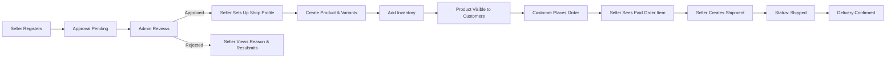

WHEN a seller's registration is approved by an administrator, THE SYSTEM SHALL grant the seller full access to product creation, inventory management, and order processing features.

WHEN a seller creates a shipment for selected order items, THE SYSTEM SHALL record the carrier name, tracking number, and creation time, and update all included order items to "shipped" status.

WHEN a seller adds inventory to a variant, THE SYSTEM SHALL create a positive inventory record with the specified quantity and reason, increasing the calculated current stock.

### Order Cancellation and Refund Journey

This end-to-end scenario describes the multi-step user journeys for post-purchase cancellation (before shipment) and refund (after delivery), which are the two primary dispute and reversal flows on the platform.

**Cancellation Journey (Pre-Shipment)**

After a customer places an order, if they wish to cancel an individual order item while it is still in "paid" status (not yet shipped), they submit a cancellation request with a required reason text. The seller of that item receives the request and can approve or reject it. When the seller responds, a cancellation request snapshot is created capturing the request's status and reason at that moment.

If the seller approves the cancellation, the item's status changes to "cancelled," a refund is processed for that item, and the item's stock is restored via a positive inventory record. The remaining items in the order continue processing normally. If all items in the order are cancelled, the overall order status becomes "cancelled."

If the seller rejects the cancellation, the item remains in "paid" status and processing continues as normal.

**Refund Journey (Post-Delivery)**

After an order item reaches "delivered" status, the customer has 7 days to submit a refund request with a required reason text. The seller reviews the request and can approve or reject it. When the seller responds, a refund request snapshot is created. If approved, the item's status changes to "refunded," and the stock is restored via a positive inventory record. If all items in the order are refunded, the overall order status becomes "refunded."

**Administrator Override**

In both scenarios, an administrator can force-cancel or force-refund individual order items without requiring seller approval, bypassing the normal request flow while still restoring stock and updating order item status accordingly.

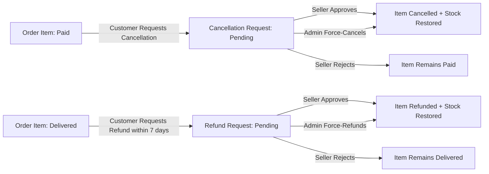

WHEN a customer submits a cancellation request for a paid order item, THE SYSTEM SHALL create a pending cancellation request associated with that order item and notify the seller.

WHEN a seller approves a cancellation request, THE SYSTEM SHALL update the order item status to "cancelled," process a refund for that item, and create a positive inventory record restoring the purchased quantity.

WHEN a seller approves a refund request, THE SYSTEM SHALL update the order item status to "refunded" and create a positive inventory record restoring the purchased quantity.

WHEN an administrator force-cancels or force-refunds an order item, THE SYSTEM SHALL update the item status, restore stock, and process the appropriate refund without requiring a seller response.

### Review and Feedback Journey

This end-to-end scenario describes the multi-step journey a customer takes to leave, edit, and manage a review for a purchased product after delivery, as well as how reviews affect the product's visibility and rating.

After an order item reaches "delivered" status, the customer becomes eligible to write a review for the associated product. The customer can submit one review per product per order. The review requires a rating from 1 to 5 stars and may optionally include text content. The review is immediately displayed on the product's detail page, sorted with the newest reviews first.

If the customer wishes to update their review, they can edit it — changing the rating or text content. Each edit automatically creates a review snapshot capturing the previous rating and text content before the change. The snapshot is immutable and preserved even if the review is later deleted.

If the customer chooses to delete their review, the review is removed from the product's detail page, but all snapshots remain preserved. The product's average rating is recalculated based only on non-deleted reviews.

If the customer who wrote the review later deletes their account, the review remains visible on the product page but is attributed to "deleted user" rather than the customer's display name.

Administrators can access review snapshots for dispute resolution purposes.

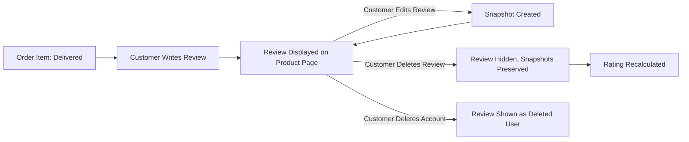

WHEN a customer submits a review for a delivered order item, THE SYSTEM SHALL display the review on the product's detail page and update the product's average rating.

WHEN a customer edits a review, THE SYSTEM SHALL create an immutable review snapshot capturing the previous rating and text content before saving the updated review.

WHEN a customer deletes a review, THE SYSTEM SHALL remove it from public display, preserve all associated snapshots, and recalculate the product's average rating from all remaining non-deleted reviews.

WHEN a customer deletes their account, THE SYSTEM SHALL display all of their previously written reviews as authored by "deleted user" rather than removing them.

### Administrator Oversight Journey

This end-to-end scenario describes the multi-step journeys that administrators undertake to manage the platform, covering seller approval, category management, product oversight, and user management.

**Seller Approval Flow**

When a seller registers, an administrator reviews the pending approval request. If the administrator approves, the seller gains full selling privileges. If the administrator rejects the request, they must provide a rejection reason, which the seller can view. The rejected seller may then submit a new registration request. Administrators can also suspend approved sellers — while suspended, the seller's products are hidden from search and category listings and cannot be purchased, though the seller can still process existing orders. Administrators can unsuspend a seller at any time, restoring product visibility.

**Category Management Flow**

Administrators create and maintain the product category hierarchy. They create top-level categories with a name and description, and optionally create subcategories under each top-level category (only one level of nesting is permitted). Administrators can edit category names and descriptions and delete categories. When a category is deleted, any products assigned to it become uncategorized.

**Product Oversight Flow**

Administrators can view all products across the platform and access snapshots for any product. If a product violates platform policies, an administrator can delete it — the deletion removes all its variants and inventory records, and the product no longer appears in search or category listings.

**Order Override Flow**

Administrators can view all orders on the platform. If intervention is required, an administrator can force-cancel or force-refund individual order items or entire orders, bypassing normal seller approval workflows. Stock is restored in all forced cancellation or refund actions.

**Admin Promotion Flow**

Any customer or seller can submit a request to become an administrator, providing a reason. Super administrators review pending requests and can approve or reject them. Approved requesters become regular administrators. Super administrators can promote regular administrators to super administrator status, or demote other super administrators to regular administrator status. A super administrator cannot demote themselves.

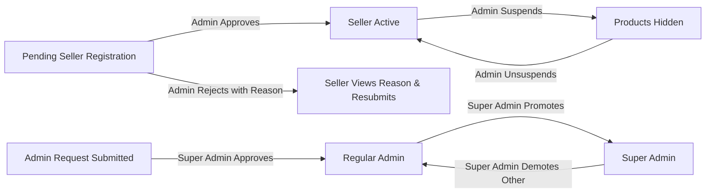

WHEN an administrator suspends a seller, THE SYSTEM SHALL hide all of that seller's products from search results and category listings and prevent new purchases of those products.

WHEN an administrator deletes a category, THE SYSTEM SHALL remove the category and mark all products previously assigned to it as uncategorized.

WHEN a super administrator approves an admin request, THE SYSTEM SHALL grant the requester regular administrator privileges.

WHEN a super administrator attempts to demote themselves, THE SYSTEM SHALL reject the action and preserve their super administrator status.

# External Integrations

Third-party API contracts, webhook handlers, and integration specifications.

## Integration Contracts

Define external API dependencies, authentication methods, request/response formats, and error handling for third-party integrations.

### Payment Gateway Integration

The platform integrates with an external third-party payment gateway to process customer payments at checkout. The system delegates all payment processing to this external service rather than handling payment data directly.

When a customer confirms and places an order, the system initiates a payment request to the external payment gateway on behalf of the customer. The payment gateway is responsible for processing the transaction and returning an outcome to the platform.

The system must be capable of receiving payment outcome notifications from the external payment gateway. These notifications inform the platform whether a payment transaction has succeeded or failed. When the gateway signals a successful payment, the platform proceeds to create the order. When the gateway signals a failed payment, the platform does not create an order and allows the customer to retry.

The platform treats the payment gateway as an external dependency. Payment processing logic, card data handling, and transaction security are the responsibility of the third-party payment gateway, not the platform itself.

If the payment gateway is unavailable or returns an error that is neither a clear success nor a clear failure, the platform must not create an order. The customer must be informed that the payment could not be processed and may attempt again.

### Payment Webhook and Outcome Handling

Because payment is processed by an external third-party gateway, the platform must handle asynchronous payment outcome notifications (webhooks) delivered by the gateway after a transaction is attempted.

When the external payment gateway sends a payment success notification, the platform performs the following in response:
- Decreases stock quantities for each purchased variant via negative inventory records
- Removes the purchased items from the customer's cart
- Creates an order record with all order items at status "paid"
- Saves snapshots of purchased products, variants, and seller profiles with each order item

When the external payment gateway sends a payment failure notification, the platform:
- Does not create an order record
- Does not modify stock quantities or cart contents
- Makes the checkout available again so the customer can retry payment

The platform must only act on payment outcome notifications that correspond to a recognized, in-progress checkout session for a valid customer. Outcome notifications that cannot be matched to an active checkout attempt must be ignored.

Each payment transaction initiated by the platform must be associated with a specific checkout session so that when the gateway's notification arrives, the platform can correctly identify which customer's cart and which items are involved.

The platform does not expose payment gateway credentials, transaction identifiers, or gateway-specific technical details to customers or sellers. These details remain internal to the platform's integration layer.

# File Storage

File upload capabilities, media processing, and storage requirements.

## File Upload and Management

Define file upload capabilities, supported formats, processing requirements, and access control for stored files.

### Product Image Upload

Sellers can upload multiple images for a product they own. Images are attached to a specific product and represent the visual media associated with that product listing.

Sellers can upload additional images to an existing product at any time, provided the product has not been deleted.

Each uploaded image is stored and associated with the product. The system assigns a display order to each image upon upload.

The first image in the display order serves as the main thumbnail image shown in product listings, search results, and category pages.

Sellers can reorder images by changing their display sequence. Reordering images updates which image is treated as the main thumbnail.

Sellers can delete individual images from their products. Deleting an image removes it from the product's image list and adjusts the remaining display order accordingly.

If a product is deleted, all images associated with that product are also deleted.

Only the seller who owns the product may upload, reorder, or delete images for that product. No other seller or customer may manage another seller's product images.

All image changes — uploads, reorders, and deletions — are captured in the product snapshot created at the time of the edit. This ensures the full image state of a product is preserved at every recorded point in time.

### Seller Logo Image Upload

Each seller profile includes a logo image that represents the seller's shop visually. Sellers can upload or replace their shop logo when editing their seller profile.

When a seller updates their logo, the previous logo is preserved as part of the seller profile snapshot created at the time of the edit. This ensures historical orders continue to reference the logo that was in use at the time of purchase.

The logo image attached to a seller profile is visible to customers when viewing the seller's public profile page.

Seller logo images are also captured in order item snapshots at the time a purchase is made, so the shop's branding at the time of the transaction is permanently recorded with each order item.

### Media Association and Access

All media files uploaded to the platform are associated with a specific business entity — either a product or a seller profile. Media files do not exist independently of their parent entity.

Product images are publicly visible to any user browsing the platform, including on product detail pages, search results, and category listings.

Seller logo images are publicly visible to customers viewing seller profiles and are referenced in order displays.

Media attached to deleted products is no longer publicly accessible through product listings, but the image references are preserved within product snapshots for historical record-keeping and dispute resolution purposes.

Media attached to deleted seller accounts is similarly preserved within seller profile snapshots and order item snapshots, ensuring that past order records retain accurate visual and identity information about the seller at the time of the transaction.

Only authenticated sellers may upload media to the platform. Customers and guests cannot upload any media files.

### Snapshot Attachment of Media

When a product snapshot is created — triggered by any edit to the product — the snapshot includes the full set of images associated with the product at that moment, in their current display order. This means the snapshot captures not just product data fields but also the complete image state.

When a seller profile snapshot is created — triggered by any edit to the seller profile — the snapshot includes the logo image URL in use at that time.

When an order item snapshot is created at the time of purchase, it references the seller profile snapshot that was active at that moment, which includes the logo image. This ensures that each order item carries a permanent record of the seller's visual identity at the time of sale.

Snapshots that include media references are immutable. Once a snapshot is created with a set of image references, those references cannot be modified or removed. This guarantees the integrity of historical records even if the original images are later changed or the product is deleted.