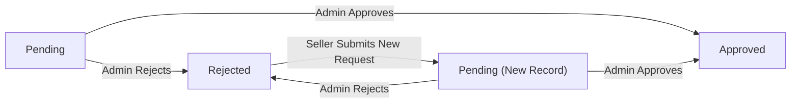
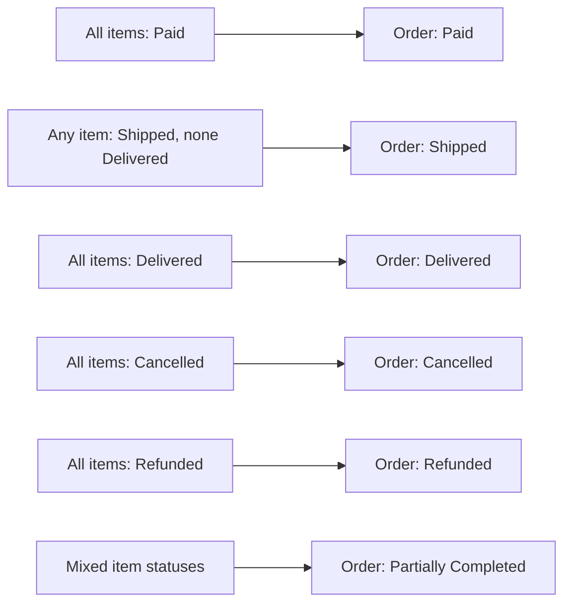

**shoppingMall — Business rules, validation constraints, data browsing expectations, error scenarios**

Business rules, validation constraints, data browsing expectations, error scenarios

# Domain Business Rules

Per-concept business rules, validation logic, and domain constraints.

## Customer Rules

Every customer account must be created with a unique email address; no two customers may share the same email. Both email and password are required at registration, and no guest browsing or unauthenticated access is permitted on this platform. A customer's display name and phone number are profile fields that can be edited at any time after account creation. When a customer deletes their account, their personal profile information is removed, but their orders, order history, and reviews are preserved for legal and seller record-keeping purposes. Reviews from a deleted customer account are shown as authored by a 'deleted user' rather than disappearing entirely. A customer cannot delete their account and simultaneously expect their purchase history to vanish, as those records serve seller and legal needs. Password changes require the customer to supply a new password, and the system replaces the stored credential accordingly. Each customer is uniquely identified by their email, which serves as the login credential and cannot be duplicated across accounts.

### Customer Registration Constraints

THE system SHALL require every customer account to be associated with a unique email address; no two customer accounts may share the same email address.

THE system SHALL require both an email address and a password to complete customer registration.

IF a registration request is submitted with an email address already in use by an existing customer account, THEN THE system SHALL reject the registration request.

IF a registration request is submitted without an email address, THEN THE system SHALL reject the registration request.

IF a registration request is submitted without a password, THEN THE system SHALL reject the registration request.

WHILE a customer is not authenticated, THE system SHALL deny access to all platform features, including product browsing, search, and any other functionality.

THE system SHALL not permit guest browsing or unauthenticated access to any part of the platform.

### Customer Profile Field Rules

THE system SHALL allow a customer to edit their display name at any time after account creation.

THE system SHALL allow a customer to edit their phone number at any time after account creation.

THE system SHALL treat the display name and phone number as mutable profile fields that do not affect the customer's authentication credentials.

IF a customer submits a profile update without a display name, THEN THE system SHALL reject the update, as display name is a required profile field.

IF a customer submits a profile update without a phone number, THEN THE system SHALL reject the update, as phone number is a required profile field.

### Customer Password Change Rules

THE system SHALL allow an authenticated customer to change their password.

WHEN a customer successfully submits a password change request, THE system SHALL replace the previously stored credential with the new password.

IF a password change request is submitted without a new password value, THEN THE system SHALL reject the request.

THE system SHALL treat a completed password change as the sole update to the authentication credential; the customer's email address and profile fields are unaffected by a password change.

### Customer Account Deletion Rules

WHEN a customer deletes their account, THE system SHALL permanently remove that customer's personal profile information, including their display name and phone number.

WHEN a customer deletes their account, THE system SHALL preserve all orders and order history associated with that customer, as these records serve seller record-keeping and legal purposes.

WHEN a customer deletes their account, THE system SHALL preserve all reviews authored by that customer rather than deleting them.

WHEN a customer's account has been deleted, THE system SHALL display that customer's preserved reviews as authored by a 'deleted user' label rather than showing the original customer identity.

IF a customer attempts to log in after their account has been deleted, THEN THE system SHALL deny access.

THE system SHALL not allow account deletion to remove or alter any order records, order item records, or associated snapshots that were created during the customer's active period.

## Seller Rules

Every seller account must be created with a unique email address and password. A seller account cannot be used to list or sell products until an administrator has approved the registration. Sellers can view their approval status, which is either pending, approved, or rejected. If a seller's registration is rejected, they can read the rejection reason and submit a new registration request. A seller's shop name, description, and logo collectively form their public-facing profile visible to customers. A seller may only delete their account if they have no order items in paid or shipped status and no pending cancellation or refund requests. When a seller deletes their account, all their active product listings are removed from the platform, but their shop name and order history snapshots are preserved in past orders for buyer and legal reference. A suspended seller's products are hidden from listings and cannot be purchased, but the seller may still process existing orders and respond to cancellation or refund requests. Suspended sellers cannot create new products or edit existing ones. Each seller is uniquely identified by their email address.

### Seller Registration Uniqueness and Approval Prerequisite

THE system SHALL require that every seller account is registered with a unique email address that is not already in use by any other seller or customer account on the platform.

IF a seller attempts to register with an email address already associated with an existing account, THEN THE system SHALL reject the registration request.

WHEN a seller completes registration, THE system SHALL assign the seller's approval status as pending, and the seller account SHALL NOT be permitted to list products, make products visible to customers, or process any selling activity until an administrator has approved the registration.

WHILE a seller's approval status is pending or rejected, THE system SHALL prevent that seller from creating new product listings or making any sales-related operations.

### Seller Approval Status Visibility and Rejection Handling

THE system SHALL allow a seller to view their current approval status at any time, which reflects one of the following states: pending, approved, or rejected.

WHEN a seller's registration is rejected by an administrator, THE system SHALL make the rejection reason provided by the administrator visible to that seller.

IF a seller's registration status is rejected, THEN THE system SHALL permit the seller to submit a new registration request.

WHEN a seller submits a new registration request after a prior rejection, THE system SHALL reset the approval status to pending and await a new administrator review.

IF a seller's approval status is pending or rejected, THEN THE system SHALL block that seller from performing any product listing or selling activities, as defined in the approval prerequisite rules (defined in Seller Registration Uniqueness and Approval Prerequisite).

### Seller Account Deletion Conditions

THE system SHALL block a seller from deleting their account if any of the following conditions exist: there are order items associated with their products that have a status of paid or shipped, or there are any pending (unresolved) cancellation requests or refund requests for their order items.

IF a seller attempts to delete their account while any order items for their products are in paid or shipped status, THEN THE system SHALL reject the deletion request.

IF a seller attempts to delete their account while any cancellation request or refund request for their order items is in pending status, THEN THE system SHALL reject the deletion request.

WHEN a seller account is successfully deleted, THE system SHALL remove all of that seller's active product listings from the platform so they no longer appear in search results, category pages, or any other product browsing surfaces.

WHEN a seller account is deleted, THE system SHALL preserve the seller's shop name and all order history snapshots that were captured at the time of purchase, so that past order records for customers and administrators remain accurate and intact.

THE system SHALL ensure that order item snapshots referencing a deleted seller's shop name continue to display the preserved shop name as it existed at the time of purchase.

### Suspended Seller Product and Activity Restrictions

WHEN an administrator suspends a seller account, THE system SHALL immediately hide all of that seller's products from search results, category listings, and any other product discovery surfaces visible to customers.

WHILE a seller account is suspended, THE system SHALL prevent customers from adding that seller's products to their cart or completing any purchase of those products.

WHILE a seller account is suspended, THE system SHALL prevent the seller from creating new products.

WHILE a seller account is suspended, THE system SHALL prevent the seller from editing any of their existing products.

WHILE a seller account is suspended, THE system SHALL allow the seller to continue processing their existing orders, including shipping order items that are in paid status, and responding to (approving or rejecting) any open cancellation requests or refund requests for their order items.

WHEN an administrator unsuspends a seller account, THE system SHALL restore visibility of that seller's active (non-deleted) products in search results and category listings, making them available for customers to browse and purchase again.

## Admin Rules

Administrators exist in two grades: regular administrator and super administrator. Super administrators have the authority to promote regular administrators to super administrator status and to demote other super administrators to regular administrator. A super administrator cannot demote themselves; self-demotion is explicitly prohibited. Regular administrators can approve or reject seller registrations and must provide a rejection reason when rejecting. Administrators can suspend and unsuspend seller accounts. Administrators can view all products, all orders, all customer accounts, and all seller accounts on the platform. Administrators can delete any product for policy violations. Administrators can ban and unban customers; banned customers cannot log in. Administrators can ban sellers; banned sellers cannot log in but their existing orders remain active. Super administrators are the only ones who can approve or reject requests to become an administrator.

### Administrator Grades

THE system SHALL recognize two administrator grades: regular administrator and super administrator.

THE system SHALL grant regular administrators the authority to approve or reject seller registrations, suspend and unsuspend seller accounts, ban and unban customer accounts, view all products on the platform, delete any product for policy violations, view all orders on the platform, view all customer accounts, and view all seller accounts.

THE system SHALL grant super administrators all permissions of regular administrators plus the additional authority to review administrator requests, promote regular administrators to super administrator, and demote other super administrators to regular administrator.

IF a user attempts to perform a super-administrator-only action while holding only a regular administrator grade, THEN THE system SHALL reject the action.

### Grade Promotion and Demotion Rules

WHEN a super administrator promotes a regular administrator, THE system SHALL change that administrator's grade to super administrator.

WHEN a super administrator demotes another super administrator, THE system SHALL change that administrator's grade to regular administrator.

IF a super administrator attempts to demote themselves, THEN THE system SHALL reject the action. Self-demotion is explicitly prohibited regardless of the number of other super administrators present.

IF a regular administrator attempts to change the grade of any administrator, THEN THE system SHALL reject the action. Only super administrators may change administrator grades.

IF a super administrator attempts to promote an administrator who is already a super administrator, THEN THE system SHALL reject the action.

IF a super administrator attempts to demote an administrator who is already a regular administrator, THEN THE system SHALL reject the action.

### Seller Suspension and Unsuspension Rules

WHEN an administrator suspends a seller account, THE system SHALL immediately hide all of that seller's products from search results and category listings.

WHILE a seller account is suspended, THE system SHALL prevent customers from purchasing any of that seller's products.

WHILE a seller account is suspended, THE system SHALL allow that seller to continue processing existing orders, including shipping items and responding to cancellation and refund requests.

WHILE a seller account is suspended, THE system SHALL prevent that seller from creating new products or editing existing products.

WHEN an administrator unsuspends a seller account, THE system SHALL restore all of that seller's non-deleted products to visibility in search results and category listings.

IF an administrator attempts to suspend a seller account that is already suspended, THEN THE system SHALL reject the action.

IF an administrator attempts to unsuspend a seller account that is not currently suspended, THEN THE system SHALL reject the action.

IF an administrator attempts to suspend a seller account that is currently banned, THEN THE system SHALL reject the action.

### Customer and Seller Banning Rules

WHEN an administrator bans a customer account, THE system SHALL prevent that customer from logging in.

WHILE a customer account is banned, IF that customer attempts to log in, THEN THE system SHALL reject the login attempt.

WHEN an administrator unbans a customer account, THE system SHALL restore that customer's ability to log in.

WHEN an administrator bans a seller account, THE system SHALL prevent that seller from logging in.

WHILE a seller account is banned, IF that seller attempts to log in, THEN THE system SHALL reject the login attempt.

WHILE a seller account is banned, THE system SHALL preserve all existing orders associated with that seller and allow those orders to continue to their natural conclusion.

WHEN an administrator unbans a seller account, THE system SHALL restore that seller's ability to log in.

IF an administrator attempts to ban a customer account that is already banned, THEN THE system SHALL reject the action.

IF an administrator attempts to unban a customer account that is not currently banned, THEN THE system SHALL reject the action.

IF an administrator attempts to ban a seller account that is already banned, THEN THE system SHALL reject the action.

IF an administrator attempts to unban a seller account that is not currently banned, THEN THE system SHALL reject the action.

### Product Deletion for Policy Violations

THE system SHALL allow any administrator (regular or super) to delete any product on the platform regardless of which seller owns it.

WHEN an administrator deletes a product for a policy violation, THE system SHALL treat it identically to a seller-initiated product deletion: removing the product from all listings, deleting all variants and inventory records, and removing the product from all customer wishlists.

WHEN an administrator deletes a product, THE system SHALL preserve all existing product snapshots associated with that product.

WHEN an administrator deletes a product, THE system SHALL preserve all order items and order item snapshots that reference that product.

IF an administrator attempts to delete a product that has already been deleted, THEN THE system SHALL reject the action.

IF an administrator attempts to delete a product that has pending order items with paid or shipped status, THEN THE system SHALL reject the action, consistent with the standard product deletion constraint (defined in Product Rules).

### Administrator Request Review by Super Administrators

THE system SHALL restrict the authority to approve or reject administrator requests exclusively to super administrators.

IF a regular administrator attempts to approve or reject an administrator request, THEN THE system SHALL reject the action.

WHEN a super administrator approves an administrator request, THE system SHALL grant the requester a regular administrator grade. The requester does not receive super administrator grade directly.

WHEN a super administrator rejects an administrator request, THE system SHALL record the rejection without requiring a rejection reason (the reason field is not mandated for administrator request rejections, unlike seller approval rejections).

IF a super administrator attempts to approve or reject an administrator request that is not in pending status, THEN THE system SHALL reject the action.

THE system SHALL allow super administrators to view the list of all pending administrator requests in order to perform reviews.

## AdminRequest Rules

Any registered user, whether a customer or a seller, may submit a request to become an administrator. The request must include a reason text explaining why the applicant wants to become an administrator. Each request has a status of pending, approved, or rejected, beginning as pending when submitted. Only super administrators can view pending requests and act on them by approving or rejecting. When approved, the requesting user becomes a regular administrator. The reason text is a required field and cannot be empty. Requests are immutable once submitted; the applicant cannot modify or withdraw the request after submission.

### AdminRequest Eligibility and Submission

THE system SHALL allow any registered user — whether a customer or a seller — to submit a request to become an administrator.

THE system SHALL require a reason text when a user submits an admin request.

IF a user submits an admin request without providing a reason text, THEN THE system SHALL reject the submission and notify the user that the reason is required.

IF a user submits an admin request with an empty or whitespace-only reason text, THEN THE system SHALL reject the submission.

WHEN an admin request is submitted successfully, THE system SHALL set its status to "pending".

WHEN an admin request is submitted successfully, THE system SHALL record the submission timestamp.

### AdminRequest Immutability After Submission

WHEN an admin request has been submitted, THE system SHALL treat it as immutable and disallow any modification to its reason text or any other field.

IF a user attempts to modify an already-submitted admin request, THEN THE system SHALL reject the modification.

IF a user attempts to withdraw or delete an already-submitted admin request, THEN THE system SHALL reject the withdrawal.

THE system SHALL preserve all submitted admin requests regardless of their status, including pending, approved, and rejected requests.

### AdminRequest Review by Super Administrator

WHILE an admin request has status "pending", THE system SHALL make it visible only to super administrators for review.

THE system SHALL allow only super administrators to approve or reject a pending admin request.

IF a regular administrator attempts to approve or reject an admin request, THEN THE system SHALL reject the action.

IF a customer or seller attempts to approve or reject an admin request, THEN THE system SHALL reject the action.

WHEN a super administrator approves an admin request, THE system SHALL change the request status from "pending" to "approved" and grant the requesting user the grade of regular administrator.

WHEN a super administrator rejects an admin request, THE system SHALL change the request status from "pending" to "rejected".

IF a super administrator attempts to act on an admin request that is not in "pending" status, THEN THE system SHALL reject the action, as a request can only be reviewed once.

WHEN an admin request is approved, THE system SHALL record the reviewing super administrator and the timestamp of the decision.

### AdminRequest Outcome: Granting Regular Admin Grade

WHEN an admin request is approved, THE system SHALL grant the requesting user the grade of regular administrator — not super administrator.

THE system SHALL not automatically elevate a newly approved administrator to super administrator grade; super administrator promotion is a separate action performed by an existing super administrator (defined in Admin Rules).

WHEN a user becomes a regular administrator via an approved admin request, THE system SHALL retain their original customer or seller account context for historical records.

## SellerApproval Rules

Every seller registration generates a seller approval record with an initial status of pending. The approval status can be pending, approved, or rejected. Administrators are responsible for reviewing pending approvals and setting them to approved or rejected. When rejecting, the administrator must supply a rejection reason, which the seller can then view. A seller whose approval is rejected may submit a new registration request, creating a fresh seller approval record. Only an approved seller can actively list and sell products on the platform. The rejection reason is a required field when the status is set to rejected and cannot be left blank. Sellers cannot sell while their approval status remains pending or rejected.

### Approval Status Lifecycle

WHEN a seller submits a registration, THE system SHALL create a seller approval record with an initial status of pending.

THE seller approval status SHALL be one of three values: pending, approved, or rejected.

WHILE a seller approval record exists, THE system SHALL prevent that seller from transitioning directly from rejected back to approved without submitting a new registration request.

WHEN an administrator reviews a pending seller approval, THE system SHALL allow the administrator to set the status to either approved or rejected.

IF a seller approval record does not exist for a seller, THEN THE system SHALL prevent that seller from listing or selling any products.

### Rejection Reason Requirements

WHEN an administrator sets a seller approval status to rejected, THE system SHALL require a rejection reason to be provided.

IF the rejection reason is blank or missing when the administrator attempts to reject a seller approval, THEN THE system SHALL reject the action and notify the administrator that a reason is required.

THE system SHALL make the rejection reason visible to the seller whose approval has been rejected.

WHILE a seller approval record has a status of rejected, THE system SHALL display the rejection reason to that seller.

THE rejection reason SHALL be recorded permanently on the seller approval record and cannot be altered after it is set.

### New Registration After Rejection

WHEN a seller's approval status is rejected, THE system SHALL allow that seller to submit a new registration request.

WHEN a rejected seller submits a new registration request, THE system SHALL create a fresh seller approval record with a status of pending.

IF a seller has a currently pending approval record, THEN THE system SHALL prevent that seller from submitting an additional registration request until the pending record is resolved.

THE system SHALL preserve all previous seller approval records, including rejected ones, when a new registration request is submitted.

WHEN a new seller approval record is created for a previously rejected seller, THE system SHALL treat it independently of any prior rejected records.

### Selling Eligibility Based on Approval Status

WHILE a seller's approval status is pending, THE system SHALL prevent that seller from creating new product listings or selling products.

WHILE a seller's approval status is rejected, THE system SHALL prevent that seller from creating new product listings or selling products.

IF a seller whose approval status is pending or rejected attempts to create a product, THE system SHALL reject the action.

IF a seller whose approval status is pending or rejected attempts to make their products available for purchase, THE system SHALL reject the action.

ONLY WHEN a seller's approval status is approved SHALL THE system permit that seller to create product listings, make products available in search and category listings, and receive orders.

WHEN a seller's approval status transitions from pending to approved, THE system SHALL immediately grant that seller full selling privileges on the platform.

## CustomerAddress Rules

A customer may maintain multiple shipping addresses on their account. Each address must include recipient name, phone number, street address, city, state or province, postal code, and country — all fields are required. Customers can edit any of their addresses at any time. Customers can delete addresses that are no longer needed. One address may be designated as the default shipping address, which is automatically pre-selected during checkout. Only one address can be the default at a time; designating a new default replaces the previous one. A customer's addresses are personal to that customer and not shared or visible to other parties.

### Multiple Address Ownership

THE system SHALL allow a customer to maintain multiple shipping addresses on their account simultaneously.

THE system SHALL associate every address with the customer who created it, keeping addresses private and inaccessible to other customers, sellers, or unauthenticated users.

WHEN a customer creates a new address, THE system SHALL add it to that customer's personal address list without removing or modifying any existing addresses.

IF a customer has no saved addresses, THE system SHALL allow checkout only after the customer creates at least one address.

### Required Address Fields

THE system SHALL require all of the following fields to be present and non-empty when creating or editing a shipping address:

- Recipient name
- Phone number
- Street address
- City
- State or province
- Postal code
- Country

IF any of the above fields is missing or empty, THEN THE system SHALL reject the request and indicate which fields are incomplete.

THE system SHALL NOT allow partial address records — an address is only saved when all required fields are provided.

### Default Shipping Address

THE system SHALL allow a customer to designate exactly one of their addresses as the default shipping address.

WHEN a customer designates an address as the default, THE system SHALL automatically remove the default designation from whichever address previously held it, so that only one address is the default at any given time.

WHEN a customer has a default address set, THE system SHALL pre-select that address during checkout.

IF a customer has only one address and no default is explicitly set, THE system SHALL treat that single address as the effective shipping address during checkout.

IF a customer deletes the address that is currently set as the default, THE system SHALL leave no default address set until the customer explicitly designates a new one.

### Editing and Deleting Addresses

THE system SHALL allow a customer to edit any of their saved addresses at any time, replacing the stored values for any or all of the required fields.

WHEN a customer edits an address, THE system SHALL validate that all required fields remain present and non-empty before saving the changes.

IF a required field is cleared during an edit, THEN THE system SHALL reject the update and preserve the previous address data.

THE system SHALL allow a customer to delete any of their addresses at any time.

WHEN a customer deletes an address that is currently designated as the default, THE system SHALL remove the default designation along with the address record, leaving no default address until the customer sets a new one.

THE system SHALL NOT prevent a customer from deleting an address solely because it was used in a past order — past orders store a snapshot of the shipping address at placement time and are unaffected by later deletions.

## Category Rules

Categories are used to organize products and are created and managed exclusively by administrators. Each category has a name and a description, both of which are required. Categories support one level of nesting: a category can have subcategories, but a subcategory cannot have further subcategories. Products can be assigned to a subcategory, which also places them within the parent category. When a category is deleted, products that were assigned to it become uncategorized rather than being deleted themselves. Customers can browse the full list of categories and view the products within any category. Category names should be unique to avoid confusion when browsing, though the system's primary management role lies with administrators.

### Category Administration and Field Validation

Only administrators (regular and super) can create, edit, or delete categories. No other actor, including sellers or customers, may modify the category structure.

When creating or editing a category, both the name and description are required. If either the name or the description is missing or empty, the request is rejected.

Category names should be unique across all categories at the same level (top-level categories must have unique names among top-level categories; subcategories must have unique names within their parent category) to avoid confusion when browsing. If a duplicate name is submitted at the same level, the request is rejected.

Administrators can edit the name or description of any existing category. Edits are applied immediately and reflected across all product listings that belong to the category.

### Category Nesting and Hierarchy Rules

The category system supports exactly one level of nesting: a top-level category may contain subcategories, but a subcategory may not contain further subcategories.

When creating a category, an administrator may optionally designate it as a subcategory of an existing top-level category. If an administrator attempts to create a subcategory under an existing subcategory, the request is rejected.

A top-level category and its subcategories are treated as a single group for browsing purposes. Products assigned to a subcategory are also considered to belong to the parent category when a customer browses the parent category.

A subcategory cannot be promoted to a top-level category, and a top-level category that already has subcategories cannot be converted into a subcategory of another category. If such a structural change is attempted, the request is rejected.

### Product Assignment to Categories

When creating or editing a product, the seller must select a category. The selected category can be either a top-level category or a subcategory.

If a seller selects a subcategory, the product appears under that subcategory and is also visible when a customer browses the parent category.

If a seller selects a top-level category that has subcategories, the product is associated with the top-level category directly (not any specific subcategory).

A product can only be assigned to one category at a time. Reassigning a product to a different category changes the category association immediately.

### Category Deletion Rules

Administrators can delete any category, including top-level categories and subcategories.

When a top-level category is deleted, all of its subcategories are also deleted as part of the same operation.

When a category (or subcategory) is deleted, products that were assigned to it are not deleted. Instead, those products become uncategorized. Uncategorized products remain visible in search results and on the platform, but they no longer appear under any category listing.

Administrators are responsible for reassigning or managing uncategorized products after a category deletion. The system does not automatically reassign products to another category.

Deleting a category is irreversible. Once deleted, a category cannot be restored. Administrators must create a new category if the same category is needed again.

### Customer Category Browsing Rules

Customers (registered users) can browse the full list of all active categories, including both top-level categories and their subcategories.

The category list displays all categories that have not been deleted. Deleted categories are not shown in any browsing view.

Customers can select any category or subcategory to view the products assigned to it. When a customer browses a top-level category, the product listing includes products assigned directly to that category as well as products assigned to any of its subcategories.

When a customer browses a subcategory, only products assigned specifically to that subcategory are shown.

Products that are deleted or marked as invisible (e.g., from suspended sellers) are excluded from category browsing results, even if they are still associated with the category in the system.

Uncategorized products (those whose category was deleted) do not appear in any category browsing view but may still appear in search results.

## Product Rules

Each product must have a name, description, category, and base price — all four fields are required. A product belongs to the seller who created it, and only that seller can edit or delete it. Every edit to a product creates a snapshot preserving the previous state. A seller can delete their product only if no order items for any of its variants are in paid or shipped status, and there are no pending cancellation or refund requests for any of its variants. Deleting a product also removes all its variants and inventory records from active listings. Deleted products no longer appear in search results or category listings. A product must have at least one variant to be purchasable; products with no variants are visible in search but shown as unavailable. Sellers can select a subcategory when assigning a category. Administrators may delete any product on the platform for policy violations regardless of seller ownership.

### Product Required Fields

THE system SHALL require a name, description, category assignment, and base price when a seller creates a product.

IF any of the four required fields (name, description, category, or base price) is missing when a product is submitted for creation, THEN THE system SHALL reject the creation request and indicate which fields are missing.

IF the selected category does not exist or has been deleted, THEN THE system SHALL reject the product creation request.

IF the base price is not a positive value, THEN THE system SHALL reject the product creation request.

THE system SHALL allow a seller to assign a product to either a top-level category or a subcategory, but not to a category that itself has subcategories if that category also serves as a parent (i.e., assignment must be to the deepest available level when subcategories exist).

WHEN a seller assigns a product to a subcategory, THE system SHALL associate the product with that subcategory and its parent category for browsing purposes.

### Product Ownership and Edit Authorization

THE system SHALL associate every product with the seller who created it as the product owner.

WHILE a product belongs to a specific seller, THE system SHALL permit only that seller to edit the product's name, description, category, base price, or images.

IF a seller attempts to edit a product that belongs to a different seller, THEN THE system SHALL reject the request.

IF a seller attempts to delete a product that belongs to a different seller, THEN THE system SHALL reject the request.

IF a seller's account is suspended by an administrator, THEN THE system SHALL prevent that seller from editing any of their products or creating new products, even though the products remain in the system.

### Product Snapshot on Edit

WHEN a seller successfully edits any product field (name, description, category, base price, or images), THE system SHALL automatically create a product snapshot preserving the complete state of the product before the change was applied.

THE system SHALL include all product fields — name, description, category, base price, and all associated images — in every product snapshot.

THE system SHALL include snapshots of all current variants (as product snapshot SKUs) within the same product snapshot at the moment of the edit.

THE system SHALL treat every product snapshot as immutable; no party may modify or delete a snapshot after it is created.

WHEN a product is deleted, THE system SHALL preserve all previously created snapshots of that product.

THE system SHALL make snapshots of a product viewable by the owning seller and by administrators.

### Product Deletion Preconditions

IF any variant of a product has one or more order items in "paid" or "shipped" status, THEN THE system SHALL block the seller from deleting that product.

IF any variant of a product has a cancellation request or refund request that is currently in "pending" status, THEN THE system SHALL block the seller from deleting that product.

THE system SHALL evaluate all variants of the product collectively when determining whether deletion is blocked; a single blocked variant is sufficient to prevent deletion of the entire product.

WHEN all blocking conditions are resolved (no pending order items in paid or shipped status, and no pending cancellation or refund requests), THE system SHALL permit the owning seller to delete the product.

### Effects of Product Deletion

WHEN a seller successfully deletes a product, THE system SHALL mark the product as deleted and simultaneously remove all of its variants from active listings.

WHEN a product is deleted, THE system SHALL also remove all inventory records associated with its variants from active tracking (variants and their inventory records are no longer in use, though history is preserved per data retention policy).

WHEN a product is deleted, THE system SHALL immediately exclude it from all search results so that customers can no longer find it by searching.

WHEN a product is deleted, THE system SHALL immediately remove it from all category listings so that customers browsing categories can no longer encounter the product.

WHEN a product is deleted, THE system SHALL automatically remove it from any customer's wishlist where it was saved.

IF a deleted product's variant is in a customer's cart, THEN THE system SHALL mark that cart item as unavailable rather than removing it silently, so the customer is informed upon viewing their cart.

### Product Variant Availability Rules

THE system SHALL require a product to have at least one active (non-deleted) variant before it can be added to a customer's cart or purchased.

IF a product has no active variants, THEN THE system SHALL still display the product in search results and category listings, but SHALL mark it as "unavailable" so customers are aware it cannot be purchased.

IF all variants of a product have zero stock, THEN THE system SHALL still display the product, with each variant individually marked as "out of stock".

IF a specific variant's stock quantity reaches zero, THEN THE system SHALL prevent customers from adding that variant to their cart.

IF a variant is deleted but the product retains other active variants, THEN THE system SHALL continue to display and allow purchase of the remaining active variants.

THE system SHALL derive a product's purchasability solely from the availability of its active variants and their stock levels; a product is only purchasable when at least one active variant has stock greater than zero.

### Administrator Product Deletion

THE system SHALL permit administrators to delete any product on the platform regardless of which seller owns the product.

WHEN an administrator deletes a product, THE system SHALL apply the same deletion effects as seller deletion: the product is removed from search results and category listings, all its variants are removed from active listings, and it is removed from customer wishlists.

THE system SHALL NOT require administrators to satisfy the seller deletion preconditions (pending order items or pending requests) when performing a policy-based deletion; administrators can delete a product at any time for policy violations.

WHEN an administrator deletes a product, THE system SHALL preserve all existing snapshots and order history associated with that product in accordance with the platform's data retention policy.

THE system SHALL make the deletion action by an administrator distinguishable from a seller-initiated deletion for audit and dispute resolution purposes.

## ProductImage Rules

A product can have multiple images uploaded by the seller. Each image is associated with a display order that determines its position in the product gallery. The first image in the display order is treated as the main or thumbnail image shown in product listings. Sellers can reorder images, changing which image appears first and acts as the thumbnail. Sellers can delete individual images from their product. Any change to product images, including additions, reordering, or deletions, is captured in the next product snapshot when the product is saved. Image changes are therefore part of the product snapshot and are preserved in the product's version history.

### Multiple Images and Display Order

A product can have multiple images associated with it. Each image is assigned a display order value that determines its position within the product's image gallery.

THE system SHALL allow a product to have multiple images uploaded by the owning seller.

THE system SHALL assign a distinct display order to each image within a product, such that no two images for the same product share the same position.

WHEN images are listed for a product, THE system SHALL present them in ascending display order, from the lowest position to the highest.

THE system SHALL designate the image with the lowest display order (first position) as the main image, which serves as the thumbnail shown in product listings, search results, and category pages.

WHEN a product has no images, THE system SHALL display the product without a thumbnail image in listings.

### Reordering and Deleting Product Images

Sellers may rearrange the sequence of their product images at any time, which determines which image becomes the main thumbnail.

WHEN a seller reorders images for their product, THE system SHALL update the display order of all affected images to reflect the new sequence.

WHEN images are reordered, THE system SHALL immediately treat the image now occupying the first position as the main thumbnail.

THE system SHALL allow a seller to delete any individual image from their product.

WHEN a seller deletes an image, THE system SHALL remove that image from the product's gallery and adjust the remaining images' display order to remain continuous and without gaps.

WHEN the deleted image was the first image (main thumbnail), THE system SHALL promote the next image in display order to serve as the new main thumbnail.

IF a seller attempts to delete or reorder images on a product they do not own, THEN THE system SHALL reject the request.

### Image Changes and Snapshot Inclusion

All changes to a product's images — whether additions, reordering, or deletions — are treated as modifications to the product and are therefore captured in product snapshots.

WHEN a product is edited and a snapshot is created, THE system SHALL include the complete set of product images and their display order at that moment in the snapshot.

THE system SHALL preserve image state through product snapshots, so that the exact image configuration (including which images were present and in what order) at any prior point in time can be retrieved.

THE system SHALL ensure that product snapshots containing image records are immutable; no retroactive modification or deletion of image history captured in a snapshot is permitted.

WHEN a product is deleted, THE system SHALL preserve all previously created product snapshots, including their image records, for historical reference.

Sellers and administrators SHALL be able to view product snapshots — including the image configurations captured within them — for dispute resolution and audit purposes, as defined in the snapshot visibility rules.

## ProductVariant Rules

Each product variant represents a specific combination of option values such as color and size. Every variant must have a unique SKU code that identifies it across the platform. Option values describe the specific attributes of the variant, for example color 'Red' and size 'Large'. A variant may optionally override the product's base price with its own price; if no price override is set, the base price applies. Each variant has a stock quantity, which starts at zero and is managed through inventory records. Sellers can add, edit, or delete variants of their own products. Every edit to a variant creates a snapshot preserving the previous state. A seller can delete a variant only if no order items for that variant are in paid or shipped status and there are no pending cancellation or refund requests. At least one variant is required for a product to be purchasable; a product without variants is shown as unavailable. When stock reaches zero, the variant is shown as out of stock and cannot be added to the cart.

### SKU Code Uniqueness and Option Value Constraints

THE system SHALL require a SKU code for every product variant.

THE system SHALL enforce that every SKU code is unique across all product variants on the platform, regardless of which seller or product the variant belongs to.

IF a seller attempts to create or edit a variant with a SKU code that already exists on another variant, THEN THE system SHALL reject the request and indicate that the SKU code is already in use.

IF a seller attempts to create or edit a variant with an empty or missing SKU code, THEN THE system SHALL reject the request.

THE system SHALL require that each variant carries at least one option value describing its specific attributes, such as color or size.

THE system SHALL allow a product to have multiple variants, each representing a distinct combination of option values (for example, "Red / Large" and "Blue / Small" are separate variants).

IF two variants of the same product have identical option value combinations, THEN THE system SHALL reject the duplicate variant creation or edit.

### Variant Price Override Rules

THE system SHALL allow each variant to optionally specify a price that overrides the product's base price.

WHEN a variant has no price override set, THE system SHALL apply the product's base price as the effective price for that variant.

WHEN a variant has a price override set, THE system SHALL use the variant's own price as the effective price, disregarding the product's base price for that variant.

IF a seller edits a variant's price override, THEN THE system SHALL create a snapshot capturing the previous state before the change takes effect (defined in the Variant Edit and Snapshot Rules section).

THE system SHALL display the applicable price for each variant clearly to customers on the product detail page, reflecting either the price override or the base price as appropriate.

### Variant Stock Initialization and Out-of-Stock Rules

THE system SHALL initialize every newly created product variant with a stock quantity of zero.

WHEN the calculated stock quantity of a variant reaches zero (by summing all inventory records), THE system SHALL mark that variant as out of stock.

WHILE a variant is out of stock, THE system SHALL display it with an out-of-stock indicator on the product detail page.

WHILE a variant is out of stock, THE system SHALL prevent customers from adding it to their cart.

IF a customer attempts to add an out-of-stock variant to the cart, THEN THE system SHALL reject the action and inform the customer that the variant is unavailable due to insufficient stock.

WHEN stock is restored for a previously out-of-stock variant (via a positive inventory record), THE system SHALL make that variant available for purchase again once the stock quantity exceeds zero.

### Variant Edit and Snapshot Rules

WHEN a seller edits any field of a product variant — including the SKU code, option values, or price override — THE system SHALL create a snapshot of the variant's state before the edit is applied.

THE system SHALL record the timestamp of when each variant snapshot was created.

THE system SHALL preserve all variant snapshots permanently; snapshots cannot be deleted or modified after creation.

THE system SHALL link each variant snapshot to the parent product snapshot created at the same time, ensuring the complete product state is captured together (as defined in the ProductSnapshot Rules and ProductSnapshotSKU Rules sibling sections).

### Variant Deletion Constraints

IF a seller attempts to delete a product variant that has one or more order items in "paid" or "shipped" status, THEN THE system SHALL reject the deletion request.

IF a seller attempts to delete a product variant that has one or more pending cancellation requests (status "pending"), THEN THE system SHALL reject the deletion request.

IF a seller attempts to delete a product variant that has one or more pending refund requests (status "pending"), THEN THE system SHALL reject the deletion request.

WHEN a variant is successfully deleted, THE system SHALL mark that variant as deleted and remove it from all product listings, search results, and the cart for any customer who had it queued.

WHEN a variant is deleted, THE system SHALL mark it as unavailable in any existing customer cart that contains it, as defined in the CartItem Rules sibling section.

THE system SHALL preserve all snapshots and order-related records for deleted variants; deletion of the variant does not affect historical records.

### Minimum Variant Requirement for Purchasability

THE system SHALL require that a product has at least one active (non-deleted) variant before it can be purchased by customers.

WHILE a product has no active variants, THE system SHALL display the product in search and category listings as "unavailable".

WHILE a product has no active variants, THE system SHALL prevent customers from adding any item from that product to their cart.

IF the last remaining active variant of a product is deleted, THEN THE system SHALL automatically mark that product as unavailable until a new variant is added.

WHEN a seller adds a valid variant to a previously unavailable product, THE system SHALL restore the product's purchasable status.

## ProductSnapshot Rules

A product snapshot is created every time a product's editable fields are modified. The snapshot includes all product fields: name, description, category, base price, and images. Each snapshot also contains snapshots of all variants at that point in time, forming a complete picture of the product and its variants. Snapshots are immutable and cannot be deleted, even after the product itself is deleted. Sellers can view snapshots of their own products. Administrators can view snapshots of any product on the platform. The snapshot record captures when the change was made and the values of all fields at that moment. Snapshots are preserved indefinitely to support dispute resolution and historical reference.

### Snapshot Trigger and Scope

WHEN a seller edits any editable field of a product, THE system SHALL create a new product snapshot capturing the complete state of the product at that moment.

THE system SHALL include all product fields in the snapshot: name, description, category, base price, and the full list of product images with their display order.

THE system SHALL include snapshots of all variants belonging to the product at the time of the edit, such that each variant snapshot captures its SKU code, option values, and price at that moment. These variant snapshots are stored as part of the parent product snapshot (defined as product-snapshot → product-snapshot-SKU).

WHEN a product image is added, removed, or reordered, THE system SHALL treat the change as a product edit and create a new snapshot that reflects the updated image list and order.

THE system SHALL record the exact timestamp of when the snapshot was created, preserving a chronological history of all changes made to the product.

### Snapshot Immutability and Preservation

THE system SHALL treat every product snapshot as immutable once it is created; no field within a snapshot may be modified after creation.

THE system SHALL NOT permit any actor, including sellers, administrators, or super administrators, to delete a product snapshot.

WHEN a product is deleted by its owning seller or by an administrator, THE system SHALL preserve all snapshots associated with that product; product deletion does not remove snapshot records.

WHEN all variants of a product are deleted, THE system SHALL preserve any snapshot that included those variants; the snapshot records remain intact and accessible.

THE system SHALL retain product snapshots indefinitely regardless of the current state of the product, its variants, or the seller's account.

### Snapshot Access Rules

WHILE a seller is viewing their own product, THE system SHALL allow that seller to view all snapshots associated with that product.

IF a seller attempts to view snapshots for a product that does not belong to them, THEN THE system SHALL reject the request.

THE system SHALL allow administrators to view snapshots of any product on the platform, regardless of which seller owns or owned the product.

WHEN a product has been deleted, THE system SHALL still permit the owning seller and administrators to access its historical snapshots.

THE system SHALL make snapshot records available to relevant parties (the owning seller and administrators) for the purpose of dispute resolution regarding product content, pricing, or variant information at a given point in time.

### Snapshot Content Completeness and Integrity

THE system SHALL ensure that each product snapshot is a self-contained record; it must include all product fields and all variant snapshots as they existed at the moment of the edit, without relying on the current state of the product or variants.

IF a variant existed at the time of a product edit, THE system SHALL include a snapshot of that variant within the product snapshot, even if the variant is subsequently deleted.

THE system SHALL NOT create a partial product snapshot; a snapshot that omits any product field or any existing variant is invalid and must not be stored.

THE system SHALL associate each product snapshot with the product it belongs to, so that the full history of changes is navigable in chronological order.

THE system SHALL use product snapshots as the authoritative record of the product's state at any given past point in time, supporting dispute resolution when buyers, sellers, or administrators need to verify what a product or variant looked like at the time of a transaction.

## ProductSnapshotSKU Rules

A product snapshot SKU record captures the state of a single product variant at the time a product snapshot is created. It is always created as part of a parent product snapshot and cannot exist independently. Each record preserves the SKU code, option values, and the price applicable at the snapshot moment. This record is immutable once created and cannot be modified or deleted. The product snapshot SKU exists to ensure that the complete variant configuration at any historical point can be reconstructed for dispute resolution or audit purposes. Every product snapshot must include a product snapshot SKU entry for every variant that existed at the time of the snapshot.

### Relationship to Parent Product Snapshot

A product snapshot SKU record must always belong to a parent product snapshot. It cannot exist as a standalone record and cannot be created independently of a product snapshot. When a product snapshot is created (as defined in the ProductSnapshot Rules), the system simultaneously creates a product snapshot SKU record for every variant that existed on the product at that moment. If a product snapshot is never created, no product snapshot SKU records are produced. The product snapshot SKU record's existence is entirely contingent on its parent product snapshot — if the parent were hypothetically absent, the SKU record would have no valid context. Because product snapshots are immutable and preserved after product deletion, all associated product snapshot SKU records are equally preserved for the lifetime of the parent snapshot.

### Captured Fields at Snapshot Time

Each product snapshot SKU record preserves the following information as it existed at the exact moment the parent product snapshot was created:

- **SKU code**: The unique identifier assigned to the variant at the time of the snapshot. This may differ from the variant's current SKU code if the seller subsequently edited it.
- **Option values**: The full set of option attributes describing the variant (for example, color and size) as they were defined at the time of the snapshot. Any later changes to option values on the live variant are not reflected in the snapshot.
- **Variant price**: The price applicable to that variant at the time of the snapshot. If the variant had a price override relative to the product base price, that override value is what is recorded. If no override existed at that moment, the base price applicable at that time is recorded.

No other fields from the live variant are added to the snapshot SKU record beyond these three. The intent is to preserve precisely the information needed to reconstruct what a customer would have seen and agreed to at any historical point in time.

### Complete Coverage Requirement

Every variant that existed on the product at the moment a product snapshot is triggered must have a corresponding product snapshot SKU record in that snapshot. The system must not omit any variant, whether the variant had stock or not, whether it was recently added or long-standing. A product snapshot is considered incomplete if any variant present at the time of snapshotting is missing a corresponding SKU record. This complete coverage requirement ensures that the full configuration of the product — including all purchasable and non-purchasable variants — can be reconstructed from any historical snapshot without relying on current live data.

### Immutability of Product Snapshot SKU Records

Once a product snapshot SKU record is created, it is permanently immutable. No field within the record — SKU code, option values, or variant price — may be modified after creation. The record cannot be deleted by any actor, including sellers, administrators, or super administrators. This immutability is what makes the record trustworthy as a historical reference. Any change to a variant after a snapshot is taken produces a new product snapshot (and new product snapshot SKU records) rather than altering existing ones. The immutability rule applies equally even when the parent product or variant is subsequently edited or deleted.

### Support for Historical Variant Reconstruction

The primary business purpose of the product snapshot SKU record is to enable the reconstruction of a variant's complete configuration at any past point in time. This supports several critical business scenarios:

- **Dispute resolution**: When a customer disputes the price or options of an item they purchased, the product snapshot SKU record linked through the order item snapshot provides the authoritative record of what was offered and agreed upon at the time of purchase.
- **Audit by administrators**: Administrators reviewing product history can compare successive product snapshots, and their corresponding SKU records, to trace exactly when and how variants were changed.
- **Seller review**: Sellers can examine their own product snapshots to understand the historical configuration of any variant, including variants that have since been edited or deleted.

Because the product snapshot SKU is linked to the parent product snapshot — which is in turn linked through the order item snapshot to specific purchases — the chain of records from a purchase back to the exact variant state at purchase time is fully traceable without relying on any mutable live data.

## SellerProfileSnapshot Rules

A seller profile snapshot is created every time a seller edits their shop name, description, or logo image. The snapshot captures the shop name, shop description, and logo image URL at the time of the change. A snapshot of the seller's profile is also saved with each order item at the time of purchase, preserving the seller's identity as presented to the buyer. These snapshots are immutable and cannot be modified or deleted. They serve as the historical record of how a seller presented themselves to buyers and are used in order records to show the shop name and logo that were active at the time of purchase. Even if a seller deletes their account, the profile snapshots stored with past orders remain intact.

### Snapshot Creation on Every Profile Edit

WHEN a seller edits their shop name, shop description, or logo image, THE system SHALL create a new seller profile snapshot capturing the values of all three fields — shop name, shop description, and logo image — as they exist at the moment the edit is saved.

THE system SHALL record the exact shop name in the snapshot at the time the edit is committed, preserving the text as presented to buyers before the change takes effect.

THE system SHALL record the exact shop description in the snapshot at the time the edit is committed, preserving the full description text as it appeared prior to the update.

THE system SHALL record the logo image in the snapshot at the time the edit is committed, storing the image reference as it appeared to buyers before the change.

WHEN any single field in the seller's profile is changed, THE system SHALL include all three fields (shop name, shop description, and logo image) in the resulting snapshot, regardless of which specific field was modified.

THE system SHALL associate each seller profile snapshot with the seller whose profile was changed, so that the full edit history of any seller's profile can be reconstructed from their snapshots in chronological order.

### Seller Profile Snapshot Saved with Order Items at Purchase

WHEN an order is successfully placed, THE system SHALL save a seller profile snapshot alongside each order item at the moment of purchase, capturing the shop name and logo image that were active at the time the order was created.

THE system SHALL use the most recent seller profile snapshot at the time of purchase as the reference for each order item, so that the seller identity recorded in the order accurately reflects how the seller presented themselves to the buyer at that moment.

IF a seller edits their profile after an order is placed, THEN THE system SHALL NOT update the seller profile snapshot already stored with existing order items; previously recorded snapshots remain unchanged.

THE system SHALL make the shop name captured in the order item's seller profile snapshot visible to customers viewing their order history, so buyers can identify which seller fulfilled each item as it appeared at the time of purchase.

THE system SHALL make the logo image captured in the order item's seller profile snapshot visible alongside order records, preserving the visual identity of the seller as presented at purchase time.

### Immutability, Non-Deletion, and Preservation After Account Deletion

THE system SHALL treat all seller profile snapshots as immutable records; once created, no field within a snapshot may be modified by any actor, including the seller, administrators, or super administrators.

THE system SHALL NOT allow seller profile snapshots to be deleted by any actor under any circumstances, including account deletion, administrative action, or system cleanup processes.

WHEN a seller deletes their account, THE system SHALL preserve all seller profile snapshots associated with that seller, ensuring historical records remain intact.

WHEN a seller account is deleted, THE system SHALL continue to display the shop name and logo image from the preserved seller profile snapshots in all past order records that reference them, so that order history remains accurate and complete for both customers and administrators.

THE system SHALL use the shop name stored in the seller profile snapshot — not the seller's current profile — when displaying past order item details, ensuring that historical shop identity is shown even if the seller has subsequently changed their shop name or deleted their account.

IF a seller's account is deleted, THEN THE system SHALL still surface the preserved shop name from past order snapshots in customer order history and administrator order oversight views, maintaining a consistent and traceable record of the seller's identity at the time of each transaction.

## InventoryRecord Rules

Each product variant's stock level is tracked through a series of inventory records rather than a single mutable quantity field. Each inventory record contains a quantity change, which is positive for restocking and negative for orders or adjustments, a reason describing why the change occurred, and a timestamp. The current stock level of a variant is calculated by summing all inventory records for that variant. Sellers can create positive inventory records to restock a variant, providing a quantity and a reason. Sellers can create negative inventory records to record adjustments or losses, also providing a quantity and a reason. When an order is placed, the system automatically creates a negative inventory record for the purchased quantity. When an order item is cancelled or refunded, the system automatically creates a positive inventory record restoring the stock. Inventory records are immutable once created and cannot be edited or deleted. The reason field is required for every inventory record.

### Stock Level Calculation

THE system SHALL calculate the current stock level of each product variant by summing all inventory records associated with that variant.

THE system SHALL treat inventory records with a positive quantity change as increases to the stock level (restocking).

THE system SHALL treat inventory records with a negative quantity change as decreases to the stock level (order fulfillment, manual adjustments, or recorded losses).

WHEN the sum of all inventory records for a variant equals zero, THE system SHALL display that variant as "out of stock".

WHILE a variant's calculated stock level is zero or less, THE system SHALL prevent customers from adding that variant to their cart.

THE system SHALL reflect updated stock levels immediately after any new inventory record is created.

### Inventory Record Required Fields and Types

THE system SHALL require a quantity change value for every inventory record. The quantity change must be a non-zero number.

THE system SHALL require a reason for every inventory record, regardless of whether the record was created manually by a seller or automatically by the system.

IF a seller attempts to create an inventory record without providing a reason, THEN THE system SHALL reject the request.

IF a seller attempts to create an inventory record with a quantity change of zero, THEN THE system SHALL reject the request.

THE system SHALL record the timestamp at which each inventory record was created.

THE system SHALL associate every inventory record with the specific product variant whose stock it affects.

### Seller-Initiated Inventory Records

Sellers may create two types of inventory records manually: restock records and adjustment records.

THE system SHALL allow a seller to create a positive inventory record (restock) for any of their own product variants, specifying a positive quantity and a reason describing the restock event.

THE system SHALL allow a seller to create a negative inventory record (adjustment or loss) for any of their own product variants, specifying a negative quantity and a reason describing why the stock is being reduced.

IF a seller attempts to create an inventory record for a variant that does not belong to their products, THEN THE system SHALL reject the request.

IF a seller attempts to create a restock or adjustment inventory record without specifying a reason, THEN THE system SHALL reject the request.

IF a seller attempts to create a negative adjustment that would bring the calculated stock level below zero, THEN THE system SHALL reject the request.

### System-Generated Inventory Records

WHEN a customer successfully places an order, THE system SHALL automatically create a negative inventory record for each purchased variant, reflecting the quantity purchased. The reason for this record SHALL indicate that it was generated by an order placement.

WHEN a cancellation request for an order item is approved, THE system SHALL automatically create a positive inventory record for the cancelled variant, restoring the quantity that was originally deducted at order placement. The reason SHALL indicate that it was generated by an approved cancellation.

WHEN a refund request for an order item is approved, THE system SHALL automatically create a positive inventory record for the refunded variant, restoring the quantity that was originally deducted at order placement. The reason SHALL indicate that it was generated by an approved refund.

WHEN an administrator force-cancels or force-refunds an order item, THE system SHALL automatically create a positive inventory record for the affected variant, restoring the appropriate stock quantity. The reason SHALL indicate that it was generated by an administrative action.

THE system SHALL not allow any external actor to override or suppress system-generated inventory records.

### Immutability of Inventory Records

THE system SHALL treat all inventory records as immutable once they have been created.

IF a seller attempts to edit an existing inventory record, THEN THE system SHALL reject the request.

IF a seller attempts to delete an existing inventory record, THEN THE system SHALL reject the request.

IF an administrator attempts to edit or delete an existing inventory record, THEN THE system SHALL reject the request.

THE system SHALL preserve all inventory records indefinitely, including records associated with deleted products and variants. Historical inventory records remain available for audit and stock reconciliation purposes.

THE system SHALL not remove inventory records when a product or variant is deleted; the records are retained as part of the historical record.

## WishlistItem Rules

A wishlist item represents a customer's interest in a product, not a specific variant. Each customer can add a product to their wishlist once; the same product cannot appear more than once in the same customer's wishlist. If a product is deleted by the seller or an administrator, it is automatically removed from all customers' wishlists. Customers can remove items from their wishlist at any time. The wishlist is personal to each customer and is not visible to other users.

### Wishlist Item Scope and Uniqueness

A wishlist item represents a customer's interest in a product as a whole, not in any specific variant of that product. Customers add products to their wishlist without selecting a particular size, color, or other option combination.

Each product can appear only once in a given customer's wishlist. If a customer attempts to add a product that is already present in their wishlist, the request is rejected. The system must enforce this uniqueness constraint per customer, meaning the same product may appear in different customers' wishlists without restriction.

There is no limit defined on the total number of products a customer may add to their wishlist.

### Automatic Removal on Product Deletion

When a product is deleted — whether by the owning seller or by an administrator — the system automatically removes that product from every customer's wishlist. This removal happens at the time of product deletion and requires no action from the customer.

Customers are not notified of the automatic removal; the product simply no longer appears in their wishlist. No error is returned to the customer for the missing item because it has been silently cleaned up. This rule ensures that wishlists do not contain references to products that no longer exist on the platform.

### Customer Removal of Wishlist Items

Customers can remove any product from their own wishlist at any time, regardless of that product's current availability or stock status. Removal is immediate and permanent; once removed, the product is no longer in the customer's wishlist.

If a customer attempts to remove a product that is not currently in their wishlist, the request is rejected. Customers can only remove items from their own wishlist; they cannot remove items from another customer's wishlist.

### Wishlist Privacy and Visibility

A customer's wishlist is strictly personal. Only the owning customer can view or modify the contents of their wishlist. No other user — including other customers, sellers, or administrators — can view a customer's wishlist.

Sellers and administrators have no access to individual wishlist data. The wishlist is not shared, exported, or made publicly visible under any circumstances.

## CartItem Rules

A cart item represents a customer's intent to purchase a specific product variant at a specified quantity. Customers must select a specific variant when adding to the cart; adding just a product without a variant is not allowed. If the same variant is added to the cart again, the quantities are combined into a single cart item rather than creating a duplicate entry. The quantity of a cart item must be at least one. If a variant's current stock is less than the cart item quantity, a warning is shown but the item remains in the cart. If a variant is deleted or its stock reaches zero, the cart item is marked as unavailable. Unavailable cart items cannot be included in a checkout. Customers can change the quantity of any cart item or remove items entirely.

### Variant Selection Requirement

A customer must select a specific product variant when adding an item to the cart. Adding a product to the cart without choosing a variant is not permitted. Each cart item is therefore always associated with exactly one variant, not just a product. If a customer attempts to add a product to the cart without specifying a variant, the request is rejected.

### Duplicate Variant Consolidation

If a customer adds a variant that already exists in their cart, the system combines the quantities into the existing cart item rather than creating a new entry. For example, if a customer has 2 units of a variant in their cart and adds 3 more of the same variant, the cart item quantity becomes 5. At no point should the same variant appear as two separate line items in a single customer's cart.

### Cart Item Quantity Constraints

The quantity of any cart item must be at least one. A customer cannot set a cart item quantity to zero or a negative number. If a customer attempts to set the quantity of a cart item to zero or below, the request is rejected. Customers can update the quantity of any cart item to any positive whole number, subject to stock availability warnings.

### Stock Warning for Insufficient Inventory

When the current stock level of a variant is less than the quantity specified in a cart item, the system displays a warning on that cart item to inform the customer of the stock shortfall. The cart item is not automatically removed or adjusted — it remains in the cart with the original quantity, but the customer is made aware that the available stock may not satisfy the full quantity. This warning is re-evaluated each time the customer views the cart.

### Unavailable Cart Items

A cart item is considered unavailable when either of the following conditions is true: the variant associated with the cart item has been deleted by the seller, or the variant's current stock level has reached zero. When a cart item becomes unavailable, it is marked as unavailable in the customer's cart view. The cart item is not automatically removed from the cart — it remains visible so the customer is aware of its status. Unavailable cart items are excluded from the cart total price calculation.

### Checkout Restriction for Unavailable Items

Unavailable cart items cannot be included in a checkout. If a customer's cart contains one or more unavailable items and they attempt to check out, only the available items may proceed to checkout. If all items in the cart are unavailable, the customer cannot initiate checkout at all. The customer must either remove unavailable items or wait until stock is replenished before those items can be checked out.

### Modifying and Removing Cart Items

Customers can change the quantity of any cart item at any time. The updated quantity must be at least one. Customers can remove any item from their cart at any time, regardless of the item's availability status. Removing an item from the cart does not affect stock levels or the underlying product or variant in any way.

## Order Rules

An order is created only after a successful payment. If payment fails, no order is created. Each order contains one or more order items and records the total price and the time it was placed. The shipping address captured at the time of order placement is fixed and cannot be changed after the order is created. An order number uniquely identifies each order. The overall status of an order is derived from the statuses of its individual order items: if all items are paid the order is paid; if any item is shipped the order is shipped; if all items are delivered the order is delivered; if all items are cancelled the order is cancelled; if all items are refunded the order is refunded; and mixed states result in a partially completed status. Orders are preserved even if the customer who placed them deletes their account.

### Order Creation and Payment Prerequisites

WHEN a customer confirms and submits their order, THE system SHALL process payment before creating any order record.

IF payment processing fails for any reason, THEN THE system SHALL not create an order record, and the customer's cart shall remain intact so they may retry.

WHEN payment succeeds, THE system SHALL create an order record immediately, capturing the total price, the time of placement, and a fixed snapshot of the selected shipping address.

THE system SHALL not allow an order to exist in any state without a corresponding successful payment event.

WHEN an order is created, THE system SHALL assign it a unique order number that permanently identifies it across the platform.

### Order Immutability and Unique Identification

THE system SHALL ensure that every order has a unique order number that distinguishes it from all other orders on the platform.

THE system SHALL treat the order number as permanent and immutable once assigned at the time of order creation.

THE shipping address captured at the moment an order is placed SHALL be fixed and cannot be changed after the order is created.

IF a customer attempts to modify the shipping address of an existing order, THEN THE system SHALL reject the request.

THE system SHALL preserve the captured shipping address as part of the order record regardless of whether the customer later edits or deletes the corresponding address from their address book.

### Derived Order Status Rules

THE system SHALL derive the overall status of an order automatically from the statuses of all its individual order items, rather than storing it as an independently editable field.

WHEN all order items within an order have the status "paid", THE system SHALL reflect the overall order status as "paid".

WHEN at least one order item has the status "shipped" and no items are yet "delivered", THE system SHALL reflect the overall order status as "shipped".

WHEN all order items within an order have the status "delivered", THE system SHALL reflect the overall order status as "delivered".

WHEN all order items within an order have the status "cancelled", THE system SHALL reflect the overall order status as "cancelled".

WHEN all order items within an order have the status "refunded", THE system SHALL reflect the overall order status as "refunded".

WHEN order items within an order have a mix of statuses (for example, some delivered and some refunded, or some cancelled and some shipped), THE system SHALL reflect the overall order status as "partially completed".

THE system SHALL recalculate and update the derived order status automatically whenever any individual order item's status changes.

### Order Preservation After Account Deletion

WHEN a customer deletes their account, THE system SHALL preserve all orders and order history associated with that customer.

THE system SHALL retain order records permanently for seller records and legal purposes, regardless of the customer's account status.

IF a customer account is deleted, THEN THE system SHALL not remove or anonymize the order records, order items, or associated snapshots.

WHILE a customer account is deleted, THE system SHALL continue to display historical orders to administrators and relevant sellers as part of order management and oversight.

## OrderItem Rules

Each order item represents a specific product variant purchased in a specific quantity. The price recorded on the order item is the price at the time of purchase and does not change if the product price is later edited. If a customer buys multiple units of the same variant in a single order, they form one order item with the combined quantity. Order items from different sellers within the same order are handled independently for shipping, cancellation, and refund purposes. Each order item has its own status: paid, shipped, delivered, cancelled, or refunded. An item's status begins as paid when the order is created. Cancellations can only be requested for items with paid status; refunds can only be requested for items with delivered status. Order items are preserved even after the customer's account is deleted.

### Price Immutability and Quantity Consolidation

The price recorded on an order item is the price of the selected variant at the exact moment the order is placed. If the seller later edits the variant price or the product base price, the recorded price on existing order items does not change.

WHEN a customer adds multiple units of the same variant to a single order, THE system SHALL consolidate those units into one order item reflecting the combined quantity rather than creating separate line entries.

IF a customer attempts to place an order with a quantity of zero for any item, THEN THE system SHALL reject the placement of that item.

THE system SHALL record the unit price per order item at the time of purchase and SHALL NOT recalculate or update it as a result of any subsequent product or variant edits.

### Independent Handling of Order Items from Different Sellers

Order items belonging to different sellers within the same order are handled independently from one another for shipping, cancellation, and refund purposes. A seller may only act on order items that belong to their own products; they cannot view or take action on order items belonging to other sellers within the same order.

WHEN a seller ships their items, THE system SHALL apply the status change only to the order items included in that shipment, leaving items from other sellers unaffected.

WHEN a cancellation or refund request is submitted for an order item, THE system SHALL route the request only to the seller who owns that order item.

THE system SHALL allow each seller to independently manage shipping, respond to cancellations, and respond to refund requests for their own order items without affecting order items belonging to other sellers in the same order.

### Order Item Status Lifecycle

Each order item carries its own individual status that progresses independently of other items within the same order. The valid statuses for an order item are: paid, shipped, delivered, cancelled, and refunded.

THE system SHALL set the status of every order item to "paid" at the moment the order is successfully created following payment confirmation.

WHEN a seller creates a shipment that includes an order item, THE system SHALL change that item's status from "paid" to "shipped".

WHEN a customer confirms delivery of a shipment, THE system SHALL change the status of all order items in that shipment from "shipped" to "delivered".

WHEN 14 days have elapsed since a shipment was marked as shipped and the customer has not confirmed delivery, THE system SHALL automatically change the status of all order items in that shipment from "shipped" to "delivered".

WHEN a cancellation request is approved by the seller, THE system SHALL change the relevant order item's status to "cancelled".

WHEN a refund request is approved by the seller, THE system SHALL change the relevant order item's status to "refunded".

IF an administrator force-cancels an order item, THEN THE system SHALL change that item's status to "cancelled" regardless of its current status.

IF an administrator force-refunds an order item, THEN THE system SHALL change that item's status to "refunded" regardless of its current status.

### Cancellation Eligibility Rule

A cancellation request may only be submitted for an order item that currently has a status of "paid". Once an item has been shipped, delivered, cancelled, or refunded, it is no longer eligible for cancellation by the customer.

IF a customer attempts to request cancellation for an order item whose status is not "paid", THEN THE system SHALL reject the cancellation request.

IF an order item already has a pending cancellation request, THEN THE system SHALL reject any additional cancellation request for the same item until the existing request is resolved.

THE system SHALL allow cancellation to be handled per individual order item; cancelling one item does not automatically cancel other items in the same order.

### Refund Eligibility Rule

A refund request may only be submitted for an order item that currently has a status of "delivered". Items that are paid, shipped, cancelled, or already refunded are not eligible for a customer-initiated refund request.

THE system SHALL only accept refund requests submitted within 7 days of the order item reaching "delivered" status. If the 7-day window has passed, the system SHALL reject the refund request.

IF a customer attempts to request a refund for an order item whose status is not "delivered", THEN THE system SHALL reject the refund request.

IF a customer attempts to request a refund for an order item whose delivery was confirmed more than 7 days ago, THEN THE system SHALL reject the refund request.

IF an order item already has a pending refund request, THEN THE system SHALL reject any additional refund request for the same item until the existing request is resolved.

THE system SHALL allow refunds to be handled per individual order item; approving a refund for one item does not affect other items in the same order.

### Order Item Preservation After Account Deletion

Order items are part of the permanent order record and are preserved in the system even after the customer who placed the order deletes their account. This ensures seller records and any legal or dispute resolution requirements remain intact.

WHEN a customer deletes their account, THE system SHALL retain all order items and their associated data including status, price at purchase, quantity, and snapshots.

THE system SHALL continue to display preserved order items to sellers for their records after the associated customer account is deleted.

THE system SHALL NOT remove, anonymize, or alter order item records as a result of customer account deletion.

## OrderItemSnapshot Rules

An order item snapshot is created at the moment an order is placed and captures the full state of the purchased product and variant at that time. It preserves the product name, description, variant options, and the price paid. A seller profile snapshot is also saved alongside each order item, capturing the shop name and logo at the time of purchase. These snapshots are immutable and cannot be modified or deleted. They ensure that buyers and sellers always have access to an accurate record of what was ordered and from whom, regardless of future changes to the product or seller profile. Every order item must have a corresponding order item snapshot.

### Order Item Snapshot Creation at Purchase

WHEN an order is successfully placed, THE system SHALL create an order item snapshot for each order item at the exact moment the order is created.

THE system SHALL capture the product name as it exists at the time of purchase and store it within the order item snapshot.

THE system SHALL capture the product description as it exists at the time of purchase and store it within the order item snapshot.

THE system SHALL capture all variant option values (for example, color and size) as they exist at the time of purchase and store them within the order item snapshot.

THE system SHALL capture the price paid for the variant at the time of purchase and store it within the order item snapshot. This is the price used to calculate the order total, not any subsequently modified price.

IF an order item does not have a corresponding order item snapshot at the time of order creation, THEN THE system SHALL reject the order creation as incomplete.

THE system SHALL link the order item snapshot to the product snapshot and product variant snapshot records that were current at the time of purchase, ensuring a complete audit trail of the purchased product's state.

### Seller Profile Snapshot Association

WHEN an order is successfully placed, THE system SHALL save a seller profile snapshot alongside each order item, capturing the state of the seller's profile at the exact moment of purchase.

THE system SHALL capture the seller's shop name as it appears at the time of purchase and associate it with the order item snapshot.

THE system SHALL capture the seller's logo image as it appears at the time of purchase and associate it with the order item snapshot.

THE seller profile snapshot saved with an order item SHALL reference the seller profile snapshot record (defined in Seller Profile Snapshot Rules) that was current at the time of purchase.

IF a seller subsequently changes their shop name or logo, THE system SHALL ensure that all existing order item snapshots continue to display the shop name and logo as they were at the time of purchase, without alteration.

WHEN a seller deletes their account, THE system SHALL preserve all order item snapshots associated with that seller, including the captured shop name and logo, so that historical order records remain accurate and complete.

### Immutability and Mandatory Snapshot Requirement

THE system SHALL treat every order item snapshot as immutable once created; no field within an order item snapshot may be modified after creation.

THE system SHALL not permit deletion of any order item snapshot under any circumstances, including when the associated product is deleted, the product variant is deleted, or the seller account is deleted.

EVERY order item in the system SHALL have exactly one corresponding order item snapshot. An order item without a snapshot is considered an invalid state and must not occur.

IF a request is made to modify or delete an order item snapshot, THEN THE system SHALL reject that request.

THE system SHALL make order item snapshots accessible to the customer who placed the order and the seller who fulfilled the order item, as well as to administrators, for dispute resolution and historical record purposes.

WHILE an order item snapshot exists, THE system SHALL ensure it remains readable by the relevant parties regardless of any subsequent changes to the underlying product, variant, or seller profile data.

## Shipment Rules

A shipment is created by a seller and represents a physical package sent to a customer. Each shipment must contain at least one order item and all items in a shipment must belong to the same seller. Different sellers always ship their items in separate shipments; items from multiple sellers cannot be combined into a single shipment. A seller can choose to bundle multiple of their own items into one shipment or ship items individually. Each shipment must have a carrier name and a tracking number recorded at the time of creation. All order items included in a shipment share the same tracking information. When a shipment is created, all included order items automatically change to shipped status. Customers can view the tracking information for each shipment associated with their order.

### Shipment Composition Rules

THE system SHALL require that every shipment contains at least one order item.

THE system SHALL require that all order items included in a single shipment belong to the same seller.

IF a seller attempts to create a shipment that includes order items from a different seller, THEN THE system SHALL reject the request.

THE system SHALL enforce that order items from different sellers are always placed in separate, independent shipments and cannot be combined into a single shipment.

WHILE a seller is creating a shipment, THE system SHALL allow the seller to select any number of their own eligible order items to bundle into a single shipment.

THE system SHALL allow a seller to ship each eligible order item in its own individual shipment or to bundle multiple eligible items into a single shipment, at the seller's discretion.

IF a seller attempts to create a shipment with no order items, THEN THE system SHALL reject the request.

THE system SHALL only allow order items with a status of paid to be included in a new shipment.

### Shipment Creation Requirements

THE system SHALL require a carrier name and a tracking number to be provided at the time a shipment is created.

IF a seller attempts to create a shipment without providing a carrier name, THEN THE system SHALL reject the request.

IF a seller attempts to create a shipment without providing a tracking number, THEN THE system SHALL reject the request.

THE system SHALL assign the same carrier name and tracking number to all order items included in a single shipment.

THE system SHALL NOT allow different tracking information to be assigned to individual order items within the same shipment; all items in a shipment share identical tracking information.

WHEN a shipment is successfully created, THE system SHALL automatically change the status of every order item included in that shipment from paid to shipped.

THE system SHALL update all included order items to shipped status atomically when the shipment is created; no partial updates are permitted.

IF the status update of any included order item fails during shipment creation, THEN THE system SHALL roll back the entire shipment creation and leave all order items in their original paid status.

### Shipment Tracking Visibility

THE system SHALL make the tracking information (carrier name and tracking number) for each shipment visible to the customer who placed the order.

WHEN a customer views the details of an order, THE system SHALL display each associated shipment along with its carrier name, tracking number, and the list of order items included in that shipment.

THE system SHALL allow a customer to view tracking information only for shipments that belong to their own orders.

IF a customer attempts to view tracking information for a shipment that belongs to another customer's order, THEN THE system SHALL reject the request.

THE system SHALL display tracking information for a shipment as soon as the shipment has been created by the seller, making it immediately available to the customer.

## CancellationRequest Rules

A cancellation request can only be submitted by the customer for an order item that currently has paid status. Cancellation is handled per order item; a customer cannot request cancellation for an entire order at once. The request must include a reason text, which is required. The seller of the relevant item is responsible for approving or rejecting the cancellation request. When a seller responds to the request, a snapshot of the request state is created capturing the status change. If the seller approves the cancellation, the order item status becomes cancelled, the customer is refunded for that item, and stock is restored via an inventory record. If rejected, the order item continues processing normally. The remaining items in the order are unaffected by a cancellation of one item.

### Eligibility and Scope of Cancellation Requests

WHEN a customer attempts to submit a cancellation request for an order item, THE system SHALL verify that the order item's current status is "paid" before accepting the request.

IF an order item's status is anything other than "paid" (i.e., shipped, delivered, cancelled, or refunded), THEN THE system SHALL reject the cancellation request submission.

THE system SHALL handle cancellation requests at the individual order item level, not at the entire order level.

IF a customer attempts to submit a single cancellation request covering multiple order items simultaneously, THEN THE system SHALL reject the request and require cancellation requests to be submitted individually per item.

WHEN a customer submits a cancellation request for one order item, THE system SHALL leave all other order items in the same order unaffected and continuing in their normal processing flow.

### Required Content of Cancellation Request

THE system SHALL require a reason text field in every cancellation request submission.

IF a customer submits a cancellation request without providing a reason text, THEN THE system SHALL reject the submission and prompt the customer to supply a reason.

THE system SHALL accept a cancellation request only when both the eligible order item (defined in "Eligibility and Scope of Cancellation Requests") and a non-empty reason text are present.

WHEN a cancellation request is successfully submitted, THE system SHALL record the reason text and the submission timestamp as part of the request, with an initial status of "pending".

### Seller Response Authority and Snapshot Creation

THE system SHALL restrict the authority to approve or reject a cancellation request exclusively to the seller who owns the order item associated with that request.

IF a party other than the owning seller attempts to approve or reject a cancellation request, THEN THE system SHALL deny the action.

WHEN a seller approves or rejects a cancellation request, THE system SHALL immediately create a snapshot of the cancellation request capturing the status at the time of response, the reason text, and the timestamp of the response.

THE system SHALL record the response timestamp on the cancellation request when the seller submits their decision.

THE system SHALL update the cancellation request status to either "approved" or "rejected" based on the seller's decision.

### Effects of Cancellation Approval

WHEN a seller approves a cancellation request, THE system SHALL change the associated order item's status to "cancelled".

WHEN a seller approves a cancellation request, THE system SHALL trigger a refund for the customer for the amount paid for that specific order item.

WHEN a seller approves a cancellation request, THE system SHALL restore the stock quantity of the associated product variant by creating a positive inventory record equal to the quantity of the cancelled order item.

THE system SHALL record the reason for the inventory record created upon cancellation approval as a cancellation-driven stock restoration.

WHEN a cancellation is approved and the resulting status change causes all order items in the order to have a status of "cancelled", THE system SHALL derive the overall order status as "cancelled".

WHEN a cancellation is approved but other order items in the same order remain in non-cancelled statuses, THE system SHALL leave those other items' statuses unchanged and derive the overall order status accordingly.

### Effects of Cancellation Rejection

WHEN a seller rejects a cancellation request, THE system SHALL update the cancellation request status to "rejected" and leave the associated order item's status unchanged at "paid".

IF a cancellation request is rejected, THEN THE system SHALL NOT modify the stock quantity of any product variant.

IF a cancellation request is rejected, THEN THE system SHALL NOT issue any refund to the customer.

WHEN a cancellation request is rejected, THE system SHALL allow the order item to continue processing normally (e.g., the seller may proceed to ship the item).

WHEN a cancellation request for one order item is rejected, THE system SHALL leave all other order items in the same order completely unaffected.

## CancellationRequestSnapshot Rules

A cancellation request snapshot is created each time a seller responds to a cancellation request, recording the status at that moment along with the reason and the timestamp. The snapshot captures the status of the request (pending, approved, or rejected), the reason provided with the request, and when the snapshot was created. These snapshots are immutable and cannot be modified or deleted. They serve as a permanent audit trail for the progression of a cancellation request and are available for dispute resolution by the relevant customer, seller, or administrator.

### Snapshot Creation Trigger

WHEN a seller approves or rejects a cancellation request, THE system SHALL create a new cancellation request snapshot recording the state of the request at that moment.

THE system SHALL create a cancellation request snapshot each time the seller responds to a cancellation request, regardless of whether the response is an approval or a rejection.

THE system SHALL NOT create a cancellation request snapshot at any time other than when a seller provides a response to a pending cancellation request.

IF a cancellation request has not yet received a seller response, THEN THE system SHALL NOT generate any snapshot for that request.

### Captured Data at Snapshot Time

THE system SHALL record the status of the cancellation request (pending, approved, or rejected) as it exists at the exact moment the snapshot is created.

THE system SHALL record the reason text submitted by the customer with the cancellation request as it exists at the moment the snapshot is created.

THE system SHALL record the date and time at which the snapshot was created, reflecting the precise moment the seller's response was recorded.

IF the reason text of the cancellation request was provided by the customer, THEN THE system SHALL preserve that reason verbatim in the snapshot without alteration.

THE system SHALL associate each snapshot with the specific cancellation request it belongs to, so that the full sequence of state changes for a given request can be reconstructed.

### Immutability of Snapshots

THE system SHALL treat all cancellation request snapshots as permanent records that cannot be modified after creation.

THE system SHALL NOT allow any actor — including customers, sellers, administrators, or super administrators — to edit the status, reason, or timestamp stored in a cancellation request snapshot.

THE system SHALL NOT allow any actor to delete a cancellation request snapshot under any circumstances.

WHEN a cancellation request is resolved or the associated order item reaches a terminal status, THE system SHALL retain all snapshots belonging to that cancellation request without modification.

IF a seller account is deleted, THEN THE system SHALL preserve all cancellation request snapshots associated with that seller's order items.

### Audit Trail for Cancellation Progression

THE system SHALL maintain all cancellation request snapshots in chronological order so that the complete progression of a cancellation request — from submission through each seller response — can be traced.

THE system SHALL use cancellation request snapshots as the authoritative record of how a cancellation request changed over time, including every status transition that occurred.

WHILE a cancellation request has one or more snapshots, THE system SHALL make those snapshots accessible to the relevant customer, the relevant seller, and any administrator for the purpose of reviewing the history of the request.

THE system SHALL preserve cancellation request snapshots even after the parent cancellation request reaches a final status (approved or rejected), so that the audit trail remains complete and unbroken.

### Availability for Dispute Resolution

THE system SHALL make cancellation request snapshots available to the customer who submitted the cancellation request so they can review the progression of their request.

THE system SHALL make cancellation request snapshots available to the seller who responded to the cancellation request so they can reference their own responses.

THE system SHALL make cancellation request snapshots available to administrators for the purpose of investigating disputes related to cancellation decisions.

IF a dispute arises over the outcome of a cancellation request, THEN THE system SHALL rely on the snapshots as the definitive record of the request's history and the seller's responses.

THE system SHALL NOT allow snapshots to be hidden or suppressed from authorized parties, ensuring transparency in the dispute resolution process.

## RefundRequest Rules

A refund request can only be submitted by the customer for an order item that currently has delivered status. Refund requests must be submitted within 7 days of the item being delivered; requests outside this window are not permitted. Refund is handled per order item; a customer cannot request a refund for an entire order at once. The request must include a reason text, which is required. The seller of the relevant item is responsible for approving or rejecting the refund request. When a seller responds, a snapshot of the request state is created. If approved, the order item status becomes refunded and stock is restored via an inventory record. If rejected, the order item remains in delivered status. The remaining items in the order are unaffected.

### Refund Request Eligibility and Validation

A refund request can only be submitted for an order item that currently has the status "delivered". Customers cannot request a refund for order items in any other status (paid, shipped, cancelled, or refunded).

Refund is handled per individual order item; a customer cannot submit a single refund request that covers an entire order at once. Each order item requiring a refund must have its own separate refund request.

A refund request must be submitted within 7 days of the date that particular order item was marked as delivered. If the 7-day window has elapsed, the system rejects the refund request and the customer cannot submit one for that item.

Every refund request must include a reason text. If the reason is absent or empty, the request is rejected.

An order item may only have one active (pending) refund request at a time. If a refund request already exists for an item and is still pending, the customer cannot submit another one for the same item.

### Seller Response: Approval Outcome

The seller who owns the relevant order item is the responsible party for reviewing and responding to a refund request. No other seller may respond to another seller's refund request.

When a seller approves a refund request:
- The status of the affected order item changes to "refunded".
- A positive inventory record is automatically created for the refunded variant, restoring the stock quantity that was originally decremented when the order was placed.
- The reason for the inventory restoration is recorded as a refund-driven adjustment.
- The refund for the purchase amount is processed for that order item only.

A snapshot of the refund request state is created at the moment the seller submits their approval response (see "Snapshot Created on Seller Response" below).

### Seller Response: Rejection Outcome

When a seller rejects a refund request:
- The status of the affected order item remains "delivered"; it does not change.
- No inventory adjustment is made.
- No refund is issued.

A snapshot of the refund request state is created at the moment the seller submits their rejection response (see "Snapshot Created on Seller Response" below).

After rejection, the customer cannot resubmit a new refund request for the same order item. The decision is final at the item level.

### Isolation of Other Order Items

A refund request for one order item has no effect on any other order items within the same order. The remaining items continue in their current statuses and are processed independently.

If all items in an order end up with status "refunded" (whether through individual refund approvals or a combination of refunds and cancellations resulting in refunded status), the overall order status becomes "refunded". However, this derived status change is a consequence of individual item statuses and does not alter the per-item rules.

Partial refunds within an order result in a mixed order status, reflecting that some items have been refunded while others remain in other statuses.

### Snapshot Created on Seller Response

Whenever a seller submits a response (approval or rejection) to a refund request, the system immediately creates a refund request snapshot capturing the state of the request at that moment. The snapshot records:
- The status of the request at the time of the response (approved or rejected).
- The original reason text submitted by the customer.
- The timestamp at which the snapshot was created.

Snapshots are immutable once created; they cannot be modified or deleted. Every seller response generates exactly one snapshot, so the full response history of a refund request is traceable through its snapshots.

## RefundRequestSnapshot Rules

A refund request snapshot is created each time a seller responds to a refund request, recording the status at that moment, the reason, and the timestamp. The snapshot captures the status of the request (pending, approved, or rejected), the reason provided with the request, and when the snapshot was created. These snapshots are immutable and cannot be modified or deleted. They serve as a permanent audit trail for the progression of a refund request and are available for dispute resolution by the relevant customer, seller, or administrator.

### Snapshot Creation Trigger

WHEN a seller approves or rejects a refund request, THE system SHALL create a new refund request snapshot recording the state of the request at that moment.

THE system SHALL create exactly one snapshot each time the seller submits a response to a refund request, so that every transition in the request's lifecycle is individually recorded.

IF a refund request has not yet received any seller response, THEN THE system SHALL NOT create any refund request snapshot, as no state transition has occurred.

WHEN an administrator force-refunds an order item, THE system SHALL create a refund request snapshot capturing the resulting state at that moment, consistent with how seller responses are recorded.

### Snapshot Content: Status, Reason, and Timestamp

THE system SHALL capture the status of the refund request at the time the snapshot is created. The recorded status reflects the state immediately after the seller's response is submitted (approved or rejected).

THE system SHALL capture the reason text associated with the refund request at the time the snapshot is created. The reason is the text the customer originally submitted when making the refund request, preserved verbatim in the snapshot.

THE system SHALL capture the exact date and time at which the snapshot was created. This timestamp records when the seller's response was submitted and the corresponding state change occurred.

### Immutability of Snapshots

THE system SHALL treat every refund request snapshot as immutable once it has been created. No actor — including the customer, seller, or administrator — may modify the content of an existing snapshot.

THE system SHALL NOT allow any actor to delete a refund request snapshot under any circumstances, including after the associated order item is cancelled, refunded, or the seller account is deleted.

WHEN a seller account is deleted, THE system SHALL preserve all refund request snapshots associated with that seller's order items, so that the historical record remains intact.

IF an attempt is made to modify or delete a refund request snapshot, THEN THE system SHALL reject the request, as snapshots are permanent records of past events.

### Audit Trail for Refund Request Progression

THE system SHALL maintain the complete sequence of refund request snapshots in chronological order, so that the full progression of a refund request from submission through final resolution can be traced.

WHILE a refund request is in any state (pending, approved, or rejected), THE system SHALL retain all previously created snapshots associated with that request, ensuring no historical state is lost.

THE system SHALL associate each refund request snapshot unambiguously with its parent refund request, so that the audit trail for any given request can be retrieved in full.

THE system SHALL record the progression of the refund request through snapshots even when the request is ultimately resolved (approved or rejected), so the complete decision history is always available.

### Availability for Dispute Resolution

THE system SHALL make all refund request snapshots for a given order item accessible to the customer who placed the order, so they can review the full history of their refund request.

THE system SHALL make all refund request snapshots for a given order item accessible to the seller who owns that order item, so they can review the decisions they have recorded.

THE system SHALL make all refund request snapshots accessible to administrators, regardless of which seller or customer is involved, to support platform-level dispute resolution.

IF a dispute arises between a customer and a seller over the handling of a refund request, THEN THE system SHALL provide the relevant snapshots to the reviewing administrator as part of the dispute record.

WHILE a refund request remains under dispute review, THE system SHALL ensure that all snapshots related to that request remain fully accessible to the administrator handling the case.

## Review Rules

A customer can only write a review for a product they have purchased, and only after the corresponding order item has reached delivered status. A customer may write at most one review per product per order; they cannot submit multiple reviews for the same product in the same order. A review requires a rating between 1 and 5 stars; text content is optional. Customers can edit their own reviews, and every edit creates a snapshot preserving the previous content. Customers can delete their own reviews, but the snapshots of prior versions are preserved and cannot be deleted. A deleted review is excluded from the product's average rating calculation. The product's average rating is calculated from all non-deleted reviews. Reviews are shown on the product detail page sorted by newest first.

### Review Eligibility and Submission Constraints

WHEN a customer attempts to submit a review for an order item, THE system SHALL verify that the order item's status is "delivered" before accepting the review.

IF the order item has not yet reached "delivered" status, THEN THE system SHALL reject the review submission.

THE system SHALL allow a customer to submit at most one review per product per order. If the customer has already submitted a review for the same product within the same order, the system shall reject any additional review submission for that product-order combination.

IF a customer attempts to submit a second review for a product they have already reviewed within the same order, THEN THE system SHALL reject the request.

THE system SHALL require that a review is associated with a specific order item, confirming both purchase and delivery before the review is accepted.

WHEN a customer submits a review, THE system SHALL confirm that the customer is the same customer who placed the order containing that order item.

### Rating and Content Validation

THE system SHALL require a rating value for every review. A review without a rating shall be rejected.

THE system SHALL only accept rating values that are whole numbers between 1 and 5 (inclusive). Any rating value outside this range shall be rejected.

IF a submitted rating is less than 1 or greater than 5, THEN THE system SHALL reject the review.

THE system SHALL treat text content in a review as optional. A review submitted with no text content but a valid rating shall be accepted.

WHEN a customer edits a review, THE system SHALL apply the same rating validation rules: the updated rating must be a whole number between 1 and 5.

### Review Edit and Snapshot Rules

WHEN a customer edits their own review, THE system SHALL create a snapshot of the review's previous state before applying the changes. The snapshot captures the rating and text content as they existed before the edit, along with the timestamp of when the snapshot was taken.

THE system SHALL only permit a customer to edit reviews they themselves submitted. Editing another customer's review shall not be permitted.

Each review snapshot is immutable once created. THE system SHALL NOT allow any modification or deletion of a review snapshot.

WHEN a customer deletes their own review, THE system SHALL preserve all snapshots of that review. Review snapshots are retained permanently regardless of whether the review itself is deleted.

IF a review has been edited multiple times, THEN THE system SHALL retain all intermediate snapshots, creating a full version history of the review's content.

### Review Deletion Rules

THE system SHALL allow a customer to delete only their own reviews. Deletion of another customer's review shall not be permitted.

WHEN a customer deletes their review, THE system SHALL mark the review as deleted. The deleted review shall no longer appear on the product detail page and shall be excluded from all rating calculations.

IF a review is deleted, THEN THE system SHALL preserve all previously created snapshots of that review; snapshots cannot be removed when a review is deleted.

THE system SHALL exclude deleted reviews from the product's average rating calculation. Only non-deleted reviews contribute to the average rating.

THE system SHALL recalculate the product's average rating immediately after a review is deleted, reflecting only the remaining non-deleted reviews.

### Average Rating Calculation Rules

THE system SHALL calculate a product's average rating using only reviews that have not been deleted.

IF a product has no non-deleted reviews, THEN THE system SHALL treat the product as having no average rating (not display a calculated value of zero).

WHEN a new review is submitted, edited, or deleted, THE system SHALL update the product's average rating to reflect the current set of non-deleted reviews.

THE system SHALL include a count of non-deleted reviews alongside the average rating wherever the average rating is displayed.

IF all reviews for a product are deleted, THEN THE system SHALL remove the displayed average rating from the product listing and product detail page.

### Review Display and Sort Order

THE system SHALL display all non-deleted reviews for a product on the product detail page.

THE system SHALL sort reviews on the product detail page by submission date, with the most recently submitted reviews appearing first (newest first).

WHEN a customer edits a review, THE system SHALL retain the original submission date for sorting purposes; the review's position in the sort order is determined by when it was first submitted, not when it was last edited.

THE system SHALL NOT display deleted reviews to any user on the product detail page.

IF a review's author has deleted their customer account, THEN THE system SHALL continue to display that review attributed to "deleted user" as long as the review itself has not been deleted by the customer prior to account deletion.

## ReviewSnapshot Rules

A review snapshot is created every time a customer edits their review, capturing the rating and text content before the change was made, along with the timestamp of the snapshot. Review snapshots are immutable and cannot be modified or deleted, even if the review itself is subsequently deleted by the customer. They provide an audit trail of how a review has changed over time and can be consulted by the customer, seller, or administrator for dispute resolution purposes. Each snapshot is linked to its parent review and preserves the complete content of the review at that moment.

### Review Snapshot Creation and Content

WHEN a customer edits their review, THE system SHALL create a review snapshot that captures the complete state of the review immediately before the edit is saved.

THE system SHALL record the rating value at the moment the snapshot is taken, preserving the star rating (1 to 5) that was in effect prior to the edit.

THE system SHALL record the text content of the review at the moment the snapshot is taken, preserving the exact review text that existed prior to the edit.

THE system SHALL record the timestamp at which the snapshot was created, indicating precisely when the change occurred.

THE system SHALL link every review snapshot to its parent review so that all historical versions of a review can be traced back to the originating review record.

IF a review has never been edited, THE system SHALL NOT create any review snapshot for that review, as no prior state exists to capture.

### Immutability and Preservation of Review Snapshots

THE system SHALL treat every review snapshot as immutable; once created, a review snapshot cannot be modified or updated under any circumstances.

THE system SHALL NOT allow any actor — including the customer who wrote the review, the seller, or an administrator — to delete a review snapshot.

WHEN a customer deletes their own review, THE system SHALL preserve all existing review snapshots associated with that review; deletion of the review does not trigger deletion of its snapshots.

WHILE a review has been deleted, THE system SHALL still retain all prior review snapshots linked to that review, ensuring the historical record remains intact.

IF a review is deleted after multiple edits, THE system SHALL continue to maintain the full chain of snapshots representing each prior state of that review.

### Audit Trail and Dispute Resolution

THE system SHALL use the ordered sequence of review snapshots as an audit trail that shows how a review has changed over time, with each snapshot representing one historical version.

THE system SHALL make review snapshots available to the customer who authored the review, the seller whose product was reviewed, and administrators, for the purpose of dispute resolution.

WHEN a dispute arises regarding the content or rating of a review, THE system SHALL allow authorized parties (the review author, the relevant seller, or an administrator) to consult the review snapshot history to verify what changes were made and when.

THE system SHALL preserve the chronological order of review snapshots so that the progression of changes to a review can be clearly understood.

THE system SHALL ensure that the audit trail remains accessible even after the parent review has been deleted, so that disputes arising after review deletion can still be investigated.

# Data Browsing Expectations

Business expectations for how users browse, find, and navigate through lists of data.

## List Browsing Expectations

Define business expectations for how users find, filter, and browse lists.

### Pagination Rules

THE system SHALL support pagination for all list views that may contain an unbounded number of records, including product search results, order history, wishlist, seller order item lists, and administrator oversight lists.

THE system SHALL return a fixed number of items per page for each paginated list.

THE system SHALL indicate the total number of matching records so that the requesting user can determine how many pages exist.

WHEN a user requests a page beyond the available range, THE system SHALL return an empty result set rather than an error.

THE system SHALL maintain consistent ordering across pages so that the same item does not appear on multiple pages within a single browsing session.

Order history presented to customers SHALL be paginated and sorted by newest first by default.

The wishlist presented to customers SHALL be paginated.

Seller order item lists SHALL be paginated.

Administrator user lists (customers and sellers) SHALL be paginated.

Administrator order oversight lists SHALL be paginated.

### Product Search Filtering Rules

THE product search system SHALL allow customers to filter search results by any combination of the following criteria: category, minimum price, maximum price, and in-stock availability.

WHEN a customer filters by category, THE system SHALL include all products assigned to that category, including products assigned to any subcategory of the selected category.

WHEN a customer specifies a minimum price filter, THE system SHALL exclude products whose effective price (base price or lowest variant price) is below the specified minimum.

WHEN a customer specifies a maximum price filter, THE system SHALL exclude products whose effective price exceeds the specified maximum.

WHEN a customer specifies both a minimum and maximum price, THE system SHALL reject the filter if the minimum exceeds the maximum.

WHEN a customer enables the in-stock only filter, THE system SHALL exclude products where all variants are out of stock.

Deleted products SHALL never appear in search results regardless of applied filters.

Products belonging to suspended sellers SHALL not appear in search results regardless of applied filters.

Products that have been administratively deleted SHALL not appear in search results regardless of applied filters.

### Product Search Sorting Rules

THE product search system SHALL allow customers to sort search results by the following options: newest first, price low to high, and price high to low.

WHEN sorting by newest first, THE system SHALL order results by the date the product was created, with the most recently created products appearing first.

WHEN sorting by price low to high, THE system SHALL order results by the effective price of the product in ascending order, where effective price is the base price or the lowest available variant price if variants have different prices.

WHEN sorting by price high to low, THE system SHALL order results by the effective price in descending order.

IF no sort option is specified by the customer, THE system SHALL apply a default sort order of newest first.

THE system SHALL apply sorting after filtering, so that only products matching all active filters are included in the sorted result set.

### Seller Order Item List Filtering Rules

THE seller dashboard SHALL allow sellers to filter their order item list by order item status.

WHEN a seller filters by status, THE system SHALL return only order items for that seller's products that match the selected status.

Valid status values for filtering are: paid, shipped, delivered, cancelled, and refunded.

IF a seller applies no status filter, THE system SHALL return all order items for that seller's products across all statuses.

Order items from other sellers' products SHALL never appear in a seller's filtered or unfiltered order item list.

### Administrator List Browsing Rules

Administrators SHALL be able to view all orders placed on the platform, and this list SHALL be paginated.

Administrators SHALL be able to view all customer accounts, and this list SHALL be paginated.

Administrators SHALL be able to view all seller accounts, and this list SHALL be paginated.

Administrators SHALL be able to view the list of pending seller approval requests.

Super administrators SHALL be able to view the list of pending administrator requests.

WHEN an administrator views all orders, THE system SHALL present orders sorted by newest first by default.

THE system SHALL not restrict administrator list views to a subset of sellers or customers; administrators have access to all records within their scope.

# Error Conditions

Business error scenarios and how the system should respond.

## Error Scenarios

Describe error conditions and expected system responses in natural language.

### Authentication and Access Error Scenarios

IF a user attempts to log in with an email address that does not match any registered account, THEN THE system SHALL reject the login attempt and inform the user that the credentials are invalid.

IF a user attempts to log in with a correct email but incorrect password, THEN THE system SHALL reject the login attempt and inform the user that the credentials are invalid.

IF a customer whose account has been banned attempts to log in, THEN THE system SHALL reject the login attempt and inform the customer that their account has been banned.

IF a seller whose account has been banned attempts to log in, THEN THE system SHALL reject the login attempt and inform the seller that their account has been banned.

IF a seller whose account has not yet been approved attempts to access seller-only features (such as creating products or viewing the seller dashboard), THEN THE system SHALL reject the request and inform the seller that their account is pending approval.

IF a seller whose registration was rejected attempts to access seller-only features without submitting a new registration request, THEN THE system SHALL reject the request and inform the seller that their registration was rejected.

IF a suspended seller attempts to create a new product or edit an existing product, THEN THE system SHALL reject the request and inform the seller that their account is suspended.

IF an unauthenticated user (guest) attempts to access any feature that requires registration, THEN THE system SHALL reject the request and prompt the user to register or log in.

### Registration and Account Creation Rejection Cases

IF a customer attempts to register with an email address already associated with an existing customer account, THEN THE system SHALL reject the registration and inform the user that the email is already in use.

IF a seller attempts to register with an email address already associated with an existing seller account, THEN THE system SHALL reject the registration and inform the user that the email is already in use.

IF a customer submits a registration request without providing an email address, THEN THE system SHALL reject the request and indicate that the email field is required.

IF a customer submits a registration request without providing a password, THEN THE system SHALL reject the request and indicate that the password field is required.

IF a seller submits a new registration request while a previous registration request from the same seller is still in pending status, THEN THE system SHALL reject the duplicate request.

IF a seller whose account has been approved attempts to submit a new seller registration request, THEN THE system SHALL reject the request since the seller is already approved.

### Seller Approval Rejection and Suspension Scenarios

WHEN an administrator rejects a seller registration request without providing a rejection reason, THE system SHALL reject the action and require a reason to be provided.

IF a rejected seller views their approval status, THEN THE system SHALL display the rejection reason alongside the rejected status.

WHEN a seller account is suspended by an administrator:
- THE system SHALL hide all of that seller's products from search results and category listings.
- THE system SHALL prevent any customer from adding the suspended seller's products to their cart or placing orders.
- THE system SHALL still allow the suspended seller to process existing orders (ship items, respond to cancellation and refund requests).
- THE system SHALL prevent the suspended seller from creating new products or editing existing products.

IF an administrator attempts to unsuspend a seller account that is not currently suspended, THEN THE system SHALL reject the operation.

IF an administrator attempts to approve a seller registration that has already been approved or rejected, THEN THE system SHALL reject the duplicate action.

### Product and Variant Operation Failure Cases

IF a seller attempts to delete a product that has order items in paid or shipped status, THEN THE system SHALL reject the deletion and inform the seller that pending orders must be resolved first.

IF a seller attempts to delete a product that has pending cancellation or refund requests for any of its variants, THEN THE system SHALL reject the deletion and inform the seller that pending requests must be resolved first.

IF a seller attempts to delete a variant that has order items in paid or shipped status, THEN THE system SHALL reject the deletion and inform the seller that pending orders must be resolved first.

IF a seller attempts to delete a variant that has pending cancellation or refund requests, THEN THE system SHALL reject the deletion and inform the seller that pending requests must be resolved first.

IF a seller attempts to create a variant with a SKU code that already exists for another variant of the same product, THEN THE system SHALL reject the request and inform the seller that the SKU code must be unique.

IF a seller attempts to edit or delete a product that belongs to another seller, THEN THE system SHALL reject the request.

IF an administrator deletes a category, THEN THE system SHALL update all products that belonged to that category to be uncategorized rather than deleting the products.

IF a seller attempts to create a product without specifying a name, description, base price, or category, THEN THE system SHALL reject the request and indicate which required fields are missing.

### Inventory and Stock Error Scenarios

IF a customer attempts to add an out-of-stock variant (stock quantity of zero) to their cart, THEN THE system SHALL reject the action and inform the customer that the variant is out of stock.

IF the stock quantity of a variant already in a customer's cart falls below the cart quantity, THEN THE system SHALL display a warning on the cart indicating the available stock is insufficient, but SHALL NOT automatically remove the item.

IF a variant in the cart has been deleted by the seller, THEN THE system SHALL mark that cart item as unavailable rather than removing it, and SHALL prevent the customer from checking out with that item.

IF a seller attempts to subtract inventory resulting in a negative stock quantity, THEN THE system SHALL reject the adjustment since stock cannot go below zero.

IF a seller attempts to add an inventory record without providing a reason, THEN THE system SHALL reject the record since a reason is required for all inventory records.

### Cart and Checkout Exception Cases

IF a customer attempts to proceed to checkout with no items in their cart, THEN THE system SHALL reject the checkout.

IF a customer attempts to checkout when all items in their cart are marked as unavailable, THEN THE system SHALL reject the checkout.

IF a customer's cart contains a mix of available and unavailable items, THEN THE system SHALL allow checkout only for the available items; unavailable items cannot be included in the order.

IF a customer attempts to checkout without selecting a shipping address and has no default address set, THEN THE system SHALL reject the checkout and prompt the customer to provide a shipping address.

IF a customer attempts to change the shipping address of an order after it has been placed, THEN THE system SHALL reject the modification since the shipping address is fixed upon order placement.

IF a customer attempts to add a quantity of zero or a negative quantity of a variant to their cart, THEN THE system SHALL reject the action since cart item quantity must be at least one.

### Payment Failure Cases

IF the external payment gateway returns a failure response during order placement, THEN THE system SHALL not create an order and SHALL inform the customer that the payment failed.

WHEN a payment fails, THE system SHALL preserve the customer's cart contents so the customer can retry the checkout.

IF a payment fails, THEN THE system SHALL not decrement any stock quantities since no inventory change should occur without a successful order.

IF a customer retries payment after a failure, THE system SHALL re-evaluate stock availability at the time of the retry to ensure the items are still available.

IF the payment gateway is unreachable or returns an error that is not a definitive success or failure, THEN THE system SHALL treat the transaction as failed and not create an order until a confirmed success response is received.

### Order Cancellation and Refund Request Rejection Scenarios

IF a customer attempts to request a cancellation for an order item whose status is not "paid", THEN THE system SHALL reject the cancellation request since cancellation is only permitted for items that have not yet been shipped.

IF a customer attempts to submit more than one cancellation request for the same order item, THEN THE system SHALL reject the duplicate request.

IF a seller attempts to respond to a cancellation request for an order item that belongs to another seller, THEN THE system SHALL reject the action.

IF a customer attempts to request a refund for an order item whose status is not "delivered", THEN THE system SHALL reject the refund request since refunds are only permitted for delivered items.

IF a customer attempts to submit a refund request more than 7 days after the item's delivery was confirmed, THEN THE system SHALL reject the request as outside the allowed refund window.

IF a customer attempts to submit more than one refund request for the same order item, THEN THE system SHALL reject the duplicate request.

IF a seller attempts to respond to a refund request for an order item that belongs to another seller, THEN THE system SHALL reject the action.

IF a customer submits a cancellation or refund request without providing a reason, THEN THE system SHALL reject the request since a reason is required.

### Account Deletion Blocking Conditions

IF a seller attempts to delete their account while they have order items in paid or shipped status, THEN THE system SHALL reject the account deletion and inform the seller that pending orders must be resolved before deletion.

IF a seller attempts to delete their account while they have pending cancellation or refund requests, THEN THE system SHALL reject the account deletion and inform the seller that unresolved requests must be addressed first.

IF a customer deletes their account, THEN THE system SHALL preserve all orders, order history, and reviews associated with that account; reviews from the deleted account SHALL be displayed as authored by a "deleted user".

WHEN a seller deletes their account, THE system SHALL delete all of the seller's products from listings, but SHALL preserve all order history, order item snapshots, and the seller's shop name as it appeared in past orders.

### Review and Wishlist Exception Cases

IF a customer attempts to write a review for a product before the associated order item's status is "delivered", THEN THE system SHALL reject the review submission.

IF a customer attempts to write a second review for the same product within the same order, THEN THE system SHALL reject the duplicate review since only one review is permitted per product per order.

IF a customer attempts to submit a review with a rating below 1 or above 5, THEN THE system SHALL reject the submission since ratings must be between 1 and 5 stars.

IF a customer attempts to edit or delete a review that belongs to another customer, THEN THE system SHALL reject the action.

IF a customer attempts to add a product to their wishlist that is already on their wishlist, THEN THE system SHALL not create a duplicate entry; each product may appear only once per customer's wishlist.

IF a product that a customer has added to their wishlist is subsequently deleted by the seller, THEN THE system SHALL automatically remove that product from the customer's wishlist.

### Administrator Operation Error Scenarios

IF a super administrator attempts to demote themselves to regular administrator, THEN THE system SHALL reject the action since super administrators cannot demote themselves.

IF a regular administrator attempts to promote another administrator to super administrator grade, THEN THE system SHALL reject the action since only super administrators can change administrator grades.

IF a regular administrator attempts to approve or reject an admin request, THEN THE system SHALL reject the action since only super administrators can act on admin requests.

IF an administrator attempts to force-cancel or force-refund an order item that is in a status that does not permit that action (e.g., already cancelled or refunded), THEN THE system SHALL reject the operation and inform the administrator of the current item status.

IF an administrator attempts to delete a category that has active subcategories, THEN THE system SHALL reject the deletion unless all subcategories are first removed or reassigned.

IF an administrator attempts to ban a customer or seller who is already banned, THEN THE system SHALL reject the duplicate action.

IF an administrator rejects a seller registration without providing a reason, THEN THE system SHALL reject the administrator's action and require a reason to be provided before proceeding.

# Integration Error Handling

Error handling and retry policies for external integrations.

## Integration Failure Policies

Define retry strategies, circuit breaker policies, fallback behavior, and error escalation for external service failures.

### Payment Gateway Integration Errors

WHEN a payment request to the external payment gateway fails, THE system SHALL treat the order as unpaid and SHALL NOT create an order record.

WHEN a payment gateway error occurs, THE system SHALL notify the customer that payment could not be processed and allow the customer to retry the payment.

IF the payment gateway returns an unrecoverable error (such as an invalid card or declined transaction), THEN THE system SHALL immediately surface the failure to the customer without additional retry attempts on behalf of the system.

IF the payment gateway is temporarily unavailable or returns a transient error, THEN THE system SHALL indicate to the customer that a temporary issue occurred and invite the customer to try again.

WHEN a payment fails for any reason, THE system SHALL preserve the customer's cart contents so the customer can attempt checkout again without re-adding items.

THE system SHALL distinguish between permanent payment failures (customer-caused, such as insufficient funds or declined card) and transient gateway failures (infrastructure-caused, such as gateway timeout or unavailability), and SHALL surface appropriate messaging for each.

### Fallback Behavior for Payment Integration Failures

WHEN the payment gateway is unavailable and cannot process a payment, THE system SHALL reject the order placement and inform the customer that checkout is temporarily unavailable.

IF checkout is unavailable due to a payment integration failure, THEN THE system SHALL preserve the customer's cart and shipping address selection so the customer can complete the order once the integration is restored.

THE system SHALL NOT create a partial or placeholder order record when payment cannot be confirmed — order creation SHALL only occur after verified payment success.

# File Validation Rules

Validation rules and policies for file uploads and storage.

## File Validation and Policies

Define file type restrictions, virus scanning requirements, content validation, and retention policies for uploaded files.

### File Type and Content-Type Validation

The system only accepts image files for upload in all contexts where file uploads are supported (product images and seller logo). When a file is submitted for upload, the system validates the declared content type to confirm it belongs to an accepted image format. The system also inspects the actual file content to ensure it matches the declared content type, preventing mismatched or disguised file submissions.

If the declared content type is not an accepted image format, the upload is rejected.

If the actual file content does not match the declared content type, the upload is rejected.

If the uploaded file is empty or contains no readable content, the upload is rejected.

Only files recognized as standard image content are accepted; non-image files such as documents, executables, scripts, or archives are never accepted regardless of how they are labeled.

### Image Retention and Lifecycle

Uploaded images have different retention rules depending on how they are referenced within the platform.

**Active product images**: Images associated with a currently active product are retained as long as the product exists and the image has not been deleted by the seller.

**Deleted product images**: When a seller deletes an individual image from a product, that image is no longer displayed on the product detail page. However, if the image was captured in a product snapshot before deletion, the image reference in the snapshot is preserved.

**Snapshot-referenced images**: Product snapshots and seller profile snapshots may reference image files. Because snapshots are immutable and preserved indefinitely (even after product or account deletion), the image files referenced by snapshots must also be retained indefinitely and must not be removed.

**Deleted product images within snapshots**: If a product is deleted, all its images are removed from active listings. However, any images already captured in snapshots at or before the time of deletion are preserved as part of those immutable snapshots.

**Seller logo images**: Seller logos referenced in past seller profile snapshots — which are in turn attached to order item snapshots — must be retained indefinitely so that historical order records remain complete and accurate.

Images that are neither referenced by any active product nor referenced in any snapshot are eligible for removal from storage.