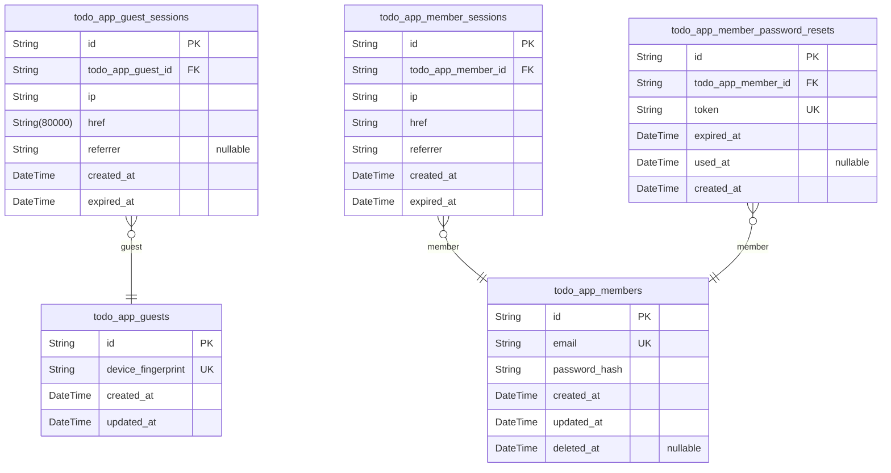
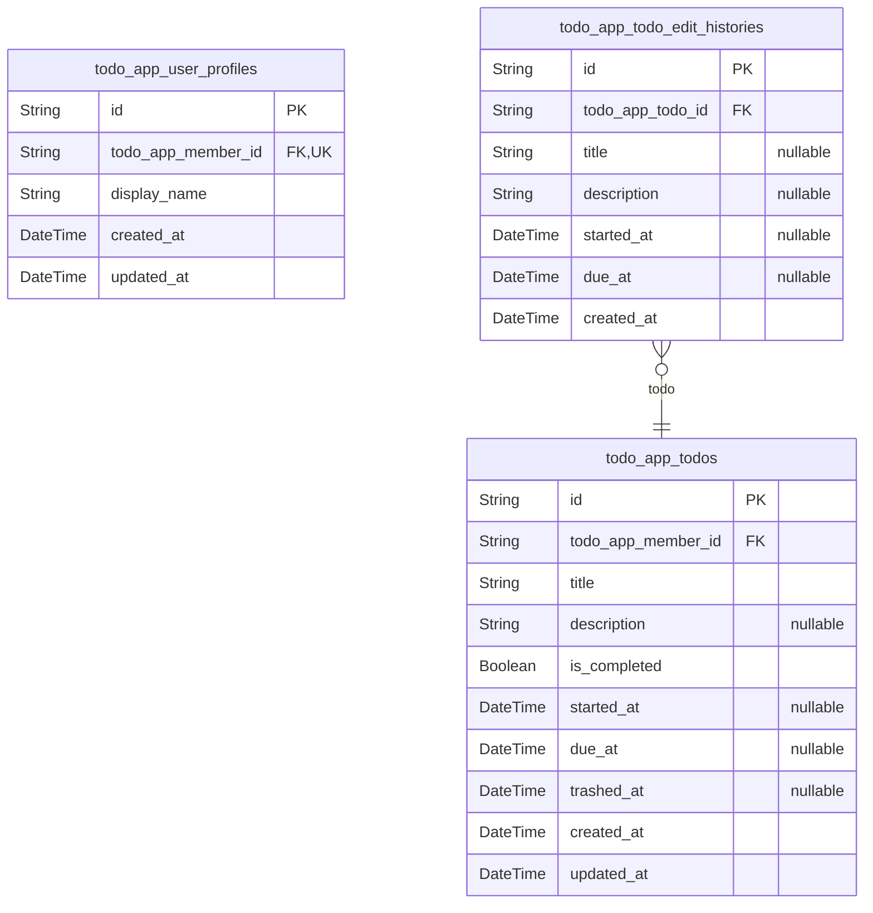

# Prisma Markdown

> Generated by [`prisma-markdown`](https://github.com/samchon/prisma-markdown)

- [Actors](#actors)
- [Todos](#todos)

## Actors

### `todo_app_guests`

Temporary guest accounts for unauthenticated visitors of the todo
application.

Each guest is identified by a device fingerprint or anonymous identifier
rather than any credential. This table serves as the canonical identity
record for guest actors, enabling anonymous session tracking before a
visitor registers or logs in as a member.

Guest accounts have no email or password fields. Their sessions are
tracked in the [todo_app_guest_sessions](#todo_app_guest_sessions) table. Guests have
strictly limited access compared to authenticated members and cannot
create or manage todos.

Properties as follows:

- `id`: Primary Key.
- `device_fingerprint`
  > A device fingerprint or anonymous identifier string that uniquely
  > identifies the guest's client device. Used to recognize returning
  > visitors before authentication. Must be unique across all guest records.
- `created_at`
  > Timestamp when the guest account was first created (i.e., when the
  > visitor first accessed the system).
- `updated_at`: Timestamp of the most recent update to this guest record.

### `todo_app_guest_sessions`

Temporary session tokens issued to guest actors, enabling anonymous
access before registration or login.

Each record represents a single anonymous browsing session initiated by
an unauthenticated visitor. The session captures connection metadata (IP
address, requested URL, referrer) for auditing and security purposes.
Sessions expire at a predetermined time and are never updated after
creation — they form an append-only audit trail of guest access events.

References the guest identity via [todo_app_guests.id](#todo_app_guests).

Properties as follows:

- `id`: Primary Key.
- `todo_app_guest_id`
  > The guest actor who owns this session. References {@link
  > todo_app_guests.id}.
- `ip`
  > IP address of the client that initiated this guest session. Used for
  > security auditing and anomaly detection.
- `href`
  > Full URL (href) of the page the guest was accessing when the session was
  > created. Captures the entry point of the anonymous visit.
- `referrer`
  > HTTP Referrer header value indicating where the guest navigated from.
  > Nullable when no referrer header is present.
- `created_at`: Timestamp when this guest session was established.
- `expired_at`
  > Timestamp when this guest session expires. After this time the session
  > token is no longer valid. Not nullable — every session must have a
  > defined expiry for security.

### `todo_app_members`

Registered member accounts representing authenticated users of the todo
application.

Each record corresponds to a single member identity with email and hashed
password credentials. Members own private todos and a personal profile.
This table is the root of the member actor's identity and ownership
graph.

Related entities:
- Sessions are tracked in [todo_app_member_sessions](#todo_app_member_sessions)
- Password reset tokens are stored in {@link
todo_app_member_password_resets}
- Business profile is stored in [todo_app_user_profiles](#todo_app_user_profiles)
- Owned todos are stored in [todo_app_todos](#todo_app_todos)

Account deletion is implemented as soft-deletion via `deleted_at`. All
member-owned data is cascade-deleted when the account is permanently
removed.

Properties as follows:

- `id`: Primary Key.
- `email`
  > The member's unique email address used for authentication and account
  > identification. Must be unique across all member accounts.
- `password_hash`
  > Bcrypt or equivalent hashed representation of the member's password.
  > Never stores plaintext passwords.
- `created_at`
  > Timestamp when the member account was created (i.e., when the user
  > registered).
- `updated_at`
  > Timestamp when the member account record was last updated (e.g., password
  > change).
- `deleted_at`
  > Timestamp when the member account was soft-deleted (i.e., when the user
  > voluntarily deleted their account). Null means the account is active.

### `todo_app_member_sessions`

JWT session records for authenticated members of the todo application.

This table captures every login event for a [todo_app_members](#todo_app_members)
actor, storing the connection context (IP address, request URL, referrer)
at the time of authentication. Each record represents a single session
token issuance and is used to manage login state and support token
rotation for access and refresh tokens.

Sessions are append-only audit records and are managed exclusively
through authentication flows rather than direct user CRUD operations. A
session is considered active until its `expired_at` timestamp is reached.

Properties as follows:

- `id`: Primary Key.
- `todo_app_member_id`
  > The authenticated member who owns this session. References {@link
  > todo_app_members.id}.
- `ip`
  > IP address of the client at the time the session was created. Used for
  > security auditing and anomaly detection.
- `href`
  > Full request URL (href) from which the login request originated. Captured
  > for session context and audit purposes.
- `referrer`
  > HTTP Referrer header value at the time of session creation. Indicates the
  > page or origin that triggered the authentication request.
- `created_at`: Timestamp when the session was established (login event occurred).
- `expired_at`
  > Timestamp when the session expires. Sessions are considered inactive
  > after this point. Used to enforce token expiration and support token
  > rotation.

### `todo_app_member_password_resets`

Password reset token records issued to members who request a password
change or account recovery.

Each record represents a single password reset request, containing a
unique secret token, an expiration timestamp, and a nullable consumed
timestamp. When a member initiates a password reset, a new record is
created with a freshly generated token and a future expiration time. Once
the member uses the token to set a new password, `used_at` is populated
to mark the token as consumed. Expired or already-used tokens are
rejected during the reset flow.

This table has a many-to-one relationship with [todo_app_members](#todo_app_members):
a single member may have multiple outstanding or historical reset
requests.

Properties as follows:

- `id`: Primary Key.
- `todo_app_member_id`
  > The member who requested this password reset. References {@link
  > todo_app_members.id}.
- `token`
  > The unique secret token sent to the member's email address for password
  > reset verification. Must be cryptographically random and kept
  > confidential.
- `expired_at`
  > The timestamp at which this reset token expires and becomes invalid.
  > Tokens presented after this time must be rejected.
- `used_at`
  > The timestamp at which this token was consumed to complete a password
  > reset. Null means the token has not yet been used. Once set, the token
  > cannot be reused.
- `created_at`: The timestamp when this password reset request was created.

## Todos

### `todo_app_user_profiles`

Business profile for each registered member of the todo application.

Each [member](#todo_app_members) has exactly one UserProfile, and
each UserProfile belongs to exactly one member. The profile is
automatically created when a member account is established and is
permanently removed when the member account is deleted.

The UserProfile stores the member's chosen display name — the
human-readable label that personalizes the account experience. This
information is strictly private: no other user can view, search, or
reference another user's profile. There is no public-facing profile or
user directory.

The profile does not carry authentication credentials (those reside in
[todo_app_members](#todo_app_members)). It is a purely presentational entity that the
owning member may update at any time.

Properties as follows:

- `id`: Primary Key.
- `todo_app_member_id`
  > The member who owns this profile. References [todo_app_members.id](#todo_app_members).
  > Unique constraint enforces the 1:1 relationship.
- `display_name`
  > The user-chosen visible name that serves as the human-readable label
  > representing the member within the application. Purely presentational —
  > carries no authentication significance and does not need to be unique
  > across the application. The member may change this at any time.
- `created_at`
  > Timestamp recording when the profile was first created. Set once at
  > account registration and never modified thereafter.
- `updated_at`
  > Timestamp recording the most recent moment at which the profile
  > information was changed. Updated whenever the member modifies their
  > display name.

### `todo_app_todos`

The central business entity representing a todo item — a discrete,
trackable task owned by exactly one member user.

Each todo has a mandatory title and an optional description providing
further detail. A completion status flag indicates whether the task has
been finished (complete) or is still outstanding (incomplete); every
newly created todo starts as incomplete by default.

Optional start and due dates may be associated with a todo to capture
when the user intends to begin and finish the task, respectively.

A todo exists in one of two visibility states — active or trashed —
captured by the nullable [todo_app_todos.trashed_at](#todo_app_todos) field. When
the field is NULL the todo is active and appears in the user's main todo
list. When non-NULL the todo has been soft-deleted and resides in the
trash, hidden from the normal list but still recoverable. Restoration
sets trashed_at back to NULL; permanent deletion removes the record
entirely together with all associated {@link
todo_app_todo_edit_histories} records.

Ownership is established via [todo_app_todos.todo_app_member_id](#todo_app_todos)
and is permanent — a todo always belongs to the member who created it and
is strictly private to that member.

Properties as follows:

- `id`: Primary Key.
- `todo_app_member_id`
  > The member who owns this todo. References [todo_app_members.id](#todo_app_members).
  > Ownership is permanent and non-transferable.
- `title`
  > The short, mandatory title of the todo item that names or summarizes the
  > task. A todo cannot exist without a title.
- `description`
  > An optional, free-form text block providing additional detail or context
  > for the task. May be null when the title alone is sufficient.
- `is_completed`
  > Indicates whether the task has been completed by the user. False means
  > incomplete (the default for all newly created todos); true means the user
  > has explicitly marked the task as done. Users may freely toggle this
  > value at any time while the todo is active.
- `started_at`
  > Optional date representing when the user intends to begin working on the
  > task. Null when no start date has been defined. Used as one of the sort
  > dimensions when browsing todos.
- `due_at`
  > Optional deadline date by which the user intends to finish the task. Null
  > when no due date has been defined. Used as one of the sort dimensions
  > when browsing todos.
- `trashed_at`
  > Soft-deletion timestamp. NULL indicates the todo is active and visible in
  > the user's normal todo list. A non-null value indicates the todo has been
  > soft-deleted and currently resides in the trash. Setting this field back
  > to NULL restores the todo to active status. When a todo is permanently
  > deleted, this record is removed entirely.
- `created_at`
  > The date and time when the todo was originally created. Recorded
  > automatically by the system and cannot be changed. Serves as the default
  > sort dimension when browsing todos.
- `updated_at`
  > The date and time when the todo was last updated. Automatically
  > maintained by the system on every write operation.

### `todo_app_todo_edit_histories`

Append-only audit log recording every edit made to a todo item.

Each record in this table represents a single edit event applied to a
[todo_app_todos](#todo_app_todos) record. An entry is automatically created by the
system whenever a member successfully edits one or more fields of a todo.
The entry captures the exact timestamp of the edit and the new values of
any fields that were actually changed during that edit session — fields
that remained unchanged are left null and are not represented in the
entry.

This table is strictly append-only during the lifetime of the parent
todo. Entries are never modified or individually deleted through user
actions. They are only permanently removed when the owning todo is
permanently deleted (cascading removal), ensuring no orphaned history
records exist in the system.

The collection of all entries for a given todo forms a complete,
chronological audit trail that allows the owning user to trace how their
todo has evolved over time.

Properties as follows:

- `id`: Primary Key.
- `todo_app_todo_id`
  > The parent todo that this history entry belongs to. References {@link
  > todo_app_todos.id}. Cascade-deleted when the parent todo is permanently
  > removed.
- `title`
  > The new title value recorded at the time of this edit. Only present
  > (non-null) if the title was changed during this particular edit session.
  > Null if the title was not modified.
- `description`
  > The new description value recorded at the time of this edit. Only present
  > (non-null) if the description was changed during this particular edit
  > session. Null if the description was not modified.
- `started_at`
  > The new start date/time value recorded at the time of this edit. Only
  > present (non-null) if the start date was changed during this particular
  > edit session. Null if the start date was not modified.
- `due_at`
  > The new due date/time value recorded at the time of this edit. Only
  > present (non-null) if the due date was changed during this particular
  > edit session. Null if the due date was not modified.
- `created_at`
  > The exact moment at which this history entry was created, corresponding
  > to when the edit was applied to the todo. Set automatically by the system
  > and cannot be altered. Serves as the primary chronological marker for
  > ordering the audit trail.
