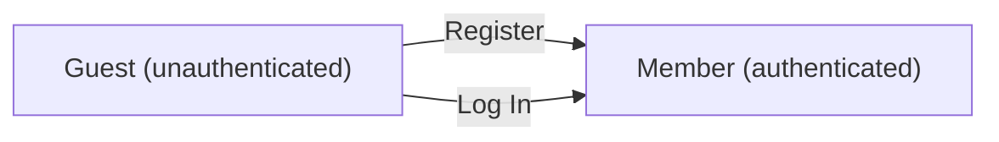
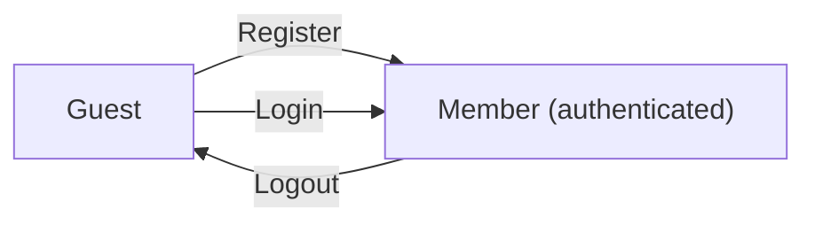

**todoApp — Actor definitions, permission matrix, authentication, session, account lifecycle**

Actor definitions, permission matrix, authentication, session, account lifecycle

# Actor Definitions

Define all user actor types with their identity, permissions, and access boundaries.

## guest Actor

A guest is any individual who accesses the application without having established an authenticated session. Guests have not yet provided valid credentials and therefore hold no recognized identity within the system. Because guests are unauthenticated, they are granted no permissions to read, create, modify, or delete any todo-related or profile-related resources. The only actions available to guests are those necessary to transition into an authenticated state, namely account registration and login. Guests cannot view any user's todos, profile, or edit history, as all such data is strictly reserved for authenticated members. The guest role represents the entry boundary of the application — users begin here and move to the member role upon successful authentication. No persistent data is associated with the guest actor itself.

### Guest Identity and Session State

A guest is any individual who accesses the application without an established authenticated session. Guests have not provided valid credentials and hold no recognized identity within the system. No persistent data is associated with the guest actor — the guest state is entirely transient and exists only until the visitor either registers a new account or logs in with existing credentials.

Because no session has been established, the application cannot associate a guest with any stored user record. Every request made in the guest state is treated as originating from an anonymous, unverified source.

### Access Boundary and Zero Resource Permissions

Guests are granted no permissions to read, create, modify, or delete any resource within the application. Specifically:

- Guests cannot view any user's todo list, individual todo details, or edit history.
- Guests cannot view any user's profile or display name.
- Guests cannot create, update, complete, or delete any todo.
- Guests cannot access the trash or perform any restore or permanent-delete operations.

All todo-related and profile-related resources are strictly reserved for authenticated members. Any attempt by a guest to access these resources is refused. The guest role represents the outermost access boundary of the application — no application data is exposed to unauthenticated visitors.

### Entry Points and Transition to Authenticated State

The only actions available to a guest are those necessary to transition into the authenticated member role. Guests may access two entry points:

- **Registration entry point**: A guest who does not yet have an account may register by providing an email address and a password. Upon successful registration, the guest is converted into a member with an established session.
- **Login entry point**: A guest who already has an account may log in by providing their email address and password. Upon successful authentication, the guest is converted into a member with an established session.

Once a guest successfully registers or logs in, the guest state ends and the member role begins. There is no other path through which a guest may gain access to application resources.

## member Actor

A member is a user who has successfully registered an account and established an authenticated session within the application. Members are identified by their unique email address, which serves as their primary identity credential. Each member owns a personal profile containing a display name that they have chosen. Members hold full permissions over their own data, including the ability to manage their todos, view their edit history, and maintain their profile. A member's access is strictly scoped to their own account and data — they cannot view, access, or interact with any other member's information. Members retain their authenticated role for the duration of their active session. A member's account and all associated data exist until the member voluntarily deletes the account, at which point the member actor ceases to exist in the system. The member role is the only fully privileged actor type in this application, as the application does not define any administrative or moderator roles.

### Member Identity and Authentication

A member is a user who has successfully completed registration and established an authenticated session within the application.

Each member is uniquely identified by their email address. The email address serves as the primary credential for authentication and cannot be shared between multiple accounts. No two members may hold the same email address.

A member holds an active session for the duration of their authenticated interaction with the application. While the session is active, the member is recognized as an authenticated actor with access to their own data and resources. Members without an active session are treated as guests until they re-authenticate.

The member actor is the only fully privileged actor type in this application. There are no administrative or moderator roles defined in the system.

### Member Profile and Display Name

Each member owns exactly one personal profile. The profile contains a display name, which is a human-readable name chosen by the member to identify themselves within the application.

The member is the sole owner of their profile. Only the member themselves may view or edit their own profile. No other actor — including other members — may access, view, or modify a member's profile.

The display name may be updated by the member at any time after registration. The member's profile is strictly private and is never visible to other users.

### Member Permissions and Data Ownership

A member holds full permissions over all data they own. This includes:

- **Todos**: The member may create, view, edit, complete, delete, restore, and permanently remove their own todos.
- **Todo edit history**: The member may view the edit history of any todo they own.
- **Profile**: The member may view and update their own display name.
- **Account**: The member may change their password and delete their account.

A member's permissions are strictly scoped to their own data. A member cannot view, access, modify, or interact with any data belonging to another member. This boundary is absolute — there is no sharing, delegation, or cross-member access of any kind within the system.

A member receives no elevated privileges over other members' data by virtue of any status, role, or relationship.

### Account Ownership and Voluntary Deletion

A member is the sole owner of their account. Account ownership means the member has exclusive control over the account's credentials, profile, and all associated todos.

A member may choose to permanently delete their account at any time. This is a voluntary, member-initiated action. Upon account deletion, the member actor ceases to exist in the system. All data associated with the account — including the member's profile, all todos (whether active or in trash), and all todo edit histories — is permanently removed.

Once an account has been deleted, the member can no longer authenticate or access the application using the deleted account's credentials. Account deletion is irreversible.

# Authentication Flows

Registration, login, logout, and session management from a user perspective.

## Registration and Login

Define user registration and login flows including validation and error handling.

### User Registration

A guest may register for an account by providing an email address and a password. The email address must be unique across all accounts in the system. If the provided email is already associated with an existing account, the registration is rejected.

Upon successful registration, the system creates a new account and a corresponding user profile. The new account is immediately active — no email verification step is required.

After registration is complete, the user transitions from a guest to an authenticated member and may begin using the application.

### User Login

A guest may log in by providing their registered email address and password. The system verifies that the email corresponds to an existing account and that the provided password matches the stored credential.

If the email does not correspond to any account, the login attempt is rejected. If the password does not match, the login attempt is rejected. In both failure cases, the guest remains unauthenticated.

Upon successful login, the guest is authenticated and transitions to the member state, gaining access to their personal todos and profile.

### Authentication State

Every request to the system is made either as a guest (unauthenticated) or as an authenticated member. The system distinguishes between these two states to determine which operations are permitted.

Guests may only perform registration and login. All todo and profile operations require an authenticated member session.

A member's identity is established by their unique email address. Once authenticated, the member can access only their own todos and their own profile — no cross-user access is permitted.

## Session and Logout

Define session behavior and logout from a user perspective.

### Session Establishment

A session is created for a member immediately upon successful login. The session represents the authenticated context in which the member performs all subsequent operations. Without an active session, a visitor is treated as a guest and cannot access any member-only features.

A member may only interact with their own data — todos, profile, and edit history — within the scope of their session. No cross-user access is permitted regardless of session state.

The system associates all actions performed during a session with the authenticated member. This association is used to enforce ownership rules across all todo and profile operations.

### Logout

A member can log out at any time. Logging out terminates the active session and immediately revokes access to all member-only operations.

After logging out, the user is returned to the guest state and must log in again to regain access to their data.

Logging out does not alter the member's data — all todos, profile information, and edit history remain intact and are accessible upon the next login.

### Account Security

Members authenticate using their registered email address and password. Passwords are the sole credential used to verify identity during login.

Members can change their password while logged in. After a successful password change, the member's access continues uninterrupted within the current session.

If a member deletes their account, all associated data — including todos in the normal list and in trash, as well as all edit history — is permanently removed. Account deletion is irreversible. After deletion, the member's session is terminated and the email address is no longer associated with any account in the system.

Users cannot access any member features without an active session. Any attempt to perform a member-only operation without a valid session is rejected.

# Account Lifecycle

Account creation, deletion, and password management.

## Account Management

Define how users create accounts, delete accounts, and change passwords.

### Account Creation

A new user account is created when a visitor submits a registration request with a valid email address and a password. The email address must be unique across all existing accounts; if the email is already in use, the registration is rejected. Once the account is successfully created, the user also receives a profile with an initial display name. The newly created account is immediately active and the user may log in right away. Guest visitors who have not yet registered are the only actors who can initiate account creation.

### Password Change

A member may change their account password at any time while logged in. To change the password, the member must provide their current password along with the new password they wish to set. If the current password provided does not match the one on record, the request is rejected and the password remains unchanged. Once the new password is accepted, subsequent logins must use the new password. Only the account owner can change their own password; no other actor may change another user's password.

### Account Deletion

A member may permanently delete their own account. When an account is deleted, all data belonging to that member is also permanently removed, including all of their todos (whether in the normal list or in the trash), all associated edit histories, and their profile. Account deletion is irreversible; once completed, the member's email address becomes available for registration again. No other actor may delete another user's account. After deletion, any active session for that account is terminated and the former member is treated as a guest.