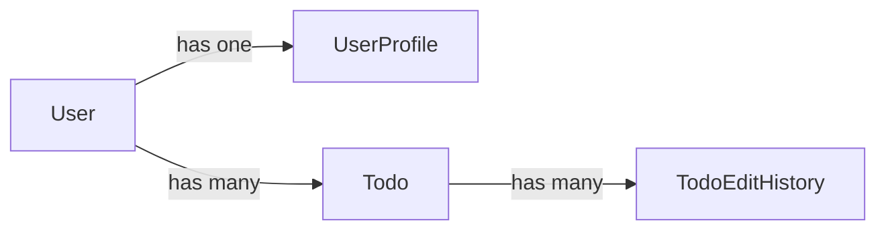
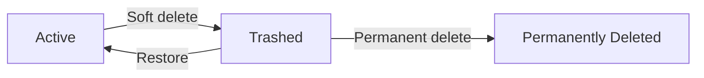
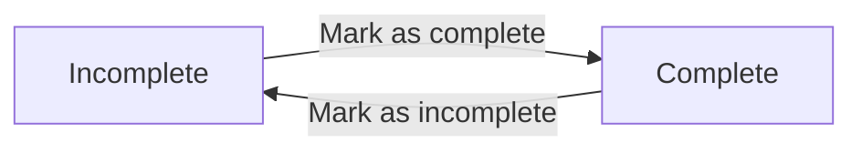
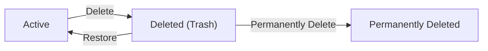
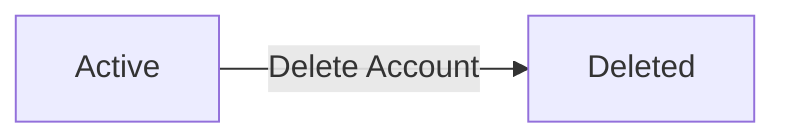

**todoApp — Business concepts, relationships, and states from user perspective**

Business concepts, relationships, and states from user perspective

# Domain Concepts

Describe what each concept means in the business domain and its key attributes.

## User Concept

A User is the central identity in the todo application, representing a registered individual who owns and manages their own private workspace. Each User is uniquely identified by their email address, which serves as the primary means of recognizing who the account belongs to within the system. A User also holds a password credential that allows them to authenticate and gain access to their account. The account has a creation timestamp that records when the individual first joined the application. Every User is a fully independent actor whose data — including todos and profile — is completely isolated from all other users. The concept of a User is foundational: all other entities in the domain, such as todos and profile information, belong exclusively to a single User. A User cannot share ownership of their data with others, and no other user can observe or access their account's contents.

### User Account

A User is a registered individual who holds a personal account within the todo application. The User is the foundational domain entity from which all other entities — such as todos and profile information — derive their ownership and meaning.

Each User is uniquely identified by their email address. The email serves as the primary identifier across the system: no two accounts may share the same email address, and the email is used to locate an account when the user attempts to authenticate.

A User also holds a password credential, which is the secret the individual uses to prove their identity and gain access to their account. Without a valid matching password, access to the account is not granted.

Every User account records a creation timestamp, capturing the exact point in time when the individual first registered with the application. This timestamp is set once at registration and is not modified thereafter.

A User may also have their account removed. When an account is removed, a deletion timestamp is recorded, and all data belonging to that user — including todos and edit history — is permanently erased from the system.

### Private Isolated Workspace and Data Ownership

Each User operates within a completely private and isolated workspace. All todos, profile information, and edit histories that belong to a User are visible only to that User. No other user can observe, access, or interact with another user's workspace or its contents under any circumstance.

Data ownership in this system is exclusive and non-transferable. Every todo and every piece of profile information is owned by exactly one User. There is no concept of shared ownership, delegation, or collaborative access between users.

This isolation is absolute: the system does not provide any mechanism — intentional or incidental — for one user to view, copy, or reference the data of another user. Each account is a fully self-contained unit.

## UserProfile Concept

A UserProfile is the personal presentation layer associated with a User, capturing how the user chooses to identify themselves within the application. Each UserProfile belongs to exactly one User and carries a display name — a human-readable label the user selects to represent themselves. The display name is the only piece of personal identity information visible to the user within their own private context. The UserProfile also records when the profile information was last updated, providing a sense of its currency. Because this is a private application, the UserProfile is not visible to other users; it exists solely for the owning user's own reference. The UserProfile is a dependent concept — it does not exist independently of the User it belongs to and reflects the user's chosen identity at any point in time.

### UserProfile Domain Entity

A UserProfile is the personal presentation layer associated with a User. It represents how a user chooses to identify themselves within the application and holds the human-readable information that reflects their chosen identity.

Each UserProfile belongs to exactly one User, and each User has exactly one UserProfile. The UserProfile does not exist independently — it is a dependent concept whose existence is tied to the owning User. When a User account is removed, the associated UserProfile ceases to exist alongside it.

**Attributes:**

| Attribute | Description |
|-----------|-------------|
| Display name | A user-chosen visible name that serves as the human-readable label representing the user within the application. This is the only identity attribute the user controls through their profile. |
| Last updated | A timestamp recording the most recent moment at which the profile information was changed, providing an indication of how current the profile is. |

The display name is a personal choice made by the user and may be changed at any time. It does not need to be unique across the application and carries no authentication significance — it is purely presentational.

### Privacy and Visibility of UserProfile

Because this is a private todo application, the UserProfile is not shared with or accessible to any other user. No other user can view, search, or reference another user's display name or profile information.

The UserProfile exists solely for the benefit of the owning user — as a means for them to recognize and personalize their own account experience. There is no public-facing profile, no user directory, and no mechanism by which one user's profile information becomes visible to another.

This privacy model means the UserProfile is always viewed and managed exclusively in the context of the authenticated user who owns it.

## Todo Concept

A Todo is a task item that a User creates to track something they want to accomplish. Each Todo is owned by exactly one User and is completely private to that User. The most essential attribute of a Todo is its title, which is a short, required piece of text that describes the task. A Todo may also carry an optional description for providing additional detail or context about the task. A Todo has a completion status, which is a two-state indicator showing whether the task has been completed or remains incomplete; newly created todos are always incomplete by default. A Todo can optionally carry a start date and a due date, which represent the intended timeframe for the task, although both are entirely optional and can be omitted. A Todo also records when it was originally created, giving the user a sense of how long the task has existed. Additionally, a Todo can be in a deleted state, meaning it has been moved to the trash but not yet permanently removed from the system. The concept of a Todo is the core unit of work in the application — it represents a discrete, trackable task in a user's personal list.

### Todo

A Todo is the core unit of work in the application — a discrete, trackable task that a user creates to record something they want to accomplish. Every Todo is owned by exactly one user and is completely private to that user; no other user can see or access it.

Every Todo carries the following attributes:

- **Title** (required): A short piece of text that names or summarizes the task. The title is mandatory; a Todo cannot exist without one.
- **Description** (optional): A longer, free-form block of text that provides additional detail or context about the task. The description may be left empty when the title alone is sufficient.
- **Completion status**: A two-state indicator that shows whether the task has been finished or is still outstanding. The only two states are *complete* and *incomplete*. When a Todo is first created, its completion status is always *incomplete* by default.
- **Start date** (optional): A date representing when the user intends to begin working on the task. It may be omitted if the task has no defined start point.
- **Due date** (optional): A date representing the deadline by which the user intends to finish the task. It may be omitted if the task has no fixed deadline.
- **Creation timestamp**: The date and time when the Todo was originally created. This is recorded automatically by the system and cannot be changed. It gives the user a reference for how long the task has existed.

### Todo Deletion State

A Todo can exist in one of two visibility states: *active* or *soft-deleted*.

- **Active**: The Todo is in the user's normal todo list and is fully visible and accessible.
- **Soft-deleted (in trash)**: The Todo has been deleted by the user but has not been permanently removed from the system. It is moved to a separate area called the trash. A soft-deleted Todo no longer appears in the normal todo list but remains recoverable.

A Todo in the trash retains all of its attributes — title, description, completion status, start date, due date, and creation timestamp — as well as its associated edit history. This allows the user to restore the Todo back to the active state if the deletion was a mistake. A soft-deleted Todo can also be permanently removed from the trash, at which point it and all of its edit history are erased from the system entirely.

When a user's account is deleted, all of that user's Todos — whether active or soft-deleted — are permanently removed from the system.

## TodoEditHistory Concept

A TodoEditHistory is a record that captures a single edit event applied to a Todo. Each history entry is attached to one specific Todo and documents what the content of that Todo looked like after a particular change was made. The history entry records the exact moment in time when the edit occurred. If the title was changed during an edit, the entry captures the new value of the title after the change. Similarly, if the description was changed, the new value of the description is recorded. If the start date or due date was changed, those new values are also captured in the entry. A history entry only records fields that were actually changed; unchanged fields are not represented in that entry. Together, the collection of history entries for a Todo forms a chronological audit trail of all changes made to that Todo since its creation. The TodoEditHistory concept exists to provide transparency and traceability into how a Todo has evolved over time, entirely for the benefit of the owning user.

### TodoEditHistory Domain Entity

A TodoEditHistory is a domain entity that represents a single edit event applied to a Todo. Each history entry is permanently attached to exactly one Todo and cannot exist independently of it. When a user edits a Todo, the system creates a new history entry at that moment, capturing a snapshot of what changed during that particular edit. The collection of all history entries for a given Todo forms a complete, chronological audit trail of every change ever made to that Todo.

Each history entry carries the following information:

- **When the edit occurred**: The exact moment in time at which the edit was recorded. This timestamp is set automatically when the edit is saved and cannot be altered afterward.
- **New title value**: If the title was changed during the edit, the entry records the value the title became after the change. If the title was not changed, this field is absent from the entry.
- **New description value**: If the description was changed during the edit, the entry records the value the description became after the change. If the description was not changed, this field is absent from the entry.
- **New start date value**: If the start date was changed during the edit, the entry records the value the start date became after the change. If the start date was not changed, this field is absent from the entry.
- **New due date value**: If the due date was changed during the edit, the entry records the value the due date became after the change. If the due date was not changed, this field is absent from the entry.

A history entry only records fields that were actually modified in that edit; fields that remained unchanged are not represented in that entry. This means a single history entry may contain changes to one field, several fields, or all editable fields, depending on what the user changed in that particular edit session.

The TodoEditHistory entity exists solely to provide transparency and traceability into how a Todo has evolved over time. It is a read-only record once created — history entries are never modified or deleted as a result of subsequent edits. They are only permanently removed when the owning Todo is permanently deleted.

### Chronological Audit Trail

The set of all history entries belonging to a Todo constitutes its audit trail. This trail represents the complete sequence of changes made to the Todo from the moment it was first edited up to the present.

The audit trail has the following characteristics:

- History entries are ordered from most recent to oldest, so the most recently recorded edit appears first.
- Every edit operation on a Todo produces exactly one new history entry; no edit is silently omitted from the trail.
- The trail is append-only during the lifetime of the Todo — new entries are added at the front as edits occur, but no existing entries are modified or removed.
- When a Todo is permanently deleted (either directly from the trash or as a result of account deletion), all of its associated history entries are also permanently removed.
- While a Todo exists in the trash (soft-deleted state), its audit trail is preserved in full and becomes accessible again if the Todo is restored.

The audit trail serves the owning user by allowing them to understand how their Todo has changed over time, including what values each field held after each successive edit.

# Domain Relationships

Describe how concepts relate to each other from a business perspective.

## Conceptual Relationships

Describe how concepts relate to each other in business terms.

### User and UserProfile Relationship

Each User has exactly one UserProfile. The UserProfile is created automatically when a User account is established and exists for the entire lifetime of that account. The UserProfile belongs to its User exclusively — it cannot be transferred to or shared with another User.

The relationship is one-to-one: a User always has one and only one profile, and a UserProfile always belongs to one and only one User. When a User account is deleted, its associated UserProfile is removed as part of that deletion.

### User and Todo Ownership

Each Todo is owned by exactly one User. When a User creates a Todo, that User becomes its permanent owner. Ownership cannot be transferred — a Todo always belongs to the User who created it.

A User may own any number of Todos, including zero. This is a one-to-many relationship: one User to many Todos, but each Todo to exactly one User.

Ownership determines all access rights. Only the owning User can view, complete, edit, soft-delete, restore, or permanently delete their Todos. No other User — regardless of their own account status — can access another User's Todos in any way.

### Todo and TodoEditHistory Relationship

Each Todo has a collection of TodoEditHistory records associated with it. A TodoEditHistory entry is created every time the owning User edits any of the Todo's fields (title, description, start date, or due date). A Todo may have zero edit history entries (if it has never been edited) or many.

This is a one-to-many relationship: one Todo to many TodoEditHistory entries, and each TodoEditHistory entry belongs to exactly one Todo. TodoEditHistory entries cannot exist independently — they are always attached to a specific Todo.

When a Todo is permanently deleted, all of its associated TodoEditHistory entries are also permanently removed. Soft deletion of a Todo does not affect its edit history; the history is preserved and remains accessible should the Todo be restored.

### Overall Entity Association Map

The four business concepts — User, UserProfile, Todo, and TodoEditHistory — form a clear ownership hierarchy:

- A User owns one UserProfile and many Todos.
- Each Todo is owned by one User and accumulates many TodoEditHistory records over its lifetime.
- TodoEditHistory records belong to a Todo, which in turn belongs to a User.

This hierarchy means that a User is ultimately the root owner of all data in the system: their profile, their todos, and the edit histories of those todos. Deleting a User account cascades through the entire hierarchy, removing the profile, all todos (including those in trash), and all edit history records.

## Lifecycle and Retention

Describe concept lifecycle states and transitions only. Detailed retention/recovery policies belong in 05-non-functional. Operation details belong in 03-functional-requirements.

### Todo Lifecycle States

A todo exists in one of three distinct lifecycle states: **active**, **trashed**, and **permanently deleted**.

- An **active** todo is visible in the user's normal todo list and can be viewed, edited, completed, or toggled between complete and incomplete.
- A **trashed** todo has been soft-deleted by its owner. It no longer appears in the normal todo list but is retained in a separate trash area. A trashed todo preserves all of its content, completion status, dates, and full edit history. No further edits can be made to a trashed todo.
- A **permanently deleted** todo no longer exists in any part of the system. Its associated edit history is also permanently deleted at the same time.

The diagram below illustrates the allowed state transitions for a todo:

Once a todo reaches the permanently deleted state, it cannot be recovered. Restoration is only possible while the todo remains in the trashed state. Detailed recovery and retention policies are described in 05-non-functional.

### Account Lifecycle and Cascade Deletion

A user account moves through two lifecycle states: **active** and **deleted**.

- An **active** account grants the user full access to their workspace, including creating and managing todos and editing their profile.
- When a user deletes their account, the account transitions to a deleted state. All data associated with the account — including every active todo, every trashed todo, and every edit history entry belonging to those todos — is permanently removed. No partial recovery is possible after account deletion.

The cascade effect of account deletion covers the full breadth of user-owned data:

- All active todos owned by the user are permanently deleted.
- All trashed todos owned by the user (which would otherwise be awaiting restoration or permanent deletion) are also permanently deleted.
- All edit history entries linked to those todos are permanently deleted as a consequence.
- The user's profile is permanently deleted.

This cascade is immediate and irreversible. There is no archival or dormant state for an account; deletion is final. Retention and recovery policies at the account level are described in 05-non-functional.

# Business Categories and State Flows

Business category classifications and state flow definitions.

## Business Category Definitions

Define all business category classifications with their allowed values and descriptions.

### Completion Status Classification

The completion status is a two-state business category applied to every todo item. It classifies each todo as either complete or incomplete, representing whether the underlying task has been finished by the user.

**Allowed Values:**

| Status Value | Meaning |
|---|---|
| Incomplete | The task has not yet been finished. This is the default state for all newly created todos. |
| Complete | The user has explicitly marked the task as done. |

The completion status has no intermediate or transitional states — a todo is always in one of these two exactly defined values. Users may freely toggle between complete and incomplete at any time. No additional approval or validation is required to change this status.

This classification is also used as the primary filter dimension when users browse their todo list, allowing them to display all todos, only complete todos, or only incomplete todos. The filtering behavior governed by this classification is defined in 04-business-rules.md.

### Visibility Status Classification

The visibility status is a two-state business category that determines whether a todo appears in the user's normal active list or in the trash. It captures the lifecycle position of a todo with respect to deletion.

**Allowed Values:**

| Status Value | Meaning |
|---|---|
| Active | The todo is in normal use and appears in the user's main todo list. |
| Deleted | The todo has been soft-deleted and no longer appears in the main list. It resides in the trash until restored or permanently removed. |

A todo begins its life as active. When a user deletes a todo, its visibility status transitions to deleted. When a user restores a todo from the trash, the visibility status returns to active. When a user permanently deletes a todo from the trash, the todo (and all its edit history) is removed from the system entirely — it no longer exists in any visibility status.

The visibility status governs which collection a todo belongs to at any given moment. Active todos and deleted todos are always displayed in separate, distinct views and are never mixed together in a single list.

### Sort Order Classification

The sort order classification defines the allowed dimensions and directions by which a user may arrange their todo list. It is a user-selected preference applied at browse time, not a stored property of any individual todo.

**Sort Dimension Allowed Values:**

| Dimension | Description |
|---|---|
| Creation date | Sorts todos by the date and time they were created. |
| Start date | Sorts todos by their optional start date. |
| Due date | Sorts todos by their optional due date. |

**Sort Direction Allowed Values:**

| Direction | Description |
|---|---|
| Newest first / Latest first | Descending order — most recent or furthest dates appear at the top. |
| Oldest first / Earliest first | Ascending order — earliest dates appear at the top. |

Every combination of dimension and direction is valid. When sorting by start date or due date, todos that have no value set for that date field are always placed at the end of the list, regardless of the chosen direction. The rules governing this placement behavior are defined in 04-business-rules.md.

### Filter Category Classification

The filter category classification defines the allowed values by which a user may narrow down their todo list based on completion status. It is a browse-time selection, not a stored attribute of any individual todo.

**Allowed Values:**

| Filter Value | Todos Included |
|---|---|
| All | Every active todo owned by the user, regardless of completion status. |
| Complete only | Only active todos whose completion status (defined in Completion Status Classification) is complete. |
| Incomplete only | Only active todos whose completion status is incomplete. |

The filter category applies exclusively to the active todo list. The trash list is not subject to this classification — all deleted todos are shown in the trash regardless of their completion status. Detailed filtering behavior is defined in 04-business-rules.md.

## State Transitions

Define valid state transition paths for stateful concepts.

### Todo Completion State Flow

A todo exists in one of two completion states: incomplete or complete. Every newly created todo starts in the incomplete state by default.

The user may toggle a todo between these two states at any time:
- An incomplete todo can be marked complete.
- A complete todo can be marked incomplete.

There are no intermediate or locked states — the transition is always available to the owning user in either direction, as long as the todo has not been soft-deleted.

### Todo Lifecycle State Flow

A todo moves through three distinct lifecycle states: active, deleted (trash), and permanently deleted.

**Active → Deleted (Trash)**
When a user deletes a todo, it is moved to the trash. The todo is no longer visible in the normal todo list but is retained and accessible through the trash view. This is a soft delete — no data is lost at this stage.

**Deleted (Trash) → Active (Restored)**
A user can restore a todo from the trash. Upon restoration, the todo returns to the active state and reappears in the normal todo list with all its original data and edit history intact.

**Deleted (Trash) → Permanently Deleted**
A user can permanently delete a todo from the trash. This action is irreversible. The todo and all of its associated edit history are removed from the system entirely.

A todo that has been permanently deleted cannot be recovered. Todos in the trash do not appear in the normal todo list, and todos in the active state do not appear in the trash list.

### Account Lifecycle State Flow

A user account transitions through two states: active and deleted.

**Active**
An account becomes active upon successful registration. While active, the user can log in, manage their profile, and perform all todo operations.

**Active → Deleted**
When a user chooses to delete their account, the account is permanently removed along with all associated data. This includes all of the user's todos in any state (active or trash) and all associated edit histories. Account deletion is irreversible — there is no recovery or restore step.

Unlike todo deletion, account deletion is not a soft delete. The account and all its content are permanently removed in a single workflow step.