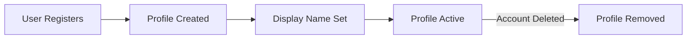
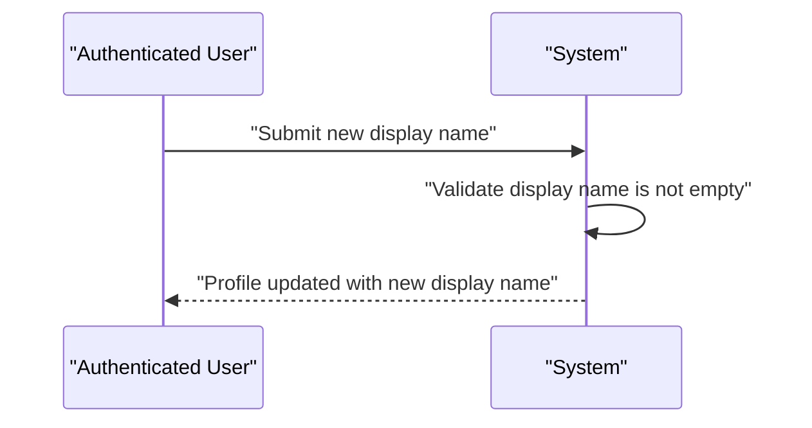
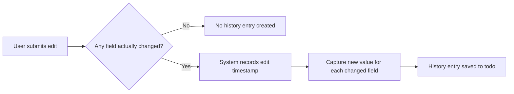
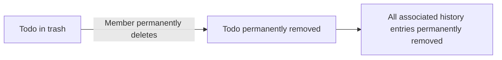
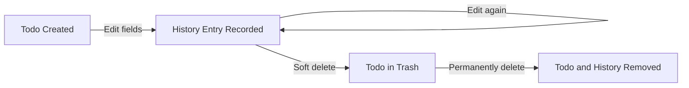
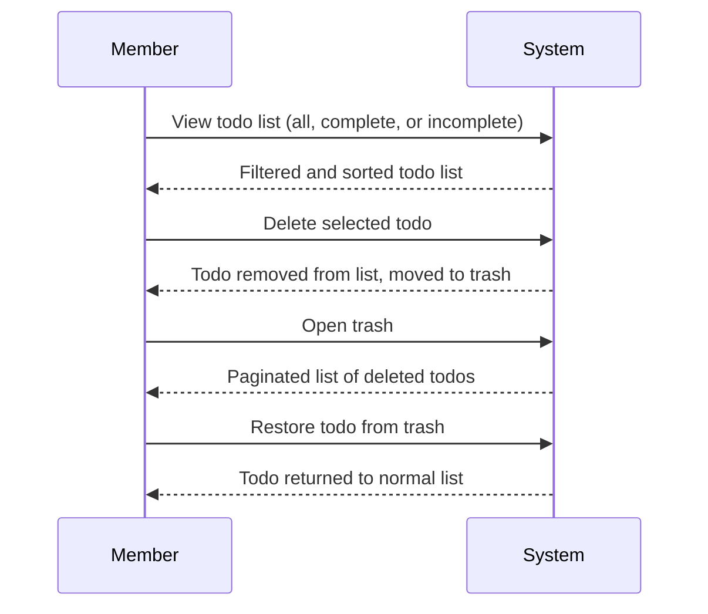
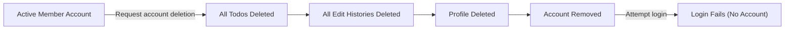

**todoApp — What operations users can perform, use cases, business workflows**

What operations users can perform, use cases, business workflows

# Core Business Operations

What the system must do for each business concept.

## User Operations

A new user registers by providing an email address and a password, both of which are required to create an account. The email address must be unique across the system; no two accounts can share the same email. Once registered, a user logs in by supplying their email and password, and the system grants access only when both match an existing account. An authenticated user can change their password by providing a new password, replacing the old credential on their account. A user may delete their own account at any time, which permanently removes the account along with every todo they own, including todos that are currently in the trash, and all associated edit history. There is no recovery mechanism after account deletion. The system enforces strict isolation: one user cannot access, modify, or delete another user's account. Authentication is required before any personal data or todo operations can be performed.

### User Registration

THE system SHALL allow a guest to create a new account by providing an email address and a password.

THE system SHALL require both an email address and a password to complete registration; neither field may be omitted or left empty.

THE system SHALL enforce uniqueness of email addresses across all accounts, ensuring no two accounts share the same email address.

WHEN a guest submits a registration request with a valid, unique email and a password, THE system SHALL create a new account and associate a default user profile with the account.

WHEN registration succeeds, THE system SHALL immediately make the account available for login.

IF the submitted email address is already associated with an existing account, THEN THE system SHALL reject the registration request. (Error handling details defined in the User Error Scenarios section of 04-business-rules.md.)

### User Login

THE system SHALL allow a guest to log in by providing an email address and a password.

WHEN a guest submits a login request, THE system SHALL look up the account associated with the provided email address and verify that the provided password matches the stored credential for that account.

WHEN both the email address and password match an existing account, THE system SHALL grant the user an authenticated session, enabling access to personal data and todo operations.

IF the provided email address does not correspond to any existing account, THEN THE system SHALL deny access. (Error handling details defined in 04-business-rules.md.)

IF the provided password does not match the credential stored for the given email address, THEN THE system SHALL deny access. (Error handling details defined in 04-business-rules.md.)

### Password Change

WHILE a user is authenticated, THE system SHALL allow that user to change their account password by providing a new password.

WHEN a valid new password is submitted, THE system SHALL replace the existing password credential on the user's account with the new password.

WHEN the password is successfully changed, THE system SHALL use the new password for all subsequent login attempts for that account.

THE system SHALL NOT allow an unauthenticated guest to change any account's password.

### Account Deletion

WHILE a user is authenticated, THE system SHALL allow that user to permanently delete their own account.

WHEN a user deletes their account, THE system SHALL permanently remove the account along with every todo the user owns, including todos currently in the trash.

WHEN a user deletes their account, THE system SHALL permanently remove all edit history entries associated with the user's todos.

WHEN a user deletes their account, THE system SHALL permanently remove the user's profile.

THE system SHALL provide no recovery mechanism after account deletion; all data is permanently and irrevocably destroyed.

THE system SHALL NOT allow a user to delete another user's account.

### Authentication Requirement and Account Isolation

THE system SHALL require a user to be authenticated before allowing access to any personal data, including profile information and todo operations.

IF a request for personal data or a todo operation is made without an authenticated session, THEN THE system SHALL deny the request.

THE system SHALL strictly isolate each user's account and data so that one authenticated user cannot access, read, modify, or delete another user's account.

WHILE a user is authenticated, THE system SHALL restrict all data operations to the resources owned exclusively by that user.

THE system SHALL NOT expose any user's account information, profile, or todos to any other user.

## UserProfile Operations

Every user account is paired with a profile that holds a display name, which serves as the user's visible identity within the application. The display name is the only profile attribute users can set and modify. A user can edit their display name at any time after account creation, and the change takes effect immediately. User profiles are strictly private: a user can only view and edit their own profile, and no mechanism exists to view, search, or access another user's profile. There is no public profile listing in this application. Profile management operations require the user to be authenticated.

### User Profile and Display Name

Every user account is automatically paired with a profile at the time of registration. The profile holds a single attribute: the display name, which is the user's visible identity within the application. The display name is the only piece of profile information a user can set and manage. There are no additional profile attributes beyond the display name.

When a user registers, a profile with a display name is created and permanently associated with that account. The profile exists for the lifetime of the account and is removed when the account is deleted.

### Viewing Own Profile

An authenticated user can retrieve their own profile to view their current display name. The profile view presents the display name as it currently stands. This operation is only available to the owner of the profile — a user may only view their own profile. Unauthenticated access to any profile is not permitted. Error conditions for unauthenticated and unauthorized access are defined in the UserProfile Error Scenarios section.

### Editing Own Display Name

An authenticated user can update their display name at any time. The user provides a new display name value, and upon a successful update the change takes effect immediately. The updated display name replaces the previous value.

The display name must be provided — an empty or missing value is not accepted. Validation rules and error conditions for invalid update attempts are defined in the UserProfile Error Scenarios section.

### Profile Privacy and Access Restrictions

User profiles are strictly private. Each user can only view and edit their own profile. There is no mechanism within the application to view, search, browse, or access another user's profile in any way. No public profile listing exists — a user cannot retrieve a list of other users or their profiles.

Any attempt by a user to access or modify another user's profile is blocked. Because there is no sharing or social feature in this application, no profile information is ever exposed to other users. Permission definitions governing these restrictions are maintained in the actors and authentication specification.

## Todo Operations

A user can create a todo by providing a title, which is required, and optionally a description, a start date, and a due date. Newly created todos default to an incomplete state automatically. Users can view a paginated list of their own todos, with each item showing the title, completion status, start date if set, due date if set, and creation date. A user can open a single todo to read its full details including the complete description. Users can mark a todo as complete or revert it to incomplete, toggling freely between the two states. Users can edit a todo's title, description, start date, and due date; every such edit is recorded in the todo's edit history. Users can filter their todo list by completion status, choosing to see all todos, only complete todos, or only incomplete todos. Users can sort their todo list by creation date, start date, or due date, each in ascending or descending order; todos without a start date appear at the end when sorting by start date, and todos without a due date appear at the end when sorting by due date. A user can soft-delete a todo, which removes it from the normal todo list without permanent deletion. Deleted todos move to the trash, where users can view them in a paginated list, restore them to the active list, or permanently delete them along with their edit history. Each user's todos are completely private and inaccessible to other users.

### Todo Creation

WHEN a member submits a new todo, THE system SHALL require a title and reject the request if the title is absent.

WHEN a member creates a todo, THE system SHALL accept an optional description, an optional start date, and an optional due date, creating the todo without those fields if they are not provided.

WHEN a new todo is created, THE system SHALL automatically set its completion status to incomplete.

WHEN a member creates a todo, THE system SHALL associate the new todo exclusively with that member's account.

THE system SHALL allow a member to have multiple todos, each independently managed.

### Todo List View

WHEN a member requests their todo list, THE system SHALL return only todos belonging to that member.

THE system SHALL present the todo list in paginated form, returning a defined subset of todos per page and providing navigation to subsequent pages.

WHEN displaying each todo in the list, THE system SHALL show the title, completion status, creation date, and — if set — the start date and due date.

WHEN a member requests a single todo, THE system SHALL return all details of that todo, including the full description, title, completion status, start date if set, due date if set, and creation date.

### Todo Completion Toggle

WHEN a member marks an incomplete todo as complete, THE system SHALL update that todo's completion status to complete.

WHEN a member marks a complete todo as incomplete, THE system SHALL update that todo's completion status to incomplete.

THE system SHALL allow a member to toggle the completion status of a todo freely between complete and incomplete without restriction on the number of times.

### Todo Editing

WHEN a member edits a todo, THE system SHALL allow changes to the title, description, start date, and due date, individually or in combination.

WHEN a member submits an edit, THE system SHALL record a history entry capturing the timestamp of the edit and the new values of any fields that were changed.

WHEN a member edits a todo, THE system SHALL persist the updated field values immediately upon successful submission.

THE system SHALL allow the description, start date, and due date to be cleared (set to empty) during an edit.

### Filtering Todo List by Completion Status

WHEN a member filters their todo list, THE system SHALL support three filter modes: all todos, only complete todos, and only incomplete todos.

WHEN the member selects the "all todos" filter, THE system SHALL return all active todos belonging to that member regardless of completion status.

WHEN the member selects the "only complete" filter, THE system SHALL return only those active todos whose completion status is complete.

WHEN the member selects the "only incomplete" filter, THE system SHALL return only those active todos whose completion status is incomplete.

THE system SHALL apply the active filter consistently across all pages of the paginated list.

### Sorting Todo List

WHEN a member sorts their todo list by creation date, THE system SHALL support ordering newest first or oldest first.

WHEN a member sorts their todo list by start date, THE system SHALL support ordering earliest first or latest first.

WHEN a member sorts their todo list by due date, THE system SHALL support ordering earliest first or latest first.

WHEN sorting by start date, THE system SHALL place todos that have no start date at the end of the list, regardless of the chosen sort direction.

WHEN sorting by due date, THE system SHALL place todos that have no due date at the end of the list, regardless of the chosen sort direction.

THE system SHALL apply the selected sort order consistently across all pages of the paginated list.

### Todo Soft Deletion and Trash

WHEN a member deletes a todo, THE system SHALL move that todo to the trash rather than permanently removing it.

WHEN a todo is moved to the trash, THE system SHALL exclude it from the member's normal active todo list.

WHEN a member views the trash, THE system SHALL return a paginated list of all deleted todos belonging to that member.

WHEN a member restores a todo from the trash, THE system SHALL move it back to the active todo list and remove it from the trash view.

WHEN a member permanently deletes a todo from the trash, THE system SHALL remove the todo and all of its edit history entries irreversibly.

THE system SHALL allow a member to permanently delete any todo that is currently in the trash.

### Todo Privacy

THE system SHALL ensure that each member can only view, edit, complete, delete, restore, or permanently delete todos that belong to their own account.

WHEN a member attempts to access a todo that belongs to another member, THE system SHALL deny the request regardless of the operation type.

THE system SHALL not provide any mechanism for sharing, transferring, or making a todo visible to any other member or guest.

## TodoEditHistory Operations

Every time a user edits a todo, the system automatically creates a history entry capturing the moment of the edit and the new values of any fields that were changed. A history entry records the timestamp of the edit along with the new title if the title was changed, the new description if the description was changed, the new start date if the start date was changed, and the new due date if the due date was changed. Only fields that were actually changed are recorded in a given history entry; unchanged fields are not captured. Users can view the complete edit history of any todo they own, and the entries are always presented from most recent to oldest. History entries are read-only: users cannot modify or manually delete individual history entries. When a todo is permanently deleted from the trash, all of its history entries are also permanently removed. The edit history provides users with a full audit trail of changes made to each todo over time.

### Automatic History Entry Creation on Todo Edit

Whenever a member edits a todo, the system automatically creates a history entry without any additional action required from the user. The creation of a history entry is an implicit, system-driven consequence of every successful todo edit operation.

Each history entry records the exact moment the edit was made, captured as a timestamp. This timestamp serves as the primary chronological marker for the entry.

The history entry records the new value of any field that was actually changed during the edit:
- If the title was changed, the history entry captures the new title after the edit.
- If the description was changed, the history entry captures the new description after the edit.
- If the start date was changed, the history entry captures the new start date after the edit.
- If the due date was changed, the history entry captures the new due date after the edit.

Only the fields that were changed during a given edit are recorded in that history entry. Fields that remained unchanged are not captured in the entry. This means a single history entry may contain changes to one or more fields, depending on what the user modified.

If an edit operation is submitted but none of the fields actually differ from their current values, no history entry is created for that operation. History entries are only produced when at least one field value genuinely changes.

### Viewing the Edit History of a Todo

A member can view the complete edit history of any todo they own. The edit history presents all recorded history entries for that todo in chronological order from the most recent edit to the oldest.

The full list of history entries is returned when a member requests the edit history of a todo. Each entry in the history shows:
- The timestamp of when the edit was made.
- The new title, if the title was changed in that edit.
- The new description, if the description was changed in that edit.
- The new start date, if the start date was changed in that edit.
- The new due date, if the due date was changed in that edit.

Fields that were not changed in a given edit are absent from that history entry. A member can use the edit history to trace the evolution of a todo's content over time.

History entries are read-only. Members cannot create, modify, or delete individual history entries through any direct action. The history record is maintained exclusively by the system as an automatic audit trail.

### History Lifecycle and Permanent Deletion

The lifecycle of a todo's edit history is bound to the lifecycle of the todo itself.

When a todo is permanently deleted from the trash, all of its associated history entries are also permanently and irreversibly removed. There is no way to recover history entries after a todo has been permanently deleted.

Because history entries cannot exist independently of their parent todo, no orphaned history entries remain in the system after a todo is permanently deleted.

# Error Scenarios and Edge Cases

Business-level error scenarios, edge case coverage, and expected system behaviors for exceptional conditions.

## User Error Scenarios

When a user attempts to sign up with an email address that is already registered, the system must reject the request and inform the user that the email is already in use. If a user tries to log in with an email that does not exist in the system, the login attempt must fail with an appropriate message. Providing an incorrect password during login must also result in a failed login, and the system should not reveal whether the email or the password was the specific cause of failure to avoid information leakage. Attempting to change a password without supplying the correct current password must be denied. When a user deletes their account, all associated todos — including those currently in the trash — must be permanently and irreversibly removed; this deletion cannot be undone. If a user tries to perform any action after their account has already been deleted, the system must treat them as unauthenticated. A user who is not logged in must not be able to access any protected operations such as viewing, creating, editing, or deleting todos. Attempting to sign up without providing an email or a password must be rejected. Two different users registering with the same email simultaneously must result in only one successful registration.

### Registration Error Conditions

WHEN a guest attempts to sign up with an email address that is already associated with an existing account, THE system SHALL reject the registration request and inform the guest that the email address is already in use.

IF a sign-up request is submitted without an email address, THEN THE system SHALL reject the request and indicate that an email address is required.

IF a sign-up request is submitted without a password, THEN THE system SHALL reject the request and indicate that a password is required.

IF a sign-up request is submitted with neither an email address nor a password, THEN THE system SHALL reject the request and indicate that both fields are required.

WHEN two guests submit registration requests with the same email address at the same time, THE system SHALL ensure that only one registration succeeds and the other is rejected as a duplicate. The resulting state must have exactly one account associated with that email address.

### Login Error Conditions

WHEN a guest attempts to log in with an email address that does not correspond to any existing account, THE system SHALL reject the login attempt.

WHEN a guest attempts to log in with a valid email address but provides an incorrect password, THE system SHALL reject the login attempt.

IF a login attempt fails for any reason — whether the email does not exist or the password is incorrect — THEN THE system SHALL respond with a generic failure message that does not reveal whether the email or the password was the specific cause of the failure, in order to prevent information leakage.

### Password Change Error Conditions

WHEN an authenticated member attempts to change their password, THE system SHALL require the member to supply their correct current password as confirmation before applying the change.

IF the current password provided during a password change request does not match the member's actual current password, THEN THE system SHALL reject the change request and leave the existing password unchanged.

### Account Deletion Cascading Behavior and Irreversibility

WHEN a member confirms deletion of their own account, THE system SHALL permanently and irreversibly remove the account along with all of the member's todos — including any todos that are currently in the trash — and all associated edit histories.

THE system SHALL NOT retain any todo data belonging to the deleted account after the deletion is processed.

IF a user attempts to perform any action using credentials belonging to an account that has already been deleted, THEN THE system SHALL treat the request as coming from an unauthenticated actor and deny access to all protected operations.

### Unauthenticated Access to Protected Operations

WHILE a user is not authenticated, THE system SHALL deny access to all operations that require an authenticated member, including viewing the todo list, creating a todo, editing a todo, deleting a todo, viewing the trash, restoring a todo, permanently deleting a todo, viewing edit history, changing a password, editing a profile, and deleting an account.

IF an unauthenticated request is made to any protected operation, THEN THE system SHALL reject the request and indicate that authentication is required.

## UserProfile Error Scenarios

When a user attempts to update their display name without providing any value, the system must reject the request since a display name is expected. A user must not be able to view or access another user's profile in any way, as this is a strictly private application; any such attempt must be denied. If an unauthenticated request is made to read or edit a user profile, the system must refuse it. A user can only edit their own profile and never another user's profile, so attempts to modify a different user's profile must be blocked. If a user's account is deleted, their profile is also permanently removed and is no longer accessible.

### Updating Display Name Without a Value

WHEN a member submits a profile update request without providing a display name value, THE system SHALL reject the request.

IF the display name field is empty or contains only whitespace, THEN THE system SHALL reject the update and leave the existing display name unchanged.

THE system SHALL NOT permit a member to save a blank or missing display name, as a display name is always required for a profile to be valid.

### Accessing Another User's Profile Is Forbidden

WHEN a member attempts to read or view another user's profile, THE system SHALL deny the request.

THE system SHALL ensure that a member can only retrieve their own profile information and never the profile of any other user.

IF a member's request targets a profile that belongs to a different user, THEN THE system SHALL block the request regardless of how the target profile is identified.

THE system SHALL NOT expose any other user's display name or profile data through any profile retrieval operation.

### Unauthenticated Profile Access Attempt

WHEN a guest attempts to read any user profile, THE system SHALL refuse the request.

WHEN a guest attempts to update any user profile, THE system SHALL refuse the request.

THE system SHALL NOT allow any profile operation — whether reading or editing — to proceed without a valid authenticated session.

IF a request to read or modify a profile is made without authentication, THEN THE system SHALL reject it before processing any profile data.

### Editing Another User's Profile Is Blocked

WHEN a member submits a profile update targeting another user's profile, THE system SHALL block the request.

THE system SHALL enforce that a member may only edit their own display name and has no authority to modify any other user's profile.

IF a member's update request is directed at a profile that does not belong to them, THEN THE system SHALL deny the operation without applying any changes.

THE system SHALL treat any attempt to modify another user's profile as an unauthorized action, regardless of the data provided in the request.

### Profile Removal on Account Deletion

WHEN a member's account is deleted, THE system SHALL permanently remove their associated profile.

IF a user account is deleted, THEN THE system SHALL ensure that the deleted account's profile is no longer accessible or retrievable.

THE system SHALL NOT retain any profile data — including display name — after the associated user account has been permanently deleted.

WHEN account deletion is completed, THE system SHALL treat the profile as permanently gone, with no possibility of recovery.

## Todo Error Scenarios

When a user tries to create a todo without providing a title, the system must reject the request because the title is required. A user must not be able to view, edit, complete, or delete another user's todos; any cross-user todo access attempt must be denied. If a user attempts to view, edit, or delete a todo that does not exist, the system must respond with a not-found condition. Trying to restore or permanently delete a todo that is not currently in the trash must be treated as an error. A user must not see deleted todos in their normal todo list; deleted todos must only appear in the trash view. If a user attempts to filter by an unsupported completion status value, the request must be rejected. When sorting by start date or due date and some todos have no start date or due date set, those todos without the relevant date must consistently appear at the end of the sorted list. Permanently deleting a todo must also remove all of its associated edit history. An unauthenticated user must not be able to perform any todo operations. Attempting to edit a todo that is currently in the trash must not be allowed — only restore or permanent deletion are valid operations for trashed todos.

### Unauthenticated and Cross-User Todo Access

WHEN an unauthenticated user attempts to perform any todo operation (create, view, list, edit, complete, delete, restore, or permanently delete), THE system SHALL deny the request.

WHEN an authenticated member attempts to view a todo that belongs to another user, THE system SHALL deny the request.

WHEN an authenticated member attempts to edit a todo that belongs to another user, THE system SHALL deny the request.

WHEN an authenticated member attempts to mark as complete or incomplete a todo that belongs to another user, THE system SHALL deny the request.

WHEN an authenticated member attempts to delete a todo that belongs to another user, THE system SHALL deny the request.

WHEN an authenticated member attempts to restore a todo that belongs to another user, THE system SHALL deny the request.

WHEN an authenticated member attempts to permanently delete a todo that belongs to another user, THE system SHALL deny the request.

WHEN an authenticated member attempts to view the edit history of a todo that belongs to another user, THE system SHALL deny the request.

### Non-Existent and Invalid Todo Errors

WHEN a member attempts to view a todo that does not exist, THE system SHALL reject the request with a not-found condition.

WHEN a member attempts to edit a todo that does not exist, THE system SHALL reject the request with a not-found condition.

WHEN a member attempts to mark as complete or incomplete a todo that does not exist, THE system SHALL reject the request with a not-found condition.

WHEN a member attempts to delete a todo that does not exist, THE system SHALL reject the request with a not-found condition.

WHEN a member attempts to view the edit history of a todo that does not exist, THE system SHALL reject the request with a not-found condition.

### Invalid Trash State Operations

WHEN a member attempts to delete a todo that has already been moved to the trash (i.e., the todo is already in a deleted state), THE system SHALL reject the request, as the todo is no longer in the active list.

WHEN a member attempts to restore a todo that is not currently in the trash (i.e., the todo is active and has not been deleted), THE system SHALL reject the request.

WHEN a member attempts to edit the title, description, start date, or due date of a todo that is currently in the trash, THE system SHALL reject the request. Only restoring or permanently deleting are valid operations for trashed todos.

WHEN a member attempts to mark as complete or incomplete a todo that is currently in the trash, THE system SHALL reject the request.

### Todo Creation Validation Errors

WHEN a member attempts to create a todo without providing a title, THE system SHALL reject the request. The title is a required field and no todo may be created without it.

IF a member submits a todo creation request with a title that consists solely of blank characters, THEN THE system SHALL reject the request as if no title were provided.

### Deleted Todos Hidden from Active List

WHILE a todo is in the trash (soft-deleted state), THE system SHALL exclude it from the member's normal todo list, regardless of any filter or sort option applied.

THE system SHALL only surface deleted todos through the dedicated trash view. No combination of filters or sort parameters applied to the normal todo list SHALL cause a deleted todo to appear in the results.

### Unsupported Filter Value for Completion Status

WHEN a member applies a completion status filter to their todo list, THE system SHALL accept only the three supported values: all todos, only complete todos, and only incomplete todos.

IF a member provides a completion status filter value that is not one of the three supported options, THEN THE system SHALL reject the request.

### Sorting Behavior for Todos Without Start or Due Date

WHEN a member sorts their todo list by start date and some todos have no start date set, THE system SHALL place all todos that have a start date before all todos that do not have a start date, regardless of whether the sort direction is earliest-first or latest-first. Todos without a start date SHALL consistently appear at the end of the sorted results.

WHEN a member sorts their todo list by due date and some todos have no due date set, THE system SHALL place all todos that have a due date before all todos that do not have a due date, regardless of whether the sort direction is earliest-first or latest-first. Todos without a due date SHALL consistently appear at the end of the sorted results.

### Permanent Deletion and Associated Edit History Removal

WHEN a member permanently deletes a todo from the trash, THE system SHALL also permanently remove all edit history entries associated with that todo.

THE system SHALL NOT retain any edit history records for a todo that has been permanently deleted. After permanent deletion, no edit history for that todo SHALL be retrievable.

## TodoEditHistory Error Scenarios

A user must not be able to view the edit history of a todo that belongs to another user; such cross-user history access attempts must be denied. If a user tries to retrieve the edit history of a todo that does not exist, the system must respond with a not-found condition. When a todo is permanently deleted — either directly from the trash or as part of account deletion — all of its edit history entries must also be permanently removed. If an edit to a todo does not change any field (title, description, start date, or due date), whether a history entry is created depends on whether the system detects an actual change; only genuine changes should produce history entries. Edit history is read-only; users cannot modify or delete individual history entries. An unauthenticated user must not be able to access any edit history. The edit history must always be presented from the most recent edit to the oldest, and any deviation from this ordering would be an error condition.

### Unauthorized and Unauthenticated Edit History Access

WHEN an unauthenticated user attempts to access the edit history of any todo, THE system SHALL deny the request and return an authorization error.

WHEN a member attempts to view the edit history of a todo that belongs to another user, THE system SHALL deny the request and return an authorization error.

IF the requesting user is not the owner of the todo whose edit history is being requested, THEN THE system SHALL treat the todo as inaccessible, regardless of whether the todo exists.

THE system SHALL NOT reveal whether a todo belonging to another user exists when responding to an unauthorized edit history access attempt.

### Edit History of a Non-Existent Todo

WHEN a member attempts to retrieve the edit history of a todo that does not exist in the system, THE system SHALL respond with a not-found condition.

IF the todo identifier provided does not correspond to any todo owned by the requesting user, THEN THE system SHALL return a not-found error.

THE system SHALL apply the not-found response consistently whether the todo was never created or has already been permanently deleted.

### Edit History Deletion on Todo Permanent Removal

WHEN a user permanently deletes a todo from the trash, THE system SHALL also permanently delete all edit history entries associated with that todo.

THE system SHALL ensure that no edit history entries remain accessible after the parent todo has been permanently removed.

IF a todo is permanently deleted, THEN THE system SHALL treat any subsequent request for its edit history as a not-found condition.

### Edit History Deletion on Account Deletion

WHEN a user deletes their account, THE system SHALL permanently delete all todos belonging to that user — including those in the trash — along with all associated edit history entries.

THE system SHALL ensure that edit history entries are removed as part of the cascading account deletion process, leaving no orphaned history records.

IF an account deletion completes, THEN THE system SHALL guarantee that no edit history data associated with that account remains in the system.

### No History Entry for Unchanged Edits

WHEN a user submits an edit to a todo, THE system SHALL create a history entry only if at least one field — title, description, start date, or due date — is actually changed to a different value.

IF none of the submitted field values differ from the current values of the todo, THEN THE system SHALL NOT create a new edit history entry.

THE system SHALL compare submitted values against the current stored values to determine whether a genuine change has occurred before recording history.

### Read-Only Nature of Edit History

THE system SHALL treat all edit history entries as read-only records once they are created.

THE system SHALL NOT allow any user to modify the content of an existing history entry, including the timestamp, changed title, changed description, changed start date, or changed due date recorded in that entry.

THE system SHALL NOT allow any user to manually delete individual edit history entries.

IF a user attempts to modify or delete a specific edit history entry, THEN THE system SHALL deny the request.

### Edit History Ordering

THE system SHALL always present edit history entries ordered from the most recent edit to the oldest.

WHEN a user views the edit history of a todo, THE system SHALL return entries sorted in descending chronological order by the time each edit was recorded.

IF the edit history contains multiple entries with the same recorded timestamp, THE system SHALL apply a consistent secondary ordering to avoid ambiguity.

THE system SHALL NOT present edit history in any order other than most recent to oldest.

# End-to-End User Scenarios

Cross-domain user scenarios that span multiple concepts, describing complete user journeys.

## Cross-Domain User Scenarios

Define end-to-end user scenarios that span multiple concepts, describing complete user journeys from start to finish.

### New User Onboarding to First Todo Completion

This scenario describes the complete journey of a new user from account creation through completing their first todo.

WHEN a guest provides a valid email and password, THE system SHALL create a new member account and allow the user to log in.

WHEN a newly registered member logs in, THE system SHALL grant access to their personal todo workspace, which begins empty.

WHEN a member sets or updates their display name, THE system SHALL save the new display name to their profile.

WHEN a member creates a todo with a required title and any optional fields (description, start date, due date), THE system SHALL create the todo in an incomplete state and associate it with that member.

WHEN a member views their todo list, THE system SHALL display only their own todos, showing title, completion status, start date (if set), due date (if set), and creation date.

WHEN a member marks an incomplete todo as complete, THE system SHALL update the todo's completion status to complete.

THE system SHALL ensure that at each step of this journey, the member's data remains isolated from all other users.

```mermaid
flowchart LR
    A["Guest"] -->|"Sign up"| B["Member Account Created"]
    B -->|"Log in"| C["Empty Todo Workspace"]
    C -->|"Edit display name"| D["Profile Updated"]
    D -->|"Create todo"| E["Todo Created (Incomplete)"]
    E -->|"View todo list"| F["Todo List Displayed"]
    F -->|"Mark as complete"| G["Todo Completed"]
```

### Todo Lifecycle: Creation, Editing, and Permanent Deletion

This scenario describes the full lifecycle of a single todo from its creation through multiple edits and eventual permanent removal.

WHEN a member creates a todo, THE system SHALL record the initial title and any provided optional fields.

WHEN a member edits a todo's title, description, start date, or due date, THE system SHALL update the todo's current values and automatically create a new history entry recording what was changed and when.

THE system SHALL accumulate one history entry per edit, so a todo edited three times has three history entries.

WHEN a member views the edit history of one of their todos, THE system SHALL display all history entries sorted from most recent to oldest, showing the timestamp and the new values for any fields that changed in each edit.

WHEN a member deletes a todo, THE system SHALL move it to the trash and remove it from the normal todo list.

WHEN a member views their trash, THE system SHALL display all their soft-deleted todos in a paginated list.

WHEN a member permanently deletes a todo from the trash, THE system SHALL remove the todo and all of its edit history entries from the system entirely.

### Todo Management Workflow: Filtering, Sorting, and Trash Recovery

This scenario describes a member managing multiple todos across filtering, sorting, soft deletion, and restoration in a single working session.

WHEN a member has multiple todos in various states of completion, THE system SHALL allow them to filter the todo list to show all todos, only complete todos, or only incomplete todos.

WHEN a member applies a sort order (by creation date, start date, or due date, ascending or descending), THE system SHALL reorder the displayed list accordingly, placing todos without the sorted date field at the end.

WHEN a member deletes one or more todos, THE system SHALL move them to the trash; they SHALL no longer appear in the normal todo list regardless of any active filter or sort.

WHEN a member opens the trash, THE system SHALL display all their soft-deleted todos in a paginated list, independently of any filter or sort applied to the normal list.

WHEN a member restores a todo from the trash, THE system SHALL return that todo to the normal todo list in its pre-deletion state, including all existing edit history, and remove it from the trash.

WHEN a member toggles the completion status of a todo, THE system SHALL update its completion status; if a completion filter is active, the todo SHALL reflect the updated status within the current filter results.

### Account Closure Journey

This scenario describes the end-to-end process when a member chooses to permanently delete their account.

WHEN a member requests account deletion, THE system SHALL permanently delete the member's account along with all of their todos (including todos currently in the trash) and all associated edit history.

THE system SHALL ensure that after account deletion, no todos, edit history entries, or profile data belonging to the deleted member remain in the system.

WHEN an account has been deleted, THE system SHALL treat any subsequent login attempt using that account's credentials as a failed login (account not found).

THE system SHALL not require any additional confirmation steps beyond the member's explicit deletion request, as the deletion is immediate and irreversible.

