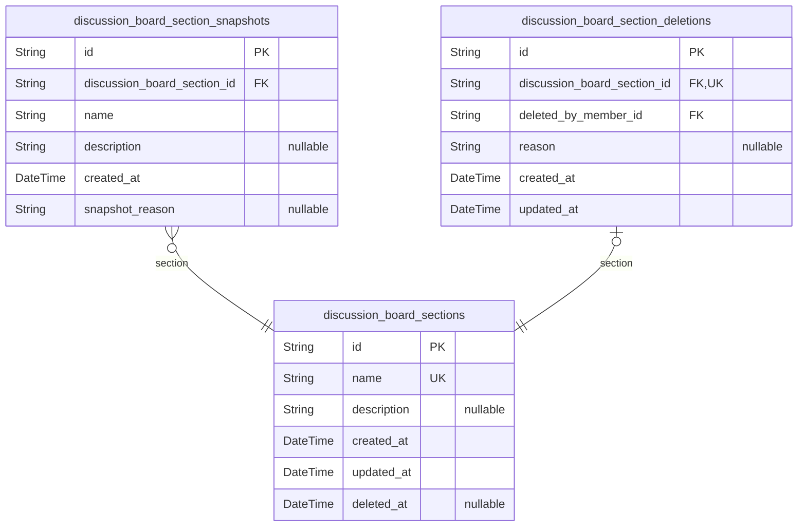
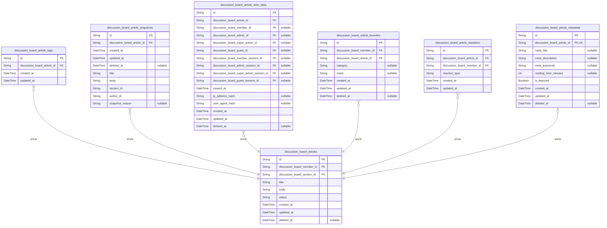
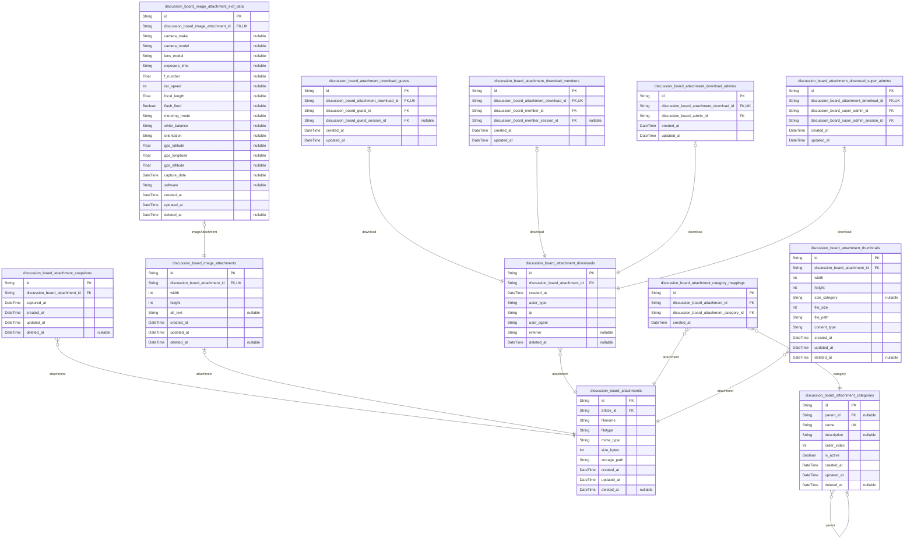
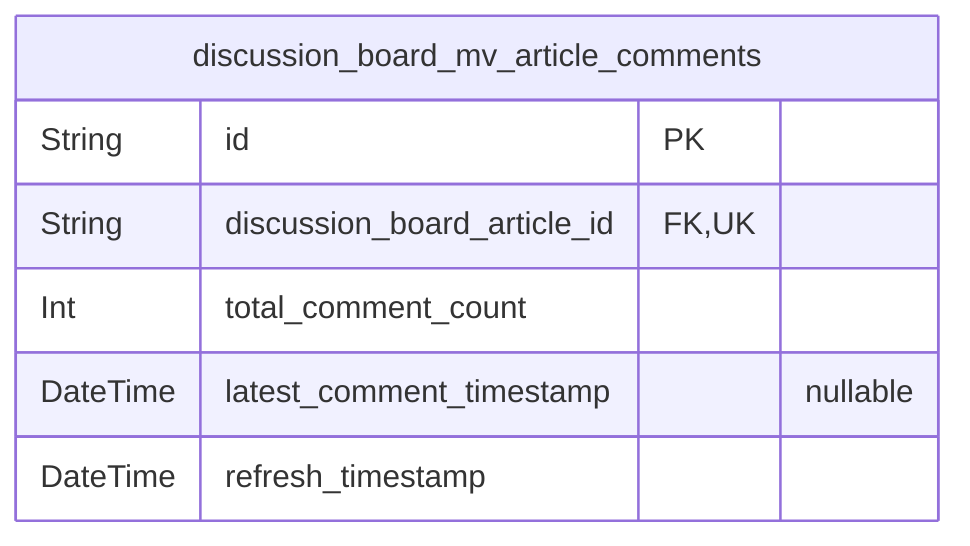

# Prisma Markdown

> Generated by [`prisma-markdown`](https://github.com/samchon/prisma-markdown)

- [Actors](#actors)
- [Systematic](#systematic)
- [Sections](#sections)
- [Articles](#articles)
- [Comments](#comments)
- [Administration](#administration)
- [Attachments](#attachments)
- [default](#default)

## Actors

```mermaid
erDiagram
"discussion_board_guests" {
  String id PK
  String device_fingerprint UK
  DateTime created_at
  DateTime updated_at
  DateTime deleted_at "nullable"
}
"discussion_board_guest_sessions" {
  String id PK
  String discussion_board_guest_id FK
  String ip
  String href
  String referrer
  DateTime created_at
  DateTime expired_at
}
"discussion_board_members" {
  String id PK
  String email UK
  String password_hash
  String display_name UK
  String bio "nullable"
  Boolean is_banned
  String ban_reason "nullable"
  String admin_grade "nullable"
  DateTime created_at
  DateTime updated_at
  DateTime deleted_at "nullable"
}
"discussion_board_member_sessions" {
  String id PK
  String discussion_board_member_id FK
  String access_token
  String refresh_token
  DateTime token_expiry
  String ip
  String href
  String referrer "nullable"
  DateTime created_at
  DateTime expired_at
}
"discussion_board_member_password_resets" {
  String id PK
  String discussion_board_member_id FK
  String token UK
  DateTime expired_at
  Boolean used
  DateTime used_at "nullable"
  DateTime created_at
  String ip_address "nullable"
  String user_agent "nullable"
}
"discussion_board_member_email_verifications" {
  String id PK
  String discussion_board_member_id FK
  String token UK
  String email
  DateTime expires_at
  DateTime verified_at "nullable"
  DateTime created_at
  DateTime updated_at
}
"discussion_board_admins" {
  String id PK
  String email UK
  String password_hash
  String admin_grade
  DateTime created_at
  DateTime updated_at
  DateTime deleted_at "nullable"
}
"discussion_board_admin_sessions" {
  String id PK
  String discussion_board_admin_id FK
  String access_token
  String refresh_token
  String ip
  String(80000) href
  String referrer "nullable"
  String user_agent "nullable"
  DateTime created_at
  DateTime updated_at
  DateTime expired_at
}
"discussion_board_admin_password_resets" {
  String id PK
  String admin_id FK
  String token UK
  DateTime expires_at
  DateTime used_at "nullable"
  DateTime created_at
  DateTime updated_at
}
"discussion_board_super_admins" {
  String id PK
  String email UK
  String password_hash
  String admin_grade
  DateTime created_at
  DateTime updated_at
  DateTime deleted_at "nullable"
}
"discussion_board_super_admin_sessions" {
  String id PK
  String discussion_board_super_admin_id FK
  String ip
  String href
  String referrer
  DateTime created_at
  DateTime expired_at
}
"discussion_board_super_admin_password_resets" {
  String id PK
  String discussion_board_super_admin_id FK
  String token UK
  DateTime expired_at
  DateTime used_at "nullable"
  DateTime created_at
  DateTime updated_at
}
"discussion_board_guest_sessions" }o--|| "discussion_board_guests" : guest
"discussion_board_member_sessions" }o--|| "discussion_board_members" : member
"discussion_board_member_password_resets" }o--|| "discussion_board_members" : member
"discussion_board_member_email_verifications" }o--|| "discussion_board_members" : member
"discussion_board_admin_sessions" }o--|| "discussion_board_admins" : admin
"discussion_board_admin_password_resets" }o--|| "discussion_board_admins" : admin
"discussion_board_super_admin_sessions" }o--|| "discussion_board_super_admins" : superAdmin
"discussion_board_super_admin_password_resets" }o--|| "discussion_board_super_admins" : superAdmin
```

### `discussion_board_guests`

Temporary guest accounts identified by device fingerprint for anonymous
read-only access.

Guest accounts are created automatically for unauthenticated visitors who
browse the discussion board. They enable temporary session tracking and
anonymous content viewing without requiring user registration. Each guest
account is identified by a device fingerprint hash that allows anonymous
continuity across browsing sessions while maintaining privacy.

Guest accounts have limited permissions: they can browse sections, view
articles and comments, but cannot create content, comment, or access
member-only features. Guest sessions are short-lived and automatically
expire after a configured duration.

Related entities: [discussion_board_guest_sessions](#discussion_board_guest_sessions) stores
temporary session tokens for guest access.

Properties as follows:

- `id`: Primary Key.
- `device_fingerprint`
  > Hash-based device fingerprint computed from browser/user-agent
  > characteristics for anonymous identification. Used to provide continuity
  > for unregistered visitors across browsing sessions while maintaining
  > privacy. This value is computed and hashed on the client side.
- `created_at`
  > Timestamp when this guest account was first created. Automatically set on
  > record creation.
- `updated_at`
  > Timestamp when this guest account was last updated. Automatically updated
  > on any modification.
- `deleted_at`
  > Timestamp when this guest account was soft-deleted, marking it as
  > inactive while preserving data for audit purposes. Null indicates the
  > guest account is currently active.

### `discussion_board_guest_sessions`

Temporary session tokens for guest access with short expiration times.

Stores connection metadata and session context for anonymous users
browsing the platform. Guest sessions are automatically created for
unauthenticated visitors and have limited duration for security. Each
session records the IP address, page URL, and referrer for audit
purposes. Sessions automatically expire after a short period to prevent
accumulation of stale anonymous sessions.

References the guest actor table [discussion_board_guests.id](#discussion_board_guests) to
establish the session owner relationship. Sessions are append-only and
managed through system events rather than direct user CRUD operations.

Properties as follows:

- `id`: Primary Key.
- `discussion_board_guest_id`: Belonged guest actor's [discussion_board_guests.id](#discussion_board_guests).
- `ip`: IP address of the session's connection for security auditing.
- `href`: URL where the session was created for tracking entry points.
- `referrer`: HTTP referrer header from the initial request for traffic analysis.
- `created_at`: Timestamp when the session was initially created.
- `expired_at`
  > Timestamp when the session should expire and become invalid. Required for
  > guest session security.

### `discussion_board_members`

Registered user accounts with email/password authentication and profile
information.

Stores member identity information including authentication credentials,
profile data, and account status. Members are authenticated users who can
create articles and comments, edit their profiles, and participate in
discussions. This table serves as the canonical identity record for all
member activities and references.

Account lifecycle includes active, suspended, and deleted states through
the deleted_at field for soft deletion. Admin privileges can be granted
through the admin_grade field when promoted by super administrators.
Email addresses must be unique across the system for authentication
purposes.

Related tables include [discussion_board_member_sessions](#discussion_board_member_sessions) for JWT
sessions, [discussion_board_member_password_resets](#discussion_board_member_password_resets) for password
recovery, and [discussion_board_member_email_verifications](#discussion_board_member_email_verifications) for
email confirmation. Foreign key relationships work from child tables to
this parent table.

Properties as follows:

- `id`: Primary Key.
- `email`
  > Unique email address used for authentication and account identification.
  > Required for registration and login. Must follow standard email format
  > and be unique across all registered accounts.
- `password_hash`
  > Securely hashed password using bcrypt or similar algorithm. Never stored
  > in plain text and never transmitted unencrypted. Minimum password
  > complexity is enforced during registration.
- `display_name`
  > Public display name shown on articles, comments, and user profiles. Users
  > can edit this name after registration. Used for identification in the
  > community.
- `bio`
  > Optional biographical text describing the user. Supports markdown
  > formatting for rich text. Displayed on user profiles for community
  > engagement.
- `is_banned`
  > Indicates whether the user account is currently banned from the platform.
  > Banned users cannot log in but their existing content remains visible.
- `ban_reason`
  > Administrative reason for banning the user account. Provides context for
  > moderation decisions and may be shown to banned users upon login
  > attempts.
- `admin_grade`
  > Administrative privilege level when promoted. Null for regular members,
  > 'regular' for administrators, 'super' for super administrators.
  > Controlled by super administrators only.
- `created_at`
  > Timestamp when the user account was created during registration. Used for
  > account age tracking and audit purposes.
- `updated_at`
  > Timestamp when the user account was last modified. Automatically updated
  > on profile edits, password changes, or status updates.
- `deleted_at`
  > Timestamp when the user account was soft deleted. Null indicates active
  > account, non-null indicates deleted account with preserved data
  > relationships for audit.

### `discussion_board_member_sessions`

JWT session tokens for member authentication with access and refresh
token support.

Stores authentication session information for registered members. Each
session represents a member's login activity with JWT token pair (access
+ refresh) for secure API access. Sessions support token refresh
mechanism and track connection metadata for security auditing.

Sessions are created when members successfully authenticate via login
endpoint. Access tokens are short-lived for security, while refresh
tokens allow session continuation without re-authentication. Expired
sessions are automatically cleaned up by system maintenance processes.

Related to [discussion_board_members](#discussion_board_members) for member identity
verification. Used by authentication middleware to validate API requests
and maintain user session state.

Properties as follows:

- `id`: Primary Key.
- `discussion_board_member_id`: Associated member's [discussion_board_members.id](#discussion_board_members).
- `access_token`
  > JWT access token string for API authentication. Short-lived token used
  > for authorization in API requests. Typically valid for 15-60 minutes
  > depending on security configuration.
- `refresh_token`
  > JWT refresh token string for obtaining new access tokens without
  > re-authentication. Long-lived token used to refresh expired access tokens
  > while maintaining session continuity. Stored securely for session
  > recovery.
- `token_expiry`
  > Expiration datetime for the access token. Determines when the current
  > access token becomes invalid and requires refresh. Used by authentication
  > middleware to reject expired tokens and trigger refresh flows.
- `ip`
  > IP address of the device that initiated the session. Captured from HTTP
  > request headers for security auditing and geographic logging. Helps
  > detect suspicious login patterns from unfamiliar locations.
- `href`
  > Full URL of the page where login occurred. Captures the exact location
  > within the application where authentication was initiated for user
  > journey tracking and analytics.
- `referrer`
  > HTTP Referrer header value indicating the previous page before login. Can
  > be empty or contain external site URL for tracking user flow into
  > authentication process.
- `created_at`
  > Timestamp when the session was created. Set automatically upon successful
  > authentication and JWT token generation. Used for session lifecycle
  > management and audit trails.
- `expired_at`
  > Timestamp when the session expires and becomes invalid. Determined by
  > session duration policy, after which all tokens become unusable. Used to
  > clean up expired sessions and enforce security policies.

### `discussion_board_member_password_resets`

Password reset tokens for member account recovery with expiration tracking.

Each record represents a single password reset request initiated by a
member. The token is generated and sent to the member's email, allowing
them to reset their password within the expiration window. Once used, the
token is marked as consumed to prevent reuse.

Password reset tokens are temporary security artifacts that expire after
a configured time period (typically 1-24 hours) to minimize security
risks. Multiple active tokens may exist per member if they initiate
multiple reset requests before using any.

This table supports the password reset flow where members who forget
their passwords can regain access to their accounts through email
verification. The token acts as a temporary authorization grant for
password changes without requiring the original password.

Related entities: [discussion_board_members](#discussion_board_members) for the member
requesting password reset.

Properties as follows:

- `id`: Primary Key.
- `discussion_board_member_id`: Member requesting password reset. [discussion_board_members.id](#discussion_board_members)
- `token`
  > Unique password reset token sent to member's email for verification. The
  > token should be cryptographically secure and sufficiently random to
  > prevent guessing attacks.
- `expired_at`
  > Timestamp when this password reset token expires and becomes invalid.
  > Tokens should have a limited validity period (e.g., 1-24 hours) for
  > security.
- `used`
  > Whether this password reset token has been consumed to successfully reset
  > a password. Once true, the token cannot be reused for additional password
  > changes.
- `used_at`
  > Timestamp when this token was used to reset a password. Null until the
  > token is consumed.
- `created_at`
  > Timestamp when this password reset request was created and token was
  > generated.
- `ip_address`
  > IP address of the client device that initiated the password reset
  > request, recorded for security audit purposes.
- `user_agent`
  > HTTP User-Agent header from the client that initiated the password reset
  > request, recorded for security audit purposes.

### `discussion_board_member_email_verifications`

Email verification tokens for member registration confirmation.

This table stores unique tokens sent to member email addresses during the
registration process. Each token has a short expiration time window for
security. When a member clicks the verification link with the token, the
system marks it as verified and records the verification timestamp.

The table supports the member authentication flow as defined in
registration requirements sections 24-32, ensuring email ownership
validation before full account activation. Each verification token is
single-use and can be used only once for a specific member's email
address. The email field is duplicated from the parent member record to
capture the email address at verification time, which is essential for
tracking verification attempts and handling email change scenarios.

Related entities: [discussion_board_members](#discussion_board_members) for the member being
verified, [discussion_board_member_sessions](#discussion_board_member_sessions) for session creation
after successful verification.

Properties as follows:

- `id`: Primary Key.
- `discussion_board_member_id`
  > Target member who requested email verification. {@link
  > discussion_board_members.id}.
- `token`
  > Unique verification token sent to the member's email address. This token
  > is used in verification URLs and should be cryptographically secure.
- `email`
  > Email address being verified. Stored separately from member record to
  > handle email change scenarios and capture the email at verification time.
- `expires_at`
  > Expiration timestamp for this verification token. Tokens become invalid
  > after this time for security.
- `verified_at`
  > Timestamp when the member successfully verified their email using this
  > token. Null indicates pending verification.
- `created_at`: Timestamp when the verification token was generated and sent.
- `updated_at`
  > Timestamp when the verification record was last updated, typically when
  > verified.

### `discussion_board_admins`

Administrator accounts with email/password authentication and role grade
distinction.

Stores administrator identity information including authentication
credentials and role classification. Administrators have elevated
privileges for content moderation, user management, and platform
governance. This table serves as the canonical identity record for all
administrator actors in the system.

Administrators authenticate via email and password, with sessions tracked
in [discussion_board_admin_sessions](#discussion_board_admin_sessions) and password resets managed
through [discussion_board_admin_password_resets](#discussion_board_admin_password_resets). Role
classification (regular vs super) determines administrative capabilities
and hierarchy as defined in platform governance requirements.

Properties as follows:

- `id`: Primary Key.
- `email`
  > Email address used for administrator authentication and communication.
  > Must be unique across all administrator accounts.
- `password_hash`: Salted hash of administrator's password for authentication security.
- `admin_grade`
  > Role classification indicating administrator privilege level. Values:
  > "regular" for standard administrators, "super" for super administrators
  > with elevated privileges.
- `created_at`: Timestamp when the administrator account was created.
- `updated_at`: Timestamp when the administrator account was last modified.
- `deleted_at`
  > Timestamp when the administrator account was soft-deleted, or null if
  > still active.

### `discussion_board_admin_sessions`

JWT session tokens for administrator authentication with access and
refresh tokens.

This table manages administrator login sessions with JSON Web Tokens for
secure authentication. Sessions track connection context including IP
address, browser referrer, and timestamp information for audit purposes.
Access tokens are used for API authentication while refresh tokens enable
secure token renewal without requiring re-login.

Each session belongs to exactly one [discussion_board_admins](#discussion_board_admins)
administrator and includes expiration tracking for security compliance.
Sessions are append-only audit trails of administrator authentication
events and are managed through authentication flows rather than direct
user CRUD operations.

Properties as follows:

- `id`: Primary Key.
- `discussion_board_admin_id`: Belonged administrator's [discussion_board_admins.id](#discussion_board_admins).
- `access_token`: JWT access token used for API authentication and authorization.
- `refresh_token`
  > JWT refresh token used to obtain new access tokens without requiring
  > re-login.
- `ip`
  > Client IP address from which the session was initiated for security
  > auditing.
- `href`: Full URL or path where the session was created for context tracking.
- `referrer`
  > HTTP referrer header value indicating the page that linked to the login
  > page.
- `user_agent`: Client browser or device user agent string for device fingerprinting.
- `created_at`: Timestamp when the session was created.
- `updated_at`: Timestamp when the session was last updated or accessed.
- `expired_at`
  > Timestamp when the session expires and becomes invalid for security
  > compliance.

### `discussion_board_admin_password_resets`

Password reset tokens for administrator account recovery.

Stores secure tokens generated when administrators request password
resets. Each token has an expiration time and usage status to ensure
one-time use and prevent replay attacks. Administrators receive these
tokens via email or secure channels to verify their identity before
resetting passwords.

Tokens are invalidated after use or expiration to maintain security. This
table provides audit trail of password reset requests for accountability
and security monitoring.

Properties as follows:

- `id`: Primary Key.
- `admin_id`
  > Administrator requesting password reset. {@link
  > discussion_board_admins.id}
- `token`: Secure reset token hash for authentication.
- `expires_at`: Token expiration timestamp for security enforcement.
- `used_at`: Timestamp when token was successfully used for password reset.
- `created_at`: Timestamp when password reset request was created.
- `updated_at`: Timestamp when record was last updated.

### `discussion_board_super_admins`

Super administrator accounts with email/password authentication and
elevated privileges compared to regular administrators.

Super administrators represent the highest level of administrative
authority within the platform with additional capabilities including
administrator promotion/demotion and platform governance oversight. They
have the same authentication requirements as regular administrators
(email/password) but with enhanced privileges documented in the
requirement specifications.

This table serves as the canonical identity record for super
administrator actors, referenced when enforcing administrative
permissions and auditing elevated administrative actions. {\@link
discussion_board_admins} represents regular administrator accounts with
similar authentication but limited privileges.

Properties as follows:

- `id`: Primary Key.
- `email`
  > Unique email address used for super administrator authentication and
  > identification. Must follow standard email format and be unique across
  > all administrator accounts.
- `password_hash`
  > Securely hashed password for super administrator authentication. Stored
  > using industry-standard cryptographic hashing algorithms.
- `admin_grade`
  > Administrator grade designation indicating privilege level. Typically
  > "regular" for standard administrators or "super" for elevated
  > administrators.
- `created_at`: Timestamp when the super administrator account was created in the system.
- `updated_at`
  > Timestamp of the most recent update to the super administrator account
  > record.
- `deleted_at`
  > Soft deletion timestamp when the super administrator account was marked
  > as deleted, preserving data for audit purposes while removing access.

### `discussion_board_super_admin_sessions`

Stores JWT session tokens for super administrator authentication with
access and refresh token support.

This table follows the standard session table pattern for authenticated
actors, recording each login event with connection metadata. Each record
represents an active session for a super administrator, allowing token
refresh mechanics and security audit capabilities. The table includes IP
address, user agent context, and temporal fields for proper session
lifecycle management.

Super administrator sessions inherit the same JWT-based authentication
patterns as regular administrator sessions but are maintained separately
for audit and security isolation. Sessions are used to validate super
administrator privileges when performing elevated administrative actions
like promoting/demoting administrators, reviewing admin requests, and
overseeing platform governance.

Related to [discussion_board_super_admins](#discussion_board_super_admins) for actor identity and
[discussion_board_super_admin_password_resets](#discussion_board_super_admin_password_resets) for authentication
continuity.

Properties as follows:

- `id`: Primary Key.
- `discussion_board_super_admin_id`: Super administrator's [discussion_board_super_admins.id](#discussion_board_super_admins).
- `ip`
  > IP address from which the super administrator logged in. Used for
  > security audit and geographic tracking of login events.
- `href`
  > Full URL from which the super administrator initiated the login session.
  > Captures the entry point for session creation and is used in security
  > forensics.
- `referrer`
  > HTTP referrer header from which the super administrator navigated to the
  > login page. Used for user journey analysis and security context.
- `created_at`
  > Timestamp when this super administrator session was created. Used for
  > session age calculation and audit trail completeness.
- `expired_at`
  > Timestamp when this super administrator session is scheduled to expire.
  > JWT tokens will become invalid after this timestamp, requiring refresh or
  > re-authentication.

### `discussion_board_super_admin_password_resets`

Password reset tokens with expiration for super administrator account
recovery.

This table stores temporary password reset tokens sent to super
administrators via email or other secure channels. Each token is
single-use and expires after a configurable time period. The table tracks
token usage to prevent replay attacks and ensure security compliance.

Tokens are generated when a super administrator requests a password reset
and are invalidated after use or expiration. This mechanism follows the
same security pattern as [discussion_board_member_password_resets](#discussion_board_member_password_resets)
and [discussion_board_admin_password_resets](#discussion_board_admin_password_resets) tables.

The table maintains referential integrity with the parent {@link
discussion_board_super_admins} table, ensuring only valid super
administrators can request password resets.

Properties as follows:

- `id`: Primary Key.
- `discussion_board_super_admin_id`
  > The super administrator who requested this password reset. References
  > [discussion_board_super_admins.id](#discussion_board_super_admins).
- `token`
  > Cryptographically secure token for password reset verification. This
  > token is sent to the super administrator via email and must be provided
  > to complete the password reset process.
- `expired_at`
  > Timestamp when this password reset token expires and becomes invalid.
  > After this time, the token cannot be used even if it hasn't been used
  > yet.
- `used_at`
  > Timestamp when this password reset token was successfully used to change
  > the password. Null indicates the token has not been used yet. Once set,
  > the token cannot be reused.
- `created_at`: Timestamp when this password reset token record was created.
- `updated_at`: Timestamp when this password reset token record was last updated.

## Systematic

```mermaid
erDiagram
"discussion_board_status_enums" {
  String id PK
  String entity_type
  String value
  String description
  Int sort_order
  Boolean is_active
  DateTime created_at
  DateTime updated_at
  DateTime deleted_at "nullable"
}
"discussion_board_system_health_metrics" {
  String id PK
  String metric_type
  Float metric_value
  String unit
  String source_service
  DateTime collection_timestamp
  String status
  DateTime created_at
  DateTime updated_at
  DateTime deleted_at "nullable"
}
"discussion_board_system_configurations" {
  String id PK
  String key UK
  String value "nullable"
  String data_type
  String description
  DateTime created_at
  DateTime updated_at
  DateTime deleted_at "nullable"
}
"discussion_board_system_notifications" {
  String id PK
  String title
  String content
  String notification_type
  String status
  String priority
  String target_entity_type "nullable"
  String target_entity_id "nullable"
  DateTime expires_at "nullable"
  DateTime created_at
  DateTime updated_at
  DateTime delivered_at "nullable"
  DateTime read_at "nullable"
}
"discussion_board_maintenance_schedules" {
  String id PK
  String status_type_id FK
  String maintenance_type
  String title
  String description "nullable"
  DateTime planned_start_at
  DateTime planned_end_at
  DateTime actual_start_at "nullable"
  DateTime actual_end_at "nullable"
  DateTime created_at
  DateTime updated_at
  DateTime deleted_at "nullable"
}
"discussion_board_status_types" {
  String id PK
  String category
  String code
  String display_name
  String description "nullable"
  Int display_order
  Boolean is_active
  DateTime created_at
  DateTime updated_at
  DateTime deleted_at "nullable"
}
"discussion_board_system_audit_logs" {
  String id PK
  String actor_type
  String action_type
  String action_category
  String action_description
  String target_type "nullable"
  String target_id "nullable"
  String ip_address "nullable"
  String user_agent "nullable"
  DateTime created_at
  DateTime updated_at
  DateTime deleted_at "nullable"
}
"discussion_board_system_metadata" {
  String id PK
  String status_type_id FK
  String name
  String value
  String data_type
  String scope
  String description "nullable"
  Int version
  DateTime created_at
  DateTime updated_at
  DateTime deleted_at "nullable"
}
"discussion_board_status_enum_snapshots" {
  String id PK
  String discussion_board_status_enum_id FK
  String snapshot_name
  String description "nullable"
  String snapshot_reason "nullable"
  DateTime created_at
  DateTime updated_at
  DateTime deleted_at "nullable"
}
"discussion_board_status_enum_references" {
  String id PK
  String discussion_board_status_enums_id FK
  String referenced_table
  String referenced_column
  DateTime created_at
  DateTime updated_at
  DateTime deleted_at "nullable"
}
"discussion_board_system_notification_of_members" {
  String id PK
  String discussion_board_system_notification_id FK,UK
  String discussion_board_member_id FK
  Boolean is_read
  DateTime read_at "nullable"
  DateTime acknowledged_at "nullable"
  String notification_preferences "nullable"
  DateTime created_at
  DateTime updated_at
  DateTime deleted_at "nullable"
}
"discussion_board_system_notification_of_admins" {
  String id PK
  String discussion_board_system_notification_id FK,UK
  String discussion_board_admin_id FK
  DateTime created_at
  DateTime updated_at
  String notification_context "nullable"
}
"discussion_board_system_notification_of_super_admins" {
  String id PK
  String discussion_board_system_notification_id FK,UK
  String discussion_board_super_admin_id FK
  String discussion_board_super_admin_session_id FK "nullable"
  DateTime created_at
  DateTime updated_at
}
"discussion_board_system_health_metric_metadata" {
  String id PK
  String system_health_metric_id FK
  String key
  String value
  DateTime created_at
  DateTime updated_at
}
"discussion_board_system_audit_log_of_members" {
  String id PK
  String system_audit_log_id FK,UK
  String member_id FK
  String member_session_id FK
  DateTime created_at
  DateTime updated_at
}
"discussion_board_system_audit_log_of_admins" {
  String id PK
  String discussion_board_system_audit_log_id FK,UK
  String discussion_board_admin_id FK
  String discussion_board_admin_session_id FK
  DateTime created_at
  DateTime updated_at
}
"discussion_board_system_audit_log_of_super_admins" {
  String id PK
  String system_audit_log_id FK,UK
  String actor_type
}
"discussion_board_system_audit_log_parameters" {
  String id PK
  String system_audit_log_id FK
  String parameter_key
  String parameter_value
  DateTime created_at
  DateTime updated_at
}
"discussion_board_status_enum_snapshot_metadata" {
  String id PK
  String discussion_board_status_enum_snapshot_id FK
  String key
  String value
  DateTime created_at
  DateTime updated_at
  DateTime deleted_at "nullable"
}
"discussion_board_maintenance_schedules" }o--|| "discussion_board_status_types" : statusType
"discussion_board_system_metadata" }o--|| "discussion_board_status_types" : statusType
"discussion_board_status_enum_snapshots" }o--|| "discussion_board_status_enums" : statusEnum
"discussion_board_status_enum_references" }o--|| "discussion_board_status_enums" : statusEnum
"discussion_board_system_notification_of_members" |o--|| "discussion_board_system_notifications" : systemNotification
"discussion_board_system_notification_of_admins" |o--|| "discussion_board_system_notifications" : systemNotification
"discussion_board_system_notification_of_super_admins" |o--|| "discussion_board_system_notifications" : systemNotification
"discussion_board_system_health_metric_metadata" }o--|| "discussion_board_system_health_metrics" : metric
"discussion_board_system_audit_log_of_members" |o--|| "discussion_board_system_audit_logs" : auditLog
"discussion_board_system_audit_log_of_admins" |o--|| "discussion_board_system_audit_logs" : systemAuditLog
"discussion_board_system_audit_log_of_super_admins" |o--|| "discussion_board_system_audit_logs" : systemAuditLog
"discussion_board_system_audit_log_parameters" }o--|| "discussion_board_system_audit_logs" : systemAuditLog
"discussion_board_status_enum_snapshot_metadata" }o--|| "discussion_board_status_enum_snapshots" : snapshot
```

### `discussion_board_status_enums`

Centralized enumeration of all status values for content, requests,
users, and administrative actions used across domains.

This table serves as the single source of truth for all status
definitions in the system, providing consistent status values across
multiple business domains. Each row represents a valid status value that
can be used for a specific entity type (articles, comments, admin
requests, users, bans). Status values include both system-defined
standard values (like 'pending', 'approved', 'rejected', 'active',
'suspended', 'deleted') and custom domain-specific statuses.

Administrators can manage status values through dedicated CRUD
interfaces, allowing for system configuration and localization of status
labels. The table supports soft deletion of deprecated status values
while maintaining referential integrity with existing data.

**Example usage:**
- Article statuses: 'draft', 'published', 'archived', 'deleted'
- Comment statuses: 'visible', 'hidden', 'flagged', 'deleted'
- Admin request statuses: 'pending', 'approved', 'rejected', 'cancelled'
- User account statuses: 'active', 'suspended', 'deleted', 'banned'
- Ban statuses: 'active', 'expired', 'revoked'

All status values are referenced by their string value in domain tables,
ensuring data consistency and simplifying queries. The sort_order field
allows for custom ordering in UI dropdowns and reports.

Properties as follows:

- `id`: Primary Key.
- `entity_type`
  > The type of entity this status value applies to. Defines which domain or
  > table uses this status value. Examples: 'article', 'comment',
  > 'admin_request', 'user', 'ban', 'attachment'. This field groups status
  > values by their usage domain for efficient querying and management.
- `value`
  > The actual status value string used in business logic and UI display.
  > Should be lowercase, snake_case format for consistency. Examples:
  > 'pending', 'approved', 'draft', 'published', 'active', 'suspended',
  > 'deleted'. This value is referenced by domain tables when setting status
  > fields.
- `description`
  > Human-readable description explaining the meaning and usage of this
  > status value. Provides context for administrators managing status values
  > and for developers understanding business logic. Example: 'Article is
  > visible to all users and appears in search results' for 'published'
  > status.
- `sort_order`
  > Numerical ordering for displaying status values in UI dropdowns and
  > lists. Lower numbers appear first. Allows administrators to control the
  > display order of status options in forms and reports. Default ordering
  > for new entries can be based on creation timestamp.
- `is_active`
  > Indicates whether this status value is currently active and available for
  > use. Inactive status values remain in the database for historical
  > reference but are not shown in UI dropdowns for new selections. Allows
  > deprecation of old status values while preserving data integrity.
- `created_at`
  > Timestamp when this status value was first created in the system. Used
  > for auditing and tracking the lifecycle of enumeration values.
- `updated_at`
  > Timestamp when this status value was last modified. Tracks changes to
  > status definitions for version control and audit purposes.
- `deleted_at`
  > Timestamp when this status value was soft-deleted. Allows removal of
  > deprecated status values while maintaining referential integrity with
  > historical data. Null indicates the status value is currently active and
  > not deleted.

### `discussion_board_system_health_metrics`

Performance and health metrics tracking for system monitoring.

This table stores quantitative measurements of system performance, health
indicators, and operational metrics used for monitoring, alerting, and
capacity planning. Metrics include response times, success rates, error
rates, connection health scores, and resource utilization measurements
collected from various services and components.

Each record represents a single metric measurement at a specific point in
time, with categorization by metric type and source service. Metrics are
used by administrators and SRE teams to monitor system health, identify
performance degradation, and trigger alerts for operational issues.

Related entities: [discussion_board_system_configurations](#discussion_board_system_configurations) for
monitoring configuration, [discussion_board_system_notifications](#discussion_board_system_notifications)
for alert generation based on metric thresholds.

Properties as follows:

- `id`: Primary Key.
- `metric_type`
  > Category of the health metric being measured. Examples: 'response_time',
  > 'success_rate', 'error_rate', 'connection_health', 'cpu_utilization',
  > 'memory_usage', 'disk_io', 'network_latency', 'queue_depth',
  > 'throughput'. This field categorizes metrics for aggregation and
  > analysis.
- `metric_value`
  > Numerical value of the metric measurement. The interpretation depends on
  > metric_type and unit fields. For response times in milliseconds, for
  > success rates as percentages (0.0-100.0), for connection health as score
  > (0.0-1.0).
- `unit`
  > Measurement unit of the metric value. Examples: 'milliseconds',
  > 'percent', 'score', 'bytes', 'requests_per_second', 'connections',
  > 'percentage'. Provides context for interpreting metric_value.
- `source_service`
  > Service or component that generated this metric. Identifies the monitored
  > system component such as 'api_gateway', 'database', 'cache',
  > 'search_service', 'file_storage', 'authentication_service'. Used for
  > filtering metrics by source.
- `collection_timestamp`
  > Timestamp when this metric was collected from the source system.
  > Represents the measurement time rather than storage time. Used for
  > time-series analysis and correlation with system events.
- `status`
  > Health status classification based on metric value and thresholds.
  > Values: 'healthy', 'warning', 'critical'. Derived by comparing
  > metric_value against configured thresholds for the metric_type and
  > source_service.
- `created_at`
  > Timestamp when this metric record was stored in the database. Represents
  > when the monitoring system processed and persisted the measurement.
- `updated_at`
  > Timestamp when this metric record was last updated. For audit trail and
  > change tracking of metric records.
- `deleted_at`
  > Timestamp when this metric record was soft-deleted. Allows retention of
  > historical metrics while removing them from active queries.

### `discussion_board_system_configurations`

Centralized system configuration metadata and settings that are
referenced across all application domains.

Stores key-value pairs for platform-wide configuration settings including
feature flags, operational parameters, and global settings. Each
configuration entry includes a unique key, typed value, and descriptive
documentation for system administrators. Configurations support multiple
data types (string, integer, boolean, JSON) through explicit type
specification to ensure proper interpretation across domains.

All configuration changes are audit-trailed through temporal fields, and
soft delete support allows configuration deprecation without breaking
historical references. This table serves as the single source of truth
for system-wide operational settings accessible to all application
components.

Properties as follows:

- `id`: Primary Key.
- `key`
  > Unique configuration key identifier used to reference this setting across
  > domains. Must follow dot notation convention: "component.feature.setting"
  > (e.g., "articles.pagination.page_size",
  > "users.registration.require_email_verify").
- `value`
  > Configuration value stored as string. Interpretation depends on the
  > data_type field (e.g., "true" for boolean, "100" for integer,
  > "{\"enabled\": true}" for JSON). Nullable for optional configurations.
- `data_type`
  > Data type of the configuration value for proper interpretation. Valid
  > values: "string", "integer", "double", "boolean", "json", "datetime",
  > "uri". Determines how the value field should be parsed and validated.
- `description`
  > Human-readable explanation of the configuration's purpose, usage, and
  > impact. Should include acceptable value ranges, default values, and
  > component dependencies.
- `created_at`
  > Timestamp when this configuration entry was initially created in the
  > system.
- `updated_at`
  > Timestamp when this configuration entry was last modified. Updated
  > automatically on any change.
- `deleted_at`
  > Timestamp when this configuration was soft-deleted (marked as
  > deprecated). Null indicates active configuration.

### `discussion_board_system_notifications`

System notifications and alerts for users including administrative
announcements, platform status updates, and targeted communications.

This table stores all system-generated notifications that need to be
delivered to users. Notifications can include administrative
announcements, status updates about platform changes, alerts about
content moderation actions, and personalized communications from
administrators. Each notification tracks its delivery lifecycle including
creation, sending, and user reading status.

Notifications reference system entities like {@link
discussion_board_system_audit_logs} for administrative actions, but
maintain a clean separation from business transaction tables.
User-specific metadata is handled through subtype tables that establish
1:1 relationships with actor types.

Properties as follows:

- `id`: Primary Key.
- `title`
  > Brief, attention-grabbing title of the notification that summarizes the
  > content for quick scanning.
- `content`
  > Full content of the notification including details, instructions, and any
  > necessary context for the recipient.
- `notification_type`
  > Type classification of the notification such as 'announcement', 'alert',
  > 'status_update', 'moderation_action', or 'personal_message'.
- `status`
  > Current delivery status of the notification: 'pending' (awaiting
  > delivery), 'sent' (delivered but unread), 'read' (acknowledged by
  > recipient), or 'archived' (no longer active).
- `priority`
  > Priority level that determines notification display and alert behavior:
  > 'low', 'normal', 'high', or 'critical'.
- `target_entity_type`
  > Type of system entity this notification references such as 'article',
  > 'comment', 'section', 'admin_request', or 'user' for context-aware
  > navigation.
- `target_entity_id`
  > UUID of the specific system entity this notification references, used in
  > conjunction with target_entity_type for deeplinking.
- `expires_at`
  > Timestamp when this notification should be automatically considered
  > expired and no longer shown to users.
- `created_at`
  > Timestamp when the notification was created in the system. This is the
  > authoritative creation time.
- `updated_at`
  > Timestamp when the notification was last modified. Automatically updated
  > on any change to notification fields.
- `delivered_at`
  > Timestamp when the notification was successfully delivered to the user's
  > notification center. Indicates when it became available for viewing.
- `read_at`
  > Timestamp when the notification was marked as read by the recipient user.
  > Null indicates the notification remains unread.

### `discussion_board_maintenance_schedules`

Maintenance schedule records for system operations, backups, and updates
with status tracking.

Tracks planned and executed maintenance activities across the platform
including scheduled backups, server updates, database maintenance, and
system patch deployments. Each record captures the maintenance window,
type of operation, status progression, and execution details for audit
and operational oversight.

This table enables administrators to schedule, monitor, and review system
maintenance activities while preventing scheduling conflicts. Status
tracking follows the centralized status enumeration system {@link
discussion_board_status_types} for consistency across all maintenance
operations.

Properties as follows:

- `id`: Primary Key.
- `status_type_id`
  > Current status of the maintenance schedule following system-wide status
  > types. [discussion_board_status_types.id](#discussion_board_status_types).
- `maintenance_type`
  > Type of maintenance operation being performed (e.g., 'backup',
  > 'system_update', 'database_maintenance', 'security_patch',
  > 'performance_optimization').
- `title`
  > Descriptive title summarizing the maintenance activity for quick
  > identification.
- `description`
  > Detailed explanation of maintenance scope, tasks, and potential impact on
  > platform services.
- `planned_start_at`
  > Scheduled start time for the maintenance window allowing service
  > interruption planning.
- `planned_end_at`
  > Scheduled end time establishing the maximum expected duration of service
  > impact.
- `actual_start_at`
  > Actual timestamp when maintenance operations began execution for
  > performance tracking.
- `actual_end_at`
  > Actual timestamp when maintenance operations completed execution for SLA
  > compliance.
- `created_at`
  > Timestamp when this maintenance schedule was initially created by
  > administrators.
- `updated_at`
  > Timestamp when this maintenance schedule was last modified for change
  > tracking.
- `deleted_at`
  > Timestamp when this maintenance schedule was soft-deleted for archival
  > while preserving records.

### `discussion_board_status_types`

Centralized enumeration of all status values used across the discussion
board system.

This table serves as the authoritative source for status definitions
including article states, comment states, admin request statuses, user
account states, and ban statuses. Each record defines a specific status
within a category, with display ordering, descriptions, and active status
flags.

**Key References:**
- Article statuses: [discussion_board_articles](#discussion_board_articles)
- Comment statuses: [discussion_board_comments](#discussion_board_comments)
- Admin request statuses: [discussion_board_admin_requests](#discussion_board_admin_requests)
- User account states: [discussion_board_members](#discussion_board_members), {@link
discussion_board_admins}, [discussion_board_super_admins](#discussion_board_super_admins)
- Ban statuses: [discussion_board_user_bans](#discussion_board_user_bans)

**Usage:** Instead of hardcoding status values in application logic, all
status references should use foreign keys to this table for
maintainability and consistency.

Properties as follows:

- `id`: Primary Key.
- `category`
  > Domain category of this status (e.g., "article", "comment",
  > "admin_request", "user_account", "ban"). Determines which domain this
  > status belongs to and groups related statuses together.
- `code`
  > Unique status code within its category (e.g., "pending", "approved",
  > "draft", "published"). This is the programmatic identifier used in
  > business logic and API responses.
- `display_name`
  > Human-readable display name for UI presentation (e.g., "Pending
  > Approval", "Approved", "Draft Article", "Published").
- `description`
  > Detailed description explaining the status meaning and when it should be
  > used. Provides context for administrators and developers.
- `display_order`
  > Numerical ordering for display purposes. Lower numbers appear first in
  > dropdowns and UI controls. Used to establish logical ordering of statuses
  > within a category.
- `is_active`
  > Whether this status is currently active and available for use. Inactive
  > statuses are hidden from UI but preserved for historical records.
- `created_at`
  > Timestamp when this status type was created. System-generated field for
  > audit purposes.
- `updated_at`
  > Timestamp when this status type was last updated. System-maintained field
  > for tracking changes.
- `deleted_at`
  > Timestamp when this status type was soft deleted. Allows for removal from
  > UI while preserving referential integrity for historical records.

### `discussion_board_system_audit_logs`

Comprehensive audit trail of all system actions including user actions,
administrative decisions, content modifications, and configuration
changes.

This table serves as the central repository for all auditable events
across the discussion board platform. Each record represents a single
action performed by an actor (user, administrator, or system process)
that had meaningful impact on the system state or user data. Audit logs
are immutable once created and provide forensic capability for security
analysis, compliance reporting, and troubleshooting.

When an administrator investigates suspicious activity, they can query
this table to reconstruct the sequence of events leading to a particular
system state. Similarly, when users report issues with their content,
support staff can review the audit trail to identify what changes were
made and by whom.

The table follows a polymorphic ownership pattern where different actor
types can be associated with audit entries through subtype tables. All
audit entries are timestamped and include categorization for efficient
filtering. [discussion_board_members](#discussion_board_members), {@link
discussion_board_admins}, and [discussion_board_super_admins](#discussion_board_super_admins) can
be actors via the subtype tables. The parameters field has been
normalized into a child table to maintain 1NF compliance.

Properties as follows:

- `id`: Primary Key.
- `actor_type`
  > Type of actor who performed this action for polymorphic ownership
  > pattern. Used for routing to appropriate subtype table. Valid values:
  > 'member', 'admin', 'super_admin', 'system'.
- `action_type`
  > Specific action performed (e.g., 'user_login', 'article_create',
  > 'comment_edit', 'user_ban', 'section_create', 'admin_request_approve').
  > Used for detailed categorization and filtering of similar actions.
- `action_category`
  > Broad category classifying the type of action for high-level reporting
  > and analysis. Valid values: 'authentication', 'user_management',
  > 'content_modification', 'administrative', 'system_configuration'.
- `action_description`
  > Human-readable description of the action performed, suitable for display
  > in audit reports and administrative interfaces. Should include context
  > about what was changed.
- `target_type`
  > Type of entity that was the target of this action. Valid values: 'user',
  > 'article', 'comment', 'section', 'attachment', 'admin_request', 'system'.
  > Used in conjunction with target_id to identify the affected entity.
- `target_id`
  > UUID identifier of the specific entity that was the target of this
  > action, corresponding to target_type field. Used to trace all actions
  > affecting a particular entity.
- `ip_address`
  > IP address from which the action was performed, captured for security and
  > auditing purposes. Essential for tracking suspicious activity patterns.
- `user_agent`
  > HTTP User-Agent header from the client that performed the action,
  > captured for forensic analysis and device fingerprinting.
- `created_at`
  > Timestamp when the audit entry was created, representing when the action
  > occurred. Audit entries are immutable once created.
- `updated_at`
  > Timestamp when the audit entry was last updated, used if audit entries
  > can be annotated or have status changes.
- `deleted_at`
  > Timestamp when the audit entry was soft-deleted for compliance with data
  > retention policies.

### `discussion_board_system_metadata`

Centralized system metadata storage for feature flags, configuration
values, and shared settings referenced by all components across the
platform.

This table serves as the single source of truth for system configuration,
allowing components to reference consistent values for operational
parameters, feature toggles, and environment settings. Configuration
values are typed and scoped to support different operational contexts
(global, per-domain, per-environment).

Key use cases include: dynamic feature flag toggling for A/B testing,
environment-specific configuration values, operational parameter
adjustments without deployment, and centralized settings management for
administrative control.

Configuration lifecycle: Values can be created, updated, activated,
deactivated, or archived, with full audit trail through snapshots. Status
transitions ensure proper governance of configuration changes.

Relationships: References [discussion_board_status_types](#discussion_board_status_types) for
status management, and may be associated with snapshots for version
history.

Properties as follows:

- `id`: Primary Key.
- `status_type_id`
  > Current status of this configuration value for lifecycle management.
  > [discussion_board_status_types.id](#discussion_board_status_types)
- `name`
  > Unique identifier for the configuration value, used by components to
  > reference this setting.
- `value`
  > Configuration value stored as string, with semantic interpretation based
  > on data_type field.
- `data_type`
  > Data type of the value for proper parsing and validation (e.g.,
  > 'boolean', 'integer', 'string', 'json', 'float').
- `scope`
  > Operational scope defining where this configuration applies (e.g.,
  > 'global', 'production', 'staging', 'development', 'tenant:*').
- `description`
  > Human-readable explanation of this configuration's purpose and usage
  > guidelines.
- `version`
  > Incremental version number for optimistic concurrency control and change
  > tracking.
- `created_at`: Timestamp when this configuration was first created in the system.
- `updated_at`: Timestamp when this configuration was last modified.
- `deleted_at`
  > Timestamp when this configuration was soft-deleted, allowing retention
  > for audit purposes.

### `discussion_board_status_enum_snapshots`

Audit trail snapshots of status enumeration changes, capturing historical
states for compliance and version tracking.

Each snapshot records a point-in-time state of a status enumeration entry
when it was created or modified. This enables tracking changes to status
values over time for audit compliance, version history, and regulatory
requirements. Snapshots preserve the exact state of status enumerations
at specific moments, allowing reconstruction of historical status
configurations.

Snapshots are created automatically when status enumeration entries are
modified, capturing both the new values and the context of the change.
They are read-only records that provide immutable evidence of status
configuration states. [discussion_board_status_enums](#discussion_board_status_enums) is the source
table for these snapshots.

Properties as follows:

- `id`: Primary Key.
- `discussion_board_status_enum_id`
  > Status enumeration entry being snapshotted. References the source status
  > enumeration record in [discussion_board_status_enums.id](#discussion_board_status_enums).
- `snapshot_name`
  > Descriptive name identifying this snapshot, such as
  > "v1.2.3-status-update" or "compliance-baseline-2025".
- `description`
  > Detailed description of the status enumeration at snapshot time. May be
  > null if no description existed.
- `snapshot_reason`
  > Reason for creating this snapshot, such as "system-update",
  > "compliance-audit", or "manual-version". Helps document why the snapshot
  > was taken.
- `created_at`
  > Timestamp when this snapshot was created. Represents the exact moment the
  > status enumeration state was captured.
- `updated_at`
  > Timestamp when this snapshot was last updated. For audit purposes,
  > typically matches created_at since snapshots are immutable.
- `deleted_at`
  > Timestamp when this snapshot was soft deleted. Allows historical
  > preservation while marking records as removed.

### `discussion_board_status_enum_references`

Tracks dependency relationships between status enumeration values and
domain tables that reference them.

This table enables safe validation before deleting or modifying status
values by identifying which business tables depend on specific status
options. Each record documents a foreign key relationship from a domain
table column to a status enumeration value, supporting dependency
analysis, migration planning, and referential integrity maintenance.

Used by system administrators and database migration tools to ensure
status value changes don't break existing data relationships. Provides
visibility into how status values are utilized across the platform for
governance and documentation purposes.

Key purpose: Prevent orphaned data references when status values are
modified or removed.

Properties as follows:

- `id`: Primary Key.
- `discussion_board_status_enums_id`
  > Referenced status enumeration value's {@link
  > discussion_board_status_enums.id}.
- `referenced_table`
  > Name of the domain table that contains a foreign key referencing this
  > status value. Examples: 'discussion_board_articles',
  > 'discussion_board_comments', 'discussion_board_admin_requests'.
- `referenced_column`
  > Column name within the referenced table that contains the foreign key to
  > the status value. Examples: 'status', 'article_status', 'request_status'.
- `created_at`: Timestamp when this dependency relationship was documented or discovered.
- `updated_at`: Timestamp when this dependency record was last updated.
- `deleted_at`
  > Timestamp when this dependency relationship was marked as deleted (soft
  > delete).

### `discussion_board_system_notification_of_members`

Subtype table implementing polymorphic ownership pattern for system
notifications targeted to member actors. Establishes 1:1 relationship
between system notifications and member recipients while storing
member-specific notification metadata such as read status, acknowledgment
timestamps, and delivery preferences.

This table enables personalized notification delivery where each system
notification can be customized for individual members while maintaining a
single authoritative source for notification content in the parent {@link
discussion_board_system_notifications} table. Member-specific attributes
like read status and acknowledgment timing are stored separately to avoid
duplication and ensure proper audit trails.

The 1:1 unique constraint ensures each system notification can have at
most one member-specific subtype record, enforcing correct polymorphic
ownership semantics where notifications can belong to multiple actor
types but only one specific actor instance.

Properties as follows:

- `id`: Primary Key.
- `discussion_board_system_notification_id`
  > Associated system notification's {@link
  > discussion_board_system_notifications.id} that this member subtype
  > references. Represents the parent notification containing shared content
  > and metadata.
- `discussion_board_member_id`
  > Target member actor's [discussion_board_members.id](#discussion_board_members) who is the
  > recipient of this personalized notification. Establishes the member-actor
  > ownership relationship.
- `is_read`
  > Whether the member has marked this notification as read, representing
  > their engagement status with the notification content. Defaults to false
  > for new notifications.
- `read_at`
  > Timestamp when the member marked this notification as read, if
  > applicable. Null indicates the notification remains unread. Used for
  > engagement analytics.
- `acknowledged_at`
  > Timestamp when the member acknowledged (dismissed or acted upon) this
  > notification, representing their response action beyond mere reading.
  > Null indicates no acknowledgment.
- `notification_preferences`
  > Member-specific notification delivery preferences for this notification
  > type, such as email frequency, urgency level, or delivery channel
  > preferences. Stored as structured JSON when needed.
- `created_at`
  > Timestamp when this member-specific notification subtype record was
  > created.
- `updated_at`
  > Timestamp when this member-specific notification subtype record was last
  > updated.
- `deleted_at`
  > Timestamp when this member-specific notification subtype record was soft
  > deleted. Null indicates active record.

### `discussion_board_system_notification_of_admins`

Subtype table linking system notifications to admin actors with 1:1
constraint, storing admin-specific metadata.

This table implements the polymorphic ownership pattern for system
notifications, allowing notifications to be targeted specifically at
admin actors. Each record creates a 1:1 relationship between a system
notification and an admin actor, ensuring that the notification can be
properly associated with admin-specific contexts such as administrative
alerts, role-based announcements, or permission notifications.

The unique constraint on `discussion_board_system_notification_id`
enforces that each system notification can be linked to at most one admin
actor through this subtype, while the foreign key to
`discussion_board_admins` identifies which administrator is associated
with the notification. [discussion_board_system_notifications](#discussion_board_system_notifications)
serve as the parent notification entity, while this subtype provides
admin-actor-specific context.

Properties as follows:

- `id`: Primary Key.
- `discussion_board_system_notification_id`
  > Reference to the parent system notification entity. This establishes the
  > 1:1 relationship between the notification and admin actor subtype. {@link
  > discussion_board_system_notifications.id}
- `discussion_board_admin_id`
  > Reference to the admin actor associated with this notification subtype.
  > Identifies which administrator receives or is associated with the system
  > notification. [discussion_board_admins.id](#discussion_board_admins)
- `created_at`: Timestamp when this admin notification subtype record was created.
- `updated_at`: Timestamp when this admin notification subtype record was last updated.
- `notification_context`
  > Admin-specific context or metadata for the notification, such as
  > administrative action references, role-based permissions, or
  > administrative workflow identifiers.

### `discussion_board_system_notification_of_super_admins`

Subtype table establishing 1:1 relationship between system notifications
and super administrator actors within the polymorphic ownership pattern.

This table links individual system notifications to specific super
administrator accounts, storing actor-specific metadata and session
context for targeted notifications. Each system notification can be
associated with at most one super administrator through this subtype
relationship, enforcing the polymorphic ownership design where different
actor types have separate subtype tables. The unique constraint on {@link
discussion_board_system_notifications.id} ensures strict 1:1 cardinality
between notifications and super administrator associations.

Used for delivering administrative announcements, platform status
updates, and system alerts specifically to super administrator accounts
with elevated privileges.

Properties as follows:

- `id`: Primary Key.
- `discussion_board_system_notification_id`
  > Parent system notification's {@link
  > discussion_board_system_notifications.id}.
- `discussion_board_super_admin_id`
  > Target super administrator actor's {@link
  > discussion_board_super_admins.id}.
- `discussion_board_super_admin_session_id`
  > Super administrator session context at notification delivery time.
  > References [discussion_board_super_admin_sessions.id](#discussion_board_super_admin_sessions).
- `created_at`
  > Timestamp when this notification-super administrator association was
  > created. Always set at insertion and never updated.
- `updated_at`
  > Timestamp when this notification association was last modified, typically
  > for metadata updates or acknowledgment status changes.

### `discussion_board_system_health_metric_metadata`

Key-value metadata storage for system health metrics, enabling flexible
tagging and custom attributes without violating 1NF normalization. Each
record stores a single metadata key-value pair associated with a specific
system health metric measurement.

This subsidiary table supports the polymorphic metadata needs of system
health metrics by providing structured key-value storage for additional
context, tags, labels, or custom attributes. Examples include:
environment tags ("environment": "production"), monitoring source labels
("source": "prometheus"), measurement units ("unit": "milliseconds"), or
custom categorization ("category": "database_health").

All records belong to a parent {@link
discussion_board_system_health_metrics} entity through the foreign key
relationship, and the combination of (system_health_metric_id, key) must
be unique to prevent duplicate metadata keys for the same health metric.

Properties as follows:

- `id`: Primary Key.
- `system_health_metric_id`
  > Parent system health metric's {@link
  > discussion_board_system_health_metrics.id}.
- `key`
  > Metadata key identifier representing the type or category of metadata
  > being stored. Examples: "environment", "source", "unit", "category",
  > "severity", "region", "instance_id". Should use snake_case naming for
  > consistency.
- `value`
  > Metadata value associated with the key. Stores the actual data, tag,
  > label, or attribute value. Examples: "production", "prometheus",
  > "milliseconds", "database_health", "warning", "us-east-1",
  > "instance-12345". May contain any string data up to reasonable length
  > limits.
- `created_at`
  > Timestamp when this metadata record was created. Automatically set when
  > the key-value pair is first associated with the parent health metric.
- `updated_at`
  > Timestamp when this metadata record was last updated. Useful for tracking
  > changes to metadata values over time when tags or labels are modified.

### `discussion_board_system_audit_log_of_members`

Subtype table establishing polymorphic ownership relationship between
system audit logs and member actors.

Links individual system audit log entries to member actors who performed
the logged actions, storing member-specific context including session
information. Each system audit log can be associated with exactly one
actor subtype (member, admin, or super admin) through a 1:1 relationship
enforced by a unique constraint on the audit log foreign key.

Provides tracking of which member performed audit-logged system actions
along with their session context for full accountability and compliance.

Properties as follows:

- `id`: Primary Key.
- `system_audit_log_id`
  > Reference to the system audit log entry this subtype belongs to. {@link
  > discussion_board_system_audit_logs.id}
- `member_id`
  > Member actor who performed the audit-logged action. {@link
  > discussion_board_members.id}
- `member_session_id`
  > Member session context when the action was performed. {@link
  > discussion_board_member_sessions.id}
- `created_at`: Timestamp when this member subtype association was created.
- `updated_at`: Timestamp when this member subtype association was last updated.

### `discussion_board_system_audit_log_of_admins`

Subtype table for admin actors in the system audit log, establishing
polymorphic ownership relationship with administrator accounts and
sessions.

Each record in this table provides the specific administrator actor
context for a system audit log entry, linking the audit action to the
exact administrator account and session that performed it. This enables
fine-grained tracking of administrative actions across the platform while
maintaining referential integrity to the corresponding admin identity
records.

This table implements the subtype pattern within the systematic audit
logging system, ensuring each audit log entry can have at most one actor
owner while supporting multiple actor types (member, admin, super admin)
through separate subtype tables. The 1:1 constraint prevents duplicate
actor assignments and ensures unambiguous attribution of system actions.
[discussion_board_system_audit_logs.id](#discussion_board_system_audit_logs) represents the parent audit
log entry, while [discussion_board_admins.id](#discussion_board_admins) and {@link
discussion_board_admin_sessions.id} reference the specific administrator
and their active session context.

Properties as follows:

- `id`: Primary Key.
- `discussion_board_system_audit_log_id`
  > Parent system audit log entry. {@link
  > discussion_board_system_audit_logs.id}
- `discussion_board_admin_id`
  > Administrator account that performed the audited action. {@link
  > discussion_board_admins.id}
- `discussion_board_admin_session_id`
  > Administrator session active during the audited action. {@link
  > discussion_board_admin_sessions.id}
- `created_at`
  > Timestamp when this subtype record was created, matching the parent audit
  > log creation time.
- `updated_at`
  > Timestamp when this subtype record was last updated for administrative
  > maintenance purposes.

### `discussion_board_system_audit_log_of_super_admins`

Subtype table for super admin actors in the system audit log,
establishing polymorphic ownership relationship with super administrator
accounts and sessions.

This implements the polymorphic ownership pattern for system audit logs
where super administrators can perform administrative actions. The table
connects super admin identities to audit log entries using actor_type
pattern without creating circular foreign key references. Each record
establishes a 1:1 relationship with a main audit log entry in {@link
discussion_board_system_audit_logs}.

Super admin audit log entries track elevated administrative actions such
as user banning, administrator promotions, system configuration changes,
and other privileged operations requiring super administrator authority.
This table identifies super admin ownership without violating FK
direction rules by using actor_type field instead of direct FK to actor
tables.

**IMPORTANT**: This table uses actor_type = 'superAdmin' to identify
ownership, avoiding circular FK references that would violate
DATABASE_SCHEMA.md normalization rules.

Properties as follows:

- `id`: Primary Key.
- `system_audit_log_id`
  > Reference to the main system audit log entry owned by this super admin
  > actor. [discussion_board_system_audit_logs.id](#discussion_board_system_audit_logs)
- `actor_type`
  > Identifies the actor type as 'superAdmin' for polymorphic ownership
  > pattern. This field replaces direct foreign keys to avoid circular
  > references while maintaining audit trail integrity.

### `discussion_board_system_audit_log_parameters`

Normalized key-value parameter storage for system audit logs, maintaining
1NF compliance for action metadata.

Each audit log action may have associated parameters (e.g., changed field
names, old/new values, target IDs, operation metadata). Instead of
storing parameters as JSON within the audit log, this table normalizes
them into separate rows for proper database normalization. This enables
efficient filtering and querying of audit logs by parameter values,
maintains referential integrity, and prevents schema fragmentation.

Parameters are referenced by {@link
discussion_board_system_audit_logs.id} and stored as typed key-value
pairs. The table supports indexing and search on both key and value
fields for audit analysis and compliance reporting.

Properties as follows:

- `id`: Primary Key.
- `system_audit_log_id`
  > Parent audit log record's [discussion_board_system_audit_logs.id](#discussion_board_system_audit_logs).
  > Each parameter belongs to a specific audit log entry capturing a system
  > action.
- `parameter_key`
  > Parameter name identifying the metadata attribute being stored. Examples:
  > 'field_name', 'old_value', 'new_value', 'target_id', 'operation_type',
  > 'ip_address', 'user_agent'.
- `parameter_value`
  > String representation of the parameter value. All parameter values are
  > stored as strings for consistency, with type interpretation handled at
  > application level based on parameter_key context.
- `created_at`
  > Timestamp when this parameter was recorded. Typically matches the parent
  > audit log creation time but tracked separately for normalization
  > integrity.
- `updated_at`
  > Timestamp when this parameter was last updated. Parameters are generally
  > immutable after creation, but updated_at supports potential corrections
  > or metadata enhancements.

### `discussion_board_status_enum_snapshot_metadata`

Normalized key-value storage for status enumeration snapshot metadata,
addressing 1NF compliance for JSON data.

This table stores flexible metadata for {@link
discussion_board_status_enum_snapshots} while maintaining database
normalization. Instead of storing JSON objects or arrays directly in the
snapshot table, metadata such as tags, labels, annotations, and custom
attributes are extracted into key-value pairs here. Each metadata entry
belongs to exactly one status enumeration snapshot and can include
structured information about the snapshot's context, classification, or
categorization.

Use cases include:
- Tagging snapshots for organizational purposes
- Adding labels to indicate snapshot significance or priority
- Storing custom attributes that vary between snapshot types
- Maintaining audit trail metadata that evolves over time

Properties as follows:

- `id`: Primary Key.
- `discussion_board_status_enum_snapshot_id`
  > Parent status enumeration snapshot that owns this metadata entry. {@link
  > discussion_board_status_enum_snapshots.id}.
- `key`
  > Metadata key name identifying the type of information stored. Examples
  > include "tag", "priority", "category", "review_status", "audit_scope".
  > Keys should be descriptive and consistent across metadata entries.
- `value`
  > Metadata value associated with the key. Stores the actual content such as
  > tag names, priority levels, category identifiers, or other metadata
  > strings. Values can be any string appropriate for the key's purpose.
- `created_at`
  > Timestamp when this metadata entry was created. Records when the
  > key-value pair was added to the snapshot.
- `updated_at`
  > Timestamp when this metadata entry was last modified. Updated when
  > metadata values change over time.
- `deleted_at`
  > Timestamp when this metadata entry was soft-deleted. Allows for metadata
  > removal while preserving history for audit purposes.

## Sections

### `discussion_board_sections`

Main section table containing all thematic content categories for article
organization managed by administrators.

Sections represent high-level content groupings such as Politics,
Economy, or Current Affairs that administrators {@link
discussion_board_admins} and [discussion_board_super_admins](#discussion_board_super_admins)
create, edit, and manage. Each section has a unique name and description
that users can browse to find relevant articles via {@link
discussion_board_articles}. Sections serve as the primary categorization
backbone for content discovery and navigation.

Administrators can create new sections, edit existing ones, or delete
sections through [discussion_board_section_deletions](#discussion_board_section_deletions) soft deletion
while preserving access patterns. Users can view all available sections
to browse articles by thematic category. Section uniqueness is enforced
at the database level to prevent duplicate categorization.

Properties as follows:

- `id`: Primary Key.
- `name`
  > Unique name of the section used for identification and browsing. Must be
  > unique across all active sections. Examples: "Politics", "Economy",
  > "Current Affairs". Maximum length should be enforced at application
  > level.
- `description`
  > Descriptive text explaining the section's purpose and content focus.
  > Helps users understand what type of articles belong in this category. Can
  > be null for newly created sections.
- `created_at`
  > Timestamp when this section was created by an administrator. Used for
  > auditing and chronological ordering of sections.
- `updated_at`
  > Timestamp when this section was last modified. Updated whenever name or
  > description changes. Used for tracking recent activity.
- `deleted_at`
  > Timestamp when this section was soft-deleted by an administrator. Allows
  > preservation of existing article associations while removing the section
  > from active listings. Null indicates the section is currently active.

### `discussion_board_section_snapshots`

Audit trail of section changes over time, capturing point-in-time
metadata for compliance.

This table stores historical snapshots of section configurations whenever
they are modified by administrators. Each record represents the complete
state of a section at a specific moment in time, enabling compliance
auditing and change tracking. The snapshots capture the name,
description, and metadata fields exactly as they existed when the
snapshot was created.

Snapshots are created automatically whenever sections are created or
updated, providing a comprehensive audit trail for administrative
decisions and section evolution over time. {@link
discussion_board_sections.id}

Properties as follows:

- `id`: Primary Key.
- `discussion_board_section_id`
  > Reference to the original section that this snapshot captures. {@link
  > discussion_board_sections.id}
- `name`
  > Section name at the time this snapshot was created. Captured exactly as
  > it appeared when the section was saved.
- `description`
  > Section description text at the time this snapshot was created. Preserves
  > the full description content for historical reference.
- `created_at`
  > Timestamp when this snapshot was created. Marks the exact moment when the
  > section state was captured for audit purposes.
- `snapshot_reason`
  > Optional reason or note explaining why this snapshot was created, such as
  > 'initial creation', 'administrative update', or 'compliance audit'.

### `discussion_board_section_deletions`

Soft deletion tracking for sections with preservation of existing article
associations and access patterns.

When a section is deleted by an administrator, a reference record is
created here to maintain foreign key integrity with existing articles
while marking the section as removed from public browsing. This table
tracks who performed the deletion, when it occurred, and optionally why,
without actually removing the section data from the database.

[discussion_board_sections.id](#discussion_board_sections)

Properties as follows:

- `id`: Primary Key.
- `discussion_board_section_id`: Reference to the deleted section's [discussion_board_sections.id](#discussion_board_sections).
- `deleted_by_member_id`
  > Reference to the member who performed the deletion via {@link
  > discussion_board_members.id}. Administrators deleting sections are also
  > members in the system.
- `reason`
  > Optional explanation for why the section was deleted, providing context
  > for administrative actions.
- `created_at`
  > Timestamp when the deletion record was created, representing when the
  > section was marked as deleted.
- `updated_at`
  > Timestamp when the deletion record was last updated, though typically
  > deletion records are not modified after creation.

## Articles

### `discussion_board_articles`

Core article content representing user-generated posts in the discussion
board.

Stores all article metadata including title, body content, author
reference, and section categorization. Articles serve as the primary
discussion starters in the forum and are the central entity around which
comments, attachments, and tags are organized.

Articles follow a lifecycle from published, edited, to potentially
deleted states while maintaining historical records through snapshots.
Each article is authored by a registered member and categorized within
exactly one thematic section.

Properties as follows:

- `id`: Primary Key.
- `discussion_board_member_id`
  > Author of this article. References the member who created and owns this
  > content. [discussion_board_members.id](#discussion_board_members)
- `discussion_board_section_id`
  > Thematic section this article belongs to for categorization. References
  > the section that provides topic context and organizational structure.
  > [discussion_board_sections.id](#discussion_board_sections)
- `title`
  > Article title describing the post's topic and content focus. Displayed in
  > lists and article pages for user recognition.
- `body`
  > Full article content containing the user's detailed analysis, discussion,
  > or information. Supports markdown or rich text formatting for enhanced
  > presentation.
- `status`
  > Current lifecycle state of the article. Values: 'published' (visible to
  > users), 'edited' (modified since original), 'deleted' (soft deleted).
- `created_at`: Timestamp when the article was originally created and published.
- `updated_at`
  > Timestamp when the article was last modified. Automatically updated on
  > edits to track content evolution.
- `deleted_at`
  > Timestamp when the article was soft deleted, if applicable. Allows for
  > content restoration and audit trails while removing from public view.

### `discussion_board_article_tags`

Junction table for many-to-many relationships between articles and tags.
Associates articles with tag categories for content discovery and
categorization.

Each record links a single article to a single tag, establishing
bidirectional relationships: an article can have multiple tags, and a tag
can be associated with multiple articles. This structure supports article
filtering by tags, content organization, and search capabilities.

Primary use cases include tag-based browsing, article filtering, and
content discovery through thematic categorization. The composite unique
constraint ensures no duplicate article-tag associations exist.

Properties as follows:

- `id`: Primary Key.
- `discussion_board_article_id`: Referenced article's [discussion_board_articles.id](#discussion_board_articles).
- `created_at`: Timestamp when this article-tag association was created.
- `updated_at`: Timestamp when this article-tag association was last modified.

### `discussion_board_article_snapshots`

Point-in-time snapshots of article content for audit trail and version
history.

This table captures complete article states at specific moments in time,
preserving historical content for compliance, audit purposes, and version
tracking. Each snapshot includes the full article content as it existed
when the snapshot was taken, allowing reconstruction of article history
and tracking of modifications over time.

Snapshots are automatically created when articles are edited, providing a
version history that can be used to view previous states, track content
changes, and maintain editorial accountability. The denormalized
structure ensures each snapshot contains all necessary information
without requiring joins to reconstruct historical states.

[discussion_board_articles.id](#discussion_board_articles) provides the reference to the parent
article being snapshotted.

Properties as follows:

- `id`: Primary Key.
- `discussion_board_article_id`
  > Reference to the parent article being snapshotted. {@link
  > discussion_board_articles.id}.
- `created_at`
  > Timestamp when this snapshot was taken, recording the exact moment when
  > the article state was captured.
- `updated_at`
  > Timestamp when this snapshot record was last updated. Used for internal
  > tracking of snapshot metadata changes.
- `deleted_at`
  > Timestamp for soft deletion of snapshot records. Null indicates active
  > snapshot; non-null indicates when the snapshot was marked as deleted
  > while preserving historical data.
- `title`
  > Article title at the time of snapshot. Captures the exact title value
  > when the snapshot was created, denormalized for historical accuracy.
- `body`
  > Full article body content at the time of snapshot. Preserves the complete
  > text body including formatting and structure as it existed when captured,
  > denormalized for historical reconstruction.
- `section_id`
  > Section ID reference at time of snapshot. Records which section the
  > article belonged to when the snapshot was taken, denormalized for
  > historical context.
- `author_id`
  > Author ID reference at time of snapshot. Records which user authored the
  > article when the snapshot was created, denormalized for historical
  > attribution.
- `snapshot_reason`
  > Optional human-readable reason for creating this snapshot, such as
  > 'content edit', 'admin review', 'version milestone', or 'compliance
  > audit'.

### `discussion_board_article_view_stats`

View count statistics and analytics for article popularity tracking.

This table tracks detailed view metrics for articles including total view
counts, unique viewer identification, and timestamp data for popularity
analysis. Each record represents a single view event of an article by a
viewer (member, admin, or guest). The data enables analytics such as
trending articles identification, user engagement patterns, and content
popularity ranking.

The table supports both granular view event tracking and aggregated
counters for performance optimization. View events are recorded with
context including timestamp, viewer identification, and anonymized
tracking data for duplicate detection. {@link
discussion_board_articles.id} provides the article context, while
references to member, admin, or guest tables identify the viewer based on
authentication status.

Analytics use cases include: identifying popular content, calculating
article engagement rates, detecting trending topics, and personalizing
content recommendations based on viewing patterns.

Properties as follows:

- `id`: Primary Key.
- `discussion_board_article_id`: Viewed article's [discussion_board_articles.id](#discussion_board_articles).
- `discussion_board_member_id`
  > Viewing member's [discussion_board_members.id](#discussion_board_members), if authenticated as
  > a member.
- `discussion_board_admin_id`
  > Viewing administrator's [discussion_board_admins.id](#discussion_board_admins), if
  > authenticated as an admin.
- `discussion_board_super_admin_id`
  > Viewing super administrator's [discussion_board_super_admins.id](#discussion_board_super_admins),
  > if authenticated as a super admin.
- `discussion_board_guest_id`
  > Viewing guest's [discussion_board_guests.id](#discussion_board_guests), if browsing as a
  > guest.
- `discussion_board_member_session_id`
  > Member session's [discussion_board_member_sessions.id](#discussion_board_member_sessions) for
  > authenticated view tracking.
- `discussion_board_admin_session_id`
  > Admin session's [discussion_board_admin_sessions.id](#discussion_board_admin_sessions) for
  > authenticated view tracking.
- `discussion_board_super_admin_session_id`
  > Super admin session's [discussion_board_super_admin_sessions.id](#discussion_board_super_admin_sessions)
  > for authenticated view tracking.
- `discussion_board_guest_session_id`
  > Guest session's [discussion_board_guest_sessions.id](#discussion_board_guest_sessions) for anonymous
  > view tracking.
- `viewed_at`: Timestamp when the article view occurred.
- `ip_address_hash`
  > SHA-256 hash of the viewer's IP address for unique view detection while
  > preserving privacy.
- `user_agent_hash`
  > SHA-256 hash of the viewer's user agent string for device/browser
  > fingerprinting.
- `created_at`: Timestamp when this view record was created in the database.
- `updated_at`: Timestamp when this view record was last updated.
- `deleted_at`: Timestamp when this view record was soft-deleted (if applicable).

### `discussion_board_article_favorites`

Tracks user favorites and bookmarks for articles within the discussion
platform.

Each record represents a specific article that a member has favorited or
bookmarked for future reference. The system prevents duplicate favorites
through a unique constraint combining member and article references.
Favorites support optional categorization for user organization and
include timestamps for creation, updates, and soft deletion tracking.

When a user removes a favorite, the record is soft-deleted (deleted_at
set) rather than hard-deleted to maintain historical preferences and
potential analytics. Favorites are user-specific and private to each
member.

Properties as follows:

- `id`: Primary Key.
- `discussion_board_member_id`: Member who created this favorite. [discussion_board_members.id](#discussion_board_members)
- `discussion_board_article_id`: Article that was favorited. [discussion_board_articles.id](#discussion_board_articles)
- `category`
  > Optional user-defined category for organizing favorites (e.g., "to-read",
  > "research", "personal").
- `notes`
  > Optional user notes about why this article was favorited or what to
  > remember about it.
- `created_at`: Timestamp when the user favorited the article.
- `updated_at`: Timestamp when the favorite record was last updated.
- `deleted_at`: Timestamp when the user removed the favorite, enabling soft deletion.

### `discussion_board_article_reactions`

Tracks user reactions (like, helpful, etc.) on articles for engagement
analytics.

Each record represents a single reaction instance where a member
expresses their sentiment toward an article. Reactions are simple
positive feedback mechanisms that differ from comments or favorites. This
table enables counting popular articles, identifying trending content,
and understanding user engagement patterns.

The reaction system uses a defined set of reaction types to maintain
consistency across the platform. Each member can only apply one of each
reaction type per article to prevent spam and ensure authentic engagement
metrics. [discussion_board_articles.id](#discussion_board_articles) is the target article being
reacted to, and [discussion_board_members.id](#discussion_board_members) identifies the member
who created the reaction.

Reactions are independently managed entities that users can create and
remove directly, separate from the article content itself. This enables
features like reaction counters, user reaction history, and article
popularity scoring.

Properties as follows:

- `id`: Primary Key.
- `discussion_board_article_id`
  > Target article receiving the reaction. {@link
  > discussion_board_articles.id}.
- `discussion_board_member_id`: Member who created the reaction. [discussion_board_members.id](#discussion_board_members).
- `reaction_type`
  > Type of reaction expressed (like, helpful, insightful, etc.). Uses
  > predefined reaction types from system configuration.
- `created_at`: Timestamp when the reaction was created by the member.
- `updated_at`
  > Timestamp when the reaction was last updated (if reaction type changed,
  > though typically not).

### `discussion_board_article_metadata`

Additional metadata and extended attributes for articles beyond core
content.

This table stores supplementary information that enhances article
presentation and discovery, including SEO metadata for search engine
optimization, reading time estimates for user convenience, and featured
status flags for editorial curation. Unlike core article content which
focuses on title, body, and section categorization, metadata provides
auxiliary data that improves user experience and content management.

Each article can have exactly one metadata record, establishing a 1:1
relationship with the parent [discussion_board_articles](#discussion_board_articles) table.
Metadata fields include SEO elements (meta title, description, keywords)
for controlling how articles appear in search results, reading time
calculations based on content length, and editorial flags for
highlighting important content.

When articles are deleted, their associated metadata records are also
removed through cascading deletion to maintain referential integrity.

Properties as follows:

- `id`: Primary Key.
- `discussion_board_article_id`
  > Parent article's [discussion_board_articles.id](#discussion_board_articles). This establishes
  > the 1:1 relationship between articles and their metadata records,
  > ensuring each article has exactly one set of extended attributes.
- `meta_title`
  > Custom title for SEO purposes, often shorter or more keyword-focused than
  > the regular article title.
- `meta_description`
  > SEO-optimized description that appears in search engine results and
  > social media previews.
- `meta_keywords`
  > Comma-separated keywords for search engine optimization and content
  > categorization.
- `reading_time_minutes`
  > Estimated reading time in minutes calculated based on article content
  > length.
- `is_featured`
  > Whether the article is marked as featured content for editorial
  > highlighting and promotion.
- `created_at`
  > Timestamp when the metadata record was originally created, typically
  > matching the article creation time.
- `updated_at`
  > Timestamp when the metadata record was last modified, tracking updates to
  > SEO fields or featured status.
- `deleted_at`
  > Timestamp when the metadata record was soft deleted, following the
  > deletion of the parent article.

## Comments

```mermaid
erDiagram
"discussion_board_comments" {
  String id PK
  String discussion_board_member_id FK
  String discussion_board_article_id FK
  String content
  DateTime created_at
  DateTime updated_at
  DateTime deleted_at "nullable"
}
"discussion_board_comment_snapshots" {
  String id PK
  String discussion_board_comment_id FK
  String content
  String edit_reason "nullable"
  DateTime created_at
}
"discussion_board_comment_deletions" {
  String id PK
  String discussion_board_comment_id FK,UK
  String actor_type
  String reason "nullable"
  DateTime created_at
  DateTime updated_at
  DateTime deleted_at_deletion_record "nullable"
}
"discussion_board_comment_activities" {
  String id PK
  String comment_id FK
  String action
  DateTime created_at
  DateTime updated_at
}
"discussion_board_comment_tags" {
  String id PK
  String discussion_board_comment_id FK
  DateTime created_at
}
"discussion_board_comment_deletion_of_members" {
  String id PK
  String discussion_board_comment_deletion_id FK,UK
  String discussion_board_member_id FK
  String discussion_board_member_session_id FK "nullable"
  DateTime created_at
  DateTime updated_at
  DateTime deleted_at "nullable"
}
"discussion_board_comment_deletion_of_admins" {
  String id PK
  String discussion_board_comment_deletion_id FK,UK
  String discussion_board_admin_id FK
  String discussion_board_admin_session_id FK
}
"discussion_board_comment_deletion_of_super_admins" {
  String id PK
  String discussion_board_comment_deletion_id FK,UK
  String discussion_board_super_admin_id FK
  String discussion_board_super_admin_session_id FK
  DateTime created_at
  DateTime updated_at
  DateTime deleted_at "nullable"
}
"discussion_board_comment_activity_metadata" {
  String id PK
  String discussion_board_comment_activity_id FK
  DateTime created_at
  DateTime updated_at
  String key
  String value
}
"discussion_board_comment_activity_by_members" {
  String id PK
  String discussion_board_comment_activity_id FK,UK
  String discussion_board_member_id FK
  String discussion_board_member_session_id FK
  DateTime created_at
  DateTime updated_at
}
"discussion_board_comment_activity_by_admins" {
  String id PK
  String discussion_board_comment_activity_id FK,UK
  String discussion_board_admin_id FK
  String discussion_board_admin_session_id FK
  DateTime created_at
  DateTime updated_at
}
"discussion_board_comment_activity_by_super_admins" {
  String id PK
  String discussion_board_comment_activity_id FK,UK
  String discussion_board_super_admin_id FK
  String discussion_board_super_admin_session_id FK
  DateTime created_at
  DateTime updated_at
}
"discussion_board_comment_snapshots" }o--|| "discussion_board_comments" : comment
"discussion_board_comment_deletions" |o--|| "discussion_board_comments" : comment
"discussion_board_comment_activities" }o--|| "discussion_board_comments" : comment
"discussion_board_comment_tags" }o--|| "discussion_board_comments" : comment
"discussion_board_comment_deletion_of_members" |o--|| "discussion_board_comment_deletions" : commentDeletion
"discussion_board_comment_deletion_of_admins" |o--|| "discussion_board_comment_deletions" : commentDeletion
"discussion_board_comment_deletion_of_super_admins" |o--|| "discussion_board_comment_deletions" : commentDeletion
"discussion_board_comment_activity_metadata" }o--|| "discussion_board_comment_activities" : commentActivity
"discussion_board_comment_activity_by_members" |o--|| "discussion_board_comment_activities" : commentActivity
"discussion_board_comment_activity_by_admins" |o--|| "discussion_board_comment_activities" : commentActivity
"discussion_board_comment_activity_by_super_admins" |o--|| "discussion_board_comment_activities" : commentActivity
```

### `discussion_board_comments`

Main comment table storing comment content, author association, article
reference, and creation metadata.

Comments are single-level only with no nested replies, representing
direct responses to articles. Each comment belongs to exactly one article
and one author (member). Comments support editing history through {@link
discussion_board_comment_snapshots} and soft deletion through {@link
discussion_board_comment_deletions}. Users can edit and delete their own
comments.

**Business Context:** Comments provide user discussion and feedback on
articles. They are displayed in chronological order (oldest first) on
article pages. Author profiles show their comment history, enabling
cross-article search for user contributions.

Properties as follows:

- `id`: Primary Key.
- `discussion_board_member_id`
  > Authoring member's [discussion_board_members.id](#discussion_board_members). Each comment has
  > exactly one author who created it.
- `discussion_board_article_id`
  > Parent article's [discussion_board_articles.id](#discussion_board_articles). Each comment
  > belongs to exactly one article.
- `content`
  > Comment text content. Supports Markdown formatting and inline media.
  > Required for comment creation.
- `created_at`
  > Timestamp when the comment was initially created. Used for chronological
  > ordering.
- `updated_at`
  > Timestamp when the comment was last modified. Updates when content is
  > edited.
- `deleted_at`
  > Soft deletion timestamp. When non-null, comment is considered deleted and
  > hidden from public view.

### `discussion_board_comment_snapshots`

Point-in-time snapshots of comment edits for audit trail and history
tracking.

This table captures the complete state of a comment whenever it is
edited, providing a historical record of changes. Each snapshot includes
the comment content, author information, and related metadata at the time
of the edit. These records support version comparison, audit compliance,
and rollback capabilities.

Snapshots are created automatically whenever a comment is modified and
form an append-only historical chain associated with the parent {@link
discussion_board_comments.id}. Editors may optionally provide edit
reasons for documentation purposes.

Properties as follows:

- `id`: Primary Key.
- `discussion_board_comment_id`: Parent comment being snapshotted. [discussion_board_comments.id](#discussion_board_comments).
- `content`
  > Comment text content at the time of snapshot creation. Captures the
  > complete comment text including any formatting or markup.
- `edit_reason`
  > Optional explanation provided by the editor for why the comment was
  > modified. Used for documentation and transparency in edit history.
- `created_at`
  > Timestamp when this snapshot was created, marking the point-in-time
  > capture of comment state.

### `discussion_board_comment_deletions`

Soft deletion records for comments, implementing polymorphic ownership
pattern for different actor types (member, admin, superAdmin).

This table tracks when comments are soft-deleted, recording which actor
performed the deletion, the reason, and audit timestamps. The actual
comment deletion timestamp (deleted_at) is stored in the parent
discussion_board_comments table, while this table provides actor-specific
audit trail linking to subtype tables
(discussion_board_comment_deletion_of_members,
discussion_board_comment_deletion_of_admins,
discussion_board_comment_deletion_of_super_admins).

Deleted comments are filtered out of public view via parent.deleted_at,
while this record provides accountability and restoration capability for
administrators. The polymorphic pattern ensures each actor type has its
own subtype table with appropriate session and actor references.

Note: This table does NOT store the comment deletion timestamp itself -
that's tracked in [discussion_board_comments.deleted_at](#discussion_board_comments). This
separation maintains proper normalization and prevents field duplication.

Properties as follows:

- `id`: Primary Key.
- `discussion_board_comment_id`: The comment that was deleted. [discussion_board_comments.id](#discussion_board_comments)
- `actor_type`
  > Type of actor who performed the deletion (must match actual actor type:
  > 'member', 'admin', or 'superAdmin'). Used to determine which subtype
  > table contains the actor-specific details.
- `reason`
  > Reason for deleting the comment. This can be provided by users when
  > deleting their own comments or by administrators when removing content.
- `created_at`
  > Timestamp when this deletion record was created, representing when the
  > deletion audit trail was recorded.
- `updated_at`
  > Timestamp when this deletion record was last updated. Typically updated
  > if the deletion reason is modified.
- `deleted_at_deletion_record`
  > Soft deletion timestamp for this deletion record itself, allowing for
  > cleanup of deletion records if needed. Null indicates active deletion
  > record.

### `discussion_board_comment_activities`

Audit log of comment-related actions including editing, deletion, and
admin moderation activities. Tracks all significant actions performed on
comments for security, compliance, and debugging purposes. Each record
represents a single action taken against a comment, capturing actor
information, action type, and creation metadata. This table serves as the
primary audit trail for comment lifecycle management with polymorphic
actor ownership support.

[discussion_board_comments](#discussion_board_comments) for the comment being acted upon. Each
activity can be associated with one actor through subtype tables for
members, administrators, or super administrators.

Properties as follows:

- `id`: Primary Key.
- `comment_id`: The comment that was acted upon. [discussion_board_comments.id](#discussion_board_comments).
- `action`
  > Type of action performed on the comment. Common values: 'edit' (comment
  > edited), 'delete' (comment deleted), 'undelete' (comment restored),
  > 'admin_moderate' (administrative action), 'flag' (content flagged).
- `created_at`
  > Timestamp when the action was recorded. Audit trails are append-only with
  > immutable timestamps.
- `updated_at`
  > Timestamp when the audit record was last modified. For audit integrity
  > tracking.

### `discussion_board_comment_tags`

Junction table establishing many-to-many relationships between comments
and tags for categorization and filtering.

Allows comments to be associated with multiple tags for better
organization and searchability. Tags are optional metadata that help
users filter discussions by topic or theme. This junction table enables
the flexible tagging system while maintaining data integrity through
foreign key constraints. The composite unique index ensures no duplicate
tag associations for the same comment.

References: [discussion_board_comments.id](#discussion_board_comments) for comment
associations, [discussion_board_tags.id](#discussion_board_tags) for tag definitions.

Properties as follows:

- `id`: Primary Key.
- `discussion_board_comment_id`: Associated comment's [discussion_board_comments.id](#discussion_board_comments).
- `created_at`: Timestamp when the tag was associated with the comment.

### `discussion_board_comment_deletion_of_members`

Subtype table for linking comment deletions performed by regular members
(comment authors) to their member accounts and sessions.

This table implements the polymorphic ownership pattern for comment
deletions, where deletions can be tracked by different actor types. Each
comment deletion can be associated with exactly one member who performed
the deletion, along with their session context for audit purposes.

This is a 1:1 subtype relationship with {@link
discussion_board_comment_deletions}, ensuring each deletion record is
linked to at most one member actor. The relationship provides full audit
trail capability showing which member performed the deletion, from which
session, and when.

Properties as follows:

- `id`: Primary Key.
- `discussion_board_comment_deletion_id`
  > Reference to the parent comment deletion record that was performed by
  > this member. [discussion_board_comment_deletions.id](#discussion_board_comment_deletions)
- `discussion_board_member_id`
  > Reference to the member actor who performed the comment deletion. {@link
  > discussion_board_members.id}
- `discussion_board_member_session_id`
  > Reference to the member session active when the deletion was performed,
  > providing audit context. [discussion_board_member_sessions.id](#discussion_board_member_sessions)
- `created_at`
  > Timestamp when this deletion association was created, matching the
  > deletion time.
- `updated_at`
  > Timestamp when this deletion association was last updated, typically
  > matches created_at for append-only audit records.
- `deleted_at`
  > Timestamp when this deletion association was soft deleted. Null indicates
  > active record.

### `discussion_board_comment_deletion_of_admins`

Subtype table that establishes audit trail linkages between comment
deletion records performed by regular administrators and their
administrative accounts and sessions.

This table implements the polymorphic ownership pattern for the comment
deletion tracking system, specifically handling cases where regular
administrators (not super administrators or regular members) delete
comments. It provides accountability by associating each comment deletion
with the specific administrator who performed the action and the session
in which it occurred, enabling audit trails for administrative oversight.

When an administrator deletes a comment, this record is created to
preserve the connection between the deletion event in {@link
discussion_board_comment_deletions} and the administrator's identity via
[discussion_board_admins.id](#discussion_board_admins) and their session via {@link
discussion_board_admin_sessions.id}. This ensures compliance with
platform governance requirements for tracking administrative actions.

The unique constraint on discussion_board_comment_deletion_id enforces a
1:1 relationship with parent deletion records, meaning each comment
deletion can be linked to at most one administrator actor of this type.

Properties as follows:

- `id`: Primary Key.
- `discussion_board_comment_deletion_id`
  > Reference to the parent comment deletion record that this administrator
  > performed. Each deletion can be linked to at most one administrator actor
  > through the unique constraint. {@link
  > discussion_board_comment_deletions.id}.
- `discussion_board_admin_id`
  > Reference to the regular administrator account that performed the comment
  > deletion. [discussion_board_admins.id](#discussion_board_admins).
- `discussion_board_admin_session_id`
  > Reference to the session in which the comment deletion was performed,
  > establishing temporal and contextual linkage. {@link
  > discussion_board_admin_sessions.id}.

### `discussion_board_comment_deletion_of_super_admins`

Subtype table linking super administrator-initiated comment deletions to
super admin actor accounts and sessions.

This table implements the polymorphic ownership pattern for comment
deletions, where comment_deletions references different actor types
through subtype tables rather than nullable foreign keys. Each record
represents a comment deletion performed by a super administrator, linking
to their account and session at the time of deletion. The {@link
discussion_board_comment_deletions.id} foreign key has a unique
constraint to enforce 1:1 relationship with the main deletion entity.

Properties as follows:

- `id`: Primary Key.
- `discussion_board_comment_deletion_id`
  > Main comment deletion record being referenced. {@link
  > discussion_board_comment_deletions.id}.
- `discussion_board_super_admin_id`
  > Super administrator who performed the deletion. {@link
  > discussion_board_super_admins.id}.
- `discussion_board_super_admin_session_id`
  > Session used when performing the deletion. {@link
  > discussion_board_super_admin_sessions.id}.
- `created_at`: Timestamp when this subtype record was created.
- `updated_at`: Timestamp when this subtype record was last updated.
- `deleted_at`
  > Timestamp when this subtype record was soft-deleted. Null indicates
  > active record.

### `discussion_board_comment_activity_metadata`

Key-value storage for comment activity metadata that maintains First
Normal Form (1NF) compliance by extracting structured metadata from JSON
data.

This table stores detailed metadata for audit trail actions associated
with comment activities, including old comment content before edits,
specific fields changed during edits, deletion reasons, moderation
details, and other structured metadata needed for audit purposes. Each
metadata entry is linked to a specific comment activity record and stored
as a normalized key-value pair.

[discussion_board_comment_activities.id](#discussion_board_comment_activities) provides the audit context
for these metadata entries, while this table enables structured querying
of metadata that would otherwise be stored as unstructured JSON.

Properties as follows:

- `id`: Primary Key.
- `discussion_board_comment_activity_id`
  > Parent comment activity record's {@link
  > discussion_board_comment_activities.id}.
- `created_at`: Timestamp when this metadata entry was created.
- `updated_at`: Timestamp when this metadata entry was last updated.
- `key`
  > Metadata key identifier describing the type of metadata stored (e.g.,
  > 'old_content', 'changed_fields', 'deletion_reason',
  > 'moderation_details').
- `value`
  > Metadata value stored as string. For complex data, consider serializing
  > as JSON string or using multiple key-value pairs for structured
  > representation.

### `discussion_board_comment_activity_by_members`

Subtype table linking comment activities to member actors using
polymorphic ownership pattern.

This table establishes a 1:1 relationship with the main comment activity
table ([discussion_board_comment_activities](#discussion_board_comment_activities)) and connects those
activities to member user accounts and their sessions. It implements the
polymorphic ownership pattern by storing the actor-specific metadata for
member-performed comment activities such as editing, deletion, and
moderation actions. This structure enables comprehensive audit trails of
comment activities while maintaining proper actor separation.

Each record represents a specific comment activity performed by a member
user, linking the activity to the member's identity and session context
for accountability and audit purposes.

Properties as follows:

- `id`: Primary Key.
- `discussion_board_comment_activity_id`
  > Associated comment activity's {@link
  > discussion_board_comment_activities.id}. This establishes the 1:1
  > relationship with the main activity record.
- `discussion_board_member_id`
  > Member actor who performed the activity's {@link
  > discussion_board_members.id}. References the member user account
  > responsible for the comment action.
- `discussion_board_member_session_id`
  > Member session at activity time's {@link
  > discussion_board_member_sessions.id}. Captures the authentication session
  > context when the activity occurred.
- `created_at`: Timestamp when this member activity link was created in the system.
- `updated_at`: Timestamp when this member activity link was last updated.

### `discussion_board_comment_activity_by_admins`

Subtype table for comment activities performed by administrator actors,
implementing polymorphic ownership pattern.

Establishes audit trail relationships between comment activities and
administrator accounts, recording which administrator performed specific
comment-related actions such as editing, deletion, or moderation. This
table provides 1:1 relationship with the main {@link
discussion_board_comment_activities} table while linking to administrator
identity and session for comprehensive audit logging.

The table follows the subtype pattern for polymorphic actor ownership,
allowing different actor types (member, admin, super admin) to have
separate subtype tables while maintaining a clean separation of concerns.
This supports administrator-specific audit requirements and permission
tracking while preserving referential integrity.

Properties as follows:

- `id`: Primary Key.
- `discussion_board_comment_activity_id`
  > Main comment activity record's {@link
  > discussion_board_comment_activities.id}.
- `discussion_board_admin_id`: Administrator actor's [discussion_board_admins.id](#discussion_board_admins).
- `discussion_board_admin_session_id`: Administrator session's [discussion_board_admin_sessions.id](#discussion_board_admin_sessions).
- `created_at`: Timestamp when this admin subtype relationship was created.
- `updated_at`: Timestamp when this admin subtype relationship was last updated.

### `discussion_board_comment_activity_by_super_admins`

Subtype table linking comment activities to super administrator actors.
Implements the polymorphic ownership pattern, establishing a 1:1
relationship with the main [discussion_board_comment_activities](#discussion_board_comment_activities)
table and connecting to super admin actor accounts and sessions for
comprehensive audit trail tracking.

This table stores the super administrator-specific context for comment
activity records, including which super admin performed the action
(editing, deleting, moderation) and their active session at the time. The
relationships support complete actor attribution for governance and
compliance requirements.

Used by the comment moderation system to track super administrator
actions on comments independently from member and regular administrator
activities.

Properties as follows:

- `id`: Primary Key.
- `discussion_board_comment_activity_id`
  > Reference to the main comment activity record. {@link
  > discussion_board_comment_activities.id}.
- `discussion_board_super_admin_id`
  > Super administrator who performed the comment activity. {@link
  > discussion_board_super_admins.id}.
- `discussion_board_super_admin_session_id`
  > Active session of the super administrator during the activity. {@link
  > discussion_board_super_admin_sessions.id}.
- `created_at`: Timestamp when this actor subtype record was created.
- `updated_at`: Timestamp when this actor subtype record was last updated.

## Administration

```mermaid
erDiagram
"discussion_board_admin_requests" {
  String id PK
  String discussion_board_member_id FK
  String reason
  String status
  DateTime created_at
  DateTime updated_at
  DateTime deleted_at "nullable"
}
"discussion_board_admin_request_decisions" {
  String id PK
  String admin_request_id FK,UK
  String super_admin_id FK
  String decision
  String rejection_reason "nullable"
  DateTime created_at
  DateTime updated_at
  DateTime deleted_at "nullable"
}
"discussion_board_user_bans" {
  String id PK
  String member_id FK
  String admin_id FK
  String reason
  String status
  DateTime banned_at
  DateTime expires_at "nullable"
  DateTime unbanned_at "nullable"
  DateTime created_at
  DateTime updated_at
  DateTime deleted_at "nullable"
}
"discussion_board_administrator_assignments" {
  String id PK
  String old_role
  String new_role
  String assignment_type
  String reason "nullable"
  DateTime created_at
  DateTime updated_at
  DateTime deleted_at "nullable"
}
"discussion_board_audit_logs" {
  String id PK
  String actor_type
  String actor_id
  String target_type
  String target_id
  String action_type
  String action_details "nullable"
  String ip_address "nullable"
  String user_agent "nullable"
  String(80000) href "nullable"
  DateTime created_at
  DateTime updated_at
}
"discussion_board_administrative_histories" {
  String id PK
  String administrator_id FK
  String admin_request_id FK "nullable"
  String user_ban_id FK "nullable"
  String administrator_assignment_id FK "nullable"
  String audit_log_id FK,UK "nullable"
  String action_type
  String target_type
  String target_id
  String description
  String previous_status "nullable"
  String new_status "nullable"
  DateTime created_at
  DateTime updated_at
}
"discussion_board_administrator_assignment_to_members" {
  String id PK
  String discussion_board_administrator_assignment_id FK,UK
  String discussion_board_member_id FK
  String discussion_board_member_session_id FK
  DateTime created_at
  DateTime updated_at
}
"discussion_board_administrator_assignment_to_admins" {
  String id PK
  String administrator_assignment_id FK,UK
  String admin_id FK
  String admin_session_id FK "nullable"
  DateTime assigned_at
  DateTime created_at
  DateTime updated_at
}
"discussion_board_administrator_assignment_to_super_admins" {
  String id PK
  String discussion_board_administrator_assignment_id FK,UK
  String discussion_board_super_admin_id FK
  DateTime created_at
  DateTime updated_at
}
"discussion_board_administrator_assignment_by_members" {
  String id PK
  String discussion_board_administrator_assignment_id FK,UK
  String discussion_board_member_id FK
  String discussion_board_member_session_id FK
  DateTime created_at
  DateTime updated_at
}
"discussion_board_administrator_assignment_by_admins" {
  String id PK
  String discussion_board_administrator_assignment_id FK,UK
  String discussion_board_admin_id FK
  DateTime created_at
  DateTime updated_at
}
"discussion_board_administrator_assignment_by_super_admins" {
  String id PK
  String discussion_board_administrator_assignment_id FK,UK
  String discussion_board_super_admin_id FK
  String discussion_board_super_admin_session_id FK
  DateTime created_at
  DateTime updated_at
}
"discussion_board_admin_request_decisions" |o--|| "discussion_board_admin_requests" : adminRequest
"discussion_board_administrative_histories" }o--o| "discussion_board_admin_requests" : adminRequest
"discussion_board_administrative_histories" }o--o| "discussion_board_user_bans" : userBan
"discussion_board_administrative_histories" }o--o| "discussion_board_administrator_assignments" : administratorAssignment
"discussion_board_administrative_histories" |o--o| "discussion_board_audit_logs" : auditLog
"discussion_board_administrator_assignment_to_members" |o--|| "discussion_board_administrator_assignments" : assignment
"discussion_board_administrator_assignment_to_admins" |o--|| "discussion_board_administrator_assignments" : administratorAssignment
"discussion_board_administrator_assignment_to_super_admins" |o--|| "discussion_board_administrator_assignments" : administratorAssignment
"discussion_board_administrator_assignment_by_members" |o--|| "discussion_board_administrator_assignments" : administratorAssignment
"discussion_board_administrator_assignment_by_admins" |o--|| "discussion_board_administrator_assignments" : administratorAssignment
"discussion_board_administrator_assignment_by_super_admins" |o--|| "discussion_board_administrator_assignments" : assignment
```

### `discussion_board_admin_requests`

Main table storing user applications to become administrators.

Each record represents a single request submitted by a member user
seeking administrator privileges. The request includes a reason text
explaining why the user wants to become an administrator and tracks the
current status of the request (pending, approved, or rejected).

When a user submits an admin request, it remains in pending status until
a super administrator reviews and makes a decision. Approved requests
lead to administrator role assignment, while rejected requests are closed
with the reason recorded in the decision table. Users can only have one
active pending request at a time, enforced at application level.

All requests maintain audit trail with creation timestamps and support
soft deletion for user withdrawal or administrative cleanup.

Properties as follows:

- `id`: Primary Key.
- `discussion_board_member_id`
  > Member user who submitted the admin request. {@link
  > discussion_board_members.id}
- `reason`
  > Reason text provided by the member explaining why they want to become an
  > administrator. Required for submission and used by super administrators
  > during review.
- `status`
  > Current status of the admin request. Valid values: 'pending' (awaiting
  > review), 'approved' (request granted), 'rejected' (request denied).
- `created_at`: Timestamp when the admin request was submitted by the member user.
- `updated_at`
  > Timestamp when the admin request was last modified, including status
  > changes or updates.
- `deleted_at`
  > Timestamp when the admin request was soft deleted, either by user
  > withdrawal or administrative cleanup. Null indicates active request.

### `discussion_board_admin_request_decisions`

Captures super administrator decisions on admin requests submitted by
users seeking administrator privileges. Each record represents a final
decision (approval or rejection) on an admin request, with timestamp and
optional rejection justification. This table serves as the official
governance record for administrator promotion decisions and provides
audit trail for platform leadership transitions.

The decision records are maintained separately from the requests
themselves to preserve immutable audit history. Super administrators
exercise ultimate authority over administrator promotions as described in
the governance transition mechanism. Each decision must reference exactly
one admin request and the super administrator who made the decision,
ensuring accountability and transparency in platform leadership changes.

Properties as follows:

- `id`: Primary Key.
- `admin_request_id`
  > The admin request being decided upon. {@link
  > discussion_board_admin_requests.id}
- `super_admin_id`
  > Super administrator who made the decision. {@link
  > discussion_board_super_admins.id}
- `decision`
  > The decision made on the admin request. Must be either 'approved' or
  > 'rejected' as specified in the administrator request approval workflow
  > requirements. Approval grants regular administrator privileges, rejection
  > keeps the user as regular member.
- `rejection_reason`
  > Optional reason text for rejection decisions. Only populated when
  > decision is 'rejected', providing explanation for the denial of
  > administrator promotion request. Required when rejecting to maintain
  > transparency and guidance for future requests.
- `created_at`
  > Timestamp when the decision was recorded. Captures the exact date and
  > time the super administrator made the final decision on the admin
  > request, serving as official decision timestamp for audit purposes.
- `updated_at`
  > Timestamp when the decision record was last updated. Tracks any
  > modifications to the decision metadata, though decisions should be
  > immutable after creation to preserve audit integrity.
- `deleted_at`
  > Timestamp when the decision record was soft-deleted. Enables soft
  > deletion capability while preserving audit trail integrity for historical
  > compliance.

### `discussion_board_user_bans`

Records of user bans including reason, duration, banning administrator,
and ban status.

This table tracks all user bans within the platform, supporting both
temporary bans with expiration dates and permanent bans. Each ban
includes the banned user reference, banning administrator, detailed
reason text, and timing information. The table maintains the current
status of each ban (active, expired, manually removed) and provides
comprehensive audit trail for administrative oversight.

User bans prevent login access while preserving existing content
visibility. Administrators can view the ban reason, duration, and banning
details for each banned user. [discussion_board_members.id](#discussion_board_members)
references the banned user, while [discussion_board_admins.id](#discussion_board_admins) or
[discussion_board_super_admins.id](#discussion_board_super_admins) references the administrator who
performed the ban.

Properties as follows:

- `id`: Primary Key.
- `member_id`: Banned member's identity. [discussion_board_members.id](#discussion_board_members).
- `admin_id`
  > Administrator who performed the ban action. {@link
  > discussion_board_admins.id} for regular administrators or {@link
  > discussion_board_super_admins.id} for super administrators.
- `reason`
  > Detailed explanation for why the user was banned, visible to
  > administrators for review and audit purposes.
- `status`
  > Current status of the ban: 'active' (currently preventing login),
  > 'expired' (duration-based ban that has ended), 'removed' (manually
  > un-banned by administrator).
- `banned_at`: Timestamp when the ban was initially imposed and became effective.
- `expires_at`
  > Expiration timestamp for temporary bans; null indicates a permanent ban
  > with no automatic expiration.
- `unbanned_at`
  > Timestamp when an active ban was manually removed by an administrator;
  > null for bans that have not been manually lifted.
- `created_at`: Timestamp when this ban record was created in the system.
- `updated_at`: Timestamp when this ban record was last modified.
- `deleted_at`
  > Soft deletion timestamp for audit trail preservation; null indicates
  > active record.

### `discussion_board_administrator_assignments`

Tracks administrator role assignments and role transitions between
member, administrator, and super administrator statuses.

Each assignment records the role change with previous and new roles,
assignment type, reason, and temporal audit information. This table
serves as an audit trail for platform governance decisions and supports
tracking of administrator promotions, demotions, and initial assignments.
It works in conjunction with [discussion_board_admin_requests](#discussion_board_admin_requests) for
request-based promotions and [discussion_board_audit_logs](#discussion_board_audit_logs) for
comprehensive administrative auditing.

Uses polymorphic ownership pattern with subtype tables for different
actor relationships.

Properties as follows:

- `id`: Primary Key.
- `old_role`
  > The user's role before this assignment. Possible values: 'member',
  > 'admin', 'super_admin'. For initial administrator assignments from
  > member, this would be 'member'.
- `new_role`
  > The user's role after this assignment. Possible values: 'member',
  > 'admin', 'super_admin'. This reflects the actual role change that
  > occurred.
- `assignment_type`
  > The type of assignment performed. Values: 'promotion' (moving to higher
  > role), 'demotion' (moving to lower role), 'initial' (first-time
  > assignment to admin), 'system' (system-initiated change).
- `reason`
  > The rationale for the role change, similar to ban reasons. Should
  > document why this assignment was made.
- `created_at`: Timestamp when this assignment record was created.
- `updated_at`: Timestamp when this assignment record was last updated.
- `deleted_at`
  > Timestamp when this assignment record was soft-deleted. Allows
  > maintaining audit trail while removing from active queries.

### `discussion_board_audit_logs`

Comprehensive audit trail of all administrative actions performed by
administrators and super administrators.

Records every administrative action including section management, content
moderation, user banning, admin request decisions, and administrator role
changes. Each entry tracks the actor who performed the action, the
targeted entity, action specifics, and contextual details like IP address
and user agent. Supports full audit capability for platform governance
oversight, compliance tracking, and administrator performance evaluation.

Audit logs are immutable records that provide complete visibility into
administrative decision-making processes. They enable super
administrators to review regular administrator activities, ensure
consistent application of platform policies, and maintain accountability
for all governance actions. Each log entry preserves the context in which
decisions were made, including timestamps, actor identification, and
action rationale.

**Key Relationships:**
- References [discussion_board_admins](#discussion_board_admins) and {@link
discussion_board_super_admins} as actors via polymorphic
actor_type+actor_id
- References administrative targets via polymorphic target_type+target_id
to entities like [discussion_board_sections](#discussion_board_sections), {@link
discussion_board_articles}, [discussion_board_comments](#discussion_board_comments), {@link
discussion_board_members}, etc.
- Linked to [discussion_board_administrative_histories](#discussion_board_administrative_histories) for
comprehensive governance timeline

Properties as follows:

- `id`: Primary Key.
- `actor_type`
  > Type of administrator who performed the action. Values: "admin" for
  > regular administrators, "super_admin" for super administrators.
  > Determines which actor table to reference via actor_id.
- `actor_id`
  > Identifier of the administrator who performed the action. References
  > either [discussion_board_admins.id](#discussion_board_admins) or {@link
  > discussion_board_super_admins.id} based on actor_type.
- `target_type`
  > Type of entity that was affected by the administrative action. Values:
  > "section", "article", "comment", "user", "admin_request",
  > "administrator_assignment", "user_ban". Determines which target table to
  > reference via target_id.
- `target_id`
  > Identifier of the entity that was affected by the administrative action.
  > References the appropriate target entity based on target_type.
- `action_type`
  > Type of administrative action performed. Values: "create_section",
  > "edit_section", "delete_section", "delete_article", "delete_comment",
  > "ban_user", "unban_user", "approve_admin_request",
  > "reject_admin_request", "promote_administrator", "demote_administrator".
  > Categorizes the nature of the administrative action for querying and
  > reporting.
- `action_details`
  > Detailed description or rationale for the administrative action. Includes
  > reason for banning, justification for content deletion, or explanation
  > for admin request decision. Provides context for audit review and policy
  > compliance assessment.
- `ip_address`
  > IP address from which the administrative action was performed. Used for
  > security auditing and identifying suspicious patterns across multiple
  > administrators or locations.
- `user_agent`
  > User agent string of the client used to perform the administrative
  > action. Helps identify the device, browser, and operating system used for
  > governance activities.
- `href`
  > URL or endpoint where the administrative action was triggered from.
  > Provides technical context about the administrative interface used for
  > the action.
- `created_at`
  > Timestamp when the administrative action was recorded. Represents when
  > the governance decision was implemented in the system.
- `updated_at`
  > Timestamp when the audit log entry was last updated. Typically matches
  > created_at as audit logs are immutable, but preserved for consistency
  > with temporal field patterns.

### `discussion_board_administrative_histories`

Comprehensive historical record of all administrative decisions, status
changes, and role transitions for platform governance oversight.

This table serves as the audit trail for administrative actions across
the platform, capturing changes to admin requests, user bans,
administrator assignments, and other administrative states. Each record
represents a point-in-time change in administrative status, allowing
super administrators to review decision history, track role transitions,
and monitor platform governance activities.

Key relationships include [discussion_board_admin_requests](#discussion_board_admin_requests) for
request status changes, [discussion_board_user_bans](#discussion_board_user_bans) for ban
modifications, [discussion_board_administrator_assignments](#discussion_board_administrator_assignments) for
role transitions, and [discussion_board_audit_logs](#discussion_board_audit_logs) for action
correlation.

Properties as follows:

- `id`: Primary Key.
- `administrator_id`
  > Administrator who performed the action referenced in this historical
  > record. [discussion_board_admins.id](#discussion_board_admins).
- `admin_request_id`
  > Admin request that was subject to the status change, if applicable. Can
  > be null for non-request-related actions. {@link
  > discussion_board_admin_requests.id}.
- `user_ban_id`
  > User ban record that was subject to modification, if applicable. Can be
  > null for non-ban-related actions. [discussion_board_user_bans.id](#discussion_board_user_bans).
- `administrator_assignment_id`
  > Administrator assignment record that was created or modified, if
  > applicable. Can be null for non-assignment-related actions. {@link
  > discussion_board_administrator_assignments.id}.
- `audit_log_id`
  > Corresponding audit log entry for this historical action, providing
  > additional context. [discussion_board_audit_logs.id](#discussion_board_audit_logs).
- `action_type`
  > Type of administrative action performed (e.g., 'request_approval',
  > 'request_rejection', 'user_ban', 'user_unban', 'role_promotion',
  > 'role_demotion', 'status_change').
- `target_type`
  > Type of entity that was the target of this action (e.g., 'admin_request',
  > 'user_ban', 'administrator', 'system_config').
- `target_id`
  > UUID identifier of the target entity, used in conjunction with
  > target_type to reference specific records.
- `description`
  > Detailed description of the administrative action and its context for
  > historical reference.
- `previous_status`
  > Previous status/value before the administrative action was taken.
  > Provides historical context for the change.
- `new_status`
  > New status/value after the administrative action was taken. Captures the
  > outcome of the administrative decision.
- `created_at`
  > Timestamp when this historical record was created. Represents when the
  > administrative action was logged.
- `updated_at`
  > Timestamp when this historical record was last updated. Maintains data
  > freshness for oversight activities.

### `discussion_board_administrator_assignment_to_members`

Subtype table implementing polymorphic ownership pattern for
administrator assignments where the assignment recipient is a member
actor. Links administrator assignments to member accounts and their
authentication sessions.

This table serves as a concrete subtype in the polymorphic ownership
design, establishing the specific relationship between an administrator
assignment and the member actor who receives the role assignment. Each
record corresponds to exactly one administrator assignment instance and
exactly one member actor, with the foreign key to member sessions
providing audit trail context for when the assignment was created or
modified.

Used by the system to track role transitions for community members who
have been promoted to administrator status through the admin request
approval process. Maintains 1:1 relationship with the parent {@link
discussion_board_administrator_assignments} table while linking to the
specific actor type in the authentication system.

Properties as follows:

- `id`: Primary Key.
- `discussion_board_administrator_assignment_id`
  > Reference to the parent administrator assignment record. {@link
  > discussion_board_administrator_assignments.id}
- `discussion_board_member_id`
  > Reference to the member actor who receives the administrator assignment.
  > [discussion_board_members.id](#discussion_board_members)
- `discussion_board_member_session_id`
  > Reference to the member session active when this assignment record was
  > created or modified. Provides audit trail context. {@link
  > discussion_board_member_sessions.id}
- `created_at`: Timestamp when this assignment subtype record was created.
- `updated_at`: Timestamp when this assignment subtype record was last modified.

### `discussion_board_administrator_assignment_to_admins`

Subtype table linking administrator assignments to admin actors who
receive role assignments.

This table implements the polymorphic ownership pattern for administrator
assignments where the recipient is an admin actor. Each record
establishes a 1:1 relationship between an administrator assignment and a
specific admin account receiving administrative privileges. The table
contains admin-specific metadata and session context for role assignment
auditing and tracking.

Admin actors in this context are regular administrators who have already
been promoted to administrative roles and are now receiving additional
privilege assignments or role transitions. The 1:1 constraint ensures
each administrator assignment references exactly one admin recipient
while allowing the main assignment table to support multiple
administrator assignment types through the polymorphic pattern.

[discussion_board_administrator_assignments.id](#discussion_board_administrator_assignments) provides the core
assignment metadata, while [discussion_board_admins.id](#discussion_board_admins) identifies
the specific admin actor receiving the assignment.

Properties as follows:

- `id`: Primary Key.
- `administrator_assignment_id`
  > Referenced administrator assignment's {@link
  > discussion_board_administrator_assignments.id}.
- `admin_id`
  > Admin actor receiving the role assignment's {@link
  > discussion_board_admins.id}.
- `admin_session_id`
  > Admin session context during assignment's {@link
  > discussion_board_admin_sessions.id}.
- `assigned_at`
  > Timestamp when the administrator assignment was applied to the admin
  > actor.
- `created_at`: Timestamp when this subtype record was created.
- `updated_at`: Timestamp when this subtype record was last updated.

### `discussion_board_administrator_assignment_to_super_admins`

Subtype table implementing polymorphic ownership for administrator
assignments targeting super admin actors (those receiving role
assignments).

This table establishes a 1:1 relationship between administrator
assignments and super admin actors who are being assigned administrative
roles or receiving promotions. It follows the polymorphic ownership
pattern by separating actor-specific references into subtype tables,
avoiding nullable actor foreign keys in the main assignment table.

Each record links a specific administrator assignment to exactly one
super admin actor, maintaining referential integrity while supporting the
complex role assignment system. The 1:1 constraint ensures each
assignment has exactly one recipient super admin, and each super admin
can receive multiple assignments over time.

[discussion_board_administrator_assignments](#discussion_board_administrator_assignments) for the main
assignment record.
[discussion_board_super_admins](#discussion_board_super_admins) for the super admin actor receiving
the assignment.

Properties as follows:

- `id`: Primary Key.
- `discussion_board_administrator_assignment_id`
  > Reference to the main administrator assignment record. {@link
  > discussion_board_administrator_assignments.id}
- `discussion_board_super_admin_id`
  > Reference to the super admin actor receiving the assignment. {@link
  > discussion_board_super_admins.id}
- `created_at`: Timestamp when this subtype assignment relationship was created.
- `updated_at`: Timestamp when this subtype assignment relationship was last updated.

### `discussion_board_administrator_assignment_by_members`

Subtype table implementing polymorphic ownership for administrator
assignments performed by member actors.

This table establishes a 1:1 relationship with {@link
discussion_board_administrator_assignments} to track which member actor
performed a specific administrator assignment action. It follows the
polymorphic ownership pattern by providing subtype-specific references to
member accounts and sessions for audit trail and accountability purposes.

Each record links a single administrator assignment to the member actor
who executed it, along with their session context at the time of
assignment. This enables audit trails, permission verification, and
accountability tracking for administrative role assignment actions
performed by regular members.

Properties as follows:

- `id`: Primary Key.
- `discussion_board_administrator_assignment_id`
  > Reference to the main administrator assignment record. {@link
  > discussion_board_administrator_assignments.id}
- `discussion_board_member_id`
  > Reference to the member actor who performed the assignment. {@link
  > discussion_board_members.id}
- `discussion_board_member_session_id`
  > Reference to the member session active during the assignment. {@link
  > discussion_board_member_sessions.id}
- `created_at`: Timestamp when this subtype assignment record was created.
- `updated_at`: Timestamp when this subtype assignment record was last updated.

### `discussion_board_administrator_assignment_by_admins`

Subtype table implementing polymorphic ownership pattern for
administrator assignments performed by admin actors.

Establishes a 1:1 relationship between {@link
discussion_board_administrator_assignments} and {@link
discussion_board_admins}, tracking which admin actors performed
administrator role assignments. This table enables the system to maintain
audit trails and ownership information for administrative actions within
the platform governance framework.

The table follows the subtype pattern to avoid multiple nullable foreign
keys in the main assignment table, ensuring data integrity and supporting
query optimization through explicit actor-type relationships.

Properties as follows:

- `id`: Primary Key.
- `discussion_board_administrator_assignment_id`
  > Reference to the main administrator assignment record. This table
  > implements a 1:1 relationship constraint ensuring each assignment
  > performed by an admin actor has exactly one corresponding subtype record.
  > [discussion_board_administrator_assignments.id](#discussion_board_administrator_assignments)
- `discussion_board_admin_id`
  > Reference to the admin actor who performed the administrator assignment.
  > Establishes the ownership relationship between the administrative action
  > and the actor responsible. [discussion_board_admins.id](#discussion_board_admins)
- `created_at`
  > Timestamp when this subtype relationship was created. Records when the
  > admin actor was linked to the administrator assignment action.
- `updated_at`
  > Timestamp when this subtype relationship was last updated. Tracks
  > modifications to the actor-assignment linkage.

### `discussion_board_administrator_assignment_by_super_admins`

Subtype table linking administrator assignments to super admin actors who
performed the assignment.

This table implements the polymorphic ownership pattern for the
"assigner" side of administrator assignments, specifically for super
administrator actors. Each record establishes a 1:1 relationship between
a main [discussion_board_administrator_assignments](#discussion_board_administrator_assignments) record and the
super administrator actor (from [discussion_board_super_admins](#discussion_board_super_admins))
who performed the assignment, along with their session context (from
[discussion_board_super_admin_sessions](#discussion_board_super_admin_sessions)) for comprehensive audit
trail.

This table completes the administrator assignment tracking system,
allowing all three actor types (members, admins, and super admins) to be
properly tracked as assigners with appropriate session context and audit
capabilities.

Properties as follows:

- `id`: Primary Key.
- `discussion_board_administrator_assignment_id`
  > Reference to the main administrator assignment record. This establishes
  > the 1:1 relationship with {@link
  > discussion_board_administrator_assignments.id}.
- `discussion_board_super_admin_id`
  > Reference to the super administrator actor who performed the assignment.
  > Links to [discussion_board_super_admins.id](#discussion_board_super_admins) for identity
  > verification.
- `discussion_board_super_admin_session_id`
  > Session context of the super administrator when performing the
  > assignment. References [discussion_board_super_admin_sessions.id](#discussion_board_super_admin_sessions)
  > for audit trail completeness.
- `created_at`: Timestamp when this super admin assigner record was created.
- `updated_at`: Timestamp when this super admin assigner record was last updated.

## Attachments

### `discussion_board_attachments`

Main attachment metadata table storing file information for articles.

Each attachment belongs to exactly one article and contains metadata
about the uploaded file including filename, file type, size, and storage
location. Attachments can be files or images, with image-specific
metadata stored in [discussion_board_image_attachments](#discussion_board_image_attachments).

Attachments are managed through article operations - users upload files
when creating or editing articles, and download files when viewing
articles. The table tracks the lifecycle of file attachments including
upload time and soft deletion status.

Properties as follows:

- `id`: Primary Key.
- `article_id`
  > Parent article that this attachment belongs to. {@link
  > discussion_board_articles.id}
- `filename`
  > Original filename as uploaded by the user. Preserves the original name
  > for user recognition and download.
- `filetype`
  > File extension or type identifier derived from the uploaded file (e.g.,
  > "pdf", "jpg", "docx").
- `mime_type`
  > MIME type of the file for proper content-type headers during download
  > (e.g., "application/pdf", "image/jpeg").
- `size_bytes`: File size in bytes for storage tracking and download preparation.
- `storage_path`
  > File system or cloud storage path where the actual file content is
  > stored. Used by the storage service to retrieve file bytes.
- `created_at`: Timestamp when the attachment was uploaded and linked to the article.
- `updated_at`: Timestamp when the attachment metadata was last updated.
- `deleted_at`
  > Timestamp when the attachment was soft-deleted (nullable for active
  > attachments).

### `discussion_board_attachment_snapshots`

Point-in-time snapshots of attachment metadata for audit trail and
version history.

Captures the complete state of an attachment at a specific moment in
time, preserving the exact metadata values (filename, filetype, size,
storage path, description) that existed at the snapshot timestamp. Used
for compliance, rollback capabilities, and tracking changes to attachment
metadata over time.

Each snapshot is immutable after creation and linked to its parent {@link
discussion_board_attachments} entity. Snapshot content is denormalized
from the parent to preserve historical accuracy.

**Design Rationale**: As a snapshot table, this denormalizes the parent
attachment's state at capture time for audit purposes, rather than
storing references to mutable parent fields.

Properties as follows:

- `id`: Primary Key.
- `discussion_board_attachment_id`
  > Parent attachment being snapshotted. References {@link
  > discussion_board_attachments.id}.
- `captured_at`
  > Point-in-time when the attachment metadata was captured for this
  > snapshot, representing the exact moment the parent's state was frozen.
- `created_at`: When this snapshot record was created in the database.
- `updated_at`: When this snapshot record was last updated in the database.
- `deleted_at`
  > When this snapshot record was soft deleted. Allows preserving audit
  > history while hiding from active queries.

### `discussion_board_image_attachments`

Image-specific metadata for attachment files including dimensions, alt
text, and EXIF data reference.

This table stores specialized metadata for image-type attachments,
providing dimensions, accessibility information via alt text, and
references to EXIF data for camera and image properties. The table
maintains a 1:1 relationship with [discussion_board_attachments.id](#discussion_board_attachments)
where each image attachment has exactly one set of image metadata.

Image dimensions are stored as integer values for width and height in
pixels, supporting responsive display calculations. Alt text provides
accessibility descriptions for screen readers and search engines. EXIF
camera data is normalized into a separate child table to maintain
database normalization while preserving detailed image metadata.

Properties as follows:

- `id`: Primary Key.
- `discussion_board_attachment_id`
  > Reference to the parent image attachment record. {@link
  > discussion_board_attachments.id}
- `width`
  > Image width in pixels. This is the horizontal dimension of the image file
  > used for display calculations and responsive layouts.
- `height`
  > Image height in pixels. This is the vertical dimension of the image file
  > used for display calculations and responsive layouts.
- `alt_text`
  > Accessibility alternative text describing the image content. Used by
  > screen readers and displayed when images cannot be loaded.
- `created_at`
  > Timestamp when this image metadata record was created. Used for audit
  > trail and version tracking.
- `updated_at`
  > Timestamp when this image metadata record was last updated. Used for
  > tracking modifications to image properties.
- `deleted_at`
  > Timestamp when this image metadata record was soft deleted, allowing for
  > data recovery while hiding from normal queries.

### `discussion_board_attachment_downloads`

Tracks file attachment download activity for analytics and audit purposes.

Each record represents a single download event of a file attachment,
capturing who performed the download, when it occurred, and contextual
information about the request. Downloads can be initiated by any actor
type including guests, members, administrators, or super administrators.
This data is used for usage analytics, security monitoring, and
understanding popular content trends.

Downloads are recorded whenever a user accesses an attached file through
the platform's file serving endpoints. The records are immutable and
provide an audit trail of file access across the system. {@link
discussion_board_attachments.id}

Properties as follows:

- `id`: Primary Key.
- `discussion_board_attachment_id`: Downloaded attachment's [discussion_board_attachments.id](#discussion_board_attachments).
- `created_at`: Timestamp when the download was initiated by the user.
- `actor_type`
  > Type of actor who performed the download. Values: 'guest', 'member',
  > 'admin', 'super_admin'. Determines which actor subtype table to reference
  > for the downloader identity.
- `ip`: IP address of the download request for security and geographic analytics.
- `user_agent`
  > HTTP User-Agent header from the download request, identifying client
  > browser/application.
- `referrer`
  > HTTP Referrer header indicating the page from which the download was
  > initiated.
- `deleted_at`
  > Timestamp when this download record was soft deleted for compliance and
  > audit trail purposes.

### `discussion_board_attachment_categories`

Predefined file type categories for organizing attachments into
hierarchical groups such as documents, images, archives, and multimedia.

This table provides a taxonomy system for attachment classification,
allowing administrators to create, manage, and organize attachment
categories independently. Categories can be arranged hierarchically
through parent-child relationships, with display ordering for consistent
UI presentation. Activation status controls whether categories are
available for use in the system.

Each category represents a logical grouping of attachment types that
users can filter and browse by. The hierarchy supports nested categories
like "Documents → PDFs" or "Images → Photos". Changes to categories are
tracked through temporal fields, and soft delete preserves historical
associations.

Properties as follows:

- `id`: Primary Key.
- `parent_id`
  > Parent category's [discussion_board_attachment_categories.id](#discussion_board_attachment_categories) for
  > hierarchical organization. Null for top-level categories.
- `name`: Display name of the category (e.g., "Documents", "Images", "Archives").
- `description`: Detailed description explaining the category's purpose and intended usage.
- `order_index`
  > Display ordering position for consistent UI presentation, lower values
  > appear first.
- `is_active`
  > Whether this category is currently available for use in the system.
  > Inactive categories are preserved but not selectable.
- `created_at`: Timestamp when this category was created.
- `updated_at`: Timestamp when this category was last modified.
- `deleted_at`
  > Timestamp when this category was soft-deleted, preserving historical
  > associations.

### `discussion_board_attachment_category_mappings`

Many-to-many relationship table connecting attachments to file type
categories for organization.

Each row represents an assignment of a specific attachment to a specific
file type category (e.g., document, image, archive). This enables
flexible categorization where attachments can belong to multiple
categories and categories can contain multiple attachments.

Used for organizing attachments by type for filtering, searching, and UI
presentation. [discussion_board_attachments](#discussion_board_attachments) can have multiple
category assignments through this table, while {@link
discussion_board_attachment_categories} can reference multiple
attachments.

The junction table ensures proper normalization by separating
categorization relationships from attachment and category metadata.

Properties as follows:

- `id`: Primary Key.
- `discussion_board_attachment_id`: Associated attachment's [discussion_board_attachments.id](#discussion_board_attachments).
- `discussion_board_attachment_category_id`
  > Assigned file type category's {@link
  > discussion_board_attachment_categories.id}.
- `created_at`: Timestamp when this category assignment was created.

### `discussion_board_attachment_thumbnails`

Generated thumbnail images with different sizes for fast preview loading.

This table stores resized versions of attachments (primarily images)
optimized for quick display in user interfaces. Each attachment can have
multiple thumbnail versions at different sizes (e.g., small, medium,
large). Thumbnails are generated on upload and cached to improve page
load performance.

Key relationships:
- Each thumbnail belongs to exactly one parent attachment ({@link
discussion_board_attachments})
- The main attachment table tracks the original file while this table
stores derivative versions
- Thumbnails are managed automatically and not directly by users

Properties as follows:

- `id`: Primary Key.
- `discussion_board_attachment_id`
  > Parent attachment that this thumbnail is derived from. {@link
  > discussion_board_attachments.id}
- `width`: Width of the thumbnail image in pixels.
- `height`: Height of the thumbnail image in pixels.
- `size_category`
  > Standard size category for the thumbnail (e.g., 'small', 'medium',
  > 'large', 'extra_large'). Used for consistent thumbnail generation across
  > the platform.
- `file_size`: Size of the thumbnail file in bytes.
- `file_path`
  > Storage path where the thumbnail file is saved in the file system or
  > cloud storage.
- `content_type`
  > MIME type of the thumbnail image (e.g., 'image/jpeg', 'image/png',
  > 'image/webp').
- `created_at`: Timestamp when this thumbnail was generated.
- `updated_at`: Timestamp when this thumbnail record was last updated.
- `deleted_at`
  > Timestamp when this thumbnail was soft-deleted. Null indicates active
  > thumbnail.

### `discussion_board_image_attachment_exif_data`

Stores camera and image EXIF metadata extracted from image attachments.
Contains detailed photographic information including camera manufacturer,
model, lens specifications, exposure settings, flash configuration, and
GPS coordinates when available.

This table provides technical metadata that enriches image attachments
with professional camera data, enabling advanced image analysis and
organization. EXIF data is typically extracted during image upload and
provides valuable context about image creation conditions.

Each record corresponds to exactly one image attachment in {@link
discussion_board_image_attachments}. The relationship is 1:1 since each
image attachment has a single set of EXIF metadata. The metadata is
primarily read-only once extracted, though technical corrections may be
applied if needed.

Properties as follows:

- `id`: Primary Key.
- `discussion_board_image_attachment_id`
  > Reference to the parent image attachment's {@link
  > discussion_board_image_attachments.id}. This establishes a 1:1
  > relationship where each image attachment has exactly one EXIF metadata
  > record.
- `camera_make`
  > Manufacturer of the camera that captured the image (e.g., Canon, Nikon,
  > Sony).
- `camera_model`
  > Specific model of the camera used to capture the image (e.g., EOS R5,
  > D850, α7 III).
- `lens_model`
  > Lens model information including focal length and aperture range when
  > available.
- `exposure_time`
  > Shutter speed or exposure time expressed as a fraction (e.g., '1/125',
  > '1/60').
- `f_number`: Aperture f-number setting (e.g., 2.8, 4.0, 5.6).
- `iso_speed`: ISO sensitivity setting used for the exposure.
- `focal_length`: Focal length in millimeters used for the shot.
- `flash_fired`: Whether flash was fired during the exposure.
- `metering_mode`
  > Metering mode used for exposure calculation (e.g., Center-weighted, Spot,
  > Evaluative).
- `white_balance`: White balance setting (e.g., Auto, Daylight, Cloudy, Tungsten).
- `orientation`
  > Image orientation information (e.g., Horizontal, Rotate 90 CW, Rotate 270
  > CW).
- `gps_latitude`
  > GPS latitude coordinate in decimal degrees (negative values for southern
  > hemisphere).
- `gps_longitude`
  > GPS longitude coordinate in decimal degrees (negative values for western
  > hemisphere).
- `gps_altitude`: Altitude above sea level in meters.
- `capture_date`: Date and time when the image was captured according to camera clock.
- `software`
  > Software used to process or edit the image (e.g., Adobe Photoshop,
  > Lightroom).
- `created_at`: Timestamp when this EXIF metadata record was created in the system.
- `updated_at`: Timestamp when this EXIF metadata record was last updated.
- `deleted_at`
  > Timestamp when this EXIF metadata record was soft deleted. Null if not
  > deleted.

### `discussion_board_attachment_download_guests`

Subtype table linking attachment download records to guest actors for
polymorphic ownership.

This table implements the polymorphic ownership pattern for download
references, allowing guest actors (temporary anonymous users) to be
associated with download activities. Each record establishes a 1:1
relationship between an attachment download record and a guest actor,
along with the guest session that initiated the download. This enables
guest-specific analytics and access control while maintaining the
separation between actor types through subtype tables.

The table references the parent {@link
discussion_board_attachment_downloads}, the associated {@link
discussion_board_guests} actor, and the {@link
discussion_board_guest_sessions} for session context. Downloads by guests
are tracked for analytics and security monitoring of anonymous access to
attachment files.

Properties as follows:

- `id`: Primary Key.
- `discussion_board_attachment_download_id`
  > The parent download record being referenced. This establishes the link to
  > the download activity metadata. {@link
  > discussion_board_attachment_downloads.id}.
- `discussion_board_guest_id`
  > The guest actor who performed the download. References the temporary
  > anonymous user account. [discussion_board_guests.id](#discussion_board_guests).
- `discussion_board_guest_session_id`
  > The guest session context when the download was initiated. Provides
  > session metadata for audit purposes. {@link
  > discussion_board_guest_sessions.id}.
- `created_at`
  > Timestamp when this guest download reference was created. Records when
  > the polymorphic association was established.
- `updated_at`
  > Timestamp when this guest download reference was last updated. Tracks any
  > modifications to the association metadata.

### `discussion_board_attachment_download_members`

Subtype table implementing polymorphic ownership for member actor
attachment downloads.

Links individual download records from {@link
discussion_board_attachment_downloads} to specific member actors from
[discussion_board_members](#discussion_board_members). This table enables type-safe
polymorphic relationships where attachment downloads can be owned by
different actor types (guests, members, admins, super admins) through
separate subtype tables, avoiding the anti-pattern of multiple nullable
foreign keys.

Each record establishes a 1:1 relationship: one download belongs to
exactly one member actor through this subtype. The main download record
tracks generic download metadata while this subtype adds actor-specific
context. When querying downloads by member actors, join through this
table to retrieve download activity with proper actor typing.

Properties as follows:

- `id`: Primary Key.
- `discussion_board_attachment_download_id`
  > Reference to the main download record. {@link
  > discussion_board_attachment_downloads.id}
- `discussion_board_member_id`
  > Reference to the member actor who performed the download. {@link
  > discussion_board_members.id}
- `discussion_board_member_session_id`
  > Session context when the download occurred. {@link
  > discussion_board_member_sessions.id}
- `created_at`: Timestamp when this subtype record was created.
- `updated_at`: Timestamp when this subtype record was last updated.

### `discussion_board_attachment_download_admins`

Subtype table linking download records to admin actors for polymorphic
ownership.

This table establishes the specific relationship between file download
activities and admin actor accounts. It is part of a polymorphic
ownership pattern where the main {@link
discussion_board_attachment_downloads} table tracks download activities
generically, while subtype tables like this one link downloads to
specific actor types.

The 1:1 relationship is enforced through a unique constraint on the
download foreign key, ensuring each download record can be associated
with exactly one actor type reference. This design supports clean
separation of concerns while maintaining referential integrity across the
polymorphic ownership system.

Properties as follows:

- `id`: Primary Key.
- `discussion_board_attachment_download_id`
  > Reference to the download activity record that is being associated with
  > an admin actor. This establishes the polymorphic link back to the main
  > download tracking table. [discussion_board_attachment_downloads.id](#discussion_board_attachment_downloads)
- `discussion_board_admin_id`
  > Reference to the admin actor account that performed the download. This
  > establishes ownership by the specific administrator. {@link
  > discussion_board_admins.id}
- `created_at`
  > Timestamp when this subtype relationship was created to link a download
  > to an admin actor.
- `updated_at`
  > Timestamp when this subtype relationship was last updated to reflect any
  > changes in the association.

### `discussion_board_attachment_download_super_admins`

Subtype table linking download records to super admin actors for
polymorphic ownership.

This table implements the polymorphic ownership pattern where attachment
download records can reference different actor types. Each record
establishes a 1:1 relationship between a download event and a super admin
actor who performed the download. The table ensures referential integrity
while maintaining separation of actor types.

Records in this table are created when a super admin downloads an
attachment, linking the download activity to their administrative account
for audit trails and access tracking. This approach avoids nullable
foreign keys in the main download table and provides clean actor type
separation.

Properties as follows:

- `id`: Primary Key.
- `discussion_board_attachment_download_id`
  > Reference to the download record being owned by a super admin. {@link
  > discussion_board_attachment_downloads.id}
- `discussion_board_super_admin_id`
  > Reference to the super admin actor who performed the download. {@link
  > discussion_board_super_admins.id}
- `discussion_board_super_admin_session_id`
  > Reference to the session used by the super admin during the download.
  > [discussion_board_super_admin_sessions.id](#discussion_board_super_admin_sessions)
- `created_at`: Timestamp when the super admin download reference was created.
- `updated_at`: Timestamp when the super admin download reference was last updated.

## default

### `discussion_board_mv_article_comments`

Materialized view that pre-computes article comment statistics for fast
querying.

Aggregates comment counts and latest comment timestamps for each article,
optimizing queries that need to display comment statistics on article
listing pages. This denormalized view is refreshed periodically to
maintain performance while ensuring data consistency.

The view includes the article reference, comment count, and timestamp of
the most recent comment, enabling fast sorting and filtering by comment
activity without expensive JOIN operations on the live comments table.

[discussion_board_articles](#discussion_board_articles) for article details
[discussion_board_comments](#discussion_board_comments) for raw comment data

Properties as follows:

- `id`: Primary Key.
- `discussion_board_article_id`
  > Referenced article for these comment statistics. {@link
  > discussion_board_articles.id}.
- `total_comment_count`
  > Total number of comments on this article, including all published
  > comments.
- `latest_comment_timestamp`
  > Timestamp of the most recent comment on this article for sorting by
  > recent activity.
- `refresh_timestamp`: When this materialized view was last refreshed to track data freshness.
