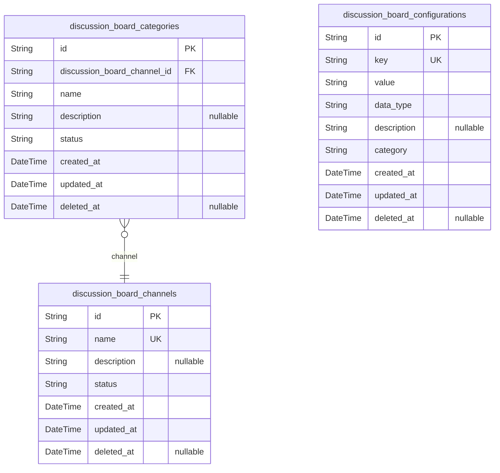
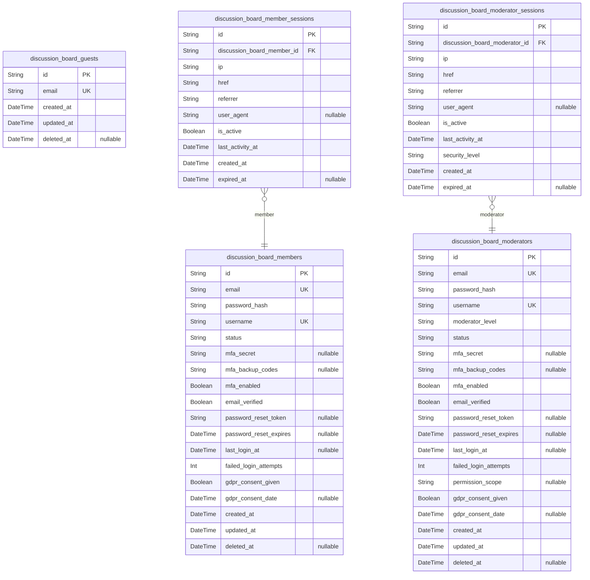
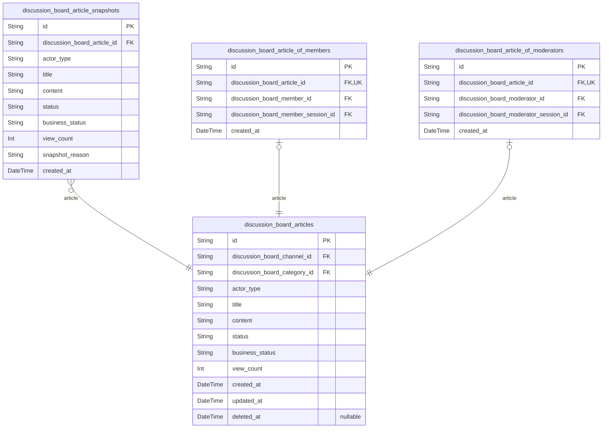
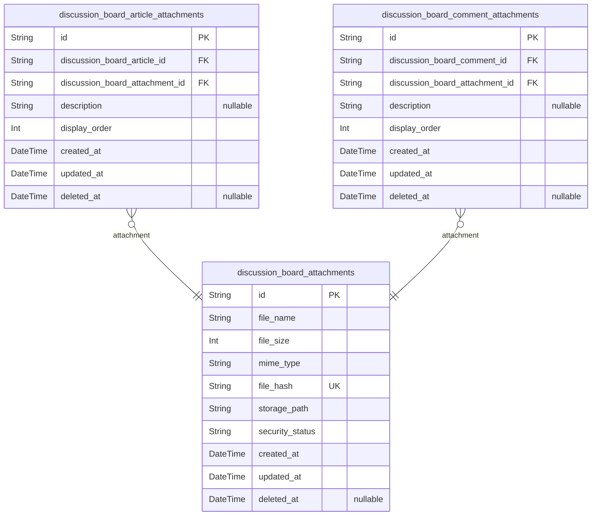
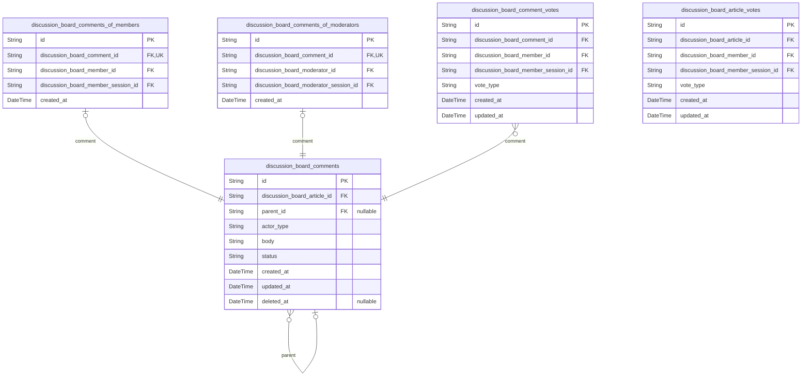
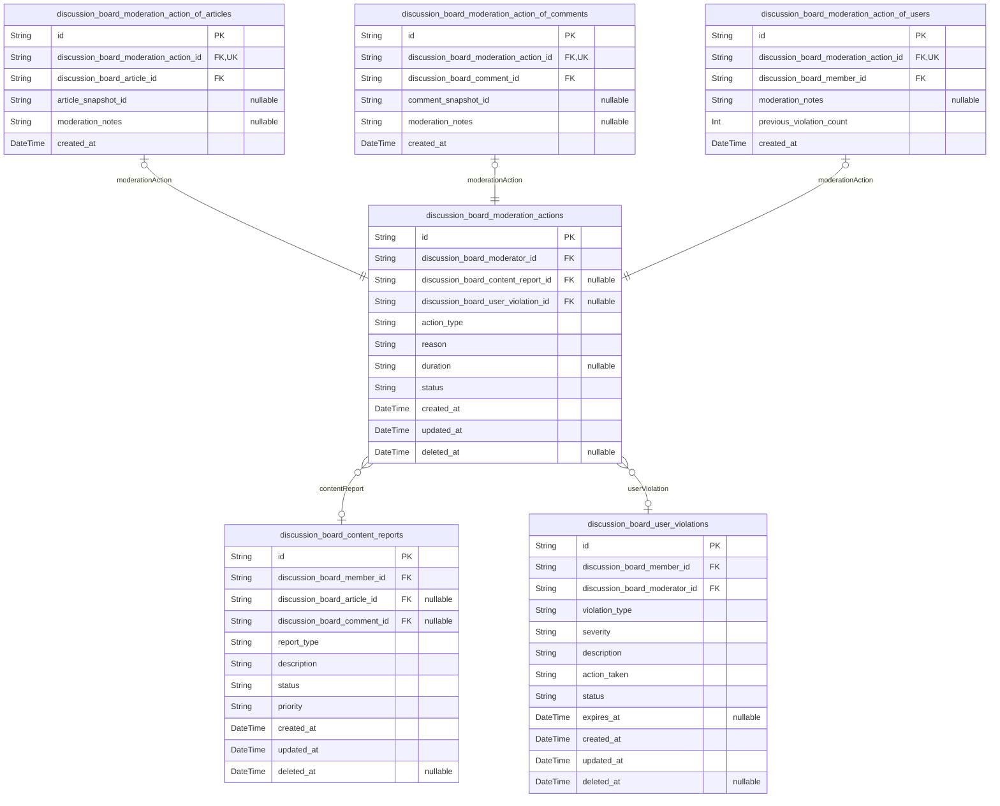

# Prisma Markdown

> Generated by [`prisma-markdown`](https://github.com/samchon/prisma-markdown)

- [Systematic](#systematic)
- [Actors](#actors)
- [Articles](#articles)
- [Attachments](#attachments)
- [Interactions](#interactions)
- [Moderation](#moderation)

## Systematic

### `discussion_board_channels`

Discussion board channels that organize content by broad topic areas.

Channels represent the highest level of content organization, grouping
related discussions under common themes like Economics, Politics, or
Policy. Each channel can contain multiple categories and serves as the
primary navigation structure for users browsing content.

Channels support activation/deactivation status to allow administrators
to manage platform content organization without deleting historical data.
Users can browse channels independently and need to filter discussions by
channel when searching or browsing.

Soft deletion is supported through the deleted_at field, allowing
channels to be removed from user view while maintaining referential
integrity for historical data.

Properties as follows:

- `id`: Primary Key.
- `name`: Channel name displayed to users. Must be unique across all channels.
- `description`: Optional description explaining the channel's purpose and content focus.
- `status`
  > Channel status indicating whether it's active or inactive. Valid values:
  > 'active', 'inactive', 'archived'. Controls visibility to users.
- `created_at`: Timestamp when the channel was created.
- `updated_at`: Timestamp when the channel was last updated.
- `deleted_at`
  > Timestamp when the channel was soft deleted. Null indicates active
  > channel.

### `discussion_board_categories`

Discussion board categories that organize content within channels.

Categories provide secondary organization within channels, allowing
finer-grained content classification. For example, an Economics channel
might have categories like Macroeconomic Policy, Market Analysis, and
Personal Finance.

Categories are managed independently from channels and require their own
API endpoints for creation, editing, and management. Users need to browse
and filter by categories across the platform.

Soft deletion is supported to maintain referential integrity while
allowing content reorganization.

Properties as follows:

- `id`: Primary Key.
- `discussion_board_channel_id`
  > Parent channel that contains this category. {@link
  > discussion_board_channels.id}
- `name`: Category name displayed to users. Must be unique within the same channel.
- `description`: Optional description explaining the category's purpose and content scope.
- `status`
  > Category status indicating whether it's active or inactive. Valid values:
  > 'active', 'inactive', 'archived'. Controls visibility to users.
- `created_at`: Timestamp when the category was created.
- `updated_at`: Timestamp when the category was last updated.
- `deleted_at`
  > Timestamp when the category was soft deleted. Null indicates active
  > category.

### `discussion_board_configurations`

System-wide configuration settings for the discussion board platform.

Stores platform configuration values that control system behavior,
feature flags, and operational parameters. These settings are managed
through administrative interfaces rather than direct user interaction.

Configuration values support different data types and are organized by
functional areas. Changes to configuration settings may require system
restarts or cache invalidation to take effect.

Soft deletion allows configuration settings to be disabled without
removing historical audit data.

Properties as follows:

- `id`: Primary Key.
- `key`: Unique configuration key used to identify the setting.
- `value`
  > Configuration value stored as string. May represent different data types
  > when parsed.
- `data_type`: Data type of the configuration value (string, boolean, number, json).
- `description`: Human-readable description explaining the configuration setting's purpose.
- `category`: Functional category grouping related configuration settings.
- `created_at`: Timestamp when the configuration was created.
- `updated_at`: Timestamp when the configuration was last updated.
- `deleted_at`
  > Timestamp when the configuration was soft deleted. Null indicates active
  > setting.

## Actors

### `discussion_board_guests`

Guest users who can browse content without authentication.

Represents unauthenticated users who have limited access to the
discussion board. Guests can view public content but cannot create posts,
upload attachments, or participate in discussions. This entity tracks
guest interactions for analytics and potential conversion to member
status.

Guest accounts are temporary and may be converted to member accounts
through the registration process. Each guest has a unique identifier and
tracking information for session management and user experience
optimization.

Properties as follows:

- `id`: Primary Key.
- `email`
  > Guest email address for identification and potential conversion to member
  > account.
- `created_at`: Timestamp when the guest record was created.
- `updated_at`: Timestamp when the guest record was last updated.
- `deleted_at`: Timestamp when the guest record was soft deleted.

### `discussion_board_members`

Authenticated member users with full discussion participation rights.

Represents registered members who can create posts, upload attachments,
comment on discussions, and participate fully in the community. Members
have complete access to discussion board features and can manage their
content and profile.

Each member has authentication credentials and profile information.
Members can be promoted to moderator status based on community
participation and trustworthiness. The system tracks member activity for
engagement analytics and community management.

**Security Enhancements:**
- Multi-factor authentication (MFA) support with secret storage and
backup codes
- Email verification status tracking for account security
- Password reset token and expiration tracking
- Last login timestamp for security monitoring
- Failed login attempt tracking for brute force protection

**Compliance Features:**
- GDPR consent tracking for data processing
- Account activity logging for audit trails
- Data retention policy support

Properties as follows:

- `id`: Primary Key.
- `email`
  > Member email address used for authentication and communication. Must be
  > unique across all members.
- `password_hash`
  > Hashed password for secure authentication using industry-standard
  > algorithms.
- `username`
  > Display name used for member identification in discussions. Must be
  > unique across all members.
- `status`: Member account status (active, suspended, banned, pending_verification).
- `mfa_secret`: Encrypted multi-factor authentication secret for enhanced security.
- `mfa_backup_codes`: JSON array of backup codes for MFA recovery scenarios.
- `mfa_enabled`: Whether multi-factor authentication is enabled for this account.
- `email_verified`: Whether the member's email address has been verified.
- `password_reset_token`: Temporary token for password reset requests.
- `password_reset_expires`: Expiration timestamp for password reset token.
- `last_login_at`: Timestamp of the member's last successful login.
- `failed_login_attempts`: Count of consecutive failed login attempts for brute force protection.
- `gdpr_consent_given`: Whether the member has given GDPR consent for data processing.
- `gdpr_consent_date`: Timestamp when GDPR consent was given.
- `created_at`: Timestamp when the member account was created.
- `updated_at`: Timestamp when the member account was last updated.
- `deleted_at`: Timestamp when the member account was soft deleted.

### `discussion_board_moderators`

Administrative users responsible for content moderation and community
management.

Represents trusted users with elevated permissions for maintaining
community standards and ensuring respectful discourse. Moderators can
review reported content, manage user accounts, and enforce platform
policies.

Moderators are typically promoted from active, trusted members. Each
moderator has additional permissions and responsibilities beyond regular
members. The system tracks moderator actions for accountability and audit
purposes.

**Security Enhancements:**
- Multi-factor authentication (MFA) support with enhanced security
requirements
- Administrative session tracking with additional security measures
- Permission level granularity for different moderator roles
- Enhanced audit trail capabilities

**Administrative Features:**
- Permission scope definitions for different moderator levels
- Action logging for accountability and compliance
- Enhanced security requirements for administrative access

Properties as follows:

- `id`: Primary Key.
- `email`
  > Moderator email address for authentication and official communications.
  > Must be unique across all moderators.
- `password_hash`
  > Hashed password for secure authentication using enhanced security
  > standards.
- `username`
  > Display name used for moderator identification. Must be unique across all
  > moderators.
- `moderator_level`
  > Moderator permission level (junior, senior, admin) with defined scope
  > boundaries.
- `status`: Moderator account status (active, suspended, inactive, pending_review).
- `mfa_secret`
  > Encrypted multi-factor authentication secret with enhanced security
  > requirements.
- `mfa_backup_codes`: JSON array of backup codes for MFA recovery scenarios.
- `mfa_enabled`
  > Whether multi-factor authentication is enabled for this account. Required
  > for administrative access.
- `email_verified`
  > Whether the moderator's email address has been verified. Required for
  > administrative privileges.
- `password_reset_token`
  > Temporary token for password reset requests with enhanced security
  > validation.
- `password_reset_expires`: Expiration timestamp for password reset token.
- `last_login_at`
  > Timestamp of the moderator's last successful login. Used for security
  > monitoring.
- `failed_login_attempts`
  > Count of consecutive failed login attempts with lower thresholds for
  > administrative accounts.
- `permission_scope`: JSON definition of specific permissions granted to this moderator level.
- `gdpr_consent_given`: Whether the moderator has given GDPR consent for data processing.
- `gdpr_consent_date`: Timestamp when GDPR consent was given.
- `created_at`: Timestamp when the moderator account was created.
- `updated_at`: Timestamp when the moderator account was last updated.
- `deleted_at`: Timestamp when the moderator account was soft deleted.

### `discussion_board_member_sessions`

Authentication sessions for member users.

Tracks active login sessions for member accounts, providing security and
session management capabilities. Each session records connection context
including IP address, access time, and session expiration.

Sessions are used for audit tracing of member actions and authentication
state management. Multiple concurrent sessions are supported per member
account. Session data helps maintain secure authentication and provides
insights into user engagement patterns.

**Performance Enhancements:**
- Additional indexes for session cleanup and management operations
- Enhanced security tracking for suspicious activity detection
- Improved query performance for session validation workflows

Properties as follows:

- `id`: Primary Key.
- `discussion_board_member_id`: Reference to the member account. [discussion_board_members.id](#discussion_board_members)
- `ip`: IP address of the connection for security and geographic tracking.
- `href`: Connection URL for session context and analytics.
- `referrer`: Referrer URL for traffic source analysis.
- `user_agent`: Client user agent string for device and browser identification.
- `is_active`: Whether the session is currently active for quick status checks.
- `last_activity_at`: Timestamp of last activity within this session for timeout management.
- `created_at`: Session creation time.
- `expired_at`: Session end time for automatic cleanup operations.

### `discussion_board_moderator_sessions`

Authentication sessions for moderator users.

Tracks active login sessions for moderator accounts, providing enhanced
security and session management for administrative users. Each session
records connection context including IP address, access time, and session
expiration.

Moderator sessions include additional security considerations due to
elevated permissions. Session data helps maintain accountability for
moderator actions and provides audit trails for administrative
activities.

**Security Enhancements:**
- Enhanced security tracking for administrative sessions
- Additional audit trail capabilities for moderator actions
- Improved performance for session management operations

Properties as follows:

- `id`: Primary Key.
- `discussion_board_moderator_id`: Reference to the moderator account. [discussion_board_moderators.id](#discussion_board_moderators)
- `ip`: IP address of the connection for enhanced security monitoring.
- `href`: Connection URL for administrative session context.
- `referrer`: Referrer URL for administrative access tracking.
- `user_agent`: Client user agent string for security auditing.
- `is_active`: Whether the session is currently active for administrative monitoring.
- `last_activity_at`
  > Timestamp of last activity within this session for security timeout
  > management.
- `security_level`: Security level assigned to this session (standard, elevated, critical).
- `created_at`: Session creation time.
- `expired_at`: Session end time for administrative session management.

## Articles

### `discussion_board_articles`

Core discussion articles representing the main content of the
economic/political discussion board.

Stores the primary discussion posts created by authenticated members and
moderators. Each article contains the main discussion content, title, and
metadata required for platform functionality. Articles support
categorization through relationships with existing category tables and
can be moderated based on community guidelines.

The article lifecycle includes creation, editing, voting, commenting, and
potential moderation actions. Articles maintain relationships with
authors, categories, attachments, and comments while supporting the
platform's core discussion functionality.

Soft deletion is supported through the deleted_at field to maintain audit
trails while allowing content moderation. Articles can have multiple
snapshots for version history and audit purposes.

**CRITICAL UPDATE**: Implemented proper polymorphic ownership pattern
with actor_type field and removed nullable author FKs to maintain
normalization compliance.

Properties as follows:

- `id`: Primary Key.
- `discussion_board_channel_id`
  > Channel where the article is published. {@link
  > discussion_board_channels.id}
- `discussion_board_category_id`
  > Category classification for the article. {@link
  > discussion_board_categories.id}
- `actor_type`
  > Type of author who created the article. Valid values: 'member',
  > 'moderator'. Used for efficient filtering and polymorphic relationship
  > management.
- `title`
  > Article title that summarizes the discussion topic. Must be between
  > 10-200 characters as per requirements.
- `content`
  > Main article content containing the discussion text. Supports rich text
  > formatting and must meet minimum length requirements.
- `status`
  > Current article status indicating publication state. Valid values: draft,
  > published, archived, moderated.
- `business_status`
  > Business-specific workflow status for advanced state management. Tracks
  > article progression through moderation, review, and publication
  > workflows.
- `view_count`
  > Number of times the article has been viewed by users. Incremented on each
  > view for popularity tracking.
- `created_at`: Timestamp when the article was initially created.
- `updated_at`: Timestamp when the article was last modified.
- `deleted_at`
  > Timestamp when the article was soft deleted. Null indicates active
  > article.

### `discussion_board_article_snapshots`

Historical snapshots of discussion articles for audit trails and version
control.

Captures point-in-time states of articles whenever significant changes
occur, such as content edits, status updates, or moderation actions. Each
snapshot preserves the complete article state at the moment of capture,
enabling historical tracking and audit compliance.

Snapshots maintain relationships to the original article and capture all
relevant metadata including content, status, and authorship information.
This supports version comparison, rollback capabilities, and compliance
with data retention requirements.

The snapshot pattern ensures that historical article states remain
accessible even after subsequent edits or deletions, providing essential
audit functionality for the discussion platform.

**CRITICAL UPDATE**: Added actor_type field to maintain consistency with
main article table and support historical author tracking.

Properties as follows:

- `id`: Primary Key.
- `discussion_board_article_id`
  > Original article that this snapshot captures. {@link
  > discussion_board_articles.id}
- `actor_type`
  > Type of author who created the article at snapshot time. Valid values:
  > 'member', 'moderator'.
- `title`: Article title at the time of snapshot creation.
- `content`: Article content at the time of snapshot creation.
- `status`: Article status at the time of snapshot creation.
- `business_status`: Business workflow status at the time of snapshot creation.
- `view_count`: View count at the time of snapshot creation.
- `snapshot_reason`: Reason for creating this snapshot (edit, moderation, archive, etc.).
- `created_at`: Timestamp when the snapshot was created.

### `discussion_board_article_of_members`

Subtype entity for articles created by member users.

Stores member-specific authorship information including the member
reference and session context. This table implements the proper
polymorphic ownership pattern by separating member-created articles from
moderator-created articles.

Each record maintains a 1:1 relationship with the main article entity and
includes the member's session information for audit trail purposes. This
design ensures referential integrity and enables efficient querying of
member-authored content.

The subtype pattern allows for member-specific metadata extension while
maintaining clean separation of concerns between different author types.

Properties as follows:

- `id`: Primary Key.
- `discussion_board_article_id`
  > Main article entity that this subtype represents. {@link
  > discussion_board_articles.id}
- `discussion_board_member_id`: Member author who created the article. [discussion_board_members.id](#discussion_board_members)
- `discussion_board_member_session_id`
  > Member session context when the article was created. {@link
  > discussion_board_member_sessions.id}
- `created_at`: Timestamp when the member authorship record was created.

### `discussion_board_article_of_moderators`

Subtype entity for articles created by moderator users.

Stores moderator-specific authorship information including the moderator
reference and session context. This table implements the proper
polymorphic ownership pattern by separating moderator-created articles
from member-created articles.

Each record maintains a 1:1 relationship with the main article entity and
includes the moderator's session information for audit trail purposes.
This design ensures referential integrity and enables efficient querying
of moderator-authored content.

The subtype pattern allows for moderator-specific metadata extension
while maintaining clean separation of concerns between different author
types.

Properties as follows:

- `id`: Primary Key.
- `discussion_board_article_id`
  > Main article entity that this subtype represents. {@link
  > discussion_board_articles.id}
- `discussion_board_moderator_id`
  > Moderator author who created the article. {@link
  > discussion_board_moderators.id}
- `discussion_board_moderator_session_id`
  > Moderator session context when the article was created. {@link
  > discussion_board_moderator_sessions.id}
- `created_at`: Timestamp when the moderator authorship record was created.

## Attachments

### `discussion_board_attachments`

Central repository for all file attachments uploaded to the discussion
board.

Stores metadata and properties for files attached to articles and
comments, including file information, upload details, and security
validation status. Each attachment can be referenced by multiple articles
or comments through junction tables.

Attachments undergo security scanning and validation before being made
available for use. The system supports various file types including
images (JPG, PNG, GIF) and documents (PDF, DOC, TXT) with size limits
enforced during upload.

Soft deletion is supported to maintain audit trails while allowing
content moderation.

Properties as follows:

- `id`: Primary Key.
- `file_name`: Original filename of the uploaded attachment.
- `file_size`: Size of the file in bytes.
- `mime_type`: MIME type of the uploaded file.
- `file_hash`: SHA-256 hash of the file content for duplicate detection.
- `storage_path`: Path to the file in the storage system.
- `security_status`: Security validation status (pending, approved, rejected).
- `created_at`: Timestamp when the attachment was uploaded.
- `updated_at`: Timestamp when the attachment was last modified.
- `deleted_at`: Timestamp when the attachment was soft deleted.

### `discussion_board_article_attachments`

Junction table managing the many-to-many relationship between articles
and attachments.

Links discussion board articles to their associated file attachments,
allowing multiple attachments per article and multiple articles to
reference the same attachment. This junction table enables flexible
attachment sharing while maintaining proper referential integrity.

Each relationship includes metadata about when the attachment was added
to the article and optional description text for context. The system
tracks attachment usage across articles for proper lifecycle management.

Managed through parent article operations with no independent API
endpoints required.

Properties as follows:

- `id`: Primary Key.
- `discussion_board_article_id`: Target article's [discussion_board_articles.id](#discussion_board_articles).
- `discussion_board_attachment_id`: Target attachment's [discussion_board_attachments.id](#discussion_board_attachments).
- `description`: Optional description of the attachment's relevance to the article.
- `display_order`: Order in which attachments should be displayed for the article.
- `created_at`: Timestamp when the attachment was linked to the article.
- `updated_at`: Timestamp when the relationship was last modified.
- `deleted_at`: Timestamp when the relationship was soft deleted.

### `discussion_board_comment_attachments`

Junction table managing the many-to-many relationship between comments
and attachments.

Links discussion board comments to their associated file attachments,
supporting multiple attachments per comment and attachment reuse across
comments. This design enables rich comment content with supporting
evidence while maintaining data integrity.

Each relationship includes metadata about attachment usage context and
display ordering. The system ensures proper attachment lifecycle
management when comments are modified or deleted.

Managed through parent comment operations with no independent user-facing
functionality.

Properties as follows:

- `id`: Primary Key.
- `discussion_board_comment_id`: Target comment's [discussion_board_comments.id](#discussion_board_comments).
- `discussion_board_attachment_id`: Target attachment's [discussion_board_attachments.id](#discussion_board_attachments).
- `description`: Optional description of the attachment's relevance to the comment.
- `display_order`: Order in which attachments should be displayed for the comment.
- `created_at`: Timestamp when the attachment was linked to the comment.
- `updated_at`: Timestamp when the relationship was last modified.
- `deleted_at`: Timestamp when the relationship was soft deleted.

## Interactions

### `discussion_board_comments`

Main entity representing user comments on discussion board articles.

Stores the core content of comments made by members and moderators on
articles. Each comment contains the actual text content, references to
the parent article, and maintains relationships with voting and
attachment entities.

Comments support nested replies through parent-child relationships,
allowing for threaded conversations. The entity tracks creation and
modification timestamps for audit purposes and supports soft deletion for
content moderation.

Comments are independently manageable entities that require search and
filtering capabilities across all articles, justifying primary stance
classification. The actor_type field enables routing to appropriate
subtype entities for member and moderator creation contexts.

Properties as follows:

- `id`: Primary Key.
- `discussion_board_article_id`
  > Reference to the parent article where this comment is posted. {@link
  > discussion_board_articles.id}
- `parent_id`
  > Self-referencing foreign key for nested comment replies. Points to the
  > parent comment if this is a reply. [discussion_board_comments.id](#discussion_board_comments)
- `actor_type`
  > Type of actor who created the comment. Valid values: 'member',
  > 'moderator'. Used for routing to appropriate subtype entity.
- `body`
  > The actual content of the comment. Supports rich text formatting and must
  > contain substantive discussion content.
- `status`
  > Current moderation status of the comment. Valid values: 'pending',
  > 'approved', 'rejected', 'flagged'.
- `created_at`: Timestamp when the comment was originally created.
- `updated_at`: Timestamp when the comment was last modified.
- `deleted_at`: Timestamp when the comment was soft deleted. Null if comment is active.

### `discussion_board_comments_of_members`

Subtype entity for comments created by member users.

Stores member-specific context for comments created by authenticated
members. Each record maintains the relationship between a comment and the
member who created it, including the session context for audit purposes.

This entity ensures referential integrity for member-created comments and
enables efficient querying of comments by member. The 1:1 relationship
with the main comments entity prevents orphaned subtype records.

Properties as follows:

- `id`: Primary Key.
- `discussion_board_comment_id`: Reference to the main comment entity. [discussion_board_comments.id](#discussion_board_comments)
- `discussion_board_member_id`
  > Reference to the member who created the comment. {@link
  > discussion_board_members.id}
- `discussion_board_member_session_id`
  > Reference to the member session when the comment was created. {@link
  > discussion_board_member_sessions.id}
- `created_at`: Timestamp when the member-specific comment context was created.

### `discussion_board_comments_of_moderators`

Subtype entity for comments created by moderator users.

Stores moderator-specific context for comments created by administrative
moderators. Each record maintains the relationship between a comment and
the moderator who created it, including the session context for audit
purposes.

This entity ensures referential integrity for moderator-created comments
and enables efficient querying of comments by moderator. The 1:1
relationship with the main comments entity prevents orphaned subtype
records.

Properties as follows:

- `id`: Primary Key.
- `discussion_board_comment_id`: Reference to the main comment entity. [discussion_board_comments.id](#discussion_board_comments)
- `discussion_board_moderator_id`
  > Reference to the moderator who created the comment. {@link
  > discussion_board_moderators.id}
- `discussion_board_moderator_session_id`
  > Reference to the moderator session when the comment was created. {@link
  > discussion_board_moderator_sessions.id}
- `created_at`: Timestamp when the moderator-specific comment context was created.

### `discussion_board_comment_votes`

Voting records for individual comments on the discussion board.

Tracks upvotes and downvotes cast by members on comments to indicate
agreement, appreciation, or disagreement. Each vote record represents a
single voting action by a member on a specific comment.

The entity prevents duplicate voting through unique constraints and
maintains vote integrity by tracking the voting member and session
context. Votes are subsidiary entities managed through comment
operations.

Properties as follows:

- `id`: Primary Key.
- `discussion_board_comment_id`
  > Reference to the comment being voted on. {@link
  > discussion_board_comments.id}
- `discussion_board_member_id`
  > Reference to the member who cast the vote. {@link
  > discussion_board_members.id}
- `discussion_board_member_session_id`
  > Reference to the member session when the vote was cast. {@link
  > discussion_board_member_sessions.id}
- `vote_type`: Type of vote cast. Valid values: 'upvote', 'downvote'.
- `created_at`: Timestamp when the vote was cast.
- `updated_at`: Timestamp when the vote was last updated (if changed).

### `discussion_board_article_votes`

Voting records for discussion board articles.

Tracks upvotes and downvotes cast by members on articles to indicate
content quality, relevance, or agreement. Each vote record represents a
single voting action by a member on a specific article.

The entity prevents duplicate voting through unique constraints and
maintains vote integrity by tracking the voting member and session
context. Votes are subsidiary entities managed through article
operations.

Properties as follows:

- `id`: Primary Key.
- `discussion_board_article_id`
  > Reference to the article being voted on. {@link
  > discussion_board_articles.id}
- `discussion_board_member_id`
  > Reference to the member who cast the vote. {@link
  > discussion_board_members.id}
- `discussion_board_member_session_id`
  > Reference to the member session when the vote was cast. {@link
  > discussion_board_member_sessions.id}
- `vote_type`: Type of vote cast. Valid values: 'upvote', 'downvote'.
- `created_at`: Timestamp when the vote was cast.
- `updated_at`: Timestamp when the vote was last updated (if changed).

## Moderation

### `discussion_board_content_reports`

User-generated reports for content requiring moderation review.

Stores reports submitted by users flagging inappropriate content, policy
violations, or other issues requiring moderator attention. Each report
captures the specific content being reported, the reporting user, and
detailed information about the violation type and context.

Reports follow a workflow from submission through review to resolution,
with status tracking and audit trails. Moderators use these reports to
identify and address content that violates community guidelines.

The system supports multiple report categories including spam,
harassment, misinformation, and other violation types as defined in the
content policy.

Properties as follows:

- `id`: Primary Key.
- `discussion_board_member_id`: Reporting member's [discussion_board_members.id](#discussion_board_members).
- `discussion_board_article_id`: Reported article's [discussion_board_articles.id](#discussion_board_articles).
- `discussion_board_comment_id`: Reported comment's [discussion_board_comments.id](#discussion_board_comments).
- `report_type`
  > Category of violation being reported (spam, harassment, misinformation,
  > etc.).
- `description`: Detailed explanation of the reported violation with specific concerns.
- `status`: Current status of the report (pending, under_review, resolved, dismissed).
- `priority`: Priority level based on violation severity (low, medium, high, critical).
- `created_at`: Timestamp when the report was initially submitted.
- `updated_at`: Timestamp of the last update to the report status or information.
- `deleted_at`: Timestamp when the report was soft deleted, if applicable.

### `discussion_board_moderation_actions`

Records of moderation actions taken by moderators on platform content.

Serves as the main entity for all moderation activities, capturing the
core action details while delegating target-specific information to
subtype entities. This design replaces the problematic polymorphic
target_id pattern with explicit, normalized relationships.

Each action records the moderator responsible, the action type, and
general metadata. Target-specific details are managed through dedicated
subtype tables (articles, comments, users) to maintain referential
integrity and proper normalization.

The system supports comprehensive audit trails for transparency and
accountability in content moderation decisions.

Properties as follows:

- `id`: Primary Key.
- `discussion_board_moderator_id`: Moderator who performed the action [discussion_board_moderators.id](#discussion_board_moderators).
- `discussion_board_content_report_id`: Associated content report [discussion_board_content_reports.id](#discussion_board_content_reports).
- `discussion_board_user_violation_id`: Associated user violation [discussion_board_user_violations.id](#discussion_board_user_violations).
- `action_type`
  > Type of moderation action performed (approve, remove, warn, suspend, ban,
  > etc.).
- `reason`: Detailed explanation of the moderation decision and policy rationale.
- `duration`: Duration of temporary actions like suspensions (e.g., '24h', '7d', '30d').
- `status`
  > Current status of the moderation action (active, completed, cancelled,
  > appealed).
- `created_at`: Timestamp when the moderation action was performed.
- `updated_at`: Timestamp of the last update to the action record.
- `deleted_at`: Timestamp when the action record was soft deleted, if applicable.

### `discussion_board_user_violations`

Records of user violations and associated disciplinary actions.

Tracks violations of community guidelines by users, documenting the
specific infractions, violation severity, and resulting disciplinary
measures. Each violation record serves as the basis for progressive
discipline and user behavior monitoring.

Violations are categorized by type and severity, with corresponding
actions ranging from warnings to temporary suspensions or permanent bans.
The system maintains comprehensive violation histories to ensure
consistent enforcement and support user rehabilitation.

This table provides the foundation for user accountability, moderation
consistency, and community standards enforcement across the platform.

Properties as follows:

- `id`: Primary Key.
- `discussion_board_member_id`: User who committed the violation [discussion_board_members.id](#discussion_board_members).
- `discussion_board_moderator_id`
  > Moderator who recorded the violation {@link
  > discussion_board_moderators.id}.
- `violation_type`: Category of violation committed (spam, harassment, hate_speech, etc.).
- `severity`: Severity level of the violation (minor, moderate, severe, critical).
- `description`: Detailed description of the violation with specific evidence and context.
- `action_taken`: Disciplinary action applied (warning, suspension, ban, etc.).
- `status`
  > Current status of the violation record (active, resolved, appealed,
  > expired).
- `expires_at`: Timestamp when temporary actions like suspensions expire.
- `created_at`: Timestamp when the violation was initially recorded.
- `updated_at`: Timestamp of the last update to the violation record.
- `deleted_at`: Timestamp when the violation record was soft deleted, if applicable.

### `discussion_board_moderation_action_of_articles`

Subtype entity for moderation actions specifically targeting discussion
board articles.

Captures article-specific moderation details while maintaining proper
normalization through explicit foreign key relationships. Each record
represents a moderation action applied to a specific article, with the
main action entity handling common metadata.

This design replaces the problematic polymorphic target_id pattern with
proper referential integrity. Articles can be approved, removed, or have
other moderation actions applied while maintaining clear audit trails.

The relationship ensures that article moderation actions are properly
tracked and can be efficiently queried without the performance issues of
polymorphic relationships.

Properties as follows:

- `id`: Primary Key.
- `discussion_board_moderation_action_id`: Parent moderation action [discussion_board_moderation_actions.id](#discussion_board_moderation_actions).
- `discussion_board_article_id`: Target article being moderated [discussion_board_articles.id](#discussion_board_articles).
- `article_snapshot_id`
  > Snapshot of the article at the time of moderation {@link
  > discussion_board_article_snapshots.id}.
- `moderation_notes`: Article-specific moderation notes and context.
- `created_at`: Timestamp when the article moderation action was recorded.

### `discussion_board_moderation_action_of_comments`

Subtype entity for moderation actions specifically targeting discussion
board comments.

Manages comment-specific moderation details through proper normalized
relationships. Each record represents a moderation action applied to a
specific comment, with the main action entity handling common metadata.

This design eliminates the polymorphic relationship anti-pattern by
providing explicit foreign key constraints. Comments can be approved,
removed, or have warnings applied while maintaining clear audit trails.

The explicit relationship ensures efficient querying and proper
referential integrity for comment moderation workflows.

Properties as follows:

- `id`: Primary Key.
- `discussion_board_moderation_action_id`: Parent moderation action [discussion_board_moderation_actions.id](#discussion_board_moderation_actions).
- `discussion_board_comment_id`: Target comment being moderated [discussion_board_comments.id](#discussion_board_comments).
- `comment_snapshot_id`
  > Snapshot of the comment at the time of moderation {@link
  > discussion_board_comment_snapshots.id}.
- `moderation_notes`: Comment-specific moderation notes and context.
- `created_at`: Timestamp when the comment moderation action was recorded.

### `discussion_board_moderation_action_of_users`

Subtype entity for moderation actions specifically targeting platform users.

Handles user-specific moderation details through proper normalized
relationships. Each record represents a moderation action applied to a
specific user, such as warnings, suspensions, or bans.

This design replaces the problematic polymorphic pattern with explicit
foreign key constraints. User moderation actions are properly tracked
with clear relationships to both the action and the target user.

The explicit relationship ensures efficient user moderation workflows and
proper audit trails for user disciplinary actions.

Properties as follows:

- `id`: Primary Key.
- `discussion_board_moderation_action_id`: Parent moderation action [discussion_board_moderation_actions.id](#discussion_board_moderation_actions).
- `discussion_board_member_id`: Target user being moderated [discussion_board_members.id](#discussion_board_members).
- `moderation_notes`: User-specific moderation notes and behavioral context.
- `previous_violation_count`: Count of previous violations by the user at the time of action.
- `created_at`: Timestamp when the user moderation action was recorded.
