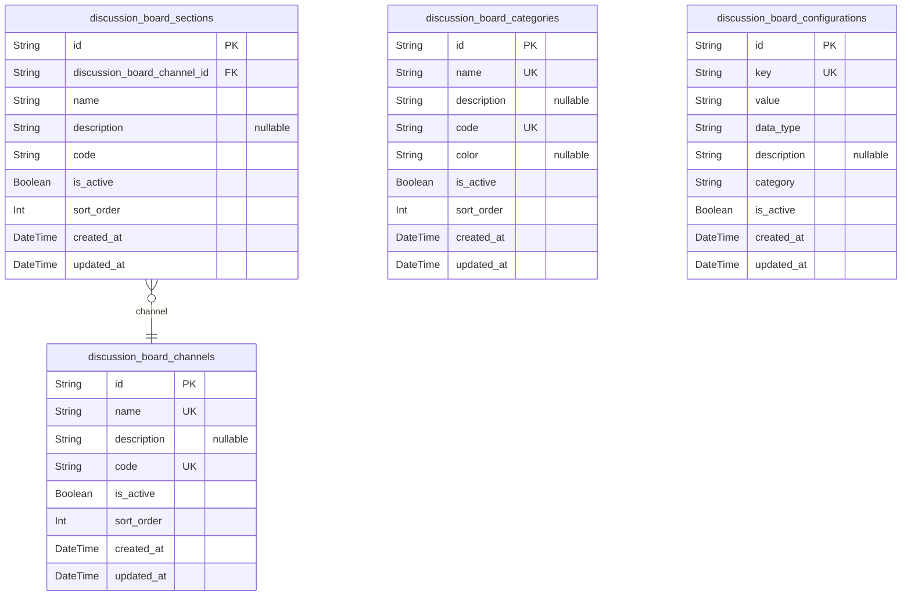
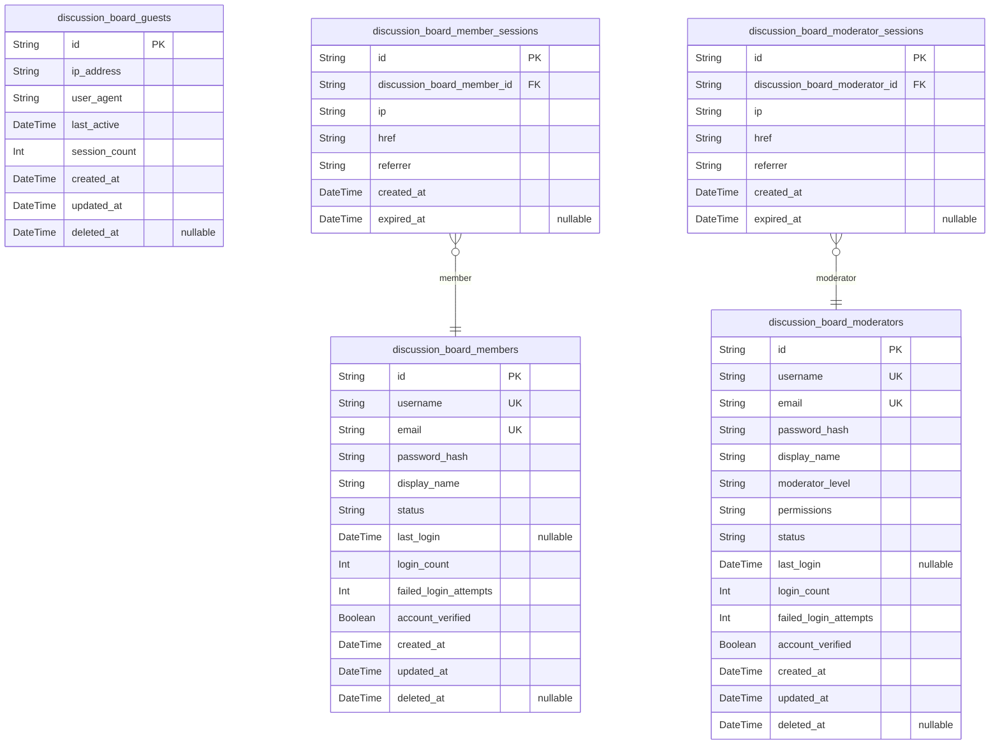
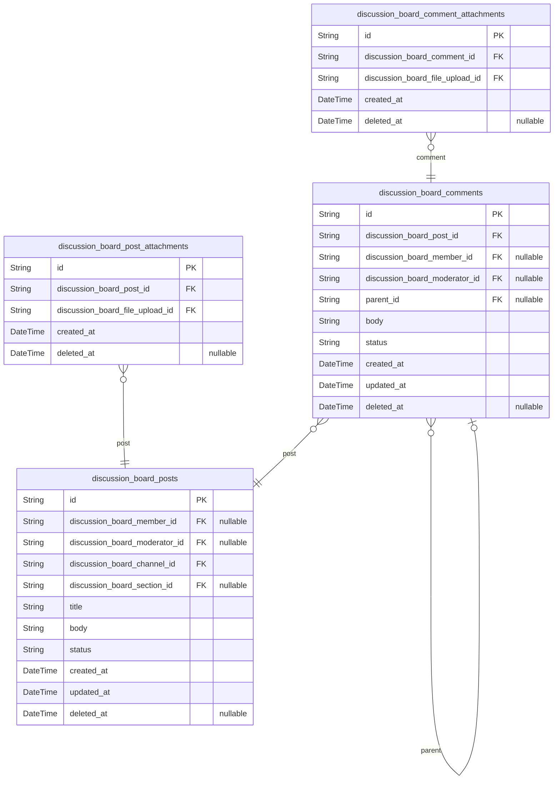
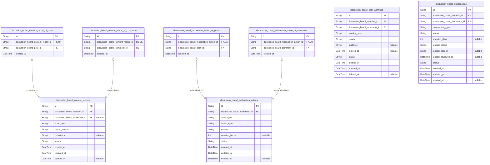
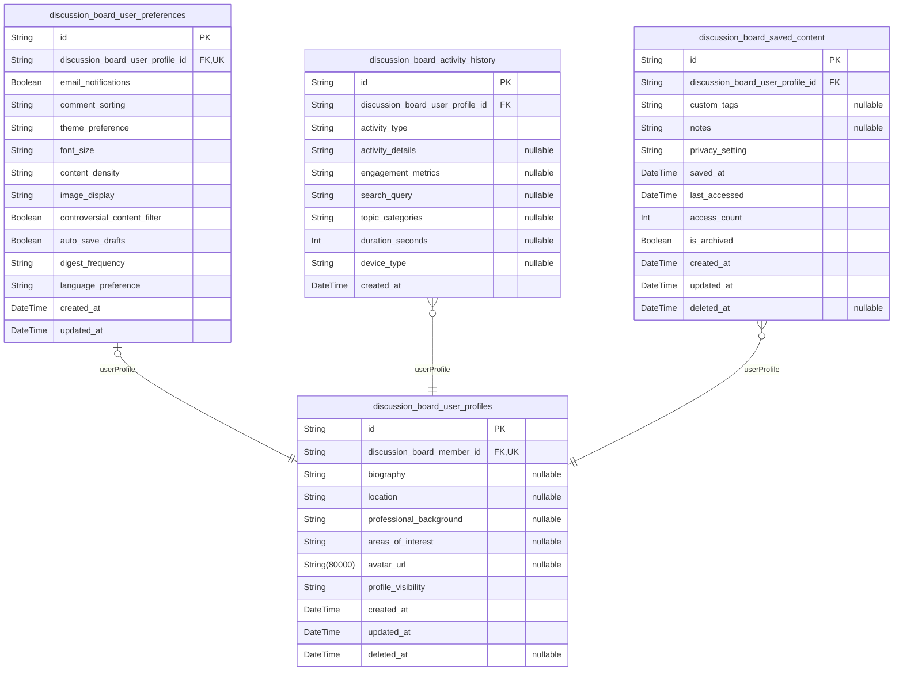
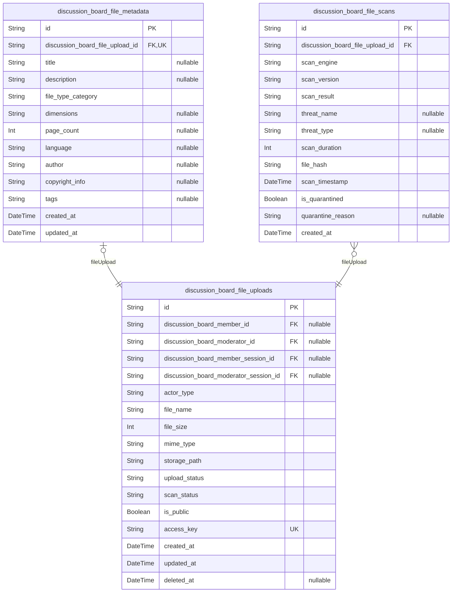
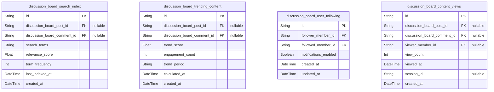
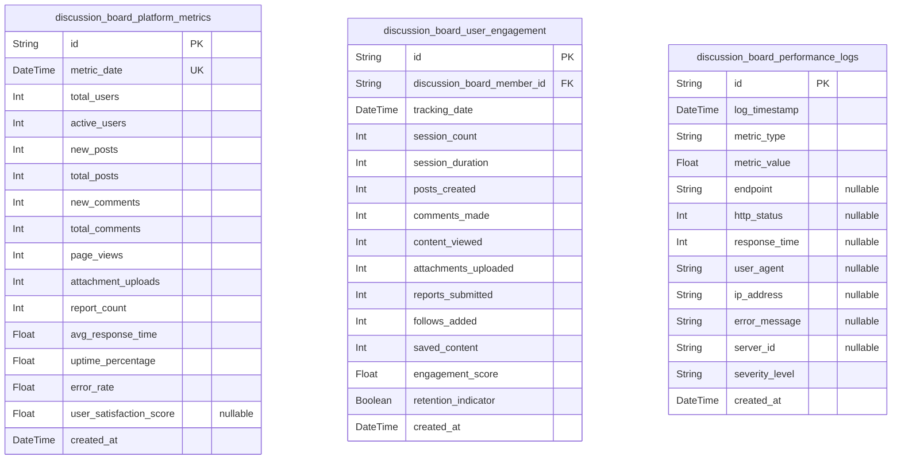

# Prisma Markdown

> Generated by [`prisma-markdown`](https://github.com/samchon/prisma-markdown)

- [Systematic](#systematic)
- [Actors](#actors)
- [Content](#content)
- [Moderation](#moderation)
- [Profiles](#profiles)
- [Files](#files)
- [Discovery](#discovery)
- [Analytics](#analytics)

## Systematic

### `discussion_board_channels`

Defines discussion channels for organizing content by economic/political
topics. Each channel represents a distinct discussion area with specific
configuration settings and content organization rules. Channels serve as
the top-level organizational structure for the platform.

Properties as follows:

- `id`: Primary Key.
- `name`
  > Unique name of the discussion channel (e.g., 'Economic Policy',
  > 'Political Analysis').
- `description`: Detailed description explaining the channel's purpose and focus area.
- `code`: Unique code identifier for the channel used in URLs and API references.
- `is_active`
  > Indicates whether the channel is currently active and accepting new
  > content.
- `sort_order`: Numerical order for displaying channels in lists and navigation.
- `created_at`: Timestamp when the channel was created.
- `updated_at`: Timestamp when the channel was last updated.

### `discussion_board_sections`

Represents organizational sections within discussion channels. Sections
provide hierarchical organization for content within channels, allowing
for sub-categorization of economic/political topics. Each section belongs
to a specific channel.

Properties as follows:

- `id`: Primary Key.
- `discussion_board_channel_id`
  > Parent channel that contains this section. {@link
  > discussion_board_channels.id}
- `name`: Name of the section within the channel.
- `description`: Description explaining the section's specific focus area.
- `code`: Unique code identifier for the section within its channel.
- `is_active`: Indicates whether the section is currently active.
- `sort_order`: Order for displaying sections within their parent channel.
- `created_at`: Timestamp when the section was created.
- `updated_at`: Timestamp when the section was last updated.

### `discussion_board_categories`

Defines content categorization system for organizing posts and
discussions. Categories provide thematic grouping across the platform,
allowing users to filter and discover content by specific
economic/political topics.

Properties as follows:

- `id`: Primary Key.
- `name`
  > Category name (e.g., 'Economic Policy', 'Market Discussions', 'Policy
  > Debates').
- `description`: Detailed description of the category's scope and focus.
- `code`: Unique code identifier for the category used in content filtering.
- `color`: Color code for visual representation of the category.
- `is_active`: Indicates whether the category is available for content assignment.
- `sort_order`: Display order for category lists and selection interfaces.
- `created_at`: Timestamp when the category was created.
- `updated_at`: Timestamp when the category was last updated.

### `discussion_board_configurations`

Stores platform-wide configuration settings and system parameters. This
table contains all configurable options that control platform behavior,
appearance, and functionality. Configuration changes affect the entire
discussion board environment.

Properties as follows:

- `id`: Primary Key.
- `key`
  > Unique configuration key identifier (e.g., 'max_post_length',
  > 'file_upload_limit').
- `value`: Configuration value stored as string (may represent various data types).
- `data_type`: Data type of the configuration value (string, number, boolean, json).
- `description`: Human-readable description of the configuration setting's purpose.
- `category`
  > Configuration category for organizational grouping (e.g., 'posting',
  > 'moderation', 'ui').
- `is_active`: Indicates whether this configuration setting is currently active.
- `created_at`: Timestamp when the configuration was created.
- `updated_at`: Timestamp when the configuration was last modified.

## Actors

### `discussion_board_guests`

Guest users who can browse content without authentication. Guests have
limited access rights and are tracked for analytics purposes. {@link
discussion_board_members.id} for comparison with authenticated users.

Properties as follows:

- `id`: Primary Key.
- `ip_address`: IP address of the guest user for tracking and analytics.
- `user_agent`: Browser user agent string for device identification.
- `last_active`: Timestamp of the guest's last activity on the platform.
- `session_count`: Number of sessions initiated by this guest.
- `created_at`: Timestamp when the guest record was created.
- `updated_at`: Timestamp when the guest record was last updated.
- `deleted_at`: Timestamp when the guest record was soft deleted.

### `discussion_board_members`

Registered member users who can create posts, comment, and participate in
discussions. Members require authentication and have full participation
rights. [discussion_board_moderators.id](#discussion_board_moderators) for administrative
hierarchy.

Properties as follows:

- `id`: Primary Key.
- `username`: Unique username for public identification.
- `email`: Email address for account verification and communication.
- `password_hash`: Hashed password for authentication security.
- `display_name`: Public display name shown to other users.
- `status`: Account status: active, pending, suspended, or banned.
- `last_login`: Timestamp of the member's last successful login.
- `login_count`: Total number of successful logins.
- `failed_login_attempts`: Number of consecutive failed login attempts.
- `account_verified`: Whether the account has been verified via email.
- `created_at`: Timestamp when the member account was created.
- `updated_at`: Timestamp when the member account was last updated.
- `deleted_at`: Timestamp when the member account was soft deleted.

### `discussion_board_member_sessions`

Authentication sessions for member users. Tracks login sessions for
security and audit purposes. [discussion_board_members.id](#discussion_board_members) for
member relationship.

Properties as follows:

- `id`: Primary Key.
- `discussion_board_member_id`: Member's session relationship. [discussion_board_members.id](#discussion_board_members)
- `ip`: IP address of the connection.
- `href`: Connection URL.
- `referrer`: Referrer URL.
- `created_at`: Session creation time.
- `expired_at`: Session end time.

### `discussion_board_moderators`

Administrative moderator users with enhanced permissions for content
management and user administration. Moderators have all member
capabilities plus administrative tools. {@link
discussion_board_members.id} for comparison with regular members.

Properties as follows:

- `id`: Primary Key.
- `username`: Unique username for moderator identification.
- `email`: Email address for administrative communications.
- `password_hash`: Hashed password for authentication security.
- `display_name`: Public display name shown to users.
- `moderator_level`: Moderator permission level: junior, senior, or admin.
- `permissions`: JSON string of specific moderator permissions.
- `status`: Account status: active, suspended, or inactive.
- `last_login`: Timestamp of the moderator's last successful login.
- `login_count`: Total number of successful logins.
- `failed_login_attempts`: Number of consecutive failed login attempts.
- `account_verified`: Whether the moderator account has been verified.
- `created_at`: Timestamp when the moderator account was created.
- `updated_at`: Timestamp when the moderator account was last updated.
- `deleted_at`: Timestamp when the moderator account was soft deleted.

### `discussion_board_moderator_sessions`

Authentication sessions for moderator users. Tracks administrative login
sessions for security auditing. [discussion_board_moderators.id](#discussion_board_moderators)
for moderator relationship.

Properties as follows:

- `id`: Primary Key.
- `discussion_board_moderator_id`: Moderator's session relationship. [discussion_board_moderators.id](#discussion_board_moderators)
- `ip`: IP address of the connection.
- `href`: Connection URL.
- `referrer`: Referrer URL.
- `created_at`: Session creation time.
- `expired_at`: Session end time.

## Content

### `discussion_board_posts`

Main discussion posts created by members or moderators. Contains the core
content of economic/political discussions including titles, bodies, and
status information. Posts can be created in specific channels and
sections for organized content management. {@link
discussion_board_members.id} [discussion_board_moderators.id](#discussion_board_moderators)
[discussion_board_channels.id](#discussion_board_channels)

Properties as follows:

- `id`: Primary Key.
- `discussion_board_member_id`: Member who created the post. [discussion_board_members.id](#discussion_board_members)
- `discussion_board_moderator_id`: Moderator who created the post. [discussion_board_moderators.id](#discussion_board_moderators)
- `discussion_board_channel_id`: Channel where the post is published. [discussion_board_channels.id](#discussion_board_channels)
- `discussion_board_section_id`: Section within the channel. [discussion_board_sections.id](#discussion_board_sections)
- `title`: Post title summarizing the discussion topic.
- `body`: Main content of the post with discussion details.
- `status`: Current status of the post (draft, published, locked, archived).
- `created_at`: Timestamp when the post was created.
- `updated_at`: Timestamp when the post was last updated.
- `deleted_at`: Timestamp when the post was soft deleted.

### `discussion_board_post_attachments`

Files and images attached to discussion posts. Supports evidence-based
discussions with document uploads including PDFs, images, and data files.
Each attachment is linked to a specific post and includes file metadata.
[discussion_board_posts.id](#discussion_board_posts) {@link
discussion_board_file_uploads.id}

Properties as follows:

- `id`: Primary Key.
- `discussion_board_post_id`: Post that this attachment belongs to. [discussion_board_posts.id](#discussion_board_posts)
- `discussion_board_file_upload_id`
  > File upload record containing the actual file data. {@link
  > discussion_board_file_uploads.id}
- `created_at`: Timestamp when the attachment was linked to the post.
- `deleted_at`: Timestamp when the attachment was removed from the post.

### `discussion_board_comments`

Comments made on discussion posts. Supports threaded conversations with
reply functionality and engagement tracking. Comments can be created by
members or moderators and support the discussion lifecycle. {@link
discussion_board_posts.id} [discussion_board_members.id](#discussion_board_members) {@link
discussion_board_moderators.id}

Properties as follows:

- `id`: Primary Key.
- `discussion_board_post_id`: Post that this comment belongs to. [discussion_board_posts.id](#discussion_board_posts)
- `discussion_board_member_id`: Member who created the comment. [discussion_board_members.id](#discussion_board_members)
- `discussion_board_moderator_id`: Moderator who created the comment. [discussion_board_moderators.id](#discussion_board_moderators)
- `parent_id`: Parent comment for threaded replies. [discussion_board_comments.id](#discussion_board_comments)
- `body`: Content of the comment.
- `status`: Current status of the comment (published, hidden, deleted).
- `created_at`: Timestamp when the comment was created.
- `updated_at`: Timestamp when the comment was last updated.
- `deleted_at`: Timestamp when the comment was soft deleted.

### `discussion_board_comment_attachments`

Files and images attached to discussion comments. Enables evidence-based
commenting with supporting documents and images. Each attachment is
linked to a specific comment and includes file metadata. {@link
discussion_board_comments.id} [discussion_board_file_uploads.id](#discussion_board_file_uploads)

Properties as follows:

- `id`: Primary Key.
- `discussion_board_comment_id`
  > Comment that this attachment belongs to. {@link
  > discussion_board_comments.id}
- `discussion_board_file_upload_id`
  > File upload record containing the actual file data. {@link
  > discussion_board_file_uploads.id}
- `created_at`: Timestamp when the attachment was linked to the comment.
- `deleted_at`: Timestamp when the attachment was removed from the comment.

## Moderation

### `discussion_board_content_reports`

Content reports submitted by users for moderator review. Users can report
posts or comments that violate community guidelines. Each report captures
the reason for reporting and the specific content being reported. {@link
discussion_board_members.id} for reporting users.

Properties as follows:

- `id`: Primary Key.
- `discussion_board_member_id`: Reporting member's [discussion_board_members.id](#discussion_board_members).
- `discussion_board_moderator_id`
  > Moderator assigned to review this report. {@link
  > discussion_board_moderators.id}.
- `actor_type`: Type of content being reported (post, comment).
- `report_reason`: Reason for reporting the content.
- `description`: Additional details provided by the reporter.
- `status`: Current status of the report (pending, reviewed, dismissed).
- `created_at`: Timestamp when the report was created.
- `updated_at`: Timestamp when the report was last updated.
- `deleted_at`: Timestamp when the report was soft deleted.

### `discussion_board_content_report_of_posts`

Subtype entity for content reports targeting posts. Links reports to
specific post content. [discussion_board_content_reports.id](#discussion_board_content_reports) and
[discussion_board_posts.id](#discussion_board_posts).

Properties as follows:

- `id`: Primary Key.
- `discussion_board_content_report_id`: Parent content report. [discussion_board_content_reports.id](#discussion_board_content_reports).
- `discussion_board_post_id`: Reported post. [discussion_board_posts.id](#discussion_board_posts).
- `created_at`: Timestamp when the report subtype was created.

### `discussion_board_content_report_of_comments`

Subtype entity for content reports targeting comments. Links reports to
specific comment content. [discussion_board_content_reports.id](#discussion_board_content_reports) and
[discussion_board_comments.id](#discussion_board_comments).

Properties as follows:

- `id`: Primary Key.
- `discussion_board_content_report_id`: Parent content report. [discussion_board_content_reports.id](#discussion_board_content_reports).
- `discussion_board_comment_id`: Reported comment. [discussion_board_comments.id](#discussion_board_comments).
- `created_at`: Timestamp when the report subtype was created.

### `discussion_board_moderation_actions`

Moderation actions performed by moderators on content or users. Captures
actions like content removal, user warnings, suspensions, etc. {@link
discussion_board_moderators.id} for acting moderator.

Properties as follows:

- `id`: Primary Key.
- `discussion_board_moderator_id`
  > Moderator who performed the action. {@link
  > discussion_board_moderators.id}.
- `actor_type`: Type of content being moderated (post, comment, user).
- `action_type`: Type of moderation action performed.
- `reason`: Reason for the moderation action.
- `duration_hours`: Duration of action in hours (for temporary actions).
- `status`: Current status of the action (active, expired, revoked).
- `created_at`: Timestamp when the action was performed.
- `updated_at`: Timestamp when the action was last updated.
- `deleted_at`: Timestamp when the action was soft deleted.

### `discussion_board_moderation_action_of_posts`

Subtype entity for moderation actions targeting posts. Links actions to
specific post content. [discussion_board_moderation_actions.id](#discussion_board_moderation_actions) and
[discussion_board_posts.id](#discussion_board_posts).

Properties as follows:

- `id`: Primary Key.
- `discussion_board_moderation_action_id`: Parent moderation action. [discussion_board_moderation_actions.id](#discussion_board_moderation_actions).
- `discussion_board_post_id`: Targeted post. [discussion_board_posts.id](#discussion_board_posts).
- `created_at`: Timestamp when the action subtype was created.

### `discussion_board_moderation_action_of_comments`

Subtype entity for moderation actions targeting comments. Links actions
to specific comment content. {@link
discussion_board_moderation_actions.id} and {@link
discussion_board_comments.id}.

Properties as follows:

- `id`: Primary Key.
- `discussion_board_moderation_action_id`: Parent moderation action. [discussion_board_moderation_actions.id](#discussion_board_moderation_actions).
- `discussion_board_comment_id`: Targeted comment. [discussion_board_comments.id](#discussion_board_comments).
- `created_at`: Timestamp when the action subtype was created.

### `discussion_board_user_warnings`

Warning records issued to users for guideline violations. Each warning
includes the reason, severity, and educational guidance. {@link
discussion_board_members.id} for warned user.

Properties as follows:

- `id`: Primary Key.
- `discussion_board_member_id`: Warned member. [discussion_board_members.id](#discussion_board_members).
- `discussion_board_moderator_id`: Moderator who issued the warning. [discussion_board_moderators.id](#discussion_board_moderators).
- `warning_level`: Severity level of the warning (low, medium, high).
- `reason`: Detailed reason for the warning.
- `guidance`: Educational guidance provided to the user.
- `expires_at`: Timestamp when the warning expires.
- `status`: Current status of the warning (active, expired, revoked).
- `created_at`: Timestamp when the warning was issued.
- `updated_at`: Timestamp when the warning was last updated.
- `deleted_at`: Timestamp when the warning was soft deleted.

### `discussion_board_suspensions`

User suspension records for temporary or permanent account restrictions.
Captures suspension details, duration, and appeal information. {@link
discussion_board_members.id} for suspended user.

Properties as follows:

- `id`: Primary Key.
- `discussion_board_member_id`: Suspended member. [discussion_board_members.id](#discussion_board_members).
- `discussion_board_moderator_id`
  > Moderator who issued the suspension. {@link
  > discussion_board_moderators.id}.
- `suspension_type`: Type of suspension (temporary, permanent).
- `reason`: Detailed reason for the suspension.
- `duration_days`: Duration in days for temporary suspensions.
- `appeal_status`: Current appeal status (none, pending, approved, denied).
- `appeal_reason`: User's appeal explanation.
- `appeal_reviewed_at`: Timestamp when appeal was reviewed.
- `status`: Current status of the suspension (active, expired, revoked).
- `created_at`: Timestamp when the suspension was issued.
- `updated_at`: Timestamp when the suspension was last updated.
- `deleted_at`: Timestamp when the suspension was soft deleted.

## Profiles

### `discussion_board_user_profiles`

Extended user profile information beyond basic authentication data.
Contains personal details, biography, and customization preferences that
enhance user identity for economic/political discussion participation.
[discussion_board_members.id](#discussion_board_members)

Properties as follows:

- `id`: Primary Key.
- `discussion_board_member_id`
  > Reference to the member who owns this profile. {@link
  > discussion_board_members.id}
- `biography`
  > User's personal introduction and background relevant to
  > economic/political discussions. Maximum 500 characters.
- `location`: Geographic location at country/region level for discussion context.
- `professional_background`: User's professional experience or expertise relevant to discussion topics.
- `areas_of_interest`: Specific economic/political topics the user is most interested in.
- `avatar_url`: URL to user's profile avatar image.
- `profile_visibility`
  > Privacy setting controlling who can view the profile (public,
  > registered_users, private).
- `created_at`: Timestamp when the profile was created.
- `updated_at`: Timestamp when the profile was last updated.
- `deleted_at`: Timestamp when the profile was soft-deleted for privacy.

### `discussion_board_user_preferences`

User-specific settings and preferences for platform customization.
Controls notification behavior, display options, and discussion
participation preferences. [discussion_board_user_profiles.id](#discussion_board_user_profiles)

Properties as follows:

- `id`: Primary Key.
- `discussion_board_user_profile_id`
  > Reference to the user profile these preferences belong to. {@link
  > discussion_board_user_profiles.id}
- `email_notifications`
  > Whether the user wants to receive email notifications for replies and
  > updates.
- `comment_sorting`
  > Default comment sorting preference (newest_first, oldest_first,
  > most_popular).
- `theme_preference`: Display theme preference (light, dark, system).
- `font_size`: Preferred font size for content display (small, medium, large).
- `content_density`: Content display density preference (compact, standard, expanded).
- `image_display`: Image display preference (always_show, hide, thumbnail_only).
- `controversial_content_filter`: Whether to filter out controversial content by default.
- `auto_save_drafts`: Whether to automatically save post and comment drafts.
- `digest_frequency`: Frequency for receiving discussion digests (daily, weekly, never).
- `language_preference`: Preferred language for content display.
- `created_at`: Timestamp when the preferences were created.
- `updated_at`: Timestamp when the preferences were last updated.

### `discussion_board_activity_history`

Comprehensive record of user activity including posts created, comments
made, content viewed, and engagement patterns. Used for personalization
and analytics. [discussion_board_user_profiles.id](#discussion_board_user_profiles)

Properties as follows:

- `id`: Primary Key.
- `discussion_board_user_profile_id`
  > Reference to the user profile this activity belongs to. {@link
  > discussion_board_user_profiles.id}
- `activity_type`
  > Type of activity recorded (post_created, comment_made, content_viewed,
  > search_performed, preference_changed).
- `activity_details`: JSON string containing detailed information about the activity.
- `engagement_metrics`
  > JSON string containing engagement metrics like view count, reply count,
  > etc.
- `search_query`: Search query performed by the user, if activity type is search.
- `topic_categories`: Economic/political topic categories involved in this activity.
- `duration_seconds`: Time spent on the activity in seconds, for content viewing.
- `device_type`: Type of device used for the activity (desktop, mobile, tablet).
- `created_at`: Timestamp when the activity occurred.

### `discussion_board_saved_content`

User's personal collection of saved posts and comments for later
reference. Supports bookmarking and content organization features. {@link
discussion_board_user_profiles.id}

Properties as follows:

- `id`: Primary Key.
- `discussion_board_user_profile_id`
  > Reference to the user profile that saved this content. {@link
  > discussion_board_user_profiles.id}
- `custom_tags`: User-defined tags for organizing saved content.
- `notes`: Personal notes added by the user about the saved content.
- `privacy_setting`: Privacy level for the saved content (private, shared).
- `saved_at`: Timestamp when the content was saved.
- `last_accessed`: Timestamp when the saved content was last viewed.
- `access_count`: Number of times the user has accessed this saved content.
- `is_archived`: Whether the saved content has been archived by the user.
- `created_at`: Timestamp when the save record was created.
- `updated_at`: Timestamp when the save record was last updated.
- `deleted_at`: Timestamp when the save record was soft-deleted.

## Files

### `discussion_board_file_uploads`

Core file upload entity tracking the lifecycle of uploaded files
including processing status, storage information, and access controls.
Files are uploaded by members or moderators and undergo security scanning
before being made available for attachment to posts and comments.

Properties as follows:

- `id`: Primary Key.
- `discussion_board_member_id`: Member who uploaded the file. [discussion_board_members.id](#discussion_board_members)
- `discussion_board_moderator_id`: Moderator who uploaded the file. [discussion_board_moderators.id](#discussion_board_moderators)
- `discussion_board_member_session_id`
  > Session context for member uploads. {@link
  > discussion_board_member_sessions.id}
- `discussion_board_moderator_session_id`
  > Session context for moderator uploads. {@link
  > discussion_board_moderator_sessions.id}
- `actor_type`: Type of actor who uploaded the file (member or moderator).
- `file_name`: Original filename as uploaded by the user.
- `file_size`: File size in bytes.
- `mime_type`: MIME type of the uploaded file.
- `storage_path`: Path to the file in storage system.
- `upload_status`
  > Current status of the upload process (pending, processing, completed,
  > failed).
- `scan_status`: Security scan status (pending, clean, infected, failed).
- `is_public`: Whether the file is publicly accessible.
- `access_key`: Unique access key for secure file retrieval.
- `created_at`: Timestamp when the file upload was initiated.
- `updated_at`: Timestamp when the file upload was last updated.
- `deleted_at`: Timestamp when the file was soft-deleted.

### `discussion_board_file_metadata`

Metadata and descriptive information for uploaded files. Contains
additional file properties, descriptions, and categorization information
that supplements the core file upload record.

Properties as follows:

- `id`: Primary Key.
- `discussion_board_file_upload_id`
  > Reference to the file upload record. {@link
  > discussion_board_file_uploads.id}
- `title`: Descriptive title for the file.
- `description`: Detailed description of the file content.
- `file_type_category`: Category of file type (image, document, data, etc.).
- `dimensions`: Image dimensions for visual files (width x height).
- `page_count`: Number of pages for document files.
- `language`: Language of the file content.
- `author`: Author or creator of the file content.
- `copyright_info`: Copyright or licensing information.
- `tags`: Comma-separated tags for content categorization.
- `created_at`: Timestamp when the metadata was created.
- `updated_at`: Timestamp when the metadata was last updated.

### `discussion_board_file_scans`

Security scanning results and audit trail for file uploads. Records virus
scan outcomes, security assessments, and scanning history to ensure
uploaded files meet platform security standards.

Properties as follows:

- `id`: Primary Key.
- `discussion_board_file_upload_id`
  > Reference to the file upload record. {@link
  > discussion_board_file_uploads.id}
- `scan_engine`: Name of the antivirus/security scanning engine used.
- `scan_version`: Version of the scanning engine.
- `scan_result`: Result of the security scan (clean, infected, suspicious, error).
- `threat_name`: Name of detected threat if file is infected.
- `threat_type`: Type of security threat detected.
- `scan_duration`: Duration of scan in milliseconds.
- `file_hash`: Hash of the file content for integrity verification.
- `scan_timestamp`: Timestamp when the scan was performed.
- `is_quarantined`: Whether the file was quarantined due to security concerns.
- `quarantine_reason`: Reason for quarantine if applicable.
- `created_at`: Timestamp when the scan record was created.

## Discovery

### `discussion_board_search_index`

Search index for efficient content discovery and retrieval. Contains
pre-processed search terms from posts and comments to enable fast
text-based searching across the discussion board. Maintains search
relevance scores and term frequency data for ranking search results.

Properties as follows:

- `id`: Primary Key.
- `discussion_board_post_id`: Reference to the indexed post. [discussion_board_posts.id](#discussion_board_posts)
- `discussion_board_comment_id`: Reference to the indexed comment. [discussion_board_comments.id](#discussion_board_comments)
- `search_terms`: Pre-processed search terms extracted from content for efficient searching.
- `relevance_score`: Calculated relevance score for search result ranking.
- `term_frequency`: Frequency of search terms within the content for ranking purposes.
- `last_indexed_at`: Timestamp when this search index entry was last updated.
- `created_at`: Timestamp when this search index entry was created.

### `discussion_board_trending_content`

Tracks trending posts and comments based on recent engagement metrics.
Used to surface popular content to users and identify discussions gaining
momentum. Updated periodically based on view counts, comment activity,
and engagement patterns.

Properties as follows:

- `id`: Primary Key.
- `discussion_board_post_id`: Reference to the trending post. [discussion_board_posts.id](#discussion_board_posts)
- `discussion_board_comment_id`: Reference to the trending comment. [discussion_board_comments.id](#discussion_board_comments)
- `trend_score`: Calculated trend score based on engagement metrics and recency.
- `engagement_count`: Total engagement count including views, comments, and interactions.
- `trend_period`: Time period for which this trend is calculated (e.g., '24h', '7d').
- `calculated_at`: Timestamp when this trend calculation was performed.
- `created_at`: Timestamp when this trend record was created.

### `discussion_board_user_following`

Tracks user following relationships for personalized content discovery.
Allows users to follow other members and receive prioritized content from
followed users in their discovery feeds.

Properties as follows:

- `id`: Primary Key.
- `follower_member_id`
  > Reference to the member who is following. {@link
  > discussion_board_members.id}
- `followed_member_id`
  > Reference to the member being followed. {@link
  > discussion_board_members.id}
- `notifications_enabled`
  > Whether the follower wants to receive notifications for followed user's
  > activity.
- `created_at`: Timestamp when this following relationship was established.
- `updated_at`: Timestamp when this following relationship was last updated.

### `discussion_board_content_views`

Tracks content view counts for discovery and analytics purposes. Records
individual views of posts and comments to measure engagement and
popularity for content discovery features.

Properties as follows:

- `id`: Primary Key.
- `discussion_board_post_id`: Reference to the viewed post. [discussion_board_posts.id](#discussion_board_posts)
- `discussion_board_comment_id`: Reference to the viewed comment. [discussion_board_comments.id](#discussion_board_comments)
- `viewer_member_id`
  > Reference to the member who viewed the content. {@link
  > discussion_board_members.id}
- `view_count`: Incremental view count for aggregation purposes.
- `viewed_at`: Timestamp when the content was viewed.
- `session_id`: Session identifier for tracking view sessions.
- `created_at`: Timestamp when this view record was created.

## Analytics

### `discussion_board_platform_metrics`

Enhanced daily snapshots of platform-wide metrics with improved indexing
and data integrity. Tracks overall system health, user growth, content
creation rates, and engagement patterns over time with optimized query
performance for business intelligence and capacity planning.

Properties as follows:

- `id`: Primary Key.
- `metric_date`
  > Date for which the metrics snapshot was recorded. Used for time-series
  > analysis and trend tracking.
- `total_users`: Total number of registered users on the platform as of the metric date.
- `active_users`
  > Number of users who were active during the metric period (logged in or
  > performed actions).
- `new_posts`: Number of new discussion posts created during the metric period.
- `total_posts`: Total number of posts available on the platform as of the metric date.
- `new_comments`: Number of new comments added during the metric period.
- `total_comments`: Total number of comments available on the platform as of the metric date.
- `page_views`: Total number of page views recorded during the metric period.
- `attachment_uploads`: Number of file attachments uploaded during the metric period.
- `report_count`: Number of content reports submitted during the metric period.
- `avg_response_time`
  > Average system response time in milliseconds for user interactions during
  > the period.
- `uptime_percentage`
  > Platform uptime percentage for the metric period, calculated from
  > monitoring data.
- `error_rate`: System error rate percentage for the metric period.
- `user_satisfaction_score`
  > Aggregated user satisfaction score based on feedback and engagement
  > patterns.
- `created_at`: Timestamp when this metric snapshot was recorded and stored.

### `discussion_board_user_engagement`

Enhanced tracking of individual user engagement patterns with proper
referential integrity. Captures user-level statistics including session
duration, content creation frequency, interaction patterns, and platform
usage intensity with optimized performance for user retention analysis.

Properties as follows:

- `id`: Primary Key.
- `discussion_board_member_id`
  > Reference to the specific member whose engagement is being tracked.
  > [discussion_board_members.id](#discussion_board_members)
- `tracking_date`: Date for which the user engagement metrics are recorded and analyzed.
- `session_count`: Number of user sessions initiated during the tracking period.
- `session_duration`
  > Total time spent on platform in seconds across all sessions during the
  > period.
- `posts_created`: Number of discussion posts created by the user during the tracking period.
- `comments_made`: Number of comments posted by the user during the tracking period.
- `content_viewed`: Number of posts and comments viewed by the user during the period.
- `attachments_uploaded`: Number of file attachments uploaded by the user during the period.
- `reports_submitted`: Number of content reports submitted by the user during the period.
- `follows_added`: Number of new users followed by the member during the tracking period.
- `saved_content`
  > Number of posts or comments saved/bookmarked by the user during the
  > period.
- `engagement_score`
  > Calculated engagement score based on weighted activity metrics for the
  > period.
- `retention_indicator`
  > Indicator of whether the user is likely to return based on engagement
  > patterns.
- `created_at`: Timestamp when this engagement record was created and stored.

### `discussion_board_performance_logs`

Enhanced performance logging with proper data typing and optimized
indexing. Records technical performance metrics, system errors, and
operational data for platform optimization and reliability monitoring
with improved query performance for troubleshooting and analysis.

Properties as follows:

- `id`: Primary Key.
- `log_timestamp`: Precise timestamp when the performance event or metric was recorded.
- `metric_type`
  > Type of performance metric being logged (response_time, error_rate,
  > cpu_usage, memory_usage, database_queries, cache_hit_rate).
- `metric_value`
  > Numeric value of the performance metric recorded at the specified
  > timestamp.
- `endpoint`
  > Specific API endpoint or page that generated the performance metric, if
  > applicable.
- `http_status`
  > HTTP status code associated with the performance event, for error
  > tracking.
- `response_time`: Response time in milliseconds for the recorded transaction or request.
- `user_agent`
  > User agent string from the client making the request, for performance
  > analysis.
- `ip_address`
  > IP address of the client for geographic performance analysis and
  > troubleshooting.
- `error_message`
  > Error message or exception details if the log entry represents an error
  > condition.
- `server_id`: Identifier for the server instance that recorded the performance metric.
- `severity_level`: Severity level of the performance event (info, warning, error, critical).
- `created_at`: Timestamp when this performance log entry was stored in the database.
