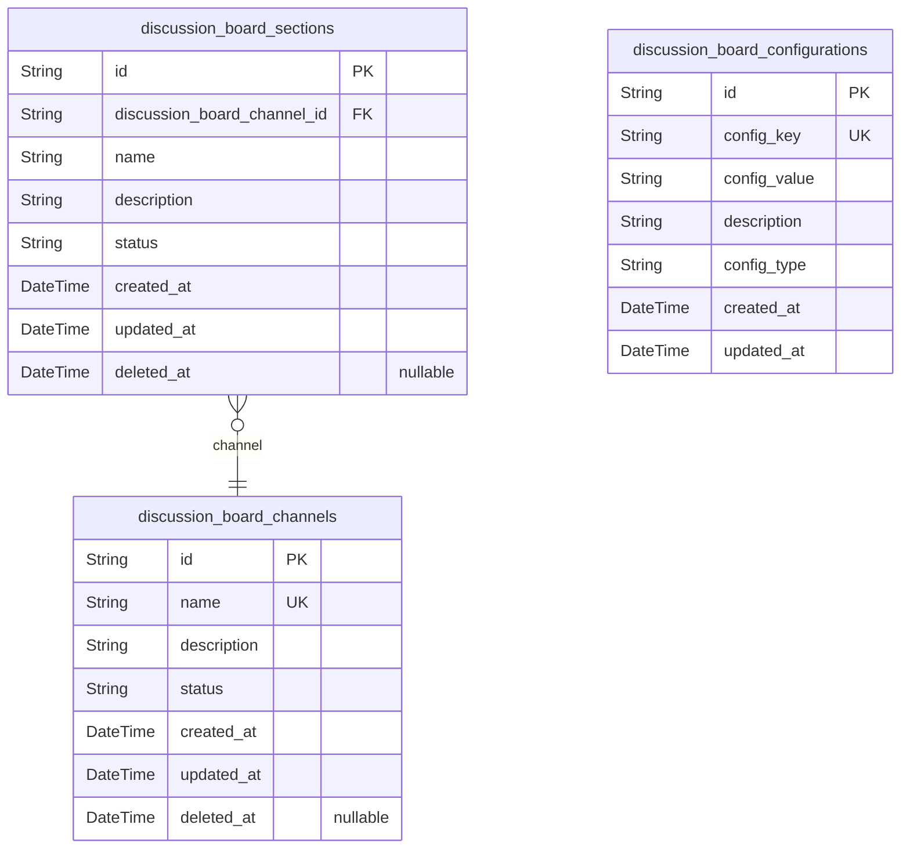
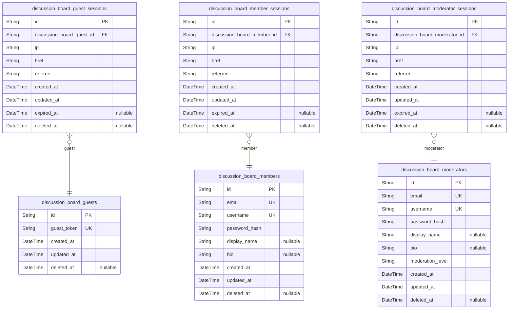
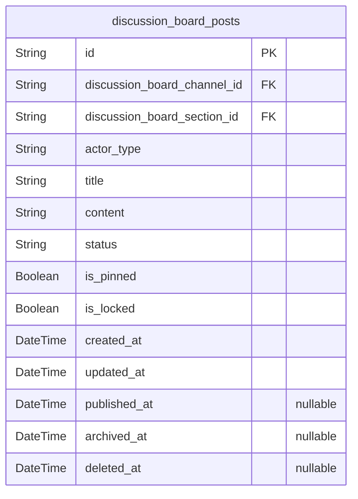
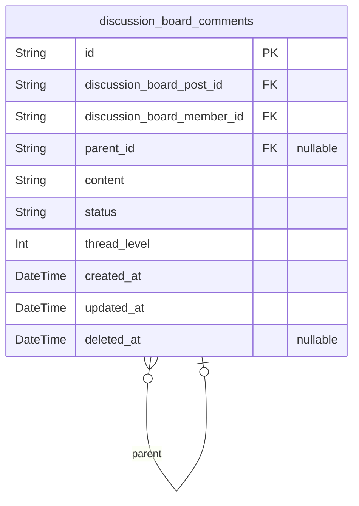
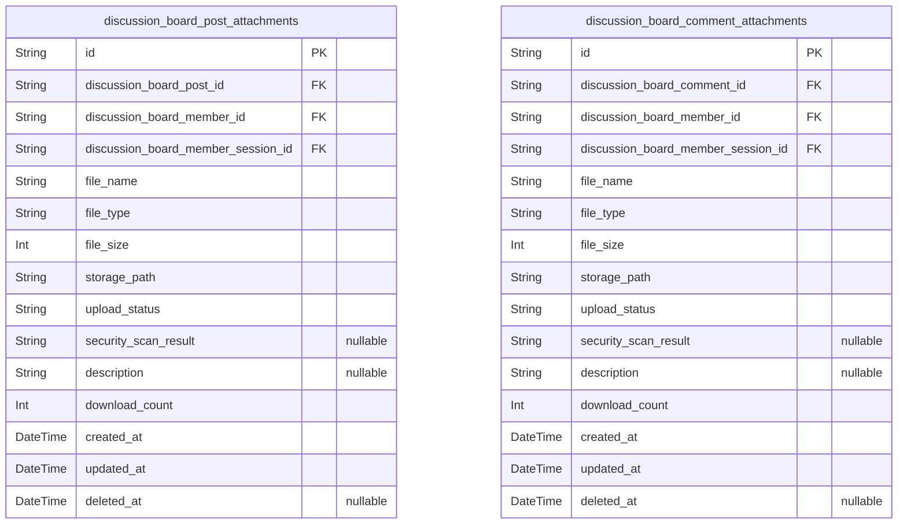
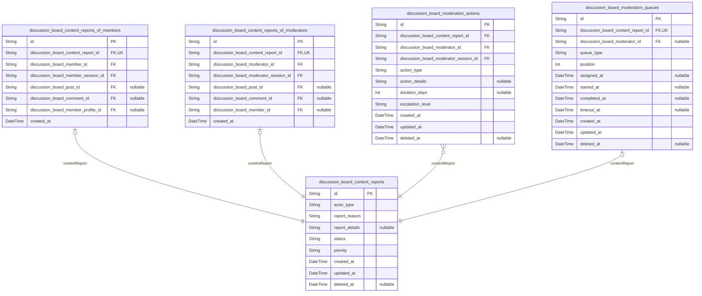
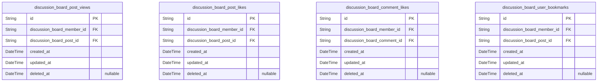
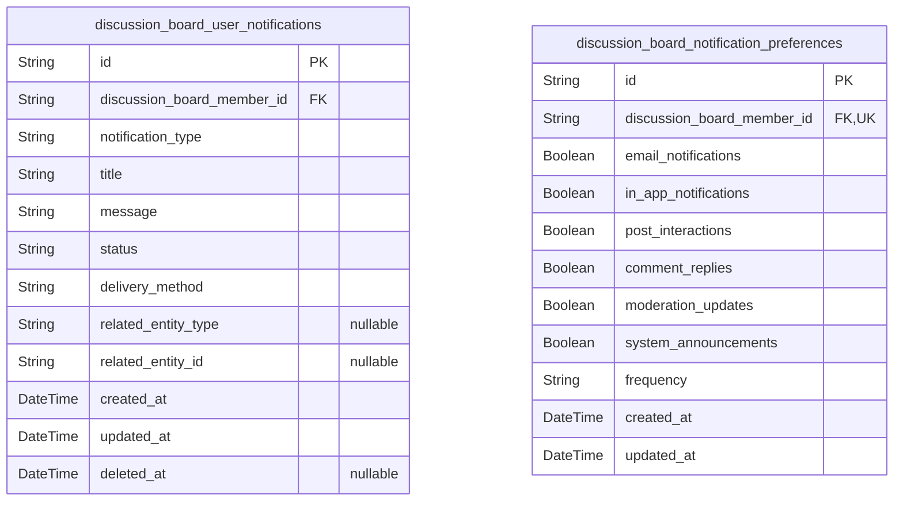

# Prisma Markdown

> Generated by [`prisma-markdown`](https://github.com/samchon/prisma-markdown)

- [Systematic](#systematic)
- [Actors](#actors)
- [Posts](#posts)
- [Comments](#comments)
- [Attachments](#attachments)
- [Moderation](#moderation)
- [Engagement](#engagement)
- [Notifications](#notifications)

## Systematic

### `discussion_board_channels`

Discussion board channels that categorize content by broad topics such as
Economics and Politics.

Each channel represents a major discussion category that contains
multiple sections. Channels define the primary organizational structure
of the discussion board and determine how content is grouped and
displayed to users.

Channels can be activated or deactivated by administrators to control
which topics are available for discussion. Each channel maintains its own
configuration settings and moderation policies.

Properties as follows:

- `id`: Primary Key.
- `name`
  > Channel name that identifies the discussion category (e.g., 'Economics',
  > 'Politics').
- `description`
  > Detailed description explaining the channel's purpose and discussion
  > scope.
- `status`: Channel status indicating whether it is active, inactive, or archived.
- `created_at`: Timestamp when the channel was created.
- `updated_at`: Timestamp when the channel was last updated.
- `deleted_at`: Timestamp when the channel was soft deleted, if applicable.

### `discussion_board_sections`

Sections within discussion board channels that provide finer content
organization.

Sections allow administrators to create subcategories within channels for
more specific topic organization. For example, an Economics channel might
have sections for 'Monetary Policy', 'Fiscal Policy', and 'International
Trade'.

Sections inherit the parent channel's configuration and moderation
settings but can have section-specific overrides. Users can browse
content by section to find discussions on specific topics.

Properties as follows:

- `id`: Primary Key.
- `discussion_board_channel_id`
  > Parent channel that contains this section. {@link
  > discussion_board_channels.id}
- `name`: Section name that identifies the specific topic within the parent channel.
- `description`
  > Detailed description explaining the section's specific focus and
  > discussion guidelines.
- `status`: Section status indicating whether it is active, inactive, or archived.
- `created_at`: Timestamp when the section was created.
- `updated_at`: Timestamp when the section was last updated.
- `deleted_at`: Timestamp when the section was soft deleted, if applicable.

### `discussion_board_configurations`

System configuration settings for the discussion board platform.

Stores platform-wide settings such as moderation policies, attachment
limits, content guidelines, and system behavior parameters. These
configurations control how the discussion board operates and can be
modified by administrators.

Each configuration setting has a unique key and value pair, allowing
flexible system customization without requiring code changes.

Properties as follows:

- `id`: Primary Key.
- `config_key`
  > Unique identifier for the configuration setting (e.g.,
  > 'max_attachment_size', 'post_moderation_enabled').
- `config_value`
  > Value associated with the configuration key, stored as string for
  > flexibility.
- `description`
  > Human-readable description explaining the purpose and usage of this
  > configuration.
- `config_type`
  > Data type of the configuration value (e.g., 'boolean', 'number',
  > 'string', 'json').
- `created_at`: Timestamp when the configuration was created.
- `updated_at`: Timestamp when the configuration was last modified.

## Actors

### `discussion_board_guests`

Guest users who can browse content without authentication but may
register for full access.

Stores basic guest information for tracking anonymous interactions with
the discussion board. Guests can view public content but cannot create
posts, comments, or upload attachments until they register as members.

Guest accounts serve as temporary identifiers for users exploring the
platform before committing to registration. Unlike members and
moderators, guests do not require authentication credentials until they
complete the registration process.

Guest records may be converted to member accounts upon successful
registration, maintaining continuity of user identity while transitioning
from anonymous to authenticated status.

Properties as follows:

- `id`: Primary Key.
- `guest_token`
  > Unique anonymous identifier for guest tracking without authentication
  > requirements.
- `created_at`: Timestamp when the guest account was created.
- `updated_at`: Timestamp when the guest account was last updated.
- `deleted_at`: Timestamp when the guest account was soft deleted.

### `discussion_board_guest_sessions`

Anonymous session tracking for guest users.

Tracks guest browsing sessions with connection context information
including IP address, access URLs, and session timestamps. Each session
belongs to a specific guest user and maintains browsing state without
authentication requirements.

Sessions are used for audit tracing of guest actions and provide
temporary state management for users exploring the platform before
registration. Guest sessions have shorter expiration times compared to
authenticated sessions.

Properties as follows:

- `id`: Primary Key.
- `discussion_board_guest_id`: Belonged guest's [discussion_board_guests.id](#discussion_board_guests).
- `ip`: IP address of the guest session connection.
- `href`: Connection URL where the guest session was established.
- `referrer`: Referrer URL that directed the guest to the session.
- `created_at`: Timestamp when the guest session was created.
- `updated_at`: Timestamp when the guest session was last updated.
- `expired_at`: Timestamp when the guest session expired or was terminated.
- `deleted_at`: Timestamp when the guest session was soft deleted.

### `discussion_board_members`

Registered member users with full discussion board access.

Stores authenticated member information including authentication
credentials and profile data. Members can create posts, comments, upload
attachments, and participate in all discussion features.

Members represent the core user base of the discussion board with full
participation privileges.

Properties as follows:

- `id`: Primary Key.
- `email`
  > Member email address used for authentication and communication. Must be
  > unique across all members.
- `username`
  > Member username for display and identification. Must be unique across all
  > members.
- `password_hash`: Hashed password for member authentication.
- `display_name`: Optional display name for member profile customization.
- `bio`: Optional biography or description for member profile.
- `created_at`: Timestamp when the member account was created.
- `updated_at`: Timestamp when the member account was last updated.
- `deleted_at`: Timestamp when the member account was soft deleted.

### `discussion_board_member_sessions`

Authentication sessions for member users.

Tracks member login sessions with connection context information
including IP address, access URLs, and session timestamps. Each session
belongs to a specific member user and maintains authentication state.

Sessions are used for audit tracing of member actions and are managed
through member authentication flows. Member sessions provide access to
all platform features including post creation, commenting, and attachment
uploads.

Properties as follows:

- `id`: Primary Key.
- `discussion_board_member_id`: Belonged member's [discussion_board_members.id](#discussion_board_members).
- `ip`: IP address of the member session connection.
- `href`: Connection URL where the member session was established.
- `referrer`: Referrer URL that directed the member to the session.
- `created_at`: Timestamp when the member session was created.
- `updated_at`: Timestamp when the member session was last updated.
- `expired_at`: Timestamp when the member session expired or was terminated.
- `deleted_at`: Timestamp when the member session was soft deleted.

### `discussion_board_moderators`

Moderator users with administrative privileges for content management.

Stores moderator information including authentication credentials and
moderation capabilities. Moderators can review reported content, remove
inappropriate posts/comments, suspend users, and manage discussion
categories.

Moderators ensure community guidelines are followed and maintain
discussion quality.

Properties as follows:

- `id`: Primary Key.
- `email`
  > Moderator email address used for authentication and communication. Must
  > be unique across all moderators.
- `username`
  > Moderator username for display and identification. Must be unique across
  > all moderators.
- `password_hash`: Hashed password for moderator authentication.
- `display_name`: Optional display name for moderator profile customization.
- `bio`: Optional biography or description for moderator profile.
- `moderation_level`: Moderator privilege level (e.g., basic, senior, admin).
- `created_at`: Timestamp when the moderator account was created.
- `updated_at`: Timestamp when the moderator account was last updated.
- `deleted_at`: Timestamp when the moderator account was soft deleted.

### `discussion_board_moderator_sessions`

Authentication sessions for moderator users.

Tracks moderator login sessions with connection context information
including IP address, access URLs, and session timestamps. Each session
belongs to a specific moderator user and maintains authentication state
with administrative privileges.

Sessions are used for audit tracing of moderator actions and are managed
through moderator authentication flows. Moderator sessions provide access
to administrative functions including content moderation, user
management, and system configuration.

Properties as follows:

- `id`: Primary Key.
- `discussion_board_moderator_id`: Belonged moderator's [discussion_board_moderators.id](#discussion_board_moderators).
- `ip`: IP address of the moderator session connection.
- `href`: Connection URL where the moderator session was established.
- `referrer`: Referrer URL that directed the moderator to the session.
- `created_at`: Timestamp when the moderator session was created.
- `updated_at`: Timestamp when the moderator session was last updated.
- `expired_at`: Timestamp when the moderator session expired or was terminated.
- `deleted_at`: Timestamp when the moderator session was soft deleted.

## Posts

### `discussion_board_posts`

Main discussion posts created by members or moderators.

Represents the primary content entities that form discussion threads on
the economic/political discussion board. Each post contains a title,
content body, and optional attachments. Posts are organized by channels
and sections to categorize discussions by topic.

Posts support various statuses including draft, published, and archived
states to manage content lifecycle. Authors can edit their posts within a
limited timeframe, and the system maintains edit history for moderation
purposes.

The table implements polymorphic ownership to support both member-created
and moderator-created posts, with proper foreign key relationships to the
respective author tables.

Properties as follows:

- `id`: Primary Key.
- `discussion_board_channel_id`: Channel categorization for the post. [discussion_board_channels.id](#discussion_board_channels)
- `discussion_board_section_id`
  > Section categorization within the channel. {@link
  > discussion_board_sections.id}
- `actor_type`
  > Type of actor who created the post (member or moderator). Used for quick
  > filtering and relationship resolution.
- `title`
  > Post title summarizing the discussion topic. Must be between 5 and 200
  > characters.
- `content`
  > Main content body of the post supporting Markdown formatting. Must be
  > between 50 and 10,000 characters.
- `status`: Current status of the post: draft, published, archived, or deleted.
- `is_pinned`: Whether the post is pinned to the top of the discussion board.
- `is_locked`: Whether the post is locked from further comments.
- `created_at`: Timestamp when the post was originally created.
- `updated_at`: Timestamp when the post was last updated.
- `published_at`: Timestamp when the post was published and made visible to users.
- `archived_at`: Timestamp when the post was archived due to age or inactivity.
- `deleted_at`: Timestamp when the post was soft-deleted.

## Comments

### `discussion_board_comments`

Threaded comments on discussion board posts with support for attachments
and moderation.

Stores user comments on discussion posts with hierarchical threading
capabilities. Each comment belongs to a specific post and can have parent
comments for threaded discussions. Comments support attachment uploads
and have their own lifecycle independent from posts.

Comments require member authentication and can be moderated separately
from posts. The system maintains comment threading up to 3 levels deep as
specified in requirements. Comments have their own validation rules and
management workflows distinct from post content.

Comment lifecycle includes creation, editing within time limits, and soft
deletion. The system tracks comment status and maintains audit trails for
moderation purposes.

Properties as follows:

- `id`: Primary Key.
- `discussion_board_post_id`: Reference to the parent post. [discussion_board_posts.id](#discussion_board_posts)
- `discussion_board_member_id`: Reference to the comment author. [discussion_board_members.id](#discussion_board_members)
- `parent_id`
  > Reference to parent comment for threaded replies. {@link
  > discussion_board_comments.id}
- `content`
  > Comment text content with Markdown formatting support. Validated for
  > length between 1 and 2000 characters as per requirements.
- `status`
  > Current comment status: 'draft', 'published', 'deleted'. Controls comment
  > visibility and management.
- `thread_level`
  > Nesting level of comment in thread hierarchy. Root comments have level 0,
  > replies increment by 1. Limited to maximum 3 levels deep.
- `created_at`: Timestamp when comment was initially created.
- `updated_at`: Timestamp when comment was last modified.
- `deleted_at`: Timestamp when comment was soft deleted. Null if comment is active.

## Attachments

### `discussion_board_post_attachments`

File attachments associated with discussion board posts.

Stores metadata for files uploaded by members to support their posts with
additional evidence, research materials, or visual content. Each
attachment is specifically linked to a single post and maintains its own
lifecycle separate from the post content.

Attachments undergo security scanning and validation before being made
available for download. The system tracks upload status, file properties,
and access patterns to ensure proper attachment management.

Supports various file types including images (JPG, PNG, GIF) and
documents (PDF, DOC, DOCX) with size limitations enforced during upload.

Properties as follows:

- `id`: Primary Key.
- `discussion_board_post_id`
  > Reference to the parent post that this attachment belongs to. {@link
  > discussion_board_posts.id}
- `discussion_board_member_id`
  > Reference to the member who uploaded this attachment. {@link
  > discussion_board_members.id}
- `discussion_board_member_session_id`
  > Reference to the session context when the attachment was uploaded. {@link
  > discussion_board_member_sessions.id}
- `file_name`: Original name of the uploaded file as provided by the user.
- `file_type`
  > MIME type or file extension indicating the file format (e.g., image/jpeg,
  > application/pdf).
- `file_size`: Size of the file in bytes. Used for validation and display purposes.
- `storage_path`: Path or identifier for the file in the storage system.
- `upload_status`
  > Current status of the attachment upload process (pending, processing,
  > completed, failed).
- `security_scan_result`: Result of security/virus scanning (clean, suspicious, infected, pending).
- `description`: Optional description provided by the user for the attachment.
- `download_count`: Number of times this attachment has been downloaded by users.
- `created_at`: Timestamp when the attachment record was created.
- `updated_at`: Timestamp when the attachment record was last updated.
- `deleted_at`: Timestamp when the attachment was soft deleted. Null if still active.

### `discussion_board_comment_attachments`

File attachments associated with discussion board comments.

Stores metadata for files uploaded by members to support their comments
with additional evidence, references, or visual content. Each attachment
is specifically linked to a single comment and maintains its own
lifecycle separate from the comment text.

Attachments undergo security scanning and validation before being made
available for download. The system tracks upload status, file properties,
and access patterns to ensure proper attachment management.

Supports various file types including images (JPG, PNG, GIF) and
documents (PDF, DOC, DOCX) with size limitations enforced during upload.

Properties as follows:

- `id`: Primary Key.
- `discussion_board_comment_id`
  > Reference to the parent comment that this attachment belongs to. {@link
  > discussion_board_comments.id}
- `discussion_board_member_id`
  > Reference to the member who uploaded this attachment. {@link
  > discussion_board_members.id}
- `discussion_board_member_session_id`
  > Reference to the session context when the attachment was uploaded. {@link
  > discussion_board_member_sessions.id}
- `file_name`: Original name of the uploaded file as provided by the user.
- `file_type`
  > MIME type or file extension indicating the file format (e.g., image/jpeg,
  > application/pdf).
- `file_size`: Size of the file in bytes. Used for validation and display purposes.
- `storage_path`: Path or identifier for the file in the storage system.
- `upload_status`
  > Current status of the attachment upload process (pending, processing,
  > completed, failed).
- `security_scan_result`: Result of security/virus scanning (clean, suspicious, infected, pending).
- `description`: Optional description provided by the user for the attachment.
- `download_count`: Number of times this attachment has been downloaded by users.
- `created_at`: Timestamp when the attachment record was created.
- `updated_at`: Timestamp when the attachment record was last updated.
- `deleted_at`: Timestamp when the attachment was soft deleted. Null if still active.

## Moderation

### `discussion_board_content_reports`

Main entity for content reports with shared attributes and actor type
classification.

Serves as the central repository for all content reports submitted on the
discussion board. Contains common fields shared across all report types
regardless of which actor (member or moderator) created them.

The actor_type field enables efficient filtering and routing to the
appropriate subtype tables for actor-specific data. This design follows
proper normalization by separating shared attributes from actor-specific
information.

Reports can target various content types including posts, comments, and
member profiles, with each report maintaining its own lifecycle and
moderation workflow state.

Properties as follows:

- `id`: Primary Key.
- `actor_type`
  > Type of actor who created the report. Values: 'member', 'moderator'. Used
  > for efficient filtering and relationship routing to subtype tables.
- `report_reason`
  > Reason category for the report. Common values: 'spam', 'harassment',
  > 'inappropriate', 'misinformation', 'copyright', 'other'.
- `report_details`
  > Detailed explanation provided by the reporter explaining why the content
  > should be moderated.
- `status`
  > Current status of the report in moderation workflow. Values: 'pending',
  > 'under_review', 'resolved', 'dismissed', 'escalated'.
- `priority`
  > Priority level for moderation handling. Values: 'low', 'normal', 'high',
  > 'critical'. Assigned based on report severity.
- `created_at`: Timestamp when the report was initially submitted.
- `updated_at`: Timestamp when the report was last updated.
- `deleted_at`: Timestamp when the report was soft deleted for audit purposes.

### `discussion_board_content_reports_of_members`

Subsidiary table tracking content reports specifically created by member
users.

Stores member-specific information for content reports, including the
member who submitted the report and their session context. This table
maintains the 1:1 relationship with the main content_reports entity while
properly normalizing member-specific data.

Each member report references exactly one main report entity and ensures
referential integrity through the unique constraint on
discussion_board_content_report_id. This design prevents data integrity
issues that would occur with nullable foreign keys in a monolithic table.

Properties as follows:

- `id`: Primary Key.
- `discussion_board_content_report_id`: Main content report reference. [discussion_board_content_reports.id](#discussion_board_content_reports)
- `discussion_board_member_id`: Member who created the report. [discussion_board_members.id](#discussion_board_members)
- `discussion_board_member_session_id`
  > Session context when the report was created. {@link
  > discussion_board_member_sessions.id}
- `discussion_board_post_id`: Reported post reference. [discussion_board_posts.id](#discussion_board_posts)
- `discussion_board_comment_id`: Reported comment reference. [discussion_board_comments.id](#discussion_board_comments)
- `discussion_board_member_profile_id`: Reported member profile reference. [discussion_board_members.id](#discussion_board_members)
- `created_at`: Timestamp when the member-specific report data was created.

### `discussion_board_content_reports_of_moderators`

Subsidiary table tracking content reports specifically created by
moderator users.

Stores moderator-specific information for content reports, including the
moderator who submitted the report and their session context. This table
maintains the 1:1 relationship with the main content_reports entity while
properly normalizing moderator-specific data.

Each moderator report references exactly one main report entity and
ensures referential integrity through the unique constraint on
discussion_board_content_report_id. This design follows the same pattern
as member reports but for moderator actors.

Properties as follows:

- `id`: Primary Key.
- `discussion_board_content_report_id`: Main content report reference. [discussion_board_content_reports.id](#discussion_board_content_reports)
- `discussion_board_moderator_id`: Moderator who created the report. [discussion_board_moderators.id](#discussion_board_moderators)
- `discussion_board_moderator_session_id`
  > Session context when the report was created. {@link
  > discussion_board_moderator_sessions.id}
- `discussion_board_post_id`: Reported post reference. [discussion_board_posts.id](#discussion_board_posts)
- `discussion_board_comment_id`: Reported comment reference. [discussion_board_comments.id](#discussion_board_comments)
- `discussion_board_member_id`: Reported member profile reference. [discussion_board_members.id](#discussion_board_members)
- `created_at`: Timestamp when the moderator-specific report data was created.

### `discussion_board_moderation_actions`

Records of moderation actions taken by moderators on reported content.

Stores comprehensive audit trails of all moderation decisions including
content removal, user warnings, suspensions, and other disciplinary
actions. Each action references the specific content report that
triggered it and the moderator responsible.

This table serves as the official record of moderation activities,
providing transparency and accountability for all moderation decisions
made on the platform.

Properties as follows:

- `id`: Primary Key.
- `discussion_board_content_report_id`
  > Content report that triggered this action. {@link
  > discussion_board_content_reports.id}
- `discussion_board_moderator_id`: Moderator who performed the action. [discussion_board_moderators.id](#discussion_board_moderators)
- `discussion_board_moderator_session_id`
  > Session context when the action was performed. {@link
  > discussion_board_moderator_sessions.id}
- `action_type`
  > Type of moderation action performed. Values: 'content_removal',
  > 'user_warning', 'temporary_suspension', 'permanent_ban',
  > 'content_approval', 'report_dismissal'.
- `action_details`
  > Detailed explanation of the action taken, including rationale and
  > specific violations identified.
- `duration_days`
  > Duration of temporary actions like suspensions. Null for permanent
  > actions or approvals.
- `escalation_level`
  > Level of escalation for serious violations. Values: 'standard',
  > 'escalated', 'critical'.
- `created_at`: Timestamp when the moderation action was performed.
- `updated_at`: Timestamp when the action record was last updated.
- `deleted_at`: Timestamp when the action record was soft deleted.

### `discussion_board_moderation_queues`

Workflow management table for organizing moderation tasks and assignments.

Tracks the current state of content reports in the moderation pipeline,
including assignment to specific moderators, priority levels, and queue
positions. This table enables efficient moderation workflow management
and load balancing across the moderation team.

As a primary entity, moderation queues require independent management
capabilities including search, filtering, and assignment operations.
Queues help ensure timely review of reported content and prevent
moderation bottlenecks through systematic task distribution.

Properties as follows:

- `id`: Primary Key.
- `discussion_board_content_report_id`
  > Content report being processed in this queue. {@link
  > discussion_board_content_reports.id}
- `discussion_board_moderator_id`
  > Moderator currently assigned to review this report. {@link
  > discussion_board_moderators.id}
- `queue_type`
  > Type of moderation queue. Values: 'general', 'urgent', 'appeals',
  > 'escalated'. Different queues handle different priority levels and
  > content types.
- `position`
  > Position in the queue indicating processing order. Lower numbers indicate
  > higher priority.
- `assigned_at`: Timestamp when the report was assigned to a moderator.
- `started_at`: Timestamp when the moderator began reviewing the report.
- `completed_at`: Timestamp when the moderation review was completed.
- `timeout_at`: Timestamp when the assignment will timeout if not completed.
- `created_at`: Timestamp when the report entered the moderation queue.
- `updated_at`: Timestamp when the queue entry was last updated.
- `deleted_at`: Timestamp when the queue entry was soft deleted for audit purposes.

## Engagement

### `discussion_board_post_views`

Tracks user views of discussion board posts for engagement analytics.

Records each time a user views a post to measure content popularity and
user engagement patterns. This data supports content discovery algorithms
and helps identify trending discussions.

Views are tracked per user per post to prevent duplicate counting while
maintaining accurate engagement metrics. The system uses this data to
personalize content recommendations and analyze user behavior patterns.

Properties as follows:

- `id`: Primary Key.
- `discussion_board_member_id`: Viewing member's [discussion_board_members.id](#discussion_board_members).
- `discussion_board_post_id`: Viewed post's [discussion_board_posts.id](#discussion_board_posts).
- `created_at`: Timestamp when the post view was recorded.
- `updated_at`: Timestamp when the view record was last updated.
- `deleted_at`: Timestamp when the view record was soft deleted.

### `discussion_board_post_likes`

Records user likes on discussion board posts to measure content
appreciation.

Tracks positive engagement through post likes, which helps identify
popular content and user preferences. Each like represents user
endorsement of the post content.

The system prevents duplicate likes per user per post to maintain
accurate engagement metrics. Like data informs content recommendation
algorithms and community engagement analytics.

Properties as follows:

- `id`: Primary Key.
- `discussion_board_member_id`: Liking member's [discussion_board_members.id](#discussion_board_members).
- `discussion_board_post_id`: Liked post's [discussion_board_posts.id](#discussion_board_posts).
- `created_at`: Timestamp when the post like was recorded.
- `updated_at`: Timestamp when the like record was last updated.
- `deleted_at`: Timestamp when the like record was soft deleted.

### `discussion_board_comment_likes`

Tracks user likes on discussion board comments for engagement measurement.

Records positive feedback on individual comments to identify valuable
contributions within discussions. Comment likes help surface insightful
commentary and reward constructive participation.

The system ensures each user can like a comment only once to maintain
engagement integrity. This data supports comment quality assessment and
user reputation systems.

Properties as follows:

- `id`: Primary Key.
- `discussion_board_member_id`: Liking member's [discussion_board_members.id](#discussion_board_members).
- `discussion_board_comment_id`: Liked comment's [discussion_board_comments.id](#discussion_board_comments).
- `created_at`: Timestamp when the comment like was recorded.
- `updated_at`: Timestamp when the like record was last updated.
- `deleted_at`: Timestamp when the like record was soft deleted.

### `discussion_board_user_bookmarks`

Stores user bookmarks for saving interesting posts for later reference.

Allows users to mark posts they want to revisit, creating a personalized
reading list. Bookmarks help users track content they find valuable
without relying on memory or external tools.

The system supports efficient bookmark retrieval and management, enabling
users to organize their saved content effectively. Bookmark data also
informs content recommendation algorithms.

Properties as follows:

- `id`: Primary Key.
- `discussion_board_member_id`: Bookmarking member's [discussion_board_members.id](#discussion_board_members).
- `discussion_board_post_id`: Bookmarked post's [discussion_board_posts.id](#discussion_board_posts).
- `created_at`: Timestamp when the bookmark was created.
- `updated_at`: Timestamp when the bookmark was last updated.
- `deleted_at`: Timestamp when the bookmark was soft deleted.

## Notifications

### `discussion_board_user_notifications`

Individual user notifications for content interactions, moderation
actions, and system messages.

Stores notification instances delivered to users for various platform
activities including post interactions, comment replies, moderation
decisions, and system announcements. Each notification tracks delivery
status, content type, and user acknowledgment.

Notifications support multiple delivery methods (in-app, email) and can
be marked as read, unread, or dismissed by users. The system maintains
notification history for user reference while supporting efficient
querying for unread notifications.

Properties as follows:

- `id`: Primary Key.
- `discussion_board_member_id`
  > Target member who receives the notification. {@link
  > discussion_board_members.id}.
- `notification_type`
  > Type of notification indicating the event that triggered it. Examples:
  > post_reply, comment_like, moderation_action, system_announcement.
- `title`: Notification title summarizing the event or message.
- `message`: Detailed notification message content providing context and information.
- `status`
  > Current delivery status of the notification. Values: unread, read,
  > dismissed.
- `delivery_method`: Method used to deliver the notification. Values: in_app, email, both.
- `related_entity_type`
  > Type of entity related to this notification. Examples: post, comment,
  > user, system.
- `related_entity_id`: Identifier of the related entity for contextual navigation.
- `created_at`: Timestamp when the notification was created and queued for delivery.
- `updated_at`: Timestamp when the notification was last updated, such as status changes.
- `deleted_at`: Timestamp when the notification was soft deleted by the user or system.

### `discussion_board_notification_preferences`

User configuration for notification delivery preferences and subscription
settings.

Stores individual user preferences for how and when they receive
notifications from the discussion platform. Users can customize delivery
methods, frequency, and content types they wish to be notified about.

Preferences support granular control over different notification
categories including post interactions, comment activities, moderation
updates, and system announcements. Each preference setting enables or
disables specific notification types and defines delivery channel
preferences.

Properties as follows:

- `id`: Primary Key.
- `discussion_board_member_id`
  > Target member whose notification preferences are configured. {@link
  > discussion_board_members.id}.
- `email_notifications`
  > Whether the user wants to receive notifications via email. Global setting
  > that applies to all notification types unless overridden.
- `in_app_notifications`
  > Whether the user wants to receive notifications within the application
  > interface.
- `post_interactions`
  > Receive notifications for interactions with user's posts (replies, likes,
  > shares).
- `comment_replies`: Receive notifications for replies to user's comments and comment threads.
- `moderation_updates`
  > Receive notifications about moderation actions on user's content or
  > reported content.
- `system_announcements`
  > Receive notifications for platform announcements, maintenance, and
  > important updates.
- `frequency`
  > Preferred notification frequency or batching. Values: immediate,
  > daily_digest, weekly_digest.
- `created_at`: Timestamp when the notification preferences were initially created.
- `updated_at`
  > Timestamp when the notification preferences were last modified by the
  > user.
