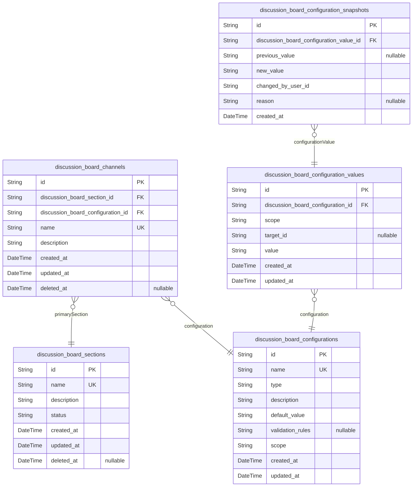
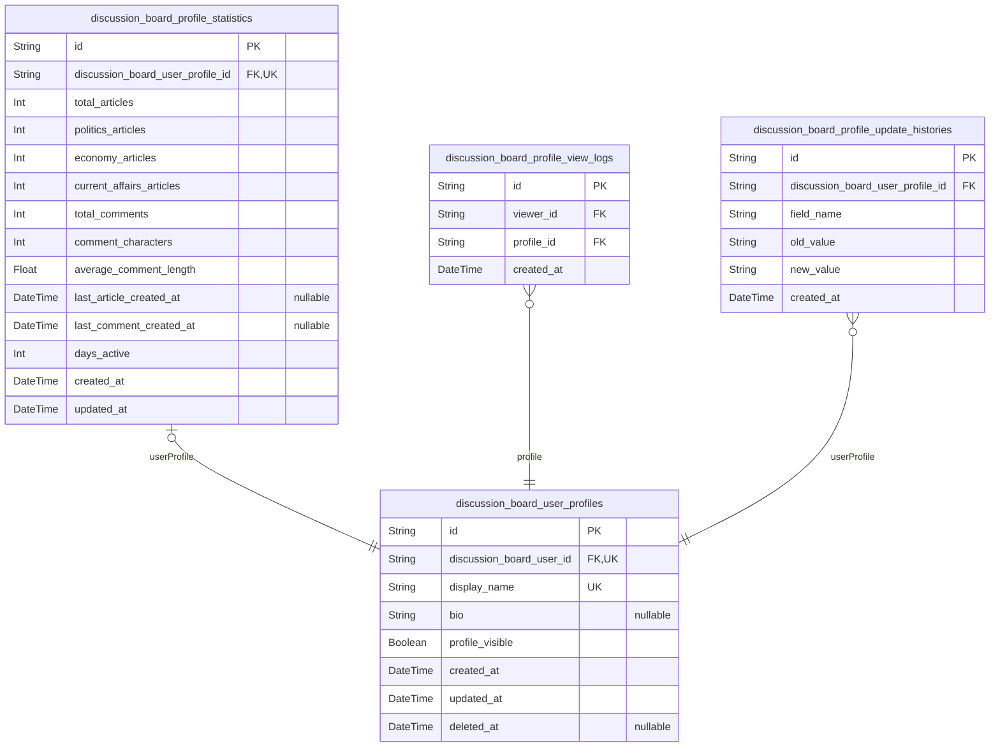
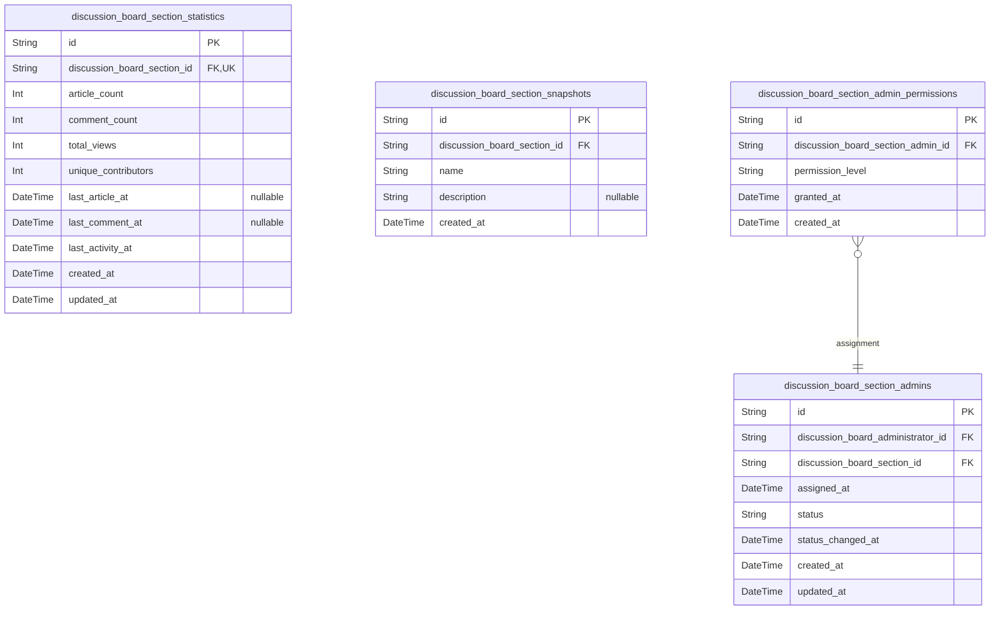
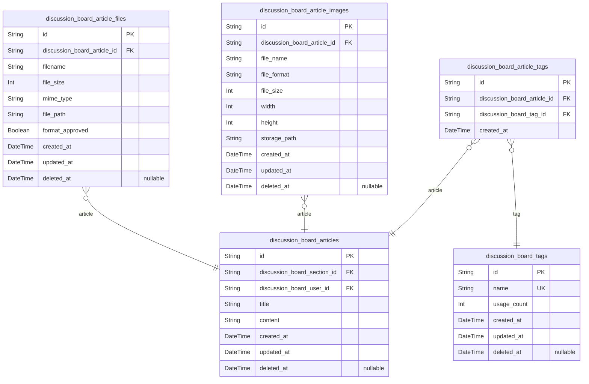
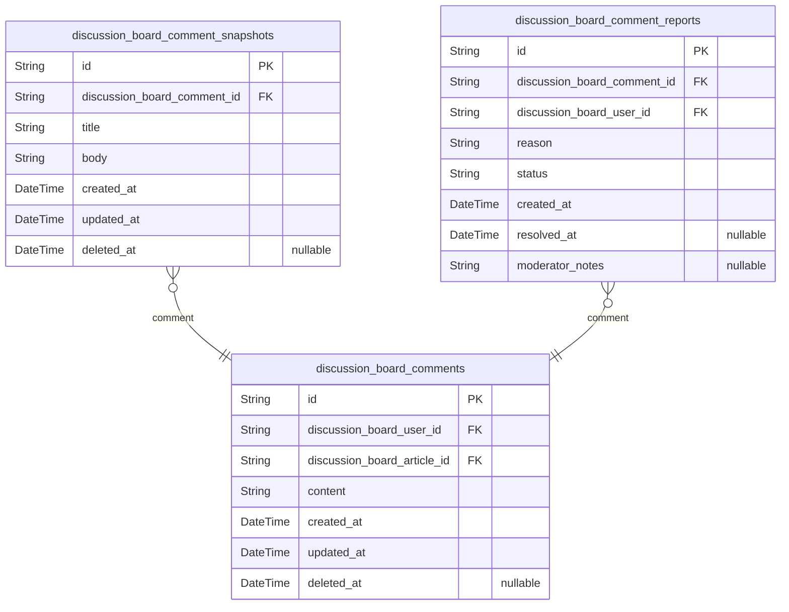
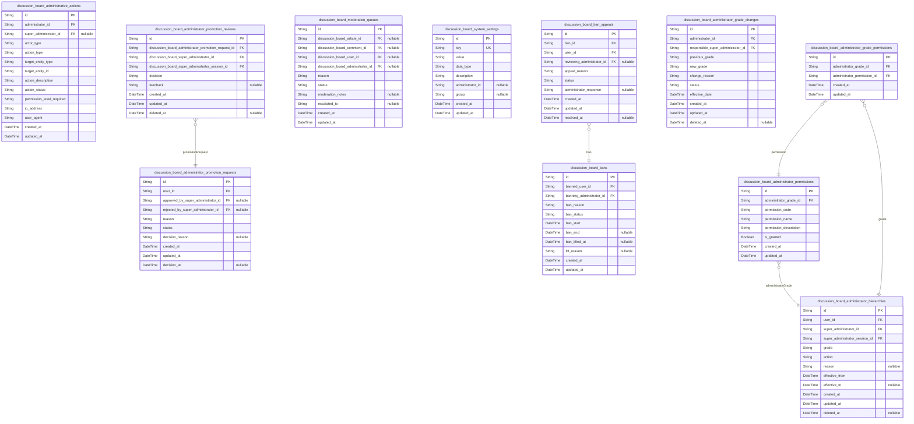
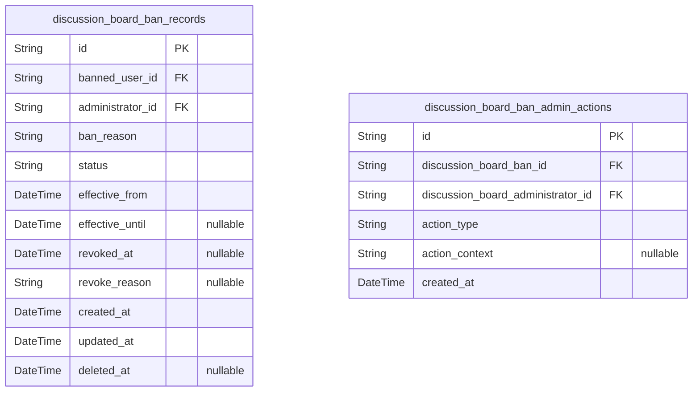

# Prisma Markdown

> Generated by [`prisma-markdown`](https://github.com/samchon/prisma-markdown)

- [Actors](#actors)
- [Systematic](#systematic)
- [Profiles](#profiles)
- [Sections](#sections)
- [Articles](#articles)
- [Comments](#comments)
- [Administration](#administration)
- [Banning](#banning)

## Actors

```mermaid
erDiagram
"discussion_board_users" {
  String id PK
  String email UK
  String password_hash
  String display_name UK "nullable"
  String account_status
  Boolean email_verified
  DateTime last_login_at "nullable"
  Int failed_login_attempts
  DateTime account_locked_until "nullable"
  DateTime created_at
  DateTime updated_at
  DateTime deleted_at "nullable"
}
"discussion_board_user_sessions" {
  String id PK
  String discussion_board_user_id FK
  String ip
  String href
  String referrer
  DateTime created_at
  DateTime expired_at
}
"discussion_board_user_password_resets" {
  String id PK
  String discussion_board_user_id FK
  String token UK
  DateTime expires_at
  DateTime used_at "nullable"
  DateTime created_at
}
"discussion_board_user_email_verifications" {
  String id PK
  String discussion_board_user_id FK
  String token UK
  Boolean verified
  DateTime created_at
  DateTime expired_at
  DateTime verified_at "nullable"
}
"discussion_board_administrators" {
  String id PK
  String discussion_board_user_id FK,UK
  String email UK
  String password_hash
  Boolean email_verified
  DateTime created_at
  DateTime updated_at
  DateTime deleted_at "nullable"
}
"discussion_board_administrator_sessions" {
  String id PK
  String discussion_board_administrator_id FK
  String ip
  String href
  String referrer
  DateTime created_at
  DateTime expired_at
}
"discussion_board_administrator_password_resets" {
  String id PK
  String discussion_board_administrator_id FK
  String token UK
  DateTime expired_at
  DateTime created_at
  DateTime updated_at
}
"discussion_board_administrator_email_verifications" {
  String id PK
  String discussion_board_administrator_id FK
  String token UK
  DateTime expired_at
  DateTime verified_at "nullable"
  DateTime created_at
}
"discussion_board_super_administrators" {
  String id PK
  String email UK
  String password_hash
  String status
  Int failed_login_attempts
  DateTime last_login_at "nullable"
  DateTime created_at
  DateTime updated_at
  DateTime deleted_at "nullable"
}
"discussion_board_super_administrator_sessions" {
  String id PK
  String discussion_board_super_administrator_id FK
  String ip
  String href
  String referrer
  DateTime created_at
  DateTime expired_at
}
"discussion_board_super_administrator_password_resets" {
  String id PK
  String discussion_board_super_administrator_id FK
  String token UK
  DateTime expires_at
  DateTime created_at
  DateTime used_at "nullable"
}
"discussion_board_super_administrator_email_verifications" {
  String id PK
  String discussion_board_super_administrator_id FK
  String token UK
  DateTime expires_at
  DateTime verified_at "nullable"
  Int verification_attempts
  DateTime created_at
}
"discussion_board_user_sessions" }o--|| "discussion_board_users" : user
"discussion_board_user_password_resets" }o--|| "discussion_board_users" : user
"discussion_board_user_email_verifications" }o--|| "discussion_board_users" : user
"discussion_board_administrators" |o--|| "discussion_board_users" : user
"discussion_board_administrator_sessions" }o--|| "discussion_board_administrators" : administrator
"discussion_board_administrator_password_resets" }o--|| "discussion_board_administrators" : administrator
"discussion_board_administrator_email_verifications" }o--|| "discussion_board_administrators" : administrator
"discussion_board_super_administrator_sessions" }o--|| "discussion_board_super_administrators" : superAdministrator
"discussion_board_super_administrator_password_resets" }o--|| "discussion_board_super_administrators" : superAdministrator
"discussion_board_super_administrator_email_verifications" }o--|| "discussion_board_super_administrators" : superAdministrator
```

### `discussion_board_users`

Regular user accounts with email/password authentication credentials and
profile information for discussion board participation.

Stores core identity information for registered users including
authentication credentials, account status, and basic profile data. Each
user account enables full platform participation including article
creation, commenting, and profile management.

The table maintains authentication requirements including unique email
validation, password hashing, email verification status, and account
activation controls. User accounts can be in various states including
pending verification, active, suspended, or banned, with appropriate
access restrictions.

Account lifecycle management includes creation timestamps, last login
tracking, and soft deletion capability through deleted_at field. All user
personal data follows platform privacy policies and authentication
security standards.

Properties as follows:

- `id`: Primary Key.
- `email`
  > User's unique email address used for authentication and communication.
  > Must be unique across all user accounts.
- `password_hash`
  > Hashed password string for secure user authentication. Never stored in
  > plain text format.
- `display_name`
  > User's public display name shown on articles, comments, and profile. Can
  > be updated by the user.
- `account_status`
  > Current status of the user account. Valid values: pending_verification,
  > active, suspended, banned.
- `email_verified`
  > Whether the user's email address has been successfully verified through
  > the verification process.
- `last_login_at`
  > Timestamp of the user's most recent successful login for activity
  > tracking.
- `failed_login_attempts`
  > Count of consecutive failed login attempts for security monitoring and
  > account lockout prevention.
- `account_locked_until`
  > Timestamp until which the account is locked due to excessive failed login
  > attempts.
- `created_at`: Timestamp when the user account was initially created.
- `updated_at`: Timestamp when the user account was last updated.
- `deleted_at`
  > Timestamp when the user account was soft deleted, allowing for account
  > recovery.

### `discussion_board_user_sessions`

User authentication session tokens implementing JWT-based authentication
with 15-minute access tokens and 30-day refresh tokens as specified in
requirements.

Stores connection context including IP address, URL, and referrer for
session tracking and security audits. Each session belongs to exactly one
user and maintains authentication state until expiration.

Sessions are automatically invalidated upon password changes or explicit
logout, and expired sessions are periodically cleaned up by the system to
maintain security compliance.

Properties as follows:

- `id`: Primary Key.
- `discussion_board_user_id`: Belonged user's [discussion_board_users.id](#discussion_board_users).
- `ip`
  > IP address of the connection that created this session for security
  > tracking.
- `href`: Connection URL where the session was initiated for contextual logging.
- `referrer`: Referrer URL that brought the user to the session creation endpoint.
- `created_at`: Session creation timestamp when the user successfully authenticated.
- `expired_at`
  > Session expiration timestamp when the session becomes invalid - sessions
  > must expire for security.

### `discussion_board_user_password_resets`

Password reset tokens with expiration for secure user password recovery
workflow.

Stores temporary tokens that allow users to reset their passwords
securely. Each token is valid for a limited time period (typically 1
hour) and can only be used once. The system generates unique tokens when
users request password resets and invalidates them after successful usage
or expiration.

Tokens reference the target user through foreign key relationship and
include expiration timestamps for automatic cleanup. This table supports
the password recovery functionality required by the authentication system
while maintaining security through token expiration and single-use
constraints.

Properties as follows:

- `id`: Primary Key.
- `discussion_board_user_id`: The user requesting password reset. [discussion_board_users.id](#discussion_board_users)
- `token`
  > Unique password reset token generated for secure password recovery
  > process. Tokens are cryptographically secure and can only be used once.
- `expires_at`
  > Token expiration timestamp after which the password reset token becomes
  > invalid for security.
- `used_at`
  > Timestamp when the password reset token was successfully used to reset
  > the password, marking it as consumed.
- `created_at`
  > Timestamp when the password reset token was initially created for the
  > user's request.

### `discussion_board_user_email_verifications`

Email verification tokens for user registration confirmation with 24-hour
expiration.

Stores verification tokens sent to users during the registration process
to validate email addresses. Each token is associated with a specific
user account and has a limited validity period as specified in the
authentication requirements.

The system generates unique tokens for each verification request and
tracks whether the token has been used to confirm the email address.
Tokens expire after 24 hours to maintain security and prevent
unauthorized account activation.

This table supports the email verification workflow required for user
registration, ensuring that only valid email addresses can be used to
create accounts on the discussion board platform.

Properties as follows:

- `id`: Primary Key.
- `discussion_board_user_id`
  > Associated user account requiring email verification. {@link
  > discussion_board_users.id}
- `token`
  > Unique verification token sent to the user's email address for account
  > confirmation. Must be cryptographically secure and unique per
  > verification request.
- `verified`
  > Indicates whether the email verification has been completed successfully.
  > Set to true when the user clicks the verification link.
- `created_at`: Timestamp when the verification token was created and sent to the user.
- `expired_at`
  > Timestamp when the verification token expires, typically 24 hours after
  > creation as specified in requirements.
- `verified_at`
  > Timestamp when the email verification was successfully completed. Null
  > until verification occurs.

### `discussion_board_administrators`

Administrator accounts with elevated privileges for content moderation
and section management.

Stores authentication credentials and administrative profile information
for users granted elevated permissions to manage the discussion platform.
Administrators inherit all regular user capabilities while gaining
additional administrative functions including section management, content
moderation, and user supervision.

Each administrator account references a corresponding user account using
inheritance pattern, maintaining separate authentication credentials
while preserving shared user functionality. This enables administrator
accounts to participate in discussion activities while also performing
administrative duties.

Administrators require email verification for account activation and
maintain separate credential management from regular users for security
purposes. The account lifecycle includes registration, verification,
activation, and potential deactivation or deletion workflows.

Soft deletion support allows temporary account suspension while
preserving administrative action audit trails and maintaining referential
integrity across the system.

Properties as follows:

- `id`: Primary Key.
- `discussion_board_user_id`
  > Reference to the base user account from which this administrator
  > inherits. [discussion_board_users.id](#discussion_board_users)
- `email`
  > Unique email address used for administrator authentication and
  > communication. Must follow valid email format and remain unique across
  > all administrator accounts.
- `password_hash`
  > Securely hashed password for administrator authentication using
  > industry-standard cryptographic hashing algorithms. Never stored in plain
  > text.
- `email_verified`
  > Indicates whether the administrator's email address has been successfully
  > verified. Required for full account activation and administrative access.
- `created_at`
  > Timestamp when the administrator account was originally created in the
  > system.
- `updated_at`
  > Timestamp when the administrator account was last modified, including
  > profile updates or credential changes.
- `deleted_at`
  > Timestamp when the administrator account was soft deleted, allowing for
  > account recovery while maintaining audit trails.

### `discussion_board_administrator_sessions`

JWT session tokens for administrator authentication with access and
refresh token support.

Stores administrator login sessions with connection context including IP
address, URL, and referrer information. Each session has expiration
tracking for security compliance. Sessions are managed through
authentication workflows and support the required session management
functionality.

Follows the standardized session table pattern for consistency across
actor types in the authorization domain.

Properties as follows:

- `id`: Primary Key.
- `discussion_board_administrator_id`
  > Reference to the administrator account managing this session. {@link
  > discussion_board_administrators.id}
- `ip`
  > IP address of the connection where the session was created. Used for
  > security monitoring and geographic tracking.
- `href`
  > Full URL of the page where the session was initiated. Provides context
  > for session creation for auditing purposes.
- `referrer`
  > Referrer URL that directed the user to the session creation page. Used
  > for traffic source analysis and audit trails.
- `created_at`
  > Timestamp when the session was created. Used for session lifecycle
  > management and expiration calculations.
- `expired_at`
  > Timestamp when the session expires. Sessions must expire for security
  > compliance as specified in requirements.

### `discussion_board_administrator_password_resets`

Password reset tokens for administrator accounts with expiration for
secure password recovery workflow.

Stores temporary tokens that allow administrators to reset their
passwords when forgotten. Contains the reset token, expiration timestamp,
and references the specific administrator account requesting reset.

Tokens are single-use and expire after a configurable period for
security. Requires valid administrator authentication and session
validation to initiate password reset process. Follows same security
patterns as user password reset functionality.

The system automatically invalidates tokens after use or expiration to
prevent unauthorized access. Administrators can initiate reset requests
through authenticated interfaces only.

Properties as follows:

- `id`: Primary Key.
- `discussion_board_administrator_id`
  > Reference to the authenticated administrator's {@link
  > discussion_board_administrators.id} who requested password reset.
- `token`
  > Secure reset token used for password reset validation. Generated as
  > cryptographically secure random string.
- `expired_at`
  > Expiration timestamp for the reset token. After this time, the token
  > becomes invalid for security.
- `created_at`: Timestamp when the password reset request was created.
- `updated_at`: Timestamp when the password reset record was last updated.

### `discussion_board_administrator_email_verifications`

Email verification tokens for validating administrator email addresses
during registration.

Stores unique tokens sent to administrator email addresses for
confirmation of account ownership. Each token expires 24 hours after
creation as required by the authentication specifications. Tokens are
consumed upon successful verification and remain for audit purposes.

The verification process ensures only email-verified administrators can
access the platform, maintaining security and preventing unauthorized
account creation. Failed verification attempts are logged for security
monitoring.

Administrator registration requires email confirmation before full
account activation, following the specified workflow where registration
sends verification email that must be completed within the expiration
period.

Properties as follows:

- `id`: Primary Key.
- `discussion_board_administrator_id`
  > Verification token belongs to the target administrator's {@link
  > discussion_board_administrators.id}.
- `token`
  > Unique verification token sent via email to confirm administrator email
  > address ownership. Must be cryptographically secure and globally unique.
- `expired_at`
  > Token expiration timestamp. Tokens expire 24 hours after creation as
  > specified in authentication requirements, after which they cannot be
  > used.
- `verified_at`
  > Timestamp when email verification was successfully completed. Null
  > indicates pending verification status.
- `created_at`
  > Creation timestamp for the verification token, used for tracking token
  > lifecycle and audit purposes.

### `discussion_board_super_administrators`

Highest-level administrator accounts with ultimate system authority and
administrative oversight.

Represents super administrators who have the highest privileges in the
discussion board system, including the ability to manage other
administrators, approve promotion requests, and perform all system
functions. These accounts use the same authentication patterns as regular
administrators with email/password login and session management.

Super administrators cannot be demoted except by other super
administrators, ensuring system oversight continuity. These accounts have
comprehensive access to all administrative functions while maintaining
separate authentication from regular administrator accounts for security
and audit purposes.

Properties as follows:

- `id`: Primary Key.
- `email`
  > Email address used for authentication. Must be unique across all super
  > administrator accounts for login purposes.
- `password_hash`
  > Hashed password using secure hashing algorithm for authentication
  > security. Required for login functionality.
- `status`
  > Account status indicating current state: active, suspended, or pending.
  > Controls authentication and access privileges.
- `failed_login_attempts`
  > Count of consecutive failed login attempts for security monitoring and
  > account lockout protection.
- `last_login_at`
  > Timestamp of last successful login for security monitoring and user
  > activity tracking.
- `created_at`
  > Timestamp when the super administrator account was created for audit
  > trail and account lifecycle tracking.
- `updated_at`
  > Timestamp when the super administrator account was last updated for
  > change tracking and audit purposes.
- `deleted_at`
  > Timestamp when the super administrator account was soft deleted for
  > recovery capability and audit preservation.

### `discussion_board_super_administrator_sessions`

JWT session tokens for super administrator authentication with access and
refresh token support.

Stores connection context and authentication tokens for super
administrator login sessions as specified in requirements. Each session
tracks the connection metadata including IP address, connection URL,
referrer, and session timestamps for security auditing.

The session implements the required security features including automatic
expiration for access tokens and session invalidation mechanisms. Support
for JWT token refresh maintains session continuity while enforcing
security policies.

Super administrator sessions follow the same authentication patterns as
other actor types but with elevated administrative privileges and
extended oversight capabilities for system management functions.

Properties as follows:

- `id`: Primary Key.
- `discussion_board_super_administrator_id`
  > Reference to the super administrator's primary key. {@link
  > discussion_board_super_administrators.id}
- `ip`
  > IP address of the connection that created the session. Used for security
  > auditing and connection tracking.
- `href`
  > URL of the connection that initiated the session. Records the initial
  > access point for audit purposes.
- `referrer`
  > Referrer URL that directed the super administrator to the session start
  > point. Used for traffic analysis and security monitoring.
- `created_at`
  > Timestamp when the session was created. Used for session lifecycle
  > tracking and audit trail maintenance.
- `expired_at`
  > Timestamp when the session expires for security compliance. All sessions
  > must have expiration for security reasons.

### `discussion_board_super_administrator_password_resets`

Password reset tokens for super administrators with expiration tracking
for secure password recovery.

Provides temporary token-based authentication for super administrators
requesting password resets. Each token has a specific expiration period
to maintain security while allowing legitimate password recovery
operations. Links directly to the corresponding super administrator
account for identity verification.

Following authentication security best practices, these tokens enable
super administrators to regain access to their accounts securely without
compromising system integrity. The tokens expire automatically after
their designated lifespan to prevent unauthorized use.

Properties as follows:

- `id`: Primary Key.
- `discussion_board_super_administrator_id`
  > Associated super administrator initiating the password reset request.
  > [discussion_board_super_administrators.id](#discussion_board_super_administrators)
- `token`
  > Secure reset token generated for password recovery authentication. Must
  > be unique and cryptographically secure.
- `expires_at`
  > Token expiration timestamp for security. Password reset tokens must
  > expire to prevent unauthorized access.
- `created_at`
  > Timestamp when the password reset token was created for audit trail
  > purposes.
- `used_at`
  > Timestamp when the token was successfully used to reset the password,
  > null until utilized.

### `discussion_board_super_administrator_email_verifications`

Email verification tokens for super administrator registration confirmation.

Handles the email verification workflow required for super administrator
account activation as specified in authentication requirements. Each
token has a 24-hour expiration period from creation time to ensure timely
verification.

Tokens are generated during super administrator registration and must be
verified before full account activation. Verification attempts are
tracked to detect suspicious activity or repeated verification failures.

This table supports the security requirement that all super administrator
accounts must complete email verification before gaining full system
access, ensuring proper authorization and accountability for the highest
privilege level.

Properties as follows:

- `id`: Primary Key.
- `discussion_board_super_administrator_id`
  > Target super administrator awaiting email verification. {@link
  > discussion_board_super_administrators.id}
- `token`
  > Unique verification token sent to super administrator's email address for
  > account verification.
- `expires_at`
  > Expiration timestamp for the verification token with 24-hour validity
  > period from creation time.
- `verified_at`
  > Timestamp when email verification was successfully completed by the super
  > administrator.
- `verification_attempts`
  > Number of verification attempts made with this token to detect suspicious
  > activity patterns.
- `created_at`
  > Timestamp when the verification token was created during super
  > administrator registration.

## Systematic

### `discussion_board_sections`

Discussion board sections provide the primary organizational structure
for categorizing articles by topic areas such as Politics, Economy, and
Current Affairs.

Each section serves as a container for articles on specific topics,
enabling users to browse content within specialized domains. Sections are
created and managed exclusively by administrators to maintain
organizational consistency and content quality standards.

The unique naming requirement ensures sections maintain clear identity
within the platform, while descriptions provide users with clear context
about each section's focus and purpose. Section lifecycle management
includes activation/deactivation capabilities to support platform
evolution.

Properties as follows:

- `id`: Primary Key.
- `name`
  > Unique section name used for identification and display purposes. Must be
  > unique across all sections and follow naming conventions (3-50
  > characters).
- `description`
  > Detailed description explaining the section's purpose, focus area, and
  > content scope for user guidance (10-200 characters).
- `status`
  > Section status indicating whether active for content creation or inactive
  > for maintenance or restructuring purposes.
- `created_at`: Timestamp when the section was first created by an administrator.
- `updated_at`
  > Timestamp when the section was last modified, including configuration
  > changes or status updates.
- `deleted_at`
  > Timestamp when the section was soft-deleted for archive purposes,
  > nullable for active sections.

### `discussion_board_channels`

Platform channels providing organizational structure for the discussion
board with configuration settings.

Channels serve as high-level organizational units that group related
sections and apply uniform configuration settings across the discussion
board platform. Each channel represents a distinct organizational
boundary with specific settings, access controls, and content
organization rules.

Channels reference existing sections through many-to-one relationships,
allowing sections to be grouped logically under channel hierarchies.
Configuration inheritance is managed directly through channel-level
settings, which may override or supplement system-wide configurations.

The channel structure enables multi-tenant or departmental organization
of discussion content while maintaining centralized administration and
moderation capabilities. Channel-specific settings can include display
preferences, access restrictions, moderation workflows, and content
organization rules.

Each channel must have at least one section assigned to provide content
structure, and configuration settings define the operational parameters
for all content within the channel boundary.

Properties as follows:

- `id`: Primary Key.
- `discussion_board_section_id`
  > Primary section hosted within this channel for content organization.
  > [discussion_board_sections.id](#discussion_board_sections)
- `discussion_board_configuration_id`
  > Channel-specific configuration settings. {@link
  > discussion_board_configurations.id}
- `name`
  > Unique channel name for identification and display purposes (3-50
  > characters).
- `description`
  > Channel description explaining the purpose and scope of the
  > organizational unit (10-200 characters).
- `created_at`: Timestamp when the channel was created for audit trail purposes.
- `updated_at`: Timestamp when the channel was last updated for change tracking.
- `deleted_at`
  > Timestamp when the channel was soft-deleted, supporting content
  > preservation.

### `discussion_board_configurations`

System-wide configuration definitions and metadata for platform
customization.

Stores the definition of all available configuration settings including
their data types, validation rules, and descriptions. Each configuration
represents a system-wide setting that can be customized to control
platform behavior, feature availability, or user experience.

Configurations support multiple data types including boolean flags,
string values, numeric settings, and JSON objects. Each configuration
includes validation rules to ensure data integrity and consistency across
the platform.

Administrators can manage these configurations to enable/disable
features, set global parameters, and customize the platform's behavior
without requiring code changes.

Properties as follows:

- `id`: Primary Key.
- `name`
  > Unique identifier for the configuration setting. Used as the key for
  > programmatic access and API references.
- `type`
  > Type of configuration value. Valid values: boolean, string, integer,
  > double, json - determines how the value is validated and processed.
- `description`
  > Human-readable description explaining the purpose and usage of this
  > configuration setting.
- `default_value`
  > Default value for this configuration when no custom value is set. Must be
  > valid for the specified type.
- `validation_rules`
  > JSON object containing validation rules specific to the configuration
  > type. Examples: min/max for numbers, patterns for strings, schema for
  > JSON.
- `scope`
  > Scope of this configuration. Valid values: global, user, administrator,
  > super_administrator, section. Determines where this configuration
  > applies.
- `created_at`: Timestamp when this configuration definition was first created.
- `updated_at`: Timestamp when this configuration definition was last modified.

### `discussion_board_configuration_values`

Actual configuration values stored for different scopes and contexts.

Stores the current active values for configuration settings across
different scopes. Each value is associated with a specific configuration
definition and may apply globally or to specific entities like users,
administrators, or sections.

Allows for hierarchical configuration where specific scopes can override
global defaults. Values are validated against their configuration's type
and validation rules to ensure data integrity.

This table enables flexible platform customization where different
sections or user types can have unique configurations while maintaining a
consistent configuration management interface.

Properties as follows:

- `id`: Primary Key.
- `discussion_board_configuration_id`
  > References the configuration definition this value applies to. {@link
  > discussion_board_configurations.id}
- `scope`
  > Scope context for this configuration value. If global, applies to entire
  > platform. Other values reference specific entity types.
- `target_id`
  > Optional target entity ID when scope is specific (e.g., user_id,
  > section_id). Null for global scope.
- `value`
  > Current configuration value. Must be valid according to the associated
  > configuration's type and validation rules.
- `created_at`: Timestamp when this configuration value was first set.
- `updated_at`: Timestamp when this configuration value was last modified.

### `discussion_board_configuration_snapshots`

Historical snapshots of configuration changes for audit trail and
rollback capabilities.

Tracks all changes made to configuration values over time, preserving the
complete history of platform settings. Each snapshot captures the
configuration value at a specific point in time along with metadata about
the change.

Supports audit requirements by recording who made changes, when they were
made, and what the previous values were. Enables administrators to review
configuration history and potentially roll back to previous settings if
needed.

Maintains data integrity by ensuring configuration changes are properly
documented and traceable throughout the platform's lifecycle.

Properties as follows:

- `id`: Primary Key.
- `discussion_board_configuration_value_id`
  > References the configuration value that was modified. {@link
  > discussion_board_configuration_values.id}
- `previous_value`
  > Previous configuration value before this change was made. Allows for
  > comparison and rollback capabilities.
- `new_value`: New configuration value after this change was applied.
- `changed_by_user_id`
  > ID of the user or administrator who made this configuration change.
  > References appropriate user/administrator table.
- `reason`
  > Optional reason provided for this configuration change. Used for audit
  > trail and documentation purposes.
- `created_at`
  > Timestamp when this configuration snapshot was created (when the change
  > occurred).

## Profiles

### `discussion_board_user_profiles`

User profile information storing display name, biography text, and
visibility settings.

Contains publicly visible profile data that users can customize,
including display name for identification and biography text for personal
information sharing. Profile settings control visibility and
accessibility preferences across the platform.

The profile serves as the public-facing identity separate from
authentication credentials, allowing users to maintain consistent
personal presentation while keeping security information private.
Profiles are independently managed by users through dedicated profile
editing interfaces while maintaining the 1:1 relationship with user
identities.

Linked to the main user identity record for authentication and access
control. Profile updates maintain audit trail through timestamp tracking
and historical records. Profile visibility settings control public access
while maintaining administrative visibility for moderation purposes.

Properties as follows:

- `id`: Primary Key.
- `discussion_board_user_id`
  > Associated user identity's Primary Key. Links to the authentication and
  > identity management system for user account reference. {@link
  > discussion_board_users.id}
- `display_name`
  > User's public display name shown throughout the platform. Maximum 50
  > characters alphanumeric with spaces and basic punctuation. Must be unique
  > across the system for user identification.
- `bio`
  > User biography text providing personal information and introduction.
  > Maximum 500 characters plain text supporting basic formatting. Optional
  > field for user self-expression.
- `profile_visible`
  > Controls whether profile information is publicly accessible to other
  > users. When false, profile details are hidden from public view while
  > maintaining administrative access for moderation and auditing.
- `created_at`
  > Profile creation timestamp recording when the user profile was initially
  > created during account registration or profile setup.
- `updated_at`
  > Profile last modification timestamp tracking when profile information was
  > last updated by the user or system.
- `deleted_at`
  > Soft deletion timestamp indicating when the profile was marked for
  > removal. Null indicates active profile, timestamp indicates deletion
  > time.

### `discussion_board_profile_statistics`

Calculated statistics and activity metrics for user profiles, providing
quantitative insights into user engagement and participation.

Tracks quantitative measurements of user activity including article
creation counts, comment frequency, section participation, and temporal
patterns of engagement. These statistics are automatically calculated and
updated based on user actions to provide comprehensive profile analytics.

The statistics enable features like profile completeness indicators, user
activity insights, and engagement tracking across different sections of
the discussion board. Administrators can use these metrics to identify
highly active users and understand platform usage patterns.

Each statistics record maintains a 1:1 relationship with its parent user
profile, ensuring statistical data remains synchronized with profile
changes and user activity updates.

Properties as follows:

- `id`: Primary Key.
- `discussion_board_user_profile_id`
  > Associated user profile's unique identifier. {@link
  > discussion_board_user_profiles.id}
- `total_articles`
  > Total count of articles created by the user across all sections of the
  > platform.
- `politics_articles`
  > Count of articles created by the user specifically in the Politics
  > section. Helps identify user's focus area.
- `economy_articles`
  > Count of articles created by the user specifically in the Economy
  > section. Tracks user's subject matter expertise.
- `current_affairs_articles`
  > Count of articles created by the user specifically in the Current Affairs
  > section. Measures topical engagement.
- `total_comments`
  > Total count of comments written by the user across all articles on the
  > platform. Reflects user's engagement level.
- `comment_characters`
  > Total character count across all user comments. Provides insight into
  > comment quality and depth of engagement.
- `average_comment_length`
  > Average character length of user comments. Calculated as
  > comment_characters ÷ total_comments.
- `last_article_created_at`
  > Timestamp of the most recent article created by the user. Indicates
  > recent activity level and engagement.
- `last_comment_created_at`
  > Timestamp of the most recent comment posted by the user. Helps track
  > current engagement and participation habits.
- `days_active`
  > Number of unique days the user has been active on the platform (created
  > content or engaged in discussions).
- `created_at`
  > Timestamp when this statistics record was first created. Usually
  > coincides with profile creation.
- `updated_at`
  > Timestamp when this statistics record was last updated with new activity
  > data.

### `discussion_board_profile_view_logs`

Audit trail tracking when users view other users' profiles for analytics
and moderation.

Records captures viewing activity between users to monitor engagement
patterns and support moderation workflows. Each entry logs a specific
viewing event with timestamps and user references.

The data collected enables analysis of user interaction patterns, profile
popularity metrics, and identification of potential stalking or
harassment behaviors that might require administrative intervention.

The audit trail maintains referential integrity through foreign key
relationships to both the viewing user and the profile being viewed,
ensuring accurate tracking of profile viewing activity across the
platform.

Properties as follows:

- `id`: Primary Key.
- `viewer_id`: User who viewed the profile. [discussion_board_users.id](#discussion_board_users)
- `profile_id`: Profile that was viewed. [discussion_board_user_profiles.id](#discussion_board_user_profiles)
- `created_at`
  > Timestamp when the profile view occurred, used for chronological tracking
  > and analytics.

### `discussion_board_profile_update_histories`

Historical audit trail tracking all modifications made to user profiles
for transparency and accountability.

Stores comprehensive change records including display name updates,
biography modifications, and any other profile field changes. Each record
captures the exact timestamp of modification, the specific field that was
changed, the previous value, and the new value.

Maintains complete audit history for compliance and user transparency
requirements. Used for tracking profile evolution over time and providing
rollback capability if needed. References the parent {@link
discussion_board_user_profiles.id} to associate changes with specific
user profiles.

This table follows append-only pattern and should never be modified or
deleted once created to maintain audit integrity.

Properties as follows:

- `id`: Primary Key.
- `discussion_board_user_profile_id`
  > Reference to the user profile that was modified. {@link
  > discussion_board_user_profiles.id}
- `field_name`
  > Name of the profile field that was modified (e.g., "display_name", "bio",
  > "avatar_url").
- `old_value`
  > Previous value of the field before the modification. Stores empty string
  > if field was previously null.
- `new_value`
  > New value of the field after the modification. Stores empty string if
  > field was set to null.
- `created_at`: Exact timestamp when the profile modification occurred.

## Sections

### `discussion_board_section_statistics`

Tracks quantitative metrics and activity statistics for discussion board
sections.

Maintains real-time statistics including article counts, comment volumes,
engagement metrics, and last activity timestamps for each section. This
enables section performance analysis, trending content identification,
and administrative reporting.

The statistics are automatically updated by system triggers when
articles, comments, or user interactions occur within sections. Each
section maintains exactly one statistics record that evolves over time as
activity increases.

Supports requirements for section-level analytics and administrative
oversight of section engagement patterns.

Properties as follows:

- `id`: Primary Key.
- `discussion_board_section_id`
  > Reference to the section these statistics measure. {@link
  > discussion_board_sections.id}
- `article_count`
  > Total number of articles published in this section. Increments
  > automatically when new articles are created.
- `comment_count`
  > Total number of comments across all articles in this section. Tracks
  > overall discussion volume.
- `total_views`
  > Cumulative count of all article and section page views within this
  > section.
- `unique_contributors`
  > Total distinct users who have contributed articles or comments to this
  > section.
- `last_article_at`
  > Timestamp of the most recent article published in this section. Null when
  > no articles exist.
- `last_comment_at`
  > Timestamp of the most recent comment posted in this section. Null when no
  > comments exist.
- `last_activity_at`
  > Latest timestamp of any activity (article, comment, view) in this
  > section. Always reflects current engagement.
- `created_at`: Timestamp when statistics tracking began for this section.
- `updated_at`: Timestamp of the last statistics update for this section.

### `discussion_board_section_admins`

Manages administrator assignments to sections for content moderation and
management responsibilities.

This junction table establishes many-to-many relationships between
administrators and sections, tracking assignment lifecycle and status.
Each assignment records when an administrator was assigned to a section,
current assignment status, and provides audit trail capabilities for
assignment changes.

Administrators can be assigned to multiple sections, and sections can
have multiple administrators. The system maintains comprehensive tracking
of assignment creation, modifications, and status changes to ensure
proper access control and accountability for section-specific
administrative functions.

Assignment status follows a managed lifecycle with clear transitions
between active, inactive, and suspended states, with timestamps tracking
each status change for audit purposes.

Properties as follows:

- `id`: Primary Key.
- `discussion_board_administrator_id`
  > Reference to the assigned administrator responsible for section
  > management. [discussion_board_administrators.id](#discussion_board_administrators)
- `discussion_board_section_id`
  > Reference to the section being managed by the administrator. {@link
  > discussion_board_sections.id}
- `assigned_at`: Timestamp when the administrator was initially assigned to this section.
- `status`
  > Current assignment status. Valid values: active, inactive, suspended.
  > Active assignments grant section management privileges.
- `status_changed_at`
  > Timestamp when the assignment status was last changed. Used for audit
  > trail and status change tracking.
- `created_at`: Timestamp when this assignment record was created.
- `updated_at`: Timestamp when this assignment record was last modified.

### `discussion_board_section_snapshots`

Historical snapshots of section configurations capturing point-in-time
states for audit trail and version control functionality.

Each snapshot preserves the exact configuration state of a section at a
specific moment in time, allowing administrators to track changes, revert
configurations, and maintain comprehensive audit trails. Snapshots are
automatically created when section configurations are modified,
supporting regulatory compliance and administrative oversight.

The snapshots reference [discussion_board_sections.id](#discussion_board_sections) to maintain
the historical relationship with the parent section entity while storing
independent configuration states for version comparison and rollback
capabilities.

Properties as follows:

- `id`: Primary Key.
- `discussion_board_section_id`
  > References the parent section configuration snapshot. {@link
  > discussion_board_sections.id}
- `name`
  > Snapshot version of the section name captured at creation time for
  > historical accuracy.
- `description`
  > Snapshot version of the section description preserved for audit trail
  > purposes.
- `created_at`
  > Timestamp when this configuration snapshot was captured for audit trail
  > purposes.

### `discussion_board_section_admin_permissions`

Stores permission definitions for administrator assignments to sections,
enforcing First Normal Form compliance.

This child table decomposes the non-atomic permission data from the main
assignment table, providing proper normalization and flexible permission
management. Each permission record defines the specific access level
granted to an administrator for a particular section assignment.

Permissions follow a hierarchical structure with clear role definitions
that determine what administrative actions can be performed within the
assigned section. This separation allows for flexible permission
management without denormalizing the main assignment relationship.

The table supports multiple permission levels per assignment and
maintains proper referential integrity with the parent assignment table.

Properties as follows:

- `id`: Primary Key.
- `discussion_board_section_admin_id`
  > Reference to the parent section administrator assignment. {@link
  > discussion_board_section_admins.id}
- `permission_level`
  > Specific permission level granted for this assignment. Valid values:
  > moderator, manager, viewer. Controls administrative capabilities within
  > the assigned section.
- `granted_at`: Timestamp when this specific permission was granted to the assignment.
- `created_at`: Timestamp when this permission record was created.

## Articles

### `discussion_board_articles`

Main article content storing titles, text content, and section
assignments for the discussion board platform.

Hosts all published articles with their core content, metadata, and
organizational relationships. Each article belongs to a specific section
and has an author, enabling structured discussion organization. Articles
support attachments and tagging through related tables for comprehensive
content management.

The table implements standard audit trails with creation timestamps,
modification tracking, and soft deletion capabilities. Title and content
fields enforce character limits as specified in business requirements
while supporting the platform's core discussion functionality.

Articles serve as the primary content entities that users create, read,
and manage independently throughout their lifecycle.

Properties as follows:

- `id`: Primary Key.
- `discussion_board_section_id`
  > Assigned section for article categorization referencing {@link
  > discussion_board_sections.id}.
- `discussion_board_user_id`
  > Article author referencing the user who created it {@link
  > discussion_board_users.id}.
- `title`
  > Article title with minimum 3 and maximum 200 character limit as required
  > for content structure.
- `content`
  > Article main text content with minimum 50 and maximum 10,000 character
  > limit supporting detailed discussions.
- `created_at`: Timestamp when the article was originally created by the author.
- `updated_at`
  > Timestamp when the article was last modified, updated on every content
  > change.
- `deleted_at`
  > Timestamp when the article was soft deleted, allowing content
  > preservation and recovery.

### `discussion_board_article_files`

File attachments for articles stored with proper metadata and format
validation.

Each file attachment links to a specific article and maintains
comprehensive metadata including filename, size, MIME type, and storage
information. Supports PDF, DOC, DOCX, TXT, and ZIP formats with
validation to ensure only approved file types are accepted.

File attachments are managed through parent article operations and
inherit the article's lifecycle. When articles are modified or deleted,
associated file attachments follow the same operations through
referential integrity constraints.

The table maintains strict format validation to ensure platform security
and compatibility while providing flexible file attachment capabilities
for article content enhancement.

Referencing parent article entity: [discussion_board_articles.id](#discussion_board_articles)

Properties as follows:

- `id`: Primary Key.
- `discussion_board_article_id`
  > Parent article that this file attachment belongs to. {@link
  > discussion_board_articles.id}
- `filename`: Original filename of the uploaded file as provided by the user.
- `file_size`: File size in bytes for storage management and validation.
- `mime_type`
  > MIME type of the file for content-type validation and compatibility
  > checking.
- `file_path`: Storage path or reference to the actual file in the storage system.
- `format_approved`
  > Indicates if the file format has been validated against allowed types
  > (PDF, DOC, DOCX, TXT, ZIP).
- `created_at`: Timestamp when the file attachment was originally created.
- `updated_at`: Timestamp when the file attachment was last modified.
- `deleted_at`: Timestamp when the file attachment was soft deleted, null if active.

### `discussion_board_article_images`

Image attachments for discussion board articles supporting JPG, PNG, and
GIF formats with metadata storage.

Stores metadata for images attached to articles in the discussion board
platform. Each image record represents a single image file uploaded by an
article author. The actual image files are stored externally while this
table maintains metadata including file information, dimensions, and
attachment details.

Images are managed exclusively through their parent article context -
they cannot exist independently and are always created, accessed, and
deleted in relation to the containing article. This ensures proper
content ownership and security.

Supports common image formats (JPG, PNG, GIF) with size and dimension
tracking for proper display optimization. Soft deletion is supported to
maintain audit trails while allowing content moderation.

Properties as follows:

- `id`: Primary Key.
- `discussion_board_article_id`: Belonged article's [discussion_board_articles.id](#discussion_board_articles).
- `file_name`: Original filename of the uploaded image as provided by the user.
- `file_format`: Image file format. Valid values: JPG, PNG, GIF.
- `file_size`: Image file size in bytes for storage and bandwidth management.
- `width`: Image width in pixels for display optimization.
- `height`: Image height in pixels for display optimization.
- `storage_path`: Path or URL to the actual image file in external storage.
- `created_at`: Timestamp when the image attachment was created.
- `updated_at`: Timestamp when the image attachment was last modified.
- `deleted_at`: Timestamp when the image attachment was soft deleted, null if active.

### `discussion_board_article_tags`

Junction table for the many-to-many relationship between articles and tags.

Enables articles to have multiple categorization tags and tags to be
applied to multiple articles. This supports the tagging system
requirement where articles can have up to 10 free-text tags for content
organization and filtering.

Each record represents a single tag association to an article, with the
composite unique constraint ensuring no duplicate tag assignments. The
table uses the standard junction table pattern with foreign keys to both
parent entities and a composite primary key for efficient many-to-many
relationship management.

Tag associations are managed through article operations, with automatic
cleanup when articles or tags are deleted through cascading foreign key
constraints.

Properties as follows:

- `id`: Primary Key.
- `discussion_board_article_id`: Associated article's [discussion_board_articles.id](#discussion_board_articles).
- `discussion_board_tag_id`: Associated tag's [discussion_board_tags.id](#discussion_board_tags).
- `created_at`: Timestamp when the tag was associated with the article.

### `discussion_board_tags`

Tag definitions for article categorization with unique tag names and
usage tracking.

Stores standardized tag definitions that can be reused across multiple
articles for consistent categorization. Each tag has a unique name that
ensures tag normalization and prevents duplicate tags with different
spellings or variations.

Tags accumulate usage counts as they are applied to articles, enabling
popularity tracking and trending tag identification. Administrators can
manage tag definitions to maintain content organization quality across
the discussion board.

The unique tag name constraint ensures that articles can be consistently
tagged and searched by the same taxonomy. Usage tracking helps identify
frequently used tags and those needing cleanup or consolidation.

Soft deletion support allows tags to be archived rather than permanently
removed, preserving historical tagging relationships while maintaining
system integrity.

Properties as follows:

- `id`: Primary Key.
- `name`
  > Unique tag name used for categorization. Must be unique across the entire
  > system to ensure consistent tagging taxonomy.
- `usage_count`
  > Number of articles that currently use this tag. Incremented when tag is
  > applied to articles and decremented when removed.
- `created_at`: Timestamp when the tag definition was first created in the system.
- `updated_at`
  > Timestamp when the tag definition was last modified. Updated when tag
  > name changes or usage count updates.
- `deleted_at`
  > Timestamp when the tag was soft deleted. Null indicates the tag is
  > currently active and available for use.

## Comments

### `discussion_board_comments`

Main comment table storing comment content, authorship, and timestamps
for articles.

Stores individual user comments on articles with immutable publishing
timestamps and optional editing capability tracked through snapshot
references. Each comment belongs to exactly one article and is authored
by exactly one user, maintaining clear ownership relationships.

Comments support basic text content validation similar to articles but
with higher relevance weighting for community moderation workflows. The
table integrates with snapshot and report tracking for comprehensive
comment lifecycle management.

Properties as follows:

- `id`: Primary Key.
- `discussion_board_user_id`: Comment author's user account reference. [discussion_board_users.id](#discussion_board_users)
- `discussion_board_article_id`
  > Parent article reference for this comment. {@link
  > discussion_board_articles.id}
- `content`: Comment text content with basic formatting support for user discussions.
- `created_at`: Immutable timestamp when the comment was originally submitted by the user.
- `updated_at`: Timestamp when the comment was last modified, used for edit tracking.
- `deleted_at`
  > Soft deletion timestamp for user/admin comment removal with audit
  > preservation.

### `discussion_board_comment_snapshots`

Historical snapshots of comment edits preserving previous versions for
audit trails and moderation transparency.

Captures complete comment state at each edit point, maintaining full edit
history with timestamps and content preservation. Used for moderation
review, version comparison, and compliance tracking when comment authors
modify their content.

Each snapshot links to the original comment through
discussion_board_comments.id and contains the exact content state at
creation time. The system maintains sequential edit history to track
comment evolution.

Snapshots are append-only records that cannot be modified after creation,
ensuring audit integrity. When comments are deleted, their snapshots
remain preserved for historical reference and moderation audit trails.

Properties as follows:

- `id`: Primary Key.
- `discussion_board_comment_id`
  > Original comment's [discussion_board_comments.id](#discussion_board_comments) that this
  > snapshot preserves.
- `title`: Original comment title at snapshot creation time.
- `body`: Original comment body content at snapshot creation time.
- `created_at`: Timestamp when this comment snapshot was created.
- `updated_at`
  > Timestamp when this snapshot record was last updated (system maintenance
  > only).
- `deleted_at`: Soft deletion timestamp for compliance retention requirements.

### `discussion_board_comment_reports`

User reports of inappropriate comments for moderator review.

Stores reports submitted by users flagging comments as inappropriate,
offensive, or violating community guidelines. Each report links to the
specific comment being reported and the user submitting the report, with
detailed reasons and status tracking for the moderation workflow.

Reports can have statuses including 'pending' (awaiting review),
'reviewed' (under investigation), and 'resolved' (action taken).
Moderators use this table to manage comment reports and maintain
community standards.

The table maintains timestamps for report submission and resolution,
supporting audit trails and moderation performance metrics. Reports
remain associated with comments even if the original comment is deleted
for historical reference.

Business rules require reports to include substantive reasons (not just
generic complaints) and maintain clear links to both the reported comment
and reporting user for accountability purposes.

Properties as follows:

- `id`: Primary Key.
- `discussion_board_comment_id`: Reported comment's [discussion_board_comments.id](#discussion_board_comments).
- `discussion_board_user_id`: Reporting user's [discussion_board_users.id](#discussion_board_users).
- `reason`
  > Detailed reason explaining why the comment was reported as inappropriate,
  > offensive, or violating guidelines. Should be sufficiently descriptive
  > for moderator review.
- `status`
  > Current status of the report in the moderation workflow. Valid values:
  > pending (awaiting review), reviewed (under investigation), resolved
  > (action completed).
- `created_at`: Timestamp when the report was initially submitted by the user.
- `resolved_at`: Timestamp when the report was resolved by a moderator or administrator.
- `moderator_notes`
  > Additional notes and observations from the moderator reviewing the
  > report, including action taken or justification for dismissal.

## Administration

### `discussion_board_administrator_promotion_requests`

Stores user requests to become administrators, including request reasons,
approval status, and review tracking.

User-submitted applications for administrator privileges that undergo
review and approval by super administrators. Each request includes a
detailed justification from the applicant and follows a formal workflow
from pending approval to final decision.

The table tracks the complete lifecycle of promotion requests including
submission, review, approval/rejection, and any feedback provided by
reviewing super administrators. Requests remain in the system for audit
purposes even after decision.

Foreign key relationships link requests to the submitting user and
optionally to the reviewing super administrator when applicable.

Properties as follows:

- `id`: Primary Key.
- `user_id`
  > User who submitted this administrator promotion request. {@link
  > discussion_board_users.id}
- `approved_by_super_administrator_id`
  > Super administrator who reviewed and approved this request. {@link
  > discussion_board_super_administrators.id}
- `rejected_by_super_administrator_id`
  > Super administrator who reviewed and rejected this request. {@link
  > discussion_board_super_administrators.id}
- `reason`
  > User's written justification for requesting administrator privileges.
  > Must provide detailed reasoning for promotion consideration.
- `status`
  > Current workflow status of the promotion request. Valid values: pending,
  > approved, rejected.
- `decision_reason`
  > Feedback or explanation provided by the reviewing super administrator for
  > approval/rejection decisions.
- `created_at`: Timestamp when the promotion request was initially submitted by the user.
- `updated_at`
  > Timestamp when the promotion request record was last modified, including
  > status changes and reviews.
- `decision_at`
  > Timestamp when the promotion request received a final decision from a
  > super administrator.

### `discussion_board_bans`

Records user bans with comprehensive tracking including ban reasons,
durations, and administrator oversight.

Stores all ban actions performed by administrators against users who
violate platform policies. Each ban record includes detailed information
about the banned user, the administrator who applied the ban, the
specific reason for the ban decision, and the ban duration.

Banned users are immediately prevented from logging in through session
invalidation workflows. Active sessions of banned users are terminated to
ensure immediate enforcement. While banned users cannot access the
platform, their existing articles and comments remain visible with
appropriate status indicators.

The system supports both temporary and permanent bans with comprehensive
audit trails. Administrators can review ban history, modify ban
durations, and manually lift bans when appropriate. Ban records are
permanently maintained even after bans expire or are lifted to provide
complete historical documentation.

Foreign keys establish relationships with the banned user (reference to
[discussion_board_users.id](#discussion_board_users)) and the administering administrator
(reference to [discussion_board_administrators.id](#discussion_board_administrators)), ensuring
referential integrity across the ban management system.

Properties as follows:

- `id`: Primary Key.
- `banned_user_id`: Banned user's identity reference to [discussion_board_users.id](#discussion_board_users).
- `banning_administrator_id`
  > Administrator who applied the ban referencing {@link
  > discussion_board_administrators.id}.
- `ban_reason`
  > Detailed explanation for the ban decision explaining policy violations
  > and justification. Minimum 10 characters required as specified in
  > requirements.
- `ban_status`
  > Current status of the ban. Valid values: active, expired, lifted. Active
  > bans prevent user access, expired bans auto-complete, lifted bans are
  > manually ended.
- `ban_start`
  > Timestamp when the ban becomes effective immediately preventing user
  > authentication and access.
- `ban_end`
  > Timestamp when the ban expires automatically. Null indicates permanent
  > ban requiring manual lifting.
- `ban_lifted_at`
  > Timestamp when an administrator manually lifted the ban before its
  > scheduled expiration.
- `lift_reason`
  > Optional explanation for why a ban was manually lifted before its
  > scheduled expiration.
- `created_at`: Ban record creation timestamp for audit trail and chronological tracking.
- `updated_at`: Last modification timestamp tracking ban status changes and updates.

### `discussion_board_administrative_actions`

Comprehensive audit log tracking all administrative actions performed by
administrators across the discussion board platform.

Maintains a complete historical record of administrative activities
including section management, content moderation, user banning, promotion
approvals, and system configuration changes. Each record captures the
administrator who performed the action, the specific action type, target
entities involved, timestamps, and detailed action metadata.

The audit trail supports accountability, compliance monitoring, and
system transparency by providing administrators with complete visibility
into administrative operations. Records are append-only and cannot be
modified once created to ensure audit integrity.

Built on snapshot architecture principles to preserve historical accuracy
and support forensic analysis of administrative workflows. Action status
tracking enables monitoring of workflow completion and identification of
failed operations requiring intervention.

Foreign key relationships maintain referential integrity with
administrator tables [discussion_board_administrators.id](#discussion_board_administrators), {@link
discussion_board_super_administrators.id} and other target entities
across the system.

Properties as follows:

- `id`: Primary Key.
- `administrator_id`
  > Reference to the administrator who performed this action, whether regular
  > administrator or super administrator. Links to either {@link
  > discussion_board_administrators.id} or {@link
  > discussion_board_super_administrators.id} based on actor_type.
- `super_administrator_id`
  > Reference to the super administrator who performed this action, providing
  > specific supervision context. {@link
  > discussion_board_super_administrators.id}
- `actor_type`
  > Type of administrator who performed the action, indicating whether action
  > was performed by a regular administrator ('administrator') or super
  > administrator ('super_administrator'). Determines which foreign key
  > relationship is active.
- `action_type`
  > Type of administrative action performed. Valid values include:
  > section_creation, section_editing, section_deletion, article_deletion,
  > comment_deletion, user_banning, user_unbanning, admin_promotion,
  > admin_demotion, system_config_change.
- `target_entity_type`
  > Type of entity targeted by this action, indicating which table the
  > target_entity_id references. Examples: section, article, comment, user,
  > administrator, system_setting.
- `target_entity_id`
  > Identifier of the specific entity targeted by this administrative action.
  > References the primary key of the table specified by target_entity_type
  > field.
- `action_description`
  > Detailed description of the administrative action performed, including
  > context, rationale, and specific details relevant to the audit trail.
- `action_status`
  > Status of the administrative action indicating whether it was completed
  > successfully or failed. Valid values: pending, completed, failed,
  > cancelled.
- `permission_level_required`
  > Minimum permission level required to perform this action, used for
  > compliance verification and access control auditing. Values:
  > administrator, super_administrator.
- `ip_address`
  > IP address from which the administrative action was performed, providing
  > additional security context for audit purposes.
- `user_agent`
  > Browser or client user agent information from which the action was
  > performed, useful for client context in audit analysis.
- `created_at`
  > Timestamp when the administrative action was initiated and recorded in
  > the audit log.
- `updated_at`
  > Timestamp when the administrative action record was last updated,
  > typically when action status changes from pending to completed or failed.

### `discussion_board_administrator_hierarchies`

Tracks administrator grade assignments and promotion/demotion history
with complete audit trail.

Manages the two-tier administrator hierarchy system with regular
administrators and super administrators. Records all grade changes
including who promoted/demoted whom, when the change occurred, and the
reason for the action. Maintains historical records for audit purposes
and supports the business rule that super administrators cannot demote
themselves.

Each record represents a specific grade assignment at a point in time,
with new records created whenever an administrator's grade changes. The
table ensures proper oversight by documenting which super administrator
authorized each promotion or demotion action.

Relationships include references to the user being graded, the super
administrator performing the action, and the session context for audit
purposes. Temporal fields track when assignments were created, modified,
and potentially deleted for soft deletion support.

Properties as follows:

- `id`: Primary Key.
- `user_id`
  > The user being assigned an administrator grade. {@link
  > discussion_board_users.id}
- `super_administrator_id`
  > The super administrator who authorized this grade assignment or change.
  > [discussion_board_super_administrators.id](#discussion_board_super_administrators)
- `super_administrator_session_id`
  > The session context in which the promotion/demotion action was performed
  > for audit trail. [discussion_board_super_administrator_sessions.id](#discussion_board_super_administrator_sessions)
- `grade`
  > The administrator grade being assigned: 'administrator' for regular
  > administrators or 'super_administrator' for super administrators.
- `action`
  > The type of action performed: 'promotion' when upgrading grade,
  > 'demotion' when lowering grade, or 'initial_assignment' for first-time
  > assignments.
- `reason`
  > The reason or justification for the grade assignment or change, typically
  > copied from promotion request review feedback.
- `effective_from`
  > The date and time when this grade assignment becomes effective and the
  > user gains the corresponding permissions.
- `effective_to`
  > The date and time when this grade assignment expires or is superseded by
  > another assignment. Null indicates currently active assignment.
- `created_at`: Timestamp when this grade assignment record was created in the system.
- `updated_at`: Timestamp when this grade assignment record was last modified.
- `deleted_at`
  > Timestamp when this grade assignment was soft-deleted, supporting audit
  > trail preservation while allowing record removal.

### `discussion_board_ban_appeals`

Formal appeals submitted by users contesting ban decisions.

Stores detailed appeal arguments, supporting evidence, and the entire
resolution process timeline. Each appeal references a specific ban record
and includes comprehensive audit trail of the appeal submission,
administrative review, and final resolution.

The appeal process supports user rights to contest moderation actions
while maintaining proper administrative oversight. Appeals can have
various statuses including pending review, under investigation, approved,
or rejected with documented reasoning.

All appeal activities are timestamped and linked to the responsible
administrators for complete accountability and transparency in the ban
appeal workflow.

Properties as follows:

- `id`: Primary Key.
- `ban_id`
  > Reference to the specific ban being appealed. {@link
  > discussion_board_bans.id}
- `user_id`: User who is appealing the ban decision. [discussion_board_users.id](#discussion_board_users)
- `reviewing_administrator_id`
  > Administrator assigned to review the appeal. {@link
  > discussion_board_administrators.id}
- `appeal_reason`
  > Detailed reasoning provided by the user explaining why the ban should be
  > overturned. This includes arguments against the ban justification and any
  > supporting evidence or context.
- `status`
  > Current status of the appeal process. Valid values: pending,
  > under_review, approved, rejected. Determines which administrative
  > workflows apply and controls user access during the appeal period.
- `administrator_response`
  > Official response from the reviewing administrator explaining the appeal
  > decision. This field remains null until the appeal review is completed
  > and provides documented reasoning for the outcome.
- `created_at`
  > Timestamp when the user submitted the formal appeal. This starts the
  > appeal review timeline and triggers notification to administrators.
- `updated_at`
  > Timestamp of the last update to the appeal record, including status
  > changes, administrative responses, or user modifications to the appeal
  > argument.
- `resolved_at`
  > Timestamp when the appeal was officially resolved with a final decision.
  > This field remains null while the appeal is pending or under review.

### `discussion_board_moderation_queues`

Tracks content items (articles and comments) requiring administrative
review and moderation.

Maintains a queue of flagged content that requires administrative
attention for content quality, policy compliance, or user reports. Each
moderation queue entry records the content item reference, reporting user
(if applicable), moderator assignment, and resolution status.

Moderation decisions include approval, rejection with removal, or
escalation to higher-level administrators. The queue ensures systematic
handling of content moderation workflows with proper audit trails and
accountability.

Properties as follows:

- `id`: Primary Key.
- `discussion_board_article_id`
  > Reference to the article requiring moderation. Null when moderating a
  > comment. [discussion_board_articles.id](#discussion_board_articles)
- `discussion_board_comment_id`
  > Reference to the comment requiring moderation. Null when moderating an
  > article. [discussion_board_comments.id](#discussion_board_comments)
- `discussion_board_user_id`
  > Reference to the user who reported or flagged the content for moderation.
  > Null for system-generated moderation requests. {@link
  > discussion_board_users.id}
- `discussion_board_administrator_id`
  > Reference to the administrator assigned to handle this moderation
  > request. Null when unassigned. [discussion_board_administrators.id](#discussion_board_administrators)
- `reason`
  > Description of why this content requires moderation, including policy
  > violations or quality concerns reported by users or system detection.
- `status`
  > Current moderation workflow status. Valid values: pending, in_review,
  > approved, rejected, escalated.
- `moderation_notes`
  > Notes from the assigned administrator regarding the moderation decision
  > and rationale.
- `escalated_to`
  > When status is escalated, indicates to whom it was escalated
  > (super_administrator, senior_moderator).
- `created_at`
  > Timestamp when the moderation request was created and entered into the
  > queue.
- `updated_at`
  > Timestamp when the moderation request was last updated, reflecting status
  > changes or assignment updates.

### `discussion_board_administrator_permissions`

Defines specific permissions granted to different administrator grades
for role-based access control.

This table establishes the permission matrix that determines what actions
each administrator grade can perform within the system. It maps
administrator grades (regular administrator, super administrator) to
specific permission flags that control access to administrative
functions.

The permission system supports granular control over administrative
capabilities including section management, content moderation, user
banning, and system configuration. Each permission record represents a
specific capability that can be granted or revoked for an administrator
grade.

Permissions are designed to be extensible, allowing new administrative
functions to be added without modifying the core table structure. The
system maintains auditability through the relationship with
administrative actions and hierarchy management tables.

Properties as follows:

- `id`: Primary Key.
- `administrator_grade_id`
  > Reference to the administrator grade this permission applies to. {@link
  > discussion_board_administrator_hierarchies.id}
- `permission_code`
  > Unique code identifier for the specific permission (e.g.,
  > 'manage_sections', 'moderate_content', 'ban_users').
- `permission_name`: Human-readable name of the permission for display purposes.
- `permission_description`
  > Detailed description of what this permission allows the administrator to
  > do.
- `is_granted`
  > Boolean flag indicating whether this permission is granted to the
  > administrator grade.
- `created_at`: Timestamp when this permission record was created.
- `updated_at`: Timestamp when this permission record was last modified.

### `discussion_board_system_settings`

System-wide configuration settings and feature flags managed by
administrators for platform customization.

Provides centralized storage for all configurable system parameters
including feature toggles, UI settings, performance configurations, and
business rule constants. Each setting is stored as a key-value pair with
appropriate data type specification and descriptive documentation.

Settings can be modified by authorized administrators through the
administrative interface to customize platform behavior without code
changes. Includes audit trail tracking to monitor configuration changes
and maintain system integrity.

Examples of settings include: maximum file upload size, comment length
limits, session timeout durations, email notification preferences, and
feature availability toggles.

Properties as follows:

- `id`: Primary Key.
- `key`
  > Unique identifier for the configuration setting, following dot-notation
  > naming convention (e.g., system.email.notifications.enabled).
- `value`
  > Current value of the configuration setting stored as string
  > representation of underlying data type.
- `data_type`
  > Data type of the configuration value: boolean, string, integer, double,
  > datetime, or json.
- `description`
  > Human-readable description explaining the purpose and usage of this
  > configuration setting.
- `administrator_id`
  > ID of the administrator who last modified this setting for audit trail
  > purposes. Follows [discussion_board_administrators.id](#discussion_board_administrators) reference
  > pattern.
- `group`
  > Configuration group for organizational purposes (e.g., email, security,
  > ui, features).
- `created_at`: Timestamp when this configuration setting was first created in the system.
- `updated_at`: Timestamp when this configuration setting was last modified.

### `discussion_board_administrator_promotion_reviews`

Stores super administrator reviews of promotion requests including
approval/rejection decisions and feedback.

This table tracks the review process where super administrators evaluate
user requests to become administrators. Each review includes the decision
(approved or rejected), detailed feedback explaining the rationale, and
timestamps for audit trail purposes.

The review process is tied to promotion requests through the foreign key
relationship, ensuring each review corresponds to a specific request.
Super administrators who perform the reviews are recorded with their
session context for accountability.

Reviews support the administrator promotion workflow by documenting
approval decisions and providing constructive feedback for rejected
requests to help users understand the criteria.

Properties as follows:

- `id`: Primary Key.
- `discussion_board_administrator_promotion_request_id`
  > Reference to the promotion request being reviewed. {@link
  > discussion_board_administrator_promotion_requests.id}
- `discussion_board_super_administrator_id`
  > Reference to the super administrator who performed the review. {@link
  > discussion_board_super_administrators.id}
- `discussion_board_super_administrator_session_id`
  > Reference to the super administrator session during the review. {@link
  > discussion_board_super_administrator_sessions.id}
- `decision`
  > Review decision indicating whether the promotion request was approved or
  > rejected.
- `feedback`
  > Detailed feedback provided by the super administrator explaining the
  > decision rationale.
- `created_at`: Timestamp when the review was created and submitted.
- `updated_at`: Timestamp when the review was last updated for any modifications.
- `deleted_at`: Soft delete timestamp for audit trail when reviews are removed.

### `discussion_board_administrator_grade_changes`

Audit log of all administrator grade change actions including promotions
and demotions.

Tracks complete history of administrator grade modifications from regular
administrator to super administrator and vice versa. Each record captures
the administrator being modified, their previous grade, new grade, the
reason for the change, and the super administrator responsible for the
action.

Integrates with the administrator promotion request system to provide
complete oversight of administrator hierarchy management. Supports audit
compliance by maintaining immutable records of administrator grade
modifications with full temporal tracking.

Includes soft deletion capability to maintain audit trails while
supporting administrative cleanup operations where necessary.

Properties as follows:

- `id`: Primary Key.
- `administrator_id`
  > Reference to the administrator whose grade is being changed. {@link
  > discussion_board_administrators.id}
- `responsible_super_administrator_id`
  > Reference to the super administrator who performed the grade change
  > action. [discussion_board_administrators.id](#discussion_board_administrators)
- `previous_grade`
  > The administrator's grade before the change. Valid values:
  > 'administrator', 'super_administrator'.
- `new_grade`
  > The administrator's grade after the change. Valid values:
  > 'administrator', 'super_administrator'.
- `change_reason`
  > Detailed reason for the grade change, typically citing performance,
  > responsibilities takeover, or administrative requirements.
- `status`
  > Current status of the grade change action. Valid values: 'pending',
  > 'completed', 'cancelled'.
- `effective_date`
  > Date and time when the grade change becomes effective, allowing for
  > future-dated promotions or immediate changes.
- `created_at`: Timestamp when the grade change record was created.
- `updated_at`: Timestamp when the grade change record was last updated.
- `deleted_at`
  > Timestamp when the grade change record was soft deleted, maintaining
  > audit trail integrity.

### `discussion_board_administrator_grade_permissions`

Associates specific permissions with administrator grades to enable
role-based access control throughout the system.

This junction table implements many-to-many relationships between
administrator grades (from administrator_hierarchies) and individual
permissions (from administrator_permissions). Each record represents the
assignment of a specific permission capability to a particular
administrator grade level, allowing administrators to access only the
functions appropriate for their grade. The system supports fine-grained
access control by defining granular permissions that can be independently
granted or withheld.

The table supports the permission matrix where regular administrators
have different capabilities than super administrators, and additional
grade levels can be easily accommodated in the future. As
grade-permission mappings represent system configuration rather than
user-facing content, this table uses a subsidiary stance managed through
grade and permission entities.

Properties as follows:

- `id`: Primary Key.
- `administrator_grade_id`
  > References the administrator grade being assigned permissions. {@link
  > discussion_board_administrator_hierarchies.id}
- `administrator_permission_id`
  > References the specific permission being granted to the grade. {@link
  > discussion_board_administrator_permissions.id}
- `created_at`
  > Timestamp when the grade-permission assignment was created, providing
  > audit trail.
- `updated_at`
  > Timestamp when the grade-permission assignment was last modified,
  > tracking configuration changes.

## Banning

### `discussion_board_ban_records`

Stores all ban records with comprehensive details about user restrictions
and administrative actions.

Captures the complete life-cycle of user bans including the banned user
reference, banning administrator, detailed ban reason, duration
specifications, and current status tracking. Supports active bans,
expired bans, and manually revoked bans with full audit trail.

Each ban record links to the banned user through reference to the
discussion_board_users table and the implementing administrator through
discussion_board_administrators. Ban reasons comply with the minimum
10-character requirement for documentation clarity.

The table maintains temporal fields for creation, modification, and soft
deletion, enabling comprehensive ban management and reporting
capabilities for administrative oversight.

Properties as follows:

- `id`: Primary Key.
- `banned_user_id`
  > Reference to the banned user's record using {@link
  > discussion_board_users.id}.
- `administrator_id`
  > Reference to the administrator who applied the ban using {@link
  > discussion_board_administrators.id}.
- `ban_reason`
  > Detailed reason for the ban implementation, providing clear documentation
  > of the violation or cause. Minimum 10 characters required as per platform
  > policy.
- `status`
  > Current status of the ban: 'active' for currently enforced bans,
  > 'expired' for time-based bans that completed, 'revoked' for manually
  > cancelled bans.
- `effective_from`: Timestamp when the ban becomes active and takes effect on user access.
- `effective_until`
  > Timestamp when the ban automatically expires. Null indicates indefinite
  > ban duration requiring manual intervention.
- `revoked_at`
  > Timestamp when the ban was manually revoked by an administrator before
  > its scheduled expiration. Null indicates not revoked.
- `revoke_reason`
  > Reason provided by administrator for manually revoking the ban before its
  > scheduled expiration.
- `created_at`: Timestamp when the ban record was initially created in the system.
- `updated_at`: Timestamp when the ban record was last modified or updated.
- `deleted_at`
  > Timestamp for soft deletion of ban records, maintaining audit trail while
  > removing from active operations.

### `discussion_board_ban_admin_actions`

Tracks administrative actions related to ban management for comprehensive
audit trail and accountability.

Records every administrative action performed on ban records, including
ban application, modification, extension, and removal operations. Each
entry captures the specific administrator who performed the action, the
timestamp of the operation, the type of action taken, and any additional
context or notes related to the administrative decision.

Maintains referential integrity with both the ban records being acted
upon and the administrators performing the actions. This audit trail
supports accountability, compliance requirements, and administrative
oversight by providing a complete historical record of all ban-related
administrative activities.

The table supports moderation transparency and enables administrators to
review the complete lifecycle of ban records, including who made specific
decisions and when those actions occurred.

Properties as follows:

- `id`: Primary Key.
- `discussion_board_ban_id`: The ban record being acted upon. [discussion_board_bans.id](#discussion_board_bans)
- `discussion_board_administrator_id`
  > The administrator who performed this action. {@link
  > discussion_board_administrators.id}
- `action_type`
  > Type of administrative action performed on the ban record. Valid values:
  > 'application', 'modification', 'extension', 'removal'.
- `action_context`
  > Additional context or notes about the administrative action, providing
  > details about the decision or circumstances.
- `created_at`: Timestamp when the administrative action was recorded.
