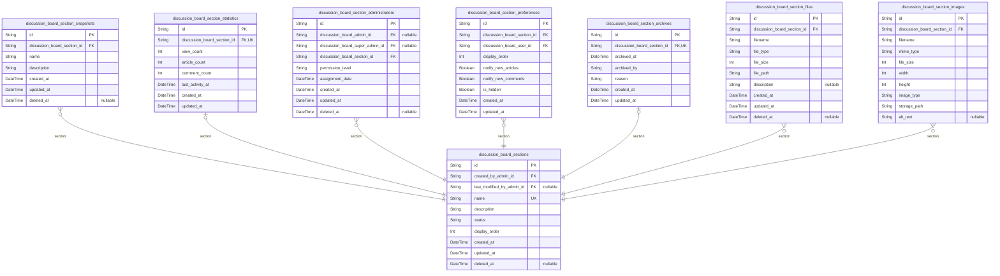
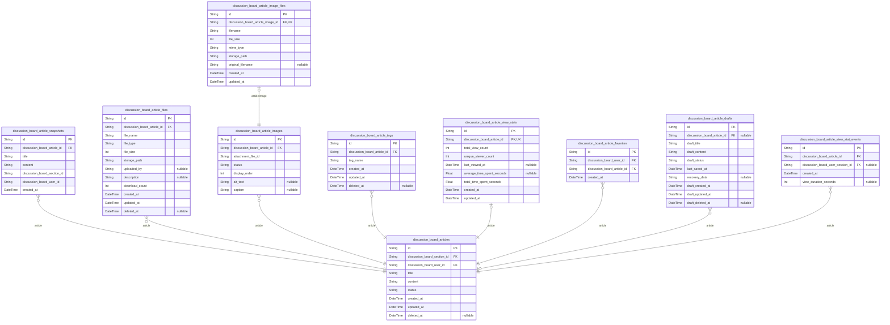
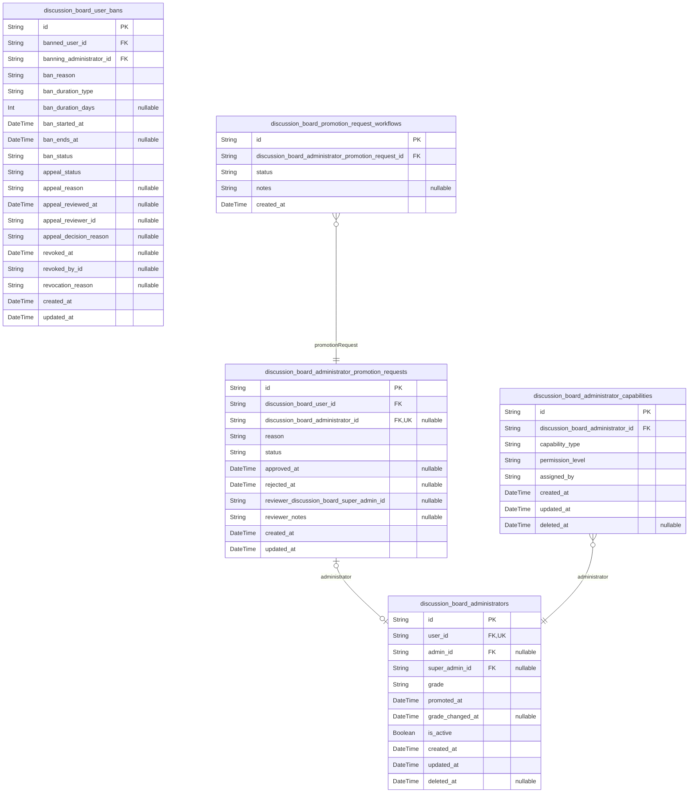

# Prisma Markdown

> Generated by [`prisma-markdown`](https://github.com/samchon/prisma-markdown)

- [Actors](#actors)
- [Systematic](#systematic)
- [Sections](#sections)
- [Articles](#articles)
- [Comments](#comments)
- [Administration](#administration)
- [Moderation](#moderation)

## Actors

```mermaid
erDiagram
"discussion_board_users" {
  String id PK
  String email UK
  String password_hash
  String display_name
  String bio "nullable"
  DateTime created_at
  DateTime updated_at
  DateTime deleted_at "nullable"
}
"discussion_board_user_sessions" {
  String id PK
  String discussion_board_user_id FK
  String access_token UK
  String refresh_token UK
  String ip
  String user_agent
  String referrer "nullable"
  DateTime created_at
  DateTime expired_at
  DateTime last_accessed_at
}
"discussion_board_user_password_resets" {
  String id PK
  String discussion_board_user_id FK
  String token UK
  DateTime expired_at
  DateTime used_at "nullable"
  DateTime created_at
  DateTime updated_at
  DateTime deleted_at "nullable"
}
"discussion_board_user_email_verifications" {
  String id PK
  String discussion_board_user_id FK
  String token UK
  DateTime expires_at
  DateTime verified_at "nullable"
  DateTime created_at
  DateTime updated_at
}
"discussion_board_admins" {
  String id PK
  String email UK
  String password_hash
  String display_name
  DateTime created_at
  DateTime updated_at
  DateTime deleted_at "nullable"
}
"discussion_board_admin_sessions" {
  String id PK
  String discussion_board_admin_id FK
  String access_token UK
  String refresh_token UK
  String ip
  String user_agent
  String referrer "nullable"
  DateTime created_at
  DateTime expired_at
  DateTime last_accessed_at
}
"discussion_board_admin_password_resets" {
  String id PK
  String discussion_board_admin_id FK
  String token UK
  DateTime expires_at
  DateTime used_at "nullable"
  DateTime created_at
  DateTime updated_at
}
"discussion_board_admin_email_verifications" {
  String id PK
  String discussion_board_admin_id FK
  String token UK
  String email
  DateTime expired_at
  DateTime verified_at "nullable"
  DateTime created_at
  DateTime updated_at
}
"discussion_board_super_admins" {
  String id PK
  String email UK
  String password_hash
  String privilege_level
  DateTime created_at
  DateTime updated_at
  DateTime deleted_at "nullable"
}
"discussion_board_super_admin_sessions" {
  String id PK
  String discussion_board_super_admin_id FK
  String access_token UK
  String refresh_token UK
  String ip
  String href
  String referrer
  DateTime expired_at
  DateTime created_at
  DateTime updated_at
}
"discussion_board_super_admin_password_resets" {
  String id PK
  String discussion_board_super_admin_id FK
  String token UK
  DateTime expired_at
  DateTime used_at "nullable"
  DateTime created_at
  DateTime updated_at
}
"discussion_board_super_admin_email_verifications" {
  String id PK
  String discussion_board_super_admin_id FK,UK
  String token_hash
  DateTime expired_at
  DateTime verified_at "nullable"
  DateTime created_at
  DateTime updated_at
}
"discussion_board_user_sessions" }o--|| "discussion_board_users" : user
"discussion_board_user_password_resets" }o--|| "discussion_board_users" : user
"discussion_board_user_email_verifications" }o--|| "discussion_board_users" : user
"discussion_board_admin_sessions" }o--|| "discussion_board_admins" : admin
"discussion_board_admin_password_resets" }o--|| "discussion_board_admins" : admin
"discussion_board_admin_email_verifications" }o--|| "discussion_board_admins" : admin
"discussion_board_super_admin_sessions" }o--|| "discussion_board_super_admins" : superAdmin
"discussion_board_super_admin_password_resets" }o--|| "discussion_board_super_admins" : superAdmin
"discussion_board_super_admin_email_verifications" |o--|| "discussion_board_super_admins" : superAdmin
```

### `discussion_board_users`

Registered user accounts with email/password credentials and profile
information.

This table stores the core identity information for regular users of the
discussion board platform. Each record represents an individual user
account with authentication credentials and profile data. Users can
create articles, write comments, and participate in discussions across
various sections.

The table serves as the root identity record for the user actor type and
is referenced by session management, password reset workflows, and
content creation entities. User profiles display the user's display name,
biography, and activity history including articles and comments they have
authored.

[discussion_board_user_sessions](#discussion_board_user_sessions) tracks user login sessions.
[discussion_board_user_password_resets](#discussion_board_user_password_resets) handles password recovery.
[discussion_board_user_email_verifications](#discussion_board_user_email_verifications) manages email
confirmation.
[discussion_board_articles](#discussion_board_articles) stores articles authored by users.
[discussion_board_comments](#discussion_board_comments) stores comments written by users.

Properties as follows:

- `id`: Primary Key.
- `email`
  > User's email address used for authentication and communication. Must be
  > unique across all user accounts.
- `password_hash`
  > Securely hashed password for user authentication. Stored using
  > industry-standard hashing algorithms.
- `display_name`
  > Public display name shown on user profiles and alongside user-generated
  > content.
- `bio`
  > Optional biography text describing the user's background, interests, or
  > expertise.
- `created_at`: Timestamp when the user account was created.
- `updated_at`: Timestamp when the user account was last updated.
- `deleted_at`
  > Timestamp when the user account was soft-deleted, allowing for account
  > recovery.

### `discussion_board_user_sessions`

JWT session tokens for user authentication with access and refresh token
support.

This table stores active user sessions with JWT tokens for secure
authentication. Each session tracks connection context including IP
address, user agent, and referrer information for security auditing.
Sessions maintain both access tokens for API calls and refresh tokens for
token renewal.

The session lifecycle is managed through creation and expiration
timestamps, allowing for secure session invalidation and automatic
cleanup of expired sessions. This table supports the authentication
system's requirement to maintain secure session state while users are
logged in.

Sessions are child entities of [discussion_board_users](#discussion_board_users) and support
the platform's authentication security requirements.

Properties as follows:

- `id`: Primary Key.
- `discussion_board_user_id`: Belonged user's [discussion_board_users.id](#discussion_board_users).
- `access_token`: JWT access token for API authentication.
- `refresh_token`: JWT refresh token for token renewal.
- `ip`: IP address of the connection for security auditing.
- `user_agent`: Browser or client user agent string.
- `referrer`: HTTP referrer header for connection context.
- `created_at`: Timestamp when the session was created.
- `expired_at`: Timestamp when the session expires.
- `last_accessed_at`: Timestamp of last session activity.

### `discussion_board_user_password_resets`

Password reset tokens for user account recovery with expiration tracking.

This table stores temporary tokens that allow users to reset their
passwords when they forget their credentials. Each token is associated
with a specific user account and has a limited validity period for
security purposes.

The system generates a unique token when a user requests a password reset
and sends it via email. When the user clicks the reset link, the system
validates the token against this table before allowing password changes.

Security considerations include automatic token expiration and one-time
usage to prevent unauthorized access. [discussion_board_users.id](#discussion_board_users)

Properties as follows:

- `id`: Primary Key.
- `discussion_board_user_id`
  > Reference to the user account requesting password reset. {@link
  > discussion_board_users.id}
- `token`
  > Unique reset token generated for password recovery. This token is sent to
  > the user's email and must be used within the expiration period.
- `expired_at`
  > Timestamp when the reset token expires and becomes invalid. After this
  > time, the token cannot be used for password recovery.
- `used_at`
  > Timestamp when the reset token was successfully used to change the
  > password. Null indicates the token is still available for use.
- `created_at`: Timestamp when the password reset request was created.
- `updated_at`: Timestamp when the password reset record was last updated.
- `deleted_at`
  > Timestamp when the password reset record was soft deleted for security
  > purposes.

### `discussion_board_user_email_verifications`

Email verification tokens for user registration confirmation.

This table stores verification tokens that are sent to users during the
registration process to confirm their email addresses. Each token is
unique and has a limited validity period to ensure security. Once a user
successfully verifies their email using the token, the verification
record is marked as completed and the user account becomes fully
activated.

Tokens are generated when users register and are sent via email. Users
must click the verification link containing the token within the
expiration period to complete their registration. This process prevents
fake registrations and ensures email address validity.

[discussion_board_users.id](#discussion_board_users)

Properties as follows:

- `id`: Primary Key.
- `discussion_board_user_id`
  > Reference to the user account requiring email verification. {@link
  > discussion_board_users.id}
- `token`
  > Unique verification token sent to the user's email address for
  > confirmation.
- `expires_at`: Timestamp when the verification token expires and becomes invalid.
- `verified_at`
  > Timestamp when the user successfully verified their email address using
  > this token.
- `created_at`: Timestamp when the verification token was created.
- `updated_at`: Timestamp when the verification record was last updated.

### `discussion_board_admins`

Administrator accounts with email/password credentials and administrative
privileges. This table serves as the canonical identity record for
administrators in the system, providing authentication capabilities and
basic profile information. Administrators have elevated privileges for
content moderation, section management, and user banning. {@link
discussion_board_admin_sessions} tracks login sessions, {@link
discussion_board_admin_password_resets} handles password recovery, and
[discussion_board_admin_email_verifications](#discussion_board_admin_email_verifications) manages email
verification workflows.

Properties as follows:

- `id`: Primary Key.
- `email`
  > Administrator's email address used for authentication and communication.
  > Must be unique across all administrator accounts.
- `password_hash`
  > Hashed password for administrator authentication using secure hashing
  > algorithms.
- `display_name`
  > Public display name shown to other users when this administrator performs
  > actions or creates content.
- `created_at`: Timestamp when the administrator account was created.
- `updated_at`: Timestamp when the administrator account was last updated.
- `deleted_at`
  > Timestamp when the administrator account was soft-deleted, allowing for
  > account recovery if needed.

### `discussion_board_admin_sessions`

Tracks administrator login sessions with JWT token management and
connection metadata. Each session represents an authenticated
administrator session with access and refresh token support. Sessions are
managed through authentication flows and provide audit trail for
administrator access.

This table stores JWT session tokens for administrator authentication,
including access tokens for API authorization and refresh tokens for
session renewal. Each session records connection context such as IP
address, user agent, and referrer information for security auditing.
Sessions have expiration tracking to enforce security policies and
prevent indefinite access.

The relationship with [discussion_board_admins](#discussion_board_admins) establishes the
administrator ownership of sessions, allowing multiple concurrent
sessions per administrator while maintaining individual session
management. This supports features like session revocation, multi-device
access, and security monitoring for administrator accounts.

Properties as follows:

- `id`: Primary Key.
- `discussion_board_admin_id`: Associated administrator's [discussion_board_admins.id](#discussion_board_admins).
- `access_token`: JWT access token used for API authorization and authentication.
- `refresh_token`: JWT refresh token used for session renewal when access token expires.
- `ip`
  > IP address of the client connection for security auditing and geographic
  > tracking.
- `user_agent`
  > User agent string identifying the client browser or application making
  > the request.
- `referrer`
  > HTTP referrer header indicating the source page that initiated the
  > session creation.
- `created_at`: Timestamp when the session was created and authentication occurred.
- `expired_at`: Timestamp when the session expires and requires re-authentication.
- `last_accessed_at`
  > Timestamp of the most recent API request using this session for activity
  > tracking.

### `discussion_board_admin_password_resets`

Password reset tokens for administrator account recovery with expiration
tracking.

This table stores temporary tokens generated when administrators request
password resets. Each token has a limited validity period and can only be
used once. The system generates a unique token per reset request and
associates it with the specific administrator account requiring password
recovery.

When an administrator initiates a password reset, the system creates a
record here with an expiration timestamp. Once the administrator uses the
token to reset their password or the token expires, the record becomes
invalid for security purposes.

Properties as follows:

- `id`: Primary Key.
- `discussion_board_admin_id`
  > Reference to the administrator account requiring password reset. {@link
  > discussion_board_admins.id}
- `token`: Unique password reset token generated for the administrator.
- `expires_at`: Timestamp when the password reset token expires and becomes invalid.
- `used_at`
  > Timestamp when the password reset token was successfully used to change
  > the password.
- `created_at`: Timestamp when the password reset request was created.
- `updated_at`: Timestamp when the password reset record was last updated.

### `discussion_board_admin_email_verifications`

Email verification tokens for administrator registration confirmation.

Stores verification tokens sent to administrator email addresses during
registration or email change processes. Each token has an expiration
period and is associated with a specific administrator account. Once
verified, the token is marked as used to prevent reuse.

This table supports the administrator authentication workflow by ensuring
email addresses are valid and belong to the registering administrator.
Tokens are generated during registration and verified when administrators
click the verification link in their email.

Properties as follows:

- `id`: Primary Key.
- `discussion_board_admin_id`
  > Administrator account requiring email verification. {@link
  > discussion_board_admins.id}
- `token`: Unique verification token sent to the administrator's email address.
- `email`
  > Email address being verified. This ensures the token is used for the
  > correct email.
- `expired_at`: Timestamp when the verification token expires and becomes invalid.
- `verified_at`: Timestamp when the email verification was successfully completed.
- `created_at`: Timestamp when the verification token was created.
- `updated_at`: Timestamp when the verification record was last updated.

### `discussion_board_super_admins`

Super administrator accounts with elevated privileges and system-wide
control.

Represents the highest privilege level in the system with capabilities to
promote/demote other administrators, manage system-wide settings, and
perform all administrative functions. Super administrators have complete
control over the platform and can manage regular administrators.

This table stores authentication credentials and privilege information
for super administrators. Each super administrator has a unique email
address and password hash for secure login. The table maintains audit
trails through standard temporal fields.

Super administrators can perform all actions available to regular
administrators plus additional system-wide management capabilities. They
are responsible for maintaining the administrator hierarchy and ensuring
platform security.

[discussion_board_super_admin_sessions.id](#discussion_board_super_admin_sessions) tracks login sessions,
[discussion_board_super_admin_password_resets.id](#discussion_board_super_admin_password_resets) handles password
recovery, and [discussion_board_super_admin_email_verifications.id](#discussion_board_super_admin_email_verifications)
manages email verification workflows.

Properties as follows:

- `id`: Primary Key.
- `email`
  > Unique email address for super administrator authentication and
  > communication.
- `password_hash`
  > Securely hashed password for authentication. Uses industry-standard
  > hashing algorithms.
- `privilege_level`
  > Privilege level indicator for super administrator capabilities. Used for
  > fine-grained permission control.
- `created_at`: Timestamp when the super administrator account was created.
- `updated_at`: Timestamp when the super administrator account was last updated.
- `deleted_at`
  > Timestamp when the super administrator account was soft-deleted. Null if
  > active.

### `discussion_board_super_admin_sessions`

JWT session tokens for super administrator authentication with access and
refresh token support.

This table stores authentication sessions for super administrators,
tracking their login activity, connection context, and token management.
Each session belongs to exactly one super administrator and contains the
necessary authentication tokens along with audit information for security
monitoring.

The session records enable secure authentication flow management, token
expiration tracking, and connection auditing for compliance purposes.
Sessions are managed through the authentication system rather than direct
user CRUD operations.

[discussion_board_super_admins.id](#discussion_board_super_admins)

Properties as follows:

- `id`: Primary Key.
- `discussion_board_super_admin_id`: Belonged super administrator's [discussion_board_super_admins.id](#discussion_board_super_admins).
- `access_token`: JWT access token for API authentication.
- `refresh_token`: JWT refresh token for token renewal.
- `ip`: IP address of the connection where the session was created.
- `href`: Full URL of the page where the session was created.
- `referrer`: Referrer URL that directed to the session creation page.
- `expired_at`: Timestamp when the session tokens expire and require renewal.
- `created_at`: Timestamp when the session was created.
- `updated_at`: Timestamp when the session was last updated.

### `discussion_board_super_admin_password_resets`

Password reset tokens for super administrator account recovery with
expiration tracking.

This table stores temporary tokens that allow super administrators to
reset their passwords securely. Each token is associated with a specific
super administrator account and has a limited validity period to prevent
unauthorized access. The system generates these tokens when a super
administrator requests a password reset and invalidates them after use or
expiration.

Tokens are single-use only and automatically expire after a configured
time period. The table tracks when tokens are used to prevent replay
attacks and ensures that each reset request can only be completed once.
This security mechanism protects super administrator accounts while
maintaining accessibility for legitimate password recovery scenarios.

[discussion_board_super_admins.id](#discussion_board_super_admins)

Properties as follows:

- `id`: Primary Key.
- `discussion_board_super_admin_id`
  > Super administrator account requesting password reset. {@link
  > discussion_board_super_admins.id}
- `token`
  > Unique reset token used for password recovery verification. This token is
  > sent to the super administrator's email and must match exactly for the
  > reset process to proceed.
- `expired_at`
  > Timestamp when this reset token expires and becomes invalid. After this
  > time, the token cannot be used for password recovery and a new request
  > must be made.
- `used_at`
  > Timestamp when this reset token was successfully used to reset the
  > password. Null indicates the token has not been used yet.
- `created_at`: Timestamp when this password reset token was created.
- `updated_at`: Timestamp when this password reset token record was last updated.

### `discussion_board_super_admin_email_verifications`

Email verification tokens for super administrator registration confirmation.

Stores secure verification tokens used during super administrator
registration process to validate email ownership. Each token is tied to a
specific super administrator account and includes expiration tracking for
security. Verification status is tracked to prevent multiple verification
attempts.

Relationships:
- Belongs to one [admin account](#discussion_board_super_admins)
- Verification token is used once and then expired

Security Considerations:
- Tokens are hashed before storage
- Expiration prevents indefinite verification windows
- One token per pending verification to prevent token reuse

Properties as follows:

- `id`: Primary Key.
- `discussion_board_super_admin_id`
  > Target super administrator's [discussion_board_super_admins.id](#discussion_board_super_admins)
  > awaiting email verification.
- `token_hash`
  > Hashed verification token sent to super administrator's email address.
  > Generated using secure cryptographic hash function to prevent token
  > exposure in database logs or backups.
- `expired_at`
  > Timestamp when this validation token expires and can no longer be used
  > for verification. Typically set to 24 hours after creation for security.
- `verified_at`
  > Timestamp when email verification was successfully completed using this
  > token. Null indicates pending verification.
- `created_at`
  > Timestamp when this verification token was created as part of
  > registration process.
- `updated_at`
  > Timestamp when this verification record was last updated, typically when
  > verification is completed.

## Systematic

```mermaid
erDiagram
"discussion_board_system_configurations" {
  String id PK
  String config_key UK
  String config_value
  String data_type
  String description
  String category
  Boolean is_sensitive
  DateTime created_at
  DateTime updated_at
  DateTime deleted_at "nullable"
}
"discussion_board_audit_logs" {
  String id PK
  String actor_id FK "nullable"
  String target_user_id FK "nullable"
  String target_admin_id FK "nullable"
  String target_super_admin_id FK "nullable"
  String target_article_id FK "nullable"
  String target_comment_id FK "nullable"
  String target_section_id FK "nullable"
  String actor_type
  String action_type
  String action_subtype "nullable"
  String description
  String ip_address "nullable"
  String user_agent "nullable"
  String metadata "nullable"
  Boolean success
  String error_message "nullable"
  DateTime created_at
  DateTime updated_at
}
"discussion_board_administrator_promotion_approvals" {
  String id PK
  String promotion_request_id FK,UK
  String reviewer_admin_id FK
  String discussion_board_administrator_id FK
  Boolean approved
  String decision_reason
  DateTime reviewed_at
  DateTime created_at
  DateTime updated_at
  DateTime deleted_at "nullable"
}
"discussion_board_content_moderation_logs" {
  String id PK
  String admin_id FK
  String action_type
  String target_content_type
  String target_content_id
  String reason "nullable"
  DateTime created_at
  DateTime updated_at
}
"discussion_board_system_activities" {
  String id PK
  String user_id FK "nullable"
  String admin_id FK "nullable"
  String super_admin_id FK "nullable"
  String activity_type
  String target_entity_type "nullable"
  String target_entity_id "nullable"
  String ip_address "nullable"
  String user_agent "nullable"
  String referrer "nullable"
  String activity_details "nullable"
  Boolean success_status
  String error_message "nullable"
  DateTime created_at
  DateTime updated_at
}
"discussion_board_performance_metrics" {
  String id PK
  String discussion_board_system_configuration_id FK "nullable"
  String metric_type
  Float metric_value
  String metric_unit
  String source_component
  DateTime collection_timestamp
  String time_range
  String metadata "nullable"
  DateTime created_at
  DateTime updated_at
}
"discussion_board_error_logs" {
  String id PK
  String error_type
  String error_message
  String stack_trace "nullable"
  String severity
  String request_path "nullable"
  String request_method "nullable"
  String user_agent "nullable"
  String ip_address "nullable"
  String environment
  String component "nullable"
  DateTime occurred_at
  DateTime created_at
  DateTime updated_at
  DateTime deleted_at "nullable"
}
"discussion_board_backup_records" {
  String id PK
  String initiated_by_admin_id FK "nullable"
  String backup_type
  String status
  String file_path "nullable"
  Int size_bytes "nullable"
  DateTime started_at
  DateTime completed_at "nullable"
  String error_message "nullable"
  DateTime created_at
  DateTime updated_at
  DateTime deleted_at "nullable"
}
"discussion_board_maintenance_schedules" {
  String id PK
  String scheduled_by_admin_id FK
  String performed_by_admin_id FK "nullable"
  String maintenance_type
  String description
  DateTime scheduled_start_time
  DateTime scheduled_end_time
  DateTime actual_start_time "nullable"
  DateTime actual_end_time "nullable"
  String status
  Int estimated_duration_minutes
  Int actual_duration_minutes "nullable"
  String impact_level
  String notes "nullable"
  DateTime created_at
  DateTime updated_at
  DateTime deleted_at "nullable"
}
"discussion_board_api_rate_limits" {
  String id PK
  String discussion_board_user_id FK "nullable"
  String discussion_board_admin_id FK "nullable"
  String discussion_board_super_admin_id FK "nullable"
  String endpoint_path
  String http_method
  String rate_limit_type
  Int requests_per_interval
  Int interval_seconds
  Int burst_limit "nullable"
  String enforcement_action
  DateTime enforced_at "nullable"
  Int enforcement_count
  Boolean is_active
  String description "nullable"
  DateTime created_at
  DateTime updated_at
  DateTime deleted_at "nullable"
}
"discussion_board_security_events" {
  String id PK
  String user_id FK "nullable"
  String admin_id FK "nullable"
  String super_admin_id FK "nullable"
  String event_type
  String severity
  String description
  String source_ip
  String user_agent
  String event_data "nullable"
  Boolean resolved
  DateTime resolved_at "nullable"
  String resolved_by "nullable"
  DateTime created_at
  DateTime updated_at
}
"discussion_board_data_retention_policies" {
  String id PK
  String policy_name UK
  String description
  Int retention_period_days
  String retention_action
  String compliance_standard "nullable"
  Boolean is_active
  DateTime last_enforced_at "nullable"
  DateTime next_enforcement_due "nullable"
  DateTime created_at
  DateTime updated_at
  DateTime deleted_at "nullable"
}
"discussion_board_data_retention_policy_data_types" {
  String id PK
  String discussion_board_data_retention_policy_id FK
  String data_type
  DateTime created_at
  DateTime updated_at
  DateTime deleted_at "nullable"
}
"discussion_board_performance_metrics" }o--o| "discussion_board_system_configurations" : systemConfiguration
"discussion_board_data_retention_policy_data_types" }o--|| "discussion_board_data_retention_policies" : retentionPolicy
```

### `discussion_board_system_configurations`

System-wide configuration settings and parameters for platform operation.

This table stores all configurable parameters that control the behavior
and features of the discussion board platform. Administrators can modify
these settings to customize platform functionality, enable/disable
features, and adjust operational parameters without requiring code
changes.

Each configuration entry represents a specific system parameter that
influences platform behavior, such as rate limits, content policies,
display settings, or feature toggles. The configuration system provides a
centralized way to manage platform settings across all system components.

Configurations are organized by functional areas and can be modified by
authorized administrators through the system administration interface.

Properties as follows:

- `id`: Primary Key.
- `config_key`
  > Unique identifier for the configuration parameter. Used to reference the
  > configuration in code and administration interfaces.
- `config_value`
  > The actual value of the configuration parameter stored as a string for
  > flexibility.
- `data_type`
  > The data type of the configuration value (e.g., 'string', 'integer',
  > 'boolean', 'json').
- `description`
  > Human-readable description explaining the purpose and usage of this
  > configuration parameter.
- `category`
  > Functional category grouping related configurations (e.g.,
  > 'authentication', 'content', 'performance', 'security').
- `is_sensitive`
  > Indicates whether this configuration contains sensitive information that
  > should be masked in logs and UI displays.
- `created_at`: Timestamp when this configuration was initially created.
- `updated_at`: Timestamp when this configuration was last modified.
- `deleted_at`
  > Timestamp when this configuration was soft-deleted, allowing for
  > configuration lifecycle management.

### `discussion_board_audit_logs`

Comprehensive audit trail for all administrative actions and system
events across the discussion board platform.

This table captures detailed information about every significant action
performed by users, administrators, and the system itself. Each record
includes the actor who performed the action, the type of action, the
target entity affected, timestamp information, and additional metadata
specific to the action type.

The audit trail serves multiple purposes including compliance monitoring,
security investigation, system debugging, and user accountability. All
records are append-only and cannot be modified once created to ensure the
integrity of the audit trail.

Key relationships:
- References actor tables ([discussion_board_users](#discussion_board_users), {@link
discussion_board_admins}, [discussion_board_super_admins](#discussion_board_super_admins)) for
actor identification
- Captures actions across all system components including articles,
comments, sections, and user management
- Supports detailed investigation through comprehensive metadata storage

Properties as follows:

- `id`: Primary Key.
- `actor_id`
  > ID of the user, administrator, or super administrator who performed the
  > action. References the appropriate actor table based on actor_type.
- `target_user_id`
  > ID of the user affected by the action, if applicable. References {@link
  > discussion_board_users.id}.
- `target_admin_id`
  > ID of the administrator affected by the action, if applicable. References
  > [discussion_board_admins.id](#discussion_board_admins).
- `target_super_admin_id`
  > ID of the super administrator affected by the action, if applicable.
  > References [discussion_board_super_admins.id](#discussion_board_super_admins).
- `target_article_id`
  > ID of the article affected by the action, if applicable. References
  > [discussion_board_articles.id](#discussion_board_articles).
- `target_comment_id`
  > ID of the comment affected by the action, if applicable. References
  > [discussion_board_comments.id](#discussion_board_comments).
- `target_section_id`
  > ID of the section affected by the action, if applicable. References
  > [discussion_board_sections.id](#discussion_board_sections).
- `actor_type`
  > Type of actor who performed the action. Valid values: 'user', 'admin',
  > 'super_admin', 'system'.
- `action_type`
  > Category of the action performed. Examples: 'user_login',
  > 'article_create', 'comment_delete', 'user_ban', 'admin_promotion'.
- `action_subtype`: More specific classification of the action within the main category.
- `description`
  > Human-readable description of the action performed, including context and
  > details.
- `ip_address`: IP address from which the action was performed, for security tracking.
- `user_agent`: User agent string of the client that performed the action.
- `metadata`
  > JSON-formatted additional metadata specific to the action type, stored as
  > string for flexibility.
- `success`: Whether the action was successful or resulted in an error.
- `error_message`: Error message if the action failed, providing details about the failure.
- `created_at`: Timestamp when the audit record was created.
- `updated_at`
  > Timestamp when the audit record was last updated (typically matches
  > created_at for audit integrity).

### `discussion_board_administrator_promotion_approvals`

Stores approval records for administrator promotion requests with
reviewer information and decision details.

Each record represents a single approval or rejection decision made by an
administrator on a promotion request. This table maintains a complete
audit trail of all promotion decisions, including who made the decision,
when it was made, and the rationale behind it.

The table supports the administrator promotion workflow by tracking the
entire lifecycle of promotion requests from submission to final decision.
It ensures accountability and transparency in the promotion process by
recording all decision-making activities.

This table works in conjunction with {@link
discussion_board_administrator_promotion_requests} which stores the
original promotion requests, and references {@link
discussion_board_admins} for the reviewing administrator information. It
also maintains a relationship to the parent {@link
discussion_board_administrators} table to track which administrator
record is affected by the promotion decision.

Properties as follows:

- `id`: Primary Key.
- `promotion_request_id`
  > Reference to the promotion request being reviewed. {@link
  > discussion_board_administrator_promotion_requests.id}
- `reviewer_admin_id`
  > Administrator who reviewed and made the decision. {@link
  > discussion_board_admins.id}
- `discussion_board_administrator_id`
  > Reference to the parent administrator record affected by this promotion
  > decision. [discussion_board_administrators.id](#discussion_board_administrators)
- `approved`: Whether the promotion request was approved (true) or rejected (false).
- `decision_reason`: Explanation or rationale provided by the reviewer for their decision.
- `reviewed_at`: Timestamp when the promotion request was reviewed and decision was made.
- `created_at`: Timestamp when the approval record was created.
- `updated_at`: Timestamp when the approval record was last updated.
- `deleted_at`: Timestamp when the approval record was soft deleted, or null if active.

### `discussion_board_content_moderation_logs`

Comprehensive audit trail of content moderation actions performed by
administrators.

This table logs all moderation activities including article deletions,
comment deletions, and other content management actions. Each record
captures the moderator, action type, target content, timestamp, and
reason for the moderation action.

The logs serve as an audit trail for compliance and accountability
purposes, allowing administrators to review moderation history and track
patterns of content management activities. Records are immutable once
created to maintain the integrity of the audit trail.

Relationships include links to [discussion_board_admins](#discussion_board_admins) for
moderator identification and references to moderated content through
content-specific foreign keys.

Properties as follows:

- `id`: Primary Key.
- `admin_id`
  > Administrator who performed the moderation action. {@link
  > discussion_board_admins.id}
- `action_type`
  > Type of moderation action performed (e.g., 'article_delete',
  > 'comment_delete', 'content_hide').
- `target_content_type`
  > Type of content being moderated (e.g., 'article', 'comment',
  > 'user_profile').
- `target_content_id`: Unique identifier of the moderated content item.
- `reason`: Explanation or justification for the moderation action.
- `created_at`: Timestamp when the moderation action was logged.
- `updated_at`: Timestamp when the moderation log record was last updated.

### `discussion_board_system_activities`

Comprehensive system activity tracking table that records all platform
interactions including user logins, content creation, article browsing,
and administrative actions. This table serves as the central audit trail
for platform usage patterns and security monitoring.

Each record represents a discrete system activity performed by an actor
(user, admin, or super admin) and includes detailed metadata about the
action type, target entity, and contextual information. The table
supports usage analytics, security auditing, and platform performance
monitoring.

Activities are categorized by type (login, logout, article_create,
comment_create, etc.) and reference the specific actor who performed the
action. The table maintains a complete chronological record of all
platform interactions for compliance and analytical purposes.

Properties as follows:

- `id`: Primary Key.
- `user_id`
  > Reference to the user who performed the activity, if applicable. {@link
  > discussion_board_users.id}
- `admin_id`
  > Reference to the administrator who performed the activity, if applicable.
  > [discussion_board_admins.id](#discussion_board_admins)
- `super_admin_id`
  > Reference to the super administrator who performed the activity, if
  > applicable. [discussion_board_super_admins.id](#discussion_board_super_admins)
- `activity_type`
  > Type of system activity performed (e.g., login, logout, article_create,
  > comment_create, section_browse, search_performed).
- `target_entity_type`
  > Type of entity targeted by the activity (e.g., user, article, comment,
  > section, system).
- `target_entity_id`: ID of the specific entity targeted by the activity, if applicable.
- `ip_address`: IP address from which the activity was performed for security tracking.
- `user_agent`: User agent string of the client that performed the activity.
- `referrer`: HTTP referrer header indicating the source of the activity request.
- `activity_details`: Additional details or metadata about the activity in JSON format.
- `success_status`: Whether the activity was completed successfully or resulted in an error.
- `error_message`: Error message if the activity failed, providing diagnostic information.
- `created_at`: Timestamp when the activity was recorded.
- `updated_at`: Timestamp when the activity record was last updated.

### `discussion_board_performance_metrics`

System performance metrics and monitoring data for tracking platform
health and optimization.

This table stores various performance indicators collected from the
discussion board platform, including response times, resource
utilization, error rates, and system load metrics. The data supports
capacity planning, performance optimization, and proactive monitoring of
platform health.

Metrics are typically collected automatically by monitoring systems and
provide insights into system behavior under different load conditions.
Administrators can use this data to identify performance bottlenecks,
plan infrastructure upgrades, and ensure service level agreement
compliance.

Each metric record represents a point-in-time measurement of a specific
performance indicator, allowing for trend analysis and historical
comparison of system performance over time.

Properties as follows:

- `id`: Primary Key.
- `discussion_board_system_configuration_id`
  > Optional reference to the system configuration that was active when this
  > metric was collected. [discussion_board_system_configurations.id](#discussion_board_system_configurations)
- `metric_type`
  > Type of performance metric being recorded (e.g., response_time,
  > cpu_usage, memory_usage, error_rate, request_count).
- `metric_value`: Numerical value of the performance metric measurement.
- `metric_unit`
  > Unit of measurement for the metric value (e.g., milliseconds, percentage,
  > count, bytes).
- `source_component`
  > Component or service that generated this metric (e.g., api_gateway,
  > database, cache, frontend).
- `collection_timestamp`: Exact timestamp when this metric was collected from the system.
- `time_range`
  > Time period this metric represents (e.g., instantaneous, 1_minute,
  > 5_minutes, 1_hour).
- `metadata`: Additional context or metadata about the metric collection in JSON format.
- `created_at`: Timestamp when this metric record was created in the database.
- `updated_at`: Timestamp when this metric record was last updated.

### `discussion_board_error_logs`

Comprehensive system error logging and debugging information storage.

This table captures all system errors that occur within the discussion
board platform, providing detailed information for debugging, monitoring,
and performance analysis. Each error record includes the error type,
stack trace, request context, and severity level to help developers
identify and resolve issues quickly.

The error logs support the system's performance monitoring requirements
by tracking error frequency and patterns, and they provide security
auditing capabilities by recording unexpected system behavior. Errors are
categorized by severity to prioritize debugging efforts and maintain
system stability.

This table integrates with the broader Systematic component
infrastructure, providing essential debugging information that
complements the performance metrics and audit logs maintained in other
Systematic tables.

Properties as follows:

- `id`: Primary Key.
- `error_type`
  > Classification of the error type (e.g., database_error,
  > authentication_error, validation_error, system_error).
- `error_message`: Detailed error message describing what went wrong.
- `stack_trace`: Full stack trace for debugging purposes, if available.
- `severity`: Error severity level (critical, error, warning, info).
- `request_path`: HTTP request path that triggered the error, if applicable.
- `request_method`: HTTP request method (GET, POST, PUT, DELETE) that triggered the error.
- `user_agent`: User agent string from the request that caused the error.
- `ip_address`: IP address of the client that triggered the error.
- `environment`
  > Deployment environment where the error occurred (development, staging,
  > production).
- `component`: System component or module where the error originated.
- `occurred_at`: Timestamp when the error occurred.
- `created_at`: Timestamp when this error record was created.
- `updated_at`: Timestamp when this error record was last updated.
- `deleted_at`: Timestamp when this error record was soft deleted for cleanup.

### `discussion_board_backup_records`

Records of system backup operations and data protection activities.

This table tracks all backup operations performed on the discussion board
platform, including automated and manual backups. Each record captures
the backup type, status, file location, size, and administrator who
initiated the operation. The table serves as an audit trail for data
protection compliance and disaster recovery planning.

Backup records are created by system administrators or automated backup
processes and provide visibility into data protection activities. Records
include both successful and failed backup attempts for comprehensive
monitoring.

Related entities: [discussion_board_admins.id](#discussion_board_admins) for
administrator-initiated backups, {@link
discussion_board_system_configurations.id} for backup configuration
references.

Properties as follows:

- `id`: Primary Key.
- `initiated_by_admin_id`
  > Administrator who initiated the backup operation. {@link
  > discussion_board_admins.id}.
- `backup_type`
  > Type of backup operation performed (e.g., 'full', 'incremental',
  > 'database_only', 'files_only').
- `status`
  > Current status of the backup operation (e.g., 'in_progress', 'completed',
  > 'failed', 'cancelled').
- `file_path`: File system path or storage location where the backup is stored.
- `size_bytes`: Size of the backup file in bytes, populated after successful completion.
- `started_at`: Timestamp when the backup operation began.
- `completed_at`: Timestamp when the backup operation completed successfully or failed.
- `error_message`: Error description if the backup operation failed.
- `created_at`: Timestamp when the backup record was created.
- `updated_at`: Timestamp when the backup record was last updated.
- `deleted_at`: Timestamp when the backup record was soft deleted for audit purposes.

### `discussion_board_maintenance_schedules`

System maintenance schedules and history tracking.

Stores planned maintenance windows, execution history, and status
tracking for system maintenance activities. Includes maintenance type
categorization, scheduled timing, responsible administrators, and
completion status.

Maintenance schedules are created by administrators to plan system
downtime, updates, and infrastructure improvements. Each schedule
includes detailed timing information, expected duration, and status
tracking for monitoring maintenance progress.

Related entities: [discussion_board_admins](#discussion_board_admins) for maintenance
responsibility assignment, [discussion_board_audit_logs](#discussion_board_audit_logs) for
maintenance activity auditing.

Properties as follows:

- `id`: Primary Key.
- `scheduled_by_admin_id`
  > Administrator who scheduled this maintenance. {@link
  > discussion_board_admins.id}
- `performed_by_admin_id`
  > Administrator who performed the maintenance. {@link
  > discussion_board_admins.id}
- `maintenance_type`
  > Type of maintenance being performed (e.g., system update, database
  > backup, security patch).
- `description`: Detailed description of the maintenance activity and its purpose.
- `scheduled_start_time`: Planned start time for the maintenance window.
- `scheduled_end_time`: Planned end time for the maintenance window.
- `actual_start_time`: Actual start time when maintenance began.
- `actual_end_time`: Actual end time when maintenance completed.
- `status`
  > Current status of maintenance (scheduled, in-progress, completed,
  > cancelled).
- `estimated_duration_minutes`: Estimated duration of maintenance in minutes.
- `actual_duration_minutes`: Actual duration of maintenance in minutes.
- `impact_level`: Level of impact on users (low, medium, high, critical).
- `notes`: Additional notes or observations about the maintenance.
- `created_at`: Timestamp when the maintenance schedule was created.
- `updated_at`: Timestamp when the maintenance schedule was last updated.
- `deleted_at`: Timestamp when the maintenance schedule was soft deleted.

### `discussion_board_api_rate_limits`

API rate limiting configurations and enforcement records for platform
security.

This table stores rate limiting configurations that control API usage
across the discussion board platform. It tracks enforcement actions when
rate limits are exceeded and maintains audit trails for security
monitoring and compliance.

Each record represents a specific rate limiting policy that can be
applied to different API endpoints, user types, or system functions. The
table captures both the configuration parameters and actual enforcement
events when limits are triggered.

Rate limiting is essential for preventing API abuse, ensuring fair
resource allocation, and maintaining system stability under high load
conditions. [discussion_board_system_configurations](#discussion_board_system_configurations) may reference
these rate limits for system-wide configuration management.

Properties as follows:

- `id`: Primary Key.
- `discussion_board_user_id`
  > User who triggered the rate limit enforcement. {@link
  > discussion_board_users.id}.
- `discussion_board_admin_id`
  > Administrator who triggered the rate limit enforcement. {@link
  > discussion_board_admins.id}.
- `discussion_board_super_admin_id`
  > Super administrator who triggered the rate limit enforcement. {@link
  > discussion_board_super_admins.id}.
- `endpoint_path`
  > API endpoint path that the rate limit applies to (e.g., '/api/articles',
  > '/api/comments').
- `http_method`: HTTP method that the rate limit applies to (GET, POST, PUT, DELETE, etc.).
- `rate_limit_type`: Type of rate limiting (e.g., 'ip_based', 'user_based', 'global', 'burst').
- `requests_per_interval`: Maximum number of requests allowed per time interval.
- `interval_seconds`: Time interval in seconds for the rate limit window.
- `burst_limit`: Maximum burst requests allowed above the normal rate limit.
- `enforcement_action`
  > Action taken when rate limit is exceeded (e.g., 'block', 'throttle',
  > 'warning').
- `enforced_at`: Timestamp when the rate limit was last enforced.
- `enforcement_count`: Number of times this rate limit has been enforced.
- `is_active`: Whether this rate limit configuration is currently active.
- `description`: Human-readable description of the rate limit policy.
- `created_at`: Timestamp when the rate limit configuration was created.
- `updated_at`: Timestamp when the rate limit configuration was last updated.
- `deleted_at`: Timestamp when the rate limit configuration was soft-deleted.

### `discussion_board_security_events`

Security-related events and threat detection logs for comprehensive
security monitoring and incident response.

This table serves as the central repository for all security-related
activities within the discussion board platform. It captures security
events such as failed login attempts, suspicious activities, threat
detections, and security policy violations. Each event includes detailed
metadata for forensic analysis and compliance reporting.

The table supports security monitoring by providing a complete audit
trail of security incidents, enabling administrators to detect patterns,
investigate breaches, and maintain compliance with security standards.
Events are categorized by type and severity to facilitate efficient
filtering and alerting.

Security events are linked to specific actors when applicable, allowing
correlation between user actions and security incidents. The system uses
this data for threat detection, anomaly detection, and security incident
response workflows.

[discussion_board_users.id](#discussion_board_users), [discussion_board_admins.id](#discussion_board_admins),
[discussion_board_super_admins.id](#discussion_board_super_admins)

Properties as follows:

- `id`: Primary Key.
- `user_id`
  > User who triggered the security event, if applicable. {@link
  > discussion_board_users.id}
- `admin_id`
  > Administrator who triggered the security event, if applicable. {@link
  > discussion_board_admins.id}
- `super_admin_id`
  > Super administrator who triggered the security event, if applicable.
  > [discussion_board_super_admins.id](#discussion_board_super_admins)
- `event_type`
  > Type of security event (e.g., failed_login, suspicious_activity,
  > threat_detected, policy_violation).
- `severity`: Severity level of the security event (low, medium, high, critical).
- `description`
  > Detailed description of the security event including context and impact
  > assessment.
- `source_ip`: IP address from which the security event originated.
- `user_agent`: User agent string of the client that triggered the security event.
- `event_data`
  > Additional event-specific data in JSON format for detailed forensic
  > analysis.
- `resolved`: Whether the security event has been resolved by administrators.
- `resolved_at`: Timestamp when the security event was marked as resolved.
- `resolved_by`: Name of the administrator who resolved the security event.
- `created_at`: Timestamp when the security event was recorded.
- `updated_at`: Timestamp when the security event was last updated.

### `discussion_board_data_retention_policies`

Data retention policies and compliance tracking for the discussion board
platform.

This table stores system-wide data retention policies that define how
long different types of data should be retained before automatic deletion
or archival. Each policy specifies retention periods, data types covered,
and compliance requirements for regulatory adherence.

Policies are managed by system administrators and enforced automatically
by the platform. The table tracks policy status, enforcement history, and
compliance verification timestamps to ensure regulatory requirements are
met.

This table supports the data privacy considerations mentioned in the
system performance and security requirements.

Properties as follows:

- `id`: Primary Key.
- `policy_name`
  > Unique name identifier for the retention policy, used for system
  > reference and reporting.
- `description`
  > Detailed description of the policy purpose, scope, and compliance
  > requirements.
- `retention_period_days`
  > Number of days data should be retained before automatic deletion or
  > archival.
- `retention_action`: Action to take when retention period expires (delete, archive, anonymize).
- `compliance_standard`
  > Regulatory standard or compliance framework this policy supports (e.g.,
  > GDPR, CCPA).
- `is_active`: Indicates whether this policy is currently active and being enforced.
- `last_enforced_at`: Timestamp when this policy was last enforced by the system.
- `next_enforcement_due`: Scheduled timestamp for the next policy enforcement cycle.
- `created_at`: Timestamp when the policy was created.
- `updated_at`: Timestamp when the policy was last updated.
- `deleted_at`
  > Timestamp when the policy was soft-deleted, allowing for policy lifecycle
  > management.

### `discussion_board_data_retention_policy_data_types`

Junction table linking data retention policies to specific data types
they govern.

This table resolves the 1NF violation by properly separating the
many-to-many relationship between retention policies and data types. Each
record represents a specific data type that is subject to a particular
retention policy, allowing for flexible policy application across
different data categories.

The table maintains referential integrity between {@link
discussion_board_data_retention_policies} and the various data types
defined in the system, ensuring that retention rules are properly
enforced for each category of stored information.

Properties as follows:

- `id`: Primary Key.
- `discussion_board_data_retention_policy_id`
  > References the specific retention policy being applied. {@link
  > discussion_board_data_retention_policies.id}
- `data_type`
  > The specific data type category that this retention policy applies to.
  > Examples include 'user_profiles', 'article_content', 'comment_data',
  > 'audit_logs', etc.
- `created_at`: Timestamp when this policy-data type mapping was created.
- `updated_at`: Timestamp when this policy-data type mapping was last updated.
- `deleted_at`
  > Timestamp when this policy-data type mapping was soft deleted, if
  > applicable.

## Sections

### `discussion_board_sections`

Main sections table storing core section information for organizing
discussion board content.

Sections serve as the primary organizational structure for the discussion
board, categorizing articles by topics such as Politics, Economy, and
Current Affairs. Each section contains a name, description, and metadata
about its creation and management.

Sections are created and managed exclusively by administrators. Regular
users can browse sections and post articles within them, but cannot
create or modify section definitions. The table maintains audit trails
through snapshot relationships and tracks section statistics separately.

[discussion_board_section_snapshots](#discussion_board_section_snapshots) provides version history for
section changes.
[discussion_board_section_statistics](#discussion_board_section_statistics) tracks usage metrics and
engagement data.
[discussion_board_section_administrators](#discussion_board_section_administrators) manages administrator
permissions for each section.
[discussion_board_admins](#discussion_board_admins) and [discussion_board_super_admins](#discussion_board_super_admins)
are the administrator entities that create and manage sections.

Properties as follows:

- `id`: Primary Key.
- `created_by_admin_id`
  > Administrator who created this section. References either regular admin
  > or super admin. [discussion_board_admins.id](#discussion_board_admins) or {@link
  > discussion_board_super_admins.id}.
- `last_modified_by_admin_id`
  > Administrator who last modified this section. References either regular
  > admin or super admin. [discussion_board_admins.id](#discussion_board_admins) or {@link
  > discussion_board_super_admins.id}.
- `name`: Unique name of the section used for display and URL generation.
- `description`: Detailed description explaining the section's purpose and content scope.
- `status`: Current status of the section: 'active', 'inactive', or 'archived'.
- `display_order`: Numerical order for displaying sections in the user interface.
- `created_at`: Timestamp when the section was created.
- `updated_at`: Timestamp when the section was last modified.
- `deleted_at`: Timestamp when the section was soft-deleted (archived).

### `discussion_board_section_snapshots`

Point-in-time snapshots of section data for audit trail and version history.

This table captures the complete state of a section at specific moments
in time, typically when modifications are made by administrators. Each
snapshot preserves the section's name, description, and configuration
settings as they existed at the time of capture, enabling historical
tracking of changes and supporting audit requirements.

The snapshots are created automatically when section data is modified and
serve as an immutable record of section evolution. This supports
compliance requirements, facilitates rollback capabilities, and provides
administrators with visibility into section modification history.

Properties as follows:

- `id`: Primary Key.
- `discussion_board_section_id`
  > Reference to the original section being snapshotted. {@link
  > discussion_board_sections.id}
- `name`: Section name as it existed at the time of snapshot.
- `description`: Section description as it existed at the time of snapshot.
- `created_at`: Timestamp when this snapshot was created.
- `updated_at`
  > Timestamp when this snapshot was last updated (typically matches
  > created_at for snapshots).
- `deleted_at`: Timestamp when this snapshot was soft-deleted, if applicable.

### `discussion_board_section_statistics`

Usage statistics and analytics for discussion board sections tracking
view counts, content activity, and engagement metrics.

This table provides comprehensive analytics for each section including
view counts, article creation rates, comment activity, and engagement
metrics. The statistics are updated automatically as users interact with
content in each section.

Key relationships include linkage to [discussion_board_sections.id](#discussion_board_sections)
for section reference and integration with article and comment counting
systems.

Properties as follows:

- `id`: Primary Key.
- `discussion_board_section_id`
  > Reference to the section these statistics belong to. {@link
  > discussion_board_sections.id}
- `view_count`: Total number of views for all articles within this section.
- `article_count`: Total number of articles published in this section.
- `comment_count`: Total number of comments made on articles in this section.
- `last_activity_at`
  > Timestamp of the most recent activity (article creation, comment, or
  > view) in this section.
- `created_at`: Timestamp when these statistics were first recorded.
- `updated_at`: Timestamp when these statistics were last updated.

### `discussion_board_section_administrators`

Mapping table linking administrators to sections they manage with
permission levels and assignment tracking.

This table establishes the many-to-many relationship between
administrators and sections, enabling flexible permission management
across the discussion board. Each record represents a specific
administrator's assignment to manage a particular section with defined
permission levels.

The table supports both regular administrators and super administrators,
with permission levels determining the scope of management capabilities
within each section. This design allows for granular control over section
management while maintaining audit trails for assignment changes.

References: [discussion_board_admins.id](#discussion_board_admins), {@link
discussion_board_super_admins.id}, [discussion_board_sections.id](#discussion_board_sections)

Properties as follows:

- `id`: Primary Key.
- `discussion_board_admin_id`
  > Reference to the regular administrator assigned to this section. {@link
  > discussion_board_admins.id}
- `discussion_board_super_admin_id`
  > Reference to the super administrator assigned to this section. {@link
  > discussion_board_super_admins.id}
- `discussion_board_section_id`
  > Reference to the section being managed. {@link
  > discussion_board_sections.id}
- `permission_level`
  > Permission level assigned to the administrator for this section.
  > Determines what actions they can perform within the section.
- `assignment_date`: Date when the administrator was assigned to manage this section.
- `created_at`: Timestamp when this assignment record was created.
- `updated_at`: Timestamp when this assignment record was last updated.
- `deleted_at`: Timestamp when this assignment was soft deleted, if applicable.

### `discussion_board_section_preferences`

Stores user-specific preferences for section display order,
notifications, and customization settings.

Each record represents a user's personalized configuration for how they
want sections to be displayed and what notifications they wish to
receive. This includes display order preferences, notification toggles
for new articles, and custom section visibility settings.

Users can customize their section browsing experience through these
preferences, allowing for personalized content organization. The
preferences are stored per user per section, enabling granular control
over the user interface.

Properties as follows:

- `id`: Primary Key.
- `discussion_board_section_id`
  > Reference to the section being configured. {@link
  > discussion_board_sections.id}
- `discussion_board_user_id`
  > Reference to the user who owns these preferences. {@link
  > discussion_board_users.id}
- `display_order`: User-defined display order for this section relative to other sections.
- `notify_new_articles`
  > Whether the user wants to receive notifications for new articles in this
  > section.
- `notify_new_comments`
  > Whether the user wants to receive notifications for new comments in this
  > section.
- `is_hidden`: Whether the user has hidden this section from their view.
- `created_at`: Timestamp when the preference record was created.
- `updated_at`: Timestamp when the preference record was last updated.

### `discussion_board_section_archives`

Archived sections preserving historical data while preventing new content
creation.

This table stores sections that have been archived by administrators.
Archived sections retain all their historical data including articles and
comments, but prevent new content creation. The archival process
preserves the section's state at the time of archival while maintaining
referential integrity with existing content.

When a section is archived, administrators can specify a reason for
archival. Archived sections remain accessible for viewing historical
content but cannot be modified or receive new contributions. This allows
for preserving valuable discussion history while managing active sections
effectively.

Archived sections maintain their relationship to {@link
discussion_board_sections.id} and can be referenced by existing articles
and comments that belong to the section.

Properties as follows:

- `id`: Primary Key.
- `discussion_board_section_id`
  > Reference to the original section being archived. {@link
  > discussion_board_sections.id}
- `archived_at`: Timestamp when the section was archived by an administrator.
- `archived_by`
  > Reference to the administrator who performed the archival action. {@link
  > discussion_board_admins.id}
- `reason`
  > Explanation for why the section was archived, providing context for the
  > administrative decision.
- `created_at`: Timestamp when the archive record was created.
- `updated_at`: Timestamp when the archive record was last updated.

### `discussion_board_section_files`

Supporting files and documents attached to sections for reference or
guidelines.

This table stores files that administrators can attach to sections to
provide additional resources, guidelines, or reference materials. Each
file is associated with exactly one section and includes metadata such as
filename, file type, and file size for proper management and display.

Files in this table are managed through section operations and are not
independently created or managed by users. They serve as supplementary
materials that enhance the section's content and utility for users
browsing the discussion board.

[discussion_board_sections.id](#discussion_board_sections)

Properties as follows:

- `id`: Primary Key.
- `discussion_board_section_id`: Associated section's [discussion_board_sections.id](#discussion_board_sections).
- `filename`: Original name of the uploaded file as provided by the user.
- `file_type`: MIME type or file extension indicating the file format.
- `file_size`: Size of the file in bytes for storage and display purposes.
- `file_path`: Server-side storage path where the actual file is stored.
- `description`: Optional description of the file's purpose or content.
- `created_at`: Timestamp when the file was uploaded to the system.
- `updated_at`: Timestamp when the file metadata was last modified.
- `deleted_at`: Timestamp when the file was soft-deleted, allowing for recovery.

### `discussion_board_section_images`

Stores visual content associated with sections including banners, icons,
and promotional images. Each image is linked to a specific section and
contains metadata about the image file such as filename, mime type,
dimensions, and storage information. This table supports the visual
presentation requirements for section browsing and management.

The images stored here are used for section branding and visual
identification. Administrators can upload different types of images for
different purposes (banners for section headers, icons for navigation,
promotional images for featured sections). The table maintains
referential integrity with the parent section and provides image-specific
metadata while avoiding duplication of parent section attributes.

Properties as follows:

- `id`: Primary Key.
- `discussion_board_section_id`
  > The section that this image belongs to. {@link
  > discussion_board_sections.id}
- `filename`: Original filename of the uploaded image file.
- `mime_type`: MIME type of the image file (e.g., image/jpeg, image/png, image/gif).
- `file_size`: Size of the image file in bytes.
- `width`: Width of the image in pixels.
- `height`: Height of the image in pixels.
- `image_type`: Type of section image (banner, icon, promotional, thumbnail).
- `storage_path`: File system path or storage location identifier for the image.
- `alt_text`: Alternative text description for accessibility.

## Articles

### `discussion_board_articles`

Core article entity storing title, content, section assignment, and
author information.

This table represents the main content unit of the discussion board where
users create and share articles on economic and political topics. Each
article belongs to a specific section and is authored by a registered
user. The table supports article lifecycle management including creation,
editing, deletion, and publication status tracking.

Articles can have multiple attachments, tags, and engagement metrics
through related child tables. The content field stores the main article
text while the title provides a concise summary. The status field manages
article workflow from draft to published to archived states.

Related entities include: [discussion_board_sections.id](#discussion_board_sections) for
section assignment, [discussion_board_users.id](#discussion_board_users) for author
identification, and various child tables for attachments, tags, and
engagement metrics.

Properties as follows:

- `id`: Primary Key.
- `discussion_board_section_id`
  > Section where this article is published. {@link
  > discussion_board_sections.id}
- `discussion_board_user_id`: Author who created this article. [discussion_board_users.id](#discussion_board_users)
- `title`
  > Article title that summarizes the content. Must be between 5 and 200
  > characters.
- `content`
  > Main article content containing the full text of the discussion. Must be
  > at least 50 characters.
- `status`: Publication status of the article. Values: draft, published, archived.
- `created_at`: Timestamp when the article was first created.
- `updated_at`: Timestamp when the article was last modified.
- `deleted_at`: Timestamp when the article was soft-deleted, or null if active.

### `discussion_board_article_snapshots`

Audit trail for article changes with version history and edit tracking.

This table captures point-in-time states of articles whenever they are
modified, providing a complete version history for audit purposes. Each
snapshot contains a denormalized copy of the article's state at the time
of modification, including title, content, section assignment, and author
information.

The snapshots are append-only records that support rollback capabilities,
content moderation tracking, and compliance requirements. They reference
the parent [discussion_board_articles](#discussion_board_articles) table and maintain the
complete edit history of each article.

Key business uses include:
- Tracking content changes for moderation and compliance
- Enabling article version comparison and rollback
- Providing audit trail for content modifications
- Supporting historical analysis of article evolution

Properties as follows:

- `id`: Primary Key.
- `discussion_board_article_id`
  > Reference to the parent article being snapshotted. {@link
  > discussion_board_articles.id}
- `title`: Title of the article at the time of snapshot creation.
- `content`: Full content of the article at the time of snapshot creation.
- `discussion_board_section_id`
  > Section assignment of the article at the time of snapshot creation.
  > [discussion_board_sections.id](#discussion_board_sections)
- `discussion_board_user_id`
  > Author of the article at the time of snapshot creation. {@link
  > discussion_board_users.id}
- `created_at`: Timestamp when this snapshot was created.

### `discussion_board_article_files`

Stores file attachments associated with articles, supporting multiple
file types and formats.

This table manages all file attachments that users can add to their
articles, including documents, PDFs, and other supported file formats.
Each file attachment is linked to a specific article and includes
metadata such as file name, type, size, and storage path.

Files are managed through the parent article entity and cannot exist
independently. When an article is deleted, all associated file
attachments are also removed. The system supports various file types with
appropriate validation and storage handling.

Related entities: [discussion_board_articles](#discussion_board_articles) (parent article),
[discussion_board_users](#discussion_board_users) (uploading user if tracked).

Properties as follows:

- `id`: Primary Key.
- `discussion_board_article_id`
  > The article to which this file attachment belongs. {@link
  > discussion_board_articles.id}
- `file_name`: Original name of the uploaded file as provided by the user.
- `file_type`
  > MIME type or file extension indicating the file format (e.g.,
  > 'application/pdf', 'image/jpeg').
- `file_size`: Size of the file in bytes for storage management and download tracking.
- `storage_path`
  > Path to the file in the storage system for retrieval and download
  > operations.
- `uploaded_by`: User who uploaded this file attachment. [discussion_board_users.id](#discussion_board_users)
- `description`: Optional description of the file attachment provided by the user.
- `download_count`: Number of times this file has been downloaded for usage analytics.
- `created_at`: Timestamp when the file attachment was created.
- `updated_at`: Timestamp when the file attachment was last updated.
- `deleted_at`: Timestamp when the file attachment was soft-deleted, or null if active.

### `discussion_board_article_images`

Central repository for article image attachments with comprehensive
lifecycle management. Each image record maintains metadata for efficient
retrieval and display while supporting versioning, status tracking, and
independent management operations.

This table enables system-wide image operations including search across
articles, bulk management, and status tracking. Images can be
independently managed while maintaining referential integrity with parent
articles. The design supports complete image lifecycle from upload
through archival or deletion.

Properties as follows:

- `id`: Primary Key.
- `discussion_board_article_id`
  > Reference to the parent article that this image is attached to. {@link
  > discussion_board_articles.id}
- `attachment_file_id`
  > Reference to the centralized file storage containing the actual image
  > binary data and metadata. [discussion_board_attachment_files.id](#discussion_board_attachment_files)
- `status`
  > Current status of the image in the workflow: 'uploaded', 'processing',
  > 'active', 'archived', 'deleted'.
- `display_order`: Order in which images should be displayed within the article content.
- `alt_text`
  > Alternative text for accessibility and SEO purposes describing the image
  > content.
- `caption`: Optional caption text displayed below the image for additional context.

### `discussion_board_article_tags`

Junction table implementing the tagging system for articles. This table
enables multiple free-text tags to be associated with each article
through a many-to-many relationship. Tags are stored as free text and
support flexible categorization of article content.

The tagging system allows users to add descriptive labels to their
articles, making content more discoverable through tag-based filtering
and search. Each tag association is unique per article, preventing
duplicate tags on the same article while allowing the same tag to be used
across multiple articles.

This table serves as the bridge between [discussion_board_articles](#discussion_board_articles)
and the tag values, maintaining referential integrity while enabling
efficient tag-based queries and filtering operations.

Properties as follows:

- `id`: Primary Key.
- `discussion_board_article_id`: Reference to the associated article. [discussion_board_articles.id](#discussion_board_articles)
- `tag_name`
  > Free-text tag name assigned to the article. Users can create custom tags
  > to categorize content.
- `created_at`: Timestamp when the tag was associated with the article.
- `updated_at`: Timestamp when the tag association was last modified.
- `deleted_at`
  > Timestamp when the tag association was soft-deleted, allowing for tag
  > removal tracking.

### `discussion_board_article_view_stats`

Tracks view statistics and engagement metrics for articles. This table
records view counts, unique viewers, and temporal patterns for article
analytics. Provides data for article popularity, user engagement
tracking, and content performance analysis.

Each record represents view statistics aggregates for a specific article,
including total view count, unique viewer count, and calculation fields
for derived metrics. The data supports analytics dashboards, content
recommendations, and article performance insights.

This table integrates with [discussion_board_articles](#discussion_board_articles) to provide
comprehensive article analytics and requires {@link
discussion_board_article_view_stat_events} for granular view tracking and
3NF compliance.

Properties as follows:

- `id`: Primary Key.
- `discussion_board_article_id`
  > Reference to the article being tracked. {@link
  > discussion_board_articles.id}
- `total_view_count`
  > Total number of views for the article, including repeat views from the
  > same user.
- `unique_viewer_count`: Number of distinct users who have viewed the article.
- `last_viewed_at`: Timestamp of the most recent view of the article.
- `average_time_spent_seconds`
  > Average time users spend viewing the article in seconds, calculated from
  > view events.
- `total_time_spent_seconds`: Total accumulated time spent by all viewers on the article.
- `created_at`: Timestamp when the view statistics record was created.
- `updated_at`: Timestamp when the view statistics record was last updated.

### `discussion_board_article_favorites`

Junction table representing user bookmarking of articles. Each record
indicates that a specific user has favorited a specific article, creating
a many-to-many relationship between users and articles.

This table enables users to save articles of interest for quick access
later. It also supports analytics on article popularity based on favorite
counts. The relationship is unique per user-article pair to prevent
duplicate favorites.

Related entities: [discussion_board_users.id](#discussion_board_users) for the user who
favorited the article, [discussion_board_articles.id](#discussion_board_articles) for the
article being favorited.

Properties as follows:

- `id`: Primary Key.
- `discussion_board_user_id`
  > Reference to the user who favorited the article. {@link
  > discussion_board_users.id}.
- `discussion_board_article_id`
  > Reference to the article that was favorited. {@link
  > discussion_board_articles.id}.
- `created_at`: Timestamp when the user favorited the article.

### `discussion_board_article_drafts`

Stores draft versions of articles before publication with auto-recovery
features.

This table manages article drafts that users create before publishing
their content to the main discussion board. Drafts are independent
entities that users can create, edit, and delete separately from
published articles. When a draft is published, it becomes associated with
a main article record.

Key features include:
- Draft-specific metadata for auto-recovery functionality
- Independent lifecycle management from published articles
- Support for draft-specific workflows and status tracking
- Association with published articles when finalized

Drafts are managed through the article creation workflow and provide
users with the ability to save work in progress without committing to
publication. [discussion_board_articles.id](#discussion_board_articles)

Properties as follows:

- `id`: Primary Key.
- `discussion_board_article_id`
  > Reference to the published article when this draft becomes finalized.
  > [discussion_board_articles.id](#discussion_board_articles)
- `draft_title`
  > Working title of the draft, which may differ from the final published
  > article title.
- `draft_content`
  > Working content of the draft, which may differ from the final published
  > article content.
- `draft_status`: Current status of the draft. Values: 'draft', 'published', 'archived'.
- `last_saved_at`: Timestamp of the last auto-save operation for recovery purposes.
- `recovery_data`
  > JSON data for auto-recovery functionality, storing incremental changes
  > and edit history.
- `draft_created_at`: Timestamp when the draft was first created.
- `draft_updated_at`: Timestamp when the draft was last modified.
- `draft_deleted_at`: Timestamp when the draft was soft-deleted, allowing for recovery.

### `discussion_board_article_image_files`

Stores comprehensive file metadata for images attached to articles,
providing detailed file information and lifecycle management for image
attachments. This table serves as a subsidiary entity to {@link
discussion_board_article_images}, containing technical file details
separate from the image content itself.

The table captures essential file metadata including filename, size, MIME
type, and storage information, enabling proper file management and
retrieval. It supports the image attachment system by providing the
technical foundation for file operations while maintaining referential
integrity with the parent image entity.

Properties as follows:

- `id`: Primary Key.
- `discussion_board_article_image_id`
  > Reference to the parent article image entity. {@link
  > discussion_board_article_images.id}
- `filename`: Original filename of the uploaded image file as provided by the user.
- `file_size`
  > Size of the image file in bytes, used for storage management and download
  > size estimation.
- `mime_type`: MIME type of the image file (e.g., image/jpeg, image/png, image/gif).
- `storage_path`: Server-side storage path where the image file is physically stored.
- `original_filename`: Original filename provided during upload, preserved for user reference.
- `created_at`: Timestamp when the file metadata was first created.
- `updated_at`: Timestamp when the file metadata was last updated.

### `discussion_board_article_view_stat_events`

Records individual article view events for granular analytics and
engagement tracking. Each event captures detailed information about when
an article was viewed, by which user session, and for how long. This
table supports the aggregated view statistics in {@link
discussion_board_article_view_stats} while maintaining 3NF compliance
through proper event-level tracking.

The table enables detailed analytics such as user engagement patterns,
popular content analysis, and reader behavior tracking. View events are
append-only records that provide the foundation for comprehensive article
performance metrics and user activity analysis.

Properties as follows:

- `id`: Primary Key.
- `discussion_board_article_id`: Reference to the viewed article. [discussion_board_articles.id](#discussion_board_articles)
- `discussion_board_user_session_id`
  > Reference to the user session that viewed the article. {@link
  > discussion_board_user_sessions.id}
- `created_at`: Timestamp when the view event was recorded.
- `view_duration_seconds`
  > Duration of the view event in seconds, measuring how long the user
  > engaged with the article content.

## Comments

```mermaid
erDiagram
"discussion_board_comments" {
  String id PK
  String discussion_board_user_id FK
  String discussion_board_article_id FK
  String content
  DateTime created_at
  DateTime updated_at
  DateTime deleted_at "nullable"
}
"discussion_board_comment_snapshots" {
  String id PK
  String discussion_board_comment_id FK
  String discussion_board_user_id FK
  Int version_number
  String snapshot_reason "nullable"
  DateTime created_at
  String comment_content
  DateTime comment_created_at
  DateTime comment_updated_at
  DateTime comment_deleted_at "nullable"
}
"discussion_board_comment_moderations" {
  String id PK
  String discussion_board_comment_id FK
  String discussion_board_admin_id FK
  String action_type
  String reason
  String status
  DateTime created_at
  DateTime updated_at
}
"discussion_board_comment_reports" {
  String id PK
  String reporter_user_id FK
  String reported_comment_id FK
  String reason
  String status
  String resolution_details "nullable"
  DateTime resolved_at "nullable"
  DateTime created_at
  DateTime updated_at
}
"discussion_board_comment_votes" {
  String id PK
  String discussion_board_user_id FK
  String discussion_board_comment_id FK
  String vote_type
  DateTime created_at
  DateTime updated_at
}
"discussion_board_comment_attachments" {
  String id PK
  String discussion_board_comment_id FK
  String discussion_board_article_file_id FK
  DateTime created_at
}
"discussion_board_comment_mentions" {
  String id PK
  String discussion_board_comment_id FK
  String discussion_board_user_id FK
  Int position_start
  Int position_end
  DateTime created_at
}
"discussion_board_comment_flags" {
  String id PK
  String user_id FK
  String comment_id FK
  String reviewer_id FK "nullable"
  String flag_reason
  String flag_type
  String status
  String resolution_notes "nullable"
  DateTime created_at
  DateTime reviewed_at "nullable"
  DateTime resolved_at "nullable"
}
"discussion_board_comment_edit_histories" {
  String id PK
  String discussion_board_comment_id FK
  Int edit_sequence
  String original_content
  String edited_content
  String edit_reason "nullable"
  DateTime created_at
}
"discussion_board_comment_pagination_settings" {
  String id PK
  String discussion_board_article_id FK,UK
  Int comments_per_page
  Int total_comment_count
  DateTime last_comment_count_update
  DateTime created_at
  DateTime updated_at
}
"discussion_board_comment_rate_limits" {
  String id PK
  String discussion_board_user_id FK
  DateTime submitted_at
  DateTime created_at
}
"discussion_board_comment_edit_history_of_users" {
  String id PK
  String discussion_board_comment_edit_history_id FK,UK
  String discussion_board_user_id FK
  DateTime created_at
  DateTime updated_at
}
"discussion_board_comment_edit_history_of_admins" {
  String id PK
  String discussion_board_comment_edit_history_id FK,UK
  String discussion_board_admin_id FK
  DateTime created_at
  DateTime updated_at
}
"discussion_board_comment_edit_history_of_super_admins" {
  String id PK
  String discussion_board_comment_edit_history_id FK,UK
  String discussion_board_super_admin_id FK
  DateTime created_at
  DateTime updated_at
}
"discussion_board_comment_snapshots" }o--|| "discussion_board_comments" : comment
"discussion_board_comment_moderations" }o--|| "discussion_board_comments" : comment
"discussion_board_comment_reports" }o--|| "discussion_board_comments" : reportedComment
"discussion_board_comment_votes" }o--|| "discussion_board_comments" : comment
"discussion_board_comment_attachments" }o--|| "discussion_board_comments" : comment
"discussion_board_comment_mentions" }o--|| "discussion_board_comments" : comment
"discussion_board_comment_flags" }o--|| "discussion_board_comments" : comment
"discussion_board_comment_edit_histories" }o--|| "discussion_board_comments" : comment
"discussion_board_comment_edit_history_of_users" |o--|| "discussion_board_comment_edit_histories" : editHistory
"discussion_board_comment_edit_history_of_admins" |o--|| "discussion_board_comment_edit_histories" : commentEditHistory
"discussion_board_comment_edit_history_of_super_admins" |o--|| "discussion_board_comment_edit_histories" : commentEditHistory
```

### `discussion_board_comments`

Core comment entity storing user comments on articles. Contains comment
content, author information, article association, and management
metadata. Users can create, edit, and delete their comments
independently.

Comments are single-level only (no nested replies) as specified in
requirements. Each comment belongs to exactly one article and one author.
The system tracks creation and modification timestamps for audit
purposes.

This table serves as the foundation for comment functionality including
display, editing, deletion, and moderation. {@link
discussion_board_users.id} for author association and {@link
discussion_board_articles.id} for article linkage.

Properties as follows:

- `id`: Primary Key.
- `discussion_board_user_id`: Author of the comment. [discussion_board_users.id](#discussion_board_users).
- `discussion_board_article_id`
  > Article that this comment belongs to. {@link
  > discussion_board_articles.id}.
- `content`: The comment text content written by the user.
- `created_at`: Timestamp when the comment was originally created.
- `updated_at`: Timestamp when the comment was last modified.
- `deleted_at`: Timestamp when the comment was soft-deleted, null if active.

### `discussion_board_comment_snapshots`

Audit trail for comment edits and version history.

This table captures point-in-time snapshots of comment content whenever
edits are made. Each snapshot preserves the complete comment content and
metadata as it existed at a specific moment, enabling version control and
audit trail functionality. The table supports the 24-hour editing window
requirement by maintaining historical versions that can be compared or
restored.

Snapshots are automatically created when users edit their comments,
capturing the full text content along with metadata about who made the
edit and when. This provides administrators with a complete history of
comment modifications for moderation purposes and allows users to see how
comments have evolved over time.

Each snapshot references the original {@link
discussion_board_comments.id} and the user who performed the edit through
[discussion_board_users.id](#discussion_board_users). This denormalized snapshot includes
all comment fields to capture the complete state at each version.

Properties as follows:

- `id`: Primary Key.
- `discussion_board_comment_id`: Reference to the parent comment. [discussion_board_comments.id](#discussion_board_comments)
- `discussion_board_user_id`: User who created this snapshot. [discussion_board_users.id](#discussion_board_users)
- `version_number`: Sequential version number for this comment snapshot.
- `snapshot_reason`: Reason for creating this snapshot, such as 'edit' or 'moderation'.
- `created_at`: Timestamp when this snapshot was created.
- `comment_content`: The complete comment content as it existed at the time of the snapshot.
- `comment_created_at`: Original comment creation timestamp captured at snapshot time.
- `comment_updated_at`: Comment updated timestamp captured at snapshot time.
- `comment_deleted_at`: Comment deletion timestamp if applicable at snapshot time.

### `discussion_board_comment_moderations`

Tracks administrator moderation actions performed on comments for audit
and compliance purposes.

This table records all moderation activities that administrators perform
on comments, including editing comment content, deleting comments, and
other moderation actions. Each record represents a single moderation
event with details about the action taken, the administrator who
performed it, and the reason for the moderation.

The table serves as an audit trail for compliance requirements and
provides transparency into moderation activities. Administrators can
review moderation history to ensure consistent application of community
guidelines.

Properties as follows:

- `id`: Primary Key.
- `discussion_board_comment_id`
  > Reference to the comment being moderated. {@link
  > discussion_board_comments.id}
- `discussion_board_admin_id`
  > Reference to the administrator who performed the moderation action.
  > [discussion_board_admins.id](#discussion_board_admins)
- `action_type`: Type of moderation action performed (edit, delete, approve, reject, etc.).
- `reason`: Reason for the moderation action, explaining why the action was taken.
- `status`
  > Current status of the moderation action (pending, completed, reversed,
  > etc.).
- `created_at`: Timestamp when the moderation action was recorded.
- `updated_at`: Timestamp when the moderation action was last updated.

### `discussion_board_comment_reports`

Tracks user reports of inappropriate comments for community moderation.

When users encounter comments that violate community guidelines, they can
submit reports that are reviewed by administrators. Each report captures
the reporter's identity, the specific comment being reported, the reason
for reporting, and the current moderation status.

Reports follow a workflow from pending review to resolution, with
timestamps tracking when reports were submitted and when they were acted
upon by moderators. This system enables community-driven content
moderation while maintaining accountability through proper audit trails.

Related entities: [discussion_board_users](#discussion_board_users) (reporter), {@link
discussion_board_comments} (reported content)

Properties as follows:

- `id`: Primary Key.
- `reporter_user_id`: User who submitted the report. [discussion_board_users.id](#discussion_board_users)
- `reported_comment_id`
  > Comment that was reported for moderation. {@link
  > discussion_board_comments.id}
- `reason`: User-provided reason explaining why the comment was reported.
- `status`
  > Current status of the report in the moderation workflow (pending,
  > under_review, resolved).
- `resolution_details`: Administrator's notes about how the report was resolved.
- `resolved_at`: Timestamp when the report was resolved by an administrator.
- `created_at`: Timestamp when the report was submitted.
- `updated_at`: Timestamp when the report was last updated.

### `discussion_board_comment_votes`

Tracks user votes on comments for quality assessment and community feedback.

Each vote represents a user's assessment of comment quality, supporting
features like upvoting/downvoting and comment ranking. The system ensures
users can only vote once per comment through unique constraints.

This table supports community-driven content quality assessment by
allowing users to express approval or disapproval of comments. Votes
contribute to comment ranking algorithms and help surface high-quality
content. [discussion_board_comments.id](#discussion_board_comments) represents the comment
being voted on, while [discussion_board_users.id](#discussion_board_users) identifies the
voting user.

Properties as follows:

- `id`: Primary Key.
- `discussion_board_user_id`: User who cast the vote. [discussion_board_users.id](#discussion_board_users).
- `discussion_board_comment_id`: Comment being voted on. [discussion_board_comments.id](#discussion_board_comments).
- `vote_type`
  > Type of vote cast by the user. Valid values are 'upvote' for positive
  > assessment and 'downvote' for negative assessment.
- `created_at`: Timestamp when the vote was cast.
- `updated_at`: Timestamp when the vote was last updated.

### `discussion_board_comment_attachments`

Junction table linking comments to their file attachments. This table
establishes a many-to-many relationship between comments and files,
allowing multiple files to be attached to multiple comments while
maintaining referential integrity.

Each record represents a specific file attachment associated with a
particular comment. The relationship ensures that files can be properly
tracked and managed within the comment system, supporting features like
file downloads and attachment management.

This table works in conjunction with [discussion_board_comments](#discussion_board_comments)
for comment references and [discussion_board_article_files](#discussion_board_article_files) for
file references, providing the necessary linkage for comment attachment
functionality.

Properties as follows:

- `id`: Primary Key.
- `discussion_board_comment_id`
  > Reference to the comment that this file is attached to. {@link
  > discussion_board_comments.id}
- `discussion_board_article_file_id`
  > Reference to the file attachment. {@link
  > discussion_board_article_files.id}
- `created_at`: Timestamp when this attachment was linked to the comment.

### `discussion_board_comment_mentions`

Tracks user mentions within comment content for notification and
reference purposes.

When users mention other users in comments using @mentions, this table
records those references. Each mention includes the comment where it
appears, the mentioned user, and the position within the comment text
where the mention occurs. This enables features like notification systems
that alert mentioned users and provides reference data for user activity
tracking.

The table maintains a many-to-many relationship between comments and
users, allowing multiple mentions per comment and multiple comments
mentioning the same user. Position tracking supports features like
highlighting mentions within comment text or determining context around
the mention.

Properties as follows:

- `id`: Primary Key.
- `discussion_board_comment_id`: Comment containing the user mention. [discussion_board_comments.id](#discussion_board_comments)
- `discussion_board_user_id`: User who is mentioned in the comment. [discussion_board_users.id](#discussion_board_users)
- `position_start`: Starting character position of the mention within the comment text.
- `position_end`: Ending character position of the mention within the comment text.
- `created_at`: Timestamp when the mention was created.

### `discussion_board_comment_flags`

User-reported content flags for inappropriate or problematic comments
requiring moderator review.

This table tracks user-submitted flags on comments that violate community
guidelines or require administrator attention. Each flag represents a
user's concern about specific comment content and includes the reason for
flagging. Flags can be in various states (pending, reviewed, resolved)
and help administrators identify problematic content efficiently.

Flags are created by users who identify inappropriate content and are
reviewed by administrators for appropriate action. The system maintains a
complete audit trail of flag creation, review, and resolution to ensure
transparency and accountability in content moderation.

Related entities: [discussion_board_users](#discussion_board_users) (flag creator), {@link
discussion_board_comments} (flagged content), {@link
discussion_board_admins} (reviewer).

Properties as follows:

- `id`: Primary Key.
- `user_id`: User who created the flag. [discussion_board_users.id](#discussion_board_users)
- `comment_id`: Comment being flagged for review. [discussion_board_comments.id](#discussion_board_comments)
- `reviewer_id`: Administrator who reviewed the flag. [discussion_board_admins.id](#discussion_board_admins)
- `flag_reason`: Detailed explanation of why the comment was flagged by the user.
- `flag_type`: Category of flag violation (spam, harassment, inappropriate, etc.).
- `status`: Current status of the flag (pending, under_review, resolved, dismissed).
- `resolution_notes`: Administrator's notes on how the flag was resolved.
- `created_at`: Timestamp when the flag was created by the user.
- `reviewed_at`: Timestamp when the flag was reviewed by an administrator.
- `resolved_at`: Timestamp when the flag was resolved.

### `discussion_board_comment_edit_histories`

Tracks the complete edit history of comments with timestamps and content
versions.

This table maintains an audit trail of all changes made to comments,
capturing both the original content and edited versions. Each edit record
includes the timestamp, editor information, and the specific changes
made. This supports compliance requirements and provides transparency for
comment modification tracking.

The edit history is managed through the parent {@link
discussion_board_comments} entity and serves as a comprehensive record of
content evolution. Administrators can review edit history for moderation
purposes, and users can see the progression of their own comment edits.

Key relationships:
- References [discussion_board_comments](#discussion_board_comments) as the parent comment
- Editor attribution through specialized subtype tables

Properties as follows:

- `id`: Primary Key.
- `discussion_board_comment_id`
  > Reference to the parent comment being edited. {@link
  > discussion_board_comments.id}
- `edit_sequence`
  > Sequential number indicating the order of edits for this comment. First
  > edit is 1, second is 2, etc.
- `original_content`: The content of the comment before this edit was applied.
- `edited_content`: The content of the comment after this edit was applied.
- `edit_reason`: Optional reason provided by the editor for making this change.
- `created_at`: Timestamp when this edit was recorded.

### `discussion_board_comment_pagination_settings`

Stores pagination settings and comment count tracking for efficient
loading of comments on articles.

This table maintains pagination configurations and comment counts for
each article to optimize comment loading performance. It tracks the total
comment count, pagination settings, and last update timestamp to ensure
efficient comment retrieval without recalculating counts on every
request.

The table supports the requirement for paginated comment display on
articles, particularly when articles have more than 50 comments. By
maintaining pre-calculated counts and pagination metadata, the system can
quickly determine page boundaries and comment ranges for display.

Properties as follows:

- `id`: Primary Key.
- `discussion_board_article_id`: Associated article's [discussion_board_articles.id](#discussion_board_articles).
- `comments_per_page`: Number of comments to display per page for pagination.
- `total_comment_count`: Current total number of comments on the article.
- `last_comment_count_update`: Timestamp when the comment count was last updated.
- `created_at`: Timestamp when the pagination settings were created.
- `updated_at`: Timestamp when the pagination settings were last updated.

### `discussion_board_comment_rate_limits`

Tracks comment submission rates for spam prevention and rate limiting.

This table stores submission timestamps for each user to enforce rate
limiting rules. The system uses this data to prevent spam and abusive
behavior by limiting users to 10 comments per minute as specified in the
requirements.

Each record represents a single comment submission attempt. The system
queries this table to determine if a user has exceeded the rate limit
within the specified time window.

Properties as follows:

- `id`: Primary Key.
- `discussion_board_user_id`
  > Reference to the user who submitted the comment. {@link
  > discussion_board_users.id}
- `submitted_at`: Timestamp when the comment submission was attempted.
- `created_at`: Timestamp when this rate limit record was created.

### `discussion_board_comment_edit_history_of_users`

Maps comment edit history records to regular user editors, maintaining
referential integrity for user-attributed edits.

This table establishes the relationship between comment edit history
records and the regular users who performed the edits. It ensures proper
ownership tracking and maintains referential integrity for
user-attributed comment modifications. Each record represents a specific
edit action performed by a regular user on a comment.

The table supports the polymorphic ownership pattern for comment edit
history, allowing different actor types (users, admins, super admins) to
have their own subtype tables while maintaining a unified edit history
system. This design ensures that edit attribution is properly tracked and
cannot be accidentally assigned to multiple actor types.

[discussion_board_comment_edit_histories.id](#discussion_board_comment_edit_histories) provides the edit
history context, while [discussion_board_users.id](#discussion_board_users) identifies the
regular user who performed the edit. The unique constraint ensures that
each edit history record can only be attributed to one user editor.

This table is essential for tracking user contributions to comment
content and supporting the 24-hour editing window requirement specified
in the system requirements.

Properties as follows:

- `id`: Primary Key.
- `discussion_board_comment_edit_history_id`
  > Reference to the comment edit history record being attributed to a user
  > editor. [discussion_board_comment_edit_histories.id](#discussion_board_comment_edit_histories).
- `discussion_board_user_id`
  > Reference to the regular user who performed the comment edit. {@link
  > discussion_board_users.id}.
- `created_at`: Timestamp when the edit attribution record was created.
- `updated_at`: Timestamp when the edit attribution record was last updated.

### `discussion_board_comment_edit_history_of_admins`

Maps comment edit history records to admin editors, maintaining
referential integrity for admin-attributed edits.

This table establishes the relationship between comment edit history
records and the administrators who performed those edits. It ensures
proper polymorphic ownership pattern where edit history can be attributed
to different types of editors (users, admins, super admins) while
maintaining database integrity.

The table serves as a junction between the comment edit history system
and the administrator authorization system, allowing administrators to
have their edit actions properly recorded and tracked. This supports
audit trails and accountability for content modifications performed by
administrators.

Properties as follows:

- `id`: Primary Key.
- `discussion_board_comment_edit_history_id`
  > Reference to the comment edit history record being attributed to an admin
  > editor. [discussion_board_comment_edit_histories.id](#discussion_board_comment_edit_histories)
- `discussion_board_admin_id`
  > Reference to the administrator who performed the edit. {@link
  > discussion_board_admins.id}
- `created_at`: Timestamp when this edit attribution record was created.
- `updated_at`: Timestamp when this edit attribution record was last updated.

### `discussion_board_comment_edit_history_of_super_admins`

Maps comment edit history records to super admin editors, maintaining
referential integrity for super admin-attributed edits.

This subtype table implements the polymorphic ownership pattern for
comment editing by super administrators. Each record establishes a 1:1
relationship between a comment edit history entry and the super
administrator who performed the edit, ensuring proper attribution and
audit trail integrity.

When a super administrator edits a comment, this table links the
resulting edit history record to the specific super admin, allowing the
system to track which administrator made each modification. This supports
accountability and compliance requirements for content moderation
workflows.

This table works alongside similar subtype tables for regular users and
regular administrators, providing a complete polymorphic ownership
solution for comment editing attribution across all actor types.

Properties as follows:

- `id`: Primary Key.
- `discussion_board_comment_edit_history_id`
  > Reference to the comment edit history record being attributed to a super
  > admin editor. [discussion_board_comment_edit_histories.id](#discussion_board_comment_edit_histories)
- `discussion_board_super_admin_id`
  > Reference to the super administrator who performed the comment edit.
  > [discussion_board_super_admins.id](#discussion_board_super_admins)
- `created_at`: Timestamp when this attribution mapping was created.
- `updated_at`: Timestamp when this attribution mapping was last updated.

## Administration

### `discussion_board_administrator_promotion_requests`

Tracks administrator promotion requests with workflow status and approval
tracking.

This table stores the complete lifecycle of administrator promotion
requests, from initial submission through super administrator review to
final decision. Each request includes the user's justification for
seeking administrator status, current workflow state, and timestamps for
audit purposes. The table supports the hierarchical administrator system
by enabling super administrators to review and process promotion requests
according to platform governance policies.

Promotion requests transition through pending, approved, or rejected
states, with detailed tracking of decision timestamps and reviewer
information. This ensures compliance with the administrator promotion
process requirements and maintains a complete audit trail of all
promotion activities.

Properties as follows:

- `id`: Primary Key.
- `discussion_board_user_id`
  > User who submitted the promotion request. {@link
  > discussion_board_users.id}
- `discussion_board_administrator_id`
  > Administrator record created when request is approved, or null if
  > pending/rejected. [discussion_board_administrators.id](#discussion_board_administrators)
- `reason`
  > User-provided justification for seeking administrator status, between
  > 50-500 characters as required.
- `status`: Current workflow status: 'pending', 'approved', or 'rejected'.
- `approved_at`
  > Timestamp when the promotion request was approved by a super
  > administrator.
- `rejected_at`
  > Timestamp when the promotion request was rejected by a super
  > administrator.
- `reviewer_discussion_board_super_admin_id`
  > Super administrator who reviewed and decided on the promotion request.
  > [discussion_board_super_admins.id](#discussion_board_super_admins)
- `reviewer_notes`
  > Optional notes from the super administrator explaining the approval or
  > rejection decision.
- `created_at`: Timestamp when the promotion request was initially submitted.
- `updated_at`: Timestamp when the promotion request was last modified.

### `discussion_board_administrators`

Central record for administrator assignments and grade management. Tracks
which users have administrator privileges, their current grade level
(regular or super administrator), and maintains promotion/demotion
history. This table serves as the authoritative source for administrator
status across the platform.

Each record represents an administrator assignment for a specific user,
linking to the appropriate authentication tables based on the current
grade level. The table supports the hierarchical administrator system
where super administrators can promote regular administrators and manage
grade changes.

[discussion_board_users.id](#discussion_board_users) provides the base user identity, while
[discussion_board_admins.id](#discussion_board_admins) and {@link
discussion_board_super_admins.id} link to the appropriate authentication
tables based on the current administrator grade.

Properties as follows:

- `id`: Primary Key.
- `user_id`: Reference to the user's base identity. [discussion_board_users.id](#discussion_board_users)
- `admin_id`
  > Reference to regular administrator authentication when applicable. {@link
  > discussion_board_admins.id}
- `super_admin_id`
  > Reference to super administrator authentication when applicable. {@link
  > discussion_board_super_admins.id}
- `grade`
  > Current administrator grade level. Valid values: 'regular' for regular
  > administrators, 'super' for super administrators.
- `promoted_at`: Timestamp when the user was first promoted to administrator status.
- `grade_changed_at`
  > Timestamp of the most recent grade change (promotion to super admin or
  > demotion to regular admin).
- `is_active`
  > Indicates whether the administrator assignment is currently active.
  > Inactive assignments represent historical records.
- `created_at`: Record creation timestamp.
- `updated_at`: Record last update timestamp.
- `deleted_at`: Soft deletion timestamp for archiving administrator assignments.

### `discussion_board_user_bans`

Tracks user banning actions with comprehensive audit trail support.

This table records all user bans issued by administrators, including the
ban reason, duration, status, and the administrator who performed the
ban. It supports both temporary and permanent bans, tracks ban appeals,
and provides administrators with complete visibility into ban history and
current ban statuses.

Each ban record links to the banned user and the administrator who issued
the ban, creating a complete audit trail for moderation actions. The
table supports the requirement that banned users' content remains visible
while preventing them from logging in.

Properties as follows:

- `id`: Primary Key.
- `banned_user_id`: Reference to the user who is banned. [discussion_board_users.id](#discussion_board_users)
- `banning_administrator_id`
  > Reference to the administrator who issued the ban. {@link
  > discussion_board_admins.id}
- `ban_reason`
  > Detailed explanation of why the user was banned, as entered by the
  > administrator.
- `ban_duration_type`
  > Type of ban duration: 'temporary' for time-limited bans or 'permanent'
  > for indefinite bans.
- `ban_duration_days`: Number of days for temporary bans. Null for permanent bans.
- `ban_started_at`: Timestamp when the ban was issued and became effective.
- `ban_ends_at`
  > Timestamp when the ban expires for temporary bans. Null for permanent
  > bans.
- `ban_status`: Current status of the ban: 'active', 'expired', 'revoked', or 'appealed'.
- `appeal_status`
  > Status of any ban appeal: 'none', 'pending', 'under_review', 'approved',
  > or 'rejected'.
- `appeal_reason`: Reason provided by the user for appealing the ban, if applicable.
- `appeal_reviewed_at`: Timestamp when the appeal was reviewed by an administrator.
- `appeal_reviewer_id`
  > Reference to the administrator who reviewed the appeal. {@link
  > discussion_board_admins.id}
- `appeal_decision_reason`: Explanation provided by the administrator for the appeal decision.
- `revoked_at`: Timestamp when the ban was revoked by an administrator.
- `revoked_by_id`
  > Reference to the administrator who revoked the ban. {@link
  > discussion_board_admins.id}
- `revocation_reason`: Reason provided for revoking the ban.
- `created_at`: Timestamp when the ban record was created.
- `updated_at`: Timestamp when the ban record was last updated.

### `discussion_board_promotion_request_workflows`

Tracks the workflow status and transitions for administrator promotion
requests.

This table maintains the complete lifecycle of promotion requests from
initial submission through review and final decision. Each workflow
record represents a specific status change in the promotion request
process, allowing for audit trail and status tracking.

Workflow records are created whenever a promotion request changes status,
providing a comprehensive history of the review process. This enables
administrators to track how long requests spend in each status and
identify bottlenecks in the approval workflow.

[discussion_board_administrator_promotion_requests.id](#discussion_board_administrator_promotion_requests)

Properties as follows:

- `id`: Primary Key.
- `discussion_board_administrator_promotion_request_id`
  > The promotion request being tracked in this workflow. {@link
  > discussion_board_administrator_promotion_requests.id}
- `status`
  > Current workflow status of the promotion request. Valid values:
  > 'pending', 'under_review', 'approved', 'rejected'
- `notes`: Optional notes or comments about the status change for audit purposes.
- `created_at`: Timestamp when this workflow status was recorded.

### `discussion_board_administrator_capabilities`

Records specific capabilities assigned to administrators and their
permission levels.

This table enables granular permission management by tracking which
capabilities each administrator possesses and at what permission level.
Assigns different administrative capabilities (e.g., content moderation,
user management, section administration) to individual administrators
with specific permission levels.

Each capability assignment is timestamped for audit purposes and supports
soft deletion for capability revocation. Administrators can have multiple
capabilities assigned, and capabilities can be assigned to multiple
administrators.

Relationships:
- References [discussion_board_administrators.id](#discussion_board_administrators) for the parent
administrator record
- Maintains unique constraints to prevent duplicate capability
assignments per administrator
- Supports capability tracking and permission level management for audit
purposes

Properties as follows:

- `id`: Primary Key.
- `discussion_board_administrator_id`
  > Reference to the parent administrator record. {@link
  > discussion_board_administrators.id}.
- `capability_type`
  > Type of capability being assigned (e.g., 'content_moderation',
  > 'user_management', 'section_admin', 'system_config').
- `permission_level`
  > Permission level for the capability (e.g., 'read_only', 'full_access',
  > 'limited_scope').
- `assigned_by`: Identifier of the administrator who assigned this capability.
- `created_at`: Timestamp when the capability was assigned.
- `updated_at`: Timestamp when the capability assignment was last modified.
- `deleted_at`: Timestamp when the capability was revoked (soft delete).

## Moderation

```mermaid
erDiagram
"discussion_board_ban_records" {
  String id PK
  String ban_reason
  Int ban_duration_days "nullable"
  String ban_status
  DateTime expires_at "nullable"
  DateTime revoked_at "nullable"
  String revoked_reason "nullable"
  DateTime created_at
  DateTime updated_at
}
"discussion_board_moderation_logs" {
  String id PK
  String admin_id FK "nullable"
  String super_admin_id FK "nullable"
  String target_article_id FK "nullable"
  String target_comment_id FK "nullable"
  String target_user_id FK "nullable"
  String target_section_id FK "nullable"
  String action_type
  String action_description
  String ip_address
  String user_agent "nullable"
  DateTime performed_at
  DateTime scheduled_at "nullable"
  DateTime completed_at "nullable"
  String status
  String error_message "nullable"
  DateTime created_at
  DateTime updated_at
  DateTime deleted_at "nullable"
}
"discussion_board_content_moderation_queues" {
  String id PK
  String content_flag_id FK,UK
  String assigned_admin_id FK "nullable"
  String escalated_by_admin_id FK "nullable"
  String moderation_status
  String priority_level
  String escalation_reason "nullable"
  Int assignment_history_count
  Boolean auto_flagged
  DateTime created_at
  DateTime updated_at
  DateTime assigned_at "nullable"
  DateTime resolved_at "nullable"
}
"discussion_board_moderated_content_histories" {
  String id PK
  String moderated_article_id FK "nullable"
  String moderated_comment_id FK "nullable"
  String moderator_admin_id FK "nullable"
  String moderator_super_admin_id FK "nullable"
  String content_type
  String moderation_action
  String moderation_reason
  String original_content "nullable"
  String moderated_content "nullable"
  DateTime created_at
}
"discussion_board_administrator_grade_changes" {
  String id PK
  String administrator_id FK
  String changed_by_administrator_id FK
  String old_grade
  String new_grade
  String reason
  DateTime created_at
}
"discussion_board_ban_reason_categories" {
  String id PK
  String name UK
  String description
  Boolean is_active
  Int sort_order
  DateTime created_at
  DateTime updated_at
  DateTime deleted_at "nullable"
}
"discussion_board_ban_appeals" {
  String id PK
  String discussion_board_ban_record_id FK
  String discussion_board_user_id FK
  String discussion_board_admin_id FK "nullable"
  String appeal_reason
  String status
  String decision_reason "nullable"
  DateTime appealed_at
  DateTime reviewed_at "nullable"
  DateTime created_at
  DateTime updated_at
  DateTime deleted_at "nullable"
}
"discussion_board_ban_durations" {
  String id PK
  String name UK
  String description
  Int duration_hours
  Boolean is_permanent
  DateTime created_at
  DateTime updated_at
  DateTime deleted_at "nullable"
}
"discussion_board_content_flags" {
  String id PK
  String reporter_user_id FK
  String flagged_article_id FK "nullable"
  String flagged_comment_id FK "nullable"
  String reviewing_admin_id FK "nullable"
  String flag_reason
  String status
  String resolution_reason "nullable"
  DateTime created_at
  DateTime updated_at
  DateTime deleted_at "nullable"
  DateTime resolved_at "nullable"
}
"discussion_board_moderation_action_types" {
  String id PK
  String code UK
  String name
  String description
  String category "nullable"
  String severity_level "nullable"
  Boolean requires_reason
  Boolean is_active
  DateTime created_at
  DateTime updated_at
}
"discussion_board_ban_record_of_admins" {
  String id PK
  String discussion_board_ban_record_id FK,UK
  String discussion_board_admin_id FK
  DateTime created_at
  DateTime updated_at
  DateTime deleted_at "nullable"
}
"discussion_board_ban_record_of_super_admins" {
  String id PK
  String discussion_board_ban_record_id FK,UK
  String discussion_board_super_admin_id FK
  DateTime created_at
  DateTime updated_at
}
"discussion_board_content_moderation_queue_assignments" {
  String id PK
  String discussion_board_content_moderation_queue_id FK
  String assigned_admin_id FK
  DateTime assigned_at
  DateTime completed_at "nullable"
  DateTime created_at
  DateTime updated_at
}
"discussion_board_content_moderation_queue_escalations" {
  String id PK
  String discussion_board_content_moderation_queue_id FK
  String escalated_by_admin_id FK "nullable"
  String escalated_by_super_admin_id FK "nullable"
  String assigned_to_admin_id FK "nullable"
  String assigned_to_super_admin_id FK "nullable"
  String escalation_type
  String previous_priority
  String new_priority
  String escalation_reason
  String workflow_state_before
  String workflow_state_after
  DateTime escalation_timestamp
  DateTime created_at
  DateTime updated_at
}
"discussion_board_content_moderation_queues" |o--|| "discussion_board_content_flags" : contentFlag
"discussion_board_ban_appeals" }o--|| "discussion_board_ban_records" : banRecord
"discussion_board_ban_record_of_admins" |o--|| "discussion_board_ban_records" : banRecord
"discussion_board_ban_record_of_super_admins" |o--|| "discussion_board_ban_records" : banRecord
"discussion_board_content_moderation_queue_assignments" }o--|| "discussion_board_content_moderation_queues" : contentModerationQueue
"discussion_board_content_moderation_queue_escalations" }o--|| "discussion_board_content_moderation_queues" : moderationQueue
```

### `discussion_board_ban_records`

Main table for ban records storing core ban information and audit trail.
This table contains the essential ban details while deferring
actor-specific information to subtype tables for proper normalization.

Ban records represent the primary entity for user banning actions,
tracking basic information like ban reason, duration, status, and
timestamps. The polymorphic ownership of ban records (can be issued by
either regular admins or super admins) is handled through separate
subtype tables that reference this main record.

This design ensures 3NF compliance by separating the core ban information
from the actor-specific context, allowing clean relational integrity and
proper audit trail maintenance. Ban records are permanent and immutable
to maintain accountability.

Properties as follows:

- `id`: Primary Key.
- `ban_reason`
  > Detailed explanation of why the user was banned. This text is visible to
  > administrators when reviewing ban records.
- `ban_duration_days`
  > Duration of the ban in days. If null or 0, indicates a permanent ban.
  > Temporary bans have a specific duration while permanent bans have no
  > expiration.
- `ban_status`
  > Current status of the ban. Values: 'active' - ban is currently enforced,
  > 'expired' - ban duration has ended, 'revoked' - ban was manually revoked
  > by administrator.
- `expires_at`
  > Timestamp when the ban expires. For permanent bans, this field is null.
  > For temporary bans, this indicates when the ban automatically ends.
- `revoked_at`
  > Timestamp when the ban was manually revoked by an administrator. Null if
  > the ban has not been revoked.
- `revoked_reason`
  > Reason provided by the administrator when revoking the ban. Null if the
  > ban has not been revoked.
- `created_at`: Timestamp when the ban record was created.
- `updated_at`: Timestamp when the ban record was last updated.

### `discussion_board_moderation_logs`

Comprehensive audit trail of all moderation activities performed by
administrators and super administrators. This table records every
moderation action including content deletions, user bans, section
management, and other administrative actions for compliance and
accountability purposes.

Each record captures the complete context of a moderation action
including who performed it, what action was taken, when it occurred, and
any relevant details about the target entity. The logs support detailed
audit reporting, compliance verification, and administrator
accountability tracking.

This table integrates with the broader moderation system through foreign
key relationships to administrator tables and specific target entities.
It supports filtering by action type, administrator, timeframe, and
target entity for efficient querying and reporting.

**Modification Notes**: The schema has been corrected to properly mark
this as a primary stance table with specific foreign key relationships
for common moderation targets, ensuring proper normalization and API
generation.

Properties as follows:

- `id`: Primary Key.
- `admin_id`
  > Administrator who performed the moderation action. {@link
  > discussion_board_admins.id}
- `super_admin_id`
  > Super administrator who performed the moderation action. {@link
  > discussion_board_super_admins.id}
- `target_article_id`
  > Target article for moderation actions involving articles. {@link
  > discussion_board_articles.id}
- `target_comment_id`
  > Target comment for moderation actions involving comments. {@link
  > discussion_board_comments.id}
- `target_user_id`
  > Target user for moderation actions involving users. {@link
  > discussion_board_users.id}
- `target_section_id`
  > Target section for moderation actions involving sections. {@link
  > discussion_board_sections.id}
- `action_type`
  > Type of moderation action performed (e.g., 'delete_article', 'ban_user',
  > 'create_section', 'edit_section', 'delete_section').
- `action_description`
  > Detailed description of the moderation action performed, including any
  > specific reasons or context.
- `ip_address`
  > IP address from which the moderation action was performed for security
  > auditing.
- `user_agent`
  > User agent string of the browser/client used to perform the moderation
  > action.
- `performed_at`: Timestamp when the moderation action was performed.
- `scheduled_at`: Timestamp when a scheduled moderation action is intended to be performed.
- `completed_at`: Timestamp when a scheduled moderation action was actually completed.
- `status`
  > Current status of the moderation action ('pending', 'completed',
  > 'failed', 'cancelled').
- `error_message`: Error message if the moderation action failed to complete successfully.
- `created_at`: Timestamp when the moderation log record was created.
- `updated_at`: Timestamp when the moderation log record was last updated.
- `deleted_at`: Timestamp when the moderation log record was soft deleted.

### `discussion_board_content_moderation_queues`

Central queue for content moderation workflow tracking. This table
manages the moderation lifecycle for flagged content items, providing a
structured workflow from flag submission through administrator review to
final resolution. Each queue entry represents a discrete moderation task
that requires administrator attention.

The queue integrates with the broader moderation ecosystem through
relationships to content flags, administrator assignments, and moderation
logs. It supports both user-reported content and system-detected
violations, with priority-based queuing and assignment tracking.

This subsidiary entity works in conjunction with {@link
discussion_board_content_flags} for flag reporting, {@link
discussion_board_moderation_logs} for audit trails, and {@link
discussion_board_moderated_content_histories} for historical tracking of
moderation actions.

Properties as follows:

- `id`: Primary Key.
- `content_flag_id`
  > Reference to the original content flag that triggered this moderation
  > queue entry. [discussion_board_content_flags.id](#discussion_board_content_flags)
- `assigned_admin_id`
  > Administrator currently assigned to review this queue entry. {@link
  > discussion_board_admins.id}
- `escalated_by_admin_id`
  > Administrator who escalated this queue entry to higher priority or
  > different assignment. [discussion_board_admins.id](#discussion_board_admins)
- `moderation_status`
  > Current status of the moderation workflow. Valid values: 'pending',
  > 'under_review', 'escalated', 'resolved', 'dismissed'.
- `priority_level`
  > Priority level for moderation review. Valid values: 'low', 'medium',
  > 'high', 'critical'. Used for queue ordering and assignment
  > prioritization.
- `escalation_reason`
  > Reason provided when escalating this queue entry to higher priority or
  > different administrator. Used for workflow tracking and audit purposes.
- `assignment_history_count`
  > Number of times this queue entry has been assigned to different
  > administrators. Used to track workflow complexity and potential
  > assignment rotations.
- `auto_flagged`
  > Indicates whether this queue entry was generated automatically by the
  > system rather than through user reporting.
- `created_at`: Timestamp when the moderation queue entry was created.
- `updated_at`: Timestamp when the moderation status or assignment was last updated.
- `assigned_at`: Timestamp when the queue entry was last assigned to an administrator.
- `resolved_at`: Timestamp when the moderation workflow was completed with a resolution.

### `discussion_board_moderated_content_histories`

Historical record of content moderation actions performed by administrators.

This table tracks all moderation activities on articles and comments,
providing a comprehensive audit trail for compliance and accountability
purposes. Each record represents a single moderation event, capturing
what content was moderated, who performed the action, what action was
taken, and the reason for moderation.

The history supports transparency in moderation practices and allows for
review of moderator decisions. Records are append-only and cannot be
modified once created, ensuring the integrity of the moderation audit
trail.

Properties as follows:

- `id`: Primary Key.
- `moderated_article_id`: Reference to the moderated article. [discussion_board_articles.id](#discussion_board_articles)
- `moderated_comment_id`: Reference to the moderated comment. [discussion_board_comments.id](#discussion_board_comments)
- `moderator_admin_id`
  > Reference to the administrator who performed the moderation. {@link
  > discussion_board_admins.id}
- `moderator_super_admin_id`
  > Reference to the super administrator who performed the moderation. {@link
  > discussion_board_super_admins.id}
- `content_type`: Type of content being moderated (article or comment).
- `moderation_action`: The specific moderation action performed (delete, edit, hide, etc.).
- `moderation_reason`: Reason provided by the moderator for the action.
- `original_content`: Snapshot of the original content before moderation.
- `moderated_content`: Content after moderation (if edited rather than deleted).
- `created_at`: Timestamp when the moderation action was performed.

### `discussion_board_administrator_grade_changes`

Records administrator grade changes including promotions from regular to
super administrator and demotions from super to regular administrator.

This table tracks the complete history of administrator grade
transitions, providing an audit trail for all promotion and demotion
actions. Each record captures the administrator whose grade is being
changed, the administrator performing the change, the previous grade, the
new grade, and the reason for the change. This supports the administrator
hierarchy system where super administrators can manage administrator
grades while preventing self-demotion.

Grade changes are permanent transitions that affect administrator
privileges and capabilities within the system. The table ensures
accountability and transparency in administrator management operations.

Properties as follows:

- `id`: Primary Key.
- `administrator_id`
  > Administrator whose grade is being changed. {@link
  > discussion_board_admins.id}
- `changed_by_administrator_id`
  > Administrator who performed the grade change. {@link
  > discussion_board_admins.id}
- `old_grade`: Previous administrator grade before the change.
- `new_grade`: New administrator grade after the change.
- `reason`
  > Reason for the grade change as provided by the administrator performing
  > the change.
- `created_at`: Timestamp when the grade change was recorded.

### `discussion_board_ban_reason_categories`

Standardized categories of ban reasons that administrators can select
when banning users.

This table provides a consistent classification system for ban reasons,
ensuring that administrators use standardized categories when banning
users. Each category includes a name, description, and configuration
options for proper moderation workflow management.

Categories are used by [discussion_board_ban_records](#discussion_board_ban_records) to classify
ban reasons consistently across the platform. Administrators can select
from predefined categories when issuing bans, which helps maintain
consistency in moderation practices and enables better reporting and
analytics.

The table supports soft deletion for archiving deprecated categories
while preserving historical ban record associations.

Properties as follows:

- `id`: Primary Key.
- `name`: Display name of the ban reason category used for administrator selection.
- `description`: Detailed explanation of when this ban reason category should be used.
- `is_active`
  > Whether this category is currently available for selection by
  > administrators.
- `sort_order`: Display order for category listing in administrator interfaces.
- `created_at`: Timestamp when this ban reason category was created.
- `updated_at`: Timestamp when this ban reason category was last modified.
- `deleted_at`: Timestamp when this ban reason category was soft deleted.

### `discussion_board_ban_appeals`

Records user appeals against ban decisions with appeal reasons, review
status, and decision tracking.

This table tracks the complete workflow of ban appeals from submission to
final decision. Each appeal is linked to a specific ban record and
includes the user's appeal reason, current review status, and the
administrator's decision when reviewed. The appeal process allows users
to contest ban decisions and provides administrators with a structured
workflow for reviewing appeals.

Appeals progress through statuses: 'pending' (awaiting review),
'under_review' (currently being evaluated), 'approved' (ban overturned),
or 'rejected' (ban upheld). The decision_reason field captures the
administrator's justification for their decision.

This table supports transparency in moderation actions and ensures users
have recourse for contested ban decisions.

Properties as follows:

- `id`: Primary Key.
- `discussion_board_ban_record_id`: The ban record being appealed. [discussion_board_ban_records.id](#discussion_board_ban_records)
- `discussion_board_user_id`: The user who is appealing the ban. [discussion_board_users.id](#discussion_board_users)
- `discussion_board_admin_id`
  > The administrator who reviewed the appeal. {@link
  > discussion_board_admins.id}
- `appeal_reason`: The user's reason for appealing the ban decision.
- `status`
  > Current status of the appeal workflow: pending, under_review, approved,
  > or rejected.
- `decision_reason`: The administrator's reason for the appeal decision.
- `appealed_at`: Timestamp when the user submitted the appeal.
- `reviewed_at`: Timestamp when the administrator reviewed the appeal.
- `created_at`: Timestamp when the appeal record was created.
- `updated_at`: Timestamp when the appeal record was last updated.
- `deleted_at`: Timestamp when the appeal record was soft deleted.

### `discussion_board_ban_durations`

Configuration table storing predefined ban duration options that
administrators can select when banning users.

This table provides standardized ban duration choices including temporary
bans (e.g., 1 day, 7 days, 30 days) and permanent bans. Each duration
option includes a descriptive name, duration value in hours, and whether
it represents a permanent ban. Administrators reference these predefined
options when issuing bans to ensure consistency across the moderation
system.

The ban durations support the [discussion_board_ban_records](#discussion_board_ban_records) table
by providing standardized duration choices that administrators can
select. This ensures consistent ban enforcement and simplifies the
banning process for moderators.

Properties as follows:

- `id`: Primary Key.
- `name`
  > Descriptive name of the ban duration option (e.g., '1 Day Ban',
  > 'Permanent Ban').
- `description`
  > Detailed explanation of what this ban duration means and when it should
  > be used.
- `duration_hours`
  > Duration of the ban in hours. For permanent bans, this should be set to 0
  > or a very large value.
- `is_permanent`
  > Indicates whether this ban duration represents a permanent ban (true) or
  > temporary ban (false).
- `created_at`: Timestamp when this ban duration option was created.
- `updated_at`: Timestamp when this ban duration option was last updated.
- `deleted_at`: Timestamp when this ban duration option was soft-deleted (if applicable).

### `discussion_board_content_flags`

User-reported content flags for inappropriate articles or comments
requiring moderator review.

This table tracks user-submitted content flags that require moderator
attention. Each flag represents a user's report of inappropriate content,
including the reason for reporting, the specific content being flagged
(either an article or a comment), and the current status of the
moderation workflow.

Flags can reference either articles ({@link
discussion_board_articles.id}) or comments ({@link
discussion_board_comments.id}) depending on the type of content being
reported. The flagging user is tracked through {@link
discussion_board_users.id} reference, and administrators can review and
resolve flags through the moderation system.

The status field tracks the flag's progression through the moderation
workflow: pending review, under investigation, resolved, or dismissed.
This system enables community-driven content moderation while maintaining
administrator oversight.

Properties as follows:

- `id`: Primary Key.
- `reporter_user_id`: User who reported the content flag. [discussion_board_users.id](#discussion_board_users).
- `flagged_article_id`
  > Article being flagged for moderation. {@link
  > discussion_board_articles.id}.
- `flagged_comment_id`
  > Comment being flagged for moderation. {@link
  > discussion_board_comments.id}.
- `reviewing_admin_id`
  > Administrator reviewing the content flag. {@link
  > discussion_board_admins.id}.
- `flag_reason`: Detailed reason provided by the user for flagging the content.
- `status`: Current status of the content flag in the moderation workflow.
- `resolution_reason`: Explanation provided by administrator for flag resolution.
- `created_at`: Timestamp when the content flag was initially reported.
- `updated_at`: Timestamp when the content flag was last updated.
- `deleted_at`: Timestamp when the content flag was soft deleted.
- `resolved_at`: Timestamp when the content flag was resolved by an administrator.

### `discussion_board_moderation_action_types`

Standardized types of moderation actions that administrators can perform
on the platform.

This reference table provides consistent categorization for all
moderation activities, ensuring uniform tracking and reporting across the
system. Each action type includes a unique code, descriptive name, and
optional category classification for organizing similar actions.

Used by [discussion_board_moderation_logs](#discussion_board_moderation_logs) to categorize moderation
activities and by [discussion_board_content_moderation_queues](#discussion_board_content_moderation_queues) to
specify required action types for flagged content.

Properties as follows:

- `id`: Primary Key.
- `code`
  > Unique identifier code for the moderation action type. Used for
  > programmatic reference and API integration.
- `name`: Human-readable name of the moderation action type for display purposes.
- `description`
  > Detailed description explaining when and how this moderation action
  > should be used.
- `category`
  > Optional category classification for grouping similar moderation actions
  > (e.g., 'content', 'user', 'system').
- `severity_level`
  > Indicates the severity level of this action type for reporting and
  > analytics purposes.
- `requires_reason`
  > Whether this action type requires administrators to provide a reason when
  > performing the action.
- `is_active`
  > Indicates whether this action type is currently available for use by
  > administrators.
- `created_at`: Timestamp when this moderation action type was created in the system.
- `updated_at`: Timestamp when this moderation action type was last updated.

### `discussion_board_ban_record_of_admins`

Subtype table linking ban records to regular administrators who issued
the bans. This table implements the polymorphic ownership pattern for ban
attribution, ensuring each ban record can be traced back to the specific
administrator who performed the banning action.

Each record represents the attribution of a ban action to a regular
administrator. The table maintains referential integrity between ban
records and administrator entities while supporting the audit trail
requirements for moderation actions. This design allows for proper
tracking of which administrator performed each banning action, supporting
accountability and compliance requirements.

This table works in conjunction with {@link
discussion_board_ban_record_of_super_admins} to provide complete coverage
of all administrator types that can issue bans, following the polymorphic
ownership pattern established in the moderation system.

Properties as follows:

- `id`: Primary Key.
- `discussion_board_ban_record_id`
  > Reference to the ban record being attributed. {@link
  > discussion_board_ban_records.id}.
- `discussion_board_admin_id`
  > Reference to the regular administrator who issued the ban. {@link
  > discussion_board_admins.id}.
- `created_at`: Timestamp when this ban attribution record was created.
- `updated_at`: Timestamp when this ban attribution record was last updated.
- `deleted_at`
  > Timestamp when this ban attribution record was soft deleted, if
  > applicable.

### `discussion_board_ban_record_of_super_admins`

Subtype table linking ban records to super administrators who issued the
bans.

This table implements the polymorphic ownership pattern for ban records
issued by super administrators. Each ban record can be associated with
exactly one super administrator who performed the banning action,
establishing clear accountability and audit trails for moderation
actions.

Super administrators have the authority to ban users from the platform,
and this table maintains the relationship between the ban record and the
specific super administrator who executed the action. This supports the
requirement that when a user is banned, the system records the ban reason
and the administrator who issued the ban.

The table ensures referential integrity between ban records and super
administrator accounts, supporting the moderation workflow where super
administrators can view their own banning actions and the system can
track moderation activity by administrator grade.

Properties as follows:

- `id`: Primary Key.
- `discussion_board_ban_record_id`: Associated ban record. [discussion_board_ban_records.id](#discussion_board_ban_records)
- `discussion_board_super_admin_id`
  > Super administrator who issued the ban. {@link
  > discussion_board_super_admins.id}
- `created_at`: Timestamp when this ban record association was created.
- `updated_at`: Timestamp when this ban record association was last updated.

### `discussion_board_content_moderation_queue_assignments`

Historical tracking of administrator assignments to moderation queue
entries for workflow audit and performance analysis.

This table records which administrators were assigned to specific content
moderation queue entries, capturing the assignment lifecycle from initial
assignment to completion. It supports audit trails for moderation
workflow compliance and enables performance analysis of administrator
moderation efficiency.

Each assignment record links a specific content moderation queue entry
with the administrator responsible for reviewing it, along with essential
temporal tracking. The table focuses on the core assignment relationship
while avoiding duplication of workflow state information that should be
maintained in the parent moderation queue table.

[discussion_board_content_moderation_queues](#discussion_board_content_moderation_queues) represents the content
items awaiting moderation review, while this table tracks the human
resource assignment aspect of the moderation workflow.

Properties as follows:

- `id`: Primary Key.
- `discussion_board_content_moderation_queue_id`
  > Reference to the content moderation queue entry being assigned. {@link
  > discussion_board_content_moderation_queues.id}
- `assigned_admin_id`
  > Reference to the administrator assigned to this moderation task. {@link
  > discussion_board_admins.id}
- `assigned_at`
  > Timestamp when the administrator was assigned to this moderation queue
  > entry.
- `completed_at`
  > Timestamp when the administrator completed the moderation task. Null if
  > still pending.
- `created_at`: Timestamp when this assignment record was created.
- `updated_at`: Timestamp when this assignment record was last updated.

### `discussion_board_content_moderation_queue_escalations`

Records priority escalations and assignment changes within the moderation
workflow for comprehensive audit trails.

This table tracks workflow escalations that occur during content
moderation processes. It captures priority level changes, assignment
transfers between administrators, and workflow state transitions. Each
escalation event includes details about the reason for escalation, the
administrator who initiated it, and the administrator who receives the
escalated assignment.

The escalation system supports various escalation types including
priority increases for urgent content, reassignments to different
administrator expertise levels, and workflow state transitions for
complex moderation cases. This audit trail ensures transparency in
moderation workflows and provides accountability for escalation
decisions.

Related entities: [discussion_board_content_moderation_queues](#discussion_board_content_moderation_queues),
[discussion_board_admins](#discussion_board_admins), [discussion_board_super_admins](#discussion_board_super_admins),
[discussion_board_users](#discussion_board_users)

Properties as follows:

- `id`: Primary Key.
- `discussion_board_content_moderation_queue_id`
  > The moderation queue entry being escalated. {@link
  > discussion_board_content_moderation_queues.id}
- `escalated_by_admin_id`
  > Administrator who initiated the escalation. {@link
  > discussion_board_admins.id}
- `escalated_by_super_admin_id`
  > Super administrator who initiated the escalation. {@link
  > discussion_board_super_admins.id}
- `assigned_to_admin_id`
  > Administrator assigned to handle the escalated queue entry. {@link
  > discussion_board_admins.id}
- `assigned_to_super_admin_id`
  > Super administrator assigned to handle the escalated queue entry. {@link
  > discussion_board_super_admins.id}
- `escalation_type`
  > Type of escalation performed (priority_increase, reassignment,
  > workflow_transition, etc.).
- `previous_priority`: Priority level before escalation occurred.
- `new_priority`: Priority level after escalation.
- `escalation_reason`: Detailed reason explaining why the escalation was necessary.
- `workflow_state_before`: Workflow state of the moderation queue entry before escalation.
- `workflow_state_after`: Workflow state of the moderation queue entry after escalation.
- `escalation_timestamp`: Exact timestamp when the escalation occurred.
- `created_at`: Timestamp when this escalation record was created.
- `updated_at`: Timestamp when this escalation record was last updated.
