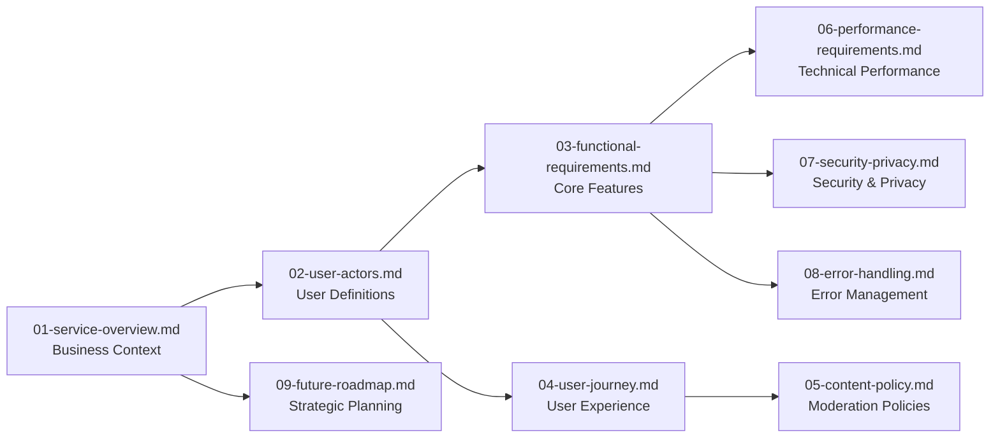

# Economic/Political Discussion Board - Documentation Table of Contents

## Project Overview

This documentation set provides comprehensive requirements and specifications for building a simple economic/political discussion board platform. The system supports discussion posts with image and file attachments, user authentication, and basic moderation capabilities.

**Project Scope**: Minimal, straightforward discussion board focused on economic and political topics with attachment support.

**Key Stakeholders**:
- Business stakeholders defining platform requirements
- Development team implementing the technical solution
- Moderators managing community content
- End users participating in discussions

**Core Business Objectives**:
- Create a dedicated space for thoughtful economic and political conversations
- Support evidence-based discussions with attachment capabilities
- Maintain simple, user-friendly interface that encourages participation
- Ensure respectful discourse through clear moderation guidelines

## Document List

### Core Documentation

**[01-service-overview.md](./01-service-overview.md)** - **Service Overview**
- Executive summary and business model
- Target audience and core value proposition
- Key features and success metrics
- *Audience: Business stakeholders*

**[02-user-actors.md](./02-user-actors.md)** - **User Actors and Authentication**
- Complete user actor definitions (Guest, Member, Moderator)
- Authentication requirements and permission matrix
- Security considerations and actor responsibilities
- *Audience: Development team*

**[03-functional-requirements.md](./03-functional-requirements.md)** - **Functional Requirements**
- Discussion board features and capabilities
- Post creation, management, and attachment handling
- Comment system and content moderation
- Search and discovery functionality
- *Audience: Development team*

**[04-user-journey.md](./04-user-journey.md)** - **User Journey Mapping**
- Guest, member, and moderator interaction flows
- Registration, onboarding, and content creation processes
- Visual flow diagrams for key user scenarios
- *Audience: Product managers*

### Policy and Operations Documentation

**[05-content-policy.md](./05-content-policy.md)** - **Content Policy and Moderation**
- Content guidelines and community standards
- Moderation policies and violation handling
- User reporting system and appeal process
- *Audience: Moderators and administrators*

**[06-performance-requirements.md](./06-performance-requirements.md)** - **Performance Requirements**
- Performance expectations and scalability requirements
- Availability targets and data management
- Backup and recovery procedures
- *Audience: Development team*

**[07-security-privacy.md](./07-security-privacy.md)** - **Security and Privacy**
- Authentication security and data privacy protections
- Content security and user data protection
- Compliance requirements and standards
- *Audience: Development team*

**[08-error-handling.md](./08-error-handling.md)** - **Error Handling and Support**
- User-facing error scenarios and recovery processes
- Support channels and troubleshooting guides
- User-friendly error messaging
- *Audience: Development team*

### Strategic Documentation

**[09-future-roadmap.md](./09-future-roadmap.md)** - **Future Roadmap**
- Phase-based feature development plan
- Long-term vision and enhancement priorities
- Development timeline and prioritization criteria
- *Audience: Business stakeholders*

## Navigation Guide

### Recommended Reading Order

**For Business Stakeholders**:
1. [Service Overview](./01-service-overview.md) - Understand the business context and value proposition
2. [Future Roadmap](./09-future-roadmap.md) - Review strategic development plans
3. [Content Policy](./05-content-policy.md) - Understand community management approach

**For Development Team**:
1. [Service Overview](./01-service-overview.md) - Business context and requirements
2. [User Actors](./02-user-actors.md) - Authentication and permission requirements
3. [Functional Requirements](./03-functional-requirements.md) - Core feature specifications
4. [Performance Requirements](./06-performance-requirements.md) - Technical performance standards
5. [Security and Privacy](./07-security-privacy.md) - Security implementation requirements

**For Moderators**:
1. [Content Policy](./05-content-policy.md) - Moderation guidelines and procedures
2. [User Journey](./04-user-journey.md) - Understanding user interactions and workflows
3. [User Actors](./02-user-actors.md) - Permission levels and responsibilities

### Quick Reference by Topic

**Authentication & Users**: [User Actors](./02-user-actors.md)
- Complete user role definitions and permission matrices
- Authentication flow requirements and security considerations
- User management and session handling specifications

**Core Features**: [Functional Requirements](./03-functional-requirements.md)
- Discussion board functionality specifications
- Post and comment creation requirements
- Attachment handling and content management

**User Experience**: [User Journey](./04-user-journey.md)
- Complete user interaction flows and scenarios
- Registration, onboarding, and content creation processes
- Error handling and recovery procedures

**Content Management**: [Content Policy](./05-content-policy.md)
- Moderation guidelines and community standards
- Violation handling and appeal processes
- Content quality and safety requirements

**Technical Performance**: [Performance Requirements](./06-performance-requirements.md)
- Response time benchmarks and scalability requirements
- Availability targets and data management specifications
- Backup, recovery, and monitoring requirements

## Document Relationships

The documentation follows a logical progression from high-level business requirements to detailed technical specifications:

### Document Dependencies

**Foundation Documents**: [Service Overview](./01-service-overview.md) provides the business context that informs all other documents. This document establishes the core purpose, target audience, and business objectives that guide all subsequent requirements.

**Core Implementation Documents**: [User Actors](./02-user-actors.md) and [Functional Requirements](./03-functional-requirements.md) are prerequisites for technical implementation. These documents define the complete user permission system and feature specifications that developers need to build the platform.

**Operational Documents**: [Content Policy](./05-content-policy.md) builds upon user journey and actor definitions to provide comprehensive moderation guidelines. This document relies on understanding user interactions and permission levels to define effective community management procedures.

**Technical Specifications**: [Performance Requirements](./06-performance-requirements.md) and [Security & Privacy](./07-security-privacy.md) depend on functional requirements to establish appropriate technical standards. These documents translate business needs into measurable performance and security criteria.

### Cross-Reference Usage

When reading any document, refer to related documents for complete context:

**Authentication Implementation**: When implementing user authentication, developers should reference both [User Actors](./02-user-actors.md) for permission definitions and [Security & Privacy](./07-security-privacy.md) for security requirements.

**Moderation Workflows**: Moderators should understand both the technical capabilities defined in [Functional Requirements](./03-functional-requirements.md) and the policy guidelines in [Content Policy](./05-content-policy.md) to effectively manage community content.

**Technical Architecture**: When planning technical architecture, reference [Performance Requirements](./06-performance-requirements.md) for scalability needs and [Security & Privacy](./07-security-privacy.md) for security implementation requirements.

## Document Updates

This table of contents will be updated as new documents are created or existing documents are modified. All documents follow a consistent naming convention and organization structure to facilitate easy navigation.

**Version Control**: Each document maintains version history with change logs to track updates and modifications. When documents are updated, corresponding cross-references in this table of contents will be verified for accuracy.

**Stakeholder Notifications**: Significant document updates will be communicated to relevant stakeholders through appropriate channels to ensure all team members work with current requirements.

> *Developer Note: This document defines **business requirements only**. All technical implementations (architecture, APIs, database design, etc.) are at the discretion of the development team.*