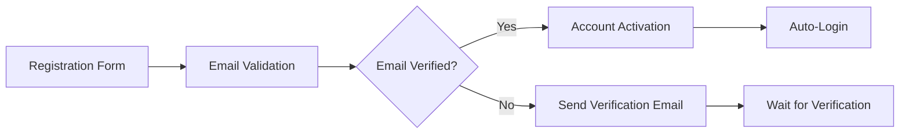
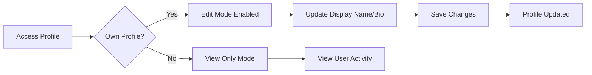
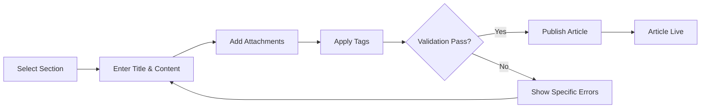
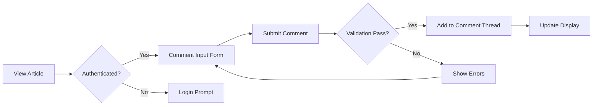
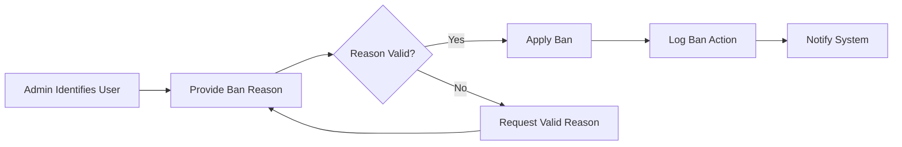

# Economic/Political Discussion Board - Complete Requirements Specification

## Executive Summary

The Economic/Political Discussion Board is a comprehensive online platform designed for structured discourse on economic and political topics. This platform enables users to engage in meaningful discussions through article publishing, commenting, and community interaction within specialized sections managed by an administrative hierarchy.

### Business Context and Value Proposition
The platform addresses the market need for moderated discussion spaces where users can engage in substantive economic and political discourse without the noise and toxicity of general social media platforms. The value proposition centers on quality content, community moderation, and structured discussion organization.

### Target Market Analysis
Primary user segments include:
- Academics and researchers in economics and political science
- Policy professionals and government officials
- Engaged citizens interested in substantive discourse
- Students studying related disciplines

The platform targets users seeking meaningful dialogue rather than rapid-fire social media interactions.

### Success Metrics and Performance Indicators
- **User Engagement**: Daily active users, article creation rate, comment participation
- **Content Quality**: Average article length, comment-to-article ratio, section participation
- **Administrative Efficiency**: Moderation response times, ban appeal handling
- **System Performance**: Page load times, search responsiveness, concurrent user support

## User Actors and Authentication Requirements

### User Role Hierarchy
The system implements a three-tier user hierarchy with clearly defined permission boundaries and escalation paths.

**Regular User (Member)**
- Primary content creator and community participant
- Full access to article creation, commenting, and profile management
- Ability to request administrator privileges through formal process

**Administrator Role**
- Elevated privileges for content moderation and section management
- Retains all regular user capabilities plus administrative functions
- Operates under super administrator supervision

**Super Administrator Role**
- Ultimate system authority with complete oversight capabilities
- Manages administrator appointments, promotions, and demotions
- Cannot be demoted except by another super administrator

### Authentication System Specifications

**User Registration Process**

**Authentication Requirements**
- WHEN a user registers, THE system SHALL validate email format and require minimum 8-character password with mixed character types
- UPON successful registration, THE system SHALL send email verification with 24-hour expiration
- WHERE email verification is completed, THE system SHALL automatically authenticate the user
- IF verification expires, THE system SHALL require re-registration

**Session Management**
- WHEN a user logs in with valid credentials, THE system SHALL generate JWT tokens with 15-minute access token and 7-day refresh token
- THE system SHALL automatically refresh tokens when access tokens expire during active sessions
- IF refresh token validation fails, THE system SHALL require re-authentication

**Security Requirements**
- THE system SHALL implement rate limiting to prevent brute force attacks
- WHERE login attempts exceed 5 failures within 15 minutes, THE system SHALL temporarily lock the account
- PASSWORD changes SHALL invalidate all active sessions immediately

### Permission Matrix

| Action | Regular User | Administrator | Super Administrator |
|--------|--------------|---------------|---------------------|
| Create/Edit Own Articles | ✅ | ✅ | ✅ |
| Delete Own Articles | ✅ | ✅ | ✅ |
| Create Comments | ✅ | ✅ | ✅ |
| Edit Own Profile | ✅ | ✅ | ✅ |
| Submit Admin Request | ✅ | ❌ | ❌ |
| Create/Edit Sections | ❌ | ✅ | ✅ |
| Delete Any Article | ❌ | ✅ | ✅ |
| Delete Any Comment | ❌ | ✅ | ✅ |
| Ban/Unban Users | ❌ | ✅ | ✅ |
| Approve Admin Requests | ❌ | ❌ | ✅ |
| Promote/Demote Admins | ❌ | ❌ | ✅ |

## User Profile Management Requirements

### Profile Data Structure
Each user profile SHALL contain the following information:
- **Required**: User ID, email address, account creation date, account status
- **Optional**: Display name (max 50 characters), biography text (max 500 characters)

### Profile Management Functions

**Profile Editing Workflow**

**Profile Viewing Requirements**
- WHEN viewing any user profile, THE system SHALL display:
  - User display name and biography
  - Complete list of published articles with titles and dates
  - Complete list of comments with preview text and article context
- THE system SHALL never expose user email addresses on public profiles

## Section Management Requirements

### Section Organizational Structure
Sections provide the primary content categorization mechanism for organizing discussions by topic areas.

**Section Data Specifications**
- Each section SHALL have unique name (3-50 characters) and description (10-200 characters)
- Sections SHALL be created and managed exclusively by administrators
- Section statistics SHALL include article count, last activity timestamp, and moderation status

**Section Browsing Interface**
- WHEN users access the platform, THE system SHALL display available sections in logical order
- EACH section entry SHALL show name, description, article count, and recent activity indicator
- SECTION selection SHALL filter article listings to show only content from that section

### Section Administration
- WHEN an administrator creates a section, THE system SHALL validate name uniqueness and description completeness
- SECTION editing SHALL allow modification of name and description while preserving all existing content
- WHERE section deletion is required, THE system SHALL handle content preservation with clear section references

## Article Management Requirements

### Article Creation Specifications

**Required Article Fields**
- **Title**: 3-200 character limit with content validation
- **Content**: 50-10,000 character plain text with basic formatting support
- **Section**: Mandatory selection from available active sections

**Optional Article Features**
- **File Attachments**: Multiple files up to 10MB each, total 50MB per article
- **Image Attachments**: Multiple images up to 5MB each, total 25MB per article
- **Tags**: Multiple free-text tags (max 30 characters each, max 10 tags per article)

**Article Creation Workflow**

### Article Editing and Deletion
- WHEN users edit their articles, THE system SHALL allow modification of all fields including attachments and tags
- ARTICLE deletion SHALL remove all associated comments and attachments permanently
- THE system SHALL maintain edit history with timestamps and modification details

## Article Browsing and Search Requirements

### Article Listing Specifications
- THE system SHALL display article lists showing: title, author display name, tags, comment count, publication timestamp
- LIST views SHALL NOT display full article content, only metadata and title
- PAGINATION SHALL support configurable page sizes with navigation controls

### Sorting and Filtering Capabilities
- WHEN browsing articles, THE system SHALL provide newest-first and oldest-first sorting options
- TAG-based filtering SHALL allow users to narrow listings by multiple tag selections
- SECTION filtering SHALL work in conjunction with other filtering mechanisms

### Search Functionality
- FULL-TEXT search SHALL span article titles and content with relevance ranking
- SEARCH results SHALL maintain pagination and support the same filtering options as browsing
- WHERE multiple filters are applied, THE system SHALL use AND logic for combined filtering

## Comment System Requirements

### Comment Structure and Limitations
- COMMENTS SHALL be single-level only without nested reply functionality
- EACH comment SHALL have maximum 10,000 character limit with basic text formatting
- COMMENT display SHALL show author, content, and timestamp in chronological order

### Comment Management
- USERS SHALL be able to edit and delete their own comments
- ADMINISTRATORS SHALL have authority to delete any comment for moderation purposes
- COMMENT deletion SHALL be permanent with no archive or recovery mechanism

**Comment Creation Workflow**

## Administrator System Requirements

### Administrator Promotion Process
The pathway from regular user to administrator follows a structured approval system with oversight.

**Promotion Request Workflow**
- WHEN a user requests administrator status, THE system SHALL require written justification
- SUPER administrators SHALL review pending requests with approve/reject authority
- WHERE promotion is approved, THE user SHALL immediately receive administrator privileges

**Administrator Hierarchy Management**
- SUPER administrators SHALL have exclusive authority to promote regular administrators to super administrator status
- THE system SHALL prevent self-demotion of super administrators to maintain system oversight
- ADMINISTRATOR demotion SHALL be logged with reasons and oversight documentation

### Administrative Capabilities Matrix

| Administrative Function | Regular Administrator | Super Administrator |
|-------------------------|----------------------|---------------------|
| Section Creation/Editing | ✅ | ✅ |
| Section Deletion | ❌ | ✅ |
| Content Moderation | ✅ | ✅ |
| User Banning | ✅ | ✅ |
| Admin Request Review | ❌ | ✅ |
| Administrator Promotion | ❌ | ✅ |
| Administrator Demotion | ❌ | ✅ |

## Banning System Requirements

### Ban Implementation Process
- WHEN an administrator bans a user, THE system SHALL require documented reason (min 10 characters)
- BANNED users SHALL be immediately logged out and prevented from future authentication
- EXISTING content from banned users SHALL remain visible with appropriate status indications

### Ban Management Interface
- ADMINISTRATORS SHALL access a comprehensive ban management dashboard
- THE interface SHALL provide search, filtering, and bulk operation capabilities
- BAN records SHALL include user information, reason, date, and administering administrator

**Banning Workflow**

### Unbanning Process
- WHEN an administrator unbans a user, THE system SHALL immediately restore all access privileges
- UNBAN actions SHALL be logged alongside original ban records for complete history
- UNBANNED users SHALL regain full platform access without additional restrictions

## Business Rules and Constraints

### Content Validation Rules
- ARTICLE titles SHALL be unique within their respective sections to prevent duplication
- USER display names SHALL be unique across the entire platform
- CONTENT moderation SHALL follow predefined community guidelines consistently

### Performance Requirements
- ARTICLE listings SHALL load within 2 seconds under normal operational conditions
- SEARCH functionality SHALL return results within 3 seconds for typical query volumes
- COMMENT display SHALL be instantaneous for articles with up to 100 comments

### Security Requirements
- USER authentication SHALL enforce strong password policies with complexity requirements
- FILE uploads SHALL undergo security scanning and type validation
- ADMINISTRATIVE actions SHALL be comprehensively logged for audit purposes

## Error Handling Requirements

### User-Facing Error Management
- WHEN authentication fails, THE system SHALL provide clear error messages without exposing security details
- WHERE content validation fails, THE system SHALL indicate specific field requirements
- IF system errors occur, THE system SHALL maintain graceful degradation with appropriate user notifications

### Administrative Error Handling
- ADMINISTRATIVE functions SHALL include comprehensive validation to prevent invalid operations
- ERROR conditions SHALL be logged with sufficient detail for troubleshooting
- SYSTEM shall prevent administrative actions that would compromise platform integrity

## Success Criteria and Acceptance Metrics

### Functional Validation Metrics
- ALL user registration and authentication workflows SHALL function correctly with 99.9% reliability
- CONTENT creation and management SHALL maintain data integrity across all operations
- ADMINISTRATIVE functions SHALL enforce proper role-based access control without exceptions

### User Experience Metrics
- SYSTEM responsiveness SHALL meet all specified performance requirements under expected load
- CONTENT discovery through browsing and search SHALL be intuitive and efficient
- ADMINISTRATIVE tools SHALL provide comprehensive capabilities without unnecessary complexity

### Operational Metrics
- SYSTEM uptime SHALL maintain 99.5% availability during peak usage periods
- DATA backup and recovery procedures SHALL support complete system restoration within 4 hours
- SECURITY monitoring SHALL detect and alert on suspicious activities within 15 minutes

This comprehensive requirements specification provides the complete business foundation for developing the Economic/Political Discussion Board platform. The document focuses exclusively on business requirements, leaving all technical implementation decisions to the discretion of the development team based on established software engineering best practices.